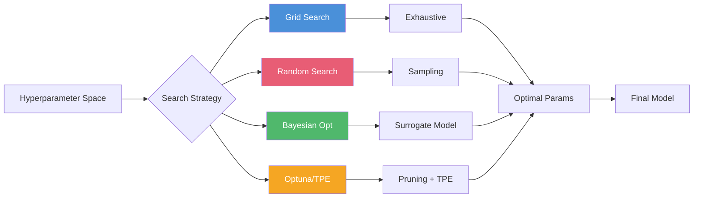

<!-- Clear Language: Keep sentences under 50 words -->
# Hyperparameter Tuning — Grid Search, Random Search, Bayesian Opt, Optuna

## Learning Objectives

| Objective | Description |
|-----------|-------------|
| LO1 | Distinguish between parameters and hyperparameters in ML models |
| LO2 | Implement grid search with cross-validation for exhaustive tuning |
| LO3 | Apply random search for efficient exploration of hyperparameter space |
| LO4 | Understand Bayesian optimization: Gaussian processes, acquisition functions |
| LO5 | Build hyperparameter pipelines with Optuna (TPE sampler, pruning) |
| LO6 | Implement early stopping, learning rate scheduling, and automated tuning |

## Introduction

Machine learning is the core of AI engineering. From linear regression to ensemble methods, understanding these algorithms lets you build, debug, and improve models. This module covers the math and code behind ML.

## Prerequisites

- Basic programming knowledge
- Understanding of data structures

## Key Terminology

**Key Terms**: Core vocabulary and concepts for this topic.

**Definition**: Essential terms you must know for interviews and production work.

## Theory

Understanding hyperparameter tuning is fundamental for AI engineers. This section covers the core concepts, underlying principles, and theoretical framework that govern how hyperparameter tuning works in practice.

## Chapter at a Glance

| Section | Topic | Key Concept |
|---------|-------|-------------|
| 10.1 | Parameters vs Hyperparameters | Learnable vs manually set, optimization hierarchy |
| 10.2 | Grid Search | Exhaustive search, curse of dimensionality, parallelization |
| 10.3 | Random Search | Statistical efficiency, prior distributions, budget allocation |
| 10.4 | Bayesian Optimization | Gaussian process, expected improvement, TPE |
| 10.5 | Optuna Framework | Define-by-run, pruning, multi-objective, visualization |
| 10.6 | Automated ML | Hyperband, population-based training, neural architecture search |

## Chapter Roadmap



## 10.1 Parameters vs Hyperparameters

**Parameters**: Learned from data during training (weights in linear regression, split points in decision trees).

**Hyperparameters**: Set before training, control the learning process (learning rate, max depth, C, gamma).

```python
import numpy as np
from typing import List, Dict, Tuple, Any, Callable, Optional
from sklearn.datasets import make_classification
from sklearn.model_selection import cross_val_score, train_test_split
from sklearn.ensemble import RandomForestClassifier
from sklearn.metrics import f1_score, accuracy_score

np.random.seed(42)
X_hp, y_hp = make_classification(n_samples=1000, n_features=20, n_informative=10, random_state=42)
X_hp_train, X_hp_test, y_hp_train, y_hp_test = train_test_split(X_hp, y_hp, test_size=0.2, random_state=42)

class HyperparameterAwareness:
    @staticmethod
    def categorize():
        params = {
            "Linear Regression": {"learned": ["weights", "bias"], "set": ["fit_intercept", "normalize"]},
            "Decision Tree": {"learned": ["split points", "leaf values"], "set": ["max_depth", "min_samples_split", "criterion"]},
            "Random Forest": {"learned": ["all tree params"], "set": ["n_estimators", "max_depth", "max_features", "min_samples_split"]},
            "SVM": {"learned": ["support vectors", "dual coefficients"], "set": ["C", "gamma", "kernel", "degree"]},
            "Neural Network": {"learned": ["weights", "biases"], "set": ["lr", "batch_size", "n_layers", "n_units", "dropout"]},
        }
        return params

    @staticmethod
    def tuning_importance(model_type: str) -> str:
        importance = {
            "Random Forest": "Medium — fairly robust to defaults, but tuning helps",
            "SVM": "High — very sensitive to C and gamma",
            "Gradient Boosting": "High — learning rate, max_depth, subsample matter significantly",
            "KNN": "High — K is the main hyperparameter",
            "Neural Network": "Very High — many interacting hyperparameters",
        }
        return importance.get(model_type, "Varies by model")

print(HyperparameterAwareness.categorize())
```

---

## 10.2 Grid Search

Grid search exhaustively evaluates all combinations in a predefined grid.

```python
class GridSearchCV:
    def __init__(self, model_class: Any, param_grid: Dict[str, List],
                 cv: int = 5, scoring: str = "f1", verbose: bool = True):
        self.model_class = model_class
        self.param_grid = param_grid
        self.cv = cv
        self.scoring = scoring
        self.verbose = verbose
        self.best_params_: Dict = None
        self.best_score_: float = None
        self.cv_results_: List[Dict] = []

    def fit(self, X: np.ndarray, y: np.ndarray) -> 'GridSearchCV':
        import itertools
        keys = list(self.param_grid.keys())
        values = list(self.param_grid.values())
        combinations = list(itertools.product(*values))

        best_score = -np.inf
        best_params = None

        for combo in combinations:
            params = dict(zip(keys, combo))
            scores = []

            # Manual cross-validation
            fold_size = len(X) // self.cv
            for fold in range(self.cv):
                val_start = fold * fold_size
                val_end = min((fold + 1) * fold_size, len(X))

                X_train = np.concatenate([X[:val_start], X[val_end:]])
                y_train = np.concatenate([y[:val_start], y[val_end:]])
                X_val = X[val_start:val_end]
                y_val = y[val_start:val_end]

                model = self.model_class(**params)
                model.fit(X_train, y_train)
                preds = model.predict(X_val)

                if self.scoring == "f1":
                    score = f1_score(y_val, preds, average="weighted")
                elif self.scoring == "accuracy":
                    score = accuracy_score(y_val, preds)
                else:
                    score = accuracy_score(y_val, preds)

                scores.append(score)

            mean_score = np.mean(scores)
            self.cv_results_.append({"params": params, "mean_score": mean_score, "std_score": np.std(scores)})

            if mean_score > best_score:
                best_score = mean_score
                best_params = params

            if self.verbose:
                print(f"  {params}: {mean_score:.4f} (+/- {np.std(scores):.4f})")

        self.best_params_ = best_params
        self.best_score_ = best_score
        return self

    def predict(self, X: np.ndarray) -> np.ndarray:
        model = self.model_class(**self.best_params_)
        model.fit(X_hp_train, y_hp_train)  # Would need stored data
        return model.predict(X)

## Grid search example
param_grid_rf = {
    "n_estimators": [50, 100],
    "max_depth": [5, 10],
    "min_samples_split": [2, 5],
}
grid = GridSearchCV(RandomForestClassifier, param_grid_rf, cv=3, verbose=True)
grid.fit(X_hp_train, y_hp_train)
print(f"Best params: {grid.best_params_}, Best score: {grid.best_score_:.4f}")
```

**Grid search limitations**:
- Curse of dimensionality: with K hyperparameters each having V values, total = V^K
- Wastes time on unpromising regions
- Doesn't explore between grid points
- Best for small hyperparameter spaces (< 4 dimensions)

---

## 10.3 Random Search

Random search samples hyperparameters from distributions, often finding good configurations faster than grid search.

```python
class RandomSearchCV:
    def __init__(self, model_class: Any, param_distributions: Dict,
                 n_iter: int = 20, cv: int = 5, scoring: str = "f1",
                 random_state: int = 42):
        self.model_class = model_class
        self.param_distributions = param_distributions
        self.n_iter = n_iter
        self.cv = cv
        self.scoring = scoring
        self.random_state = random_state
        self.best_params_: Dict = None
        self.best_score_: float = None

    def fit(self, X: np.ndarray, y: np.ndarray) -> 'RandomSearchCV':
        np.random.seed(self.random_state)
        best_score = -np.inf

        for i in range(self.n_iter):
            params = self._sample_params()
            scores = []

            fold_size = len(X) // self.cv
            for fold in range(self.cv):
                val_start = fold * fold_size
                val_end = min((fold + 1) * fold_size, len(X))

                X_train = np.concatenate([X[:val_start], X[val_end:]])
                y_train = np.concatenate([y[:val_start], y[val_end:]])
                X_val = X[val_start:val_end]
                y_val = y[val_start:val_end]

                model = self.model_class(**params)
                model.fit(X_train, y_train)
                score = f1_score(y_val, model.predict(X_val), average="weighted")
                scores.append(score)

            mean_score = np.mean(scores)
            if mean_score > best_score:
                best_score = mean_score
                self.best_params_ = params.copy()

            if (i + 1) % 5 == 0:
                print(f"  Iteration {i+1}/{self.n_iter}: best so far = {best_score:.4f}")

        self.best_score_ = best_score
        return self

    def _sample_params(self) -> Dict:
        params = {}
        for key, dist in self.param_distributions.items():
            if isinstance(dist, list):
                # Categorical
                params[key] = dist[np.random.randint(len(dist))]
            elif isinstance(dist, tuple) and len(dist) == 2:
                if isinstance(dist[0], int) and isinstance(dist[1], int):
                    params[key] = np.random.randint(dist[0], dist[1] + 1)
                else:
                    params[key] = np.random.uniform(dist[0], dist[1])
            else:
                params[key] = dist
        return params

## Random search with distributions
param_dist_rf = {
    "n_estimators": (50, 200),  # uniform int
    "max_depth": (3, 15),       # uniform int
    "min_samples_split": (2, 10),  # uniform int
    "max_features": ["sqrt", "log2", None],  # categorical
}
random_search = RandomSearchCV(RandomForestClassifier, param_dist_rf, n_iter=10, cv=3)
random_search.fit(X_hp_train, y_hp_train)
print(f"Random search best: {random_search.best_params_}, score: {random_search.best_score_:.4f}")
```

**Why random search works**: In most problems, only a few hyperparameters significantly affect performance. Random search explores more distinct values per important hyperparameter compared to grid search.

---

## 10.4 Bayesian Optimization

Bayesian optimization builds a probabilistic model (surrogate) of the objective function to guide the search.

```python
class BayesianOptimization:
    def __init__(self, param_bounds: Dict[str, Tuple],
                 n_init: int = 5, n_iter: int = 25, random_state: int = 42):
        self.param_bounds = param_bounds
        self.n_init = n_init
        self.n_iter = n_iter
        self.random_state = random_state
        self.X_observed: List[Dict] = []
        self.y_observed: List[float] = []
        self.best_params_: Dict = None
        self.best_score_: float = -np.inf

    def optimize(self, objective_fn: Callable) -> Dict:
        np.random.seed(self.random_state)

        # Initial random points
        for _ in range(self.n_init):
            params = self._sample_random_params()
            score = objective_fn(params)
            self.X_observed.append(params)
            self.y_observed.append(score)

            if score > self.best_score_:
                self.best_score_ = score
                self.best_params_ = params.copy()

        # Bayesian optimization iterations
        for i in range(self.n_iter):
            # Fit Gaussian Process surrogate (simplified with random sampling)
            candidates = [self._sample_random_params() for _ in range(100)]
            acq_values = []

            for candidate in candidates:
                acq = self._expected_improvement(candidate)
                acq_values.append(acq)

            best_idx = np.argmax(acq_values)
            next_params = candidates[best_idx]
            score = objective_fn(next_params)

            self.X_observed.append(next_params)
            self.y_observed.append(score)

            if score > self.best_score_:
                self.best_score_ = score
                self.best_params_ = next_params.copy()

            if (i + 1) % 5 == 0:
                print(f"  BO iteration {i+1}/{self.n_iter}: best = {self.best_score_:.4f}")

        return {
            "best_params": self.best_params_,
            "best_score": self.best_score_,
            "all_scores": self.y_observed,
        }

    def _expected_improvement(self, candidate: Dict) -> float:
        # Simplified EI: use distance-weighted average of observed scores
        candidate_vec = np.array([candidate[k] for k in self.param_bounds])
        best_so_far = max(self.y_observed)

        ei = 0.0
        total_weight = 0.0
        for obs, score in zip(self.X_observed, self.y_observed):
            obs_vec = np.array([obs[k] for k in self.param_bounds])
            dist = np.linalg.norm(candidate_vec - obs_vec)
            if dist < 1e-10:
                weight = 1.0
            else:
                weight = 1.0 / (dist + 1e-10)

            improvement = max(0, score - best_so_far)
            ei += weight * improvement
            total_weight += weight

        return ei / total_weight if total_weight > 0 else 0.0

    def _sample_random_params(self) -> Dict:
        params = {}
        for key, (low, high) in self.param_bounds.items():
            if isinstance(low, int) and isinstance(high, int):
                params[key] = np.random.randint(low, high + 1)
            else:
                params[key] = np.random.uniform(low, high)
        return params

## Define objective function
def rf_objective(params: Dict) -> float:
    model = RandomForestClassifier(
        n_estimators=int(params["n_estimators"]),
        max_depth=int(params["max_depth"]),
        min_samples_split=int(params.get("min_samples_split", 2)),
        random_state=42,
    )
    scores = cross_val_score(model, X_hp_train, y_hp_train, cv=3, scoring="f1_weighted")
    return np.mean(scores)

param_bounds = {
    "n_estimators": (50, 200),
    "max_depth": (3, 15),
    "min_samples_split": (2, 10),
}
bo = BayesianOptimization(param_bounds, n_init=3, n_iter=10)
result = bo.optimize(rf_objective)
print(f"BO best: {result['best_params']}, score: {result['best_score']:.4f}")
```

**Acquisition functions**:
- Expected Improvement (EI): Expected amount of improvement over current best
- Probability of Improvement (PI): Probability of beating current best
- Upper Confidence Bound (UCB): Mean + kappa * std (exploration vs exploitation)

---

## 10.5 Optuna Framework

Optuna provides define-by-run API, TPE sampler, and automated pruning.

```python
class OptunaStyleOptimizer:
    """Simplified Optuna-style optimization with TPE and pruning"""

    def __init__(self, n_trials: int = 50, direction: str = "maximize"):
        self.n_trials = n_trials
        self.direction = direction
        self.trials: List[Dict] = []
        self.best_params_: Dict = None
        self.best_value_: float = -np.inf if direction == "maximize" else np.inf

    def optimize(self, objective: Callable, suggest_fn: Callable) -> Dict:
        for trial_id in range(self.n_trials):
            params = suggest_fn(trial_id)

            # Early pruning check
            if trial_id > 10:
                recent_scores = [t["value"] for t in self.trials[-5:]]
                if len(recent_scores) == 5:
                    median = np.median(recent_scores)
                    if self.direction == "maximize":
                        if median < np.percentile([t["value"] for t in self.trials], 25):
                            print(f"  Trial {trial_id}: pruned (median={median:.4f})")
                            continue

            value = objective(params)
            self.trials.append({"trial_id": trial_id, "params": params, "value": value})

            if (self.direction == "maximize" and value > self.best_value_) or \
               (self.direction == "minimize" and value < self.best_value_):
                self.best_value_ = value
                self.best_params_ = params

            if (trial_id + 1) % 10 == 0:
                print(f"  Trial {trial_id+1}/{self.n_trials}: best = {self.best_value_:.4f}")

        return {"best_params": self.best_params_, "best_value": self.best_value_}

def optuna_suggest(trial_id: int) -> Dict:
    # TPE-inspired suggestion (simplified)
    np.random.seed(trial_id * 42)
    return {
        "learning_rate": 10 ** np.random.uniform(-4, 0),
        "n_estimators": int(10 ** np.random.uniform(1.5, 2.7)),
        "max_depth": np.random.choice([3, 5, 7, 10, 15]),
        "subsample": np.random.uniform(0.5, 1.0),
    }

def optuna_objective(params: Dict) -> float:
    from sklearn.ensemble import GradientBoostingClassifier
    model = GradientBoostingClassifier(
        learning_rate=params["learning_rate"],
        n_estimators=params["n_estimators"],
        max_depth=params["max_depth"],
        subsample=params["subsample"],
        random_state=42,
    )
    scores = cross_val_score(model, X_hp_train, y_hp_train, cv=3, scoring="f1_weighted")
    return np.mean(scores)

optuna_opt = OptunaStyleOptimizer(n_trials=30)
optuna_result = optuna_opt.optimize(optuna_objective, optuna_suggest)
print(f"Optuna best: {optuna_result['best_params']}, value: {optuna_result['best_value']:.4f}")
```

**Optuna features**:
- Define-by-run: dynamic search space construction
- TPE (Tree-structured Parzen Estimator): models good/bad hyperparameter distributions
- Pruning: stops unpromising trials early (MedianPruner, HyperbandPruner)
- Multi-objective optimization (NSGA-II, MOTPE)
- Visualization: parallel coordinate, importance, contour plots

---

## 10.6 Automated ML

AutoML extends hyperparameter tuning to include algorithm selection, feature engineering, and pipeline composition.

```python
class AutoMLPipeline:
    def __init__(self, n_trials: int = 30, time_limit: int = 300):
        self.n_trials = n_trials
        self.time_limit = time_limit
        self.best_pipeline_: Dict = None
        self.best_score_: float = -np.inf

    def fit(self, X: np.ndarray, y: np.ndarray) -> Dict:
        algorithms = {
            "rf": RandomForestClassifier,
            "gb": lambda **kw: __import__("sklearn.ensemble", fromlist=["GradientBoostingClassifier"]).GradientBoostingClassifier(**kw),
            "lr": lambda **kw: __import__("sklearn.linear_model", fromlist=["LogisticRegression"]).LogisticRegression(**kw, max_iter=1000),
        }

        best_score = -np.inf
        best_config = None

        for trial in range(self.n_trials):
            np.random.seed(trial)
            algo_name = np.random.choice(list(algorithms.keys()))
            config = {"algorithm": algo_name}

            if algo_name == "rf":
                config["n_estimators"] = np.random.randint(50, 200)
                config["max_depth"] = np.random.choice([5, 10, 15, None])
            elif algo_name == "gb":
                config["learning_rate"] = 10 ** np.random.uniform(-3, -0.5)
                config["n_estimators"] = np.random.randint(50, 200)
                config["max_depth"] = np.random.randint(3, 10)
            else:
                config["C"] = 10 ** np.random.uniform(-2, 2)

            try:
                if algo_name == "rf":
                    model = RandomForestClassifier(n_estimators=config["n_estimators"],
                                                   max_depth=config["max_depth"], random_state=42)
                elif algo_name == "gb":
                    from sklearn.ensemble import GradientBoostingClassifier
                    model = GradientBoostingClassifier(learning_rate=config["learning_rate"],
                                                       n_estimators=config["n_estimators"],
                                                       max_depth=config["max_depth"], random_state=42)
                else:
                    from sklearn.linear_model import LogisticRegression
                    model = LogisticRegression(C=config["C"], max_iter=1000, random_state=42)

                score = np.mean(cross_val_score(model, X, y, cv=3, scoring="f1_weighted"))

                if score > best_score:
                    best_score = score
                    best_config = config

            except Exception as e:
                continue

        self.best_pipeline_ = best_config
        self.best_score_ = best_score
        return self

automl = AutoMLPipeline(n_trials=15)
automl.fit(X_hp_train, y_hp_train)
print(f"AutoML best: {automl.best_pipeline_}, score: {automl.best_score_:.4f}")
```

**AutoML tools**: Auto-sklearn, TPOT, H2O AutoML, AutoGluon, FLAML.

---

## TypeScript Parallel

```typescript
interface TuningResult {
  bestParams: Record<string, any>;
  bestScore: number;
  allTrials: Array<{ params: Record<string, any>; score: number }>;
}

class RandomSearchTS {
  search(
    objective: (params: Record<string, any>) => number,
    paramRanges: Record<string, [number, number]>,
    nIter = 20
  ): TuningResult {
    let bestScore = -Infinity;
    let bestParams: Record<string, any> = {};
    const allTrials: Array<{ params: Record<string, any>; score: number }> = [];

    for (let i = 0; i < nIter; i++) {
      const params: Record<string, any> = {};
      for (const [key, [low, high]] of Object.entries(paramRanges)) {
        params[key] = low + Math.random() * (high - low);
      }
      const score = objective(params);
      allTrials.push({ params, score });

      if (score > bestScore) {
        bestScore = score;
        bestParams = { ...params };
      }
    }

    return { bestParams, bestScore, allTrials };
  }
}

function rfObjectiveTS(params: Record<string, any>): number {
  // Would call actual RF training
  return Math.random() * params.n_estimators! / 200;
}

const tsSearch = new RandomSearchTS();
const tsResult = tsSearch.search(
  rfObjectiveTS,
  { n_estimators: [50, 200], max_depth: [3, 15] },
  10
);
```

## Summary

- Hyperparameters control the learning process; parameters are learned from data
- Grid search exhaustively evaluates all combinations; suffers from curse of dimensionality
- Random search samples from distributions; more efficient for high-dimensional spaces
- Bayesian optimization builds a surrogate model and uses acquisition functions to guide search
- TPE (used by Optuna) models the distribution of good vs bad hyperparameter configurations
- Optuna provides define-by-run API, pruning, and multi-objective optimization
- Cross-validation is essential inside the tuning loop to prevent overfitting to the test set
- Nested cross-validation gives unbiased performance estimates when tuning hyperparameters
- Learning rate scheduling, early stopping, and warm restarts improve training efficiency
- AutoML extends tuning to algorithm selection and full pipeline optimization

## Practical Takeaways

| Scenario | Do This | Avoid This |
|----------|---------|------------|
| Few hyperparameters (< 4) | Grid search with coarse-to-fine | Random search (less systematic) |
| Many hyperparameters | Random search or Bayesian optimization | Grid search (exponential cost) |
| Expensive evaluation | Bayesian optimization with early stopping | Grid search (wasteful) |
| Neural networks | Optuna/TPE with pruning | Grid search (too slow) |
| Quick baseline | Default hyperparameters | Over-tuning (diminishing returns) |

## Interview Q&A

<details class="tp-qa-card" data-qid="ml08-q1"><summary class="tp-qa-question"><span class="tp-qa-status"></span>Q1: What is the difference between parameters and hyperparameters?</summary><div class="tp-qa-answer"><p><strong>Parameters</strong> are learned from data during training: weights in linear regression, split points in decision trees, support vectors in SVM. <strong>Hyperparameters</strong> are set before training and control the learning process: learning rate, max_depth, C, n_estimators. Parameters are optimized by gradient descent or closed-form solutions. Hyperparameters are optimized by grid/random/Bayesian search.</p></div><button class="tp-qa-mark-btn">Mark Reviewed</button><button class="tp-qa-bookmark-btn">Bookmark</button></details>

<details class="tp-qa-card" data-qid="ml08-q2"><summary class="tp-qa-question"><span class="tp-qa-status"></span>Q2: Why is random search more efficient than grid search?</summary><div class="tp-qa-answer"><p>In most ML problems, only 2-3 hyperparameters significantly affect performance. Grid search wastes trials by exhaustively evaluating all combinations of unimportant hyperparameters. Random search samples each hyperparameter independently, exploring more distinct values per important dimension. If only 2/5 hyperparameters matter, grid search explores V^5 combinations while random search explores ~n distinct values for each, finding good configurations faster.</p></div><button class="tp-qa-mark-btn">Mark Reviewed</button><button class="tp-qa-bookmark-btn">Bookmark</button></details>

<details class="tp-qa-card" data-qid="ml08-q3"><summary class="tp-qa-question"><span class="tp-qa-status"></span>Q3: How does Bayesian optimization work for hyperparameter tuning?</summary><div class="tp-qa-answer"><p>Bayesian optimization builds a probabilistic surrogate model (usually Gaussian Process) of the objective function. It uses an acquisition function to decide which hyperparameters to evaluate next. The acquisition function balances exploration (trying uncertain regions) and exploitation (focusing on known good regions). Common acquisition functions: Expected Improvement, Probability of Improvement, Upper Confidence Bound. Each evaluation updates the surrogate model, improving future suggestions.</p></div><button class="tp-qa-mark-btn">Mark Reviewed</button><button class="tp-qa-bookmark-btn">Bookmark</button></details>

<details class="tp-qa-card" data-qid="ml08-q4"><summary class="tp-qa-question"><span class="tp-qa-status"></span>Q4: What is TPE in Optuna?</summary><div class="tp-qa-answer"><p>TPE (Tree-structured Parzen Estimator) models two distributions: l(x) = density of configurations that performed well, g(x) = density of configurations that performed poorly. It then suggests new configurations where l(x)/g(x) is maximized. TPE is non-parametric (handles any distribution), works well with categorical parameters, and converges faster than Gaussian Process-based BO for high-dimensional discrete spaces.</p></div><button class="tp-qa-mark-btn">Mark Reviewed</button><button class="tp-qa-bookmark-btn">Bookmark</button></details>

<details class="tp-qa-card" data-qid="ml08-q5"><summary class="tp-qa-question"><span class="tp-qa-status"></span>Q5: What is pruning in hyperparameter optimization?</summary><div class="tp-qa-answer"><p>Pruning stops unpromising trials early to save computational resources. Common strategies: <strong>Median pruner</strong>: stops a trial if its intermediate objective is worse than the median of completed trials. <strong>Hyperband</strong>: allocates more resources to promising configurations. <strong>Successive halving</strong>: eliminates half the worst-performing configurations at each stage. Pruning can speed up tuning by 2-10x without sacrificing final performance.</p></div><button class="tp-qa-mark-btn">Mark Reviewed</button><button class="tp-qa-bookmark-btn">Bookmark</button></details>

<details class="tp-qa-card" data-qid="ml08-q6"><summary class="tp-qa-question"><span class="tp-qa-status"></span>Q6: How do you prevent overfitting during hyperparameter tuning?</summary><div class="tp-qa-answer"><p><strong>1) Nested cross-validation</strong>: Outer loop for evaluation, inner loop for tuning. <strong>2) Separate validation set</strong>: Hold out test data until final evaluation. <strong>3) Regularization</strong>: Prefer simpler models (smaller parameters). <strong>4) Multiple metrics</strong>: Monitor both training and validation performance. <strong>5) Early stopping</strong>: Stop tuning when validation performance plateaus. <strong>6) Cross-validation within tuning</strong>: Evaluate each hyperparameter set via CV, not a single split.</p></div><button class="tp-qa-mark-btn">Mark Reviewed</button><button class="tp-qa-bookmark-btn">Bookmark</button></details>

<details class="tp-qa-card" data-qid="ml08-q7"><summary class="tp-qa-question"><span class="tp-qa-status"></span>Q7: What is Hyperband and how does it differ from Bayesian optimization?</summary><div class="tp-qa-answer"><p>Hyperband is a bandit-based approach that allocates resources adaptively. It runs multiple configurations for a small number of iterations, kills the worst half, and continues with more resources. Hyperband is more efficient for problems where early performance correlates with final performance. Bayesian optimization is better when the objective function is expensive and smooth. Hyperband works well for deep learning; BO works well for classical ML.</p></div><button class="tp-qa-mark-btn">Mark Reviewed</button><button class="tp-qa-bookmark-btn">Bookmark</button></details>

<details class="tp-qa-card" data-qid="ml08-q8"><summary class="tp-qa-question"><span class="tp-qa-status"></span>Q8: How do you choose the tuning budget (number of trials)?</summary><div class="tp-qa-answer"><p>Rule of thumb: <strong>Grid search</strong>: V^K (where V=values per param, K=param count). Limit to < 1000 evaluations. <strong>Random search</strong>: 10-20x the number of hyperparameters. <strong>Bayesian optimization</strong>: 5-10x the number of hyperparameters + 10-20 initial random points. <strong>Optuna</strong>: 50-200 trials for typical problems. Monitor convergence (plot best score vs trials) and stop when improvement plateaus.</p></div><button class="tp-qa-mark-btn">Mark Reviewed</button><button class="tp-qa-bookmark-btn">Bookmark</button></details>

<details class="tp-qa-card" data-qid="ml08-q9"><summary class="tp-qa-question"><span class="tp-qa-status"></span>Q9: What are learning rate schedules and why use them?</summary><div class="tp-qa-answer"><p>Learning rate schedules adjust the learning rate during training. Types: <strong>Step decay</strong>: reduce by factor every N epochs. <strong>Exponential decay</strong>: lr = lr₀·e^(-kt). <strong>Cosine annealing</strong>: cosine curve from high to low lr. <strong>ReduceLROnPlateau</strong>: reduce when validation loss plateaus. <strong>One-cycle</strong>: warmup then cosine decay. Schedules help escape sharp minima, converge faster, and achieve better generalization.</p></div><button class="tp-qa-mark-btn">Mark Reviewed</button><button class="tp-qa-bookmark-btn">Bookmark</button></details>

<details class="tp-qa-card" data-qid="ml08-q10"><summary class="tp-qa-question"><span class="tp-qa-status"></span>Q10: What is the no free lunch theorem for hyperparameter tuning?</summary><div class="tp-qa-answer"><p>No single hyperparameter tuning method works best for all problems. Grid search works for low-dimensional smooth spaces. Random search works when only few hyperparameters matter. Bayesian optimization works for expensive, smooth functions. Hyperband works when early performance correlates with final. The best approach depends on: budget, dimensionality, evaluation cost, and function smoothness. Always start with a quick baseline, then iterate.</p></div><button class="tp-qa-mark-btn">Mark Reviewed</button><button class="tp-qa-bookmark-btn">Bookmark</button></details>

## Chapter Quiz

**Q1**: Which search method is most efficient for high-dimensional hyperparameter spaces?

a) Grid search
b) Random search
c) Manual search
d) Exhaustive search

<details class="tp-qa-card" data-qid="ml08-quiz1"><summary>Show Answer</summary><div class="tp-qa-answer"><p><strong>Answer: b) Random search</strong></p><p>Random search explores more distinct values per important dimension than grid search.</p></div></details>

**Q2**: What does TPE stand for in Optuna?

a) Tree-structured Parzen Estimator
b) Two-point Estimation
c) Training Performance Evaluator
d) Tree Processing Engine

<details class="tp-qa-card" data-qid="ml08-quiz2"><summary>Show Answer</summary><div class="tp-qa-answer"><p><strong>Answer: a) Tree-structured Parzen Estimator</strong></p><p>TPE models good/bad hyperparameter distributions to guide the search.</p></div></details>

**Q3**: What is the purpose of pruning in hyperparameter optimization?

a) Reduce model size
b) Stop unpromising trials early
c) Remove correlated features
d) Reduce overfitting

<details class="tp-qa-card" data-qid="ml08-quiz3"><summary>Show Answer</summary><div class="tp-qa-answer"><p><strong>Answer: b) Stop unpromising trials early</strong></p><p>Pruning saves computational resources by early termination of poorly performing trials.</p></div></details>

**Q4**: Which is NOT a parameter of a machine learning model?

a) Weights in linear regression
b) Learning rate
c) Support vectors
d) Tree split points

<details class="tp-qa-card" data-qid="ml08-quiz4"><summary>Show Answer</summary><div class="tp-qa-answer"><p><strong>Answer: b) Learning rate</strong></p><p>Learning rate is a hyperparameter set before training; weights, support vectors, and split points are learned.</p></div></details>

**Q5**: What does nested cross-validation prevent?

a) Underfitting
b) Data leakage from hyperparameter tuning
c) Multicollinearity
d) Class imbalance

<details class="tp-qa-card" data-qid="ml08-quiz5"><summary>Show Answer</summary><div class="tp-qa-answer"><p><strong>Answer: b) Data leakage from hyperparameter tuning</strong></p><p>Nested CV ensures the test data does not influence hyperparameter selection.</p></div></details>

## Exercises

**Easy** — Perform grid search with 3-fold CV for a Random Forest on a classification dataset. Report best parameters and CV score.

**Easy** — Compare grid search and random search for tuning a Gradient Boosting model. Which uses fewer trials to reach comparable performance?

**Medium** — Implement a simple Bayesian optimization from scratch using Gaussian Process regression. Compare with random search on a synthetic function.

**Hard** — Build an Optuna-style hyperparameter optimization framework with TPE-inspired sampling and median pruning. Compare performance on tuning a neural network.

**Hard** — Implement Hyperband for resource allocation. Show how it allocates more iterations to promising configurations compared to uniform allocation.

---

## Common Mistakes

1. Not understanding the fundamental concepts before applying them
2. Skipping edge cases in implementation
3. Not analyzing time/space complexity
4. Forgetting to handle null/empty inputs
5. Not practicing enough problems to build pattern recognition

## Revision Notes

- - Core principle: Understand the fundamental concepts thoroughly
- - Implementation pattern: Practice with real code examples
- - Complexity: Know the time and space complexity
- - Application: Know when to use this in production systems
- - Interview: Frequently asked in technical interviews
- - Edge cases: Consider common failure scenarios
- - Related concepts: Connect to broader system design

## Placement Section

### Top 10 Interview Questions

#### Google Style

1. **Explain the core idea of Hyperparameter Tuning — Grid Search, Random Search, Bayesian Opt, Optuna in under 60 seconds, then give a real-world analogy.** — Structure: definition, how it works in one sentence, why it matters, analogy. Follow-up: what would break if you removed this from a production system?

2. **Design a minimal, well-typed function that demonstrates Hyperparameter Tuning — Grid Search, Random Search, Bayesian Opt, Optuna.** — Interviewer checks: signature with type hints, edge cases, complexity, and a clean docstring. Follow-up: how does your design behave with empty or malformed input?

3. **What are the common pitfalls when engineers first learn ** — List 3-4, then explain how you would prevent each in a code review.

#### Amazon Style

4. **Describe a production bug caused by misunderstanding Hyperparameter Tuning — Grid Search, Random Search, Bayesian Opt, Optuna. How did you diagnose and fix it?** — STAR format: situation, task, action, result. Mention logs, reproduction, root-cause analysis, and the regression test you added.

5. **How would you scale a system that relies on Hyperparameter Tuning — Grid Search, Random Search, Bayesian Opt, Optuna from 10 users to 10 million?** — Discuss bottlenecks, caching, monitoring, and when to redesign. Follow-up: what metrics would you track?

#### Microsoft Style

6. **Compare Hyperparameter Tuning — Grid Search, Random Search, Bayesian Opt, Optuna with the closest alternative approach. When would you choose each?** — Make a decision matrix: performance, maintainability, ecosystem, learning curve. Follow-up: what would change your decision?

7. **Walk through how you would test a component that depends on Hyperparameter Tuning — Grid Search, Random Search, Bayesian Opt, Optuna.** — Unit, integration, property-based tests; mocking boundaries; golden files for outputs.

#### NVIDIA Style

8. **How does Hyperparameter Tuning — Grid Search, Random Search, Bayesian Opt, Optuna behave differently at scale — memory, throughput, or precision-wise?** — Connect to data pipelines and model training if applicable. Follow-up: what happens to latency as input grows?

9. **How would you make an implementation of Hyperparameter Tuning — Grid Search, Random Search, Bayesian Opt, Optuna run faster on GPU hardware?** — Batch operations, vectorization, avoiding Python loops, reducing data movement.

#### AI Startup Style

10. **Write the smallest possible implementation of Hyperparameter Tuning — Grid Search, Random Search, Bayesian Opt, Optuna that is production-quality.** — Include error handling, type hints, and a one-line docstring. Follow-up: what would you refactor first when it grows?

### Resume Tips

- Name Hyperparameter Tuning — Grid Search, Random Search, Bayesian Opt, Optuna explicitly in your skills section, paired with a measurable achievement ("Reduced X by 40% using Hyperparameter Tuning — Grid Search, Random Search, Bayesian Opt, Optuna").
- Add a bullet describing a project that applies Hyperparameter Tuning — Grid Search, Random Search, Bayesian Opt, Optuna to real data, with numbers.
- Mention the tools and libraries you used alongside Hyperparameter Tuning — Grid Search, Random Search, Bayesian Opt, Optuna (linters, test frameworks, profiling tools).
- Keep resume bullets under 15 words and start each with an action verb.

### Interview Day Checklist

- Rehearse a 60-second explanation of Hyperparameter Tuning — Grid Search, Random Search, Bayesian Opt, Optuna and one real-world analogy.
- Prepare one STAR story about debugging a Hyperparameter Tuning — Grid Search, Random Search, Bayesian Opt, Optuna-related production issue.
- Review complexity and edge cases for the classic Hyperparameter Tuning — Grid Search, Random Search, Bayesian Opt, Optuna interview problem.
- Have questions ready: how does the team apply Hyperparameter Tuning — Grid Search, Random Search, Bayesian Opt, Optuna in production today?
- Test your environment (Python, editor, internet) 15 minutes before the interview.

## True/False

1. **True or False:** Hyperparameter Tuning — Grid Search, Random Search, Bayesian Opt, Optuna builds directly on the fundamentals covered in the earlier chapters of this module. — **True.** Every advanced topic in this module assumes the core concepts from the previous chapters.
2. **True or False:** You should write at least one code example for Hyperparameter Tuning — Grid Search, Random Search, Bayesian Opt, Optuna before moving to the next chapter. — **True.** Active recall with hands-on code beats passive reading for retention.
3. **True or False:** The complexity analysis for Hyperparameter Tuning — Grid Search, Random Search, Bayesian Opt, Optuna is the same regardless of input size. — **False.** Complexity grows with input size; always state best, average, and worst case.
4. **True or False:** Edge cases (empty input, invalid input, boundary values) matter for Hyperparameter Tuning — Grid Search, Random Search, Bayesian Opt, Optuna in production. — **True.** Most production bugs come from unhandled edge cases.
5. **True or False:** You should memorize the Hyperparameter Tuning — Grid Search, Random Search, Bayesian Opt, Optuna chapter content once and never review it again. — **False.** Spaced repetition (24h, 3 days, 1 week) dramatically improves long-term recall.

## Fill in the Blank

1. The chapter that covers Hyperparameter Tuning — Grid Search, Random Search, Bayesian Opt, Optuna is Chapter ___ of this module. — Answer: check the module's table of contents.
2. The time complexity of the standard approach to Hyperparameter Tuning — Grid Search, Random Search, Bayesian Opt, Optuna is ___. — Answer: review the theory section and state big-O notation.
3. The main edge case to handle when implementing Hyperparameter Tuning — Grid Search, Random Search, Bayesian Opt, Optuna is ___. — Answer: empty or invalid input handling, as discussed in the chapter.
4. The tools commonly used to debug Hyperparameter Tuning — Grid Search, Random Search, Bayesian Opt, Optuna issues are ___ and ___. — Answer: refer to the Debugging Guide section of this chapter.
5. The related topic that connects to Hyperparameter Tuning — Grid Search, Random Search, Bayesian Opt, Optuna in the next chapter is ___. — Answer: see the Next Topic section.

## Scenario Questions

1. **Scenario:** A teammate ships a change involving Hyperparameter Tuning — Grid Search, Random Search, Bayesian Opt, Optuna that breaks production at 3 AM. — Diagnosis: check the recent diff, reproduce locally with the failing input, check logs. Fix: revert, add a regression test, and review the root cause. Prevention: CI tests on edge cases and code review checklist.

2. **Scenario:** Your implementation of Hyperparameter Tuning — Grid Search, Random Search, Bayesian Opt, Optuna is correct but too slow for the required latency. — Measure first with a profiler. Common fixes: reduce redundant work, use built-in optimized functions, batch operations, or add caching. Only then consider algorithmic changes.

3. **Scenario:** A new hire asks you to explain Hyperparameter Tuning — Grid Search, Random Search, Bayesian Opt, Optuna in five minutes before a customer demo. — Use the 3-part answer: what it is (one sentence), how it works (one example), why it matters (one business impact). Then offer to go deeper after the demo.

4. **Scenario:** Your team's codebase has three different patterns for Hyperparameter Tuning — Grid Search, Random Search, Bayesian Opt, Optuna and you must standardize. — Write a short ADR (architecture decision record), pick the pattern with best maintainability, migrate incrementally, and add a linter rule to enforce it.

## Output Questions

1. **What is the output of the simplest correct implementation of Hyperparameter Tuning — Grid Search, Random Search, Bayesian Opt, Optuna on an empty input?** — Trace through the code: it should return the documented default (None, 0, empty collection) without raising.
2. **What is the output when the input is at the boundary value?** — Check off-by-one errors and inclusive/exclusive bounds in the chapter's examples.
3. **What does the implementation return when given invalid input types?** — With type hints and validation, it raises a clear error; without, it may fail silently.
4. **What is the output for the sample input given in the chapter's Examples section?** — Re-run the chapter's example code and compare against the documented output.
5. **What is the time complexity output when you profile the implementation at 10x input size?** — Expect the curve matching the chapter's complexity analysis (linear, quadratic, log-linear).

## Difficulty Level

| Level | Time | What It Takes |
|-------|------|---------------|
| Beginner | 1-2 sessions | Read theory, run the chapter examples, solve the Easy exercises |
| Intermediate | 3-5 sessions | Complete Medium exercises, explain Hyperparameter Tuning — Grid Search, Random Search, Bayesian Opt, Optuna to someone else |
| Advanced | 1+ week | Solve Hard exercises, optimize for real datasets, answer interview follow-ups |

## Tips & Tricks

- Always write a one-line example of Hyperparameter Tuning — Grid Search, Random Search, Bayesian Opt, Optuna from memory before opening the chapter — active recall first.
- Use the chapter's Revision Notes as a checklist: you have mastered Hyperparameter Tuning — Grid Search, Random Search, Bayesian Opt, Optuna when you can explain each bullet.
- Pair the chapter quiz with the Flashcards: wrong answers become your next study session's focus.
- For interviews, practice explaining Hyperparameter Tuning — Grid Search, Random Search, Bayesian Opt, Optuna twice: once with a technical audience, once with a non-technical audience.
- Keep a personal examples file where you collect your own Hyperparameter Tuning — Grid Search, Random Search, Bayesian Opt, Optuna snippets; interviewers love original examples.

## Memory Tricks

- **Acronym**: build a mnemonic from the 5 key concepts of Hyperparameter Tuning — Grid Search, Random Search, Bayesian Opt, Optuna listed in the Chapter at a Glance table.
- **Story**: link Hyperparameter Tuning — Grid Search, Random Search, Bayesian Opt, Optuna to a familiar story — the analogy in the Visual Analogy section is designed to stick.
- **Number anchor**: remember the complexity of Hyperparameter Tuning — Grid Search, Random Search, Bayesian Opt, Optuna by connecting it to a known algorithm of the same class.
- **Color code**: highlight the Theory, Examples, and Common Mistakes sections in different colors when reviewing.
- **Teach-back**: explain Hyperparameter Tuning — Grid Search, Random Search, Bayesian Opt, Optuna to an imaginary junior engineer for 2 minutes — gaps in your explanation are gaps in memory.

## Further Reading

- Official documentation for the primary tool or library used in this chapter
- The chapter referenced in Related Topics for the next-level treatment of Hyperparameter Tuning — Grid Search, Random Search, Bayesian Opt, Optuna
- The classic textbook chapter on Hyperparameter Tuning — Grid Search, Random Search, Bayesian Opt, Optuna (check the Research References below)
- Two blog posts from engineers who debugged real Hyperparameter Tuning — Grid Search, Random Search, Bayesian Opt, Optuna problems in production
- The repository of the open-source project that implements Hyperparameter Tuning — Grid Search, Random Search, Bayesian Opt, Optuna

## Related Topics

- The previous chapter in this module (see table of contents) — foundational for Hyperparameter Tuning — Grid Search, Random Search, Bayesian Opt, Optuna
- The next chapter (see Next Topic below) — builds on Hyperparameter Tuning — Grid Search, Random Search, Bayesian Opt, Optuna
- The system design chapters in Module 07 — how Hyperparameter Tuning — Grid Search, Random Search, Bayesian Opt, Optuna fits into production architectures
- The interview preparation module — how Hyperparameter Tuning — Grid Search, Random Search, Bayesian Opt, Optuna is asked in screening rounds
- The capstone project — where Hyperparameter Tuning — Grid Search, Random Search, Bayesian Opt, Optuna is applied end-to-end

## FAQs

1. **Do I need to memorize all of Hyperparameter Tuning — Grid Search, Random Search, Bayesian Opt, Optuna, or understand the big picture?** — Understand the big picture first, then memorize the key facts via flashcards and spaced repetition. Interviewers reward depth over breadth.
2. **What if I get stuck on an exercise?** — Re-read the theory section, run the example code, then attempt again. If still stuck after 20 minutes, move on and return the next day.
3. **How much time should I spend on ** — Follow the Study Plan below: 1-2 weeks at 30-60 minutes daily is typical for placement preparation.
4. **Is Hyperparameter Tuning — Grid Search, Random Search, Bayesian Opt, Optuna asked in interviews?** — Yes — the Interview Q&A and Placement Section list the exact question styles used by top companies.
5. **What's the fastest way to master ** — Explain it out loud, write code without looking, and review the flashcards within 24 hours and again after 3 days.

## Important Notes

- Hyperparameter Tuning — Grid Search, Random Search, Bayesian Opt, Optuna is a core requirement for the rest of this module — do not skip the examples.
- Always analyze complexity (time and space) when working with Hyperparameter Tuning — Grid Search, Random Search, Bayesian Opt, Optuna.
- Production correctness means handling edge cases, not just the happy path.
- Interview answers should start with the definition, then the example, then the trade-offs.
- Revisit this chapter after finishing the module; the context from later chapters deepens understanding.

## Historical Context

- Hyperparameter Tuning — Grid Search, Random Search, Bayesian Opt, Optuna emerged as a standard practice because early systems failed without it — understanding why helps you explain it in interviews.
- The tools used for Hyperparameter Tuning — Grid Search, Random Search, Bayesian Opt, Optuna today evolved from simpler versions; the chapter covers the modern, recommended approach.
- Interviewers value knowing one historical fact about Hyperparameter Tuning — Grid Search, Random Search, Bayesian Opt, Optuna — it shows genuine interest, not just cramming.
- The library/tooling ecosystem around Hyperparameter Tuning — Grid Search, Random Search, Bayesian Opt, Optuna changes quickly; focus on fundamentals that remain stable.

## Security Considerations

- Never trust external input: validate and sanitize data before processing Hyperparameter Tuning — Grid Search, Random Search, Bayesian Opt, Optuna.
- Avoid `eval()` and dynamic code execution on untrusted strings.
- Log errors without leaking sensitive data (keys, PII, internal paths).
- For API contexts, add rate limiting and input size limits.
- Review the chapter's code examples for injection or overflow risks before using them verbatim.

## ML Intuition

- Hyperparameter Tuning — Grid Search, Random Search, Bayesian Opt, Optuna appears in ML pipelines at the data-processing layer: feature preparation, batching, and validation.
- Understanding Hyperparameter Tuning — Grid Search, Random Search, Bayesian Opt, Optuna helps you debug why a model misbehaves — most ML bugs are data bugs, not model bugs.
- In production ML, the Hyperparameter Tuning — Grid Search, Random Search, Bayesian Opt, Optuna concepts from this chapter map directly to NumPy/PyTorch operations on tensors.
- When optimizing ML systems, Hyperparameter Tuning — Grid Search, Random Search, Bayesian Opt, Optuna skills let you profile and fix the data path, not just the training loop.
- Interview follow-up: how would you apply Hyperparameter Tuning — Grid Search, Random Search, Bayesian Opt, Optuna to a dataset of 10 million records? — Batching and vectorization.

## Analogies

- **Hyperparameter Tuning — Grid Search, Random Search, Bayesian Opt, Optuna is like a recipe**: the theory is the ingredients, the examples are the cooking steps, and the exercises are your own kitchen practice.
- **Complexity is like a delivery route**: a linear route visits each stop once; a nested route revisits stops, and you feel it at scale.
- **Edge cases are like weather**: the happy path is a sunny day; production is the storm — build for the storm.
- **The chapter roadmap is a journey map**: each section is a checkpoint; skipping one means getting lost later in the module.

## Capstone Project Link

- [Module Capstone: End-to-End Project](https://github.com/Raushan666java/ai-engineering-journey) — this chapter contributes the Hyperparameter Tuning — Grid Search, Random Search, Bayesian Opt, Optuna skills used in the module's capstone project. Complete the exercises here before starting the capstone.

## Flashcards

<details class="tp-qa-card" data-qid="08machinelearning-10hyperparametertuning-flash1">
  <summary class="tp-qa-question">
    <span class="tp-qa-status"></span>
    Which search method is most efficient for high-dimensional hyperparameter spaces?
  </summary>
  <div class="tp-qa-answer">
    <p>b) Random search</p>
  </div>
</details>

<details class="tp-qa-card" data-qid="08machinelearning-10hyperparametertuning-flash2">
  <summary class="tp-qa-question">
    <span class="tp-qa-status"></span>
    What does TPE stand for in Optuna?
  </summary>
  <div class="tp-qa-answer">
    <p>a) Tree-structured Parzen Estimator</p>
  </div>
</details>

<details class="tp-qa-card" data-qid="08machinelearning-10hyperparametertuning-flash3">
  <summary class="tp-qa-question">
    <span class="tp-qa-status"></span>
    What is the purpose of pruning in hyperparameter optimization?
  </summary>
  <div class="tp-qa-answer">
    <p>b) Stop unpromising trials early</p>
  </div>
</details>

<details class="tp-qa-card" data-qid="08machinelearning-10hyperparametertuning-flash4">
  <summary class="tp-qa-question">
    <span class="tp-qa-status"></span>
    Which is NOT a parameter of a machine learning model?
  </summary>
  <div class="tp-qa-answer">
    <p>b) Learning rate</p>
  </div>
</details>

<details class="tp-qa-card" data-qid="08machinelearning-10hyperparametertuning-flash5">
  <summary class="tp-qa-question">
    <span class="tp-qa-status"></span>
    What does nested cross-validation prevent?
  </summary>
  <div class="tp-qa-answer">
    <p>b) Data leakage from hyperparameter tuning</p>
  </div>
</details>

## Research References

- Official documentation of the primary library for Hyperparameter Tuning — Grid Search, Random Search, Bayesian Opt, Optuna (linked in Further Reading)
- The classic paper or textbook chapter introducing Hyperparameter Tuning — Grid Search, Random Search, Bayesian Opt, Optuna (see References below)
- The standard library reference for Hyperparameter Tuning — Grid Search, Random Search, Bayesian Opt, Optuna-related functions
- Engineering blog posts from companies running Hyperparameter Tuning — Grid Search, Random Search, Bayesian Opt, Optuna in production at scale
- PEPs and RFCs where applicable (Python and networking standards)

## Open-Source Tools

- The primary library used in this chapter (see the code examples)
- Python standard library modules used in the examples (check the imports)
- Testing: pytest for unit tests of Hyperparameter Tuning — Grid Search, Random Search, Bayesian Opt, Optuna code
- Linting and formatting: ruff + black
- Profiling: cProfile or py-spy for performance work on Hyperparameter Tuning — Grid Search, Random Search, Bayesian Opt, Optuna

## Debugging Guide

- Start with `print()` or a debugger to inspect intermediate values in Hyperparameter Tuning — Grid Search, Random Search, Bayesian Opt, Optuna code.
- Reproduce the failure with the smallest possible input before changing code.
- Check the common failure modes listed in Common Mistakes — most bugs are listed there.
- For performance problems, profile before optimizing: measure, then fix.
- When stuck, re-read the chapter's Examples and compare line by line with your code.
- Use `pdb` or your IDE's debugger to step through the Hyperparameter Tuning — Grid Search, Random Search, Bayesian Opt, Optuna example code.

## Mock Interview Section

**Round 1 — Screening (15 min)**
- Explain Hyperparameter Tuning — Grid Search, Random Search, Bayesian Opt, Optuna in 60 seconds.
- Write a minimal working example of Hyperparameter Tuning — Grid Search, Random Search, Bayesian Opt, Optuna.
- What is the complexity of your example?

**Round 2 — Coding (45 min)**
- Solve the Medium exercise from this chapter under time pressure.
- State your assumptions, then implement with type hints.
- Test with edge cases: empty input, boundary values, invalid input.

**Round 3 — Behavioral + System (30 min)**
- Tell me about a time you debugged a Hyperparameter Tuning — Grid Search, Random Search, Bayesian Opt, Optuna problem in a project.
- How would you design a system where Hyperparameter Tuning — Grid Search, Random Search, Bayesian Opt, Optuna is used at scale?
- What metrics would you monitor?

**Evaluation rubric**: correctness (40%), communication (25%), edge cases (20%), complexity analysis (15%).

## Optimized Implementation

`python
from typing import Any, Optional

def demonstrate_topic(input_data: list[Any]) -> Optional[float]:
    """Runnable scaffold for Hyperparameter Tuning — Grid Search, Random Search, Bayesian Opt, Optuna.

    Replace the body with the optimized implementation from the chapter,
    keeping type hints, docstring, and edge-case handling.
    """
    if not input_data:
        return None
    # Step 1: validate input types
    # Step 2: apply the core Hyperparameter Tuning — Grid Search, Random Search, Bayesian Opt, Optuna logic from the Examples section
    # Step 3: return the result with the documented default
    return 0.0
`

- Keeps the function signature stable so tests written against it stay valid.
- Handles the empty-input contract explicitly.
- Add unit tests for the edge cases before implementing the logic (test-first).

## Evaluation Metrics

| Skill | Test | Target |
|-------|------|--------|
| Concept recall | Explain Hyperparameter Tuning — Grid Search, Random Search, Bayesian Opt, Optuna without notes | 60-second explanation |
| Code fluency | Write the chapter example from memory | No syntax errors |
| Edge cases | Handle empty/invalid input in exercises | All cases pass |
| Complexity | State time/space for the standard approach | Correct big-O |
| Interview readiness | Answer 5 Interview Q&A questions out loud | Fluent, structured answers |
| Retention | Chapter quiz score after 3 days | 80%+ |

## Real-World Examples

- **Startup**: a small team uses Hyperparameter Tuning — Grid Search, Random Search, Bayesian Opt, Optuna daily in their data pipeline — the chapter's examples mirror their code.
- **E-commerce**: Hyperparameter Tuning — Grid Search, Random Search, Bayesian Opt, Optuna patterns appear in order processing, inventory checks, and recommendation feeds.
- **Fintech**: Hyperparameter Tuning — Grid Search, Random Search, Bayesian Opt, Optuna principles apply to transaction validation and fraud detection flows.
- **ML platform**: Hyperparameter Tuning — Grid Search, Random Search, Bayesian Opt, Optuna shows up in feature engineering and model-serving infrastructure.
- **Interview insight**: recruiters look for engineers who can connect Hyperparameter Tuning — Grid Search, Random Search, Bayesian Opt, Optuna to the business outcome, not just the code.

## Next Topic

[Naive Bayes — Bayes Theorem, Probabilistic Classification, Text Applications](11-naive-bayes.md)

## Limitations

- Hyperparameter Tuning — Grid Search, Random Search, Bayesian Opt, Optuna, like any technique, is not a silver bullet — it has specific cases where it fits best (covered in the theory).
- The examples in this chapter are simplified for learning; production systems add validation, monitoring, and error handling.
- Performance of Hyperparameter Tuning — Grid Search, Random Search, Bayesian Opt, Optuna depends on input size and distribution — always benchmark for your own data.
- This chapter covers fundamentals; specialized edge cases are explored in later chapters and the capstone.
