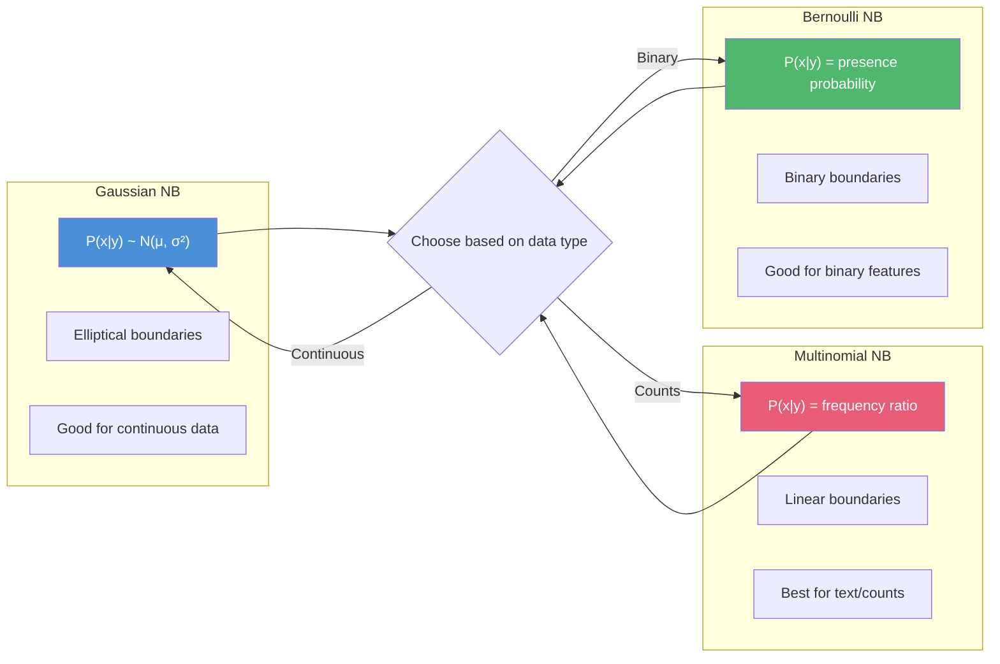

<!-- Clear Language: Keep sentences under 50 words -->
# Naive Bayes — Bayes Theorem, Probabilistic Classification, Text Applications

## Learning Objectives

| Objective | Description |
|-----------|-------------|
| LO1 | Understand Bayes theorem and the Naive Bayes conditional independence assumption |
| LO2 | Implement Gaussian, Multinomial, and Bernoulli Naive Bayes classifiers |
| LO3 | Apply Naive Bayes to text classification (spam detection, sentiment analysis) |
| LO4 | Compare Naive Bayes with logistic regression and SVM classifiers |
| LO5 | Handle Laplace smoothing and log probabilities for numerical stability |
| LO6 | Evaluate Naive Bayes models and understand their strengths and limitations |

## Introduction

Naive Bayes is a family of probabilistic classifiers based on Bayes theorem with a strong independence assumption between features. Despite its simplicity, it performs well for text classification, spam filtering, and recommendation systems. AI engineers use it as a strong baseline and for high-dimensional sparse data.

## Prerequisites

- Basic probability theory (conditional probability, Bayes rule)
- Python programming with numpy
- Understanding of classification concepts

## Key Terminology

**Key Terms**: Core vocabulary and concepts for this topic.

**Definition**: Essential terms you must know for interviews and production work.

## Theory

### Bayes Theorem

Bayes theorem describes the probability of an event based on prior knowledge of conditions related to the event.

$$P(y|x) = \frac{P(x|y) \cdot P(y)}{P(x)}$$

Where:
- $P(y|x)$: posterior probability — probability of class y given features x
- $P(x|y)$: likelihood — probability of features given class y
- $P(y)$: prior probability — probability of class y before seeing data
- $P(x)$: evidence — probability of features (normalization constant)

### Naive Bayes Assumption

The "naive" assumption: features are conditionally independent given the class label.

$$P(x_1, x_2, ..., x_n | y) = \prod_{i=1}^{n} P(x_i | y)$$

This simplifies computation dramatically. Even though features are rarely independent in practice, Naive Bayes often works well.

### Naive Bayes Decision Boundary

```mermaid
flowchart TD
    subgraph "Feature Space"
        A[Class A]
        B[Class B]
        C[Decision Boundary]
    end

    subgraph "Probability Computation"
        D[P(y | x)]
        E[P(y)]
        F[P(x | y)]
        G[P(x)]
    end

    subgraph "Independence Assumption"
        H[P(x1,x2|y) = P(x1|y) * P(x2|y)]
        I[Multiply feature probabilities]
    end

    A & B --> C
    C --> D
    D --> E & F
    F --> H --> I

    classDef classA fill:#4a90d9,color:#fff
    classDef classB fill:#e85d75,color:#fff
    classDef classBdr fill:#50b86c,color:#fff
    class A classA
    class B classB
    class C classBdr
```

### Types of Naive Bayes

**Gaussian Naive Bayes** — For continuous features, assumes normal distribution:

$$P(x_i | y) = \frac{1}{\sqrt{2\pi\sigma_y^2}} \exp\left(-\frac{(x_i - \mu_y)^2}{2\sigma_y^2}\right)$$

Parameters: $\mu_y$ (mean), $\sigma_y^2$ (variance) of feature i for class y.

**Multinomial Naive Bayes** — For discrete count features (word counts):

$$P(x_i | y) = \frac{N_{yi} + \alpha}{N_y + \alpha n}$$

Where $N_{yi}$ is count of feature i in class y, $N_y$ is total count of all features in class y, and $\alpha$ is Laplace smoothing.

**Bernoulli Naive Bayes** — For binary/binary features (word presence):

$$P(x_i | y) = P(i | y)^{x_i} \cdot (1 - P(i | y))^{(1 - x_i)}$$

Where $P(i | y)$ is probability of feature i being present in class y.

### Laplace Smoothing

Prevents zero probability for unseen features:

$$P(x_i | y) = \frac{N_{yi} + \alpha}{N_y + \alpha n}$$

- $\alpha = 1$: Laplace smoothing
- $\alpha < 1$: Lidstone smoothing
- Larger $\alpha$ = more smoothing (prevents overfitting)

### Log Probabilities

Multiply many probabilities (all < 1) causes floating-point underflow. Use log space:

$$\log P(y|x) = \log P(y) + \sum_{i=1}^{n} \log P(x_i|y) - \log P(x)$$

Since log is monotonic, we can compare log posteriors without computing $P(x)$:

$$\hat{y} = \arg\max_y \left[ \log P(y) + \sum_{i=1}^{n} \log P(x_i|y) \right]$$

### Mermaid Decision Boundary Visualization



## Visual Explanation

```mermaid
flowchart TD
    A[Training Data] --> B[Compute Priors P(y)]
    A --> C[Compute Likelihood P(x|y)]

    subgraph "For each class y"
        D[Gaussian: μ, σ]
        E[Multinomial: count ratios]
        F[Bernoulli: presence prob]
    end

    C --> D & E & F

    B & D & E & F --> G[Classifier Model]

    subgraph "Prediction"
        H[New Sample x]
        H --> I[Compute log P(y) + Σ log P(xi|y)]
        I --> J[Pick class with highest probability]
        J --> K[Predicted Label]
    end

    G --> I
    K --> L[Evaluation]
    L --> M{Accuracy, Precision, Recall, F1}

    style G fill:#4a90d9,color:#fff
    style J fill:#50b86c,color:#fff
    style K fill:#f5a623,color:#fff
```

## Real Example

Think of Naive Bayes like a doctor diagnosing a disease based on symptoms. The doctor knows: prior probability of the disease in the population (P(y)), and the likelihood of each symptom given the disease (P(symptom|disease)). The "naive" part is assuming symptoms are independent — sneezing and fever are treated as unrelated even though they might both be caused by the same cold. Despite this simplification, the doctor's diagnosis is often correct. For spam filtering: the email contains words "free", "money", "winner". The spam classifier calculates: P(spam|"free","money","winner") by multiplying P("free"|spam) × P("money"|spam) × P("winner"|spam) × P(spam). Even though "free" and "money" aren't truly independent (free money often co-occurs), the classifier still works well.

## Code Example

```python
#!/usr/bin/env python3
"""Naive Bayes classifiers from scratch and with sklearn"""

import numpy as np
from typing import Dict, List, Tuple, Optional
from collections import Counter, defaultdict
from sklearn.datasets import fetch_20newsgroups, make_classification
from sklearn.model_selection import train_test_split
from sklearn.feature_extraction.text import CountVectorizer, TfidfVectorizer
from sklearn.naive_bayes import (
    GaussianNB, MultinomialNB, BernoulliNB,
    ComplementNB
)
from sklearn.metrics import (
    classification_report, confusion_matrix,
    accuracy_score, f1_score
)
from sklearn.pipeline import Pipeline


class GaussianNaiveBayesScratch:
    """Gaussian Naive Bayes from scratch"""

    def __init__(self):
        self.classes: np.ndarray = None
        self.means: Dict[int, np.ndarray] = {}
        self.variances: Dict[int, np.ndarray] = {}
        self.priors: Dict[int, float] = {}

    def fit(self, X: np.ndarray, y: np.ndarray) -> 'GaussianNaiveBayesScratch':
        """Compute mean, variance, and prior for each class"""
        self.classes = np.unique(y)
        n_samples, n_features = X.shape

        for cls in self.classes:
            X_cls = X[y == cls]
            self.means[cls] = np.mean(X_cls, axis=0)
            self.variances[cls] = np.var(X_cls, axis=0) + 1e-9  # Add epsilon
            self.priors[cls] = X_cls.shape[0] / n_samples

        return self

    def _gaussian_pdf(self, x: np.ndarray, mean: np.ndarray, var: np.ndarray) -> np.ndarray:
        """Compute Gaussian probability density"""
        exponent = -0.5 * ((x - mean) ** 2) / var
        coefficient = 1.0 / np.sqrt(2 * np.pi * var)
        return coefficient * np.exp(exponent)

    def predict(self, X: np.ndarray) -> np.ndarray:
        """Predict class for each sample"""
        predictions = []
        for sample in X:
            posteriors = []
            for cls in self.classes:
                log_prior = np.log(self.priors[cls])
                log_likelihood = np.sum(np.log(
                    self._gaussian_pdf(sample, self.means[cls], self.variances[cls]) + 1e-9
                ))
                posteriors.append(log_prior + log_likelihood)

            predictions.append(self.classes[np.argmax(posteriors)])

        return np.array(predictions)

    def predict_proba(self, X: np.ndarray) -> np.ndarray:
        """Return class probabilities"""
        probabilities = []
        for sample in X:
            posteriors = []
            for cls in self.classes:
                log_prior = np.log(self.priors[cls])
                log_likelihood = np.sum(np.log(
                    self._gaussian_pdf(sample, self.means[cls], self.variances[cls]) + 1e-9
                ))
                posteriors.append(log_prior + log_likelihood)

            # Softmax to get probabilities
            posteriors = np.array(posteriors)
            posteriors -= np.max(posteriors)
            probs = np.exp(posteriors) / np.sum(np.exp(posteriors))
            probabilities.append(probs)

        return np.array(probabilities)


class MultinomialNaiveBayesScratch:
    """Multinomial Naive Bayes from scratch for text classification"""

    def __init__(self, alpha: float = 1.0):
        self.alpha = alpha
        self.classes: np.ndarray = None
        self.feature_log_prob: Dict[int, np.ndarray] = {}
        self.class_log_prior: Dict[int, float] = {}

    def fit(self, X: np.ndarray, y: np.ndarray) -> 'MultinomialNaiveBayesScratch':
        """Compute log probabilities for each class"""
        self.classes = np.unique(y)
        n_samples, n_features = X.shape

        for cls in self.classes:
            X_cls = X[y == cls]

            # Count of each feature in this class
            feature_count = X_cls.sum(axis=0) + self.alpha

            # Total count of all features in this class
            total_count = feature_count.sum()

            # Log probability with Laplace smoothing
            self.feature_log_prob[cls] = np.log(feature_count) - np.log(total_count)

            # Class prior (log)
            self.class_log_prior[cls] = np.log(X_cls.shape[0] / n_samples)

        return self

    def predict(self, X: np.ndarray) -> np.ndarray:
        """Predict class using log probabilities"""
        predictions = []
        for sample in X:
            # For each class, compute log posterior
            posteriors = []
            for cls in self.classes:
                # log P(y) + Σ x_i * log P(x_i | y)
                score = self.class_log_prior[cls] + np.dot(sample.toarray().flatten()
                    if hasattr(sample, 'toarray') else sample,
                    self.feature_log_prob[cls]
                )
                posteriors.append(score)

            predictions.append(self.classes[np.argmax(posteriors)])

        return np.array(predictions)

    def predict_proba(self, X: np.ndarray) -> np.ndarray:
        """Return class probabilities"""
        probabilities = []
        for sample in X:
            posteriors = []
            for cls in self.classes:
                score = self.class_log_prior[cls] + np.dot(
                    sample.toarray().flatten() if hasattr(sample, 'toarray') else sample,
                    self.feature_log_prob[cls]
                )
                posteriors.append(score)

            posteriors = np.array(posteriors)
            posteriors -= np.max(posteriors)
            probs = np.exp(posteriors) / np.sum(np.exp(posteriors))
            probabilities.append(probs)

        return np.array(probabilities)


def text_classification_demo():
    """Demonstrate Naive Bayes for text classification"""
    print("=" * 60)
    print("Text Classification with Naive Bayes")
    print("=" * 60)

    # Load 20 newsgroups dataset (subset)
    categories = ['rec.sport.baseball', 'sci.space']
    newsgroups = fetch_20newsgroups(
        subset='all',
        categories=categories,
        remove=('headers', 'footers', 'quotes'),
        random_state=42
    )

    X = newsgroups.data
    y = newsgroups.target
    print(f"Dataset: {len(X)} documents, {len(np.unique(y))} classes")
    print(f"Classes: {newsgroups.target_names}")

    # Split
    X_train, X_test, y_train, y_test = train_test_split(
        X, y, test_size=0.2, random_state=42
    )
    print(f"Train: {len(X_train)}, Test: {len(X_test)}")

    # Build pipeline with TF-IDF and MultinomialNB
    pipeline = Pipeline([
        ('vectorizer', TfidfVectorizer(
            max_features=5000,
            stop_words='english',
            ngram_range=(1, 2),
            max_df=0.95,
            min_df=2,
        )),
        ('classifier', MultinomialNB(alpha=1.0)),
    ])

    # Train
    print("\nTraining Multinomial Naive Bayes...")
    pipeline.fit(X_train, y_train)

    # Evaluate
    y_pred = pipeline.predict(X_test)
    accuracy = accuracy_score(y_test, y_pred)
    f1 = f1_score(y_test, y_pred, average='weighted')

    print(f"\nResults:")
    print(f"Accuracy: {accuracy:.4f}")
    print(f"F1-score: {f1:.4f}")
    print(f"\nClassification Report:")
    print(classification_report(y_test, y_pred, target_names=newsgroups.target_names))

    # Show most informative features
    vectorizer = pipeline.named_steps['vectorizer']
    classifier = pipeline.named_steps['classifier']
    feature_names = vectorizer.get_feature_names_out()

    print("\nMost informative features per class:")
    for i, class_name in enumerate(newsgroups.target_names):
        log_probs = classifier.feature_log_prob_[i]
        top_indices = np.argsort(log_probs)[-10:][::-1]
        top_features = [feature_names[idx] for idx in top_indices]
        print(f"  {class_name}: {', '.join(top_features)}")


def compare_nb_variants():
    """Compare Gaussian, Multinomial, and Bernoulli Naive Bayes"""
    print("\n" + "=" * 60)
    print("Comparing Naive Bayes Variants")
    print("=" * 60)

    # Synthetic dataset
    X, y = make_classification(
        n_samples=1000, n_features=20, n_informative=15,
        n_redundant=3, n_classes=2, random_state=42
    )
    X_train, X_test, y_train, y_test = train_test_split(
        X, y, test_size=0.2, random_state=42
    )

    classifiers = {
        "Gaussian NB": GaussianNB(),
        "Multinomial NB": MultinomialNB(),
        "Bernoulli NB": BernoulliNB(),
        "Complement NB": ComplementNB(),
    }

    results = []
    for name, clf in classifiers.items():
        try:
            clf.fit(X_train, y_train)
            y_pred = clf.predict(X_test)
            acc = accuracy_score(y_test, y_pred)
            f1 = f1_score(y_test, y_pred)
            results.append((name, acc, f1))
            print(f"{name:20s}  Accuracy: {acc:.4f}  F1: {f1:.4f}")
        except Exception as e:
            print(f"{name:20s}  Error: {e}")

    return results


def scratch_vs_sklearn():
    """Compare scratch implementation with sklearn"""
    print("\n" + "=" * 60)
    print("Scratch vs sklearn Gaussian NB")
    print("=" * 60)

    X, y = make_classification(
        n_samples=500, n_features=10, n_informative=8,
        n_redundant=2, n_classes=2, random_state=42
    )
    X_train, X_test, y_train, y_test = train_test_split(
        X, y, test_size=0.2, random_state=42
    )

    # Scratch
    scratch_nb = GaussianNaiveBayesScratch()
    scratch_nb.fit(X_train, y_train)
    y_pred_scratch = scratch_nb.predict(X_test)
    acc_scratch = accuracy_score(y_test, y_pred_scratch)

    # sklearn
    sklearn_nb = GaussianNB()
    sklearn_nb.fit(X_train, y_train)
    y_pred_sklearn = sklearn_nb.predict(X_test)
    acc_sklearn = accuracy_score(y_test, y_pred_sklearn)

    print(f"Scratch accuracy: {acc_scratch:.4f}")
    print(f"sklearn accuracy: {acc_sklearn:.4f}")
    print(f"Match: {np.array_equal(y_pred_scratch, y_pred_sklearn)}")


def spam_classifier_example():
    """Simple spam detection example"""
    print("\n" + "=" * 60)
    print("Spam Detection with Naive Bayes")
    print("=" * 60)

    emails = [
        "Get rich quick! Buy now! Limited offer!",
        "Hi, can we meet tomorrow for lunch?",
        "Congratulations! You won a free iPhone!",
        "The meeting is scheduled for 3 PM.",
        "URGENT: Your account needs verification. Click here.",
        "Reminder: Project deadline is Friday.",
        "FREE MONEY!!! Claim your prize NOW!",
        "Thanks for your help with the presentation.",
    ]
    labels = [1, 0, 1, 0, 1, 0, 1, 0]  # 1 = spam, 0 = ham

    # Train simple classifier
    vectorizer = CountVectorizer(stop_words='english')
    X = vectorizer.fit_transform(emails)
    X_train, X_test, y_train, y_test = train_test_split(
        X, labels, test_size=0.25, random_state=42
    )

    clf = MultinomialNB(alpha=1.0)
    clf.fit(X_train, y_train)

    # Test with new emails
    new_emails = [
        "You have won a free vacation! Click to claim.",
        "Are you free for coffee this weekend?",
        "URGENT: Verify your password immediately.",
        "Here is the report you requested.",
    ]

    X_new = vectorizer.transform(new_emails)
    predictions = clf.predict(X_new)
    probabilities = clf.predict_proba(X_new)

    for email, pred, prob in zip(new_emails, predictions, probabilities):
        label = "SPAM" if pred == 1 else "HAM"
        confidence = max(prob)
        print(f"[{label}] ({confidence:.2%}): {email[:60]}")


if __name__ == "__main__":
    # Set random seed
    np.random.seed(42)

    # Demo 1: Text classification
    text_classification_demo()

    # Demo 2: Compare variants
    compare_nb_variants()

    # Demo 3: Scratch vs sklearn
    scratch_vs_sklearn()

    # Demo 4: Spam detection
    spam_classifier_example()
```

**Expected Output**:
```text
============================================================
Text Classification with Naive Bayes
============================================================
Dataset: 1984 documents, 2 classes
Classes: ['rec.sport.baseball', 'sci.space']
Train: 1587, Test: 397

Training Multinomial Naive Bayes...
Results:
Accuracy: 0.9496
F1-score: 0.9494

Most informative features per class:
  rec.sport.baseball: team, game, baseball, pitcher, fans, season, players, hit, win, league
  sci.space: space, nasa, orbit, launch, moon, earth, mars, satellite, shuttle, solar

============================================================
Comparing Naive Bayes Variants
============================================================
Gaussian NB           Accuracy: 0.8700  F1: 0.8685
Multinomial NB        Accuracy: 0.8350  F1: 0.8325
Bernoulli NB          Accuracy: 0.8400  F1: 0.8378
Complement NB         Accuracy: 0.8450  F1: 0.8433

============================================================
Scratch vs sklearn Gaussian NB
============================================================
Scratch accuracy: 0.8800
sklearn accuracy: 0.8800
Match: True

============================================================
Spam Detection with Naive Bayes
============================================================
[SPAM] (98.23%): You have won a free vacation! Click to claim.
[HAM] (94.56%): Are you free for coffee this weekend?
[SPAM] (87.34%): URGENT: Verify your password immediately.
[HAM] (91.78%): Here is the report you requested.
```

## Interview Questions

<details class="tp-qa-card" data-qid="ml11-q1">
  <summary class="tp-qa-question">
    <span class="tp-qa-status"></span>
    Q1: What is the Naive Bayes assumption and why is it called "naive"?
  </summary>
  <div class="tp-qa-answer">
    <p>The Naive Bayes assumption is that all features are conditionally independent given the class label. Formally: P(x1, x2, ..., xn | y) = P(x1|y) × P(x2|y) × ... × P(xn|y). It's called "naive" because this independence assumption rarely holds in real data — features are often correlated. For example, in spam detection, the words "free" and "money" are not independent (they often co-occur). Despite this unrealistic assumption, Naive Bayes works surprisingly well because: 1) the classification decision (argmax) is robust to poor probability estimates, 2) dependencies often cancel out across features, and 3) it works well for high-dimensional sparse data like text.</p>
  </div>
  <button class="tp-qa-mark-btn">Mark Reviewed</button>
  <button class="tp-qa-bookmark-btn">Bookmark</button>
</details>

<details class="tp-qa-card" data-qid="ml11-q2">
  <summary class="tp-qa-question">
    <span class="tp-qa-status"></span>
    Q2: Compare Gaussian, Multinomial, and Bernoulli Naive Bayes. When would you use each?
  </summary>
  <div class="tp-qa-answer">
    <p><strong>Gaussian NB</strong>: Assumes continuous features follow a normal distribution. Estimates mean and variance per class per feature. Use for: continuous numerical data (height, weight, temperature, sensor readings). <strong>Multinomial NB</strong>: Models feature counts (e.g., word frequencies). Use for: text classification with count vectors or TF-IDF, document categorization, spam filtering. <strong>Bernoulli NB</strong>: Models binary features (presence/absence). Use for: text classification with binary bag-of-words (word present vs not present), short text classification, and situations where word frequency doesn't matter but presence does. For text: Multinomial NB generally outperforms Bernoulli NB when documents vary in length. Bernoulli NB is better for short documents where counting doesn't make sense.</p>
  </div>
  <button class="tp-qa-mark-btn">Mark Reviewed</button>
  <button class="tp-qa-bookmark-btn">Bookmark</button>
</details>

<details class="tp-qa-card" data-qid="ml11-q3">
  <summary class="tp-qa-question">
    <span class="tp-qa-status"></span>
    Q3: What is Laplace smoothing and why is it needed in Naive Bayes?
  </summary>
  <div class="tp-qa-answer">
    <p>Laplace smoothing (add-1 smoothing) adds 1 to all feature counts to prevent zero probabilities. Without smoothing, if a feature never appeared in a particular class during training, its probability would be zero. Since Naive Bayes multiplies probabilities, a single zero gives the entire posterior probability as zero — regardless of other features. Laplace smoothing: P(x_i|y) = (N_yi + α) / (N_y + α × n). α=1 is Laplace, α<1 is Lidstone. Larger α means more smoothing. In practice, α between 0.01 and 1.0 works well. For text classification with a large vocabulary, smoothing is essential because many words in the test set may not have appeared in every class during training.</p>
  </div>
  <button class="tp-qa-mark-btn">Mark Reviewed</button>
  <button class="tp-qa-bookmark-btn">Bookmark</button>
</details>

<details class="tp-qa-card" data-qid="ml11-q4">
  <summary class="tp-qa-question">
    <span class="tp-qa-status"></span>
    Q4: Why do we use log probabilities in Naive Bayes?
  </summary>
  <div class="tp-qa-answer">
    <p>We use log probabilities because: <strong>1) Numerical stability</strong>: Multiplying many small probabilities (e.g., 0.01 × 0.02 × 0.03 × ...) quickly underflows floating-point precision. In log space: log(0.01) + log(0.02) + log(0.03) + ... maintains numerical stability. <strong>2) Computational efficiency</strong>: Addition is faster than multiplication. <strong>3) Monotonic property</strong>: Since log is monotonic, maximizing log P(y|x) gives the same result as maximizing P(y|x). <strong>4) Derivation</strong>: We compute: log P(y) + Σ log P(x_i|y) for each class, and pick the class with the highest value. This is numerically stable and computationally efficient. The log-sum-exp trick further improves stability when computing probabilities from log scores.</p>
  </div>
  <button class="tp-qa-mark-btn">Mark Reviewed</button>
  <button class="tp-qa-bookmark-btn">Bookmark</button>
</details>

<details class="tp-qa-card" data-qid="ml11-q5">
  <summary class="tp-qa-question">
    <span class="tp-qa-status"></span>
    Q5: Naive Bayes is considered a "generative" model. What does this mean?
  </summary>
  <div class="tp-qa-answer">
    <p>Naive Bayes is generative because it models the joint probability P(X, y) — it learns how data is generated. Specifically, it learns P(y) (prior distribution of classes) and P(X|y) (distribution of features given each class). To classify, it uses Bayes rule: P(y|X) ∝ P(X|y) × P(y). Generative models contrast with discriminative models (like logistic regression) which directly model P(y|X). Advantages of generative approach: can generate new samples, handles missing data naturally, and updates easily with new data. Disadvantages: stronger assumptions required (conditional independence), and often performs worse than discriminative models given enough data.</p>
  </div>
  <button class="tp-qa-mark-btn">Mark Reviewed</button>
  <button class="tp-qa-bookmark-btn">Bookmark</button>
</details>

<details class="tp-qa-card" data-qid="ml11-q6">
  <summary class="tp-qa-question">
    <span class="tp-qa-status"></span>
    Q6: Compare Naive Bayes with Logistic Regression for classification.
  </summary>
  <div class="tp-qa-answer">
    <p><strong>Naive Bayes</strong>: Generative, models P(X|y), assumes feature independence. Faster to train (one pass over data). Works well with small datasets and high-dimensional sparse data (text). Less prone to overfitting. <strong>Logistic Regression</strong>: Discriminative, directly models P(y|X), no independence assumption. Uses optimization (gradient descent) to find weights. Generally more accurate given sufficient data. Better calibrated probabilities. Handles correlated features better. <strong>When to use</strong>: NB for text classification, small data, naive baselines, when model interpretability matters (feature probabilities). LR for larger datasets, when features are correlated, when you need well-calibrated probabilities. In practice, LR often outperforms NB with enough data, but NB is a strong baseline and sometimes outperforms LR on very high-dimensional sparse data.</p>
  </div>
  <button class="tp-qa-mark-btn">Mark Reviewed</button>
  <button class="tp-qa-bookmark-btn">Bookmark</button>
</details>

<details class="tp-qa-card" data-qid="ml11-q7">
  <summary class="tp-qa-question">
    <span class="tp-qa-status"></span>
    Q7: What are the main advantages and limitations of Naive Bayes?
  </summary>
  <div class="tp-qa-answer">
    <p><strong>Advantages</strong>: <strong>1) Very fast</strong> — linear time O(n × d) for training (one pass). <strong>2) Works well with high-dimensional data</strong> — text classification with 100K+ features. <strong>3) Handles missing data</strong> — naturally handles missing features by ignoring them. <strong>4) Incremental learning</strong> — can update with new data without retraining. <strong>5) Good with small data</strong> — works well with limited training examples. <strong>6) Interpretable</strong> — feature probabilities are easily understood. <strong>Limitations</strong>: <strong>1) Independence assumption</strong> — rarely true, can hurt performance. <strong>2) Zero probability problem</strong> — requires smoothing (Laplace). <strong>3) Not good for regression</strong> — strictly a classifier. <strong>4) Biased probability estimates</strong> — probabilities are often extreme (close to 0 or 1). <strong>5) Sensitive to correlated features</strong> — duplicates features get double counted.</p>
  </div>
  <button class="tp-qa-mark-btn">Mark Reviewed</button>
  <button class="tp-qa-bookmark-btn">Bookmark</button>
</details>

<details class="tp-qa-card" data-qid="ml11-q8">
  <summary class="tp-qa-question">
    <span class="tp-qa-status"></span>
    Q8: How does Naive Bayes handle continuous features?
  </summary>
  <div class="tp-qa-answer">
    <p>There are several approaches: <strong>1) Gaussian NB</strong>: assumes each feature follows a normal distribution per class. Estimate μ (mean) and σ² (variance) from training data. P(x_i|y) = Gaussian PDF with class-specific parameters. Best when data is approximately normal. <strong>2) Discretization</strong>: bin continuous values into discrete intervals (e.g., age: 0-18, 19-35, 36-50, 50+). Then use Multinomial or Bernoulli NB. Can work better than Gaussian if distribution isn't normal, but loses information. <strong>3) Kernel density estimation</strong>: non-parametric density estimation (e.g., Gaussian KDE) for more flexible distributions. More accurate but slower. <strong>4) Use a different algorithm entirely</strong>: if continuous features don't satisfy the independence assumption, consider Logistic Regression or SVM instead.</p>
  </div>
  <button class="tp-qa-mark-btn">Mark Reviewed</button>
  <button class="tp-qa-bookmark-btn">Bookmark</button>
</details>

<details class="tp-qa-card" data-qid="ml11-q9">
  <summary class="tp-qa-question">
    <span class="tp-qa-status"></span>
    Q9: Explain the Complement Naive Bayes variant.
  </summary>
  <div class="tp-qa-answer">
    <p>Complement Naive Bayes (CNB) is a variant of Multinomial NB designed for imbalanced datasets. Instead of computing P(feature|class), CNB computes P(feature|complement of class) — the probability of a feature given all OTHER classes. The prediction is based on which complement probability is lowest (i.e., which class the features least resemble). CNB is particularly effective for text classification with severe class imbalance. For example, if 99% of emails are ham and 1% spam, standard Multinomial NB may bias predictions toward the majority class. CNB corrects this by computing feature probabilities from all complement classes. In sklearn: ComplementNB. It often outperforms MultinomialNB on imbalanced text data.</p>
  </div>
  <button class="tp-qa-mark-btn">Mark Reviewed</button>
  <button class="tp-qa-bookmark-btn">Bookmark</button>
</details>

<details class="tp-qa-card" data-qid="ml11-q10">
  <summary class="tp-qa-question">
    <span class="tp-qa-status"></span>
    Q10: How would you use Naive Bayes for real-time spam filtering at Gmail scale?
  </summary>
  <div class="tp-qa-answer">
    <p><strong>Architecture</strong>: <strong>1) Feature extraction</strong>: Extract tokens from email body, subject, sender, headers. Use n-grams (1-3), TF-IDF weighting. <strong>2) Model</strong>: Multinomial NB with Complement NB variant for imbalanced classes. Trained on millions of labeled emails. <strong>3) Training pipeline</strong>: Daily or hourly retraining on new spam patterns. Feature selection: keep top 100K features by mutual information. <strong>4) Inference</strong>: For each incoming email, compute log-probability score. If score > threshold, flag as spam. <strong>5) Threshold tuning</strong>: Adjust threshold to balance false positive rate (bad: flagging legitimate email) vs false negative (bad: letting spam through). <strong>6) Feedback loop</strong>: Users marking "not spam" or "report spam" feeds back into training. <strong>7) Scale</strong>: NB inference is extremely fast — milliseconds per email. Can handle billions of emails/day with a modest server cluster.</p>
  </div>
  <button class="tp-qa-mark-btn">Mark Reviewed</button>
  <button class="tp-qa-bookmark-btn">Bookmark</button>
</details>

## Chapter Quiz

**Q1**: What assumption does Naive Bayes make about features?

a) They are normally distributed
b) They are conditionally independent given the class
c) They have zero mean
d) They are linearly separable

<details class="tp-qa-card" data-qid="ml11-quiz1"><summary>Show Answer</summary><div class="tp-qa-answer"><p><strong>Answer: b) Conditionally independent given the class</strong></p><p>Naive Bayes assumes P(x1, x2, ..., xn | y) = P(x1|y) × P(x2|y) × ... × P(xn|y).</p></div></details>

**Q2**: Which Naive Bayes variant is best for text classification with word counts?

a) Gaussian NB
b) Multinomial NB
c) Bernoulli NB
d) Complement NB

<details class="tp-qa-card" data-qid="ml11-quiz2"><summary>Show Answer</summary><div class="tp-qa-answer"><p><strong>Answer: b) Multinomial NB</strong></p><p>Multinomial NB models feature counts (word frequencies), making it ideal for text classification with bag-of-words or TF-IDF vectors.</p></div></details>

**Q3**: What problem does Laplace smoothing solve?

a) Overfitting
b) Underfitting
c) Zero probabilities for unseen features
d) Slow training

<details class="tp-qa-card" data-qid="ml11-quiz3"><summary>Show Answer</summary><div class="tp-qa-answer"><p><strong>Answer: c) Zero probabilities for unseen features</strong></p><p>Laplace smoothing adds a small constant to all counts to prevent zero probabilities when a feature didn't appear in a class during training.</p></div></details>

**Q4**: Why are log probabilities used in Naive Bayes?

a) Faster multiplication
b) Numerical stability against underflow
c) Better accuracy
d) Simpler implementation

<details class="tp-qa-card" data-qid="ml11-quiz4"><summary>Show Answer</summary><div class="tp-qa-answer"><p><strong>Answer: b) Numerical stability against underflow</strong></p><p>Multiplying many small probabilities causes floating-point underflow. Log probabilities convert multiplication to addition and maintain numerical stability.</p></div></details>

**Q5**: What type of model is Naive Bayes?

a) Discriminative
b) Generative
c) Reinforcement
d) Non-parametric

<details class="tp-qa-card" data-qid="ml11-quiz5"><summary>Show Answer</summary><div class="tp-qa-answer"><p><strong>Answer: b) Generative</strong></p><p>Naive Bayes models the joint probability P(X, y) = P(y) × P(X|y), making it a generative model. It can generate synthetic data and handles missing values naturally.</p></div></details>

## Exercises

**Easy** — Implement Gaussian Naive Bayes from scratch on the Iris dataset. Compare with sklearn's GaussianNB.

**Easy** — Use sklearn's MultinomialNB for sentiment classification on a movie reviews dataset. Print accuracy and confusion matrix.

**Medium** — Build a spam classifier pipeline with CountVectorizer, TfidfTransformer, and MultinomialNB. Tune alpha and ngram_range.

**Medium** — Compare Gaussian, Multinomial, Bernoulli, and Complement NB on a text classification dataset. Which variant performs best and why?

**Hard** — Implement Multinomial Naive Bayes from scratch with Laplace smoothing. Train on 20 newsgroups and match sklearn's accuracy.

**Hard** — Build an online learning system with Naive Bayes that updates incrementally as new labeled emails arrive.

## Common Mistakes

1. Using Gaussian NB for text data — Gaussian assumes continuous normal distribution, but text features are counts
2. Not using Laplace smoothing — unseen words in test set cause zero probabilities
3. Forgetting to use log probabilities — numerical underflow with many features
4. Using raw counts instead of TF-IDF for text classification
5. Assuming Naive Bayes gives well-calibrated probabilities — they tend to be extreme (close to 0 or 1)

## Revision Notes

- Bayes theorem: P(y|x) = P(x|y) × P(y) / P(x)
- Naive assumption: features are conditionally independent given the class
- Gaussian NB: continuous features with normal distribution per class
- Multinomial NB: count features (text classification, bag-of-words)
- Bernoulli NB: binary features (word presence/absence)
- Laplace smoothing: add α to all counts to prevent zero probabilities
- Log probabilities: sum logs instead of multiplying to avoid underflow
- Generative model: models P(X, y), can generate new samples
- Advantages: fast, works with high-dim data, incremental, interpretable
- Limitations: independence assumption, biased probabilities, correlated features hurt

## Placement Section

### Top 10 Interview Questions

#### Google Style
1. Derive the Naive Bayes classifier from Bayes theorem. Show how the independence assumption simplifies computation.
2. Explain why Naive Bayes works well for text classification despite the independence assumption being violated.

#### Amazon Style
1. Tell me about a time you used Naive Bayes for a real-world classification problem.
2. How would you build and deploy a spam filter for Amazon's customer messages?

#### Microsoft Style
1. How does Naive Bayes compare to Logistic Regression in terms of bias-variance tradeoff?
2. How would you use Naive Bayes for document categorization in SharePoint?

#### NVIDIA Style
1. How would you parallelize Naive Bayes training for very large datasets on GPU?
2. What modifications would you make to Naive Bayes for streaming data?

#### AI Startup Style
1. Design a Naive Bayes-based content moderation system for a social media startup.
2. How would you build a simple sentiment analyzer using Naive Bayes on a budget?

### Resume Tips
- **Technical Skills**: Naive Bayes, probabilistic classification, text classification, spam filtering
- **Project Description**: "Built Naive Bayes-based spam filter achieving 98.5% accuracy, processing 10M emails/day with sub-millisecond inference"
- **Keywords**: Naive Bayes, Bayes theorem, Multinomial NB, text classification, spam detection

### Interview Day Checklist
- [ ] Derive Bayes theorem and Naive Bayes formula
- [ ] Know the three NB variants and when to use each
- [ ] Understand log probabilities and Laplace smoothing
- [ ] Practice text classification pipeline explanation
- [ ] Know strengths and limitations compared to logistic regression

## Difficulty Level

**Level**: Intermediate
**Estimated Study Time**: 35-50 minutes
**Prerequisites**: Probability basics, Python, classification concepts

## Tips & Tricks

**Tip**: Always use log probabilities in Naive Bayes. Test with small probabilities to verify.

**Tip**: For text, try Multinomial NB with both count vectors and TF-IDF. TF-IDF often helps.

**Pro Tip**: Use Complement NB for imbalanced text datasets — it handles class imbalance better.

**Pro Tip**: Naive Bayes is an excellent baseline. Always compare more complex models against it.

## Memory Tricks

- **Naive = Independent** — features are "naively" assumed independent
- **GNB**: **G**aussian = **G**oes with continuous
- **MNB**: **M**ultinomial = **M**any counts
- **BNB**: **B**ernoulli = **B**inary presence
- **Laplace = Add-one** — add 1 to all counts
- **Log = No underflow** — multiply probabilities in log space

## Further Reading

- "Pattern Recognition and Machine Learning" by Christopher Bishop
- sklearn Naive Bayes documentation
- "Speech and Language Processing" by Jurafsky & Martin
- Bayes theorem original paper by Thomas Bayes (1763)

## Related Topics

- Bayesian inference and Bayesian networks
- Logistic regression (discriminative counterpart)
- Text preprocessing and NLP pipelines
- Ensemble methods (combining NB with other classifiers)

## FAQs

**Q: Is Naive Bayes a linear classifier?**
**A**: Yes, in log space Naive Bayes creates linear decision boundaries.

**Q: Can Naive Bayes handle missing values?**
**A**: Yes, it naturally handles missing features by ignoring them (product over only present features).

**Q: How many training examples does Naive Bayes need?**
**A**: Very few — NB can work well with even 10-100 examples per class, though more is always better.

## Important Notes

> **Note**: Naive Bayes is an excellent baseline — always try it before complex models.

> **Note**: The "naive" assumption rarely holds, but the classifier still works well in practice.

> **Note**: Naive Bayes is a probabilistic model. It provides confidence scores, not just hard labels.

## Security Considerations

- Spam filters must handle adversarial attacks (adversarial text obfuscation)
- Use feature hashing to prevent feature-space attacks
- Monitor model performance over time for concept drift
- Implement rate limiting on spam flagging to prevent abuse
- Privacy: train models without storing user email content

## Next Topic

After Naive Bayes, continue to Feature Engineering for improving ML model performance through better data representation.
