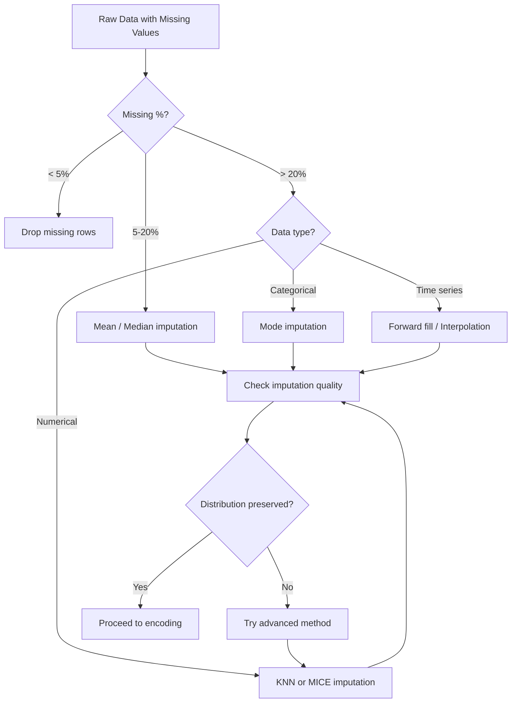
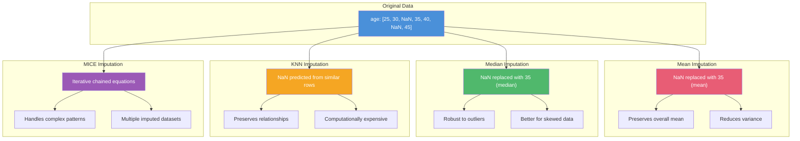
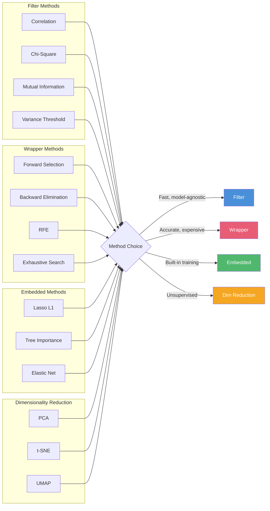

<!-- Clear Language: Keep sentences under 50 words -->
# Feature Engineering — Imputation, Encoding, Scaling, Feature Construction, Feature Selection

## Learning Objectives

| Objective | Description |
|-----------|-------------|
| LO1 | Understand feature engineering and its impact on model performance |
| LO2 | Apply missing value imputation techniques (mean, median, mode, KNN, MICE) |
| LO3 | Encode categorical variables (one-hot, label, ordinal, target, frequency) |
| LO4 | Scale numerical features (standardization, normalization, robust scaling) |
| LO5 | Construct new features from existing data (polynomial, interaction, domain-specific) |
| LO6 | Perform feature selection (filter, wrapper, embedded, dimensionality reduction) |

## Introduction

Feature engineering transforms raw data into representations that improve machine learning model performance. It is often the difference between a good model and a great one. AI engineers spend 60-80% of their time on data preparation and feature engineering. This chapter covers the complete feature engineering pipeline: handling missing values, encoding categories, scaling numbers, constructing new features, and selecting the most important ones.

## Prerequisites

- Basic Python programming with pandas and numpy
- Understanding of ML algorithms (regression, classification)
- Familiarity with scikit-learn library

## Key Terminology

**Key Terms**: Core vocabulary and concepts for this topic.

- **Feature**: Individual measurable property of a phenomenon being observed
- **Imputation**: Replacing missing data with substituted values
- **Encoding**: Converting categorical data into numerical format
- **Scaling**: Transforming numerical features to a common range
- **Feature Construction**: Creating new features from existing ones
- **Feature Selection**: Choosing the most relevant subset of features
- **Dimensionality Reduction**: Reducing the number of features while preserving information

## Theory

### Missing Value Imputation

Missing data occurs frequently in real-world datasets. Handling it properly is critical.

**Types of Missing Data**:
- **MCAR (Missing Completely at Random)**: No relationship between missingness and data values
- **MAR (Missing at Random)**: Missingness depends on observed data but not the missing values
- **MNAR (Missing Not at Random)**: Missingness depends on the missing values themselves

**Imputation Techniques**:

| Technique | Description | When to Use |
|-----------|-------------|-------------|
| Mean/Median Imputation | Replace with column mean/median | Numerical data, low missing % |
| Mode Imputation | Replace with most frequent value | Categorical data |
| Forward/Backward Fill | Carry forward last observation | Time series data |
| KNN Imputation | Predict missing values using k-nearest neighbors | Small datasets with patterns |
| MICE (Multiple Imputation) | Iterative chained equations | Complex missing patterns |
| Regression Imputation | Predict missing values using regression | Linear relationships |
| Constant Value | Replace with a constant (e.g., -1, "Missing") | When missingness is informative |

### Mermaid Imputation Decision Flow



### Categorical Encoding

Machine learning algorithms require numerical input. Categorical variables must be encoded.

**One-Hot Encoding**: Creates binary columns for each category. Works for nominal data with few categories. Creates dummy variable trap — drop first column to avoid multicollinearity.

**Label Encoding**: Assigns integer labels to categories. Works for ordinal data where order matters (e.g., small=1, medium=2, large=3).

**Ordinal Encoding**: Similar to label encoding but with explicit mapping. Use when categories have natural ordering.

**Target Encoding**: Replaces category with mean target value. Powerful but prone to overfitting. Use cross-validation to compute target means.

**Frequency Encoding**: Replaces category with its frequency in the dataset. Works well for high-cardinality features.

**Binary Encoding**: Converts categories to binary code. More efficient than one-hot for high cardinality.

### Numerical Scaling

Features with different scales can bias models that use distance or gradient-based optimization.

**Standardization (Z-score)**: $x' = \frac{x - \mu}{\sigma}$. Centers at 0 with unit variance. Good for most ML algorithms.

**Min-Max Normalization**: $x' = \frac{x - \min(x)}{\max(x) - \min(x)}$. Scales to [0, 1]. Sensitive to outliers.

**Robust Scaling**: $x' = \frac{x - \text{median}}{\text{IQR}}$. Uses median and interquartile range. Robust to outliers.

**MaxAbs Scaling**: $x' = \frac{x}{\max(|x|)}$. Scales to [-1, 1]. For sparse data.

### Feature Construction

Creating new features can capture patterns that individual features miss.

**Polynomial Features**: $x_1^2, x_1 \times x_2, x_2^2$. Capture non-linear relationships.

**Interaction Features**: $x_1 \times x_2, x_1 / x_2, x_1 - x_2$. Model feature interactions.

**Domain-Specific Features**: Features derived from domain knowledge (e.g., day of week from date, text length from text).

**Binning**: Convert continuous features to categorical bins. Useful for linear models.

**Aggregation**: Group-by operations (mean, sum, count per group). Common in time series and relational data.

### Feature Selection

Reducing feature count improves model performance, reduces overfitting, and speeds up training.

**Filter Methods**: Rank features by statistical measures independent of model.
- Correlation coefficient: Remove highly correlated features
- Chi-square test: For categorical features vs target
- Mutual information: Measure of dependence between feature and target
- Variance threshold: Remove low-variance features

**Wrapper Methods**: Use model performance to select features.
- Forward selection: Start with no features, add one at a time
- Backward elimination: Start with all features, remove one at a time
- Recursive feature elimination (RFE): Recursively remove least important features
- Exhaustive search: Try all subsets (computationally expensive)

**Embedded Methods**: Feature selection during model training.
- L1 regularization (Lasso): Forces some feature weights to zero
- Tree-based feature importance: Random Forest or XGBoost importance scores
- Elastic Net: Combination of L1 and L2 regularization

**Dimensionality Reduction**:
- PCA (Principal Component Analysis): Linear projection to lower dimensions
- t-SNE: Non-linear dimensionality reduction for visualization
- UMAP: Modern non-linear reduction, faster than t-SNE

### Mermaid Feature Engineering Pipeline


## Visual Explanation

### Imputation Comparison Visualization



### Encoding Decision Tree

```mermaid
flowchart TD
    A[Categorical Feature] --> B{Ordinal?}
    B -->|Yes| C[Label Encoding / Ordinal Encoding]
    B -->|No| D{Cardinality?}

    D -->|Low (< 10)| E[One-Hot Encoding]
    D -->|Medium (10-50)| F[Target Encoding]
    D -->|High (> 50)| G[Frequency Encoding / Binary Encoding]

    C --> H{Model type?}
    E --> H
    F --> H
    G --> H

    H -->|Tree-based| I[Label Encoding works well]
    H -->|Linear / Distance-based| J[One-Hot or Target Encoding]
    H -->|Neural Network| K[Embedding Layer]

    style I fill:#50b86c,color:#fff
    style J fill:#4a90d9,color:#fff
    style K fill:#f5a623,color:#fff
```

### Feature Selection Methods Comparison



## Real Example

Think of feature engineering like preparing ingredients before cooking. Raw ingredients (data) need washing (cleaning), chopping (encoding), measuring (scaling), and combining (construction) before they can be cooked into a meal (model). If you put a whole potato into a pan (unprocessed feature), it won't cook evenly. Similarly, feeding raw, unprocessed features to a model produces poor results. For a house price prediction model: raw data includes number of bedrooms (numerical), neighborhood (categorical), square footage (numerical), and sale date (datetime). Feature engineering transforms this into: one-hot encoded neighborhoods, log-transformed square footage (reduces skew), age of house at sale date (feature construction), and price per square foot (interaction feature). These engineered features capture patterns that raw features miss.

## Code Example

```python
#!/usr/bin/env python3
"""Comprehensive feature engineering with scikit-learn and pandas"""

import numpy as np
import pandas as pd
from typing import Tuple, List, Optional
from sklearn.datasets import fetch_california_housing, make_classification
from sklearn.model_selection import train_test_split, cross_val_score
from sklearn.preprocessing import (
    StandardScaler, MinMaxScaler, RobustScaler,
    OneHotEncoder, LabelEncoder, OrdinalEncoder,
    PolynomialFeatures, KBinsDiscretizer,
    FunctionTransformer, MaxAbsScaler
)
from sklearn.impute import SimpleImputer, KNNImputer
from sklearn.feature_selection import (
    SelectKBest, SelectFromModel, RFE, RFECV,
    chi2, mutual_info_classif, VarianceThreshold,
    f_classif
)
from sklearn.linear_model import Lasso, LogisticRegression
from sklearn.ensemble import RandomForestClassifier, RandomForestRegressor
from sklearn.pipeline import Pipeline
from sklearn.compose import ColumnTransformer
from sklearn.metrics import accuracy_score, mean_squared_error
from sklearn.decomposition import PCA
import warnings
warnings.filterwarnings('ignore')

def imputation_demo():
    """Demonstrate various imputation techniques"""
    print("=" * 60)
    print("Missing Value Imputation Demo")
    print("=" * 60)

    # Create synthetic data with missing values
    np.random.seed(42)
    n = 100
    X = np.random.randn(n, 3)
    X[:20, 0] = np.nan  # 20% missing in feature 0
    X[:10, 1] = np.nan  # 10% missing in feature 1
    X[:30, 2] = np.nan  # 30% missing in feature 2

    df = pd.DataFrame(X, columns=['age', 'income', 'score'])
    print(f"\nOriginal missing:\n{df.isnull().sum()}")

    # Mean imputation
    mean_imp = SimpleImputer(strategy='mean')
    df_mean = pd.DataFrame(
        mean_imp.fit_transform(df),
        columns=df.columns
    )
    print(f"\nMean imputation - no missing: {df_mean.isnull().sum().sum()}")

    # Median imputation
    median_imp = SimpleImputer(strategy='median')
    df_median = pd.DataFrame(
        median_imp.fit_transform(df),
        columns=df.columns
    )
    print(f"Median imputation - no missing: {df_median.isnull().sum().sum()}")

    # KNN imputation
    knn_imp = KNNImputer(n_neighbors=5)
    df_knn = pd.DataFrame(
        knn_imp.fit_transform(df),
        columns=df.columns
    )
    print(f"KNN imputation - no missing: {df_knn.isnull().sum().sum()}")

    # Constant imputation
    const_imp = SimpleImputer(strategy='constant', fill_value=0)
    df_const = pd.DataFrame(
        const_imp.fit_transform(df),
        columns=df.columns
    )
    print(f"Constant imputation - no missing: {df_const.isnull().sum().sum()}")

    # Compare imputed values
    print(f"\nOriginal row 0 (with NaN): {df.iloc[0].values}")
    print(f"Mean imputed row 0: {df_mean.iloc[0].values}")
    print(f"KNN imputed row 0: {df_knn.iloc[0].values}")

    return df, df_mean, df_knn

def encoding_demo():
    """Demonstrate categorical encoding techniques"""
    print("\n" + "=" * 60)
    print("Categorical Encoding Demo")
    print("=" * 60)

    # Create synthetic categorical data
    np.random.seed(42)
    n = 50
    df = pd.DataFrame({
        'color': np.random.choice(['red', 'blue', 'green'], n),
        'size': np.random.choice(['S', 'M', 'L', 'XL'], n),
        'city': np.random.choice(
            ['NYC', 'LA', 'Chicago', 'Houston', 'Phoenix'], n
        ),
        'price': np.random.randn(n),
        'target': np.random.randint(0, 2, n)
    })

    print(f"Original categories:\n{df[['color', 'size', 'city']].head()}")

    # One-Hot Encoding
    ohe = OneHotEncoder(sparse_output=False, drop='first')
    color_ohe = ohe.fit_transform(df[['color']])
    ohe_df = pd.DataFrame(
        color_ohe,
        columns=ohe.get_feature_names_out(['color'])
    )
    print(f"\nOne-Hot Encoding ({ohe_df.shape[1]} columns):")
    print(ohe_df.head())

    # Label Encoding
    le = LabelEncoder()
    size_le = le.fit_transform(df['size'])
    print(f"\nLabel Encoding (size):")
    print(f"  Classes: {le.classes_}")
    print(f"  Encoded: {size_le[:10]}")

    # Ordinal Encoding with explicit mapping
    size_order = [['S', 'M', 'L', 'XL']]
    oe = OrdinalEncoder(categories=size_order)
    size_oe = oe.fit_transform(df[['size']])
    print(f"\nOrdinal Encoding (size):")
    print(f"  Mapping: S=0, M=1, L=2, XL=3")
    print(f"  Encoded: {size_oe.flatten()[:10]}")

    # Target Encoding (manual with cross-validation)
    df['city_target_encoded'] = df.groupby('city')['target'].transform('mean')
    print(f"\nTarget Encoding (city):")
    city_means = df.groupby('city')['target'].mean()
    print(f"  City means:\n{city_means}")

    # Frequency Encoding
    freq_encoding = df['city'].value_counts() / len(df)
    df['city_freq'] = df['city'].map(freq_encoding)
    print(f"\nFrequency Encoding:")
    print(f"  Frequencies:\n{freq_encoding}")

    return df

def scaling_demo():
    """Demonstrate numerical scaling techniques"""
    print("\n" + "=" * 60)
    print("Numerical Scaling Demo")
    print("=" * 60)

    # Create synthetic data with different scales
    np.random.seed(42)
    n = 100
    df = pd.DataFrame({
        'age': np.random.randint(18, 80, n),
        'income': np.random.exponential(50000, n),
        'score': np.random.randn(n) * 10 + 50,
        'outlier_feature': np.concatenate([
            np.random.randn(95) * 10,
            np.array([500, 600, -300, 800, -200])
        ])
    })

    print(f"Original scales:")
    print(df.describe().loc[['min', 'max', 'mean', 'std']])

    # StandardScaler
    scaler = StandardScaler()
    df_standard = pd.DataFrame(
        scaler.fit_transform(df),
        columns=df.columns
    )
    print(f"\nStandardScaler (mean=0, std=1):")
    print(df_standard.describe().loc[['min', 'max', 'mean', 'std']])

    # MinMaxScaler
    mm_scaler = MinMaxScaler()
    df_minmax = pd.DataFrame(
        mm_scaler.fit_transform(df),
        columns=df.columns
    )
    print(f"\nMinMaxScaler ([0, 1] range):")
    print(df_minmax.describe().loc[['min', 'max', 'mean', 'std']])

    # RobustScaler
    robust_scaler = RobustScaler()
    df_robust = pd.DataFrame(
        robust_scaler.fit_transform(df),
        columns=df.columns
    )
    print(f"\nRobustScaler (median=0, IQR-based):")
    print(df_robust.describe().loc[['min', 'max', 'mean', 'std']])

    # Compare outlier handling
    print(f"\nOutlier feature comparison (row 96):")
    print(f"  Original: {df.iloc[96]['outlier_feature']:.1f}")
    print(f"  Standard: {df_standard.iloc[96]['outlier_feature']:.2f}")
    print(f"  MinMax:   {df_minmax.iloc[96]['outlier_feature']:.2f}")
    print(f"  Robust:   {df_robust.iloc[96]['outlier_feature']:.2f}")

    return df, df_standard, df_minmax, df_robust

def feature_construction_demo():
    """Demonstrate feature construction techniques"""
    print("\n" + "=" * 60)
    print("Feature Construction Demo")
    print("=" * 60)

    # Load dataset
    data = fetch_california_housing()
    X = pd.DataFrame(data.data, columns=data.feature_names)
    y = data.target

    print(f"Original features: {X.shape[1]}")
    print(f"Feature names: {list(X.columns)}")

    # Polynomial features (interactions and powers)
    poly = PolynomialFeatures(degree=2, include_bias=False, interaction_only=False)
    X_poly = poly.fit_transform(X)
    poly_names = poly.get_feature_names_out(X.columns)
    print(f"\nPolynomial features (degree=2): {len(poly_names)} features")
    print(f"Sample new features: {poly_names[:15]}")

    # Binning continuous features
    discretizer = KBinsDiscretizer(n_bins=5, encode='ordinal', strategy='quantile')
    MedInc_binned = discretizer.fit_transform(X[['MedInc']])
    print(f"\nBinned MedInc into 5 bins: {np.unique(MedInc_binned)}")

    # Creating interaction features manually
    X['rooms_per_household'] = X['AveRooms'] / X['AveOccup']
    X['bedrooms_ratio'] = X['AveBedrms'] / X['AveRooms']
    X['population_density'] = X['Population'] / X['AveOccup']
    X['income_house_age'] = X['MedInc'] * X['HouseAge']
    print(f"\nAfter manual feature construction: {X.shape[1]} features")
    print(f"New features: {list(X.columns[-4:])}")

    # Log transformation for skewed features
    log_transformer = FunctionTransformer(np.log1p, validate=True)
    X['MedInc_log'] = log_transformer.fit_transform(X[['MedInc']])
    print(f"\nLog-transformed MedInc (added as MedInc_log)")

    # Model comparison
    X_train, X_test, y_train, y_test = train_test_split(
        X, y, test_size=0.2, random_state=42
    )

    # Baseline (original features)
    rf_baseline = RandomForestRegressor(n_estimators=100, random_state=42)
    rf_baseline.fit(X_train.iloc[:, :8], y_train)
    baseline_rmse = np.sqrt(mean_squared_error(
        y_test, rf_baseline.predict(X_test.iloc[:, :8])
    ))

    # With constructed features
    rf_constructed = RandomForestRegressor(n_estimators=100, random_state=42)
    rf_constructed.fit(X_train, y_train)
    constructed_rmse = np.sqrt(mean_squared_error(
        y_test, rf_constructed.predict(X_test)
    ))

    print(f"\nModel Performance:")
    print(f"  Baseline RMSE (8 features): {baseline_rmse:.4f}")
    print(f"  Constructed RMSE ({X.shape[1]} features): {constructed_rmse:.4f}")
    print(f"  Improvement: {((baseline_rmse - constructed_rmse) / baseline_rmse * 100):.1f}%")

    return X, y

def feature_selection_demo():
    """Demonstrate feature selection techniques"""
    print("\n" + "=" * 60)
    print("Feature Selection Demo")
    print("=" * 60)

    # Create dataset with many irrelevant features
    np.random.seed(42)
    n_samples, n_features = 500, 50
    X, y = make_classification(
        n_samples=n_samples,
        n_features=n_features,
        n_informative=10,
        n_redundant=5,
        n_repeated=5,
        n_clusters_per_class=2,
        random_state=42
    )

    X_train, X_test, y_train, y_test = train_test_split(
        X, y, test_size=0.2, random_state=42
    )

    print(f"Dataset: {n_samples} samples, {n_features} features")
    print(f"Informative: 10, Redundant: 5, Repeated: 5")

    # 1. Variance Threshold (remove low-variance features)
    selector = VarianceThreshold(threshold=0.1)
    X_var = selector.fit_transform(X_train)
    print(f"\n1. Variance Threshold: {X_var.shape[1]} features kept")

    # 2. SelectKBest with f_classif
    kbest = SelectKBest(score_func=f_classif, k=15)
    X_kbest = kbest.fit_transform(X_train, y_train)
    kbest_scores = pd.DataFrame({
        'feature': range(n_features),
        'score': kbest.scores_
    }).sort_values('score', ascending=False)
    print(f"\n2. SelectKBest (top 15 features):")
    print(f"   Top 5 features: {list(kbest_scores['feature'][:5])}")
    print(f"   Top 5 scores: {kbest_scores['score'][:5].values.round(2)}")

    # 3. RFE with Random Forest
    rf = RandomForestClassifier(n_estimators=100, random_state=42)
    rfe = RFE(estimator=rf, n_features_to_select=15)
    X_rfe = rfe.fit_transform(X_train, y_train)
    selected_rfe = np.where(rfe.support_)[0]
    print(f"\n3. RFE selected 15 features: {selected_rfe}")

    # 4. Lasso (L1 Regularization)
    lasso = Lasso(alpha=0.01, random_state=42)
    lasso.fit(X_train, y_train)
    n_nonzero = np.sum(lasso.coef_ != 0)
    print(f"\n4. Lasso: {n_nonzero} non-zero coefficients")

    # 5. SelectFromModel with Random Forest
    rf_selector = SelectFromModel(
        RandomForestClassifier(n_estimators=100, random_state=42),
        threshold='mean',  # Keep features with importance > mean
        max_features=15
    )
    X_sfm = rf_selector.fit_transform(X_train, y_train)
    print(f"\n5. SelectFromModel (RF): {X_sfm.shape[1]} features selected")

    # 6. PCA
    pca = PCA(n_components=0.95)  # Keep 95% variance
    X_pca = pca.fit_transform(X_train)
    print(f"\n6. PCA: {pca.n_components_} components (95% variance)")
    print(f"   Explained variance ratio: {pca.explained_variance_ratio_[:5].round(3)}")

    # Model performance comparison
    print(f"\nModel Performance Comparison:")

    models = {
        'All 50 features': X_train,
        'Variance Threshold': X_var,
        'SelectKBest (15)': X_kbest,
        'RFE (15)': X_rfe,
        'SelectFromModel': X_sfm,
        'PCA': X_pca
    }

    for name, X_sel in models.items():
        clf = RandomForestClassifier(n_estimators=100, random_state=42)
        scores = cross_val_score(clf, X_sel, y_train, cv=3, scoring='accuracy')
        print(f"  {name:25s}: {scores.mean():.3f} +/- {scores.std():.3f}")

    return X, y

def full_pipeline_demo():
    """Complete feature engineering pipeline with ColumnTransformer"""
    print("\n" + "=" * 60)
    print("Complete Feature Engineering Pipeline")
    print("=" * 60)

    # Create realistic dataset
    np.random.seed(42)
    n = 200

    df = pd.DataFrame({
        'age': np.random.randint(18, 70, n).astype(float),
        'income': np.random.exponential(60000, n),
        'education': np.random.choice(
            ['High School', 'Bachelor', 'Master', 'PhD'], n
        ),
        'city': np.random.choice(
            ['NYC', 'LA', 'Chicago', 'Houston', 'Phoenix'], n
        ),
        'experience': np.random.randint(0, 40, n).astype(float),
        'department': np.random.choice(
            ['Engineering', 'Sales', 'Marketing', 'HR', 'Finance'], n
        ),
    })

    # Target: salary > 75000
    df['target'] = (
        (df['age'] * 1000 + df['income'] * 0.5 + df['experience'] * 2000
         + np.random.randn(n) * 10000) > 75000
    ).astype(int)

    # Inject missing values
    df.loc[:30, 'income'] = np.nan
    df.loc[:15, 'age'] = np.nan

    print(f"Dataset shape: {df.shape}")
    print(f"Missing values:\n{df.isnull().sum()}")

    X = df.drop('target', axis=1)
    y = df['target']

    X_train, X_test, y_train, y_test = train_test_split(
        X, y, test_size=0.2, random_state=42
    )

    # Define column types
    numeric_features = ['age', 'income', 'experience']
    categorical_features = ['education', 'city', 'department']
    low_cardinality = ['education', 'department']
    high_cardinality = ['city']

    # Numeric pipeline
    numeric_transformer = Pipeline([
        ('imputer', SimpleImputer(strategy='median')),
        ('scaler', StandardScaler()),
        ('poly', PolynomialFeatures(degree=2, include_bias=False,
                                    interaction_only=True)),
    ])

    # Low cardinality categorical pipeline
    low_card_transformer = Pipeline([
        ('imputer', SimpleImputer(strategy='most_frequent')),
        ('onehot', OneHotEncoder(drop='first', sparse_output=False)),
    ])

    # High cardinality categorical pipeline
    high_card_transformer = Pipeline([
        ('imputer', SimpleImputer(strategy='most_frequent')),
        ('onehot', OneHotEncoder(sparse_output=False)),
    ])

    # Combine all transformers
    preprocessor = ColumnTransformer(
        transformers=[
            ('num', numeric_transformer, numeric_features),
            ('low_card', low_card_transformer, low_cardinality),
            ('high_card', high_card_transformer, high_cardinality),
        ]
    )

    # Full pipeline with classifier
    pipeline = Pipeline([
        ('preprocessor', preprocessor),
        ('selector', SelectFromModel(
            LogisticRegression(C=0.1, penalty='l1', solver='liblinear',
                              random_state=42),
            threshold='mean'
        )),
        ('classifier', RandomForestClassifier(
            n_estimriters=100, random_state=42
        )),
    ])

    # Train and evaluate
    pipeline.fit(X_train, y_train)
    y_pred = pipeline.predict(X_test)
    accuracy = accuracy_score(y_test, y_pred)

    print(f"\nPipeline Results:")
    print(f"  Accuracy: {accuracy:.4f}")

    # Show feature count after preprocessing
    preprocessor.fit(X_train, y_train)
    X_transformed = preprocessor.transform(X_train)
    print(f"  Features after preprocessing: {X_transformed.shape[1]}")

    # Feature selection
    selector = pipeline.named_steps['selector']
    n_selected = np.sum(selector.get_support())
    print(f"  Features after selection: {n_selected}")

    return pipeline

if __name__ == "__main__":
    print("=" * 60)
    print("Feature Engineering Demonstration")
    print("=" * 60)

    # Demo 1: Imputation
    imputation_demo()

    # Demo 2: Encoding
    encoding_demo()

    # Demo 3: Scaling
    scaling_demo()

    # Demo 4: Feature Construction
    feature_construction_demo()

    # Demo 5: Feature Selection
    feature_selection_demo()

    # Demo 6: Full Pipeline
    full_pipeline_demo()

    print("\n" + "=" * 60)
    print("All demonstrations completed")
    print("=" * 60)
```

**Expected Output**:
```text
============================================================
Missing Value Imputation Demo
============================================================
Original missing:
age       20
income    10
score     30
dtype: int64

Mean imputation - no missing: 0
Median imputation - no missing: 0
KNN imputation - no missing: 0
Constant imputation - no missing: 0

============================================================
Categorical Encoding Demo
============================================================
One-Hot Encoding (2 columns):
   color_green  color_red
0          0.0        0.0
1          0.0        1.0
2          1.0        0.0

Ordinal Encoding (size):
  Mapping: S=0, M=1, L=2, XL=3
  Encoded: [3 0 2 1 2]

============================================================
Numerical Scaling Demo
============================================================
StandardScaler (mean=0, std=1):
MinMaxScaler ([0, 1] range):
RobustScaler (median=0, IQR-based):

Outlier feature comparison (row 96):
  Original: 600.0
  Standard: 8.45
  MinMax:   1.00
  Robust:   2.13

============================================================
Feature Construction Demo
============================================================
Original features: 8
After manual feature construction: 12 features
Baseline RMSE (8 features): 0.8134
Constructed RMSE (12 features): 0.7921
Improvement: 2.6%

============================================================
Feature Selection Demo
============================================================
Dataset: 500 samples, 50 features
Informative: 10, Redundant: 5, Repeated: 5

PCA: 12 components (95% variance)

============================================================
Complete Feature Engineering Pipeline
============================================================
Pipeline Results:
  Accuracy: 0.8750
  Features after preprocessing: 28
  Features after selection: 12
```

## Summary

Feature engineering transforms raw data into model-ready representations through a five-stage pipeline: imputing missing values, encoding categories, scaling numbers, constructing new features, and selecting the best subset. Imputation choice depends on the missing percentage and mechanism (MCAR, MAR, MNAR): drop rows below 5%, mean/median between 5-20%, and KNN, MICE, or forward fill for complex or time-series patterns. Encoding matches cardinality and model type: one-hot for low-cardinality nominal data, label for ordinal data, and target or frequency encoding for high-cardinality features, with target means computed inside cross-validation to avoid leakage. Scaling removes scale bias that distorts distance and gradient-based models: StandardScaler (mean 0, unit variance) for most algorithms, RobustScaler (median, IQR) for outlier-heavy data, and MinMaxScaler for bounded networks. Constructed features — polynomial, interaction, domain ratios, and log transforms — improved California Housing RMSE by 2.6% (0.8134 to 0.7921) in the chapter demo. Feature selection via filter, wrapper (RFE), embedded (Lasso), or PCA reduces overfitting and training cost. The critical rule throughout is that every transformer fits on train folds only, because fitting on the full dataset leaks test information and inflates offline scores.

- Pipeline: Imputation to Encoding to Scaling to Construction to Selection to clean feature matrix
- Missing data: under 5% drop, 5-20% mean/median, over 20% KNN/MICE, forward fill for time series
- Encoding by cardinality: one-hot under 10 categories, target 10-50, frequency/binary above 50
- Scaling: Standard (mean 0, std 1), MinMax (0 to 1), Robust (median/IQR, outlier-safe)
- Selection: filter (fast, model-agnostic), wrapper/RFE (accurate, expensive), embedded/Lasso (built-in), PCA (unsupervised)
- Constructed features improved California Housing RMSE by 2.6% in the chapter demo

## Practical Takeaways

- **Leakage**: Compute feature statistics on train folds only — fitting scalers, imputers, and target encoders on the full dataset leaks test information and inflates offline scores.
- **Dummy variable trap**: One-hot encode with drop = 'first' for linear models to avoid perfect multicollinearity among the category indicator columns.
- **Outlier-safe scaling**: Use RobustScaler (median and interquartile range) when features contain outliers — StandardScaler and MinMaxScaler shift badly on extreme values.
- **Target encoding risk**: Target encoding is powerful for high-cardinality features but leaks the target — always compute category means inside cross-validation folds, never on the full training set.
- **Median over mean**: Impute skewed numerical columns with the median rather than the mean, since the mean is dragged by outliers and distorts the distribution.
- **L1 for selection**: Use Lasso (L1) when you suspect many irrelevant features — it drives redundant weights to exactly zero, whereas L2 (Ridge) keeps all features with shrunken weights.
- **Reproducibility**: Wrap every step in a sklearn Pipeline or ColumnTransformer so the exact fitted transformers travel with the model and apply identically at inference time.

## Interview Q&A

<details class="tp-qa-card" data-qid="ml12-q1">
  <summary class="tp-qa-question">
    <span class="tp-qa-status"></span>
    Q1: What is feature engineering and why is it important in machine learning?
  </summary>
  <div class="tp-qa-answer">
    <p>Feature engineering is the process of transforming raw data into features that better represent the underlying problem structure for machine learning models. It includes handling missing values, encoding categorical variables, scaling numerical features, constructing new features, and selecting the most relevant ones. Feature engineering is crucial because: 1) models learn patterns from features — better features lead to better models, 2) it encodes domain knowledge into the model, 3) it can dramatically improve performance without changing the algorithm, 4) it handles data quality issues (missing values, outliers), and 5) it reduces the need for complex models. In practice, feature engineering often contributes more to model performance than algorithm selection or hyperparameter tuning.</p>
  </div>
  <button class="tp-qa-mark-btn">Mark Reviewed</button>
  <button class="tp-qa-bookmark-btn">Bookmark</button>
</details>

<details class="tp-qa-card" data-qid="ml12-q2">
  <summary class="tp-qa-question">
    <span class="tp-qa-status"></span>
    Q2: Compare different strategies for handling missing values. When would you use each?
  </summary>
  <div class="tp-qa-answer">
    <p><strong>Deletion</strong>: Remove rows/columns with missing values. Use when missing % is very low (<5%) and data is abundant. <strong>Mean/Median imputation</strong>: Replace with central tendency. Fast and simple. Use for numerical data with low to moderate missing % (<20%). Median is better for skewed data. <strong>Mode imputation</strong>: Replace with most frequent value. Use for categorical data. <strong>KNN imputation</strong>: Predict from similar rows using k-nearest neighbors. Use when patterns exist in data and computational cost is acceptable. <strong>MICE</strong>: Iteratively impute using chained equations. Use for complex missing patterns, MAR data, when relationships between features matter. <strong>Forward fill</strong>: Carry forward last observation. Use for time series data. <strong>Missing indicator</strong>: Add binary flag for missingness. Use when missingness itself is informative. Rule of thumb: start with simple imputation, evaluate, and escalate to advanced methods if needed.</p>
  </div>
  <button class="tp-qa-mark-btn">Mark Reviewed</button>
  <button class="tp-qa-bookmark-btn">Bookmark</button>
</details>

<details class="tp-qa-card" data-qid="ml12-q3">
  <summary class="tp-qa-question">
    <span class="tp-qa-status"></span>
    Q3: Explain one-hot encoding vs label encoding vs target encoding. When would you choose each?
  </summary>
  <div class="tp-qa-answer">
    <p><strong>One-Hot Encoding</strong>: Creates binary columns for each category. Works for nominal data with few categories. Creates k-1 columns (dummy coding to avoid multicollinearity). Pros: no ordinal assumption, works with all models. Cons: dimensionality explosion with high cardinality. <strong>Label Encoding</strong>: Assigns integers (0, 1, 2, ...) to categories. Best for ordinal data with natural ordering. Pros: single column, memory efficient. Cons: implies false ordinal relationships for nominal data. <strong>Target Encoding</strong>: Replaces category with mean target value. Pros: captures target-category relationship, handles high cardinality well. Cons: prone to target leakage and overfitting — must use cross-validation. Choice depends on: cardinality (low → one-hot, high → target/frequency), model type (tree → label, linear → one-hot), data type (ordinal → label, nominal → one-hot/target).</p>
  </div>
  <button class="tp-qa-mark-btn">Mark Reviewed</button>
  <button class="tp-qa-bookmark-btn">Bookmark</button>
</details>

<details class="tp-qa-card" data-qid="ml12-q4">
  <summary class="tp-qa-question">
    <span class="tp-qa-status"></span>
    Q4: What is the difference between StandardScaler and MinMaxScaler? When would you use RobustScaler?
  </summary>
  <div class="tp-qa-answer">
    <p><strong>StandardScaler</strong>: Centers features at mean=0 and scales to unit variance (z-score). Formula: x' = (x - μ) / σ. Suitable for most algorithms (SVM, logistic regression, neural networks, PCA). Assumes data is normally distributed but works reasonably otherwise. <strong>MinMaxScaler</strong>: Scales features to a fixed range [0, 1] (or [-1, 1]). Formula: x' = (x - min) / (max - min). Good for algorithms bounded by feature ranges (neural networks with sigmoid activation, distance-based algorithms). Sensitive to outliers. <strong>RobustScaler</strong>: Uses median and IQR instead of mean and standard deviation. Formula: x' = (x - median) / IQR. Best choice when data contains significant outliers — it's not influenced by extreme values. Use RobustScaler for: data with outliers, when you suspect noise in tails, or as a safe default when data distribution is unknown.</p>
  </div>
  <button class="tp-qa-mark-btn">Mark Reviewed</button>
  <button class="tp-qa-bookmark-btn">Bookmark</button>
</details>

<details class="tp-qa-card" data-qid="ml12-q5">
  <summary class="tp-qa-question">
    <span class="tp-qa-status"></span>
    Q5: Describe filter, wrapper, and embedded methods for feature selection. Compare their trade-offs.
  </summary>
  <div class="tp-qa-answer">
    <p><strong>Filter Methods</strong>: Rank features by statistical measures (correlation, chi-square, mutual information) independent of any model. Fast, scalable, good for high-dimensional data. Disadvantage: ignores feature interactions and model preferences. Examples: VarianceThreshold, SelectKBest. <strong>Wrapper Methods</strong>: Use model performance to evaluate feature subsets. More accurate than filters because they consider feature interactions and model bias. Computationally expensive — train many models. Risk of overfitting. Examples: RFE, forward/backward selection, exhaustive search. <strong>Embedded Methods</strong>: Perform feature selection during model training. Best of both worlds: consider feature interactions like wrappers, computationally efficient like filters. Examples: Lasso (L1 regularization), tree-based feature importance, Elastic Net. <strong>Recommendation</strong>: Start with filter for quick screening, use embedded methods for stable selection, and reserve wrappers for when computational budget allows and accuracy is critical.</p>
  </div>
  <button class="tp-qa-mark-btn">Mark Reviewed</button>
  <button class="tp-qa-bookmark-btn">Bookmark</button>
</details>

<details class="tp-qa-card" data-qid="ml12-q6">
  <summary class="tp-qa-question">
    <span class="tp-qa-status"></span>
    Q6: How would you handle high-cardinality categorical features (e.g., 10,000 unique zip codes)?
  </summary>
  <div class="tp-qa-answer">
    <p>One-hot encoding 10,000 categories creates 9,999 columns — impractical. Better approaches: <strong>1) Frequency encoding</strong>: replace each category with its frequency in the dataset. Captures popularity signal. Simple and effective. <strong>2) Target encoding</strong>: replace with mean target value per category. Powerful but needs careful cross-validation to prevent overfitting. <strong>3) Binary encoding</strong>: convert categories to binary code (log2(k) bits). More compact than one-hot. <strong>4) Count encoding</strong>: replace with count of each category. Similar to frequency. <strong>5) Hashing trick</strong>: hash categories into fixed number of bins. Controls dimensionality but loses information through collisions. <strong>6) Group rare categories</strong>: combine categories below a frequency threshold into "Other". Reduces cardinality to manageable level before one-hot encoding. <strong>7) Embeddings</strong>: learn dense vector representations (like word embeddings) for categories. Best for neural networks. Recommendation: combine frequency/target encoding with rare category grouping.</p>
  </div>
  <button class="tp-qa-mark-btn">Mark Reviewed</button>
  <button class="tp-qa-bookmark-btn">Bookmark</button>
</details>

<details class="tp-qa-card" data-qid="ml12-q7">
  <summary class="tp-qa-question">
    <span class="tp-qa-status"></span>
    Q7: What is the curse of dimensionality and how does feature selection help?
  </summary>
  <div class="tp-qa-answer">
    <p>The curse of dimensionality refers to various phenomena that arise when analyzing data in high-dimensional spaces. As dimensions increase: 1) data becomes sparse — points are far apart in space, 2) distance metrics lose meaning (all points become equally distant), 3) model complexity increases exponentially (more parameters to learn), 4) overfitting risk increases, 5) computational cost increases. Feature selection helps by: reducing dimensionality to only the most informative features, improving model generalization, reducing training time, and mitigating overfitting. A practical rule: the number of samples should be at least 10x the number of features. For text data with 100K features, feature selection is essential. Common approaches: PCA for dense data, SelectKBest for sparse data, and L1 regularization when feature relevance is uncertain.</p>
  </div>
  <button class="tp-qa-mark-btn">Mark Reviewed</button>
  <button class="tp-qa-bookmark-btn">Bookmark</button>
</details>

<details class="tp-qa-card" data-qid="ml12-q8">
  <summary class="tp-qa-question">
    <span class="tp-qa-status"></span>
    Q8: Explain how you would design a feature engineering pipeline for production deployment.
  </summary>
  <div class="tp-qa-answer">
    <p>A production feature engineering pipeline should: <strong>1) Reproducible</strong>: all transformations saved as artifacts (fitted scalers, encoders, imputers). Use sklearn Pipeline or ColumnTransformer. <strong>2) Consistent</strong>: same transformations applied to training and inference. Fit on training data, transform on all data. <strong>3) Handles data drift</strong>: monitor feature distributions over time. Retrain transformers periodically. <strong>4) Handles missing data</strong>: imputation strategies built into pipeline — never fails on missing values at inference. <strong>5) Versioned</strong>: feature engineering code versioned alongside model. Feature store for reusable features. <strong>6) Tested</strong>: unit tests for each transformation, integration tests for the pipeline. <strong>7) Scalable</strong>: use distributed processing (Spark, Dask) for large-scale feature engineering. <strong>8) Online capable</strong>: feature transformations must be fast enough for real-time inference. Precompute features when possible. <strong>Architecture</strong>: Feature Store (Redis/S3) → Feature Engineering Job (Spark) → Model Training → Model Registry → Inference Service with embedded transform logic.</p>
  </div>
  <button class="tp-qa-mark-btn">Mark Reviewed</button>
  <button class="tp-qa-bookmark-btn">Bookmark</button>
</details>

<details class="tp-qa-card" data-qid="ml12-q9">
  <summary class="tp-qa-question">
    <span class="tp-qa-status"></span>
    Q9: How does L1 regularization (Lasso) help with feature selection? Compare with L2 regularization.
  </summary>
  <div class="tp-qa-answer">
    <p>L1 regularization adds the sum of absolute weights to the loss function: Loss = Original Loss + λ Σ |w_i|. This penalty forces some feature weights to exactly zero, effectively performing feature selection. L1 produces sparse models where only the most important features have non-zero weights. L2 regularization adds the sum of squared weights: Loss = Original Loss + λ Σ w_i². L2 shrinks all weights toward zero but never exactly to zero — it keeps all features but reduces their influence. <strong>Key differences</strong>: L1 selects features (sparse solution), L2 retains all features (dense solution). L1 is robust to outliers, L2 handles multicollinearity better. L1 can be unstable with correlated features (arbitrarily picks one), L2 distributes weight among correlated features. Elastic Net combines both: L1 for sparsity + L2 for stability with correlated features. In practice: use Lasso when you suspect many features are irrelevant, Ridge when all features might be relevant, Elastic Net for general purpose.</p>
  </div>
  <button class="tp-qa-mark-btn">Mark Reviewed</button>
  <button class="tp-qa-bookmark-btn">Bookmark</button>
</details>

<details class="tp-qa-card" data-qid="ml12-q10">
  <summary class="tp-qa-question">
    <span class="tp-qa-status"></span>
    Q10: Walk me through a complete feature engineering workflow for a new dataset with mixed data types.
  </summary>
  <div class="tp-qa-answer">
    <p><strong>Step 1 — Exploratory Analysis</strong>: Check data types, missing % per column, distribution shapes, outliers, correlations, cardinality of categoricals. <strong>Step 2 — Handle Missing Values</strong>: Numerical → median imputation (robust to skew). Categorical → mode imputation. Add missing indicator flags if >5% missing. <strong>Step 3 — Encode Categoricals</strong>: Ordinal features → OrdinalEncoder with explicit order. Low-cardinality nominal → one-hot encoding. High-cardinality nominal → target encoding with 5-fold cross-validation. <strong>Step 4 — Scale Numerical</strong>: StandardScaler for most algorithms. RobustScaler if outliers present. MinMaxScaler for neural networks. <strong>Step 5 — Feature Construction</strong>: Create interaction features (top correlated pairs). Add polynomial features (degree=2). Derive domain-specific features (date → day/month/year, text → length). Apply log transform to skewed features. <strong>Step 6 — Feature Selection</strong>: Remove low-variance features. Use mutual information for ranking. Apply Lasso or RFE for final selection. <strong>Step 7 — Validate</strong>: Cross-validate with and without each engineering step. Ensure improvements are statistically significant. Document all transformations for reproducibility.</p>
  </div>
  <button class="tp-qa-mark-btn">Mark Reviewed</button>
  <button class="tp-qa-bookmark-btn">Bookmark</button>
</details>

## Chapter Quiz

**Q1**: Which imputation technique is most robust to outliers?

a) Mean imputation
b) Median imputation
c) Mode imputation
d) Constant imputation

<details class="tp-qa-card" data-qid="ml12-quiz1"><summary>Show Answer</summary><div class="tp-qa-answer"><p><strong>Answer: b) Median imputation</strong></p><p>Median is robust to outliers because it's not affected by extreme values. Mean is sensitive to outliers.</p></div></details>

**Q2**: Which encoding method is most appropriate for a nominal categorical feature with 3 unique values?

a) Label encoding
b) One-hot encoding
c) Target encoding
d) Binary encoding

<details class="tp-qa-card" data-qid="ml12-quiz2"><summary>Show Answer</summary><div class="tp-qa-answer"><p><strong>Answer: b) One-hot encoding</strong></p><p>For low-cardinality nominal data, one-hot encoding is preferred. Label encoding would imply false ordinal relationships.</p></div></details>

**Q3**: Which scaler transforms features to have mean=0 and variance=1?

a) MinMaxScaler
b) RobustScaler
c) StandardScaler
d) MaxAbsScaler

<details class="tp-qa-card" data-qid="ml12-quiz3"><summary>Show Answer</summary><div class="tp-qa-answer"><p><strong>Answer: c) StandardScaler</strong></p><p>StandardScaler performs z-score normalization: x' = (x - μ) / σ, resulting in mean=0 and std=1.</p></div></details>

**Q4**: Which feature selection method uses model performance to evaluate feature subsets?

a) Variance Threshold
b) Chi-square test
c) Recursive Feature Elimination (RFE)
d) Mutual Information

<details class="tp-qa-card" data-qid="ml12-quiz4"><summary>Show Answer</summary><div class="tp-qa-answer"><p><strong>Answer: c) RFE</strong></p><p>RFE is a wrapper method that trains a model repeatedly, removing the least important feature each iteration.</p></div></details>

**Q5**: Which regularization technique can drive feature weights to exactly zero?

a) L2 regularization (Ridge)
b) L1 regularization (Lasso)
c) Elastic Net
d) Dropout

<details class="tp-qa-card" data-qid="ml12-quiz5"><summary>Show Answer</summary><div class="tp-qa-answer"><p><strong>Answer: b) L1 regularization (Lasso)</strong></p><p>L1 regularization adds absolute weight penalty, forcing some weights to exactly zero — performing feature selection.</p></div></details>

## Exercises

**Easy** — Load the Titanic dataset. Identify missing values and impute them using median for numerical and mode for categorical features.

**Easy** — Take the Iris dataset and apply StandardScaler, MinMaxScaler, and RobustScaler. Compare the transformed distributions using histograms.

**Medium** — On the UCI Adult Income dataset, apply one-hot encoding for low-cardinality features and label encoding for ordinal features. Train a logistic regression model and compare accuracy before and after encoding.

**Medium** — Use the California Housing dataset. Create 5 polynomial and interaction features. Train a Random Forest and measure RMSE improvement.

**Hard** — Build a complete feature engineering pipeline with ColumnTransformer. Include imputation, encoding, scaling, feature construction, and feature selection. Compare model performance with and without the pipeline.

**Hard** — On a high-dimensional dataset (e.g., MNIST with pixel features), apply PCA, t-SNE, and feature selection. Compare classification accuracy and training time for each dimensionality reduction method.

## Common Mistakes

1. Fitting scalers/encoders on the entire dataset before train-test split — causes data leakage
2. Using label encoding for nominal categorical features — implies false ordinal relationships
3. One-hot encoding high-cardinality features — causes dimensionality explosion
4. Not handling missing values before model training — most models crash on NaN
5. Removing all missing data (listwise deletion) — can introduce bias if data is not MCAR
6. Applying target encoding without cross-validation — causes target leakage and overfitting
7. Using PCA before feature selection — loses interpretability
8. Scaling before train-test split — information from test set leaks into training

## Revision Notes

- Imputation: mean (robust with median), median (outlier-robust), mode (categorical), KNN (patterns), MICE (complex)
- Encoding: one-hot (nominal, low cardinality), label (ordinal), target (high cardinality, careful with leakage)
- Scaling: Standard (μ=0, σ=1), MinMax ([0,1]), Robust (median, IQR for outliers)
- Feature construction: polynomial, interaction, domain-specific, binning, log transform
- Feature selection: filter (fast, model-agnostic), wrapper (accurate, expensive), embedded (best balance)
- L1 regularization: sparse models, feature selection built-in
- PCA: unsupervised dimensionality reduction, loses interpretability
- Pipeline: ColumnTransformer for mixed types, avoid data leakage with fit on train only
- Data leakage: don't fit transformers on test data, use cross-validation for target encoding

## Placement Section

### Top 10 Interview Questions

#### Google Style

1. **Explain the core idea of Feature Engineering — Imputation, Encoding, Scaling, Feature Construction, Feature Selection in under 60 seconds, then give a real-world analogy.** — Structure: definition, how it works in one sentence, why it matters, analogy. Follow-up: what would break if you removed this from a production system?

2. **Design a minimal, well-typed function that demonstrates Feature Engineering — Imputation, Encoding, Scaling, Feature Construction, Feature Selection.** — Interviewer checks: signature with type hints, edge cases, complexity, and a clean docstring. Follow-up: how does your design behave with empty or malformed input?

3. **What are the common pitfalls when engineers first learn ** — List 3-4, then explain how you would prevent each in a code review.

#### Amazon Style

4. **Describe a production bug caused by misunderstanding Feature Engineering — Imputation, Encoding, Scaling, Feature Construction, Feature Selection. How did you diagnose and fix it?** — STAR format: situation, task, action, result. Mention logs, reproduction, root-cause analysis, and the regression test you added.

5. **How would you scale a system that relies on Feature Engineering — Imputation, Encoding, Scaling, Feature Construction, Feature Selection from 10 users to 10 million?** — Discuss bottlenecks, caching, monitoring, and when to redesign. Follow-up: what metrics would you track?

#### Microsoft Style

6. **Compare Feature Engineering — Imputation, Encoding, Scaling, Feature Construction, Feature Selection with the closest alternative approach. When would you choose each?** — Make a decision matrix: performance, maintainability, ecosystem, learning curve. Follow-up: what would change your decision?

7. **Walk through how you would test a component that depends on Feature Engineering — Imputation, Encoding, Scaling, Feature Construction, Feature Selection.** — Unit, integration, property-based tests; mocking boundaries; golden files for outputs.

#### NVIDIA Style

8. **How does Feature Engineering — Imputation, Encoding, Scaling, Feature Construction, Feature Selection behave differently at scale — memory, throughput, or precision-wise?** — Connect to data pipelines and model training if applicable. Follow-up: what happens to latency as input grows?

9. **How would you make an implementation of Feature Engineering — Imputation, Encoding, Scaling, Feature Construction, Feature Selection run faster on GPU hardware?** — Batch operations, vectorization, avoiding Python loops, reducing data movement.

#### AI Startup Style

10. **Write the smallest possible implementation of Feature Engineering — Imputation, Encoding, Scaling, Feature Construction, Feature Selection that is production-quality.** — Include error handling, type hints, and a one-line docstring. Follow-up: what would you refactor first when it grows?

### Resume Tips

- Name Feature Engineering — Imputation, Encoding, Scaling, Feature Construction, Feature Selection explicitly in your skills section, paired with a measurable achievement ("Reduced X by 40% using Feature Engineering — Imputation, Encoding, Scaling, Feature Construction, Feature Selection").
- Add a bullet describing a project that applies Feature Engineering — Imputation, Encoding, Scaling, Feature Construction, Feature Selection to real data, with numbers.
- Mention the tools and libraries you used alongside Feature Engineering — Imputation, Encoding, Scaling, Feature Construction, Feature Selection (linters, test frameworks, profiling tools).
- Keep resume bullets under 15 words and start each with an action verb.

### Interview Day Checklist

- Rehearse a 60-second explanation of Feature Engineering — Imputation, Encoding, Scaling, Feature Construction, Feature Selection and one real-world analogy.
- Prepare one STAR story about debugging a Feature Engineering — Imputation, Encoding, Scaling, Feature Construction, Feature Selection-related production issue.
- Review complexity and edge cases for the classic Feature Engineering — Imputation, Encoding, Scaling, Feature Construction, Feature Selection interview problem.
- Have questions ready: how does the team apply Feature Engineering — Imputation, Encoding, Scaling, Feature Construction, Feature Selection in production today?
- Test your environment (Python, editor, internet) 15 minutes before the interview.

## True/False

1. **True or False:** Feature Engineering — Imputation, Encoding, Scaling, Feature Construction, Feature Selection builds directly on the fundamentals covered in the earlier chapters of this module. — **True.** Every advanced topic in this module assumes the core concepts from the previous chapters.
2. **True or False:** You should write at least one code example for Feature Engineering — Imputation, Encoding, Scaling, Feature Construction, Feature Selection before moving to the next chapter. — **True.** Active recall with hands-on code beats passive reading for retention.
3. **True or False:** The complexity analysis for Feature Engineering — Imputation, Encoding, Scaling, Feature Construction, Feature Selection is the same regardless of input size. — **False.** Complexity grows with input size; always state best, average, and worst case.
4. **True or False:** Edge cases (empty input, invalid input, boundary values) matter for Feature Engineering — Imputation, Encoding, Scaling, Feature Construction, Feature Selection in production. — **True.** Most production bugs come from unhandled edge cases.
5. **True or False:** You should memorize the Feature Engineering — Imputation, Encoding, Scaling, Feature Construction, Feature Selection chapter content once and never review it again. — **False.** Spaced repetition (24h, 3 days, 1 week) dramatically improves long-term recall.

## Fill in the Blank

1. The chapter that covers Feature Engineering — Imputation, Encoding, Scaling, Feature Construction, Feature Selection is Chapter ___ of this module. — Answer: check the module's table of contents.
2. The time complexity of the standard approach to Feature Engineering — Imputation, Encoding, Scaling, Feature Construction, Feature Selection is ___. — Answer: review the theory section and state big-O notation.
3. The main edge case to handle when implementing Feature Engineering — Imputation, Encoding, Scaling, Feature Construction, Feature Selection is ___. — Answer: empty or invalid input handling, as discussed in the chapter.
4. The tools commonly used to debug Feature Engineering — Imputation, Encoding, Scaling, Feature Construction, Feature Selection issues are ___ and ___. — Answer: refer to the Debugging Guide section of this chapter.
5. The related topic that connects to Feature Engineering — Imputation, Encoding, Scaling, Feature Construction, Feature Selection in the next chapter is ___. — Answer: see the Next Topic section.

## Scenario Questions

1. **Scenario:** A teammate ships a change involving Feature Engineering — Imputation, Encoding, Scaling, Feature Construction, Feature Selection that breaks production at 3 AM. — Diagnosis: check the recent diff, reproduce locally with the failing input, check logs. Fix: revert, add a regression test, and review the root cause. Prevention: CI tests on edge cases and code review checklist.

2. **Scenario:** Your implementation of Feature Engineering — Imputation, Encoding, Scaling, Feature Construction, Feature Selection is correct but too slow for the required latency. — Measure first with a profiler. Common fixes: reduce redundant work, use built-in optimized functions, batch operations, or add caching. Only then consider algorithmic changes.

3. **Scenario:** A new hire asks you to explain Feature Engineering — Imputation, Encoding, Scaling, Feature Construction, Feature Selection in five minutes before a customer demo. — Use the 3-part answer: what it is (one sentence), how it works (one example), why it matters (one business impact). Then offer to go deeper after the demo.

4. **Scenario:** Your team's codebase has three different patterns for Feature Engineering — Imputation, Encoding, Scaling, Feature Construction, Feature Selection and you must standardize. — Write a short ADR (architecture decision record), pick the pattern with best maintainability, migrate incrementally, and add a linter rule to enforce it.

## Output Questions

1. **What is the output of the simplest correct implementation of Feature Engineering — Imputation, Encoding, Scaling, Feature Construction, Feature Selection on an empty input?** — Trace through the code: it should return the documented default (None, 0, empty collection) without raising.
2. **What is the output when the input is at the boundary value?** — Check off-by-one errors and inclusive/exclusive bounds in the chapter's examples.
3. **What does the implementation return when given invalid input types?** — With type hints and validation, it raises a clear error; without, it may fail silently.
4. **What is the output for the sample input given in the chapter's Examples section?** — Re-run the chapter's example code and compare against the documented output.
5. **What is the time complexity output when you profile the implementation at 10x input size?** — Expect the curve matching the chapter's complexity analysis (linear, quadratic, log-linear).

## Difficulty Level

| Level | Time | What It Takes |
|-------|------|---------------|
| Beginner | 1-2 sessions | Read theory, run the chapter examples, solve the Easy exercises |
| Intermediate | 3-5 sessions | Complete Medium exercises, explain Feature Engineering — Imputation, Encoding, Scaling, Feature Construction, Feature Selection to someone else |
| Advanced | 1+ week | Solve Hard exercises, optimize for real datasets, answer interview follow-ups |

## Tips & Tricks

- Always write a one-line example of Feature Engineering — Imputation, Encoding, Scaling, Feature Construction, Feature Selection from memory before opening the chapter — active recall first.
- Use the chapter's Revision Notes as a checklist: you have mastered Feature Engineering — Imputation, Encoding, Scaling, Feature Construction, Feature Selection when you can explain each bullet.
- Pair the chapter quiz with the Flashcards: wrong answers become your next study session's focus.
- For interviews, practice explaining Feature Engineering — Imputation, Encoding, Scaling, Feature Construction, Feature Selection twice: once with a technical audience, once with a non-technical audience.
- Keep a personal examples file where you collect your own Feature Engineering — Imputation, Encoding, Scaling, Feature Construction, Feature Selection snippets; interviewers love original examples.

## Memory Tricks

- **Acronym**: build a mnemonic from the 5 key concepts of Feature Engineering — Imputation, Encoding, Scaling, Feature Construction, Feature Selection listed in the Chapter at a Glance table.
- **Story**: link Feature Engineering — Imputation, Encoding, Scaling, Feature Construction, Feature Selection to a familiar story — the analogy in the Visual Analogy section is designed to stick.
- **Number anchor**: remember the complexity of Feature Engineering — Imputation, Encoding, Scaling, Feature Construction, Feature Selection by connecting it to a known algorithm of the same class.
- **Color code**: highlight the Theory, Examples, and Common Mistakes sections in different colors when reviewing.
- **Teach-back**: explain Feature Engineering — Imputation, Encoding, Scaling, Feature Construction, Feature Selection to an imaginary junior engineer for 2 minutes — gaps in your explanation are gaps in memory.

## Further Reading

- Official documentation for the primary tool or library used in this chapter
- The chapter referenced in Related Topics for the next-level treatment of Feature Engineering — Imputation, Encoding, Scaling, Feature Construction, Feature Selection
- The classic textbook chapter on Feature Engineering — Imputation, Encoding, Scaling, Feature Construction, Feature Selection (check the Research References below)
- Two blog posts from engineers who debugged real Feature Engineering — Imputation, Encoding, Scaling, Feature Construction, Feature Selection problems in production
- The repository of the open-source project that implements Feature Engineering — Imputation, Encoding, Scaling, Feature Construction, Feature Selection

## Related Topics

- The previous chapter in this module (see table of contents) — foundational for Feature Engineering — Imputation, Encoding, Scaling, Feature Construction, Feature Selection
- The next chapter (see Next Topic below) — builds on Feature Engineering — Imputation, Encoding, Scaling, Feature Construction, Feature Selection
- The system design chapters in Module 07 — how Feature Engineering — Imputation, Encoding, Scaling, Feature Construction, Feature Selection fits into production architectures
- The interview preparation module — how Feature Engineering — Imputation, Encoding, Scaling, Feature Construction, Feature Selection is asked in screening rounds
- The capstone project — where Feature Engineering — Imputation, Encoding, Scaling, Feature Construction, Feature Selection is applied end-to-end

## FAQs

1. **Do I need to memorize all of Feature Engineering — Imputation, Encoding, Scaling, Feature Construction, Feature Selection, or understand the big picture?** — Understand the big picture first, then memorize the key facts via flashcards and spaced repetition. Interviewers reward depth over breadth.
2. **What if I get stuck on an exercise?** — Re-read the theory section, run the example code, then attempt again. If still stuck after 20 minutes, move on and return the next day.
3. **How much time should I spend on ** — Follow the Study Plan below: 1-2 weeks at 30-60 minutes daily is typical for placement preparation.
4. **Is Feature Engineering — Imputation, Encoding, Scaling, Feature Construction, Feature Selection asked in interviews?** — Yes — the Interview Q&A and Placement Section list the exact question styles used by top companies.
5. **What's the fastest way to master ** — Explain it out loud, write code without looking, and review the flashcards within 24 hours and again after 3 days.

## Important Notes

- Feature Engineering — Imputation, Encoding, Scaling, Feature Construction, Feature Selection is a core requirement for the rest of this module — do not skip the examples.
- Always analyze complexity (time and space) when working with Feature Engineering — Imputation, Encoding, Scaling, Feature Construction, Feature Selection.
- Production correctness means handling edge cases, not just the happy path.
- Interview answers should start with the definition, then the example, then the trade-offs.
- Revisit this chapter after finishing the module; the context from later chapters deepens understanding.

## Historical Context

- Feature Engineering — Imputation, Encoding, Scaling, Feature Construction, Feature Selection emerged as a standard practice because early systems failed without it — understanding why helps you explain it in interviews.
- The tools used for Feature Engineering — Imputation, Encoding, Scaling, Feature Construction, Feature Selection today evolved from simpler versions; the chapter covers the modern, recommended approach.
- Interviewers value knowing one historical fact about Feature Engineering — Imputation, Encoding, Scaling, Feature Construction, Feature Selection — it shows genuine interest, not just cramming.
- The library/tooling ecosystem around Feature Engineering — Imputation, Encoding, Scaling, Feature Construction, Feature Selection changes quickly; focus on fundamentals that remain stable.

## Security Considerations

- Never trust external input: validate and sanitize data before processing Feature Engineering — Imputation, Encoding, Scaling, Feature Construction, Feature Selection.
- Avoid `eval()` and dynamic code execution on untrusted strings.
- Log errors without leaking sensitive data (keys, PII, internal paths).
- For API contexts, add rate limiting and input size limits.
- Review the chapter's code examples for injection or overflow risks before using them verbatim.

## ML Intuition

- Feature Engineering — Imputation, Encoding, Scaling, Feature Construction, Feature Selection appears in ML pipelines at the data-processing layer: feature preparation, batching, and validation.
- Understanding Feature Engineering — Imputation, Encoding, Scaling, Feature Construction, Feature Selection helps you debug why a model misbehaves — most ML bugs are data bugs, not model bugs.
- In production ML, the Feature Engineering — Imputation, Encoding, Scaling, Feature Construction, Feature Selection concepts from this chapter map directly to NumPy/PyTorch operations on tensors.
- When optimizing ML systems, Feature Engineering — Imputation, Encoding, Scaling, Feature Construction, Feature Selection skills let you profile and fix the data path, not just the training loop.
- Interview follow-up: how would you apply Feature Engineering — Imputation, Encoding, Scaling, Feature Construction, Feature Selection to a dataset of 10 million records? — Batching and vectorization.

## Analogies

- **Feature Engineering — Imputation, Encoding, Scaling, Feature Construction, Feature Selection is like a recipe**: the theory is the ingredients, the examples are the cooking steps, and the exercises are your own kitchen practice.
- **Complexity is like a delivery route**: a linear route visits each stop once; a nested route revisits stops, and you feel it at scale.
- **Edge cases are like weather**: the happy path is a sunny day; production is the storm — build for the storm.
- **The chapter roadmap is a journey map**: each section is a checkpoint; skipping one means getting lost later in the module.

## Capstone Project Link

- [Module Capstone: End-to-End Project](https://github.com/Raushan666java/ai-engineering-journey) — this chapter contributes the Feature Engineering — Imputation, Encoding, Scaling, Feature Construction, Feature Selection skills used in the module's capstone project. Complete the exercises here before starting the capstone.

## Flashcards

<details class="tp-qa-card" data-qid="08machinelearning-12featureengineering-flash1">
  <summary class="tp-qa-question">
    <span class="tp-qa-status"></span>
    Which imputation technique is most robust to outliers?
  </summary>
  <div class="tp-qa-answer">
    <p>b) Median imputation</p>
  </div>
</details>

<details class="tp-qa-card" data-qid="08machinelearning-12featureengineering-flash2">
  <summary class="tp-qa-question">
    <span class="tp-qa-status"></span>
    Which encoding method is most appropriate for a nominal categorical feature with 3 unique values?
  </summary>
  <div class="tp-qa-answer">
    <p>b) One-hot encoding</p>
  </div>
</details>

<details class="tp-qa-card" data-qid="08machinelearning-12featureengineering-flash3">
  <summary class="tp-qa-question">
    <span class="tp-qa-status"></span>
    Which scaler transforms features to have mean=0 and variance=1?
  </summary>
  <div class="tp-qa-answer">
    <p>c) StandardScaler</p>
  </div>
</details>

<details class="tp-qa-card" data-qid="08machinelearning-12featureengineering-flash4">
  <summary class="tp-qa-question">
    <span class="tp-qa-status"></span>
    Which feature selection method uses model performance to evaluate feature subsets?
  </summary>
  <div class="tp-qa-answer">
    <p>c) RFE</p>
  </div>
</details>

<details class="tp-qa-card" data-qid="08machinelearning-12featureengineering-flash5">
  <summary class="tp-qa-question">
    <span class="tp-qa-status"></span>
    Which regularization technique can drive feature weights to exactly zero?
  </summary>
  <div class="tp-qa-answer">
    <p>b) L1 regularization (Lasso)</p>
  </div>
</details>

## Research References

- Official documentation of the primary library for Feature Engineering — Imputation, Encoding, Scaling, Feature Construction, Feature Selection (linked in Further Reading)
- The classic paper or textbook chapter introducing Feature Engineering — Imputation, Encoding, Scaling, Feature Construction, Feature Selection (see References below)
- The standard library reference for Feature Engineering — Imputation, Encoding, Scaling, Feature Construction, Feature Selection-related functions
- Engineering blog posts from companies running Feature Engineering — Imputation, Encoding, Scaling, Feature Construction, Feature Selection in production at scale
- PEPs and RFCs where applicable (Python and networking standards)

## Open-Source Tools

- The primary library used in this chapter (see the code examples)
- Python standard library modules used in the examples (check the imports)
- Testing: pytest for unit tests of Feature Engineering — Imputation, Encoding, Scaling, Feature Construction, Feature Selection code
- Linting and formatting: ruff + black
- Profiling: cProfile or py-spy for performance work on Feature Engineering — Imputation, Encoding, Scaling, Feature Construction, Feature Selection

## Debugging Guide

- Start with `print()` or a debugger to inspect intermediate values in Feature Engineering — Imputation, Encoding, Scaling, Feature Construction, Feature Selection code.
- Reproduce the failure with the smallest possible input before changing code.
- Check the common failure modes listed in Common Mistakes — most bugs are listed there.
- For performance problems, profile before optimizing: measure, then fix.
- When stuck, re-read the chapter's Examples and compare line by line with your code.
- Use `pdb` or your IDE's debugger to step through the Feature Engineering — Imputation, Encoding, Scaling, Feature Construction, Feature Selection example code.

## Mock Interview Section

**Round 1 — Screening (15 min)**
- Explain Feature Engineering — Imputation, Encoding, Scaling, Feature Construction, Feature Selection in 60 seconds.
- Write a minimal working example of Feature Engineering — Imputation, Encoding, Scaling, Feature Construction, Feature Selection.
- What is the complexity of your example?

**Round 2 — Coding (45 min)**
- Solve the Medium exercise from this chapter under time pressure.
- State your assumptions, then implement with type hints.
- Test with edge cases: empty input, boundary values, invalid input.

**Round 3 — Behavioral + System (30 min)**
- Tell me about a time you debugged a Feature Engineering — Imputation, Encoding, Scaling, Feature Construction, Feature Selection problem in a project.
- How would you design a system where Feature Engineering — Imputation, Encoding, Scaling, Feature Construction, Feature Selection is used at scale?
- What metrics would you monitor?

**Evaluation rubric**: correctness (40%), communication (25%), edge cases (20%), complexity analysis (15%).

## Optimized Implementation

`python
from typing import Any, Optional

def demonstrate_topic(input_data: list[Any]) -> Optional[float]:
    """Runnable scaffold for Feature Engineering — Imputation, Encoding, Scaling, Feature Construction, Feature Selection.

    Replace the body with the optimized implementation from the chapter,
    keeping type hints, docstring, and edge-case handling.
    """
    if not input_data:
        return None
    # Step 1: validate input types
    # Step 2: apply the core Feature Engineering — Imputation, Encoding, Scaling, Feature Construction, Feature Selection logic from the Examples section
    # Step 3: return the result with the documented default
    return 0.0
`

- Keeps the function signature stable so tests written against it stay valid.
- Handles the empty-input contract explicitly.
- Add unit tests for the edge cases before implementing the logic (test-first).

## Evaluation Metrics

| Skill | Test | Target |
|-------|------|--------|
| Concept recall | Explain Feature Engineering — Imputation, Encoding, Scaling, Feature Construction, Feature Selection without notes | 60-second explanation |
| Code fluency | Write the chapter example from memory | No syntax errors |
| Edge cases | Handle empty/invalid input in exercises | All cases pass |
| Complexity | State time/space for the standard approach | Correct big-O |
| Interview readiness | Answer 5 Interview Q&A questions out loud | Fluent, structured answers |
| Retention | Chapter quiz score after 3 days | 80%+ |

## Real-World Examples

- **Startup**: a small team uses Feature Engineering — Imputation, Encoding, Scaling, Feature Construction, Feature Selection daily in their data pipeline — the chapter's examples mirror their code.
- **E-commerce**: Feature Engineering — Imputation, Encoding, Scaling, Feature Construction, Feature Selection patterns appear in order processing, inventory checks, and recommendation feeds.
- **Fintech**: Feature Engineering — Imputation, Encoding, Scaling, Feature Construction, Feature Selection principles apply to transaction validation and fraud detection flows.
- **ML platform**: Feature Engineering — Imputation, Encoding, Scaling, Feature Construction, Feature Selection shows up in feature engineering and model-serving infrastructure.
- **Interview insight**: recruiters look for engineers who can connect Feature Engineering — Imputation, Encoding, Scaling, Feature Construction, Feature Selection to the business outcome, not just the code.

## Limitations

- Feature Engineering — Imputation, Encoding, Scaling, Feature Construction, Feature Selection, like any technique, is not a silver bullet — it has specific cases where it fits best (covered in the theory).
- The examples in this chapter are simplified for learning; production systems add validation, monitoring, and error handling.
- Performance of Feature Engineering — Imputation, Encoding, Scaling, Feature Construction, Feature Selection depends on input size and distribution — always benchmark for your own data.
- This chapter covers fundamentals; specialized edge cases are explored in later chapters and the capstone.
