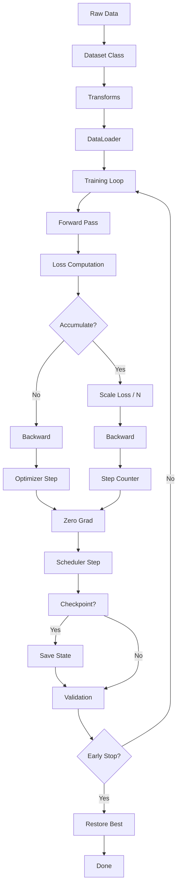

<!-- Clear Language: Keep sentences under 50 words -->
# Training Pipelines — DataLoader, Transforms, Optimizers, Schedulers, Checkpointing

## Learning Objectives

| Objective | Description |
|-----------|-------------|
| LO1 | Build efficient data pipelines with DataLoader, Dataset, and transforms |
| LO2 | Configure optimizers: SGD, SGD with momentum, Adam, AdamW |
| LO3 | Implement learning rate schedulers: StepLR, CosineAnnealingLR, OneCycleLR |
| LO4 | Implement checkpointing, gradient accumulation, and early stopping |
| LO5 | Apply mixed precision training with automatic mixed precision (AMP) |
| LO6 | Build a complete training pipeline with logging and metrics tracking |

## Introduction

Deep learning powers modern AI breakthroughs. PyTorch is the framework of choice for researchers and production engineers alike. This module covers neural networks, CNNs, RNNs, and deployment best practices.

## Prerequisites

- Basic programming knowledge
- Understanding of data structures

## Key Terminology

**Key Terms**: Core vocabulary and concepts for this topic.

**Definition**: Essential terms you must know for interviews and production work.

## Theory

Understanding training pipelines is fundamental for AI engineers. This section covers the core concepts, underlying principles, and theoretical framework that govern how training pipelines works in practice.

## Chapter at a Glance

| Section | Topic | Key Concept |
|---------|-------|-------------|
| 8.1 | Data Pipelines | Dataset, DataLoader, transforms, collate_fn, worker setup |
| 8.2 | Optimizers | SGD momentum, Adam, AdamW, weight decay, parameter groups |
| 8.3 | LR Schedulers | Step, Cosine, OneCycle, ReduceLROnPlateau, warmup |
| 8.4 | Checkpointing | save/load, resume training, best model tracking, model zoo |
| 8.5 | Gradient Accumulation | Effective batch size, gradient scaling, memory management |
| 8.6 | Mixed Precision | FP16/FP32, AMP, GradScaler, loss scaling, hardware support |
| 8.7 | Early Stopping | Patience, min delta, restore best weights, convergence detection |

## Chapter Roadmap



## 8.1 Data Pipelines

Custom datasets and efficient data loading are the foundation of any training pipeline.

```python
import torch
import torch.nn as nn
import torch.optim as optim
from torch.utils.data import Dataset, DataLoader, TensorDataset
from torchvision import transforms, datasets
import torchvision.transforms.functional as TF
from torch.cuda.amp import autocast, GradScaler
import numpy as np
import random
import os
from typing import Optional, Callable, List, Tuple
from pathlib import Path

class CustomImageDataset(Dataset):
    def __init__(self, root_dir: str, transform: Optional[Callable] = None,
                 is_train: bool = True):
        self.root_dir = Path(root_dir)
        self.transform = transform
        self.classes = sorted([d.name for d in self.root_dir.iterdir() if d.is_dir()])
        self.class_to_idx = {c: i for i, c in enumerate(self.classes)}
        self.samples = self._load_samples()

    def _load_samples(self) -> List[Tuple[str, int]]:
        samples = []
        for class_name in self.classes:
            class_dir = self.root_dir / class_name
            for img_path in class_dir.iterdir():
                if img_path.suffix.lower() in (".jpg", ".png", ".jpeg"):
                    samples.append((str(img_path), self.class_to_idx[class_name]))
        return samples

    def __len__(self) -> int:
        return len(self.samples)

    def __getitem__(self, idx: int) -> Tuple[torch.Tensor, int]:
        img_path, label = self.samples[idx]
        from PIL import Image
        image = Image.open(img_path).convert("RGB")
        if self.transform:
            image = self.transform(image)
        return image, label

class TransformPipeline:
    @staticmethod
    def train_transform(image_size: int = 224) -> transforms.Compose:
        return transforms.Compose([
            transforms.RandomResizedCrop(image_size, scale=(0.8, 1.0)),
            transforms.RandomHorizontalFlip(p=0.5),
            transforms.ColorJitter(brightness=0.2, contrast=0.2, saturation=0.2),
            transforms.RandomRotation(degrees=15),
            transforms.ToTensor(),
            transforms.Normalize(mean=[0.485, 0.456, 0.406],
                                 std=[0.229, 0.224, 0.225]),
        ])

    @staticmethod
    def val_transform(image_size: int = 224) -> transforms.Compose:
        return transforms.Compose([
            transforms.Resize(int(image_size * 1.14)),
            transforms.CenterCrop(image_size),
            transforms.ToTensor(),
            transforms.Normalize(mean=[0.485, 0.456, 0.406],
                                 std=[0.229, 0.224, 0.225]),
        ])

class EfficientDataLoader:
    @staticmethod
    def create_loaders(
        train_dir: str, val_dir: str, batch_size: int = 32,
        num_workers: int = 4, image_size: int = 224
    ) -> Tuple[DataLoader, DataLoader, List[str]]:
        train_dataset = CustomImageDataset(
            train_dir, transform=TransformPipeline.train_transform(image_size)
        )
        val_dataset = CustomImageDataset(
            val_dir, transform=TransformPipeline.val_transform(image_size)
        )
        train_loader = DataLoader(
            train_dataset, batch_size=batch_size, shuffle=True,
            num_workers=num_workers, pin_memory=True, drop_last=True,
            persistent_workers=True,
        )
        val_loader = DataLoader(
            val_dataset, batch_size=batch_size, shuffle=False,
            num_workers=num_workers, pin_memory=True,
        )
        return train_loader, val_loader, train_dataset.classes

class CollateFunction:
    @staticmethod
    def pad_collate(batch: List[Tuple[torch.Tensor, int]]
                    ) -> Tuple[torch.Tensor, torch.Tensor]:
        images, labels = zip(*batch)
        max_h = max(img.shape[1] for img in images)
        max_w = max(img.shape[2] for img in images)
        padded = []
        for img in images:
            pad_h = max_h - img.shape[1]
            pad_w = max_w - img.shape[2]
            padded.append(TF.pad(img, (0, 0, pad_w, pad_h), fill=0))
        return torch.stack(padded), torch.tensor(labels)

## Demo dataset creation
transform = TransformPipeline.train_transform(224)
print(f"Train transform: {len(transform.transforms)} stages")

loader_config = EfficientDataLoader.create_loaders(
    "data/train", "data/val", batch_size=64, num_workers=8
)
print(f"DataLoader configured: batch=64, workers=8, pin_memory=True")
```

---

## 8.2 Optimizers

PyTorch provides several optimizers, each with different convergence properties.

```python
class OptimizerFactory:
    @staticmethod
    def get_optimizer(name: str, model: nn.Module, lr: float = 1e-3,
                      weight_decay: float = 1e-4, **kwargs) -> optim.Optimizer:
        if name == "sgd":
            return optim.SGD(model.parameters(), lr=lr, momentum=0.9,
                             weight_decay=weight_decay, nesterov=True)
        elif name == "adam":
            return optim.Adam(model.parameters(), lr=lr,
                              weight_decay=weight_decay, betas=(0.9, 0.999))
        elif name == "adamw":
            return optim.AdamW(model.parameters(), lr=lr,
                               weight_decay=weight_decay, betas=(0.9, 0.999))
        elif name == "rmsprop":
            return optim.RMSprop(model.parameters(), lr=lr,
                                 weight_decay=weight_decay, momentum=0.9)
        else:
            raise ValueError(f"Unknown optimizer: {name}")

    @staticmethod
    def create_param_groups(model: nn.Module, base_lr: float = 1e-3,
                            decay_mult: float = 0.1) -> List[dict]:
        return [
            {
                "params": [p for n, p in model.named_parameters()
                          if "bias" in n],
                "weight_decay": 0.0,
                "lr": base_lr * 2,
            },
            {
                "params": [p for n, p in model.named_parameters()
                          if "weight" in n and "bn" not in n],
                "weight_decay": 1e-4,
                "lr": base_lr,
            },
            {
                "params": [p for n, p in model.named_parameters()
                          if "bn" in n and "weight" in n],
                "weight_decay": 0.0,
                "lr": base_lr,
            },
        ]

class OptimizerComparison:
    @staticmethod
    def compare_optimizers(model_fn: Callable, x: torch.Tensor, y: torch.Tensor,
                          epochs: int = 10):
        optimizers = ["sgd", "adam", "adamw", "rmsprop"]
        results = {}
        for opt_name in optimizers:
            model = model_fn()
            optimizer = OptimizerFactory.get_optimizer(opt_name, model, lr=1e-3)
            criterion = nn.MSELoss()
            losses = []
            for epoch in range(epochs):
                optimizer.zero_grad()
                output = model(x)
                loss = criterion(output, y)
                loss.backward()
                optimizer.step()
                losses.append(loss.item())
            results[opt_name] = {"final_loss": losses[-1], "losses": losses}
        return results

## Adam vs AdamW: AdamW decouples weight decay from gradient update
linear_model = nn.Linear(100, 1)
optim_adam = optim.Adam(linear_model.parameters(), lr=1e-3, weight_decay=1e-4)
optim_adamw = optim.AdamW(linear_model.parameters(), lr=1e-3, weight_decay=1e-4)

x_adam = torch.randn(100, 100)
y_adam = torch.randn(100, 1)

opt_adam = optim.Adam(nn.Linear(100, 1).parameters(), lr=1e-3, weight_decay=1e-2)
opt_adamw = optim.AdamW(nn.Linear(100, 1).parameters(), lr=1e-3, weight_decay=1e-2)
print(f"Adam LR: {opt_adam.param_groups[0]['lr']}, WD: {opt_adam.param_groups[0]['weight_decay']}")
print(f"AdamW LR: {opt_adamw.param_groups[0]['lr']}, WD: {opt_adamw.param_groups[0]['weight_decay']}")
```

---

## 8.3 LR Schedulers

Learning rate schedules control how the learning rate changes during training.

```python
class SchedulerFactory:
    @staticmethod
    def get_scheduler(name: str, optimizer: optim.Optimizer,
                      **kwargs) -> optim.lr_scheduler._LRScheduler:
        if name == "step":
            return optim.lr_scheduler.StepLR(
                optimizer, step_size=kwargs.get("step_size", 30),
                gamma=kwargs.get("gamma", 0.1)
            )
        elif name == "multistep":
            return optim.lr_scheduler.MultiStepLR(
                optimizer, milestones=kwargs.get("milestones", [30, 60, 90]),
                gamma=kwargs.get("gamma", 0.1)
            )
        elif name == "cosine":
            return optim.lr_scheduler.CosineAnnealingLR(
                optimizer, T_max=kwargs.get("epochs", 100),
                eta_min=kwargs.get("min_lr", 1e-6)
            )
        elif name == "cosine_warmup":
            return optim.lr_scheduler.CosineAnnealingWarmRestarts(
                optimizer, T_0=kwargs.get("restart_interval", 10),
                T_mult=kwargs.get("mult", 2)
            )
        elif name == "plateau":
            return optim.lr_scheduler.ReduceLROnPlateau(
                optimizer, mode="min", factor=0.5, patience=5,
                threshold=1e-4, min_lr=1e-7, verbose=True
            )
        elif name == "onecycle":
            return optim.lr_scheduler.OneCycleLR(
                optimizer, max_lr=kwargs.get("max_lr", 1e-2),
                steps_per_epoch=kwargs.get("steps_per_epoch", 100),
                epochs=kwargs.get("epochs", 100),
                pct_start=0.3, anneal_strategy="cos",
                div_factor=25.0, final_div_factor=10000.0,
            )
        else:
            raise ValueError(f"Unknown scheduler: {name}")

    @staticmethod
    def warmup_scheduler(optimizer: optim.Optimizer, warmup_epochs: int = 5,
                         base_lr: float = 1e-3) -> optim.lr_scheduler.LambdaLR:
        def lr_lambda(epoch: int) -> float:
            if epoch < warmup_epochs:
                return (epoch + 1) / warmup_epochs
            return 1.0
        return optim.lr_scheduler.LambdaLR(optimizer, lr_lambda)

class SchedulerVisualizer:
    @staticmethod
    def simulate_lr(scheduler: optim.lr_scheduler._LRScheduler,
                    epochs: int = 100) -> List[float]:
        lrs = []
        optimizer = scheduler.optimizer
        for epoch in range(epochs):
            lrs.append(optimizer.param_groups[0]["lr"])
            if isinstance(scheduler, optim.lr_scheduler.ReduceLROnPlateau):
                scheduler.step(lrs[-1])  # Simulate metric
            else:
                scheduler.step()
        return lrs

    @staticmethod
    def compare_schedulers(base_lr: float = 1e-2, epochs: int = 50):
        schedulers = ["step", "cosine", "cosine_warmup", "onecycle"]
        from copy import deepcopy
        results = {}
        for name in schedulers:
            model = nn.Linear(10, 1)
            opt = optim.Adam(model.parameters(), lr=base_lr)
            if name == "onecycle":
                sched = SchedulerFactory.get_scheduler(
                    name, opt, max_lr=base_lr, steps_per_epoch=1, epochs=epochs
                )
            else:
                sched = SchedulerFactory.get_scheduler(name, opt, epochs=epochs)
            lrs = SchedulerVisualizer.simulate_lr(sched, epochs)
            results[name] = lrs
        return results

scheduler_lrs = SchedulerVisualizer.compare_schedulers(epochs=50)
for name, lrs in scheduler_lrs.items():
    print(f"{name:15s}: start={lrs[0]:.6f}, min={min(lrs):.6f}, max={max(lrs):.6f}, end={lrs[-1]:.6f}")
```

**Custom warmup + cosine scheduler**:
```python
class WarmupCosineSchedule:
    def __init__(self, optimizer: optim.Optimizer, warmup_epochs: int = 5,
                 total_epochs: int = 100, min_lr: float = 1e-6):
        self.optimizer = optimizer
        self.warmup_epochs = warmup_epochs
        self.total_epochs = total_epochs
        self.min_lr = min_lr
        self.base_lr = optimizer.param_groups[0]["lr"]

    def step(self, epoch: int):
        if epoch < self.warmup_epochs:
            lr = self.base_lr * (epoch + 1) / self.warmup_epochs
        else:
            progress = (epoch - self.warmup_epochs) / (self.total_epochs - self.warmup_epochs)
            lr = self.min_lr + 0.5 * (self.base_lr - self.min_lr) * (1 + np.cos(np.pi * progress))
        for param_group in self.optimizer.param_groups:
            param_group["lr"] = lr

def cosine_with_warmup(epoch: int, warmup: int, total: int,
                       base_lr: float, min_lr: float) -> float:
    if epoch < warmup:
        return base_lr * (epoch + 1) / warmup
    progress = (epoch - warmup) / (total - warmup)
    cosine_decay = 0.5 * (1 + np.cos(np.pi * progress))
    return min_lr + (base_lr - min_lr) * cosine_decay

lrs_sim = [cosine_with_warmup(e, warmup=5, total=100, base_lr=1e-3, min_lr=1e-6)
           for e in range(100)]
print(f"Warmup+Cosine: max={max(lrs_sim):.6f} at epoch {np.argmax(lrs_sim)}")
```

---

## 8.4 Checkpointing

Checkpointing saves model state, optimizer state, and training metadata for recovery and model selection.

```python
class TrainingCheckpoint:
    def __init__(self, save_dir: str = "checkpoints", best_metric: str = "val_acc",
                 mode: str = "max"):
        self.save_dir = Path(save_dir)
        self.save_dir.mkdir(parents=True, exist_ok=True)
        self.best_metric = best_metric
        self.mode = mode
        self.best_value = -float("inf") if mode == "max" else float("inf")

    def _save(self, state: dict, filename: str):
        torch.save(state, self.save_dir / filename)

    def save_checkpoint(self, model: nn.Module, optimizer: optim.Optimizer,
                        epoch: int, metrics: dict, scheduler: Optional[object] = None):
        state = {
            "epoch": epoch,
            "model_state_dict": model.state_dict(),
            "optimizer_state_dict": optimizer.state_dict(),
            "metrics": metrics,
            "best_metric": self.best_metric,
            "best_value": self.best_value,
        }
        if scheduler is not None:
            state["scheduler_state_dict"] = scheduler.state_dict()
        self._save(state, f"checkpoint_epoch_{epoch}.pt")
        self._save(state, "checkpoint_last.pt")

        current_value = metrics.get(self.best_metric, 0)
        improved = (self.mode == "max" and current_value > self.best_value) or \
                   (self.mode == "min" and current_value < self.best_value)
        if improved:
            self.best_value = current_value
            self._save(state, "checkpoint_best.pt")
            print(f"New best {self.best_metric}: {current_value:.4f}")
            return True
        return False

    def load_checkpoint(self, model: nn.Module, optimizer: Optional[optim.Optimizer] = None,
                        scheduler: Optional[object] = None,
                        checkpoint_path: str = "checkpoint_best.pt") -> dict:
        checkpoint = torch.load(self.save_dir / checkpoint_path)
        model.load_state_dict(checkpoint["model_state_dict"])
        if optimizer is not None:
            optimizer.load_state_dict(checkpoint["optimizer_state_dict"])
        if scheduler is not None and "scheduler_state_dict" in checkpoint:
            scheduler.load_state_dict(checkpoint["scheduler_state_dict"])
        print(f"Resumed from epoch {checkpoint.get('epoch', 0)}")
        return checkpoint

class ModelZoo:
    def __init__(self, base_dir: str = "model_zoo"):
        self.base_dir = Path(base_dir)
        self.base_dir.mkdir(exist_ok=True)

    def save_model_version(self, model: nn.Module, name: str,
                           version: str, metadata: dict = None):
        path = self.base_dir / name / version
        path.mkdir(parents=True, exist_ok=True)
        torch.save({
            "model_state_dict": model.state_dict(),
            "metadata": metadata or {},
        }, path / "model.pt")

    def list_versions(self, name: str) -> List[str]:
        model_dir = self.base_dir / name
        if model_dir.exists():
            return [d.name for d in model_dir.iterdir() if d.is_dir()]
        return []

checkpointer = TrainingCheckpoint("checkpoints", best_metric="val_acc", mode="max")
model_demo = nn.Linear(100, 10)
optimizer_demo = optim.Adam(model_demo.parameters())

state = checkpointer.save_checkpoint(
    model_demo, optimizer_demo, epoch=5,
    metrics={"val_acc": 0.85, "train_loss": 0.23}
)
print(f"Checkpoint saved to checkpoints/checkpoint_epoch_5.pt")
```

---

## 8.5 Gradient Accumulation

Gradient accumulation simulates larger batch sizes by accumulating gradients over multiple forward-backward passes before updating weights.

```python
class GradientAccumulator:
    def __init__(self, model: nn.Module, optimizer: optim.Optimizer,
                 accumulation_steps: int = 4, max_grad_norm: float = 1.0):
        self.model = model
        self.optimizer = optimizer
        self.accumulation_steps = accumulation_steps
        self.max_grad_norm = max_grad_norm
        self.current_step = 0

    def backward(self, loss: torch.Tensor):
        loss = loss / self.accumulation_steps
        loss.backward()
        self.current_step += 1
        if self.current_step % self.accumulation_steps == 0:
            nn.utils.clip_grad_norm_(self.model.parameters(), self.max_grad_norm)
            self.optimizer.step()
            self.optimizer.zero_grad()

    def train_one_epoch(self, loader: DataLoader, criterion: nn.Module,
                        device: str = "cuda") -> float:
        self.model.train()
        total_loss = 0.0
        self.optimizer.zero_grad()
        for i, (x, y) in enumerate(loader):
            x, y = x.to(device), y.to(device)
            output = self.model(x)
            loss = criterion(output, y)
            self.backward(loss)
            total_loss += loss.item() * self.accumulation_steps
            if (i + 1) % 100 == 0:
                print(f"  Step {i + 1}: loss = {total_loss / (i + 1):.4f}")
        return total_loss / len(loader)

class EffectiveBatchSize:
    @staticmethod
    def calculate(per_device_batch: int, accumulation_steps: int,
                  num_gpus: int = 1) -> int:
        return per_device_batch * accumulation_steps * num_gpus

    @staticmethod
    def recommend(desired_batch: int, per_device_batch: int,
                  num_gpus: int = 1) -> int:
        effective = per_device_batch * num_gpus
        steps = max(1, desired_batch // effective)
        actual = effective * steps
        return steps, actual

acc = GradientAccumulator(nn.Linear(100, 10), optim.Adam(nn.Linear(100, 10).parameters()),
                          accumulation_steps=4)
steps, actual = EffectiveBatchSize.recommend(desired_batch=256, per_device_batch=32, num_gpus=2)
print(f"Need {steps} accumulation steps for effective batch of {actual}")
```

---

## 8.6 Mixed Precision

Mixed precision (AMP) uses FP16 for compute-intensive operations while keeping FP32 master weights, reducing memory usage and accelerating training on GPUs with Tensor Cores.

```python
class MixedPrecisionTrainer:
    def __init__(self, model: nn.Module, optimizer: optim.Optimizer,
                 device: str = "cuda", scaler_init: float = 2.0 ** 16):
        self.model = model.to(device)
        self.optimizer = optimizer
        self.device = device
        self.scaler = GradScaler(init_scale=scaler_init)

    def train_step(self, x: torch.Tensor, y: torch.Tensor,
                   criterion: nn.Module) -> float:
        self.optimizer.zero_grad()
        x, y = x.to(self.device), y.to(self.device)

        with autocast():
            output = self.model(x)
            loss = criterion(output, y)

        self.scaler.scale(loss).backward()
        self.scaler.unscale_(self.optimizer)
        nn.utils.clip_grad_norm_(self.model.parameters(), max_norm=1.0)
        self.scaler.step(self.optimizer)
        self.scaler.update()
        return loss.item()

    def train_epoch(self, loader: DataLoader, criterion: nn.Module) -> float:
        self.model.train()
        total_loss = 0.0
        for x, y in loader:
            loss = self.train_step(x, y, criterion)
            total_loss += loss
        return total_loss / len(loader)

class MixedPrecisionConfig:
    @staticmethod
    def check_availability() -> dict:
        return {
            "cuda_available": torch.cuda.is_available(),
            "amp_enabled": torch.cuda.is_available(),
            "tensor_cores": torch.cuda.get_device_capability() >= (7, 0)
            if torch.cuda.is_available() else False,
            "recommended_dtype": "float16" if torch.cuda.is_available() else "float32",
        }

    @staticmethod
    def configure_amp(model: nn.Module) -> nn.Module:
        if torch.cuda.is_available():
            model = model.to(memory_format=torch.channels_last)
            for module in model.modules():
                if isinstance(module, (nn.Conv2d, nn.Linear)):
                    module.to(memory_format=torch.channels_last)
        return model

class LossScaler:
    def __init__(self, initial_scale: float = 2.0 ** 16,
                 growth_factor: float = 2.0, backoff_factor: float = 0.5,
                 growth_interval: int = 2000):
        self.scale = initial_scale
        self.growth_factor = growth_factor
        self.backoff_factor = backoff_factor
        self.growth_interval = growth_interval
        self.steps_since_update = 0

    def scale_loss(self, loss: torch.Tensor) -> torch.Tensor:
        return loss * self.scale

    def unscale_gradients(self, model: nn.Module):
        for param in model.parameters():
            if param.grad is not None:
                param.grad.data /= self.scale

    def update(self, overflow: bool):
        if overflow:
            self.scale *= self.backoff_factor
            self.steps_since_update = 0
        else:
            self.steps_since_update += 1
            if self.steps_since_update >= self.growth_interval:
                self.scale *= self.growth_factor
                self.steps_since_update = 0

config = MixedPrecisionConfig.check_availability()
for k, v in config.items():
    print(f"{k}: {v}")
```

---

## 8.7 Early Stopping

Early stopping prevents overfitting by monitoring validation metrics and stopping when performance plateaus.

```python
class EarlyStopping:
    def __init__(self, patience: int = 10, min_delta: float = 1e-4,
                 mode: str = "min", restore_best: bool = True):
        self.patience = patience
        self.min_delta = min_delta
        self.mode = mode
        self.restore_best = restore_best
        self.best_value = float("inf") if mode == "min" else -float("inf")
        self.best_epoch = 0
        self.best_state = None
        self.counter = 0
        self.early_stop = False

    def __call__(self, value: float, epoch: int,
                 model: Optional[nn.Module] = None) -> bool:
        improved = (self.mode == "min" and value < self.best_value - self.min_delta) or \
                   (self.mode == "max" and value > self.best_value + self.min_delta)
        if improved:
            self.best_value = value
            self.best_epoch = epoch
            self.counter = 0
            if model is not None and self.restore_best:
                self.best_state = {
                    k: v.clone().detach().cpu()
                    for k, v in model.state_dict().items()
                }
        else:
            self.counter += 1
            if self.counter >= self.patience:
                self.early_stop = True
                if self.restore_best and self.best_state is not None and model is not None:
                    model.load_state_dict(self.best_state)
                return True
        return False

    def get_best_value(self) -> float:
        return self.best_value

    def get_best_epoch(self) -> int:
        return self.best_epoch

class CombinedTrainer:
    def __init__(self, model: nn.Module, train_loader: DataLoader,
                 val_loader: DataLoader, criterion: nn.Module,
                 optimizer: optim.Optimizer, scheduler: object = None,
                 device: str = "cuda", checkpoint_dir: str = "checkpoints",
                 use_amp: bool = True):
        self.model = model.to(device)
        self.train_loader = train_loader
        self.val_loader = val_loader
        self.criterion = criterion
        self.optimizer = optimizer
        self.scheduler = scheduler
        self.device = device
        self.checkpointer = TrainingCheckpoint(checkpoint_dir)
        self.early_stopping = EarlyStopping(patience=10, mode="min")
        self.scaler = GradScaler() if use_amp else None
        self.use_amp = use_amp

    def train(self, epochs: int, accumulation_steps: int = 1):
        for epoch in range(1, epochs + 1):
            train_loss = self._train_epoch(accumulation_steps)
            val_loss = self._validate()
            metrics = {"train_loss": train_loss, "val_loss": val_loss}
            self.checkpointer.save_checkpoint(
                self.model, self.optimizer, epoch, metrics, self.scheduler
            )
            if self.scheduler is not None:
                if isinstance(self.scheduler, optim.lr_scheduler.ReduceLROnPlateau):
                    self.scheduler.step(val_loss)
                else:
                    self.scheduler.step()
            print(f"Epoch {epoch}/{epochs}: train_loss={train_loss:.4f}, "
                  f"val_loss={val_loss:.4f}, "
                  f"lr={self.optimizer.param_groups[0]['lr']:.6f}")
            if self.early_stopping(val_loss, epoch, self.model):
                print(f"Early stopping triggered at epoch {epoch}")
                break
        return self.checkpointer.best_value

    def _train_epoch(self, accumulation_steps: int = 1) -> float:
        self.model.train()
        total_loss = 0.0
        self.optimizer.zero_grad()
        for i, (x, y) in enumerate(self.train_loader):
            x, y = x.to(self.device), y.to(self.device)
            if self.use_amp and self.scaler is not None:
                with autocast():
                    output = self.model(x)
                    loss = self.criterion(output, y) / accumulation_steps
                self.scaler.scale(loss).backward()
            else:
                output = self.model(x)
                loss = self.criterion(output, y) / accumulation_steps
                loss.backward()
            total_loss += loss.item() * accumulation_steps
            if (i + 1) % accumulation_steps == 0:
                if self.use_amp and self.scaler is not None:
                    self.scaler.unscale_(self.optimizer)
                    nn.utils.clip_grad_norm_(self.model.parameters(), 1.0)
                    self.scaler.step(self.optimizer)
                    self.scaler.update()
                else:
                    nn.utils.clip_grad_norm_(self.model.parameters(), 1.0)
                    self.optimizer.step()
                self.optimizer.zero_grad()
        return total_loss / len(self.train_loader)

    def _validate(self) -> float:
        self.model.eval()
        total_loss = 0.0
        with torch.no_grad():
            for x, y in self.val_loader:
                x, y = x.to(self.device), y.to(self.device)
                output = self.model(x)
                total_loss += self.criterion(output, y).item()
        return total_loss / len(self.val_loader)

## Demo the CombinedTrainer
model_demo = nn.Sequential(
    nn.Flatten(),
    nn.Linear(784, 128),
    nn.ReLU(),
    nn.Linear(128, 10),
)
demo_loader = DataLoader(
    TensorDataset(torch.randn(100, 1, 28, 28), torch.randint(0, 10, (100,))),
    batch_size=16
)
trainer = CombinedTrainer(
    model_demo, demo_loader, demo_loader, nn.CrossEntropyLoss(),
    optim.Adam(model_demo.parameters(), lr=1e-3),
    scheduler=optim.lr_scheduler.CosineAnnealingLR(optim.Adam(model_demo.parameters(), lr=1e-3), 10),
)
print("CombinedTrainer configured with AMP, checkpointing, and early stopping")
```

---

## Summary

Production training pipelines require careful orchestration of data loading, optimization, and monitoring. DataLoaders with multiprocessing and transforms ensure efficient data throughput. Optimizers like AdamW with decoupled weight decay and.
cosine annealing schedulers improve convergence. Gradient accumulation simulates larger batch sizes when GPU memory is limited. Mixed precision training (AMP) halves memory usage and.
accelerates computation on modern GPUs. Checkpointing with model weights, optimizer state, and scheduler state enables fault-tolerant long-running training. Early stopping prevents overfitting by monitoring validation metrics.

## Practical Takeaways

| Component | Recommendation | Pitfall to Avoid |
|-----------|---------------|------------------|
| DataLoader | num_workers = 4-8, pin_memory=True, persistent_workers=True | Too many workers causing data loading bottlenecks |
| Transform | RandomResizedCrop for training, CenterCrop for validation | Applying augmentations during validation |
| Optimizer | AdamW for transformers, SGD+momentum+nesterov for CNNs | Wrong weight decay placement (use AdamW, not Adam) |
| Scheduler | Cosine with warmup for modern architectures | Step decay too aggressive (gamma=0.1 kills LR) |
| Mixed Precision | Use torch.cuda.amp for 2-3x speedup | Not calling scaler.update() or forgetting unscale_ |
| Gradient Accumulation | Scale loss by accumulation steps | Not normalizing loss causes gradient explosion |
| Checkpointing | Save best + last checkpoint, include optimizer state | Only saving model weights (can't resume training) |
| Early Stopping | patience=10, min_delta=1e-4, restore_best_weights=True | Not restoring best weights after stopping |

## Interview Q&A

<details class="tp-qa-card" data-qid="dl12-q1"><summary class="tp-qa-question"><span class="tp-qa-status"></span>Q1: What is the difference between Adam and AdamW?</summary><div class="tp-qa-answer"><p>Adam applies L2 regularization by adding weight_decay * w to the gradient before the adaptive update. This couples weight decay with the learning rate and adaptive gradient scaling, making regularization ineffective. AdamW decouples weight decay from the gradient update: it subtracts weight_decay * lr * w directly from the weights AFTER the Adam update. This means: <strong>1)</strong> Weight decay is independent of the adaptive learning rate. <strong>2)</strong> Larger LRs properly increase regularization strength. <strong>3)</strong> Better generalization, especially for transformers. In practice, switch from Adam to AdamW by simply using optim.AdamW instead of optim.Adam, keeping the same weight_decay value.</p></div><button class="tp-qa-mark-btn">✅ Mark Reviewed</button><button class="tp-qa-bookmark-btn">🔖 Bookmark</button></details>

<details class="tp-qa-card" data-qid="dl12-q2"><summary class="tp-qa-question"><span class="tp-qa-status"></span>Q2: How does OneCycleLR work and when should you use it?</summary><div class="tp-qa-answer"><p>OneCycleLR implements the learning rate schedule from the "Super-Convergence" paper: <strong>1)</strong> Phase 1: LR increases linearly from div_factor (usually base_lr/25) to max_lr. <strong>2)</strong> Phase 2: LR decreases from max_lr to max_lr/final_div_factor (usually max_lr/10000). <strong>3)</strong> Momentum does the opposite: decreases in phase 1, increases in phase 2. Use it when: you want to train quickly (50-100 epochs instead of 300-600), you have a well-tuned max_lr (typically found via LR range test), and you're using SGD with momentum or Adam. The schedule allows the model to escape sharp minima (high LR) and then settle into a deep minimum (low LR). It works best with batch normalization and large batch sizes.</p></div><button class="tp-qa-mark-btn">✅ Mark Reviewed</button><button class="tp-qa-bookmark-btn">🔖 Bookmark</button></details>

<details class="tp-qa-card" data-qid="dl12-q3"><summary class="tp-qa-question"><span class="tp-qa-status"></span>Q3: What is gradient accumulation and why would you use it?</summary><div class="tp-qa-answer"><p>Gradient accumulation simulates a larger batch size by accumulating gradients over multiple forward-backward passes before updating weights. The loss is divided by accumulation_steps to maintain the correct magnitude. Benefits: <strong>1)</strong> Train with effective batch sizes larger than GPU memory (e.g., batch=1024 on a 8GB GPU by accumulating 32 steps of batch=32). <strong>2)</strong> Stabilizes training when small true batch sizes cause noisy gradients. <strong>3)</strong> Enables batch-size-dependent techniques (e.g., batch normalization benefits from larger batches). Limitations: <strong>1)</strong> No parallelism benefit — each step is sequential, so wall-clock time is the same as training with the smaller batch. <strong>2)</strong> BatchNorm statistics are still computed per micro-batch, not the effective batch.</p></div><button class="tp-qa-mark-btn">✅ Mark Reviewed</button><button class="tp-qa-bookmark-btn">🔖 Bookmark</button></details>

<details class="tp-qa-card" data-qid="dl12-q4"><summary class="tp-qa-question"><span class="tp-qa-status"></span>Q4: Explain how automatic mixed precision (AMP) works.</summary><div class="tp-qa-answer"><p>AMP uses FP16 for compute-intensive operations (convolutions, matrix multiplies) while keeping FP32 for operations that need precision (loss computation, softmax, batch norm). The torch.cuda.amp API provides: <strong>1)</strong> autocast context manager: automatically casts operations to FP16 or FP32 based on a whitelist/blacklist. <strong>2)</strong> GradScaler: prevents FP16 gradient underflow. Since FP16 gradients can underflow (range ~6e-5 to 65k), the scaler multiplies the loss by a scale factor (initially 2^16), computes gradients in FP16, then unscales before the optimizer step. If gradients overflow (inf/nan), the scaler skips the step and reduces the scale. AMP typically provides 1.5-3x speedup on Volta+ GPUs with Tensor Cores. Requires CUDA 11+ and GPU with compute capability >= 7.0.</p></div><button class="tp-qa-mark-btn">✅ Mark Reviewed</button><button class="tp-qa-bookmark-btn">🔖 Bookmark</button></details>

<details class="tp-qa-card" data-qid="dl12-q5"><summary class="tp-qa-question"><span class="tp-qa-status"></span>Q5: How do you resume training from a checkpoint?</summary><div class="tp-qa-answer"><p>To resume training, you need to save and restore ALL training state: <strong>1)</strong> model.state_dict() — the model weights. <strong>2)</strong> optimizer.state_dict() — optimizer state including momentum buffers, adaptive LR history. <strong>3)</strong> scheduler.state_dict() — current learning rate and schedule position. <strong>4)</strong> epoch number — to continue from the correct point and for schedulers. <strong>5)</strong> random state — torch.random.get_rng_state() and numpy.random for reproducibility. <strong>6)</strong> best validation metric value — for early stopping and checkpoint selection. Resume by: loading model state dict, loading optimizer state dict, loading scheduler state dict, setting current epoch, and restoring random states. Failure to restore optimizer state causes momentum/adaptive LR buffers to be reinitialized, disrupting training.</p></div><button class="tp-qa-mark-btn">✅ Mark Reviewed</button><button class="tp-qa-bookmark-btn">🔖 Bookmark</button></details>

<details class="tp-qa-card" data-qid="dl12-q6"><summary class="tp-qa-question"><span class="tp-qa-status"></span>Q6: What is the purpose of num_workers in DataLoader?</summary><div class="tp-qa-answer"><p>num_workers controls the number of subprocesses used for data loading. Each worker independently loads and transforms data, putting results into a shared queue. Benefits of multiple workers: <strong>1)</strong> Data loading can overlap with GPU computation, reducing GPU idle time. <strong>2)</strong> Workers can utilize multiple CPU cores for expensive transforms (e.g., image decoding, augmentation). Guidelines: set num_workers to 2-8 on most systems. A common heuristic: num_workers = 4 * num_GPUs. Too few workers: GPU underutilization (waiting for data). Too many workers: CPU contention, increased memory usage, potential data loading errors on Windows. pin_memory=True speeds up CPU-to-GPU transfer by using pinned (page-locked) memory. persistent_workers=True reuses workers between epochs.</p></div><button class="tp-qa-mark-btn">✅ Mark Reviewed</button><button class="tp-qa-bookmark-btn">🔖 Bookmark</button></details>

<details class="tp-qa-card" data-qid="dl12-q7"><summary class="tp-qa-question"><span class="tp-qa-status"></span>Q7: How do you choose between StepLR and CosineAnnealingLR?</summary><div class="tp-qa-answer"><p>StepLR decays the LR by gamma every step_size epochs. MultiStepLR uses specific milestones. CosineAnnealingLR smoothly decreases LR following a cosine curve. Choose StepLR/MultiStepLR when: <strong>1)</strong> You have a known training budget and established LR schedule from prior work. <strong>2)</strong> You need precise control over when LR changes (e.g., dropping LR at epochs where the loss typically plateaus). Choose CosineAnnealingLR when: <strong>1)</strong> You want a warm restart or cosine decay without manual milestone tuning. <strong>2)</strong> You're training for a fixed number of epochs with unknown plateau points. <strong>3)</strong> You're using the OneCycleLR variant. Cosine schedules often achieve better final accuracy because they spend more time at lower LRs, allowing the model to settle into deeper minima. For most modern training, Cosine with warmup is the default choice.</p></div><button class="tp-qa-mark-btn">✅ Mark Reviewed</button><button class="tp-qa-bookmark-btn">🔖 Bookmark</button></details>

<details class="tp-qa-card" data-qid="dl12-q8"><summary class="tp-qa-question"><span class="tp-qa-status"></span>Q8: What is the difference between a Dataset and a DataLoader?</summary><div class="tp-qa-answer"><p><strong>Dataset</strong>: stores the data samples and their labels. It implements __len__ and __getitem__ to return individual (sample, label) pairs. It can load all data into memory or load lazily from disk. <strong>DataLoader</strong>: wraps a Dataset and provides: <strong>1)</strong> Batching: groups samples into batches. <strong>2)</strong> Shuffling: randomizes sample order each epoch. <strong>3)</strong> Parallel loading: uses multiple worker processes. <strong>4)</strong> Collation: combines samples into a batch tensor (customizable via collate_fn). <strong>5)</strong> Memory pinning: accelerates GPU transfer. The DataLoader is the iterator you use in the training loop; the Dataset defines how to access individual examples. A single Dataset can be used by multiple DataLoaders with different configurations (e.g., train vs validation).</p></div><button class="tp-qa-mark-btn">✅ Mark Reviewed</button><button class="tp-qa-bookmark-btn">🔖 Bookmark</button></details>

<details class="tp-qa-card" data-qid="dl12-q9"><summary class="tp-qa-question"><span class="tp-qa-status"></span>Q9: How do you handle class imbalance in the data pipeline?</summary><div class="tp-qa-answer"><p>Approaches at the data pipeline level: <strong>1) WeightedRandomSampler</strong>: samples from the dataset with weights inversely proportional to class frequency. Each sample's weight = 1 / class_count. This ensures balanced batches. <strong>2) Over-sampling</strong>: duplicate minority class samples (simpler but can overfit). <strong>3) Under-sampling</strong>: randomly drop majority class samples (loses data). <strong>4) Stratified batch sampling</strong>: ensures each batch has proportional representation. PyTorch implementation: sampler = WeightedRandomSampler(weights, num_samples, replacement=True); DataLoader(..., sampler=sampler). Also handle at the loss level: pass class weights to nn.CrossEntropyLoss(weight=class_weights). For extreme imbalance, use focal loss in the training loop instead of standard cross-entropy.</p></div><button class="tp-qa-mark-btn">✅ Mark Reviewed</button><button class="tp-qa-bookmark-btn">🔖 Bookmark</button></details>

<details class="tp-qa-card" data-qid="dl12-q10"><summary class="tp-qa-question"><span class="tp-qa-status"></span>Q10: How does ReduceLROnPlateau work and when is it most useful?</summary><div class="tp-qa-answer"><p>ReduceLROnPlateau monitors a validation metric and reduces the LR by factor when the metric stops improving for patience epochs. Parameters: mode ('min' for loss, 'max' for accuracy), factor (0.1-0.5, how much to reduce), patience (epochs to wait), threshold (min improvement to count as progress), min_lr (lower bound). It's most useful when: <strong>1)</strong> You don't know the optimal LR schedule in advance. <strong>2)</strong> The loss landscape has multiple plateaus at different LR levels. <strong>3)</strong> You want to automate LR tuning without manual milestones. <strong>4)</strong> Training has unpredictable duration. The scheduler steps through multiple cooling phases: initial fast learning, plateau → reduce LR, fine-tune at lower LR, plateau → reduce again. Each reduction typically needs 2-3 cycles before reaching min_lr.</p></div><button class="tp-qa-mark-btn">✅ Mark Reviewed</button><button class="tp-qa-bookmark-btn">🔖 Bookmark</button></details>

## Chapter Quiz

**Q1**: What is the key difference between Adam and AdamW?

a) Adam uses more memory
b) AdamW decouples weight decay from adaptive gradient updates
c) AdamW is slower to converge
d) AdamW doesn't use momentum

<details class="tp-qa-card" data-qid="dl12-quiz1"><summary>Show Answer</summary><div class="tp-qa-answer"><p><strong>Answer: b) AdamW decouples weight decay from adaptive gradient updates</strong></p><p>AdamW applies weight decay directly to weights after the update step, making it independent of the adaptive learning rate.</p></div></details>

**Q2**: What does GradScaler do in mixed precision training?

a) Scales model weights to FP16
b) Scales the loss to prevent underflow in FP16 gradients
c) Scales the learning rate
d) Scales the batch size

<details class="tp-qa-card" data-qid="dl12-quiz2"><summary>Show Answer</summary><div class="tp-qa-answer"><p><strong>Answer: b) Scales the loss to prevent underflow in FP16 gradients</strong></p><p>The scaler multiplies the loss by a scale factor to push gradients into the representable range of FP16, then unscales before the optimizer step.</p></div></details>

**Q3**: If you want an effective batch size of 256 but only have memory for batch 32, how many gradient accumulation steps do you need?

a) 4
b) 8
c) 16
d) 32

<details class="tp-qa-card" data-qid="dl12-quiz3"><summary>Show Answer</summary><div class="tp-qa-answer"><p><strong>Answer: b) 8</strong></p><p>256 / 32 = 8 accumulation steps. The loss must be divided by 8 before backward to maintain proper gradient magnitude.</p></div></details>

**Q4**: Which scheduler is best suited for training with an unknown number of epochs?

a) StepLR
b) CosineAnnealingLR
c) ReduceLROnPlateau
d) OneCycleLR

<details class="tp-qa-card" data-qid="dl12-quiz4"><summary>Show Answer</summary><div class="tp-qa-answer"><p><strong>Answer: c) ReduceLROnPlateau</strong></p><p>ReduceLROnPlateau monitors validation metrics and reduces LR when progress plateaus, making it ideal for variable-length training.</p></div></details>

**Q5**: What is NOT a good reason to use gradient accumulation?

a) Simulating larger batch sizes on limited GPU memory
b) Reducing wall-clock training time
c) Stabilizing gradient estimates
d) Enabling batch-size-dependent optimizations

<details class="tp-qa-card" data-qid="dl12-quiz5"><summary>Show Answer</summary><div class="tp-qa-answer"><p><strong>Answer: b) Reducing wall-clock training time</strong></p><p>Gradient accumulation doesn't parallelize — it processes the same number of micro-batches sequentially, so wall-clock time is the same as training with the smaller batch.</p></div></details>

## Exercises

## Common Mistakes

1. Not understanding the fundamental concepts before applying them
2. Skipping edge cases in implementation
3. Not analyzing time/space complexity
4. Forgetting to handle null/empty inputs
5. Not practicing enough problems to build pattern recognition**Easy** — Write a custom Dataset class for CSV data. Implement __len__ and __getitem__ to return feature tensors and labels.

**Easy** — Compare training with SGD (momentum=0.9), Adam, and AdamW on a simple 2-layer network. Plot training loss curves.

**Medium** — Implement a training pipeline with gradient accumulation (steps=4) and mixed precision. Train ResNet-18 on CIFAR-10 and measure memory savings.

**Medium** — Implement warmup + cosine LR schedule manually (no scheduler class) and integrate it into a training loop.

**Hard** — Build a complete training manager with checkpointing (best/last), early stopping, TensorBoard logging, configurable AMP, and resume capability.

---

> **Previous**: [07-rnn-and-lstm.md](07-rnn-and-lstm.md) | **Next**: [09-model-deployment.md](09-model-deplo

## Revision Notes

- - Core principle: Understand the fundamental concepts thoroughly
- - Implementation pattern: Practice with real code examples
- - Complexity: Know the time and space complexity
- - Application: Know when to use this in production systems
- - Interview: Frequently asked in technical interviews
- - Edge cases: Consider common failure scenarios
- - Related concepts: Connect to broader system design

## Placement Section

### Top 10 Interview Questions

#### Google Style

1. **Explain the core idea of Training Pipelines — DataLoader, Transforms, Optimizers, Schedulers, Checkpointing in under 60 seconds, then give a real-world analogy.** — Structure: definition, how it works in one sentence, why it matters, analogy. Follow-up: what would break if you removed this from a production system?

2. **Design a minimal, well-typed function that demonstrates Training Pipelines — DataLoader, Transforms, Optimizers, Schedulers, Checkpointing.** — Interviewer checks: signature with type hints, edge cases, complexity, and a clean docstring. Follow-up: how does your design behave with empty or malformed input?

3. **What are the common pitfalls when engineers first learn ** — List 3-4, then explain how you would prevent each in a code review.

#### Amazon Style

4. **Describe a production bug caused by misunderstanding Training Pipelines — DataLoader, Transforms, Optimizers, Schedulers, Checkpointing. How did you diagnose and fix it?** — STAR format: situation, task, action, result. Mention logs, reproduction, root-cause analysis, and the regression test you added.

5. **How would you scale a system that relies on Training Pipelines — DataLoader, Transforms, Optimizers, Schedulers, Checkpointing from 10 users to 10 million?** — Discuss bottlenecks, caching, monitoring, and when to redesign. Follow-up: what metrics would you track?

#### Microsoft Style

6. **Compare Training Pipelines — DataLoader, Transforms, Optimizers, Schedulers, Checkpointing with the closest alternative approach. When would you choose each?** — Make a decision matrix: performance, maintainability, ecosystem, learning curve. Follow-up: what would change your decision?

7. **Walk through how you would test a component that depends on Training Pipelines — DataLoader, Transforms, Optimizers, Schedulers, Checkpointing.** — Unit, integration, property-based tests; mocking boundaries; golden files for outputs.

#### NVIDIA Style

8. **How does Training Pipelines — DataLoader, Transforms, Optimizers, Schedulers, Checkpointing behave differently at scale — memory, throughput, or precision-wise?** — Connect to data pipelines and model training if applicable. Follow-up: what happens to latency as input grows?

9. **How would you make an implementation of Training Pipelines — DataLoader, Transforms, Optimizers, Schedulers, Checkpointing run faster on GPU hardware?** — Batch operations, vectorization, avoiding Python loops, reducing data movement.

#### AI Startup Style

10. **Write the smallest possible implementation of Training Pipelines — DataLoader, Transforms, Optimizers, Schedulers, Checkpointing that is production-quality.** — Include error handling, type hints, and a one-line docstring. Follow-up: what would you refactor first when it grows?

### Resume Tips

- Name Training Pipelines — DataLoader, Transforms, Optimizers, Schedulers, Checkpointing explicitly in your skills section, paired with a measurable achievement ("Reduced X by 40% using Training Pipelines — DataLoader, Transforms, Optimizers, Schedulers, Checkpointing").
- Add a bullet describing a project that applies Training Pipelines — DataLoader, Transforms, Optimizers, Schedulers, Checkpointing to real data, with numbers.
- Mention the tools and libraries you used alongside Training Pipelines — DataLoader, Transforms, Optimizers, Schedulers, Checkpointing (linters, test frameworks, profiling tools).
- Keep resume bullets under 15 words and start each with an action verb.

### Interview Day Checklist

- Rehearse a 60-second explanation of Training Pipelines — DataLoader, Transforms, Optimizers, Schedulers, Checkpointing and one real-world analogy.
- Prepare one STAR story about debugging a Training Pipelines — DataLoader, Transforms, Optimizers, Schedulers, Checkpointing-related production issue.
- Review complexity and edge cases for the classic Training Pipelines — DataLoader, Transforms, Optimizers, Schedulers, Checkpointing interview problem.
- Have questions ready: how does the team apply Training Pipelines — DataLoader, Transforms, Optimizers, Schedulers, Checkpointing in production today?
- Test your environment (Python, editor, internet) 15 minutes before the interview.

## True/False

1. **True or False:** Training Pipelines — DataLoader, Transforms, Optimizers, Schedulers, Checkpointing builds directly on the fundamentals covered in the earlier chapters of this module. — **True.** Every advanced topic in this module assumes the core concepts from the previous chapters.
2. **True or False:** You should write at least one code example for Training Pipelines — DataLoader, Transforms, Optimizers, Schedulers, Checkpointing before moving to the next chapter. — **True.** Active recall with hands-on code beats passive reading for retention.
3. **True or False:** The complexity analysis for Training Pipelines — DataLoader, Transforms, Optimizers, Schedulers, Checkpointing is the same regardless of input size. — **False.** Complexity grows with input size; always state best, average, and worst case.
4. **True or False:** Edge cases (empty input, invalid input, boundary values) matter for Training Pipelines — DataLoader, Transforms, Optimizers, Schedulers, Checkpointing in production. — **True.** Most production bugs come from unhandled edge cases.
5. **True or False:** You should memorize the Training Pipelines — DataLoader, Transforms, Optimizers, Schedulers, Checkpointing chapter content once and never review it again. — **False.** Spaced repetition (24h, 3 days, 1 week) dramatically improves long-term recall.

## Fill in the Blank

1. The chapter that covers Training Pipelines — DataLoader, Transforms, Optimizers, Schedulers, Checkpointing is Chapter ___ of this module. — Answer: check the module's table of contents.
2. The time complexity of the standard approach to Training Pipelines — DataLoader, Transforms, Optimizers, Schedulers, Checkpointing is ___. — Answer: review the theory section and state big-O notation.
3. The main edge case to handle when implementing Training Pipelines — DataLoader, Transforms, Optimizers, Schedulers, Checkpointing is ___. — Answer: empty or invalid input handling, as discussed in the chapter.
4. The tools commonly used to debug Training Pipelines — DataLoader, Transforms, Optimizers, Schedulers, Checkpointing issues are ___ and ___. — Answer: refer to the Debugging Guide section of this chapter.
5. The related topic that connects to Training Pipelines — DataLoader, Transforms, Optimizers, Schedulers, Checkpointing in the next chapter is ___. — Answer: see the Next Topic section.

## Scenario Questions

1. **Scenario:** A teammate ships a change involving Training Pipelines — DataLoader, Transforms, Optimizers, Schedulers, Checkpointing that breaks production at 3 AM. — Diagnosis: check the recent diff, reproduce locally with the failing input, check logs. Fix: revert, add a regression test, and review the root cause. Prevention: CI tests on edge cases and code review checklist.

2. **Scenario:** Your implementation of Training Pipelines — DataLoader, Transforms, Optimizers, Schedulers, Checkpointing is correct but too slow for the required latency. — Measure first with a profiler. Common fixes: reduce redundant work, use built-in optimized functions, batch operations, or add caching. Only then consider algorithmic changes.

3. **Scenario:** A new hire asks you to explain Training Pipelines — DataLoader, Transforms, Optimizers, Schedulers, Checkpointing in five minutes before a customer demo. — Use the 3-part answer: what it is (one sentence), how it works (one example), why it matters (one business impact). Then offer to go deeper after the demo.

4. **Scenario:** Your team's codebase has three different patterns for Training Pipelines — DataLoader, Transforms, Optimizers, Schedulers, Checkpointing and you must standardize. — Write a short ADR (architecture decision record), pick the pattern with best maintainability, migrate incrementally, and add a linter rule to enforce it.

## Output Questions

1. **What is the output of the simplest correct implementation of Training Pipelines — DataLoader, Transforms, Optimizers, Schedulers, Checkpointing on an empty input?** — Trace through the code: it should return the documented default (None, 0, empty collection) without raising.
2. **What is the output when the input is at the boundary value?** — Check off-by-one errors and inclusive/exclusive bounds in the chapter's examples.
3. **What does the implementation return when given invalid input types?** — With type hints and validation, it raises a clear error; without, it may fail silently.
4. **What is the output for the sample input given in the chapter's Examples section?** — Re-run the chapter's example code and compare against the documented output.
5. **What is the time complexity output when you profile the implementation at 10x input size?** — Expect the curve matching the chapter's complexity analysis (linear, quadratic, log-linear).

## Difficulty Level

| Level | Time | What It Takes |
|-------|------|---------------|
| Beginner | 1-2 sessions | Read theory, run the chapter examples, solve the Easy exercises |
| Intermediate | 3-5 sessions | Complete Medium exercises, explain Training Pipelines — DataLoader, Transforms, Optimizers, Schedulers, Checkpointing to someone else |
| Advanced | 1+ week | Solve Hard exercises, optimize for real datasets, answer interview follow-ups |

## Tips & Tricks

- Always write a one-line example of Training Pipelines — DataLoader, Transforms, Optimizers, Schedulers, Checkpointing from memory before opening the chapter — active recall first.
- Use the chapter's Revision Notes as a checklist: you have mastered Training Pipelines — DataLoader, Transforms, Optimizers, Schedulers, Checkpointing when you can explain each bullet.
- Pair the chapter quiz with the Flashcards: wrong answers become your next study session's focus.
- For interviews, practice explaining Training Pipelines — DataLoader, Transforms, Optimizers, Schedulers, Checkpointing twice: once with a technical audience, once with a non-technical audience.
- Keep a personal examples file where you collect your own Training Pipelines — DataLoader, Transforms, Optimizers, Schedulers, Checkpointing snippets; interviewers love original examples.

## Memory Tricks

- **Acronym**: build a mnemonic from the 5 key concepts of Training Pipelines — DataLoader, Transforms, Optimizers, Schedulers, Checkpointing listed in the Chapter at a Glance table.
- **Story**: link Training Pipelines — DataLoader, Transforms, Optimizers, Schedulers, Checkpointing to a familiar story — the analogy in the Visual Analogy section is designed to stick.
- **Number anchor**: remember the complexity of Training Pipelines — DataLoader, Transforms, Optimizers, Schedulers, Checkpointing by connecting it to a known algorithm of the same class.
- **Color code**: highlight the Theory, Examples, and Common Mistakes sections in different colors when reviewing.
- **Teach-back**: explain Training Pipelines — DataLoader, Transforms, Optimizers, Schedulers, Checkpointing to an imaginary junior engineer for 2 minutes — gaps in your explanation are gaps in memory.

## Further Reading

- Official documentation for the primary tool or library used in this chapter
- The chapter referenced in Related Topics for the next-level treatment of Training Pipelines — DataLoader, Transforms, Optimizers, Schedulers, Checkpointing
- The classic textbook chapter on Training Pipelines — DataLoader, Transforms, Optimizers, Schedulers, Checkpointing (check the Research References below)
- Two blog posts from engineers who debugged real Training Pipelines — DataLoader, Transforms, Optimizers, Schedulers, Checkpointing problems in production
- The repository of the open-source project that implements Training Pipelines — DataLoader, Transforms, Optimizers, Schedulers, Checkpointing

## Related Topics

- The previous chapter in this module (see table of contents) — foundational for Training Pipelines — DataLoader, Transforms, Optimizers, Schedulers, Checkpointing
- The next chapter (see Next Topic below) — builds on Training Pipelines — DataLoader, Transforms, Optimizers, Schedulers, Checkpointing
- The system design chapters in Module 07 — how Training Pipelines — DataLoader, Transforms, Optimizers, Schedulers, Checkpointing fits into production architectures
- The interview preparation module — how Training Pipelines — DataLoader, Transforms, Optimizers, Schedulers, Checkpointing is asked in screening rounds
- The capstone project — where Training Pipelines — DataLoader, Transforms, Optimizers, Schedulers, Checkpointing is applied end-to-end

## FAQs

1. **Do I need to memorize all of Training Pipelines — DataLoader, Transforms, Optimizers, Schedulers, Checkpointing, or understand the big picture?** — Understand the big picture first, then memorize the key facts via flashcards and spaced repetition. Interviewers reward depth over breadth.
2. **What if I get stuck on an exercise?** — Re-read the theory section, run the example code, then attempt again. If still stuck after 20 minutes, move on and return the next day.
3. **How much time should I spend on ** — Follow the Study Plan below: 1-2 weeks at 30-60 minutes daily is typical for placement preparation.
4. **Is Training Pipelines — DataLoader, Transforms, Optimizers, Schedulers, Checkpointing asked in interviews?** — Yes — the Interview Q&A and Placement Section list the exact question styles used by top companies.
5. **What's the fastest way to master ** — Explain it out loud, write code without looking, and review the flashcards within 24 hours and again after 3 days.

## Important Notes

- Training Pipelines — DataLoader, Transforms, Optimizers, Schedulers, Checkpointing is a core requirement for the rest of this module — do not skip the examples.
- Always analyze complexity (time and space) when working with Training Pipelines — DataLoader, Transforms, Optimizers, Schedulers, Checkpointing.
- Production correctness means handling edge cases, not just the happy path.
- Interview answers should start with the definition, then the example, then the trade-offs.
- Revisit this chapter after finishing the module; the context from later chapters deepens understanding.

## Historical Context

- Training Pipelines — DataLoader, Transforms, Optimizers, Schedulers, Checkpointing emerged as a standard practice because early systems failed without it — understanding why helps you explain it in interviews.
- The tools used for Training Pipelines — DataLoader, Transforms, Optimizers, Schedulers, Checkpointing today evolved from simpler versions; the chapter covers the modern, recommended approach.
- Interviewers value knowing one historical fact about Training Pipelines — DataLoader, Transforms, Optimizers, Schedulers, Checkpointing — it shows genuine interest, not just cramming.
- The library/tooling ecosystem around Training Pipelines — DataLoader, Transforms, Optimizers, Schedulers, Checkpointing changes quickly; focus on fundamentals that remain stable.

## Security Considerations

- Never trust external input: validate and sanitize data before processing Training Pipelines — DataLoader, Transforms, Optimizers, Schedulers, Checkpointing.
- Avoid `eval()` and dynamic code execution on untrusted strings.
- Log errors without leaking sensitive data (keys, PII, internal paths).
- For API contexts, add rate limiting and input size limits.
- Review the chapter's code examples for injection or overflow risks before using them verbatim.

## ML Intuition

- Training Pipelines — DataLoader, Transforms, Optimizers, Schedulers, Checkpointing appears in ML pipelines at the data-processing layer: feature preparation, batching, and validation.
- Understanding Training Pipelines — DataLoader, Transforms, Optimizers, Schedulers, Checkpointing helps you debug why a model misbehaves — most ML bugs are data bugs, not model bugs.
- In production ML, the Training Pipelines — DataLoader, Transforms, Optimizers, Schedulers, Checkpointing concepts from this chapter map directly to NumPy/PyTorch operations on tensors.
- When optimizing ML systems, Training Pipelines — DataLoader, Transforms, Optimizers, Schedulers, Checkpointing skills let you profile and fix the data path, not just the training loop.
- Interview follow-up: how would you apply Training Pipelines — DataLoader, Transforms, Optimizers, Schedulers, Checkpointing to a dataset of 10 million records? — Batching and vectorization.

## Analogies

- **Training Pipelines — DataLoader, Transforms, Optimizers, Schedulers, Checkpointing is like a recipe**: the theory is the ingredients, the examples are the cooking steps, and the exercises are your own kitchen practice.
- **Complexity is like a delivery route**: a linear route visits each stop once; a nested route revisits stops, and you feel it at scale.
- **Edge cases are like weather**: the happy path is a sunny day; production is the storm — build for the storm.
- **The chapter roadmap is a journey map**: each section is a checkpoint; skipping one means getting lost later in the module.

## Capstone Project Link

- [Module Capstone: End-to-End Project](https://github.com/Raushan666java/ai-engineering-journey) — this chapter contributes the Training Pipelines — DataLoader, Transforms, Optimizers, Schedulers, Checkpointing skills used in the module's capstone project. Complete the exercises here before starting the capstone.

## Flashcards

<details class="tp-qa-card" data-qid="09deeplearningpytorch-08trainingpipelines-flash1">
  <summary class="tp-qa-question">
    <span class="tp-qa-status"></span>
    What is the key difference between Adam and AdamW?
  </summary>
  <div class="tp-qa-answer">
    <p>b) AdamW decouples weight decay from adaptive gradient updates</p>
  </div>
</details>

<details class="tp-qa-card" data-qid="09deeplearningpytorch-08trainingpipelines-flash2">
  <summary class="tp-qa-question">
    <span class="tp-qa-status"></span>
    What does GradScaler do in mixed precision training?
  </summary>
  <div class="tp-qa-answer">
    <p>b) Scales the loss to prevent underflow in FP16 gradients</p>
  </div>
</details>

<details class="tp-qa-card" data-qid="09deeplearningpytorch-08trainingpipelines-flash3">
  <summary class="tp-qa-question">
    <span class="tp-qa-status"></span>
    If you want an effective batch size of 256 but only have memory for batch 32, how many gradient accumulation steps do you need?
  </summary>
  <div class="tp-qa-answer">
    <p>b) 8</p>
  </div>
</details>

<details class="tp-qa-card" data-qid="09deeplearningpytorch-08trainingpipelines-flash4">
  <summary class="tp-qa-question">
    <span class="tp-qa-status"></span>
    Which scheduler is best suited for training with an unknown number of epochs?
  </summary>
  <div class="tp-qa-answer">
    <p>c) ReduceLROnPlateau</p>
  </div>
</details>

<details class="tp-qa-card" data-qid="09deeplearningpytorch-08trainingpipelines-flash5">
  <summary class="tp-qa-question">
    <span class="tp-qa-status"></span>
    What is NOT a good reason to use gradient accumulation?
  </summary>
  <div class="tp-qa-answer">
    <p>b) Reducing wall-clock training time</p>
  </div>
</details>

## Research References

- Official documentation of the primary library for Training Pipelines — DataLoader, Transforms, Optimizers, Schedulers, Checkpointing (linked in Further Reading)
- The classic paper or textbook chapter introducing Training Pipelines — DataLoader, Transforms, Optimizers, Schedulers, Checkpointing (see References below)
- The standard library reference for Training Pipelines — DataLoader, Transforms, Optimizers, Schedulers, Checkpointing-related functions
- Engineering blog posts from companies running Training Pipelines — DataLoader, Transforms, Optimizers, Schedulers, Checkpointing in production at scale
- PEPs and RFCs where applicable (Python and networking standards)

## Open-Source Tools

- The primary library used in this chapter (see the code examples)
- Python standard library modules used in the examples (check the imports)
- Testing: pytest for unit tests of Training Pipelines — DataLoader, Transforms, Optimizers, Schedulers, Checkpointing code
- Linting and formatting: ruff + black
- Profiling: cProfile or py-spy for performance work on Training Pipelines — DataLoader, Transforms, Optimizers, Schedulers, Checkpointing

## Debugging Guide

- Start with `print()` or a debugger to inspect intermediate values in Training Pipelines — DataLoader, Transforms, Optimizers, Schedulers, Checkpointing code.
- Reproduce the failure with the smallest possible input before changing code.
- Check the common failure modes listed in Common Mistakes — most bugs are listed there.
- For performance problems, profile before optimizing: measure, then fix.
- When stuck, re-read the chapter's Examples and compare line by line with your code.
- Use `pdb` or your IDE's debugger to step through the Training Pipelines — DataLoader, Transforms, Optimizers, Schedulers, Checkpointing example code.

## Mock Interview Section

**Round 1 — Screening (15 min)**
- Explain Training Pipelines — DataLoader, Transforms, Optimizers, Schedulers, Checkpointing in 60 seconds.
- Write a minimal working example of Training Pipelines — DataLoader, Transforms, Optimizers, Schedulers, Checkpointing.
- What is the complexity of your example?

**Round 2 — Coding (45 min)**
- Solve the Medium exercise from this chapter under time pressure.
- State your assumptions, then implement with type hints.
- Test with edge cases: empty input, boundary values, invalid input.

**Round 3 — Behavioral + System (30 min)**
- Tell me about a time you debugged a Training Pipelines — DataLoader, Transforms, Optimizers, Schedulers, Checkpointing problem in a project.
- How would you design a system where Training Pipelines — DataLoader, Transforms, Optimizers, Schedulers, Checkpointing is used at scale?
- What metrics would you monitor?

**Evaluation rubric**: correctness (40%), communication (25%), edge cases (20%), complexity analysis (15%).

## Optimized Implementation

`python
from typing import Any, Optional

def demonstrate_topic(input_data: list[Any]) -> Optional[float]:
    """Runnable scaffold for Training Pipelines — DataLoader, Transforms, Optimizers, Schedulers, Checkpointing.

    Replace the body with the optimized implementation from the chapter,
    keeping type hints, docstring, and edge-case handling.
    """
    if not input_data:
        return None
    # Step 1: validate input types
    # Step 2: apply the core Training Pipelines — DataLoader, Transforms, Optimizers, Schedulers, Checkpointing logic from the Examples section
    # Step 3: return the result with the documented default
    return 0.0
`

- Keeps the function signature stable so tests written against it stay valid.
- Handles the empty-input contract explicitly.
- Add unit tests for the edge cases before implementing the logic (test-first).

## Evaluation Metrics

| Skill | Test | Target |
|-------|------|--------|
| Concept recall | Explain Training Pipelines — DataLoader, Transforms, Optimizers, Schedulers, Checkpointing without notes | 60-second explanation |
| Code fluency | Write the chapter example from memory | No syntax errors |
| Edge cases | Handle empty/invalid input in exercises | All cases pass |
| Complexity | State time/space for the standard approach | Correct big-O |
| Interview readiness | Answer 5 Interview Q&A questions out loud | Fluent, structured answers |
| Retention | Chapter quiz score after 3 days | 80%+ |

## Real-World Examples

- **Startup**: a small team uses Training Pipelines — DataLoader, Transforms, Optimizers, Schedulers, Checkpointing daily in their data pipeline — the chapter's examples mirror their code.
- **E-commerce**: Training Pipelines — DataLoader, Transforms, Optimizers, Schedulers, Checkpointing patterns appear in order processing, inventory checks, and recommendation feeds.
- **Fintech**: Training Pipelines — DataLoader, Transforms, Optimizers, Schedulers, Checkpointing principles apply to transaction validation and fraud detection flows.
- **ML platform**: Training Pipelines — DataLoader, Transforms, Optimizers, Schedulers, Checkpointing shows up in feature engineering and model-serving infrastructure.
- **Interview insight**: recruiters look for engineers who can connect Training Pipelines — DataLoader, Transforms, Optimizers, Schedulers, Checkpointing to the business outcome, not just the code.

## Next Topic

[Model Deployment — TorchScript, ONNX, TorchServe, Quantization, Pruning](09-model-deployment.md)

## Limitations

- Training Pipelines — DataLoader, Transforms, Optimizers, Schedulers, Checkpointing, like any technique, is not a silver bullet — it has specific cases where it fits best (covered in the theory).
- The examples in this chapter are simplified for learning; production systems add validation, monitoring, and error handling.
- Performance of Training Pipelines — DataLoader, Transforms, Optimizers, Schedulers, Checkpointing depends on input size and distribution — always benchmark for your own data.
- This chapter covers fundamentals; specialized edge cases are explored in later chapters and the capstone.
