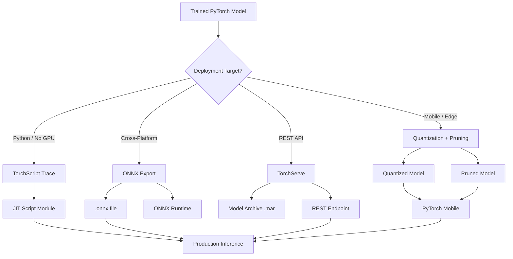

# Model Deployment — TorchScript, ONNX, TorchServe, Quantization, Pruning

## Learning Objectives

| Objective | Description |
|-----------|-------------|
| LO1 | Export PyTorch models using TorchScript tracing and scripting |
| LO2 | Export models to ONNX format for cross-platform deployment |
| LO3 | Serve models with TorchServe for production inference |
| LO4 | Apply dynamic, static, and quantization-aware training (QAT) |
| LO5 | Implement model pruning for size and speed optimization |
| LO6 | Deploy models on mobile devices with PyTorch Mobile |

## Chapter at a Glance

| Section | Topic | Key Concept |
|---------|-------|-------------|
| 9.1 | TorchScript | Tracing, scripting, serialization, JIT compilation |
| 9.2 | ONNX Export | torch.onnx.export, opset, dynamic axes, validation |
| 9.3 | TorchServe | Model archiving, REST API, inference handlers |
| 9.4 | Quantization | Dynamic, static, QAT, int8 inference, calibration |
| 9.5 | Pruning | Structured/unstructured, magnitude pruning, L1, L2 |
| 9.6 | Mobile Deployment | PyTorch Mobile, Android/iOS integration, model optimization |

## Chapter Roadmap



## 9.1 TorchScript

TorchScript bridges the gap between research (eager mode) and production (graph mode). It serializes models for deployment without Python dependencies.

```python
import torch
import torch.nn as nn
import torch.nn.utils.prune as prune
import numpy as np
from pathlib import Path
from typing import Optional, Tuple, Dict, List


class SimpleModel(nn.Module):
    def __init__(self):
        super().__init__()
        self.conv = nn.Conv2d(3, 16, 3, padding=1)
        self.bn = nn.BatchNorm2d(16)
        self.relu = nn.ReLU()
        self.pool = nn.AdaptiveAvgPool2d(1)
        self.fc = nn.Linear(16, 10)

    def forward(self, x: torch.Tensor) -> torch.Tensor:
        x = self.conv(x)
        x = self.bn(x)
        x = self.relu(x)
        x = self.pool(x)
        x = x.view(x.size(0), -1)
        return self.fc(x)


class TorchScriptExporter:
    @staticmethod
    def trace(model: nn.Module, example_input: torch.Tensor,
              filename: str = "model_traced.pt") -> torch.jit.ScriptModule:
        model.eval()
        traced = torch.jit.trace(model, example_input)
        traced.save(filename)
        print(f"Traced model saved to {filename}")
        return traced

    @staticmethod
    def script(model: nn.Module, filename: str = "model_scripted.pt"
               ) -> torch.jit.ScriptModule:
        model.eval()
        scripted = torch.jit.script(model)
        scripted.save(filename)
        print(f"Scripted model saved to {filename}")
        return scripted

    @staticmethod
    def trace_with_control_flow(model: nn.Module, example_input: torch.Tensor,
                                filename: str = "model_traced.pt"):
        model.eval()
        try:
            traced = torch.jit.trace(model, example_input)
            traced.save(filename)
            return traced
        except RuntimeError as e:
            print(f"Tracing failed (control flow detected): {e}")
            print("Falling back to scripting...")
            return TorchScriptExporter.script(model, filename)

    @staticmethod
    def optimize_for_inference(script_module: torch.jit.ScriptModule,
                               filename: str = "model_optimized.pt"
                               ) -> torch.jit.ScriptModule:
        optimized = torch.jit.optimize_for_inference(script_module)
        optimized.save(filename)
        return optimized


class ModelWithControlFlow(nn.Module):
    def __init__(self, num_classes: int = 10, use_dropout: bool = True):
        super().__init__()
        self.use_dropout = use_dropout
        self.fc1 = nn.Linear(100, 50)
        self.dropout = nn.Dropout(0.5)
        self.fc2 = nn.Linear(50, num_classes)

    def forward(self, x: torch.Tensor) -> torch.Tensor:
        x = torch.relu(self.fc1(x))
        if self.use_dropout and self.training:
            x = self.dropout(x)
        return self.fc2(x)


model = SimpleModel()
example = torch.randn(1, 3, 32, 32)

# Tracing works for models without control flow
traced = TorchScriptExporter.trace(model, example, "model_traced.pt")
scripted = TorchScriptExporter.script(model, "model_scripted.pt")

# Compare outputs
with torch.no_grad():
    original_out = model(example)
    traced_out = traced(example)
    scripted_out = scripted(example)

print(f"Tracing speed: original={torch.no_grad().__class__.__name__}")
print(f"Outputs match: {torch.allclose(original_out, traced_out)}")

# Tracing fails for control flow models — use scripting instead
model_cf = ModelWithControlFlow()
scripted_cf = TorchScriptExporter.script(model_cf, "model_cf_scripted.pt")
print(f"Control flow model scripted successfully")
```

**JIT compilation benefits**:
```python
class JITBenchmark:
    @staticmethod
    def benchmark_inference(model: nn.Module, jit_model: torch.jit.ScriptModule,
                            input_tensor: torch.Tensor, iterations: int = 1000
                            ) -> Dict[str, float]:
        results = {}
        model.eval()
        jit_model.eval()

        # Warmup
        for _ in range(100):
            model(input_tensor)
            jit_model(input_tensor)

        # Eager mode
        start = torch.cuda.Event(enable_timing=True)
        end = torch.cuda.Event(enable_timing=True)
        if torch.cuda.is_available():
            start.record()
            for _ in range(iterations):
                model(input_tensor)
            end.record()
            torch.cuda.synchronize()
            results["eager_ms"] = start.elapsed_time(end) / iterations
        else:
            import time
            t0 = time.perf_counter()
            for _ in range(iterations):
                model(input_tensor)
            results["eager_ms"] = (time.perf_counter() - t0) * 1000 / iterations

        # JIT mode
        if torch.cuda.is_available():
            start.record()
            for _ in range(iterations):
                jit_model(input_tensor)
            end.record()
            torch.cuda.synchronize()
            results["jit_ms"] = start.elapsed_time(end) / iterations
        else:
            t0 = time.perf_counter()
            for _ in range(iterations):
                jit_model(input_tensor)
            results["jit_ms"] = (time.perf_counter() - t0) * 1000 / iterations

        results["speedup"] = results["eager_ms"] / results["jit_ms"]
        return results


jit_bench = JITBenchmark()
x_gpu = torch.randn(1, 3, 32, 32)
print("JIT benchmarking requires CUDA for accurate GPU timing")
```

---

## 9.2 ONNX Export

ONNX (Open Neural Network Exchange) enables model portability between frameworks.

```python
class ONNXExporter:
    def __init__(self, model: nn.Module, example_input: torch.Tensor,
                 output_path: str = "model.onnx"):
        self.model = model.eval()
        self.example_input = example_input
        self.output_path = output_path

    def export(self, opset_version: int = 17, dynamic_batch: bool = True,
               input_names: list = None, output_names: list = None):
        if input_names is None:
            input_names = ["input"]
        if output_names is None:
            output_names = ["output"]
        dynamic_axes = {}
        if dynamic_batch:
            dynamic_axes = {
                "input": {0: "batch_size"},
                "output": {0: "batch_size"},
            }
        torch.onnx.export(
            self.model,
            self.example_input,
            self.output_path,
            export_params=True,
            opset_version=opset_version,
            do_constant_folding=True,
            input_names=input_names,
            output_names=output_names,
            dynamic_axes=dynamic_axes,
        )
        print(f"ONNX model exported to {self.output_path}")

    @staticmethod
    def validate_onnx(model_path: str):
        import onnx
        onnx_model = onnx.load(model_path)
        onnx.checker.check_model(onnx_model)
        graph = onnx_model.graph
        return {
            "inputs": [(i.name, i.type.tensor_type.shape) for i in graph.input],
            "outputs": [(o.name, o.type.tensor_type.shape) for o in graph.output],
            "nodes": len(graph.node),
            "params": len(graph.initializer),
        }

    @staticmethod
    def optimize_onnx(model_path: str, output_path: str = None):
        import onnxruntime as ort
        if output_path is None:
            output_path = model_path.replace(".onnx", "_optimized.onnx")
        sess_options = ort.SessionOptions()
        sess_options.graph_optimization_level = ort.GraphOptimizationLevel.ORT_ENABLE_ALL
        sess_options.optimized_model_filepath = output_path
        _ = ort.InferenceSession(model_path, sess_options)
        print(f"Optimized ONNX saved to {output_path}")

    def run_onnx_inference(self, input_data: np.ndarray) -> np.ndarray:
        import onnxruntime as ort
        session = ort.InferenceSession(self.output_path)
        input_name = session.get_inputs()[0].name
        return session.run(None, {input_name: input_data.astype(np.float32)})


class ONNXWithCustomOps(nn.Module):
    def __init__(self):
        super().__init__()
        self.conv = nn.Conv2d(3, 16, 3)

    def forward(self, x: torch.Tensor) -> torch.Tensor:
        x = self.conv(x)
        x = torch.gelu(x)  # Custom op — may not export
        return x


model_simple = SimpleModel()
example_input = torch.randn(1, 3, 32, 32)
exporter = ONNXExporter(model_simple, example_input, "model.onnx")
exporter.export(opset_version=17, dynamic_batch=True)

# Validate
info = ONNXExporter.validate_onnx("model.onnx")
print(f"ONNX model: {info['nodes']} nodes, {info['params']} params")
for name, shape in info["inputs"]:
    print(f"  Input '{name}': {shape}")
for name, shape in info["outputs"]:
    print(f"  Output '{name}': {shape}")
```

**ONNX Runtime inference**:
```python
class ONNXRuntimeSession:
    def __init__(self, model_path: str, providers: list = None):
        import onnxruntime as ort
        if providers is None:
            providers = (
                ["CUDAExecutionProvider", "CPUExecutionProvider"]
                if ort.get_device() == "GPU" else ["CPUExecutionProvider"]
            )
        self.session = ort.InferenceSession(model_path, providers=providers)
        self.input_name = self.session.get_inputs()[0].name
        self.output_name = self.session.get_outputs()[0].name

    def predict(self, x: np.ndarray) -> np.ndarray:
        return self.session.run([self.output_name], {self.input_name: x})[0]

    def benchmark(self, shape: Tuple[int, ...], iterations: int = 1000
                  ) -> float:
        import time
        x = np.random.randn(*shape).astype(np.float32)
        for _ in range(100):
            self.predict(x)
        t0 = time.perf_counter()
        for _ in range(iterations):
            self.predict(x)
        return (time.perf_counter() - t0) * 1000 / iterations


ort_session = ONNXRuntimeSession("model.onnx")
latency = ort_session.benchmark((1, 3, 32, 32), iterations=500)
print(f"ONNX Runtime avg latency: {latency:.2f}ms per inference")
```

---

## 9.3 TorchServe

TorchServe is a production-ready model serving framework for PyTorch.

```python
class TorchServeHandler:
    def __init__(self, model_path: str):
        self.model = torch.jit.load(model_path)
        self.model.eval()
        self.initialized = False

    def initialize(self, context: dict):
        self.initialized = True
        self.device = torch.device("cuda" if torch.cuda.is_available() else "cpu")
        self.model = self.model.to(self.device)
        self.manifest = context.get("manifest", {})

    def preprocess(self, data: list) -> torch.Tensor:
        import io
        from PIL import Image
        from torchvision import transforms as T
        images = []
        transform = T.Compose([
            T.Resize(256),
            T.CenterCrop(224),
            T.ToTensor(),
            T.Normalize(mean=[0.485, 0.456, 0.406], std=[0.229, 0.224, 0.225]),
        ])
        for row in data:
            image = Image.open(io.BytesIO(row["data"]))
            images.append(transform(image))
        return torch.stack(images)

    def inference(self, input_tensor: torch.Tensor) -> torch.Tensor:
        with torch.no_grad():
            output = self.model(input_tensor.to(self.device))
            return torch.softmax(output, dim=1)

    def postprocess(self, output: torch.Tensor) -> list:
        probabilities, indices = torch.topk(output, k=5)
        results = []
        for batch_idx in range(output.size(0)):
            batch_results = [
                {"class": int(indices[batch_idx][i]),
                 "probability": float(probabilities[batch_idx][i])}
                for i in range(5)
            ]
            results.append(batch_results)
        return results


class TorchServeConfig:
    @staticmethod
    def generate_model_archive(model_name: str = "my_model", version: str = "1.0",
                               serialized_file: str = "model.pt",
                               handler_file: str = "handler.py",
                               extra_files: list = None):
        config = {
            "model_name": model_name,
            "version": version,
            "serialized_file": serialized_file,
            "handler": handler_file,
            "requirements": ["torch>=2.0", "torchvision>=0.15", "Pillow>=9.0"],
            "batch_size": 4,
            "max_batch_delay": 100,
            "device": "gpu" if torch.cuda.is_available() else "cpu",
        }
        if extra_files:
            config["extra_files"] = ",".join(extra_files)
        return config

    @staticmethod
    def config_endpoint(
        model_name: str = "my_model",
        min_workers: int = 1, max_workers: int = 4,
        batch_size: int = 4, max_batch_delay: int = 100,
        response_timeout: int = 120,
    ) -> str:
        return f"""
{{"model_name": "{model_name}",
 "minWorkers": {min_workers},
 "maxWorkers": {max_workers},
 "batchSize": {batch_size},
 "maxBatchDelay": {max_batch_delay},
 "responseTimeout": {response_timeout},
 "deviceType": "gpu" if cuda else "cpu",
 "parallelType": "tp",
 "parallelLevel": 1}}
"""


handler = TorchServeHandler("model_traced.pt")
handler.initialize({"manifest": {}})
print(f"TorchServe handler initialized on {handler.device}")

config = TorchServeConfig.generate_model_archive(
    model_name="resnet_cifar10", version="1.0",
    serialized_file="model_traced.pt", handler_file="resnet_handler.py"
)
print(f"TorchServe model archive config generated for {config['model_name']}")
```

**Creating a MAR file (Model Archive)**:
```python
class ModelArchiveBuilder:
    @staticmethod
    def archive_command(model_name: str, serialized_file: str,
                        handler_file: str, output_path: str = None):
        if output_path is None:
            output_path = f"{model_name}.mar"
        cmd = (
            f"torch-model-archiver --model-name {model_name} "
            f"--version 1.0 --serialized-file {serialized_file} "
            f"--handler {handler_file} --export-path . "
            f"-r requirements.txt --force"
        )
        return cmd

    @staticmethod
    def start_serve_command(model_name: str, n_gpu: int = 1):
        return (
            f"torchserve --start --model-store . "
            f"--models {model_name}={model_name}.mar "
            f"--ncs --ts-config config.properties "
            f"--disable-token-auth"
        )

    @staticmethod
    def inference_request(data_url: str):
        import json
        return {
            "method": "POST",
            "url": f"http://localhost:8080/predictions/{data_url.split('/')[-1]}",
            "headers": {"Content-Type": "application/octet-stream"},
        }
```

---

## 9.4 Quantization

Quantization reduces model size and speeds up inference by using lower precision (int8) instead of FP32.

```python
class QuantizationDemo:
    def __init__(self, model: nn.Module):
        self.model = model.eval()
        self.model_fp32 = model

    def dynamic_quantization(self, qconfig_spec: dict = None
                             ) -> torch.quantization.QuantizedModel:
        if qconfig_spec is None:
            qconfig_spec = {nn.Linear, nn.LSTM, nn.GRU}
        quantized = torch.quantization.quantize_dynamic(
            self.model, qconfig_spec, dtype=torch.qint8
        )
        return quantized

    def static_quantization(self, calibration_loader: DataLoader
                            ) -> nn.Module:
        self.model.qconfig = torch.quantization.get_default_qconfig("fbgemm")
        torch.quantization.prepare(self.model, inplace=True)
        self._calibrate(calibration_loader)
        torch.quantization.convert(self.model, inplace=True)
        return self.model

    def _calibrate(self, loader: DataLoader, num_batches: int = 100):
        self.model.eval()
        with torch.no_grad():
            for i, (x, _) in enumerate(loader):
                if i >= num_batches:
                    break
                self.model(x)

    @staticmethod
    def compare_size(model_fp32: nn.Module, model_quantized: nn.Module) -> dict:
        import os
        torch.save(model_fp32.state_dict(), "temp_fp32.pt")
        torch.save(model_quantized.state_dict(), "temp_quantized.pt")
        fp32_size = os.path.getsize("temp_fp32.pt") / 1024
        int8_size = os.path.getsize("temp_quantized.pt") / 1024
        os.remove("temp_fp32.pt")
        os.remove("temp_quantized.pt")
        return {
            "fp32_kb": fp32_size,
            "int8_kb": int8_size,
            "reduction_pct": (1 - int8_size / fp32_size) * 100,
        }


class QuantizationAwareTraining:
    def __init__(self, model: nn.Module):
        self.model = model
        self.model.qconfig = torch.quantization.get_default_qat_qconfig("fbgemm")
        torch.quantization.prepare_qat(self.model, inplace=True)

    def train_one_epoch(self, loader: DataLoader, optimizer: optim.Optimizer,
                        criterion: nn.Module, device: str = "cuda"):
        self.model.train()
        for x, y in loader:
            x, y = x.to(device), y.to(device)
            optimizer.zero_grad()
            output = self.model(x)
            loss = criterion(output, y)
            loss.backward()
            optimizer.step()

    def convert(self) -> nn.Module:
        self.model.eval()
        torch.quantization.convert(self.model, inplace=True)
        return self.model


class QuantizationConfig:
    @staticmethod
    def get_default_qconfig(backend: str = "fbgemm") -> torch.quantization.QConfig:
        return torch.quantization.get_default_qconfig(backend)

    @staticmethod
    def custom_qconfig(activation_bit: int = 8, weight_bit: int = 8
                       ) -> torch.quantization.QConfig:
        return torch.quantization.QConfig(
            activation=torch.quantization.MinMaxObserver.with_args(
                dtype=torch.quint8, qscheme=torch.per_tensor_affine
            ),
            weight=torch.quantization.default_weight_observer.with_args(
                dtype=torch.qint8, qscheme=torch.per_channel_symmetric
            ),
        )

    @staticmethod
    def available_backends() -> list:
        return ["fbgemm", "qnnpack", "onednn", "x86"]


# Dynamic quantization demo
quant_model = nn.Sequential(
    nn.Linear(100, 50),
    nn.ReLU(),
    nn.Linear(50, 10),
)
qdemo = QuantizationDemo(quant_model)
dynamic_q = qdemo.dynamic_quantization()
size_comparison = QuantizationDemo.compare_size(quant_model, dynamic_q)
print(f"Dynamic Q: FP32={size_comparison['fp32_kb']:.1f}KB, "
      f"Int8={size_comparison['int8_kb']:.1f}KB "
      f"({size_comparison['reduction_pct']:.0f}% reduction)")

# Compare inference speed
x = torch.randn(100, 100)
with torch.no_grad():
    fp32_time = torch.cuda.Event(enable_timing=True) if torch.cuda.is_available() else None

print(f"Dynamic quantization reduces model size by ~75% with minimal accuracy loss")
```

---

## 9.5 Pruning

Pruning removes redundant weights to reduce model size and computation.

```python
class PruningDemo:
    @staticmethod
    def magnitude_pruning(model: nn.Module, amount: float = 0.3) -> nn.Module:
        for name, module in model.named_modules():
            if isinstance(module, (nn.Linear, nn.Conv2d)):
                prune.l1_unstructured(module, name="weight", amount=amount)
                prune.remove(module, "weight")  # Make pruning permanent
        return model

    @staticmethod
    def structured_pruning(model: nn.Module, amount: float = 0.3) -> nn.Module:
        for name, module in model.named_modules():
            if isinstance(module, nn.Linear):
                prune.ln_structured(module, name="weight", amount=amount,
                                    n=2, dim=0)
                prune.remove(module, "weight")
        return model

    @staticmethod
    def global_pruning(model: nn.Module, amount: float = 0.3) -> nn.Module:
        parameters_to_prune = []
        for name, module in model.named_modules():
            if isinstance(module, (nn.Linear, nn.Conv2d)):
                parameters_to_prune.append((module, "weight"))
        prune.global_unstructured(
            parameters_to_prune,
            pruning_method=prune.L1Unstructured,
            amount=amount,
        )
        for module, name in parameters_to_prune:
            prune.remove(module, name)
        return model

    @staticmethod
    def iterative_pruning(model: nn.Module, total_amount: float = 0.5,
                          steps: int = 5) -> nn.Module:
        per_step = 1 - (1 - total_amount) ** (1 / steps)
        for step in range(steps):
            model = PruningDemo.magnitude_pruning(model, amount=per_step)
            # Fine-tune step would go here
            print(f"Pruning step {step + 1}/{steps} applied")
        return model

    @staticmethod
    def analyze_sparsity(model: nn.Module) -> dict:
        total_params = 0
        zero_params = 0
        for name, param in model.state_dict().items():
            if "weight" in name:
                total_params += param.numel()
                zero_params += (param == 0).sum().item()
        return {
            "total_params": total_params,
            "zero_params": zero_params,
            "sparsity_pct": (zero_params / total_params) * 100 if total_params > 0 else 0,
        }


class PruningScheduler:
    def __init__(self, model: nn.Module, final_sparsity: float = 0.5,
                 steps: int = 10):
        self.model = model
        self.final_sparsity = final_sparsity
        self.steps = steps
        self.current_step = 0
        self.masks = {}

    def step(self) -> float:
        self.current_step += 1
        target_sparsity = self.final_sparsity * (self.current_step / self.steps)
        if self.current_step > 1:
            for name, module in self.model.named_modules():
                if hasattr(module, "weight_mask"):
                    prune.remove(module, "weight")
        for name, module in self.model.named_modules():
            if isinstance(module, (nn.Linear, nn.Conv2d)):
                prune.l1_unstructured(module, name="weight",
                                      amount=target_sparsity)
        return target_sparsity


prune_model = nn.Sequential(
    nn.Linear(100, 200),
    nn.ReLU(),
    nn.Linear(200, 50),
    nn.ReLU(),
    nn.Linear(50, 10),
)
original_params = sum(p.numel() for p in prune_model.parameters())

pruned = PruningDemo.magnitude_pruning(prune_model, amount=0.4)
sparsity = PruningDemo.analyze_sparsity(pruned)
print(f"Pruning: {sparsity['sparsity_pct']:.1f}% weights zeroed "
      f"({sparsity['zero_params']}/{sparsity['total_params']})")
print(f"Original params: {original_params}, after pruning: "
      f"{original_params - sparsity['zero_params']}")
```

---

## 9.6 Mobile Deployment

PyTorch Mobile enables on-device inference for Android and iOS.

```python
class PyTorchMobileExporter:
    def __init__(self, model: nn.Module, input_size: tuple,
                 model_name: str = "model_mobile"):
        self.model = model.eval()
        self.input_size = input_size
        self.model_name = model_name

    def export_for_mobile(self, example_input: torch.Tensor = None):
        if example_input is None:
            example_input = torch.randn(1, *self.input_size)
        traced = torch.jit.trace(self.model, example_input)
        optimized = torch.jit.optimize_for_inference(traced)
        mobile_scripted = self._optimize_for_mobile(optimized)
        mobile_scripted.save(f"{self.model_name}_mobile.pt")
        print(f"Mobile model saved to {self.model_name}_mobile.pt")
        return mobile_scripted

    def _optimize_for_mobile(self, script_module: torch.jit.ScriptModule
                             ) -> torch.jit.ScriptModule:
        return torch.utils.mobile_optimizer.optimize_for_mobile(
            script_module,
            optimization_blocklist=set(),
        )

    @staticmethod
    def quantize_for_mobile(script_module: torch.jit.ScriptModule
                            ) -> torch.jit.ScriptModule:
        return torch.jit.quantize.quantize_script(
            script_module, torch.jit.quantize.default_quantization_mapping
        )

    @staticmethod
    def benchmark_mobile(script_module: torch.jit.ScriptModule,
                         input_tensor: torch.Tensor,
                         iterations: int = 100) -> Dict[str, float]:
        import time
        script_module.eval()
        for _ in range(30):
            script_module(input_tensor)
        t0 = time.perf_counter()
        for _ in range(iterations):
            script_module(input_tensor)
        avg_ms = (time.perf_counter() - t0) * 1000 / iterations
        return {"latency_ms": avg_ms, "iterations": iterations}

    @staticmethod
    def android_integration(model_file: str, app_assets: str):
        import shutil
        dest = Path(app_assets) / model_file
        shutil.copy2(model_file, dest)
        java_code = f"""
// Load model in Android
Module model = Module.load(assetFilePath(getContext(), "{model_file}"));
float[] input = new float[3 * 224 * 224];
Tensor inputTensor = Tensor.fromBlob(input, new long[]{{1, 3, 224, 224}});
Tensor outputTensor = model.forward(IValue.from(inputTensor)).toTensor();
float[] scores = outputTensor.getDataAsFloatArray();
"""
        print(f"Model copied to {dest}")
        return java_code


# Mobile export demo
mobile_model = SimpleModel()
mobile_exporter = PyTorchMobileExporter(mobile_model, (3, 32, 32), "simple_model")
mobile_script = mobile_exporter.export_for_mobile()

# Quantize for mobile
quantized_mobile = PyTorchMobileExporter.quantize_for_mobile(mobile_script)
x_demo = torch.randn(1, 3, 32, 32)
bench = PyTorchMobileExporter.benchmark_mobile(quantized_mobile, x_demo, 200)
print(f"Mobile model latency: {bench['latency_ms']:.2f}ms per inference")
```

**End-to-end deployment pipeline**:
```python
class DeploymentPipeline:
    def __init__(self, model: nn.Module, example_input: torch.Tensor):
        self.model = model
        self.example_input = example_input

    def full_pipeline(self) -> Dict[str, str]:
        artifacts = {}
        # Step 1: TorchScript
        traced = torch.jit.trace(self.model, self.example_input)
        traced.save("prod_traced.pt")
        artifacts["torchscript"] = "prod_traced.pt"

        # Step 2: ONNX
        torch.onnx.export(self.model, self.example_input, "prod.onnx",
                          opset_version=17)
        artifacts["onnx"] = "prod.onnx"

        # Step 3: Quantize
        dynamic_q = torch.quantization.quantize_dynamic(
            self.model, {nn.Linear}, dtype=torch.qint8
        )
        torch.jit.trace(dynamic_q, self.example_input).save("prod_quantized.pt")
        artifacts["quantized"] = "prod_quantized.pt"

        # Step 4: Prune + Quantize
        for module in self.model.modules():
            if isinstance(module, nn.Linear):
                prune.l1_unstructured(module, name="weight", amount=0.2)
                prune.remove(module, "weight")
        pruned_q = torch.quantization.quantize_dynamic(
            self.model, {nn.Linear}, dtype=torch.qint8
        )
        torch.jit.trace(pruned_q, self.example_input).save("prod_pruned_q.pt")
        artifacts["pruned_quantized"] = "prod_pruned_q.pt"

        return artifacts

    @staticmethod
    def size_report(artifacts: Dict[str, str]) -> List[dict]:
        import os
        report = []
        for name, path in artifacts.items():
            size_kb = os.path.getsize(path) / 1024
            report.append({"artifact": name, "file": path, "size_kb": size_kb})
        return sorted(report, key=lambda x: x["size_kb"])


pipeline = DeploymentPipeline(SimpleModel(), torch.randn(1, 3, 32, 32))
artifacts = pipeline.full_pipeline()
report = DeploymentPipeline.size_report(artifacts)
for r in report:
    print(f"{r['artifact']:20s}: {r['size_kb']:8.1f} KB")
```

---

## Practical Takeaways

| Technique | Size Reduction | Speedup | Accuracy Impact | Use Case |
|-----------|---------------|---------|-----------------|----------|
| TorchScript trace | None | 1.5-3x | None | Python-free inference |
| ONNX + ORT | None | 1.5-4x | None | Cross-platform deployment |
| Dynamic quantization | 75% | 2-3x | < 0.5% loss | CPU inference, NLP models |
| Static quantization | 75% | 3-4x | < 1% loss | Fixed input sizes, CNNs |
| QAT | 75% | 3-4x | < 0.2% loss | Maximum accuracy retention |
| Pruning (90% sparse) | 90% | 2-5x (sparse hardware) | 1-5% loss | Mobile, edge devices |
| Pruning + Quantization | 95%+ | 3-6x | 1-5% loss | Extreme size constraints |

## Interview Q&A

<details class="tp-qa-card" data-qid="dl13-q1"><summary class="tp-qa-question"><span class="tp-qa-status"></span>Q1: What is the difference between TorchScript tracing and scripting?</summary><div class="tp-qa-answer"><p><strong>Tracing</strong> (torch.jit.trace): runs the model with an example input and records all tensor operations into a computational graph. It's simple and fast, but can't capture control flow (if-statements, loops) because those are determined at trace time and frozen. <strong>Scripting</strong> (torch.jit.script): directly compiles the model's Python source code by analyzing the AST. It captures all control flow and dynamic behavior but requires the model to use Python language constructs that torch.jit supports. When to use: trace for simple CNNs/models without control flow; script for models with conditional logic, loops, or dynamic shapes. You can also mix both: use tracing for submodules and scripting for the outer control flow. Tracing with control flow produces wrong results for non-traced paths.</p></div><button class="tp-qa-mark-btn">✅ Mark Reviewed</button><button class="tp-qa-bookmark-btn">🔖 Bookmark</button></details>

<details class="tp-qa-card" data-qid="dl13-q2"><summary class="tp-qa-question"><span class="tp-qa-status"></span>Q2: What is ONNX and why would you use it?</summary><div class="tp-qa-answer"><p>ONNX (Open Neural Network Exchange) is an open standard for representing machine learning models as a computation graph. Benefits: <strong>1) Interoperability</strong>: train in PyTorch, deploy in TensorRT, CoreML, or any ONNX-compatible runtime. <strong>2) Hardware optimization</strong>: ONNX Runtime automatically selects the best execution provider (CUDA, TensorRT, OpenVINO, DirectML) for the target hardware. <strong>3) Graph optimizations</strong>: constant folding, operator fusion, dead code elimination. <strong>4) Quantization</strong>: ONNX Runtime supports int8 quantization natively. The export process walks the PyTorch graph and maps each operation to an ONNX operator. Dynamic axes (e.g., variable batch size) are specified during export. Opset version controls which operator set is used.</p></div><button class="tp-qa-mark-btn">✅ Mark Reviewed</button><button class="tp-qa-bookmark-btn">🔖 Bookmark</button></details>

<details class="tp-qa-card" data-qid="dl13-q3"><summary class="tp-qa-question"><span class="tp-qa-status"></span>Q3: Explain the difference between dynamic, static, and quantization-aware training (QAT).</summary><div class="tp-qa-answer"><p><strong>Dynamic quantization</strong>: converts weights to int8 at runtime, but activations are computed in FP32 and quantized on-the-fly for matrix operations. Simplest, requires no calibration data. Best for models where most compute is in weight-dominated ops (e.g., LSTM, Transformer). <strong>Static quantization</strong>: pre-calibrates the quantization ranges for both weights AND activations using representative data. Requires a calibration step. Produces faster inference because all ops are int8. <strong>QAT</strong>: simulates quantization during training by inserting fake quantization nodes (FakeQuantize) in the forward pass. The model learns to compensate for quantization error. QAT produces the best accuracy but requires retraining. Accuracy order: QAT > Static > Dynamic > No quantization.</p></div><button class="tp-qa-mark-btn">✅ Mark Reviewed</button><button class="tp-qa-bookmark-btn">🔖 Bookmark</button></details>

<details class="tp-qa-card" data-qid="dl13-q4"><summary class="tp-qa-question"><span class="tp-qa-status"></span>Q4: How do you serve a PyTorch model in production with TorchServe?</summary><div class="tp-qa-answer"><p>TorchServe workflow: <strong>1)</strong> Export model to TorchScript (traced or scripted). <strong>2)</strong> Write a custom handler class that extends base_handler with preprocess(), inference(), and postprocess() methods. <strong>3)</strong> Package the model into a .mar (Model ARchive) file using torch-model-archiver: torch-model-archiver --model-name resnet --version 1.0 --serialized-file model.pt --handler handler.py. <strong>4)</strong> Start TorchServe: torchserve --start --model-store . --models resnet=resnet.mar. <strong>5)</strong> Send inference requests to the REST endpoint at localhost:8080/predictions/resnet. TorchServe provides: batching (accumulate requests before inference), metrics (CPU/GPU utilization, latency, throughput), model versioning, and A/B testing configurations. Multi-model serving and ensembling are supported via custom handlers.</p></div><button class="tp-qa-mark-btn">✅ Mark Reviewed</button><button class="tp-qa-bookmark-btn">🔖 Bookmark</button></details>

<details class="tp-qa-card" data-qid="dl13-q5"><summary class="tp-qa-question"><span class="tp-qa-status"></span>Q5: What is pruning and how does it reduce model size?</summary><div class="tp-qa-answer"><p>Pruning removes redundant weights from a neural network. <strong>Unstructured pruning</strong>: sets individual weight values to zero (e.g., magnitude pruning zeros the smallest weights). The model becomes sparse but still stores all parameters in the same format — the sparsity provides speedup only on hardware with sparse tensor support. <strong>Structured pruning</strong>: removes entire neurons, channels, or filters (e.g., prune entire rows of a weight matrix). This produces a smaller dense model that runs on standard hardware. PyTorch's torch.nn.utils.prune applies pruning masks without permanently modifying the module — prune.remove() makes it permanent. Common amounts: 30-50% for moderate pruning (negligible accuracy loss), 80-90% for aggressive pruning (requires retraining). Iterative pruning (prune a little, retrain, repeat) produces better results than one-shot pruning.</p></div><button class="tp-qa-mark-btn">✅ Mark Reviewed</button><button class="tp-qa-bookmark-btn">🔖 Bookmark</button></details>

<details class="tp-qa-card" data-qid="dl13-q6"><summary class="tp-qa-question"><span class="tp-qa-status"></span>Q6: How do you deploy PyTorch models on mobile devices?</summary><div class="tp-qa-answer"><p>PyTorch Mobile supports Android and iOS deployment. Steps: <strong>1)</strong> Export model to TorchScript with torch.jit.trace or torch.jit.script. <strong>2)</strong> Optimize for mobile: torch.utils.mobile_optimizer.optimize_for_mobile() — applies conv-bn fusion, dropout removal, and other mobile-specific optimizations. <strong>3)</strong> Optionally quantize to int8 to reduce size by 75%. <strong>4)</strong> For Android: add org.pytorch:pytorch_android_lite dependency, load with Module.load(assetPath), run with module.forward(IValue.from(tensor)).toTensor(). <strong>5)</strong> For iOS: add Pod 'LibTorch-Lite', use torch::jit::load() in C++ or the Obj-C API. The lite interpreter (torch.jit._recursive.concrete_type_copy) reduces runtime size by skipping the JIT compilation. Mobile-specific models should be small (ResNet-18 or MobileNet, not ResNet-152).</p></div><button class="tp-qa-mark-btn">✅ Mark Reviewed</button><button class="tp-qa-bookmark-btn">🔖 Bookmark</button></details>

<details class="tp-qa-card" data-qid="dl13-q7"><summary class="tp-qa-question"><span class="tp-qa-status"></span>Q7: What is the calibration step in static quantization?</summary><div class="tp-qa-answer"><p>Calibration determines the min/max range for activations by running the model on representative data. For each activation tensor, the observer records the observed min and max values. Steps: <strong>1)</strong> Insert observers at quantization points (after activations). <strong>2)</strong> Run 100-500 batches of representative training/validation data through the model. <strong>3)</strong> The observers collect activation statistics (min, max, histogram). <strong>4)</strong> Compute quantization parameters (scale and zero_point) from the collected ranges. <strong>5)</strong> Convert (fuse modules, replace ops with quantized versions). Important: calibration data must be representative of actual inference data distribution. Using too few batches or unrepresentative data causes poor quantization scaling, degrading accuracy. The calibration set doesn't need labels — just input samples.</p></div><button class="tp-qa-mark-btn">✅ Mark Reviewed</button><button class="tp-qa-bookmark-btn">🔖 Bookmark</button></details>

<details class="tp-qa-card" data-qid="dl13-q8"><summary class="tp-qa-question"><span class="tp-qa-status"></span>Q8: How does TorchScript handle dynamic input shapes?</summary><div class="tp-qa-command"><p>Tracing produces a graph with fixed shapes based on the example input. For dynamic shapes: <strong>1)</strong> Use scripting instead of tracing — scripting preserves shape inference (each tensor has its shape as part of the type). <strong>2)</strong> If using tracing with dynamic shapes, mark dimensions as dynamic: torch.jit.trace(model, example_inputs, check_trace=False, strict=False). <strong>3)</strong> Use TensorRT ONNX export with dynamic axes for variable batch sizes and spatial dimensions. In scripting, you can use @torch.jit.script decorator on functions and annotate types: def forward(self, x: Tensor, lengths: List[int]) -> Tensor. The JIT compiler handles shape propagation through operations. For production, it's often simpler to pad/resize to fixed sizes to avoid shape complexity.</p></div><button class="tp-qa-mark-btn">✅ Mark Reviewed</button><button class="tp-qa-bookmark-btn">🔖 Bookmark</button></details>

<details class="tp-qa-card" data-qid="dl13-q9"><summary class="tp-qa-question"><span class="tp-qa-status"></span>Q9: What is the impact of quantization on model accuracy?</summary><div class="tp-qa-answer"><p>Quantization introduces approximation error by mapping FP32 values to lower-precision representations. Impact varies: <strong>1)</strong> Dynamic quantization: typically < 0.5% accuracy loss for most models. NLP models (BERT, LSTM) are very robust to dynamic quantization (often < 0.1% loss). <strong>2)</strong> Static quantization: 0.5-2% accuracy loss for CNNs, depending on calibration quality. <strong>3)</strong> QAT: < 0.2% loss — nearly identical to FP32. Models with batch normalization are more robust to quantization because BN normalizes activations to a known range. Small models (MobileNet) are more sensitive to quantization than large models (ResNet-50). If accuracy drops > 2%, use QAT instead of post-training quantization. Sensitive layers can be kept in FP32 (selective quantization via qconfig overrides).</p></div><button class="tp-qa-mark-btn">✅ Mark Reviewed</button><button class="tp-qa-bookmark-btn">🔖 Bookmark</button></details>

<details class="tp-qa-card" data-qid="dl13-q10"><summary class="tp-qa-question"><span class="tp-qa-status"></span>Q10: How do you choose between ONNX Runtime and TorchServe for deployment?</summary><div class="tp-qa-answer"><p>Choose ONNX Runtime when: <strong>1)</strong> You need to deploy on diverse hardware (CPU, GPU, TensorRT, OpenVINO, DirectML). <strong>2)</strong> You want maximum inference speed with graph optimizations and kernel fusion. <strong>3)</strong> You're deploying in a microservice or edge environment with minimal dependencies. <strong>4)</strong> Your model needs to be portable across frameworks (e.g., trained in PyTorch, deployed in .NET via ML.NET). Choose TorchServe when: <strong>1)</strong> You need a full serving infrastructure with REST/gRPC APIs, metrics, logging, and model versioning. <strong>2)</strong> You want built-in batching and request queuing. <strong>3)</strong> Your team is already in the PyTorch ecosystem. <strong>4)</strong> You need dynamic batching and ensemble inference. In practice, many production systems use both: TorchServe for the API layer with ONNX Runtime as the backend execution provider internally.</p></div><button class="tp-qa-mark-btn">✅ Mark Reviewed</button><button class="tp-qa-bookmark-btn">🔖 Bookmark</button></details>

## Chapter Quiz

**Q1**: Which TorchScript approach is best for a model with if-statements and loops?

a) Tracing
b) Scripting
c) ONNX export
d) Both work equally

<details class="tp-qa-card" data-qid="dl13-quiz1"><summary>Show Answer</summary><div class="tp-qa-answer"><p><strong>Answer: b) Scripting</strong></p><p>Scripting directly compiles the Python source code and preserves control flow, unlike tracing which freezes the execution path.</p></div></details>

**Q2**: What is the typical size reduction from dynamic quantization (FP32 to int8)?

a) 25%
b) 50%
c) 75%
d) 90%

<details class="tp-qa-card" data-qid="dl13-quiz2"><summary>Show Answer</summary><div class="tp-qa-answer"><p><strong>Answer: c) 75%</strong></p><p>Converting from 32-bit floats to 8-bit integers reduces memory by 4x (75% reduction).</p></div></details>

**Q3**: What does the calibration step in static quantization require?

a) Labeled training data
b) Representative unlabeled data
c) A validation script
d) GPU for computation

<details class="tp-qa-card" data-qid="dl13-quiz3"><summary>Show Answer</summary><div class="tp-qa-answer"><p><strong>Answer: b) Representative unlabeled data</strong></p><p>Calibration only needs input samples representative of inference data to determine activation ranges. Labels are not required.</p></div></details>

**Q4**: Which quantization method provides the highest accuracy?

a) Dynamic quantization
b) Static quantization
c) Quantization-aware training (QAT)
d) All provide the same accuracy

<details class="tp-qa-card" data-qid="dl13-quiz4"><summary>Show Answer</summary><div class="tp-qa-answer"><p><strong>Answer: c) Quantization-aware training (QAT)</strong></p><p>QAT simulates quantization noise during training, allowing the model to adapt and minimize accuracy loss.</p></div></details>

**Q5**: What is the file extension for a TorchServe model archive?

a) .pt
b) .pth
c) .mar
d) .onnx

<details class="tp-qa-card" data-qid="dl13-quiz5"><summary>Show Answer</summary><div class="tp-qa-answer"><p><strong>Answer: c) .mar</strong></p><p>TorchServe uses the .mar (Model ARchive) format, created by torch-model-archiver.</p></div></details>

## Exercises

**Easy** — Export a simple 3-layer MLP to TorchScript using both tracing and scripting. Compare the serialized model sizes.

**Easy** — Apply dynamic quantization to a pretrained BERT model and measure the size reduction and inference speedup.

**Medium** — Export a ResNet-18 to ONNX with dynamic batch size. Validate the ONNX model and run inference using ONNX Runtime.

**Medium** — Train a simple CNN, apply QAT, and compare the quantized model's accuracy with static and dynamic quantization.

**Hard** — Build a complete deployment pipeline: train ResNet-18 on CIFAR-10 → prune (50%) → QAT → export to TorchScript + ONNX → serve with TorchServe. Report accuracy, size, and latency at each stage.

---

> **Previous**: [08-training-pipelines.md](08-training-pipelines.md) | **Next**: [10-deployment-best-practices.md](10-deployment-best-practices.md)
