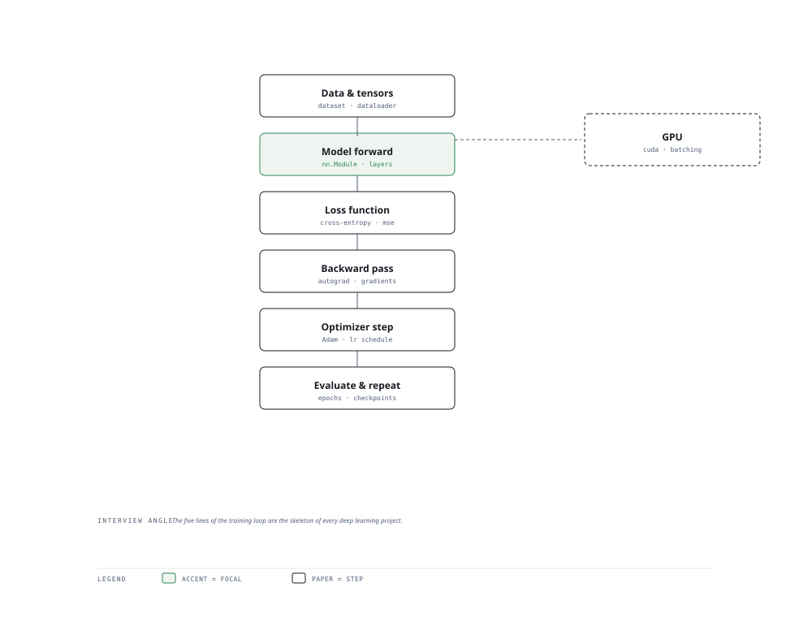

# Visual Notes — Neural Network Training Loop

> One diagram, the full picture. This page is meant to be glanced at before reading the chapters, and again before interviews.

# What the diagram shows

1. **Input** — Raw data becomes a tensor, batched and normalised for the GPU.
1. **Model** — A forward pass turns activations into predictions through layers and nonlinearities.
1. **Learning** — Loss measures the error, autograd computes gradients, and the optimizer nudges weights — full batch, minibatch, or gradient step.

# Why this matters for placement

- Being fluent in tensor shape flow is the fastest way to de-risk a deep-learning interview.
- Knowing where autograd runs (GPU) vs where data loader runs (CPU) shows systems sense.

# Quick revision

- Forward pass computes predictions; backprop computes ∂loss/∂weights via the chain rule.
- Losses: MSE (regression), cross-entropy (classification), BCE (binary).
- Optimizers: SGD, momentum, Adam — Adam adjusts per-parameter learning rates.
- Regularisation: dropout, weight decay, early stopping, batch norm.
- Transfer learning: freeze backbone, fine-tune head — the practical default.

# Related chapters

- [Neural networks basics](01-neural-networks-basics.md)
- [PyTorch tensors](02-pytorch-tensors.md)
- [CNN fundamentals](04-cnn-fundamentals.md)
- [Training pipelines](08-training-pipelines.md)

---

**One-line answer for interviews:** *"Data → tensor → forward → loss → backward → optimizer step, repeated for every epoch."*
