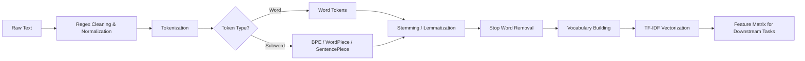

# Text Preprocessing — Tokenization, Stemming, Lemmatization, TF-IDF

## Learning Objectives

| LO# | Description |
|-----|-------------|
| LO1 | Understand tokenization strategies: word-level, subword (BPE, WordPiece, Unigram), and SentencePiece |
| LO2 | Implement stemming (Porter, Lancaster, Snowball) and lemmatization for morphological normalization |
| LO3 | Remove stop words, punctuation, and non-informative content using regex and custom filters |
| LO4 | Build a vocabulary with frequency-based truncation and special tokens |
| LO5 | Compute TF-IDF scores manually and using sklearn for feature extraction |
| LO6 | Design a complete text preprocessing pipeline that generalizes to new data |

## Chapter at a Glance

| Section | Topic | Key Concept |
|---------|-------|-------------|
| 1.1 | Word Tokenization | Whitespace, regex, Treebank, Tweet tokenizers |
| 1.2 | Subword Tokenization | BPE, WordPiece, Unigram, SentencePiece models |
| 1.3 | Stemming & Lemmatization | Porter stemmer, WordNet lemmatizer, morphological analysis |
| 1.4 | Stop Words & Normalization | Stop word removal, lowercasing, regex cleaning, Unicode normalization |
| 1.5 | Vocabulary Building | Frequency cutoff, special tokens, OOV handling |
| 1.6 | TF-IDF | Term frequency, inverse document frequency, feature matrix |

## Chapter Roadmap



## 1.1 Word Tokenization

Tokenization splits text into atomic units called tokens. Word tokenization is the simplest form: tokens correspond to words, punctuation, and numbers.

```typescript
interface TokenizerResult {
  tokens: string[];
  spans: Array<{ start: number; end: number }>;
}

class WhitespaceTokenizer {
  tokenize(text: string): TokenizerResult {
    const tokens: string[] = [];
    const spans: Array<{ start: number; end: number }> = [];
    const regex = /\S+/g;
    let match: RegExpExecArray | null;
    while ((match = regex.exec(text)) !== null) {
      tokens.push(match[0]);
      spans.push({ start: match.index, end: match.index + match[0].length });
    }
    return { tokens, spans };
  }
}

class RegexpTokenizer {
  private pattern: RegExp;

  constructor(pattern: RegExp = /[a-zA-Z]+|[0-9]+|[^\w\s]/g) {
    this.pattern = pattern;
  }

  tokenize(text: string): TokenizerResult {
    const tokens: string[] = [];
    const spans: Array<{ start: number; end: number }> = [];
    let match: RegExpExecArray | null;
    while ((match = this.pattern.exec(text)) !== null) {
      tokens.push(match[0]);
      spans.push({ start: match.index, end: match.index + match[0].length });
    }
    return { tokens, spans };
  }
}
```

The Treebank tokenizer (used in NLTK) handles contractions, quotes, and punctuation separately. For example, "don't" becomes ["do", "n't"] and "I'm" becomes ["I", "'m"].

```typescript
class TreebankTokenizer {
  private static CONTRACTIONS: Record<string, string[]> = {
    "don't": ["do", "n't"],
    "can't": ["ca", "n't"],
    "i'm": ["i", "'m"],
    "you're": ["you", "'re"],
    "it's": ["it", "'s"],
  };

  tokenize(text: string): string[] {
    const lower = text.toLowerCase();
    const words = lower.split(/\s+/);
    const tokens: string[] = [];
    for (const w of words) {
      if (TreebankTokenizer.CONTRACTIONS[w]) {
        tokens.push(...TreebankTokenizer.CONTRACTIONS[w]);
      } else {
        // Split punctuation from words
        tokens.push(...w.split(/(?=[.,!?;:()])|(?<=[.,!?;:()])/));
      }
    }
    return tokens.filter((t) => t.length > 0);
  }
}
```

**Tweet tokenizer** preserves emoticons, hashtags, mentions, and URLs. This is critical for social media NLP where standard tokenizers destroy semantic content like `#NLP` or `@user`.

---

## 1.2 Subword Tokenization

Subword tokenization bridges words and characters. Byte-Pair Encoding (BPE) iteratively merges the most frequent character pairs. WordPiece (used in BERT) merges based on likelihood gain. Unigram (used in XLNet) starts from a large vocabulary and prunes. SentencePiece treats the input as a raw byte stream without pre-tokenization.

```typescript
type VocabEntry = { token: string; id: number; count: number };

class BPETokenizer {
  private vocab: Map<string, number> = new Map();
  private merges: Map<string, string> = new Map();
  private vocabSize: number;

  constructor(vocabSize = 30000) {
    this.vocabSize = vocabSize;
  }

  // Count character pair frequencies
  private getPairFreqs(words: string[]): Map<string, number> {
    const pairs = new Map<string, number>();
    for (const word of words) {
      const chars = word.split("");
      for (let i = 0; i < chars.length - 1; i++) {
        const pair = chars[i] + " " + chars[i + 1];
        pairs.set(pair, (pairs.get(pair) || 0) + 1);
      }
    }
    return pairs;
  }

  // Merge the most frequent pair across the corpus
  fit(corpus: string[]): void {
    let words = corpus.map((w) => w.split("").join(" ") + " </w>");
    const initialVocab = new Set<string>();
    for (const w of corpus) {
      for (const ch of w) initialVocab.add(ch);
    }
    initialVocab.add("</w>");
    let id = 0;
    for (const ch of initialVocab) {
      this.vocab.set(ch, id++);
    }
    while (this.vocab.size < this.vocabSize) {
      const pairs = this.getPairFreqs(words);
      if (pairs.size === 0) break;
      let bestPair = "";
      let bestFreq = 0;
      for (const [pair, freq] of pairs) {
        if (freq > bestFreq) {
          bestFreq = freq;
          bestPair = pair;
        }
      }
      const [a, b] = bestPair.split(" ");
      const merged = a + b;
      this.merges.set(bestPair, merged);
      words = words.map((w) => w.replaceAll(bestPair, merged));
      this.vocab.set(merged, id++);
    }
  }

  encode(text: string): number[] {
    let word = text.split("").join(" ") + " </w>";
    let changed = true;
    while (changed) {
      changed = false;
      const pairs = this.getPairFreqs([word]);
      for (const [pair, _] of pairs) {
        if (this.merges.has(pair)) {
          word = word.replaceAll(pair, this.merges.get(pair)!);
          changed = true;
        }
      }
    }
    return word.split(/\s+/).map((t) => this.vocab.get(t) ?? this.vocab.get("<unk>")!);
  }
}
```

SentencePiece extends BPE by treating the input as a raw Unicode byte sequence, removing the need for language-specific pre-tokenization. It supports both BPE and Unigram algorithms and is used by T5, XLNet, and ALBERT.

---

## 1.3 Stemming & Lemmatization

Stemming crudely chops affixes; lemmatization uses vocabulary and morphology to return the dictionary base form.

```typescript
class PorterStemmer {
  private static SUFFIXES: Array<{ pattern: RegExp; replacement: string }> = [
    { pattern: /ational$/, replacement: "ate" },
    { pattern: /tional$/, replacement: "tion" },
    { pattern: /enci$/, replacement: "ence" },
    { pattern: /anci$/, replacement: "ance" },
    { pattern: /izer$/, replacement: "ize" },
    { pattern: /abli$/, replacement: "able" },
    { pattern: /alli$/, replacement: "al" },
    { pattern: /entli$/, replacement: "ent" },
    { pattern: /eli$/, replacement: "e" },
    { pattern: /ousli$/, replacement: "ous" },
    { pattern: /ization$/, replacement: "ize" },
    { pattern: /ation$/, replacement: "ate" },
    { pattern: /ator$/, replacement: "ate" },
    { pattern: /alism$/, replacement: "al" },
    { pattern: /iveness$/, replacement: "ive" },
    { pattern: /fulness$/, replacement: "ful" },
    { pattern: /ousness$/, replacement: "ous" },
    { pattern: /aliti$/, replacement: "al" },
    { pattern: /iviti$/, replacement: "ive" },
    { pattern: /biliti$/, replacement: "ble" },
  ];

  stem(word: string): string {
    let result = word.toLowerCase();
    for (const { pattern, replacement } of PorterStemmer.SUFFIXES) {
      if (pattern.test(result)) {
        result = result.replace(pattern, replacement);
        break;
      }
    }
    // Remove trailing 'e' if stem ends with consonant-vowel-consonant
    if (result.endsWith("e") && result.length > 3) {
      result = result.slice(0, -1);
    }
    return result;
  }
}

class WordNetLemmatizer {
  private static WORDNET: Map<string, string> = new Map([
    ["running", "run"],
    ["ran", "run"],
    ["better", "good"],
    ["mice", "mouse"],
    ["studies", "study"],
    ["studying", "study"],
    ["cried", "cry"],
    ["flying", "fly"],
    ["largest", "large"],
    ["happier", "happy"],
  ]);

  lemmatize(word: string, pos: "n" | "v" | "a" | "r" = "n"): string {
    const key = pos === "v" ? word : word;
    return WordNetLemmatizer.WORDNET.get(key.toLowerCase()) ?? word;
  }
}
```

Lemmatizing requires part-of-speech tags: "meeting" as a noun should remain "meeting", but as a verb should become "meet". Stemming "meeting" gives "meet" regardless, which can discard important semantic distinctions.

---

## 1.4 Stop Words & Normalization

Stop words are high-frequency tokens that carry little semantic weight (e.g., "the", "a", "is", "and"). Normalization includes lowercasing, removing punctuation, expanding contractions, and Unicode NFKC normalization.

```typescript
class TextNormalizer {
  private static STOP_WORDS: Set<string> = new Set([
    "a", "an", "the", "and", "or", "but", "in", "on", "at", "to",
    "for", "of", "by", "with", "from", "is", "are", "was", "were",
    "be", "been", "being", "have", "has", "had", "do", "does", "did",
    "will", "would", "shall", "should", "may", "might", "must", "can",
    "could", "i", "you", "he", "she", "it", "we", "they", "me", "him",
    "her", "us", "them", "my", "your", "his", "its", "our", "their",
    "this", "that", "these", "those", "not", "no", "nor", "very",
  ]);

  normalize(text: string, removeStopWords = true): string {
    // Unicode NFKC normalization
    let normalized = text.normalize("NFKC");
    // Lowercase
    normalized = normalized.toLowerCase();
    // Expand common contractions
    normalized = normalized
      .replace(/\bdon't\b/g, "do not")
      .replace(/\bcan't\b/g, "cannot")
      .replace(/\bi'm\b/g, "i am")
      .replace(/\byou're\b/g, "you are")
      .replace(/\bit's\b/g, "it is")
      .replace(/\bthey're\b/g, "they are");
    // Remove punctuation and digits
    normalized = normalized.replace(/[^\w\s]/g, " ").replace(/\d+/g, " ");
    // Collapse multiple spaces
    normalized = normalized.replace(/\s+/g, " ").trim();
    if (removeStopWords) {
      normalized = normalized
        .split(" ")
        .filter((w) => !TextNormalizer.STOP_WORDS.has(w))
        .join(" ");
    }
    return normalized;
  }
}
```

**Language-specific stop words**: The NLTK corpus provides stop word lists for 22 languages. For specialized domains (medical, legal), domain-specific stop words can be computed by selecting the most frequent tokens across a large in-domain corpus.

---

## 1.5 Vocabulary Building

A vocabulary maps tokens to integer IDs. Strategies include frequency-based maximum size, minimum frequency thresholds, and special token slots.

```typescript
class Vocabulary {
  private tokenToId: Map<string, number> = new Map();
  private idToToken: Map<number, string> = new Map();
  private counts: Map<string, number> = new Map();

  static readonly PAD = "<pad>";
  static readonly UNK = "<unk>";
  static readonly BOS = "<bos>";
  static readonly EOS = "<eos>";

  constructor() {
    // Reserve special tokens
    this.addToken(Vocabulary.PAD);
    this.addToken(Vocabulary.UNK);
    this.addToken(Vocabulary.BOS);
    this.addToken(Vocabulary.EOS);
  }

  addToken(token: string): number {
    if (!this.tokenToId.has(token)) {
      const id = this.tokenToId.size;
      this.tokenToId.set(token, id);
      this.idToToken.set(id, token);
    }
    return this.tokenToId.get(token)!;
  }

  build(corpus: string[], maxSize = 30000, minFreq = 2): void {
    // Count frequencies
    for (const doc of corpus) {
      const tokens = doc.split(/\s+/);
      for (const t of tokens) {
        this.counts.set(t, (this.counts.get(t) || 0) + 1);
      }
    }
    const sorted = [...this.counts.entries()]
      .filter(([_, count]) => count >= minFreq)
      .sort((a, b) => b[1] - a[1])
      .slice(0, maxSize);
    for (const [token] of sorted) {
      this.addToken(token);
    }
  }

  encode(tokens: string[]): number[] {
    return tokens.map((t) => this.tokenToId.get(t) ?? this.tokenToId.get(Vocabulary.UNK)!);
  }

  decode(ids: number[]): string[] {
    return ids.map((id) => this.idToToken.get(id) ?? Vocabulary.UNK);
  }

  get size(): number {
    return this.tokenToId.size;
  }
}
```

Handling OOV tokens: fallback strategies include character-level decomposition, subword fallback, or using a dedicated `<unk>` token. BERT's WordPiece returns `[UNK]` for out-of-vocabulary characters but covers most words through its 30K subword vocabulary.

---

## 1.6 TF-IDF

Term Frequency-Inverse Document Frequency (TF-IDF) weights terms by their importance in a document relative to the corpus. TF = count of term in document / total terms in document. IDF = log(N / df) where N is total documents and df is document frequency.

```typescript
class TfidfVectorizer {
  private vocabulary: Map<string, number> = new Map();
  private idf: Map<string, number> = new Map();
  private maxFeatures: number;

  constructor(maxFeatures = 5000) {
    this.maxFeatures = maxFeatures;
  }

  fit(documents: string[]): void {
    const df = new Map<string, number>();
    const totalDocs = documents.length;

    for (const doc of documents) {
      const tokens = doc.split(/\s+/);
      const seen = new Set<string>();
      for (const t of tokens) {
        if (t.length === 0) continue;
        df.set(t, (df.get(t) || 0) + 1);
        if (!seen.has(t)) {
          seen.add(t);
        }
      }
    }

    const sorted = [...df.entries()]
      .sort((a, b) => b[1] - a[1])
      .slice(0, this.maxFeatures);

    sorted.forEach(([term], idx) => {
      this.vocabulary.set(term, idx);
      this.idf.set(term, Math.log((totalDocs + 1) / (df.get(term)! + 1)) + 1);
    });
  }

  transform(documents: string[]): number[][] {
    const matrix: number[][] = [];
    for (const doc of documents) {
      const tokens = doc.split(/\s+/);
      const tf = new Map<string, number>();
      for (const t of tokens) {
        if (this.vocabulary.has(t)) {
          tf.set(t, (tf.get(t) || 0) + 1);
        }
      }
      const total = tokens.length;
      const vector = new Array(this.vocabulary.size).fill(0);
      for (const [term, count] of tf) {
        const idx = this.vocabulary.get(term)!;
        const tfScore = count / total;
        const idfScore = this.idf.get(term)!;
        vector[idx] = tfScore * idfScore;
      }
      matrix.push(vector);
    }
    return matrix;
  }

  getFeatureNames(): string[] {
    const names = new Array(this.vocabulary.size);
    for (const [term, idx] of this.vocabulary) {
      names[idx] = term;
    }
    return names;
  }
}
```

**Smooth IDF**: Adding 1 to both numerator and denominator (smooth IDF) prevents division by zero for terms that appear in every document. `sklearn` uses `idf = log((N+1)/(df+1)) + 1` by default.

---

## Summary

Text preprocessing transforms raw text into structured inputs for NLP models. Word tokenization splits text into discrete tokens using whitespace and punctuation rules. Subword tokenization (BPE, WordPiece, SentencePiece) handles out-of-vocabulary words by decomposing them into frequent subword units. Stemming reduces words to root forms using heuristic rules, while lemmatization uses vocabulary analysis for more accurate normalization. Stop word removal filters frequent but uninformative words, and text normalization handles case, Unicode, and special characters. Vocabulary building constructs a fixed-size mapping from tokens to integer indices. TF-IDF weighting transforms token counts into relevance scores based on corpus frequency.

## Practical Takeaways

- Subword tokenization (BPE, WordPiece, SentencePiece) is preferred for modern NLP because it handles OOV gracefully and captures morphological patterns
- Lemmatization preserves meaning better than stemming but requires POS tagging and is slower
- Stop word removal can hurt performance on tasks like sentiment analysis where words like "not" carry critical meaning
- Always normalize to NFKC for Unicode text, especially for multilingual datasets with accented characters
- Vocabulary size is a hyperparameter: too small loses information, too large increases sparsity and memory usage
- TF-IDF weights are corpus-dependent and must be fit on the training set only to prevent data leakage
- SentencePiece eliminates the need for language-specific pre-tokenization by operating on raw bytes
- A robust preprocessing pipeline should handle encoding errors, HTML entities, URLs, and emoji uniformly

## Interview Q&A

<details class="tp-qa-card" data-qid="nlp01-q1">
  <summary class="tp-qa-question">
    <span class="tp-qa-status"></span>
    Q1: What is the difference between stemming and lemmatization?
  </summary>
  <div class="tp-qa-answer">
    <p>Stemming uses heuristic rules to chop affixes (e.g., Porter stemmer reduces "running", "runner", "ran" to "run" but "running" might become "runn"). It is fast but can produce non-dictionary words. Lemmatization uses a vocabulary and morphological analysis to return the dictionary base form (lemma) by considering POS tags. For example, "better" stemmed becomes "bet" (incorrect), but lemmatized to "good" (correct). Lemmatization is slower but produces linguistically valid tokens. Use stemming for search indexing (speed), lemmatization for NLP tasks requiring semantic accuracy.</p>
  </div>
  <button class="tp-qa-mark-btn">✅ Mark Reviewed</button>
  <button class="tp-qa-bookmark-btn">🔖 Bookmark</button>
</details>

<details class="tp-qa-card" data-qid="nlp01-q2">
  <summary class="tp-qa-question">
    <span class="tp-qa-status"></span>
    Q2: How does Byte-Pair Encoding (BPE) work?
  </summary>
  <div class="tp-qa-answer">
    <p>BPE starts with a base vocabulary of individual characters and a special end-of-word token. It iteratively merges the most frequent adjacent pair of tokens in the corpus. For example, if "e s" appears 1000 times and "t h" appears 900 times, "es" becomes a new token first. This continues until a target vocabulary size is reached. To encode new text, the learned merge operations are applied greedily. GPT-2 uses BPE with a 50K vocabulary. The key advantage is that any word can be represented as a sequence of subwords, eliminating unknown tokens entirely.</p>
  </div>
  <button class="tp-qa-mark-btn">✅ Mark Reviewed</button>
  <button class="tp-qa-bookmark-btn">🔖 Bookmark</button>
</details>

<details class="tp-qa-card" data-qid="nlp01-q3">
  <summary class="tp-qa-question">
    <span class="tp-qa-status"></span>
    Q3: What is SentencePiece and how is it different from BPE?
  </summary>
  <div class="tp-qa-answer">
    <p>SentencePiece is a subword tokenizer that treats the input as a raw Unicode byte sequence without requiring language-specific pre-tokenization (splitting on whitespace). This makes it truly language-agnostic — it works for Chinese, Japanese, and Thai where word boundaries are not marked by spaces. SentencePiece supports both BPE and Unigram algorithms. It uses a lossless encoding scheme and can reverse tokens to the original text exactly. T5, XLNet, and ALBERT all use SentencePiece. BPE typically requires pre-tokenized input, making it language-dependent.</p>
  </div>
  <button class="tp-qa-mark-btn">✅ Mark Reviewed</button>
  <button class="tp-qa-bookmark-btn">🔖 Bookmark</button>
</details>

<details class="tp-qa-card" data-qid="nlp01-q4">
  <summary class="tp-qa-question">
    <span class="tp-qa-status"></span>
    Q4: How do you handle out-of-vocabulary (OOV) words?
  </summary>
  <div class="tp-qa-answer">
    <p>Four common strategies: (1) Replace with a special <unk> token, which loses information. (2) Use subword tokenization (BPE, WordPiece) so OOV words are decomposed into known subwords — the standard approach for transformer models. (3) Character-level fallback: encode the word character-by-character. (4) Use a hash-based embedding (fastText) where OOV words use n-gram embeddings. The best approach depends on the task: subword tokenization is preferred for neural models, n-gram fallback for word-level embedding models. BERT's WordPiece covers 99.8% of text in its 30K vocabulary.</p>
  </div>
  <button class="tp-qa-mark-btn">✅ Mark Reviewed</button>
  <button class="tp-qa-bookmark-btn">🔖 Bookmark</button>
</details>

<details class="tp-qa-card" data-qid="nlp01-q5">
  <summary class="tp-qa-question">
    <span class="tp-qa-status"></span>
    Q5: Explain TF-IDF and its components.
  </summary>
  <div class="tp-qa-answer">
    <p>TF-IDF = Term Frequency × Inverse Document Frequency. TF = (number of times term t appears in document d) / (total terms in document d). IDF = log(N / df) where N = total documents and df = number of documents containing t. Terms that appear frequently in a single document get high TF. Terms that appear in few documents get high IDF. The product downweights common words (high df → low IDF) while upweighting rare, informative words. Smooth IDF variant: log((N+1)/(df+1)) + 1. TF-IDF is used for information retrieval, keyword extraction, and as feature input to ML classifiers.</p>
  </div>
  <button class="tp-qa-mark-btn">✅ Mark Reviewed</button>
  <button class="tp-qa-bookmark-btn">🔖 Bookmark</button>
</details>

<details class="tp-qa-card" data-qid="nlp01-q6">
  <summary class="tp-qa-question">
    <span class="tp-qa-status"></span>
    Q6: When should you skip stop word removal?
  </summary>
  <div class="tp-qa-answer">
    <p>Skip stop word removal when (1) doing sentiment analysis — "not good" loses meaning if "not" is removed, changing negative to neutral. (2) Analyzing style or authorship — function words carry author-specific patterns. (3) Machine translation — stop words are essential for grammatical output. (4) Question answering — question words (what, where, how) are critical. (5) Any task where word order and function words carry meaning. For topic modeling and information retrieval, stop word removal generally improves results by focusing on content words.</p>
  </div>
  <button class="tp-qa-mark-btn">✅ Mark Reviewed</button>
  <button class="tp-qa-bookmark-btn">🔖 Bookmark</button>
</details>

<details class="tp-qa-card" data-qid="nlp01-q7">
  <summary class="tp-qa-question">
    <span class="tp-qa-status"></span>
    Q7: What is WordPiece tokenization and how does it differ from BPE?
  </summary>
  <div class="tp-qa-answer">
    <p>WordPiece (used by BERT) is similar to BPE but merges tokens based on likelihood gain on the training data rather than frequency. It picks the merge that maximizes the likelihood of the training data, which is more principled than the greedy frequency approach of BPE. WordPiece also uses a special ## prefix for subword continuations (e.g., "playing" → ["play", "##ing"]), while BPE typically uses spaces or </w> markers. In practice, WordPiece is better at handling morphology because it learns meaningful subword boundaries driven by probability, not brute frequency.</p>
  </div>
  <button class="tp-qa-mark-btn">✅ Mark Reviewed</button>
  <button class="tp-qa-bookmark-btn">🔖 Bookmark</button>
</details>

<details class="tp-qa-card" data-qid="nlp01-q8">
  <summary class="tp-qa-question">
    <span class="tp-qa-status"></span>
    Q8: How do you build a vocabulary for a neural language model?
  </summary>
  <div class="tp-qa-answer">
    <p>Steps: (1) Tokenize the training corpus. (2) Count token frequencies. (3) Sort by frequency descending. (4) Select top-K tokens (typically 30K-100K) or set a minimum frequency threshold (e.g., min 3 occurrences). (5) Add special tokens: <pad> for padding, <unk> for unknown, <bos>/<cls> for beginning/start, <eos>/<sep> for end/separator, <mask> for masked language modeling. (6) Assign integer IDs. For subword vocabularies, run BPE/WordPiece training on the corpus directly, producing a merged vocabulary automatically.</p>
  </div>
  <button class="tp-qa-mark-btn">✅ Mark Reviewed</button>
  <button class="tp-qa-bookmark-btn">🔖 Bookmark</button>
</details>

<details class="tp-qa-card" data-qid="nlp01-q9">
  <summary class="tp-qa-question">
    <span class="tp-qa-status"></span>
    Q9: What text normalization steps are essential for a production NLP pipeline?
  </summary>
  <div class="tp-qa-answer">
    <p>Essential steps: (1) Unicode normalization (NFKC) to handle composed/decomposed characters consistently. (2) Lowercasing for case-insensitive tasks (but not for NER where capitalization signals proper nouns). (3) HTML entity decoding (&amp; → &). (4) URL and email removal or replacement with special tokens. (5) Contraction expansion (don't → do not). (6) Punctuation normalization (smart quotes to straight quotes). (7) Whitespace normalization. (8) Handling emoji (replace with text descriptions or filter). (9) Language detection for multilingual pipelines. (10) Encoding detection (UTF-8, ISO-8859-1) to prevent mojibake.</p>
  </div>
  <button class="tp-qa-mark-btn">✅ Mark Reviewed</button>
  <button class="tp-qa-bookmark-btn">🔖 Bookmark</button>
</details>

<details class="tp-qa-card" data-qid="nlp01-q10">
  <summary class="tp-qa-question">
    <span class="tp-qa-status"></span>
    Q10: How does TF-IDF handle duplicate or near-duplicate documents?
  </summary>
  <div class="tp-qa-answer">
    <p>TF-IDF does not inherently handle duplicates — duplicate documents inflate their terms' document frequency (df), reducing IDF and making terms appear less important. Solutions: (1) Deduplicate the corpus before computing IDF. (2) Use min_df filtering to ignore terms appearing in too many documents. (3) Use sublinear TF scaling (log(1+TF)) to dampen the effect of term repetition within a document. (4) For near-duplicates (plagiarism, boilerplate), use sentence-level TF-IDF with cosine similarity thresholds to identify and remove near-duplicate content before building the IDF model.</p>
  </div>
  <button class="tp-qa-mark-btn">✅ Mark Reviewed</button>
  <button class="tp-qa-bookmark-btn">🔖 Bookmark</button>
</details>

## Chapter Quiz

Q1: Which tokenizer was used by BERT and merges tokens by maximizing likelihood?
a) BPE
b) WordPiece
c) SentencePiece
d) Whitespace tokenizer
<details class="tp-qa-card" data-qid="nlp01-quiz1"><summary>Show Answer</summary><div class="tp-qa-answer"><p><strong>Answer: b) WordPiece</strong></p><p>BERT uses WordPiece tokenization, which merges subwords based on likelihood gain on training data, not frequency count.</p></div></details>

Q2: What is the Porter stemmer's output for "arguing"?
a) argue
b) argu
c) arg
d) arguing
<details class="tp-qa-card" data-qid="nlp01-quiz2"><summary>Show Answer</summary><div class="tp-qa-answer"><p><strong>Answer: b) argu</strong></p><p>The Porter stemmer applies rules that would reduce "arguing" to "argu" (removing -ing when the stem ends in a consonant-vowel-consonant pattern).</p></div></details>

Q3: What does IDF measure in TF-IDF?
a) How often a term appears in a document
b) How rare a term is across the corpus
c) The length of the document
d) The similarity between two documents
<details class="tp-qa-card" data-qid="nlp01-quiz3"><summary>Show Answer</summary><div class="tp-qa-answer"><p><strong>Answer: b) How rare a term is across the corpus</strong></p><p>IDF = log(N/df). Terms appearing in fewer documents get higher IDF, indicating they are more discriminative.</p></div></details>

Q4: Which special token is used to represent words not in the vocabulary?
a) <pad>
b) <bos>
c) <unk>
d) <eos>
<details class="tp-qa-card" data-qid="nlp01-quiz4"><summary>Show Answer</summary><div class="tp-qa-answer"><p><strong>Answer: c) <unk></strong></p><p>The unknown token <unk> represents any word not present in the vocabulary during encoding.</p></div></details>

Q5: What is the main advantage of SentencePiece over BPE?
a) Smaller vocabulary size
b) Language-agnostic without pre-tokenization
c) Faster training
d) Better for English only
<details class="tp-qa-card" data-qid="nlp01-quiz5"><summary>Show Answer</summary><div class="tp-qa-answer"><p><strong>Answer: b) Language-agnostic without pre-tokenization</strong></p><p>SentencePiece works directly on raw text without requiring pre-tokenization, making it suitable for languages without explicit word boundaries.</p></div></details>

## Exercises

**Easy** — Write a function that accepts a string and returns word tokens using regex. Handle punctuation, contractions, and multiple spaces.

**Easy** — Implement a basic TF-IDF calculator on a corpus of 5 documents. Print the top 3 terms per document.

**Medium** — Build a text preprocessing pipeline that includes Unicode normalization, URL removal, stop word filtering, and Porter stemming. Test it on 20 newsgroup samples.

**Medium** — Train a BPE tokenizer on English Wikipedia samples with a vocabulary size of 10K. Encode 10 test sentences and report the average token length per sentence vs. word tokenization.

**Hard** — Implement a custom subword regularizer that randomly merges or splits subwords during training (inspired by BART's text infilling). Evaluate how it affects model robustness on a text classification task using a simple classifier.

---

> **Next**: [Word Embeddings](02-word-embeddings.md)
