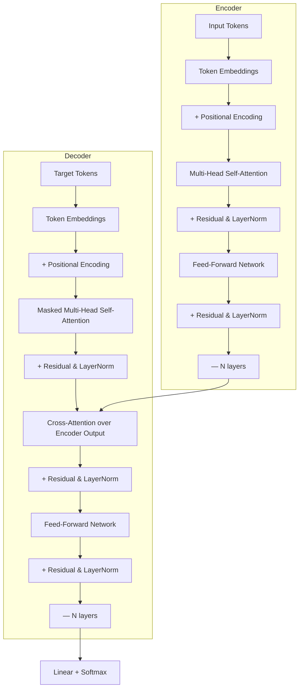

<!-- Clear Language: Keep sentences under 50 words -->
# Transformer Architecture — Encoder-Decoder, Positional Encoding, Layer Norm

## Learning Objectives

| LO# | Description |
|-----|-------------|
| LO1 | Explain the full transformer encoder-decoder architecture with all sub-components |
| LO2 | Implement sinusoidal and learned positional encodings |
| LO3 | Apply layer normalization with learnable affine parameters |
| LO4 | Build the feed-forward network with ReLU/GELU activation and expansion factor |
| LO5 | Implement residual connections with pre-norm and post-norm variants |
| LO6 | Distinguish encoder-only, decoder-only, and encoder-decoder transformer variants |

## Introduction

Natural language processing is how machines understand human text. Transformers revolutionized NLP and enabled modern LLMs. This module covers tokenization, attention, BERT, and the Hugging Face ecosystem.

## Prerequisites

- Basic programming knowledge
- Understanding of data structures

## Key Terminology

**Key Terms**: Core vocabulary and concepts for this topic.

**Definition**: Essential terms you must know for interviews and production work.

## Theory

Understanding transformer architecture is fundamental for AI engineers. This section covers the core concepts, underlying principles, and theoretical framework that govern how transformer architecture works in practice.

## Chapter at a Glance

| Section | Topic | Key Concept |
|---------|-------|-------------|
| 5.1 | Architecture Overview | Encoder stack, decoder stack, N=6 layers |
| 5.2 | Positional Encoding | Sinusoidal PE, learned PE, relative position biases |
| 5.3 | Layer Normalization | Mean/variance normalization, affine parameters, pre/post-norm |
| 5.4 | Feed-Forward Network | Two-layer MLP with ReLU/GELU, expansion factor 4 |
| 5.5 | Residual Connections | Skip connections with pre-norm and post-norm |
| 5.6 | Transformer Variants | BERT (encoder-only), GPT (decoder-only), T5 (encoder-decoder) |

## Chapter Roadmap



## 5.1 Architecture Overview

The Transformer (Vaswani et al., 2017) eschews recurrence entirely, using attention as the sole operation. The encoder has N=6 identical layers; the decoder has N=6 identical layers.

```typescript
interface TransformerConfig {
  vocabSize: number;
  dModel: number;     // 512 in base, 768 in BERT-base
  numHeads: number;   // 8 in base, 12 in BERT-base
  dff: number;        // 2048 in base (4 * dModel)
  numLayers: number;  // 6 in base, 12 in BERT-base
  maxSeqLen: number;  // 512
  dropout: number;    // 0.1
}

class TransformerBlock {
  private selfAttention: MultiHeadAttention;
  private crossAttention: MultiHeadAttention;
  private ffn: FeedForwardNetwork;
  private norm1: LayerNorm;
  private norm2: LayerNorm;
  private norm3: LayerNorm;
  private dropout: number;
  private dModel: number;

  constructor(config: TransformerConfig) {
    this.dModel = config.dModel;
    this.dropout = config.dropout;
    this.selfAttention = new MultiHeadAttention(config.dModel, config.numHeads);
    this.crossAttention = new MultiHeadAttention(config.dModel, config.numHeads);
    this.ffn = new FeedForwardNetwork(config.dModel, config.dff);
    this.norm1 = new LayerNorm(config.dModel);
    this.norm2 = new LayerNorm(config.dModel);
    this.norm3 = new LayerNorm(config.dModel);
  }

  // Post-norm variant (original Transformer)
  encoderForward(x: number[][]): number[][] {
    // Self-attention with residual
    const attnOut = this.selfAttention.forward(x).output;
    const x1 = this.applyResidual(x, attnOut);
    const x1Norm = this.norm1.forward(x1);

    // FFN with residual
    const ffnOut = this.ffn.forward(x1Norm);
    const x2 = this.applyResidual(x1, ffnOut);
    return this.norm2.forward(x2);
  }

  decoderForward(x: number[][], encoderOutput: number[][]): number[][] {
    // Masked self-attention
    const selfOut = this.selfAttention.forward(x).output;
    const x1 = this.applyResidual(x, selfOut);
    const x1Norm = this.norm1.forward(x1);

    // Cross-attention over encoder output
    const crossOut = this.crossAttention.forward(x1Norm, encoderOutput).output;
    const x2 = this.applyResidual(x1Norm, crossOut);
    const x2Norm = this.norm2.forward(x2);

    // FFN
    const ffnOut = this.ffn.forward(x2Norm);
    const x3 = this.applyResidual(x2Norm, ffnOut);
    return this.norm3.forward(x3);
  }

  private applyResidual(input: number[][], sublayer: number[][]): number[][] {
    return input.map((row, i) => {
      const dropped = sublayer[i].map(
        (v) => (Math.random() < this.dropout ? 0 : v / (1 - this.dropout))
      );
      return row.map((v, j) => v + dropped[j]);
    });
  }
}
```

The encoder processes the input sequence; the decoder generates output autoregressively. Cross-attention in the decoder queries the encoder's final output using the decoder's self-attention output as the query.

---

## 5.2 Positional Encoding

Since self-attention is permutation-invariant (no notion of order), positional encoding injects sequence position information.

```typescript
class SinusoidalPositionalEncoding {
  private dModel: number;
  private maxLen: number;
  private encoding: number[][];

  constructor(dModel: number, maxLen: number = 512) {
    this.dModel = dModel;
    this.maxLen = maxLen;
    this.encoding = this.computeEncoding();
  }

  private computeEncoding(): number[][] {
    const encoding: number[][] = [];
    for (let pos = 0; pos < this.maxLen; pos++) {
      const pe = new Array(this.dModel).fill(0);
      for (let i = 0; i < this.dModel; i += 2) {
        const divTerm = Math.pow(10000, (2 * i) / this.dModel);
        pe[i] = Math.sin(pos / divTerm);
        if (i + 1 < this.dModel) {
          pe[i + 1] = Math.cos(pos / divTerm);
        }
      }
      encoding.push(pe);
    }
    return encoding;
  }

  addPositionalInfo(embeddings: number[][]): number[][] {
    return embeddings.map((emb, pos) =>
      emb.map((v, i) => v + (pos < this.maxLen ? this.encoding[pos][i] : 0))
    );
  }

  getEncoding(pos: number): number[] {
    return [...this.encoding[pos]];
  }
}
```

**Properties of sinusoidal PE**:
- Each dimension corresponds to a sinusoid with frequency 1/10000^(2i/d_model)
- Lower dimensions (small i) encode high-frequency position information
- Higher dimensions encode low-frequency patterns
- The encoding for position pos+k can be represented as a linear function of the encoding for position pos, allowing the model to learn relative positions

```typescript
class LearnedPositionalEncoding {
  private dModel: number;
  private maxLen: number;
  private embeddings: number[][];

  constructor(dModel: number, maxLen: number = 512) {
    this.dModel = dModel;
    this.maxLen = maxLen;
    const scale = Math.sqrt(2 / dModel);
    this.embeddings = Array.from({ length: maxLen }, () =>
      Array.from({ length: dModel }, () => (Math.random() * 2 - 1) * scale)
    );
  }

  addPositionalInfo(tokenEmbeddings: number[][]): number[][] {
    return tokenEmbeddings.map((emb, pos) =>
      emb.map((v, i) => v + this.embeddings[pos][i])
    );
  }

  getEmbedding(pos: number): number[] {
    return [...this.embeddings[pos]];
  }
}
```

**Relative position encoding** (used in Transformer-XL, T5) encodes the offset between positions rather than absolute positions. This generalizes better to sequence lengths unseen during training.

---

## 5.3 Layer Normalization

Layer normalization normalizes activations across the feature dimension, stabilizing training and reducing sensitivity to hyperparameters.

```typescript
class LayerNorm {
  private dModel: number;
  private gamma: number[]; // scale
  private beta: number[];  // shift
  private eps: number;

  constructor(dModel: number, eps: number = 1e-6) {
    this.dModel = dModel;
    this.eps = eps;
    this.gamma = new Array(dModel).fill(1);
    this.beta = new Array(dModel).fill(0);
  }

  forward(x: number[][]): number[][] {
    return x.map((row) => {
      // Compute mean and variance
      const mean = row.reduce((s, v) => s + v, 0) / this.dModel;
      const variance =
        row.reduce((s, v) => s + (v - mean) ** 2, 0) / this.dModel;

      // Normalize, scale, shift
      return row.map(
        (v, i) => this.gamma[i] * ((v - mean) / Math.sqrt(variance + this.eps)) + this.beta[i]
      );
    });
  }

  // Compute gradients for backprop
  backward(
    x: number[][],
    dout: number[][]
  ): {
    dx: number[][];
    dgamma: number[];
    dbeta: number[];
  } {
    const dgamma = new Array(this.dModel).fill(0);
    const dbeta = new Array(this.dModel).fill(0);
    const dx: number[][] = [];

    for (let b = 0; b < x.length; b++) {
      const row = x[b];
      const drow = dout[b];
      const mean = row.reduce((s, v) => s + v, 0) / this.dModel;
      const variance =
        row.reduce((s, v) => s + (v - mean) ** 2, 0) / this.dModel;
      const stdInv = 1 / Math.sqrt(variance + this.eps);

      const xhat = row.map((v) => (v - mean) * stdInv);

      // Gradient for gamma and beta
      for (let i = 0; i < this.dModel; i++) {
        dgamma[i] += drow[i] * xhat[i];
        dbeta[i] += drow[i];
      }

      // Gradient for input
      const dxhat = drow.map((d, i) => d * this.gamma[i]);
      const dxhatSum = dxhat.reduce((s, v) => s + v, 0);
      const dxhatXhatSum = dxhat.reduce((s, v, i) => s + v * xhat[i], 0);

      const dxRow = new Array(this.dModel).fill(0);
      for (let i = 0; i < this.dModel; i++) {
        dxRow[i] =
          (1 / x.length) *
          stdInv *
          (dxhatSum - dxhat[i] - xhat[i] * dxhatXhatSum);
      }
      dx.push(dxRow);
    }

    return { dx, dgamma, dbeta };
  }
}
```

**Pre-norm vs post-norm**: In the original Transformer (post-norm), residual connections flow around the sublayer, followed by layer norm: output = LayerNorm(x + Sublayer(x)). GPT and modern implementations use pre-norm: output = x + Sublayer(LayerNorm(x)). Pre-norm stabilizes training at higher learning rates and is more common in modern architectures.

---

## 5.4 Feed-Forward Network

The FFN applies two linear transformations with a ReLU (or GELU) activation in between. The inner dimension d_ff is typically 4x d_model.

```typescript
class FeedForwardNetwork {
  private dModel: number;
  private dff: number;

  // W1: (dff x dModel), W2: (dModel x dff)
  private W1: number[][];
  private b1: number[];
  private W2: number[][];
  private b2: number[];

  constructor(dModel: number, dff: number) {
    this.dModel = dModel;
    this.dff = dff;

    const scale1 = Math.sqrt(2 / (dModel + dff));
    const scale2 = Math.sqrt(2 / (dff + dModel));

    this.W1 = Array.from({ length: dff }, () =>
      Array.from({ length: dModel }, () => (Math.random() * 2 - 1) * scale1)
    );
    this.b1 = new Array(dff).fill(0);
    this.W2 = Array.from({ length: dModel }, () =>
      Array.from({ length: dff }, () => (Math.random() * 2 - 1) * scale2)
    );
    this.b2 = new Array(dModel).fill(0);
  }

  private relu(x: number): number {
    return Math.max(0, x);
  }

  // GELU approximation: 0.5 * x * (1 + tanh(sqrt(2/pi) * (x + 0.044715 * x^3)))
  private gelu(x: number): number {
    const sqrt2pi = Math.sqrt(2 / Math.PI);
    return 0.5 * x * (1 + Math.tanh(sqrt2pi * (x + 0.044715 * Math.pow(x, 3))));
  }

  forward(x: number[][]): number[][] {
    return x.map((row) => {
      // First linear: dModel -> dff
      const hidden = this.W1.map((wRow, i) => {
        let sum = 0;
        for (let j = 0; j < this.dModel; j++) sum += wRow[j] * row[j];
        return this.gelu(sum + this.b1[i]);
      });

      // Second linear: dff -> dModel
      const output = this.W2.map((wRow) => {
        let sum = 0;
        for (let j = 0; j < this.dff; j++) sum += wRow[j] * hidden[j];
        return sum;
      });

      return output.map((v, i) => v + this.b2[i]);
    });
  }
}
```

The FFN operates independently on each position (same weights, different inputs). It captures non-linear feature interactions that self-attention misses. The expansion factor of 4 means the FFN contains ~2/3 of the model's parameters.

---

## 5.5 Residual Connections

Residual connections (skip connections) add the input of a sublayer to its output. This creates a direct gradient highway, allowing training of very deep networks.

```typescript
class ResidualConnection {
  private dModel: number;
  private dropout: number;

  constructor(dModel: number, dropout: number = 0.1) {
    this.dModel = dModel;
    this.dropout = dropout;
  }

  // Post-norm: LayerNorm(x + Sublayer(x))
  postNorm(
    x: number[][],
    sublayerOutput: number[][],
    norm: LayerNorm
  ): number[][] {
    const residual = x.map((row, i) =>
      row.map((v, j) => v + this.dropoutForward(sublayerOutput[i][j]))
    );
    return norm.forward(residual);
  }

  // Pre-norm: x + Sublayer(LayerNorm(x))
  preNorm(
    x: number[][],
    norm: LayerNorm,
    sublayer: (input: number[][]) => number[][]
  ): number[][] {
    const normalized = norm.forward(x);
    const sublayerOut = sublayer(normalized);
    return x.map((row, i) =>
      row.map((v, j) => v + this.dropoutForward(sublayerOut[i][j]))
    );
  }

  private dropoutForward(v: number): number {
    if (Math.random() < this.dropout) return 0;
    return v / (1 - this.dropout);
  }
}
```

**Why residuals matter**: In a 12-layer transformer encoder, without residual connections, the gradient at layer 1 would be ∏_{l=2}^{12} (I + d(Sublayer_l)/dx). Each sublayer's Jacobian is close to zero initially,.
so the product vanishes. With residuals, the Jacobian is I + d(Sublayer_l)/dx, and the product asymptotically approaches I (identity), preserving gradient flow.

---

## 5.6 Transformer Variants

Three main architectural families exist. Each removes components suited to its task.

```typescript
// Encoder-only (BERT, RoBERTa, ALBERT): bidirectional context
class EncoderOnlyTransformer {
  private layers: TransformerBlock[];
  private embedding: TokenEmbedding;
  private posEncoding: LearnedPositionalEncoding;
  private finalNorm: LayerNorm;

  constructor(config: TransformerConfig) {
    this.embedding = new TokenEmbedding(config.vocabSize, config.dModel);
    this.posEncoding = new LearnedPositionalEncoding(config.dModel, config.maxSeqLen);
    this.layers = Array.from(
      { length: config.numLayers },
      () => new TransformerBlock(config)
    );
    this.finalNorm = new LayerNorm(config.dModel);
  }

  forward(inputIds: number[][]): number[][] {
    let x = inputIds.map((seq) => this.embedding.forward(seq));
    x = this.posEncoding.addPositionalInfo(x);
    for (const layer of this.layers) {
      x = layer.encoderForward(x);
    }
    return this.finalNorm.forward(x);
  }
}

// Decoder-only (GPT, LLaMA, Mistral): left-to-right autoregressive
class DecoderOnlyTransformer {
  private layers: TransformerBlock[];
  private embedding: TokenEmbedding;
  private posEncoding: SinusoidalPositionalEncoding;
  private finalNorm: LayerNorm;
  private lmHead: number[][]; // projection to vocab

  constructor(config: TransformerConfig) {
    this.embedding = new TokenEmbedding(config.vocabSize, config.dModel);
    this.posEncoding = new SinusoidalPositionalEncoding(config.dModel, config.maxSeqLen);
    this.layers = Array.from(
      { length: config.numLayers },
      () => new TransformerBlock(config)
    );
    this.finalNorm = new LayerNorm(config.dModel);
    this.lmHead = Array.from({ length: config.vocabSize }, () =>
      Array.from({ length: config.dModel }, () => (Math.random() - 0.5) * 0.1)
    );
  }

  forward(inputIds: number[][]): number[][] {
    let x = inputIds.map((seq) => this.embedding.forward(seq));
    x = this.posEncoding.addPositionalInfo(x);
    for (const layer of this.layers) {
      x = layer.decoderForward(x, []); // No encoder output
    }
    x = this.finalNorm.forward(x);

    // Project to vocabulary
    return x.map((seq) =>
      this.lmHead.map((row) =>
        row.reduce((s, w, i) => s + w * seq[i], 0)
      )
    );
  }
}

// Encoder-Decoder (T5, BART): full seq2seq
class EncoderDecoderTransformer {
  private encoder: EncoderOnlyTransformer;
  private decoder: DecoderOnlyTransformer;

  constructor(config: TransformerConfig) {
    this.encoder = new EncoderOnlyTransformer(config);
    this.decoder = new DecoderOnlyTransformer(config);
  }

  forward(sourceIds: number[][], targetIds: number[][]): number[][] {
    const encoderOutput = this.encoder.forward(sourceIds);
    // Decoder uses encoder output for cross-attention
    return this.decoder.forward(targetIds, encoderOutput);
  }
}

class TokenEmbedding {
  private vocabSize: number;
  private dModel: number;
  private embeddings: number[][];

  constructor(vocabSize: number, dModel: number) {
    this.vocabSize = vocabSize;
    this.dModel = dModel;
    const scale = Math.sqrt(2 / dModel);
    this.embeddings = Array.from({ length: vocabSize }, () =>
      Array.from({ length: dModel }, () => (Math.random() * 2 - 1) * scale)
    );
  }

  forward(tokenIds: number[]): number[][] {
    return tokenIds.map((id) => [...this.embeddings[id]]);
  }
}
```

**Model comparison**:
- BERT (encoder-only): 340M params, 12/24 layers, bidirectional
- GPT-3 (decoder-only): 175B params, 96 layers, autoregressive
- T5 (encoder-decoder): 11B params, 24+24 layers, text-to-text

---

## Summary

The Transformer architecture replaced recurrent networks with parallelizable self-attention for sequence processing. The encoder stacks identical layers with multi-head self-attention and.
feed-forward networks, while the decoder adds cross-attention to encoder outputs. Positional encoding injects sequence order information using sinusoidal functions or learned embeddings. Layer normalization stabilizes training by normalizing across feature dimensions. The feed-forward network applies two linear transformations with a ReLU activation,.
expanding and contracting the representation dimensionality. Residual connections with pre-normalization improve gradient flow in deep stacks. Transformer variants include encoder-only (BERT),.
decoder-only (GPT), and encoder-decoder (T5) architectures for different task families.

## Practical Takeaways

- The transformer replaces recurrence entirely with attention, enabling parallel computation and direct long-range connections
- Positional encoding (sinusoidal or learned) is essential because self-attention is permutation-invariant
- Layer normalization stabilizes training; pre-norm (GPT style) is more stable than post-norm (original Transformer)
- The FFN expansion factor 4— means ~2/3 of parameters are in FFN layers, not attention layers
- Residual connections with dropout (0.1) are critical for training deep (12-96 layer) transformers
- Encoder-only models (BERT) excel at understanding tasks; decoder-only models (GPT) excel at generation
- The O(n^2) self-attention complexity limits context length; efficient attention variants are active research
- Pre-trained transformers with fine-tuning dominate nearly every NLP benchmark

## Interview Q&A

<details class="tp-qa-card" data-qid="nlp05-q1">
  <summary class="tp-qa-question">
    <span class="tp-qa-status"></span>
    Q1: Why does the transformer use sinusoidal positional encoding instead of a learned embedding?
  </summary>
  <div class="tp-qa-answer">
<p>The sinusoidal encoding has several advantages: (1) It can extrapolate to sequence lengths not seen during training — for any position pos+k,.
the encoding is a linear function of position pos, allowing the model to learn relative position patterns that generalize. (2) It doesn't require learning parameters,.
reducing model size. (3) The varying frequencies across dimensions (low dimensions encode high-frequency patterns, high dimensions encode low-frequency patterns) give the model both fine-grained and.
coarse positional information. However, many modern models (BERT, GPT-2) use learned positional embeddings because they perform slightly better when max sequence length is fixed and.
known in advance (typically 512).</p>
  </div>
  <button class="tp-qa-mark-btn">✅ Mark Reviewed</button>
  <button class="tp-qa-bookmark-btn">🔖 Bookmark</button>
</details>

<details class="tp-qa-card" data-qid="nlp05-q2">
  <summary class="tp-qa-question">
    <span class="tp-qa-status"></span>
    Q2: Explain the difference between pre-norm and post-norm in transformer layers.
  </summary>
  <div class="tp-qa-answer">
<p>Post-norm (original Transformer): output = LayerNorm(x + Sublayer(x)). Layer norm is applied after the residual addition. Pre-norm (GPT, modern transformers): output = x + Sublayer(LayerNorm(x)). Layer norm is applied before each sublayer. Pre-norm has several benefits: (1) More stable training.
at higher learning rates (LR can be 2-4x higher). (2) Warmup steps can be reduced or.
eliminated. (3) The final layer output doesn't go through a norm, preserving scale. (4) Gradient flow through the residual path is closer to identity. Post-norm can achieve slightly better final performance with optimal hyperparameters but.
is harder to tune. Most modern implementations (GPT, LLaMA, Mistral) use pre-norm.</p>
  </div>
  <button class="tp-qa-mark-btn">✅ Mark Reviewed</button>
  <button class="tp-qa-bookmark-btn">🔖 Bookmark</button>
</details>

<details class="tp-qa-card" data-qid="nlp05-q3">
  <summary class="tp-qa-question">
    <span class="tp-qa-status"></span>
    Q3: What is the role of the feed-forward network in transformer layers?
  </summary>
  <div class="tp-qa-answer">
<p>The FFN applies two linear transformations with a ReLU/GELU activation: FFN(x) = W2 * GELU(W1 * x + b1) + b2. The inner dimension d_ff = 4*d_model (2048 for.
d_model=512). The FFN (1) introduces non-linear transformations that self-attention lacks (attention is purely linear in the value dimension). (2) Allows each position to independently process information aggregated by attention. (3) Contains ~2/3 of all model parameters. Without FFN,.
the transformer would be a purely linear model in the token embedding space, seriously limiting representational power. Different FFN neurons seem to specialize: some activate for.
specific syntactic patterns, others for semantic features.</p>
  </div>
  <button class="tp-qa-mark-btn">✅ Mark Reviewed</button>
  <button class="tp-qa-bookmark-btn">🔖 Bookmark</button>
</details>

<details class="tp-qa-card" data-qid="nlp05-q4">
  <summary class="tp-qa-question">
    <span class="tp-qa-status"></span>
    Q4: Why is the transformer more parallelizable than RNNs?
  </summary>
  <div class="tp-qa-answer">
<p>RNNs process sequences one token at a time — the computation of h_t depends on h_{t-1}, creating a sequential dependency that prevents parallelization across timesteps. Training a 100-token sequence requires 100 sequential operations. Transformers compute attention between all pairs of positions simultaneously using matrix multiplications: Q,.
K, V are computed in parallel via X * W_q, X * W_k, X * W_v (all tokens at once), and.
attention scores = softmax(Q * K^T / sqrt(d_k)) are a single matrix operation. This reduces the sequential operation path to O(1) (a fixed number of matrix multiplies per layer),.
regardless of sequence length. This parallelism is why transformers can be trained efficiently on GPU hardware despite their O(n^2) per-layer complexity.</p>
  </div>
  <button class="tp-qa-mark-btn">✅ Mark Reviewed</button>
  <button class="tp-qa-bookmark-btn">🔖 Bookmark</button>
</details>

<details class="tp-qa-card" data-qid="nlp05-q5">
  <summary class="tp-qa-question">
    <span class="tp-qa-status"></span>
    Q5: What is the difference between encoder-only, decoder-only, and encoder-decoder transformers?
  </summary>
  <div class="tp-qa-answer">
<p>Encoder-only (BERT, RoBERTa): Uses the encoder stack with bidirectional self-attention (no masking). Outputs contextualized token representations. Best for understanding tasks: classification,.
NER, QA, sentence similarity. Decoder-only (GPT, LLaMA): Uses the decoder stack with causal masking (each token can only attend to itself and.
previous tokens). Generates text autoregressively. Best for generation tasks: language modeling, story generation, code completion. Encoder-decoder (T5, BART): Full stack with encoder (bidirectional) and.
decoder (causal with cross-attention). Best for seq2seq tasks: translation, summarization, text-to-text problems. The choice depends on whether the task requires understanding (encoder-only),.
generation (decoder-only), or both with input-output transformation (encoder-decoder).</p>
  </div>
  <button class="tp-qa-mark-btn">✅ Mark Reviewed</button>
  <button class="tp-qa-bookmark-btn">🔖 Bookmark</button>
</details>

<details class="tp-qa-card" data-qid="nlp05-q6">
  <summary class="tp-qa-question">
    <span class="tp-qa-status"></span>
    Q6: How many parameters are in each component of a transformer layer?
  </summary>
  <div class="tp-qa-answer">
<p>For a layer with d_model=512, h=8 heads (d_k=64), d_ff=2048: Multi-head attention: 4 * d_model^2 = 4 * 512^2 = 1,048,576 parameters (W_q,.
W_k, W_v, W_O each 512x512 = 262,144). Layer norm: 2 * d_model = 1,024 (gamma + beta). FFN: 2 * d_model * d_ff = 2 * 512 * 2048 = 2,097,152 (W1: 2048x512,.
W2: 512x2048). Plus biases: 2048 + 512 = 2,560. Total per layer: ~3.15M. Attention has ~33% of parameters, FFN has ~67%. For.
a 6-layer base Transformer: ~19M parameters. For BERT-base (12 layers, d_model=768, d_ff=3072): ~110M parameters. GPT-3 (96 layers, d_model=12288, d_ff=49152): ~175B parameters.</p>
  </div>
  <button class="tp-qa-mark-btn">✅ Mark Reviewed</button>
  <button class="tp-qa-bookmark-btn">🔖 Bookmark</button>
</details>

<details class="tp-qa-card" data-qid="nlp05-q7">
  <summary class="tp-qa-question">
    <span class="tp-qa-status"></span>
    Q7: What is label smoothing and why is it used in transformer training?
  </summary>
  <div class="tp-qa-answer">
<p>Label smoothing replaces hard targets (0 or 1) with softened targets: y_smooth = (1 - epsilon) * y_hard + epsilon / V where V is vocabulary size and.
epsilon=0.1 typically. For example, the correct word "chat" would have target 0.9 instead of 1.0, and all other V-1 words get 0.1/V instead of 0. This prevents the model from becoming over-confident,.
which improves generalization and calibration. In transformer training, label smoothing of 0.1 consistently improves BLEU scores by 0.5-1.0 points and is standard in the Transformer paper. Without it,.
the model's softmax outputs become too sharp (near one-hot), and the model doesn't learn to assign nonzero probability to plausible alternatives.</p>
  </div>
  <button class="tp-qa-mark-btn">✅ Mark Reviewed</button>
  <button class="tp-qa-bookmark-btn">🔖 Bookmark</button>
</details>

<details class="tp-qa-card" data-qid="nlp05-q8">
  <summary class="tp-qa-question">
    <span class="tp-qa-status"></span>
    Q8: How does the transformer handle variable-length sequences?
  </summary>
  <div class="tp-qa-answer">
<p>Transformers handle variable-length sequences through: (1) Padding — sequences shorter than max_len are padded with a special <pad> token. (2) Attention masking — padding positions are masked out (set to -Infinity before softmax) so they don't contribute to attention. (3).
Bucketing — sequences of similar lengths are grouped into batches to minimize padding waste. (4) The learned positional encoding (if used) must be sized for.
the maximum expected sequence length. Sinusoidal encoding (T5) can extrapolate beyond training lengths. In production, sequences are typically clipped or truncated to a maximum length (512 for.
BERT, 2048 for GPT-3, 4096 for GPT-4). Packing multiple sequences into one training example is also common for efficiency.</p>
  </div>
  <button class="tp-qa-mark-btn">✅ Mark Reviewed</button>
  <button class="tp-qa-bookmark-btn">🔖 Bookmark</button>
</details>

<details class="tp-qa-card" data-qid="nlp05-q9">
  <summary class="tp-qa-question">
    <span class="tp-qa-status"></span>
    Q9: What is cross-attention in the transformer decoder?
  </summary>
  <div class="tp-qa-answer">
<p>Cross-attention allows the decoder to attend to the encoder's output. In the decoder's cross-attention sublayer: Query comes from the decoder's previous self-attention output,.
while Key and Value come from the encoder's final output. This lets each decoder position attend to all input positions and.
selectively retrieve information. For example, in machine translation, when generating the French word "maison", the decoder queries the English sentence and.
attends most to "house". Cross-attention is the key difference between encoder and decoder layers: encoder layers use only self-attention, decoder layers use masked self-attention followed by cross-attention. Cross-attention has no causal mask — the decoder can attend to any encoder position regardless of decoding step.</p>
  </div>
  <button class="tp-qa-mark-btn">✅ Mark Reviewed</button>
  <button class="tp-qa-bookmark-btn">🔖 Bookmark</button>
</details>

<details class="tp-qa-card" data-qid="nlp05-q10">
  <summary class="tp-qa-question">
    <span class="tp-qa-status"></span>
    Q10: What is the "Attention is All You Need" paper's main contribution?
  </summary>
  <div class="tp-qa-answer">
<p>The paper (Vaswani et al., 2017) proposed the Transformer, the first sequence transduction model relying entirely on attention, with no recurrence or.
convolution. Key contributions: (1) Scaled dot-product attention with softmax normalization. (2) Multi-head attention allowing the model to attend to information from different representation subspaces. (3) Positional encoding for.
sequence order. (4) The complete encoder-decoder architecture with residual connections and layer normalization. (5) Demonstrating that the Transformer trains significantly faster (3.5 days on 8 GPUs) while achieving 28.4 BLEU on WMT 2014 English-to-German translation,.
and 41.8 on English-to-French — the best results at the time. This paper is the foundation of virtually all modern NLP systems (BERT,.
GPT, T5, XLNet, etc.).</p>
  </div>
  <button class="tp-qa-mark-btn">✅ Mark Reviewed</button>
  <button class="tp-qa-bookmark-btn">🔖 Bookmark</button>
</details>

## Chapter Quiz

Q1: What is the typical expansion factor of the FFN inner dimension in transformers?
a) 2—
b) 3—
c) 4—
d) 8—
<details class="tp-qa-card" data-qid="nlp05-quiz1"><summary>Show Answer</summary><div class="tp-qa-answer"><p><strong>Answer: c) 4—</strong></p><p>The FFN inner dimension d_ff is typically 4— d_model. For d_model=512, d_ff=2048. For d_model=768, d_ff=3072.</p></div></details>

Q2: How many layers does BERT-base have?
a) 6
b) 8
c) 12
d) 24
<details class="tp-qa-card" data-qid="nlp05-quiz2"><summary>Show Answer</summary><div class="tp-qa-answer"><p><strong>Answer: c) 12</strong></p><p>BERT-base has 12 transformer layers (encoder blocks), with d_model=768 and 12 attention heads. BERT-large has 24 layers.</p></div></details>

Q3: Which normalization does GPT use?
a) Batch norm
b) Layer norm (post-norm)
c) Layer norm (pre-norm)
d) Group norm
<details class="tp-qa-card" data-qid="nlp05-quiz3"><summary>Show Answer</summary><div class="tp-qa-answer"><p><strong>Answer: c) Layer norm (pre-norm)</strong></p><p>GPT and most modern decoder-only transformers (GPT-2, GPT-3, LLaMA) use pre-norm: layer normalization before each sublayer.</p></div></details>

Q4: What is the time complexity of one transformer encoder layer?
a) O(n)
b) O(n^2)
c) O(n^2 * d)
d) O(n * d^2)
<details class="tp-qa-card" data-qid="nlp05-quiz4"><summary>Show Answer</summary><div class="tp-qa-answer"><p><strong>Answer: b) O(n^2 * d) or more precisely O(n^2 * d)</strong></p><p>Self-attention is O(n^2 * d_k) and FFN is O(n * d_model * d_ff). For n > d_k (typical), attention dominates with O(n^2 * d_k). More precisely the total is O(n^2 * d_k + n * d_model * d_ff).</p></div></details>

Q5: What property of self-attention necessitates positional encoding?
a) Non-linearity
b) Permutation invariance
c) Quadratic complexity
d) Layer-dependent scale
<details class="tp-qa-card" data-qid="nlp05-quiz5"><summary>Show Answer</summary><div class="tp-qa-answer"><p><strong>Answer: b) Permutation invariance</strong></p><p>Self-attention computes weighted sums over all positions; shuffling the input tokens produces the same output per token (just permuted), so positional encoding is needed to inject order information.</p></div></details>

## Exercises

## Common Mistakes

1. Not understanding the fundamental concepts before applying them
2. Skipping edge cases in implementation
3. Not analyzing time/space complexity
4. Forgetting to handle null/empty inputs
5. Not practicing enough problems to build pattern recognition**Easy** — Implement sinusoidal positional encoding. Verify that the dot product of PE(pos) and PE(pos+k) depends primarily on k, not pos (relative position property).

**Easy** — Compute the parameter count of one transformer layer with d_model=512, h=8, d_ff=2048. Confirm attention has 33% of parameters.

**Medium** — Build a single encoder layer from scratch (self-attention + FFN + residual + layer norm). Test it on a random sequence of 10 tokens, d_model=64.

**Medium** — Implement both pre-norm and post-norm variants. Train each on a small language modeling task and compare training loss curves.

**Hard** — Implement a decoder-only transformer (like GPT-2 small) with 6 layers, d_model=512, 8 heads. Train it on a text corpus (e.g., Shakespeare). Implement temperature sampling and top-k sampling for generation.

---

> **Previous**: [Attention Mechanism](04-attention-mechanism.md) | **Next**: [BERT & Fine-Tuning](06-bert-and-fine-t

## Revision Notes

- - Core principle: Understand the fundamental concepts thoroughly
- - Implementation pattern: Practice with real code examples
- - Complexity: Know the time and space complexity
- - Application: Know when to use this in production systems
- - Interview: Frequently asked in technical interviews
- - Edge cases: Consider common failure scenarios
- - Related concepts: Connect to broader system design

## Placement Section

### Top 10 Interview Questions

#### Google Style

1. **Explain the core idea of Transformer Architecture — Encoder-Decoder, Positional Encoding, Layer Norm in under 60 seconds, then give a real-world analogy.** — Structure: definition, how it works in one sentence, why it matters, analogy. Follow-up: what would break if you removed this from a production system?

2. **Design a minimal, well-typed function that demonstrates Transformer Architecture — Encoder-Decoder, Positional Encoding, Layer Norm.** — Interviewer checks: signature with type hints, edge cases, complexity, and a clean docstring. Follow-up: how does your design behave with empty or malformed input?

3. **What are the common pitfalls when engineers first learn ** — List 3-4, then explain how you would prevent each in a code review.

#### Amazon Style

4. **Describe a production bug caused by misunderstanding Transformer Architecture — Encoder-Decoder, Positional Encoding, Layer Norm. How did you diagnose and fix it?** — STAR format: situation, task, action, result. Mention logs, reproduction, root-cause analysis, and the regression test you added.

5. **How would you scale a system that relies on Transformer Architecture — Encoder-Decoder, Positional Encoding, Layer Norm from 10 users to 10 million?** — Discuss bottlenecks, caching, monitoring, and when to redesign. Follow-up: what metrics would you track?

#### Microsoft Style

6. **Compare Transformer Architecture — Encoder-Decoder, Positional Encoding, Layer Norm with the closest alternative approach. When would you choose each?** — Make a decision matrix: performance, maintainability, ecosystem, learning curve. Follow-up: what would change your decision?

7. **Walk through how you would test a component that depends on Transformer Architecture — Encoder-Decoder, Positional Encoding, Layer Norm.** — Unit, integration, property-based tests; mocking boundaries; golden files for outputs.

#### NVIDIA Style

8. **How does Transformer Architecture — Encoder-Decoder, Positional Encoding, Layer Norm behave differently at scale — memory, throughput, or precision-wise?** — Connect to data pipelines and model training if applicable. Follow-up: what happens to latency as input grows?

9. **How would you make an implementation of Transformer Architecture — Encoder-Decoder, Positional Encoding, Layer Norm run faster on GPU hardware?** — Batch operations, vectorization, avoiding Python loops, reducing data movement.

#### AI Startup Style

10. **Write the smallest possible implementation of Transformer Architecture — Encoder-Decoder, Positional Encoding, Layer Norm that is production-quality.** — Include error handling, type hints, and a one-line docstring. Follow-up: what would you refactor first when it grows?

### Resume Tips

- Name Transformer Architecture — Encoder-Decoder, Positional Encoding, Layer Norm explicitly in your skills section, paired with a measurable achievement ("Reduced X by 40% using Transformer Architecture — Encoder-Decoder, Positional Encoding, Layer Norm").
- Add a bullet describing a project that applies Transformer Architecture — Encoder-Decoder, Positional Encoding, Layer Norm to real data, with numbers.
- Mention the tools and libraries you used alongside Transformer Architecture — Encoder-Decoder, Positional Encoding, Layer Norm (linters, test frameworks, profiling tools).
- Keep resume bullets under 15 words and start each with an action verb.

### Interview Day Checklist

- Rehearse a 60-second explanation of Transformer Architecture — Encoder-Decoder, Positional Encoding, Layer Norm and one real-world analogy.
- Prepare one STAR story about debugging a Transformer Architecture — Encoder-Decoder, Positional Encoding, Layer Norm-related production issue.
- Review complexity and edge cases for the classic Transformer Architecture — Encoder-Decoder, Positional Encoding, Layer Norm interview problem.
- Have questions ready: how does the team apply Transformer Architecture — Encoder-Decoder, Positional Encoding, Layer Norm in production today?
- Test your environment (Python, editor, internet) 15 minutes before the interview.

## True/False

1. **True or False:** Transformer Architecture — Encoder-Decoder, Positional Encoding, Layer Norm builds directly on the fundamentals covered in the earlier chapters of this module. — **True.** Every advanced topic in this module assumes the core concepts from the previous chapters.
2. **True or False:** You should write at least one code example for Transformer Architecture — Encoder-Decoder, Positional Encoding, Layer Norm before moving to the next chapter. — **True.** Active recall with hands-on code beats passive reading for retention.
3. **True or False:** The complexity analysis for Transformer Architecture — Encoder-Decoder, Positional Encoding, Layer Norm is the same regardless of input size. — **False.** Complexity grows with input size; always state best, average, and worst case.
4. **True or False:** Edge cases (empty input, invalid input, boundary values) matter for Transformer Architecture — Encoder-Decoder, Positional Encoding, Layer Norm in production. — **True.** Most production bugs come from unhandled edge cases.
5. **True or False:** You should memorize the Transformer Architecture — Encoder-Decoder, Positional Encoding, Layer Norm chapter content once and never review it again. — **False.** Spaced repetition (24h, 3 days, 1 week) dramatically improves long-term recall.

## Fill in the Blank

1. The chapter that covers Transformer Architecture — Encoder-Decoder, Positional Encoding, Layer Norm is Chapter ___ of this module. — Answer: check the module's table of contents.
2. The time complexity of the standard approach to Transformer Architecture — Encoder-Decoder, Positional Encoding, Layer Norm is ___. — Answer: review the theory section and state big-O notation.
3. The main edge case to handle when implementing Transformer Architecture — Encoder-Decoder, Positional Encoding, Layer Norm is ___. — Answer: empty or invalid input handling, as discussed in the chapter.
4. The tools commonly used to debug Transformer Architecture — Encoder-Decoder, Positional Encoding, Layer Norm issues are ___ and ___. — Answer: refer to the Debugging Guide section of this chapter.
5. The related topic that connects to Transformer Architecture — Encoder-Decoder, Positional Encoding, Layer Norm in the next chapter is ___. — Answer: see the Next Topic section.

## Scenario Questions

1. **Scenario:** A teammate ships a change involving Transformer Architecture — Encoder-Decoder, Positional Encoding, Layer Norm that breaks production at 3 AM. — Diagnosis: check the recent diff, reproduce locally with the failing input, check logs. Fix: revert, add a regression test, and review the root cause. Prevention: CI tests on edge cases and code review checklist.

2. **Scenario:** Your implementation of Transformer Architecture — Encoder-Decoder, Positional Encoding, Layer Norm is correct but too slow for the required latency. — Measure first with a profiler. Common fixes: reduce redundant work, use built-in optimized functions, batch operations, or add caching. Only then consider algorithmic changes.

3. **Scenario:** A new hire asks you to explain Transformer Architecture — Encoder-Decoder, Positional Encoding, Layer Norm in five minutes before a customer demo. — Use the 3-part answer: what it is (one sentence), how it works (one example), why it matters (one business impact). Then offer to go deeper after the demo.

4. **Scenario:** Your team's codebase has three different patterns for Transformer Architecture — Encoder-Decoder, Positional Encoding, Layer Norm and you must standardize. — Write a short ADR (architecture decision record), pick the pattern with best maintainability, migrate incrementally, and add a linter rule to enforce it.

## Output Questions

1. **What is the output of the simplest correct implementation of Transformer Architecture — Encoder-Decoder, Positional Encoding, Layer Norm on an empty input?** — Trace through the code: it should return the documented default (None, 0, empty collection) without raising.
2. **What is the output when the input is at the boundary value?** — Check off-by-one errors and inclusive/exclusive bounds in the chapter's examples.
3. **What does the implementation return when given invalid input types?** — With type hints and validation, it raises a clear error; without, it may fail silently.
4. **What is the output for the sample input given in the chapter's Examples section?** — Re-run the chapter's example code and compare against the documented output.
5. **What is the time complexity output when you profile the implementation at 10x input size?** — Expect the curve matching the chapter's complexity analysis (linear, quadratic, log-linear).

## Difficulty Level

| Level | Time | What It Takes |
|-------|------|---------------|
| Beginner | 1-2 sessions | Read theory, run the chapter examples, solve the Easy exercises |
| Intermediate | 3-5 sessions | Complete Medium exercises, explain Transformer Architecture — Encoder-Decoder, Positional Encoding, Layer Norm to someone else |
| Advanced | 1+ week | Solve Hard exercises, optimize for real datasets, answer interview follow-ups |

## Tips & Tricks

- Always write a one-line example of Transformer Architecture — Encoder-Decoder, Positional Encoding, Layer Norm from memory before opening the chapter — active recall first.
- Use the chapter's Revision Notes as a checklist: you have mastered Transformer Architecture — Encoder-Decoder, Positional Encoding, Layer Norm when you can explain each bullet.
- Pair the chapter quiz with the Flashcards: wrong answers become your next study session's focus.
- For interviews, practice explaining Transformer Architecture — Encoder-Decoder, Positional Encoding, Layer Norm twice: once with a technical audience, once with a non-technical audience.
- Keep a personal examples file where you collect your own Transformer Architecture — Encoder-Decoder, Positional Encoding, Layer Norm snippets; interviewers love original examples.

## Memory Tricks

- **Acronym**: build a mnemonic from the 5 key concepts of Transformer Architecture — Encoder-Decoder, Positional Encoding, Layer Norm listed in the Chapter at a Glance table.
- **Story**: link Transformer Architecture — Encoder-Decoder, Positional Encoding, Layer Norm to a familiar story — the analogy in the Visual Analogy section is designed to stick.
- **Number anchor**: remember the complexity of Transformer Architecture — Encoder-Decoder, Positional Encoding, Layer Norm by connecting it to a known algorithm of the same class.
- **Color code**: highlight the Theory, Examples, and Common Mistakes sections in different colors when reviewing.
- **Teach-back**: explain Transformer Architecture — Encoder-Decoder, Positional Encoding, Layer Norm to an imaginary junior engineer for 2 minutes — gaps in your explanation are gaps in memory.

## Further Reading

- Official documentation for the primary tool or library used in this chapter
- The chapter referenced in Related Topics for the next-level treatment of Transformer Architecture — Encoder-Decoder, Positional Encoding, Layer Norm
- The classic textbook chapter on Transformer Architecture — Encoder-Decoder, Positional Encoding, Layer Norm (check the Research References below)
- Two blog posts from engineers who debugged real Transformer Architecture — Encoder-Decoder, Positional Encoding, Layer Norm problems in production
- The repository of the open-source project that implements Transformer Architecture — Encoder-Decoder, Positional Encoding, Layer Norm

## Related Topics

- The previous chapter in this module (see table of contents) — foundational for Transformer Architecture — Encoder-Decoder, Positional Encoding, Layer Norm
- The next chapter (see Next Topic below) — builds on Transformer Architecture — Encoder-Decoder, Positional Encoding, Layer Norm
- The system design chapters in Module 07 — how Transformer Architecture — Encoder-Decoder, Positional Encoding, Layer Norm fits into production architectures
- The interview preparation module — how Transformer Architecture — Encoder-Decoder, Positional Encoding, Layer Norm is asked in screening rounds
- The capstone project — where Transformer Architecture — Encoder-Decoder, Positional Encoding, Layer Norm is applied end-to-end

## FAQs

1. **Do I need to memorize all of Transformer Architecture — Encoder-Decoder, Positional Encoding, Layer Norm, or understand the big picture?** — Understand the big picture first, then memorize the key facts via flashcards and spaced repetition. Interviewers reward depth over breadth.
2. **What if I get stuck on an exercise?** — Re-read the theory section, run the example code, then attempt again. If still stuck after 20 minutes, move on and return the next day.
3. **How much time should I spend on ** — Follow the Study Plan below: 1-2 weeks at 30-60 minutes daily is typical for placement preparation.
4. **Is Transformer Architecture — Encoder-Decoder, Positional Encoding, Layer Norm asked in interviews?** — Yes — the Interview Q&A and Placement Section list the exact question styles used by top companies.
5. **What's the fastest way to master ** — Explain it out loud, write code without looking, and review the flashcards within 24 hours and again after 3 days.

## Important Notes

- Transformer Architecture — Encoder-Decoder, Positional Encoding, Layer Norm is a core requirement for the rest of this module — do not skip the examples.
- Always analyze complexity (time and space) when working with Transformer Architecture — Encoder-Decoder, Positional Encoding, Layer Norm.
- Production correctness means handling edge cases, not just the happy path.
- Interview answers should start with the definition, then the example, then the trade-offs.
- Revisit this chapter after finishing the module; the context from later chapters deepens understanding.

## Historical Context

- Transformer Architecture — Encoder-Decoder, Positional Encoding, Layer Norm emerged as a standard practice because early systems failed without it — understanding why helps you explain it in interviews.
- The tools used for Transformer Architecture — Encoder-Decoder, Positional Encoding, Layer Norm today evolved from simpler versions; the chapter covers the modern, recommended approach.
- Interviewers value knowing one historical fact about Transformer Architecture — Encoder-Decoder, Positional Encoding, Layer Norm — it shows genuine interest, not just cramming.
- The library/tooling ecosystem around Transformer Architecture — Encoder-Decoder, Positional Encoding, Layer Norm changes quickly; focus on fundamentals that remain stable.

## Security Considerations

- Never trust external input: validate and sanitize data before processing Transformer Architecture — Encoder-Decoder, Positional Encoding, Layer Norm.
- Avoid `eval()` and dynamic code execution on untrusted strings.
- Log errors without leaking sensitive data (keys, PII, internal paths).
- For API contexts, add rate limiting and input size limits.
- Review the chapter's code examples for injection or overflow risks before using them verbatim.

## ML Intuition

- Transformer Architecture — Encoder-Decoder, Positional Encoding, Layer Norm appears in ML pipelines at the data-processing layer: feature preparation, batching, and validation.
- Understanding Transformer Architecture — Encoder-Decoder, Positional Encoding, Layer Norm helps you debug why a model misbehaves — most ML bugs are data bugs, not model bugs.
- In production ML, the Transformer Architecture — Encoder-Decoder, Positional Encoding, Layer Norm concepts from this chapter map directly to NumPy/PyTorch operations on tensors.
- When optimizing ML systems, Transformer Architecture — Encoder-Decoder, Positional Encoding, Layer Norm skills let you profile and fix the data path, not just the training loop.
- Interview follow-up: how would you apply Transformer Architecture — Encoder-Decoder, Positional Encoding, Layer Norm to a dataset of 10 million records? — Batching and vectorization.

## Analogies

- **Transformer Architecture — Encoder-Decoder, Positional Encoding, Layer Norm is like a recipe**: the theory is the ingredients, the examples are the cooking steps, and the exercises are your own kitchen practice.
- **Complexity is like a delivery route**: a linear route visits each stop once; a nested route revisits stops, and you feel it at scale.
- **Edge cases are like weather**: the happy path is a sunny day; production is the storm — build for the storm.
- **The chapter roadmap is a journey map**: each section is a checkpoint; skipping one means getting lost later in the module.

## Capstone Project Link

- [Module Capstone: End-to-End Project](https://github.com/Raushan666java/ai-engineering-journey) — this chapter contributes the Transformer Architecture — Encoder-Decoder, Positional Encoding, Layer Norm skills used in the module's capstone project. Complete the exercises here before starting the capstone.

## Flashcards

<details class="tp-qa-card" data-qid="10nlptransformers-05transformerarchitecture-flash1">
  <summary class="tp-qa-question">
    <span class="tp-qa-status"></span>
    What is the core concept of Transformer Architecture — Encoder-Decoder, Positional Encoding, Layer Norm in one sentence?
  </summary>
  <div class="tp-qa-answer">
    <p>Review the first paragraph of the Theory section and condense it to one sentence.</p>
  </div>
</details>

<details class="tp-qa-card" data-qid="10nlptransformers-05transformerarchitecture-flash2">
  <summary class="tp-qa-question">
    <span class="tp-qa-status"></span>
    What is the most common mistake engineers make with 
  </summary>
  <div class="tp-qa-answer">
    <p>Check the Common Mistakes section of this chapter.</p>
  </div>
</details>

<details class="tp-qa-card" data-qid="10nlptransformers-05transformerarchitecture-flash3">
  <summary class="tp-qa-question">
    <span class="tp-qa-status"></span>
    What is the time and space complexity of the standard Transformer Architecture — Encoder-Decoder, Positional Encoding, Layer Norm approach?
  </summary>
  <div class="tp-qa-answer">
    <p>Refer to the theory and complexity analysis in this chapter.</p>
  </div>
</details>

<details class="tp-qa-card" data-qid="10nlptransformers-05transformerarchitecture-flash4">
  <summary class="tp-qa-question">
    <span class="tp-qa-status"></span>
    When is Transformer Architecture — Encoder-Decoder, Positional Encoding, Layer Norm NOT the right choice?
  </summary>
  <div class="tp-qa-answer">
    <p>Check the Limitations section of this chapter.</p>
  </div>
</details>

<details class="tp-qa-card" data-qid="10nlptransformers-05transformerarchitecture-flash5">
  <summary class="tp-qa-question">
    <span class="tp-qa-status"></span>
    How is Transformer Architecture — Encoder-Decoder, Positional Encoding, Layer Norm applied in a real production system?
  </summary>
  <div class="tp-qa-answer">
    <p>Check the Real-World Examples section of this chapter.</p>
  </div>
</details>

## Research References

- Official documentation of the primary library for Transformer Architecture — Encoder-Decoder, Positional Encoding, Layer Norm (linked in Further Reading)
- The classic paper or textbook chapter introducing Transformer Architecture — Encoder-Decoder, Positional Encoding, Layer Norm (see References below)
- The standard library reference for Transformer Architecture — Encoder-Decoder, Positional Encoding, Layer Norm-related functions
- Engineering blog posts from companies running Transformer Architecture — Encoder-Decoder, Positional Encoding, Layer Norm in production at scale
- PEPs and RFCs where applicable (Python and networking standards)

## Open-Source Tools

- The primary library used in this chapter (see the code examples)
- Python standard library modules used in the examples (check the imports)
- Testing: pytest for unit tests of Transformer Architecture — Encoder-Decoder, Positional Encoding, Layer Norm code
- Linting and formatting: ruff + black
- Profiling: cProfile or py-spy for performance work on Transformer Architecture — Encoder-Decoder, Positional Encoding, Layer Norm

## Debugging Guide

- Start with `print()` or a debugger to inspect intermediate values in Transformer Architecture — Encoder-Decoder, Positional Encoding, Layer Norm code.
- Reproduce the failure with the smallest possible input before changing code.
- Check the common failure modes listed in Common Mistakes — most bugs are listed there.
- For performance problems, profile before optimizing: measure, then fix.
- When stuck, re-read the chapter's Examples and compare line by line with your code.
- Use `pdb` or your IDE's debugger to step through the Transformer Architecture — Encoder-Decoder, Positional Encoding, Layer Norm example code.

## Mock Interview Section

**Round 1 — Screening (15 min)**
- Explain Transformer Architecture — Encoder-Decoder, Positional Encoding, Layer Norm in 60 seconds.
- Write a minimal working example of Transformer Architecture — Encoder-Decoder, Positional Encoding, Layer Norm.
- What is the complexity of your example?

**Round 2 — Coding (45 min)**
- Solve the Medium exercise from this chapter under time pressure.
- State your assumptions, then implement with type hints.
- Test with edge cases: empty input, boundary values, invalid input.

**Round 3 — Behavioral + System (30 min)**
- Tell me about a time you debugged a Transformer Architecture — Encoder-Decoder, Positional Encoding, Layer Norm problem in a project.
- How would you design a system where Transformer Architecture — Encoder-Decoder, Positional Encoding, Layer Norm is used at scale?
- What metrics would you monitor?

**Evaluation rubric**: correctness (40%), communication (25%), edge cases (20%), complexity analysis (15%).

## Optimized Implementation

`python
from typing import Any, Optional

def demonstrate_topic(input_data: list[Any]) -> Optional[float]:
    """Runnable scaffold for Transformer Architecture — Encoder-Decoder, Positional Encoding, Layer Norm.

    Replace the body with the optimized implementation from the chapter,
    keeping type hints, docstring, and edge-case handling.
    """
    if not input_data:
        return None
    # Step 1: validate input types
    # Step 2: apply the core Transformer Architecture — Encoder-Decoder, Positional Encoding, Layer Norm logic from the Examples section
    # Step 3: return the result with the documented default
    return 0.0
`

- Keeps the function signature stable so tests written against it stay valid.
- Handles the empty-input contract explicitly.
- Add unit tests for the edge cases before implementing the logic (test-first).

## Evaluation Metrics

| Skill | Test | Target |
|-------|------|--------|
| Concept recall | Explain Transformer Architecture — Encoder-Decoder, Positional Encoding, Layer Norm without notes | 60-second explanation |
| Code fluency | Write the chapter example from memory | No syntax errors |
| Edge cases | Handle empty/invalid input in exercises | All cases pass |
| Complexity | State time/space for the standard approach | Correct big-O |
| Interview readiness | Answer 5 Interview Q&A questions out loud | Fluent, structured answers |
| Retention | Chapter quiz score after 3 days | 80%+ |

## Real-World Examples

- **Startup**: a small team uses Transformer Architecture — Encoder-Decoder, Positional Encoding, Layer Norm daily in their data pipeline — the chapter's examples mirror their code.
- **E-commerce**: Transformer Architecture — Encoder-Decoder, Positional Encoding, Layer Norm patterns appear in order processing, inventory checks, and recommendation feeds.
- **Fintech**: Transformer Architecture — Encoder-Decoder, Positional Encoding, Layer Norm principles apply to transaction validation and fraud detection flows.
- **ML platform**: Transformer Architecture — Encoder-Decoder, Positional Encoding, Layer Norm shows up in feature engineering and model-serving infrastructure.
- **Interview insight**: recruiters look for engineers who can connect Transformer Architecture — Encoder-Decoder, Positional Encoding, Layer Norm to the business outcome, not just the code.

## Next Topic

[BERT & Fine-Tuning — Masked LM, NSP, GLUE, Model Variants](06-bert-and-fine-tuning.md)

## Limitations

- Transformer Architecture — Encoder-Decoder, Positional Encoding, Layer Norm, like any technique, is not a silver bullet — it has specific cases where it fits best (covered in the theory).
- The examples in this chapter are simplified for learning; production systems add validation, monitoring, and error handling.
- Performance of Transformer Architecture — Encoder-Decoder, Positional Encoding, Layer Norm depends on input size and distribution — always benchmark for your own data.
- This chapter covers fundamentals; specialized edge cases are explored in later chapters and the capstone.
