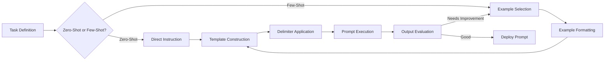
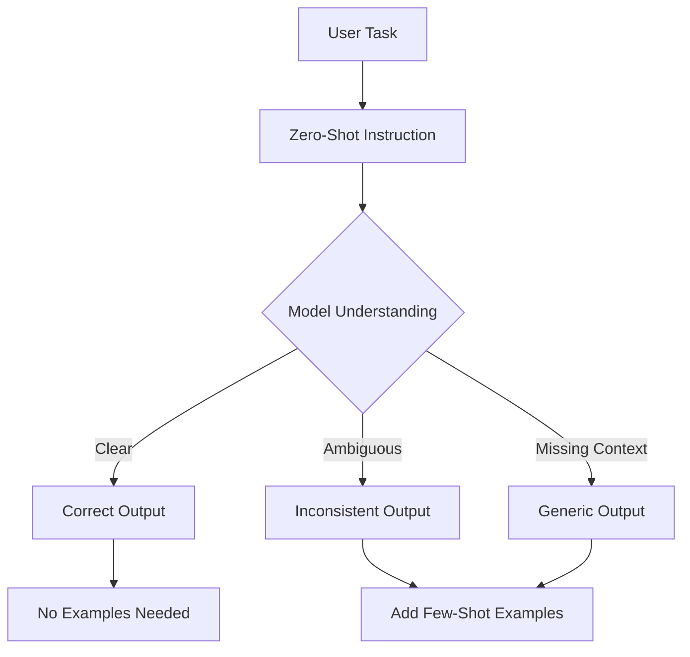
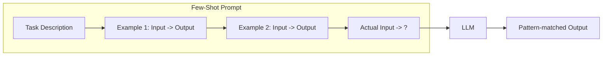
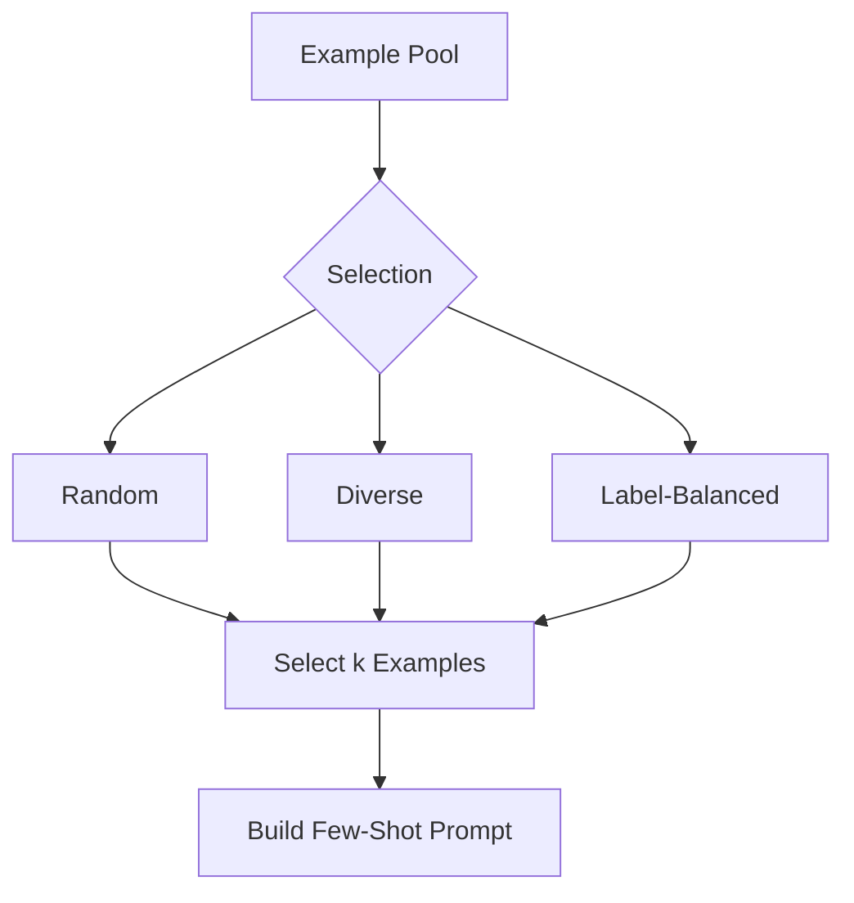
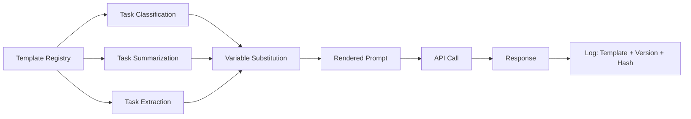
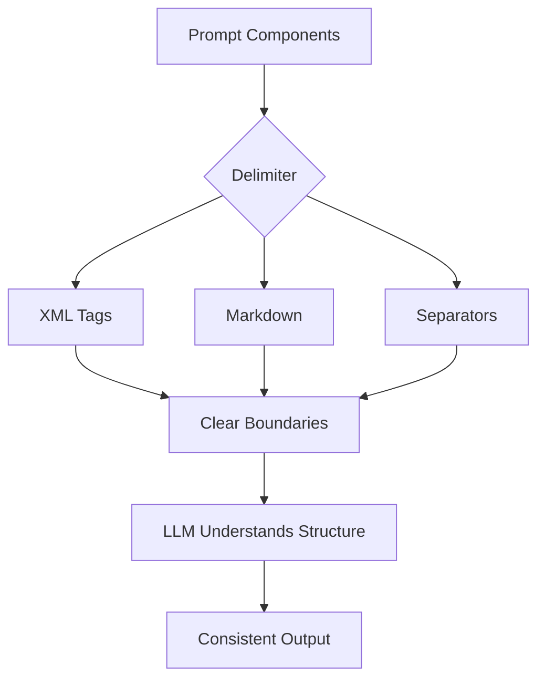
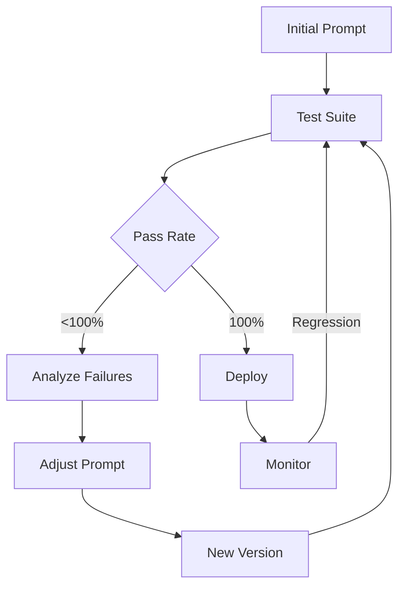

# Zero-Shot & Few-Shot Prompting

## Learning Objectives

| Objective | Description |
|-----------|-------------|
| LO1 | Understand the zero-shot prompting paradigm and when to use it |
| LO2 | Design effective few-shot prompts with well-structured examples |
| LO3 | Apply delimiter techniques for clear input separation |
| LO4 | Build reusable prompt templates with dynamic variable injection |
| LO5 | Analyze example selection strategies for optimal few-shot performance |
| LO6 | Evaluate prompt quality through systematic testing and iteration |

## Chapter at a Glance

| Section | Topic | Key Concept |
|---------|-------|-------------|
| 3.1 | Zero-Shot Prompting | Task description without examples, direct instruction |
| 3.2 | Few-Shot Prompting | Providing examples in the input for in-context learning |
| 3.3 | Example Selection | Choosing demo shots, ordering, diversity, labeling |
| 3.4 | Prompt Templates | Dynamic prompt construction, variables, formatting |
| 3.5 | Delimiters and Structure | Clear separation of sections, roles, and content |
| 3.6 | Prompt Testing | Systematic evaluation, A/B testing, iteration |

## Chapter Roadmap



## 3.1 Zero-Shot Prompting

Zero-shot prompting means giving the model a task description without any examples. The model relies entirely on its pre-trained knowledge to perform the task.

**Core principles**:
- Clear, specific instructions
- Defined output format
- Appropriate tone and constraints
- Minimal ambiguity

```python
from openai import OpenAI
client = OpenAI()

response = client.chat.completions.create(
    model="gpt-4o-mini",
    messages=[
        {"role": "system", "content": "Classify the sentiment as POSITIVE, NEGATIVE, or NEUTRAL. Respond with only the label."},
        {"role": "user", "content": "The product exceeded all my expectations!"}
    ],
    temperature=0
)
print(f"Zero-shot sentiment: {response.choices[0].message.content}")

response = client.chat.completions.create(
    model="gpt-4o-mini",
    messages=[
        {"role": "system", "content": "Summarize in exactly 2 sentences."},
        {"role": "user", "content": "AI has transformed healthcare by enabling early disease detection through medical imaging analysis. Machine learning models can identify tumors with accuracy comparable to radiologists."}
    ],
    temperature=0
)
print(f"Zero-shot summary: {response.choices[0].message.content}")
```

**Zero-shot classification with categories**:

```python
def zero_shot_classify(text, categories, client):
    cat_list = ", ".join(categories)
    response = client.chat.completions.create(
        model="gpt-4o-mini",
        messages=[
            {"role": "system", "content": f"Classify into exactly one of: {cat_list}. Respond with only the category name."},
            {"role": "user", "content": text}
        ],
        temperature=0
    )
    return response.choices[0].message.content

categories = ["TECHNOLOGY", "SPORTS", "POLITICS", "SCIENCE"]
texts = [
    "The new GPU delivers 50% better ML performance.",
    "The team won with a last-minute goal."
]
for text in texts:
    result = zero_shot_classify(text, categories, client)
    print(f"[{result}] {text[:50]}...")
```

**Zero-shot weaknesses**:
- Format inconsistency (output structure may vary)
- Sensitivity to phrasing (small wording changes cause different results)
- Task ambiguity (broad tasks get generic responses)

```python
phrasing_a = "Extract the date from this text."
phrasing_b = "Find any dates mentioned and return them in YYYY-MM-DD format."
text = "The meeting is scheduled for March 15th, 2024 at 2pm."

for prompt in [phrasing_a, phrasing_b]:
    response = client.chat.completions.create(
        model="gpt-4o-mini",
        messages=[{"role": "system", "content": prompt}, {"role": "user", "content": text}],
        temperature=0
    )
    print(f"Prompt: {prompt}\nResult: {response.choices[0].message.content}\n")
```



---

## 3.2 Few-Shot Prompting

Few-shot prompting provides examples in the prompt to demonstrate the desired input-output pattern. This leverages in-context learning.

**Basic few-shot structure**:

```python
def few_shot_classify(text, examples, client):
    messages = [{"role": "system", "content": "Classify text as POSITIVE, NEGATIVE, or NEUTRAL."}]
    for ex_text, ex_label in examples:
        messages.append({"role": "user", "content": ex_text})
        messages.append({"role": "assistant", "content": ex_label})
    messages.append({"role": "user", "content": text})
    response = client.chat.completions.create(model="gpt-4o-mini", messages=messages, temperature=0)
    return response.choices[0].message.content

examples = [
    ("This movie was fantastic!", "POSITIVE"),
    ("I wasted my time on this garbage.", "NEGATIVE"),
    ("The movie was okay.", "NEUTRAL"),
]
result = few_shot_classify("The acting was superb but the plot was confusing.", examples, client)
print(f"Few-shot: {result}")
```

**Few-shot for structured output**:

```python
def few_shot_extract(text, examples, client):
    messages = [{"role": "system", "content": "Extract fields as JSON."}]
    for ex_in, ex_out in examples:
        messages.append({"role": "user", "content": ex_in})
        messages.append({"role": "assistant", "content": ex_out})
    messages.append({"role": "user", "content": text})
    response = client.chat.completions.create(
        model="gpt-4o-mini", messages=messages,
        response_format={"type": "json_object"}, temperature=0
    )
    return response.choices[0].message.content

extract_examples = [
    ("John works at Google in Mountain View.",
     '{"name": "John", "company": "Google", "location": "Mountain View"}'),
    ("Sarah is a PM at Apple in Cupertino.",
     '{"name": "Sarah", "company": "Apple", "location": "Cupertino"}')
]
print(few_shot_extract("Michael is a Data Scientist at Meta in Austin.", extract_examples, client))
```

**Few-shot for code generation**:

```python
code_examples = [
    ("Calculate average.", "def avg(nums): return sum(nums)/len(nums) if nums else 0"),
    ("Find maximum.", "def find_max(nums): return max(nums) if nums else None")
]
response = client.chat.completions.create(
    model="gpt-4o-mini",
    messages=[{"role": "system", "content": "Write Python functions."}]
    + [m for ex in code_examples for m in [
        {"role": "user", "content": ex[0]}, {"role": "assistant", "content": ex[1]}
    ]] + [{"role": "user", "content": "Remove duplicates from a list while preserving order."}],
    temperature=0
)
print(response.choices[0].message.content)
```



---

## 3.3 Example Selection

Choosing the right examples critically impacts few-shot performance.

```python
import random
from collections import defaultdict

class ExampleSelector:
    def __init__(self, pool):
        self.pool = pool

    def random_select(self, k=3):
        return random.sample(self.pool, k)

    def diverse_select(self, k=3):
        short = [e for e in self.pool if len(e[0]) < 50]
        medium = [e for e in self.pool if 50 <= len(e[0]) < 200]
        long = [e for e in self.pool if len(e[0]) >= 200]
        selected = []
        for group in [short, medium, long]:
            if group and len(selected) < k:
                selected.append(random.choice(group))
        while len(selected) < k:
            remaining = [e for e in self.pool if e not in selected]
            selected.append(random.choice(remaining))
        return selected[:k]

    def label_balanced_select(self, k=3):
        groups = defaultdict(list)
        for inp, out in self.pool:
            groups[out].append((inp, out))
        selected = []
        for label, group in groups.items():
            if len(selected) < k:
                selected.append(random.choice(group))
        while len(selected) < k:
            remaining = [e for e in self.pool if e not in selected]
            selected.append(random.choice(remaining))
        return selected[:k]

pool = [
    ("Great service!", "POSITIVE"), ("Terrible experience.", "NEGATIVE"),
    ("It was okay.", "NEUTRAL"), ("Absolutely wonderful!", "POSITIVE"),
    ("Not good.", "NEGATIVE"), ("Could be better.", "NEUTRAL"),
]
sel = ExampleSelector(pool)
print("Random:", [e[0] for e in sel.random_select(3)])
print("Diverse:", [e[0] for e in sel.diverse_select(3)])
print("Balanced:", [e[0] for e in sel.label_balanced_select(3)])
```

**Optimal number of shots**:

```python
def evaluate_shots(examples, test_cases, shot_counts=[1, 2, 3, 5]):
    for k in shot_counts:
        if k > len(examples): continue
        correct = sum(1 for inp, exp in test_cases
            if few_shot_classify(inp, examples[:k], client).strip().upper() == exp.upper())
        print(f"{k}-shot accuracy: {correct/len(test_cases):.2%}")

test_cases = [("This is fantastic!", "POSITIVE"), ("Poor experience.", "NEGATIVE")]
# evaluate_shots(pool, test_cases)
```



---

## 3.4 Prompt Templates

Templates enable dynamic prompt construction with variables.

```python
from string import Template

class PromptTemplate:
    def __init__(self, template, input_variables):
        self.template = Template(template)
        self.input_variables = input_variables

    def format(self, **kwargs):
        return self.template.safe_substitute(**kwargs)

    def format_messages(self, system_template=None, **kwargs):
        msgs = []
        if system_template:
            msgs.append({"role": "system", "content": system_template})
        msgs.append({"role": "user", "content": self.format(**kwargs)})
        return msgs

classify_tpl = PromptTemplate(
    "Classify sentiment: POSITIVE, NEGATIVE, or NEUTRAL.\n\nText: $text\n\nSentiment:",
    ["text"]
)
msgs = classify_tpl.format_messages(
    system_template="You are a sentiment analysis assistant.",
    text="The new update is fantastic!"
)
response = client.chat.completions.create(model="gpt-4o-mini", messages=msgs, temperature=0)
print(response.choices[0].message.content)
```

**Template registry**:

```python
class PromptRegistry:
    def __init__(self):
        self.templates = {}
    def register(self, name, template):
        self.templates[name] = template
    def get(self, name):
        return self.templates[name]
    def execute(self, name, client, model="gpt-4o-mini", **kwargs):
        tpl = self.get(name)
        msgs = tpl.format_messages(**kwargs)
        response = client.chat.completions.create(model=model, messages=msgs, temperature=kwargs.get("temperature", 0))
        return response.choices[0].message.content

registry = PromptRegistry()
registry.register("sentiment", classify_tpl)
```

**Versioned templates**:

```python
import hashlib, datetime

class VersionedPromptTemplate:
    def __init__(self, name, template, version="1.0.0"):
        self.name = name
        self.template = template
        self.version = version
        self.created_at = datetime.datetime.now()
        self.hash = hashlib.sha256(template.encode()).hexdigest()[:12]

    def render(self, **kwargs):
        return Template(self.template).safe_substitute(**kwargs)

v1 = VersionedPromptTemplate("sentiment_v1", "Classify: $text")
v2 = VersionedPromptTemplate("sentiment_v2", "Classify as POSITIVE, NEGATIVE, or NEUTRAL.\n\nText: $text\n\nLabel:")
print(f"V1 hash: {v1.hash}")
print(f"V2 hash: {v2.hash}")
```



---

## 3.5 Delimiters and Structure

Delimiters create clear boundaries in prompts, reducing ambiguity.

```python
def xml_delimited(instruction, context, query):
    return f"<instruction>{instruction}</instruction>\n<context>{context}</context>\n<query>{query}</query>\n<response>"

def markdown_delimited(instruction, context, query):
    return f"## Instruction\n{instruction}\n## Context\n{context}\n## Query\n{query}\n## Response"

def separator_delimited(instruction, context, query):
    return f"=== INSTRUCTION ===\n{instruction}\n=== CONTEXT ===\n{context}\n=== QUERY ===\n{query}\n=== RESPONSE ==="

instruction = "Extract all email addresses."
context = "Conversation log."
query = "Contact john@example.com or support@company.com"
print(markdown_delimited(instruction, context, query)[:200])
```

**Structured few-shot with delimiters**:

```python
def delimited_few_shot(text, examples, client):
    msgs = [{"role": "system", "content": "You are a text classifier."}]
    for i, (ex_in, ex_out) in enumerate(examples, 1):
        msgs.append({"role": "user", "content": f"--- Example {i} ---\nInput: {ex_in}\nOutput:"})
        msgs.append({"role": "assistant", "content": ex_out})
    msgs.append({"role": "user", "content": f"--- Query ---\nInput: {text}\nOutput:"})
    response = client.chat.completions.create(model="gpt-4o-mini", messages=msgs, temperature=0)
    return response.choices[0].message.content

print(delimited_few_shot("The battery is terrible.",
    [("Great picture!", "POSITIVE"), ("Screen cracked.", "NEGATIVE")], client))
```

**Role-based structure**:

```python
ROLES = {
    "analyst": "You are an expert data analyst. Be precise.",
    "teacher": "You are a patient teacher. Explain simply.",
    "developer": "You are a senior engineer. Write clean code."
}

def role_prompt(task, content, role="analyst"):
    return f"## Role\n{ROLES[role]}\n## Task\n{task}\n## Content\n{content}\n## Response"

print(role_prompt("Analyze pros and cons.", "Microservices migration.", "analyst")[:200])
```



---

## 3.6 Prompt Testing

Systematic testing is essential for prompt quality.

```python
import time

class PromptTest:
    def __init__(self, client, model="gpt-4o-mini"):
        self.client = client
        self.model = model
        self.results = []

    def test(self, name, messages, keywords=None, times=3):
        latencies, outputs = [], []
        kw_ok = True
        for _ in range(times):
            start = time.time()
            response = self.client.chat.completions.create(model=self.model, messages=messages, temperature=0.3)
            latency = (time.time() - start) * 1000
            content = response.choices[0].message.content
            latencies.append(latency)
            outputs.append(content)
            if keywords:
                kw_ok = kw_ok and all(k.lower() in content.lower() for k in keywords)
        result = {"name": name, "avg_latency": sum(latencies)/len(latencies), "avg_length": sum(len(o) for o in outputs)/len(outputs), "keywords_ok": kw_ok}
        self.results.append(result)
        return result

    def compare(self):
        print(f"{'Name':<20} {'Latency':<15} {'Length':<15} {'KW':<10}")
        print("-"*60)
        for r in self.results:
            kw = "PASS" if r["keywords_ok"] else "FAIL"
            print(f"{r['name']:<20} {r['avg_latency']:<15.0f}ms {r['avg_length']:<15.0f} {kw:<10}")
```

**Automated validation**:

```python
import json

class PromptValidator:
    def __init__(self, schema):
        self.schema = schema

    def validate_json(self, output):
        try:
            data = json.loads(output)
            for key, typ in self.schema.items():
                if key not in data: return False, f"Missing {key}"
                if not isinstance(data[key], typ): return False, f"{key} should be {typ}"
            return True, "Valid"
        except json.JSONDecodeError as e:
            return False, f"Invalid JSON: {e}"

    def validate_keywords(self, output, required, forbidden):
        for kw in required:
            if kw.lower() not in output.lower(): return False, f"Missing {kw}"
        for kw in forbidden:
            if kw.lower() in output.lower(): return False, f"Contains {kw}"
        return True, "OK"

validator = PromptValidator({"name": str, "age": int})
print(validator.validate_json('{"name": "Alice", "age": 30}'))
print(validator.validate_json('{"name": "Bob", "age": "twenty"}'))
```



---

## TypeScript Parallel

TypeScript prompt templates with type safety:

```typescript
type PromptVars = Record<string, string | number>;

interface PromptTemplate {
  name: string;
  template: string;
  variables: string[];
  version: string;
}

function renderPrompt(t: PromptTemplate, vars: PromptVars): string {
  let result = t.template;
  for (const [key, value] of Object.entries(vars)) {
    result = result.replaceAll(`$${key}`, String(value));
  }
  return result;
}

const sentiment: PromptTemplate = {
  name: "sentiment",
  template: "Classify: $text as POSITIVE, NEGATIVE, or NEUTRAL.",
  variables: ["text"],
  version: "1.0.0",
};
console.log(renderPrompt(sentiment, { text: "Great product!" }));
```

---

## Summary

- Zero-shot prompting relies entirely on the model's pre-trained knowledge without examples
- Few-shot prompting provides input-output examples that demonstrate the desired pattern
- In-context learning enables models to generalize from examples without gradient updates
- Example selection strategy (random, diverse, balanced) significantly impacts few-shot performance
- The optimal number of shots depends on task complexity and example quality
- Prompt templates enable dynamic variable substitution and consistent formatting
- Delimiters (XML tags, markdown, separators) create clear structural boundaries in prompts
- Role-based prompting sets persona and tone through structured system messages
- Systematic A/B testing is essential for evaluating and comparing prompt variants
- Iterative optimization with test suites drives continuous prompt improvement

## Practical Takeaways

| Scenario | Do This | Avoid This |
|----------|---------|------------|
| Simple tasks | Use zero-shot with clear instructions | Adding unnecessary examples |
| Format-sensitive tasks | Use few-shot to demonstrate exact format | Relying on zero-shot for specific structures |
| Variable inputs | Use prompt templates with validation | Hardcoding values in prompts |
| Ambiguous requests | Add delimiters (XML, markdown, separators) | Writing everything as a single text block |
| Classification | Include label-balanced examples | Using examples from only one category |
| Production prompts | Version and hash every prompt template | Editing prompts without tracking changes |

## Interview Q&A

<details class="tp-qa-card" data-qid="llm-s03-q1">
  <summary class="tp-qa-question"><span class="tp-qa-status"></span>Q1: What is the difference between zero-shot and few-shot prompting?</summary>
  <div class="tp-qa-answer">
    <p><strong>Zero-shot</strong>: The model receives only a task description without examples.</p>
    <p><strong>Few-shot</strong>: The model receives task description plus input-output examples.</p>
    <p>Few-shot generally produces more consistent outputs but uses more tokens.</p>
  </div>
  <button class="tp-qa-mark-btn">✅ Mark Reviewed</button>
  <button class="tp-qa-bookmark-btn">🔖 Bookmark</button>
</details>

<details class="tp-qa-card" data-qid="llm-s03-q2">
  <summary class="tp-qa-question"><span class="tp-qa-status"></span>Q2: How do you choose which examples to include in a few-shot prompt?</summary>
  <div class="tp-qa-answer">
    <p>Strategies: Random (baseline), Fixed (curated), Label-balanced (equal categories), Diverse (different types), Semantic similarity (via embeddings). For most tasks, 3-5 diverse, label-balanced examples work well.</p>
  </div>
  <button class="tp-qa-mark-btn">✅ Mark Reviewed</button>
  <button class="tp-qa-bookmark-btn">🔖 Bookmark</button>
</details>

<details class="tp-qa-card" data-qid="llm-s03-q3">
  <summary class="tp-qa-question"><span class="tp-qa-status"></span>Q3: Why do delimiters matter in prompt engineering?</summary>
  <div class="tp-qa-answer">
    <p>Delimiters create clear structural boundaries: reduce ambiguity, prevent prompt injection, make multi-section prompts easier to parse, and enable consistent output parsing.</p>
  </div>
  <button class="tp-qa-mark-btn">✅ Mark Reviewed</button>
  <button class="tp-qa-bookmark-btn">🔖 Bookmark</button>
</details>

<details class="tp-qa-card" data-qid="llm-s03-q4">
  <summary class="tp-qa-question"><span class="tp-qa-status"></span>Q4: What is in-context learning?</summary>
  <div class="tp-qa-answer">
    <p>In-context learning (ICL) is the ability of LLMs to learn from examples in the prompt without gradient updates. The model identifies patterns from input-output examples and applies them to new queries. It's an emergent ability appearing in models with 1B+ parameters.</p>
  </div>
  <button class="tp-qa-mark-btn">✅ Mark Reviewed</button>
  <button class="tp-qa-bookmark-btn">🔖 Bookmark</button>
</details>

<details class="tp-qa-card" data-qid="llm-s03-q5">
  <summary class="tp-qa-question"><span class="tp-qa-status"></span>Q5: How many examples should you use in a few-shot prompt?</summary>
  <div class="tp-qa-answer">
    <p>Start with 3 examples and increase until performance plateaus. For most tasks, 3-5 well-chosen examples provide the best accuracy-to-cost ratio. Simple tasks need 2-3; complex may need 5-10. Beyond 10, improvement plateaus while costs increase.</p>
  </div>
  <button class="tp-qa-mark-btn">✅ Mark Reviewed</button>
  <button class="tp-qa-bookmark-btn">🔖 Bookmark</button>
</details>

<details class="tp-qa-card" data-qid="llm-s03-q6">
  <summary class="tp-qa-question"><span class="tp-qa-status"></span>Q6: What is prompt template versioning?</summary>
  <div class="tp-qa-answer">
    <p>Prompt template versioning tracks changes over time. Each version has a unique hash, timestamp, and changelog. Benefits: reproducibility, debugging (rollback), audit trail, and systematic A/B testing.</p>
  </div>
  <button class="tp-qa-mark-btn">✅ Mark Reviewed</button>
  <button class="tp-qa-bookmark-btn">🔖 Bookmark</button>
</details>

<details class="tp-qa-card" data-qid="llm-s03-q7">
  <summary class="tp-qa-question"><span class="tp-qa-status"></span>Q7: How do you handle prompt injection attacks?</summary>
  <div class="tp-qa-answer">
    <p>Mitigation: input sanitization, delimiter isolation, least privilege (no unnecessary tools), output verification, and model-level guardrails. No single defense is foolproof - use a layered approach.</p>
  </div>
  <button class="tp-qa-mark-btn">✅ Mark Reviewed</button>
  <button class="tp-qa-bookmark-btn">🔖 Bookmark</button>
</details>

<details class="tp-qa-card" data-qid="llm-s03-q8">
  <summary class="tp-qa-question"><span class="tp-qa-status"></span>Q8: Explain system, user, and assistant message roles.</summary>
  <div class="tp-qa-answer">
    <p>System: Sets assistant behavior (highest influence). User: Human input. Assistant: Model's previous responses for context. In few-shot prompting, assistant messages demonstrate desired output format.</p>
  </div>
  <button class="tp-qa-mark-btn">✅ Mark Reviewed</button>
  <button class="tp-qa-bookmark-btn">🔖 Bookmark</button>
</details>

<details class="tp-qa-card" data-qid="llm-s03-q9">
  <summary class="tp-qa-question"><span class="tp-qa-status"></span>Q9: How would you test prompt effectiveness systematically?</summary>
  <div class="tp-qa-answer">
    <p>1) Create test suite (20-100 pairs), 2) Define metrics (accuracy, format, latency), 3) Automated evaluation, 4) A/B comparison, 5) Regression testing, 6) Human evaluation for subjective quality.</p>
  </div>
  <button class="tp-qa-mark-btn">✅ Mark Reviewed</button>
  <button class="tp-qa-bookmark-btn">🔖 Bookmark</button>
</details>

<details class="tp-qa-card" data-qid="llm-s03-q10">
  <summary class="tp-qa-question"><span class="tp-qa-status"></span>Q10: What is the role of temperature in few-shot prompting?</summary>
  <div class="tp-qa-answer">
    <p>Low (0-0.2): Best for few-shot - deterministic, follows patterns. Medium (0.3-0.7): Variety while maintaining format. High (>0.7): May deviate from patterns. Use 0 for classification/extraction.</p>
  </div>
  <button class="tp-qa-mark-btn">✅ Mark Reviewed</button>
  <button class="tp-qa-bookmark-btn">🔖 Bookmark</button>
</details>

## Chapter Quiz

**Q1**: What does "zero-shot" mean in prompt engineering?

a) Using zero temperature for deterministic output
b) Performing a task without providing any examples
c) Using zero tokens in the prompt
d) Training a model from scratch

<details class="tp-qa-card" data-qid="llm-s03-quiz1"><summary>Show Answer</summary><div class="tp-qa-answer"><p><strong>Answer: b) Performing a task without providing any examples</strong></p></div></details>

**Q2**: What is the primary benefit of few-shot prompting over zero-shot?

a) Lower cost per request
b) More consistent output format and pattern following
c) Faster response times
d) No need for a system message

<details class="tp-qa-card" data-qid="llm-s03-quiz2"><summary>Show Answer</summary><div class="tp-qa-answer"><p><strong>Answer: b) More consistent output format and pattern following</strong></p></div></details>

**Q3**: How many few-shot examples typically provide the best accuracy-to-cost ratio?

a) 1
b) 3-5
c) 20-30
d) 100+

<details class="tp-qa-card" data-qid="llm-s03-quiz3"><summary>Show Answer</summary><div class="tp-qa-answer"><p><strong>Answer: b) 3-5</strong></p></div></details>

**Q4**: Which delimiter style uses tags like <instruction> and <query>?

a) Markdown headers
b) XML-style tags
c) Separator lines
d) JSON structure

<details class="tp-qa-card" data-qid="llm-s03-quiz4"><summary>Show Answer</summary><div class="tp-qa-answer"><p><strong>Answer: b) XML-style tags</strong></p></div></details>

**Q5**: What is prompt injection?

a) Injecting variables into a prompt template
b) User input overriding system instructions
c) Adding more examples to a few-shot prompt
d) Optimizing prompt length

<details class="tp-qa-card" data-qid="llm-s03-quiz5"><summary>Show Answer</summary><div class="tp-qa-answer"><p><strong>Answer: b) User input overriding system instructions</strong></p></div></details>

## Exercises

**Easy** — Write a zero-shot prompt for email classification (spam vs not spam). Test with 5 examples.

**Easy** — Create a few-shot prompt for sentiment with 3 examples. Compare against zero-shot version.

**Medium** — Build a PromptTemplate class with variable substitution and registry. Register 3 templates.

**Medium** — Implement an example selector using embedding similarity with sentence-transformers.

**Hard** — Build a comprehensive prompt testing framework with A/B testing, collecting latency, accuracy, and format compliance metrics.

---

> **Next**: [04 — Chain-of-Thought →](04-chain-of-thought.md)
