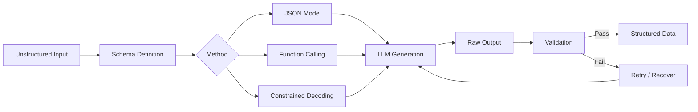
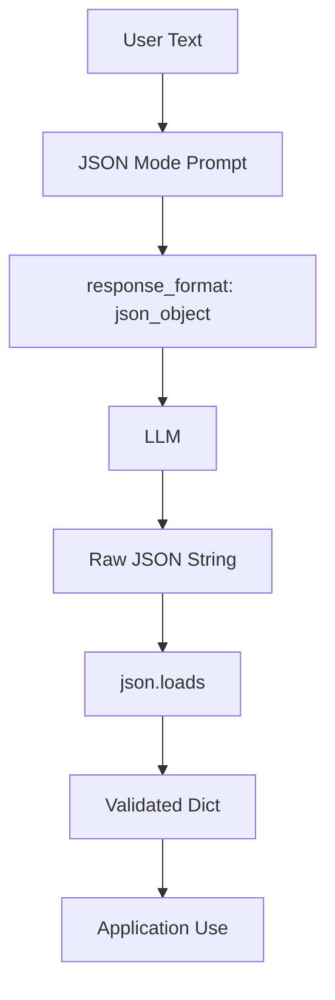
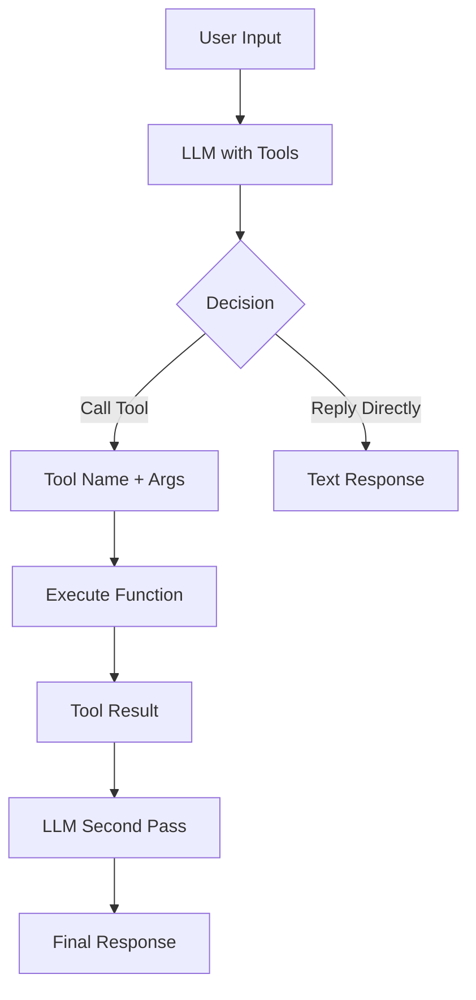
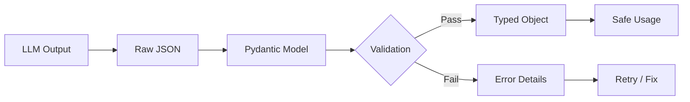
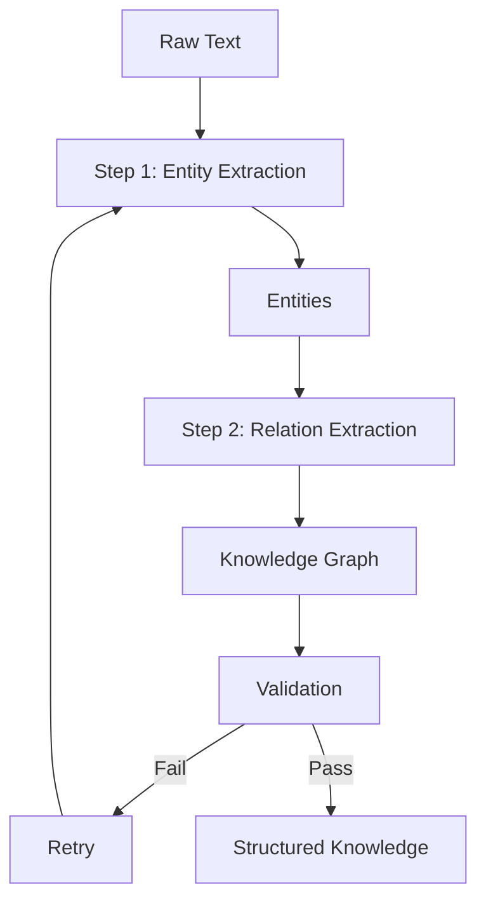
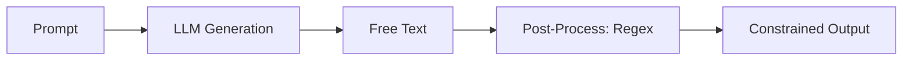
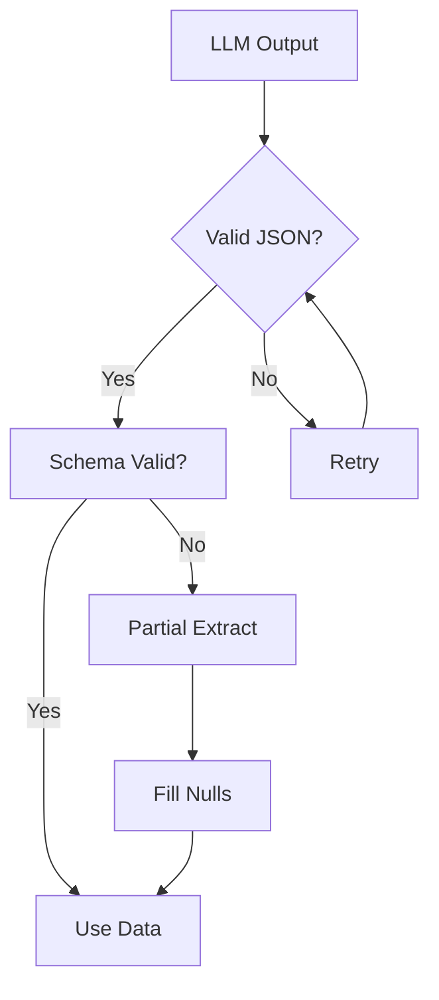

# Structured Output

## Learning Objectives

| Objective | Description |
|-----------|-------------|
| LO1 | Understand JSON mode and structured output capabilities of LLMs |
| LO2 | Implement function calling to extract structured data from unstructured text |
| LO3 | Apply Pydantic models for schema definition and validation |
| LO4 | Build reliable JSON extraction pipelines with error handling |
| LO5 | Use constrained decoding and grammar-based techniques |
| LO6 | Evaluate structured output quality with schema validation |

## Chapter at a Glance

| Section | Topic | Key Concept |
|---------|-------|-------------|
| 5.1 | JSON Mode | response_format parameter, schema definition |
| 5.2 | Function Calling | tools parameter, auto vs required |
| 5.3 | Pydantic Validation | Schema enforcement, type checking, nested models |
| 5.4 | Extraction Pipelines | Multi-step, chained extractions with fallbacks |
| 5.5 | Constrained Decoding | Grammar constraints, logit manipulation |
| 5.6 | Error Handling | Retry strategies, partial recovery, validation |

## Chapter Roadmap



## 5.1 JSON Mode

JSON mode ensures the model returns valid JSON by constraining the response format.

```python
from openai import OpenAI
import json

client = OpenAI()

response = client.chat.completions.create(
    model="gpt-4o",
    messages=[
        {"role": "system", "content": "Extract details as JSON with fields: name, age, city, occupation."},
        {"role": "user", "content": "Alice Johnson is a 32-year-old software engineer from San Francisco."}
    ],
    response_format={"type": "json_object"},
    temperature=0
)

data = json.loads(response.choices[0].message.content)
print(f"Name: {data['name']}, Age: {data['age']}, City: {data['city']}")
```

**Schema-guided JSON extraction**:

```python
def extract_json(schema_desc, text, client):
    response = client.chat.completions.create(
        model="gpt-4o",
        messages=[
            {"role": "system", "content": f"Return valid JSON matching: {schema_desc}"},
            {"role": "user", "content": text}
        ],
        response_format={"type": "json_object"},
        temperature=0
    )
    return json.loads(response.choices[0].message.content)

schema = "product: string, price: number, in_stock: boolean, tags: array of strings"
text = "Wireless headphones cost $149.99, in stock. Tags: audio, bluetooth, premium."
result = extract_json(schema, text, client)
print(result)
```

**Handling nested JSON**:

```python
nested_schema = """{
  "person": {"name": "string", "age": "number"},
  "address": {"street": "string", "city": "string", "zip": "string"},
  "contacts": [{"type": "string", "value": "string"}]
}"""

text = "John Doe, 28, lives at 123 Main St, Springfield, 12345. Email: john@email.com, Phone: 555-0100."
result = extract_json(nested_schema, text, client)
print(json.dumps(result, indent=2))
```



---

## 5.2 Function Calling

Function calling lets the model decide when to call functions with structured arguments.

```python
tools = [{
    "type": "function",
    "function": {
        "name": "extract_person",
        "description": "Extract personal information from text",
        "parameters": {
            "type": "object",
            "properties": {
                "name": {"type": "string"},
                "age": {"type": "integer"},
                "email": {"type": "string"},
                "skills": {"type": "array", "items": {"type": "string"}}
            },
            "required": ["name"]
        }
    }
}]

response = client.chat.completions.create(
    model="gpt-4o",
    messages=[{"role": "user", "content": "Meet Sarah Chen, 29, a data scientist skilled in Python and SQL. Email: sarah@example.com."}],
    tools=tools,
    tool_choice="required",
    temperature=0
)

tool_call = response.choices[0].message.tool_calls[0]
args = json.loads(tool_call.function.arguments)
print(f"Extracted: {args}")
```

**Multiple function definitions**:

```python
multi_tools = [
    {"type": "function", "function": {
        "name": "extract_product", "parameters": {
            "type": "object", "properties": {
                "name": {"type": "string"}, "price": {"type": "number"}, "category": {"type": "string"}
            }, "required": ["name", "price"]
        }
    }},
    {"type": "function", "function": {
        "name": "extract_event", "parameters": {
            "type": "object", "properties": {
                "title": {"type": "string"}, "date": {"type": "string"}, "location": {"type": "string"}
            }, "required": ["title", "date"]
        }
    }}
]

response = client.chat.completions.create(
    model="gpt-4o",
    messages=[{"role": "user", "content": "Conference on March 15th at Moscone Center. New laptop costs $1299."}],
    tools=multi_tools,
    tool_choice="auto",
    temperature=0
)

for tc in response.choices[0].message.tool_calls:
    fn = tc.function
    print(f"Called: {fn.name}, Args: {fn.arguments}")
```

**Executing function results**:

```python
def execute_function(name, args):
    if name == "get_weather":
        cities = {"Tokyo": "22C, cloudy", "London": "15C, rain"}
        return cities.get(args.get("city", ""), "Unknown")
    elif name == "calculate":
        a, b, op = args.get("a", 0), args.get("b", 0), args.get("op", "add")
        if op == "add": return a + b
        elif op == "multiply": return a * b
    return None

response = client.chat.completions.create(
    model="gpt-4o",
    messages=[{"role": "user", "content": "Weather in Tokyo and 15 times 7?"}],
    tools=[
        {"type": "function", "function": {"name": "get_weather", "parameters": {"type": "object", "properties": {"city": {"type": "string"}}, "required": ["city"]}}},
        {"type": "function", "function": {"name": "calculate", "parameters": {"type": "object", "properties": {"a": {"type": "number"}, "b": {"type": "number"}, "op": {"type": "string"}}, "required": ["a", "b", "op"]}}}
    ],
    tool_choice="auto"
)

for tc in response.choices[0].message.tool_calls:
    result = execute_function(tc.function.name, json.loads(tc.function.arguments))
    print(f"{tc.function.name}: {result}")
```



---

## 5.3 Pydantic Validation

Pydantic provides runtime validation ensuring extracted data matches expected types.

```python
from pydantic import BaseModel, Field, ValidationError
from typing import List, Optional
import json

class Person(BaseModel):
    name: str = Field(..., min_length=1, max_length=100)
    age: int = Field(..., ge=0, le=150)
    email: Optional[str] = None
    skills: List[str] = Field(default_factory=list)

def extract_person(text, client) -> Person:
    response = client.chat.completions.create(
        model="gpt-4o",
        messages=[
            {"role": "system", "content": f"Extract person data matching: {Person.model_json_schema()}"},
            {"role": "user", "content": text}
        ],
        response_format={"type": "json_object"},
        temperature=0
    )
    data = json.loads(response.choices[0].message.content)
    return Person(**data)

try:
    person = extract_person("Mike Johnson, 35, Python expert, mike@example.com", client)
    print(f"Validated: {person.name}, {person.age}")
except ValidationError as e:
    print(f"Validation error: {e}")
```

**Nested models**:

```python
class Address(BaseModel):
    street: str
    city: str
    country: str
    zip_code: str

class Employee(BaseModel):
    id: int
    name: str
    department: str
    address: Address
    projects: List[str]

def validate_extracted(data, model_class):
    try:
        return model_class(**data)
    except ValidationError as e:
        return {"error": str(e)}

data = {"id": 101, "name": "Alice", "department": "Engineering",
        "address": {"street": "123 Oak St", "city": "SF", "country": "USA", "zip_code": "94102"},
        "projects": ["Project X"]}
emp = validate_extracted(data, Employee)
print(f"{emp.name}, Dept: {emp.department}, City: {emp.address.city}")
```

**Batch validation**:

```python
class Product(BaseModel):
    id: int
    name: str
    price: float = Field(..., gt=0)
    in_stock: bool

items = [
    {"id": 1, "name": "Laptop", "price": 999.99, "in_stock": True},
    {"id": 2, "name": "Mouse", "price": -5.00, "in_stock": True},
    {"id": "three", "name": "Keyboard", "price": 79.99, "in_stock": False},
]

for item in items:
    try:
        p = Product(**item)
        print(f"OK: {p.name} - ${p.price}")
    except ValidationError as e:
        print(f"FAIL: {item.get('name')} - {e.errors()[0]['msg']}")
```



---

## 5.4 Extraction Pipelines

Complex extractions often require multi-step pipelines.

```python
class ExtractionPipeline:
    def __init__(self, client):
        self.client = client

    def extract_entities(self, text):
        response = self.client.chat.completions.create(
            model="gpt-4o",
            messages=[
                {"role": "system", "content": "Extract people, orgs, locations, dates as JSON arrays."},
                {"role": "user", "content": text}
            ],
            response_format={"type": "json_object"},
            temperature=0
        )
        return json.loads(response.choices[0].message.content)

    def extract_relations(self, entities, text):
        response = self.client.chat.completions.create(
            model="gpt-4o",
            messages=[
                {"role": "system", "content": f"Given entities: {entities}, extract relationships as JSON array."},
                {"role": "user", "content": text}
            ],
            response_format={"type": "json_object"},
            temperature=0
        )
        return json.loads(response.choices[0].message.content)

    def run(self, text):
        entities = self.extract_entities(text)
        relations = self.extract_relations(entities, text)
        return {"entities": entities, "relations": relations}

# pipeline = ExtractionPipeline(client)
# result = pipeline.run("Apple Inc. was founded by Steve Jobs in Cupertino in 1976.")
```

**Retry with validation**:

```python
def extract_with_retry(text, schema, client, max_retries=3):
    for attempt in range(max_retries):
        try:
            response = client.chat.completions.create(
                model="gpt-4o",
                messages=[
                    {"role": "system", "content": f"Extract data matching: {schema}. Return valid JSON."},
                    {"role": "user", "content": text}
                ],
                response_format={"type": "json_object"},
                temperature=0
            )
            data = json.loads(response.choices[0].message.content)
            for key in schema.get("required", []):
                if key not in data:
                    raise ValueError(f"Missing required field: {key}")
            return data
        except (json.JSONDecodeError, ValueError) as e:
            if attempt == max_retries - 1:
                raise
            print(f"Attempt {attempt+1} failed: {e}. Retrying...")

result = extract_with_retry("Bob from accounting, age 45", {"required": ["name", "age", "department"]}, client)
print(result)
```



---

## 5.5 Constrained Decoding

Constrained decoding forces the model to generate only valid tokens for the target format.

```python
class ConstrainedDecoder:
    def __init__(self, client):
        self.client = client

    def extract_number(self, text):
        response = self.client.chat.completions.create(
            model="gpt-4o-mini",
            messages=[
                {"role": "system", "content": "Extract the numeric value. Respond with ONLY the number."},
                {"role": "user", "content": text}
            ],
            temperature=0, max_tokens=10
        )
        return response.choices[0].message.content.strip()

    def extract_boolean(self, text):
        response = self.client.chat.completions.create(
            model="gpt-4o-mini",
            messages=[
                {"role": "system", "content": "Answer only TRUE or FALSE."},
                {"role": "user", "content": text}
            ],
            temperature=0, max_tokens=5
        )
        return response.choices[0].message.content.strip()

    def extract_choice(self, text, options):
        opts = ", ".join(options)
        response = self.client.chat.completions.create(
            model="gpt-4o-mini",
            messages=[
                {"role": "system", "content": f"Choose one: {opts}. Respond with only the choice."},
                {"role": "user", "content": text}
            ],
            temperature=0, max_tokens=10
        )
        return response.choices[0].message.content.strip()

decoder = ConstrainedDecoder(client)
print(f"Number: {decoder.extract_number('Total is $1,234.56')}")
print(f"Boolean: {decoder.extract_boolean('Is the sky blue?')}")
print(f"Choice: {decoder.extract_choice('Grass color?', ['Red', 'Green', 'Blue'])}")
```

**Regex-based output constraint**:

```python
import re

def constrained_generate(prompt, pattern, client, max_tokens=50):
    response = client.chat.completions.create(
        model="gpt-4o-mini",
        messages=[{"role": "user", "content": prompt}],
        temperature=0, max_tokens=max_tokens
    )
    text = response.choices[0].message.content
    match = re.search(pattern, text)
    return match.group(0) if match else None

email = constrained_generate(
    "Extract email from: 'Contact me at john@company.com'",
    r"[a-zA-Z0-9._%+-]+@[a-zA-Z0-9.-]+\.[a-zA-Z]{2,}", client
)
print(f"Email: {email}")

date = constrained_generate(
    "Extract date: 'Meeting on March 15, 2024'",
    r"(?:January|February|March)\s+\d{1,2},?\s+\d{4}", client
)
print(f"Date: {date}")
```



---

## 5.6 Error Handling

Robust extraction requires handling malformed outputs gracefully.

```python
class RobustExtractor:
    def __init__(self, client):
        self.client = client
        self.max_retries = 3

    def extract_json_safe(self, text, schema_desc):
        for attempt in range(self.max_retries):
            try:
                response = self.client.chat.completions.create(
                    model="gpt-4o",
                    messages=[
                        {"role": "system", "content": f"Return valid JSON matching: {schema_desc}"},
                        {"role": "user", "content": text}
                    ],
                    response_format={"type": "json_object"},
                    temperature=0
                )
                return json.loads(response.choices[0].message.content)
            except json.JSONDecodeError as e:
                if attempt == self.max_retries - 1:
                    return {"error": f"Failed: {e}"}

    def partial_extract(self, text, required_fields):
        fields_desc = ", ".join(f"{f}: string" for f in required_fields)
        response = self.client.chat.completions.create(
            model="gpt-4o-mini",
            messages=[
                {"role": "system", "content": f"Extract what you can. Missing fields should be null. Return JSON."},
                {"role": "user", "content": text}
            ],
            response_format={"type": "json_object"},
            temperature=0
        )
        data = json.loads(response.choices[0].message.content)
        return {k: data.get(k) for k in required_fields}

extractor = RobustExtractor(client)
print(extractor.partial_extract("John is here", ["name", "age", "email"]))
```



---

## TypeScript Parallel

TypeScript structured output with Zod validation:

```typescript
import { z } from "zod";

const PersonSchema = z.object({
  name: z.string().min(1),
  age: z.number().int().positive(),
  email: z.string().email().optional(),
  skills: z.array(z.string()),
});

async function extractPerson(text: string, apiKey: string) {
  const res = await fetch("https://api.openai.com/v1/chat/completions", {
    method: "POST",
    headers: { Authorization: `Bearer ${apiKey}` },
    body: JSON.stringify({
      model: "gpt-4o",
      messages: [
        { role: "system", content: `Extract person JSON matching: ${JSON.stringify(PersonSchema.shape)}` },
        { role: "user", content: text },
      ],
      response_format: { type: "json_object" },
      temperature: 0,
    }),
  });
  const data = await res.json();
  return PersonSchema.parse(JSON.parse(data.choices[0].message.content));
}
```

---

## Summary

- JSON mode forces valid JSON output with response_format parameter
- Function calling uses tool definitions for structured data extraction
- Pydantic provides runtime validation ensuring type safety
- Nested schemas handle complex hierarchical data structures
- Extraction pipelines chain multiple LLM calls for progressive refinement
- Constrained decoding enforces output format at generation time
- Regex post-processing extracts specific patterns from free text
- Robust error handling with retries and fallbacks is essential
- Partial extraction tolerates missing optional fields
- Schema versioning allows evolving extraction requirements

## Practical Takeaways

| Scenario | Do This | Avoid This |
|----------|---------|------------|
| Simple extraction | Use JSON mode with response_format | Parsing free-text output |
| Complex schemas | Use function calling with required fields | Assuming all fields will populate |
| Validation | Use Pydantic for runtime type checking | Trusting raw LLM output blindly |
| Production | Add retry logic with exponential backoff | Single attempt extraction |
| Missing fields | Implement partial extraction with nulls | Failing on missing optional fields |
| Multi-entity | Use extraction pipelines with multiple passes | One-shot complex extraction |

## Interview Q&A

<details class="tp-qa-card" data-qid="llm-s05-q1">
  <summary class="tp-qa-question"><span class="tp-qa-status"></span>Q1: What is JSON mode and when should you use it?</summary>
  <div class="tp-qa-answer"><p>JSON mode (response_format={"type": "json_object"}) forces valid JSON output. Use whenever you need structured data. The system message MUST explicitly request JSON. Ideal for data extraction and API integration.</p></div>
  <button class="tp-qa-mark-btn">✅ Mark Reviewed</button>
  <button class="tp-qa-bookmark-btn">🔖 Bookmark</button>
</details>

<details class="tp-qa-card" data-qid="llm-s05-q2">
  <summary class="tp-qa-question"><span class="tp-qa-status"></span>Q2: How does function calling differ from JSON mode?</summary>
  <div class="tp-qa-answer"><p>Function calling uses tools parameter with JSON Schema. The model decides when to call functions. Benefits: multiple definitions, auto vs required, multiple calls per response. JSON mode is simpler but single schema only.</p></div>
  <button class="tp-qa-mark-btn">✅ Mark Reviewed</button>
  <button class="tp-qa-bookmark-btn">🔖 Bookmark</button>
</details>

<details class="tp-qa-card" data-qid="llm-s05-q3">
  <summary class="tp-qa-question"><span class="tp-qa-status"></span>Q3: Why is Pydantic validation important for LLM outputs?</summary>
  <div class="tp-qa-answer"><p>LLMs can return structurally valid JSON with wrong types or missing fields. Pydantic validates types, constraints, and required fields at runtime, catching errors early with clear messages.</p></div>
  <button class="tp-qa-mark-btn">✅ Mark Reviewed</button>
  <button class="tp-qa-bookmark-btn">🔖 Bookmark</button>
</details>

<details class="tp-qa-card" data-qid="llm-s05-q4">
  <summary class="tp-qa-question"><span class="tp-qa-status"></span>Q4: How do you handle LLM outputs that aren't valid JSON?</summary>
  <div class="tp-qa-answer"><p>Strategies: retry with stricter prompt, use JSON mode, implement regex-based partial extraction, fallback to simpler schema, or use secondary LLM to fix the JSON. Always validate and have fallbacks.</p></div>
  <button class="tp-qa-mark-btn">✅ Mark Reviewed</button>
  <button class="tp-qa-bookmark-btn">🔖 Bookmark</button>
</details>

<details class="tp-qa-card" data-qid="llm-s05-q5">
  <summary class="tp-qa-question"><span class="tp-qa-status"></span>Q5: What are JSON mode limitations?</summary>
  <div class="tp-qa-answer"><p>Must include explicit JSON instruction in system message, no built-in schema enforcement (valid JSON but wrong structure), model may return empty objects. Always validate against a schema after receiving.</p></div>
  <button class="tp-qa-mark-btn">✅ Mark Reviewed</button>
  <button class="tp-qa-bookmark-btn">🔖 Bookmark</button>
</details>

<details class="tp-qa-card" data-qid="llm-s05-q6">
  <summary class="tp-qa-question"><span class="tp-qa-status"></span>Q6: What is constrained decoding?</summary>
  <div class="tp-qa-answer"><p>Constrained decoding forces tokens matching a specific format. Techniques: logit masking, regex-guided generation, grammar-based approaches (guidance library), and post-processing validation.</p></div>
  <button class="tp-qa-mark-btn">✅ Mark Reviewed</button>
  <button class="tp-qa-bookmark-btn">🔖 Bookmark</button>
</details>

<details class="tp-qa-card" data-qid="llm-s05-q7">
  <summary class="tp-qa-question"><span class="tp-qa-status"></span>Q7: How to extract structured data from documents?</summary>
  <div class="tp-qa-answer"><p>Multi-step pipeline: chunk document, extract entities per chunk, merge/deduplicate, extract relationships, validate against schema, store. Each step has retry and validation logic.</p></div>
  <button class="tp-qa-mark-btn">✅ Mark Reviewed</button>
  <button class="tp-qa-bookmark-btn">🔖 Bookmark</button>
</details>

<details class="tp-qa-card" data-qid="llm-s05-q8">
  <summary class="tp-qa-question"><span class="tp-qa-status"></span>Q8: What is the difference between tool_choice auto and required?</summary>
  <div class="tp-qa-answer"><p>auto: model decides whether to call a function. required: model must call a function. none: model cannot call functions. Required is useful when you always need structured data.</p></div>
  <button class="tp-qa-mark-btn">✅ Mark Reviewed</button>
  <button class="tp-qa-bookmark-btn">🔖 Bookmark</button>
</details>

<details class="tp-qa-card" data-qid="llm-s05-q9">
  <summary class="tp-qa-question"><span class="tp-qa-status"></span>Q9: How to handle nested JSON extraction?</summary>
  <div class="tp-qa-answer"><p>Define nested schemas in the prompt, use JSON mode with nesting examples, validate with nested Pydantic models. Consider multi-step extraction for deeply nested data.</p></div>
  <button class="tp-qa-mark-btn">✅ Mark Reviewed</button>
  <button class="tp-qa-bookmark-btn">🔖 Bookmark</button>
</details>

<details class="tp-qa-card" data-qid="llm-s05-q10">
  <summary class="tp-qa-question"><span class="tp-qa-status"></span>Q10: What is an extraction pipeline?</summary>
  <div class="tp-qa-answer"><p>An extraction pipeline chains multiple LLM calls for complex data. Needed when: schema is complex/nested, data spans multiple documents, entities have relationships, or single-pass unreliable. Each stage focuses on one aspect.</p></div>
  <button class="tp-qa-mark-btn">✅ Mark Reviewed</button>
  <button class="tp-qa-bookmark-btn">🔖 Bookmark</button>
</details>

## Chapter Quiz

**Q1**: What parameter enables JSON mode in OpenAI API?

a) json_mode=True
b) response_format={"type": "json_object"}
c) format="json"
d) output_type="structured"

<details class="tp-qa-card" data-qid="llm-s05-quiz1"><summary>Show Answer</summary><div class="tp-qa-answer"><p><strong>Answer: b) response_format={"type": "json_object"}</strong></p></div></details>

**Q2**: True or False: In JSON mode, the system message doesn't need to mention JSON.

a) True
b) False

<details class="tp-qa-card" data-qid="llm-s05-quiz2"><summary>Show Answer</summary><div class="tp-qa-answer"><p><strong>Answer: b) False</strong></p></div></details>

**Q3**: What does tool_choice="required" do?

a) Model may or may not call a function
b) Model must call a function
c) Model cannot call functions
d) Model executes the function

<details class="tp-qa-card" data-qid="llm-s05-quiz3"><summary>Show Answer</summary><div class="tp-qa-answer"><p><strong>Answer: b) Model must call a function</strong></p></div></details>

**Q4**: Which library provides runtime validation for LLM extracted data?

a) pandas
b) numpy
c) Pydantic
d) matplotlib

<details class="tp-qa-card" data-qid="llm-s05-quiz4"><summary>Show Answer</summary><div class="tp-qa-answer"><p><strong>Answer: c) Pydantic</strong></p></div></details>

**Q5**: Recommended approach for deeply nested data extraction?

a) Single JSON mode call
b) Multi-step extraction pipeline
c) Regex parsing
d) Plain text output

<details class="tp-qa-card" data-qid="llm-s05-quiz5"><summary>Show Answer</summary><div class="tp-qa-answer"><p><strong>Answer: b) Multi-step extraction pipeline</strong></p></div></details>

## Exercises

**Easy** — Use JSON mode to extract name, age, and city from 3 text descriptions.

**Easy** — Define a Pydantic model for a product and validate extracted data.

**Medium** — Build function calling with 2 functions: extract_person and extract_company.

**Medium** — Create a robust extraction pipeline with retry and partial fallback.

**Hard** — Build a document extraction pipeline with entity, relation, and summary extraction using 3 LLM calls.

---

> **Next**: [06 — Context Management →](06-context-management.md)
