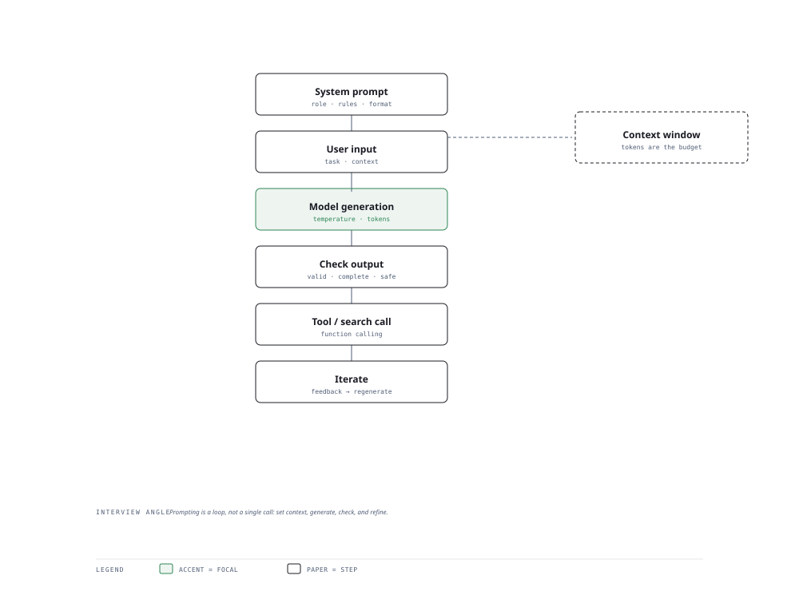

# Visual Notes — The LLM Interaction Loop

> One diagram, the full picture. This page is meant to be glanced at before reading the chapters, and again before interviews.

# What the diagram shows

1. **Setup** — A system prompt defines role and constraints; the user prompt carries the actual request.
1. **Generation** — The model autoregressively produces tokens given the assembled context.
1. **Iteration** — Tool calls, retrieval or self-critique feed results back into the context until the answer is strong enough.

# Why this matters for placement

- Prompting is now a core LLM engineer skill — grounded few-shot beats vague instructions every time.
- Explaining the difference between prompting (no training) and fine-tuning (training) is a favorite trick question.

# Quick revision

- Zero-shot vs few-shot vs chain-of-thought — know when each earns its cost.
- Temperature trades creativity for determinism; top-p collapses the candidate set.
- Structured output via JSON mode / function calling stabilises downstream code.
- Cost scales with input + output tokens and context length — compress context.
- Evaluation: ground truth + LLM-as-judge + human review, not vibes.

# Related chapters

- [LLM APIs](02-llm-apis.md)
- [Zero-shot and few-shot](03-zero-shot-and-few-shot.md)
- [Chain of thought](04-chain-of-thought.md)
- [Structured output](05-structured-output.md)

---

**One-line answer for interviews:** *"System prompt sets the role, user input asks, the model generates — then tools and iteration sharpen the answer."*
