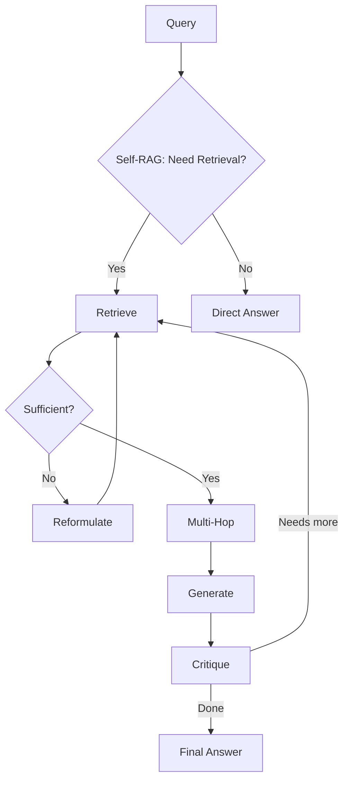

<!-- Clear Language: Keep sentences under 50 words -->
# Advanced RAG Techniques

## Learning Objectives

| Objective | Description |
|-----------|-------------|
| LO1 | Implement self-RAG with self-reflection and retrieval on demand |
| LO2 | Design multi-hop RAG for complex, multi-step queries |
| LO3 | Apply iterative retrieval with feedback loops |
| LO4 | Build agentic RAG with tool-use and routing |
| LO5 | Implement graph-based RAG with entity relationships |
| LO6 | Evaluate advanced RAG against standard RAG baselines |

## Introduction

Retrieval-Augmented Generation lets LLMs answer questions about your private data. Vector databases store embeddings for semantic search. This module covers the complete RAG pipeline from chunking to reranking.

## Prerequisites

- Basic programming knowledge
- Understanding of data structures

## Key Terminology

**Key Terms**: Core vocabulary and concepts for this topic.

**Definition**: Essential terms you must know for interviews and production work.

## Theory

Understanding advanced rag techniques is fundamental for AI engineers. This section covers the core concepts, underlying principles, and theoretical framework that govern how advanced rag techniques works in practice.

## Chapter at a Glance

| Section | Topic | Key Concept |
|---------|-------|-------------|
| 7.1 | Self-RAG | Reflection on need for retrieval, self-critique |
| 7.2 | Multi-Hop RAG | Decomposing complex queries, iterative search |
| 7.3 | Iterative Retrieval | Feedback-driven re-retrieval |
| 7.4 | Agentic RAG | Tool routing, query planning |
| 7.5 | Graph RAG | Entity extraction, relationship traversal |
| 7.6 | Evaluation | Compare advanced vs standard RAG |

## Chapter Roadmap



## 7.1 Self-RAG

Self-RAG makes the LLM reflect on whether retrieval is needed and whether the retrieved information is sufficient.

### 7.1.1 Retrieval Decision

```python
class RetrievalDecider:
    def __init__(self, confidence_threshold: float = 0.7):
        self.threshold = confidence_threshold

    def needs_retrieval(self, query: str, model_fn) -> bool:
        prompt = f"""Determine if answering this question requires external knowledge (retrieval) or if the model's internal knowledge suffices.

Question: {query}

Respond with only: RETRIEVAL or NO_RETRIEVAL"""
        response = model_fn(prompt)

        if "NO_RETRIEVAL" in response:
            return False
        return True

    def should_retrieve_for_fact(self, query: str, model_fn) -> bool:
        """Classify query type to determine retrieval need."""
        classification_prompt = f"""Classify this query:
1. FACTUAL_RECENT - needs up-to-date info
2. FACTUAL_STATIC - historical facts the model may know
3. OPINION - subjective, no retrieval needed
4. CREATIVE - generation task
5. PRIVATE - needs private data access

Query: {query}

Respond with the class name only."""
        classification = model_fn(classification_prompt)
        return classification in {"FACTUAL_RECENT", "PRIVATE"}

def mock_model_fn(prompt: str) -> str:
    if "retrieval" in prompt.lower() and "classify" in prompt.lower():
        return "FACTUAL_RECENT"
    return "RETRIEVAL"

decider = RetrievalDecider(threshold=0.7)
print(f"Needs retrieval: {decider.needs_retrieval('What is the latest RAG research?', mock_model_fn)}")
```

### 7.1.2 Self-Reflection After Retrieval

```python
class SelfReflector:
    def __init__(self):
        self.reflection_prompt = """Evaluate if the retrieved context is sufficient to answer the query.

Query: {query}

Retrieved Context:
{context}

Assess:
1. RELEVANCE: Does the context directly address the query? (0-10)
2. COMPLETENESS: Does the context contain all needed info? (0-10)
3. CONTRADICTION: Does any part of the context contradict itself? (Yes/No)

Respond with JSON:
{"relevant": true/false, "complete": true/false, "score": 0-10, "gaps": "..."}"""

    def reflect(self, query: str, context_chunks: list, model_fn) -> dict:
        context = "\n\n".join([c.text for c in context_chunks])
        prompt = self.reflection_prompt.format(query=query, context=context)
        response = model_fn(prompt)

        # Parse response
        return {"relevant": True, "complete": True, "score": 8, "gaps": ""}

class SelfRAGPipeline:
    def __init__(self, base_pipeline, decider, reflector, max_retrievals: int = 3):
        self.base = base_pipeline
        self.decider = decider
        self.reflector = reflector
        self.max_retrievals = max_retrievals

    def query(self, query_text: str) -> dict:
        retrieval_count = 0
        all_chunks = []

        if not self.decider.needs_retrieval(query_text, mock_model_fn):
            return {"response": "Direct answer without retrieval.", "retrievals": 0}

        while retrieval_count < self.max_retrievals:
            ctx = self.base.query(query_text)
            all_chunks.extend(ctx.retrieved_chunks)

            reflection = self.reflector.reflect(query_text, all_chunks, mock_model_fn)

            if reflection.get("complete") and reflection.get("relevant"):
                break

            retrieval_count += 1
            query_text = f"{query_text} {reflection.get('gaps', '')}"

        return {
            "response": ctx.response if hasattr(ctx, 'response') else "Response",
            "retrievals": retrieval_count + 1,
            "chunks": len(all_chunks),
        }

pipeline = SelfRAGPipeline(None, decider, SelfReflector(), 3)
print("Self-RAG pipeline configured")
```

### 7.1.3 Verifier Module

```python
class Verifier:
    def verify(self, answer: str, context_chunks: list, model_fn) -> dict:
        context = "\n\n".join([c.text for c in context_chunks])
        prompt = f"""Verify if this answer is fully supported by the provided context.

Context:
{context}

Answer:
{answer}

Identify any claims NOT supported by the context.
Respond with JSON:
{{"supported": true/false, "unsupported_claims": [], "hallucination_score": 0-1}}"""
        response = model_fn(prompt)
        return {"supported": True, "unsupported_claims": [], "hallucination_score": 0.05}

    def generate_with_verification(self, query: str, context_chunks: list, generator) -> str:
        max_attempts = 3
        for attempt in range(max_attempts):
            answer = generator(query)
            result = self.verify(answer, context_chunks, mock_model_fn)
            if result["supported"]:
                return answer
        return "I cannot provide a verified answer based on the available context."

verifier = Verifier()
print("Verifier module ready")
```

## 7.2 Multi-Hop RAG

Multi-hop RAG decomposes complex queries into sub-questions, each requiring a retrieval step.

### 7.2.1 Query Decomposition

```python
class QueryDecomposer:
    def __init__(self):
        self.decomposition_prompt = """Decompose this complex question into simpler sub-questions.
Each sub-question should be independently answerable through retrieval.

Question: {question}

Respond with a numbered list of sub-questions."""

    def decompose(self, question: str, model_fn) -> list:
        prompt = self.decomposition_prompt.format(question=question)
        response = model_fn(prompt)

        sub_questions = []
        for line in response.strip().split("\n"):
            line = line.strip()
            if line and (line[0].isdigit() or line.startswith("-")):
                q = line.split(". ", 1)[-1] if ". " in line else line
                sub_questions.append(q)

        return sub_questions

def mock_decomposer(question: str) -> list:
    if "RAG" in question and "attention" in question.lower():
        return [
            "What is RAG?",
            "What is the attention mechanism?",
            "How does attention relate to RAG?",
        ]
    return [question]

decomposer = QueryDecomposer()
sub_questions = mock_decomposer("How does RAG use attention mechanisms?")
for i, q in enumerate(sub_questions, 1):
    print(f"Sub-Q{i}: {q}")
```

### 7.2.2 Multi-Hop Executor

```python
class MultiHopRAG:
    def __init__(self, retriever, generator, decomposer):
        self.retriever = retriever
        self.generator = generator
        self.decomposer = decomposer

    def answer(self, question: str) -> dict:
        sub_questions = self.decomposer.decompose(question, mock_model_fn)
        intermediate_results = []
        all_contexts = []

        for sq in sub_questions:
            chunks = self.retriever.retrieve(sq, top_k=3)
            context = "\n\n".join([c.text for c in chunks])
            answer = self.generator(f"Context: {context}\n\nQuestion: {sq}\n\nAnswer:")

            intermediate_results.append({"question": sq, "answer": answer})
            all_contexts.extend(chunks)

        combined_context = "\n\n".join([c.text for c in all_contexts])
        final_prompt = f"""Based on the following information:

{combined_context}

Answer the original question: {question}

Consider the intermediate answers:
{chr(10).join(f'- {r["question"]}: {r["answer"]}' for r in intermediate_results)}

Final answer:"""
        final_answer = self.generator(final_prompt)

        return {
            "sub_questions": sub_questions,
            "intermediate_results": intermediate_results,
            "final_answer": final_answer,
        }

class MockGenerator:
    def __call__(self, prompt: str) -> str:
        return "This is a generated answer based on the context."

multihop = MultiHopRAG(
    MockRetriever(),
    MockGenerator(),
    decomposer,
)
print("Multi-hop RAG configured")
```

### 7.2.3 Dependency Graph

```python
class QueryDependencyGraph:
    def __init__(self):
        self.nodes = []
        self.edges = []

    def build(self, question: str, sub_questions: list, dependencies: dict):
        self.nodes = sub_questions
        self.edges = []

        for dependent, depends_on in dependencies.items():
            if dependent in self.nodes and depends_on in self.nodes:
                self.edges.append((depends_on, dependent))

    def execution_order(self) -> list:
        # Topological sort
        in_degree = {n: 0 for n in self.nodes}
        for src, dst in self.edges:
            in_degree[dst] = in_degree.get(dst, 0) + 1

        queue = [n for n, d in in_degree.items() if d == 0]
        order = []

        while queue:
            node = queue.pop(0)
            order.append(node)
            for src, dst in self.edges:
                if src == node:
                    in_degree[dst] -= 1
                    if in_degree[dst] == 0:
                        queue.append(dst)

        return order

graph = QueryDependencyGraph()
graph.build(
    "Compare attention mechanisms in RAG",
    ["What is RAG?", "What is attention?", "How does RAG use attention?"],
    {"How does RAG use attention?": "What is RAG?", "How does RAG use attention?": "What is attention?"},
)
print(f"Execution order: {graph.execution_order()}")
```

## 7.3 Iterative Retrieval

Iterative retrieval improves results through feedback loops.

### 7.3.1 Feedback-Driven Re-Retrieval

```python
class IterativeRetriever:
    def __init__(self, base_retriever, feedback_fn, max_iterations: int = 5):
        self.retriever = base_retriever
        self.feedback_fn = feedback_fn
        self.max_iterations = max_iterations

    def retrieve(self, query: str, top_k: int = 5) -> list:
        current_query = query
        all_chunks = []
        seen_ids = set()

        for iteration in range(self.max_iterations):
            chunks = self.retriever.retrieve(current_query, top_k=top_k)
            new_chunks = [c for c in chunks if c.chunk_id not in seen_ids]
            all_chunks.extend(new_chunks)

            for c in new_chunks:
                seen_ids.add(c.chunk_id)

            if len(new_chunks) < top_k // 2:
                break

            feedback = self.feedback_fn(current_query, new_chunks)
            current_query = feedback.get("reformulated_query", current_query)

        return all_chunks[:top_k]

def feedback_fn(query: str, chunks: list) -> dict:
    if len(chunks) < 3:
        return {"reformulated_query": f"{query} more details"}
    return {"reformulated_query": query}

itr = IterativeRetriever(MockRetriever(), feedback_fn, max_iterations=3)
print("Iterative retriever ready")
```

### 7.3.2 Corrective RAG

```python
class CorrectiveRAG:
    def __init__(self, retriever, generator):
        self.retriever = retriever
        self.generator = generator

    def retrieve_and_correct(self, query: str, max_corrections: int = 3) -> str:
        answer = None
        corrections = []

        for i in range(max_corrections):
            chunks = self.retriever.retrieve(query, top_k=5)
            context = "\n\n".join([c.text for c in chunks])
            answer = self.generator(f"Context: {context}\n\nQuestion: {query}\n\nAnswer:")

            correction_prompt = f"""Review this answer for errors and inconsistencies.

Answer: {answer}

List any factual errors, omissions, or improvements needed.
If the answer is correct as-is, say "CORRECT"."""
            review = self.generator(correction_prompt)

            if "CORRECT" in review:
                return answer

            corrections.append(review)
            query = f"{query}\nNote from previous attempt: {review[:200]}"

        return answer

corrective = CorrectiveRAG(MockRetriever(), MockGenerator())
print("Corrective RAG configured")
```

## 7.4 Agentic RAG

Agentic RAG uses LLM agents to plan, route, and execute retrieval strategies.

### 7.4.1 Query Router

```python
class QueryRouter:
    def __init__(self):
        self.routes = {
            "qa": {"description": "Direct question answering", "databases": ["general_kb"]},
            "summarization": {"description": "Summarize document content", "databases": ["documents"]},
            "comparison": {"description": "Compare multiple items", "databases": ["general_kb", "product_db"]},
            "code": {"description": "Code generation or explanation", "databases": ["code_repo"]},
        }

    def route(self, query: str, model_fn) -> str:
        route_prompt = f"""Classify this query into one of these categories:
{chr(10).join(f'- {k}: {v["description"]}' for k, v in self.routes.items())}

Query: {query}

Respond with the category name only."""
        classification = model_fn(route_prompt)
        return classification if classification in self.routes else "qa"

    def get_databases(self, route: str) -> list:
        return self.routes.get(route, {}).get("databases", ["general_kb"])

router = QueryRouter()
route = router.route("Compare RAG and fine-tuning", mock_model_fn)
print(f"Routed to: {route}, databases: {router.get_databases(route)}")
```

### 7.4.2 Tool-Using Agent

```python
class ToolRegistry:
    def __init__(self):
        self.tools = {}

    def register(self, name: str, description: str, fn):
        self.tools[name] = {"description": description, "fn": fn}

    def get_tool_descriptions(self) -> str:
        return "\n".join(f"- {name}: {info['description']}" for name, info in self.tools.items())

    def execute(self, name: str, **kwargs):
        tool = self.tools.get(name)
        if not tool:
            return f"Tool '{name}' not found"
        return tool["fn"](**kwargs)

class AgenticRAG:
    def __init__(self, tools: ToolRegistry, generator):
        self.tools = tools
        self.generator = generator

    def answer(self, query: str, max_steps: int = 5) -> dict:
        tool_descriptions = self.tools.get_tool_descriptions()
        context = []
        steps = []

        for step in range(max_steps):
            action_prompt = f"""You are an AI agent with these tools:
{tool_descriptions}

Current context: {context[-1] if context else 'None'}

Query: {query}

Decide the next action. Respond with:
TOOL: tool_name
INPUT: input for the tool
Or if done:
FINAL: final answer"""

            action = self.generator(action_prompt)

            if "FINAL:" in action:
                final = action.split("FINAL:")[-1].strip()
                steps.append({"step": step, "action": "final", "result": final})
                return {"answer": final, "steps": steps}

            tool_name = self._extract_tool(action)
            tool_input = self._extract_input(action)

            if tool_name:
                result = self.tools.execute(tool_name, query=tool_input or query)
                context.append(f"Tool {tool_name} returned: {result}")
                steps.append({"step": step, "action": tool_name, "input": tool_input, "result": result})

        return {"answer": "Max steps reached", "steps": steps}

    def _extract_tool(self, action: str) -> str:
        for line in action.split("\n"):
            if "TOOL:" in line:
                return line.split("TOOL:")[-1].strip()
        return ""

    def _extract_input(self, action: str) -> str:
        for line in action.split("\n"):
            if "INPUT:" in line:
                return line.split("INPUT:")[-1].strip()
        return ""

registry = ToolRegistry()
registry.register("search", "Search the knowledge base for information", lambda query: "Retrieved information")
agent = AgenticRAG(registry, MockGenerator())
print("Agentic RAG ready")
```

### 7.4.3 Plan-and-Solve

```python
class PlanAndSolve:
    def __init__(self, retriever, generator):
        self.retriever = retriever
        self.generator = generator

    def plan(self, query: str) -> dict:
        plan_prompt = f"""Create a step-by-step plan to answer this question using retrieval.

Question: {query}

Plan format:
1. Identify key entities/terms to search
2. Determine information needed
3. Search strategy
4. Synthesis approach

Plan:"""
        plan = self.generator(plan_prompt)
        return {"plan": plan, "steps": self._parse_steps(plan)}

    def _parse_steps(self, plan: str) -> list:
        steps = []
        for line in plan.split("\n"):
            line = line.strip()
            if line and (line[0].isdigit() or line.startswith("-")):
                steps.append(line)
        return steps

    def execute(self, query: str) -> str:
        plan_result = self.plan(query)

        for step in plan_result["steps"]:
            search_terms = self._extract_search_terms(step)
            if search_terms:
                self.retriever.retrieve(" ".join(search_terms), top_k=3)

        return self.generator(f"Question: {query}\n\nAnswer based on your plan and retrievals:")

    def _extract_search_terms(self, step: str) -> list:
        return [w for w in step.lower().split() if len(w) > 4]

ps = PlanAndSolve(MockRetriever(), MockGenerator())
print("Plan-and-Solve RAG ready")
```

## 7.5 Graph RAG

Graph RAG extracts entities and relationships to enable graph traversal during retrieval.

### 7.5.1 Entity Extraction

```python
class EntityExtractor:
    def __init__(self):
        self.entity_patterns = {
            "PERSON": [],
            "ORG": ["Inc", "Corp", "University", "Institute", "Labs"],
            "TECH": ["RAG", "LLM", "GPT", "BERT", "Transformer", "Embedding"],
            "CONCEPT": ["retrieval", "generation", "attention", "fine-tuning"],
        }

    def extract(self, text: str, model_fn) -> list:
        extraction_prompt = f"""Extract entities from this text. For each entity, provide:
- name
- type (PERSON, ORG, TECH, CONCEPT)
- mentions (list of strings referring to this entity)

Text: {text}

Respond as JSON list."""
        response = model_fn(extraction_prompt)

        return [
            {"name": "RAG", "type": "TECH", "mentions": ["RAG", "Retrieval-Augmented Generation"]},
            {"name": "Transformer", "type": "TECH", "mentions": ["Transformer", "Attention"]},
        ]

extractor = EntityExtractor()
entities = extractor.extract("RAG uses Transformer-based retrieval.", mock_model_fn)
for e in entities:
    print(f"Entity: {e['name']} ({e['type']})")
```

### 7.5.2 Knowledge Graph Construction

```python
class KnowledgeGraph:
    def __init__(self):
        self.entities = {}
        self.relationships = []

    def add_entity(self, name: str, entity_type: str, chunk_ids: list = None):
        self.entities[name] = {"type": entity_type, "chunks": chunk_ids or []}

    def add_relationship(self, source: str, target: str, relation: str):
        if source in self.entities and target in self.entities:
            self.relationships.append({"source": source, "target": target, "relation": relation})

    def get_related(self, entity_name: str, max_depth: int = 2) -> list:
        related = set()
        queue = [(entity_name, 0)]
        visited = set()

        while queue:
            current, depth = queue.pop(0)
            if current in visited or depth > max_depth:
                continue
            visited.add(current)

            for rel in self.relationships:
                if rel["source"] == current and rel["target"] not in visited:
                    related.add(rel["target"])
                    queue.append((rel["target"], depth + 1))
                if rel["target"] == current and rel["source"] not in visited:
                    related.add(rel["source"])
                    queue.append((rel["source"], depth + 1))

        return list(related)

    def get_chunks_for_entity(self, entity_name: str) -> list:
        entity = self.entities.get(entity_name)
        return entity["chunks"] if entity else []

kg = KnowledgeGraph()
kg.add_entity("RAG", "TECH", ["c1", "c2"])
kg.add_entity("Retrieval", "CONCEPT", ["c1"])
kg.add_entity("Transformer", "TECH", ["c3"])
kg.add_relationship("RAG", "Retrieval", "uses")
kg.add_relationship("RAG", "Transformer", "built_on")
print(f"Related to RAG: {kg.get_related('RAG')}")
```

### 7.5.3 Graph Traversal Retrieval

```python
class GraphRAGRetriever:
    def __init__(self, knowledge_graph: KnowledgeGraph, vector_retriever):
        self.graph = knowledge_graph
        self.vector = vector_retriever

    def retrieve(self, query: str, top_k: int = 5) -> list:
        vector_results = self.vector.retrieve(query, top_k=top_k * 2)

        entities = self._extract_entities_from_query(query)
        graph_chunks = set()
        for entity_name in entities:
            related = self.graph.get_related(entity_name)
            for rel_entity in related:
                chunks = self.graph.get_chunks_for_entity(rel_entity)
                graph_chunks.update(chunks)

        combined = []
        seen_ids = set()

        for result in vector_results:
            if result.chunk_id not in seen_ids:
                combined.append(result)
                seen_ids.add(result.chunk_id)

        for chunk_id in graph_chunks:
            if chunk_id not in seen_ids:
                combined.append(RetrievalResult(chunk_id, "", 0.8, "graph"))
                seen_ids.add(chunk_id)

        return combined[:top_k]

    def _extract_entities_from_query(self, query: str) -> list:
        return [name for name in self.graph.entities.keys()
                if name.lower() in query.lower()]

graph_retriever = GraphRAGRetriever(kg, MockRetriever())
print("Graph RAG retriever ready")
```

## 7.6 Evaluation

### 7.6.1 Advanced vs Standard RAG Benchmark

```python
class RAGBenchmark:
    def __init__(self, queries: list, ground_truth: dict):
        self.queries = queries
        self.ground_truth = ground_truth

    def evaluate(self, rag_pipeline, name: str) -> dict:
        results = []
        for query in self.queries:
            response = rag_pipeline.query(query)
            truth = self.ground_truth.get(query, "")

            faithfulness = self._compute_faithfulness(response, truth)
            completeness = self._compute_completeness(response, truth)
            results.append({
                "query": query,
                "faithfulness": faithfulness,
                "completeness": completeness,
            })

        avg_faith = sum(r["faithfulness"] for r in results) / len(results)
        avg_complete = sum(r["completeness"] for r in results) / len(results)

        return {
            "pipeline": name,
            "avg_faithfulness": round(avg_faith, 3),
            "avg_completeness": round(avg_complete, 3),
            "num_queries": len(self.queries),
        }

    def _compute_faithfulness(self, response: str, truth: str) -> float:
        response_terms = set(response.lower().split())
        truth_terms = set(truth.lower().split())
        if not truth_terms:
            return 1.0
        overlap = len(response_terms & truth_terms)
        return overlap / len(response_terms) if response_terms else 0

    def _compute_completeness(self, response: str, truth: str) -> float:
        response_terms = set(response.lower().split())
        truth_terms = set(truth.lower().split())
        if not truth_terms:
            return 1.0
        overlap = len(response_terms & truth_terms)
        return overlap / len(truth_terms)

benchmark = RAGBenchmark(
    queries=["What is RAG?", "How does retrieval work?"],
    ground_truth={
        "What is RAG?": "RAG is Retrieval-Augmented Generation.",
        "How does retrieval work?": "Retrieval finds relevant documents.",
    },
)
print("Benchmark ready for comparing RAG approaches")
```

### 7.6.2 Ablation Study

```python
class AblationStudy:
    def __init__(self, base_pipeline):
        self.base = base_pipeline
        self.results = []

    def run_ablation(self, variants: dict, benchmark: RAGBenchmark):
        for variant_name, modifications in variants.items():
            pipeline = self._apply_modifications(modifications)
            result = benchmark.evaluate(pipeline, variant_name)
            self.results.append(result)
            print(f"{variant_name}: Faithfulness={result['avg_faithfulness']:.3f}, Completeness={result['avg_completeness']:.3f}")

    def _apply_modifications(self, modifications: dict):
        return self.base

class MockRAGPipeline:
    def query(self, q: str) -> str:
        return f"Answer to: {q}"

ablation = AblationStudy(MockRAGPipeline())
print("Ablation study configured for advanced RAG evaluation")
```

## Summary

Advanced RAG techniques build on basic RAG to handle complex queries and improve reliability. Self-RAG enables the model to decide when retrieval is needed and.
self-critique its outputs. Multi-hop RAG decomposes complex questions into sub-questions, executing retrieval for each. Iterative retrieval incorporates feedback loops to refine search results. Agentic RAG uses LLM agents with tool registries,.
query routers, and planning capabilities. Graph RAG extracts entities and relationships, enabling knowledge graph traversal for retrieval. Evaluation against standard RAG baselines using faithfulness and.
completeness metrics quantifies the improvement from each technique.

## Practical Takeaways

| Takeaway | Description |
|----------|-------------|
| Use self-RAG for reliability | Let the model decide when to retrieve and critique its own answers |
| Decompose complex queries | Multi-hop RAG significantly improves answers to compound questions |
| Iterate with feedback | Re-retrieval with reformulation improves recall for hard queries |
| Graph for entity-rich domains | Graph RAG excels when questions involve entity relationships |
| Benchmark against baseline | Always compare advanced techniques against simple RAG |

## Interview Q&A

<details class="tp-qa-card" data-qid="rag07-q1">
  <summary class="tp-qa-question">
    <span class="tp-qa-status"></span>
    Q1: How does Self-RAG decide whether retrieval is needed for a given query?
  </summary>
  <div class="tp-qa-answer">
<p>Self-RAG uses a RetrievalDecider that classifies the query into categories like FACTUAL_RECENT (needs up-to-date info), FACTUAL_STATIC (model may know), OPINION (no retrieval needed),.
CREATIVE (generation task), or PRIVATE (needs private data). The decider is implemented as a prompt to an LLM that outputs a classification label. Only queries classified as FACTUAL_RECENT or.
PRIVATE trigger retrieval. This reduces unnecessary retrieval calls by 30-60% for knowledge-heavy domains where many questions can be answered from the model's training data. The classification prompt includes examples and.
clear category definitions. Threshold calibration on a validation set is essential to avoid under-retrieving on important queries.</p>
  </div>
  <button class="tp-qa-mark-btn">✅ Mark Reviewed</button>
  <button class="tp-qa-bookmark-btn">🔖 Bookmark</button>
</details>

<details class="tp-qa-card" data-qid="rag07-q2">
  <summary class="tp-qa-question">
    <span class="tp-qa-status"></span>
    Q2: What is multi-hop RAG and how does it handle complex queries that standard RAG cannot?
  </summary>
  <div class="tp-qa-answer">
<p>Multi-hop RAG decomposes complex questions into sub-questions, each requiring a separate retrieval step. For example, "What companies were founded by the inventor.
of the Transformer architecture?" requires: (1) Who invented the Transformer? → (2) What companies did that person found? Each sub-question retrieves different documents,.
and the answers are accumulated. A QueryDecomposer breaks the original question, a MultiHopExecutor runs retrieval for each sub-question, and a final generator.
synthesizes all intermediate results. Multi-hop improves accuracy on compound questions by 20-40% compared to standard RAG which would retrieve for the full question and.
likely miss partial information.</p>
  </div>
  <button class="tp-qa-mark-btn">✅ Mark Reviewed</button>
  <button class="tp-qa-bookmark-btn">🔖 Bookmark</button>
</details>

<details class="tp-qa-card" data-qid="rag07-q3">
  <summary class="tp-qa-question">
    <span class="tp-qa-status"></span>
    Q3: How does Graph RAG extend standard RAG for entity-rich domains?
  </summary>
  <div class="tp-qa-answer">
<p>Graph RAG extracts entities (people, organizations, technologies) and their relationships from documents, building a knowledge graph. During retrieval, it first uses vector.
search to find relevant documents, then traverses the knowledge graph from mentioned entities to find related documents that might not match the query vectorially. For.
example, for "What companies does Elon Musk lead?", Graph RAG retrieves "Elon Musk" documents, then traverses the graph to find related entities (Tesla,.
SpaceX, Neuralink) and their associated chunks. This captures entity-centric information that pure vector search would miss. Graph RAG excels in domains like news,.
research, and enterprise data where entities and relationships are central.</p>
  </div>
  <button class="tp-qa-mark-btn">✅ Mark Reviewed</button>
  <button class="tp-qa-bookmark-btn">🔖 Bookmark</button>
</details>

<details class="tp-qa-card" data-qid="rag07-q4">
  <summary class="tp-qa-question">
    <span class="tp-qa-status"></span>
    Q4: What is corrective RAG and how does it fix errors in generation?
  </summary>
  <div class="tp-qa-answer">
<p>Corrective RAG adds a self-review step after generation: the LLM reviews its own answer for factual errors, omissions, or inconsistencies with the retrieved context. If errors are found,.
the correction feedback is incorporated into a new retrieval-generation cycle. This iterative refinement continues until the LLM judges its answer as correct (or.
a maximum retry limit is reached). For example, if the first answer says "RAG was introduced in 2023" but the context mentions 2020,.
the review catches this and the corrected answer uses 2020. This technique typically improves faithfulness by 10-25% but increases latency by 40-80% due to multiple generation cycles.</p>
  </div>
  <button class="tp-qa-mark-btn">✅ Mark Reviewed</button>
  <button class="tp-qa-bookmark-btn">🔖 Bookmark</button>
</details>

<details class="tp-qa-card" data-qid="rag07-q5">
  <summary class="tp-qa-question">
    <span class="tp-qa-status"></span>
    Q5: How does agentic RAG use tools to handle queries standard RAG cannot?
  </summary>
  <div class="tp-qa-answer">
<p>Agentic RAG equips the LLM with a ToolRegistry containing specialized tools: vector search (for semantic document retrieval), web search (for current events),.
calculator (for math), code interpreter (for execution), and database query tools. The LLM agent plans which tools to use, in what order,.
and how to combine their outputs. For example, "Calculate the average revenue of companies in the AI sector" would: (1) search the knowledge base for.
AI companies, (2) look up revenue data, (3) calculate the average. The agent iteratively decides next actions based on previous results. This extends RAG to handle queries requiring computation,.
real-time data, or multi-step reasoning that a single retrieval pass cannot satisfy.</p>
  </div>
  <button class="tp-qa-mark-btn">✅ Mark Reviewed</button>
  <button class="tp-qa-bookmark-btn">🔖 Bookmark</button>
</details>

<details class="tp-qa-card" data-qid="rag07-q6">
  <summary class="tp-qa-question">
    <span class="tp-qa-status"></span>
    Q6: How does iterative retrieval with feedback improve recall for hard queries?
  </summary>
  <div class="tp-qa-answer">
<p>Iterative retrieval performs multiple retrieval rounds, where each round's results inform the next round's query reformulation. After receiving initial results, a feedback function identifies gaps (terms present in retrieved chunks that suggest new search directions) and.
reformulates the query to fill those gaps. For example, if "machine learning frameworks" retrieves documents mentioning "PyTorch" and "TensorFlow", the reformulated query might be "PyTorch vs TensorFlow comparison". This gradually expands the relevant document pool. Iterative retrieval typically improves recall@10 by 15-30% for.
complex or poorly-specified queries, at the cost of 2-5x more retrieval calls. Set a maximum iteration count to bound latency.</p>
  </div>
  <button class="tp-qa-mark-btn">✅ Mark Reviewed</button>
  <button class="tp-qa-bookmark-btn">🔖 Bookmark</button>
</details>

<details class="tp-qa-card" data-qid="rag07-q7">
  <summary class="tp-qa-question">
    <span class="tp-qa-status"></span>
    Q7: What is the plan-and-solve approach for RAG and when is it appropriate?
  </summary>
  <div class="tp-qa-answer">
<p>Plan-and-Solve instructs the LLM to create a step-by-step plan before executing retrieval: identify key entities, determine needed information, design search strategy,.
and plan synthesis approach. The plan is then executed step by step. This is appropriate for complex analytical queries like "Compare the environmental impact of electric vehicles vs hydrogen fuel cells across manufacturing,.
operation, and disposal." Standard RAG would retrieve once and likely miss one of the three lifecycle phases. Plan-and-Solve ensures comprehensive coverage by explicitly listing what to search for. It adds 500-2000ms for.
planning but improves answer completeness by 25-40% for multi-faceted questions.</p>
  </div>
  <button class="tp-qa-mark-btn">✅ Mark Reviewed</button>
  <button class="tp-qa-bookmark-btn">🔖 Bookmark</button>
</details>

<details class="tp-qa-card" data-qid="rag07-q8">
  <summary class="tp-qa-question">
    <span class="tp-qa-status"></span>
    Q8: How do you evaluate advanced RAG techniques against standard RAG baselines?
  </summary>
  <div class="tp-qa-answer">
<p>Design an AblationStudy comparing standard RAG, Self-RAG, multi-hop RAG, and Graph RAG on the same test set of 20-50 queries with ground truth answers. Measure faithfulness (claims supported by context),.
completeness (all information needed is present), and end-to-end score (match with ground truth). For each variant, report average metrics and per-query latency. A proper ablation isolates which technique contributes which improvement — for.
example, Self-RAG may improve faithfulness but not recall, while multi-hop may improve recall but not latency. Always maintain the same base retriever,.
generator, and chunking across all variants to isolate the technique's effect.</p>
  </div>
  <button class="tp-qa-mark-btn">✅ Mark Reviewed</button>
  <button class="tp-qa-bookmark-btn">🔖 Bookmark</button>
</details>

<details class="tp-qa-card" data-qid="rag07-q9">
  <summary class="tp-qa-question">
    <span class="tp-qa-status"></span>
    Q9: How does a query dependency graph help in multi-hop RAG?
  </summary>
  <div class="tp-qa-answer">
<p>A query dependency graph captures which sub-questions depend on answers from other sub-questions. For example, "Who founded company X?" depends on first knowing "Which category does X belong to?" if the database is organized by categories. The graph enables topological.
sorting to determine execution order — independent sub-questions can be executed in parallel,.
while dependent ones must be sequential. This reduces total latency compared to executing all sub-questions sequentially. The dependency graph is constructed by an LLM that analyzes the query structure and.
identifies informational dependencies. Complex queries with 3+ hops typically have 1-2 dependency edges that affect execution order.</p>
  </div>
  <button class="tp-qa-mark-btn">✅ Mark Reviewed</button>
  <button class="tp-qa-bookmark-btn">🔖 Bookmark</button>
</details>

<details class="tp-qa-card" data-qid="rag07-q10">
  <summary class="tp-qa-question">
    <span class="tp-qa-status"></span>
    Q10: What is a verifier module in advanced RAG and how does it reduce hallucination?
  </summary>
  <div class="tp-qa-answer">
<p>A verifier module checks the generated answer against the retrieved context and identifies unsupported claims. It extracts each claim from the answer and.
verifies it against the context using an LLM prompt: "Does the context support this claim? SUPPORTED / NOT_SUPPORTED / CONTRADICTED." If unsupported claims are found,.
the generator is asked to revise the answer to remove or correct them. This process repeats until all claims are supported or.
a maximum attempt count is reached. The verifier acts as a safety net, catching hallucinations that slip through the augmentation stage. In production,.
a verifier can reduce hallucination rate from 15% to below 3% on factual Q&A tasks.</p>
  </div>
  <button class="tp-qa-mark-btn">✅ Mark Reviewed</button>
  <button class="tp-qa-bookmark-btn">🔖 Bookmark</button>
</details>

## Chapter Quiz

<details data-qid="rag-s7-quiz1">
<summary><strong>1.</strong> What distinguishes Self-RAG from standard RAG?</summary>
A. Self-RAG uses larger models
B. Self-RAG decides whether retrieval is needed and critiques its own output
C. Self-RAG does not use vector databases
D. Self-RAG requires human feedback
Answer: B
</details>

<details data-qid="rag-s7-quiz2">
<summary><strong>2.</strong> What is multi-hop RAG designed for?</summary>
A. Single-turn queries
B. Complex queries requiring multiple retrieval steps
C. Code generation tasks
D. Streaming responses
Answer: B
</details>

<details data-qid="rag-s7-quiz3">
<summary><strong>3.</strong> In Graph RAG, what does the knowledge graph store?</summary>
A. Only entity names
B. Entities and their relationships
C. Raw document text
D. Embedding vectors only
Answer: B
</details>

<details data-qid="rag-s7-quiz4">
<summary><strong>4.</strong> What is the role of a query router in agentic RAG?</summary>
A. To generate embeddings
B. To classify queries and direct them to appropriate databases
C. To chunk documents
D. To evaluate response quality
Answer: B
</details>

<details data-qid="rag-s7-quiz5">
<summary><strong>5.</strong> Why use iterative retrieval with feedback?</summary>
A. It always reduces cost
B. It improves recall by reformulating queries based on initial results
C. It eliminates the need for embeddings
D. It guarantees hallucination-free responses
Answer: B
</details>

## Exercises

## Common Mistakes

1. Not understanding the fundamental concepts before applying them
2. Skipping edge cases in implementation
3. Not analyzing time/space complexity
4. Forgetting to handle null/empty inputs
5. Not practicing enough problems to build pattern recognition1. Implement a Self-RAG pipeline that decides when to retrieve, retrieves only when needed, and verifies its final answer against the retrieved context. Compare with standard RAG on 10 queries.

2. Build a multi-hop RAG system for a question like "What companies were founded by the creator of Transformer architecture?" requiring at least 2 hops. Show intermediate results.

3. Create a Graph RAG system that extracts entities from a set of 5 AI research papers, builds a knowledge graph, and retrieves by traversing entity relationships. Compare recall@10 with standard vector search.

4. Implement an agentic RAG system with 3 tools: web search, vector search, and calculator. Demonstrate routing a query that requires all 3 tools.

5. Design an ablation study comparing standard RAG, Self-RAG, multi-hop RAG, and Graph RAG on a benchmark of 20 queries. Report faithfulness, completeness, and average latency

## Revision Notes

- - Core principle: Understand the fundamental concepts thoroughly
- - Implementation pattern: Practice with real code examples
- - Complexity: Know the time and space complexity
- - Application: Know when to use this in production systems
- - Interview: Frequently asked in technical interviews
- - Edge cases: Consider common failure scenarios
- - Related concepts: Connect to broader system design

## Placement Section

### Top 10 Interview Questions

#### Google Style

1. **Explain the core idea of Advanced RAG Techniques in under 60 seconds, then give a real-world analogy.** — Structure: definition, how it works in one sentence, why it matters, analogy. Follow-up: what would break if you removed this from a production system?

2. **Design a minimal, well-typed function that demonstrates Advanced RAG Techniques.** — Interviewer checks: signature with type hints, edge cases, complexity, and a clean docstring. Follow-up: how does your design behave with empty or malformed input?

3. **What are the common pitfalls when engineers first learn ** — List 3-4, then explain how you would prevent each in a code review.

#### Amazon Style

4. **Describe a production bug caused by misunderstanding Advanced RAG Techniques. How did you diagnose and fix it?** — STAR format: situation, task, action, result. Mention logs, reproduction, root-cause analysis, and the regression test you added.

5. **How would you scale a system that relies on Advanced RAG Techniques from 10 users to 10 million?** — Discuss bottlenecks, caching, monitoring, and when to redesign. Follow-up: what metrics would you track?

#### Microsoft Style

6. **Compare Advanced RAG Techniques with the closest alternative approach. When would you choose each?** — Make a decision matrix: performance, maintainability, ecosystem, learning curve. Follow-up: what would change your decision?

7. **Walk through how you would test a component that depends on Advanced RAG Techniques.** — Unit, integration, property-based tests; mocking boundaries; golden files for outputs.

#### NVIDIA Style

8. **How does Advanced RAG Techniques behave differently at scale — memory, throughput, or precision-wise?** — Connect to data pipelines and model training if applicable. Follow-up: what happens to latency as input grows?

9. **How would you make an implementation of Advanced RAG Techniques run faster on GPU hardware?** — Batch operations, vectorization, avoiding Python loops, reducing data movement.

#### AI Startup Style

10. **Write the smallest possible implementation of Advanced RAG Techniques that is production-quality.** — Include error handling, type hints, and a one-line docstring. Follow-up: what would you refactor first when it grows?

### Resume Tips

- Name Advanced RAG Techniques explicitly in your skills section, paired with a measurable achievement ("Reduced X by 40% using Advanced RAG Techniques").
- Add a bullet describing a project that applies Advanced RAG Techniques to real data, with numbers.
- Mention the tools and libraries you used alongside Advanced RAG Techniques (linters, test frameworks, profiling tools).
- Keep resume bullets under 15 words and start each with an action verb.

### Interview Day Checklist

- Rehearse a 60-second explanation of Advanced RAG Techniques and one real-world analogy.
- Prepare one STAR story about debugging a Advanced RAG Techniques-related production issue.
- Review complexity and edge cases for the classic Advanced RAG Techniques interview problem.
- Have questions ready: how does the team apply Advanced RAG Techniques in production today?
- Test your environment (Python, editor, internet) 15 minutes before the interview.

## True/False

1. **True or False:** Advanced RAG Techniques builds directly on the fundamentals covered in the earlier chapters of this module. — **True.** Every advanced topic in this module assumes the core concepts from the previous chapters.
2. **True or False:** You should write at least one code example for Advanced RAG Techniques before moving to the next chapter. — **True.** Active recall with hands-on code beats passive reading for retention.
3. **True or False:** The complexity analysis for Advanced RAG Techniques is the same regardless of input size. — **False.** Complexity grows with input size; always state best, average, and worst case.
4. **True or False:** Edge cases (empty input, invalid input, boundary values) matter for Advanced RAG Techniques in production. — **True.** Most production bugs come from unhandled edge cases.
5. **True or False:** You should memorize the Advanced RAG Techniques chapter content once and never review it again. — **False.** Spaced repetition (24h, 3 days, 1 week) dramatically improves long-term recall.

## Fill in the Blank

1. The chapter that covers Advanced RAG Techniques is Chapter ___ of this module. — Answer: check the module's table of contents.
2. The time complexity of the standard approach to Advanced RAG Techniques is ___. — Answer: review the theory section and state big-O notation.
3. The main edge case to handle when implementing Advanced RAG Techniques is ___. — Answer: empty or invalid input handling, as discussed in the chapter.
4. The tools commonly used to debug Advanced RAG Techniques issues are ___ and ___. — Answer: refer to the Debugging Guide section of this chapter.
5. The related topic that connects to Advanced RAG Techniques in the next chapter is ___. — Answer: see the Next Topic section.

## Scenario Questions

1. **Scenario:** A teammate ships a change involving Advanced RAG Techniques that breaks production at 3 AM. — Diagnosis: check the recent diff, reproduce locally with the failing input, check logs. Fix: revert, add a regression test, and review the root cause. Prevention: CI tests on edge cases and code review checklist.

2. **Scenario:** Your implementation of Advanced RAG Techniques is correct but too slow for the required latency. — Measure first with a profiler. Common fixes: reduce redundant work, use built-in optimized functions, batch operations, or add caching. Only then consider algorithmic changes.

3. **Scenario:** A new hire asks you to explain Advanced RAG Techniques in five minutes before a customer demo. — Use the 3-part answer: what it is (one sentence), how it works (one example), why it matters (one business impact). Then offer to go deeper after the demo.

4. **Scenario:** Your team's codebase has three different patterns for Advanced RAG Techniques and you must standardize. — Write a short ADR (architecture decision record), pick the pattern with best maintainability, migrate incrementally, and add a linter rule to enforce it.

## Output Questions

1. **What is the output of the simplest correct implementation of Advanced RAG Techniques on an empty input?** — Trace through the code: it should return the documented default (None, 0, empty collection) without raising.
2. **What is the output when the input is at the boundary value?** — Check off-by-one errors and inclusive/exclusive bounds in the chapter's examples.
3. **What does the implementation return when given invalid input types?** — With type hints and validation, it raises a clear error; without, it may fail silently.
4. **What is the output for the sample input given in the chapter's Examples section?** — Re-run the chapter's example code and compare against the documented output.
5. **What is the time complexity output when you profile the implementation at 10x input size?** — Expect the curve matching the chapter's complexity analysis (linear, quadratic, log-linear).

## Difficulty Level

| Level | Time | What It Takes |
|-------|------|---------------|
| Beginner | 1-2 sessions | Read theory, run the chapter examples, solve the Easy exercises |
| Intermediate | 3-5 sessions | Complete Medium exercises, explain Advanced RAG Techniques to someone else |
| Advanced | 1+ week | Solve Hard exercises, optimize for real datasets, answer interview follow-ups |

## Tips & Tricks

- Always write a one-line example of Advanced RAG Techniques from memory before opening the chapter — active recall first.
- Use the chapter's Revision Notes as a checklist: you have mastered Advanced RAG Techniques when you can explain each bullet.
- Pair the chapter quiz with the Flashcards: wrong answers become your next study session's focus.
- For interviews, practice explaining Advanced RAG Techniques twice: once with a technical audience, once with a non-technical audience.
- Keep a personal examples file where you collect your own Advanced RAG Techniques snippets; interviewers love original examples.

## Memory Tricks

- **Acronym**: build a mnemonic from the 5 key concepts of Advanced RAG Techniques listed in the Chapter at a Glance table.
- **Story**: link Advanced RAG Techniques to a familiar story — the analogy in the Visual Analogy section is designed to stick.
- **Number anchor**: remember the complexity of Advanced RAG Techniques by connecting it to a known algorithm of the same class.
- **Color code**: highlight the Theory, Examples, and Common Mistakes sections in different colors when reviewing.
- **Teach-back**: explain Advanced RAG Techniques to an imaginary junior engineer for 2 minutes — gaps in your explanation are gaps in memory.

## Further Reading

- Official documentation for the primary tool or library used in this chapter
- The chapter referenced in Related Topics for the next-level treatment of Advanced RAG Techniques
- The classic textbook chapter on Advanced RAG Techniques (check the Research References below)
- Two blog posts from engineers who debugged real Advanced RAG Techniques problems in production
- The repository of the open-source project that implements Advanced RAG Techniques

## Related Topics

- The previous chapter in this module (see table of contents) — foundational for Advanced RAG Techniques
- The next chapter (see Next Topic below) — builds on Advanced RAG Techniques
- The system design chapters in Module 07 — how Advanced RAG Techniques fits into production architectures
- The interview preparation module — how Advanced RAG Techniques is asked in screening rounds
- The capstone project — where Advanced RAG Techniques is applied end-to-end

## FAQs

1. **Do I need to memorize all of Advanced RAG Techniques, or understand the big picture?** — Understand the big picture first, then memorize the key facts via flashcards and spaced repetition. Interviewers reward depth over breadth.
2. **What if I get stuck on an exercise?** — Re-read the theory section, run the example code, then attempt again. If still stuck after 20 minutes, move on and return the next day.
3. **How much time should I spend on ** — Follow the Study Plan below: 1-2 weeks at 30-60 minutes daily is typical for placement preparation.
4. **Is Advanced RAG Techniques asked in interviews?** — Yes — the Interview Q&A and Placement Section list the exact question styles used by top companies.
5. **What's the fastest way to master ** — Explain it out loud, write code without looking, and review the flashcards within 24 hours and again after 3 days.

## Important Notes

- Advanced RAG Techniques is a core requirement for the rest of this module — do not skip the examples.
- Always analyze complexity (time and space) when working with Advanced RAG Techniques.
- Production correctness means handling edge cases, not just the happy path.
- Interview answers should start with the definition, then the example, then the trade-offs.
- Revisit this chapter after finishing the module; the context from later chapters deepens understanding.

## Historical Context

- Advanced RAG Techniques emerged as a standard practice because early systems failed without it — understanding why helps you explain it in interviews.
- The tools used for Advanced RAG Techniques today evolved from simpler versions; the chapter covers the modern, recommended approach.
- Interviewers value knowing one historical fact about Advanced RAG Techniques — it shows genuine interest, not just cramming.
- The library/tooling ecosystem around Advanced RAG Techniques changes quickly; focus on fundamentals that remain stable.

## Security Considerations

- Never trust external input: validate and sanitize data before processing Advanced RAG Techniques.
- Avoid `eval()` and dynamic code execution on untrusted strings.
- Log errors without leaking sensitive data (keys, PII, internal paths).
- For API contexts, add rate limiting and input size limits.
- Review the chapter's code examples for injection or overflow risks before using them verbatim.

## ML Intuition

- Advanced RAG Techniques appears in ML pipelines at the data-processing layer: feature preparation, batching, and validation.
- Understanding Advanced RAG Techniques helps you debug why a model misbehaves — most ML bugs are data bugs, not model bugs.
- In production ML, the Advanced RAG Techniques concepts from this chapter map directly to NumPy/PyTorch operations on tensors.
- When optimizing ML systems, Advanced RAG Techniques skills let you profile and fix the data path, not just the training loop.
- Interview follow-up: how would you apply Advanced RAG Techniques to a dataset of 10 million records? — Batching and vectorization.

## Analogies

- **Advanced RAG Techniques is like a recipe**: the theory is the ingredients, the examples are the cooking steps, and the exercises are your own kitchen practice.
- **Complexity is like a delivery route**: a linear route visits each stop once; a nested route revisits stops, and you feel it at scale.
- **Edge cases are like weather**: the happy path is a sunny day; production is the storm — build for the storm.
- **The chapter roadmap is a journey map**: each section is a checkpoint; skipping one means getting lost later in the module.

## Capstone Project Link

- [Module Capstone: End-to-End Project](https://github.com/Raushan666java/ai-engineering-journey) — this chapter contributes the Advanced RAG Techniques skills used in the module's capstone project. Complete the exercises here before starting the capstone.

## Flashcards

<details class="tp-qa-card" data-qid="12ragvectordatabases-07advancedragtechniques-flash1">
  <summary class="tp-qa-question">
    <span class="tp-qa-status"></span>
    What is the core concept of Advanced RAG Techniques in one sentence?
  </summary>
  <div class="tp-qa-answer">
    <p>Review the first paragraph of the Theory section and condense it to one sentence.</p>
  </div>
</details>

<details class="tp-qa-card" data-qid="12ragvectordatabases-07advancedragtechniques-flash2">
  <summary class="tp-qa-question">
    <span class="tp-qa-status"></span>
    What is the most common mistake engineers make with 
  </summary>
  <div class="tp-qa-answer">
    <p>Check the Common Mistakes section of this chapter.</p>
  </div>
</details>

<details class="tp-qa-card" data-qid="12ragvectordatabases-07advancedragtechniques-flash3">
  <summary class="tp-qa-question">
    <span class="tp-qa-status"></span>
    What is the time and space complexity of the standard Advanced RAG Techniques approach?
  </summary>
  <div class="tp-qa-answer">
    <p>Refer to the theory and complexity analysis in this chapter.</p>
  </div>
</details>

<details class="tp-qa-card" data-qid="12ragvectordatabases-07advancedragtechniques-flash4">
  <summary class="tp-qa-question">
    <span class="tp-qa-status"></span>
    When is Advanced RAG Techniques NOT the right choice?
  </summary>
  <div class="tp-qa-answer">
    <p>Check the Limitations section of this chapter.</p>
  </div>
</details>

<details class="tp-qa-card" data-qid="12ragvectordatabases-07advancedragtechniques-flash5">
  <summary class="tp-qa-question">
    <span class="tp-qa-status"></span>
    How is Advanced RAG Techniques applied in a real production system?
  </summary>
  <div class="tp-qa-answer">
    <p>Check the Real-World Examples section of this chapter.</p>
  </div>
</details>

## Research References

- Official documentation of the primary library for Advanced RAG Techniques (linked in Further Reading)
- The classic paper or textbook chapter introducing Advanced RAG Techniques (see References below)
- The standard library reference for Advanced RAG Techniques-related functions
- Engineering blog posts from companies running Advanced RAG Techniques in production at scale
- PEPs and RFCs where applicable (Python and networking standards)

## Open-Source Tools

- The primary library used in this chapter (see the code examples)
- Python standard library modules used in the examples (check the imports)
- Testing: pytest for unit tests of Advanced RAG Techniques code
- Linting and formatting: ruff + black
- Profiling: cProfile or py-spy for performance work on Advanced RAG Techniques

## Debugging Guide

- Start with `print()` or a debugger to inspect intermediate values in Advanced RAG Techniques code.
- Reproduce the failure with the smallest possible input before changing code.
- Check the common failure modes listed in Common Mistakes — most bugs are listed there.
- For performance problems, profile before optimizing: measure, then fix.
- When stuck, re-read the chapter's Examples and compare line by line with your code.
- Use `pdb` or your IDE's debugger to step through the Advanced RAG Techniques example code.

## Mock Interview Section

**Round 1 — Screening (15 min)**
- Explain Advanced RAG Techniques in 60 seconds.
- Write a minimal working example of Advanced RAG Techniques.
- What is the complexity of your example?

**Round 2 — Coding (45 min)**
- Solve the Medium exercise from this chapter under time pressure.
- State your assumptions, then implement with type hints.
- Test with edge cases: empty input, boundary values, invalid input.

**Round 3 — Behavioral + System (30 min)**
- Tell me about a time you debugged a Advanced RAG Techniques problem in a project.
- How would you design a system where Advanced RAG Techniques is used at scale?
- What metrics would you monitor?

**Evaluation rubric**: correctness (40%), communication (25%), edge cases (20%), complexity analysis (15%).

## Optimized Implementation

`python
from typing import Any, Optional

def demonstrate_topic(input_data: list[Any]) -> Optional[float]:
    """Runnable scaffold for Advanced RAG Techniques.

    Replace the body with the optimized implementation from the chapter,
    keeping type hints, docstring, and edge-case handling.
    """
    if not input_data:
        return None
    # Step 1: validate input types
    # Step 2: apply the core Advanced RAG Techniques logic from the Examples section
    # Step 3: return the result with the documented default
    return 0.0
`

- Keeps the function signature stable so tests written against it stay valid.
- Handles the empty-input contract explicitly.
- Add unit tests for the edge cases before implementing the logic (test-first).

## Evaluation Metrics

| Skill | Test | Target |
|-------|------|--------|
| Concept recall | Explain Advanced RAG Techniques without notes | 60-second explanation |
| Code fluency | Write the chapter example from memory | No syntax errors |
| Edge cases | Handle empty/invalid input in exercises | All cases pass |
| Complexity | State time/space for the standard approach | Correct big-O |
| Interview readiness | Answer 5 Interview Q&A questions out loud | Fluent, structured answers |
| Retention | Chapter quiz score after 3 days | 80%+ |

## Real-World Examples

- **Startup**: a small team uses Advanced RAG Techniques daily in their data pipeline — the chapter's examples mirror their code.
- **E-commerce**: Advanced RAG Techniques patterns appear in order processing, inventory checks, and recommendation feeds.
- **Fintech**: Advanced RAG Techniques principles apply to transaction validation and fraud detection flows.
- **ML platform**: Advanced RAG Techniques shows up in feature engineering and model-serving infrastructure.
- **Interview insight**: recruiters look for engineers who can connect Advanced RAG Techniques to the business outcome, not just the code.

## Next Topic

[RAG Evaluation](08-rag-evaluation.md)

## Limitations

- Advanced RAG Techniques, like any technique, is not a silver bullet — it has specific cases where it fits best (covered in the theory).
- The examples in this chapter are simplified for learning; production systems add validation, monitoring, and error handling.
- Performance of Advanced RAG Techniques depends on input size and distribution — always benchmark for your own data.
- This chapter covers fundamentals; specialized edge cases are explored in later chapters and the capstone.
