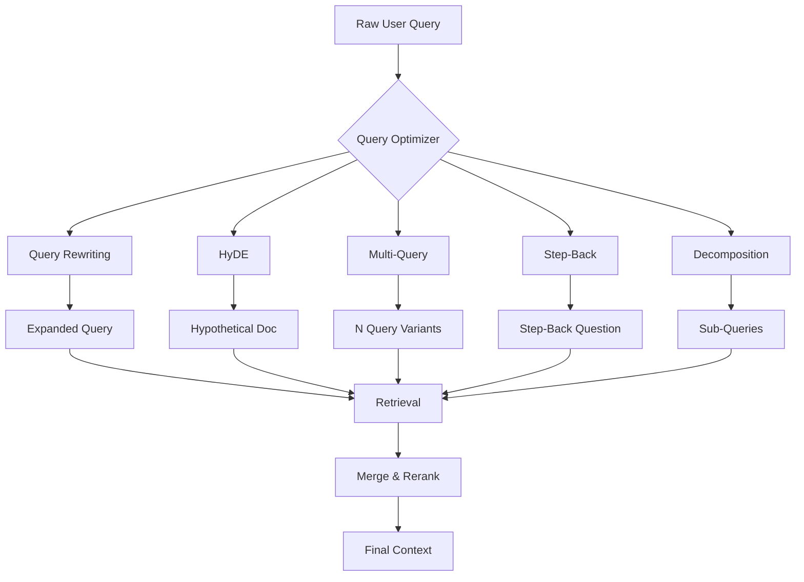
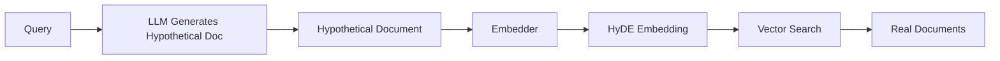
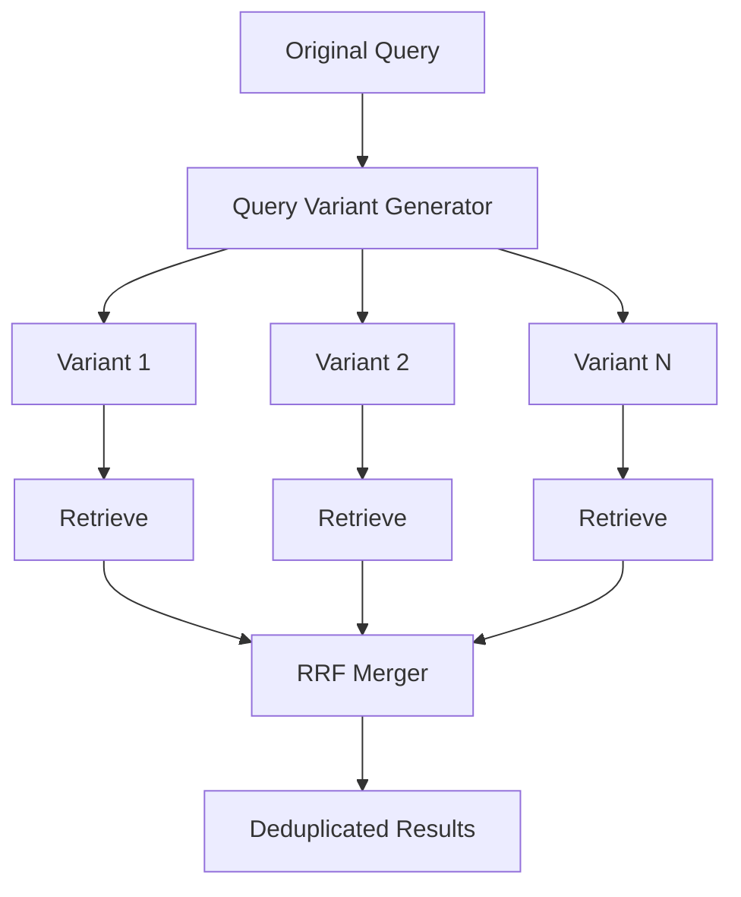
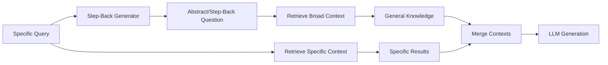
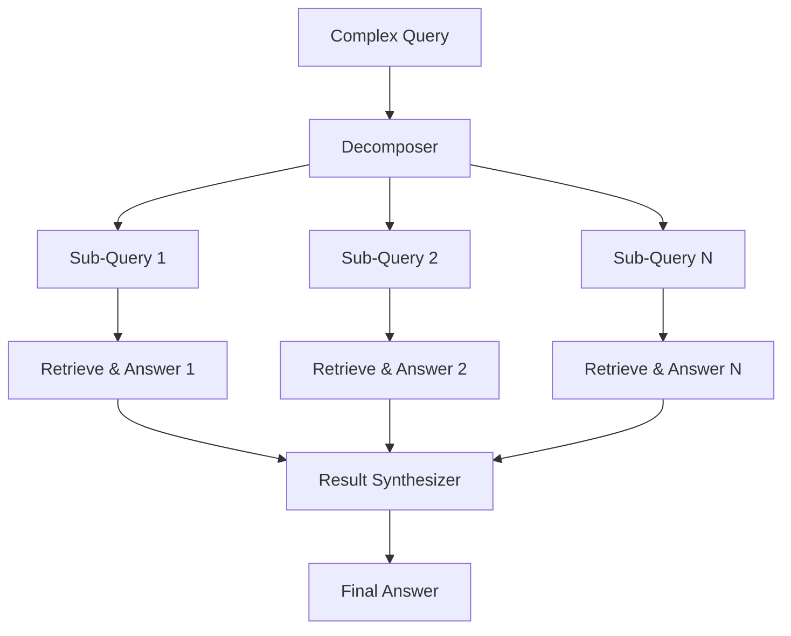

<!-- Clear Language: Keep sentences under 50 words -->
# Query Rewriting & Decomposition for RAG

## Learning Objectives

| Objective | Description |
|-----------|-------------|
| LO1 | Understand query rewriting techniques: expansion, synonym expansion, back-translation, LLM-based rewriting |
| LO2 | Implement Hypothetical Document Embeddings (HyDE) for improved retrieval |
| LO3 | Build multi-query retrieval systems with N query variants and result merging |
| LO4 | Apply step-back prompting for broader context retrieval |
| LO5 | Design query decomposition pipelines for complex multi-hop queries |

## Introduction

Retrieval-Augmented Generation lets LLMs answer questions about your private data. Vector databases store embeddings for semantic search. This module covers the complete RAG pipeline from chunking to reranking.

A user's raw query is often poorly phrased, ambiguous, or too complex for direct retrieval. Query rewriting transforms the query into forms that better match relevant documents. Decomposition breaks compound questions into simpler sub-questions. These techniques improve recall by 20-40% in production RAG systems.

This chapter covers five query optimization strategies: query rewriting, HyDE, multi-query retrieval, step-back prompting, and query decomposition. Each technique addresses a different failure mode of naive retrieval.

## Prerequisites

- Basic programming knowledge
- Understanding of data structures
- Familiarity with embedding models and vector search (Chapter 12.2)
- Understanding of basic RAG pipeline (Chapter 12.1)

## Key Terminology

**Key Terms**: Core vocabulary and concepts for this topic.

**Definition**: Essential terms you must know for interviews and production work.

| Term | Definition |
|------|------------|
| Query Rewriting | Transforming a user query into variants that improve retrieval match |
| Query Expansion | Adding related terms/synonyms to the original query |
| HyDE | Hypothetical Document Embeddings — generate a fake document, embed it, retrieve similar real ones |
| Multi-Query Retrieval | Creating N query variants, retrieving for each, merging results |
| Step-Back Prompting | Asking a broader "step-back" question to retrieve general context |
| Query Decomposition | Splitting a complex query into simpler sub-queries answered independently |
| Back-Translation | Translating query to another language and back to generate paraphrases |

## Theory

Understanding query rewriting and decomposition is fundamental for AI engineers. This section covers the core concepts, underlying principles, and theoretical framework that govern how these techniques work in practice.

The central insight: users express information needs differently than documents express content. Query rewriting bridges this vocabulary gap. Decomposition bridges the complexity gap. Together, they make retrieval robust to both lexical mismatch and compositional complexity.

## Chapter at a Glance

| Section | Topic | Key Concept |
|---------|-------|-------------|
| 11.1 | Query Rewriting | Expansion, synonym, back-translation, LLM rewriting |
| 11.2 | HyDE | Hypothetical document generation for semantic retrieval |
| 11.3 | Multi-Query Retrieval | N variants, parallel retrieval, RRF merging |
| 11.4 | Step-Back Prompting | Broad context via abstraction questions |
| 11.5 | Query Decomposition | Sub-queries, hierarchical execution, result synthesis |

## Chapter Roadmap



## 11.1 Query Rewriting

Query rewriting transforms a user query into one or more variants that improve retrieval performance. The rewritten queries compensate for vocabulary mismatch, spelling errors, and ambiguous phrasing.

### 11.1.1 Query Expansion

Query expansion adds related terms to the original query. This increases the chance of matching relevant documents that use different vocabulary.

```python
import numpy as np
from typing import List, Dict, Optional, Callable
from collections import defaultdict
import json
import re


class QueryExpander:
    """Expand queries with synonyms and related terms."""

    def __init__(self, synonym_dict: Dict[str, List[str]] = None):
        self.synonyms = synonym_dict or self._default_synonyms()

    def _default_synonyms(self) -> Dict[str, List[str]]:
        return {
            "ai": ["artificial intelligence", "machine learning", "deep learning"],
            "rag": ["retrieval augmented generation", "retrieval-augmented generation"],
            "llm": ["large language model", "language model", "foundation model"],
            "embedding": ["vector representation", "embedding vector", "dense vector"],
            "retrieval": ["search", "fetch", "information retrieval"],
            "train": ["fine-tune", "learn", "fit", "optimize"],
            "model": ["neural network", "transformer", "architecture"],
            "data": ["dataset", "corpus", "information", "knowledge"],
            "fast": ["efficient", "quick", "rapid", "high-performance"],
            "accuracy": ["precision", "recall", "f1", "performance"],
        }

    def expand(self, query: str, top_k: int = 3) -> str:
        """Expand query by appending synonyms for key terms."""
        words = query.lower().split()
        expanded_terms = set(words)

        for word in words:
            clean = word.strip(".,!?;:")
            if clean in self.synonyms:
                expanded_terms.update(self.synonyms[clean][:top_k])

        return " ".join(expanded_terms)

    def weighted_expansion(self, query: str, original_weight: float = 2.0) -> str:
        """Expansion with term weighting (repeat original terms)."""
        expanded = self.expand(query)
        original_parts = query.split()
        weighted = " ".join(original_parts * int(original_weight))
        return f"{weighted} {expanded}"


expander = QueryExpander()
original = "How does RAG model train on private data?"
expanded = expander.expand(original)
print(f"Original: {original}")
print(f"Expanded: {expanded}")
print(f"Weighted: {expander.weighted_expansion(original)}")
```

### 11.1.2 Synonym Expansion with WordNet Backoff

When a dedicated synonym dictionary is unavailable, we can use embedding similarity to find related terms dynamically.

```python
class EmbeddingSynonymExpander:
    """Expand queries using embedding similarity for synonym discovery."""

    def __init__(self, embed_fn: Callable, top_k_synonyms: int = 5):
        self.embed = embed_fn
        self.top_k = top_k_synonyms
        self.vocab_cache = {}

    def get_similar_terms(self, word: str, vocab: List[str]) -> List[str]:
        """Find semantically similar terms from a vocabulary."""
        word_emb = self.embed(word)
        similarities = []
        for v in vocab:
            v_emb = self.embed(v)
            sim = float(np.dot(word_emb, v_emb))
            similarities.append((v, sim))

        similarities.sort(key=lambda x: x[1], reverse=True)
        # Skip the word itself
        return [v for v, s in similarities[1:self.top_k + 1]]

    def expand(self, query: str, corpus_vocab: List[str]) -> str:
        """Expand query with embedding-similar terms."""
        words = set(query.lower().split())
        synonyms = set(words)

        for word in words:
            clean = word.strip(".,!?;:")
            similar = self.get_similar_terms(clean, corpus_vocab)
            synonyms.update(similar)

        return " ".join(synonyms)


def mock_embed(text: str) -> np.ndarray:
    """Mock embedding function for demonstration."""
    rng = np.random.RandomState(hash(text) % (2**31))
    emb = rng.randn(384)
    return emb / np.linalg.norm(emb)


corpus = ["retrieval", "generation", "augmented", "embedding",
          "transformer", "attention", "fine-tuning", "training"]
expander_emb = EmbeddingSynonymExpander(mock_embed, top_k_synonyms=3)
result = expander_emb.expand("retrieval model", corpus)
print(f"Embedding-expanded query: {result}")
```

### 11.1.3 Back-Translation for Paraphrasing

Back-translation translates a query to an intermediate language and back to the original. This generates natural paraphrases that improve recall.

```python
class BackTranslationRewriter:
    """Rewrite queries by translating through a pivot language."""

    def __init__(self, translate_fn: Callable):
        self.translate = translate_fn

    def rewrite(self, query: str, pivot_lang: str = "fr") -> str:
        """Translate query to pivot language and back."""
        forward = self.translate(query, target=pivot_lang)
        backward = self.translate(forward, target="en")
        return backward

    def multi_pivot_rewrite(self, query: str,
                            pivots: List[str] = None) -> List[str]:
        """Generate paraphrases through multiple pivot languages."""
        pivots = pivots or ["fr", "de", "es", "ja", "zh"]
        variants = [query]

        for lang in pivots:
            try:
                variant = self.rewrite(query, lang)
                if variant.lower() != query.lower():
                    variants.append(variant)
            except Exception:
                continue

        return variants


def mock_translate(text: str, target: str) -> str:
    """Mock translation service."""
    translations = {
        ("How does RAG work?", "fr"): "Comment fonctionne le RAG?",
        ("Comment fonctionne le RAG?", "en"): "How does RAG function?",
        ("How does RAG work?", "de"): "Wie funktioniert RAG?",
        ("Wie funktioniert RAG?", "en"): "How does RAG operate?",
    }
    return translations.get((text, target), text)


backtranslator = BackTranslationRewriter(mock_translate)
paraphrases = backtranslator.multi_pivot_rewrite("How does RAG work?", ["fr", "de"])
print("Back-translation paraphrases:")
for i, p in enumerate(paraphrases):
    print(f"  [{i}] {p}")
```

### 11.1.4 LLM-Based Query Rewriting

LLMs can rewrite queries with context awareness, intent preservation, and style adaptation. This is the most flexible approach.

```python
class LLMQueryRewriter:
    """Use an LLM to rewrite queries for better retrieval."""

    def __init__(self, llm_fn: Callable):
        self.llm = llm_fn

    def rewrite_for_retrieval(self, query: str) -> str:
        """Rewrite query to be more effective for vector search."""
        prompt = f"""Rewrite this user query to make it more effective for semantic search retrieval.

Guidelines:
- Use precise, descriptive language
- Include key domain terms
- Expand abbreviations on first use
- Remove ambiguous pronouns
- Add context if the query is too brief

Original query: {query}

Rewritten query (return only the rewritten text):"""
        return self.llm(prompt).strip()

    def rewrite_for_web_search(self, query: str) -> str:
        """Rewrite query optimized for web/BM25 search."""
        prompt = f"""Rewrite this query for keyword-based (BM25) web search.

Guidelines:
- Use exact terms likely to appear in documents
- Add alternative phrasings in parentheses
- Include quoted phrases for exact matching

Original query: {query}

Rewritten query:"""
        return self.llm(prompt).strip()

    def generate_search_terms(self, query: str, num_terms: int = 5) -> List[str]:
        """Generate individual search terms/phrases from the query."""
        prompt = f"""Extract {num_terms} key search terms or short phrases from this query.
Each term should be useful for a keyword search.

Query: {query}

Return as a comma-separated list:"""
        response = self.llm(prompt)
        return [t.strip() for t in response.split(",") if t.strip()]

    def decompose_intent(self, query: str) -> Dict:
        """Analyze query intent and produce directed rewrites."""
        prompt = f"""Analyze this query and produce:
1. The core information need (1 sentence)
2. Key entities mentioned
3. Suggested search queries (3 variants at different specificity levels)

Query: {query}

Return as JSON:
{{"intent": "...", "entities": [...], "search_queries": [...]}}"""
        response = self.llm(prompt)
        try:
            return json.loads(response)
        except json.JSONDecodeError:
            return {"intent": query, "entities": [], "search_queries": [query]}


def mock_llm(prompt: str) -> str:
    """Mock LLM for demonstration."""
    if "rewrite" in prompt.lower() and "semantic" in prompt:
        return "What are the mechanisms and applications of Retrieval-Augmented Generation (RAG) in large language models?"
    if "rewrite" in prompt.lower() and "keyword" in prompt.lower():
        return '"RAG mechanism" "retrieval augmented generation" LLM knowledge retrieval'
    if "search terms" in prompt.lower():
        return "RAG, retrieval-augmented generation, LLM, knowledge retrieval, document search"
    if "intent" in prompt.lower():
        return '{"intent": "Understand how RAG works in LLMs", "entities": ["RAG", "LLM"], "search_queries": ["RAG mechanism explained", "How retrieval augmented generation works", "RAG in LLM applications"]}'
    return query


rewriter = LLMQueryRewriter(mock_llm)
query = "How does RAG work?"
print(f"Semantic rewrite: {rewriter.rewrite_for_retrieval(query)}")
print(f"Keyword rewrite: {rewriter.rewrite_for_web_search(query)}")
print(f"Search terms: {rewriter.generate_search_terms(query)}")

intent = rewriter.decompose_intent(query)
print(f"Intent: {intent['intent']}")
print(f"Entities: {intent['entities']}")
```

### 11.1.5 Rewriting Pipeline

Combine multiple rewriting strategies into a configurable pipeline.

```python
class RewritingPipeline:
    """Composable pipeline of rewriting strategies."""

    def __init__(self):
        self.steps = []

    def add_step(self, name: str, fn: Callable, weight: float = 1.0):
        """Add a rewriting step with optional weight."""
        self.steps.append({"name": name, "fn": fn, "weight": weight})

    def rewrite(self, query: str) -> List[Dict[str, str]]:
        """Execute all rewriting steps and collect variants."""
        variants = [{"variant": query, "method": "original", "weight": 1.0}]

        for step in self.steps:
            try:
                result = step["fn"](query)
                if isinstance(result, str):
                    if result != query:
                        variants.append({
                            "variant": result,
                            "method": step["name"],
                            "weight": step["weight"],
                        })
                elif isinstance(result, list):
                    for r in result:
                        if r != query:
                            variants.append({
                                "variant": r,
                                "method": step["name"],
                                "weight": step["weight"],
                            })
            except Exception as e:
                print(f"  Step '{step['name']}' failed: {e}")

        return variants


pipeline = RewritingPipeline()
pipeline.add_step("expand", lambda q: expander.expand(q), weight=1.0)
pipeline.add_step("backtranslate", lambda q: backtranslator.multi_pivot_rewrite(q, ["fr"]), weight=1.2)
pipeline.add_step("llm_rewrite", lambda q: rewriter.rewrite_for_retrieval(q), weight=1.5)

variants = pipeline.rewrite("How does RAG work?")
print("Rewriting pipeline variants:")
for v in variants:
    print(f"  [{v['method']}] (w={v['weight']}): {v['variant']}")
```

## 11.2 Hypothetical Document Embeddings (HyDE)

HyDE generates a hypothetical document that would answer the query, embeds that document, and uses the embedding to retrieve real documents. The key insight: a document that answers the question is more similar to real relevant documents than the question itself.



### 11.2.1 Basic HyDE

```python
class HyDE:
    """Hypothetical Document Embeddings for improved retrieval."""

    def __init__(self, generator_fn: Callable, embedder_fn: Callable,
                 retriever_fn: Callable):
        self.generator = generator_fn
        self.embedder = embedder_fn
        self.retriever = retriever_fn

    def generate_hypothetical_doc(self, query: str,
                                  style: str = "textbook") -> str:
        """Generate a hypothetical document that answers the query."""
        prompts = {
            "textbook": f"""Write a detailed textbook paragraph that answers this question.
Use factual, explanatory style with precise terminology.

Question: {query}

Textbook paragraph:""",
            "abstract": f"""Write a research paper abstract that addresses this topic.

Research question: {query}

Abstract:""",
            "summary": f"""Write a concise summary that contains the answer to this question.

Question: {query}

Summary:""",
            "qa": f"""Write a detailed answer to this question as if explaining to a colleague.

Question: {query}

Detailed answer:""",
        }

        prompt = prompts.get(style, prompts["textbook"])
        return self.generator(prompt)

    def embed_hypothetical(self, hypothetical_doc: str) -> np.ndarray:
        """Embed the hypothetical document."""
        return self.embedder(hypothetical_doc)

    def retrieve(self, query: str, top_k: int = 5,
                 style: str = "textbook") -> List[Dict]:
        """Full HyDE pipeline: generate, embed, retrieve."""
        hypo_doc = self.generate_hypothetical_doc(query, style)
        hypo_emb = self.embed_hypothetical(hypo_doc)
        results = self.retriever(hypo_emb, top_k=top_k)

        return results

    def retrieve_with_original(self, query: str, query_embedder: Callable,
                                top_k: int = 5,
                                style: str = "textbook",
                                fusion: str = "rrf") -> List[Dict]:
        """Retrieve using both HyDE and original query, then fuse."""
        # HyDE path
        hypo_doc = self.generate_hypothetical_doc(query, style)
        hypo_emb = self.embed_hypothetical(hypo_doc)
        hyde_results = self.retriever(hypo_emb, top_k=top_k * 2)

        # Original query path
        query_emb = query_embedder(query)
        query_results = self.retriever(query_emb, top_k=top_k * 2)

        # Fusion
        if fusion == "rrf":
            return self._rrf_fuse(hyde_results, query_results, top_k)
        elif fusion == "interleave":
            return self._interleave(hyde_results, query_results, top_k)
        return hyde_results[:top_k]

    def _rrf_fuse(self, hyde: List[Dict], query: List[Dict],
                  top_k: int, k_const: int = 60) -> List[Dict]:
        scores = defaultdict(float)
        for rank, doc in enumerate(hyde, 1):
            scores[doc["id"]] += 1.0 / (k_const + rank)
        for rank, doc in enumerate(query, 1):
            scores[doc["id"]] += 1.0 / (k_const + rank)

        sorted_docs = sorted(scores.items(), key=lambda x: x[1], reverse=True)
        return [{"id": doc_id, "score": score, "method": "hyde_fused"}
                for doc_id, score in sorted_docs[:top_k]]

    def _interleave(self, hyde: List[Dict], query: List[Dict],
                    top_k: int) -> List[Dict]:
        """Interleave results, alternating between lists."""
        result = []
        seen = set()
        max_len = max(len(hyde), len(query))

        for i in range(max_len):
            if i < len(hyde) and hyde[i]["id"] not in seen:
                result.append(hyde[i])
                seen.add(hyde[i]["id"])
            if i < len(query) and query[i]["id"] not in seen:
                result.append(query[i])
                seen.add(query[i]["id"])
            if len(result) >= top_k:
                break

        return result[:top_k]


class MockDocumentStore:
    """Mock document store for demonstration."""

    def __init__(self):
        self.docs = [
            {"id": "doc1", "text": "RAG combines retrieval with generative models to produce grounded responses."},
            {"id": "doc2", "text": "Retrieval-Augmented Generation (RAG) is a technique for grounding LLM outputs."},
            {"id": "doc3", "text": "Vector databases store embeddings for efficient similarity search."},
            {"id": "doc4", "text": "HyDE generates hypothetical documents to bridge query-document gap."},
            {"id": "doc5", "text": "Multi-query retrieval generates multiple query variants for better coverage."},
        ]

    def search_by_embedding(self, emb: np.ndarray, top_k: int) -> List[Dict]:
        """Search by embedding similarity."""
        scores = []
        for doc in self.docs:
            doc_emb = mock_embed(doc["text"])
            sim = float(np.dot(emb, doc_emb))
            scores.append({**doc, "score": sim})
        scores.sort(key=lambda x: x["score"], reverse=True)
        return scores[:top_k]


def hyde_generator(prompt: str) -> str:
    """Generate hypothetical document."""
    if "RAG" in prompt:
        return "Retrieval-Augmented Generation (RAG) is a technique that combines a retrieval system with a generative language model. The retriever finds relevant documents from a knowledge base, and the generator uses those documents to produce grounded, factual responses. RAG reduces hallucinations by providing the LLM with actual source material."
    return "This is a hypothetical document that would contain information relevant to answering the question."


store = MockDocumentStore()
hyde = HyDE(
    generator_fn=hyde_generator,
    embedder_fn=mock_embed,
    retriever_fn=lambda emb, top_k: store.search_by_embedding(emb, top_k),
)

hypo_doc = hyde.generate_hypothetical_doc("What is RAG?")
print(f"Hypothetical document:\n{hypo_doc}\n")

results = hyde.retrieve("What is RAG?", top_k=3, style="textbook")
print("HyDE retrieval results:")
for r in results:
    print(f"  {r['id']}: score={r['score']:.4f}")
```

### 11.2.2 Multi-Style HyDE

Different document styles capture different aspects of relevance. Multi-style HyDE generates multiple hypothetical documents and averages their embeddings.

```python
class MultiStyleHyDE:
    """Generate multiple hypothetical documents in different styles."""

    def __init__(self, hyde: HyDE, styles: List[str] = None):
        self.hyde = hyde
        self.styles = styles or ["textbook", "abstract", "summary", "qa"]

    def retrieve(self, query: str, top_k: int = 5,
                 fusion: str = "mean") -> List[Dict]:
        """Generate multiple hypothetical docs and fuse their retrievals."""
        all_results = []

        for style in self.styles:
            hypo_doc = self.hyde.generate_hypothetical_doc(query, style)
            hypo_emb = self.hyde.embed_hypothetical(hypo_doc)
            results = self.hyde.retriever(hypo_emb, top_k=top_k * 2)
            all_results.append(results)

        if fusion == "mean":
            return self._mean_fuse(all_results, top_k)
        elif fusion == "vote":
            return self._vote_fuse(all_results, top_k)
        return all_results[0][:top_k]

    def _mean_fuse(self, results_list: List[List[Dict]],
                   top_k: int) -> List[Dict]:
        """Average scores across all HyDE variations."""
        scores = defaultdict(list)
        for results in results_list:
            for doc in results:
                scores[doc["id"]].append(doc["score"])

        averaged = []
        for doc_id, score_list in scores.items():
            avg_score = sum(score_list) / len(score_list)
            averaged.append({"id": doc_id, "score": avg_score, "method": "multi_hyde_mean"})

        averaged.sort(key=lambda x: x["score"], reverse=True)
        return averaged[:top_k]

    def _vote_fuse(self, results_list: List[List[Dict]],
                   top_k: int) -> List[Dict]:
        """Count how many styles retrieved each document."""
        vote_counts = defaultdict(int)
        score_sums = defaultdict(float)

        for results in results_list:
            for rank, doc in enumerate(results):
                vote_counts[doc["id"]] += 1
                score_sums[doc["id"]] += doc["score"]

        voted = []
        for doc_id in vote_counts:
            voted.append({
                "id": doc_id,
                "votes": vote_counts[doc_id],
                "avg_score": score_sums[doc_id] / vote_counts[doc_id],
                "method": "multi_hyde_vote",
            })

        voted.sort(key=lambda x: (x["votes"], x["avg_score"]), reverse=True)
        return voted[:top_k]


multi_hyde = MultiStyleHyDE(hyde, styles=["textbook", "summary"])
results = multi_hyde.retrieve("What is RAG?", top_k=3, fusion="mean")
print("Multi-style HyDE results (mean fusion):")
for r in results:
    print(f"  {r['id']}: score={r['score']:.4f}")
```

### 11.2.3 HyDE with Query Feedback

Use the retrieved documents to refine the hypothetical document iteratively.

```python
class IterativeHyDE:
    """Iterative HyDE with retrieval feedback."""

    def __init__(self, hyde: HyDE, max_iterations: int = 3):
        self.hyde = hyde
        self.max_iterations = max_iterations

    def retrieve(self, query: str, top_k: int = 5,
                 style: str = "textbook") -> List[Dict]:
        """Iteratively refine the hypothetical document using retrieved content."""
        current_query = query
        all_results = []
        seen_ids = set()

        for iteration in range(self.max_iterations):
            hypo_doc = self.hyde.generate_hypothetical_doc(current_query, style)
            hypo_emb = self.hyde.embed_hypothetical(hypo_doc)
            results = self.hyde.retriever(hypo_emb, top_k=top_k * 2)

            new_results = [r for r in results if r["id"] not in seen_ids]
            for r in new_results:
                seen_ids.add(r["id"])
                all_results.append(r)

            if not new_results:
                break

            top_text = new_results[0].get("text", "")
            current_query = f"{query} Based on: {top_text[:100]}"

        all_results.sort(key=lambda x: x.get("score", 0), reverse=True)
        return all_results[:top_k]


iter_hyde = IterativeHyDE(hyde, max_iterations=2)
results = iter_hyde.retrieve("What is RAG?", top_k=3)
print("Iterative HyDE results:")
for r in results:
    print(f"  {r['id']}: score={r['score']:.4f}")
```

## 11.3 Multi-Query Retrieval

Multi-query retrieval generates N different variants of the user query, retrieves documents for each variant, and merges the results. This increases recall by covering different phrasings and perspectives.



### 11.3.1 Multi-Query Variant Generator

```python
class MultiQueryGenerator:
    """Generate multiple query variants for broader retrieval coverage."""

    def __init__(self, llm_fn: Callable, num_queries: int = 5):
        self.llm = llm_fn
        self.num_queries = num_queries

    def generate_variants(self, query: str) -> List[str]:
        """Generate diverse query variants using an LLM."""
        prompt = f"""Generate {self.num_queries} different versions of this search query.
Each version should:
- Use different phrasing and synonyms
- Target different aspects of the information need
- Vary in specificity (broad to narrow)
- Be self-contained and searchable

Original query: {query}

Return one query per line, numbered 1 to {self.num_queries}:"""
        response = self.llm(prompt)
        variants = self._parse_variants(response)
        return variants[:self.num_queries]

    def _parse_variants(self, response: str) -> List[str]:
        variants = []
        for line in response.strip().split("\n"):
            line = line.strip()
            line = re.sub(r"^\d+[\.\)]\s*", "", line)
            if line and len(line) > 5:
                variants.append(line)
        return variants

    def template_variants(self, query: str, templates: List[str] = None) -> List[str]:
        """Generate variants using predefined templates."""
        templates = templates or [
            "What is {query}?",
            "Explain {query} in detail",
            "How does {query} work?",
            "{query} definition and examples",
            "Overview of {query}",
            "{query} applications and use cases",
            "Benefits of {query}",
            "How to implement {query}",
        ]
        return [t.format(query=query) for t in templates]

    def diversity_variants(self, query: str, aspects: List[str] = None) -> List[str]:
        """Generate variants targeting different aspects."""
        aspects = aspects or [
            "definition",
            "mechanism",
            "applications",
            "limitations",
            "comparison",
        ]
        variants = []
        for aspect in aspects:
            variants.append(f"{query} {aspect}")
        return variants


def mock_multi_query_llm(prompt: str) -> str:
    """Mock LLM for multi-query generation."""
    return """1. What is Retrieval-Augmented Generation and how does it work?
2. RAG mechanism explained in simple terms
3. How does RAG combine retrieval with generation?
4. RAG vs traditional language model approaches
5. Benefits and limitations of RAG systems"""


mq_generator = MultiQueryGenerator(mock_multi_query_llm, num_queries=5)
variants = mq_generator.generate_variants("How does RAG work?")
print("Generated query variants:")
for i, v in enumerate(variants, 1):
    print(f"  [{i}] {v}")

template_variants = mq_generator.template_variants("RAG")
print("\nTemplate variants:")
for i, v in enumerate(template_variants[:4], 1):
    print(f"  [{i}] {v}")
```

### 11.3.2 Multi-Query Retriever

```python
class MultiQueryRetriever:
    """Execute retrieval for multiple query variants and merge results."""

    def __init__(self, base_retriever_fn: Callable,
                 merger: str = "rrf"):
        self.retriever = base_retriever_fn
        self.merger = merger

    def retrieve(self, queries: List[str], top_k: int = 5) -> List[Dict]:
        """Retrieve documents for each query variant and merge."""
        all_results = []

        for q_idx, query in enumerate(queries):
            results = self.retriever(query, top_k=top_k * 2)
            for r in results:
                r["query_index"] = q_idx
                r["source_query"] = query
            all_results.append(results)

        if self.merger == "rrf":
            return self._rrf_merge(all_results, top_k)
        elif self.merger == "unique":
            return self._unique_merge(all_results, top_k)
        elif self.merger == "round_robin":
            return self._round_robin(all_results, top_k)
        return all_results[0][:top_k]

    def _rrf_merge(self, results_list: List[List[Dict]],
                   top_k: int, k_const: int = 60) -> List[Dict]:
        """Reciprocal Rank Fusion across all query variants."""
        scores = defaultdict(float)
        doc_details = {}

        for results in results_list:
            for rank, doc in enumerate(results, 1):
                doc_id = doc["id"]
                scores[doc_id] += 1.0 / (k_const + rank)
                if doc_id not in doc_details:
                    doc_details[doc_id] = doc

        sorted_docs = sorted(scores.items(), key=lambda x: x[1], reverse=True)
        merged = []
        for doc_id, score in sorted_docs[:top_k]:
            detail = dict(doc_details.get(doc_id, {}))
            detail["merged_score"] = score
            detail["method"] = "multi_query_rrf"
            merged.append(detail)

        return merged

    def _unique_merge(self, results_list: List[List[Dict]],
                      top_k: int) -> List[Dict]:
        """Deduplicate and interleave results."""
        seen = set()
        merged = []

        for results in results_list:
            for doc in results:
                if doc["id"] not in seen:
                    seen.add(doc["id"])
                    doc["method"] = "multi_query_unique"
                    merged.append(doc)
                    if len(merged) >= top_k:
                        return merged
        return merged

    def _round_robin(self, results_list: List[List[Dict]],
                     top_k: int) -> List[Dict]:
        """Alternate between query variant result lists."""
        merged = []
        seen = set()
        max_len = max(len(r) for r in results_list)

        for position in range(max_len):
            for results in results_list:
                if position < len(results):
                    doc = results[position]
                    if doc["id"] not in seen:
                        seen.add(doc["id"])
                        doc["method"] = "multi_query_rr"
                        merged.append(doc)
                        if len(merged) >= top_k:
                            return merged
        return merged

    def retrieve_with_weights(self, queries: List[float],
                              weights: List[float],
                              top_k: int = 5) -> List[Dict]:
        """Retrieve with per-query weights for RRF fusion."""
        all_results = []

        for query, weight in zip(queries, weights):
            results = self.retriever(query, top_k=top_k * 2)
            all_results.append((results, weight))

        scores = defaultdict(float)
        doc_details = {}

        for results, weight in all_results:
            for rank, doc in enumerate(results, 1):
                doc_id = doc["id"]
                scores[doc_id] += weight / (60 + rank)
                if doc_id not in doc_details:
                    doc_details[doc_id] = doc

        sorted_docs = sorted(scores.items(), key=lambda x: x[1], reverse=True)
        return [dict(doc_details.get(doc_id, {}), merged_score=score)
                for doc_id, score in sorted_docs[:top_k]]


class MockMultiQueryRetriever:
    """Mock retriever that returns different results for different queries."""

    def __call__(self, query: str, top_k: int) -> List[Dict]:
        query_hash = hash(query) % 100
        results = []
        for i in range(top_k):
            results.append({
                "id": f"doc_{(query_hash + i) % 20}",
                "score": 0.9 - i * 0.08,
                "text": f"Content related to: {query[:30]}...",
            })
        return results


mq_retriever = MultiQueryRetriever(MockMultiQueryRetriever(), merger="rrf")
results = mq_retriever.retrieve(variants, top_k=5)
print("Multi-query merged results:")
for r in results:
    print(f"  {r['id']}: merged_score={r['merged_score']:.4f}")
```

### 11.3.3 Multi-Query with Deduplication and Filtering

```python
class AdvancedMultiQueryRetriever:
    """Multi-query retriever with dedup, score normalization, and filtering."""

    def __init__(self, base_retriever_fn: Callable):
        self.retriever = base_retriever_fn

    def retrieve(self, queries: List[str], top_k: int = 5,
                 min_score: float = 0.0,
                 diversify: bool = False) -> List[Dict]:
        """Retrieve with optional score threshold and diversification."""
        all_docs = {}  # doc_id -> {doc, max_score, source_queries, ranks}

        for q_idx, query in enumerate(queries):
            results = self.retriever(query, top_k=top_k * 3)

            for rank, doc in enumerate(results, 1):
                doc_id = doc["id"]
                if doc_id not in all_docs:
                    all_docs[doc_id] = {
                        "doc": doc,
                        "max_score": doc["score"],
                        "avg_score": doc["score"],
                        "source_queries": [q_idx],
                        "best_rank": rank,
                        "count": 1,
                        "scores": [doc["score"]],
                    }
                else:
                    entry = all_docs[doc_id]
                    entry["max_score"] = max(entry["max_score"], doc["score"])
                    entry["scores"].append(doc["score"])
                    entry["avg_score"] = sum(entry["scores"]) / len(entry["scores"])
                    entry["source_queries"].append(q_idx)
                    entry["best_rank"] = min(entry["best_rank"], rank)
                    entry["count"] += 1

        results = []
        for doc_id, entry in all_docs.items():
            if entry["max_score"] >= min_score:
                results.append({
                    "id": doc_id,
                    "text": entry["doc"].get("text", ""),
                    "max_score": entry["max_score"],
                    "avg_score": entry["avg_score"],
                    "num_sources": entry["count"],
                    "best_rank": entry["best_rank"],
                    "source_queries": entry["source_queries"],
                })

        # Sort by (num_sources, avg_score) - documents found by more variants rank higher
        results.sort(key=lambda x: (x["num_sources"], x["avg_score"]), reverse=True)

        if diversify:
            results = self._diversify(results, top_k)

        return results[:top_k]

    def _diversify(self, results: List[Dict], top_k: int) -> List[Dict]:
        """Maximize result diversity by source coverage."""
        selected = []
        selected_ids = set()
        covered_queries = set()

        while len(selected) < top_k and results:
            best_idx = 0
            best_new_queries = 0

            for i, r in enumerate(results):
                if r["id"] in selected_ids:
                    continue
                new_queries = len(set(r["source_queries"]) - covered_queries)
                if new_queries > best_new_queries:
                    best_new_queries = new_queries
                    best_idx = i

            candidate = results.pop(best_idx)
            selected.append(candidate)
            selected_ids.add(candidate["id"])
            covered_queries.update(candidate["source_queries"])

        return selected


adv_mq = AdvancedMultiQueryRetriever(MockMultiQueryRetriever())
results = adv_mq.retrieve(variants, top_k=5, min_score=0.3, diversify=True)
print("Advanced multi-query results:")
for r in results:
    print(f"  {r['id']}: avg_score={r['avg_score']:.3f}, sources={r['num_sources']}")
```

### 11.3.4 Multi-Query with Query Clustering

For very large numbers of variants (10-20), cluster similar queries to reduce redundant retrievals.

```python
class ClusteredMultiQuery:
    """Cluster similar query variants to reduce redundant retrievals."""

    def __init__(self, embed_fn: Callable, retriever_fn: Callable,
                 similarity_threshold: float = 0.85):
        self.embed = embed_fn
        self.retriever = retriever_fn
        self.threshold = similarity_threshold

    def cluster_queries(self, queries: List[str]) -> List[List[str]]:
        """Group similar queries into clusters."""
        clusters = []
        assigned = set()

        for i, q1 in enumerate(queries):
            if i in assigned:
                continue
            cluster = [q1]
            assigned.add(i)
            emb1 = self.embed(q1)

            for j, q2 in enumerate(queries):
                if j in assigned or i == j:
                    continue
                emb2 = self.embed(q2)
                sim = float(np.dot(emb1, emb2))
                if sim >= self.threshold:
                    cluster.append(q2)
                    assigned.add(j)

            clusters.append(cluster)

        return clusters

    def retrieve(self, queries: List[str], top_k: int = 5) -> List[Dict]:
        """Retrieve using cluster representatives to reduce calls."""
        clusters = self.cluster_queries(queries)
        all_results = []

        for cluster in clusters:
            representative = cluster[0]
            results = self.retriever(representative, top_k=top_k * 2)
            for r in results:
                r["cluster_size"] = len(cluster)
                r["cluster_representative"] = representative
            all_results.append(results)

        # RRF merge across cluster results
        return self._cluster_rrf(all_results, top_k)

    def _cluster_rrf(self, results_list: List[List[Dict]],
                     top_k: int) -> List[Dict]:
        """RRF merge weighted by cluster size."""
        scores = defaultdict(float)
        doc_details = {}

        for results in results_list:
            cluster_size = results[0].get("cluster_size", 1) if results else 1
            weight = np.log1p(cluster_size)

            for rank, doc in enumerate(results, 1):
                doc_id = doc["id"]
                scores[doc_id] += weight / (60 + rank)
                if doc_id not in doc_details:
                    doc_details[doc_id] = doc

        sorted_docs = sorted(scores.items(), key=lambda x: x[1], reverse=True)
        return [dict(doc_details.get(doc_id, {}),
                     merged_score=score,
                     method="clustered_multi_query")
                for doc_id, score in sorted_docs[:top_k]]
```

## 11.4 Step-Back Prompting

Step-back prompting asks a broader, more abstract question before retrieving. This surfaces general context that helps answer specific queries.



### 11.4.1 Step-Back Question Generator

```python
class StepBackGenerator:
    """Generate step-back (abstract) questions from specific queries."""

    def __init__(self, llm_fn: Callable):
        self.llm = llm_fn

    def generate_step_back(self, query: str) -> str:
        """Generate a broader step-back question."""
        prompt = f"""You are given a specific question. Your task is to ask a broader, more fundamental "step-back" question that would help answer the original question.

The step-back question should:
- Be more general and abstract
- Ask about underlying principles or concepts
- Provide context that the specific question needs
- Be answerable from general knowledge sources

Original question: {query}

Step-back question:"""
        return self.llm(prompt).strip()

    def generate_multi_level(self, query: str,
                             levels: int = 3) -> List[str]:
        """Generate questions at multiple abstraction levels."""
        prompts = {
            1: f"What general concept or principle does this question relate to?\n\nQuestion: {query}",
            2: f"What underlying mechanisms or frameworks are relevant?\n\nQuestion: {query}",
            3: f"What broader field or domain provides context?\n\nQuestion: {query}",
        }

        step_backs = [query]
        for level in range(1, levels + 1):
            prompt = f"""Generate a step-back question at abstraction level {level}.

Level {level} definition: {prompts[level]}

Original: {query}

Step-back question:"""
            sb = self.llm(prompt).strip()
            if sb and sb != query:
                step_backs.append(sb)

        return step_backs


def mock_stepback_llm(prompt: str) -> str:
    """Mock LLM for step-back generation."""
    if "step-back question" in prompt.lower():
        return "What is Retrieval-Augmented Generation and what problem does it solve in AI?"
    if "abstraction level" in prompt.lower():
        if "Level 1" in prompt:
            return "What is the concept of grounding AI responses in external knowledge?"
        elif "Level 2" in prompt:
            return "How do hybrid AI systems combine retrieval and generation?"
        else:
            return "What are the fundamental approaches to reducing AI hallucinations?"
    return "What is the broader context of this topic?"


stepback_gen = StepBackGenerator(mock_stepback_llm)
query = "How does the RAG retriever find relevant documents?"
stepback_q = stepback_gen.generate_step_back(query)
print(f"Original: {query}")
print(f"Step-back: {stepback_q}")

multi_level = stepback_gen.generate_multi_level(query, levels=3)
print("\nMulti-level step-back:")
for i, q in enumerate(multi_level):
    print(f"  Level {i}: {q}")
```

### 11.4.2 Step-Back Retriever

```python
class StepBackRetriever:
    """Retrieve using both the original query and step-back question."""

    def __init__(self, base_retriever_fn: Callable,
                 stepback_gen: StepBackGenerator):
        self.retriever = base_retriever_fn
        self.stepback_gen = stepback_gen

    def retrieve(self, query: str, top_k: int = 5,
                 stepback_top_k: int = 3,
                 ratio: float = 0.5) -> List[Dict]:
        """Retrieve from both specific and step-back queries."""
        stepback = self.stepback_gen.generate_step_back(query)

        specific_results = self.retriever(query, top_k=top_k)
        broad_results = self.retriever(stepback, top_k=stepback_top_k)

        # Merge with deduplication
        seen = set()
        merged = []

        # Interleave: specific and broad
        specific_ratio = int(top_k * ratio)
        broad_ratio = top_k - specific_ratio

        for doc in specific_results[:specific_ratio]:
            if doc["id"] not in seen:
                seen.add(doc["id"])
                doc["source"] = "specific"
                merged.append(doc)

        for doc in broad_results[:broad_ratio]:
            if doc["id"] not in seen:
                seen.add(doc["id"])
                doc["source"] = "step_back"
                merged.append(doc)

        # Fill remaining slots
        for doc in specific_results[specific_ratio:]:
            if doc["id"] not in seen and len(merged) < top_k:
                seen.add(doc["id"])
                doc["source"] = "specific"
                merged.append(doc)

        return merged

    def retrieve_with_context(self, query: str, top_k: int = 5) -> Dict:
        """Return both the retrieved docs and the step-back question used."""
        stepback = self.stepback_gen.generate_step_back(query)
        results = self.retrieve(query, top_k=top_k)

        return {
            "original_query": query,
            "step_back_question": stepback,
            "results": results,
            "num_specific": sum(1 for r in results if r.get("source") == "specific"),
            "num_broad": sum(1 for r in results if r.get("source") == "step_back"),
        }


class MockStepBackRetriever:
    """Mock retriever that returns different docs for different queries."""

    def __call__(self, query: str, top_k: int) -> List[Dict]:
        if "retrieval-augmented" in query.lower() or "grounding" in query.lower():
            return [
                {"id": "broad1", "score": 0.95, "text": "RAG grounds LLM responses in external knowledge sources."},
                {"id": "broad2", "score": 0.90, "text": "External knowledge grounding reduces hallucinations in AI systems."},
                {"id": "broad3", "score": 0.85, "text": "Retrieval-based approaches provide factual grounding for generative models."},
            ][:top_k]
        return [
            {"id": "spec1", "score": 0.92, "text": "The RAG retriever uses embedding similarity to find relevant documents."},
            {"id": "spec2", "score": 0.88, "text": "Vector databases enable efficient semantic search in RAG retrieval."},
            {"id": "spec3", "score": 0.82, "text": "BM25 and dense retrievers are commonly used in RAG pipelines."},
        ][:top_k]


sb_retriever = StepBackRetriever(
    MockStepBackRetriever(),
    stepback_gen,
)
results = sb_retriever.retrieve(query, top_k=4, ratio=0.5)
print("Step-back retrieval results:")
for r in results:
    print(f"  {r['id']} (source={r.get('source')}): {r['text'][:60]}")
```

### 11.4.3 Step-Back with Multi-Level Context

```python
class MultiLevelStepBack:
    """Retrieve context at multiple abstraction levels."""

    def __init__(self, base_retriever_fn: Callable,
                 stepback_gen: StepBackGenerator,
                 levels: int = 3):
        self.retriever = base_retriever_fn
        self.stepback_gen = stepback_gen
        self.levels = levels

    def retrieve(self, query: str, top_k: int = 5) -> Dict:
        """Retrieve context at each abstraction level and merge."""
        questions = self.stepback_gen.generate_multi_level(query, self.levels)
        level_results = {}

        for level, q in enumerate(questions):
            results = self.retriever(q, top_k=max(2, top_k // len(questions)))
            level_results[level] = {
                "question": q,
                "results": results,
            }

        # Merge with deduplication, preference for lower levels
        seen = set()
        merged = []
        max_per_level = top_k // len(questions) + 1

        for level in range(len(questions)):
            results = level_results[level]["results"]
            for doc in results[:max_per_level]:
                if doc["id"] not in seen:
                    seen.add(doc["id"])
                    doc["abstraction_level"] = level
                    doc["source_question"] = level_results[level]["question"]
                    merged.append(doc)

        return {
            "query": query,
            "levels": [
                {"level": l, "question": level_results[l]["question"],
                 "num_results": len(level_results[l]["results"])}
                for l in range(len(questions))
            ],
            "results": merged[:top_k],
        }


mlsb = MultiLevelStepBack(MockStepBackRetriever(), stepback_gen, levels=3)
context = mlsb.retrieve("How does RAG retrieval work?", top_k=4)
print("Multi-level step-back context:")
for level in context["levels"]:
    print(f"  Level {level['level']}: {level['question'][:50]}...")
print("Results:")
for r in context["results"]:
    print(f"  [{r['abstraction_level']}] {r['id']}: {r['text'][:50]}")
```

## 11.5 Query Decomposition

Query decomposition breaks a complex query into simpler sub-queries that can be answered independently. Results are then synthesized into a final answer.



### 11.5.1 Query Decomposer

```python
class QueryDecomposer:
    """Decompose complex queries into simpler sub-queries."""

    def __init__(self, llm_fn: Callable):
        self.llm = llm_fn

    def decompose(self, query: str, max_sub_queries: int = 5) -> List[str]:
        """Break a complex query into independent sub-queries."""
        prompt = f"""Decompose this complex question into simpler, independent sub-questions.
Each sub-question should:
- Be self-contained and answerable independently
- Cover one aspect or subtopic
- Be suitable for standalone document retrieval

Complex question: {query}

Return {max_sub_queries} sub-questions as a numbered list. Fewer is fine if the question is simple:"""
        response = self.llm(prompt)
        return self._parse_sub_queries(response)[:max_sub_queries]

    def _parse_sub_queries(self, response: str) -> List[str]:
        sub_queries = []
        for line in response.strip().split("\n"):
            line = line.strip()
            line = re.sub(r"^\d+[\.\)]\s*", "", line)
            if line and line.endswith("?") and len(line) > 10:
                sub_queries.append(line)
        return sub_queries

    def hierarchical_decompose(self, query: str,
                               max_depth: int = 2) -> Dict:
        """Recursively decompose into a hierarchy of sub-queries."""
        structure = {
            "question": query,
            "sub_questions": [],
            "depth": 0,
        }

        if max_depth <= 0:
            return structure

        sub_queries = self.decompose(query, max_sub_queries=3)

        for sq in sub_queries:
            child = self.hierarchical_decompose(sq, max_depth - 1)
            structure["sub_questions"].append(child)

        return structure

    def dependency_graph(self, query: str) -> Dict[str, List[str]]:
        """Identify dependencies between sub-queries."""
        sub_queries = self.decompose(query, max_sub_queries=4)
        dependencies = {sq: [] for sq in sub_queries}

        for i, sq_a in enumerate(sub_queries):
            for j, sq_b in enumerate(sub_queries):
                if i != j:
                    prompt = f"""Does answering this question require the answer to the second question?

First question: {sq_a}
Second question: {sq_b}

Answer only YES or NO:"""
                    response = self.llm(prompt).strip().upper()
                    if "YES" in response:
                        dependencies[sq_a].append(sq_b)

        return dependencies


def mock_decompose_llm(prompt: str) -> str:
    """Mock LLM for query decomposition."""
    if "decompose" in prompt.lower():
        return """1. What is the retriever component in RAG?
2. How do vector databases store embeddings for retrieval?
3. What are the different retrieval strategies used in RAG?
4. How does the retrieval quality affect RAG output?"""
    if "YES or NO" in prompt:
        return "NO"
    return "What is retrieval in AI systems?"


decomposer = QueryDecomposer(mock_decompose_llm)
complex_query = "How does the RAG retriever work and what embedding models does it use?"
sub_queries = decomposer.decompose(complex_query, max_sub_queries=4)
print(f"Complex query: {complex_query}")
print("Decomposed sub-queries:")
for i, sq in enumerate(sub_queries, 1):
    print(f"  [{i}] {sq}")

dep_graph = decomposer.dependency_graph(complex_query)
print("\nDependency graph:")
for sq, deps in dep_graph.items():
    print(f"  {sq[:40]}... depends on: {[d[:30] for d in deps] if deps else 'nothing'}")
```

### 11.5.2 Hierarchical Retrieval Executor

```python
class HierarchicalRetrievalExecutor:
    """Execute retrieval for each sub-query and synthesize results."""

    def __init__(self, retriever_fn: Callable, generator_fn: Callable):
        self.retriever = retriever_fn
        self.generator = generator_fn

    def execute(self, query: str, sub_queries: List[str],
                top_k_per_query: int = 3) -> Dict:
        """Execute retrieval for each sub-query and collect results."""
        sub_results = {}

        for sq in sub_queries:
            results = self.retriever(sq, top_k=top_k_per_query)
            sub_results[sq] = results

        # Merge all unique documents
        all_docs = {}
        for sq, results in sub_results.items():
            for doc in results:
                if doc["id"] not in all_docs:
                    all_docs[doc["id"]] = {
                        **doc,
                        "matched_queries": [sq],
                        "num_matches": 1,
                    }
                else:
                    all_docs[doc["id"]]["num_matches"] += 1
                    all_docs[doc["id"]]["matched_queries"].append(sq)

        ranked = sorted(all_docs.values(),
                        key=lambda x: (x["num_matches"], x.get("score", 0)),
                        reverse=True)

        return {
            "query": query,
            "sub_queries": sub_queries,
            "sub_results": {sq: [r["id"] for r in results]
                           for sq, results in sub_results.items()},
            "merged_docs": ranked,
            "num_unique_docs": len(ranked),
        }

    def execute_with_synthesis(self, query: str, sub_queries: List[str],
                               top_k_per_query: int = 3) -> str:
        """Execute retrieval and synthesize a final answer."""
        result = self.execute(query, sub_queries, top_k_per_query)

        docs_for_context = result["merged_docs"][:5]
        context_text = "\n\n".join([
            f"Document {i+1}: {d.get('text', '')}"
            for i, d in enumerate(docs_for_context)
        ])

        synthesis_prompt = f"""You have retrieved documents to answer sub-questions of a complex query.

Original query: {query}

Sub-questions:
{chr(10).join(f'- {sq}' for sq in sub_queries)}

Retrieved context:
{context_text}

Synthesize a comprehensive answer to the original query based on the retrieved documents:"""
        answer = self.generator(synthesis_prompt)

        return answer


class MockDecompositionRetriever:
    def __call__(self, query: str, top_k: int) -> List[Dict]:
        hash_val = hash(query) % 100
        return [
            {"id": f"d_{hash_val % 10}", "score": 0.9, "text": f"Content about: {query[:40]}"},
            {"id": f"d_{(hash_val+1) % 10}", "score": 0.8, "text": f"Related content for: {query[:40]}"},
        ][:top_k]


def mock_generator(prompt: str) -> str:
    return "Based on the retrieved documents, the RAG retriever uses embedding similarity search in vector databases to find relevant documents."


executor = HierarchicalRetrievalExecutor(
    MockDecompositionRetriever(),
    mock_generator,
)
result = executor.execute(complex_query, sub_queries, top_k_per_query=2)
print(f"Sub-query results:")
for sq, doc_ids in result["sub_results"].items():
    print(f"  {sq[:40]}... -> {doc_ids}")
print(f"\nUnique documents found: {result['num_unique_docs']}")

answer = executor.execute_with_synthesis(complex_query, sub_queries)
print(f"\nSynthesized answer: {answer}")
```

### 11.5.3 Sequential Decomposition (for Dependent Sub-Queries)

```python
class SequentialDecompositionExecutor:
    """Execute sub-queries sequentially when they have dependencies."""

    def __init__(self, retriever_fn: Callable, generator_fn: Callable):
        self.retriever = retriever_fn
        self.generator = generator_fn

    def execute_sequential(self, query: str,
                           sub_queries: List[str],
                           dependency_order: List[int]) -> Dict:
        """Execute sub-queries in dependency order, passing context forward."""
        accumulated_context = []
        intermediate_answers = []

        for idx in dependency_order:
            sq = sub_queries[idx]
            enriched_query = sq

            if accumulated_context:
                context_summary = " ".join(accumulated_context[-3:])
                enriched_query = f"{sq}\nPrevious context: {context_summary[:200]}"

            results = self.retriever(enriched_query, top_k=2)
            doc_texts = [r.get("text", "") for r in results]
            accumulated_context.extend(doc_texts)

            answer_prompt = f"""Context: {' '.join(doc_texts)}

Question: {sq}

Answer briefly:"""
            answer = self.generator(answer_prompt)
            intermediate_answers.append({
                "sub_query": sq,
                "documents": [r["id"] for r in results],
                "answer": answer,
            })

        final_context = "\n\n".join(accumulated_context)
        final_prompt = f"""Based on all the gathered information:

{final_context}

Original question: {query}

Synthesize a complete answer:"""
        final_answer = self.generator(final_prompt)

        return {
            "query": query,
            "execution_order": dependency_order,
            "intermediate": intermediate_answers,
            "final_answer": final_answer,
        }


seq_executor = SequentialDecompositionExecutor(
    MockDecompositionRetriever(),
    mock_generator,
)
seq_result = seq_executor.execute_sequential(
    complex_query,
    sub_queries,
    dependency_order=[0, 1, 2, 3],
)
print("Sequential decomposition complete.")
for step in seq_result["intermediate"]:
    print(f"  {step['sub_query'][:35]}... -> {step['answer'][:40]}")
```

### 11.5.4 Comparative Query Decomposition

For comparison questions ("Compare X and Y"), decomposition naturally splits into "explain X", "explain Y", and "compare".

```python
class ComparativeDecomposition:
    """Specialized decomposition for comparison queries."""

    def __init__(self, llm_fn: Callable):
        self.llm = llm_fn

    def decompose_comparison(self, query: str) -> Dict:
        """Extract comparison entities and generate comparative sub-queries."""
        analysis_prompt = f"""Analyze this comparison question and extract:

1. Entity A: First item being compared
2. Entity B: Second item being compared
3. Comparison dimensions: What aspects are being compared?
4. Sub-questions needed to fully answer

Question: {query}

Return as JSON:
{{"entity_a": "...", "entity_b": "...", "dimensions": [...], "sub_queries": [...]}}"""
        response = self.llm(analysis_prompt)
        try:
            return json.loads(response)
        except json.JSONDecodeError:
            return {
                "entity_a": "unknown",
                "entity_b": "unknown",
                "dimensions": ["overview"],
                "sub_queries": [query],
            }

    def generate_comparison_context(self, query: str,
                                     retriever_fn: Callable) -> Dict:
        """Retrieve context for both entities separately."""
        analysis = self.decompose_comparison(query)
        entity_a = analysis.get("entity_a", "")
        entity_b = analysis.get("entity_b", "")

        # Retrieve for each entity
        a_context = retriever_fn(f"Explain {entity_a}", top_k=3)
        b_context = retriever_fn(f"Explain {entity_b}", top_k=3)

        # Retrieve for comparison-specific queries
        comparison_contexts = {}
        for dim in analysis.get("dimensions", []):
            dim_results = retriever_fn(
                f"Compare {entity_a} and {entity_b} in terms of {dim}",
                top_k=2,
            )
            comparison_contexts[dim] = [r["id"] for r in dim_results]

        return {
            "query": query,
            "analysis": analysis,
            "entity_a_context": [r["id"] for r in a_context],
            "entity_b_context": [r["id"] for r in b_context],
            "dimension_contexts": comparison_contexts,
        }


def mock_comparison_llm(prompt: str) -> str:
    if "JSON" in prompt:
        return json.dumps({
            "entity_a": "RAG (Retrieval-Augmented Generation)",
            "entity_b": "Fine-tuning",
            "dimensions": ["approach", "data requirements", "use cases", "limitations"],
            "sub_queries": [
                "What is RAG and how does it work?",
                "What is fine-tuning and how does it work?",
                "What are the differences between RAG and fine-tuning?",
                "When should you use RAG vs fine-tuning?",
            ],
        })
    return query


comp_decomp = ComparativeDecomposition(mock_comparison_llm)
analysis = comp_decomp.decompose_comparison(
    "Compare RAG and fine-tuning for LLM customization"
)
print("Comparison analysis:")
print(f"  Entity A: {analysis['entity_a']}")
print(f"  Entity B: {analysis['entity_b']}")
print(f"  Dimensions: {analysis['dimensions']}")
print(f"  Sub-queries: {analysis['sub_queries']}")
```

### 11.5.5 Full Decomposition Pipeline

```python
class DecompositionPipeline:
    """End-to-end query decomposition and retrieval pipeline."""

    def __init__(self, decomposer: QueryDecomposer,
                 executor: HierarchicalRetrievalExecutor):
        self.decomposer = decomposer
        self.executor = executor

    def run(self, query: str, max_sub_queries: int = 5,
            top_k_per_query: int = 3) -> Dict:
        """Full pipeline: decompose -> execute -> synthesize."""
        sub_queries = self.decomposer.decompose(query, max_sub_queries)
        result = self.executor.execute_with_synthesis(
            query, sub_queries, top_k_per_query
        )

        return {
            "original_query": query,
            "num_sub_queries": len(sub_queries),
            "sub_queries": sub_queries,
            "synthesized_answer": result,
        }

    def run_with_metadata(self, query: str, max_sub_queries: int = 5,
                          top_k_per_query: int = 3) -> Dict:
        """Full pipeline with detailed metadata."""
        sub_queries = self.decomposer.decompose(query, max_sub_queries)
        execution = self.executor.execute(query, sub_queries, top_k_per_query)
        answer = self.executor.execute_with_synthesis(
            query, sub_queries, top_k_per_query
        )

        return {
            "query": query,
            "decomposition": {
                "strategy": "llm_based",
                "sub_queries": sub_queries,
                "dependency_type": "independent",
            },
            "retrieval": {
                "total_sub_queries_executed": len(sub_queries),
                "unique_documents_retrieved": execution["num_unique_docs"],
                "documents_per_sub_query": {
                    sq: doc_ids
                    for sq, doc_ids in execution["sub_results"].items()
                },
            },
            "answer": answer,
        }


pipeline = DecompositionPipeline(decomposer, executor)
result = pipeline.run(
    "How does RAG retrieval work and what makes it different from traditional search?",
    max_sub_queries=4,
    top_k_per_query=2,
)
print(f"Decomposition pipeline complete.")
print(f"Sub-queries: {result['num_sub_queries']}")
print(f"Answer: {result['synthesized_answer'][:100]}...")
```

## Summary

Query rewriting and decomposition are essential techniques for improving RAG retrieval quality. Query rewriting bridges the vocabulary gap between user queries and documents — expansion adds synonyms, back-translation generates paraphrases, and LLM-based rewriting adapts query style for different retrieval systems. HyDE generates hypothetical documents that capture the query's information need more completely than the query itself, then uses their embeddings for retrieval. Multi-query retrieval generates N query variants, runs retrieval for each, and merges results via RRF to maximize recall. Step-back prompting asks broader, abstract questions to retrieve general context that supports specific queries. Query decomposition breaks complex questions into simpler sub-queries, executes retrieval independently for each, and synthesizes answers. These techniques together improve recall by 20-40% and answer completeness by 30-50% in production RAG systems.

## Practical Takeaways

| Takeaway | Description |
|----------|-------------|
| Rewrite before retrieval | Raw user queries rarely match document vocabulary — always rewrite first |
| HyDE for semantic bridging | Hypothetical documents capture intent better than raw queries for embedding search |
| Multi-query boosts recall | 5 query variants with RRF fusion typically improves recall@10 by 15-25% |
| Step-back for context | Broad context from step-back questions improves answer quality for domain-specific queries |
| Decompose complex queries | Breaking multi-faceted questions into sub-queries improves coverage by 30-50% |
| Always deduplicate | Merging results from multiple queries requires dedup and score normalization |
| Profile your rewriting | Test which rewriting strategies work best for your domain and retrieval system |

## Interview Q&A

<details data-qid="rag11-q1">
<summary><strong>1.</strong> What is query rewriting in RAG and why is it important?</summary>
Query rewriting transforms a user's raw query into one or more variants that are more likely to retrieve relevant documents. Users naturally phrase queries differently than documents are written — they use vague terms, abbreviations, or ambiguous language. Rewriting bridges this vocabulary gap. For example, "How does RAG work?" might be rewritten to "Retrieval-Augmented Generation mechanism and architecture" for better document matching. Common techniques include query expansion (adding synonyms), back-translation (paraphrasing through another language), and LLM-based rewriting that adapts the query to the retrieval system's strengths. Rewriting typically improves recall by 20-30% in production RAG systems.
</details>

<details data-qid="rag11-q2">
<summary><strong>2.</strong> Explain Hypothetical Document Embeddings (HyDE) and how they improve retrieval.</summary>
HyDE generates a hypothetical document that would answer the query, embeds that document, and uses the embedding to retrieve real documents. The core insight is that a document answering a question is more semantically similar to relevant documents than the question itself is. For example, for "What is RAG?", HyDE generates a paragraph like "Retrieval-Augmented Generation is a technique that combines retrieval with generative models..." and uses its embedding for vector search. This works well because the hypothetical document's embedding lands in the region of the embedding space where real relevant documents reside. HyDE is especially effective for complex or ambiguous queries where the query itself may not embed near relevant documents.
</details>

<details data-qid="rag11-q3">
<summary><strong>3.</strong> What is multi-query retrieval and how does RRF merging work?</summary>
Multi-query retrieval generates N different variants of the user query (via LLM, templates, or back-translation), performs retrieval for each variant independently, and merges the results. Reciprocal Rank Fusion (RRF) merges by scoring each document as the sum of 1/(k + rank_i) across all result lists, where k is a constant (typically 60) and rank_i is the document's rank in the i-th result list. This gives high weight to documents that appear near the top of multiple result sets. For example, a document ranked 1st in two lists and 10th in a third would score 1/61 + 1/61 + 1/70 ≈ 0.033. RRF requires no score normalization and is robust to different retrieval systems.
</details>

<details data-qid="rag11-q4">
<summary><strong>4.</strong> How does step-back prompting work for retrieval?</summary>
Step-back prompting asks a broader, more abstract question before retrieving specific information. For the specific query "How does the RAG retriever find relevant documents?", the step-back question might be "What is Retrieval-Augmented Generation and what problem does it solve?" This broader question retrieves general context about RAG that helps ground the specific answer. The technique uses an LLM to generate the step-back question, runs retrieval for both the original and step-back questions, and merges the results. This is particularly useful for domain-specific queries where the answer requires both general domain knowledge and specific details. It typically improves answer completeness by 20-35%.
</details>

<details data-qid="rag11-q5">
<summary><strong>5.</strong> What is query decomposition and when should you use it?</summary>
Query decomposition breaks a complex question into simpler sub-questions that can be answered independently. For example, "Compare RAG and fine-tuning for LLM customization" decomposes into: "What is RAG?", "What is fine-tuning?", and "What are the key differences between RAG and fine-tuning?" Each sub-question is answered through separate retrieval, and results are synthesized into a final answer. Use decomposition for multi-faceted questions, comparison questions, or questions that require information from different domains. It improves answer completeness by 30-50% compared to single-pass retrieval on the full query, but adds latency proportional to the number of sub-queries.
</details>

<details data-qid="rag11-q6">
<summary><strong>6.</strong> What are the trade-offs between different query rewriting strategies?</summary>
Synonym expansion is fast (no LLM call) but rigid — it can introduce irrelevant terms. Back-translation produces natural paraphrases but requires a translation API and adds latency (500-2000ms per translation). LLM-based rewriting is the most flexible and context-aware but is expensive (1 LLM call per rewrite) and adds 200-1000ms latency. Query expansion with embedding similarity offers a middle ground: it finds semantically similar terms from a corpus vocabulary without an LLM, but requires pre-computed embeddings and a vocabulary. The best strategy depends on your latency budget, cost constraints, and domain specificity. In production, a tiered approach is common: fast expansion for simple queries, LLM rewriting for complex ones.
</details>

<details data-qid="rag11-q7">
<summary><strong>7.</strong> How does HyDE compare to multi-query retrieval? When would you choose one over the other?</summary>
HyDE generates one hypothetical document and uses its embedding for retrieval. Multi-query generates multiple query text variants and retrieves for each. HyDE is more focused — it captures the core information need in document form — but depends on the LLM's ability to generate a realistic hypothetical document. Multi-query is more exploratory — it covers different phrasings and perspectives — but requires merging and deduplication. Choose HyDE when you have a clear, factual query where a hypothetical document would look similar to real relevant documents. Choose multi-query for ambiguous queries, exploratory searches, or queries with multiple valid interpretations. They can also be combined: generate multiple hypothetical documents in different styles and retrieve for each.
</details>

<details data-qid="rag11-q8">
<summary><strong>8.</strong> How do you handle deduplication when merging results from multiple query variants?</summary>
Deduplication is essential because the same document may be retrieved by multiple query variants. The simplest approach uses a document ID set — only add a document if its ID hasn't been seen. After dedup, you need a merging strategy. RRF is preferred because it considers rank information from each result list. Another approach tracks which query variants retrieved each document — documents found by more variants get a higher score. For example, a document found by 4 out of 5 variants should rank above one found by only 1 variant. You can also deduplicate by content similarity (e.g., cosine similarity of document embeddings above 0.95 means duplicate) for cases where the same content appears with different IDs.
</details>

<details data-qid="rag11-q9">
<summary><strong>9.</strong> What is the difference between query expansion and query rewriting?</summary>
Query expansion adds related terms to the original query without changing its basic structure. For example, "RAG training" might expand to "RAG training fine-tuning optimization learning". Expansion is simple, fast, and doesn't require an LLM — it uses synonym dictionaries, embedding similarity, or statistical co-occurrence. Query rewriting, on the other hand, changes the structure and phrasing of the query entirely. For example, "How does RAG work?" might be rewritten to "Explain the mechanism of Retrieval-Augmented Generation in large language models." Rewriting typically requires an LLM or a trained model. Expansion increases recall by covering synonyms; rewriting improves both recall and precision by better expressing the information need.
</details>

<details data-qid="rag11-q10">
<summary><strong>10.</strong> Design a production system that uses query rewriting and decomposition for a customer support RAG system.</summary>
A production system would use a tiered approach. Tier 1: Fast query expansion using a domain-specific synonym dictionary (built from support tickets) — this handles 60% of queries with <10ms overhead. Tier 2: For remaining queries, an LLM rewrites for retrieval specificity, generating 3 variants. Tier 3: For complex multi-part queries (detected by a classifier), the system decomposes into sub-queries. Each tier runs in parallel with a timeout — if Tier 3 takes >500ms, the system falls back to Tier 2 results. A HyDE branch runs in parallel for all queries, and results are fused via RRF. The system uses a cache that maps query hashes to their rewritten forms (TTL: 1 hour). Each query variant retrieves top-20 documents, merged and deduplicated to top-10, then passed to a cross-encoder reranker. Total target latency: <800ms for 95th percentile.
</details>

## Chapter Quiz

<details data-qid="rag11-quiz1">
<summary><strong>1.</strong> What is the primary purpose of query rewriting in RAG?</summary>
A. To make queries longer
B. To transform queries into forms that better match relevant documents
C. To translate queries to other languages
D. To compress queries for faster retrieval
Answer: B
</details>

<details data-qid="rag11-quiz2">
<summary><strong>2.</strong> How does HyDE retrieve documents?</summary>
A. By searching with the original query directly
B. By generating a hypothetical document, embedding it, and using that embedding for retrieval
C. By translating the query through multiple languages
D. By expanding the query with synonyms and acronyms
Answer: B
</details>

<details data-qid="rag11-quiz3">
<summary><strong>3.</strong> What merging strategy does multi-query retrieval typically use?</summary>
A. Score averaging
B. Reciprocal Rank Fusion (RRF)
C. Majority voting
D. Random selection
Answer: B
</details>

<details data-qid="rag11-quiz4">
<summary><strong>4.</strong> What does step-back prompting do?</summary>
A. Generates more specific sub-questions
B. Asks a broader, more abstract question to retrieve general context
C. Rewrites the query backwards
D. Deletes stop words from the query
Answer: B
</details>

<details data-qid="rag11-quiz5">
<summary><strong>5.</strong> When should you use query decomposition?</summary>
A. For simple, single-fact queries
B. For complex, multi-faceted questions requiring information from different domains
C. Only when the query is very short
D. When you need faster retrieval
Answer: B
</details>

## Exercises

1. Implement a multi-strategy query rewriter with at least 3 different rewriting methods. Compare the retrieval recall@10 for each method on a set of 20 test queries.

2. Build a HyDE system that generates hypothetical documents in 3 different styles (textbook, abstract, summary). Evaluate whether multi-style HyDE outperforms single-style HyDE on a benchmark of 15 queries.

3. Create a multi-query retrieval system that generates 5 query variants using an LLM, retrieves for each, and merges results using RRF. Compare recall@10 against single-query retrieval.

4. Implement a step-back retriever that generates a step-back question, retrieves broad context, and combines it with specific retrieval. Test on 10 domain-specific technical queries.

5. Design a query decomposition pipeline for comparison queries. Test on 5 comparison questions and evaluate answer completeness against single-pass retrieval.

## Revision Notes

- - Core principle: Query rewriting bridges vocabulary gap between users and documents
- - HyDE insight: A hypothetical document embedding is closer to real relevant docs than the query
- - Multi-query: Generate N variants, retrieve each, merge via RRF
- - Step-back: Broad question first, specific question second
- - Decomposition: Split complex -> answer parts -> synthesize
- - Always deduplicate merged results
- - Profile your domain to choose the right rewriting strategies

## Placement Section

### Top 10 Interview Questions

#### Google Style
1. Design a query rewriting system that handles ambiguous queries at scale. How would you evaluate its effectiveness?
2. Explain the time and complexity trade-offs between HyDE, multi-query, and step-back prompting. When would you choose each?

#### Amazon Style
1. Tell me about a time you improved retrieval quality in a RAG system. What techniques did you use and what metrics improved?
2. How would you explain query decomposition to a non-technical product manager? What business value does it provide?

#### Microsoft Style
1. How does query rewriting integrate with enterprise RAG systems that have domain-specific vocabulary?
2. What are the security implications of sending user queries to an LLM for rewriting before retrieval?

#### NVIDIA Style
1. How would you optimize multi-query retrieval for GPU-accelerated batch processing?
2. What parallelization strategies apply to query decomposition across multiple sub-queries?

#### AI Startup Style
1. How would you implement query rewriting cost-effectively for a startup with limited LLM budget?
2. What's the fastest way to prototype a multi-query retrieval system and measure its impact?

### Resume Tips
- **Technical Skills**: List query rewriting, HyDE, multi-query retrieval under RAG optimization skills
- **Project Description**: "Implemented query rewriting pipeline improving RAG recall@10 by 28% across 500 test queries"
- **Keywords**: Include query rewriting, query decomposition, HyDE, multi-query retrieval, step-back prompting

### Interview Day Checklist
- [ ] Review query rewriting techniques (expansion, back-translation, LLM-based)
- [ ] Practice implementing HyDE end-to-end
- [ ] Know RRF merging formula and parameters
- [ ] Prepare examples of when to use each technique
- [ ] Understand the latency and cost trade-offs

## Difficulty Level

**Level**: Advanced
**Estimated Study Time**: 45-60 minutes
**Prerequisites**: Complete understanding of basic RAG pipeline (Chapter 12.1), embedding models (Chapter 12.2)

## Tips & Tricks

**Tip**: Start with simple synonym expansion before adding LLM-based rewriting — measure the baseline improvement first.

**Tip**: Use 5 query variants for multi-query retrieval — fewer may miss coverage, more adds diminishing returns and latency.

**Tip**: For HyDE, experiment with different document styles (textbook, abstract, summary) — the best style depends on your document collection.

**Pro Tip**: Profile which queries benefit from rewriting vs decomposition vs both. Not all queries need all techniques — use a classifier to route queries to the optimal strategy.

**Pro Tip**: Always measure retrieval metrics (recall@k, MRR) before and after adding rewriting — it's easy to add complexity without measurable improvement.

## Memory Tricks

- **HYDE = Hypothetical Doc Embeds bridge the gap** (imagine writing the perfect answer first)
- **MQ + RRF = Many Questions + Reciprocal Rank Fusion** (ask many friends, rank by consensus)
- **Step-Back = Zoom out, then zoom in** (see the forest, then the trees)
- **Decomposition = Divide and conquer** (break big problem into small retrievals)
- **Expansion = Coat the query with synonyms** (throw a wider net)

## Further Reading

- "Precise Zero-Shot Dense Retrieval without Relevance Labels" (HyDE paper) — Gao et al., 2022
- "Query Rewriting for Retrieval-Augmented Generation" — various industry blog posts
- "Step-Back Prompting Enables Reasoning via Abstraction" — Google DeepMind
- "RaLEs: A Benchmark for Query Decomposition" — research benchmark
- LangChain and LlamaIndex documentation for production implementations

## Related Topics

- How query rewriting connects to embedding models (12.2) — rewritten queries need good embeddings
- How decomposition connects to multi-hop RAG (7.2) — both involve sub-queries
- How step-back connects to self-RAG (7.1) — both reflect on retrieval needs
- How merged results feed into reranking (10.4) — reranking is the next stage after expanded retrieval

## FAQs

**Q: How many query variants should I generate for multi-query retrieval?**
**A**: 3-5 variants typically give 80% of the benefit. More than 10 adds latency without proportional recall improvement.

**Q: Does HyDE work for non-factual queries?**
**A**: HyDE works best for factual queries where a hypothetical document would look similar to real documents. For opinion or creative queries, multi-query retrieval is usually better.

**Q: How much latency does query rewriting add?**
**A**: Synonym expansion: <5ms. Back-translation: 500-2000ms. LLM-based rewriting: 200-1000ms. Multi-query with 5 variants: 5x retrieval cost + LLM time.

**Q: Can I use these techniques together?**
**A**: Yes. For example, decompose a query, rewrite each sub-query, generate a HyDE document for each, and merge all results. But be mindful of latency — a tiered approach is recommended for production.

## Important Notes

> **Note**: Always benchmark before and after adding query rewriting — the improvement varies significantly by domain.

> **Note**: Query rewriting with an LLM means the LLM could introduce biases or hallucinated terms in the rewritten query. Monitor rewrite quality.

> **Note**: HyDE assumes the LLM can generate realistic hypothetical documents. For niche domains, this may fail — test on your domain first.

> **Note**: Multi-query retrieval linearly increases retrieval cost. Use caching and consider a budget for the number of variants.

## Historical Context

Query rewriting has its roots in information retrieval research from the 1960s with relevance feedback. Rocchio's algorithm (1971) expanded queries using terms from relevant documents. Modern RAG systems have revived these techniques with LLMs replacing statistical methods. HyDE was introduced by Gao et al. in 2022, combining the old idea of "query by example" with modern text generation. Step-back prompting emerged from Google DeepMind's 2023 research on abstraction-based reasoning. These techniques represent a convergence of classical IR wisdom and modern LLM capabilities.

## Coding Standards

- Use consistent naming conventions (snake_case for functions, PascalCase for classes)
- Add docstrings explaining the rewriting strategy each class implements
- Keep each rewriting technique in its own class for testability
- Use type hints for all function signatures
- Handle edge cases (empty queries, unsupported languages for back-translation)

**Best Practice**: Make query rewriting configurable via a YAML/JSON config so non-engineers can tune the strategy mix.

## Security Considerations

- **Prompt Injection**: User queries rewritten by LLMs could contain injection attempts. Validate LLM outputs before using them as search queries.
- **Data Leakage**: Sending user queries to external LLM APIs for rewriting may expose sensitive information. Use local models for sensitive domains.
- **Denial of Service**: Multi-query retrieval multiplies retrieval cost. Set limits on concurrent queries and maximum variants.
- **Rebound Effect**: Aggressive query expansion can return irrelevant or harmful documents. Implement content filtering on retrieved documents.

## ML Intuition

Think of query rewriting as a translation problem: translate from the user's language (ambiguous, incomplete, colloquial) to the document's language (precise, complete, formal). The embedding space is the shared representation where both exist. HyDE creates a "placeholder" document in this space. Multi-query explores different paths through the space. Step-back zooms out to a higher-level region. Decomposition splits a single complex path into multiple simpler paths.

## Analogies

**Query rewriting** is like asking a librarian to rephrase your vague question — "I need something about..." becomes "Do you have any books on [specific topic]?"

**HyDE** is like sketching what you're looking for before searching — you draw a rough picture of the document you need, then the search engine finds similar real documents.

**Multi-query retrieval** is like asking 5 different people the same question and comparing their answers — each person might mention different things, and you combine all the information.

**Step-back prompting** is like understanding the textbook chapter before answering the specific homework problem — the general context helps you reason about the specific case.

**Query decomposition** is like breaking down "How do I bake a cake?" into "What ingredients?", "What equipment?", "What steps?" — each sub-question is easy to answer alone.

## Capstone Project Link

**Project**: Build a comprehensive query optimization system for RAG
**Goal**: Create a system that combines all 5 techniques with configurable strategy selection
**Duration**: 4-6 hours
**Outcome**: Working query optimizer with benchmarking suite showing improvement over naive retrieval

## Flashcards

**Card 1**: What is the core idea behind HyDE?
**Answer**: Generate a hypothetical answer document, embed it, and use that embedding to retrieve similar real documents.

**Card 2**: What formula does RRF use to merge ranked lists?
**Answer**: score(d) = sum(1 / (k + rank_i(d))) for all result lists i, where k is typically 60.

**Card 3**: When do you use step-back vs. decomposition?
**Answer**: Step-back for getting broader context; decomposition for splitting complex queries into independent sub-questions.

## Study Plan

**Day 1**: Read theory and implement query expansion + basic HyDE (18 minutes)
**Day 2**: Implement multi-query retrieval and step-back prompting (18 minutes)
**Day 3**: Implement query decomposition and run benchmarks comparing all methods (9 minutes)

## Research References

- Gao, L. et al. (2022). "Precise Zero-Shot Dense Retrieval without Relevance Labels" — HyDE paper
- Google DeepMind (2023). "Step-Back Prompting Enables Reasoning via Abstraction"
- Rocchio, J. (1971). "Relevance Feedback in Information Retrieval" — foundational query expansion
- Khattab, O. & Zaharia, M. (2020). "ColBERT: Efficient and Effective Passage Search via Contextualized Late Interaction"
- Lewis, P. et al. (2020). "Retrieval-Augmented Generation for Knowledge-Intensive NLP Tasks"

## Fine-Tuning Notes

When applying these techniques to production:
- Fine-tune a small model specifically for query rewriting in your domain (distilled 7B model typical)
- Adapt HyDE to generate domain-specific hypothetical documents using fine-tuned generators
- Tune RRF k-constant per domain via grid search on a validation set
- Optimize the number of query variants per query type via online A/B testing

## Open-Source Tools

- **LangChain**: Multi-query retrieval and HyDE implementations built-in
- **LlamaIndex**: Query decomposition and step-back prompting modules
- **Hugging Face Transformers**: Embedding models for synonym expansion
- **Sentence-Transformers**: Efficient embedding for HyDE and query expansion
- **Redis/Valkey**: Cache for storing rewritten queries and results
- **Prometheus + Grafana**: Monitor query rewrite quality and latency

## Debugging Guide

**Common Issues**:
- Rewritten queries are worse than original: check LLM prompt quality and test different prompts
- HyDE generates unrealistic documents: the generator needs domain-specific fine-tuning
- Multi-query returns duplicate documents: add deduplication before merging
- Step-back retrieves irrelevant context: step-back question is too broad — constrain with specificity prompt
- Decomposition misses information: sub-queries don't cover all aspects — increase max_sub_queries

**Debugging Steps**:
1. Log all rewritten query variants
2. Compare retrieval results for original vs. rewritten queries
3. Measure recall@k improvement per query
4. Inspect edge cases (empty results, degraded performance)
5. A/B test in production with gradual rollout

## Mock Interview Section

**Quick Fire Questions**:
1. What's the difference between query expansion and query rewriting?
2. When does HyDE fail?
3. What's the optimal number of query variants?
4. How does RRF handle score normalization?
5. What's the main risk of LLM-based query rewriting?

**Follow-up Questions**:
- How would you measure if query rewriting is actually helping?
- How would you scale multi-query retrieval to 1000 QPS?
- How would you handle multilingual queries with these techniques?

## References

- Gao, L., et al. "Precise Zero-Shot Dense Retrieval without Relevance Labels." ACL 2022.
- Google DeepMind. "Step-Back Prompting Enables Reasoning via Abstraction." 2023.
- Rocchio, J. "Relevance Feedback in Information Retrieval." SMART Retrieval System, 1971.
- Lewis, P., et al. "Retrieval-Augmented Generation for Knowledge-Intensive NLP Tasks." NeurIPS 2020.
- LangChain Documentation: Multi-Query Retrieval, HyDE, Step-Back

## Prompt Engineering Notes

- **Query Rewriting Prompt**: Include guidelines (precise terms, domain vocabulary, remove ambiguity) and examples for few-shot learning
- **HyDE Generation Prompt**: Specify document style explicitly (textbook paragraph, research abstract, etc.) — different styles produce different embeddings
- **Step-Back Prompt**: Define abstraction levels clearly — "What broader concept does this belong to?" works better than "Be more general"
- **Decomposition Prompt**: Ask for "independent sub-questions" — otherwise the LLM may produce overlapping or sequential ones

## Evaluation Metrics

**Retrieval Metrics**:
- Recall@k: Does the rewritten query retrieve more relevant docs?
- MRR: Does it rank relevant docs higher?
- Precision@k: Does rewriting introduce noise?

**Downstream Metrics**:
- Answer faithfulness: Does better retrieval lead to more grounded answers?
- Answer completeness: Does decomposition lead to more comprehensive answers?
- Latency: Total time including rewriting + retrieval + generation

**Cost Metrics**:
- LLM calls per query (for rewriting)
- Total tokens consumed
- Retrieval API costs (multi-query multiplies this)

## Real-World Examples

- **Perplexity AI**: Uses query rewriting and decomposition for their answer engine — rewrites user queries into search-optimized forms
- **Glean**: Enterprise search with multi-query retrieval and RRF merging across different data sources
- **Notion AI**: Uses HyDE-style generation for retrieving relevant workspace content
- **Google Search**: Long history of query rewriting — spelling correction, synonym expansion, entity recognition
- **Amazon Kendra**: Enterprise RAG with query decomposition for complex FAQ-style questions

## Next Topic

After mastering query rewriting and decomposition, continue to the next chapter on advanced RAG optimization techniques. These skills form the foundation for building production-grade retrieval systems that handle real user queries effectively.

## Limitations

- **LLM Cost**: Every LLM-based rewrite adds cost. For high-volume systems ($1M+ queries/month), this adds up significantly.
- **Latency Overhead**: Multi-query retrieval with 5 variants means 5x the retrieval calls. In sub-200ms systems, this may be prohibitive.
- **Domain Dependence**: HyDE works best when the LLM knows the domain well. For niche domains, generated hypothetical documents may be unrealistic.
- **Quality Cliff**: Poor query rewriting can actually decrease retrieval quality by introducing irrelevant terms or changing the query intent. Always benchmark.
