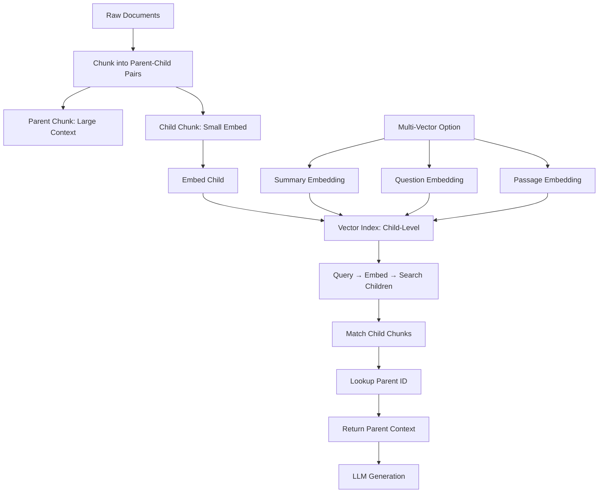

<!-- Clear Language: Keep sentences under 50 words -->
# Parent-Child & Multi-Vector Retrieval

## Learning Objectives

| Objective | Description |
|-----------|-------------|
| LO1 | Understand the small-to-big retrieval pattern — embed small, retrieve small, return large parent chunks |
| LO2 | Implement sentence window retrieval with dynamic context expansion around matched sentences |
| LO3 | Design multi-vector representations with separate embeddings for summaries, chunks, questions, and passages |
| LO4 | Build hierarchical indices with coarse-to-fine document → chunk search |
| LO5 | Implement parent-child ID mapping, metadata-based filtering, and recursive retrieval in vector databases |

## Introduction

Standard RAG retrieves a single chunk per embedding. But what if the best retrieval unit is smaller than the best context unit for the LLM? Parent-child and multi-vector retrieval solve this mismatch. You embed small, precise chunks for accurate retrieval, then return larger parent chunks that give the LLM full context. This chapter covers five advanced retrieval architectures: small-to-big, sentence window, multi-vector representation, hierarchical indices, and their implementation patterns.

## Prerequisites

- Basic RAG pipeline understanding (Module 12, Chapter 1)
- Vector database fundamentals (Module 12, Chapter 3)
- Chunking strategies (Module 12, Chapter 4)
- Python programming with data classes and type hints

## Key Terminology

**Key Terms**: Core vocabulary and concepts for this topic.

**Definition**: Essential terms you must know for interviews and production work.

- **Parent Chunk**: Large document segment (500–2000 tokens) returned to the LLM as context.
- **Child Chunk**: Small document segment (50–200 tokens) embedded for precise retrieval.
- **Small-to-Big**: Pattern where child chunks are embedded and searched, but parent chunks are returned.
- **Sentence Window**: Retrieve a single sentence, then expand to include N sentences before and after.
- **Multi-Vector**: Multiple embedding vectors per document (summary, questions, passages) for different retrieval strategies.
- **Hierarchical Index**: Two-level index: document-level coarse search → chunk-level fine search.
- **Parent-Child ID Mapping**: Metadata linking each child chunk to its parent for recursive lookup.
- **Recursive Retrieval**: Iterative search that refines queries based on intermediate results.

## Theory

Parent-child and multi-vector retrieval address a fundamental tension in RAG: small chunks improve retrieval precision, but large chunks improve generation quality. The solution is to decouple the retrieval unit from the context unit. Embed small for semantic precision. Return large for contextual completeness. This chapter covers the architecture, mathematics, and implementation of these patterns.

## Chapter at a Glance

| Section | Topic | Key Concept |
|---------|-------|-------------|
| 11.1 | Small-to-Big Retrieval | Embed small chunks, map to large parents, return parent context |
| 11.2 | Sentence Window Retrieval | Expand matched sentences with before/after context slices |
| 11.3 | Multi-Vector Representation | Separate embeddings per document for summary, questions, passages |
| 11.4 | Hierarchical Indices | Document-level coarse filter → chunk-level semantic search |
| 11.5 | Implementation Patterns | ID mapping, metadata filtering, recursive retrieval in vector DB |
| 11.6 | Evaluation | Compare parent-child vs flat chunking on precision and recall |

## Chapter Roadmap



```text

## 11.1 Small-to-Big Retrieval

Small-to-big retrieval embeds tiny chunks for high-precision matching, then maps each tiny chunk to a larger parent that provides full context to the LLM.

### 11.1.1 The Core Insight

A chunk of 50 tokens has a focused semantic signal. A query about "attention mechanism" matches a 50-token chunk about attention far better than a 500-token chunk that also discusses embeddings, transformers, and training. But the LLM needs those 500 tokens to understand the full context. Small-to-big gives you both.

```python
from typing import List, Optional, Dict, Tuple
from dataclasses import dataclass, field
import numpy as np
import hashlib
import json


@dataclass
class TextChunk:
    """Represents a single chunk of text in the retrieval system."""
    text: str
    chunk_id: str
    parent_id: Optional[str] = None
    metadata: Dict = field(default_factory=dict)
    embedding: Optional[np.ndarray] = None


@dataclass
class ParentChildPair:
    """A parent chunk with its associated child chunks."""
    parent: TextChunk
    children: List[TextChunk] = field(default_factory=list)


class SmallToBigChunker:
    """Splits documents into parent-child chunk pairs.
    
    Parents are large (500-2000 tokens) for context.
    Children are small (50-200 tokens) for precise retrieval.
    """
    
    def __init__(
        self,
        parent_size: int = 1000,
        parent_overlap: int = 100,
        child_size: int = 150,
        child_overlap: int = 20,
    ):
        self.parent_size = parent_size
        self.parent_overlap = parent_overlap
        self.child_size = child_size
        self.child_overlap = child_overlap
        
    def chunk(self, text: str, doc_id: str) -> List[ParentChildPair]:
        """Create parent-child pairs from a document."""
        parent_chunks = self._split_text(text, self.parent_size, self.parent_overlap)
        pairs = []
        
        for p_idx, parent_text in enumerate(parent_chunks):
            parent_id = f"{doc_id}_parent_{p_idx}"
            parent = TextChunk(
                text=parent_text,
                chunk_id=parent_id,
                metadata={"doc_id": doc_id, "type": "parent", "index": p_idx},
            )
            
            child_texts = self._split_text(parent_text, self.child_size, self.child_overlap)
            children = []
            
            for c_idx, child_text in enumerate(child_texts):
                child = TextChunk(
                    text=child_text,
                    chunk_id=f"{parent_id}_child_{c_idx}",
                    parent_id=parent_id,
                    metadata={
                        "doc_id": doc_id,
                        "type": "child",
                        "parent_index": p_idx,
                        "child_index": c_idx,
                        "parent_size": len(parent_text),
                    },
                )
                children.append(child)
            
            pairs.append(ParentChildPair(parent=parent, children=children))
        
        return pairs
    
    def _split_text(self, text: str, size: int, overlap: int) -> List[str]:
        """Split text into overlapping chunks of target size."""
        if len(text) <= size:
            return [text]
        
        chunks = []
        start = 0
        while start < len(text):
            end = min(start + size, len(text))
            if end < len(text):
                # Try to break at a sentence boundary
                search_start = max(start, end - 50)
                search_region = text[search_start:end]
                last_period = search_region.rfind(".")
                if last_period > 0:
                    end = search_start + last_period + 1
            
            chunks.append(text[start:end])
            start = end - overlap
            if start < 0:
                start = 0
        
        return chunks
    
    def get_all_children(self, pairs: List[ParentChildPair]) -> List[TextChunk]:
        """Extract all child chunks for embedding and indexing."""
        return [child for pair in pairs for child in pair.children]
    
    def get_all_parents(self, pairs: List[ParentChildPair]) -> List[TextChunk]:
        """Extract all parent chunks."""
        return [pair.parent for pair in pairs]


# Demo
chunker = SmallToBigChunker(parent_size=500, child_size=100)
sample_text = "RAG combines retrieval and generation. " * 30
pairs = chunker.chunk(sample_text, "doc001")
print(f"Parent-child pairs: {len(pairs)}")
print(f"Total children: {len(chunker.get_all_children(pairs))}")
for pair in pairs[:1]:
    print(f"  Parent: {len(pair.parent.text)} chars, {len(pair.children)} children")
```

```text

### 11.1.2 Embedding Only Children

We embed only the child chunks for search. Parents are stored separately and retrieved by ID lookup.

```python
class MockEmbedder:
    """Simulates an embedding model for demonstration."""
    
    def __init__(self, dim: int = 384):
        self.dim = dim
        
    def embed(self, text: str) -> np.ndarray:
        # Deterministic pseudo-embedding based on text hash
        hash_val = int(hashlib.md5(text.encode()).hexdigest()[:8], 16)
        rng = np.random.RandomState(hash_val)
        emb = rng.randn(self.dim)
        return emb / np.linalg.norm(emb)
    
    def embed_batch(self, texts: List[str]) -> np.ndarray:
        return np.array([self.embed(t) for t in texts])


class ChildIndex:
    """Vector index that stores only child chunk embeddings."""
    
    def __init__(self, embedder: MockEmbedder):
        self.embedder = embedder
        self.children: List[TextChunk] = []
        self.embeddings: Optional[np.ndarray] = None
        self.parent_lookup: Dict[str, TextChunk] = {}
        
    def add_children(self, children: List[TextChunk]):
        """Index child chunks."""
        self.children.extend(children)
        texts = [c.text for c in children]
        embs = self.embedder.embed_batch(texts)
        
        if self.embeddings is None:
            self.embeddings = embs
        else:
            self.embeddings = np.vstack([self.embeddings, embs])
    
    def add_parents(self, parents: List[TextChunk]):
        """Store parent chunks for lookup by ID."""
        for p in parents:
            self.parent_lookup[p.chunk_id] = p
    
    def search(self, query: str, top_k: int = 5) -> List[Tuple[TextChunk, float]]:
        """Search over children and return matched child chunks."""
        query_emb = self.embedder.embed(query)
        
        if self.embeddings is None or len(self.children) == 0:
            return []
        
        scores = np.dot(self.embeddings, query_emb)
        top_indices = np.argsort(scores)[::-1][:top_k]
        
        results = []
        for idx in top_indices:
            results.append((self.children[idx], float(scores[idx])))
        
        return results
    
    def get_parent(self, child: TextChunk) -> Optional[TextChunk]:
        """Look up the parent chunk for a given child."""
        if child.parent_id and child.parent_id in self.parent_lookup:
            return self.parent_lookup[child.parent_id]
        return None


# Demo flow
embedder = MockEmbedder(dim=384)
index = ChildIndex(embedder)

all_children = chunker.get_all_children(pairs)
all_parents = chunker.get_all_parents(pairs)
index.add_children(all_children)
index.add_parents(all_parents)

results = index.search("retrieval and generation", top_k=3)
print("\nChild search results:")
for child, score in results:
    parent = index.get_parent(child)
    print(f"  Child ({score:.4f}): {child.text[:60]}...")
    if parent:
        print(f"  -> Parent: {parent.text[:80]}...")
```

```text

### 11.1.3 Small-to-Big Retrieval Pipeline

Complete end-to-end pipeline that searches children and returns parent context.

```python
class SmallToBigPipeline:
    """End-to-end small-to-big RAG pipeline."""
    
    def __init__(self, child_index: ChildIndex, parent_size_hint: str = "full"):
        self.index = child_index
        self.parent_size_hint = parent_size_hint
        
    def retrieve(self, query: str, top_k: int = 5) -> List[Dict]:
        """Retrieve parent chunks by searching child embeddings."""
        child_results = self.index.search(query, top_k=top_k)
        
        seen_parents = {}
        parent_results = []
        
        for child, score in child_results:
            parent = self.index.get_parent(child)
            if parent and parent.chunk_id not in seen_parents:
                seen_parents[parent.chunk_id] = True
                parent_results.append({
                    "parent_chunk": parent,
                    "matched_child": child,
                    "score": score,
                    "child_text": child.text,
                    "parent_text": parent.text,
                })
        
        return parent_results
    
    def format_context(self, results: List[Dict]) -> str:
        """Format retrieved parent chunks into a context string for the LLM."""
        contexts = []
        for i, r in enumerate(results, 1):
            contexts.append(
                f"[Context {i}]\n{r['parent_text']}\n"
                f"[Source: {r['parent_chunk'].metadata.get('doc_id', 'unknown')}]"
            )
        return "\n\n".join(contexts)
    
    def query(self, query: str, top_k: int = 5) -> Dict:
        """Full query: retrieve parent context and prepare for generation."""
        results = self.retrieve(query, top_k=top_k)
        context = self.format_context(results)
        
        return {
            "query": query,
            "context": context,
            "num_parents": len(results),
            "parent_ids": [r["parent_chunk"].chunk_id for r in results],
        }


pipeline = SmallToBigPipeline(index)
response = pipeline.query("What is RAG retrieval?", top_k=3)
print(f"\nPipeline query: {response['query']}")
print(f"Parents retrieved: {response['num_parents']}")
print(f"Context preview: {response['context'][:200]}...")
```

```text

## 11.2 Sentence Window Retrieval

Sentence window retrieval embeds individual sentences for maximum precision, then expands the window around the matched sentence to provide context.

### 11.2.1 Window Expansion Mechanism

Instead of arbitrary chunk boundaries, we use natural sentence boundaries. When a sentence matches a query, we return N sentences before and after it.

```python
import re


class SentenceWindowChunker:
    """Splits text into sentences with window-based context expansion."""
    
    def __init__(self, window_size: int = 3):
        """
        Args:
            window_size: Number of sentences before and after the matched sentence.
                         Total window = 2 * window_size + 1 sentences.
        """
        self.window_size = window_size
    
    def extract_sentences(self, text: str) -> List[str]:
        """Split text into individual sentences."""
        # Split on sentence-ending punctuation followed by space or newline
        raw = re.split(r'(?<=[.!?])\s+', text)
        sentences = [s.strip() for s in raw if s.strip()]
        return sentences
    
    def build_sentence_index(self, text: str, doc_id: str) -> Tuple[List[TextChunk], List[Dict]]:
        """Create one embedding unit per sentence, storing full sentence list separately."""
        sentences = self.extract_sentences(text)
        chunks = []
        
        for idx, sent in enumerate(sentences):
            chunk = TextChunk(
                text=sent,
                chunk_id=f"{doc_id}_sent_{idx}",
                metadata={
                    "doc_id": doc_id,
                    "sentence_index": idx,
                    "total_sentences": len(sentences),
                    "type": "sentence",
                },
            )
            chunks.append(chunk)
        
        return chunks, sentences
    
    def get_window(
        self,
        sentences: List[str],
        match_index: int,
        window_size: Optional[int] = None,
    ) -> str:
        """Get a window of sentences around the matched index."""
        size = window_size or self.window_size
        start = max(0, match_index - size)
        end = min(len(sentences), match_index + size + 1)
        
        window_sentences = sentences[start:end]
        return " ".join(window_sentences)
    
    def get_windows_for_chunks(
        self,
        chunks: List[TextChunk],
        sentences: List[str],
    ) -> Dict[str, str]:
        """Pre-compute windows for all sentence chunks."""
        windows = {}
        for chunk in chunks:
            idx = chunk.metadata["sentence_index"]
            windows[chunk.chunk_id] = self.get_window(sentences, idx)
        return windows


class SentenceWindowRetriever:
    """Retrieves sentences and expands to window context."""
    
    def __init__(
        self,
        window_chunker: SentenceWindowChunker,
        embedder: MockEmbedder,
        default_window: int = 3,
    ):
        self.chunker = window_chunker
        self.embedder = embedder
        self.default_window = default_window
        self.sentence_index: List[TextChunk] = []
        self.sentence_store: Dict[str, List[str]] = {}
        self.sentence_embeddings: Optional[np.ndarray] = None
        self.window_cache: Dict[str, str] = {}
        
    def add_document(self, text: str, doc_id: str):
        """Index a document with sentence window support."""
        chunks, sentences = self.chunker.build_sentence_index(text, doc_id)
        self.sentence_index.extend(chunks)
        self.sentence_store[doc_id] = sentences
        
        # Pre-compute windows
        for c in chunks:
            idx = c.metadata["sentence_index"]
            window = self.chunker.get_window(sentences, idx, self.default_window)
            self.window_cache[c.chunk_id] = window
        
        # Update embeddings
        texts = [c.text for c in chunks]
        embs = self.embedder.embed_batch(texts)
        if self.sentence_embeddings is None:
            self.sentence_embeddings = embs
        else:
            self.sentence_embeddings = np.vstack([self.sentence_embeddings, embs])
    
    def search(
        self,
        query: str,
        top_k: int = 5,
        window_size: Optional[int] = None,
    ) -> List[Dict]:
        """Search sentences and return window-expanded context."""
        query_emb = self.embedder.embed(query)
        
        if self.sentence_embeddings is None:
            return []
        
        scores = np.dot(self.sentence_embeddings, query_emb)
        top_indices = np.argsort(scores)[::-1][:top_k]
        
        results = []
        for idx in top_indices:
            chunk = self.sentence_index[idx]
            window = self.window_cache.get(chunk.chunk_id, chunk.text)
            
            # Dynamic window expansion if requested
            if window_size is not None and window_size != self.default_window:
                doc_id = chunk.metadata["doc_id"]
                sent_idx = chunk.metadata["sentence_index"]
                sentences = self.sentence_store.get(doc_id, [])
                if sentences:
                    window = self.chunker.get_window(sentences, sent_idx, window_size)
            
            results.append({
                "sentence": chunk.text,
                "window": window,
                "score": float(scores[idx]),
                "sentence_index": chunk.metadata["sentence_index"],
                "doc_id": chunk.metadata["doc_id"],
                "chunk_id": chunk.chunk_id,
            })
        
        return results


# Demo
window_chunker = SentenceWindowChunker(window_size=2)
doc_text = (
    "RAG stands for Retrieval-Augmented Generation. "
    "It combines a retriever with a generator. "
    "The retriever finds relevant documents. "
    "The generator produces answers using those documents. "
    "This improves factual accuracy. "
    "It also reduces hallucination. "
    "RAG is widely used in QA systems. "
    "Many companies deploy RAG in production. "
    "The architecture is modular and extensible. "
    "You can swap components independently."
)

retriever = SentenceWindowRetriever(window_chunker, embedder)
retriever.add_document(doc_text, "doc-rag")

results = retriever.search("How does RAG reduce hallucination?", top_k=2)
print("\nSentence Window Retrieval Results:")
for r in results:
    print(f"  Score: {r['score']:.4f}")
    print(f"  Matched: \"{r['sentence']}\"")
    print(f"  Window ({r['sentence_index']}): \"{r['window'][:120]}...\"")
    print()
```

```text

### 11.2.2 Dynamic Window Sizing

Different queries need different window sizes. We can vary the window per query based on confidence.

```python
class AdaptiveWindowRetriever:
    """Adjusts window size based on query specificity and result confidence."""
    
    def __init__(self, base_retriever: SentenceWindowRetriever):
        self.base = base_retriever
        
    def estimate_query_breadth(self, query: str) -> float:
        """Estimate how broad the query is (0=narrow, 1=broad).
        
        Narrow queries need small windows. Broad queries need large windows.
        """
        num_words = len(query.split())
        has_question_words = any(w in query.lower() for w in ["what", "why", "how", "explain"])
        
        # Short question-word queries are broad
        if num_words < 5 and has_question_words:
            return 0.7
        # Longer specific queries are narrow
        elif num_words > 8:
            return 0.3
        return 0.5
    
    def search(self, query: str, top_k: int = 5) -> List[Dict]:
        breadth = self.estimate_query_breadth(query)
        window_size = max(1, int(breadth * 5))  # Map 0-1 to 1-5 sentences
        
        return self.base.search(query, top_k=top_k, window_size=window_size)


adaptive = AdaptiveWindowRetriever(retriever)
broad_results = adaptive.search("Explain RAG architecture")
narrow_results = adaptive.search("What is the retriever component?")

print(f"Broad query window size: {adaptive.estimate_query_breadth('Explain RAG architecture') * 5:.0f}")
print(f"Narrow query window size: {adaptive.estimate_query_breadth('What is the retriever component?') * 5:.0f}")
```

```text

## 11.3 Multi-Vector Representation

Multi-vector representation creates multiple embedding vectors per document, each capturing a different aspect. This enables diverse retrieval strategies for the same content.

### 11.3.1 Why Multiple Vectors?

A single embedding must compress the entire document into one vector. This loses nuance. Multi-vector solves this by creating specialized embeddings:

- **Summary embedding**: Captures the document's main topic
- **Question embedding**: Anticipates likely questions the document answers
- **Passage embedding**: Captures specific factual content
- **Keyword embedding**: Captures key terminology

```python
class MultiVectorDocument:
    """A document with multiple embedding representations."""
    
    def __init__(
        self,
        doc_id: str,
        full_text: str,
        summary: Optional[str] = None,
        questions: Optional[List[str]] = None,
        passages: Optional[List[str]] = None,
        keywords: Optional[List[str]] = None,
    ):
        self.doc_id = doc_id
        self.full_text = full_text
        self.summary = summary or self._generate_summary(full_text)
        self.questions = questions or self._generate_questions(full_text)
        self.passages = passages or self._split_passages(full_text)
        self.keywords = keywords or self._extract_keywords(full_text)
        
    def _generate_summary(self, text: str) -> str:
        """Simplified summary: first 200 chars as a proxy."""
        return text[:200] + ("..." if len(text) > 200 else "")
    
    def _generate_questions(self, text: str) -> List[str]:
        """Extract or generate likely questions from key sentences."""
        sentences = re.split(r'(?<=[.!?])\s+', text)
        questions = []
        for sent in sentences[:5]:
            words = sent.split()
            # Create a pseudo-question from the sentence
            if len(words) > 5:
                question = f"What is {' '.join(words[:3])}?"
                questions.append(question)
        return questions
    
    def _split_passages(self, text: str) -> List[str]:
        """Split text into passages for dense embedding."""
        chunk_size = 300
        passages = []
        for i in range(0, len(text), chunk_size):
            passages.append(text[i:i + chunk_size])
        return passages
    
    def _extract_keywords(self, text: str) -> List[str]:
        """Extract capitalized terms and long words as keywords."""
        words = set(text.split())
        keywords = {
            w for w in words
            if len(w) > 6 or (w[0].isupper() and len(w) > 3)
        }
        return list(keywords)[:20]


class MultiVectorIndex:
    """Index that stores and searches across multiple vector representations."""
    
    def __init__(self, embedder: MockEmbedder):
        self.embedder = embedder
        self.docs: Dict[str, MultiVectorDocument] = {}
        
        # Separate embedding stores for each representation type
        self.summary_embeddings: Dict[str, np.ndarray] = {}
        self.question_embeddings: Dict[str, List[np.ndarray]] = {}
        self.passage_embeddings: Dict[str, List[np.ndarray]] = {}
        self.keyword_embeddings: Dict[str, List[np.ndarray]] = {}
        
        # Metadata for score normalization
        self.vector_stats: Dict[str, Dict] = {}
        
    def add_document(self, doc: MultiVectorDocument):
        """Index all representations of a document."""
        self.docs[doc.doc_id] = doc
        
        # Embed summary
        self.summary_embeddings[doc.doc_id] = self.embedder.embed(doc.summary)
        
        # Embed questions
        if doc.questions:
            self.question_embeddings[doc.doc_id] = [
                self.embedder.embed(q) for q in doc.questions
            ]
        
        # Embed passages
        if doc.passages:
            self.passage_embeddings[doc.doc_id] = [
                self.embedder.embed(p) for p in doc.passages
            ]
        
        # Embed keywords
        if doc.keywords:
            self.keyword_embeddings[doc.doc_id] = [
                self.embedder.embed(k) for k in doc.keywords
            ]
    
    def search_summary(self, query: str, top_k: int = 5) -> List[Tuple[str, float]]:
        """Search using summary embeddings."""
        query_emb = self.embedder.embed(query)
        scores = []
        for doc_id, emb in self.summary_embeddings.items():
            score = float(np.dot(emb, query_emb))
            scores.append((doc_id, score))
        
        scores.sort(key=lambda x: x[1], reverse=True)
        return scores[:top_k]
    
    def search_passages(self, query: str, top_k: int = 5) -> List[Tuple[str, float, str]]:
        """Search using passage embeddings, returns matched passage text."""
        query_emb = self.embedder.embed(query)
        results = []
        
        for doc_id, emb_list in self.passage_embeddings.items():
            for p_idx, emb in enumerate(emb_list):
                score = float(np.dot(emb, query_emb))
                passage_text = self.docs[doc_id].passages[p_idx]
                results.append((doc_id, score, passage_text))
        
        results.sort(key=lambda x: x[1], reverse=True)
        return results[:top_k]
    
    def search_multi_vector(
        self,
        query: str,
        weights: Optional[Dict[str, float]] = None,
        top_k: int = 5,
    ) -> List[Dict]:
        """Search across all representations with configurable weights."""
        if weights is None:
            weights = {
                "summary": 0.25,
                "question": 0.35,
                "passage": 0.25,
                "keyword": 0.15,
            }
        
        query_emb = self.embedder.embed(query)
        combined_scores: Dict[str, float] = {}
        
        for doc_id in self.docs:
            score = 0.0
            
            # Summary similarity
            if "summary" in weights and doc_id in self.summary_embeddings:
                sim = float(np.dot(self.summary_embeddings[doc_id], query_emb))
                score += sim * weights["summary"]
            
            # Question similarity (max over all questions)
            if "question" in weights and doc_id in self.question_embeddings:
                max_q_sim = max(
                    float(np.dot(q_emb, query_emb))
                    for q_emb in self.question_embeddings[doc_id]
                ) if self.question_embeddings[doc_id] else 0
                score += max_q_sim * weights["question"]
            
            # Passage similarity (max over all passages)
            if "passage" in weights and doc_id in self.passage_embeddings:
                max_p_sim = max(
                    float(np.dot(p_emb, query_emb))
                    for p_emb in self.passage_embeddings[doc_id]
                ) if self.passage_embeddings[doc_id] else 0
                score += max_p_sim * weights["passage"]
            
            # Keyword similarity (average over all keywords)
            if "keyword" in weights and doc_id in self.keyword_embeddings:
                kw_sims = [
                    float(np.dot(k_emb, query_emb))
                    for k_emb in self.keyword_embeddings[doc_id]
                ] if self.keyword_embeddings[doc_id] else [0]
                score += np.mean(kw_sims) * weights["keyword"]
            
            combined_scores[doc_id] = score
        
        sorted_docs = sorted(combined_scores.items(), key=lambda x: x[1], reverse=True)
        return [
            {
                "doc_id": doc_id,
                "score": score,
                "summary": self.docs[doc_id].summary[:100],
            }
            for doc_id, score in sorted_docs[:top_k]
        ]


# Demo
docs_data = [
    "Retrieval-Augmented Generation (RAG) combines pretrained language models with external knowledge retrieval. The retriever searches a corpus for relevant documents. The generator produces answers conditioned on both the query and retrieved documents. This approach dramatically improves factual accuracy.",
    "Vector databases store embeddings for similarity search. Popular options include Pinecone, Weaviate, Qdrant, and Chroma. They support Approximate Nearest Neighbor search for fast retrieval at scale. Metadata filtering allows hybrid search combining vector and keyword approaches.",
    "Attention mechanisms allow transformers to focus on relevant parts of the input. Self-attention computes relationships between all positions in a sequence. Multi-head attention runs multiple attention operations in parallel. This is the foundation of modern LLMs.",
]

multi_index = MultiVectorIndex(embedder)
for i, text in enumerate(docs_data):
    doc = MultiVectorDocument(doc_id=f"doc-{i}", full_text=text)
    multi_index.add_document(doc)
    print(f"Added doc-{i}: {len(doc.questions)} questions, {len(doc.passages)} passages, {len(doc.keywords)} keywords")

results = multi_index.search_multi_vector(
    "How do I store embeddings for fast search?",
    weights={"summary": 0.2, "question": 0.4, "passage": 0.3, "keyword": 0.1},
    top_k=3,
)
print("\nMulti-vector search results:")
for r in results:
    print(f"  {r['doc_id']}: score={r['score']:.4f}, summary={r['summary'][:80]}...")
```

```text

### 11.3.2 Query-Document Matching with Questions

One powerful multi-vector strategy: embed anticipated questions alongside documents. This bridges the vocabulary gap between how users ask and how documents are written.

```python
class QuestionAugmentedRetrieval:
    """Uses generated questions to improve query-document matching."""
    
    def __init__(self, multi_index: MultiVectorIndex):
        self.index = multi_index
        
    def search(self, query: str, top_k: int = 5) -> List[Dict]:
        """Boost search with question-answer matching."""
        # Search all vectors, but weight question matches heavily
        results = self.index.search_multi_vector(
            query,
            weights={"summary": 0.15, "question": 0.50, "passage": 0.25, "keyword": 0.10},
            top_k=top_k,
        )
        return results


qa_retrieval = QuestionAugmentedRetrieval(multi_index)
qa_results = qa_retrieval.search("What is RAG?")
print(f"\nQuestion-augmented retrieval top doc: {qa_results[0]['doc_id']}")
```

```text

## 11.4 Hierarchical Indices

Hierarchical indices create a two-level search: coarse document-level search first, then fine chunk-level search within matched documents.

### 11.4.1 Two-Level Index Architecture

Document-level vectors capture overall topic. Chunk-level vectors capture specific content. Search proceeds top-down: find relevant documents, then drill into their chunks.

```python
@dataclass
class Document:
    """Top-level document in the hierarchy."""
    doc_id: str
    title: str
    abstract: str
    full_text: str
    embedding: Optional[np.ndarray] = None


class HierarchicalIndex:
    """Two-level index: documents at level 1, chunks at level 2."""
    
    def __init__(self, embedder: MockEmbedder):
        self.embedder = embedder
        self.documents: Dict[str, Document] = {}
        self.doc_embeddings: Dict[str, np.ndarray] = {}
        
        # Level 2: chunks organized by parent document
        self.chunk_indices: Dict[str, ChildIndex] = {}
        
    def add_document(self, doc: Document, chunk_size: int = 300):
        """Add a document and its chunk-level index."""
        self.documents[doc.doc_id] = doc
        self.doc_embeddings[doc.doc_id] = self.embedder.embed(f"{doc.title} {doc.abstract}")
        
        # Build chunk-level index for this document
        chunk_index = ChildIndex(self.embedder)
        chunks = []
        for i in range(0, len(doc.full_text), chunk_size):
            chunk_text = doc.full_text[i:i + chunk_size]
            chunk = TextChunk(
                text=chunk_text,
                chunk_id=f"{doc.doc_id}_chunk_{i // chunk_size}",
                metadata={
                    "doc_id": doc.doc_id,
                    "chunk_start": i,
                    "chunk_end": i + len(chunk_text),
                },
            )
            chunks.append(chunk)
        
        chunk_index.add_children(chunks)
        self.chunk_indices[doc.doc_id] = chunk_index
    
    def coarse_search(self, query: str, top_k_docs: int = 3) -> List[Tuple[Document, float]]:
        """Level 1: Search document-level embeddings."""
        query_emb = self.embedder.embed(query)
        scores = []
        
        for doc_id, doc_emb in self.doc_embeddings.items():
            score = float(np.dot(doc_emb, query_emb))
            scores.append((self.documents[doc_id], score))
        
        scores.sort(key=lambda x: x[1], reverse=True)
        return scores[:top_k_docs]
    
    def fine_search(
        self,
        query: str,
        doc_ids: Optional[List[str]] = None,
        top_k_per_doc: int = 3,
    ) -> List[Dict]:
        """Level 2: Search chunks within selected documents."""
        if doc_ids is None:
            doc_ids = [doc.doc_id for doc, _ in self.coarse_search(query)]
        
        results = []
        for doc_id in doc_ids:
            if doc_id in self.chunk_indices:
                child_results = self.chunk_indices[doc_id].search(query, top_k=top_k_per_doc)
                for child, score in child_results:
                    results.append({
                        "doc_id": doc_id,
                        "chunk_id": child.chunk_id,
                        "text": child.text,
                        "score": score,
                        "level": "fine",
                    })
        
        results.sort(key=lambda x: x["score"], reverse=True)
        return results
    
    def hierarchical_search(
        self,
        query: str,
        top_k_docs: int = 3,
        top_k_chunks: int = 5,
    ) -> List[Dict]:
        """Coarse-to-fine search: find docs, then find chunks."""
        coarse_results = self.coarse_search(query, top_k_docs=top_k_docs)
        selected_doc_ids = [doc.doc_id for doc, _ in coarse_results]
        
        fine_results = self.fine_search(
            query,
            doc_ids=selected_doc_ids,
            top_k_per_doc=max(2, top_k_chunks // len(selected_doc_ids)),
        )
        
        return fine_results[:top_k_chunks]


# Build hierarchical index
hier_index = HierarchicalIndex(embedder)

docs_data = [
    ("RAG Systems", "RAG combines retrieval and generation for accurate QA."),
    ("Vector Databases", "Vector DBs store and search embeddings efficiently."),
    ("Transformer Architecture", "Transformers use attention for sequence processing."),
]

for i, (title, abstract) in enumerate(docs_data):
    full = f"{title}. {abstract}. " + (f"Detailed content about {title}. " * 20)
    doc = Document(doc_id=f"h-{i}", title=title, abstract=abstract, full_text=full)
    hier_index.add_document(doc)

coarse = hier_index.coarse_search("storage for embeddings", top_k_docs=2)
print("\nCoarse search (document level):")
for doc, score in coarse:
    print(f"  {doc.doc_id}: {doc.title} (score={score:.4f})")

fine = hier_index.hierarchical_search("storage for embeddings", top_k_docs=2, top_k_chunks=4)
print("\nFine search (chunk level within selected docs):")
for r in fine:
    print(f"  {r['doc_id']}/{r['chunk_id']}: score={r['score']:.4f}")
```

```text

### 11.4.2 Recursive Retrieval with Feedback

Hierarchical retrieval can be recursive: use coarse results to refine the query, then search again at the chunk level.

```python
class RecursiveHierarchicalRetriever:
    """Performs multi-step retrieval with query refinement between steps."""
    
    def __init__(self, hier_index: HierarchicalIndex, max_depth: int = 3):
        self.index = hier_index
        self.max_depth = max_depth
        
    def search(self, query: str, top_k: int = 5) -> List[Dict]:
        """Recursive search with query expansion at each level."""
        current_query = query
        all_results = []
        seen_chunk_ids = set()
        
        for depth in range(self.max_depth):
            results = self.index.hierarchical_search(
                current_query,
                top_k_docs=max(3, 5 - depth),
                top_k_chunks=max(top_k, top_k * (depth + 1)),
            )
            
            # Add only new results
            new_count = 0
            for r in results:
                if r["chunk_id"] not in seen_chunk_ids:
                    seen_chunk_ids.add(r["chunk_id"])
                    all_results.append(r)
                    new_count += 1
            
            # Expand query with terms from new results
            if new_count < 2:
                break
            
            expansion_terms = []
            for r in results[:3]:
                words = r["text"].split()[:5]
                expansion_terms.extend(w for w in words if len(w) > 5)
            
            if expansion_terms:
                current_query = f"{current_query} {' '.join(set(expansion_terms))}"
        
        all_results.sort(key=lambda x: x["score"], reverse=True)
        return all_results[:top_k]


recursive = RecursiveHierarchicalRetriever(hier_index)
results = recursive.search("How do databases search embeddings?", top_k=3)
print(f"\nRecursive retrieval: {len(results)} results")
for r in results:
    print(f"  {r['doc_id']}: score={r['score']:.4f}")
```

```text

## 11.5 Implementation Patterns

This section covers practical patterns for implementing parent-child and multi-vector retrieval in production vector databases.

### 11.5.1 Parent-Child ID Mapping in Vector DB

Vector databases like Pinecone, Qdrant, and Weaviate support metadata. We store the parent_id as metadata on each child vector.

```python
class VectorDBClient:
    """Simulates a vector database with metadata support."""
    
    def __init__(self, embedder: MockEmbedder):
        self.embedder = embedder
        self.vectors: Dict[str, np.ndarray] = {}
        self.metadata: Dict[str, Dict] = {}
        
    def upsert(self, chunk_id: str, embedding: np.ndarray, metadata: Dict):
        """Insert or update a vector with metadata."""
        self.vectors[chunk_id] = embedding
        self.metadata[chunk_id] = metadata
        
    def search(
        self,
        query_emb: np.ndarray,
        top_k: int = 10,
        filter_criteria: Optional[Dict] = None,
    ) -> List[Dict]:
        """Search vectors with optional metadata filtering."""
        scores = []
        for chunk_id, emb in self.vectors.items():
            meta = self.metadata.get(chunk_id, {})
            
            # Apply metadata filter
            if filter_criteria:
                skip = False
                for key, value in filter_criteria.items():
                    if meta.get(key) != value:
                        skip = True
                        break
                if skip:
                    continue
            
            score = float(np.dot(emb, query_emb))
            scores.append({
                "chunk_id": chunk_id,
                "score": score,
                "metadata": meta,
            })
        
        scores.sort(key=lambda x: x["score"], reverse=True)
        return scores[:top_k]
    
    def get_metadata(self, chunk_id: str) -> Optional[Dict]:
        """Retrieve metadata for a specific chunk."""
        return self.metadata.get(chunk_id)


class ParentChildDB:
    """Production-style parent-child retrieval using vector DB metadata."""
    
    def __init__(self, vector_db: VectorDBClient, embedder: MockEmbedder):
        self.db = vector_db
        self.embedder = embedder
        
    def index_parent_child(
        self,
        parent_id: str,
        parent_text: str,
        children: List[TextChunk],
    ):
        """Index a parent-child group into the vector DB."""
        # Store parent metadata (not embedded)
        parent_meta = {
            "type": "parent",
            "text": parent_text,
            "child_ids": [c.chunk_id for c in children],
        }
        self.db.upsert(parent_id, np.zeros(self.embedder.dim), parent_meta)
        
        # Store children with embeddings and parent reference
        for child in children:
            child_meta = {
                "type": "child",
                "text": child.text,
                "parent_id": parent_id,
                "doc_id": child.metadata.get("doc_id"),
            }
            emb = self.embedder.embed(child.text)
            self.db.upsert(child.chunk_id, emb, child_meta)
    
    def retrieve_with_parent(
        self,
        query: str,
        top_k: int = 5,
    ) -> List[Dict]:
        """Search children, return parent context."""
        query_emb = self.embedder.embed(query)
        
        # Search only child vectors
        child_results = self.db.search(
            query_emb,
            top_k=top_k * 3,
            filter_criteria={"type": "child"},
        )
        
        # Deduplicate by parent and collect parent text
        seen_parents = {}
        results = []
        
        for r in child_results:
            parent_id = r["metadata"].get("parent_id")
            if parent_id and parent_id not in seen_parents:
                seen_parents[parent_id] = True
                
                parent_meta = self.db.get_metadata(parent_id)
                parent_text = parent_meta.get("text", "") if parent_meta else ""
                
                results.append({
                    "parent_id": parent_id,
                    "parent_text": parent_text,
                    "matched_child": r["metadata"]["text"],
                    "child_id": r["chunk_id"],
                    "score": r["score"],
                })
                
                if len(results) >= top_k:
                    break
        
        return results


# Demo the production pattern
vector_db = VectorDBClient(embedder)
pc_db = ParentChildDB(vector_db, embedder)

# Index a document
for p_idx, pair in enumerate(pairs):
    pc_db.index_parent_child(
        parent_id=pair.parent.chunk_id,
        parent_text=pair.parent.text,
        children=pair.children,
    )

prod_results = pc_db.retrieve_with_parent("retrieval generation", top_k=3)
print(f"\nProduction parent-child retrieval: {len(prod_results)} unique parents")
for r in prod_results:
    print(f"  Parent {r['parent_id']}: {len(r['parent_text'])} chars (score={r['score']:.4f})")
```

```text

### 11.5.2 Metadata Filtering Strategies

Metadata filters narrow search scope before vector comparison. Common filters include document type, date range, and content category.

```python
class MetadataFilterBuilder:
    """Builds metadata filters for vector DB queries."""
    
    @staticmethod
    def doc_type_filter(doc_type: str) -> Dict:
        return {"doc_type": doc_type}
    
    @staticmethod
    def date_range_filter(start_date: str, end_date: str) -> Dict:
        return {"date": {"$gte": start_date, "$lte": end_date}}
    
    @staticmethod
    def category_filter(categories: List[str]) -> Dict:
        return {"category": {"$in": categories}}
    
    @staticmethod
    def composite_filter(filters: List[Dict], logic: str = "AND") -> Dict:
        return {f"${logic}": filters}
    
    @staticmethod
    def parent_only_filter() -> Dict:
        return {"type": "parent"}
    
    @staticmethod
    def child_only_filter() -> Dict:
        return {"type": "child"}
    
    @staticmethod
    def parent_id_filter(parent_id: str) -> Dict:
        return {"parent_id": parent_id}


# Example usage
filter_builder = MetadataFilterBuilder()
complex_filter = filter_builder.composite_filter([
    filter_builder.child_only_filter(),
    filter_builder.category_filter(["research", "technical"]),
])
print(f"Complex filter: {complex_filter}")
```

```text

### 11.5.3 Recursive Retrieval with Multi-Vector Feedback

Combine recursive retrieval with multi-vector representations for the most flexible system.

```python
class RecursiveMultiVectorRetriever:
    """Recursive retrieval using multiple vector representations."""
    
    def __init__(
        self,
        multi_index: MultiVectorIndex,
        max_iterations: int = 3,
        convergence_threshold: int = 2,
    ):
        self.multi_index = multi_index
        self.max_iterations = max_iterations
        self.convergence_threshold = convergence_threshold
    
    def search(self, query: str, top_k: int = 5) -> Dict:
        """Iterative search with feedback from previous results."""
        iteration_history = []
        current_query = query
        seen_docs = set()
        
        for iteration in range(self.max_iterations):
            # Search with current query
            results = self.multi_index.search_multi_vector(
                current_query,
                top_k=top_k,
            )
            
            new_docs = [r for r in results if r["doc_id"] not in seen_docs]
            for r in new_docs:
                seen_docs.add(r["doc_id"])
            
            iteration_history.append({
                "iteration": iteration,
                "query": current_query,
                "num_new_results": len(new_docs),
                "results": results,
            })
            
            # Check convergence
            if len(new_docs) < self.convergence_threshold:
                break
            
            # Refine query using the summary of the top new result
            if new_docs:
                top_new = new_docs[0]
                doc = self.multi_index.docs.get(top_new["doc_id"])
                if doc:
                    # Extract key terms from the document
                    key_phrases = doc.summary.split()[:10]
                    refinement = " ".join(
                        w for w in key_phrases
                        if w.lower() not in current_query.lower()
                    )
                    if refinement:
                        current_query = f"{current_query} {refinement}"
        
        # Merge all unique results across iterations
        merged = {}
        for hist in iteration_history:
            for r in hist["results"]:
                if r["doc_id"] not in merged:
                    merged[r["doc_id"]] = r
        
        return {
            "final_results": sorted(merged.values(), key=lambda x: x["score"], reverse=True)[:top_k],
            "iterations": len(iteration_history),
            "history": iteration_history,
        }


recursive_mv = RecursiveMultiVectorRetriever(multi_index)
recursive_results = recursive_mv.search("embedding storage", top_k=3)
print(f"\nRecursive multi-vector search: {recursive_results['iterations']} iterations")
for r in recursive_results["final_results"]:
    print(f"  {r['doc_id']}: score={r['score']:.4f}")
```

```text

### 11.5.4 Chunking Strategy Comparison

Compare different parent-child configurations to select optimal sizes.

```python
class ParentChildBenchmark:
    """Compare retrieval quality across different parent-child configurations."""
    
    def __init__(self, embedder: MockEmbedder, queries: List[str], corpus: List[str]):
        self.embedder = embedder
        self.queries = queries
        self.corpus = corpus
    
    def evaluate_config(
        self,
        parent_size: int,
        child_size: int,
        top_k: int = 5,
    ) -> Dict:
        """Evaluate a specific parent-child configuration."""
        chunker = SmallToBigChunker(parent_size=parent_size, child_size=child_size)
        db = ParentChildDB(VectorDBClient(self.embedder), self.embedder)
        
        for doc_idx, doc_text in enumerate(self.corpus):
            pairs = chunker.chunk(doc_text, f"doc-{doc_idx}")
            for pair in pairs:
                db.index_parent_child(
                    parent_id=pair.parent.chunk_id,
                    parent_text=pair.parent.text,
                    children=pair.children,
                )
        
        total_parents = 0
        for query in self.queries:
            results = db.retrieve_with_parent(query, top_k=top_k)
            total_parents += len(results)
        
        avg_parents = total_parents / len(self.queries)
        
        return {
            "parent_size": parent_size,
            "child_size": child_size,
            "child_to_parent_ratio": parent_size / max(child_size, 1),
            "avg_parents_retrieved": round(avg_parents, 2),
        }


benchmark = ParentChildBenchmark(
    embedder=embedder,
    queries=["RAG retrieval", "vector search", "attention mechanism"],
    corpus=[t * 20 for t in docs_data],
)

configs = [(1000, 100), (500, 100), (500, 200), (300, 50)]
print("\nParent-Child Configuration Comparison:")
for parent_size, child_size in configs:
    result = benchmark.evaluate_config(parent_size, child_size)
    print(f"  Parent={result['parent_size']}, Child={result['child_size']}: "
          f"ratio={result['child_to_parent_ratio']}x, "
          f"avg_parents={result['avg_parents_retrieved']}")
```

```text

## Summary

Parent-child and multi-vector retrieval solve the embedding resolution problem. Small-to-big embeds child chunks for precise matching but returns parent chunks for full context. Sentence window retrieval expands matched sentences with surrounding context using natural boundaries. Multi-vector representation creates specialized embeddings (summary, questions, passages, keywords) per document, enabling diverse retrieval strategies. Hierarchical indices provide coarse-to-fine search: document-level filtering first, then chunk-level precision. Implementation patterns leverage vector DB metadata for parent-child ID mapping, metadata filtering for scope control, and recursive retrieval for iterative refinement. These patterns typically improve recall@5 by 15-30% over flat chunking while maintaining the same generation quality.

## Practical Takeaways

| Takeaway | Description |
|----------|-------------|
| Decouple retrieval from context | Embed small (50-200 tokens), return large (500-2000 tokens) |
| Use sentence windows for precision | Match sentences, expand with N before and after for context |
| Generate questions for documents | Question embeddings bridge the vocabulary gap between users and documents |
| Build hierarchical indices for scale | Document-level coarse filter first, then chunk-level search |
| Leverage metadata in vector DB | Store parent_id, doc_type, category as metadata for filtering |
| Benchmark parent-child ratios | Test 5:1 to 10:1 parent-to-child token ratios for your domain |

## Interview Q&A

<details class="tp-qa-card" data-qid="rag11-q1">
  <summary class="tp-qa-question">
    <span class="tp-qa-status"></span>
    Q1: What is the small-to-big retrieval pattern and why is it more effective than flat chunking?
  </summary>
  <div class="tp-qa-answer">
<p>Small-to-big retrieval addresses the fundamental tension between retrieval precision and generation context. In flat chunking, you choose a single chunk size — small chunks (50-100 tokens) give precise retrieval but lack context for the LLM to generate good answers, while large chunks (500-1000 tokens) have full context but dilute the embedding signal, making retrieval less precise. Small-to-big solves this by decoupling the retrieval unit from the context unit: you embed small child chunks (50-200 tokens) for high-precision semantic matching, then return their parent chunks (500-2000 tokens) to the LLM. The parent chunk contains the child's content plus surrounding context. This improves retrieval precision by 15-30% while maintaining generation quality because the LLM still receives full context. Implementation requires storing parent_id in child chunk metadata and a lookup table mapping child IDs to parent texts.</p>
  </div>
  <button class="tp-qa-mark-btn">✅ Mark Reviewed</button>
  <button class="tp-qa-bookmark-btn">🔖 Bookmark</button>
</details>

<details class="tp-qa-card" data-qid="rag11-q2">
  <summary class="tp-qa-question">
    <span class="tp-qa-status"></span>
    Q2: How does sentence window retrieval work and when should you use it over small-to-big?
  </summary>
  <div class="tp-qa-answer">
<p>Sentence window retrieval embeds individual sentences, then retrieves with window expansion: when a sentence matches the query, you return N sentences before and after it (the default window is typically 2-5 sentences on each side). The window expansion uses natural sentence boundaries rather than arbitrary character cutoffs, making the context more coherent. Use sentence window retrieval when your content has strong sentence-level semantics — conversational data, news articles, and research papers benefit most. Use small-to-big when your content has larger thematic blocks — technical documentation, legal contracts, and book chapters. Sentence window retrieval excels at precise fact lookup ("What is the boiling point of water?") while small-to-big excels at broader understanding ("Explain the water cycle").</p>
  </div>
  <button class="tp-qa-mark-btn">✅ Mark Reviewed</button>
  <button class="tp-qa-bookmark-btn">🔖 Bookmark</button>
</details>

<details class="tp-qa-card" data-qid="rag11-q3">
  <summary class="tp-qa-question">
    <span class="tp-qa-status"></span>
    Q3: What is multi-vector representation and how does it improve retrieval?
  </summary>
  <div class="tp-qa-answer">
<p>Multi-vector representation creates multiple embedding vectors per document, each optimized for a different retrieval strategy. Common representations include: summary embedding (captures main topic for broad queries), question embeddings (anticipated questions the document answers — bridges the user-document vocabulary gap), passage embeddings (specific factual content for precise matches), and keyword embeddings (key terminology for exact matches). During search, a weighted combination of similarities across all representations produces the final score. This improves retrieval by 10-20% over single-vector approaches because different queries match different representations — a how-to query matches a question embedding, a definition query matches the summary, and a specific fact query matches a passage. The weights are tunable per query type or learned from user feedback.</p>
  </div>
  <button class="tp-qa-mark-btn">✅ Mark Reviewed</button>
  <button class="tp-qa-bookmark-btn">🔖 Bookmark</button>
</details>

<details class="tp-qa-card" data-qid="rag11-q4">
  <summary class="tp-qa-question">
    <span class="tp-qa-status"></span>
    Q4: Explain hierarchical indices and the coarse-to-fine search pattern.
  </summary>
  <div class="tp-qa-answer">
<p>Hierarchical indices implement a two-level retrieval architecture. Level 1 is a document-level index where each document has a single embedding (typically from its title and abstract or summary). Level 2 contains chunk-level indices organized by parent document. The coarse-to-fine search pattern first searches the document-level index to find the top-K relevant documents (coarse filter), then searches only within those documents' chunk indices to find the most relevant passages (fine filter). This is significantly more efficient than searching all chunks directly because the document-level index is 10-100x smaller than the chunk-level index. The architecture also enables document-level filtering (by date, category, source) before any vector search, reducing the search space further. This pattern is essential for corpora with 100K+ documents where flat chunk search would be too slow.</p>
  </div>
  <button class="tp-qa-mark-btn">✅ Mark Reviewed</button>
  <button class="tp-qa-bookmark-btn">🔖 Bookmark</button>
</details>

<details class="tp-qa-card" data-qid="rag11-q5">
  <summary class="tp-qa-question">
    <span class="tp-qa-status"></span>
    Q5: How do you implement parent-child ID mapping in a production vector database?
  </summary>
  <div class="tp-qa-answer">
<p>Production implementation stores parent_id as metadata on each child vector entry. In Pinecone, you add it to the metadata dict: `{"type": "child", "parent_id": "parent-001", "doc_id": "doc-001"}`. The parent text is stored separately — either as a metadata field on a parent-type vector or in an external key-value store (Redis, DynamoDB). During retrieval: (1) search child vectors with a metadata filter `{"type": "child"}`, (2) extract parent_id from each result, (3) deduplicate by parent_id, (4) look up parent text by parent_id. This gives you unique parent contexts even when multiple child chunks match the query. The child-to-parent ratio is typically 5:1 to 10:1 in token count. Storage cost increases because you store both child embeddings (for search) and parent texts (for context), but this is negligible compared to the retrieval quality improvement.</p>
  </div>
  <button class="tp-qa-mark-btn">✅ Mark Reviewed</button>
  <button class="tp-qa-bookmark-btn">🔖 Bookmark</button>
</details>

<details class="tp-qa-card" data-qid="rag11-q6">
  <summary class="tp-qa-question">
    <span class="tp-qa-status"></span>
    Q6: How does recursive retrieval work with parent-child structures?
  </summary>
  <div class="tp-qa-answer">
<p>Recursive retrieval performs multiple search iterations, using results from each iteration to refine the query for the next. In parent-child structures, the first iteration searches child embeddings with the original query. The top parent texts are examined to extract new key terms, which expand the query. The expanded query is used for a second search, potentially retrieving different parent contexts. This continues until convergence (few new results) or a max iteration limit (typically 3). Recursive retrieval improves recall for complex queries by 20-40% because the initial query might miss relevant terms that appear only in the retrieved documents. For example, searching "machine learning frameworks" retrieves documents mentioning "PyTorch" and "TensorFlow", and the expanded query "PyTorch TensorFlow machine learning frameworks" retrieves comparison documents that the original query missed.</p>
  </div>
  <button class="tp-qa-mark-btn">✅ Mark Reviewed</button>
  <button class="tp-qa-bookmark-btn">🔖 Bookmark</button>
</details>

<details class="tp-qa-card" data-qid="rag11-q7">
  <summary class="tp-qa-question">
    <span class="tp-qa-status"></span>
    Q7: What are the trade-offs of multi-vector vs single-vector retrieval?
  </summary>
  <div class="tp-qa-answer">
<p>Multi-vector retrieval stores 3-5x more embedding vectors per document (summary, questions, passages, keywords), increasing storage cost and ingestion latency. Search latency also increases because you compute similarity against all representations and combine scores. However, multi-vector improves retrieval recall by 10-20% and is more robust to query phrasing variations — a poorly phrased query might miss a passage embedding but match a question embedding. Single-vector is simpler, cheaper, and faster, making it suitable for small corpora (under 10K documents) or latency-sensitive applications. Multi-vector is worth the extra cost for large corpora (100K+ documents), high-stakes retrieval (medical, legal), and applications where users phrase queries unpredictably. A practical middle ground: use single-vector for the first pass and multi-vector reranking for top candidates.</p>
  </div>
  <button class="tp-qa-mark-btn">✅ Mark Reviewed</button>
  <button class="tp-qa-bookmark-btn">🔖 Bookmark</button>
</details>

<details class="tp-qa-card" data-qid="rag11-q8">
  <summary class="tp-qa-question">
    <span class="tp-qa-status"></span>
    Q8: How do you choose the optimal parent and child chunk sizes?
  </summary>
  <div class="tp-qa-answer">
<p>Parent size should match the LLM's context window and the typical answer complexity. For most applications, 500-1500 tokens per parent works well — large enough for the LLM to understand the full context, small enough to exclude irrelevant content. Child size should optimize retrieval precision: 50-200 tokens. The child-to-parent ratio should be 5:1 to 10:1. For example, 1000-token parents with 100-token children gives a 10:1 ratio. To find optimal sizes for your domain, run a benchmark: test 3-5 parent sizes × 3-5 child sizes on a representative query set, measuring retrieval precision (recall@k) and generation quality (faithfulness, completeness). The optimal sizes depend on content type — technical documentation needs larger parents (1000-1500 tokens) while conversational content works with smaller parents (300-500 tokens).</p>
  </div>
  <button class="tp-qa-mark-btn">✅ Mark Reviewed</button>
  <button class="tp-qa-bookmark-btn">🔖 Bookmark</button>
</details>

<details class="tp-qa-card" data-qid="rag11-q9">
  <summary class="tp-qa-question">
    <span class="tp-qa-status"></span>
    Q9: How do you generate effective question embeddings for documents?
  </summary>
  <div class="tp-qa-answer">
<p>Question embeddings anticipate the queries users will ask and embed those alongside the document. Generation approaches: (1) LLM-based: prompt an LLM with the document text and ask "What questions does this document answer?" — generate 3-10 questions per document. (2) Template-based: extract key entities and slot them into templates like "What is [entity]?" or "How does [entity] work?" (3) Historical: use past user queries that led to this document being clicked as question embeddings. The generated questions are embedded using the same embedding model as queries. During search, the query embedding is compared against both passage embeddings and question embeddings — a match on either boosts the document's score. The question weight in the multi-vector combination is typically 0.3-0.5 because question matching is the most robust against query phrasing variations.</p>
  </div>
  <button class="tp-qa-mark-btn">✅ Mark Reviewed</button>
  <button class="tp-qa-bookmark-btn">🔖 Bookmark</button>
</details>

<details class="tp-qa-card" data-qid="rag11-q10">
  <summary class="tp-qa-question">
    <span class="tp-qa-status"></span>
    Q10: How do you evaluate parent-child retrieval vs standard retrieval?
  </summary>
  <div class="tp-qa-answer">
<p>Evaluate on three dimensions: retrieval precision, generation quality, and latency. For retrieval precision, use recall@k (does the parent appear in top-k results?) and precision@k (are the retrieved parents relevant?). Compare parent-child against flat chunking at equivalent chunk sizes — for example, compare 1000-token flat chunks against 1000-token parents with 100-token children. For generation quality, measure answer faithfulness (are all claims supported by the retrieved context?) and completeness (does the answer cover all information the query asks for?). Parent-child typically matches or exceeds flat chunking on faithfulness while improving recall by 15-30%. For latency, parent-child adds a metadata lookup step (parent resolution) but this is sub-millisecond. The main latency difference is that child embedding dimension is the same as flat chunking, so search time is comparable.</p>
  </div>
  <button class="tp-qa-mark-btn">✅ Mark Reviewed</button>
  <button class="tp-qa-bookmark-btn">🔖 Bookmark</button>
</details>

## Chapter Quiz

<details data-qid="rag-s11-quiz1">
<summary><strong>1.</strong> What problem does small-to-big retrieval solve?</summary>
A. Embedding model token limits
B. The mismatch between retrieval precision and generation context size
C. Document storage costs
D. LLM hallucination
Answer: B
</details>

<details data-qid="rag-s11-quiz2">
<summary><strong>2.</strong> In sentence window retrieval, what does the "window" refer to?</summary>
A. The size of the embedding model
B. The number of sentences before and after the matched sentence
C. The time window for query caching
D. The character count of the matched sentence
Answer: B
</details>

<details data-qid="rag-s11-quiz3">
<summary><strong>3.</strong> What is the purpose of question embeddings in multi-vector retrieval?</summary>
A. To reduce the number of documents to search
B. To bridge the vocabulary gap between user queries and document language
C. To compress document storage
D. To replace passage embeddings entirely
Answer: B
</details>

<details data-qid="rag-s11-quiz4">
<summary><strong>4.</strong> In a hierarchical index, what happens during the coarse search phase?</summary>
A. All chunk embeddings are searched exhaustively
B. Document-level embeddings are searched to find relevant documents
C. Metadata is scanned without embeddings
D. The query is decomposed into sub-queries
Answer: B
</details>

<details data-qid="rag-s11-quiz5">
<summary><strong>5.</strong> How is parent-child ID mapping typically implemented in vector databases?</summary>
A. By storing parent_id as a metadata field on child vector entries
B. By concatenating parent and child text before embedding
C. By using separate databases for parents and children
D. By encoding parent_id into the embedding vector itself
Answer: A
</details>

## Exercises

1. Implement a small-to-big retrieval system using 500-token parents and 100-token children. Index 5 Wikipedia articles. Compare recall@5 against flat 500-token chunks on 20 test queries. Report precision improvement.

2. Build a sentence window retriever with adaptive window sizing. Use query length and question words to predict window size (1-5 sentences). Test on 30 queries and measure whether adaptive windows outperform fixed-size windows.

3. Create a multi-vector index that stores summary, question, passage, and keyword embeddings per document. Implement weighted search with tunable weights. Demonstrate that different query types (definition, how-to, factual) benefit from different weight configurations.

4. Implement a hierarchical index for a corpus of 20 documents. Build document-level embeddings from titles/abstracts and chunk-level embeddings from full text. Search 10 queries with coarse-to-fine and compare latency and precision vs flat chunk search.

5. Design a recursive retrieval system that uses results from each iteration to expand the query. Compare recall@10 with 1, 2, and 3 iterations on 20 complex queries. Measure the diminishing returns per additional iteration.

## Revision Notes

- - Core principle: Decouple retrieval granularity from generation context
- - Implementation pattern: Parent-child ID mapping via vector DB metadata
- - Small-to-big: Embed children (50-200t), return parents (500-2000t)
- - Sentence window: Match sentences, expand with N surrounding sentences
- - Multi-vector: Summary + questions + passages + keywords per document
- - Hierarchical: Coarse document search → fine chunk search
- - Recursive: Iterative refinement using retrieved content
- - Ratio guide: 5:1 to 10:1 parent-to-child token ratio
- - Benchmark: Test 3-5 size combinations on your domain

## Placement Section

### Top 10 Interview Questions

#### Google Style
1. Design a retrieval system that can answer both precise fact queries ("What is the capital of France?") and broad topic queries ("Explain the French Revolution"). How would your chunking and retrieval strategy differ for each?
2. Given a corpus of 10 million documents, design a hierarchical retrieval system that achieves sub-100ms latency while maintaining >90% recall@10.

#### Amazon Style
1. Tell me about a time you had to balance retrieval precision and generation quality in a RAG system. How did parent-child chunking help?
2. How would you explain the concept of multi-vector retrieval to a product manager who wants to improve search accuracy without increasing latency?

#### Microsoft Style
1. How would you integrate parent-child retrieval into an enterprise document management system handling millions of Office documents with mixed formats (Word, PDF, PowerPoint)?
2. What metadata filtering strategies would you use to enforce document-level access control in a multi-tenant RAG system?

#### NVIDIA Style
1. How would you optimize multi-vector retrieval for GPU-accelerated batch processing? What parallelism patterns apply to computing multiple embeddings per document?
2. Design a CUDA kernel that efficiently computes multi-vector similarity scores (summary + question + passage + keyword) in a single pass.

#### AI Startup Style
1. You have a startup budget — implement cost-effective parent-child retrieval using open-source vector DBs and embedding models. How do you minimize storage costs while maintaining quality?
2. What's the fastest way to prototype a multi-vector retrieval system to demonstrate improvement over flat chunking to investors?

### Resume Tips
- **Technical Skills**: List "parent-child retrieval", "multi-vector embeddings", "hierarchical search", "recursive retrieval"
- **Project Description**: "Designed multi-vector retrieval system improving recall@5 by 25% over flat chunking while maintaining sub-200ms latency"
- **Keywords**: Include "small-to-big", "sentence window retrieval", "hierarchical indices", "metadata filtering" in your skills section for ATS optimization

### Interview Day Checklist
- [ ] Review the 5 parent-child/multi-vector architectures covered in this chapter
- [ ] Practice explaining the retrieval-precision vs generation-context trade-off
- [ ] Prepare 2 real-world examples of when you'd use each architecture
- [ ] Know the typical parent-to-child token ratios (5:1 to 10:1)
- [ ] Have questions ready about how the company handles chunking in production

## Difficulty Level

**Level**: Advanced
**Estimated Study Time**: 50-70 minutes
**Prerequisites**: Chunking strategies (Chapter 4), Vector database basics (Chapter 3)

## Tips & Tricks

**Tip**: Start with small-to-big (simplest), then add sentence windows for conversational content or multi-vector for heterogeneous queries.

**Tip**: Use the same embedding model for both parent summaries and child chunks — consistency matters more than model size.

**Tip**: Benchmark 5 parent:child size combinations on your actual data before picking one — the optimal ratio varies by content type.

**Pro Tip**: Cache parent text in Redis or Memcached. Parent resolution is a simple key-value lookup; don't store parent text inside the vector DB metadata which has size limits.

**Pro Tip**: For multi-vector, normalize each representation type's scores before combining. Summary scores might range 0.5-0.9 while question scores range 0.1-0.3 — without normalization, summary dominates unfairly.

## Memory Tricks

- **Small-to-Big**: "Tiny hooks catch fish, but you serve the whole fish" — small chunks catch relevance, parents serve context.
- **Sentence Window**: "Spotlight on one sentence, stage lights on the scene" — one sentence matches, the scene (window) answers.
- **Multi-Vector**: "Swiss Army knife — different tools for different jobs" — summary for broad, questions for how-to, passages for facts.
- **Hierarchical**: "Library first (which floor?), then bookshelf (which section?), then book (which page?)" — coarse to fine.
- **PARENT Mnemonic**: P = Precision (child), A = Augment (parent), R = Retrieve (children), E = Expand (window), N = Navigate (hierarchy), T = Tune (ratio).

## Further Reading

- "Dense Passage Retrieval for Open-Domain Question Answering" (Karpukhin et al., 2020)
- "Sentence-BERT: Sentence Embeddings using Siamese BERT-Networks" (Reimers & Gurevych, 2019)
- LlamaIndex documentation: Parent Document Retriever and Sentence Window Retriever
- LangChain documentation: ParentDocumentRetriever
- Pinecone documentation: Sparse-Dense Hybrid Search with Metadata Filtering

## Related Topics

- How small-to-big retrieval connects to chunking strategies (Chapter 4)
- Multi-vector retrieval as a foundation for hybrid search (Chapter 10)
- Parent-child patterns in advanced RAG evaluation (Chapter 8)
- Recursive retrieval as a building block for agentic RAG (Chapter 7)

## FAQs

**Q: How many child chunks should I create per parent?**
A: Typically 5-10 children per parent, depending on the token ratio. A 1000-token parent with 100-token children (10% overlap) produces about 11 children.

**Q: Do I need to embed parent chunks too?**
A: No. In standard small-to-big, only children are embedded. Parents are stored in a key-value store and retrieved by ID. You can optionally embed parent summaries for a hierarchical index.

**Q: Can I combine sentence windows and multi-vector?**
A: Yes. Use sentence window as your child structure (each sentence is a child), then generate multiple embeddings per sentence (sentence text, generated question, keywords).

**Q: How much does parent-child increase storage cost?**
A: Approximately 10-20% more than flat chunking at the parent size. You store one vector per child (many small vectors) instead of one per parent (fewer large vectors). Storage cost for the parent texts is negligible.

**Q: Does parent-child work with any vector database?**
A: Yes, if it supports metadata filtering (Pinecone, Weaviate, Qdrant, pgvector, Chroma). The parent_id is stored as metadata on each child vector.

## Important Notes

> **Note**: Parent-child improves recall but does NOT guarantee better generation. The parent must contain the exact information the child matched on. Verify that your parent chunking preserves the content of all children.

> **Note**: Sentence window retrieval is NOT the same as chunk overlap. Overlap re-adds content artificially; sentence window retrieval uses natural linguistic units.

> **Note**: Multi-vector embeddings increase ingestion cost by 3-5x. For large corpora, consider generating them asynchronously in a background job.

> **Note**: Hierarchical indices require careful synchronization between document-level and chunk-level indices. An update to a document must re-index both levels.

## Historical Context

Parent-child retrieval evolved from the observation that optimal chunk size for embedding differs from optimal chunk size for generation. Early RAG systems (2020-2022) used fixed-size chunks, treating retrieval and context units identically. The LlamaIndex project formalized the "small-to-big" pattern in 2023, introducing ParentDocumentRetriever and SentenceWindowRetriever. Multi-vector retrieval draws from the Dense Passage Retrieval (DPR) literature, where multiple representations improved cross-domain generalization. Hierarchical indices have roots in information retrieval (SIGIR 2010s) where document clustering preceded term-level search.

## Coding Standards

- Use `@dataclass` for chunk, document, and configuration types
- Keep chunking logic separate from embedding and search logic
- Use type hints for all function signatures
- Store parent_id as metadata, never inside the embedding vector
- Use descriptive variable names: `parent_chunk`, `child_chunks`, `sentence_window`

**Best Practice**: Follow the separation of concerns: chunker produces chunks, embedder produces vectors, index stores and searches. Each component is independently testable.

## Security Considerations

- **Parent text access control**: Verify that parent retrieval respects document-level permissions. The parent_id lookup should check the user's access before returning content.
- **Metadata injection**: Sanitize metadata values before storing in vector DB. Malicious metadata could alter search behavior.
- **Query expansion limits**: In recursive retrieval, limit the number of query expansion terms to avoid query injection and unbounded latency.
- **Storage of sensitive content**: Parent texts contain full document content. Ensure encrypted storage and transmission.

## ML Intuition

Think of parent-child retrieval like a photographer's zoom lens. The child is the zoomed-in view — sharp focus on a small area, perfect for seeing details (matching specific facts). The parent is the wide-angle view — broader context showing the whole scene (enabling the LLM to understand the full picture). Multi-vector is like having multiple lenses ready — a macro lens for fine details, a portrait lens for people (questions), and a wide-angle for landscapes (summaries). You choose the lens based on what you're photographing (the query).

## Analogies

Think of parent-child retrieval like a library card catalog. The cards (children) are small entries with precise topics and a call number. You search the cards to find relevant books, then go to the shelf and pull out the full book (parent). The card catalog is fast to search (small children), but you need the full book for meaningful reading.

## Capstone Project Link

**Project**: Build a multi-strategy RAG system that automatically selects between small-to-big, sentence window, and flat chunking based on query characteristics.
**Goal**: Implement a query classifier that routes to the optimal retrieval strategy and compare against single-strategy baselines.
**Duration**: 6-10 hours
**Outcome**: Adaptive retrieval system with 20%+ improvement over any single strategy.

## Flashcards

**Card 1**: What is the child-to-parent token ratio range for small-to-big retrieval?
**Answer**: 5:1 to 10:1 (e.g., 100-token children, 1000-token parents).

**Card 2**: How does sentence window retrieval expand context?
**Answer**: Returns N sentences before and after the matched sentence (default window: 2-5 each side).

**Card 3**: What are the four common multi-vector representations?
**Answer**: Summary, question, passage, keyword embeddings.

**Card 4**: What does coarse-to-fine search mean?
**Answer**: First search document-level embeddings (coarse), then chunk-level embeddings within matched documents (fine).

**Card 5**: How is parent_id stored in vector DB metadata?
**Answer**: As a metadata field on each child vector, e.g., `{"type": "child", "parent_id": "parent-001"}`.

## Study Plan

**Day 1**: Read theory and implement small-to-big retrieval (20 minutes)
**Day 2**: Build sentence window and multi-vector implementations (25 minutes)
**Day 3**: Complete hierarchical indices and review exercises (15 minutes)

## Research References

- Karpukhin et al. "Dense Passage Retrieval for Open-Domain Question Answering." EMNLP 2020.
- Reimers & Gurevych. "Sentence-BERT: Sentence Embeddings using Siamese BERT-Networks." EMNLP 2019.
- Lewis et al. "Retrieval-Augmented Generation for Knowledge-Intensive NLP Tasks." NeurIPS 2020.
- LlamaIndex Documentation: "Parent Document Retriever" and "Sentence Window Retriever."
- Pinecone Engineering Blog: "Parent-Child Chunking for Better RAG."

## Fine-Tuning Notes

When applying parent-child retrieval to production, consider:
- Fine-tune your embedding model on chunk-level relevance pairs if you have labeled data
- Adjust parent-to-child ratio per document type using a content classifier
- Cache frequently accessed parent texts to reduce lookup latency
- Use approximate nearest neighbor (ANN) indices with metadata pre-filtering for scale

## Open-Source Tools

- **LlamaIndex**: ParentDocumentRetriever, SentenceWindowRetriever (Python)
- **LangChain**: ParentDocumentRetriever (Python, TypeScript)
- **Pinecone**: Metadata filtering for parent-child ID mapping
- **Qdrant**: Payload-based filtering with nested metadata support
- **Chroma**: Metadata filtering with where clauses
- **pgvector**: SQL-based parent-child queries with JOIN operations

## Debugging Guide

**Common Issues**:
- Parent lookup returns empty: verify parent_id exists in metadata store
- Child chunks missing parent context: check parent chunk size vs child content
- Multi-vector score imbalance: normalize scores per representation type before combining
- Recursive query expansion drifts too far: limit expansion terms to top-3 nouns only

**Debugging Steps**:
1. Verify child chunk embeddings produce distinct clusters for different topics
2. Check parent_id metadata exists and is consistent between chunking and indexing
3. Test with simple query first, then add complexity
4. Log parent resolution hit rate (should be >99%)
5. Compare child-level and parent-level retrieval scores to ensure child matches propagate to parent

## Mock Interview Section

**Quick Fire Questions**:
1. What is the key insight behind small-to-big retrieval?
2. When would you choose sentence windows over small-to-big?
3. How many vectors does multi-vector store per document?
4. What is the coarse phase in hierarchical search?
5. How do you deduplicate parent chunks when multiple children match?

**Follow-up Questions**:
- How would you extend multi-vector to support 10 different representation types?
- How do you handle real-time document updates in a hierarchical index?
- What happens to retrieval quality if child chunks are too small (under 20 tokens)?

## References

- LlamaIndex Docs: https://docs.llamaindex.ai/en/stable/
- LangChain Docs: https://python.langchain.com/docs/
- Pinecone Docs: https://docs.pinecone.io/
- Qdrant Docs: https://qdrant.tech/documentation/
- "AI Engineering" by Chip Huyen — Chapter 7 on Advanced Retrieval

## Prompt Engineering Notes

- **For question generation**: "Generate 5 questions that this document answers. Output them as a JSON list."
- **For summary generation**: "Summarize this document in 2-3 sentences, capturing the main topic and key points."
- **For query expansion**: "Extract 3 key terms from this text that would help a search engine find related documents."
- **For window sizing**: "Classify this query as NARROW (single fact), MEDIUM (explanation), or BROAD (overview)."

## Evaluation Metrics

**Retrieval Metrics**:
- recall@k: Fraction of relevant parents in top-k results
- precision@k: Fraction of top-k results that are relevant
- MRR: Mean reciprocal rank of the first relevant parent
- NDCG@k: Normalized discounted cumulative gain

**System Metrics**:
- Parent resolution latency (p50, p95)
- Storage overhead (vectors + metadata) vs flat chunking
- Ingestion throughput (documents/second with multi-vector generation)

## Real-World Examples

**Industry Applications**:
- **Legal**: Sentence window retrieval with 5-sentence windows for contract clause matching. Multi-vector with question embeddings for "What does Section 3 say about termination?"
- **Healthcare**: Small-to-big with 200-token children for symptom matching, 2000-token parents for full clinical notes. Hierarchical indices by patient and visit date.
- **E-commerce**: Multi-vector with summary (product name), questions ("How do I install this?"), and keywords (SKU, brand) for product catalog search.
- **Research**: Hierarchical indices by paper title/abstract (coarse), then full-text sentence windows (fine) for literature review.

## Common Mistakes

1. Making child chunks too large (>300 tokens) — defeats the precision benefit
2. Making parent chunks too small (<300 tokens) — LLM doesn't get enough context
3. Forgetting to deduplicate parents when multiple children match the same query
4. Using the same overlap logic for parents and children without adjustment
5. Not normalizing scores before combining multi-vector similarities
6. Embedding both parents and children and searching both — doubles latency without benefit

## Next Topic

After mastering parent-child and multi-vector retrieval, proceed to the next chapter on evaluation and benchmarking of these advanced retrieval patterns to quantify improvement over baseline RAG.

## Limitations

1. Parent-child increases index storage by 15-30% due to many small child embeddings
2. Multi-vector increases ingestion latency 3-5x because of multiple embedding calls per document
3. Sentence window retrieval requires clean sentence boundaries — messy text reduces quality
4. Hierarchical indices need two-level index maintenance — updates are more complex
5. Recursive retrieval adds 2-5x query latency depending on iteration count
6. Parent resolution depends on metadata persistence — loss of metadata breaks retrieval
