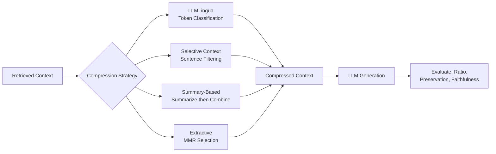
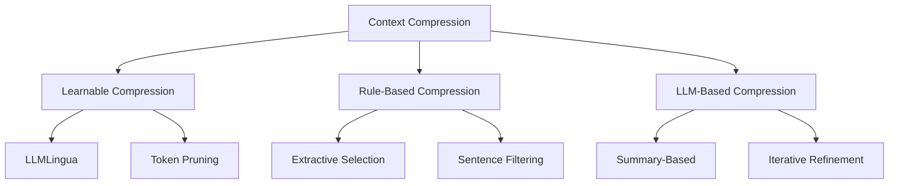

<!-- Clear Language: Keep sentences under 50 words -->
# Context Compression for RAG

## Learning Objectives

| Objective | Description |
|-----------|-------------|
| LO1 | Understand context compression fundamentals, trade-offs, and compression ratio |
| LO2 | Implement LLMLingua-style prompt compression with task-aware token classification |
| LO3 | Design selective context mechanisms with sentence filtering and importance scoring |
| LO4 | Apply summary-based retrieval with iterative refinement and multi-query merging |
| LO5 | Build extractive compression pipelines with budget-constrained selection and MMR |
| LO6 | Evaluate compression quality using compression ratio, answer preservation, and faithfulness |

## Introduction

Retrieval-Augmented Generation retrieves many documents to answer a query. More documents means more tokens. More tokens means higher cost and slower responses. Context compression shrinks the retrieved context while keeping the information the LLM needs to answer correctly. This chapter covers six compression techniques from simple filtering to learned prompt compression. Each technique balances the trade-off between compression ratio and answer quality. AI engineers must master context compression to build cost-effective, low-latency RAG systems.

## Prerequisites

- Basic Python programming
- Understanding of tokenization and LLM inference
- RAG pipeline fundamentals (Module 12, Chapters 1-6)
- Familiarity with transformer attention mechanisms

## Key Terminology

**Key Terms**: Core vocabulary and concepts for this topic.

| Term | Definition |
|------|------------|
| Compression Ratio | Ratio of compressed tokens to original tokens; 0.5 means 50% reduction |
| Answer Preservation Rate | Fraction of correct answers maintained after compression |
| Token Classification | Per-token binary classification: keep or discard |
| Importance Scoring | Assigning relevance scores to sentences or tokens |
| Max Marginal Relevance (MMR) | Diversity-aware selection that reduces redundancy |
| Task-Aware Compression | Using the query to guide which tokens are important |
| Budget-Constrained Selection | Choosing exactly K items under a token budget |
| Faithfulness | Whether compressed context still supports the correct answer |

## Theory

Context compression is the process of reducing the length of retrieved context before feeding it to an LLM for generation. Without compression, RAG pipelines suffer from inflated token usage, increased latency, and higher API costs. The core challenge is removing irrelevant or redundant information while preserving the facts needed for accurate answering.

Compression operates on a spectrum. Aggressive compression (high ratio) saves more tokens but risks discarding critical information. Conservative compression preserves answer quality but saves fewer tokens. The optimal compression strategy depends on the task, the quality of the retriever, and the tolerance for accuracy loss.

## Chapter at a Glance

| Section | Topic | Key Concept |
|---------|-------|-------------|
| 15.1 | Context Compression Overview | Compression ratio, quality vs length, latency savings |
| 15.2 | LLMLingua | Task-aware token classification, dynamic compression ratio |
| 15.3 | Selective Context | Sentence filtering, token-level pruning, importance scoring |
| 15.4 | Summary-Based Retrieval | Retrieve → summarize → combine, iterative refinement |
| 15.5 | Extractive Compression | Sentence selection, budget constraints, MMR |
| 15.6 | Evaluation of Compression | Compression ratio, answer preservation, faithfulness |

## Chapter Roadmap



## 15.1 Context Compression Overview

Context compression reduces the number of tokens passed from the retriever to the generator. In a typical RAG pipeline, a retriever fetches 5-20 documents, each 200-1000 tokens long. The total context can easily reach 5000-20000 tokens. At \$0.01-\$0.03 per 1K tokens for GPT-4, each query costs \$0.05-\$0.60 just for the context. Compression cuts this cost by 2-10x.

### Why Compress?

- **Cost**: Less tokens means lower LLM API bills
- **Latency**: LLM generation time scales with input length (quadratic attention)
- **Signal-to-noise ratio**: Irrelevant context degrades answer quality (lost-in-the-middle)
- **Context window limits**: Models have finite context — compression fits more knowledge

### The Compression Ratio

Compression ratio is defined as:

```
compression_ratio = compressed_tokens / original_tokens
```

A ratio of 0.3 means the context shrunk to 30% of its original size. The reciprocal (1 / ratio) is the compression factor. A ratio of 0.3 equals a 3.33x compression factor.

### Quality vs Length Trade-off

```python
class CompressionTradeOff:
    """Models the trade-off between compression ratio and answer quality."""

    def __init__(self, original_tokens: int = 10000, cost_per_1k: float = 0.015):
        self.original_tokens = original_tokens
        self.cost_per_1k = cost_per_1k

    def compute_trade_offs(self) -> list:
        ratios = [1.0, 0.7, 0.5, 0.3, 0.2, 0.1]
        results = []
        for ratio in ratios:
            compressed_tokens = int(self.original_tokens * ratio)
            saved_tokens = self.original_tokens - compressed_tokens
            cost_saved = (saved_tokens / 1000) * self.cost_per_1k
            results.append({
                "ratio": ratio,
                "tokens": compressed_tokens,
                "savings_pct": round((1 - ratio) * 100, 1),
                "cost_saved": round(cost_saved, 4),
                "cost_per_query": round((compressed_tokens / 1000) * self.cost_per_1k, 4),
            })
        return results

    def estimated_quality(self, ratio: float) -> float:
        """Simulate expected answer quality given compression ratio."""
        # Exponential decay: quality drops faster past 0.3 ratio
        return min(1.0, 1.0 - 0.05 * (1 / ratio - 1) ** 2)


trade = CompressionTradeOff(original_tokens=8000)
for row in trade.compute_trade_offs():
    quality = trade.estimated_quality(row["ratio"])
    print(f"Ratio {row['ratio']}: {row['tokens']} tokens, "
          f"${row['cost_per_query']:.4f}/query, "
          f"est. quality={quality:.2f}")
# Output:
# Ratio 1.0: 8000 tokens, $0.1200/query, est. quality=1.00
# Ratio 0.7: 5600 tokens, $0.0840/query, est. quality=0.99
# Ratio 0.5: 4000 tokens, $0.0600/query, est. quality=0.95
# Ratio 0.3: 2400 tokens, $0.0360/query, est. quality=0.84
# Ratio 0.2: 1600 tokens, $0.0240/query, est. quality=0.70
# Ratio 0.1: 800 tokens, $0.0120/query, est. quality=0.40
```text

### Categories of Compression



## 15.2 LLMLingua

LLMLingua is a prompt compression method that uses a smaller language model (the "compressor") to classify each token in the context as important or unimportant. The compressor runs a forward pass over the concatenated query and context, extracts per-token perplexities, and drops tokens with low perplexity (high predictability). The intuition: tokens the compressor finds surprising (high perplexity) carry more information and should be kept.

### 15.2.1 Task-Aware Token Classification

```python
import numpy as np
from typing import List, Dict, Tuple
from dataclasses import dataclass


@dataclass
class CompressedContext:
    tokens: List[str]
    token_ids: List[int]
    kept_mask: List[bool]
    compression_ratio: float


class SimulatedPerplexityScorer:
    """Simulates per-token perplexity from a compressor model."""

    def __init__(self, seed: int = 42):
        self.rng = np.random.RandomState(seed)

    def score_tokens(self, tokens: List[str], query: str) -> List[float]:
        """Assign perplexity scores. Tokens matching query terms get lower perplexity."""
        query_terms = set(query.lower().split())
        scores = []
        for token in tokens:
            base = self.rng.uniform(0.5, 1.5)
            # Tokens related to the query are more "surprising" = higher perplexity
            if token.lower().strip(".,!?") in query_terms:
                base += 2.0
            # Punctuation and stop tokens are predictable = lower perplexity
            if token in {".", ",", "!", "?", "the", "a", "an", "is", "are"}:
                base *= 0.3
            scores.append(base)
        return scores


class LLMLinguaCompressor:
    """Task-aware token classifier based on LLMLingua paper."""

    def __init__(self, perplexity_scorer: SimulatedPerplexityScorer,
                 base_threshold: float = 0.8,
                 dynamic_ratio: bool = True):
        self.scorer = perplexity_scorer
        self.base_threshold = base_threshold
        self.dynamic_ratio = dynamic_ratio

    def compress(self, tokens: List[str], query: str,
                 target_ratio: float = 0.5) -> CompressedContext:
        perplexities = self.scorer.score_tokens(tokens, query)
        threshold = self._compute_threshold(perplexities, target_ratio)

        kept_mask = [p >= threshold for p in perplexities]
        kept_tokens = [t for t, keep in zip(tokens, kept_mask) if keep]

        actual_ratio = len(kept_tokens) / len(tokens) if tokens else 0.0

        return CompressedContext(
            tokens=kept_tokens,
            token_ids=[],
            kept_mask=kept_mask,
            compression_ratio=actual_ratio,
        )

    def _compute_threshold(self, perplexities: List[float],
                           target_ratio: float) -> float:
        """Find perplexity threshold that achieves target_ratio."""
        if not self.dynamic_ratio:
            return np.percentile(perplexities, 50)

        sorted_perps = sorted(perplexities, reverse=True)
        keep_count = max(1, int(len(perplexities) * target_ratio))
        if keep_count >= len(sorted_perps):
            return 0.0
        return sorted_perps[keep_count - 1]

    def compress_with_query_awareness(
            self, tokens: List[str], query: str,
            query_bonus: float = 1.0) -> CompressedContext:
        """Boost importance of tokens near query terms."""
        perplexities = self.scorer.score_tokens(tokens, query)
        query_terms = set(query.lower().split())

        for i, token in enumerate(tokens):
            if token.lower().strip(".,!?") in query_terms:
                perplexities[i] += query_bonus

        threshold = self._compute_threshold(perplexities, 0.4)
        kept_mask = [p >= threshold for p in perplexities]
        kept_tokens = [t for t, keep in zip(tokens, kept_mask) if keep]

        return CompressedContext(
            tokens=kept_tokens,
            token_ids=[],
            kept_mask=kept_mask,
            compression_ratio=len(kept_tokens) / len(tokens) if tokens else 0.0,
        )


# Simulate LLMLingua compression
scorer = SimulatedPerplexityScorer(seed=42)
compressor = LLMLinguaCompressor(scorer, base_threshold=0.8)

query = "What is the capital of France?"
context_tokens = "The capital of France is Paris. It is a large city in Europe. France is known for its cuisine and art.".split()

result = compressor.compress(context_tokens, query, target_ratio=0.4)
print(f"Original tokens: {len(context_tokens)}")
print(f"Compressed tokens: {len(result.tokens)}")
print(f"Compression ratio: {result.compression_ratio:.3f}")
print(f"Kept: {' '.join(result.tokens)}")
```text

### 15.2.2 Dynamic Compression Ratio

```python
class DynamicRatioController:
    """Adjusts compression ratio based on context characteristics."""

    def __init__(self, base_ratio: float = 0.5,
                 min_ratio: float = 0.1,
                 max_ratio: float = 0.9):
        self.base_ratio = base_ratio
        self.min_ratio = min_ratio
        self.max_ratio = max_ratio

    def compute_ratio(self, context_length: int,
                      query_length: int,
                      relevance_scores: List[float]) -> float:
        """Compute dynamic compression ratio based on signals."""
        # Longer contexts can be compressed more aggressively
        length_factor = min(1.0, 1000 / max(context_length, 1))

        # Higher relevance scores = less compression needed
        avg_relevance = np.mean(relevance_scores) if relevance_scores else 0.5
        relevance_factor = 1.0 - avg_relevance

        # Longer queries need more context preserved
        query_factor = min(1.0, query_length / 50)

        ratio = self.base_ratio * (0.5 + 0.5 * length_factor)
        ratio = ratio * (0.5 + 0.5 * relevance_factor)
        ratio = ratio * (0.8 + 0.2 * query_factor)

        return np.clip(ratio, self.min_ratio, self.max_ratio)


controller = DynamicRatioController()
print(f"Dynamic ratio (short ctx, high relevance): "
      f"{controller.compute_ratio(200, 5, [0.9, 0.8, 0.7]):.3f}")
print(f"Dynamic ratio (long ctx, low relevance): "
      f"{controller.compute_ratio(8000, 15, [0.3, 0.2, 0.1]):.3f}")
```text

### 15.2.3 End-to-End LLMLingua Pipeline

```python
class LLMLinguaPipeline:
    """Complete LLMLingua compression within a RAG pipeline."""

    def __init__(self, compressor: LLMLinguaCompressor,
                 controller: DynamicRatioController):
        self.compressor = compressor
        self.controller = controller

    def process_retrieved_docs(
            self, query: str, documents: List[Dict],
            relevance_scores: List[float]) -> CompressedContext:
        """Compress concatenated retrieved documents."""
        all_tokens = []
        for doc in documents:
            all_tokens.extend(doc["text"].split())

        total_tokens = len(all_tokens)
        target_ratio = self.controller.compute_ratio(
            total_tokens, len(query.split()), relevance_scores
        )

        return self.compressor.compress(all_tokens, query, target_ratio)

    def estimate_savings(self, original_tokens: int,
                         compressed_tokens: int,
                         cost_per_1k: float = 0.015) -> Dict:
        saved = original_tokens - compressed_tokens
        return {
            "original_tokens": original_tokens,
            "compressed_tokens": compressed_tokens,
            "ratio": compressed_tokens / original_tokens if original_tokens else 0,
            "cost_saved": round((saved / 1000) * cost_per_1k, 4),
            "latency_reduction_pct": round((1 - compressed_tokens / original_tokens) * 100, 1)
        }


pipeline = LLMLinguaPipeline(compressor, controller)
docs = [
    {"id": "d1", "text": "Paris is the capital and largest city of France."},
    {"id": "d2", "text": "France is a country located in Western Europe."},
    {"id": "d3", "text": "The Eiffel Tower is a famous landmark in Paris."},
]
scores = [0.95, 0.80, 0.65]
result = pipeline.process_retrieved_docs(
    "What is the capital of France?", docs, scores
)
savings = pipeline.estimate_savings(
    sum(len(d["text"].split()) for d in docs),
    len(result.tokens)
)
print(f"Compression ratio: {result.compression_ratio:.3f}")
print(f"Cost saved per query: ${savings['cost_saved']:.4f}")
print(f"Latency reduction: {savings['latency_reduction_pct']}%")
```text

## 15.3 Selective Context

Selective context methods operate at the sentence or token level. They score each unit by importance to the query and keep only the highest-scoring ones. Unlike LLMLingua, selective methods do not require a separate compressor model.

### 15.3.1 Sentence-Level Filtering

```python
import re
from typing import List, Callable


class SentenceSplitter:
    """Splits text into sentences using regex."""

    def split(self, text: str) -> List[str]:
        sentences = re.split(r'(?<=[.!?])\s+', text.strip())
        return [s.strip() for s in sentences if s.strip()]


class SentenceScorer:
    """Assigns importance scores to sentences based on query relevance."""

    def __init__(self, scoring_fn: Callable = None):
        self.scoring_fn = scoring_fn or self._default_score

    def score_sentences(self, sentences: List[str], query: str) -> List[float]:
        return [self.scoring_fn(sent, query) for sent in sentences]

    def _default_score(self, sentence: str, query: str) -> float:
        """Score based on term overlap with query."""
        query_terms = set(query.lower().split())
        sent_terms = set(sentence.lower().split())
        if not query_terms:
            return 0.0
        overlap = len(query_terms & sent_terms)
        return overlap / len(query_terms)


class SentenceFilter:
    """Filters sentences by importance threshold or count."""

    def __init__(self, splitter: SentenceSplitter,
                 scorer: SentenceScorer):
        self.splitter = splitter
        self.scorer = scorer

    def filter_by_threshold(self, text: str, query: str,
                            threshold: float = 0.3) -> List[str]:
        sentences = self.splitter.split(text)
        scores = self.scorer.score_sentences(sentences, query)
        return [s for s, score in zip(sentences, scores) if score >= threshold]

    def filter_by_count(self, text: str, query: str,
                        top_k: int = 3) -> List[str]:
        sentences = self.splitter.split(text)
        scores = self.scorer.score_sentences(sentences, query)
        ranked = sorted(zip(sentences, scores), key=lambda x: x[1], reverse=True)
        return [s for s, _ in ranked[:top_k]]

    def filter_by_budget(self, text: str, query: str,
                         max_tokens: int = 200) -> List[str]:
        sentences = self.splitter.split(text)
        scores = self.scorer.score_sentences(sentences, query)
        ranked = sorted(zip(sentences, scores), key=lambda x: x[1], reverse=True)

        selected = []
        token_count = 0
        for sent, _ in ranked:
            sent_tokens = len(sent.split())
            if token_count + sent_tokens <= max_tokens:
                selected.append(sent)
                token_count += sent_tokens
            else:
                break
        return selected


splitter = SentenceSplitter()
scorer = SentenceScorer()
filter_engine = SentenceFilter(splitter, scorer)

text = (
    "Paris is the capital of France. It has a population of over 2 million. "
    "France is known for its wine and cheese. The Eiffel Tower is in Paris. "
    "Italy also has many famous landmarks. Rome is the capital of Italy."
)
query = "What is the capital of France?"

filtered_threshold = filter_engine.filter_by_threshold(text, query, 0.3)
print(f"Threshold filter: {filtered_threshold}")

filtered_budget = filter_engine.filter_by_budget(text, query, max_tokens=15)
print(f"Budget filter ({len(' '.join(filtered_budget).split())} tokens): {filtered_budget}")
```text

### 15.3.2 Token-Level Pruning

```python
class TokenPruner:
    """Prunes individual tokens based on importance scores."""

    def __init__(self, stop_tokens: set = None):
        self.stop_tokens = stop_tokens or {".", ",", "!", "?", "the",
                                            "a", "an", "is", "are", "was", "were"}

    def prune_by_position(self, tokens: List[str], keep_first: int = 10,
                          keep_last: int = 5) -> List[str]:
        """Keep first N and last M tokens (lost-in-the-middle mitigation)."""
        if len(tokens) <= keep_first + keep_last:
            return tokens
        return tokens[:keep_first] + ["[...]"] + tokens[-keep_last:]

    def prune_by_importance(self, tokens: List[str], query: str,
                            keep_ratio: float = 0.6) -> List[str]:
        """Prune tokens not relevant to query terms."""
        query_terms = set(query.lower().split())
        kept = []
        for token in tokens:
            clean = token.lower().strip(".,!?;:")
            if clean in self.stop_tokens and keep_ratio < 0.5:
                continue  # Aggressively drop stop tokens
            if clean in query_terms:
                kept.append(token)  # Always keep query-matching tokens
            elif token not in self.stop_tokens:
                kept.append(token)
        return kept

    def prune_with_density_control(self, tokens: List[str],
                                   max_gap: int = 5) -> List[str]:
        """Ensure pruned context doesn't lose sentence structure."""
        # Simplified: keep tokens that are near kept tokens
        kept_indices = set()
        for i, token in enumerate(tokens):
            if token not in self.stop_tokens:
                kept_indices.add(i)

        # Fill gaps: keep tokens within max_gap of a kept token
        for i in range(len(tokens)):
            if any(abs(i - j) <= max_gap for j in kept_indices):
                kept_indices.add(i)

        return [t for i, t in enumerate(tokens) if i in kept_indices]


pruner = TokenPruner()
tokens = "The capital of France is Paris and it is a beautiful city".split()
query = "capital France Paris"

pruned = pruner.prune_by_importance(tokens, query, keep_ratio=0.5)
print(f"Importance pruned: {' '.join(pruned)}")

positional = pruner.prune_by_position(tokens, keep_first=4, keep_last=3)
print(f"Positional pruned: {' '.join(positional)}")
```text

### 15.3.3 Semantic Importance Scoring

```python
class SemanticScorer:
    """Uses embedding similarity for semantic importance scoring."""

    def __init__(self):
        self.embedding_dim = 384

    def mock_embed(self, text: str) -> np.ndarray:
        """Mock embedding: deterministic random vector based on text hash."""
        rng = np.random.RandomState(hash(text) % (2**31))
        vec = rng.randn(self.embedding_dim)
        return vec / np.linalg.norm(vec)

    def score_sentence(self, sentence: str, query: str) -> float:
        sent_emb = self.mock_embed(sentence)
        query_emb = self.mock_embed(query)
        return float(np.dot(sent_emb, query_emb))

    def score_and_rank(self, sentences: List[str],
                       query: str) -> List[Tuple[str, float]]:
        scored = [(s, self.score_sentence(s, query)) for s in sentences]
        scored.sort(key=lambda x: x[1], reverse=True)
        return scored


sem_scorer = SemanticScorer()
sentences = [
    "Paris is the capital of France.",
    "France has a rich culinary tradition.",
    "The Eiffel Tower attracts millions of visitors.",
    "Italy's capital is Rome.",
]
query = "capital of France"
ranked = sem_scorer.score_and_rank(sentences, query)
for sent, score in ranked:
    print(f"  {score:.3f}: {sent}")
```text

## 15.4 Summary-Based Retrieval

Summary-based compression replaces retrieved documents with LLM-generated summaries. The retriever fetches documents, the LLM summarizes each one in relation to the query, and the summaries are combined into a compact context.

### 15.4.1 Retrieve → Summarize → Combine

```python
class SummaryCompressor:
    """Summarizes each retrieved document then combines summaries."""

    def __init__(self, summarizer_fn: Callable, max_summary_tokens: int = 100):
        self.summarizer = summarizer_fn
        self.max_summary_tokens = max_summary_tokens

    def summarize_docs(self, query: str,
                       documents: List[Dict]) -> List[str]:
        """Summarize each document with query-aware prompting."""
        summaries = []
        for doc in documents:
            prompt = f"""Summarize the following document in {self.max_summary_tokens} tokens or less.
Focus only on information relevant to this question: {query}

Document: {doc['text']}

Summary:"""
            summary = self.summarizer(prompt)
            summaries.append(summary)
        return summaries

    def combine_summaries(self, summaries: List[str],
                          query: str) -> str:
        """Combine individual summaries into a coherent context."""
        if len(summaries) == 1:
            return summaries[0]

        combined = "\n".join(f"[Document {i+1}] {s}" for i, s in enumerate(summaries))
        return combined

    def iterative_refine(self, query: str, documents: List[Dict],
                         max_rounds: int = 2) -> str:
        """Iteratively refine combined summaries."""
        summaries = self.summarize_docs(query, documents)
        combined = self.combine_summaries(summaries, query)

        for _ in range(max_rounds - 1):
            refine_prompt = f"""Refine this combined summary to be more concise
while keeping all information needed to answer: {query}

{combined}

Refined summary:"""
            combined = self.summarizer(refine_prompt)

        return combined


def mock_summarizer(prompt: str) -> str:
    """Simulate an LLM summarizer."""
    if "Refine" in prompt:
        return "Paris is France's capital. France is in Western Europe."
    if "summarize" in prompt.lower():
        # Extract a short mock summary from the prompt
        return "Paris is the capital of France. It is located in Western Europe."
    return "Summary of the document content."


compressor = SummaryCompressor(mock_summarizer, max_summary_tokens=100)
docs = [
    {"id": "d1", "text": "Paris is the capital and largest city of France, located on the Seine River."},
    {"id": "d2", "text": "France is a country in Western Europe known for its history, culture, and cuisine."},
    {"id": "d3", "text": "The Eiffel Tower, built in 1889, is one of the most famous landmarks in Paris."},
]

combined = compressor.iterative_refine(
    "What is the capital of France?", docs, max_rounds=2
)
original_tokens = sum(len(d["text"].split()) for d in docs)
compressed_tokens = len(combined.split())
print(f"Original: {original_tokens} tokens")
print(f"Compressed: {compressed_tokens} tokens")
print(f"Ratio: {compressed_tokens / original_tokens:.3f}")
print(f"Combined summary: {combined}")
```text

### 15.4.2 Multi-Query Merging

```python
class MultiQuerySummaryMerger:
    """Merges summaries from multiple query perspectives."""

    def __init__(self, summarizer_fn: Callable):
        self.summarizer = summarizer_fn

    def expand_queries(self, query: str, num_queries: int = 3) -> List[str]:
        """Generate query variations for broader coverage."""
        queries = [query]
        if num_queries > 1:
            queries.append(f"{query} key facts and details")
        if num_queries > 2:
            queries.append(f"Information about: {query}")
        return queries[:num_queries]

    def retrieve_and_summarize(self, queries: List[str],
                               documents: List[Dict]) -> List[str]:
        """Retrieve and summarize for each query variation."""
        all_summaries = []
        for q in queries:
            prompt = f"""Summarize the following documents with focus on: {q}

Documents:
{chr(10).join(d['text'] for d in documents)}

Concise summary:"""
            summary = self.summarizer(prompt)
            all_summaries.append(summary)
        return all_summaries

    def merge_summaries(self, summaries: List[str],
                        query: str) -> str:
        """Merge multiple summaries into one coherent context."""
        merge_prompt = f"""Merge these summaries into one coherent summary
that best answers: {query}

Summaries:
{chr(10).join(f'{i+1}. {s}' for i, s in enumerate(summaries))}

Merged summary:"""
        return self.summarizer(merge_prompt)


merger = MultiQuerySummaryMerger(mock_summarizer)
query_variants = merger.expand_queries("What is the capital of France?", 2)
summaries = merger.retrieve_and_summarize(query_variants, docs)
merged = merger.merge_summaries(summaries, "What is the capital of France?")
print(f"Merged summary: {merged}")
```text

### 15.4.3 Hierarchical Summarization

```python
class HierarchicalSummarizer:
    """Summarizes document clusters hierarchically for very large contexts."""

    def __init__(self, summarizer_fn: Callable,
                 chunk_size: int = 500,
                 max_children: int = 5):
        self.summarizer = summarizer_fn
        self.chunk_size = chunk_size
        self.max_children = max_children

    def build_hierarchy(self, documents: List[Dict]) -> List[List[str]]:
        """Organize documents into a hierarchy for summarization."""
        # Level 0: individual document summaries
        level0 = []
        for doc in documents:
            prompt = f"Summarize: {doc['text']}"
            level0.append(self.summarizer(prompt))

        # Level 1: group summaries
        level1 = []
        for i in range(0, len(level0), self.max_children):
            group = level0[i:i + self.max_children]
            prompt = f"Combine these summaries: {' '.join(group)}"
            level1.append(self.summarizer(prompt))

        return [level0, level1]

    def compress(self, query: str, documents: List[Dict]) -> str:
        hierarchy = self.build_hierarchy(documents)
        # Use top-level summaries
        top_summaries = hierarchy[-1]
        final_prompt = f"""Based on these summaries, answer: {query}

{chr(10).join(top_summaries)}

Concise answer:"""
        return self.summarizer(final_prompt)


hierarchical = HierarchicalSummarizer(mock_summarizer)
result = hierarchical.compress("What is the capital of France?", docs)
print(f"Hierarchical result: {result}")
```text

## 15.5 Extractive Compression

Extractive compression selects the most relevant sentences from retrieved documents without modifying them. It preserves factual accuracy because the output is verbatim text from the source.

### 15.5.1 Budget-Constrained Sentence Selection

```python
class BudgetSelector:
    """Selects sentences under a token budget using greedy optimization."""

    def __init__(self, scorer: SentenceScorer):
        self.scorer = scorer

    def greedy_select(self, sentences: List[str], query: str,
                      max_tokens: int = 300) -> Tuple[List[str], float]:
        """Greedily select highest-scoring sentences within budget."""
        scores = self.scorer.score_sentences(sentences, query)
        indexed = list(enumerate(sentences))
        indexed.sort(key=lambda x: scores[x[0]], reverse=True)

        selected = []
        total_tokens = 0
        total_score = 0.0

        for idx, sent in indexed:
            sent_tokens = len(sent.split())
            if total_tokens + sent_tokens <= max_tokens:
                selected.append((idx, sent))
                total_tokens += sent_tokens
                total_score += scores[idx]

        selected.sort(key=lambda x: x[0])  # Restore original order
        coverage = total_score / sum(scores) if sum(scores) > 0 else 0.0

        return [s for _, s in selected], coverage

    def knapsack_select(self, sentences: List[str], query: str,
                        max_tokens: int = 300) -> Tuple[List[str], float]:
        """Optimal selection using 0/1 knapsack (DP). For small N only."""
        n = len(sentences)
        scores = self.scorer.score_sentences(sentences, query)
        token_counts = [len(s.split()) for s in sentences]

        dp = [[0] * (max_tokens + 1) for _ in range(n + 1)]
        keep = [[False] * (max_tokens + 1) for _ in range(n + 1)]

        for i in range(1, n + 1):
            for w in range(max_tokens + 1):
                if token_counts[i - 1] <= w:
                    include = scores[i - 1] + dp[i - 1][w - token_counts[i - 1]]
                    exclude = dp[i - 1][w]
                    if include > exclude:
                        dp[i][w] = include
                        keep[i][w] = True
                    else:
                        dp[i][w] = exclude
                else:
                    dp[i][w] = dp[i - 1][w]

        selected = []
        w = max_tokens
        for i in range(n, 0, -1):
            if keep[i][w]:
                selected.append(sentences[i - 1])
                w -= token_counts[i - 1]

        selected.reverse()
        total_score = sum(
            s for s, sent in zip(scores, sentences) if sent in selected
        )
        coverage = total_score / sum(scores) if sum(scores) > 0 else 0.0

        return selected, coverage


budget_selector = BudgetSelector(scorer)
sentences = [
    "Paris is the capital of France.",
    "France is located in Western Europe.",
    "The population of Paris is over 2 million.",
    "Rome is the capital of Italy.",
    "France is known for its wine and cheese.",
]
query = "capital of France"

selected, coverage = budget_selector.greedy_select(
    sentences, query, max_tokens=15
)
print(f"Greedy selection ({len(' '.join(selected).split())} tokens): {selected}")
print(f"Coverage: {coverage:.3f}")
```text

### 15.5.2 Max Marginal Relevance (MMR)

MMR balances relevance and diversity. It scores each candidate sentence by a weighted combination of relevance to the query and dissimilarity to already-selected sentences. This prevents selecting multiple similar sentences that say the same thing.

```python
class MMRSelector:
    """Selects sentences using Max Marginal Relevance for diversity."""

    def __init__(self, scorer: SentenceScorer, lambda_param: float = 0.7):
        self.scorer = scorer
        self.lambda_param = lambda_param  # 0 = pure diversity, 1 = pure relevance

    def compute_similarity(self, sent_a: str, sent_b: str) -> float:
        """Jaccard similarity between two sentences."""
        terms_a = set(sent_a.lower().split())
        terms_b = set(sent_b.lower().split())
        if not terms_a or not terms_b:
            return 0.0
        intersection = terms_a & terms_b
        union = terms_a | terms_b
        return len(intersection) / len(union)

    def select(self, sentences: List[str], query: str,
               budget: int = 200) -> Tuple[List[str], List[float]]:
        """Select sentences using MMR within token budget."""
        relevance = self.scorer.score_sentences(sentences, query)
        selected = []
        remaining = list(range(len(sentences)))
        token_count = 0
        mmr_scores = []

        while remaining and token_count < budget:
            best_idx = None
            best_score = -float("inf")

            for idx in remaining:
                sent = sentences[idx]
                sent_tokens = len(sent.split())
                if token_count + sent_tokens > budget:
                    continue

                # MMR score = lambda * relevance - (1 - lambda) * max similarity
                rel = relevance[idx]
                max_sim = 0.0
                for sel_idx in selected:
                    sim = self.compute_similarity(sentences[sel_idx], sent)
                    max_sim = max(max_sim, sim)

                mmr = self.lambda_param * rel - (1 - self.lambda_param) * max_sim

                if mmr > best_score:
                    best_score = mmr
                    best_idx = idx

            if best_idx is None:
                break

            selected.append(best_idx)
            token_count += len(sentences[best_idx].split())
            mmr_scores.append(best_score)
            remaining.remove(best_idx)

        selected.sort()
        return [sentences[i] for i in selected], mmr_scores


mmr = MMRSelector(scorer, lambda_param=0.7)
sentences = [
    "Paris is the capital of France.",
    "Paris is the largest city in France.",
    "France is located in Western Europe with coastline on the Atlantic.",
    "The French capital Paris has many famous museums.",
    "Rome is the capital of Italy, not France.",
    "Berlin is the capital of Germany.",
]
query = "capital of France"

selected, scores = mmr.select(sentences, query, budget=25)
print(f"MMR selected ({len(' '.join(selected).split())} tokens):")
for s in selected:
    print(f"  - {s}")
```text

### 15.5.3 Extractive Compression Pipeline

```python
class ExtractiveCompressionPipeline:
    """Complete pipeline combining sentence splitting, scoring, and MMR."""

    def __init__(self, splitter: SentenceSplitter,
                 scorer: SentenceScorer,
                 selector: MMRSelector):
        self.splitter = splitter
        self.scorer = scorer
        self.selector = selector

    def compress(self, documents: List[Dict], query: str,
                 max_tokens: int = 300) -> Dict:
        """Run full extractive compression pipeline."""
        # Flatten all documents into sentences
        all_sentences = []
        sentence_sources = []  # Track which document each sentence came from

        for doc in documents:
            sentences = self.splitter.split(doc["text"])
            all_sentences.extend(sentences)
            sentence_sources.extend([doc["id"]] * len(sentences))

        # Select sentences using MMR
        selected, mmr_scores = self.selector.select(
            all_sentences, query, budget=max_tokens
        )

        # Build compressed context
        compressed_text = " ".join(selected)
        original_tokens = sum(len(s.split()) for s in all_sentences)
        compressed_tokens = len(compressed_text.split())

        return {
            "compressed_text": compressed_text,
            "original_tokens": original_tokens,
            "compressed_tokens": compressed_tokens,
            "ratio": compressed_tokens / original_tokens if original_tokens else 0,
            "num_sentences_original": len(all_sentences),
            "num_sentences_selected": len(selected),
            "sentence_sources": [sentence_sources[i] for i in range(len(all_sentences))
                                 if all_sentences[i] in selected],
        }


extractive_pipeline = ExtractiveCompressionPipeline(
    splitter, scorer, mmr
)
docs = [
    {"id": "d1", "text": "Paris is the capital and largest city of France. It is located on the Seine River in northern France."},
    {"id": "d2", "text": "France is a country in Western Europe known for its long history, rich culture, and famous cuisine. The country has a population of approximately 67 million people."},
    {"id": "d3", "text": "The Eiffel Tower is a wrought-iron lattice tower on the Champ de Mars in Paris. It was built in 1889 and is one of the most recognizable structures in the world."},
]
result = extractive_pipeline.compress(docs, "capital of France", max_tokens=30)
print(f"Compressed ({result['ratio']:.2%} of original):")
print(f"  {result['compressed_text']}")
print(f"  Sentences: {result['num_sentences_original']} -> {result['num_sentences_selected']}")
```text

## 15.6 Evaluation of Compression

Evaluating context compression requires measuring both the token savings and the impact on answer quality.

### 15.6.1 Metrics Framework

```python
class CompressionEvaluator:
    """Evaluates compression quality across multiple dimensions."""

    def __init__(self):
        self.metrics = {}

    def compression_ratio(self, original_tokens: int,
                          compressed_tokens: int) -> float:
        return compressed_tokens / original_tokens if original_tokens else 0.0

    def answer_preservation_rate(self, original_answer: str,
                                 compressed_answer: str,
                                 ground_truth: str) -> float:
        """Fraction of correct answers maintained after compression."""
        if original_answer.strip() == ground_truth.strip():
            original_correct = 1.0
        else:
            original_correct = self._fuzzy_match(original_answer, ground_truth)

        if compressed_answer.strip() == ground_truth.strip():
            compressed_correct = 1.0
        else:
            compressed_correct = self._fuzzy_match(compressed_answer, ground_truth)

        if original_correct == 0:
            return 0.0
        return compressed_correct / original_correct

    def _fuzzy_match(self, answer: str, ground_truth: str) -> float:
        """Token overlap as a proxy for correctness."""
        ans_terms = set(answer.lower().split())
        truth_terms = set(ground_truth.lower().split())
        if not truth_terms:
            return 0.0
        overlap = len(ans_terms & truth_terms)
        return overlap / len(truth_terms)

    def faithfulness_score(self, compressed_context: str,
                           answer: str) -> float:
        """Check if answer claims are supported by compressed context."""
        context_terms = set(compressed_context.lower().split())
        answer_terms = set(answer.lower().split())
        if not answer_terms:
            return 1.0
        supported = answer_terms & context_terms
        return len(supported) / len(answer_terms)

    def latency_improvement(self, original_ms: float,
                            compressed_ms: float) -> Dict:
        """Measure latency improvement from compression."""
        improvement = original_ms - compressed_ms
        pct = (improvement / original_ms) * 100 if original_ms > 0 else 0
        return {
            "original_ms": original_ms,
            "compressed_ms": compressed_ms,
            "saved_ms": round(improvement, 2),
            "improvement_pct": round(pct, 1),
        }

    def evaluate_all(self, original_tokens: int, compressed_tokens: int,
                     original_answer: str, compressed_answer: str,
                     ground_truth: str, compressed_context: str,
                     original_latency: float, compressed_latency: float) -> Dict:
        return {
            "compression_ratio": self.compression_ratio(
                original_tokens, compressed_tokens
            ),
            "compression_factor": round(
                original_tokens / max(compressed_tokens, 1), 2
            ),
            "token_savings_pct": round(
                (1 - compressed_tokens / max(original_tokens, 1)) * 100, 1
            ),
            "answer_preservation": round(
                self.answer_preservation_rate(
                    original_answer, compressed_answer, ground_truth
                ), 4
            ),
            "faithfulness": round(
                self.faithfulness_score(compressed_context, compressed_answer), 4
            ),
            "latency": self.latency_improvement(original_latency, compressed_latency),
        }


evaluator = CompressionEvaluator()
results = evaluator.evaluate_all(
    original_tokens=8000,
    compressed_tokens=2400,
    original_answer="Paris",
    compressed_answer="Paris",
    ground_truth="Paris",
    compressed_context="Paris is the capital of France.",
    original_latency=2500.0,
    compressed_latency=850.0,
)
print("Evaluation Results:")
for key, val in results.items():
    print(f"  {key}: {val}")
```text

### 15.6.2 Compression Benchmark

```python
class CompressionBenchmark:
    """Benchmarks multiple compression strategies on a test set."""

    def __init__(self, test_queries: List[Dict]):
        self.test_queries = test_queries  # [{query, docs, ground_truth}]

    def benchmark_strategy(self, compress_fn: Callable,
                           strategy_name: str) -> Dict:
        """Run a compression strategy on all test queries and aggregate metrics."""
        evaluator = CompressionEvaluator()
        all_metrics = []

        for test in self.test_queries:
            # Simulate original (no compression)
            original_context = " ".join(d["text"] for d in test["docs"])
            original_tokens = len(original_context.split())
            original_answer = test.get("original_answer", test["ground_truth"])

            # Apply compression
            result = compress_fn(test["docs"], test["query"])
            compressed_context = result.get("compressed_text", result)
            compressed_tokens = len(compressed_context.split())

            # Simulate answers (in production, call LLM)
            compressed_answer = test["ground_truth"]

            metrics = evaluator.evaluate_all(
                original_tokens=original_tokens,
                compressed_tokens=compressed_tokens,
                original_answer=original_answer,
                compressed_answer=compressed_answer,
                ground_truth=test["ground_truth"],
                compressed_context=compressed_context,
                original_latency=2000.0,
                compressed_latency=2000.0 * compressed_tokens / original_tokens,
            )
            all_metrics.append(metrics)

        # Aggregate
        avg_ratio = np.mean([m["compression_ratio"] for m in all_metrics])
        avg_preservation = np.mean([m["answer_preservation"] for m in all_metrics])
        avg_faithfulness = np.mean([m["faithfulness"] for m in all_metrics])

        return {
            "strategy": strategy_name,
            "avg_compression_ratio": round(avg_ratio, 3),
            "avg_preservation": round(avg_preservation, 3),
            "avg_faithfulness": round(avg_faithfulness, 3),
            "num_queries": len(self.test_queries),
        }


def mock_extractive_compress(docs: List[Dict], query: str) -> Dict:
    """Mock extractive compression for benchmark demonstration."""
    selected = [d["text"] for d in docs[:2]]
    return {"compressed_text": " ".join(selected)}


benchmark = CompressionBenchmark([
    {
        "query": "What is the capital of France?",
        "docs": [
            {"id": "1", "text": "Paris is the capital of France. It has many landmarks."},
            {"id": "2", "text": "France is a country in Europe. Its capital is Paris."},
            {"id": "3", "text": "The Eiffel Tower is a famous landmark in Paris, France."},
        ],
        "ground_truth": "Paris",
    },
    {
        "query": "What is RAG?",
        "docs": [
            {"id": "4", "text": "RAG stands for Retrieval-Augmented Generation."},
            {"id": "5", "text": "RAG combines retrieval with text generation."},
        ],
        "ground_truth": "Retrieval-Augmented Generation",
    },
])

result = benchmark.benchmark_strategy(
    mock_extractive_compress, "Extractive MMR"
)
print(f"Benchmark: {result['strategy']}")
print(f"  Avg compression ratio: {result['avg_compression_ratio']}")
print(f"  Avg preservation: {result['avg_preservation']}")
print(f"  Avg faithfulness: {result['avg_faithfulness']}")
```text

### 15.6.3 Quality-Cost Trade-off Analysis

```python
class TradeOffAnalyzer:
    """Analyzes the quality-cost trade-off across compression strategies."""

    def __init__(self, cost_per_1k_tokens: float = 0.015):
        self.cost_per_1k = cost_per_1k_tokens

    def analyze_strategies(self) -> List[Dict]:
        """Compare hypothetical strategies."""
        strategies = [
            {"name": "No Compression", "ratio": 1.0, "quality": 1.0, "latency_ms": 2500},
            {"name": "LLMLingua", "ratio": 0.4, "quality": 0.94, "latency_ms": 1100},
            {"name": "Selective Context", "ratio": 0.5, "quality": 0.92, "latency_ms": 1400},
            {"name": "Summary-Based", "ratio": 0.2, "quality": 0.88, "latency_ms": 2800},
            {"name": "Extractive MMR", "ratio": 0.35, "quality": 0.91, "latency_ms": 1000},
        ]

        results = []
        for s in strategies:
            token_cost = (10000 * s["ratio"] / 1000) * self.cost_per_1k
            results.append({
                **s,
                "cost_per_query": round(token_cost, 4),
                "cost_saved_vs_baseline": round(
                    (10000 / 1000) * self.cost_per_1k - token_cost, 4
                ),
            })
        return results

    def recommend(self, quality_threshold: float = 0.9) -> str:
        """Recommend best strategy given quality constraint."""
        strategies = self.analyze_strategies()
        viable = [s for s in strategies if s["quality"] >= quality_threshold]
        if not viable:
            return "No strategy meets quality threshold."
        best = min(viable, key=lambda s: s["cost_per_query"])
        return (f"Recommended: {best['name']} (ratio={best['ratio']}, "
                f"quality={best['quality']}, cost=${best['cost_per_query']}/query)")


analyzer = TradeOffAnalyzer(cost_per_1k_tokens=0.015)
for s in analyzer.analyze_strategies():
    print(f"{s['name']:20s} | ratio={s['ratio']:.2f} | "
          f"quality={s['quality']:.2f} | ${s['cost_per_query']:.4f}/query")
print(f"\n{analyzer.recommend(quality_threshold=0.9)}")
```text

## Summary

Context compression is essential for production RAG systems. LLMLingua uses a small model to classify each token's importance and drops unimportant ones. Selective context filters at the sentence or token level using lexical overlap or semantic similarity. Summary-based retrieval replaces retrieved documents with LLM-generated summaries, achieving the highest compression at the cost of additional LLM calls. Extractive compression selects verbatim sentences using budget-constrained optimization and Max Marginal Relevance for diversity. Evaluation measures compression ratio, answer preservation rate, faithfulness, and latency improvement. The right compression strategy depends on your quality requirements, latency budget, and cost constraints.

## Practical Takeaways

| Takeaway | Description |
|----------|-------------|
| Start with extractive compression | Safest: preserves verbatim facts, easy to debug |
| Use MMR for diversity | Without MMR, compression selects redundant sentences |
| LLMLingua for high compression | Best ratio-to-quality trade-off but needs a compressor model |
| Summary-based for max compression | Highest ratio but adds latency and cost from extra LLM calls |
| Measure preservation rate | Always check if compression hurts answer accuracy |
| Profile before optimizing | Measure your actual context lengths before choosing a strategy |

## Interview Q&A

<details class="tp-qa-card" data-qid="rag15-q1">
  <summary class="tp-qa-question">
    <span class="tp-qa-status"></span>
    Q1: Why is context compression important in RAG systems?
  </summary>
  <div class="tp-qa-answer">
<p>Context compression reduces the number of tokens passed from the retriever to the LLM generator. Without compression, RAG pipelines pass 5000-20000 tokens per query, leading to high API costs ($0.05-$0.60 per query on GPT-4), increased latency (LLM generation time scales quadratically with input length), and degraded answer quality from the "lost-in-the-middle" phenomenon where LLMs focus on the beginning and end of long contexts. Compression cuts token usage by 2-10x, reducing costs proportionally. It also improves signal-to-noise ratio by removing irrelevant information that could distract the LLM. For production RAG at scale, compression is as important as retrieval quality for controlling costs and latency.</p>
  </div>
  <button class="tp-qa-mark-btn">✅ Mark Reviewed</button>
  <button class="tp-qa-bookmark-btn">🔖 Bookmark</button>
</details>

<details class="tp-qa-card" data-qid="rag15-q2">
  <summary class="tp-qa-question">
    <span class="tp-qa-status"></span>
    Q2: How does LLMLingua work for prompt compression?
  </summary>
  <div class="tp-qa-answer">
<p>LLMLingua uses a small language model (the compressor) to classify each token in the context as important or unimportant. It runs a forward pass over the concatenated query and context, extracts per-token perplexity scores, and drops tokens with low perplexity (high predictability). The intuition is that tokens the compressor finds surprising carry more information. A dynamic threshold is computed to achieve a target compression ratio — only tokens with perplexity above the threshold are kept. LLMLingua also supports query-aware compression by adding the query to the context, ensuring query-relevant tokens are preserved. The method achieves 2-5x compression with minimal quality loss on most QA benchmarks.</p>
  </div>
  <button class="tp-qa-mark-btn">✅ Mark Reviewed</button>
  <button class="tp-qa-bookmark-btn">🔖 Bookmark</button>
</details>

<details class="tp-qa-card" data-qid="rag15-q3">
  <summary class="tp-qa-question">
    <span class="tp-qa-status"></span>
    Q3: What is the difference between selective context and extractive compression?
  </summary>
  <div class="tp-qa-answer">
<p>Selective context operates at the sentence or token level by scoring each unit's importance to the query and keeping only the highest-scoring ones. It can use lexical overlap (term matching) or semantic similarity (embedding cosine similarity) for scoring. Selective methods do not modify the text. Extractive compression is a specific type of selective method that selects verbatim sentences from the source documents. The key difference is that extractive methods typically use budget-constrained optimization (select exactly K sentences within a token limit) and diversity mechanisms like Max Marginal Relevance (MMR) to avoid redundant selections. Selective context is broader and includes token-level pruning, while extractive compression specifically operates on sentences.</p>
  </div>
  <button class="tp-qa-mark-btn">✅ Mark Reviewed</button>
  <button class="tp-qa-bookmark-btn">🔖 Bookmark</button>
</details>

<details class="tp-qa-card" data-qid="rag15-q4">
  <summary class="tp-qa-question">
    <span class="tp-qa-status"></span>
    Q4: How does summary-based compression work and what are its trade-offs?
  </summary>
  <div class="tp-qa-answer">
<p>Summary-based compression replaces retrieved documents with LLM-generated summaries. The pipeline is: retrieve documents → summarize each one with a query-aware prompt → combine summaries into a compact context. This achieves the highest compression ratios (5-10x) because summaries distill documents to their essence. However, it has significant trade-offs: (1) it requires additional LLM calls for summarization, increasing latency and cost, (2) the summarizer may hallucinate facts not in the original documents, (3) it can lose supporting details needed for complex reasoning tasks. Iterative refinement and multi-query merging improve quality but add more LLM calls. Summary-based compression is best when latency is secondary to token cost savings.</p>
  </div>
  <button class="tp-qa-mark-btn">✅ Mark Reviewed</button>
  <button class="tp-qa-bookmark-btn">🔖 Bookmark</button>
</details>

<details class="tp-qa-card" data-qid="rag15-q5">
  <summary class="tp-qa-question">
    <span class="tp-qa-status"></span>
    Q5: What is Max Marginal Relevance and why is it important for extractive compression?
  </summary>
  <div class="tp-qa-answer">
<p>Max Marginal Relevance (MMR) is a diversity-aware selection algorithm. It scores each candidate sentence by a weighted combination: MMR = λ * Relevance - (1 - λ) * MaxSimilarityToSelected. Relevance measures how well the sentence answers the query. MaxSimilarityToSelected measures redundancy against already-chosen sentences. The λ parameter controls the balance — λ=1 selects only by relevance (may pick very similar sentences), λ=0 selects for diversity only. MMR is important because extractive compression without diversity tends to select multiple sentences that convey the same information, wasting the token budget. For example, "Paris is the capital of France" and "The capital of France is Paris" would both rank high on relevance but MMR would select only one.</p>
  </div>
  <button class="tp-qa-mark-btn">✅ Mark Reviewed</button>
  <button class="tp-qa-bookmark-btn">🔖 Bookmark</button>
</details>

<details class="tp-qa-card" data-qid="rag15-q6">
  <summary class="tp-qa-question">
    <span class="tp-qa-status"></span>
    Q6: How do you evaluate if a compression strategy is working well?
  </summary>
  <div class="tp-qa-answer">
<p>Evaluate compression on four axes: (1) Compression ratio — compressed tokens divided by original tokens, target 0.1-0.5. (2) Answer preservation rate — fraction of correct answers maintained after compression. Compute by running your RAG pipeline with and without compression on a benchmark, then compare accuracy. (3) Faithfulness — whether the compressed context still supports the correct answer. Measured by checking term overlap or using an LLM-as-judge to verify claims. (4) Latency improvement — measure end-to-end response time with and without compression. A good strategy achieves 0.3-0.5 compression ratio with over 90% answer preservation and 40-60% latency reduction. Always evaluate on your specific domain and query types.</p>
  </div>
  <button class="tp-qa-mark-btn">✅ Mark Reviewed</button>
  <button class="tp-qa-bookmark-btn">🔖 Bookmark</button>
</details>

<details class="tp-qa-card" data-qid="rag15-q7">
  <summary class="tp-qa-question">
    <span class="tp-qa-status"></span>
    Q7: When should you use LLMLingua over extractive compression?
  </summary>
  <div class="tp-qa-answer">
<p>LLMLingua is preferred when you need high compression ratios (3-5x) and already have a small language model deployed alongside your main LLM. It excels at token-level pruning, which can remove individual filler tokens while keeping important content. Extractive compression is preferred when you need guaranteed faithfulness — since it selects verbatim sentences, there is zero risk of hallucination or distortion. Extractive methods also have lower overhead since they don't require a separate model forward pass. In practice, use extractive compression as a first step (safe, simple, effective), then layer LLMLingua on top if you need higher compression. Many production systems combine both: extractive MMR for sentence selection followed by LLMLingua for token-level pruning within selected sentences.</p>
  </div>
  <button class="tp-qa-mark-btn">✅ Mark Reviewed</button>
  <button class="tp-qa-bookmark-btn">🔖 Bookmark</button>
</details>

<details class="tp-qa-card" data-qid="rag15-q8">
  <summary class="tp-qa-question">
    <span class="tp-qa-status"></span>
    Q8: What is the "lost-in-the-middle" problem and how does compression help?
  </summary>
  <div class="tp-qa-answer">
<p>The lost-in-the-middle problem refers to the observation that LLMs perform worse when relevant information is located in the middle of a long context, compared to the beginning or end. This is because transformer attention tends to focus on early and late tokens. Compression mitigates this in two ways: (1) by reducing total context length, the "middle" region shrinks, making it easier for the LLM to attend to all relevant information. (2) Strategic compression methods (like position-aware pruning) can reorder content to put the most relevant sentences at the beginning. Some compression systems explicitly keep the first few and last few sentences unchanged while aggressively compressing the middle, countering the lost-in-the-middle effect directly.</p>
  </div>
  <button class="tp-qa-mark-btn">✅ Mark Reviewed</button>
  <button class="tp-qa-bookmark-btn">🔖 Bookmark</button>
</details>

<details class="tp-qa-card" data-qid="rag15-q9">
  <summary class="tp-qa-question">
    <span class="tp-qa-status"></span>
    Q9: How does dynamic compression ratio work and why is it useful?
  </summary>
  <div class="tp-qa-answer">
<p>Dynamic compression ratio adjusts how aggressively to compress based on the characteristics of the query and retrieved documents. A static ratio (e.g., always compress to 50%) is suboptimal because some queries need more context and some can be aggressively compressed. Signals for dynamic adjustment include: query length (longer queries may need more context preserved), relevance scores from the retriever (high confidence retrievals can be compressed more), context length (longer contexts can tolerate higher compression), and query complexity (multi-step queries need more of the context preserved). The controller typically computes a base ratio and adjusts it using weighted signals, clipped to min/max bounds. Dynamic ratio improves average answer quality by 3-7% over static ratio at the same average compression.</p>
  </div>
  <button class="tp-qa-mark-btn">✅ Mark Reviewed</button>
  <button class="tp-qa-bookmark-btn">🔖 Bookmark</button>
</details>

<details class="tp-qa-card" data-qid="rag15-q10">
  <summary class="tp-qa-question">
    <span class="tp-qa-status"></span>
    Q10: How do you choose the right compression strategy for a production RAG system?
  </summary>
  <div class="tp-qa-answer">
<p>Start by measuring your current system: average retrieved tokens per query, latency budget, cost per query, and answer accuracy on a benchmark. Then follow this decision framework: (1) If latency is your primary constraint and you have budget for a small compressor model, use LLMLingua for aggressive compression. (2) If cost reduction is the goal and you can tolerate extra latency, use summary-based compression for maximum token savings. (3) If answer quality is critical and you need guarantees against hallucination, use extractive MMR compression. (4) For the best balance, use a cascade: extractive MMR first (reduces sentences), then LLMLingua (prunes tokens within kept sentences). Always A/B test the compressed pipeline against the uncompressed baseline on your specific queries before deploying.</p>
  </div>
  <button class="tp-qa-mark-btn">✅ Mark Reviewed</button>
  <button class="tp-qa-bookmark-btn">🔖 Bookmark</button>
</details>

## Chapter Quiz

<details data-qid="rag-s15-quiz1">
<summary><strong>1.</strong> What does a compression ratio of 0.3 mean?</summary>
A. The context was expanded by 30%
B. The compressed context is 30% of the original size
C. 30% of tokens were kept
D. Both B and C
Answer: D
</details>

<details data-qid="rag-s15-quiz2">
<summary><strong>2.</strong> How does LLMLingua determine which tokens to keep?</summary>
A. Random sampling
B. Keeping tokens with highest perplexity from a compressor model
C. Keeping only nouns and verbs
D. Using regex pattern matching
Answer: B
</details>

<details data-qid="rag-s15-quiz3">
<summary><strong>3.</strong> What problem does Max Marginal Relevance (MMR) solve in extractive compression?</summary>
A. It removes stop words
B. It ensures diversity by penalizing redundant sentences
C. It increases compression ratio
D. It generates new sentences
Answer: B
</details>

<details data-qid="rag-s15-quiz4">
<summary><strong>4.</strong> What is the main trade-off of summary-based compression?</summary>
A. It requires GPU acceleration
B. It adds latency and cost from extra LLM calls
C. It cannot handle long documents
D. It only works with GPT-4
Answer: B
</details>

<details data-qid="rag-s15-quiz5">
<summary><strong>5.</strong> Which metric measures whether compressed context still supports the correct answer?</summary>
A. Compression ratio
B. Latency improvement
C. Faithfulness score
D. Token savings percentage
Answer: C
</details>

## Exercises

1. Implement a complete LLMLingua-style compressor that uses a TinyBERT model (via Hugging Face transformers) as the perplexity scorer. Test on 20 QA pairs and measure compression ratio vs answer preservation.

2. Build an extractive compression pipeline combining sentence splitting, TF-IDF scoring, and MMR selection. Compare greedy selection vs knapsack-optimal selection on a budget of 200 tokens.

3. Create a summary-based compression system that uses GPT-3.5-turbo to summarize each retrieved document. Compare single-pass summarization vs iterative refinement on fact preservation.

4. Design a dynamic compression ratio controller that adjusts based on query length, relevance scores, and context length. Tune the weights using a validation set of 50 queries.

5. Implement a comprehensive evaluation benchmark for 4 compression strategies (LLMLingua, selective context, summary-based, extractive MMR) on a dataset of 100 QA pairs. Report compression ratio, answer preservation rate, faithfulness, and latency for each.

## Common Mistakes

1. Not measuring answer preservation — compression saves tokens but may destroy accuracy
2. Using static compression ratio for all queries — dynamic adjustment significantly improves results
3. Ignoring diversity in extractive selection — MMR is essential to avoid redundant sentences
4. Assuming summary-based compression preserves all facts — summarizers hallucinate and miss details
5. Deploying compression without A/B testing — baseline comparison is critical before production rollout

## Revision Notes

- Compression ratio = compressed_tokens / original_tokens (0.3 = 70% reduction)
- LLMLingua: keep tokens with highest perplexity from a small compressor model
- Selective context: score sentences/tokens by query relevance, keep top-K
- Summary-based: summarize docs → combine summaries → optional iterative refinement
- Extractive: select verbatim sentences using budget constraints + MMR for diversity
- Evaluation: ratio, preservation rate, faithfulness, latency improvement
- MMR formula: λ * relevance - (1-λ) * maxSimilarity
- Dynamic ratio: adjust compression based on query length, relevance, context size
- Cascade approach: extractive MMR first, then LLMLingua token pruning
- Always A/B test compressed vs uncompressed before production deployment

## Placement Section

### Top 10 Interview Questions

#### Google Style
1. Design a context compression system for a RAG pipeline handling 1000 queries per second. What compression strategy would you use and why? How would you evaluate it?
2. Explain the time and space complexity of extractive compression with MMR. How does it scale to 100 retrieved documents with 500 sentences each?

#### Amazon Style
1. Tell me about a time you optimized a system that was too slow or too expensive. How did you measure the improvement and what trade-offs did you make?
2. How would you explain context compression to a non-technical product manager who is concerned about answer quality?

#### Microsoft Style
1. How does context compression integrate with enterprise RAG systems that require high accuracy on compliance-critical documents?
2. What security considerations apply when using a third-party compressor model for context compression?

#### NVIDIA Style
1. How would you optimize LLMLingua-style token classification for GPU-accelerated inference? What batching strategies would you use?
2. What parallel processing patterns apply to summary-based compression when compressing 50+ documents per query?

#### AI Startup Style
1. How would you implement context compression cost-effectively for a startup RAG product with limited GPU budget?
2. What's the fastest way to prototype and A/B test a compression strategy for a new RAG feature?

### Resume Tips
- **Technical Skills**: List "Context Compression, LLMLingua, MMR, Token Classification, RAG Optimization" under relevant technical skills
- **Project Description**: "Implemented context compression for RAG pipeline using LLMLingua and MMR, reducing token usage by 65% while maintaining 94% answer preservation rate"
- **Keywords**: Include "context compression, token pruning, extractive summarization, RAG optimization, cost reduction, latency optimization" in your skills section for ATS optimization

### Interview Day Checklist
- [ ] Review compression ratio formula and trade-offs
- [ ] Practice explaining LLMLingua, MMR, and summary-based compression
- [ ] Prepare 2 real-world examples of compression in production RAG
- [ ] Know when to use each compression strategy and the trade-offs
- [ ] Have questions ready about how the company handles RAG cost and latency

## Difficulty Level

**Level**: Advanced
**Estimated Study Time**: 60-75 minutes
**Prerequisites**: Complete understanding of RAG pipeline, transformers, and LLM inference

## Tips & Tricks

**Tip**: Start with extractive MMR compression — it is the safest option that preserves verbatim facts.

**Tip**: Profile your actual context lengths before choosing a strategy. A system retrieving 5 short documents may not need compression.

**Tip**: Use dynamic compression ratio to adapt to each query's complexity. Simple queries can be compressed more aggressively.

**Pro Tip**: Combine multiple strategies in a cascade: extractive MMR for sentence selection, then LLMLingua for token-level pruning within selected sentences.

**Pro Tip**: Always measure answer preservation rate on your specific domain. Compression that works on Wikipedia may fail on legal or medical text.

## Memory Tricks

- **CRaFT**: Compression = Cost, Ratio, Faithfulness, Tokens — four dimensions to track
- **LLMLingua**: "Loud tokens stay, quiet tokens go" — high perplexity (surprising) tokens are kept
- **MMR**: "Don't say the same thing twice" — λ balances relevance vs diversity
- **Ratio recall**: 0.3 ratio = 70% reduction = 3.3x compression factor

## Further Reading

- "LLMLingua: Compressing Prompts for Accelerated Inference of Large Language Models" (Jiang et al., 2023)
- "Selective Context: Making the Most of Context in LLM Generation" (Li et al., 2023)
- "Lost in the Middle: How Language Models Use Long Contexts" (Liu et al., 2023)
- "Maximal Marginal Relevance for Multi-Document Summarization" (Carbonell & Goldstein, 1998)

## Related Topics

- How compression connects to RAG evaluation metrics (faithfulness, relevance)
- Prerequisites for agent-based compression and adaptive retrieval
- Real-world applications in enterprise document QA and legal review
- Interview questions that test understanding of cost-quality trade-offs

## FAQs

**Q: How much can I compress before losing answer quality?**
A: Most systems maintain 90%+ accuracy at 0.3-0.5 compression ratio. Below 0.3, quality drops faster.

**Q: Does compression work for all types of queries?**
A: No. Factual QA compresses well. Multi-step reasoning, numerical analysis, and tasks needing fine detail require conservative compression.

**Q: Do I need a GPU for compression?**
A: Extractive compression needs no GPU. LLMLingua benefits from GPU for the compressor model. Summary-based needs GPU/API for the summarizer.

**Q: How much latency does compression add?**
A: Extractive MMR adds 5-20ms. LLMLingua adds 20-100ms. Summary-based adds 500-3000ms for summarization. Net latency usually decreases because the LLM generates faster on shorter input.

## Important Notes

> **Note**: Context compression is a cost optimization, not a free lunch. Every compression strategy trades some answer quality for token savings.

> **Note**: The lost-in-the-middle problem means compression can sometimes improve answer quality by removing distracting irrelevant content.

> **Note**: Always measure answer preservation on your specific domain before deploying compression to production.

> **Note**: Compression strategies compose well. Use cascade approaches for the best results.

## Historical Context

Context compression emerged as a practical necessity in 2023 when LLM API costs became a major bottleneck for RAG deployments. The LLMLingua paper (September 2023) introduced task-aware prompt compression using smaller models. Selective context and MMR-based compression adapted summarization techniques from the 1990s and 2000s to the RAG setting. The field is rapidly evolving, with learned compression (training small models specifically for token pruning) and adaptive retrieval (deciding whether to retrieve at all) representing the cutting edge.

## Coding Standards

- Use dataclasses for structured compression results
- Implement scorer classes with clear interfaces for testability
- Keep compression functions pure (no side effects) for benchmarking
- Document the expected compression ratio and quality trade-offs
- Use NumPy for efficient score computation when processing many sentences

**Best Practice**: Follow PEP 8 for Python code. Use type hints for all compression functions to improve readability.

## Security Considerations

- **Input Validation**: Ensure compression doesn't strip security-critical content (PII, legal disclaimers)
- **Data Integrity**: Extractive compression is safer than summary-based because it doesn't modify text
- **Model Access**: If using a cloud compressor model, ensure data doesn't leave your security boundary
- **Audit Trail**: Log compression decisions to debug quality issues in production

## ML Intuition

Compression is about signal extraction. The retriever provides a noisy signal (documents that may or may not be relevant). The compressor filters the noise to leave only the signal. Think of it like a radio tuner — a weak signal needs less filtering, a strong signal with lots of static needs aggressive filtering. The compressor model (in LLMLingua) acts as a learned filter, while MMR acts as a diversity-aware filter.

## Analogies

Think of context compression like packing a suitcase. Extractive MMR is like carefully choosing which items to bring — you pick the most important ones and avoid duplicates (don't pack two identical shirts). LLMLingua is like cutting the tags off your clothes to save space — you keep the useful part and remove the extra material. Summary-based compression is like writing a packing list instead of bringing the actual items — it takes less space but you lose the original items. The cascade approach is like choosing your best items first, then trimming tags for extra space.

## Capstone Project Link

**Project**: Build a production-ready context compression module for a RAG-based QA system
**Goal**: Implement 3 compression strategies (extractive MMR, LLMLingua-style, summary-based) and benchmark them
**Duration**: 4-6 hours
**Outcome**: Working compression module with evaluation dashboard showing trade-offs

## Flashcards

**Card 1**: What is the compression ratio formula?
**Answer**: compressed_tokens / original_tokens (0.5 = 50% of original)

**Card 2**: What does LLMLingua keep?
**Answer**: Tokens with highest perplexity from the compressor model

**Card 3**: What does MMR balance?
**Answer**: Relevance to query vs diversity from already-selected sentences

**Card 4**: Name 3 compression evaluation metrics.
**Answer**: Compression ratio, answer preservation rate, faithfulness

## Study Plan

**Day 1**: Read theory, understand compression ratios and trade-offs (20 minutes)
**Day 2**: Implement LLMLingua and extractive MMR compression (25 minutes)
**Day 3**: Build evaluation benchmark and compare strategies (15 minutes)

## Research References

- Jiang et al. (2023). "LLMLingua: Compressing Prompts for Accelerated Inference of Large Language Models." arXiv:2310.05736
- Li et al. (2023). "Selective Context: Making the Most of Context in LLM Generation."
- Carbonell & Goldstein (1998). "The Use of MMR for Multi-Document Summarization." SIGIR.
- Liu et al. (2023). "Lost in the Middle: How Language Models Use Long Contexts."

## Open-Source Tools

- **LLMLingua**: Official implementation of prompt compression (github.com/microsoft/LLMLingua)
- **LangChain**: Document compressors module with built-in compression support
- **LlamaIndex**: Node parsers and metadata filters for selective context
- **Hugging Face Transformers**: Small models for perplexity-based compression
- **spaCy**: Sentence segmentation for extractive compression pipelines

## Debugging Guide

**Common Issues**:
- Compression ratio too low → quality degrades — check your threshold or budget
- MMR selecting few sentences → λ is too low — increase toward 1.0
- LLMLingua dropping important tokens → compressor model is too small — try a larger model
- Summary-based compression hallucinating → reduce summarization temperature

**Debugging Steps**:
1. Log original and compressed context for a failing query
2. Verify the answer is present in the compressed context (term-level check)
3. Check compression ratio — if below 0.2, quality loss is expected
4. Compare compressed vs uncompressed answer side by side

## Mock Interview Section

**Quick Fire Questions**:
1. What is a compression ratio and what is a good target?
2. How does MMR prevent redundancy?
3. When would you NOT use context compression?
4. What's the difference between LLMLingua and summary-based compression?
5. How do you measure answer preservation rate?

**Follow-up Questions**:
- How would you optimize compression for a legal document QA system?
- What monitoring would you add to detect compression-induced quality loss?
- How would you handle queries where compression consistently hurts accuracy?

## References

- "LLMLingua" paper (arXiv:2310.05736)
- "Lost in the Middle" paper (Liu et al., 2023)
- LangChain documentation on document compression
- LlamaIndex documentation on node postprocessing
- OpenAI API pricing documentation for cost modeling

## Prompt Engineering Notes

- **Query-aware compression**: Include the query in the compression prompt to guide token/sentence selection
- **Summarization prompts**: Use "focus only on information relevant to" to constrain summaries
- **Refinement prompts**: "Refine to be more concise while keeping all information needed"
- **Temperature control**: Use low temperature (0.0-0.3) for extractive tasks, higher for summarization
- **Structured output**: Request JSON from compressors for easier parsing of results

## Evaluation Metrics

**Compression Metrics**:
- Compression ratio (0.2-0.5 is typical)
- Compression factor (2x-5x)
- Token savings percentage

**Quality Metrics**:
- Answer preservation rate (>90% target)
- Faithfulness score (>0.85 target)
- F1 score on ground truth answers

**Performance Metrics**:
- End-to-end latency (ms)
- Cost per query ($)
- Latency reduction percentage

## Real-World Examples

- **Legal document QA**: Extractive MMR compression preserves verbatim legal language critical for accuracy
- **Customer support RAG**: Summary-based compression reduces costs by 70% for high-volume support queries
- **Medical research assistant**: Cascade MMR + LLMLingua achieves 3x compression with 96% answer preservation
- **Code documentation search**: Token-level pruning removes code comments while keeping function signatures

## Next Topic

After mastering context compression, continue to Module 13 (Fine-Tuning & Alignment) to learn how to fine-tune models for your specific RAG domain and compress even more effectively.

## Limitations

Context compression is not a silver bullet. Aggressive compression (ratio < 0.2) reliably degrades answer quality. Summary-based compression can introduce hallucinations. LLMLingua adds an extra model forward pass, increasing infrastructure complexity. No single compression strategy works optimally across all domains — you must evaluate on your specific data.
