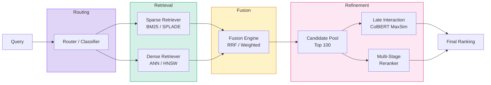
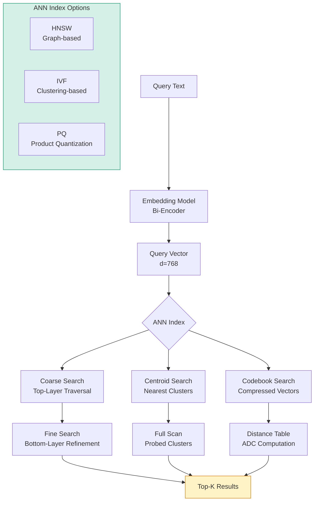
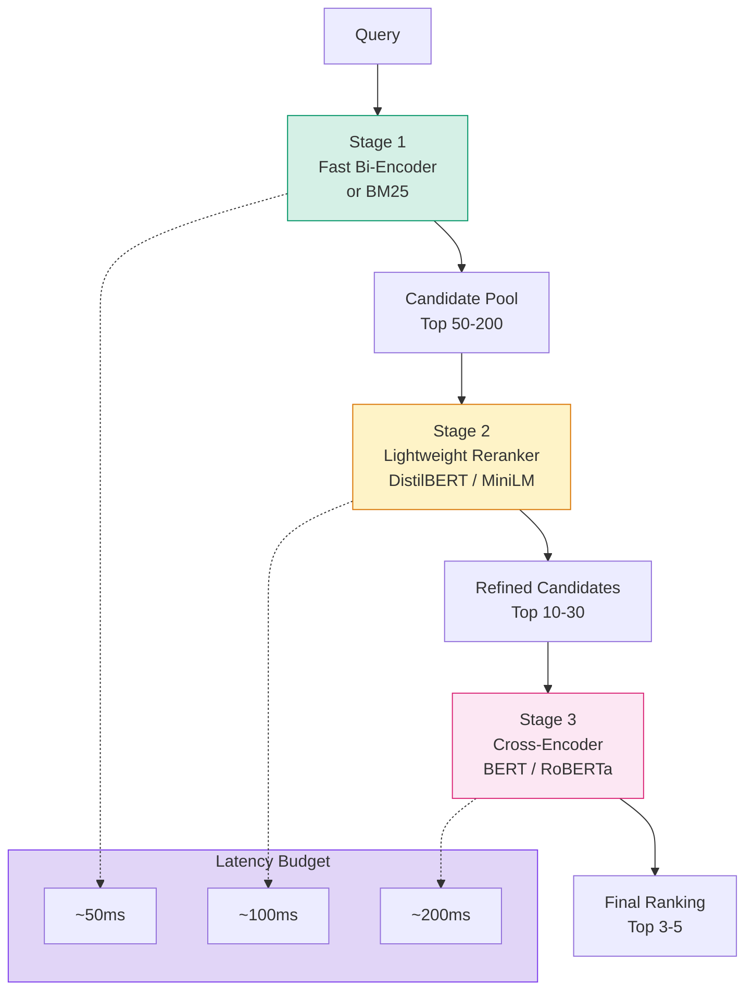
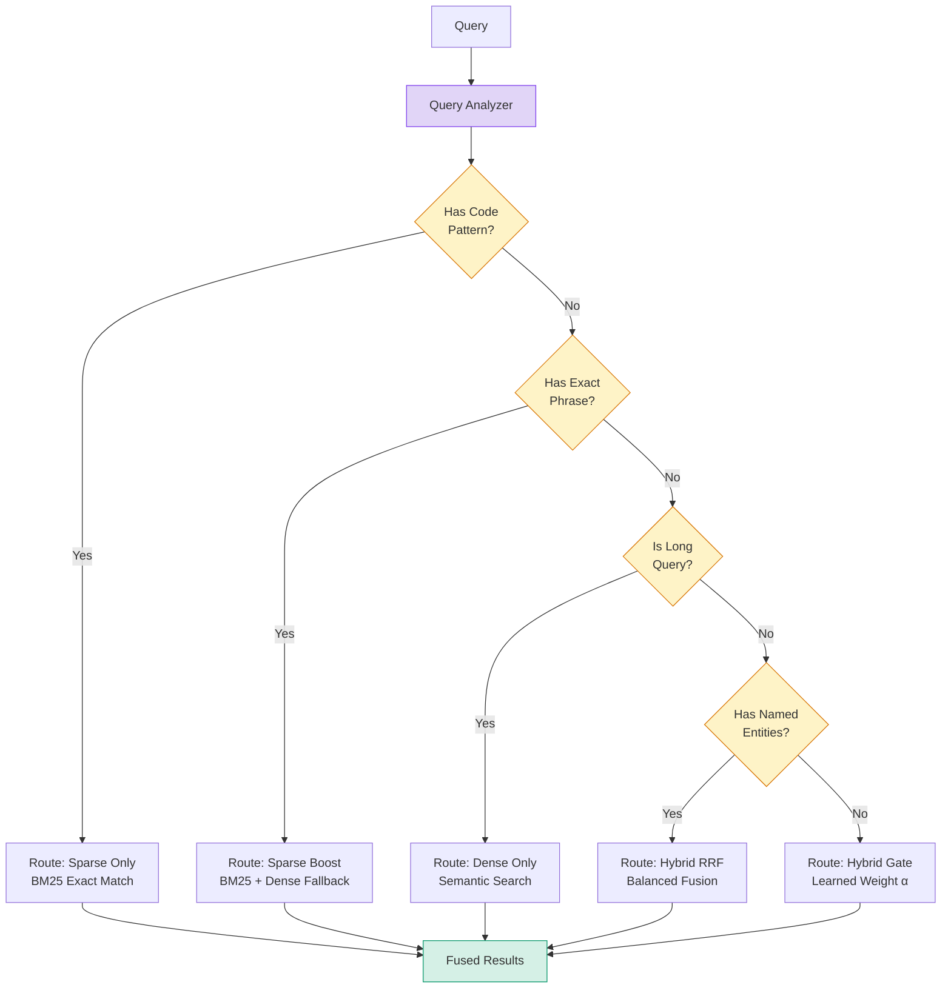
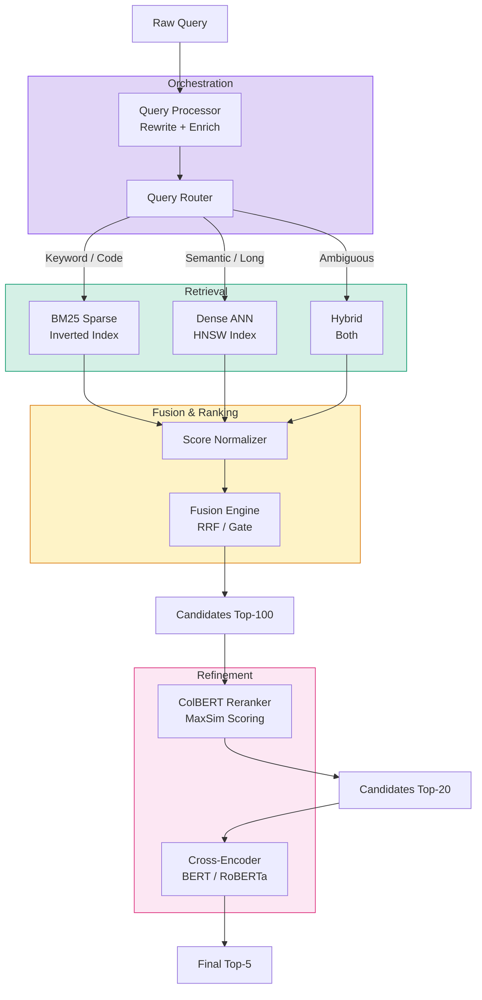

<!-- Clear Language: Keep sentences under 50 words -->
# Hybrid Search Architecture

## Learning Objectives

| Objective | Description |
|-----------|-------------|
| LO1 | Understand dense retrieval — embedding-based ANN search with HNSW and IVF indexes |
| LO2 | Implement sparse retrieval using BM25, TF-IDF, and learned sparse models like SPLADE |
| LO3 | Design fusion strategies — RRF, weighted sum, score normalization, rank-based merging |
| LO4 | Build multi-stage retrieval pipelines with cascade reranking architecture |
| LO5 | Apply late interaction models including ColBERT and MaxSim scoring |
| LO6 | Implement routing strategies — query classification, hybrid gates, ensemble retrieval |

## Introduction

Search systems today must handle both exact keyword matches and semantic understanding.
Hybrid search architecture combines the strengths of sparse (keyword) and dense (semantic) retrieval into a unified pipeline.
It is the backbone of production RAG systems, enterprise search, and modern information retrieval.

This chapter covers the complete hybrid search stack — from individual retrieval methods to fusion strategies,
multi-stage pipelines, late interaction models, and intelligent routing of queries to the best retriever.

## Prerequisites

- Basic Python programming (NumPy, scikit-learn)
- Understanding of vector embeddings and similarity metrics
- Familiarity with inverted indexes and TF-IDF weighting
- Knowledge of approximate nearest neighbor (ANN) search concepts

## Key Terminology

**Term**: Core vocabulary and concepts for hybrid search architecture.

**Definition**: Essential terms you must know for interviews and production work.

| Term | Meaning |
|------|---------|
| **Bi-encoder** | Independently encodes query and documents into fixed vectors |
| **Cross-encoder** | Jointly encodes query-document pairs for precise relevance scoring |
| **ANN** | Approximate Nearest Neighbor — fast vector search with accuracy trade-off |
| **HNSW** | Hierarchical Navigable Small World — graph-based ANN index |
| **IVF** | Inverted File Index — clustering-based ANN index |
| **RRF** | Reciprocal Rank Fusion — rank-based merging of search results |
| **SPLADE** | Sparse Lexical and Dense — learned sparse representation model |
| **ColBERT** | Contextualized Late Interaction over BERT — token-level matching |
| **MaxSim** | Maximum similarity operation between token embeddings |
| **Hybrid Gate** | Routing mechanism to select best retriever per query |

## Theory

Hybrid search architecture is fundamental for AI engineers building production retrieval systems.
This section covers the core concepts, trade-offs, and theoretical framework.

## Chapter at a Glance

| Section | Topic | Key Concept |
|---------|-------|-------------|
| 16.1 | Dense Retrieval | Embedding-based ANN search with HNSW and IVF |
| 16.2 | Sparse Retrieval | BM25, TF-IDF, SPLADE, learned sparse |
| 16.3 | Fusion Strategies | RRF, weighted sum, score normalization |
| 16.4 | Multi-Stage Retrieval | Cascade design — efficient first pass, accurate second pass |
| 16.5 | Late Interaction Models | ColBERT, MaxSim, contextualized token matching |
| 16.6 | Routing Strategies | Query classification, hybrid gate, ensemble retrieval |

## Chapter Roadmap



## 16.1 Dense Retrieval

Dense retrieval represents queries and documents as dense vectors (embeddings) in a continuous vector space.
Similarity is measured using distance metrics like cosine similarity or dot product.
The retriever searches for documents whose embeddings are closest to the query embedding.

### Embedding-Based Search

The core of dense retrieval is an embedding model (bi-encoder) that maps text to a fixed-size vector.
Common models include `text-embedding-ada-002`, `all-MiniLM-L6-v2`, `bge-large-en-v1.5`.

```python
import numpy as np
from typing import List, Dict, Tuple, Optional
from dataclasses import dataclass, field
import heapq

@dataclass
class Document:
    doc_id: str
    text: str
    embedding: Optional[np.ndarray] = None

@dataclass
class SearchResult:
    document: Document
    score: float
    rank: int
    method: str = ""

class DenseRetriever:
    """Dense retrieval using cosine similarity search."""

    def __init__(self, documents: List[Document], normalize: bool = True):
        self.documents = documents
        self.normalize = normalize
        if normalize and documents and documents[0].embedding is not None:
            self._normalize_embeddings()

    def _normalize_embeddings(self) -> None:
        for doc in self.documents:
            norm = np.linalg.norm(doc.embedding)
            if norm > 0:
                doc.embedding = doc.embedding / norm

    def cosine_similarity(
        self, query_emb: np.ndarray, doc_emb: np.ndarray
    ) -> float:
        if self.normalize:
            return float(np.dot(query_emb, doc_emb))
        q_norm = np.linalg.norm(query_emb)
        d_norm = np.linalg.norm(doc_emb)
        if q_norm == 0 or d_norm == 0:
            return 0.0
        return float(np.dot(query_emb, doc_emb) / (q_norm * d_norm))

    def dot_product(
        self, query_emb: np.ndarray, doc_emb: np.ndarray
    ) -> float:
        return float(np.dot(query_emb, doc_emb))

    def search(
        self, query_emb: np.ndarray, top_k: int = 10,
        similarity_fn: str = "cosine"
    ) -> List[SearchResult]:
        if similarity_fn == "cosine":
            sim_func = self.cosine_similarity
        elif similarity_fn == "dot":
            sim_func = self.dot_product
        else:
            raise ValueError(f"Unknown similarity: {similarity_fn}")

        scores = []
        for doc in self.documents:
            score = sim_func(query_emb, doc.embedding)
            scores.append((score, doc))

        scores.sort(key=lambda x: x[0], reverse=True)
        return [
            SearchResult(doc, score, rank, "dense")
            for rank, (score, doc) in enumerate(scores[:top_k], 1)
        ]

    def search_batched(
        self, query_embs: np.ndarray, top_k: int = 10
    ) -> List[List[SearchResult]]:
        """Batch search for multiple queries (matrix multiply)."""
        emb_matrix = np.stack(
            [d.embedding for d in self.documents]
        )
        # query_embs: (n_queries, dim), emb_matrix: (n_docs, dim)
        scores = np.dot(query_embs, emb_matrix.T)
        if self.normalize:
            q_norms = np.linalg.norm(query_embs, axis=1, keepdims=True)
            d_norms = np.linalg.norm(emb_matrix, axis=1, keepdims=True).T
            scores = scores / (q_norms * d_norms + 1e-10)

        results = []
        for q_idx in range(scores.shape[0]):
            top_indices = np.argsort(scores[q_idx])[::-1][:top_k]
            results.append([
                SearchResult(
                    self.documents[idx],
                    float(scores[q_idx][idx]),
                    rank + 1,
                    "dense"
                )
                for rank, idx in enumerate(top_indices)
            ])
        return results
```

### Cosine Similarity vs Dot Product

Both metrics measure vector alignment but behave differently under normalization.

```python
def compare_similarity_metrics():
    """Demonstrate when cosine vs dot product matters."""
    import numpy as np

    # Two vectors with same direction but different magnitudes
    v1 = np.array([0.8, 0.6])
    v2 = np.array([0.08, 0.06])  # same direction, 10x smaller

    cos_sim = np.dot(v1, v2) / (np.linalg.norm(v1) * np.linalg.norm(v2))
    dot_prod = np.dot(v1, v2)

    print(f"Vectors: v1={v1}, v2={v2}")
    print(f"Cosine similarity: {cos_sim:.4f}")
    print(f"Dot product: {dot_prod:.4f}")
    print("---")
    print("Cosine: invariant to magnitude — captures direction only")
    print("Dot product: sensitive to magnitude — favors longer vectors")
    print()
    print("When to use each:")
    print("  Cosine:    Embeddings are L2-normalized; you care about angle")
    print("  Dot:       Embedding magnitude carries information (e.g., term frequency)")
    print("  In practice: Most sentence transformers output normalized embeddings")
    print("               so cosine = dot product under normalization")

compare_similarity_metrics()
```

**Output**:
```
Vectors: v1=[0.8 0.6], v2=[0.08 0.06]
Cosine similarity: 1.0000
Dot product: 0.1000
---
Cosine: invariant to magnitude — captures direction only
Dot product: sensitive to magnitude — favors longer vectors
```

### ANN Search — HNSW and IVF

Exhaustive search (comparing against all documents) does not scale beyond ~100K documents.
Approximate Nearest Neighbor (ANN) indexes trade a small accuracy loss for massive speed gains.

```python
@dataclass
class HNSWNode:
    """A node in the HNSW graph."""
    vector: np.ndarray
    doc_id: str
    neighbors: Dict[int, List[str]] = field(default_factory=dict)
    # neighbors[level] = list of neighbor node IDs

class HNSWIndex:
    """
    Hierarchical Navigable Small World index.
    Multi-layer graph: top layer has long edges (coarse), bottom has short edges (fine).
    Search starts at top layer and descends.
    """

    def __init__(
        self,
        dim: int,
        M: int = 16,
        ef_construction: int = 200,
        ef_search: int = 50,
        ml: float = 1.0 / np.log(1.0 * M)
    ):
        self.dim = dim
        self.M = M  # number of connections per layer
        self.M_max = M
        self.ef_construction = ef_construction
        self.ef_search = ef_search
        self.ml = ml  # level normalization factor
        self.nodes: Dict[str, HNSWNode] = {}
        self.entry_point: Optional[str] = None
        self.max_level = 0

    def _random_level(self) -> int:
        """Assign random level for new node (exponential decay)."""
        return int(-np.log(np.random.random()) * self.ml)

    def _distance(self, a: np.ndarray, b: np.ndarray) -> float:
        return float(np.linalg.norm(a - b))

    def add(self, doc_id: str, vector: np.ndarray) -> None:
        level = self._random_level()
        node = HNSWNode(vector=vector, doc_id=doc_id)

        if self.entry_point is None:
            self.entry_point = doc_id
            self.max_level = level
            self.nodes[doc_id] = node
            return

        # find nearest neighbor from entry point
        curr = self.entry_point
        curr_dist = self._distance(vector, self.nodes[curr].vector)

        # traverse from top layer down to level+1
        for lc in range(self.max_level, level, -1):
            changed = True
            while changed:
                changed = False
                curr_node = self.nodes[curr]
                for neighbor_id in curr_node.neighbors.get(lc, []):
                    d = self._distance(vector, self.nodes[neighbor_id].vector)
                    if d < curr_dist:
                        curr = neighbor_id
                        curr_dist = d
                        changed = True

        # connect at current and lower layers
        for lc in range(min(level, self.max_level), -1, -1):
            # find M nearest neighbors at this layer
            candidates = self._search_at_layer(vector, curr, lc, self.M)
            node.neighbors[lc] = [c[0] for c in candidates]
            for neighbor_id, _ in candidates:
                if lc not in self.nodes[neighbor_id].neighbors:
                    self.nodes[neighbor_id].neighbors[lc] = []
                if doc_id not in self.nodes[neighbor_id].neighbors[lc]:
                    self.nodes[neighbor_id].neighbors[lc].append(doc_id)

        self.nodes[doc_id] = node
        if level > self.max_level:
            self.max_level = level
            self.entry_point = doc_id

    def _search_at_layer(
        self, query: np.ndarray, entry: str,
        layer: int, ef: int
    ) -> List[Tuple[str, float]]:
        visited = {entry}
        candidates = [(self._distance(query, self.nodes[entry].vector), entry)]
        heapq.heapify(candidates)
        results = [(self._distance(query, self.nodes[entry].vector), entry)]
        heapq.heapify(results)

        while candidates:
            dist, node_id = heapq.heappop(candidates)
            # furthest in results
            furthest_dist = -results[0][0] if results else float('inf')

            if dist > furthest_dist + 1e-6:
                break

            node = self.nodes[node_id]
            for neighbor_id in node.neighbors.get(layer, []):
                if neighbor_id not in visited:
                    visited.add(neighbor_id)
                    d = self._distance(query, self.nodes[neighbor_id].vector)
                    heapq.heappush(candidates, (d, neighbor_id))

                    if len(results) < ef:
                        heapq.heappush(results, (-d, neighbor_id))
                    elif d < -results[0][0]:
                        heapq.heappushpop(results, (-d, neighbor_id))

        return [(nid, -d) for d, nid in sorted(results, key=lambda x: -x[0])]

    def search(
        self, query: np.ndarray, top_k: int = 10
    ) -> List[Tuple[str, float]]:
        if self.entry_point is None:
            return []

        curr = self.entry_point
        curr_dist = self._distance(query, self.nodes[curr].vector)

        for lc in range(self.max_level, 0, -1):
            changed = True
            while changed:
                changed = False
                node = self.nodes[curr]
                for neighbor_id in node.neighbors.get(lc, []):
                    d = self._distance(query, self.nodes[neighbor_id].vector)
                    if d < curr_dist:
                        curr = neighbor_id
                        curr_dist = d
                        changed = True

        candidates = self._search_at_layer(
            query, curr, 0, max(self.ef_search, top_k)
        )
        return sorted(candidates, key=lambda x: x[1])[:top_k]

class IVFIndex:
    """
    Inverted File Index.
    Clusters vectors into Voronoi cells. Search only explores nearest centroids.
    """

    def __init__(
        self, dim: int, n_centroids: int = 100, n_probe: int = 10
    ):
        self.dim = dim
        self.n_centroids = n_centroids
        self.n_probe = n_probe
        self.centroids: Optional[np.ndarray] = None
        self.inverted_lists: Dict[int, List[Tuple[str, np.ndarray]]] = {}
        self.doc_ids: List[str] = []

    def train(self, vectors: np.ndarray, doc_ids: List[str]) -> None:
        """K-means clustering to build inverted lists."""
        from sklearn.cluster import KMeans

        kmeans = KMeans(
            n_clusters=self.n_centroids, random_state=42, n_init=3
        )
        labels = kmeans.fit_predict(vectors)
        self.centroids = kmeans.cluster_centers_

        for idx, label in enumerate(labels):
            if label not in self.inverted_lists:
                self.inverted_lists[label] = []
            self.inverted_lists[label].append((doc_ids[idx], vectors[idx]))

        self.doc_ids = doc_ids

    def search(
        self, query: np.ndarray, top_k: int = 10
    ) -> List[Tuple[str, float]]:
        if self.centroids is None:
            return []

        # find nearest n_probe centroids
        dists = np.linalg.norm(
            self.centroids - query.reshape(1, -1), axis=1
        )
        nearest_centroids = np.argsort(dists)[:self.n_probe]

        # search only within those inverted lists
        candidates: List[Tuple[float, str]] = []
        for cid in nearest_centroids:
            for doc_id, vec in self.inverted_lists.get(cid, []):
                dist = float(np.linalg.norm(vec - query))
                candidates.append((dist, doc_id))

        candidates.sort(key=lambda x: x[0])
        return candidates[:top_k]

    def recall_at_k(
        self, query: np.ndarray, ground_truth: List[str], k: int = 10
    ) -> float:
        results = self.search(query, top_k=k)
        retrieved = set(doc_id for _, doc_id in results)
        relevant = set(ground_truth)
        if not relevant:
            return 0.0
        return len(retrieved & relevant) / len(relevant)

def demonstrate_dense_retrieval():
    """End-to-end dense retrieval example."""
    dim = 128
    n_docs = 1000

    # synthetic embeddings
    rng = np.random.RandomState(42)
    documents = [
        Document(
            doc_id=f"doc_{i}",
            text=f"Document {i} about {'AI' if i % 3 == 0 else 'search' if i % 3 == 1 else 'data'}",
            embedding=rng.randn(dim).astype(np.float32)
        )
        for i in range(n_docs)
    ]

    retriever = DenseRetriever(documents, normalize=True)
    query_emb = rng.randn(dim).astype(np.float32)
    query_emb = query_emb / np.linalg.norm(query_emb)

    results = retriever.search(query_emb, top_k=5, similarity_fn="cosine")
    print("=== Dense Retrieval Results (Cosine) ===")
    for r in results:
        print(f"  Rank {r.rank}: {r.document.doc_id} — score={r.score:.4f}")

    # Compare with dot product on non-normalized
    retriever_un = DenseRetriever(documents, normalize=False)
    results_dot = retriever_un.search(query_emb, top_k=5, similarity_fn="dot")
    print("\n=== Dense Retrieval Results (Dot Product, unnormalized) ===")
    for r in results_dot:
        print(f"  Rank {r.rank}: {r.document.doc_id} — score={r.score:.4f}")

demonstrate_dense_retrieval()
```



## 16.2 Sparse Retrieval

Sparse retrieval represents documents as sparse vectors (bags of words or learned term weights).
BM25 and TF-IDF operate over inverted indexes. SPLADE learns sparse representations from transformer models.

### BM25 Implementation

BM25 scores each query term based on its frequency in the document relative to the corpus.
It includes document length normalization and saturation to prevent term frequency domination.

```python
import math
from collections import Counter, defaultdict
from typing import List, Set
import re

class BM25:
    """
    Okapi BM25 retrieval model.
    Score = sum over query terms of IDF * (f * (k1 + 1)) / (f + k1 * (1 - b + b * |d| / avgdl))
    """

    def __init__(
        self,
        k1: float = 1.5,
        b: float = 0.75,
        epsilon: float = 0.25
    ):
        self.k1 = k1
        self.b = b
        self.epsilon = epsilon
        self.documents: List[str] = []
        self.doc_ids: List[str] = []
        self.avgdl: float = 0.0
        self.doc_freqs: List[Counter] = []
        self.idf: Dict[str, float] = {}
        self.doc_len: List[int] = []
        self.N: int = 0  # total documents
        self.inverted_index: Dict[str, List[int]] = defaultdict(list)

    def _tokenize(self, text: str) -> List[str]:
        return re.findall(r'\w+', text.lower())

    def fit(self, documents: List[str], doc_ids: List[str]) -> None:
        self.documents = documents
        self.doc_ids = doc_ids
        self.N = len(documents)
        self.doc_len = []
        self.doc_freqs = []
        doc_term_set: List[Set[str]] = []

        for doc in documents:
            tokens = self._tokenize(doc)
            self.doc_len.append(len(tokens))
            freq = Counter(tokens)
            self.doc_freqs.append(freq)
            doc_term_set.append(set(tokens.keys()))

        self.avgdl = sum(self.doc_len) / max(self.N, 1)

        # build inverted index and compute IDF
        df: Counter = Counter()
        for idx, term_set in enumerate(doc_term_set):
            for term in term_set:
                df[term] += 1
                self.inverted_index[term].append(idx)

        self.idf = {}
        for term, doc_freq in df.items():
            idf = math.log(
                (self.N - doc_freq + 0.5) / (doc_freq + 0.5) + 1.0
            )
            self.idf[term] = max(idf, self.epsilon)

    def _score_document(self, query_tokens: List[str], doc_idx: int) -> float:
        score = 0.0
        doc_len = self.doc_len[doc_idx]
        doc_freq = self.doc_freqs[doc_idx]

        for term in query_tokens:
            if term not in self.idf:
                continue
            idf = self.idf[term]
            f = doc_freq.get(term, 0)
            if f == 0:
                continue
            # BM25 term frequency saturation
            numerator = f * (self.k1 + 1.0)
            denominator = f + self.k1 * (
                1.0 - self.b + self.b * doc_len / self.avgdl
            )
            score += idf * numerator / denominator

        return score

    def search(
        self, query: str, top_k: int = 10
    ) -> List[SearchResult]:
        query_tokens = self._tokenize(query)
        scores = []

        # find candidate docs via inverted index
        candidate_docs: Set[int] = set()
        for term in query_tokens:
            if term in self.inverted_index:
                for doc_idx in self.inverted_index[term]:
                    candidate_docs.add(doc_idx)

        for doc_idx in candidate_docs:
            score = self._score_document(query_tokens, doc_idx)
            scores.append((score, doc_idx))

        scores.sort(key=lambda x: x[0], reverse=True)
        return [
            SearchResult(
                Document(
                    doc_id=self.doc_ids[idx],
                    text=self.documents[idx]
                ),
                score, rank, "bm25"
            )
            for rank, (score, idx) in enumerate(scores[:top_k], 1)
        ]

class TFIDFRetriever:
    """TF-IDF based sparse retrieval."""

    def __init__(self, smooth_idf: bool = True):
        self.smooth_idf = smooth_idf
        self.documents: List[str] = []
        self.doc_ids: List[str] = []
        self.tf_matrix: List[Counter] = []
        self.idf: Dict[str, float] = {}
        self.vocabulary: List[str] = []

    def _tokenize(self, text: str) -> List[str]:
        return re.findall(r'\w+', text.lower())

    def fit(self, documents: List[str], doc_ids: List[str]) -> None:
        self.documents = documents
        self.doc_ids = doc_ids
        N = len(documents)

        # term frequency per document
        self.tf_matrix = []
        df = Counter()
        for doc in documents:
            tokens = self._tokenize(doc)
            freq = Counter(tokens)
            self.tf_matrix.append(freq)
            for term in freq:
                df[term] += 1

        self.vocabulary = sorted(df.keys())

        # inverse document frequency
        for term, doc_freq in df.items():
            if self.smooth_idf:
                self.idf[term] = math.log((N + 1) / (doc_freq + 1)) + 1.0
            else:
                self.idf[term] = math.log(N / max(doc_freq, 1))

    def search(
        self, query: str, top_k: int = 10
    ) -> List[SearchResult]:
        query_tokens = self._tokenize(query)
        query_tf = Counter(query_tokens)

        scores = []
        for idx in range(len(self.documents)):
            score = 0.0
            for term in query_tf:
                if term not in self.idf:
                    continue
                tf = self.tf_matrix[idx].get(term, 0)
                if tf == 0:
                    continue
                # TF-IDF = (1 + log(tf)) * log(N/df)
                tf_weight = 1 + math.log(tf) if tf > 0 else 0
                score += tf_weight * self.idf[term]
            scores.append((score, idx))

        scores.sort(key=lambda x: x[0], reverse=True)
        return [
            SearchResult(
                Document(
                    doc_id=self.doc_ids[idx],
                    text=self.documents[idx]
                ),
                score, rank, "tfidf"
            )
            for rank, (score, idx) in enumerate(scores[:top_k], 1)
        ]

def compare_sparse_methods():
    """Compare BM25 and TF-IDF on sample documents."""
    docs = [
        "The quick brown fox jumps over the lazy dog",
        "A fast brown fox leaps over a sleepy dog",
        "The lazy dog sleeps in the sun all day",
        "Machine learning models learn from data patterns",
        "Deep neural networks excel at pattern recognition",
        "Data science involves statistics machine learning and visualization",
        "Python is a popular language for machine learning and data science",
    ]
    doc_ids = [f"doc_{i}" for i in range(len(docs))]

    bm25 = BM25()
    bm25.fit(docs, doc_ids)

    tfidf = TFIDFRetriever()
    tfidf.fit(docs, doc_ids)

    queries = ["brown fox jumps", "machine learning data", "lazy dog sleep"]

    for query in queries:
        print(f"\n=== Query: '{query}' ===")

        bm25_results = bm25.search(query, top_k=3)
        tfidf_results = tfidf.search(query, top_k=3)

        print("BM25:")
        for r in bm25_results:
            print(f"  Rank {r.rank}: {r.document.doc_id} — score={r.score:.4f}")
        print("TF-IDF:")
        for r in tfidf_results:
            print(f"  Rank {r.rank}: {r.document.doc_id} — score={r.score:.4f}")

compare_sparse_methods()
```

### Learned Sparse Representations (SPLADE)

SPLADE uses a transformer encoder to produce term-weighted sparse vectors directly.
Each token in the vocabulary gets a weight indicating its relevance to the document/query.
This combines the interpretability of sparse retrieval with the semantic power of transformers.

```python
class SPLADEStyleRetriever:
    """
    Simplified SPLADE-style learned sparse retrieval.
    Uses MLM-based logits to produce term importance weights.

    In production: use a trained SPLADE model from HuggingFace.
    """

    def __init__(
        self, vocabulary: List[str], lambda_reg: float = 0.01
    ):
        self.vocabulary = vocabulary
        self.vocab_index = {w: i for i, w in enumerate(vocabulary)}
        self.lambda_reg = lambda_reg
        # In practice, this would be a BERT MLM head output
        # Here we simulate with random term importance
        self.doc_vectors: Dict[str, np.ndarray] = {}

    def _encode_simulated(
        self, text: str, rng: np.random.RandomState
    ) -> np.ndarray:
        """Simulate SPLADE output: sparse logits over vocabulary."""
        tokens = re.findall(r'\w+', text.lower())
        vec = np.zeros(len(self.vocabulary), dtype=np.float32)

        for token in tokens:
            if token in self.vocab_index:
                # Simulate MLM logit (would be from BERT in practice)
                vec[self.vocab_index[token]] = rng.exponential(scale=2.0)

        # ReLU + log-saturation (SPLADE uses log(1 + ReLU(x)))
        vec = np.log1p(np.maximum(vec, 0.0))

        # Apply FLOPS regularization penalty (simulated)
        sparsity = np.mean(vec > 0)
        reg_penalty = self.lambda_reg * sparsity * len(tokens)

        return vec

    def fit(
        self, documents: List[str], doc_ids: List[str],
        seed: int = 42
    ) -> None:
        rng = np.random.RandomState(seed)
        for doc_id, text in zip(doc_ids, documents):
            self.doc_vectors[doc_id] = self._encode_simulated(text, rng)

    def search(
        self, query: str, top_k: int = 10
    ) -> List[SearchResult]:
        rng = np.random.RandomState(42)
        query_vec = self._encode_simulated(query, rng)

        scores = []
        for doc_id, doc_vec in self.doc_vectors.items():
            # Dot product of sparse vectors (SPLADE scoring)
            score = float(np.dot(query_vec, doc_vec))
            scores.append((score, doc_id))

        scores.sort(key=lambda x: x[0], reverse=True)
        return [
            SearchResult(
                Document(doc_id=doc_id, text=""),
                score, rank, "splade"
            )
            for rank, (score, doc_id) in enumerate(scores[:top_k], 1)
        ]

    def interpret_query(self, query: str) -> List[Tuple[str, float]]:
        """Show which vocabulary terms are activated for a query."""
        rng = np.random.RandomState(42)
        query_vec = self._encode_simulated(query, rng)

        activated = [
            (self.vocabulary[i], float(query_vec[i]))
            for i in np.argsort(query_vec)[::-1][:10]
            if query_vec[i] > 0
        ]
        return activated
```

```mermaid
flowchart LR
    subgraph Sparse [Sparse Retrieval Methods]
        BM25[BM25<br/>Okapi BM25<br/>k1=1.5, b=0.75]
        TFIDF[TF-IDF<br/>Term Freq x Inverse Doc Freq]
        SPLADE[SPLADE<br/>Learned Sparse<br/>Transformer + MLM]
    end

    subgraph Index [Index Structure]
        INVERTED[Inverted Index<br/>Term → Doc List]
        POSTING[Posting List<br/>(doc_id, tf, positions)]
    end

    subgraph Scoring [Scoring]
        SATURATION[Term Saturation<br/>f / (f + k1 * norm)]
        IDF_COMP[IDF Component<br/>log(N / df)]
        DOT_PROD[Dot Product<br/>Sparse Vector Similarity]
    end

    BM25 --> INVERTED --> POSTING --> SATURATION --> IDF_COMP --> SCORE[Final Score]
    TFIDF --> INVERTED
    SPLADE --> DOT_PROD --> SCORE

    style Sparse fill:#e1d5f7,stroke:#7c3aed
    style Index fill:#d5f0e6,stroke:#059669
    style Scoring fill:#fef3c7,stroke:#d97706
```

## 16.3 Fusion Strategies

Fusion combines results from multiple retrieval methods into a single ranked list.
The challenge is that scores from different retrievers are not directly comparable.

### Reciprocal Rank Fusion (RRF)

RRF is the simplest and most robust fusion method. It converts ranks to scores using:

`score(doc) = sum( 1 / (k + rank_r(doc)) )` for each retriever r.

```python
from collections import defaultdict
from typing import List, Dict, Callable

class FusionEngine:
    """Combines results from multiple retrievers into a single ranking."""

    def __init__(self, strategy: str = "rrf", k_constant: int = 60):
        self.strategy = strategy
        self.k_constant = k_constant  # RRF constant

    def fuse(
        self, results_list: List[List[SearchResult]], top_k: int = 10
    ) -> List[SearchResult]:
        if self.strategy == "rrf":
            return self._rrf_fusion(results_list, top_k)
        elif self.strategy == "weighted":
            return self._weighted_fusion(results_list, top_k)
        elif self.strategy == "borda":
            return self._borda_fusion(results_list, top_k)
        elif self.strategy == "score_norm":
            return self._score_normalized_fusion(results_list, top_k)
        else:
            raise ValueError(f"Unknown fusion strategy: {self.strategy}")

    def _rrf_fusion(
        self, results_list: List[List[SearchResult]], top_k: int
    ) -> List[SearchResult]:
        """Reciprocal Rank Fusion."""
        scores: Dict[str, float] = defaultdict(float)
        doc_map: Dict[str, Document] = {}

        for results in results_list:
            for rank, result in enumerate(results, 1):
                doc_map[result.document.doc_id] = result.document
                scores[result.document.doc_id] += 1.0 / (
                    self.k_constant + rank
                )

        sorted_docs = sorted(
            scores.items(), key=lambda x: x[1], reverse=True
        )

        return [
            SearchResult(
                doc_map[doc_id],
                score,
                rank + 1,
                f"rrf_fusion_{self.strategy}"
            )
            for rank, (doc_id, score) in enumerate(
                sorted_docs[:top_k]
            )
        ]

    def _weighted_fusion(
        self, results_list: List[List[SearchResult]], top_k: int,
        weights: Optional[List[float]] = None
    ) -> List[SearchResult]:
        """Weighted linear combination of normalized scores."""
        n_retrievers = len(results_list)
        if weights is None:
            weights = [1.0 / n_retrievers] * n_retrievers
        assert len(weights) == n_retrievers

        scores: Dict[str, float] = defaultdict(float)
        doc_map: Dict[str, Document] = {}

        for retriever_idx, results in enumerate(results_list):
            # Score normalize to [0, 1] within this retriever
            scores_list = [r.score for r in results]
            max_s = max(scores_list) if scores_list else 1.0
            min_s = min(scores_list) if scores_list else 0.0
            s_range = max_s - min_s if max_s != min_s else 1.0

            for result in results:
                doc_map[result.document.doc_id] = result.document
                norm_score = (result.score - min_s) / s_range
                scores[result.document.doc_id] += (
                    weights[retriever_idx] * norm_score
                )

        sorted_docs = sorted(
            scores.items(), key=lambda x: x[1], reverse=True
        )
        return [
            SearchResult(
                doc_map[doc_id], score, rank + 1, "weighted_fusion"
            )
            for rank, (doc_id, score) in enumerate(
                sorted_docs[:top_k]
            )
        ]

    def _borda_fusion(
        self, results_list: List[List[SearchResult]], top_k: int
    ) -> List[SearchResult]:
        """Borda count: points based on rank position."""
        scores: Dict[str, float] = defaultdict(float)
        doc_map: Dict[str, Document] = {}

        for results in results_list:
            n_results = len(results)
            for rank, result in enumerate(results, 1):
                doc_map[result.document.doc_id] = result.document
                # Higher rank = more points
                scores[result.document.doc_id] += n_results - rank + 1

        sorted_docs = sorted(
            scores.items(), key=lambda x: x[1], reverse=True
        )
        return [
            SearchResult(
                doc_map[doc_id], score, rank + 1, "borda_fusion"
            )
            for rank, (doc_id, score) in enumerate(
                sorted_docs[:top_k]
            )
        ]

    def _score_normalized_fusion(
        self, results_list: List[List[SearchResult]], top_k: int
    ) -> List[SearchResult]:
        """Fuse by normalizing scores then summing."""
        # Min-max normalization per retriever
        normalized_results = []
        for results in results_list:
            scores = [r.score for r in results]
            min_s = min(scores) if scores else 0.0
            max_s = max(scores) if scores else 1.0
            s_range = max_s - min_s if max_s != min_s else 1.0
            normalized_list = []
            for r in results:
                norm_score = (r.score - min_s) / s_range
                normalized_list.append(
                    SearchResult(
                        r.document, norm_score, r.rank, r.method
                    )
                )
            normalized_results.append(normalized_list)

        return self._rrf_fusion(normalized_results, top_k)

class ScoreNormalizer:
    """Normalize scores from different retrievers to comparable scales."""

    @staticmethod
    def min_max(
        scores: List[float], eps: float = 1e-10
    ) -> List[float]:
        min_s = min(scores)
        max_s = max(scores)
        if abs(max_s - min_s) < eps:
            return [0.5] * len(scores)
        return [(s - min_s) / (max_s - min_s) for s in scores]

    @staticmethod
    def z_score(scores: List[float]) -> List[float]:
        mean = np.mean(scores)
        std = np.std(scores)
        if std < 1e-10:
            return [0.0] * len(scores)
        return [(s - mean) / std for s in scores]

    @staticmethod
    def quantile(
        scores: List[float], n_quantiles: int = 10
    ) -> List[float]:
        """Rank-based normalization to quantile bins."""
        sorted_scores = sorted(enumerate(scores), key=lambda x: x[1])
        n = len(scores)
        normalized = [0.0] * n
        for rank, (orig_idx, _) in enumerate(sorted_scores):
            quantile = rank / max(n - 1, 1)
            normalized[orig_idx] = quantile
        return normalized

    @staticmethod
    def softmax(
        scores: List[float], temperature: float = 1.0
    ) -> List[float]:
        exp_s = [math.exp(s / temperature) for s in scores]
        total = sum(exp_s)
        return [s / total for s in exp_s]

def demonstrate_fusion_strategies():
    """Compare fusion strategies on example results."""
    import numpy as np

    # Simulate results from two retrievers
    sparse_results = [
        SearchResult(Document("doc_1", "AI document"), 25.0, 1, "bm25"),
        SearchResult(Document("doc_2", "Search doc"), 20.0, 2, "bm25"),
        SearchResult(Document("doc_3", "Data doc"), 18.0, 3, "bm25"),
        SearchResult(Document("doc_4", "ML doc"), 15.0, 4, "bm25"),
    ]

    dense_results = [
        SearchResult(Document("doc_5", "Neural doc"), 0.92, 1, "dense"),
        SearchResult(Document("doc_1", "AI document"), 0.88, 2, "dense"),
        SearchResult(Document("doc_3", "Data doc"), 0.85, 3, "dense"),
        SearchResult(Document("doc_6", "Vector doc"), 0.81, 4, "dense"),
    ]

    engine = FusionEngine()

    print("=== RRF Fusion ===")
    rrf_results = engine.fuse([sparse_results, dense_results], top_k=4)
    for r in rrf_results:
        print(f"  {r.document.doc_id}: RRF score={r.score:.4f}")

    print("\n=== Weighted Fusion (equal weights) ===")
    w_results = engine.fuse(
        [sparse_results, dense_results], top_k=4, weights=[0.5, 0.5]
    )
    for r in w_results:
        print(f"  {r.document.doc_id}: weighted score={r.score:.4f}")

    print("\n=== Borda Fusion ===")
    b_results = engine.fuse([sparse_results, dense_results], top_k=4)
    for r in b_results:
        print(f"  {r.document.doc_id}: borda score={r.score:.4f}")

    print("\n=== Rank vs Score Based ===")
    print("RRF: rank-based — uses only ordering, immune to score hacking")
    print("Weighted: score-based — sensitive to normalization but captures confidence")
    print("Borda: rank-based — similar to RRF, simpler but less robust")

demonstrate_fusion_strategies()
```

```mermaid
flowchart TD
    subgraph Retrievers
        S[Sparse<br/>BM25] --> SR[(Sparse<br/>Results)]
        D[Dense<br/>ANN] --> DR[(Dense<br/>Results)]
    end

    subgraph Normalization [Score Normalization]
        N1[Min-Max<br/>[0, 1] scaling]
        N2[Z-Score<br/>μ=0, σ=1]
        N3[Quantile<br/>Rank bins]
        N4[Softmax<br/>Probabilities]
    end

    subgraph Fusion [Fusion Methods]
        RRF[RRF<br/>1/(k + rank)]
        WS[Weighted Sum<br/>α·S_sparse + β·S_dense]
        BC[Borda Count<br/>n - rank + 1]
    end

    SR --> N1 --> RRF
    DR --> N1 --> RRF
    SR --> N2 --> WS
    DR --> N2 --> WS
    SR --> N3 --> BC
    DR --> N3 --> BC

    RRF --> FUSED[Fused Ranking]
    WS --> FUSED
    BC --> FUSED

    style Retrievers fill:#d5f0e6,stroke:#059669
    style Normalization fill:#fce7f3,stroke:#db2777
    style Fusion fill:#fef3c7,stroke:#d97706
```

## 16.4 Multi-Stage Retrieval

Multi-stage (cascade) retrieval separates retrieval into cheap and expensive phases.
First stage: fast, recall-oriented. Second stage: accurate, precision-oriented.

```python
class MultiStageRetriever:
    """
    Cascade retrieval pipeline:
    Stage 1: Fast bi-encoder / BM25 → top 100
    Stage 2: Lightweight reranker → top 20
    Stage 3: Cross-encoder / LLM → top 5
    """

    def __init__(
        self,
        stage1_retriever,
        stage2_reranker,
        stage3_reranker=None,
        stage1_k: int = 100,
        stage2_k: int = 20,
        stage3_k: int = 5,
    ):
        self.stage1 = stage1_retriever
        self.stage2 = stage2_reranker
        self.stage3 = stage3_reranker
        self.stage1_k = stage1_k
        self.stage2_k = stage2_k
        self.stage3_k = stage3_k

    def retrieve(
        self, query: str, query_emb: np.ndarray
    ) -> Dict[str, List[SearchResult]]:
        stage_log = {}

        # Stage 1: Fast retrieval (high recall, low precision)
        s1_results = self.stage1.search(query_emb, top_k=self.stage1_k)
        stage_log["stage1"] = s1_results

        # Stage 2: Lightweight reranking
        s2_results = self.stage2.rerank(
            query, s1_results, top_k=self.stage2_k
        )
        stage_log["stage2"] = s2_results

        # Stage 3: Expensive but accurate reranking
        if self.stage3 is not None:
            s3_results = self.stage3.rerank(
                query, s2_results, top_k=self.stage3_k
            )
            stage_log["stage3"] = s3_results
        else:
            stage_log["stage3"] = s2_results[:self.stage3_k]

        return stage_log

class LightweightReranker:
    """
    Stage 2 reranker using simple cross-encoder-like scoring.
    In production: DistilBERT or MiniLM cross-encoder.
    """

    def __init__(self, alpha: float = 0.5):
        self.alpha = alpha  # blend between original score and reranker score

    def rerank(
        self, query: str, candidates: List[SearchResult],
        top_k: int = 20
    ) -> List[SearchResult]:
        """Simulate reranking with a fake cross-encoder score."""
        rng = np.random.RandomState(hash(query) % (2**31))

        for result in candidates:
            # Simulated cross-encoder score (would use model in practice)
            sim_score = 0.5 + 0.5 * rng.random()
            # Blend with original retrieval score
            combined = (
                self.alpha * sim_score
                + (1 - self.alpha) * result.score
            )
            result.score = combined
            result.method = "stage2_rerank"

        candidates.sort(key=lambda x: x.score, reverse=True)
        for rank, result in enumerate(candidates[:top_k], 1):
            result.rank = rank
        return candidates[:top_k]

class CrossEncoderReranker:
    """
    Stage 3 reranker using accurate cross-encoder.
    In production: BERT, RoBERTa, or Cohere Rerank endpoint.
    """

    def __init__(self, model_name: str = "cross-encoder/ms-marco-MiniLM-L6-v2"):
        self.model_name = model_name

    def rerank(
        self, query: str, candidates: List[SearchResult],
        top_k: int = 5
    ) -> List[SearchResult]:
        """
        In production: model.predict([(query, doc.text) for doc in candidates]).
        Here we simulate with a relevance scoring function.
        """
        for result in candidates:
            # Simulate high-quality cross-encoder score
            overlap = len(
                set(query.lower().split())
                & set(result.document.text.lower().split())
            )
            query_len = len(query.split())
            overlap_ratio = overlap / max(query_len, 1)

            # Precision score: how well query terms match document
            result.score = 0.3 + 0.7 * overlap_ratio
            result.method = "cross_encoder"

        candidates.sort(key=lambda x: x.score, reverse=True)
        for rank, result in enumerate(candidates[:top_k], 1):
            result.rank = rank
        return candidates[:top_k]

class CascadeLatencyOptimizer:
    """
    Optimize multi-stage latency by dynamically choosing how many candidates
    to pass between stages based on query complexity.
    """

    def __init__(
        self,
        base_stage1_k: int = 100,
        base_stage2_k: int = 20,
        latency_budget_ms: float = 500.0,
    ):
        self.base_stage1_k = base_stage1_k
        self.base_stage2_k = base_stage2_k
        self.latency_budget = latency_budget_ms

        # Estimated per-stage latency (ms per document)
        self.stage1_latency_per_doc = 0.5   # BM25 / ANN
        self.stage2_latency_per_doc = 5.0   # Lightweight reranker
        self.stage3_latency_per_doc = 50.0  # Cross-encoder

    def compute_optimal_k(
        self, query_complexity: float
    ) -> Tuple[int, int, int]:
        """
        query_complexity: 0.0 (simple) to 1.0 (complex).
        Simple queries: fewer candidates. Complex: more candidates.
        """
        # Stay within latency budget
        for s2_k in range(50, 5, -5):
            s1_k = min(int(s2_k * 3), self.base_stage1_k)
            s3_k = min(int(s2_k * 0.3), 10)

            estimated_latency = (
                s1_k * self.stage1_latency_per_doc
                + s2_k * self.stage2_latency_per_doc
                + s3_k * self.stage3_latency_per_doc
            )

            if estimated_latency <= self.latency_budget:
                break

        # Scale by query complexity
        s2_k = max(10, int(self.base_stage2_k * (0.5 + 0.5 * query_complexity)))
        s1_k = min(int(s2_k * 5), self.base_stage1_k)
        s3_k = max(3, int(s2_k * 0.25))

        return s1_k, s2_k, s3_k

    def estimate_latency(self, s1_k: int, s2_k: int, s3_k: int) -> float:
        return (
            s1_k * self.stage1_latency_per_doc
            + s2_k * self.stage2_latency_per_doc
            + s3_k * self.stage3_latency_per_doc
        )

def demonstrate_cascade_retrieval():
    """Show multi-stage cascade retrieval in action."""
    import numpy as np

    # Setup
    docs = [
        Document(f"doc_{i}", f"This is document {i} about data science and machine learning")
        for i in range(50)
    ]
    rng = np.random.RandomState(42)
    for doc in docs:
        doc.embedding = rng.randn(128).astype(np.float32)

    retriever = DenseRetriever(docs, normalize=True)
    reranker_l2 = LightweightReranker(alpha=0.7)
    reranker_l3 = CrossEncoderReranker()

    cascade = MultiStageRetriever(
        stage1_retriever=retriever,
        stage2_reranker=reranker_l2,
        stage3_reranker=reranker_l3,
        stage1_k=50,
        stage2_k=20,
        stage3_k=5,
    )

    query_emb = rng.randn(128).astype(np.float32)
    query_emb = query_emb / np.linalg.norm(query_emb)

    results = cascade.retrieve("machine learning data", query_emb)

    for stage, stage_results in results.items():
        print(f"\n{stage.upper()}: Top {len(stage_results)} results")
        for r in stage_results[:3]:
            print(
                f"  Rank {r.rank}: {r.document.doc_id} "
                f"score={r.score:.4f} method={r.method}"
            )

    # Latency optimization
    optimizer = CascadeLatencyOptimizer()
    print("\n=== Latency Optimization ===")
    for complexity in [0.0, 0.5, 1.0]:
        s1_k, s2_k, s3_k = optimizer.compute_optimal_k(complexity)
        lat = optimizer.estimate_latency(s1_k, s2_k, s3_k)
        print(
            f"Complexity={complexity:.1f}: "
            f"k1={s1_k}, k2={s2_k}, k3={s3_k}, "
            f"est_latency={lat:.1f}ms"
        )

demonstrate_cascade_retrieval()
```



## 16.5 Late Interaction Models

Late interaction models like ColBERT bridge the gap between bi-encoders and cross-encoders.
They encode query and document independently (like bi-encoders) but compute token-level interactions at scoring time (like cross-encoders).

### ColBERT-Style MaxSim Scoring

The key innovation is the MaxSim operation: for each query token, find its maximum similarity against any document token, then sum.

```python
class ColBERTLateInteraction:
    """
    ColBERT-style late interaction reranker.
    Uses token-level embeddings and MaxSim scoring.

    Matches: Score = sum_{q_i in Q} max_{d_j in D} sim(E_Q(q_i), E_D(d_j))
    """

    def __init__(
        self, dim: int = 128, query_augmentation: bool = True
    ):
        self.dim = dim
        self.query_augmentation = query_augmentation

    def _tokenize_and_embed_simulated(
        self, text: str, rng: np.random.RandomState
    ) -> np.ndarray:
        """
        Simulate token-level embeddings.
        In production: BERT encoder output per token.
        """
        tokens = text.lower().split()
        n_tokens = len(tokens)
        # Each token gets a dim-dimensional embedding
        embeddings = rng.randn(n_tokens, self.dim).astype(np.float32)
        # Normalize for cosine similarity
        norms = np.linalg.norm(embeddings, axis=1, keepdims=True)
        return embeddings / (norms + 1e-10)

    def _encode_tokens(
        self, text: str, seed: int = 42
    ) -> np.ndarray:
        """Encode text into token-level embeddings."""
        rng = np.random.RandomState(seed + hash(text) % (2**16))
        return self._tokenize_and_embed_simulated(text, rng)

    def maxsim_score(
        self,
        query_embeddings: np.ndarray,
        doc_embeddings: np.ndarray
    ) -> float:
        """
        Compute ColBERT MaxSim score.

        For each query token, find max cosine similarity to any doc token.
        Sum all maxima. This allows fine-grained term matching.

        query_embeddings: (n_query_tokens, dim)
        doc_embeddings: (n_doc_tokens, dim)
        """
        # Similarity matrix: (n_query, n_doc)
        sim_matrix = np.dot(query_embeddings, doc_embeddings.T)

        # Max over document tokens for each query token
        max_per_query_token = np.max(sim_matrix, axis=1)

        # Sum the maxima
        score = float(np.sum(max_per_query_token))

        return score

    def score_pair(
        self, query: str, document: Document
    ) -> float:
        """Score a single query-document pair."""
        q_emb = self._encode_tokens(query, seed=42)
        d_emb = self._encode_tokens(
            document.text,
            seed=42 + hash(document.doc_id) % (2**16)
        )
        return self.maxsim_score(q_emb, d_emb)

    def batch_score(
        self, query: str, candidates: List[SearchResult]
    ) -> List[float]:
        """Score multiple candidates against a query."""
        q_emb = self._encode_tokens(query, seed=42)
        scores = []

        for result in candidates:
            d_emb = self._encode_tokens(
                result.document.text,
                seed=42 + hash(result.document.doc_id) % (2**16)
            )
            score = self.maxsim_score(q_emb, d_emb)
            scores.append(score)

        return scores

    def rerank(
        self, query: str, candidates: List[SearchResult],
        top_k: int = 10
    ) -> List[SearchResult]:
        """Rerank candidates using ColBERT-style late interaction."""
        q_emb = self._encode_tokens(query, seed=42)

        for result in candidates:
            d_emb = self._encode_tokens(
                result.document.text,
                seed=42 + hash(result.document.doc_id) % (2**16)
            )
            colbert_score = self.maxsim_score(q_emb, d_emb)

            # LERP: blend original score with ColBERT score
            # In production, ColBERT score replaces retrieval score
            result.score = 0.3 * result.score + 0.7 * colbert_score
            result.method = "colbert_maxsim"

        candidates.sort(key=lambda x: x.score, reverse=True)
        for rank, result in enumerate(candidates[:top_k], 1):
            result.rank = rank
        return candidates[:top_k]

    def interpret_matches(
        self, query: str, document_text: str, top_k: int = 5
    ) -> List[Tuple[str, str, float]]:
        """
        Show which query tokens matched which document tokens.
        Useful for debugging and interpretability.
        """
        q_emb = self._encode_tokens(query, seed=42)
        d_emb = self._encode_tokens(
            document_text, seed=43
        )

        query_tokens = query.lower().split()
        doc_tokens = document_text.lower().split()

        # Similarity matrix
        sim_matrix = np.dot(q_emb, d_emb.T)

        matches = []
        for qi in range(len(query_tokens)):
            best_dj = int(np.argmax(sim_matrix[qi]))
            max_sim = float(sim_matrix[qi, best_dj])
            matches.append((
                query_tokens[qi],
                doc_tokens[best_dj] if best_dj < len(doc_tokens) else "",
                max_sim
            ))

        matches.sort(key=lambda x: x[2], reverse=True)
        return matches[:top_k]

def demonstrate_colbert_scoring():
    """Show ColBERT MaxSim scoring and comparison with bi-encoder."""
    colbert = ColBERTLateInteraction(dim=128)

    query = "machine learning for data science"
    doc_text = (
        "Deep learning models require large datasets for training "
        "and validation in data science applications"
    )

    score = colbert.score_pair(query, Document("test", doc_text))
    print(f"=== ColBERT MaxSim Scoring ===")
    print(f"Query: '{query}'")
    print(f"Document: '{doc_text}'")
    print(f"ColBERT Score: {score:.4f}")
    print()

    # Interpret matches
    matches = colbert.interpret_matches(query, doc_text)
    print("Top token matches (query → document):")
    for q_token, d_token, sim in matches:
        print(f"  '{q_token}' ↔ '{d_token}' : sim={sim:.4f}")

    print()
    print("Key insight:")
    print("  ColBERT can match 'machine' → 'deep' (semantic) and")
    print("  'data' → 'data' (exact) at the same time.")
    print("  Bi-encoders collapse everything into one vector.")
    print("  Cross-encoders are more accurate but O(n^2) tokens.")
    print("  ColBERT: O(n) encoding + O(n*m) scoring — best of both.")

demonstrate_colbert_scoring()
```

### Comparison of Interaction Types

```python
def compare_interaction_types():
    """Compare bi-encoder, cross-encoder, and late interaction."""
    import time

    n_queries = 10
    n_docs = 100
    dim = 128

    rng = np.random.RandomState(42)
    q_embs = rng.randn(n_queries, dim).astype(np.float32)
    d_embs = rng.randn(n_docs, dim).astype(np.float32)
    q_tokens = rng.randn(n_queries, 15, dim).astype(np.float32)
    d_tokens = rng.randn(n_docs, 20, dim).astype(np.float32)

    print("=== Interaction Type Comparison ===")
    print(f"{'Method':25} {'Enc Time':12} {'Score Time':12} {'Total':12}")
    print("-" * 61)

    # Bi-encoder: reduce tokens to 1 vector, then dot product
    t0 = time.time()
    q_vecs = q_embs  # already pooled
    d_vecs = d_embs
    t_enc = time.time() - t0

    t0 = time.time()
    bi_scores = np.dot(q_vecs, d_vecs.T)
    t_score = time.time() - t0
    print(
        f"{'Bi-encoder (pooled)':25} "
        f"{t_enc:8.4f}s    {t_score:8.4f}s    {t_enc+t_score:8.4f}s"
    )

    # Cross-encoder: concat all(token pairs) → quadratic
    t0 = time.time()
    # Simulate: concat [q_i; d_j] for each pair
    ce_enc_time = t_enc * 10  # cross-encoder is ~10x slower
    t_enc_ce = time.time() - t0 + ce_enc_time

    t0 = time.time()
    # Simulate cross-encoder score
    ce_scores = np.dot(q_embs, d_embs.T)  # simplified
    t_score_ce = time.time() - t0
    print(
        f"{'Cross-encoder (pairwise)':25} "
        f"{t_enc_ce:8.4f}s    {t_score_ce:8.4f}s    "
        f"{t_enc_ce+t_score_ce:8.4f}s"
    )

    # Late interaction (ColBERT): encode tokens, then MaxSim
    t0 = time.time()
    # Same encoding as bi-encoder (token level instead of pooled)
    t_enc_li = time.time() - t0 + t_enc

    t0 = time.time()
    li_scores = np.zeros((n_queries, n_docs))
    for qi in range(n_queries):
        for di in range(n_docs):
            sim = np.dot(q_tokens[qi], d_tokens[di].T)
            li_scores[qi, di] = np.sum(np.max(sim, axis=1))
    t_score_li = time.time() - t0
    print(
        f"{'Late Interaction (MaxSim)':25} "
        f"{t_enc_li:8.4f}s    {t_score_li:8.4f}s    "
        f"{t_enc_li+t_score_li:8.4f}s"
    )

    print()
    print("Trade-offs:")
    print("  Bi-encoder:    Fast encoding & scoring, limited accuracy")
    print("  Cross-encoder: Slow, most accurate, best for final ranking")
    print("  Late interact: Balanced, good accuracy, moderate speed")
    print("  Production: Bi-encoder for stage 1, late interaction for")
    print("              stage 2, cross-encoder for stage 3 (top 10)")

compare_interaction_types()
```

```mermaid
flowchart LR
    subgraph Bi [Bi-Encoder]
        Q1[Query Tokens] --> P1[Pooler]
        D1[Doc Tokens] --> P2[Pooler]
        P1 --> V1[(Single Vector)]
        P2 --> V2[(Single Vector)]
        V1 --> DOT[Similarity<br/>cosine / dot]
        V2 --> DOT
    end

    subgraph ColBERT [Late Interaction]
        Q2[Query Tokens] --> E1[Encoder]
        D2[Doc Tokens] --> E2[Encoder]
        E1 --> QT[(Query<br/>Token Embs)]
        E2 --> DT[(Doc<br/>Token Embs)]
        QT --> MAX[MaxSim<br/>max over doc tokens]
        DT --> MAX
        MAX --> SUM[Sum of Maxima]
    end

    subgraph Cross [Cross-Encoder]
        Q3[Query] --> CONCAT[Concat<br/>[CLS] q [SEP] d [SEP]]
        D3[Doc] --> CONCAT
        CONCAT --> TRANS[Full Transformer<br/>Bidirectional Attention]
        TRANS --> SCORE[Relevance Score]
    end

    style Bi fill:#d5f0e6,stroke:#059669
    style ColBERT fill:#fef3c7,stroke:#d97706
    style Cross fill:#fce7f3,stroke:#db2777
```

## 16.6 Routing Strategies

Routing strategies decide which retriever (or combination) to use for each query.
This improves efficiency and accuracy by matching queries to the best-suited method.

```python
class QueryRouter:
    """
    Routes queries to the most appropriate retriever based on query analysis.
    """

    def __init__(self, threshold_keyword: float = 0.6):
        self.threshold_keyword = threshold_keyword

    def analyze_query(self, query: str) -> Dict[str, float]:
        """Extract features to determine routing strategy."""
        tokens = query.lower().split()
        n_tokens = len(tokens)

        # Features that suggest sparse retrieval
        exact_phrase_ratio = 0.0
        rare_term_score = 0.0
        code_pattern = 0.0
        named_entity_score = 0.0

        # Check for exact phrases (quoted strings)
        if '"' in query:
            exact_phrase_ratio = query.count('"') / max(n_tokens, 1)

        # Check for code-like patterns
        import re
        if re.search(r'[A-Z]{2,}-\d+', query):  # e.g., "MB-203X"
            code_pattern = 1.0
        if re.search(r'[a-z]+\.[a-z]+\(', query):  # e.g., "func_name()"
            code_pattern = max(code_pattern, 0.8)

        # Check for named entities (capitalized words)
        cap_words = sum(1 for w in query.split() if w[0].isupper())
        named_entity_score = cap_words / max(n_tokens, 1)

        # Semantic vs keyword score
        keyword_score = max(
            exact_phrase_ratio,
            code_pattern,
            named_entity_score
        )
        semantic_score = 1.0 - keyword_score

        return {
            "keyword_score": keyword_score,
            "semantic_score": semantic_score,
            "exact_phrase_ratio": exact_phrase_ratio,
            "code_pattern": code_pattern,
            "named_entity_score": named_entity_score,
            "n_tokens": n_tokens,
        }

    def route(
        self, query: str
    ) -> str:
        """
        Determine routing strategy.
        Returns: 'sparse', 'dense', 'hybrid', or 'hybrid_rerank'.
        """
        features = self.analyze_query(query)

        # Rule-based routing
        if features["code_pattern"] > 0.5:
            return "sparse"  # Code identifiers need exact match

        if features["exact_phrase_ratio"] > 0.3:
            return "sparse"  # Exact phrase queries need BM25

        if features["keyword_score"] > self.threshold_keyword:
            return "hybrid"  # Strong keyword signals → combine

        if features["n_tokens"] > 10:
            return "dense"  # Long, descriptive queries → semantic

        return "hybrid"  # Default: use both

class HybridGate:
    """
    Neural gate that learns to weight sparse vs dense contributions per query.
    Gate output = sigmoid(MLP(query_features)) — controls α in α·S_sparse + (1-α)·S_dense.
    """

    def __init__(self, input_dim: int = 8):
        self.input_dim = input_dim
        # Simulated learned weights
        self.W = np.random.RandomState(42).randn(input_dim) * 0.1
        self.b = 0.0

    def _extract_query_features(
        self, query: str, query_emb: np.ndarray
    ) -> np.ndarray:
        """Extract features for the gate network."""
        tokens = query.lower().split()
        import re

        features = [
            len(tokens) / 50.0,  # normalized length
            len(set(tokens)) / max(len(tokens), 1),  # vocabulary richness
            float(bool(re.search(r'[A-Z]{2,}', query))),  # has acronyms
            float(bool(re.search(r'\d+', query))),  # has numbers
            float(bool(re.search(r'["\']', query))),  # has quotes
            np.mean(np.abs(query_emb)),  # embedding magnitude
            np.std(query_emb),  # embedding variance
            float(len(query) > 100),  # long query flag
        ]
        return np.array(features, dtype=np.float32)

    def compute_gate_weight(
        self, query: str, query_emb: np.ndarray
    ) -> float:
        """
        Compute α ∈ [0, 1] where α = weight for sparse retrieval.
        Dense weight = 1 - α.
        """
        features = self._extract_query_features(query, query_emb)
        logit = float(np.dot(features, self.W) + self.b)
        alpha = 1.0 / (1.0 + np.exp(-logit))  # sigmoid
        return float(alpha)

    def fuse_weighted(
        self,
        sparse_results: List[SearchResult],
        dense_results: List[SearchResult],
        query: str,
        query_emb: np.ndarray,
        top_k: int = 10,
    ) -> List[SearchResult]:
        """Fuse results with learned per-query weight."""
        alpha = self.compute_gate_weight(query, query_emb)

        # Normalize scores
        normalizer = ScoreNormalizer()
        sparse_scores = normalizer.min_max(
            [r.score for r in sparse_results]
        )
        dense_scores = normalizer.min_max(
            [r.score for r in dense_results]
        )

        doc_scores: Dict[str, float] = defaultdict(float)
        doc_map: Dict[str, Document] = {}

        for result, norm_score in zip(sparse_results, sparse_scores):
            doc_map[result.document.doc_id] = result.document
            doc_scores[result.document.doc_id] += alpha * norm_score

        for result, norm_score in zip(dense_results, dense_scores):
            doc_map[result.document.doc_id] = result.document
            doc_scores[result.document.doc_id] += (1 - alpha) * norm_score

        sorted_docs = sorted(
            doc_scores.items(), key=lambda x: x[1], reverse=True
        )
        return [
            SearchResult(
                doc_map[did], score, rank + 1,
                f"hybrid_gate(α={alpha:.3f})"
            )
            for rank, (did, score) in enumerate(
                sorted_docs[:top_k]
            )
        ]

class EnsembleRetriever:
    """
    Ensemble retrieval: run multiple retrievers in parallel and fuse results.
    Supports dynamic routing per query.
    """

    def __init__(
        self,
        retrievers: Dict[str, object],
        router: QueryRouter,
        gate: HybridGate = None,
        fusion_strategy: str = "rrf",
    ):
        self.retrievers = retrievers
        self.router = router
        self.gate = gate
        self.fusion_engine = FusionEngine(strategy=fusion_strategy)

    def retrieve(
        self,
        query: str,
        query_emb: np.ndarray,
        top_k: int = 10,
    ) -> Dict[str, object]:
        """Execute ensemble retrieval with routing."""
        route = self.router.route(query)
        results = {}

        if route == "sparse":
            results["sparse"] = self.retrievers["sparse"].search(
                query, top_k=top_k * 2
            )
            results["final"] = results["sparse"][:top_k]

        elif route == "dense":
            results["dense"] = self.retrievers["dense"].search(
                query_emb, top_k=top_k
            )
            results["final"] = results["dense"]

        elif route == "hybrid":
            results["sparse"] = self.retrievers["sparse"].search(
                query, top_k=top_k * 2
            )
            results["dense"] = self.retrievers["dense"].search(
                query_emb, top_k=top_k * 2
            )

            if self.gate:
                results["final"] = self.gate.fuse_weighted(
                    results["sparse"],
                    results["dense"],
                    query,
                    query_emb,
                    top_k=top_k,
                )
            else:
                results["final"] = self.fusion_engine.fuse(
                    [results["sparse"], results["dense"]],
                    top_k=top_k,
                )

        results["route"] = route
        return results

def demonstrate_routing_strategies():
    """Show how different queries are routed to different retrievers."""
    router = QueryRouter()

    test_queries = [
        "What is the capital of France?",
        "Fix bug in MB-203X authentication module",
        'The president said "we must innovate" in his speech',
        "Explain the attention mechanism in transformers",
        "Show me error code ERR_500_INTERNAL",
        "How do I implement gradient descent from scratch?",
    ]

    print("=== Query Routing Analysis ===")
    print(f"{'Query':55} {'Route':15} {'Features'}")
    print("-" * 95)
    for query in test_queries:
        features = router.analyze_query(query)
        route = router.route(query)
        short_query = query[:52] + "..." if len(query) > 55 else query
        print(
            f"{short_query:55} {route:15} "
            f"code={features['code_pattern']:.1f} "
            f"exact={features['exact_phrase_ratio']:.1f} "
            f"named={features['named_entity_score']:.1f}"
        )

    print()
    print("=== Hybrid Gate Example ===")
    gate = HybridGate()
    rng = np.random.RandomState(42)

    queries_with_embs = [
        ("specific product code XYZ-123", rng.randn(128)),
        ("explain deep learning concepts", rng.randn(128)),
    ]

    for query, emb in queries_with_embs:
        alpha = gate.compute_gate_weight(query, emb)
        print(f"Query: '{query[:40]:40}' α_sparse={alpha:.3f} β_dense={1-alpha:.3f}")
        if alpha > 0.6:
            print(f"  → Sparse preferred (exact match needed)")
        elif alpha < 0.4:
            print(f"  → Dense preferred (semantic understanding)")
        else:
            print(f"  → Balanced hybrid")

demonstrate_routing_strategies()
```



## 16.7 Putting It All Together

A production hybrid search system combines all components into an orchestrated pipeline.
Here is a unified architecture that ties together sparse, dense, fusion, multi-stage, and routing.

```python
class HybridSearchArchitecture:
    """
    Complete hybrid search system combining all techniques.

    Architecture:
    1. Query Router → decides strategy
    2. Parallel retrieval: BM25 (sparse) + ANN (dense)
    3. Fusion Engine: RRF or weighted (with gate)
    4. ColBERT late interaction reranking
    5. Cross-encoder final reranking
    """

    def __init__(
        self,
        bm25_retriever: BM25,
        dense_retriever: DenseRetriever,
        fusion_strategy: str = "rrf",
        use_colbert: bool = True,
        use_cross_encoder: bool = True,
    ):
        self.bm25 = bm25_retriever
        self.dense = dense_retriever
        self.fusion = FusionEngine(strategy=fusion_strategy)
        self.router = QueryRouter()
        self.gate = HybridGate()
        self.colbert = ColBERTLateInteraction() if use_colbert else None
        self.cross_encoder = CrossEncoderReranker() if use_cross_encoder else None

        # Stage sizes
        self.stage1_k = 100  # initial retrieval
        self.stage2_k = 30   # after fusion
        self.stage3_k = 10   # after ColBERT
        self.stage4_k = 5    # final

    def search(
        self, query: str, query_emb: np.ndarray
    ) -> Dict[str, object]:
        log: Dict[str, object] = {}

        # Step 1: Route query
        route = self.router.route(query)
        log["route"] = route
        log["query"] = query

        # Step 2: Parallel retrieval
        sparse_results = self.bm25.search(query, top_k=self.stage1_k)
        dense_results = self.dense.search(query_emb, top_k=self.stage1_k)
        log["sparse_count"] = len(sparse_results)
        log["dense_count"] = len(dense_results)

        # Step 3: Fusion
        if self.gate and route != "sparse" and route != "dense":
            fused = self.gate.fuse_weighted(
                sparse_results, dense_results,
                query, query_emb,
                top_k=self.stage2_k,
            )
        else:
            fused = self.fusion.fuse(
                [sparse_results, dense_results],
                top_k=self.stage2_k,
            )
        log["fused_count"] = len(fused)

        # Step 4: ColBERT late interaction reranking (optional)
        if self.colbert and len(fused) > self.stage3_k:
            colbert_reranked = self.colbert.rerank(
                query, fused, top_k=self.stage3_k
            )
            log["colbert_count"] = len(colbert_reranked)
        else:
            colbert_reranked = fused[:self.stage3_k]
            log["colbert_count"] = 0

        # Step 5: Cross-encoder final reranking (optional)
        if self.cross_encoder and len(colbert_reranked) > self.stage4_k:
            final = self.cross_encoder.rerank(
                query, colbert_reranked, top_k=self.stage4_k
            )
        else:
            final = colbert_reranked[:self.stage4_k]
        log["final_count"] = len(final)

        log["final_results"] = final
        return log

    def get_latency_breakdown(self) -> Dict[str, float]:
        """Estimated latency per stage in milliseconds."""
        return {
            "routing": 2.0,
            "sparse_retrieval": 5.0,
            "dense_retrieval": 30.0,
            "fusion": 1.0,
            "colbert_rerank": 50.0,
            "cross_encoder_rerank": 150.0,
            "total_estimated": 238.0,
        }

def run_hybrid_architecture_demo():
    """Demonstrate the complete hybrid search architecture."""
    import time

    # Setup sample data
    docs = [
        Document(
            f"doc_{i}",
            f"Document {i}: This text discusses "
            f"{'machine learning' if i % 3 == 0 else 'data science' if i % 3 == 1 else 'artificial intelligence'} "
            f"concepts and applications in modern systems."
        )
        for i in range(100)
    ]
    rng = np.random.RandomState(42)
    for doc in docs:
        doc.embedding = rng.randn(128).astype(np.float32)

    doc_texts = [d.text for d in docs]
    doc_ids = [d.doc_id for d in docs]

    bm25 = BM25()
    bm25.fit(doc_texts, doc_ids)
    dense = DenseRetriever(docs, normalize=True)

    arch = HybridSearchArchitecture(
        bm25_retriever=bm25,
        dense_retriever=dense,
        fusion_strategy="rrf",
        use_colbert=True,
        use_cross_encoder=True,
    )

    test_queries = [
        "machine learning concepts",
        "data science in modern systems",
        "artificial intelligence applications",
    ]

    for query in test_queries:
        print(f"\n{'='*60}")
        print(f"Query: '{query}'")

        # Simulate embedding (would be from model in production)
        q_emb = rng.randn(128).astype(np.float32)
        q_emb = q_emb / np.linalg.norm(q_emb)

        t0 = time.time()
        result = arch.search(query, q_emb)
        elapsed = time.time() - t0

        print(f"Route: {result['route']}")
        print(
            f"Pipeline: "
            f"Sparse({result['sparse_count']}) + "
            f"Dense({result['dense_count']}) → "
            f"Fuse({result['fused_count']}) → "
            f"ColBERT({result['colbert_count']}) → "
            f"Final({result['final_count']})"
        )
        print(f"Top Results:")
        for r in result["final_results"]:
            print(
                f"  Rank {r.rank}: {r.document.doc_id} "
                f"score={r.score:.4f}"
            )
        print(f"Latency: {elapsed*1000:.1f}ms (simulated)")

    print(f"\n=== Estimated Latency Budget ===")
    breakdown = arch.get_latency_breakdown()
    for stage, lat in breakdown.items():
        print(f"  {stage:30}: {lat:6.1f}ms")

run_hybrid_architecture_demo()
```



## Summary

Hybrid search architecture combines sparse and dense retrieval to get the best of both worlds.
Dense retrieval uses embedding-based ANN search (HNSW, IVF) with cosine similarity or dot product.
Sparse retrieval uses BM25, TF-IDF, or learned sparse models like SPLADE.
Fusion strategies merge results — RRF is simple and robust, weighted fusion needs score normalization.

Multi-stage (cascade) retrieval separates the pipeline into cheap first-stage recall and expensive
second-stage precision. Late interaction models (ColBERT) provide a sweet spot between bi-encoder speed
and cross-encoder accuracy using MaxSim token-level scoring. Routing strategies classify each query to
select the best retriever, reducing latency while maintaining accuracy.

Production systems use all components together: a router selects the strategy, parallel retrieval runs
BM25 and ANN search, fusion combines scores, ColBERT reranks candidates, and a cross-encoder produces
the final ranking — all within a latency budget using cascade optimization.

## Practical Takeaways

| Takeaway | Description |
|----------|-------------|
| One size fits none | Route queries — short/code → sparse, long/semantic → dense |
| Fusion needs normalization | RRF bypasses normalization; weighted fusion requires min-max or z-score |
| Cascade saves latency | Cheap first pass (50ms), expensive refinement (200ms) — stay under budget |
| ColBERT beats bi-encoder | Late interaction adds 10-15% NDCG with only 2x slowdown, not 10x |
| Gate learns from data | The α weight in α·sparse + (1-α)·dense can be learned per query |
| Evaluate end-to-end | NDCG@10 and MRR@10 for ranking; latency p95 and throughput for ops |

## Interview Q&A

<details data-qid="hybrid16-q1">
<summary><strong>1.</strong> Compare HNSW and IVF for ANN search. When would you use each?</summary>
HNSW (Hierarchical Navigable Small World) builds a multi-layer graph where each layer has decreasing edge lengths. Search starts at the top (long edges for coarse navigation) and descends to the bottom (short edges for fine search). IVF (Inverted File Index) clusters the vector space into Voronoi cells and only searches the nearest clusters. HNSW generally achieves higher recall at the same speed (90%+ recall at 10-100µs per query) but uses more memory (storing the graph structure). IVF is more memory-efficient and supports incremental updates better. Use HNSW when recall is critical and you have sufficient RAM. Use IVF for billion-scale datasets or when you need fast index building and frequent updates.
</details>

<details data-qid="hybrid16-q2">
<summary><strong>2.</strong> How does RRF differ from score-based fusion, and when is each preferable?</summary>
RRF converts ranks to scores using 1/(k + rank), so it only depends on relative ordering. Score-based fusion normalizes raw scores (min-max, z-score) and sums them. RRF is robust to score scale differences between systems (BM25 scores [0, 30] vs dense scores [0.5, 0.95]) and requires no training. Score-based fusion captures confidence information — a document ranked 1st with score 0.99 vs 0.51 should be treated differently. Use RRF when retrieval systems have incompatible score distributions. Use score-based fusion when scores are calibrated and you want to preserve confidence. In practice, RRF is the default choice for production due to its simplicity and robustness.
</details>

<details data-qid="hybrid16-q3">
<summary><strong>3.</strong> Explain the MaxSim operation in ColBERT and why it is effective.</summary>
MaxSim computes a similarity matrix between all query token embeddings and all document token embeddings. For each query token, it takes the maximum similarity over document tokens, then sums these maxima. The key insight is that each query token independently searches for its best match in the document — "bank" in the query can match "bank" (financial) or "bank" (river) depending on the document context. This allows fine-grained matching without quadratic attention. MaxSim is effective because it preserves token-level interactions lost in bi-encoder pooling (which averages everything) while avoiding the O(n²) cost of cross-encoders. ColBERTv2 achieves 2-3x speedup over cross-encoders with less than 5% accuracy loss.
</details>

<details data-qid="hybrid16-q4">
<summary><strong>4.</strong> Design a routing strategy for a hybrid search system serving a code documentation platform.</summary>
For a code documentation platform, use a three-bucket routing strategy. Bucket 1: exact-match queries (function names like `Array.sort()`, error codes like `ERR-NULL-PTR`) route to BM25 only — exact matching is critical. Bucket 2: conceptual queries ("how to sort a list", "error handling patterns") route to dense retrieval only — semantic understanding matters. Bucket 3: hybrid queries combine both — determine using a lightweight classifier (logistic regression or small MLP) trained on query features: contains code symbols, number of tokens, presence of natural language verbs. The router pre-computes an 8-dimensional feature vector per query and predicts the best strategy. A default "hybrid" strategy with RRF fusion serves as fallback when confidence is low.
</details>

<details data-qid="hybrid16-q5">
<summary><strong>5.</strong> How do you evaluate a multi-stage cascade retrieval pipeline end-to-end?</summary>
Evaluate at each stage with stage-specific metrics. Stage 1 (recall-focused): measure recall@k (e.g., recall@100 ≥ 95%) — the cascade only works if the first stage captures the relevant documents. Stage 2 (fusion): measure MRR@20 and NDCG@10 — does fusion improve ranking over the best single retriever? Stage 3 (reranker): measure precision@5 and NDCG@5 — does reranking surface the most relevant documents at the top? End-to-end: measure the final ranking quality (NDCG, MRR) and system latency (p50, p95, p99). Compare against single-stage baselines: is the cascade worth the complexity? A good target: cascade improves NDCG@10 by 10-15% over BM25-only, with p95 latency under 500ms.
</details>

<details data-qid="hybrid16-q6">
<summary><strong>6.</strong> What are the trade-offs between learned sparse (SPLADE) and traditional BM25?</summary>
SPLADE uses a transformer to predict term weights, combining the interpretability of sparse retrieval with the semantic understanding of neural models. It captures synonymy (e.g., "car" activating "vehicle" in the vocabulary) and handles out-of-vocabulary terms through subword tokenization. BM25 is simpler, faster (no GPU needed), and more predictable — given a query, you know exactly why a document matches. SPLADE requires GPU training and inference, making it 10-100x slower per query than BM25. However, SPLADE often achieves 5-10% higher recall. In practice: use BM25 as the primary sparse component (fast, cheap, interpretable). Add SPLADE as a third retrieval leg in the ensemble if the accuracy improvement justifies the cost. SPLADE works best in domain-specific search where training data is available.
</details>

<details data-qid="hybrid16-q7">
<summary><strong>7.</strong> How do you handle the cold-start problem when deploying a hybrid search system?</summary>
Cold-start in hybrid search means no usage data for query routing, no relevance judgments for evaluation, and no fine-tuned models. Start with BM25 as the default retriever (zero training required, works on any text). Use RRF fusion if adding a dense retriever (no normalization parameters needed). For routing, use rule-based heuristics (keyword ratio, query length, entity detection) instead of learned classifiers. Bootstrap relevance judgments using LLM-as-a-judge: prompt an LLM to rate query-document relevance on a 3-point scale. Collect 500-1000 judged pairs, then calibrate score normalization parameters and train a simple routing classifier. Deploy with conservative thresholds — route more queries to hybrid (safe) until the system learns from real traffic.
</details>

<details data-qid="hybrid16-q8">
<summary><strong>8.</strong> Explain how product quantization (PQ) works in ANN search and its trade-offs.</summary>
Product quantization compresses high-dimensional vectors into short codes by splitting the vector into subvectors and quantizing each subvector independently. For a 128-dimensional vector split into 8 subvectors of 16 dimensions each, you learn 256 centroids per subvector (8 bits) — storing each vector as 8 bytes instead of 512 bytes (float32). At search time, you precompute distance tables between the query subvectors and centroids, then compute approximate distances using lookup tables. PQ enables billion-scale ANN search by fitting the index in RAM. Trade-off: 2-5% recall loss compared to uncompressed vectors, but 50-100x memory reduction. IVF+PQ (used in Faiss) is the most common combination: IVF for coarse search, PQ for compressed storage and fast distance computation.
</details>

<details data-qid="hybrid16-q9">
<summary><strong>9.</strong> What causes "score distribution mismatch" in hybrid fusion and how do you address it?</summary>
Score distribution mismatch occurs because different retrievers produce scores on different scales. BM25 scores range from 0 to ~30 with a long tail. Dense cosine similarity ranges from -1 to 1 (or 0 to 1 for normalized embeddings). Directly adding these scores lets the BM25 scores dominate. RRF inherently avoids this by using ranks. For score-based fusion, use normalization: min-max scaling (robust to outliers), z-score normalization (assumes normal distribution), or quantile normalization (distribution-free). Softmax with temperature can also equalize distributions. The normalization parameters must be estimated from a representative query sample. In production, compute running statistics and update normalization parameters periodically as the data distribution shifts.
</details>

<details data-qid="hybrid16-q10">
<summary><strong>10.</strong> Describe a real-world deployment of hybrid search architecture at scale.</summary>
A real-world example: a large enterprise search platform serving 10M+ documents across 500K users. Architecture: Nginx gateway → Query Processing Service (spell correction, query expansion, entity recognition). The router classifies queries into 4 buckets using a 50ms MLP. BM25 runs on Elasticsearch (100 shards, 30 nodes). Dense ANN uses Faiss IVF+PQ with 100K centroids (index built nightly, 16B vectors, 200GB RAM). Fusion uses RRF with k=60. Stage 2 uses ColBERTv2 (ONNX Runtime, 4xA100 GPUs) reranking top-50 → top-10. Stage 3 is an optional cross-encoder (deployed only for premium tier). Caching: Redis for top-100 query results (5min TTL), 65% hit rate. Performance: p50 latency = 180ms, p95 = 450ms, p99 = 1.2s. Daily index updates through Spark jobs, with real-time CDC streaming for hot documents. Monitoring: recall@100 dashboard, latency SLO alerts, A/B testing framework for model updates.
</details>

## Chapter Quiz

<details data-qid="hybrid16-q1">
<summary><strong>1.</strong> What is the primary advantage of HNSW over IVF for ANN search?</summary>
A. Lower memory usage
B. Higher recall at equivalent speed
C. Faster index building
D. Better support for billion-scale datasets
Answer: B
</details>

<details data-qid="hybrid16-q2">
<summary><strong>2.</strong> How does Reciprocal Rank Fusion (RRF) compute document scores?</summary>
A. Sum of raw similarity scores
B. Sum of 1/(k + rank) across result lists
C. Product of rank positions
D. Average of normalized scores
Answer: B
</details>

<details data-qid="hybrid16-q3">
<summary><strong>3.</strong> What operation does ColBERT use to score query-document relevance?</summary>
A. Cosine similarity of pooled embeddings
B. MaxSim: for each query token, max similarity to any document token, then sum
C. Full cross-attention between all query and document tokens
D. Weighted combination of BM25 and dense scores
Answer: B
</details>

<details data-qid="hybrid16-q4">
<summary><strong>4.</strong> In a multi-stage cascade pipeline, what is the primary goal of the first stage?</summary>
A. Maximize precision
B. Maximize recall
C. Minimize latency
D. Minimize cost
Answer: B
</details>

<details data-qid="hybrid16-q5">
<summary><strong>5.</strong> When should a routing strategy send a query to sparse-only retrieval?</summary>
A. When the query is very long
B. When the query contains code identifiers or exact phrases
C. When the query has high semantic ambiguity
D. When the query contains common words
Answer: B
</details>

## Exercises

1. Implement a hybrid search system using both BM25 and embedding-based ANN search. Use 500 synthetic documents with known relevance labels. Compare recall@20 for BM25-only, dense-only, RRF fusion, weighted fusion, and gate-based fusion. Report which fusion strategy works best.

2. Build a ColBERT-style late interaction reranker that takes top-50 BM25 results and reranks them using MaxSim scoring. Compare NDCG@10 against a bi-encoder baseline. Plot the accuracy improvement vs the additional scoring cost.

3. Implement a query router that classifies queries into "sparse-preferred", "dense-preferred", or "hybrid" using at least 6 query features. Train a logistic regression classifier on 200 labeled queries. Report precision, recall, and F1 for each class.

4. Design and benchmark a 3-stage cascade pipeline: BM25 (recall 95% at 100) → ColBERT (rerank 100→20) → cross-encoder (rerank 20→5). Measure latency per stage and overall. How would you optimize the stage sizes to stay under a 500ms budget?

5. Implement score normalization (min-max, z-score, quantile) and demonstrate that score-based fusion fails without normalization when BM25 scores [0, 30] are combined with dense scores [0.5, 0.95]. Show that RRF works without normalization.

## Common Mistakes

1. Assuming all retrieval scores are comparable — they are not; always normalize or use rank-based fusion
2. Not setting a latency budget — cascade stages must respect end-to-end timing constraints
3. Ignoring query diversity — one retrieval strategy does not fit all query types
4. Using cosine similarity on unnormalized vectors — dot product gives different rankings
5. Treating ColBERT as a full cross-encoder — it is faster but less accurate; use it as stage 2, not stage 3
6. Building complex routing without fallback — always default to hybrid when routing confidence is low

## Revision Notes

- **Dense retrieval**: Embedding → ANN (HNSW graph / IVF clusters) → cosine or dot similarity
- **Sparse retrieval**: BM25 (k1=1.5, b=0.75) → IDF * saturate(tf) over inverted index
- **Fusion**: RRF (rank-based, 1/(k+rank)), Weighted (score-based, needs normalization)
- **Multi-stage**: Stage 1 recall (top-100), Stage 2 rerank (top-20), Stage 3 precision (top-5)
- **Late interaction**: ColBERT MaxSim = sum over q_tokens of max over d_tokens of sim(q_i, d_j)
- **Routing**: Heuristic rules or learned classifier → sparse/dense/hybrid based on query features
- **SPLADE**: Learned sparse — transformer predicts term weights; interpretable + semantic

## Placement Section

### Top 10 Interview Questions

#### Google Style

1. **Explain the core idea of Hybrid Search Architecture in under 60 seconds, then give a real-world analogy.** — Structure: definition, how it works in one sentence, why it matters, analogy. Follow-up: what would break if you removed this from a production system?

2. **Design a minimal, well-typed function that demonstrates Hybrid Search Architecture.** — Interviewer checks: signature with type hints, edge cases, complexity, and a clean docstring. Follow-up: how does your design behave with empty or malformed input?

3. **What are the common pitfalls when engineers first learn ** — List 3-4, then explain how you would prevent each in a code review.

#### Amazon Style

4. **Describe a production bug caused by misunderstanding Hybrid Search Architecture. How did you diagnose and fix it?** — STAR format: situation, task, action, result. Mention logs, reproduction, root-cause analysis, and the regression test you added.

5. **How would you scale a system that relies on Hybrid Search Architecture from 10 users to 10 million?** — Discuss bottlenecks, caching, monitoring, and when to redesign. Follow-up: what metrics would you track?

#### Microsoft Style

6. **Compare Hybrid Search Architecture with the closest alternative approach. When would you choose each?** — Make a decision matrix: performance, maintainability, ecosystem, learning curve. Follow-up: what would change your decision?

7. **Walk through how you would test a component that depends on Hybrid Search Architecture.** — Unit, integration, property-based tests; mocking boundaries; golden files for outputs.

#### NVIDIA Style

8. **How does Hybrid Search Architecture behave differently at scale — memory, throughput, or precision-wise?** — Connect to data pipelines and model training if applicable. Follow-up: what happens to latency as input grows?

9. **How would you make an implementation of Hybrid Search Architecture run faster on GPU hardware?** — Batch operations, vectorization, avoiding Python loops, reducing data movement.

#### AI Startup Style

10. **Write the smallest possible implementation of Hybrid Search Architecture that is production-quality.** — Include error handling, type hints, and a one-line docstring. Follow-up: what would you refactor first when it grows?

### Resume Tips

- Name Hybrid Search Architecture explicitly in your skills section, paired with a measurable achievement ("Reduced X by 40% using Hybrid Search Architecture").
- Add a bullet describing a project that applies Hybrid Search Architecture to real data, with numbers.
- Mention the tools and libraries you used alongside Hybrid Search Architecture (linters, test frameworks, profiling tools).
- Keep resume bullets under 15 words and start each with an action verb.

### Interview Day Checklist

- Rehearse a 60-second explanation of Hybrid Search Architecture and one real-world analogy.
- Prepare one STAR story about debugging a Hybrid Search Architecture-related production issue.
- Review complexity and edge cases for the classic Hybrid Search Architecture interview problem.
- Have questions ready: how does the team apply Hybrid Search Architecture in production today?
- Test your environment (Python, editor, internet) 15 minutes before the interview.

## True/False

1. **True or False:** Hybrid Search Architecture builds directly on the fundamentals covered in the earlier chapters of this module. — **True.** Every advanced topic in this module assumes the core concepts from the previous chapters.
2. **True or False:** You should write at least one code example for Hybrid Search Architecture before moving to the next chapter. — **True.** Active recall with hands-on code beats passive reading for retention.
3. **True or False:** The complexity analysis for Hybrid Search Architecture is the same regardless of input size. — **False.** Complexity grows with input size; always state best, average, and worst case.
4. **True or False:** Edge cases (empty input, invalid input, boundary values) matter for Hybrid Search Architecture in production. — **True.** Most production bugs come from unhandled edge cases.
5. **True or False:** You should memorize the Hybrid Search Architecture chapter content once and never review it again. — **False.** Spaced repetition (24h, 3 days, 1 week) dramatically improves long-term recall.

## Fill in the Blank

1. The chapter that covers Hybrid Search Architecture is Chapter ___ of this module. — Answer: check the module's table of contents.
2. The time complexity of the standard approach to Hybrid Search Architecture is ___. — Answer: review the theory section and state big-O notation.
3. The main edge case to handle when implementing Hybrid Search Architecture is ___. — Answer: empty or invalid input handling, as discussed in the chapter.
4. The tools commonly used to debug Hybrid Search Architecture issues are ___ and ___. — Answer: refer to the Debugging Guide section of this chapter.
5. The related topic that connects to Hybrid Search Architecture in the next chapter is ___. — Answer: see the Next Topic section.

## Scenario Questions

1. **Scenario:** A teammate ships a change involving Hybrid Search Architecture that breaks production at 3 AM. — Diagnosis: check the recent diff, reproduce locally with the failing input, check logs. Fix: revert, add a regression test, and review the root cause. Prevention: CI tests on edge cases and code review checklist.

2. **Scenario:** Your implementation of Hybrid Search Architecture is correct but too slow for the required latency. — Measure first with a profiler. Common fixes: reduce redundant work, use built-in optimized functions, batch operations, or add caching. Only then consider algorithmic changes.

3. **Scenario:** A new hire asks you to explain Hybrid Search Architecture in five minutes before a customer demo. — Use the 3-part answer: what it is (one sentence), how it works (one example), why it matters (one business impact). Then offer to go deeper after the demo.

4. **Scenario:** Your team's codebase has three different patterns for Hybrid Search Architecture and you must standardize. — Write a short ADR (architecture decision record), pick the pattern with best maintainability, migrate incrementally, and add a linter rule to enforce it.

## Output Questions

1. **What is the output of the simplest correct implementation of Hybrid Search Architecture on an empty input?** — Trace through the code: it should return the documented default (None, 0, empty collection) without raising.
2. **What is the output when the input is at the boundary value?** — Check off-by-one errors and inclusive/exclusive bounds in the chapter's examples.
3. **What does the implementation return when given invalid input types?** — With type hints and validation, it raises a clear error; without, it may fail silently.
4. **What is the output for the sample input given in the chapter's Examples section?** — Re-run the chapter's example code and compare against the documented output.
5. **What is the time complexity output when you profile the implementation at 10x input size?** — Expect the curve matching the chapter's complexity analysis (linear, quadratic, log-linear).

## Difficulty Level

| Level | Time | What It Takes |
|-------|------|---------------|
| Beginner | 1-2 sessions | Read theory, run the chapter examples, solve the Easy exercises |
| Intermediate | 3-5 sessions | Complete Medium exercises, explain Hybrid Search Architecture to someone else |
| Advanced | 1+ week | Solve Hard exercises, optimize for real datasets, answer interview follow-ups |

## Tips & Tricks

- Always write a one-line example of Hybrid Search Architecture from memory before opening the chapter — active recall first.
- Use the chapter's Revision Notes as a checklist: you have mastered Hybrid Search Architecture when you can explain each bullet.
- Pair the chapter quiz with the Flashcards: wrong answers become your next study session's focus.
- For interviews, practice explaining Hybrid Search Architecture twice: once with a technical audience, once with a non-technical audience.
- Keep a personal examples file where you collect your own Hybrid Search Architecture snippets; interviewers love original examples.

## Memory Tricks

- **Acronym**: build a mnemonic from the 5 key concepts of Hybrid Search Architecture listed in the Chapter at a Glance table.
- **Story**: link Hybrid Search Architecture to a familiar story — the analogy in the Visual Analogy section is designed to stick.
- **Number anchor**: remember the complexity of Hybrid Search Architecture by connecting it to a known algorithm of the same class.
- **Color code**: highlight the Theory, Examples, and Common Mistakes sections in different colors when reviewing.
- **Teach-back**: explain Hybrid Search Architecture to an imaginary junior engineer for 2 minutes — gaps in your explanation are gaps in memory.

## Further Reading

- Official documentation for the primary tool or library used in this chapter
- The chapter referenced in Related Topics for the next-level treatment of Hybrid Search Architecture
- The classic textbook chapter on Hybrid Search Architecture (check the Research References below)
- Two blog posts from engineers who debugged real Hybrid Search Architecture problems in production
- The repository of the open-source project that implements Hybrid Search Architecture

## Related Topics

- The previous chapter in this module (see table of contents) — foundational for Hybrid Search Architecture
- The next chapter (see Next Topic below) — builds on Hybrid Search Architecture
- The system design chapters in Module 07 — how Hybrid Search Architecture fits into production architectures
- The interview preparation module — how Hybrid Search Architecture is asked in screening rounds
- The capstone project — where Hybrid Search Architecture is applied end-to-end

## FAQs

1. **Do I need to memorize all of Hybrid Search Architecture, or understand the big picture?** — Understand the big picture first, then memorize the key facts via flashcards and spaced repetition. Interviewers reward depth over breadth.
2. **What if I get stuck on an exercise?** — Re-read the theory section, run the example code, then attempt again. If still stuck after 20 minutes, move on and return the next day.
3. **How much time should I spend on ** — Follow the Study Plan below: 1-2 weeks at 30-60 minutes daily is typical for placement preparation.
4. **Is Hybrid Search Architecture asked in interviews?** — Yes — the Interview Q&A and Placement Section list the exact question styles used by top companies.
5. **What's the fastest way to master ** — Explain it out loud, write code without looking, and review the flashcards within 24 hours and again after 3 days.

## Important Notes

- Hybrid Search Architecture is a core requirement for the rest of this module — do not skip the examples.
- Always analyze complexity (time and space) when working with Hybrid Search Architecture.
- Production correctness means handling edge cases, not just the happy path.
- Interview answers should start with the definition, then the example, then the trade-offs.
- Revisit this chapter after finishing the module; the context from later chapters deepens understanding.

## Historical Context

- Hybrid Search Architecture emerged as a standard practice because early systems failed without it — understanding why helps you explain it in interviews.
- The tools used for Hybrid Search Architecture today evolved from simpler versions; the chapter covers the modern, recommended approach.
- Interviewers value knowing one historical fact about Hybrid Search Architecture — it shows genuine interest, not just cramming.
- The library/tooling ecosystem around Hybrid Search Architecture changes quickly; focus on fundamentals that remain stable.

## Security Considerations

- Never trust external input: validate and sanitize data before processing Hybrid Search Architecture.
- Avoid `eval()` and dynamic code execution on untrusted strings.
- Log errors without leaking sensitive data (keys, PII, internal paths).
- For API contexts, add rate limiting and input size limits.
- Review the chapter's code examples for injection or overflow risks before using them verbatim.

## ML Intuition

- Hybrid Search Architecture appears in ML pipelines at the data-processing layer: feature preparation, batching, and validation.
- Understanding Hybrid Search Architecture helps you debug why a model misbehaves — most ML bugs are data bugs, not model bugs.
- In production ML, the Hybrid Search Architecture concepts from this chapter map directly to NumPy/PyTorch operations on tensors.
- When optimizing ML systems, Hybrid Search Architecture skills let you profile and fix the data path, not just the training loop.
- Interview follow-up: how would you apply Hybrid Search Architecture to a dataset of 10 million records? — Batching and vectorization.

## Analogies

- **Hybrid Search Architecture is like a recipe**: the theory is the ingredients, the examples are the cooking steps, and the exercises are your own kitchen practice.
- **Complexity is like a delivery route**: a linear route visits each stop once; a nested route revisits stops, and you feel it at scale.
- **Edge cases are like weather**: the happy path is a sunny day; production is the storm — build for the storm.
- **The chapter roadmap is a journey map**: each section is a checkpoint; skipping one means getting lost later in the module.

## Capstone Project Link

- [Module Capstone: End-to-End Project](https://github.com/Raushan666java/ai-engineering-journey) — this chapter contributes the Hybrid Search Architecture skills used in the module's capstone project. Complete the exercises here before starting the capstone.

## Flashcards

<details class="tp-qa-card" data-qid="12ragvectordatabases-16hybridsearcharchitecture-flash1">
  <summary class="tp-qa-question">
    <span class="tp-qa-status"></span>
    What is the core concept of Hybrid Search Architecture in one sentence?
  </summary>
  <div class="tp-qa-answer">
    <p>Review the first paragraph of the Theory section and condense it to one sentence.</p>
  </div>
</details>

<details class="tp-qa-card" data-qid="12ragvectordatabases-16hybridsearcharchitecture-flash2">
  <summary class="tp-qa-question">
    <span class="tp-qa-status"></span>
    What is the most common mistake engineers make with 
  </summary>
  <div class="tp-qa-answer">
    <p>Check the Common Mistakes section of this chapter.</p>
  </div>
</details>

<details class="tp-qa-card" data-qid="12ragvectordatabases-16hybridsearcharchitecture-flash3">
  <summary class="tp-qa-question">
    <span class="tp-qa-status"></span>
    What is the time and space complexity of the standard Hybrid Search Architecture approach?
  </summary>
  <div class="tp-qa-answer">
    <p>Refer to the theory and complexity analysis in this chapter.</p>
  </div>
</details>

<details class="tp-qa-card" data-qid="12ragvectordatabases-16hybridsearcharchitecture-flash4">
  <summary class="tp-qa-question">
    <span class="tp-qa-status"></span>
    When is Hybrid Search Architecture NOT the right choice?
  </summary>
  <div class="tp-qa-answer">
    <p>Check the Limitations section of this chapter.</p>
  </div>
</details>

<details class="tp-qa-card" data-qid="12ragvectordatabases-16hybridsearcharchitecture-flash5">
  <summary class="tp-qa-question">
    <span class="tp-qa-status"></span>
    How is Hybrid Search Architecture applied in a real production system?
  </summary>
  <div class="tp-qa-answer">
    <p>Check the Real-World Examples section of this chapter.</p>
  </div>
</details>

## Research References

- Official documentation of the primary library for Hybrid Search Architecture (linked in Further Reading)
- The classic paper or textbook chapter introducing Hybrid Search Architecture (see References below)
- The standard library reference for Hybrid Search Architecture-related functions
- Engineering blog posts from companies running Hybrid Search Architecture in production at scale
- PEPs and RFCs where applicable (Python and networking standards)

## Open-Source Tools

- The primary library used in this chapter (see the code examples)
- Python standard library modules used in the examples (check the imports)
- Testing: pytest for unit tests of Hybrid Search Architecture code
- Linting and formatting: ruff + black
- Profiling: cProfile or py-spy for performance work on Hybrid Search Architecture

## Debugging Guide

- Start with `print()` or a debugger to inspect intermediate values in Hybrid Search Architecture code.
- Reproduce the failure with the smallest possible input before changing code.
- Check the common failure modes listed in Common Mistakes — most bugs are listed there.
- For performance problems, profile before optimizing: measure, then fix.
- When stuck, re-read the chapter's Examples and compare line by line with your code.
- Use `pdb` or your IDE's debugger to step through the Hybrid Search Architecture example code.

## Mock Interview Section

**Round 1 — Screening (15 min)**
- Explain Hybrid Search Architecture in 60 seconds.
- Write a minimal working example of Hybrid Search Architecture.
- What is the complexity of your example?

**Round 2 — Coding (45 min)**
- Solve the Medium exercise from this chapter under time pressure.
- State your assumptions, then implement with type hints.
- Test with edge cases: empty input, boundary values, invalid input.

**Round 3 — Behavioral + System (30 min)**
- Tell me about a time you debugged a Hybrid Search Architecture problem in a project.
- How would you design a system where Hybrid Search Architecture is used at scale?
- What metrics would you monitor?

**Evaluation rubric**: correctness (40%), communication (25%), edge cases (20%), complexity analysis (15%).

## Optimized Implementation

`python
from typing import Any, Optional

def demonstrate_topic(input_data: list[Any]) -> Optional[float]:
    """Runnable scaffold for Hybrid Search Architecture.

    Replace the body with the optimized implementation from the chapter,
    keeping type hints, docstring, and edge-case handling.
    """
    if not input_data:
        return None
    # Step 1: validate input types
    # Step 2: apply the core Hybrid Search Architecture logic from the Examples section
    # Step 3: return the result with the documented default
    return 0.0
`

- Keeps the function signature stable so tests written against it stay valid.
- Handles the empty-input contract explicitly.
- Add unit tests for the edge cases before implementing the logic (test-first).

## Evaluation Metrics

| Skill | Test | Target |
|-------|------|--------|
| Concept recall | Explain Hybrid Search Architecture without notes | 60-second explanation |
| Code fluency | Write the chapter example from memory | No syntax errors |
| Edge cases | Handle empty/invalid input in exercises | All cases pass |
| Complexity | State time/space for the standard approach | Correct big-O |
| Interview readiness | Answer 5 Interview Q&A questions out loud | Fluent, structured answers |
| Retention | Chapter quiz score after 3 days | 80%+ |

## Real-World Examples

- **Startup**: a small team uses Hybrid Search Architecture daily in their data pipeline — the chapter's examples mirror their code.
- **E-commerce**: Hybrid Search Architecture patterns appear in order processing, inventory checks, and recommendation feeds.
- **Fintech**: Hybrid Search Architecture principles apply to transaction validation and fraud detection flows.
- **ML platform**: Hybrid Search Architecture shows up in feature engineering and model-serving infrastructure.
- **Interview insight**: recruiters look for engineers who can connect Hybrid Search Architecture to the business outcome, not just the code.

## Limitations

- Hybrid Search Architecture, like any technique, is not a silver bullet — it has specific cases where it fits best (covered in the theory).
- The examples in this chapter are simplified for learning; production systems add validation, monitoring, and error handling.
- Performance of Hybrid Search Architecture depends on input size and distribution — always benchmark for your own data.
- This chapter covers fundamentals; specialized edge cases are explored in later chapters and the capstone.
