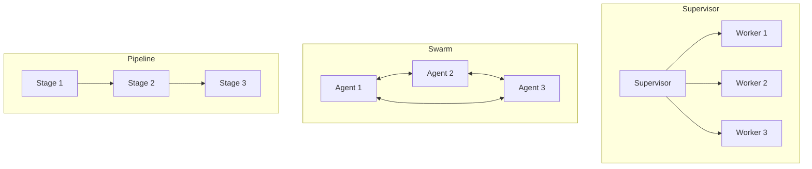

# Agent Architectures

## Learning Objectives

| Objective | Description |
|-----------|-------------|
| LO1 | Understand different agent architectures — single-step, loop, supervisor, swarm |
| LO2 | Design supervisor/controller architectures with task delegation |
| LO3 | Implement swarm-based multi-agent collaboration patterns |
| LO4 | Build hierarchical and pipeline agent topologies |
| LO5 | Evaluate architectural trade-offs for different use cases |

<!-- Image Gallery -->
<section class="lesson-visuals" aria-label="Visual learning resources">
  <header><span>VISUAL LEARNING</span><h2>See it. Review it. Remember it.</h2></header>
  <a class="lesson-visual-card" href="../../assets/images/lessons/ai-engineering-placement/13-ai-agents-langgraph/02-agent-architectures/handwritten-notes.png" target="_blank" rel="noopener">
    
    <span><strong>Handwritten notes</strong>Condensed notes for deliberate review.</span>
  </a>
  <a class="lesson-visual-card" href="../../assets/images/lessons/ai-engineering-placement/13-ai-agents-langgraph/02-agent-architectures/sticky-notes.png" target="_blank" rel="noopener">
    
    <span><strong>Sticky-note revision</strong>Fast recall prompts for revision.</span>
  </a>
  <a class="lesson-visual-card" href="../../assets/images/lessons/ai-engineering-placement/13-ai-agents-langgraph/02-agent-architectures/visual-explanation.png" target="_blank" rel="noopener">
    
    <span><strong>Visual concept guide</strong>A connected explanation of the key ideas.</span>
  </a>
</section>
<!-- End Image Gallery -->

## Chapter at a Glance

| Section | Topic | Key Concept |
|---------|-------|-------------|
| 2.1 | Architecture Overview | Topologies: linear, hierarchical, supervisor, swarm |
| 2.2 | Supervisor Architecture | Central controller delegates to specialized workers |
| 2.3 | Swarm Architecture | Decentralized collaboration between peer agents |
| 2.4 | Pipeline Architecture | Sequential stages with data flow between agents |
| 2.5 | Hierarchical Architecture | Multi-level abstraction with sub-agents |
| 2.6 | Architecture Selection | Choosing the right topology for your use case |

## Chapter Roadmap



## 2.1 Architecture Overview

Agent architectures define how multiple agents or components are organized and communicate.

### Topology Comparison

| Architecture | Coordination | Scalability | Flexibility | Complexity |
|-------------|--------------|-------------|-------------|------------|
| Single Agent | None | Low | Low | Low |
| Supervisor | Centralized | Medium | High | Medium |
| Swarm | Decentralized | High | Medium | High |
| Pipeline | Sequential | Medium | Low | Low |
| Hierarchical | Tree | High | High | High |

```python
from enum import Enum
from dataclasses import dataclass
from typing import List, Dict, Callable, Optional


class ArchitectureType(Enum):
    SINGLE = "single"
    SUPERVISOR = "supervisor"
    SWARM = "swarm"
    PIPELINE = "pipeline"
    HIERARCHICAL = "hierarchical"


@dataclass
class ArchitectureProfile:
    name: ArchitectureType
    coordination: str
    scalability: str
    fault_tolerance: str
    best_for: str


profiles = [
    ArchitectureProfile(ArchitectureType.SINGLE, "none", "low", "low", "Simple tasks, single tool"),
    ArchitectureProfile(ArchitectureType.SUPERVISOR, "centralized", "medium", "medium", "Complex tasks requiring multiple skills"),
    ArchitectureProfile(ArchitectureType.SWARM, "decentralized", "high", "high", "Open-ended exploration, diverse solutions"),
    ArchitectureProfile(ArchitectureType.PIPELINE, "sequential", "medium", "low", "Well-defined multi-step processes"),
    ArchitectureProfile(ArchitectureType.HIERARCHICAL, "tree", "high", "high", "Enterprise-scale automation"),
]

for p in profiles:
    print(f"{p.name.value}: {p.best_for}")
```

## 2.2 Supervisor Architecture

A central supervisor agent delegates subtasks to specialized worker agents.

```python
class SupervisorAgent:
    def __init__(self, llm_fn: Callable, workers: Dict[str, Callable]):
        self.llm = llm_fn
        self.workers = workers  # name -> worker function

    def delegate(self, task: str) -> str:
        supervisor_prompt = f"""You are a supervisor agent. Decompose this task and delegate to workers.

Workers available:
{chr(10).join(f'- {name}: {worker.__doc__ or "No description"}' for name, worker in self.workers.items())}

Task: {task}

For each subtask, specify which worker should handle it.
Format:
1. Worker: worker_name
   Task: subtask description
2. ..."""

        plan = self.llm(supervisor_prompt)
        return self._execute_plan(plan)

    def _execute_plan(self, plan: str) -> str:
        results = []
        lines = plan.split("\n")
        current_worker = None
        current_task = []

        for line in lines:
            if line.startswith("Worker:"):
                if current_worker and current_task:
                    result = self.workers[current_worker](" ".join(current_task))
                    results.append(f"Worker {current_worker}: {result}")
                current_worker = line.replace("Worker:", "").strip()
                current_task = []
            elif line.startswith("Task:") or line.startswith("-"):
                current_task.append(line.replace("Task:", "").replace("-", "").strip())

        if current_worker and current_task:
            result = self.workers[current_worker](" ".join(current_task))
            results.append(f"Worker {current_worker}: {result}")

        return "\n".join(results) if results else "No tasks delegated"


def researcher(task: str) -> str:
    """Research and gather information."""
    return f"Research results for: {task}"


def analyst(task: str) -> str:
    """Analyze data and provide insights."""
    return f"Analysis of: {task}"


def writer(task: str) -> str:
    """Write content based on provided information."""
    return f"Written content about: {task}"


def mock_supervisor_llm(prompt: str) -> str:
    return """1. Worker: researcher
   Task: Gather information on AI agents

2. Worker: analyst
   Task: Analyze the research findings

3. Worker: writer
   Task: Write a summary"""


sup = SupervisorAgent(mock_supervisor_llm, {
    "researcher": researcher,
    "analyst": analyst,
    "writer": writer,
})
result = sup.delegate("Create a report on AI agent architectures")
print(f"Supervisor result:\n{result}")
```

### 2.2.1 Supervisor with Feedback Loop

```python
class FeedbackSupervisor(SupervisorAgent):
    def __init__(self, llm_fn, workers, max_iterations: int = 3):
        super().__init__(llm_fn, workers)
        self.max_iterations = max_iterations

    def delegate(self, task: str) -> str:
        all_results = []

        for iteration in range(self.max_iterations):
            results = self._execute_plan(self.llm(task))
            all_results.append(results)

            quality_prompt = f"""Evaluate the quality of these results.

Results: {results}

Rate 0-10 and suggest improvements if below 8.
Respond with SCORE: <number>
or IMPROVEMENTS: <suggestions>"""
            evaluation = self.llm(quality_prompt)

            if "SCORE:" in evaluation:
                try:
                    score = int(evaluation.split("SCORE:")[-1].strip())
                    if score >= 8:
                        return results
                except ValueError:
                    pass

            if "IMPROVEMENTS" not in evaluation:
                return results

        return all_results[-1] if all_results else "No results"


fsup = FeedbackSupervisor(mock_supervisor_llm, {
    "researcher": researcher,
    "analyst": analyst,
})
print(f"Feedback supervisor ready, max iterations: {fsup.max_iterations}")
```

## 2.3 Swarm Architecture

In swarm architecture, multiple peer agents collaborate without central control.

### 2.3.1 Basic Swarm

```python
class SwarmAgent:
    def __init__(self, name: str, role: str, llm_fn: Callable, tools: Dict):
        self.name = name
        self.role = role
        self.llm = llm_fn
        self.tools = tools

    def process(self, task: str, context: str = "") -> str:
        prompt = f"""You are {self.name}, a {self.role}.

Context: {context}

Task: {task}

Respond with your contribution."""
        return self.llm(prompt)


class SwarmOrchestrator:
    def __init__(self, agents: List[SwarmAgent], rounds: int = 3):
        self.agents = agents
        self.rounds = rounds
        self.conversation_log: List[Dict] = []

    def run(self, initial_task: str) -> str:
        context = f"Initial task: {initial_task}"

        for round_num in range(self.rounds):
            round_results = []
            for agent in self.agents:
                response = agent.process(f"Round {round_num + 1} contribution", context)
                self.conversation_log.append({
                    "round": round_num + 1,
                    "agent": agent.name,
                    "response": response,
                })
                round_results.append(f"{agent.name}: {response}")

            context += "\n" + "\n".join(round_results)

            if round_num == self.rounds - 1:
                synthesis_prompt = f"""Synthesize the following discussion into a final answer.

Discussion:
{context}

Final answer:"""
                return self.agents[0].llm(synthesis_prompt)

        return "Swarm completed"


agents_list = [
    SwarmAgent("Researcher", "information gatherer", mock_supervisor_llm, {}),
    SwarmAgent("Critic", "evaluator", mock_supervisor_llm, {}),
    SwarmAgent("Writer", "content creator", mock_supervisor_llm, {}),
]

swarm = SwarmOrchestrator(agents_list, rounds=2)
result = swarm.run("Explore AI agents")
print(f"Swarm result: {result[:100]}")
```

### 2.3.2 Voting Swarm

```python
class VotingSwarm:
    def __init__(self, agents: List[SwarmAgent]):
        self.agents = agents

    def vote(self, question: str, options: List[str]) -> Dict:
        votes = {}
        for agent in self.agents:
            prompt = f"""Question: {question}
Options: {', '.join(options)}

Choose the best option. Respond with the option text only."""
            vote = agent.llm(prompt).strip()
            votes[agent.name] = vote

        vote_counts = {}
        for v in votes.values():
            cleaned = v.strip().lower()
            for option in options:
                if option.lower() in cleaned:
                    vote_counts[option] = vote_counts.get(option, 0) + 1

        winner = max(vote_counts, key=vote_counts.get) if vote_counts else None
        return {"votes": votes, "counts": vote_counts, "winner": winner}


voting_swarm = VotingSwarm(agents_list)
result = voting_swarm.vote("Best programming language?", ["Python", "JavaScript", "Rust"])
print(f"Vote winner: {result['winner']}")
```

## 2.4 Pipeline Architecture

Pipeline architecture connects agents in sequence, where each agent's output becomes the next agent's input.

### 2.4.1 Sequential Pipeline

```python
class PipelineStage:
    def __init__(self, name: str, llm_fn: Callable, transform_fn: Callable = None):
        self.name = name
        self.llm = llm_fn
        self.transform = transform_fn

    def process(self, input_data: str) -> str:
        if self.transform:
            input_data = self.transform(input_data)
        prompt = f"""Stage: {self.name}
Input: {input_data}

Process this input and produce the required output:"""
        return self.llm(prompt)


class Pipeline:
    def __init__(self, stages: List[PipelineStage]):
        self.stages = stages

    def execute(self, initial_input: str) -> str:
        current = initial_input
        for stage in self.stages:
            current = stage.process(current)
        return current


pipeline = Pipeline([
    PipelineStage("Extract", lambda p: f"Extracted: {p}"),
    PipelineStage("Transform", lambda p: f"Transformed: {p}"),
    PipelineStage("Format", lambda p: f"Formatted: {p}"),
])
result = pipeline.execute("raw data")
print(f"Pipeline result: {result}")
```

### 2.4.2 Conditional Pipeline

```python
class ConditionalPipeline(Pipeline):
    def __init__(self, stages: List[PipelineStage], router_fn: Callable):
        super().__init__(stages)
        self.router = router_fn

    def execute(self, initial_input: str) -> str:
        current = initial_input
        for stage in self.stages:
            current = stage.process(current)
            route = self.router(current, stage.name)
            if route == "stop":
                break
        return current


def router(output: str, stage: str) -> str:
    if "error" in output.lower():
        return "stop"
    return "continue"


cp = ConditionalPipeline(
    [PipelineStage("Validate", lambda p: p), PipelineStage("Process", lambda p: p)],
    router,
)
print("Conditional pipeline ready")
```

## 2.5 Hierarchical Architecture

Hierarchical architecture organizes agents in a tree structure with multiple levels of abstraction.

```python
class HierarchicalAgent:
    def __init__(self, name: str, level: int, llm_fn: Callable, sub_agents: List['HierarchicalAgent'] = None):
        self.name = name
        self.level = level
        self.llm = llm_fn
        self.sub_agents = sub_agents or []

    def process(self, task: str) -> str:
        if not self.sub_agents:
            return self._execute(task)

        decomposition = self.llm(f"Decompose '{task}' into subtasks for {len(self.sub_agents)} workers.")
        sub_results = []

        for agent in self.sub_agents:
            sub_task = self.llm(f"Assign a subtask of '{task}' to {agent.name}")
            result = agent.process(sub_task)
            sub_results.append(f"{agent.name}: {result}")

        return self._synthesize(task, sub_results)

    def _execute(self, task: str) -> str:
        return f"{self.name} processed: {task}"

    def _synthesize(self, task: str, results: List[str]) -> str:
        return f"Synthesized ({self.name}): " + " | ".join(results)


class HierarchicalSystem:
    def __init__(self, root: HierarchicalAgent):
        self.root = root

    def run(self, task: str) -> str:
        return self.root.process(task)


leaf1 = HierarchicalAgent("Search", 2, mock_supervisor_llm)
leaf2 = HierarchicalAgent("Analyze", 2, mock_supervisor_llm)
mid = HierarchicalAgent("Coordinator", 1, mock_supervisor_llm, [leaf1, leaf2])
root = HierarchicalAgent("Supervisor", 0, mock_supervisor_llm, [mid])

hierarchical = HierarchicalSystem(root)
result = hierarchical.run("Research AI safety")
print(f"Hierarchical result: {result[:100]}")
```

## 2.6 Architecture Selection

### 2.6.1 Decision Framework

```python
class ArchitectureAdvisor:
    def __init__(self):
        self.criteria = {
            "task_complexity": ["simple", "moderate", "complex"],
            "num_skills_needed": ["one", "few", "many"],
            "coordination_needed": ["none", "some", "extensive"],
            "fault_tolerance": ["low", "medium", "high"],
            "scalability": ["low", "medium", "high"],
        }

    def recommend(self, requirements: Dict) -> ArchitectureType:
        complexity = requirements.get("task_complexity", "simple")
        skills = requirements.get("num_skills_needed", "one")
        coordination = requirements.get("coordination_needed", "none")

        if complexity == "simple" and skills == "one":
            return ArchitectureType.SINGLE
        elif complexity == "complex" and coordination == "extensive":
            return ArchitectureType.HIERARCHICAL
        elif skills == "many" and coordination == "some":
            return ArchitectureType.SUPERVISOR
        elif coordination == "none" and skills == "few":
            return ArchitectureType.PIPELINE
        elif requirements.get("fault_tolerance") == "high":
            return ArchitectureType.SWARM
        return ArchitectureType.SUPERVISOR


advisor = ArchitectureAdvisor()
reqs = {"task_complexity": "complex", "num_skills_needed": "many", "coordination_needed": "extensive", "fault_tolerance": "medium"}
rec = advisor.recommend(reqs)
print(f"Recommended architecture: {rec.value}")
```

### 2.6.2 Architecture Template

```python
class ArchitectureTemplate:
    def __init__(self, arch_type: ArchitectureType):
        self.arch_type = arch_type
        self.components = []

    def add_component(self, name: str, role: str, parent: str = None):
        self.components.append({"name": name, "role": role, "parent": parent})

    def generate_config(self) -> Dict:
        if self.arch_type == ArchitectureType.SINGLE:
            return {"type": "single", "agent": self.components[0] if self.components else {}}
        elif self.arch_type == ArchitectureType.SUPERVISOR:
            supervisor = self.components[0] if self.components else {}
            workers = self.components[1:]
            return {"type": "supervisor", "supervisor": supervisor, "workers": workers}
        elif self.arch_type == ArchitectureType.PIPELINE:
            return {"type": "pipeline", "stages": self.components}
        elif self.arch_type == ArchitectureType.SWARM:
            return {"type": "swarm", "agents": self.components}
        return {"type": str(self.arch_type), "components": self.components}


template = ArchitectureTemplate(ArchitectureType.SUPERVISOR)
template.add_component("Coordinator", "delegates tasks")
template.add_component("Researcher", "gathers information", parent="Coordinator")
template.add_component("Writer", "produces output", parent="Coordinator")
config = template.generate_config()
print(f"Architecture config: {config}")
```

## 2.7 Performance Comparison

```python
import time


class ArchitectureBenchmark:
    def __init__(self):
        self.results = []

    def run_benchmark(self, name: str, architecture_fn, test_tasks: List[str]) -> Dict:
        latencies = []
        successes = 0

        for task in test_tasks:
            start = time.time()
            result = architecture_fn(task)
            elapsed = (time.time() - start) * 1000
            latencies.append(elapsed)

            if len(result) > 0:
                successes += 1

        return {
            "architecture": name,
            "avg_latency_ms": round(np.mean(latencies), 1),
            "p95_latency_ms": round(np.percentile(latencies, 95), 1),
            "success_rate": round(successes / len(test_tasks) * 100, 1),
        }


benchmark = ArchitectureBenchmark()

def single_fn(task: str) -> str:
    return f"Result: {task}"

print(benchmark.run_benchmark("Single Agent", single_fn, ["task1", "task2"]))
```

## Summary

Agent architectures define how agents are organized and communicate. Supervisor architecture uses a central controller to delegate to specialized workers. Swarm architecture enables decentralized peer collaboration with voting mechanisms. Pipeline architecture processes data through sequential stages with optional conditional routing. Hierarchical architecture organizes agents in tree structures with multiple levels of abstraction. Choosing the right architecture depends on task complexity, number of skills needed, coordination requirements, fault tolerance needs, and scalability expectations. The supervisor pattern is best for complex multi-skill tasks, swarm for high-fault-tolerance scenarios, pipeline for well-defined sequential processes, and hierarchical for enterprise-scale automation.

## Practical Takeaways

| Takeaway | Description |
|----------|-------------|
| Start with supervisor | Most flexible pattern for complex tasks requiring multiple skills |
| Use pipeline for sequences | Well-defined multi-step processes benefit from pipeline architecture |
| Consider swarm for resilience | Decentralized swarms handle agent failures gracefully |
| Hierarchy scales best | Multi-level abstraction enables enterprise-wide agent systems |
| Architect for observability | All architectures need logging, tracing, and monitoring |

## Interview Q&A

<details class="tp-qa-card" data-qid="ag02-q1">
  <summary class="tp-qa-question">
    <span class="tp-qa-status"></span>
    Q1: What are the main agent architecture topologies?
  </summary>
  <div class="tp-qa-answer">
    <p>The five main agent architecture topologies are: (1) Single Agent — one agent handles everything with no delegation; (2) Supervisor — a central controller delegates to specialized worker agents; (3) Swarm — multiple peer agents collaborate without central control, often using voting; (4) Pipeline — agents arranged in sequence where each stage's output feeds into the next; and (5) Hierarchical — agents organized in tree structures with multiple levels of abstraction. Each topology balances different trade-offs: supervisor is best for complex multi-skill tasks, swarm for fault tolerance, pipeline for well-defined sequential processes, and hierarchical for enterprise-scale automation. The choice depends on task complexity, number of skills needed, and coordination requirements.</p>
  </div>
  <button class="tp-qa-mark-btn">✅ Mark Reviewed</button>
  <button class="tp-qa-bookmark-btn">🔖 Bookmark</button>
</details>

<details class="tp-qa-card" data-qid="ag02-q2">
  <summary class="tp-qa-question">
    <span class="tp-qa-status"></span>
    Q2: How does a supervisor architecture work?
  </summary>
  <div class="tp-qa-answer">
    <p>A supervisor architecture uses a central agent that receives the task, decomposes it into subtasks, and delegates each subtask to a specialized worker agent. The supervisor's LLM generates a plan specifying which worker handles each part. Workers execute independently and return results to the supervisor, who synthesizes the final output. For example, for a "create a report" task, the supervisor might delegate research to a researcher agent, analysis to an analyst agent, and writing to a writer agent. The supervisor pattern is simple to implement and debug because all coordination flows through one point. The downside is that the supervisor is a single point of failure and can become a bottleneck at high throughput.</p>
  </div>
  <button class="tp-qa-mark-btn">✅ Mark Reviewed</button>
  <button class="tp-qa-bookmark-btn">🔖 Bookmark</button>
</details>

<details class="tp-qa-card" data-qid="ag02-q3">
  <summary class="tp-qa-question">
    <span class="tp-qa-status"></span>
    Q3: What is a swarm architecture and when is it appropriate?
  </summary>
  <div class="tp-qa-answer">
    <p>A swarm architecture consists of multiple peer agents that collaborate without any central controller. Agents communicate directly with each other, share information, and may vote on decisions. It's appropriate when: (1) you need high fault tolerance — if one agent fails, others continue working; (2) tasks benefit from diverse perspectives — each agent can approach the problem differently; and (3) the system needs to scale horizontally by adding more agents. Examples include debate systems where agents argue different sides of an issue, or multi-perspective analysis where each agent specializes in a different domain. The main challenges are coordination overhead and ensuring convergence — without a central controller, agents may fail to reach consensus.</p>
  </div>
  <button class="tp-qa-mark-btn">✅ Mark Reviewed</button>
  <button class="tp-qa-bookmark-btn">🔖 Bookmark</button>
</details>

<details class="tp-qa-card" data-qid="ag02-q4">
  <summary class="tp-qa-question">
    <span class="tp-qa-status"></span>
    Q4: How does a pipeline architecture process data?
  </summary>
  <div class="tp-qa-answer">
    <p>A pipeline architecture connects agents in a fixed sequence where each agent's output becomes the next agent's input. Each stage has a specific transformation function. For example, a data processing pipeline might have: Extract (parse raw data) → Transform (clean and normalize) → Enrich (add computed fields) → Format (produce final output). Pipelines can be linear (always forward) or conditional (with a router that decides which branch to take based on intermediate results). Conditional routing is useful for error handling — if validation fails, route to a correction stage instead of continuing. Pipeline architecture is ideal for well-understood, sequential processes but struggles with tasks that require back-and-forth or dynamic replanning.</p>
  </div>
  <button class="tp-qa-mark-btn">✅ Mark Reviewed</button>
  <button class="tp-qa-bookmark-btn">🔖 Bookmark</button>
</details>

<details class="tp-qa-card" data-qid="ag02-q5">
  <summary class="tp-qa-question">
    <span class="tp-qa-status"></span>
    Q5: What is a hierarchical agent architecture?
  </summary>
  <div class="tp-qa-answer">
    <p>A hierarchical architecture organizes agents in a tree structure with multiple levels of abstraction. High-level agents decompose complex tasks into subtasks and delegate to mid-level agents, which further decompose and delegate to leaf agents. Each level operates at a different granularity: top-level agents think strategically (e.g., "research market trends"), mid-level agents plan tactically (e.g., "search for competitor data"), and leaf agents execute specific actions (e.g., "call search API with query 'competitor Q2 2025'"). Results flow back up the tree for synthesis. This architecture scales to enterprise-wide automation because each agent has a bounded responsibility, and new capabilities can be added by attaching new leaf agents without changing higher levels.</p>
  </div>
  <button class="tp-qa-mark-btn">✅ Mark Reviewed</button>
  <button class="tp-qa-bookmark-btn">🔖 Bookmark</button>
</details>

<details class="tp-qa-card" data-qid="ag02-q6">
  <summary class="tp-qa-question">
    <span class="tp-qa-status"></span>
    Q6: How do you choose the right architecture for a given task?
  </summary>
  <div class="tp-qa-answer">
    <p>Choosing the right architecture requires evaluating: task complexity (simple/moderate/complex), number of distinct skills needed (one/few/many), coordination requirements (none/some/extensive), fault tolerance needs (low/medium/high), and scalability expectations. For simple tasks with one skill, use single agent. For complex tasks needing multiple skills with some coordination, use supervisor. For maximum fault tolerance and diverse exploration, use swarm. For well-defined sequential processes, use pipeline. For enterprise-scale systems with hundreds of agents, use hierarchical. An architecture advisor can automate this decision — it scores each option against the requirements and recommends the best match.</p>
  </div>
  <button class="tp-qa-mark-btn">✅ Mark Reviewed</button>
  <button class="tp-qa-bookmark-btn">🔖 Bookmark</button>
</details>

<details class="tp-qa-card" data-qid="ag02-q7">
  <summary class="tp-qa-question">
    <span class="tp-qa-status"></span>
    Q7: What are the trade-offs between supervisor and swarm architectures?
  </summary>
  <div class="tp-qa-answer">
    <p>Supervisor architecture offers simpler coordination (one central decision-maker), easier debugging (all logic flows through one point), and lower communication overhead. The downsides are a single point of failure, limited scalability (the supervisor becomes a bottleneck), and less diverse output (single perspective). Swarm architecture offers better fault tolerance (no single point of failure), higher scalability (agents can be added freely), and more diverse perspectives (each agent contributes independently). The downsides are coordination complexity (reaching consensus is harder), higher communication costs (agents must talk to each other), and potential for non-convergence (agents may debate forever). Choose supervisor when reliability and simplicity matter more than diversity; choose swarm when resilience and multiple perspectives are critical.</p>
  </div>
  <button class="tp-qa-mark-btn">✅ Mark Reviewed</button>
  <button class="tp-qa-bookmark-btn">🔖 Bookmark</button>
</details>

<details class="tp-qa-card" data-qid="ag02-q8">
  <summary class="tp-qa-question">
    <span class="tp-qa-status"></span>
    Q8: How does a voting swarm work?
  </summary>
  <div class="tp-qa-answer">
    <p>A voting swarm consists of multiple independent agents that each evaluate a proposal and cast a vote. There are two main approaches: simple majority (each agent gets one vote, the option with the most votes wins) and weighted voting (agents with more expertise or reliability get higher weight). For example, in a "best programming language" decision, three agents might vote: Agent 1 (Python expert) → Python, Agent 2 (JS expert) → JavaScript, Agent 3 (generalist) → Python. Python wins 2-1. Weighted voting would multiply each vote by the agent's confidence or expertise score. Voting swarms are useful for quality control (reviewing outputs), decision-making (choosing between alternatives), and ensemble predictions (combining multiple models' outputs).</p>
  </div>
  <button class="tp-qa-mark-btn">✅ Mark Reviewed</button>
  <button class="tp-qa-bookmark-btn">🔖 Bookmark</button>
</details>

<details class="tp-qa-card" data-qid="ag02-q9">
  <summary class="tp-qa-question">
    <span class="tp-qa-status"></span>
    Q9: What is a conditional pipeline?
  </summary>
  <div class="tp-qa-answer">
    <p>A conditional pipeline extends the basic pipeline by adding a router function between stages that can decide to stop, skip, or branch based on intermediate output. For example, a customer support pipeline might have: Validate → Classify → {Route to billing OR Route to tech support OR Route to human agent}. The router examines the output of the Classify stage and decides which branch to follow. If classification confidence is low, the router might route to a human agent instead of continuing automated processing. Implementation requires a router function that takes the current output and stage name as input and returns the next stage name or "stop". Conditional pipelines reduce wasted processing by stopping early when errors are detected and enable complex workflows with branching logic.</p>
  </div>
  <button class="tp-qa-mark-btn">✅ Mark Reviewed</button>
  <button class="tp-qa-bookmark-btn">🔖 Bookmark</button>
</details>

<details class="tp-qa-card" data-qid="ag02-q10">
  <summary class="tp-qa-question">
    <span class="tp-qa-status"></span>
    Q10: How do you benchmark different agent architectures?
  </summary>
  <div class="tp-qa-answer">
    <p>Benchmarking agent architectures requires running each architecture against the same set of test tasks and measuring: (1) success rate — did the architecture complete the task correctly? (2) average latency — how long did each task take end-to-end? (3) average steps — how many agent iterations were needed? (4) cost — total tokens consumed and API calls made. Use a diverse test set with varying complexity levels. For each architecture configuration, run at least 30-50 trials to get statistically significant results. Report p95 latency alongside averages to capture tail performance. The goal is to identify which architecture best matches your task characteristics — a supervisor might win on structured tasks while a swarm excels on open-ended exploration.</p>
  </div>
  <button class="tp-qa-mark-btn">✅ Mark Reviewed</button>
  <button class="tp-qa-bookmark-btn">🔖 Bookmark</button>
</details>

## Chapter Quiz

<details data-qid="agent-s2-quiz1">
<summary><strong>1.</strong> Which architecture uses a central controller to delegate tasks to specialized workers?</summary>
A. Swarm
B. Supervisor
C. Pipeline
D. Single agent
Answer: B
</details>

<details data-qid="agent-s2-quiz2">
<summary><strong>2.</strong> What is a key advantage of swarm architecture over supervisor?</summary>
A. Simpler implementation
B. Better fault tolerance through decentralization
C. Lower cost
D. Faster execution
Answer: B
</details>

<details data-qid="agent-s2-quiz3">
<summary><strong>3.</strong> In a pipeline architecture, how do agents communicate?</summary>
A. Through a central message bus
B. Each agent passes output as input to the next stage
C. Through votes
D. Via a supervisor
Answer: B
</details>

<details data-qid="agent-s2-quiz4">
<summary><strong>4.</strong> What is hierarchical architecture best suited for?</summary>
A. Simple single-step tasks
B. Enterprise-scale automation with multiple abstraction levels
C. Peer-to-peer collaboration
D. Sequential data processing
Answer: B
</details>

<details data-qid="agent-s2-quiz5">
<summary><strong>5.</strong> Which factor is MOST important when choosing an agent architecture?</summary>
A. Number of lines of code
B. Task complexity and coordination needs
C. Programming language used
D. Age of the LLM model
Answer: B
</details>

## Exercises

1. Implement a supervisor agent that delegates to at least 3 worker agents (researcher, analyst, writer) for a report generation task. Show the delegation plan and each worker's contribution.

2. Build a pipeline architecture with 4 stages (validate, transform, enrich, format) that processes customer feedback data. Add a conditional router that diverts negative feedback to a separate escalation path.

3. Create a voting swarm with 5 agents that debate and vote on the best solution to a problem. Implement majority voting and show the deliberation process.

4. Design a hierarchical architecture for an enterprise customer support system with 3 levels (level 1: FAQ bot, level 2: specialist agents, level 3: human supervisor). Implement delegation logic between levels.

5. Write an architecture selection guide that takes task requirements as input and recommends the best architecture. Test with 5 different requirement profiles and justify each recommendation.
