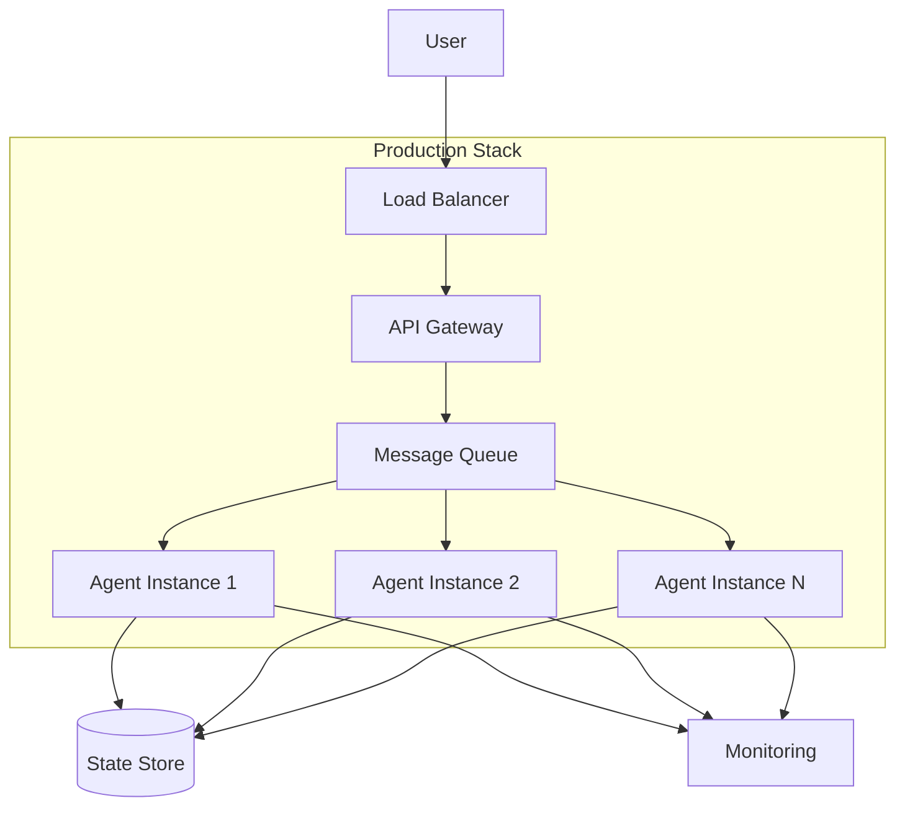

<!-- Clear Language: Keep sentences under 50 words -->
# Production Agents

## Learning Objectives

| Objective | Description |
|-----------|-------------|
| LO1 | Understand production deployment requirements for agent systems |
| LO2 | Implement agent scaling, load balancing, and fault tolerance |
| LO3 | Design agent APIs with authentication, rate limiting, and versioning |
| LO4 | Build deployment pipelines for agent updates |
| LO5 | Implement cost management and resource optimization |

## Introduction

AI agents autonomously use tools to complete tasks. LangGraph builds stateful, multi-step agent workflows. This module covers agent architectures, tool use, memory, and production deployment.

## Prerequisites

- Basic programming knowledge
- Understanding of data structures

## Key Terminology

**Key Terms**: Core vocabulary and concepts for this topic.

**Definition**: Essential terms you must know for interviews and production work.

## Theory

Understanding production agents is fundamental for AI engineers. This section covers the core concepts, underlying principles, and theoretical framework that govern how production agents works in practice.

## Chapter at a Glance

| Section | Topic | Key Concept |
|---------|-------|-------------|
| 9.1 | Production Requirements | Reliability, scalability, security, cost |
| 9.2 | Agent API Design | REST/gRPC endpoints, versioning, auth |
| 9.3 | Scaling | Horizontal scaling, load balancing, queues |
| 9.4 | Fault Tolerance | Retry, circuit breakers, graceful degradation |
| 9.5 | Deployment | CI/CD pipelines, canary releases, rollback |
| 9.6 | Cost Management | Token tracking, budget controls, optimization |

## Chapter Roadmap



## 9.1 Production Requirements

Production agent systems must meet reliability, scalability, security, and cost requirements.

```python
from dataclasses import dataclass, field
from typing import List, Dict, Optional, Callable
import time
import json

@dataclass
class ProductionConfig:
    min_replicas: int = 2
    max_replicas: int = 10
    request_timeout_ms: int = 30000
    rate_limit_per_min: int = 100
    max_retries: int = 3
    circuit_breaker_threshold: int = 5

class ProductionReadinessChecker:
    def __init__(self):
        self.checks: List[Dict] = []

    def add_check(self, name: str, passed: bool, details: str = ""):
        self.checks.append({"name": name, "passed": passed, "details": details})

    def is_ready(self) -> bool:
        return all(c["passed"] for c in self.checks)

    def report(self) -> Dict:
        passed = sum(1 for c in self.checks if c["passed"])
        return {
            "ready": self.is_ready(),
            "checks_passed": f"{passed}/{len(self.checks)}",
            "checks": self.checks,
        }

checker = ProductionReadinessChecker()
checker.add_check("Horizontal scaling configured", True)
checker.add_check("Request timeout set", True)
checker.add_check("Rate limiting enabled", False, "Rate limiter not configured")
checker.add_check("Error monitoring in place", True)
print(f"Production ready: {checker.report()}")
```

## 9.2 Agent API Design

### 9.2.1 REST API

```python
class AgentAPIEndpoint:
    def __init__(self, agent_fn: Callable):
        self.agent_fn = agent_fn
        self.version = "v1"

    def handle_request(self, request: Dict) -> Dict:
        start = time.time()
        try:
            result = self.agent_fn(request.get("query"), request.get("config", {}))
            return {
                "status": "success",
                "data": result,
                "latency_ms": round((time.time() - start) * 1000, 2),
                "version": self.version,
            }
        except Exception as e:
            return {
                "status": "error",
                "error": str(e),
                "latency_ms": round((time.time() - start) * 1000, 2),
                "version": self.version,
            }

    def health_check(self) -> Dict:
        return {"status": "healthy", "version": self.version, "timestamp": time.time()}

def mock_agent(query: str, config: Dict) -> str:
    return f"Result for: {query}"

api = AgentAPIEndpoint(mock_agent)
response = api.handle_request({"query": "What is RAG?"})
print(f"API response: {response['status']} ({response['latency_ms']}ms)")
```

### 9.2.2 API Versioning

```python
class VersionedAgentAPI:
    def __init__(self):
        self.versions: Dict[str, Callable] = {}

    def register_version(self, version: str, handler: Callable):
        self.versions[version] = handler

    def route(self, request: Dict) -> Dict:
        version = request.get("version", "v1")
        handler = self.versions.get(version)

        if not handler:
            return {"status": "error", "error": f"Version {version} not supported"}

        return handler(request)

    def deprecate_version(self, version: str, migration_hint: str = ""):
        """Mark a version as deprecated but still functional."""
        if version in self.versions:
            handler = self.versions[version]
            def wrapped(req):
                result = handler(req)
                result["warning"] = f"Version {version} is deprecated. {migration_hint}"
                return result
            self.versions[version] = wrapped

versioned_api = VersionedAgentAPI()
versioned_api.register_version("v1", lambda r: {"result": f"v1: {r['query']}"})
versioned_api.register_version("v2", lambda r: {"result": f"v2: {r['query']}", "extra": "new_field"})
versioned_api.deprecate_version("v1", "Migrate to v2 for new features")
print(versioned_api.route({"version": "v1", "query": "test"}))
print(versioned_api.route({"version": "v2", "query": "test"}))
```

### 9.2.3 Authentication

```python
import hashlib
import hmac

class AgentAuth:
    def __init__(self, api_keys: Dict[str, Dict] = None):
        self.api_keys = api_keys or {}
        self.rate_limits: Dict[str, List[float]] = {}

    def validate(self, api_key: str, required_permission: str = None) -> bool:
        key_data = self.api_keys.get(api_key)
        if not key_data:
            return False
        if required_permission and required_permission not in key_data.get("permissions", []):
            return False
        return self._check_rate_limit(api_key, key_data.get("rate_limit", 100))

    def _check_rate_limit(self, key: str, limit: int) -> bool:
        now = time.time()
        window = 60
        if key not in self.rate_limits:
            self.rate_limits[key] = []
        self.rate_limits[key] = [t for t in self.rate_limits[key] if now - t < window]
        if len(self.rate_limits[key]) >= limit:
            return False
        self.rate_limits[key].append(now)
        return True

    def create_key(self, name: str, permissions: List[str], rate_limit: int = 100) -> str:
        key = hashlib.sha256(f"{name}:{time.time()}".encode()).hexdigest()[:32]
        self.api_keys[key] = {"name": name, "permissions": permissions, "rate_limit": rate_limit}
        return key

auth = AgentAuth()
key = auth.create_key("production-agent", ["agent:query", "agent:admin"])
print(f"Auth valid: {auth.validate(key, 'agent:query')}")
```

## 9.3 Scaling

### 9.3.1 Horizontal Scaling

```python
class AgentPool:
    def __init__(self, agent_factory: Callable, min_size: int = 2, max_size: int = 10):
        self.factory = agent_factory
        self.min_size = min_size
        self.max_size = max_size
        self.instances: List[Callable] = [agent_factory() for _ in range(min_size)]
        self.request_queue: List[Dict] = []
        self.busy_instances = set()

    def scale_up(self):
        if len(self.instances) < self.max_size:
            self.instances.append(self.factory())
            return True
        return False

    def scale_down(self):
        if len(self.instances) > self.min_size and not self.request_queue:
            self.instances.pop()
            return True
        return False

    def execute(self, request: Dict) -> Any:
        available = [i for i in range(len(self.instances)) if i not in self.busy_instances]
        if not available:
            if len(self.instances) < self.max_size:
                self.scale_up()
                idx = len(self.instances) - 1
            else:
                return {"error": "All instances busy"}

        idx = available[0]
        self.busy_instances.add(idx)
        try:
            result = self.instances[idx](request)
            return result
        finally:
            self.busy_instances.discard(idx)

    def stats(self) -> Dict:
        return {
            "total_instances": len(self.instances),
            "busy": len(self.busy_instances),
            "queue_length": len(self.request_queue),
        }

pool = AgentPool(lambda: lambda r: f"Processed by agent", min_size=2, max_size=5)
print(pool.execute({"query": "test"}))
print(f"Pool stats: {pool.stats()}")
```

### 9.3.2 Queue-Based Processing

```python
import queue
import threading

class QueueProcessor:
    def __init__(self, agent_fn: Callable, num_workers: int = 3):
        self.agent_fn = agent_fn
        self.task_queue = queue.Queue()
        self.result_store: Dict[str, Any] = {}
        self.workers = []
        self._start_workers(num_workers)

    def _start_workers(self, num: int):
        for i in range(num):
            worker = threading.Thread(target=self._worker_loop, daemon=True)
            worker.start()
            self.workers.append(worker)

    def _worker_loop(self):
        while True:
            task_id, request = self.task_queue.get()
            try:
                result = self.agent_fn(request)
                self.result_store[task_id] = {"status": "completed", "result": result}
            except Exception as e:
                self.result_store[task_id] = {"status": "failed", "error": str(e)}
            finally:
                self.task_queue.task_done()

    def submit(self, request: Dict) -> str:
        task_id = f"task-{time.time()}-{len(self.result_store)}"
        self.task_queue.put((task_id, request))
        return task_id

    def get_result(self, task_id: str, timeout: float = 10.0) -> Optional[Dict]:
        start = time.time()
        while time.time() - start < timeout:
            if task_id in self.result_store:
                return self.result_store.pop(task_id)
            time.sleep(0.1)
        return {"status": "timeout"}

qp = QueueProcessor(lambda r: f"Processed: {r['query']}", num_workers=2)
task_id = qp.submit({"query": "test"})
import time as ttime
ttime.sleep(0.2)
result = qp.get_result(task_id)
print(f"Queue result: {result}")
```

## 9.4 Fault Tolerance

### 9.4.1 Retry Policy

```python
class RetryPolicy:
    def __init__(self, max_retries: int = 3, backoff_base: float = 1.0, backoff_multiplier: float = 2.0):
        self.max_retries = max_retries
        self.base = backoff_base
        self.multiplier = backoff_multiplier

    def execute(self, fn: Callable, *args, **kwargs) -> Any:
        last_error = None
        for attempt in range(self.max_retries):
            try:
                return fn(*args, **kwargs)
            except Exception as e:
                last_error = e
                if attempt < self.max_retries - 1:
                    delay = self.base * (self.multiplier ** attempt)
                    time.sleep(delay)
        raise last_error

class CircuitBreaker:
    def __init__(self, failure_threshold: int = 5, recovery_timeout: float = 30.0):
        self.failure_threshold = failure_threshold
        self.recovery_timeout = recovery_timeout
        self.failure_count = 0
        self.last_failure_time = 0
        self.state = "closed"

    def call(self, fn: Callable, *args, **kwargs) -> Any:
        if self.state == "open":
            if time.time() - self.last_failure_time > self.recovery_timeout:
                self.state = "half-open"
            else:
                raise Exception("Circuit breaker is OPEN")

        try:
            result = fn(*args, **kwargs)
            if self.state == "half-open":
                self.state = "closed"
                self.failure_count = 0
            return result
        except Exception as e:
            self.failure_count += 1
            self.last_failure_time = time.time()
            if self.failure_count >= self.failure_threshold:
                self.state = "open"
            raise e

def unreliable_fn() -> str:
    if time.time() % 2 < 0.5:
        raise Exception("Service unavailable")
    return "OK"

retry = RetryPolicy(max_retries=3, backoff_base=0.5)
cb = CircuitBreaker(failure_threshold=3, recovery_timeout=5)
print("Retry + circuit breaker configured")
```

### 9.4.2 Graceful Degradation

```python
class DegradationLevel(Enum):
    FULL = "full"
    REDUCED = "reduced"
    MINIMAL = "minimal"
    OFFLINE = "offline"

class DegradationManager:
    def __init__(self):
        self.service_status: Dict[str, bool] = {}
        self.level = DegradationLevel.FULL

    def mark_unhealthy(self, service: str):
        self.service_status[service] = False
        self._recalculate()

    def mark_healthy(self, service: str):
        self.service_status[service] = True
        self._recalculate()

    def _recalculate(self):
        unhealthy = sum(1 for s in self.service_status.values() if not s)
        total = len(self.service_status)

        if total == 0 or unhealthy == 0:
            self.level = DegradationLevel.FULL
        elif unhealthy / total > 0.5:
            self.level = DegradationLevel.OFFLINE if unhealthy == total else DegradationLevel.MINIMAL
        else:
            self.level = DegradationLevel.REDUCED

    def get_config(self) -> Dict:
        configs = {
            DegradationLevel.FULL: {"top_k": 5, "use_llm": True, "use_tools": True},
            DegradationLevel.REDUCED: {"top_k": 3, "use_llm": True, "use_tools": False},
            DegradationLevel.MINIMAL: {"top_k": 1, "use_llm": True, "use_tools": False},
            DegradationLevel.OFFLINE: {"top_k": 0, "use_llm": False, "use_tools": False},
        }
        return configs.get(self.level)

deg = DegradationManager()
deg.mark_unhealthy("embedding_service")
print(f"Level: {deg.level.value}, Config: {deg.get_config()}")
```

## 9.5 Deployment

### 9.5.1 CI/CD Pipeline

```python
class DeploymentPipeline:
    def __init__(self):
        self.stages = ["test", "build", "staging", "canary", "production"]
        self.current_version = ""
        self.rollback_version = ""

    def run(self, version: str) -> Dict:
        results = {}
        for stage in self.stages:
            success = self._execute_stage(stage, version)
            results[stage] = "passed" if success else "failed"
            if not success:
                return {"version": version, "status": "failed", "stage": stage, "results": results}
        return {"version": version, "status": "deployed", "results": results}

    def _execute_stage(self, stage: str, version: str) -> bool:
        if stage == "test":
            return self._run_tests(version)
        elif stage == "build":
            return self._build(version)
        elif stage == "canary":
            return self._canary_deploy(version)
        return True

    def _run_tests(self, version: str) -> bool:
        return True

    def _build(self, version: str) -> bool:
        self.current_version = version
        return True

    def _canary_deploy(self, version: str, traffic_percent: int = 10) -> bool:
        return True

    def rollback(self):
        if self.rollback_version:
            self.current_version = self.rollback_version
            return {"status": "rolled_back", "version": self.current_version}
        return {"status": "no_rollback_target"}

pipeline = DeploymentPipeline()
result = pipeline.run("v2.0.0")
print(f"Deployment: {result['status']}")
```

### 9.5.2 A/B Testing

```python
class AgentABTest:
    def __init__(self, control_agent: Callable, treatment_agent: Callable):
        self.control = control_agent
        self.treatment = treatment_agent
        self.results: Dict[str, List[Dict]] = {"control": [], "treatment": []}

    def route(self, request: Dict, user_id: str) -> Dict:
        import hashlib
        bucket = int(hashlib.md5(user_id.encode()).hexdigest(), 16) % 100
        is_treatment = bucket < 50

        start = time.time()
        if is_treatment:
            result = self.treatment(request)
            self.results["treatment"].append({"success": True, "latency": (time.time() - start) * 1000})
        else:
            result = self.control(request)
            self.results["control"].append({"success": True, "latency": (time.time() - start) * 1000})

        return {**result, "variant": "treatment" if is_treatment else "control"}

    def report(self) -> Dict:
        report = {}
        for variant, entries in self.results.items():
            if entries:
                report[variant] = {
                    "count": len(entries),
                    "success_rate": sum(1 for e in entries if e["success"]) / len(entries),
                    "avg_latency": sum(e["latency"] for e in entries) / len(entries),
                }
        return report

def control_agent(req):
    return {"result": "control response"}

def treatment_agent(req):
    return {"result": "treatment response"}

ab = AgentABTest(control_agent, treatment_agent)
for i in range(10):
    ab.route({"query": "test"}, f"user-{i}")
print(f"A/B report: {ab.report()}")
```

## 9.6 Cost Management

### 9.6.1 Token Budget

```python
class TokenBudget:
    def __init__(self, daily_limit: int = 1000000, monthly_limit: int = 30000000):
        self.daily = daily_limit
        self.monthly = monthly_limit
        self.daily_usage: Dict[str, int] = {}
        self.monthly_usage: Dict[str, int] = {}

    def check(self, user_id: str, estimated_tokens: int) -> bool:
        from datetime import date
        today = str(date.today())
        month = str(date.today().month)

        daily = self.daily_usage.get(f"{user_id}:{today}", 0)
        monthly = self.monthly_usage.get(f"{user_id}:{month}", 0)

        return daily + estimated_tokens <= self.daily and monthly + estimated_tokens <= self.monthly

    def consume(self, user_id: str, tokens: int):
        from datetime import date
        today = str(date.today())
        month = str(date.today().month)

        self.daily_usage[f"{user_id}:{today}"] = self.daily_usage.get(f"{user_id}:{today}", 0) + tokens
        self.monthly_usage[f"{user_id}:{month}"] = self.monthly_usage.get(f"{user_id}:{month}", 0) + tokens

    def usage_report(self, user_id: str) -> Dict:
        from datetime import date
        today = str(date.today())
        month = str(date.today().month)
        return {
            "daily_used": self.daily_usage.get(f"{user_id}:{today}", 0),
            "daily_limit": self.daily,
            "monthly_used": self.monthly_usage.get(f"{user_id}:{month}", 0),
            "monthly_limit": self.monthly,
        }

budget = TokenBudget(daily_limit=50000)
print(f"Can consume 1000: {budget.check('user-1', 1000)}")
budget.consume("user-1", 1000)
```

### 9.6.2 Cost Optimization

```python
class CostOptimizer:
    def __init__(self):
        self.options = {
            "cheap_model": {"savings": 0.8, "quality_impact": 0.1},
            "prompt_caching": {"savings": 0.3, "quality_impact": 0.0},
            "output_trimming": {"savings": 0.2, "quality_impact": 0.05},
            "early_stopping": {"savings": 0.15, "quality_impact": 0.1},
        }

    def recommend(self, quality_requirement: float = 0.8) -> List[str]:
        recommendations = []
        for option, details in self.options.items():
            if 1 - details["quality_impact"] >= quality_requirement:
                recommendations.append(option)
        return recommendations

    def estimate_savings(self, current_cost: float, recommendations: List[str]) -> Dict:
        total_savings = 0
        for rec in recommendations:
            if rec in self.options:
                total_savings += self.options[rec]["savings"]

        max_savings = min(total_savings, 1.0)
        return {
            "current_cost": current_cost,
            "estimated_cost": round(current_cost * (1 - max_savings), 2),
            "savings_pct": round(max_savings * 100, 1),
        }

optimizer = CostOptimizer()
recs = optimizer.recommend(quality_requirement=0.85)
print(f"Cost recommendations: {recs}")
print(optimizer.estimate_savings(1000, recs))
```

## Summary

Production agent systems require robust infrastructure for reliability, scaling, security, and cost management. Key components include: API endpoints with versioning and.
authentication, horizontal scaling with agent pools and queue-based processing, fault tolerance through retry policies and circuit breakers, CI/CD deployment pipelines with canary releases and.
A/B testing, and cost management with token budgets and optimization strategies. Graceful degradation ensures the system remains functional (at reduced capacity) even when components fail.

## Practical Takeaways

| Takeaway | Description |
|----------|-------------|
| Always version your API | Enables backward-compatible updates |
| Use queue-based processing | Decouples request receipt from processing for reliability |
| Implement circuit breakers | Prevent cascading failures across dependencies |
| A/B test agent changes | Validate improvements before full rollout |
| Track token usage | Cost scales with token consumption — monitor and budget |
| Graceful degradation | Better to return simplified results than fail entirely |

## Interview Q&A

<details class="tp-qa-card" data-qid="ag09-q1">
  <summary class="tp-qa-question">
    <span class="tp-qa-status"></span>
    Q1: How do you deploy an AI agent to production?
  </summary>
  <div class="tp-qa-answer">
<p>Deploying an AI agent to production involves packaging the agent code, its dependencies, and configuration into a deployable unit (Docker container or.
serverless function), then running it behind a load balancer with health checks. Key steps: (1) containerize the agent service with all dependencies (Python packages,.
model access libraries, tool SDKs); (2) configure environment variables for API keys, model endpoints, database connections; (3) set up a web server (FastAPI,.
Flask) with endpoints for agent invocation (/invoke), status (/health), and admin (/config); (4) deploy behind a load balancer (NGINX, AWS ALB) with auto-scaling based on request volume;.
(5) configure CI/CD pipeline — tests pass → build image → deploy to staging → run evaluation suite → promote to production. Production deployments require: rate limiting (per user,.
per API key), authentication (API keys or OAuth), request validation, and monitoring integration. A blue-green deployment strategy minimizes downtime — the new version is fully deployed and.
tested before traffic switches over.</p>
  </div>
  <button class="tp-qa-mark-btn">✅ Mark Reviewed</button>
  <button class="tp-qa-bookmark-btn">🔖 Bookmark</button>
</details>

<details class="tp-qa-card" data-qid="ag09-q2">
  <summary class="tp-qa-question">
    <span class="tp-qa-status"></span>
    Q2: How do you implement scaling for agent services?
  </summary>
  <div class="tp-qa-answer">
<p>Agent service scaling handles increasing request volume by adding more compute resources. Horizontal scaling (adding more instances) is preferred over vertical scaling (bigger instances) for.
agent workloads because LLM calls are I/O-bound — you need more concurrent connections, not faster CPUs. Implementation: (1) stateless agent design — store session state externally (Redis,.
Postgres) so any instance can handle any request; (2) auto-scaling group — configure minimum/maximum instances, scaling triggers based on CPU utilization (target 70%),.
request queue depth, or custom metrics (concurrent LLM calls); (3) connection pooling — reuse LLM client connections across requests within an instance;.
(4) request queuing — use a message queue (SQS, RabbitMQ) for requests during traffic spikes, with worker instances pulling from the queue. Serverless options (AWS Lambda,.
Cloud Run) auto-scale to zero when idle, good for variable traffic but have cold start latency and execution time limits. The scaling strategy depends on traffic patterns — predictable traffic suits container orchestration,.
unpredictable suits serverless.</p>
  </div>
  <button class="tp-qa-mark-btn">✅ Mark Reviewed</button>
  <button class="tp-qa-bookmark-btn">🔖 Bookmark</button>
</details>

<details class="tp-qa-card" data-qid="ag09-q3">
  <summary class="tp-qa-question">
    <span class="tp-qa-status"></span>
    Q3: How do you design an agent API?
  </summary>
  <div class="tp-qa-answer">
<p>An agent API exposes agent capabilities as a RESTful or streaming service. Typical endpoints: POST /v1/chat — invoke agent with a user message,.
returns response (blocking or streaming); GET /v1/threads/{id} — retrieve conversation history; POST /v1/threads/{id}/interrupt — pause a running agent; POST /v1/interrupts/{id}/resume — resume with human input. API design considerations: (1) authentication — API key in header,.
validated against a key store (database, secrets manager); (2) rate limiting — per-key limits (requests/minute, tokens/minute) enforced by a rate limiter (Redis-based sliding window);.
(3) request validation — validate input schema (message format, max length, allowed content types); (4) versioning — URL path versioning (/v1/,.
/v2/) for backward compatibility; (5) streaming — Server-Sent Events (SSE) or WebSocket for real-time streaming of agent thoughts and actions; (6) error.
handling — consistent error response format (error code, message, details) for all endpoints. The API is documented with OpenAPI/Swagger for client integration.</p>
  </div>
  <button class="tp-qa-mark-btn">✅ Mark Reviewed</button>
  <button class="tp-qa-bookmark-btn">🔖 Bookmark</button>
</details>

<details class="tp-qa-card" data-qid="ag09-q4">
  <summary class="tp-qa-question">
    <span class="tp-qa-status"></span>
    Q4: How do you implement cost management for agents?
  </summary>
  <div class="tp-qa-answer">
<p>Cost management for agents controls LLM API spending while maintaining quality. Strategies: (1) model tiering — use cheap models (GPT-3.5, Claude Haiku) for.
simple requests and expensive models (GPT-4, Claude Sonnet) only when needed, with a router that classifies request complexity; (2) token optimization — reduce prompt size by pruning conversation history,.
summarizing long contexts, and minimizing system prompt tokens; (3) caching — cache LLM responses for identical or semantically similar queries (using vector.
similarity to detect cache hits); (4) batching — batch multiple independent LLM calls into a single larger request when supported; (5) budget controls — set per-user,.
per-day, or per-month token budgets; enforce hard caps that reject requests when exceeded; (6) monitoring — track cost per request, per user,.
per department; alert on cost anomalies. Implementation includes a <code>CostManager</code> that tracks token usage against budgets, a <code>ModelRouter</code> that selects models based on complexity,.
and a <code>ResponseCache</code> that reduces redundant LLM calls.</p>
  </div>
  <button class="tp-qa-mark-btn">✅ Mark Reviewed</button>
  <button class="tp-qa-bookmark-btn">🔖 Bookmark</button>
</details>

<details class="tp-qa-card" data-qid="ag09-q5">
  <summary class="tp-qa-question">
    <span class="tp-qa-status"></span>
    Q5: How do you handle rate limiting in agent APIs?
  </summary>
  <div class="tp-qa-answer">
<p>Rate limiting in agent APIs controls how many requests a user can make within a time window, preventing abuse and ensuring fair resource allocation. Implementation: (1) define rate limit rules per API key or.
user — e.g., 100 requests per minute, 10,000 tokens per minute; (2) use a token bucket or sliding window algorithm with a distributed counter (Redis);.
(3) check the rate limit at the API gateway or middleware layer before the request reaches the agent; (4) if the limit is exceeded,.
return HTTP 429 (Too Many Requests) with a Retry-After header indicating when the user can retry; (5) log rate limit violations for.
monitoring. Rate limiting at the LLM API level is also needed — LLM providers have their own rate limits; implement a client-side rate limiter that queues requests and.
retries with exponential backoff on 429 responses. Different user tiers can have different rate limits — free tier (10 req/min), pro tier (100 req/min),.
enterprise tier (1000 req/min).</p>
  </div>
  <button class="tp-qa-mark-btn">✅ Mark Reviewed</button>
  <button class="tp-qa-bookmark-btn">🔖 Bookmark</button>
</details>

<details class="tp-qa-card" data-qid="ag09-q6">
  <summary class="tp-qa-question">
    <span class="tp-qa-status"></span>
    Q6: How do you implement blue-green deployment for agents?
  </summary>
  <div class="tp-qa-answer">
<p>Blue-green deployment for agents runs two identical production environments (blue = current, green = new) and switches traffic between them. Process: (1) deploy the new agent version to the green environment (same infrastructure,.
database, configuration); (2) run the evaluation suite against the green environment — automated tests verify functionality, performance, and quality scores meet thresholds;.
(3) run a smoke test — send a small percentage of real traffic to green (canary) to catch issues in production conditions;.
(4) if all checks pass, switch the load balancer to route 100% of traffic to green; (5) keep blue running for.
rollback — if issues are detected after the switch, immediately switch back to blue; (6) decommission blue after a stabilization period (typically 24-48 hours). Important considerations: database schema changes must be backward-compatible during the transition;.
session state must be accessible by both environments (external state storage); the evaluation suite must run quickly enough to not block the deployment pipeline.</p>
  </div>
  <button class="tp-qa-mark-btn">✅ Mark Reviewed</button>
  <button class="tp-qa-bookmark-btn">🔖 Bookmark</button>
</details>

<details class="tp-qa-card" data-qid="ag09-q7">
  <summary class="tp-qa-question">
    <span class="tp-qa-status"></span>
    Q7: How do you implement streaming responses from agents?
  </summary>
  <div class="tp-qa-answer">
<p>Streaming responses from agents send the output incrementally as it's generated, rather than waiting for the complete response. Implementation: (1) the agent process generates outputs step by step (LLM token stream,.
tool call results, state updates); (2) each output chunk is sent to the client via Server-Sent Events (SSE) — an HTTP connection that pushes events;.
(3) the client receives events and updates the UI progressively. Event types include: <code>token</code> (new text token from LLM), <code>tool_call</code> (agent called a tool,.
include tool name and args), <code>tool_result</code> (tool execution result), <code>state_update</code> (agent state changed), <code>error</code> (error occurred), <code>done</code> (response complete). The agent's execution loop is modified to yield events rather than return a single response. This provides a much better user experience than waiting for.
the full response — users see the agent's reasoning process in real-time, building trust and allowing early cancellation if the agent is going down the wrong path.</p>
  </div>
  <button class="tp-qa-mark-btn">✅ Mark Reviewed</button>
  <button class="tp-qa-bookmark-btn">🔖 Bookmark</button>
</details>

<details class="tp-qa-card" data-qid="ag09-q8">
  <summary class="tp-qa-question">
    <span class="tp-qa-status"></span>
    Q8: How do you implement fault tolerance for agent services?
  </summary>
  <div class="tp-qa-answer">
<p>Fault tolerance for agent services ensures the system continues operating when components fail. Strategies: (1) retry with backoff — LLM calls and.
tool executions retry on transient failures (network errors, 5xx, rate limits) with exponential backoff and jitter; (2) circuit breaker — if an external service (database,.
search API, LLM) fails repeatedly, the circuit breaker trips and returns a cached or default response instead of continuing to call the failing service;.
(3) graceful degradation — if the primary LLM is unavailable, fall back to a cheaper or slower model; if a search tool is down,.
return cached results; (4) health checks — the agent service exposes /health endpoint for the load balancer; if health check fails,.
the instance is removed from rotation; (5) timeouts — set timeouts for all external calls (LLM: 30s, tool: 10s, DB: 5s);.
if a call exceeds the timeout, it's treated as a failure and handled by the retry/circuit-breaker logic; (6) bulkhead isolation — partition resources by user or.
task type so a spike in one partition doesn't affect others.</p>
  </div>
  <button class="tp-qa-mark-btn">✅ Mark Reviewed</button>
  <button class="tp-qa-bookmark-btn">🔖 Bookmark</button>
</details>

<details class="tp-qa-card" data-qid="ag09-q9">
  <summary class="tp-qa-question">
    <span class="tp-qa-status"></span>
    Q9: How do you build a CI/CD pipeline for agent updates?
  </summary>
  <div class="tp-qa-answer">
<p>A CI/CD pipeline for agent updates automates testing, evaluation, and deployment. Stages: (1) Build — install dependencies, lint code, run unit tests on agent framework code;.
(2) Integration tests — test tool connections (can the agent call each tool?), state management, and memory retrieval against test infrastructure;.
(3) Evaluation — run the agent evaluation suite on a fixed test dataset; compare scores (success rate, accuracy, latency, cost) against the current production baseline;.
fail if scores drop below thresholds; (4) Staging deploy — deploy to a staging environment that mirrors production; (5) Canary deploy — route 5% of real traffic to the new version;.
monitor metrics for 10 minutes; auto-rollback if error rate spikes or latency degrades; (6) Production deploy — route 100% traffic to the new version;.
(7) Monitoring — continue monitoring for 30 minutes post-deployment; if issues detected, trigger automatic rollback. Each stage can be approved or.
automatic depending on risk tolerance. Pipeline results are stored for audit and performance trend analysis.</p>
  </div>
  <button class="tp-qa-mark-btn">✅ Mark Reviewed</button>
  <button class="tp-qa-bookmark-btn">🔖 Bookmark</button>
</details>

<details class="tp-qa-card" data-qid="ag09-q10">
  <summary class="tp-qa-question">
    <span class="tp-qa-status"></span>
    Q10: What is a model router and how does it optimize cost?
  </summary>
  <div class="tp-qa-answer">
<p>A model router analyzes incoming requests and selects the most cost-effective LLM that can handle the task. Implementation: (1) feature extraction — analyze the request for.
complexity indicators: length, ambiguity, domain specificity, required reasoning depth; (2) classification — use a lightweight classifier (rules or ML model) to map features to a complexity tier (simple,.
medium, complex); (3) model assignment — simple → cheap model (GPT-3.5, Claude Haiku, cost ~$0.001/request), medium → balanced model (Claude Sonnet,.
GPT-4o mini), complex → powerful model (GPT-4, Claude Opus, cost ~$0.03/request); (4) fallback — if the cheap model fails (produces low-quality output,.
expresses uncertainty), retry with the next tier. A <code>ModelRouter</code> class manages the model registry (available models with capabilities and costs), routing logic,.
and fallback chain. The router also handles model-specific formatting (token limits, system prompt styles) and tracks model usage for cost accounting. In production,.
model routing can reduce LLM costs by 40-60% while maintaining output quality for the majority of requests.</p>
  </div>
  <button class="tp-qa-mark-btn">✅ Mark Reviewed</button>
  <button class="tp-qa-bookmark-btn">🔖 Bookmark</button>
</details>

## Chapter Quiz

<details data-qid="agent-s9-quiz1">
<summary><strong>1.</strong> Why use queue-based processing for production agents?</summary>
A. It's faster than synchronous processing
B. It decouples request receipt from processing, improving reliability
C. It reduces token usage
D. It eliminates the need for scaling
Answer: B
</details>

<details data-qid="agent-s9-quiz2">
<summary><strong>2.</strong> What does a circuit breaker do?</summary>
A. Increases processing speed
B. Opens the circuit when failures exceed threshold, preventing cascading failures
C. Reduces token consumption
D. Load balances requests
Answer: B
</details>

<details data-qid="agent-s9-quiz3">
<summary><strong>3.</strong> What is the purpose of a canary deployment?</summary>
A. To deploy to production immediately
B. To roll out changes to a small percentage of users first
C. To run tests
D. To delete old versions
Answer: B
</details>

<details data-qid="agent-s9-quiz4">
<summary><strong>4.</strong> Why track token budgets per user?</summary>
A. To improve response quality
B. To prevent any single user from exhausting the budget
C. To speed up responses
D. To log user activity
Answer: B
</details>

<details data-qid="agent-s9-quiz5">
<summary><strong>5.</strong> What should happen when all agent instances are busy?</summary>
A. Reject the request
B. Queue the request or scale up
C. Return empty response
D. Ignore the request
Answer: B
</details>

## Exercises

## Common Mistakes

1. Not understanding the fundamental concepts before applying them
2. Skipping edge cases in implementation
3. Not analyzing time/space complexity
4. Forgetting to handle null/empty inputs
5. Not practicing enough problems to build pattern recognition1. Design a production agent API with authentication, rate limiting (100 req/min), and versioning (v1, v2). Implement endpoints for query, health check, and admin.

2. Build an agent pool with auto-scaling (min=2, max=10) that scales up when queue length exceeds 5 and scales down when idle. Simulate a burst of 20 requests.

3. Implement a circuit breaker for an unreliable LLM API call with threshold=3 and recovery=10s. Demonstrate the circuit opening, half-open recovery, and closing.

4. Create an A/B testing framework for agent prompts. Route 50% of traffic to prompt A and 50% to prompt B, collect success rates and latencies, and report the winner.

5. Implement a token budget manager with daily limits per user and a cost optimization advisor. Test with 3 users and show budget enforcement when limits are

## Revision Notes

- - Core principle: Understand the fundamental concepts thoroughly
- - Implementation pattern: Practice with real code examples
- - Complexity: Know the time and space complexity
- - Application: Know when to use this in production systems
- - Interview: Frequently asked in technical interviews
- - Edge cases: Consider common failure scenarios
- - Related concepts: Connect to broader system design

## Placement Section

### Top 10 Interview Questions

#### Google Style

1. **Explain the core idea of Production Agents in under 60 seconds, then give a real-world analogy.** — Structure: definition, how it works in one sentence, why it matters, analogy. Follow-up: what would break if you removed this from a production system?

2. **Design a minimal, well-typed function that demonstrates Production Agents.** — Interviewer checks: signature with type hints, edge cases, complexity, and a clean docstring. Follow-up: how does your design behave with empty or malformed input?

3. **What are the common pitfalls when engineers first learn ** — List 3-4, then explain how you would prevent each in a code review.

#### Amazon Style

4. **Describe a production bug caused by misunderstanding Production Agents. How did you diagnose and fix it?** — STAR format: situation, task, action, result. Mention logs, reproduction, root-cause analysis, and the regression test you added.

5. **How would you scale a system that relies on Production Agents from 10 users to 10 million?** — Discuss bottlenecks, caching, monitoring, and when to redesign. Follow-up: what metrics would you track?

#### Microsoft Style

6. **Compare Production Agents with the closest alternative approach. When would you choose each?** — Make a decision matrix: performance, maintainability, ecosystem, learning curve. Follow-up: what would change your decision?

7. **Walk through how you would test a component that depends on Production Agents.** — Unit, integration, property-based tests; mocking boundaries; golden files for outputs.

#### NVIDIA Style

8. **How does Production Agents behave differently at scale — memory, throughput, or precision-wise?** — Connect to data pipelines and model training if applicable. Follow-up: what happens to latency as input grows?

9. **How would you make an implementation of Production Agents run faster on GPU hardware?** — Batch operations, vectorization, avoiding Python loops, reducing data movement.

#### AI Startup Style

10. **Write the smallest possible implementation of Production Agents that is production-quality.** — Include error handling, type hints, and a one-line docstring. Follow-up: what would you refactor first when it grows?

### Resume Tips

- Name Production Agents explicitly in your skills section, paired with a measurable achievement ("Reduced X by 40% using Production Agents").
- Add a bullet describing a project that applies Production Agents to real data, with numbers.
- Mention the tools and libraries you used alongside Production Agents (linters, test frameworks, profiling tools).
- Keep resume bullets under 15 words and start each with an action verb.

### Interview Day Checklist

- Rehearse a 60-second explanation of Production Agents and one real-world analogy.
- Prepare one STAR story about debugging a Production Agents-related production issue.
- Review complexity and edge cases for the classic Production Agents interview problem.
- Have questions ready: how does the team apply Production Agents in production today?
- Test your environment (Python, editor, internet) 15 minutes before the interview.

## True/False

1. **True or False:** Production Agents builds directly on the fundamentals covered in the earlier chapters of this module. — **True.** Every advanced topic in this module assumes the core concepts from the previous chapters.
2. **True or False:** You should write at least one code example for Production Agents before moving to the next chapter. — **True.** Active recall with hands-on code beats passive reading for retention.
3. **True or False:** The complexity analysis for Production Agents is the same regardless of input size. — **False.** Complexity grows with input size; always state best, average, and worst case.
4. **True or False:** Edge cases (empty input, invalid input, boundary values) matter for Production Agents in production. — **True.** Most production bugs come from unhandled edge cases.
5. **True or False:** You should memorize the Production Agents chapter content once and never review it again. — **False.** Spaced repetition (24h, 3 days, 1 week) dramatically improves long-term recall.

## Fill in the Blank

1. The chapter that covers Production Agents is Chapter ___ of this module. — Answer: check the module's table of contents.
2. The time complexity of the standard approach to Production Agents is ___. — Answer: review the theory section and state big-O notation.
3. The main edge case to handle when implementing Production Agents is ___. — Answer: empty or invalid input handling, as discussed in the chapter.
4. The tools commonly used to debug Production Agents issues are ___ and ___. — Answer: refer to the Debugging Guide section of this chapter.
5. The related topic that connects to Production Agents in the next chapter is ___. — Answer: see the Next Topic section.

## Scenario Questions

1. **Scenario:** A teammate ships a change involving Production Agents that breaks production at 3 AM. — Diagnosis: check the recent diff, reproduce locally with the failing input, check logs. Fix: revert, add a regression test, and review the root cause. Prevention: CI tests on edge cases and code review checklist.

2. **Scenario:** Your implementation of Production Agents is correct but too slow for the required latency. — Measure first with a profiler. Common fixes: reduce redundant work, use built-in optimized functions, batch operations, or add caching. Only then consider algorithmic changes.

3. **Scenario:** A new hire asks you to explain Production Agents in five minutes before a customer demo. — Use the 3-part answer: what it is (one sentence), how it works (one example), why it matters (one business impact). Then offer to go deeper after the demo.

4. **Scenario:** Your team's codebase has three different patterns for Production Agents and you must standardize. — Write a short ADR (architecture decision record), pick the pattern with best maintainability, migrate incrementally, and add a linter rule to enforce it.

## Output Questions

1. **What is the output of the simplest correct implementation of Production Agents on an empty input?** — Trace through the code: it should return the documented default (None, 0, empty collection) without raising.
2. **What is the output when the input is at the boundary value?** — Check off-by-one errors and inclusive/exclusive bounds in the chapter's examples.
3. **What does the implementation return when given invalid input types?** — With type hints and validation, it raises a clear error; without, it may fail silently.
4. **What is the output for the sample input given in the chapter's Examples section?** — Re-run the chapter's example code and compare against the documented output.
5. **What is the time complexity output when you profile the implementation at 10x input size?** — Expect the curve matching the chapter's complexity analysis (linear, quadratic, log-linear).

## Difficulty Level

| Level | Time | What It Takes |
|-------|------|---------------|
| Beginner | 1-2 sessions | Read theory, run the chapter examples, solve the Easy exercises |
| Intermediate | 3-5 sessions | Complete Medium exercises, explain Production Agents to someone else |
| Advanced | 1+ week | Solve Hard exercises, optimize for real datasets, answer interview follow-ups |

## Tips & Tricks

- Always write a one-line example of Production Agents from memory before opening the chapter — active recall first.
- Use the chapter's Revision Notes as a checklist: you have mastered Production Agents when you can explain each bullet.
- Pair the chapter quiz with the Flashcards: wrong answers become your next study session's focus.
- For interviews, practice explaining Production Agents twice: once with a technical audience, once with a non-technical audience.
- Keep a personal examples file where you collect your own Production Agents snippets; interviewers love original examples.

## Memory Tricks

- **Acronym**: build a mnemonic from the 5 key concepts of Production Agents listed in the Chapter at a Glance table.
- **Story**: link Production Agents to a familiar story — the analogy in the Visual Analogy section is designed to stick.
- **Number anchor**: remember the complexity of Production Agents by connecting it to a known algorithm of the same class.
- **Color code**: highlight the Theory, Examples, and Common Mistakes sections in different colors when reviewing.
- **Teach-back**: explain Production Agents to an imaginary junior engineer for 2 minutes — gaps in your explanation are gaps in memory.

## Further Reading

- Official documentation for the primary tool or library used in this chapter
- The chapter referenced in Related Topics for the next-level treatment of Production Agents
- The classic textbook chapter on Production Agents (check the Research References below)
- Two blog posts from engineers who debugged real Production Agents problems in production
- The repository of the open-source project that implements Production Agents

## Related Topics

- The previous chapter in this module (see table of contents) — foundational for Production Agents
- The next chapter (see Next Topic below) — builds on Production Agents
- The system design chapters in Module 07 — how Production Agents fits into production architectures
- The interview preparation module — how Production Agents is asked in screening rounds
- The capstone project — where Production Agents is applied end-to-end

## FAQs

1. **Do I need to memorize all of Production Agents, or understand the big picture?** — Understand the big picture first, then memorize the key facts via flashcards and spaced repetition. Interviewers reward depth over breadth.
2. **What if I get stuck on an exercise?** — Re-read the theory section, run the example code, then attempt again. If still stuck after 20 minutes, move on and return the next day.
3. **How much time should I spend on ** — Follow the Study Plan below: 1-2 weeks at 30-60 minutes daily is typical for placement preparation.
4. **Is Production Agents asked in interviews?** — Yes — the Interview Q&A and Placement Section list the exact question styles used by top companies.
5. **What's the fastest way to master ** — Explain it out loud, write code without looking, and review the flashcards within 24 hours and again after 3 days.

## Important Notes

- Production Agents is a core requirement for the rest of this module — do not skip the examples.
- Always analyze complexity (time and space) when working with Production Agents.
- Production correctness means handling edge cases, not just the happy path.
- Interview answers should start with the definition, then the example, then the trade-offs.
- Revisit this chapter after finishing the module; the context from later chapters deepens understanding.

## Historical Context

- Production Agents emerged as a standard practice because early systems failed without it — understanding why helps you explain it in interviews.
- The tools used for Production Agents today evolved from simpler versions; the chapter covers the modern, recommended approach.
- Interviewers value knowing one historical fact about Production Agents — it shows genuine interest, not just cramming.
- The library/tooling ecosystem around Production Agents changes quickly; focus on fundamentals that remain stable.

## Security Considerations

- Never trust external input: validate and sanitize data before processing Production Agents.
- Avoid `eval()` and dynamic code execution on untrusted strings.
- Log errors without leaking sensitive data (keys, PII, internal paths).
- For API contexts, add rate limiting and input size limits.
- Review the chapter's code examples for injection or overflow risks before using them verbatim.

## ML Intuition

- Production Agents appears in ML pipelines at the data-processing layer: feature preparation, batching, and validation.
- Understanding Production Agents helps you debug why a model misbehaves — most ML bugs are data bugs, not model bugs.
- In production ML, the Production Agents concepts from this chapter map directly to NumPy/PyTorch operations on tensors.
- When optimizing ML systems, Production Agents skills let you profile and fix the data path, not just the training loop.
- Interview follow-up: how would you apply Production Agents to a dataset of 10 million records? — Batching and vectorization.

## Analogies

- **Production Agents is like a recipe**: the theory is the ingredients, the examples are the cooking steps, and the exercises are your own kitchen practice.
- **Complexity is like a delivery route**: a linear route visits each stop once; a nested route revisits stops, and you feel it at scale.
- **Edge cases are like weather**: the happy path is a sunny day; production is the storm — build for the storm.
- **The chapter roadmap is a journey map**: each section is a checkpoint; skipping one means getting lost later in the module.

## Capstone Project Link

- [Module Capstone: End-to-End Project](https://github.com/Raushan666java/ai-engineering-journey) — this chapter contributes the Production Agents skills used in the module's capstone project. Complete the exercises here before starting the capstone.

## Flashcards

<details class="tp-qa-card" data-qid="13aiagentslanggraph-09productionagents-flash1">
  <summary class="tp-qa-question">
    <span class="tp-qa-status"></span>
    What is the core concept of Production Agents in one sentence?
  </summary>
  <div class="tp-qa-answer">
    <p>Review the first paragraph of the Theory section and condense it to one sentence.</p>
  </div>
</details>

<details class="tp-qa-card" data-qid="13aiagentslanggraph-09productionagents-flash2">
  <summary class="tp-qa-question">
    <span class="tp-qa-status"></span>
    What is the most common mistake engineers make with 
  </summary>
  <div class="tp-qa-answer">
    <p>Check the Common Mistakes section of this chapter.</p>
  </div>
</details>

<details class="tp-qa-card" data-qid="13aiagentslanggraph-09productionagents-flash3">
  <summary class="tp-qa-question">
    <span class="tp-qa-status"></span>
    What is the time and space complexity of the standard Production Agents approach?
  </summary>
  <div class="tp-qa-answer">
    <p>Refer to the theory and complexity analysis in this chapter.</p>
  </div>
</details>

<details class="tp-qa-card" data-qid="13aiagentslanggraph-09productionagents-flash4">
  <summary class="tp-qa-question">
    <span class="tp-qa-status"></span>
    When is Production Agents NOT the right choice?
  </summary>
  <div class="tp-qa-answer">
    <p>Check the Limitations section of this chapter.</p>
  </div>
</details>

<details class="tp-qa-card" data-qid="13aiagentslanggraph-09productionagents-flash5">
  <summary class="tp-qa-question">
    <span class="tp-qa-status"></span>
    How is Production Agents applied in a real production system?
  </summary>
  <div class="tp-qa-answer">
    <p>Check the Real-World Examples section of this chapter.</p>
  </div>
</details>

## Research References

- Official documentation of the primary library for Production Agents (linked in Further Reading)
- The classic paper or textbook chapter introducing Production Agents (see References below)
- The standard library reference for Production Agents-related functions
- Engineering blog posts from companies running Production Agents in production at scale
- PEPs and RFCs where applicable (Python and networking standards)

## Open-Source Tools

- The primary library used in this chapter (see the code examples)
- Python standard library modules used in the examples (check the imports)
- Testing: pytest for unit tests of Production Agents code
- Linting and formatting: ruff + black
- Profiling: cProfile or py-spy for performance work on Production Agents

## Debugging Guide

- Start with `print()` or a debugger to inspect intermediate values in Production Agents code.
- Reproduce the failure with the smallest possible input before changing code.
- Check the common failure modes listed in Common Mistakes — most bugs are listed there.
- For performance problems, profile before optimizing: measure, then fix.
- When stuck, re-read the chapter's Examples and compare line by line with your code.
- Use `pdb` or your IDE's debugger to step through the Production Agents example code.

## Mock Interview Section

**Round 1 — Screening (15 min)**
- Explain Production Agents in 60 seconds.
- Write a minimal working example of Production Agents.
- What is the complexity of your example?

**Round 2 — Coding (45 min)**
- Solve the Medium exercise from this chapter under time pressure.
- State your assumptions, then implement with type hints.
- Test with edge cases: empty input, boundary values, invalid input.

**Round 3 — Behavioral + System (30 min)**
- Tell me about a time you debugged a Production Agents problem in a project.
- How would you design a system where Production Agents is used at scale?
- What metrics would you monitor?

**Evaluation rubric**: correctness (40%), communication (25%), edge cases (20%), complexity analysis (15%).

## Optimized Implementation

`python
from typing import Any, Optional

def demonstrate_topic(input_data: list[Any]) -> Optional[float]:
    """Runnable scaffold for Production Agents.

    Replace the body with the optimized implementation from the chapter,
    keeping type hints, docstring, and edge-case handling.
    """
    if not input_data:
        return None
    # Step 1: validate input types
    # Step 2: apply the core Production Agents logic from the Examples section
    # Step 3: return the result with the documented default
    return 0.0
`

- Keeps the function signature stable so tests written against it stay valid.
- Handles the empty-input contract explicitly.
- Add unit tests for the edge cases before implementing the logic (test-first).

## Evaluation Metrics

| Skill | Test | Target |
|-------|------|--------|
| Concept recall | Explain Production Agents without notes | 60-second explanation |
| Code fluency | Write the chapter example from memory | No syntax errors |
| Edge cases | Handle empty/invalid input in exercises | All cases pass |
| Complexity | State time/space for the standard approach | Correct big-O |
| Interview readiness | Answer 5 Interview Q&A questions out loud | Fluent, structured answers |
| Retention | Chapter quiz score after 3 days | 80%+ |

## Real-World Examples

- **Startup**: a small team uses Production Agents daily in their data pipeline — the chapter's examples mirror their code.
- **E-commerce**: Production Agents patterns appear in order processing, inventory checks, and recommendation feeds.
- **Fintech**: Production Agents principles apply to transaction validation and fraud detection flows.
- **ML platform**: Production Agents shows up in feature engineering and model-serving infrastructure.
- **Interview insight**: recruiters look for engineers who can connect Production Agents to the business outcome, not just the code.

## Next Topic

[Advanced Agent Patterns](10-advanced-agent-patterns.md)

## Limitations

- Production Agents, like any technique, is not a silver bullet — it has specific cases where it fits best (covered in the theory).
- The examples in this chapter are simplified for learning; production systems add validation, monitoring, and error handling.
- Performance of Production Agents depends on input size and distribution — always benchmark for your own data.
- This chapter covers fundamentals; specialized edge cases are explored in later chapters and the capstone.
