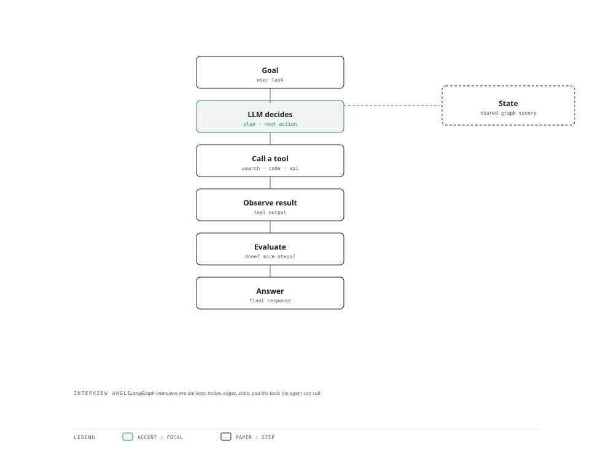

# Visual Notes — The Agent Loop

> One diagram, the full picture. This page is meant to be glanced at before reading the chapters, and again before interviews.

# What the diagram shows

1. **Decision** — The LLM picks the next action from its tool set based on the current goal and state.
1. **Execution** — A registered tool (search, code, API) runs and returns structured results.
1. **Loop** — The model observes the outcome, updates state/memory, and decides again — until a terminal condition.

# Why this matters for placement

- Agents are the industry top hiring signal for 2026 — the loop is the mental model every question hangs on.
- Knowing when NOT to use an agent (deterministic tasks) shows product judgement.

# Quick revision

- ReAct: interleave reasoning and acting to solve multi-step tasks.
- Function calling gives the LLM safe, structured access to tools.
- Memory/state: short-term context vs long-term user memory.
- Multi-agent: an orchestrator delegates to specialists; share state explicitly.
- Guardrails: allowlists, budgets, and human-in-the-loop gate risky actions.

# Related chapters

- [Introduction to AI agents](01-introduction-to-ai-agents.md)
- [Agent architectures](02-agent-architectures.md)
- [Tool use](04-tool-use-and-function-calling.md)
- [Memory and state](05-memory-and-state.md)

---

**One-line answer for interviews:** *"LLM decides → a tool executes → the result is observed → the loop repeats until the task is done."*
