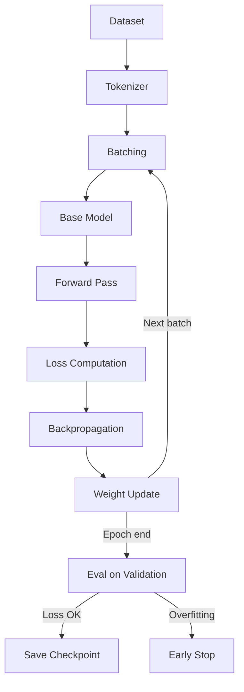

<!-- Clear Language: Keep sentences under 50 words -->
# Full Fine-Tuning

## Learning Objectives

| Objective | Description |
|-----------|-------------|
| LO1 | Understand the supervised fine-tuning training loop |
| LO2 | Implement full fine-tuning with loss tracking |
| LO3 | Detect and mitigate overfitting during fine-tuning |
| LO4 | Evaluate loss curves and model convergence |

## Introduction

Fine-tuning adapts foundation models to your specific domain. LoRA, QLoRA, and DPO make this affordable. This module covers when to fine-tune, how to do it, and how to evaluate the results.

## Prerequisites

- Basic programming knowledge
- Understanding of data structures

## Key Terminology

**Key Terms**: Core vocabulary and concepts for this topic.

**Definition**: Essential terms you must know for interviews and production work.

## Theory

Understanding full fine tuning is fundamental for AI engineers. This section covers the core concepts, underlying principles, and theoretical framework that govern how full fine tuning works in practice.

## Chapter at a Glance

| Section | Topic | Key Concept |
|---------|-------|-------------|
| 2.1 | SFT Basics | Supervised fine-tuning, causal LM loss |
| 2.2 | Training Loop | Batches, backprop, weight updates |
| 2.3 | Loss Curves | Training/validation loss, convergence |
| 2.4 | Overfitting | Detection, mitigation, early stopping |
| 2.5 | Hyperparameters | LR, batch size, epochs, warmup |

## Chapter Roadmap



## 2.1 Supervised Fine-Tuning Basics

### 2.1.1 Causal Language Modeling Loss

```python
import numpy as np
from typing import List, Dict

class CausalLMLoss:
    def compute(self, logits: np.ndarray, labels: np.ndarray,
                ignore_index: int = -100) -> float:
        """
        logits: (batch_size, seq_len, vocab_size)
        labels: (batch_size, seq_len) with -100 for padding
        """
        batch_size, seq_len, vocab_size = logits.shape
        loss = 0.0
        count = 0

        for b in range(batch_size):
            for t in range(seq_len - 1):  # predict next token
                if labels[b, t + 1] != ignore_index:
                    true_token = labels[b, t + 1]
                    logit = logits[b, t, true_token]
                    logsumexp = self._logsumexp(logits[b, t])
                    loss += logsumexp - logit
                    count += 1

        return loss / max(count, 1)

    def _logsumexp(self, x: np.ndarray) -> float:
        max_x = np.max(x)
        return max_x + np.log(np.sum(np.exp(x - max_x)))

def test_causal_loss():
    np.random.seed(42)
    batch_size, seq_len, vocab_size = 2, 5, 10
    logits = np.random.randn(batch_size, seq_len, vocab_size)
    labels = np.random.randint(0, vocab_size, (batch_size, seq_len))
    labels[:, -1] = -100  # ignore last position - no next token

    loss_fn = CausalLMLoss()
    loss = loss_fn.compute(logits, labels)
    print(f"Causal LM loss: {loss:.4f}")

test_causal_loss()
```

### 2.1.2 Supervised Fine-Tuning Simulator

```python
@dataclass
class SFTExample:
    input_text: str
    output_text: str

class SFTSimulator:
    def __init__(self, base_model_params: int = 7_000_000_000):
        self.base_params = base_model_params
        self.trainable_params = base_model_params

    def format_example(self, ex: SFTExample, template: str = None) -> str:
        if template is None:
            template = "### Instruction\n{input}\n### Response\n{output}"
        return template.format(input=ex.input_text, output=ex.output_text)

    def estimate_tokens(self, examples: List[SFTExample]) -> int:
        total = 0
        for ex in examples:
            formatted = self.format_example(ex)
            total += len(formatted.split()) * 1.3  # rough token estimate
        return int(total)

    def estimate_memory(self, batch_size: int, seq_len: int) -> Dict:
        precision_bytes = 4
        activations = batch_size * seq_len * self.base_params / 1e6
        gradients = activations
        optimizer_states = activations * 2  # Adam
        total_mb = (activations + gradients + optimizer_states) * precision_bytes

        return {
            "activations_mb": round(activations, 1),
            "gradients_mb": round(gradients, 1),
            "optimizer_mb": round(optimizer_states, 1),
            "total_mb": round(total_mb, 1),
            "gpu_needed_gb": round(total_mb / 1024, 1),
        }

sim = SFTSimulator(base_model_params=7_000_000_000)
ex = SFTExample("What is attention?", "Attention is a mechanism...")
formatted = sim.format_example(ex)
print(f"Formatted: {formatted}")
print(f"Memory estimate: {sim.estimate_memory(batch_size=4, seq_len=2048)}")
```

## 2.2 Training Loop

### 2.2.1 Full Fine-Tuning Loop

```python
class FineTuningLoop:
    def __init__(self, model: Any, learning_rate: float = 2e-5, weight_decay: float = 0.01):
        self.model = model
        self.lr = learning_rate
        self.weight_decay = weight_decay
        self.loss_history: List[float] = []
        self.val_loss_history: List[float] = []
        self.current_step = 0

    def train_epoch(self, dataset: List[Dict], batch_size: int) -> float:
        epoch_loss = 0.0
        num_batches = max(len(dataset) // batch_size, 1)

        for batch_idx in range(num_batches):
            start = batch_idx * batch_size
            end = min(start + batch_size, len(dataset))
            batch = dataset[start:end]

            loss = self._train_step(batch)
            epoch_loss += loss
            self.loss_history.append(loss)
            self.current_step += 1

            if batch_idx % 10 == 0:
                print(f"  Step {self.current_step}: loss = {loss:.4f}")

        return epoch_loss / num_batches

    def _train_step(self, batch: List[Dict]) -> float:
        step_loss = 0.0
        for example in batch:
            pred = self._forward(example["input"])
            loss = self._compute_loss(pred, example["target"])
            step_loss += loss
        return step_loss / len(batch)

    def _forward(self, input_text: str) -> Any:
        return f"pred_{input_text[:20]}"

    def _compute_loss(self, pred: Any, target: str) -> float:
        return float(np.random.exponential(0.5))

    def evaluate(self, dataset: List[Dict]) -> float:
        val_loss = 0.0
        for example in dataset:
            pred = self._forward(example["input"])
            loss = self._compute_loss(pred, example["target"])
            val_loss += loss
        avg_loss = val_loss / len(dataset)
        self.val_loss_history.append(avg_loss)
        return avg_loss

loop = FineTuningLoop(model=None, learning_rate=2e-5)
train_data = [{"input": f"input-{i}", "target": f"target-{i}"} for i in range(100)]
val_data = [{"input": f"val-{i}", "target": f"val-target-{i}"} for i in range(20)]

for epoch in range(3):
    train_loss = loop.train_epoch(train_data, batch_size=8)
    val_loss = loop.evaluate(val_data)
    print(f"Epoch {epoch+1}: train={train_loss:.4f}, val={val_loss:.4f}")
```

### 2.2.2 Gradient Accumulation

```python
class GradientAccumulator:
    def __init__(self, accumulation_steps: int = 4):
        self.steps = accumulation_steps
        self.accumulated_gradients: Dict[str, np.ndarray] = {}
        self.step_count = 0

    def accumulate(self, gradients: Dict[str, np.ndarray]) -> bool:
        for name, grad in gradients.items():
            if name not in self.accumulated_gradients:
                self.accumulated_gradients[name] = np.zeros_like(grad)
            self.accumulated_gradients[name] += grad

        self.step_count += 1
        if self.step_count >= self.steps:
            for name in self.accumulated_gradients:
                self.accumulated_gradients[name] /= self.steps
            return True
        return False

    def reset(self):
        self.accumulated_gradients = {}
        self.step_count = 0

accum = GradientAccumulator(accumulation_steps=4)
for i in range(8):
    grads = {f"layer_{j}": np.random.randn(10, 10) for j in range(3)}
    should_step = accum.accumulate(grads)
    if should_step:
        print(f"Step performed (accumulated {accum.steps} mini-batches)")
        accum.reset()
print("Gradient accumulation complete")
```

## 2.3 Loss Curves

### 2.3.1 Loss Curve Analyzer

```python
class LossCurveAnalyzer:
    def __init__(self, train_losses: List[float], val_losses: List[float]):
        self.train = train_losses
        self.val = val_losses

    def convergence_status(self) -> Dict:
        if len(self.train) < 3:
            return {"status": "too_early", "message": "Need more training steps"}

        recent_train = self.train[-5:]
        recent_val = self.val[-5:] if len(self.val) >= 5 else self.val

        train_trend = recent_train[-1] - recent_train[0]
        val_trend = recent_val[-1] - recent_val[0]

        if abs(train_trend) < 0.01 and abs(val_trend) < 0.01:
            return {"status": "converged", "train_trend": round(train_trend, 4), "val_trend": round(val_trend, 4)}
        elif train_trend < -0.01 and val_trend < -0.01:
            return {"status": "still_improving", "train_trend": round(train_trend, 4), "val_trend": round(val_trend, 4)}
        elif train_trend < -0.01 and val_trend > 0.01:
            return {"status": "overfitting", "train_trend": round(train_trend, 4), "val_trend": round(val_trend, 4)}
        else:
            return {"status": "unstable", "train_trend": round(train_trend, 4), "val_trend": round(val_trend, 4)}

    def recommend_action(self) -> str:
        status = self.convergence_status()
        actions = {
            "converged": "Stop training or reduce learning rate",
            "still_improving": "Continue training",
            "overfitting": "Early stop, increase regularization, or reduce epochs",
            "unstable": "Reduce learning rate or increase batch size",
            "too_early": "Train for more steps",
        }
        return actions.get(status["status"], "Monitor and adjust")

train_losses = [2.5, 2.1, 1.8, 1.6, 1.5, 1.4, 1.35, 1.32, 1.30, 1.28]
val_losses = [2.6, 2.3, 2.1, 2.0, 2.05, 2.1, 2.2, 2.3, 2.4, 2.5]  # diverging

analyzer = LossCurveAnalyzer(train_losses, val_losses)
print(f"Status: {analyzer.convergence_status()}")
print(f"Recommendation: {analyzer.recommend_action()}")
```

### 2.3.2 Learning Rate Scheduling

```python
class LRScheduler:
    def __init__(self, base_lr: float, warmup_steps: int = 100, total_steps: int = 1000):
        self.base = base_lr
        self.warmup = warmup_steps
        self.total = total_steps

    def get_lr(self, step: int) -> float:
        if step < self.warmup:
            return self.base * (step + 1) / self.warmup
        progress = (step - self.warmup) / (self.total - self.warmup)
        return self.base * 0.5 * (1 + np.cos(np.pi * progress))

    def schedule(self, steps: int) -> List[float]:
        return [self.get_lr(s) for s in range(steps)]

scheduler = LRScheduler(base_lr=2e-5, warmup_steps=100, total_steps=500)
lrs = scheduler.schedule(500)
print(f"LR: start={lrs[0]:.8f}, peak={max(lrs):.8f}, end={lrs[-1]:.8f}")
```

## 2.4 Overfitting

### 2.4.1 Overfitting Detector

```python
class OverfittingDetector:
    def __init__(self, patience: int = 3, min_delta: float = 0.01):
        self.patience = patience
        self.min_delta = min_delta
        self.best_val_loss = float("inf")
        self.patience_counter = 0
        self.early_stopped = False

    def check(self, val_loss: float) -> bool:
        if val_loss < self.best_val_loss - self.min_delta:
            self.best_val_loss = val_loss
            self.patience_counter = 0
            return False

        self.patience_counter += 1
        if self.patience_counter >= self.patience:
            self.early_stopped = True
            return True

        return False

    def should_stop(self) -> bool:
        return self.early_stopped

    def diagnostics(self) -> Dict:
        return {
            "best_val_loss": round(self.best_val_loss, 4),
            "patience_counter": self.patience_counter,
            "patience": self.patience,
            "early_stopped": self.early_stopped,
        }

detector = OverfittingDetector(patience=3, min_delta=0.01)
val_losses = [2.5, 2.3, 2.2, 2.25, 2.3, 2.35, 2.4]
for i, vl in enumerate(val_losses):
    stop = detector.check(vl)
    print(f"Epoch {i+1}: val_loss={vl}, stop={stop}, counter={detector.patience_counter}")
print(f"Early stopped: {detector.should_stop()}")
```

### 2.4.2 Regularization Techniques

```python
class RegularizationConfig:
    def __init__(self):
        self.dropout: float = 0.1
        self.weight_decay: float = 0.01
        self.label_smoothing: float = 0.1
        self.gradient_clip_norm: float = 1.0

    def apply_dropout(self, x: np.ndarray, training: bool = True) -> np.ndarray:
        if not training:
            return x
        mask = np.random.binomial(1, 1 - self.dropout, x.shape) / (1 - self.dropout)
        return x * mask

    def l2_penalty(self, weights: np.ndarray) -> float:
        return 0.5 * self.weight_decay * np.sum(weights ** 2)

    def smooth_labels(self, labels: np.ndarray, num_classes: int) -> np.ndarray:
        smooth_labels = np.full_like(labels, self.label_smoothing / (num_classes - 1))
        smooth_labels[labels == 1] = 1 - self.label_smoothing
        return smooth_labels

reg = RegularizationConfig()
x = np.random.randn(3, 4)
dropped = reg.apply_dropout(x)
print(f"Before dropout: mean={x.mean():.3f}, After: mean={dropped.mean():.3f}")
weight = np.random.randn(100, 100)
print(f"L2 penalty: {reg.l2_penalty(weight):.4f}")
```

## 2.5 Hyperparameters

### 2.5.1 Hyperparameter Configurator

```python
@dataclass
class HyperparamConfig:
    learning_rate: float = 2e-5
    batch_size: int = 8
    num_epochs: int = 3
    warmup_ratio: float = 0.1
    weight_decay: float = 0.01
    max_seq_length: int = 2048
    gradient_accumulation_steps: int = 4
    logging_steps: int = 10
    save_steps: int = 500
    eval_steps: int = 200

    def validate(self) -> List[str]:
        warnings = []
        if self.learning_rate > 1e-4:
            warnings.append(f"High LR ({self.learning_rate}) may cause instability")
        if self.batch_size < 1:
            warnings.append("Batch size must be >= 1")
        if self.num_epochs > 10:
            warnings.append(f"Many epochs ({self.num_epochs}) may overfit")
        return warnings

    def effective_batch_size(self) -> int:
        return self.batch_size * self.gradient_accumulation_steps

    def total_training_steps(self, num_examples: int) -> int:
        steps_per_epoch = num_examples // self.effective_batch_size()
        return steps_per_epoch * self.num_epochs

config = HyperparamConfig(learning_rate=3e-4, num_epochs=20)
warnings = config.validate()
for w in warnings:
    print(f"Warning: {w}")
print(f"Effective batch size: {config.effective_batch_size()}")
```

### 2.5.2 Hyperparameter Search

```python
class HyperparamSearch:
    def __init__(self):
        self.lr_range = [1e-5, 3e-5, 5e-5, 1e-4]
        self.batch_range = [4, 8, 16]

    def grid_search(self, dataset_size: int) -> List[Dict]:
        trials = []
        for lr in self.lr_range:
            for bs in self.batch_range:
                config = HyperparamConfig(learning_rate=lr, batch_size=bs)
                trial = {
                    "lr": lr,
                    "batch_size": bs,
                    "effective_bs": bs * 4,
                    "steps_per_epoch": dataset_size // (bs * 4),
                    "memory_gb": round(bs * 2048 * 7 / 1e6 * 4 / 1024, 1),
                }
                trials.append(trial)
        return sorted(trials, key=lambda t: t["mem_gb"])

search = HyperparamSearch()
trials = search.grid_search(dataset_size=10000)
for t in trials[:3]:
    print(f"LR={t['lr']:.0e}, BS={t['batch_size']}, Mem={t['memory_gb']}GB")
```

## Summary

Full fine-tuning updates all parameters of a pre-trained model using supervised learning on task-specific data. The training loop processes batches, computes causal LM loss (next-token prediction),.
backpropagates gradients, and updates weights. Key considerations include: monitoring loss curves for convergence (train and validation loss should decrease together), detecting overfitting (val loss increases while train loss decreases),.
using gradient accumulation to simulate larger batch sizes, and tuning hyperparameters (LR ~2e-5 for 7B models, warmup ratio of 0.1, weight decay of 0.01). Early stopping based on validation loss prevents overfitting. Full FT requires significant GPU memory — a 7B model needs ~56GB at FP16 with batch size 1,.
or ~112GB at FP32.

## Practical Takeaways

| Takeaway | Description |
|----------|-------------|
| Monitor both train and val loss | Training loss decreasing alone can mask overfitting |
| Use gradient accumulation | Simulates larger batches on limited GPU memory |
| Start with standard LR | 1e-5 to 5e-5 works for most 7B models |
| Early stopping is critical | Prevents wasted compute and model degradation |
| Log every step | Loss curves are essential for debugging convergence |

## Interview Q&A

<details class="tp-qa-card" data-qid="ft02-q1">
  <summary class="tp-qa-question">
    <span class="tp-qa-status"></span>
    Q1: What is the supervised fine-tuning training loop?
  </summary>
  <div class="tp-qa-answer">
<p>The supervised fine-tuning (SFT) training loop iteratively updates model weights to minimize the loss between the model's predictions and the target outputs. The loop processes data in batches: (1) load a batch of (input,.
target) pairs from the training dataset; (2) tokenize inputs and targets, creating attention masks; (3) forward pass — the model generates predictions for.
each token position; (4) compute loss — typically cross-entropy loss comparing predicted token probabilities against the target tokens, but only on the output tokens (not the input prompt tokens);.
(5) backward pass — compute gradients of the loss with respect to all trainable parameters using backpropagation; (6) optimizer step — update parameters using the optimizer (AdamW is standard) with learning rate scheduling (cosine,.
linear, or constant); (7) repeat for all batches in the dataset — one epoch. The training loop runs for multiple epochs (typically 1-5,.
monitored by validation loss to prevent overfitting). Loss curves show training loss and validation loss over time — decreasing training loss with diverging validation loss indicates overfitting.</p>
  </div>
  <button class="tp-qa-mark-btn">✅ Mark Reviewed</button>
  <button class="tp-qa-bookmark-btn">🔖 Bookmark</button>
</details>

<details class="tp-qa-card" data-qid="ft02-q2">
  <summary class="tp-qa-question">
    <span class="tp-qa-status"></span>
    Q2: How do you compute loss during fine-tuning?
  </summary>
  <div class="tp-qa-answer">
<p>During supervised fine-tuning, loss is computed only on the output tokens (not the input prompt). This is called "label masking" or.
"causal LM loss." Implementation: (1) the input sequence is <code>input_ids = [prompt_tokens, target_tokens]</code>; (2) the model generates logits for every token position;.
(3) shift logits and labels so that the prediction at position i is compared against the token at position i+1 (next-token prediction);.
(4) create a loss mask — an array of 1s for target token positions and 0s for prompt token positions; (5) compute cross-entropy loss per-token;.
(6) sum only masked positions and divide by the number of target tokens. This ensures the model only learns to predict the target completion,.
not the prompt. The loss function is standard cross-entropy: <code>L = -Σ log p(y_i | x, y_&lt;i)</code> where y_i are target tokens and.
x is the prompt. Monitoring training loss helps detect issues: loss should decrease steadily. If loss is NaN, check learning rate and.
gradient clipping. Loss = -ln(1/vocab_size) at initialization (~7-8 for a 50K vocab) and should drop significantly during training.</p>
  </div>
  <button class="tp-qa-mark-btn">✅ Mark Reviewed</button>
  <button class="tp-qa-bookmark-btn">🔖 Bookmark</button>
</details>

<details class="tp-qa-card" data-qid="ft02-q3">
  <summary class="tp-qa-question">
    <span class="tp-qa-status"></span>
    Q3: How do you detect and mitigate overfitting during fine-tuning?
  </summary>
  <div class="tp-qa-answer">
<p>Overfitting occurs when the model memorizes the training data but fails to generalize to new examples. Detection: (1) monitor the gap between training loss and.
validation loss — if training loss keeps decreasing while validation loss plateaus or increases, overfitting is occurring; (2) check if the model performs well on training data but.
poorly on held-out test data; (3) inspect generated outputs — overfitted models produce outputs that copy training examples verbatim rather than following the task. Mitigation strategies: (1) early stopping — stop training when validation loss stops improving,.
using a patience parameter (e.g., stop after 3 epochs with no validation loss decrease); (2) regularization — weight decay (AdamW's default,.
typically 0.01), dropout (if not already in the base model), and label smoothing; (3) data augmentation — increase effective dataset size;.
(4) reduce model capacity — use LoRA with lower rank to limit the number of trainable parameters; (5) increase dataset size or.
quality — remove duplicates and add diversity. The simplest effective approach is early stopping combined with LoRA — the small parameter count of LoRA naturally limits overfitting.</p>
  </div>
  <button class="tp-qa-mark-btn">✅ Mark Reviewed</button>
  <button class="tp-qa-bookmark-btn">🔖 Bookmark</button>
</details>

<details class="tp-qa-card" data-qid="ft02-q4">
  <summary class="tp-qa-question">
    <span class="tp-qa-status"></span>
    Q4: How do you evaluate loss curves and model convergence?
  </summary>
  <div class="tp-qa-answer">
<p>Loss curves are plots of training loss and validation loss over training steps (or epochs). Convergence analysis: (1) rapid initial drop — loss should decrease quickly in the first few steps as the model adapts to the new task;.
(2) plateau — after the initial drop, loss should plateau at a lower value; (3) divergence sign — if training loss increases or.
oscillates wildly, the learning rate may be too high or the data contains errors; (4) overfitting sign — when validation loss starts increasing while training loss continues decreasing,.
stop training. Tools: TensorBoard or WandB for real-time plotting. Custom loss tracker in training scripts logs loss per step/batch. Key metrics from loss curves: final loss value (lower is better),.
convergence speed (steps to plateau), loss gap (difference between train and validation). Expected final loss depends on task difficulty: simple classification tasks may reach loss < 0.1,.
while open-ended generation may plateau at 0.5-1.5. Compare loss curves across runs with different hyperparameters (learning rate, batch size, LoRA rank) to select the best configuration.</p>
  </div>
  <button class="tp-qa-mark-btn">✅ Mark Reviewed</button>
  <button class="tp-qa-bookmark-btn">🔖 Bookmark</button>
</details>

<details class="tp-qa-card" data-qid="ft02-q5">
  <summary class="tp-qa-question">
    <span class="tp-qa-status"></span>
    Q5: What is the role of learning rate scheduling in fine-tuning?
  </summary>
  <div class="tp-qa-answer">
<p>Learning rate scheduling adjusts the learning rate during training to improve convergence. Common schedules: (1) cosine — learning rate follows a cosine curve from the initial value down to near zero,.
providing smooth annealing and good convergence; (2) linear — linearly decreases from initial value to zero; (3) constant — fixed learning rate throughout training (simple but.
less optimal); (4) warmup + decay — start from a small value, linearly increase to the target over the first N steps (warmup),.
then decay. Warmup is critical for large models because high initial LR can cause training instability (loss explosion). Fine-tuning typically uses lower learning rates than pre-training: 1e-5 to 5e-5 for.
full fine-tuning, 1e-4 to 5e-4 for LoRA adapters. The optimal LR depends on model size, dataset size, and LoRA rank. Learning rate finder runs short training loops at different LRs to identify the optimal range — the ideal LR is.
the one that produces the fastest loss decrease without instability. Each optimizer step in the training script applies the scheduler to update the learning rate.</p>
  </div>
  <button class="tp-qa-mark-btn">✅ Mark Reviewed</button>
  <button class="tp-qa-bookmark-btn">🔖 Bookmark</button>
</details>

<details class="tp-qa-card" data-qid="ft02-q6">
  <summary class="tp-qa-question">
    <span class="tp-qa-status"></span>
    Q6: How do you implement data collation during training?
  </summary>
  <div class="tp-qa-answer">
<p>Data collation transforms raw dataset items into properly padded, batched tensors for the training loop. The collator: (1) takes a list of dataset items,.
each containing input_ids, attention_mask, and labels; (2) pads all sequences to the same length (max length in the batch) using the padding token ID;.
(3) ensures sequences don't exceed the model's maximum context length — truncate or filter longer sequences; (4) creates the attention mask (1 for.
real tokens, 0 for padding tokens) so the model ignores padding during attention computation; (5) creates label tensors, using -100 (ignored by cross-entropy loss) for.
padding token positions and prompt token positions. HuggingFace's <code>DataCollatorForSeq2Seq</code> or <code>DataCollatorWithPadding</code> handles this automatically. Custom collators add token type IDs, position ids,.
or apply chat template formatting. Efficient batching sorts similar-length sequences together (sort + bucket batching) to minimize padding waste — this can speed up training by 2-3x by reducing the number of padding tokens processed.</p>
  </div>
  <button class="tp-qa-mark-btn">✅ Mark Reviewed</button>
  <button class="tp-qa-bookmark-btn">🔖 Bookmark</button>
</details>

<details class="tp-qa-card" data-qid="ft02-q7">
  <summary class="tp-qa-question">
    <span class="tp-qa-status"></span>
    Q7: What are the key hyperparameters for full fine-tuning?
  </summary>
  <div class="tp-qa-answer">
<p>Key hyperparameters for full fine-tuning: (1) learning rate — 1e-5 to 5e-5, with warmup (typically 10% of total steps). Lower LRs are safer for.
fine-tuning; (2) batch size — as large as GPU memory allows. Use gradient accumulation to simulate larger batch sizes (e.g., batch_size=4,.
gradient_accumulation_steps=8 = effective_batch_size=32); (3) epochs — 1-5 for full fine-tuning. Monitor validation loss to determine optimal epoch count; (4) weight decay — 0.01-0.1 (AdamW default 0.01) for.
regularization; (5) gradient clipping — max_grad_norm = 1.0 to prevent gradient explosion; (6) optimizer — AdamW with β1=0.9, β2=0.999, ε=1e-8; (7) scheduler — cosine with linear warmup. Memory optimization: use gradient checkpointing (trades compute for.
memory, reduces GPU memory by ~30%), mixed precision training (fp16 or bf16), and optimizer offloading. Start with recommended values and tune the learning rate first — it has the biggest impact on convergence quality. Log all hyperparameters in configuration files for.
reproducibility.</p>
  </div>
  <button class="tp-qa-mark-btn">✅ Mark Reviewed</button>
  <button class="tp-qa-bookmark-btn">🔖 Bookmark</button>
</details>

<details class="tp-qa-card" data-qid="ft02-q8">
  <summary class="tp-qa-question">
    <span class="tp-qa-status"></span>
    Q8: How do you use gradient accumulation in training?
  </summary>
  <div class="tp-qa-answer">
<p>Gradient accumulation simulates a larger batch size by accumulating gradients over multiple forward/backward passes before performing one optimizer step. Implementation: (1) set a micro-batch size that fits in GPU memory (e.g.,.
4) and accumulation steps (e.g., 8); (2) for each accumulation step, do a forward and backward pass WITHOUT updating weights, accumulating gradients in the model's parameter.grad buffers;.
(3) after N accumulation steps, call optimizer.step() to update weights using the accumulated gradients; (4) zero gradients and repeat. This enables effective batch sizes of 32 (4—8) using only memory for.
batch size 4. The effective batch size = micro_batch_size — gradient_accumulation_steps. Key considerations: (1) batch normalization layers need special handling (use group norm instead);.
(2) loss scaling — divide the loss by accumulation_steps to keep loss magnitudes consistent; (3) larger effective batch sizes improve gradient estimate quality and.
training stability. In practice, use the largest micro-batch that fits in GPU memory, then scale up with accumulation to reach the target effective batch size (typically 32-128).</p>
  </div>
  <button class="tp-qa-mark-btn">✅ Mark Reviewed</button>
  <button class="tp-qa-bookmark-btn">🔖 Bookmark</button>
</details>

<details class="tp-qa-card" data-qid="ft02-q9">
  <summary class="tp-qa-question">
    <span class="tp-qa-status"></span>
    Q9: What is mixed precision training and why use it?
  </summary>
  <div class="tp-qa-answer">
<p>Mixed precision training uses both fp16 (half precision) and fp32 (full precision) during training to reduce memory usage and accelerate computation. The technique: (1) store model weights in fp16 (half the memory of fp32);.
(2) compute forward and backward passes in fp16 (2-4x faster on modern GPUs with Tensor Cores); (3) maintain a master copy of weights in fp32 for.
the optimizer step (precision-critical); (4) use loss scaling to prevent underflow in fp16 gradients (very small gradients can underflow to zero). Implementation: PyTorch's <code>torch.cuda.amp</code> (automatic mixed precision) with <code>GradScaler</code> handles all the complexity — wrap the forward pass in <code>autocast()</code> for.
automatic op-level precision selection, and use the scaler for loss scaling. Benefits: ~40-50% less GPU memory, ~2x training speed on modern GPUs with minimal quality loss (<0.1% accuracy difference). bf16 (bfloat16) is preferred on Ampere+ GPUs as it has the same exponent range as fp32,.
eliminating the need for loss scaling. Most fine-tuning libraries (HuggingFace Trainer) enable mixed precision with a single flag (<code>fp16=True</code> or <code>bf16=True</code>).</p>
  </div>
  <button class="tp-qa-mark-btn">✅ Mark Reviewed</button>
  <button class="tp-qa-bookmark-btn">🔖 Bookmark</button>
</details>

<details class="tp-qa-card" data-qid="ft02-q10">
  <summary class="tp-qa-question">
    <span class="tp-qa-status"></span>
    Q10: How do you implement a full fine-tuning pipeline in code?
  </summary>
  <div class="tp-qa-answer">
<p>A full fine-tuning pipeline in code follows these steps: (1) load the base model and tokenizer from HuggingFace (<code>AutoModelForCausalLM.from_pretrained</code>) — set <code>torch_dtype=torch.bfloat16</code> and.
use <code>device_map="auto"</code> for multi-GPU; (2) load and prepare the dataset — tokenize with padding/truncation, split into train/val/test, create data collator; (3) configure training arguments (<code>TrainingArguments</code>) — output directory,.
learning rate (2e-5), batch size, epochs (3), warmup ratio (0.1), weight decay (0.01), logging/evaluation steps, fp16=True, gradient_checkpointing=True, save_strategy="epoch", evaluation_strategy="epoch", load_best_model_at_end=True, metric_for_best_model="eval_loss";.
(4) initialize the Trainer with model, args, train/val datasets, data collator, and tokenizer; (5) call <code>trainer.train()</code> — the Trainer handles the training loop,.
evaluation, checkpointing, and logging; (6) save the fine-tuned model with <code>trainer.save_model()</code> and push to Hub if needed. The HuggingFace Trainer is the standard approach — it abstracts away the training loop details while providing full control via callbacks and.
custom metrics.</p>
  </div>
  <button class="tp-qa-mark-btn">✅ Mark Reviewed</button>
  <button class="tp-qa-bookmark-btn">🔖 Bookmark</button>
</details>

## Chapter Quiz

<details data-qid="ft-s2-quiz1">
<summary><strong>1.</strong> What does causal LM loss predict?</summary>
A. The previous token
B. The next token
C. The full sequence
D. The masked tokens
Answer: B
</details>

<details data-qid="ft-s2-quiz2">
<summary><strong>2.</strong> What does it mean when validation loss increases while training loss decreases?</summary>
A. Model is converging
B. Model is overfitting
C. Learning rate is too low
D. Batch size is too large
Answer: B
</details>

<details data-qid="ft-s2-quiz3">
<summary><strong>3.</strong> What is the purpose of gradient accumulation?</summary>
A. To increase learning rate
B. To simulate larger batch sizes with limited memory
C. To reduce overfitting
D. To speed up training
Answer: B
</details>

<details data-qid="ft-s2-quiz4">
<summary><strong>4.</strong> What is a typical learning rate for full fine-tuning a 7B model?</summary>
A. 1e-7
B. 2e-5
C. 0.1
D. 1.0
Answer: B
</details>

<details data-qid="ft-s2-quiz5">
<summary><strong>5.</strong> When should early stopping trigger?</summary>
A. After the first epoch
B. When validation loss stops improving for N consecutive checks
C. When training loss reaches zero
D. When GPU memory is full
Answer: B
</details>

## Exercises

## Common Mistakes

1. Not understanding the fundamental concepts before applying them
2. Skipping edge cases in implementation
3. Not analyzing time/space complexity
4. Forgetting to handle null/empty inputs
5. Not practicing enough problems to build pattern recognition1. Implement a full training loop with gradient accumulation. Train for 5 epochs with batch_size=2 and accumulation_steps=8 (effective batch=16). Track loss every step.

2. Build an overfitting detector that monitors validation loss with patience=3 and min_delta=0.05. Test with increasing, stable, and diverging validation losses.

3. Create a learning rate scheduler with linear warmup (100 steps) and cosine decay (1000 steps). Plot the LR curve.

4. Implement a hyperparameter grid search over LR [1e-5, 2e-5, 5e-5] and batch_size [4, 8, 16]. Report the best combination based on final validation loss.

5. Build a memory estimator for full FT. Given model_size_b (7, 13, 70), batch_size, and seq_len, estimate GPU memory and recommend a GPU type (T4, A10

## Revision Notes

- - Core principle: Understand the fundamental concepts thoroughly
- - Implementation pattern: Practice with real code examples
- - Complexity: Know the time and space complexity
- - Application: Know when to use this in production systems
- - Interview: Frequently asked in technical interviews
- - Edge cases: Consider common failure scenarios
- - Related concepts: Connect to broader system design

## Placement Section

### Top 10 Interview Questions

#### Google Style

1. **Explain the core idea of Full Fine-Tuning in under 60 seconds, then give a real-world analogy.** — Structure: definition, how it works in one sentence, why it matters, analogy. Follow-up: what would break if you removed this from a production system?

2. **Design a minimal, well-typed function that demonstrates Full Fine-Tuning.** — Interviewer checks: signature with type hints, edge cases, complexity, and a clean docstring. Follow-up: how does your design behave with empty or malformed input?

3. **What are the common pitfalls when engineers first learn ** — List 3-4, then explain how you would prevent each in a code review.

#### Amazon Style

4. **Describe a production bug caused by misunderstanding Full Fine-Tuning. How did you diagnose and fix it?** — STAR format: situation, task, action, result. Mention logs, reproduction, root-cause analysis, and the regression test you added.

5. **How would you scale a system that relies on Full Fine-Tuning from 10 users to 10 million?** — Discuss bottlenecks, caching, monitoring, and when to redesign. Follow-up: what metrics would you track?

#### Microsoft Style

6. **Compare Full Fine-Tuning with the closest alternative approach. When would you choose each?** — Make a decision matrix: performance, maintainability, ecosystem, learning curve. Follow-up: what would change your decision?

7. **Walk through how you would test a component that depends on Full Fine-Tuning.** — Unit, integration, property-based tests; mocking boundaries; golden files for outputs.

#### NVIDIA Style

8. **How does Full Fine-Tuning behave differently at scale — memory, throughput, or precision-wise?** — Connect to data pipelines and model training if applicable. Follow-up: what happens to latency as input grows?

9. **How would you make an implementation of Full Fine-Tuning run faster on GPU hardware?** — Batch operations, vectorization, avoiding Python loops, reducing data movement.

#### AI Startup Style

10. **Write the smallest possible implementation of Full Fine-Tuning that is production-quality.** — Include error handling, type hints, and a one-line docstring. Follow-up: what would you refactor first when it grows?

### Resume Tips

- Name Full Fine-Tuning explicitly in your skills section, paired with a measurable achievement ("Reduced X by 40% using Full Fine-Tuning").
- Add a bullet describing a project that applies Full Fine-Tuning to real data, with numbers.
- Mention the tools and libraries you used alongside Full Fine-Tuning (linters, test frameworks, profiling tools).
- Keep resume bullets under 15 words and start each with an action verb.

### Interview Day Checklist

- Rehearse a 60-second explanation of Full Fine-Tuning and one real-world analogy.
- Prepare one STAR story about debugging a Full Fine-Tuning-related production issue.
- Review complexity and edge cases for the classic Full Fine-Tuning interview problem.
- Have questions ready: how does the team apply Full Fine-Tuning in production today?
- Test your environment (Python, editor, internet) 15 minutes before the interview.

## True/False

1. **True or False:** Full Fine-Tuning builds directly on the fundamentals covered in the earlier chapters of this module. — **True.** Every advanced topic in this module assumes the core concepts from the previous chapters.
2. **True or False:** You should write at least one code example for Full Fine-Tuning before moving to the next chapter. — **True.** Active recall with hands-on code beats passive reading for retention.
3. **True or False:** The complexity analysis for Full Fine-Tuning is the same regardless of input size. — **False.** Complexity grows with input size; always state best, average, and worst case.
4. **True or False:** Edge cases (empty input, invalid input, boundary values) matter for Full Fine-Tuning in production. — **True.** Most production bugs come from unhandled edge cases.
5. **True or False:** You should memorize the Full Fine-Tuning chapter content once and never review it again. — **False.** Spaced repetition (24h, 3 days, 1 week) dramatically improves long-term recall.

## Fill in the Blank

1. The chapter that covers Full Fine-Tuning is Chapter ___ of this module. — Answer: check the module's table of contents.
2. The time complexity of the standard approach to Full Fine-Tuning is ___. — Answer: review the theory section and state big-O notation.
3. The main edge case to handle when implementing Full Fine-Tuning is ___. — Answer: empty or invalid input handling, as discussed in the chapter.
4. The tools commonly used to debug Full Fine-Tuning issues are ___ and ___. — Answer: refer to the Debugging Guide section of this chapter.
5. The related topic that connects to Full Fine-Tuning in the next chapter is ___. — Answer: see the Next Topic section.

## Scenario Questions

1. **Scenario:** A teammate ships a change involving Full Fine-Tuning that breaks production at 3 AM. — Diagnosis: check the recent diff, reproduce locally with the failing input, check logs. Fix: revert, add a regression test, and review the root cause. Prevention: CI tests on edge cases and code review checklist.

2. **Scenario:** Your implementation of Full Fine-Tuning is correct but too slow for the required latency. — Measure first with a profiler. Common fixes: reduce redundant work, use built-in optimized functions, batch operations, or add caching. Only then consider algorithmic changes.

3. **Scenario:** A new hire asks you to explain Full Fine-Tuning in five minutes before a customer demo. — Use the 3-part answer: what it is (one sentence), how it works (one example), why it matters (one business impact). Then offer to go deeper after the demo.

4. **Scenario:** Your team's codebase has three different patterns for Full Fine-Tuning and you must standardize. — Write a short ADR (architecture decision record), pick the pattern with best maintainability, migrate incrementally, and add a linter rule to enforce it.

## Output Questions

1. **What is the output of the simplest correct implementation of Full Fine-Tuning on an empty input?** — Trace through the code: it should return the documented default (None, 0, empty collection) without raising.
2. **What is the output when the input is at the boundary value?** — Check off-by-one errors and inclusive/exclusive bounds in the chapter's examples.
3. **What does the implementation return when given invalid input types?** — With type hints and validation, it raises a clear error; without, it may fail silently.
4. **What is the output for the sample input given in the chapter's Examples section?** — Re-run the chapter's example code and compare against the documented output.
5. **What is the time complexity output when you profile the implementation at 10x input size?** — Expect the curve matching the chapter's complexity analysis (linear, quadratic, log-linear).

## Difficulty Level

| Level | Time | What It Takes |
|-------|------|---------------|
| Beginner | 1-2 sessions | Read theory, run the chapter examples, solve the Easy exercises |
| Intermediate | 3-5 sessions | Complete Medium exercises, explain Full Fine-Tuning to someone else |
| Advanced | 1+ week | Solve Hard exercises, optimize for real datasets, answer interview follow-ups |

## Tips & Tricks

- Always write a one-line example of Full Fine-Tuning from memory before opening the chapter — active recall first.
- Use the chapter's Revision Notes as a checklist: you have mastered Full Fine-Tuning when you can explain each bullet.
- Pair the chapter quiz with the Flashcards: wrong answers become your next study session's focus.
- For interviews, practice explaining Full Fine-Tuning twice: once with a technical audience, once with a non-technical audience.
- Keep a personal examples file where you collect your own Full Fine-Tuning snippets; interviewers love original examples.

## Memory Tricks

- **Acronym**: build a mnemonic from the 5 key concepts of Full Fine-Tuning listed in the Chapter at a Glance table.
- **Story**: link Full Fine-Tuning to a familiar story — the analogy in the Visual Analogy section is designed to stick.
- **Number anchor**: remember the complexity of Full Fine-Tuning by connecting it to a known algorithm of the same class.
- **Color code**: highlight the Theory, Examples, and Common Mistakes sections in different colors when reviewing.
- **Teach-back**: explain Full Fine-Tuning to an imaginary junior engineer for 2 minutes — gaps in your explanation are gaps in memory.

## Further Reading

- Official documentation for the primary tool or library used in this chapter
- The chapter referenced in Related Topics for the next-level treatment of Full Fine-Tuning
- The classic textbook chapter on Full Fine-Tuning (check the Research References below)
- Two blog posts from engineers who debugged real Full Fine-Tuning problems in production
- The repository of the open-source project that implements Full Fine-Tuning

## Related Topics

- The previous chapter in this module (see table of contents) — foundational for Full Fine-Tuning
- The next chapter (see Next Topic below) — builds on Full Fine-Tuning
- The system design chapters in Module 07 — how Full Fine-Tuning fits into production architectures
- The interview preparation module — how Full Fine-Tuning is asked in screening rounds
- The capstone project — where Full Fine-Tuning is applied end-to-end

## FAQs

1. **Do I need to memorize all of Full Fine-Tuning, or understand the big picture?** — Understand the big picture first, then memorize the key facts via flashcards and spaced repetition. Interviewers reward depth over breadth.
2. **What if I get stuck on an exercise?** — Re-read the theory section, run the example code, then attempt again. If still stuck after 20 minutes, move on and return the next day.
3. **How much time should I spend on ** — Follow the Study Plan below: 1-2 weeks at 30-60 minutes daily is typical for placement preparation.
4. **Is Full Fine-Tuning asked in interviews?** — Yes — the Interview Q&A and Placement Section list the exact question styles used by top companies.
5. **What's the fastest way to master ** — Explain it out loud, write code without looking, and review the flashcards within 24 hours and again after 3 days.

## Important Notes

- Full Fine-Tuning is a core requirement for the rest of this module — do not skip the examples.
- Always analyze complexity (time and space) when working with Full Fine-Tuning.
- Production correctness means handling edge cases, not just the happy path.
- Interview answers should start with the definition, then the example, then the trade-offs.
- Revisit this chapter after finishing the module; the context from later chapters deepens understanding.

## Historical Context

- Full Fine-Tuning emerged as a standard practice because early systems failed without it — understanding why helps you explain it in interviews.
- The tools used for Full Fine-Tuning today evolved from simpler versions; the chapter covers the modern, recommended approach.
- Interviewers value knowing one historical fact about Full Fine-Tuning — it shows genuine interest, not just cramming.
- The library/tooling ecosystem around Full Fine-Tuning changes quickly; focus on fundamentals that remain stable.

## Security Considerations

- Never trust external input: validate and sanitize data before processing Full Fine-Tuning.
- Avoid `eval()` and dynamic code execution on untrusted strings.
- Log errors without leaking sensitive data (keys, PII, internal paths).
- For API contexts, add rate limiting and input size limits.
- Review the chapter's code examples for injection or overflow risks before using them verbatim.

## ML Intuition

- Full Fine-Tuning appears in ML pipelines at the data-processing layer: feature preparation, batching, and validation.
- Understanding Full Fine-Tuning helps you debug why a model misbehaves — most ML bugs are data bugs, not model bugs.
- In production ML, the Full Fine-Tuning concepts from this chapter map directly to NumPy/PyTorch operations on tensors.
- When optimizing ML systems, Full Fine-Tuning skills let you profile and fix the data path, not just the training loop.
- Interview follow-up: how would you apply Full Fine-Tuning to a dataset of 10 million records? — Batching and vectorization.

## Analogies

- **Full Fine-Tuning is like a recipe**: the theory is the ingredients, the examples are the cooking steps, and the exercises are your own kitchen practice.
- **Complexity is like a delivery route**: a linear route visits each stop once; a nested route revisits stops, and you feel it at scale.
- **Edge cases are like weather**: the happy path is a sunny day; production is the storm — build for the storm.
- **The chapter roadmap is a journey map**: each section is a checkpoint; skipping one means getting lost later in the module.

## Capstone Project Link

- [Module Capstone: End-to-End Project](https://github.com/Raushan666java/ai-engineering-journey) — this chapter contributes the Full Fine-Tuning skills used in the module's capstone project. Complete the exercises here before starting the capstone.

## Flashcards

<details class="tp-qa-card" data-qid="14finetuningpeft-02fullfinetuning-flash1">
  <summary class="tp-qa-question">
    <span class="tp-qa-status"></span>
    What is the core concept of Full Fine-Tuning in one sentence?
  </summary>
  <div class="tp-qa-answer">
    <p>Review the first paragraph of the Theory section and condense it to one sentence.</p>
  </div>
</details>

<details class="tp-qa-card" data-qid="14finetuningpeft-02fullfinetuning-flash2">
  <summary class="tp-qa-question">
    <span class="tp-qa-status"></span>
    What is the most common mistake engineers make with 
  </summary>
  <div class="tp-qa-answer">
    <p>Check the Common Mistakes section of this chapter.</p>
  </div>
</details>

<details class="tp-qa-card" data-qid="14finetuningpeft-02fullfinetuning-flash3">
  <summary class="tp-qa-question">
    <span class="tp-qa-status"></span>
    What is the time and space complexity of the standard Full Fine-Tuning approach?
  </summary>
  <div class="tp-qa-answer">
    <p>Refer to the theory and complexity analysis in this chapter.</p>
  </div>
</details>

<details class="tp-qa-card" data-qid="14finetuningpeft-02fullfinetuning-flash4">
  <summary class="tp-qa-question">
    <span class="tp-qa-status"></span>
    When is Full Fine-Tuning NOT the right choice?
  </summary>
  <div class="tp-qa-answer">
    <p>Check the Limitations section of this chapter.</p>
  </div>
</details>

<details class="tp-qa-card" data-qid="14finetuningpeft-02fullfinetuning-flash5">
  <summary class="tp-qa-question">
    <span class="tp-qa-status"></span>
    How is Full Fine-Tuning applied in a real production system?
  </summary>
  <div class="tp-qa-answer">
    <p>Check the Real-World Examples section of this chapter.</p>
  </div>
</details>

## Research References

- Official documentation of the primary library for Full Fine-Tuning (linked in Further Reading)
- The classic paper or textbook chapter introducing Full Fine-Tuning (see References below)
- The standard library reference for Full Fine-Tuning-related functions
- Engineering blog posts from companies running Full Fine-Tuning in production at scale
- PEPs and RFCs where applicable (Python and networking standards)

## Open-Source Tools

- The primary library used in this chapter (see the code examples)
- Python standard library modules used in the examples (check the imports)
- Testing: pytest for unit tests of Full Fine-Tuning code
- Linting and formatting: ruff + black
- Profiling: cProfile or py-spy for performance work on Full Fine-Tuning

## Debugging Guide

- Start with `print()` or a debugger to inspect intermediate values in Full Fine-Tuning code.
- Reproduce the failure with the smallest possible input before changing code.
- Check the common failure modes listed in Common Mistakes — most bugs are listed there.
- For performance problems, profile before optimizing: measure, then fix.
- When stuck, re-read the chapter's Examples and compare line by line with your code.
- Use `pdb` or your IDE's debugger to step through the Full Fine-Tuning example code.

## Mock Interview Section

**Round 1 — Screening (15 min)**
- Explain Full Fine-Tuning in 60 seconds.
- Write a minimal working example of Full Fine-Tuning.
- What is the complexity of your example?

**Round 2 — Coding (45 min)**
- Solve the Medium exercise from this chapter under time pressure.
- State your assumptions, then implement with type hints.
- Test with edge cases: empty input, boundary values, invalid input.

**Round 3 — Behavioral + System (30 min)**
- Tell me about a time you debugged a Full Fine-Tuning problem in a project.
- How would you design a system where Full Fine-Tuning is used at scale?
- What metrics would you monitor?

**Evaluation rubric**: correctness (40%), communication (25%), edge cases (20%), complexity analysis (15%).

## Optimized Implementation

`python
from typing import Any, Optional

def demonstrate_topic(input_data: list[Any]) -> Optional[float]:
    """Runnable scaffold for Full Fine-Tuning.

    Replace the body with the optimized implementation from the chapter,
    keeping type hints, docstring, and edge-case handling.
    """
    if not input_data:
        return None
    # Step 1: validate input types
    # Step 2: apply the core Full Fine-Tuning logic from the Examples section
    # Step 3: return the result with the documented default
    return 0.0
`

- Keeps the function signature stable so tests written against it stay valid.
- Handles the empty-input contract explicitly.
- Add unit tests for the edge cases before implementing the logic (test-first).

## Evaluation Metrics

| Skill | Test | Target |
|-------|------|--------|
| Concept recall | Explain Full Fine-Tuning without notes | 60-second explanation |
| Code fluency | Write the chapter example from memory | No syntax errors |
| Edge cases | Handle empty/invalid input in exercises | All cases pass |
| Complexity | State time/space for the standard approach | Correct big-O |
| Interview readiness | Answer 5 Interview Q&A questions out loud | Fluent, structured answers |
| Retention | Chapter quiz score after 3 days | 80%+ |

## Real-World Examples

- **Startup**: a small team uses Full Fine-Tuning daily in their data pipeline — the chapter's examples mirror their code.
- **E-commerce**: Full Fine-Tuning patterns appear in order processing, inventory checks, and recommendation feeds.
- **Fintech**: Full Fine-Tuning principles apply to transaction validation and fraud detection flows.
- **ML platform**: Full Fine-Tuning shows up in feature engineering and model-serving infrastructure.
- **Interview insight**: recruiters look for engineers who can connect Full Fine-Tuning to the business outcome, not just the code.

## Next Topic

[LoRA Theory](03-lora-theory.md)

## Limitations

- Full Fine-Tuning, like any technique, is not a silver bullet — it has specific cases where it fits best (covered in the theory).
- The examples in this chapter are simplified for learning; production systems add validation, monitoring, and error handling.
- Performance of Full Fine-Tuning depends on input size and distribution — always benchmark for your own data.
- This chapter covers fundamentals; specialized edge cases are explored in later chapters and the capstone.
