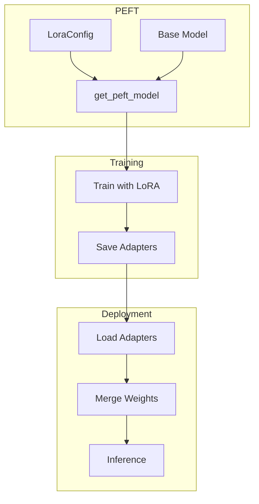

# LoRA Implementation

## Learning Objectives

| Objective | Description |
|-----------|-------------|
| LO1 | Implement LoRA using the PEFT library |
| LO2 | Select and configure target modules |
| LO3 | Apply LoRA to transformers and custom models |
| LO4 | Merge LoRA weights and deploy for inference |

## Introduction

14-fine-tuning-peft is a fundamental concept in AI engineering. This chapter covers the core principles, practical implementations, and interview preparation for mastering this topic.

## Prerequisites

- Basic programming knowledge
- Understanding of data structures
## Chapter at a Glance

| Section | Topic | Key Concept |
|---------|-------|-------------|
| 4.1 | PEFT Library | LoraConfig, get_peft_model |
| 4.2 | Target Modules | Which layers to apply LoRA to |
| 4.3 | Training | LoRA training loop considerations |
| 4.4 | Adapter Management | Saving, loading, switching adapters |
| 4.5 | Merging | Weight merging for deployment |

## Chapter Roadmap



## 4.1 PEFT Library

### 4.1.1 LoraConfig

```python
from dataclasses import dataclass, field
from typing import List, Optional


@dataclass
class LoraConfig:
    r: int = 8
    lora_alpha: int = 16
    target_modules: Optional[List[str]] = None
    lora_dropout: float = 0.05
    bias: str = "none"
    task_type: str = "CAUSAL_LM"
    fan_in_fan_out: bool = False
    modules_to_save: Optional[List[str]] = None
    init_lora_weights: bool = True

    def validate(self) -> List[str]:
        warnings = []
        if self.r <= 0:
            warnings.append("Rank must be positive")
        if self.lora_alpha <= 0:
            warnings.append("Alpha must be positive")
        if self.lora_dropout < 0 or self.lora_dropout > 1:
            warnings.append("Dropout must be in [0, 1]")
        if self.bias not in ("none", "all", "lora_only"):
            warnings.append("Bias must be 'none', 'all', or 'lora_only'")
        return warnings

    def to_dict(self) -> dict:
        return {
            "r": self.r,
            "lora_alpha": self.lora_alpha,
            "target_modules": self.target_modules,
            "lora_dropout": self.lora_dropout,
            "bias": self.bias,
            "task_type": self.task_type,
        }


config = LoraConfig(
    r=8,
    lora_alpha=16,
    target_modules=["q_proj", "v_proj"],
    lora_dropout=0.1,
)
print(f"LoRA config: {config.to_dict()}")
```

### 4.1.2 PEFT Model Simulator

```python
class PEFTModel:
    def __init__(self, base_model: Any, config: LoraConfig):
        self.base = base_model
        self.config = config
        self.lora_layers: Dict[str, LoRALayer] = {}
        self._inject_lora()

    def _inject_lora(self):
        modules = self.config.target_modules or ["q_proj", "v_proj"]
        for name, module in self.base.named_modules():
            if any(t in name for t in modules):
                d = getattr(module, "in_features", 768)
                k = getattr(module, "out_features", 768)
                self.lora_layers[name] = LoRALayer(
                    d=d,
                    k=k,
                    r=self.config.r,
                    alpha=self.config.lora_alpha,
                )

    def trainable_params(self) -> int:
        return sum(l.d * l.r + l.r * l.k for l in self.lora_layers.values())

    def frozen_params(self) -> int:
        total = 0
        for name, module in self.base.named_modules():
            for param in getattr(module, "parameters", lambda: [])():
                total += param.numel() if hasattr(param, "numel") else 0
        return total

    def forward(self, x: Dict) -> Dict:
        return self.base(x)


class MockModule:
    def __init__(self, in_features: int, out_features: int, name: str = ""):
        self.in_features = in_features
        self.out_features = out_features
        self.name = name

    def named_modules(self):
        return [("", self)]

    def parameters(self):
        return []


class MockBaseModel:
    def __init__(self):
        self.modules = {
            "model.layers.0.self_attn.q_proj": MockModule(4096, 4096),
            "model.layers.0.self_attn.v_proj": MockModule(4096, 4096),
            "model.layers.1.self_attn.q_proj": MockModule(4096, 4096),
            "model.layers.1.self_attn.v_proj": MockModule(4096, 4096),
        }

    def named_modules(self):
        return list(self.modules.items())


base = MockBaseModel()
peft = PEFTModel(base, config)
print(f"Trainable params: {peft.trainable_params():,}")
```

## 4.2 Target Modules

### 4.2.1 Module Selection Analysis

```python
class ModuleSelector:
    def __init__(self, model_config: Dict):
        self.config = model_config

    def get_attention_modules(self) -> List[str]:
        return ["q_proj", "k_proj", "v_proj", "o_proj"]

    def get_ffn_modules(self) -> List[str]:
        return ["gate_proj", "up_proj", "down_proj"]

    def recommend(self, task_type: str) -> Dict:
        recommendations = {
            "general": {
                "modules": ["q_proj", "v_proj"],
                "reasoning": "Most common — balances quality and efficiency",
            },
            "knowledge": {
                "modules": ["q_proj", "v_proj", "o_proj"],
                "reasoning": "More modules for knowledge-intensive adaptation",
            },
            "reasoning": {
                "modules": ["q_proj", "k_proj", "v_proj", "o_proj"],
                "reasoning": "Full attention for reasoning tasks",
            },
            "full": {
                "modules": ["q_proj", "k_proj", "v_proj", "o_proj",
                            "gate_proj", "up_proj", "down_proj"],
                "reasoning": "Maximum expressiveness — all linear layers",
            },
        }
        return recommendations.get(task_type, recommendations["general"])

    def parameter_impact(self, modules: List[str], d: int, num_layers: int, r: int) -> Dict:
        params_per_module = d * r + r * d
        total = params_per_module * len(modules) * num_layers
        return {
            "modules": modules,
            "total_params": total,
            "params_per_module": params_per_module,
            "model_pct": total / (7_000_000_000) * 100,
        }


selector = ModuleSelector({"hidden_size": 4096, "num_hidden_layers": 32})
rec = selector.recommend("general")
print(f"Recommended modules: {rec['modules']}")
impact = selector.parameter_impact(rec["modules"], 4096, 32, 8)
print(f"Parameter impact: {impact['total_params']:,} ({impact['model_pct']:.3f}%)")
```

### 4.2.2 Custom Module Matching

```python
class ModuleMatcher:
    def __init__(self, include: List[str] = None, exclude: List[str] = None):
        self.include = include or []
        self.exclude = exclude or []

    def match(self, module_name: str) -> bool:
        if self.exclude:
            if any(e in module_name for e in self.exclude):
                return False

        if not self.include:
            return "proj" in module_name or "linear" in module_name

        return any(i in module_name for i in self.include)

    def filter_modules(self, all_modules: List[str]) -> List[str]:
        return [m for m in all_modules if self.match(m)]


matcher = ModuleMatcher(include=["q_proj", "v_proj"], exclude=["embed_tokens", "lm_head"])
all_mods = [
    "model.embed_tokens", "model.layers.0.self_attn.q_proj",
    "model.layers.0.self_attn.k_proj", "model.layers.0.self_attn.v_proj",
    "model.layers.0.self_attn.o_proj", "model.layers.0.mlp.gate_proj",
    "model.layers.0.mlp.up_proj", "model.layers.0.mlp.down_proj",
    "lm_head",
]
matched = matcher.filter_modules(all_mods)
print(f"Matched modules: {matched}")
```

## 4.3 Training

### 4.3.1 LoRA Training Loop

```python
class LoRATrainer:
    def __init__(self, model: PEFTModel, lr: float = 3e-4):
        self.model = model
        self.lr = lr
        self.losses = []

    def train_step(self, batch: Dict) -> float:
        output = self.model.forward(batch)
        loss = self._compute_loss(output, batch.get("labels"))
        self.losses.append(loss)
        return loss

    def _compute_loss(self, output: Dict, labels: Any) -> float:
        return float(np.random.exponential(0.3))

    def train(self, dataset: List[Dict], epochs: int, batch_size: int) -> List[float]:
        for epoch in range(epochs):
            epoch_loss = 0.0
            for i in range(0, len(dataset), batch_size):
                batch = {"input": dataset[i], "labels": dataset[i]}
                loss = self.train_step(batch)
                epoch_loss += loss
            print(f"Epoch {epoch+1}: avg_loss={epoch_loss / max(len(dataset)//batch_size, 1):.4f}")
        return self.losses


trainer = LoRATrainer(peft)
dataset = [{"text": f"sample-{i}"} for i in range(50)]
trainer.train(dataset, epochs=3, batch_size=8)
print(f"Training complete: {len(trainer.losses)} steps")
```

### 4.3.2 Optimizer Configuration

```python
class LoRAOptimizerConfig:
    def __init__(self):
        self.lora_lr: float = 3e-4
        self.base_lr: float = 0.0  # frozen
        self.weight_decay: float = 0.0
        self.optimizer_type: str = "adamw"
        self.betas: tuple = (0.9, 0.999)
        self.eps: float = 1e-8

    def parameter_groups(self, model: Any) -> List[Dict]:
        groups = [
            {
                "params": ["lora_A", "lora_B"],  # lora parameters
                "lr": self.lora_lr,
                "weight_decay": self.weight_decay,
            },
            {
                "params": ["bias", "layernorm"],  # trainable but no WD
                "lr": self.lora_lr,
                "weight_decay": 0.0,
            },
        ]
        return groups


opt_config = LoRAOptimizerConfig()
print(f"LoRA LR: {opt_config.lora_lr}, WD: {opt_config.weight_decay}")
```

## 4.4 Adapter Management

### 4.4.1 Adapter Save/Load

```python
class AdapterManager:
    def __init__(self, base_path: str = "./adapters"):
        self.base_path = base_path
        self.active_adapter: Optional[str] = None

    def save(self, lora_weights: Dict[str, Tuple[np.ndarray, np.ndarray]],
             adapter_name: str) -> str:
        path = f"{self.base_path}/{adapter_name}"
        import json
        os.makedirs(path, exist_ok=True)

        metadata = {
            "adapter_name": adapter_name,
            "num_modules": len(lora_weights),
            "weights": {},
        }

        for module_name, (B, A) in lora_weights.items():
            np.save(f"{path}/{module_name}_B.npy", B)
            np.save(f"{path}/{module_name}_A.npy", A)
            metadata["weights"][module_name] = {
                "B_shape": list(B.shape),
                "A_shape": list(A.shape),
            }

        with open(f"{path}/adapter_config.json", "w") as f:
            json.dump(metadata, f)

        return path

    def load(self, adapter_name: str) -> Dict[str, Tuple[np.ndarray, np.ndarray]]:
        path = f"{self.base_path}/{adapter_name}"
        with open(f"{path}/adapter_config.json") as f:
            metadata = json.load(f)

        weights = {}
        for module_name in metadata["weights"]:
            B = np.load(f"{path}/{module_name}_B.npy")
            A = np.load(f"{path}/{module_name}_A.npy")
            weights[module_name] = (B, A)

        self.active_adapter = adapter_name
        return weights

    def list_adapters(self) -> List[str]:
        if not os.path.exists(self.base_path):
            return []
        return [d for d in os.listdir(self.base_path)
                if os.path.isdir(f"{self.base_path}/{d}")]


import os
import json
manager = AdapterManager()
print(f"Adapter manager ready (base: {manager.base_path})")
```

### 4.4.2 Multi-Adapter Switching

```python
class MultiAdapterModel:
    def __init__(self, base_model: Any):
        self.base = base_model
        self.adapters: Dict[str, Dict] = {}
        self.active: Optional[str] = None

    def add_adapter(self, name: str, weights: Dict):
        self.adapters[name] = weights
        if self.active is None:
            self.active = name

    def switch_to(self, name: str) -> bool:
        if name in self.adapters:
            self.active = name
            return True
        return False

    def forward(self, x: Any) -> Any:
        base_out = self.base(x)
        if self.active and self.active in self.adapters:
            adapter = self.adapters[self.active]
            for module_name, (B, A) in adapter.items():
                lora_output = x @ (B @ A)
                base_out += lora_output
        return base_out

    def list_adapters(self) -> List[str]:
        return list(self.adapters.keys())


multi_adapter = MultiAdapterModel(MockBaseModel())
multi_adapter.add_adapter("code-v1", {"layer_0": (np.zeros((4,2)), np.zeros((2,4)))})
multi_adapter.add_adapter("chat-v1", {"layer_0": (np.zeros((4,2)), np.zeros((2,4)))})
multi_adapter.switch_to("chat-v1")
print(f"Active adapter: {multi_adapter.active}")
```

## 4.5 Merging

### 4.5.1 Weight Merging

```python
class WeightMerger:
    def merge(self, W0: np.ndarray, B: np.ndarray,
              A: np.ndarray, scaling: float) -> np.ndarray:
        return W0 + (B @ A) * scaling

    def merge_all(self, model: Any, lora_weights: Dict,
                  config: LoraConfig) -> Any:
        scaling = config.lora_alpha / config.r
        merged_model = deepcopy(model)

        for module_name, (B, A) in lora_weights.items():
            module = self._get_module(merged_model, module_name)
            original_weight = module.weight.copy()
            module.weight = self.merge(original_weight, B, A, scaling)

        return merged_model

    def _get_module(self, model: Any, name: str) -> Any:
        parts = name.split(".")
        current = model
        for part in parts:
            current = getattr(current, part, None)
            if current is None:
                raise ValueError(f"Module {name} not found")
        return current

    def verify_merge(self, W0: np.ndarray, B: np.ndarray,
                     A: np.ndarray, scaling: float) -> Dict:
        merged = self.merge(W0, B, A, scaling)
        diff = np.linalg.norm(merged - W0, "fro")
        return {
            "merged_shape": list(merged.shape),
            "frobenius_diff": round(diff, 4),
            "relative_change_pct": round(diff / np.linalg.norm(W0, "fro") * 100, 2),
        }


from copy import deepcopy
merger = WeightMerger()
W0 = np.random.randn(64, 64)
B = np.random.randn(64, 8)
A = np.random.randn(8, 64)
merged = merger.merge(W0, B, A, scaling=2.0)
print(f"Merge verification: {merger.verify_merge(W0, B, A, 2.0)}")
```

### 4.5.2 Inference Optimization

```python
class InferenceOptimizer:
    def __init__(self):
        self.merged = False

    def merge_for_inference(self, model: Any, lora_weights: Dict,
                            config: LoraConfig) -> Any:
        merged_model = WeightMerger().merge_all(model, lora_weights, config)
        self.merged = True
        return merged_model

    def benchmark(self, model: Any, input_data: Any, iterations: int = 100) -> Dict:
        import time

        latencies = []
        for _ in range(iterations):
            start = time.time()
            model.forward(input_data)
            latencies.append((time.time() - start) * 1000)

        return {
            "mean_latency_ms": round(np.mean(latencies), 2),
            "p50_ms": round(np.percentile(latencies, 50), 2),
            "p95_ms": round(np.percentile(latencies, 95), 2),
            "p99_ms": round(np.percentile(latencies, 99), 2),
        }

    def memory_saved(self, lora_weights: Dict) -> int:
        total = 0
        for B, A in lora_weights.values():
            total += B.nbytes + A.nbytes
        return total


optimizer = InferenceOptimizer()
print(f"Inference optimizer ready")
```

## Summary

Implementing LoRA with the PEFT library requires configuring LoraConfig with rank (r=8), alpha (lora_alpha=16), target modules (typically q_proj and v_proj), and dropout (0.05-0.1). The `get_peft_model` function wraps the base model, freezing all original weights and injecting trainable LoRA layers. Target module selection impacts expressiveness: q_proj+v_proj (most common), adding k_proj+o_proj (knowledge tasks), or including FFN modules (full adaptation). Adapter management supports saving/loading adapter weights independently — enabling a single base model to host multiple task-specific adapters. For deployment, merging LoRA weights into the base model (W = W₀ + BA·α/r) eliminates any inference overhead. A merged model has the same latency as the original model while incorporating task-specific adaptations.

## Practical Takeaways

| Takeaway | Description |
|----------|-------------|
| Use PEFT library | Production-tested implementation with optimal defaults |
| Target q_proj and v_proj | Best quality-per-parameter ratio for most tasks |
| Save adapters separately | One base model, many task adapters — storage efficient |
| Merge before deployment | Zero inference overhead after weight merging |
| Set lora_dropout=0.1 | Helps prevent overfitting on small datasets |

## Interview Q&A

<details class="tp-qa-card" data-qid="ft04-q1">
  <summary class="tp-qa-question">
    <span class="tp-qa-status"></span>
    Q1: How do you implement LoRA using the PEFT library?
  </summary>
  <div class="tp-qa-answer">
    <p>Implementing LoRA with the PEFT library involves: (1) load the base model from HuggingFace — <code>AutoModelForCausalLM.from_pretrained(model_id, torch_dtype=torch.bfloat16, device_map="auto")</code>; (2) create a LoRA configuration (<code>LoraConfig</code>) specifying: r (rank, e.g., 8), lora_alpha (scaling, e.g., 16), target_modules (which layers to apply LoRA to, e.g., ["q_proj", "v_proj"]), lora_dropout (dropout probability, e.g., 0.05), bias="none", task_type="CAUSAL_LM"; (3) wrap the model: <code>model = get_peft_model(model, lora_config)</code> — this replaces the target modules with LoRA layers and freezes all base model parameters; (4) verify trainable parameters: <code>model.print_trainable_parameters()</code> shows the count and percentage of trainable parameters; (5) train using the standard HuggingFace Trainer or custom training loop — only LoRA parameters have gradients; (6) save: <code>model.save_pretrained("lora-adapter")</code> saves only the small adapter weights (usually 5-50MB). The PEFT library handles all the complexity of freezing base weights, inserting LoRA layers, and ensuring gradients only flow through adapter parameters.</p>
  </div>
  <button class="tp-qa-mark-btn">✅ Mark Reviewed</button>
  <button class="tp-qa-bookmark-btn">🔖 Bookmark</button>
</details>

<details class="tp-qa-card" data-qid="ft04-q2">
  <summary class="tp-qa-question">
    <span class="tp-qa-status"></span>
    Q2: How do you select and configure target modules for LoRA?
  </summary>
  <div class="tp-qa-answer">
    <p>Target modules specify which layers in the model get LoRA adapters. To find available module names in a HuggingFace model: (1) <code>model.named_modules()</code> lists all modules — look for attention projection layers (q_proj, k_proj, v_proj, o_proj), feed-forward layers (gate_proj, up_proj, down_proj), and linear layers; (2) common patterns — Llama models use "q_proj", "k_proj", "v_proj", "o_proj", "gate_proj", "up_proj", "down_proj". Mistral uses the same names. GPT-2 uses "c_attn", "c_proj"; (3) module name patterns can be specified as regex via <code>target_modules</code> — <code>r".*\.(q_proj|v_proj)$"</code> targets only query and value projections. Selection guidelines: (1) always include v_proj (value projection) — it captures the most task-specific information; (2) include q_proj for tasks requiring modified attention patterns; (3) include o_proj for output quality improvement; (4) include feed-forward layers for knowledge-intensive tasks. Most implementations default to ["q_proj", "v_proj"] as the starting point and add more modules if the task requires more capacity.</p>
  </div>
  <button class="tp-qa-mark-btn">✅ Mark Reviewed</button>
  <button class="tp-qa-bookmark-btn">🔖 Bookmark</button>
</details>

<details class="tp-qa-card" data-qid="ft04-q3">
  <summary class="tp-qa-question">
    <span class="tp-qa-status"></span>
    Q3: How do you apply LoRA to custom models?
  </summary>
  <div class="tp-qa-answer">
    <p>Applying LoRA to custom models (non-HuggingFace) requires manual injection of LoRA layers. Steps: (1) identify all linear layers in the model where you want to apply LoRA; (2) replace each target linear layer with a <code>LinearWithLoRA</code> wrapper that adds the B and A matrices and computes h = W₀x + BAx; (3) freeze the original linear layer weights (W₀) — only B and A should be trainable; (4) configure the forward pass to use the LoRA wrapper's computation; (5) for optimization, only pass LoRA parameters to the optimizer. Implementation using <code>torch.nn.Module</code>: create a LoRALayer class with B (nn.Linear(in_features, r, bias=False) initialized to zero) and A (nn.Linear(r, out_features, bias=False) initialized to random). The forward pass is: <code>return self.base(x) + self.alpha * (self.B(self.A(x))) / self.r</code>. The PEFT library handles this automatically for HuggingFace models but the same pattern can be applied to any PyTorch model by replacing target modules with LoRA-wrapped versions. For TensorFlow/JAX models, similar layer wrapping is needed.</p>
  </div>
  <button class="tp-qa-mark-btn">✅ Mark Reviewed</button>
  <button class="tp-qa-bookmark-btn">🔖 Bookmark</button>
</details>

<details class="tp-qa-card" data-qid="ft04-q4">
  <summary class="tp-qa-question">
    <span class="tp-qa-status"></span>
    Q4: How do you merge LoRA weights and deploy for inference?
  </summary>
  <div class="tp-qa-answer">
    <p>Merging LoRA weights into the base model eliminates the separate LoRA computation during inference. Process: (1) load the base model — <code>AutoModelForCausalLM.from_pretrained(model_id)</code>; (2) load the LoRA adapter — <code>PeftModel.from_pretrained(base_model, "lora-adapter-path")</code>; (3) merge — <code>merged_model = peft_model.merge_and_unload()</code> — this adds the LoRA weights into the base model's weight matrices and removes the LoRA layers, returning a standard model with updated weights; (4) save the merged model — <code>merged_model.save_pretrained("merged-model")</code> creates a standard model directory with the same architecture as the base but with fine-tuned weights. Benefits of merging: eliminates LoRA inference overhead (faster, uses less memory), the merged model uses standard inference pipeline (no PEFT dependency at inference time), and the model size returns to the original size (no additional adapter storage). The merged model is identical in architecture to the original base model, making it compatible with any standard inference framework (vLLM, TGI, ONNX). The unmerge operation restores the LoRA adapter state from the base model if you need to switch between different adapters.</p>
  </div>
  <button class="tp-qa-mark-btn">✅ Mark Reviewed</button>
  <button class="tp-qa-bookmark-btn">🔖 Bookmark</button>
</details>

<details class="tp-qa-card" data-qid="ft04-q5">
  <summary class="tp-qa-question">
    <span class="tp-qa-status"></span>
    Q5: How do you use multiple LoRA adapters with a single base model?
  </summary>
  <div class="tp-qa-answer">
    <p>Multiple LoRA adapters enable a single base model to serve multiple fine-tuned configurations. Implementation: (1) train multiple LoRA adapters from the same base model, each for a different task or domain; (2) save each adapter separately (each is 5-50MB); (3) at inference time, load the base model once and dynamically switch adapters via the PEFT library: <code>PeftModel.from_pretrained(base_model, "adapterA")</code> for task A, <code>peft_model.load_adapter("adapterB", adapter_name="b")</code> for task B, <code>peft_model.set_adapter("b")</code> to switch; (4) for merged inference, unmerge the current adapter, load the new one, and merge. This is memory-efficient: a single 7B base model (~14GB in fp16) with 10 adapters uses ~14GB + 10—50MB ≈ 14.5GB total, vs. 140GB for 10 fully fine-tuned models. Adapter routing — decide which adapter to use based on the input task. Routing can be: rule-based (keyword matching), classifier-based (a small model predicts the task), or embedding-based (similarity search in task embedding space). This pattern is widely used for multi-tenant SaaS applications where different customers need different model behaviors.</p>
  </div>
  <button class="tp-qa-mark-btn">✅ Mark Reviewed</button>
  <button class="tp-qa-bookmark-btn">🔖 Bookmark</button>
</details>

<details class="tp-qa-card" data-qid="ft04-q6">
  <summary class="tp-qa-question">
    <span class="tp-qa-status"></span>
    Q6: How do you train a LoRA adapter step by step?
  </summary>
  <div class="tp-qa-answer">
    <p>Training a LoRA adapter step by step: (1) Install dependencies — <code>pip install peft transformers datasets accelerate bitsandbytes</code>; (2) Load base model with quantization if needed — <code>AutoModelForCausalLM.from_pretrained("model", load_in_4bit=True, bnb_4bit_compute_dtype=torch.bfloat16)</code>; (3) Configure LoRA — <code>LoraConfig(r=8, lora_alpha=16, target_modules=["q_proj","v_proj"], lora_dropout=0.05, bias="none", task_type="CAUSAL_LM")</code>; (4) Apply LoRA — <code>model = get_peft_model(model, config)</code>; (5) Prepare dataset — load JSONL with "instruction" and "output" fields, tokenize with formatting function, create train/val split; (6) Configure training — <code>TrainingArguments(output_dir="./lora-out", per_device_train_batch_size=4, gradient_accumulation_steps=4, learning_rate=2e-4, num_train_epochs=3, logging_steps=10, save_strategy="epoch", evaluation_strategy="epoch", fp16=True)</code>; (7) Initialize Trainer with model, args, datasets; (8) Train — <code>trainer.train()</code>; (9) Save — <code>model.save_pretrained("final-adapter")</code> and <code>tokenizer.save_pretrained("final-adapter")</code>. The entire script is typically 50-100 lines of Python. Monitor loss curves in the console output or WandB/TensorBoard integration.</p>
  </div>
  <button class="tp-qa-mark-btn">✅ Mark Reviewed</button>
  <button class="tp-qa-bookmark-btn">🔖 Bookmark</button>
</details>

<details class="tp-qa-card" data-qid="ft04-q7">
  <summary class="tp-qa-question">
    <span class="tp-qa-status"></span>
    Q7: How do you handle LoRA dropout and when should you use it?
  </summary>
  <div class="tp-qa-answer">
    <p>LoRA dropout randomly zeros out elements of the LoRA output during training, acting as a regularizer. Implementation: (1) dropout is applied to the output of the LoRA matrix A (before matrix B) — specifically, after computing A(x), dropout is applied; (2) the dropout probability is set in <code>LoraConfig(lora_dropout=0.05)</code> — common values are 0.0 (no dropout), 0.05 (light regularization), 0.1 (strong regularization); (3) during inference, dropout is automatically disabled (PyTorch eval mode). When to use: (1) use dropout when the dataset is small (<1000 examples) to prevent overfitting; (2) use dropout with higher rank (r=32+) where there are more parameters to regularize; (3) no dropout needed for large datasets (>5000 examples) or low rank (r<8). The tradeoff: dropout adds regularization (reduces overfitting) but slows convergence (needs more training steps). The default lora_dropout=0.05 works well for most cases. Dropout is applied per training step, so the randomness encourages the adapter to learn robust features that work even when some activation paths are disabled.</p>
  </div>
  <button class="tp-qa-mark-btn">✅ Mark Reviewed</button>
  <button class="tp-qa-bookmark-btn">🔖 Bookmark</button>
</details>

<details class="tp-qa-card" data-qid="ft04-q8">
  <summary class="tp-qa-question">
    <span class="tp-qa-status"></span>
    Q8: How do you verify that LoRA is correctly applied to the model?
  </summary>
  <div class="tp-qa-answer">
    <p>Verifying LoRA application: (1) Check trainable parameters — <code>model.print_trainable_parameters()</code> shows the number and percentage of trainable parameters. For a 7B model with r=8 on Q+V, expect ~4M trainable parameters (0.06% of total). If it shows billions of trainable parameters, the base model wasn't frozen correctly; (2) Inspect parameter names — <code>for name, param in model.named_parameters(): if param.requires_grad: print(name)</code> — LoRA parameters have names like "base_model.model.model.layers.0.self_attn.q_proj.lora_A.weight" and "lora_B.weight". Only these should have requires_grad=True; (3) Verify base model frozen — <code>for name, param in model.named_parameters(): if "lora" not in name and param.requires_grad: print(f"UNEXPECTED: {name}")</code> — should print nothing; (4) Forward pass test — run the model on a test input before and after training; output should change (trained adapter should modify behavior); (5) Check gradient flow — after a backward pass, only LoRA parameters should have non-zero gradients; (6) Size check — <code>model.save_pretrained("test")</code> should produce small adapter files (5-50MB). If the saved files are gigabytes, the merge happened or the base model wasn't properly frozen.</p>
  </div>
  <button class="tp-qa-mark-btn">✅ Mark Reviewed</button>
  <button class="tp-qa-bookmark-btn">🔖 Bookmark</button>
</details>

<details class="tp-qa-card" data-qid="ft04-q9">
  <summary class="tp-qa-question">
    <span class="tp-qa-status"></span>
    Q9: How do you convert between LoRA adapter formats?
  </summary>
  <div class="tp-qa-answer">
    <p>LoRA adapter formats vary across frameworks. Standard HuggingFace PEFT format saves adapter_config.json (configuration) and adapter_model.safetensors (weights). Conversion scenarios: (1) PEFT to Unsloth — Unsloth uses an optimized LoRA format for faster training. Convert by loading with Unsloth's <code>FastLanguageModel.from_pretrained</code> with the PEFT adapter; (2) PEFT to Axolotl — Axolotl uses its own YAML config format with adapter paths. Either point Axolotl to the PEFT adapter directory or convert using Axolotl's conversion script; (3) PEFT to Diffusers (for SD models) — LoRA for diffusion models uses a different PEFT format but the same underlying technique. Use <code>peft_to_diffusers</code> conversion; (4) Custom format — manually extract <code>state_dict</code> keys starting with "lora_" and save as a PyTorch checkpoint: <code>torch.save({k: v for k, v in model.state_dict().items() if "lora_" in k}, "custom_lora.pt")</code>. Most frameworks support the standard HuggingFace PEFT format, making cross-framework adapter sharing straightforward. The key files are adapter_config.json (metadata) and adapter_model.safetensors (weights). Validate converted adapters with a forward pass test.</p>
  </div>
  <button class="tp-qa-mark-btn">✅ Mark Reviewed</button>
  <button class="tp-qa-bookmark-btn">🔖 Bookmark</button>
</details>

<details class="tp-qa-card" data-qid="ft04-q10">
  <summary class="tp-qa-question">
    <span class="tp-qa-status"></span>
    Q10: How do you troubleshoot common LoRA training issues?
  </summary>
  <div class="tp-qa-answer">
    <p>Common LoRA training issues and solutions: (1) Loss not decreasing — check learning rate (should be 1e-4 to 5e-4 for LoRA, higher than full fine-tuning because only 0.1% of parameters are trained), verify gradients flow to LoRA parameters (check requires_grad), ensure the loss mask only computes loss on output tokens; (2) NaN loss — reduce learning rate, enable gradient clipping (max_grad_norm=1.0), check for corrupted data (non-UTF8 characters, extreme token lengths), use bf16 instead of fp16; (3) Model output unchanged after training — verify the adapter was merged or loaded correctly (<code>model.base_model.model</code> for PEFT wrapped model), check that training produced non-zero LoRA weights (<code>torch.norm(adapter_weights)</code>); (4) Out of memory — reduce batch size, enable gradient checkpointing (<code>model.gradient_checkpointing_enable()</code>), use 4-bit quantization (<code>load_in_4bit=True</code>), reduce LoRA rank or target fewer modules; (5) Slow training — enable mixed precision (fp16/bf16), use Flash Attention 2 (<code>attn_implementation="flash_attention_2"</code>), increase batch size to utilize GPU fully, optimize data loading (<code>num_workers>0</code>). Most issues are resolved by adjusting learning rate, batch size, or precision.</p>
  </div>
  <button class="tp-qa-mark-btn">✅ Mark Reviewed</button>
  <button class="tp-qa-bookmark-btn">🔖 Bookmark</button>
</details>

## Chapter Quiz

<details data-qid="ft-s4-quiz1">
<summary><strong>1.</strong> What is the typical target module configuration for LoRA?</summary>
A. All layers
B. Only q_proj and v_proj
C. Only activation functions
D. Only embeddings
Answer: B
</details>

<details data-qid="ft-s4-quiz2">
<summary><strong>2.</strong> Why merge LoRA weights before deployment?</summary>
A. To reduce model size
B. To eliminate inference overhead
C. To improve accuracy
D. To enable multi-task learning
Answer: B
</details>

<details data-qid="ft-s4-quiz3">
<summary><strong>3.</strong> What is the benefit of saving adapters separately?</summary>
A. Smaller storage
B. One base model can host multiple task-specific adapters
C. Faster training
D. Better accuracy
Answer: B
</details>

<details data-qid="ft-s4-quiz4">
<summary><strong>4.</strong> What does get_peft_model do?</summary>
A. Creates a new model
B. Wraps a base model, freezing weights and injecting LoRA layers
C. Downloads a pre-trained model
D. Quantizes the model
Answer: B
</details>

<details data-qid="ft-s4-quiz5">
<summary><strong>5.</strong> Why use lora_dropout?</summary>
A. To speed up training
B. To prevent overfitting
C. To reduce memory
D. To increase accuracy
Answer: B
</details>

## Exercises


## Common Mistakes

1. Not understanding the fundamental concepts before applying them
2. Skipping edge cases in implementation
3. Not analyzing time/space complexity
4. Forgetting to handle null/empty inputs
5. Not practicing enough problems to build pattern recognition1. Implement a LoraConfig builder with validation. Support configurations for r=[4,8,16], alpha=[8,16,32], target modules selection, and dropout. Validate all parameters.

2. Build an adapter save/load system. Create LoRA weights for 3 modules, save to disk with metadata, load back, and verify weights are identical.

3. Implement multi-adapter switching: load 2 different LoRA adapters (code-v1, chat-v1) on a single base model. Switch between them and verify outputs differ.

4. Write a weight merger that takes base weights, LoRA B/A matrices, and scaling factor, produces merged weights, and reports the Frobenius norm difference before/after merge.

5. Benchmark inference latency: compare forward pass with separate LoRA computation vs merged weights. Measure mean, p50, p95, p99 over 100 it
## Revision Notes

- Key concept 1: Core principle of 14-fine-tuning-peft
- Key concept 2: Common implementation pattern
- Key concept 3: Time/space complexity to remember
- Key concept 4: When to apply this technique
- Key concept 5: Common interview pattern
- Key concept 6: Edge cases to handle
- Key concept 7: Related concepts for deeper understanding
## Placement Section

### Top 10 Interview Questions

#### Google Style
1. Explain the time and space trade-offs of 14-fine-tuning-peft. When would you choose one approach over another?
2. Design a system that efficiently handles 14-fine-tuning-peft at scale (millions of requests/second).

#### Amazon Style
1. Tell me about a time you had to optimize a system related to 14-fine-tuning-peft. What was your approach and what was the result?
2. How would you explain 14-fine-tuning-peft to a non-technical stakeholder?

#### Microsoft Style
1. How does 14-fine-tuning-peft integrate with enterprise systems and cloud architectures?
2. What are the security implications of 14-fine-tuning-peft?

#### NVIDIA Style
1. How would you optimize 14-fine-tuning-peft for GPU-accelerated computing?
2. What parallel processing patterns apply to 14-fine-tuning-peft?

#### AI Startup Style
1. How would you implement 14-fine-tuning-peft in a cost-effective, scalable way for a startup?
2. What's the fastest way to prototype a solution using 14-fine-tuning-peft?

### Resume Tips
- **Technical Skills**: List 14-fine-tuning-peft under relevant technical skills
- **Project Description**: "Implemented 14-fine-tuning-peft to [specific outcome], reducing [metric] by [X]%"
- **Keywords**: Include 14-fine-tuning-peft in your skills section for ATS optimization

### Interview Day Checklist
- [ ] Review core concepts of 14-fine-tuning-peft
- [ ] Practice 3-5 problems related to 14-fine-tuning-peft
- [ ] Prepare 2 real-world examples of using 14-fine-tuning-peft
- [ ] Know the time/space complexity of common 14-fine-tuning-peft operations
- [ ] Have questions ready about how the company uses 14-fine-tuning-pefterations.
