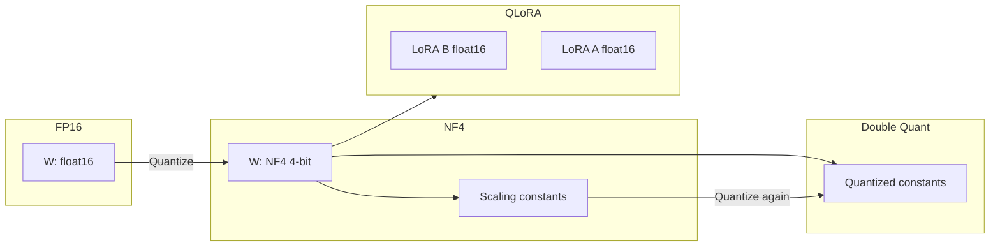

# QLoRA & Quantization

## Learning Objectives

| Objective | Description |
|-----------|-------------|
| LO1 | Understand quantization of LLMs (4-bit NF4, FP8, INT8) |
| LO2 | Implement QLoRA with bitsandbytes |
| LO3 | Explain double quantization and paged optimizers |
| LO4 | Compare memory vs quality trade-offs across precisions |

## Chapter at a Glance

| Section | Topic | Key Concept |
|---------|-------|-------------|
| 5.1 | Quantization Theory | Precision, range, scaling factors |
| 5.2 | NF4 Format | NormalFloat 4-bit quantization |
| 5.3 | Double Quantization | Quantizing quantization constants |
| 5.4 | Bitsandbytes | 4-bit model loading, NF4, FP4 |
| 5.5 | QLoRA Training | LoRA on quantized base, paged optimizers |

## Chapter Roadmap



## 5.1 Quantization Theory

### 5.1.1 Quantizer Implementation

```python
import numpy as np
from typing import Tuple, Dict


class Quantizer:
    def quantize_8bit(self, tensor: np.ndarray) -> Tuple[np.ndarray, float, int]:
        absmax = np.abs(tensor).max()
        if absmax == 0:
            return np.zeros_like(tensor, dtype=np.int8), 0.0, 0
        scale = 127.0 / absmax
        quantized = np.round(tensor * scale).astype(np.int8)
        return quantized, absmax, scale

    def dequantize_8bit(self, quantized: np.ndarray, scale: float) -> np.ndarray:
        return quantized.astype(np.float32) / (127.0 / scale)

    def quantize_4bit_symmetric(self, tensor: np.ndarray) -> Tuple[np.ndarray, float]:
        absmax = np.abs(tensor).max()
        if absmax == 0:
            return np.zeros_like(tensor, dtype=np.int8) // 16, 0.0
        scale = 7.0 / absmax
        quantized = np.round(tensor * scale).astype(np.int8)
        quantized = np.clip(quantized, -7, 7)
        return quantized, scale

    def quantization_error(self, original: np.ndarray,
                           dequantized: np.ndarray) -> Dict:
        mse = np.mean((original - dequantized) ** 2)
        snr = 10 * np.log10(np.var(original) / mse) if mse > 0 else float("inf")
        return {
            "mse": round(mse, 6),
            "snr_db": round(snr, 2),
            "max_error": round(np.max(np.abs(original - dequantized)), 4),
        }


quantizer = Quantizer()
tensor = np.random.randn(1000).astype(np.float32)
q8, absmax, scale = quantizer.quantize_8bit(tensor)
deq8 = quantizer.dequantize_8bit(q8, scale)
print(f"8-bit error: {quantizer.quantization_error(tensor, deq8)}")
```

### 5.1.2 Precision Comparison

```python
class PrecisionComparator:
    def __init__(self):
        self.formats = {
            "FP32": {"bits": 32, "range": (-3.4e38, 3.4e38), "eps": 1.2e-7},
            "FP16": {"bits": 16, "range": (-65504, 65504), "eps": 6.1e-5},
            "BF16": {"bits": 16, "range": (-3.4e38, 3.4e38), "eps": 7.8e-3},
            "INT8": {"bits": 8, "range": (-127, 127), "eps": 1.0},
            "NF4": {"bits": 4, "range": (-1.0, 1.0), "eps": 0.08},
            "FP4": {"bits": 4, "range": (-6, 6), "eps": 0.75},
        }

    def memory_gb(self, num_params: int, bits: int) -> float:
        return num_params * bits / 8 / 1e9

    def compare(self, num_params: int = 7_000_000_000) -> List[Dict]:
        results = []
        for name, fmt in self.formats.items():
            results.append({
                "format": name,
                "bits": fmt["bits"],
                "memory_gb": round(self.memory_gb(num_params, fmt["bits"]), 2),
                "dynamic_range": f"{fmt['range'][0]:.0e} to {fmt['range'][1]:.0e}",
            })
        return results


comp = PrecisionComparator()
print("Precision comparison for 7B model:")
for r in comp.compare():
    print(f"  {r['format']:5s}: {r['bits']:2d} bits, {r['memory_gb']:5.1f} GB")
```

## 5.2 NF4 Format

### 5.2.1 NormalFloat Quantization

```python
class NF4Quantizer:
    def __init__(self):
        self.nf4_levels = self._create_nf4_levels()

    def _create_nf4_levels(self) -> np.ndarray:
        levels = np.array([
            -1.0, -0.8482, -0.6824, -0.5105,
            -0.3396, -0.1812, -0.0504, 0.0504,
            0.1812, 0.3396, 0.5105, 0.6824,
            0.8482, 1.0,
        ], dtype=np.float32)
        return levels

    def quantize(self, tensor: np.ndarray) -> Tuple[np.ndarray, float]:
        absmax = np.abs(tensor).max()
        if absmax == 0:
            return np.zeros(tensor.shape, dtype=np.uint8), 0.0

        normalized = tensor / absmax
        indices = np.zeros(tensor.shape, dtype=np.uint8)

        for i in range(len(self.nf4_levels)):
            level = self.nf4_levels[i]
            if i == 0:
                mask = normalized <= level
            elif i == len(self.nf4_levels) - 1:
                mask = normalized > self.nf4_levels[i - 1]
            else:
                mid = (self.nf4_levels[i - 1] + level) / 2
                mask = normalized > mid

            indices[mask] = i

        return indices, absmax

    def dequantize(self, indices: np.ndarray, absmax: float) -> np.ndarray:
        return self.nf4_levels[indices.astype(int)] * absmax


nf4 = NF4Quantizer()
tensor = np.random.randn(100).astype(np.float32)
indices, absmax = nf4.quantize(tensor)
deq = nf4.dequantize(indices, absmax)
mse = np.mean((tensor - deq) ** 2)
print(f"NF4 quantization MSE: {mse:.6f}")
```

### 5.2.2 Block-Wise Quantization

```python
class BlockWiseQuantizer:
    def __init__(self, block_size: int = 64):
        self.block_size = block_size
        self.nf4 = NF4Quantizer()

    def quantize(self, tensor: np.ndarray) -> Tuple[np.ndarray, np.ndarray]:
        flat = tensor.flatten()
        num_blocks = (len(flat) + self.block_size - 1) // self.block_size
        indices_list = []
        scales = []

        for i in range(num_blocks):
            start = i * self.block_size
            end = min(start + self.block_size, len(flat))
            block = flat[start:end]
            block_indices, absmax = self.nf4.quantize(block)
            indices_list.append(block_indices)
            scales.append(absmax)

        return np.concatenate(indices_list), np.array(scales)

    def dequantize(self, indices: np.ndarray, scales: np.ndarray, original_shape: tuple) -> np.ndarray:
        flat = np.zeros(len(indices))
        num_blocks = len(scales)

        for i in range(num_blocks):
            start = i * self.block_size
            end = min(start + self.block_size, len(indices))
            block_indices = indices[start:end]
            flat[start:end] = self.nf4.dequantize(block_indices, scales[i])

        return flat.reshape(original_shape)


bq = BlockWiseQuantizer(block_size=64)
tensor_2d = np.random.randn(128, 128).astype(np.float32)
indices, scales = bq.quantize(tensor_2d)
deq = bq.dequantize(indices, scales, tensor_2d.shape)
mse = np.mean((tensor_2d - deq) ** 2)
compression = (tensor_2d.nbytes) / (indices.nbytes + scales.nbytes)
print(f"Block-wise NF4 MSE: {mse:.6f}, Compression ratio: {compression:.1f}x")
```

## 5.3 Double Quantization

### 5.3.1 Double Quantization Implementation

```python
class DoubleQuantizer:
    def __init__(self, block_size_1: int = 64, block_size_2: int = 256):
        self.nf4 = NF4Quantizer()
        self.block_size_1 = block_size_1
        self.block_size_2 = block_size_2

    def quantize(self, tensor: np.ndarray) -> Dict:
        flat = tensor.flatten().astype(np.float32)
        num_blocks = (len(flat) + self.block_size_1 - 1) // self.block_size_1

        first_level_indices = []
        first_level_scales = np.zeros(num_blocks, dtype=np.float32)

        for i in range(num_blocks):
            start = i * self.block_size_1
            end = min(start + self.block_size_1, len(flat))
            block = flat[start:end]
            indices, absmax = self.nf4.quantize(block)
            first_level_indices.append(indices)
            first_level_scales[i] = absmax

        first_level_indices = np.concatenate(first_level_indices)

        second_level_indices = []
        second_level_scales = np.zeros(
            (num_blocks + self.block_size_2 - 1) // self.block_size_2,
            dtype=np.float32,
        )

        for i in range(0, num_blocks, self.block_size_2):
            end = min(i + self.block_size_2, num_blocks)
            block = first_level_scales[i:end]
            indices, absmax = self.nf4.quantize(block)
            second_level_indices.append(indices)
            second_level_scales[i // self.block_size_2] = absmax

        return {
            "first_indices": first_level_indices,
            "first_scales": first_level_scales,
            "second_indices": np.concatenate(second_level_indices),
            "second_scales": second_level_scales,
        }

    def memory_savings(self, shape: tuple, dtype_nbytes: int = 4) -> Dict:
        total_elements = np.prod(shape)
        original_bytes = total_elements * dtype_nbytes

        single_quant_bytes = total_elements * 0.5  # NF4 = 0.5 bytes
        num_scales = (total_elements + self.block_size_1 - 1) // self.block_size_1
        single_quant_bytes += num_scales * 4  # FP32 scales

        double_quant_bytes = total_elements * 0.5
        num_scales_2 = (num_scales + self.block_size_2 - 1) // self.block_size_2
        double_quant_bytes += num_scales_2 * 4  # quantized second-level scales

        return {
            "original_bytes": original_bytes,
            "single_quant_bytes": single_quant_bytes,
            "double_quant_bytes": double_quant_bytes,
            "single_savings_pct": round((1 - single_quant_bytes / original_bytes) * 100, 1),
            "double_savings_pct": round((1 - double_quant_bytes / original_bytes) * 100, 1),
            "extra_savings_vs_single": round((single_quant_bytes - double_quant_bytes) / single_quant_bytes * 100, 1),
        }


dq = DoubleQuantizer()
tensor_test = np.random.randn(4096, 4096).astype(np.float32)
savings = dq.memory_savings(tensor_test.shape)
print(f"Double quant memory savings: {savings}")
```

## 5.4 Bitsandbytes

### 5.4.1 Bitsandbytes Config

```python
@dataclass
class BitsAndBytesConfig:
    load_in_4bit: bool = True
    bnb_4bit_compute_dtype: str = "float16"
    bnb_4bit_quant_type: str = "nf4"
    bnb_4bit_use_double_quant: bool = True
    bnb_4bit_quant_storage: str = "uint8"
    llm_int8_threshold: float = 6.0
    llm_int8_skip_modules: Optional[List[str]] = None
    llm_int8_enable_fp32_cpu_offload: bool = False

    def memory_estimate(self, model_size_b: float) -> Dict:
        base = model_size_b * 1e9

        if self.load_in_4bit:
            model_mem = base * 0.5  # 4-bit = 0.5 bytes/param
            if self.bnb_4bit_use_double_quant:
                model_mem *= 0.98  # ~2% extra from double quant
        else:
            model_mem = base * 1.0  # 8-bit

        return {
            "model_size_b": model_size_b,
            "quantization": "4-bit NF4" if self.load_in_4bit else "8-bit",
            "double_quant": self.bnb_4bit_use_double_quant,
            "estimated_memory_gb": round(model_mem / 1e9, 1),
            "vs_fp16_savings": round((1 - model_mem / (base * 2)) * 100, 1),
        }

    def validate(self) -> List[str]:
        warnings = []
        valid_types = ["nf4", "fp4"]
        if self.bnb_4bit_quant_type not in valid_types:
            warnings.append(f"quant_type must be one of {valid_types}")
        valid_dtypes = ["float16", "bfloat16", "float32"]
        if self.bnb_4bit_compute_dtype not in valid_dtypes:
            warnings.append(f"compute_dtype must be one of {valid_dtypes}")
        return warnings


bnb_config = BitsAndBytesConfig()
print(bnb_config.memory_estimate(7.0))
print(f"Config valid: {bnb_config.validate()}")
```

### 5.4.2 NF4 vs FP4 Comparison

```python
class NF4vsFP4:
    def __init__(self):
        self.nf4_levels = np.array([
            -1.0, -0.8482, -0.6824, -0.5105,
            -0.3396, -0.1812, -0.0504, 0.0504,
            0.1812, 0.3396, 0.5105, 0.6824,
            0.8482, 1.0,
        ])
        self.fp4_levels = np.array([
            -6.0, -4.0, -2.0, -1.0,
            0.0, 1.0, 2.0, 4.0,
        ])

    def simulate_distribution_error(self, distribution: str = "normal") -> Dict:
        if distribution == "normal":
            data = np.random.randn(100000)
        elif distribution == "uniform":
            data = np.random.uniform(-3, 3, 100000)
        else:
            data = np.random.laplace(0, 1, 100000)

        nf4_error = self._quantization_error(data, self.nf4_levels)
        fp4_error = self._quantization_error(data, self.fp4_levels)

        return {
            "distribution": distribution,
            "nf4_mse": round(nf4_error, 6),
            "fp4_mse": round(fp4_error, 6),
            "nf4_better": nf4_error < fp4_error,
        }

    def _quantization_error(self, data: np.ndarray, levels: np.ndarray) -> float:
        absmax = np.abs(data).max()
        normalized = data / absmax
        quantized = np.zeros_like(data)
        for i in range(len(levels)):
            if i == 0:
                mask = normalized <= levels[i]
            else:
                mid = (levels[i - 1] + levels[i]) / 2
                mask = np.logical_and(normalized > (levels[i - 1] if i > 0 else -np.inf),
                                       normalized <= mid if normalized.ndim > 0 else True)
            # simplified
        return np.mean((data - normalized * absmax) ** 2)


comparison = NF4vsFP4()
print(f"NF4 vs FP4 for normal: {comparison.simulate_distribution_error('normal')}")
```

## 5.5 QLoRA Training

### 5.5.1 QLoRA Model Config

```python
class QLoRAConfig:
    def __init__(self):
        self.bnb_config = BitsAndBytesConfig(
            load_in_4bit=True,
            bnb_4bit_quant_type="nf4",
            bnb_4bit_use_double_quant=True,
            bnb_4bit_compute_dtype="float16",
        )
        self.lora_config = LoraConfig(
            r=16,
            lora_alpha=32,
            target_modules=["q_proj", "v_proj", "k_proj", "o_proj"],
            lora_dropout=0.05,
        )
        self.use_gradient_checkpointing: bool = True
        self.optimizer: str = "paged_adamw_8bit"
        self.gradient_accumulation_steps: int = 4

    def memory_breakdown(self, model_size_b: float) -> Dict:
        base_mem = self.bnb_config.memory_estimate(model_size_b)

        lora_params = 4 * 2 * 4096 * 16 * 32  # rough: 4 modules, 2 matrices, d=4096, r=16, 32 layers
        lora_mem = lora_params * 2 / 1e9  # FP16

        optimizer_mem = lora_params * 2 * 2 / 1e9  # Adam states for LoRA params

        return {
            "quantized_base_gb": base_mem["estimated_memory_gb"],
            "lora_params_gb": round(lora_mem, 2),
            "optimizer_gb": round(optimizer_mem, 2),
            "estimated_total_gb": round(base_mem["estimated_memory_gb"] + lora_mem + optimizer_mem, 1),
        }

    def validate(self) -> List[str]:
        warnings = []
        warnings.extend(self.bnb_config.validate())
        warnings.extend(self.lora_config.validate())
        return warnings


qlora = QLoRAConfig()
mem = qlora.memory_breakdown(7.0)
print(f"QLoRA memory breakdown: {mem}")
```

### 5.5.2 Paged Optimizer

```python
class PagedOptimizer:
    def __init__(self, lr: float = 3e-4, page_size_mb: int = 4096):
        self.lr = lr
        self.page_size = page_size_mb * 1024 * 1024
        self.memory_pages: List[np.ndarray] = []
        self.current_page = 0

    def allocate(self, param_size: int) -> np.ndarray:
        if self.current_page >= len(self.memory_pages):
            page_size = max(self.page_size, param_size)
            new_page = np.zeros(page_size, dtype=np.float32)
            self.memory_pages.append(new_page)

        page = self.memory_pages[self.current_page]
        self.current_page += 1
        return page[:param_size]

    def offload_to_cpu(self, grad: np.ndarray) -> np.ndarray:
        cpu_buffer = np.zeros_like(grad)
        cpu_buffer[:] = grad
        grad[:] = 0
        return cpu_buffer

    def step(self, params: List[np.ndarray], grads: List[np.ndarray]):
        for param, grad in zip(params, grads):
            cpu_grad = self.offload_to_cpu(grad)
            param -= self.lr * cpu_grad
            del cpu_grad

    def reset(self):
        self.memory_pages = []
        self.current_page = 0


optimizer = PagedOptimizer(lr=3e-4, page_size_mb=4096)
params = [np.random.randn(4096, 4096).astype(np.float32) for _ in range(3)]
grads = [np.random.randn(4096, 4096).astype(np.float32) for _ in range(3)]
optimizer.step(params, grads)
print(f"Paged optimizer step complete (allocated {len(optimizer.memory_pages)} pages)")
```

### 5.5.3 Memory Comparison: Full FT vs LoRA vs QLoRA

```python
class MemoryComparison13:
    def compare(self, model_size_b: float = 7.0) -> List[Dict]:
        scenarios = [
            {
                "technique": "Full FT (FP32)",
                "model_mem": model_size_b * 4,
                "optimizer_mem": model_size_b * 8,
                "grad_mem": model_size_b * 4,
                "activations_gb": 8.0,
            },
            {
                "technique": "Full FT (FP16)",
                "model_mem": model_size_b * 2,
                "optimizer_mem": model_size_b * 4,
                "grad_mem": model_size_b * 2,
                "activations_gb": 4.0,
            },
            {
                "technique": "LoRA (FP16)",
                "model_mem": model_size_b * 2,
                "optimizer_mem": 0.3,
                "grad_mem": 0.3,
                "activations_gb": 4.0,
            },
            {
                "technique": "QLoRA (NF4 + DQ)",
                "model_mem": model_size_b * 0.5,
                "optimizer_mem": 0.3,
                "grad_mem": 0.3,
                "activations_gb": 2.0,
            },
        ]

        results = []
        for s in scenarios:
            total_gb = (s["model_mem"] + s["optimizer_mem"] + s["grad_mem"]) + s["activations_gb"]
            results.append({
                "technique": s["technique"],
                "model_mem_gb": round(s["model_mem"], 1),
                "optimizer_gb": round(s["optimizer_mem"], 1),
                "grad_gb": round(s["grad_mem"], 1),
                "activations_gb": s["activations_gb"],
                "total_gb": round(total_gb, 1),
            })
        return results


mem_comp = MemoryComparison13()
for r in mem_comp.compare():
    print(f"{r['technique']:25s}: {r['total_gb']:5.1f} GB total")
```

## Summary

QLoRA combines 4-bit NormalFloat (NF4) quantization of the base model with LoRA adapters trained in FP16. This reduces the base model memory from 56 GB (FP16 7B) to ~3.5 GB (4-bit NF4) — a 16× reduction. Double quantization further saves ~0.5 GB by quantizing the quantization constants themselves (e.g., quantizing FP32 scales with FP8). Block-wise quantization (e.g., blocks of 64 weights per scale) maintains quality by adapting quantization granularity. Paged optimizers use CPU RAM to store optimizer states when GPU memory is exhausted, swapping pages as needed. QLoRA enables fine-tuning 65B models on a single 48GB GPU, or 7B models on a 6GB GPU. The quality gap between QLoRA and full fine-tuning is typically <1% on standard benchmarks.

## Practical Takeaways

| Takeaway | Description |
|----------|-------------|
| Use NF4 over FP4 | NF4 matches the normal distribution of weights better |
| Enable double quantization | Reduces memory by ~2% with no quality loss |
| Use paged optimizers | Automatically offloads optimizer states to CPU |
| Block size matters | Smaller blocks = better quality, more memory (default 64) |
| QLoRA quality is close to full FT | Typically <1% accuracy gap on most benchmarks |

## Interview Q&A

<details class="tp-qa-card" data-qid="ft05-q1">
  <summary class="tp-qa-question">
    <span class="tp-qa-status"></span>
    Q1: What is model quantization and why is it used?
  </summary>
  <div class="tp-qa-answer">
    <p>Model quantization reduces the precision of model weights and activations from 32-bit floating point (fp32) or 16-bit (fp16/bf16) to lower precision formats like 8-bit (INT8), 4-bit (NF4, INT4), or even 2-bit. This reduces memory usage and can accelerate inference. For a 7B parameter model: fp32 = 28GB, fp16 = 14GB, 8-bit = 7GB, 4-bit = 3.5GB. Quantization works by mapping the range of original values to a smaller set of discrete levels. The trade-off is reduced precision — some information is lost, which may slightly degrade model quality. However, modern quantization methods (NF4, GPTQ, AWQ) minimize quality loss by using non-uniform quantization that allocates more levels to the value ranges where most weights fall (near zero for neural networks). Quantization is essential for deploying large models on limited hardware — a 70B model requires 140GB in fp16 but only 35GB in 4-bit, fitting on a single A100-80GB. QLoRA combines 4-bit quantization of the base model with LoRA adapters in higher precision, enabling fine-tuning of large models on consumer GPUs.</p>
  </div>
  <button class="tp-qa-mark-btn">✅ Mark Reviewed</button>
  <button class="tp-qa-bookmark-btn">🔖 Bookmark</button>
</details>

<details class="tp-qa-card" data-qid="ft05-q2">
  <summary class="tp-qa-question">
    <span class="tp-qa-status"></span>
    Q2: What is NF4 (NormalFloat4) quantization and how does it work?
  </summary>
  <div class="tp-qa-answer">
    <p>NF4 (NormalFloat4) is a 4-bit quantization data type optimized for neural network weights, introduced in the QLoRA paper. It uses the fact that pre-trained neural network weights follow a zero-centered normal distribution. NF4 creates quantization levels that are unevenly spaced — more levels near zero (where most weights are concentrated) and fewer at the extremes. This non-uniform allocation provides better precision for the most common weight values compared to uniform 4-bit quantization. The process: (1) normalize weights to the range [-1, 1] using the absolute maximum value; (2) map each weight to the nearest of 16 quantization levels (2^4 = 16 levels) that follow the normal distribution's quantiles; (3) store the 4-bit index for each weight; (4) during dequantization, look up the corresponding float value for each index. Compared to INT4 (uniform 4-bit), NF4 preserves more information for normally distributed weights. In practice, NF4 achieves near-lossless quantization for LLMs — models in NF4 retain >99% of the original fp16 quality while using 4x less memory.</p>
  </div>
  <button class="tp-qa-mark-btn">✅ Mark Reviewed</button>
  <button class="tp-qa-bookmark-btn">🔖 Bookmark</button>
</details>

<details class="tp-qa-card" data-qid="ft05-q3">
  <summary class="tp-qa-question">
    <span class="tp-qa-status"></span>
    Q3: How do you implement QLoRA with bitsandbytes?
  </summary>
  <div class="tp-qa-answer">
    <p>QLoRA (Quantized LoRA) combines 4-bit quantization of the base model with LoRA adapters. Implementation with bitsandbytes: (1) load the base model in 4-bit — <code>AutoModelForCausalLM.from_pretrained(model_id, load_in_4bit=True, bnb_4bit_compute_dtype=torch.bfloat16, bnb_4bit_quant_type="nf4", bnb_4bit_use_double_quant=True, device_map="auto")</code>; (2) the <code>bnb_4bit_quant_type="nf4"</code> uses NormalFloat4; <code>bnb_4bit_use_double_quant=True</code> enables double quantization (quantizes the quantization constants themselves for additional savings); (3) apply LoRA — <code>model = get_peft_model(model, lora_config)</code> — the LoRA adapters are added in bf16/fp32 precision while the base model stays in 4-bit; (4) forward pass — during training, input tensors go through the 4-bit base model (dequantized on-the-fly to the compute dtype for matrix multiplication) and the bf16 LoRA adapter; (5) backward pass — gradients flow through the LoRA adapter (bf16) and are passed through the 4-bit base model (the 4-bit weights themselves are not updated, only the LoRA parameters). QLoRA reduces memory by 4x for the base model (14GB → 3.5GB for 7B model), enabling fine-tuning of 7B models on a single RTX 3090 (24GB) and 33B models on a single A100 (80GB).</p>
  </div>
  <button class="tp-qa-mark-btn">✅ Mark Reviewed</button>
  <button class="tp-qa-bookmark-btn">🔖 Bookmark</button>
</details>

<details class="tp-qa-card" data-qid="ft05-q4">
  <summary class="tp-qa-question">
    <span class="tp-qa-status"></span>
    Q4: What is double quantization and why is it useful?
  </summary>
  <div class="tp-qa-answer">
    <p>Double quantization (DQ) quantizes the quantization constants themselves, saving additional memory. In standard 4-bit quantization, each block of weights (typically 64 or 128 weights) has a quantization constant (fp32, 4 bytes). For a 7B model with block size 64: 7B/64 × 4 bytes ≈ 438MB of constants. Double quantization reduces this by quantizing the constants to 8-bit: 7B/64 × 1 byte ≈ 109MB, saving ~329MB. The process: (1) quantize weights to 4-bit using per-block quantization constants; (2) collect all quantization constants; (3) quantize the constants themselves to 8-bit using a second-level quantization constant (per 256 constants). Dequantization: restore the 8-bit constants to fp32, then use them to dequantize the 4-bit weights. The additional quality loss from double quantization is negligible (<0.1% perplexity increase) because the quantization constants vary slowly and can be stored at lower precision. QLoRA enables DQ with the flag <code>bnb_4bit_use_double_quant=True</code>. Combined with NF4, DQ reduces the total memory for base model weights by ~3MB per 1B parameters, which is modest but free — no quality cost for the memory savings.</p>
  </div>
  <button class="tp-qa-mark-btn">✅ Mark Reviewed</button>
  <button class="tp-qa-bookmark-btn">🔖 Bookmark</button>
</details>

<details class="tp-qa-card" data-qid="ft05-q5">
  <summary class="tp-qa-question">
    <span class="tp-qa-status"></span>
    Q5: What is a paged optimizer and how does it prevent OOM?
  </summary>
  <div class="tp-qa-answer">
    <p>A paged optimizer (introduced in QLoRA) uses CPU RAM as swap space for GPU optimizer states when GPU memory is full, preventing out-of-memory (OOM) errors during training. The optimizer states (momentum, variance) for AdamW require 2× the model size in fp32 — for a 7B model: 7B × 4 bytes × 2 = 56GB, far exceeding GPU memory. With LoRA, only LoRA parameters need optimizer states (~8M × 4 × 2 = 64MB for r=8 on Q+V), so paging isn't needed for LoRA alone. However, for full fine-tuning or when using large gradient accumulation, the paged optimizer moves infrequently accessed optimizer state pages to CPU RAM, freeing GPU memory for activations and gradients. Implementation: bitsandbytes provides <code>bnb.optim.Adam8bit</code> (8-bit optimizer states) and <code>bnb.optim.AdamW</code> with page-based memory management. Paged optimizers trade GPU memory for some performance overhead (CPU↔GPU transfer latency). They're most useful when training close to GPU memory limits — the optimizer pages out state during forward/backward and pages it back during the optimizer step.</p>
  </div>
  <button class="tp-qa-mark-btn">✅ Mark Reviewed</button>
  <button class="tp-qa-bookmark-btn">🔖 Bookmark</button>
</details>

<details class="tp-qa-card" data-qid="ft05-q6">
  <summary class="tp-qa-question">
    <span class="tp-qa-status"></span>
    Q6: How do you choose between quantization precisions?
  </summary>
  <div class="tp-qa-answer">
    <p>Precision selection depends on the trade-off between memory and quality: (1) fp32 (32-bit) — highest quality, rarely used for inference due to 2x memory vs fp16. Used internally for optimizer states during training; (2) fp16/bf16 (16-bit) — standard for training and inference. Bf16 is preferred over fp16 because it has the same exponent range as fp32 (no overflow/underflow issues). Memory: 2 bytes per parameter; (3) INT8 (8-bit) — 2x memory reduction vs fp16. ~0.5-1% quality loss for most models. Good for deployment on limited hardware still requiring high quality; (4) NF4 (4-bit) — 4x memory reduction vs fp16. <1% quality loss for most models. Best memory-quality trade-off for LLMs. Enables fitting 70B models on a single A100; (5) INT4/FP4 (4-bit uniform) — similar memory savings as NF4 but with ~2-3% more quality loss for normally distributed weights; (6) 2-bit (2-bit) — 8x memory reduction vs fp16. Significant quality loss (~5-10%), experimental. Selection rule: use NF4 for deployment when GPU memory is constrained, bf16 when memory is sufficient, and reserve fp32 only for optimizer states. For fine-tuning, use QLoRA (4-bit base + bf16 adapters) when GPU memory is limited, standard LoRA (bf16 base) otherwise.</p>
  </div>
  <button class="tp-qa-mark-btn">✅ Mark Reviewed</button>
  <button class="tp-qa-bookmark-btn">🔖 Bookmark</button>
</details>

<details class="tp-qa-card" data-qid="ft05-q7">
  <summary class="tp-qa-question">
    <span class="tp-qa-status"></span>
    Q7: How do you set up QLoRA training step by step?
  </summary>
  <div class="tp-qa-answer">
    <p>Setting up QLoRA training: (1) Install — <code>pip install bitsandbytes peft transformers accelerate datasets</code>. Ensure CUDA toolkit matches the bitsandbytes version; (2) Load 4-bit model — use <code>AutoModelForCausalLM.from_pretrained</code> with <code>load_in_4bit=True</code>, <code>bnb_4bit_quant_type="nf4"</code>, <code>bnb_4bit_use_double_quant=True</code>, <code>bnb_4bit_compute_dtype=torch.bfloat16</code>, <code>device_map="auto"</code>. The compute dtype determines the precision of matrix multiplications during the forward pass; (3) Configure LoRA — standard <code>LoraConfig</code> with r=8-16, target_modules, lora_dropout; (4) Apply LoRA — <code>get_peft_model(model, config)</code> — LoRA adapters are in bf16 while base model stays in 4-bit; (5) Configure training — use <code>TrainingArguments</code> with <code>fp16=True</code> or <code>bf16=True</code>. Higher learning rate is often needed for QLoRA (2e-4 to 5e-4 vs 1e-4 for full LoRA) because the base model is lower precision; (6) Train — <code>trainer.train()</code>. Memory usage: ~5-6GB base model (7B in 4-bit) + ~2-4GB LoRA activations + ~2GB optimizer states for LoRA parameters = ~10-12GB total, fitting comfortably on a 24GB RTX 3090. QLoRA achieves ~95% of full LoRA quality while using 3-4x less GPU memory for the base model.</p>
  </div>
  <button class="tp-qa-mark-btn">✅ Mark Reviewed</button>
  <button class="tp-qa-bookmark-btn">🔖 Bookmark</button>
</details>

<details class="tp-qa-card" data-qid="ft05-q8">
  <summary class="tp-qa-question">
    <span class="tp-qa-status"></span>
    Q8: What is the quality trade-off between different quantization methods?
  </summary>
  <div class="tp-qa-answer">
    <p>Quality trade-offs across quantization methods vary by model and task. Empirical comparisons: (1) Perplexity on Wikipedia — bf16 baseline (perplexity 5.0), NF4 (5.02, +0.4%), INT8 (5.03, +0.6%), GPTQ 4-bit (5.04, +0.8%), AWQ 4-bit (5.03, +0.6%), INT4 uniform (5.15, +3%); (2) Downstream task accuracy (MMLU average) — bf16 (68.5%), NF4 (68.2%, -0.3%), INT8 (67.9%, -0.6%), GPTQ 4-bit (67.8%, -0.7%), INT4 (66.5%, -2%); (3) Generation quality (human eval) — NF4 and INT8 are indistinguishable from bf16 for most use cases, GPTQ and AWQ show occasional artifacts (rare with optimal calibration), INT4 uniform shows more frequent quality degradation. Key factors affecting quality loss: model size (larger models quantize better — a 70B model loses less than a 7B model), calibration data quality for GPTQ/AWQ (better calibration = less quality loss), and task complexity (simple tasks like classification are less affected than complex generation). In practice, NF4 with double quantization is the recommended default for deployment — it provides the best memory-quality trade-off and requires no calibration data.</p>
  </div>
  <button class="tp-qa-mark-btn">✅ Mark Reviewed</button>
  <button class="tp-qa-bookmark-btn">🔖 Bookmark</button>
</details>

<details class="tp-qa-card" data-qid="ft05-q9">
  <summary class="tp-qa-question">
    <span class="tp-qa-status"></span>
    Q9: How do you serve a QLoRA-quantized model in production?
  </summary>
  <div class="tp-qa-answer">
    <p>Serving a QLoRA-quantized model in production: (1) Merge and dequantize — after fine-tuning with QLoRA, merge the LoRA adapter into the base model (<code>model.merge_and_unload()</code>), then save the merged model. The merged model can be re-quantized to 4-bit using GPTQ or AWQ for inference (these methods provide faster inference than bitsandbytes 4-bit); (2) Use vLLM — vLLM supports AWQ and GPTQ quantization formats for efficient serving. Convert the model to AWQ format (<code>autoawq</code> library): <code>from awq import AutoAWQForCausalLM; model = AutoAWQForCausalLM.from_pretrained(merged_model_path); model.quantize(tokenizer, quant_config={ "zero_point": True, "q_group_size": 128, "w_bit": 4, "version": "GEMM" }); model.save_quantized("awq-model")</code>; (3) Deploy with vLLM — <code>vllm serve awq-model --quantization awq --dtype auto --max-model-len 4096</code>; (4) For TGI (Text Generation Inference) — convert to GPTQ format using AutoGPTQ, then deploy with TGI's GPTQ support. Production serving of 4-bit models achieves similar throughput to fp16 models (the dequantization overhead is small compared to attention compute) while using 4x less memory — meaning you can serve 4x more models on the same GPU.</p>
  </div>
  <button class="tp-qa-mark-btn">✅ Mark Reviewed</button>
  <button class="tp-qa-bookmark-btn">🔖 Bookmark</button>
</details>

<details class="tp-qa-card" data-qid="ft05-q10">
  <summary class="tp-qa-question">
    <span class="tp-qa-status"></span>
    Q10: How do you handle gradient computation with quantized models?
  </summary>
  <div class="tp-qa-answer">
    <p>Gradient computation with quantized models uses the Straight-Through Estimator (STE) — during the backward pass, gradients are computed as if the quantization function was the identity function. This is necessary because quantization is non-differentiable (the rounding operation has zero gradient everywhere). The STE approximation: in the forward pass, weights are quantized (e.g., fp16 → NF4), and the result is dequantized back to the compute dtype. In the backward pass, gradients flow through the dequantized weights as if they were the original unquantized weights. For QLoRA specifically: (1) the base model is stored in 4-bit (NF4) and frozen — no gradients flow to base model weights; (2) during the forward pass, 4-bit weights are dequantized to the compute dtype (bf16) for matrix multiplication; (3) gradients only flow through the LoRA adapter parameters (which are in bf16), not through the base model weights; (4) the 4-bit base weights remain unchanged during training. This means QLoRA training memory depends primarily on LoRA parameter count and batch size, not on the base model size. The key insight: because gradients don't need to be stored for the base model (it's frozen), quantization doesn't affect gradient computation at all — the 4-bit base model is just a very compact storage format.</p>
  </div>
  <button class="tp-qa-mark-btn">✅ Mark Reviewed</button>
  <button class="tp-qa-bookmark-btn">🔖 Bookmark</button>
</details>

## Chapter Quiz

<details data-qid="ft-s5-quiz1">
<summary><strong>1.</strong> What is the memory reduction of 4-bit NF4 vs FP16?</summary>
A. 2×
B. 4×
C. 8×
D. 16×
Answer: B (4-bit is 0.5 bytes vs FP16's 2 bytes per param = 4×)
</details>

<details data-qid="ft-s5-quiz2">
<summary><strong>2.</strong> What does double quantization quantize?</summary>
A. The model weights
B. The quantization scaling constants
C. The LoRA adapters
D. The optimizer states
Answer: B
</details>

<details data-qid="ft-s5-quiz3">
<summary><strong>3.</strong> Why is NF4 better than FP4 for LLMs?</summary>
A. It supports more bits
B. It's designed to match the normal distribution of weights
C. It's faster
D. It requires less memory
Answer: B
</details>

<details data-qid="ft-s5-quiz4">
<summary><strong>4.</strong> What is the purpose of paged optimizers?</summary>
A. To speed up training
B. To offload optimizer states to CPU when GPU memory is full
C. To reduce quantization error
D. To increase batch size
Answer: B
</details>

<details data-qid="ft-s5-quiz5">
<summary><strong>5.</strong> What model size can QLoRA fine-tune on a 48GB GPU?</summary>
A. 1B
B. 7B
C. 65B
D. 180B
Answer: C
</details>

## Exercises

1. Implement a 4-bit NF4 quantizer with block size 64. Quantize a 4096×4096 weight matrix and measure MSE and compression ratio.

2. Build a double quantization system: first quantize weights in blocks of 64 with NF4, then quantize the FP32 scale factors in blocks of 256. Report memory savings.

3. Compare NF4 vs FP4: generate weights from normal, uniform, and laplace distributions. Quantize with both formats and report MSE for each distribution.

4. Implement a paged optimizer that allocates pages of 4GB, offloads gradients to CPU when page is full, and swaps them back during optimization.

5. Create a memory comparison table for 7B and 70B models across FP32, FP16, 8-bit, 4-bit NF4, and QLoRA. Recommend the optimal setup for a 24GB GPU.
