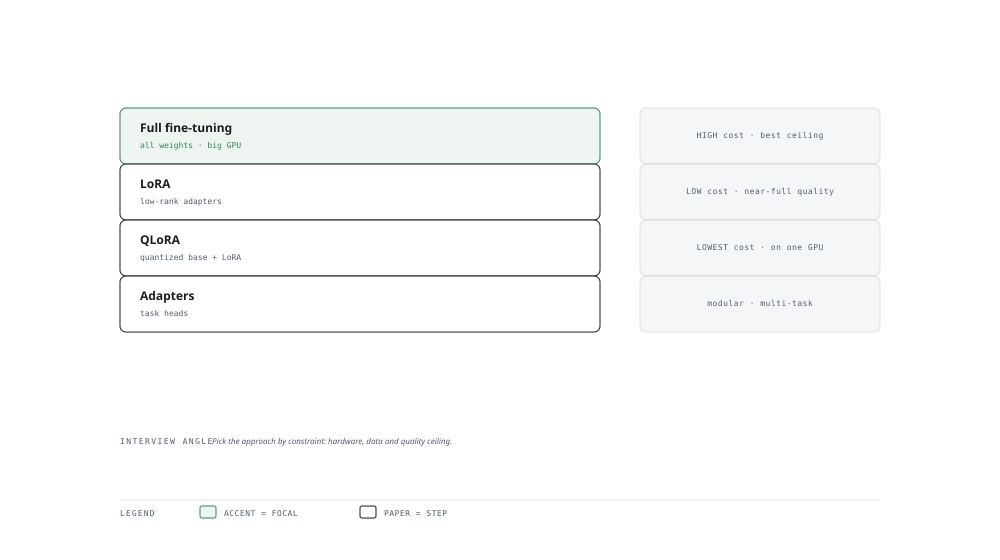

# Visual Notes — Choosing How to Adapt a Model

> One diagram, the full picture. This page is meant to be glanced at before reading the chapters, and again before interviews.

# What the diagram shows

1. **Full fine-tuning** — All weights update. Maximum quality, expensive, needs the most data and GPU memory.
1. **LoRA** — Low-rank adapters freeze the base and train a small delta — cheap, modular, ~full-fine-tune quality.
1. **QLoRA** — Quantises the base weights so you can fine-tune huge models on one GPU; adapters still train in precision.

# Why this matters for placement

- The "when to fine-tune vs prompt vs RAG" decision is a flagship LLM engineering question.
- Quoting parameter counts (LoRA ~0.1–1% of base) and VRAM wins you instant credit.

# Quick revision

- Fine-tune only when behaviour must change; RAG/prompt for facts and recent info.
- Full FT = all weights; LoRA = low-rank ∆; QLoRA = quantised base + LoRA.
- Instruction tuning teaches task following; DPO tunes preference without a reward model.
- Data quality beats data quantity; dedupe and de-contaminate eval sets.
- Always hold out a test set the base model must not memorise.

# Related chapters

- [When to fine-tune](01-when-to-fine-tune.md)
- [LoRA theory](03-lora-theory.md)
- [QLoRA and quantization](05-qlora-and-quantization.md)
- [DPO and preference tuning](07-dpo-and-preference-tuning.md)

---

**One-line answer for interviews:** *"Full fine-tuning changes every weight; LoRA/QLoRA nudges low-rank adapters — pick by data, cost and quality needs."*
