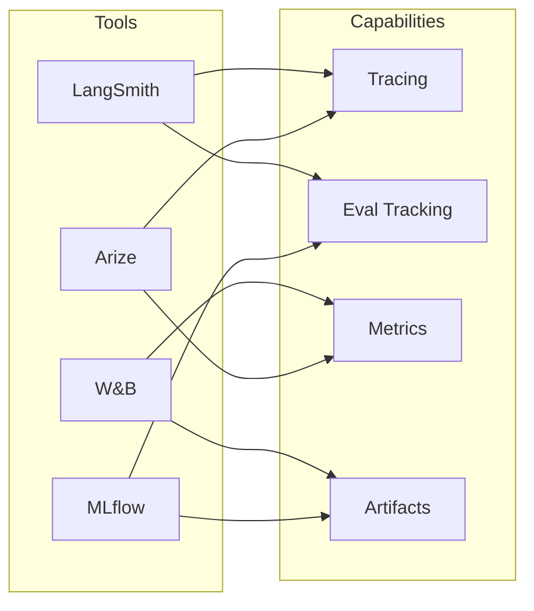

<!-- Clear Language: Keep sentences under 50 words -->
# Observability Tools

## Learning Objectives

| Objective | Description |
|-----------|-------------|
| LO1 | Understand observability tools for LLM applications |
| LO2 | Integrate with LangSmith, W&B, MLflow |
| LO3 | Implement tracing, logging, and monitoring |
| LO4 | Compare tool capabilities and select appropriate stack |

## Introduction

You cannot improve what you cannot measure. Evaluation metrics, LLM-as-judge, and observability tools help you monitor and improve AI systems in production. This module covers the full evaluation stack.

## Prerequisites

- Basic programming knowledge
- Understanding of data structures

## Key Terminology

**Key Terms**: Core vocabulary and concepts for this topic.

**Definition**: Essential terms you must know for interviews and production work.

## Theory

Understanding observability tools is fundamental for AI engineers. This section covers the core concepts, underlying principles, and theoretical framework that govern how observability tools works in practice.

## Chapter at a Glance

| Section | Topic | Key Concept |
|---------|-------|-------------|
| 4.1 | Observability Overview | Logs, metrics, traces, alerts |
| 4.2 | LangSmith | Tracing, evaluation, datasets |
| 4.3 | W&B (Weights & Biases) | Experiment tracking, artifacts |
| 4.4 | MLflow | Model registry, deployment tracking |
| 4.5 | Other Tools | Arize, whyLabs, Datadog |
| 4.6 | Tool Comparison | Feature matrix, cost, integration |

## Chapter Roadmap



## 4.1 Observability Overview

### 4.1.1 Observability Requirements

```python
from dataclasses import dataclass
from typing import List, Dict, Optional
import json
import time
import uuid

@dataclass
class ObservabilityConfig:
    trace_enabled: bool = True
    log_level: str = "INFO"
    metrics_interval_seconds: int = 60
    alert_channels: List[str] = None

class ObservabilityClient:
    def __init__(self, config: ObservabilityConfig = None):
        self.config = config or ObservabilityConfig()
        self.traces: List[Dict] = []
        self.metrics: Dict[str, List[float]] = {}
        self.logs: List[Dict] = []

    def log(self, level: str, message: str, metadata: Dict = None):
        entry = {
            "timestamp": time.time(),
            "level": level,
            "message": message,
            "metadata": metadata or {},
        }
        self.logs.append(entry)
        if level in ("ERROR", "CRITICAL"):
            self._alert(entry)

    def record_metric(self, name: str, value: float, tags: Dict = None):
        if name not in self.metrics:
            self.metrics[name] = []
        self.metrics[name].append(value)

    def start_trace(self, name: str) -> str:
        trace_id = str(uuid.uuid4())[:8]
        self.traces.append({
            "id": trace_id,
            "name": name,
            "start_time": time.time(),
            "spans": [],
        })
        return trace_id

    def end_trace(self, trace_id: str, status: str = "ok"):
        for t in self.traces:
            if t["id"] == trace_id:
                t["end_time"] = time.time()
                t["duration_ms"] = round((t["end_time"] - t["start_time"]) * 1000, 2)
                t["status"] = status

    def _alert(self, entry: Dict):
        alert_msg = f"[{entry['level']}] {entry['message']}"
        for channel in self.config.alert_channels or []:
            print(f"Alerting {channel}: {alert_msg}")

    def get_stats(self) -> Dict:
        return {
            "total_traces": len(self.traces),
            "total_logs": len(self.logs),
            "total_metrics": len(self.metrics),
            "error_count": sum(1 for l in self.logs if l["level"] == "ERROR"),
        }

obs = ObservabilityClient()
obs.log("INFO", "System started")
obs.record_metric("latency_ms", 250)
trace_id = obs.start_trace("llm_call")
time.sleep(0.01)
obs.end_trace(trace_id)
print(f"Stats: {obs.get_stats()}")
```

### 4.1.2 Telemetry Pipeline

```python
class TelemetryPipeline:
    def __init__(self):
        self.processors = []

    def add_processor(self, name: str, processor_fn: Callable):
        self.processors.append({"name": name, "fn": processor_fn})

    def process(self, event: Dict) -> Dict:
        for processor in self.processors:
            try:
                event = processor["fn"](event)
            except Exception as e:
                print(f"Processor {processor['name']} failed: {e}")
        return event

    def batch_process(self, events: List[Dict]) -> List[Dict]:
        return [self.process(e) for e in events]

pipeline = TelemetryPipeline()
pipeline.add_processor("add_timestamp", lambda e: {**e, "processed_at": time.time()})
pipeline.add_processor("sanitize", lambda e: {k: v for k, v in e.items() if "secret" not in k})
event = pipeline.process({"name": "llm_call", "latency": 150})
print(f"Processed: {event}")
```

## 4.2 LangSmith

### 4.2.1 LangSmith Client Simulator

```python
class LangSmithClient:
    def __init__(self, api_key: str = "", project: str = "default"):
        self.api_key = api_key
        self.project = project
        self.runs: List[Dict] = []
        self.datasets: Dict[str, List[Dict]] = {}

    def create_run(self, name: str, run_type: str = "llm",
                   inputs: Dict = None, outputs: Dict = None):
        run = {
            "id": str(uuid.uuid4()),
            "name": name,
            "run_type": run_type,
            "inputs": inputs or {},
            "outputs": outputs or {},
            "start_time": time.time(),
            "project": self.project,
            "tags": [],
        }
        self.runs.append(run)
        return run["id"]

    def add_feedback(self, run_id: str, score: float, comment: str = ""):
        for run in self.runs:
            if run["id"] == run_id:
                run["feedback"] = {"score": score, "comment": comment}
                break

    def create_dataset(self, name: str, examples: List[Dict]):
        self.datasets[name] = examples

    def evaluate(self, dataset_name: str, model_fn: Callable) -> List[Dict]:
        examples = self.datasets.get(dataset_name, [])
        results = []

        for ex in examples:
            input_data = ex.get("input", "")
            expected = ex.get("expected", "")

            run_id = self.create_run("evaluation", "chain", {"input": input_data})
            output = model_fn(input_data)
            run = next(r for r in self.runs if r["id"] == run_id)
            run["outputs"] = {"output": output}

            correct = output == expected
            self.add_feedback(run_id, 1.0 if correct else 0.0)
            results.append({"input": input_data, "expected": expected, "output": output, "correct": correct})

        return results

    def get_project_summary(self) -> Dict:
        total = len(self.runs)
        with_feedback = sum(1 for r in self.runs if "feedback" in r)
        avg_score = np.mean([r["feedback"]["score"] for r in self.runs if "feedback" in r]) if with_feedback > 0 else 0

        return {
            "project": self.project,
            "total_runs": total,
            "with_feedback": with_feedback,
            "avg_score": round(avg_score, 3),
        }

ls_client = LangSmithClient(project="ai-course")
run_id = ls_client.create_run("test-run", "llm", {"prompt": "Hello"})
ls_client.add_feedback(run_id, 0.95)
print(f"LangSmith summary: {ls_client.get_project_summary()}")
```

### 4.2.2 LangSmith Tracing

```python
class LangSmithTracer:
    def __init__(self):
        self.spans: List[Dict] = []
        self.current_trace: Optional[Dict] = None

    def start_trace(self, name: str, metadata: Dict = None):
        self.current_trace = {
            "name": name,
            "start_time": time.time(),
            "metadata": metadata or {},
            "spans": [],
        }

    def start_span(self, name: str, span_type: str = "tool"):
        span = {
            "name": name,
            "span_type": span_type,
            "start_time": time.time(),
            "events": [],
        }
        if self.current_trace:
            self.current_trace["spans"].append(span)
        return span

    def end_span(self, span: Dict, output: Any = None):
        span["end_time"] = time.time()
        span["duration_ms"] = round((span["end_time"] - span["start_time"]) * 1000, 2)
        if output is not None:
            span["output"] = output

    def end_trace(self, output: Any = None):
        if self.current_trace:
            self.current_trace["end_time"] = time.time()
            self.current_trace["duration_ms"] = round(
                (self.current_trace["end_time"] - self.current_trace["start_time"]) * 1000, 2
            )
            if output is not None:
                self.current_trace["output"] = output
            self.spans.append(self.current_trace)
            self.current_trace = None

tracer = LangSmithTracer()
tracer.start_trace("agent_execution")
span = tracer.start_span("llm_call")
time.sleep(0.01)
tracer.end_span(span, {"tokens": 50})
tracer.end_trace("completed")
print(f"Traced {len(tracer.spans)} runs")
```

## 4.3 W&B (Weights & Biases)

### 4.3.1 W&B Simulator

```python
class WandBClient:
    def __init__(self, project: str = "default"):
        self.project = project
        self.runs: Dict[str, Dict] = {}
        self.current_run: Optional[str] = None

    def init_run(self, name: str, config: Dict = None):
        run_id = str(uuid.uuid4())[:8]
        self.runs[run_id] = {
            "id": run_id,
            "name": name,
            "config": config or {},
            "metrics": {},
            "artifacts": [],
        }
        self.current_run = run_id
        return run_id

    def log_metric(self, key: str, value: float, step: int = None):
        if self.current_run and self.current_run in self.runs:
            if key not in self.runs[self.current_run]["metrics"]:
                self.runs[self.current_run]["metrics"][key] = []
            self.runs[self.current_run]["metrics"][key].append({
                "value": value,
                "step": step or len(self.runs[self.current_run]["metrics"][key]),
            })

    def log_metrics(self, metrics: Dict, step: int = None):
        for key, value in metrics.items():
            self.log_metric(key, value, step)

    def log_artifact(self, name: str, artifact_type: str, data: Any):
        if self.current_run:
            self.runs[self.current_run]["artifacts"].append({
                "name": name,
                "type": artifact_type,
                "data": data,
            })

    def finish_run(self):
        self.current_run = None

    def get_summary(self, run_id: str = None) -> Dict:
        run = self.runs.get(run_id or self.current_run)
        if not run:
            return {}

        return {
            "name": run["name"],
            "metrics_summary": {
                k: {
                    "min": min(v["value"] for v in vals),
                    "max": max(v["value"] for v in vals),
                    "last": vals[-1]["value"] if vals else None,
                }
                for k, vals in run["metrics"].items()
            },
            "num_artifacts": len(run["artifacts"]),
        }

wandb = WandBClient(project="ft-experiments")
run_id = wandb.init_run("lora-ft-1", {"lr": 3e-4, "r": 8})
wandb.log_metrics({"loss": 2.5, "val_loss": 2.7}, step=0)
wandb.log_metrics({"loss": 1.8, "val_loss": 2.0}, step=100)
print(f"W&B summary: {wandb.get_summary(run_id)}")
```

### 4.3.2 Experiment Comparison

```python
class ExperimentComparator:
    def __init__(self):
        self.experiments: List[Dict] = []

    def add_experiment(self, name: str, metrics: Dict, config: Dict = None):
        self.experiments.append({"name": name, "metrics": metrics, "config": config or {}})

    def compare(self, metric: str) -> List[Dict]:
        return sorted(
            [e for e in self.experiments if metric in e["metrics"]],
            key=lambda x: x["metrics"].get(metric, 0),
            reverse=True,
        )

    def best_config(self, metric: str, higher_is_better: bool = True) -> Dict:
        sorted_exps = self.compare(metric)
        if not sorted_exps:
            return {}
        best = sorted_exps[-1 if not higher_is_better else 0]
        return {"experiment": best["name"], "config": best["config"], f"best_{metric}": best["metrics"].get(metric)}

ec = ExperimentComparator()
ec.add_experiment("lora-r8", {"val_loss": 1.5, "accuracy": 0.85}, {"r": 8})
ec.add_experiment("lora-r16", {"val_loss": 1.4, "accuracy": 0.87}, {"r": 16})
ec.add_experiment("lora-r32", {"val_loss": 1.45, "accuracy": 0.86}, {"r": 32})
print(f"Best config: {ec.best_config('accuracy')}")
```

## 4.4 MLflow

### 4.4.1 MLflow Simulator

```python
class MLflowClient:
    def __init__(self, tracking_uri: str = "./mlruns"):
        self.uri = tracking_uri
        self.experiments: Dict[str, List] = {"default": []}

    def create_experiment(self, name: str) -> str:
        self.experiments[name] = []
        return name

    def log_run(self, experiment_name: str, run_name: str,
                 params: Dict = None, metrics: Dict = None,
                 tags: Dict = None):
        run = {
            "run_id": str(uuid.uuid4()),
            "run_name": run_name,
            "params": params or {},
            "metrics": metrics or {},
            "tags": tags or {},
            "status": "FINISHED",
        }
        if experiment_name in self.experiments:
            self.experiments[experiment_name].append(run)
        return run["run_id"]

    def register_model(self, run_id: str, model_name: str,
                        model_uri: str, version: str = "1"):
        return {
            "model_name": model_name,
            "version": version,
            "run_id": run_id,
            "stage": "None",
        }

    def transition_stage(self, model_name: str, version: str,
                          stage: str):
        return {"model_name": model_name, "version": version, "stage": stage}

    def search_runs(self, experiment_name: str,
                     metric_filter: str = None) -> List[Dict]:
        runs = self.experiments.get(experiment_name, [])
        if metric_filter:
            runs = [r for r in runs if any(metric_filter in k for k in r["metrics"])]
        return runs

mlflow = MLflowClient()
mlflow.create_experiment("lora-experiments")
rid = mlflow.log_run("lora-experiments", "lora-r8", {"r": 8, "lr": 3e-4}, {"val_loss": 1.5})
mlflow.register_model(rid, "lora-model", "runs:/lora-r8/model")
print(f"MLflow runs: {len(mlflow.search_runs('lora-experiments'))}")
```

## 4.5 Other Tools

### 4.5.1 Tool Adapter

```python
class ObservabilityToolAdapter:
    def __init__(self, primary_tool: str = "langsmith"):
        self.primary = primary_tool
        self.tools = {}

    def register_tool(self, name: str, client: Any):
        self.tools[name] = client

    def log(self, event: Dict):
        for name, client in self.tools.items():
            try:
                if hasattr(client, "log"):
                    client.log(event)
            except Exception:
                pass

    def get_metrics(self, tool: str = None) -> Dict:
        target = self.tools.get(tool or self.primary, {})
        if hasattr(target, "get_project_summary"):
            return target.get_project_summary()
        return {}

adapter = ObservabilityToolAdapter("langsmith")
adapter.register_tool("langsmith", ls_client)
adapter.register_tool("wandb", wandb)
print(f"Metrics: {adapter.get_metrics('langsmith')}")
```

## 4.6 Tool Comparison

### 4.6.1 Feature Matrix

```python
class ToolComparison:
    def __init__(self):
        self.tools = {
            "LangSmith": {
                "tracing": True,
                "eval_datasets": True,
                "feedback": True,
                "cost_tracking": True,
                "open_source": False,
                "pricing": "usage-based",
                "llm_specific": True,
            },
            "W&B": {
                "tracing": False,
                "eval_datasets": True,
                "feedback": False,
                "cost_tracking": False,
                "open_source": True,
                "pricing": "free tier + team",
                "llm_specific": False,
            },
            "MLflow": {
                "tracing": False,
                "eval_datasets": False,
                "feedback": False,
                "cost_tracking": False,
                "open_source": True,
                "pricing": "free",
                "llm_specific": False,
            },
            "Arize": {
                "tracing": True,
                "eval_datasets": True,
                "feedback": True,
                "cost_tracking": True,
                "open_source": False,
                "pricing": "usage-based",
                "llm_specific": True,
            },
        }

    def compare(self) -> Dict:
        return self.tools

    def recommend(self, needs: List[str]) -> List[str]:
        scores = {}
        for tool, features in self.tools.items():
            scores[tool] = sum(1 for n in needs if features.get(n, False))

        max_score = max(scores.values()) if scores else 0
        return [t for t, s in scores.items() if s == max_score]

comparison = ToolComparison()
print(f"Recommended for tracing+eval: {comparison.recommend(['tracing', 'eval_datasets'])}")
```

## Summary

Observability tools for LLM applications span tracing (LangSmith, Arize), experiment tracking (W&B, MLflow), and monitoring. LangSmith provides LLM-specific tracing with run tracking,.
feedback collection, and evaluation datasets. W&B excels at experiment tracking with metric logging, artifact management, and run comparison. MLflow offers model registry and.
deployment management. Key capabilities include: tracing individual LLM calls with spans and timing, logging metrics (latency, token usage, costs), collecting human feedback scores,.
and managing evaluation datasets. The choice depends on primary needs: LangSmith/Arize for LLM-native tracing and evaluation, W&B for experiment tracking and.
collaboration, MLflow for model registry and MLOps.

## Practical Takeaways

| Takeaway | Description |
|----------|-------------|
| Start with LangSmith for LLMs | Most LLM-native tracing and evaluation features |
| Use W&B for experiments | Best for comparing fine-tuning runs |
| Use MLflow for model registry | Track model versions and deployment stages |
| Log everything | Traces, metrics, feedback — more data is better for debugging |
| Choose one primary tool | Avoid splitting observability across too many platforms |
| Track costs per request | Essential for production budget management |

## Interview Q&A

<details class="tp-qa-card" data-qid="ev04-q1">
  <summary class="tp-qa-question">
    <span class="tp-qa-status"></span>
    Q1: How do LangSmith and Arize differ in their approach to LLM observability?
  </summary>
  <div class="tp-qa-answer">
<p>LangSmith focuses on LLM development workflow — it provides tracing, run management, evaluation datasets, and a playground for testing prompts. It is deeply integrated with LangChain but.
works with any LLM framework. Arize focuses on production monitoring with ML-specific capabilities like drift detection, performance monitoring, and embedding visualization. LangSmith is better suited for.
the development and testing phase, while Arize excels at ongoing production monitoring. In practice, many teams use both: LangSmith during development and.
staging, and Arize (or a similar platform) for production observability with alerting and root cause analysis.</p>
  </div>
  <button class="tp-qa-mark-btn">✅ Mark Reviewed</button>
  <button class="tp-qa-bookmark-btn">🔖 Bookmark</button>
</details>

<details class="tp-qa-card" data-qid="ev04-q2">
  <summary class="tp-qa-question">
    <span class="tp-qa-status"></span>
    Q2: What metrics should you track for every LLM API call in production?
  </summary>
  <div class="tp-qa-answer">
<p>Essential metrics per LLM call: (1) Latency — total response time broken down by component (model inference, network, post-processing). (2) Token usage — prompt tokens,.
completion tokens, and total, used for cost tracking. (3) Cost — calculated from token counts and pricing per model. (4) Model name and.
version — which model served the request. (5) Status code — success, error type, retry count. (6) Input/output length — character and.
token counts. (7) Trace ID — for correlating with upstream and downstream calls. All metrics should be tagged with environment, tenant,.
and application identifiers for filtering and aggregation.</p>
  </div>
  <button class="tp-qa-mark-btn">✅ Mark Reviewed</button>
  <button class="tp-qa-bookmark-btn">🔖 Bookmark</button>
</details>

<details class="tp-qa-card" data-qid="ev04-q3">
  <summary class="tp-qa-question">
    <span class="tp-qa-status"></span>
    Q3: What is the difference between logging, tracing, and monitoring in AI systems?
  </summary>
  <div class="tp-qa-answer">
<p>Logging records discrete events (e.g., "LLM call started", "error occurred") with timestamps and metadata. Tracing captures the end-to-end execution path of a single request across multiple components — showing which services were called,.
in what order, and how long each took. Monitoring aggregates metrics over time (latency percentiles, error rates, throughput) on dashboards with alerting. Logging answers "what happened?",.
tracing answers "why did it happen?", and monitoring answers "is the system healthy?" All three are complementary: use logging for debugging,.
tracing for performance analysis, and monitoring for operational awareness.</p>
  </div>
  <button class="tp-qa-mark-btn">✅ Mark Reviewed</button>
  <button class="tp-qa-bookmark-btn">🔖 Bookmark</button>
</details>

<details class="tp-qa-card" data-qid="ev04-q4">
  <summary class="tp-qa-question">
    <span class="tp-qa-status"></span>
    Q4: How does W&B (Weights & Biases) support LLM experiment tracking?
  </summary>
  <div class="tp-qa-answer">
<p>W&B provides experiment tracking for LLM fine-tuning and prompt engineering. Key features: (1) Run tracking — log hyperparameters (learning rate, batch size),.
metrics (loss, accuracy), and outputs (generated text) for each experiment. (2) Dataset versioning — track which dataset version was used for.
training or evaluation. (3) Model comparison — compare runs side-by-side with interactive visualizations of metrics over training steps. (4) Artifact management — store model weights,.
tokenizers, and evaluation results as versioned artifacts. (5) Reports — create shareable reports with embedded charts and commentary. For LLM work,.
teams use W&B to track prompt variants, fine-tuning runs, and evaluation results across model versions.</p>
  </div>
  <button class="tp-qa-mark-btn">✅ Mark Reviewed</button>
  <button class="tp-qa-bookmark-btn">🔖 Bookmark</button>
</details>

<details class="tp-qa-card" data-qid="ev04-q5">
  <summary class="tp-qa-question">
    <span class="tp-qa-status"></span>
    Q5: How do you implement custom telemetry for an LLM application?
  </summary>
  <div class="tp-qa-answer">
    <pre><code>class LLMTracer {
  private traces: Map&lt;string, Trace&gt; = new Map();
  startTrace(id: string, metadata: any) {
    this.traces.set(id, { startTime: Date.now(), spans: [], metadata });
  }
  addSpan(traceId: string, name: string, duration: number, tokens?: number) {
    const trace = this.traces.get(traceId);
    if (trace) trace.spans.push({ name, duration, tokens, timestamp: Date.now() });
  }
  endTrace(traceId: string) {
    const trace = this.traces.get(traceId);
    if (trace) {
      trace.totalDuration = Date.now() - trace.startTime;
      trace.totalTokens = trace.spans.reduce((s, sp) =&gt; s + (sp.tokens || 0), 0);
      // Export trace to monitoring system
    }
  }
}</code></pre>
<p>Custom telemetry implements the OpenTelemetry standard with traces, spans, and metrics. Each request gets a trace ID that propagates through all components (API gateway,.
LLM call, vector search, post-processing). Spans capture individual operations with timing, token counts, and status. Metrics are aggregated (counters for request count,.
histograms for latency) and exported to Prometheus or Datadog. The key is to make telemetry part of the application framework so it's automatically captured for.
every request without manual instrumentation.</p>
  </div>
  <button class="tp-qa-mark-btn">✅ Mark Reviewed</button>
  <button class="tp-qa-bookmark-btn">🔖 Bookmark</button>
</details>

<details class="tp-qa-card" data-qid="ev04-q6">
  <summary class="tp-qa-question">
    <span class="tp-qa-status"></span>
    Q6: How do you choose an observability platform for an LLM-powered product?
  </summary>
  <div class="tp-qa-answer">
<p>Selection criteria: (1) LLM-specific features — does it support prompt logging, token tracking, cost attribution, and evaluation datasets? LangSmith and Arize lead here. (2) Integration depth — does it work with your stack (LangChain,.
custom framework)? (3) Deployment model — SaaS vs. self-hosted for data privacy concerns. (4) Pricing — per-event vs. per-seat vs. flat fee;.
evaluate against expected traffic. (5) Alerting and dashboard capabilities — can your SRE team use it? (6) Data retention — how long are traces and.
logs kept? For early-stage teams, start with LangSmith's free tier and migrate to a comprehensive solution like Datadog or Grafana when production volume grows.</p>
  </div>
  <button class="tp-qa-mark-btn">✅ Mark Reviewed</button>
  <button class="tp-qa-bookmark-btn">🔖 Bookmark</button>
</details>

<details class="tp-qa-card" data-qid="ev04-q7">
  <summary class="tp-qa-question">
    <span class="tp-qa-status"></span>
    Q7: How do you collect and manage human feedback in an LLM observability system?
  </summary>
  <div class="tp-qa-answer">
<p>Human feedback collection: (1) Explicit feedback — thumbs up/down or star ratings on each response, stored alongside the trace. (2) Implicit feedback — user behavior.
signals (regeneration rate, copy-to-clipboard, follow-up question patterns). (3) Annotation tools — dedicated interfaces where evaluators score responses on multiple dimensions (accuracy,.
helpfulness, safety). The feedback is linked to the trace ID so you can replay the exact request context during analysis. LangSmith's feedback API allows attaching arbitrary scores (0-1) or.
categorical ratings to runs. Aggregate feedback scores over time to detect degradation trends and use them as training data for reward models.</p>
  </div>
  <button class="tp-qa-mark-btn">✅ Mark Reviewed</button>
  <button class="tp-qa-bookmark-btn">🔖 Bookmark</button>
</details>

<details class="tp-qa-card" data-qid="ev04-q8">
  <summary class="tp-qa-question">
    <span class="tp-qa-status"></span>
    Q8: What are the key considerations for observability data privacy in enterprise AI?
  </summary>
  <div class="tp-qa-answer">
<p>Enterprise observability must handle sensitive data carefully: (1) PII redaction — automatically detect and mask personal information (emails, SSNs, API keys) in logged prompts and.
responses. (2) Data residency — ensure observability data stays in required geographic regions (EU for GDPR). (3) Retention policies — auto-delete traces older than policy limits (e.g.,.
90 days). (4) Access control — restrict observability data access based on team roles. (5) Self-hosting — for maximum control, deploy LangSmith,.
MLflow, or SigNoz on-premises. (6) Audit trails — log who accessed what telemetry data and when. Many enterprises use a tiered approach: full tracing in dev/staging,.
aggregated metrics only in production.</p>
  </div>
  <button class="tp-qa-mark-btn">✅ Mark Reviewed</button>
  <button class="tp-qa-bookmark-btn">🔖 Bookmark</button>
</details>

<details class="tp-qa-card" data-qid="ev04-q9">
  <summary class="tp-qa-question">
    <span class="tp-qa-status"></span>
    Q9: How do you correlate LLM response quality with observability metrics?
  </summary>
  <div class="tp-qa-answer">
<p>Correlation analysis links quality to operational metrics: (1) For each trace, attach quality scores from automated evaluation (LLM-as-Judge) or human feedback. (2) Create dashboards that overlay quality scores with latency,.
token count, and cost. (3) Analyze correlations — e.g., "responses with >500 tokens have 20% lower quality scores" or "the GPT-4 mini model achieves 95% of GPT-4 quality at 40% of the cost." (4) Set up quality-latency SLAs — "P95.
latency under 2s with quality score above 4.0." (5) Use these insights to make optimization decisions — choose cheaper models for.
simple queries, route complex queries to stronger models, or adjust system prompts to reduce verbosity.</p>
  </div>
  <button class="tp-qa-mark-btn">✅ Mark Reviewed</button>
  <button class="tp-qa-bookmark-btn">🔖 Bookmark</button>
</details>

<details class="tp-qa-card" data-qid="ev04-q10">
  <summary class="tp-qa-question">
    <span class="tp-qa-status"></span>
    Q10: How do you implement a unified observability adapter for multiple monitoring tools?
  </summary>
  <div class="tp-qa-answer">
    <pre><code>interface ObservabilityProvider {
  logTrace(trace: Trace): Promise&lt;void&gt;;
  logMetric(name: string, value: number, tags: Record&lt;string, string&gt;): void;
  logFeedback(traceId: string, score: number, metadata?: any): Promise&lt;void&gt;;
}
class LangSmithProvider implements ObservabilityProvider { /* ... */ }
class MLflowProvider implements ObservabilityProvider { /* ... */ }
class CompositeProvider {
  constructor(private providers: ObservabilityProvider[]) {}
  async logTrace(trace: Trace) {
    await Promise.all(this.providers.map(p =&gt; p.logTrace(trace)));
  }
}</code></pre>
<p>A unified observability adapter wraps multiple providers behind a common interface. The application code only depends on the interface, and the adapter forwards telemetry to all configured backends (LangSmith for.
LLM tracing, W&B for experiment tracking, Prometheus for metrics). This decouples the application from specific vendors and enables easy migration. The CompositeProvider pattern allows sending to multiple destinations simultaneously,.
useful when transitioning between platforms. Each provider implementation handles the specific API format and authentication for its target platform.</p>
  </div>
  <button class="tp-qa-mark-btn">✅ Mark Reviewed</button>
  <button class="tp-qa-bookmark-btn">🔖 Bookmark</button>
</details>

## Chapter Quiz

<details data-qid="eval-s4-quiz1">
<summary><strong>1.</strong> Which tool provides LLM-specific tracing?</summary>
A. MLflow
B. LangSmith
C. W&B
D. Excel
Answer: B
</details>

<details data-qid="eval-s4-quiz2">
<summary><strong>2.</strong> What is W&B primarily used for?</summary>
A. Model deployment
B. Experiment tracking and comparison
C. Alerting
D. Data labeling
Answer: B
</details>

<details data-qid="eval-s4-quiz3">
<summary><strong>3.</strong> Which tool is open-source?</summary>
A. LangSmith
B. MLflow
C. Arize
D. Datadog
Answer: B
</details>

<details data-qid="eval-s4-quiz4">
<summary><strong>4.</strong> What does a trace in LangSmith capture?</summary>
A. Only the final output
B. The full execution path including LLM calls and tools
C. Training loss
D. Dataset version
Answer: B
</details>

<details data-qid="eval-s4-quiz5">
<summary><strong>5.</strong> Why track LLM call latency?</summary>
A. To reduce costs
B. To monitor performance and detect degradation
C. To improve accuracy
D. To increase token usage
Answer: B
</details>

## Exercises

## Common Mistakes

1. Not understanding the fundamental concepts before applying them
2. Skipping edge cases in implementation
3. Not analyzing time/space complexity
4. Forgetting to handle null/empty inputs
5. Not practicing enough problems to build pattern recognition1. Build a telemetry pipeline that records LLM call traces (start_time, end_time, tokens, cost) and logs errors. Test with 10 simulated calls.

2. Implement a LangSmith-style client with run creation, feedback scoring, and evaluation dataset management. Run a mock evaluation.

3. Create an experiment tracker (W&B-style) that logs metrics, compares runs, and identifies the best configuration for a given metric.

4. Build an observability tool adapter that unifies logging from LangSmith, W&B, and MLflow into a single interface.

5. Compare 4 observability tools (LangSmith, W&B, MLflow, Arize) on features, pricing, and LLM-specific capabilities. Recommend a stack for a t

## Revision Notes

- - Core principle: Understand the fundamental concepts thoroughly
- - Implementation pattern: Practice with real code examples
- - Complexity: Know the time and space complexity
- - Application: Know when to use this in production systems
- - Interview: Frequently asked in technical interviews
- - Edge cases: Consider common failure scenarios
- - Related concepts: Connect to broader system design

## Placement Section

### Top 10 Interview Questions

#### Google Style

1. **Explain the core idea of Observability Tools in under 60 seconds, then give a real-world analogy.** — Structure: definition, how it works in one sentence, why it matters, analogy. Follow-up: what would break if you removed this from a production system?

2. **Design a minimal, well-typed function that demonstrates Observability Tools.** — Interviewer checks: signature with type hints, edge cases, complexity, and a clean docstring. Follow-up: how does your design behave with empty or malformed input?

3. **What are the common pitfalls when engineers first learn ** — List 3-4, then explain how you would prevent each in a code review.

#### Amazon Style

4. **Describe a production bug caused by misunderstanding Observability Tools. How did you diagnose and fix it?** — STAR format: situation, task, action, result. Mention logs, reproduction, root-cause analysis, and the regression test you added.

5. **How would you scale a system that relies on Observability Tools from 10 users to 10 million?** — Discuss bottlenecks, caching, monitoring, and when to redesign. Follow-up: what metrics would you track?

#### Microsoft Style

6. **Compare Observability Tools with the closest alternative approach. When would you choose each?** — Make a decision matrix: performance, maintainability, ecosystem, learning curve. Follow-up: what would change your decision?

7. **Walk through how you would test a component that depends on Observability Tools.** — Unit, integration, property-based tests; mocking boundaries; golden files for outputs.

#### NVIDIA Style

8. **How does Observability Tools behave differently at scale — memory, throughput, or precision-wise?** — Connect to data pipelines and model training if applicable. Follow-up: what happens to latency as input grows?

9. **How would you make an implementation of Observability Tools run faster on GPU hardware?** — Batch operations, vectorization, avoiding Python loops, reducing data movement.

#### AI Startup Style

10. **Write the smallest possible implementation of Observability Tools that is production-quality.** — Include error handling, type hints, and a one-line docstring. Follow-up: what would you refactor first when it grows?

### Resume Tips

- Name Observability Tools explicitly in your skills section, paired with a measurable achievement ("Reduced X by 40% using Observability Tools").
- Add a bullet describing a project that applies Observability Tools to real data, with numbers.
- Mention the tools and libraries you used alongside Observability Tools (linters, test frameworks, profiling tools).
- Keep resume bullets under 15 words and start each with an action verb.

### Interview Day Checklist

- Rehearse a 60-second explanation of Observability Tools and one real-world analogy.
- Prepare one STAR story about debugging a Observability Tools-related production issue.
- Review complexity and edge cases for the classic Observability Tools interview problem.
- Have questions ready: how does the team apply Observability Tools in production today?
- Test your environment (Python, editor, internet) 15 minutes before the interview.

## True/False

1. **True or False:** Observability Tools builds directly on the fundamentals covered in the earlier chapters of this module. — **True.** Every advanced topic in this module assumes the core concepts from the previous chapters.
2. **True or False:** You should write at least one code example for Observability Tools before moving to the next chapter. — **True.** Active recall with hands-on code beats passive reading for retention.
3. **True or False:** The complexity analysis for Observability Tools is the same regardless of input size. — **False.** Complexity grows with input size; always state best, average, and worst case.
4. **True or False:** Edge cases (empty input, invalid input, boundary values) matter for Observability Tools in production. — **True.** Most production bugs come from unhandled edge cases.
5. **True or False:** You should memorize the Observability Tools chapter content once and never review it again. — **False.** Spaced repetition (24h, 3 days, 1 week) dramatically improves long-term recall.

## Fill in the Blank

1. The chapter that covers Observability Tools is Chapter ___ of this module. — Answer: check the module's table of contents.
2. The time complexity of the standard approach to Observability Tools is ___. — Answer: review the theory section and state big-O notation.
3. The main edge case to handle when implementing Observability Tools is ___. — Answer: empty or invalid input handling, as discussed in the chapter.
4. The tools commonly used to debug Observability Tools issues are ___ and ___. — Answer: refer to the Debugging Guide section of this chapter.
5. The related topic that connects to Observability Tools in the next chapter is ___. — Answer: see the Next Topic section.

## Scenario Questions

1. **Scenario:** A teammate ships a change involving Observability Tools that breaks production at 3 AM. — Diagnosis: check the recent diff, reproduce locally with the failing input, check logs. Fix: revert, add a regression test, and review the root cause. Prevention: CI tests on edge cases and code review checklist.

2. **Scenario:** Your implementation of Observability Tools is correct but too slow for the required latency. — Measure first with a profiler. Common fixes: reduce redundant work, use built-in optimized functions, batch operations, or add caching. Only then consider algorithmic changes.

3. **Scenario:** A new hire asks you to explain Observability Tools in five minutes before a customer demo. — Use the 3-part answer: what it is (one sentence), how it works (one example), why it matters (one business impact). Then offer to go deeper after the demo.

4. **Scenario:** Your team's codebase has three different patterns for Observability Tools and you must standardize. — Write a short ADR (architecture decision record), pick the pattern with best maintainability, migrate incrementally, and add a linter rule to enforce it.

## Output Questions

1. **What is the output of the simplest correct implementation of Observability Tools on an empty input?** — Trace through the code: it should return the documented default (None, 0, empty collection) without raising.
2. **What is the output when the input is at the boundary value?** — Check off-by-one errors and inclusive/exclusive bounds in the chapter's examples.
3. **What does the implementation return when given invalid input types?** — With type hints and validation, it raises a clear error; without, it may fail silently.
4. **What is the output for the sample input given in the chapter's Examples section?** — Re-run the chapter's example code and compare against the documented output.
5. **What is the time complexity output when you profile the implementation at 10x input size?** — Expect the curve matching the chapter's complexity analysis (linear, quadratic, log-linear).

## Difficulty Level

| Level | Time | What It Takes |
|-------|------|---------------|
| Beginner | 1-2 sessions | Read theory, run the chapter examples, solve the Easy exercises |
| Intermediate | 3-5 sessions | Complete Medium exercises, explain Observability Tools to someone else |
| Advanced | 1+ week | Solve Hard exercises, optimize for real datasets, answer interview follow-ups |

## Tips & Tricks

- Always write a one-line example of Observability Tools from memory before opening the chapter — active recall first.
- Use the chapter's Revision Notes as a checklist: you have mastered Observability Tools when you can explain each bullet.
- Pair the chapter quiz with the Flashcards: wrong answers become your next study session's focus.
- For interviews, practice explaining Observability Tools twice: once with a technical audience, once with a non-technical audience.
- Keep a personal examples file where you collect your own Observability Tools snippets; interviewers love original examples.

## Memory Tricks

- **Acronym**: build a mnemonic from the 5 key concepts of Observability Tools listed in the Chapter at a Glance table.
- **Story**: link Observability Tools to a familiar story — the analogy in the Visual Analogy section is designed to stick.
- **Number anchor**: remember the complexity of Observability Tools by connecting it to a known algorithm of the same class.
- **Color code**: highlight the Theory, Examples, and Common Mistakes sections in different colors when reviewing.
- **Teach-back**: explain Observability Tools to an imaginary junior engineer for 2 minutes — gaps in your explanation are gaps in memory.

## Further Reading

- Official documentation for the primary tool or library used in this chapter
- The chapter referenced in Related Topics for the next-level treatment of Observability Tools
- The classic textbook chapter on Observability Tools (check the Research References below)
- Two blog posts from engineers who debugged real Observability Tools problems in production
- The repository of the open-source project that implements Observability Tools

## Related Topics

- The previous chapter in this module (see table of contents) — foundational for Observability Tools
- The next chapter (see Next Topic below) — builds on Observability Tools
- The system design chapters in Module 07 — how Observability Tools fits into production architectures
- The interview preparation module — how Observability Tools is asked in screening rounds
- The capstone project — where Observability Tools is applied end-to-end

## FAQs

1. **Do I need to memorize all of Observability Tools, or understand the big picture?** — Understand the big picture first, then memorize the key facts via flashcards and spaced repetition. Interviewers reward depth over breadth.
2. **What if I get stuck on an exercise?** — Re-read the theory section, run the example code, then attempt again. If still stuck after 20 minutes, move on and return the next day.
3. **How much time should I spend on ** — Follow the Study Plan below: 1-2 weeks at 30-60 minutes daily is typical for placement preparation.
4. **Is Observability Tools asked in interviews?** — Yes — the Interview Q&A and Placement Section list the exact question styles used by top companies.
5. **What's the fastest way to master ** — Explain it out loud, write code without looking, and review the flashcards within 24 hours and again after 3 days.

## Important Notes

- Observability Tools is a core requirement for the rest of this module — do not skip the examples.
- Always analyze complexity (time and space) when working with Observability Tools.
- Production correctness means handling edge cases, not just the happy path.
- Interview answers should start with the definition, then the example, then the trade-offs.
- Revisit this chapter after finishing the module; the context from later chapters deepens understanding.

## Historical Context

- Observability Tools emerged as a standard practice because early systems failed without it — understanding why helps you explain it in interviews.
- The tools used for Observability Tools today evolved from simpler versions; the chapter covers the modern, recommended approach.
- Interviewers value knowing one historical fact about Observability Tools — it shows genuine interest, not just cramming.
- The library/tooling ecosystem around Observability Tools changes quickly; focus on fundamentals that remain stable.

## Security Considerations

- Never trust external input: validate and sanitize data before processing Observability Tools.
- Avoid `eval()` and dynamic code execution on untrusted strings.
- Log errors without leaking sensitive data (keys, PII, internal paths).
- For API contexts, add rate limiting and input size limits.
- Review the chapter's code examples for injection or overflow risks before using them verbatim.

## ML Intuition

- Observability Tools appears in ML pipelines at the data-processing layer: feature preparation, batching, and validation.
- Understanding Observability Tools helps you debug why a model misbehaves — most ML bugs are data bugs, not model bugs.
- In production ML, the Observability Tools concepts from this chapter map directly to NumPy/PyTorch operations on tensors.
- When optimizing ML systems, Observability Tools skills let you profile and fix the data path, not just the training loop.
- Interview follow-up: how would you apply Observability Tools to a dataset of 10 million records? — Batching and vectorization.

## Analogies

- **Observability Tools is like a recipe**: the theory is the ingredients, the examples are the cooking steps, and the exercises are your own kitchen practice.
- **Complexity is like a delivery route**: a linear route visits each stop once; a nested route revisits stops, and you feel it at scale.
- **Edge cases are like weather**: the happy path is a sunny day; production is the storm — build for the storm.
- **The chapter roadmap is a journey map**: each section is a checkpoint; skipping one means getting lost later in the module.

## Capstone Project Link

- [Module Capstone: End-to-End Project](https://github.com/Raushan666java/ai-engineering-journey) — this chapter contributes the Observability Tools skills used in the module's capstone project. Complete the exercises here before starting the capstone.

## Flashcards

<details class="tp-qa-card" data-qid="15aievaluationobservability-04observabilitytools-flash1">
  <summary class="tp-qa-question">
    <span class="tp-qa-status"></span>
    What is the core concept of Observability Tools in one sentence?
  </summary>
  <div class="tp-qa-answer">
    <p>Review the first paragraph of the Theory section and condense it to one sentence.</p>
  </div>
</details>

<details class="tp-qa-card" data-qid="15aievaluationobservability-04observabilitytools-flash2">
  <summary class="tp-qa-question">
    <span class="tp-qa-status"></span>
    What is the most common mistake engineers make with 
  </summary>
  <div class="tp-qa-answer">
    <p>Check the Common Mistakes section of this chapter.</p>
  </div>
</details>

<details class="tp-qa-card" data-qid="15aievaluationobservability-04observabilitytools-flash3">
  <summary class="tp-qa-question">
    <span class="tp-qa-status"></span>
    What is the time and space complexity of the standard Observability Tools approach?
  </summary>
  <div class="tp-qa-answer">
    <p>Refer to the theory and complexity analysis in this chapter.</p>
  </div>
</details>

<details class="tp-qa-card" data-qid="15aievaluationobservability-04observabilitytools-flash4">
  <summary class="tp-qa-question">
    <span class="tp-qa-status"></span>
    When is Observability Tools NOT the right choice?
  </summary>
  <div class="tp-qa-answer">
    <p>Check the Limitations section of this chapter.</p>
  </div>
</details>

<details class="tp-qa-card" data-qid="15aievaluationobservability-04observabilitytools-flash5">
  <summary class="tp-qa-question">
    <span class="tp-qa-status"></span>
    How is Observability Tools applied in a real production system?
  </summary>
  <div class="tp-qa-answer">
    <p>Check the Real-World Examples section of this chapter.</p>
  </div>
</details>

## Research References

- Official documentation of the primary library for Observability Tools (linked in Further Reading)
- The classic paper or textbook chapter introducing Observability Tools (see References below)
- The standard library reference for Observability Tools-related functions
- Engineering blog posts from companies running Observability Tools in production at scale
- PEPs and RFCs where applicable (Python and networking standards)

## Open-Source Tools

- The primary library used in this chapter (see the code examples)
- Python standard library modules used in the examples (check the imports)
- Testing: pytest for unit tests of Observability Tools code
- Linting and formatting: ruff + black
- Profiling: cProfile or py-spy for performance work on Observability Tools

## Debugging Guide

- Start with `print()` or a debugger to inspect intermediate values in Observability Tools code.
- Reproduce the failure with the smallest possible input before changing code.
- Check the common failure modes listed in Common Mistakes — most bugs are listed there.
- For performance problems, profile before optimizing: measure, then fix.
- When stuck, re-read the chapter's Examples and compare line by line with your code.
- Use `pdb` or your IDE's debugger to step through the Observability Tools example code.

## Mock Interview Section

**Round 1 — Screening (15 min)**
- Explain Observability Tools in 60 seconds.
- Write a minimal working example of Observability Tools.
- What is the complexity of your example?

**Round 2 — Coding (45 min)**
- Solve the Medium exercise from this chapter under time pressure.
- State your assumptions, then implement with type hints.
- Test with edge cases: empty input, boundary values, invalid input.

**Round 3 — Behavioral + System (30 min)**
- Tell me about a time you debugged a Observability Tools problem in a project.
- How would you design a system where Observability Tools is used at scale?
- What metrics would you monitor?

**Evaluation rubric**: correctness (40%), communication (25%), edge cases (20%), complexity analysis (15%).

## Optimized Implementation

`python
from typing import Any, Optional

def demonstrate_topic(input_data: list[Any]) -> Optional[float]:
    """Runnable scaffold for Observability Tools.

    Replace the body with the optimized implementation from the chapter,
    keeping type hints, docstring, and edge-case handling.
    """
    if not input_data:
        return None
    # Step 1: validate input types
    # Step 2: apply the core Observability Tools logic from the Examples section
    # Step 3: return the result with the documented default
    return 0.0
`

- Keeps the function signature stable so tests written against it stay valid.
- Handles the empty-input contract explicitly.
- Add unit tests for the edge cases before implementing the logic (test-first).

## Evaluation Metrics

| Skill | Test | Target |
|-------|------|--------|
| Concept recall | Explain Observability Tools without notes | 60-second explanation |
| Code fluency | Write the chapter example from memory | No syntax errors |
| Edge cases | Handle empty/invalid input in exercises | All cases pass |
| Complexity | State time/space for the standard approach | Correct big-O |
| Interview readiness | Answer 5 Interview Q&A questions out loud | Fluent, structured answers |
| Retention | Chapter quiz score after 3 days | 80%+ |

## Real-World Examples

- **Startup**: a small team uses Observability Tools daily in their data pipeline — the chapter's examples mirror their code.
- **E-commerce**: Observability Tools patterns appear in order processing, inventory checks, and recommendation feeds.
- **Fintech**: Observability Tools principles apply to transaction validation and fraud detection flows.
- **ML platform**: Observability Tools shows up in feature engineering and model-serving infrastructure.
- **Interview insight**: recruiters look for engineers who can connect Observability Tools to the business outcome, not just the code.

## Next Topic

[Tracing & Monitoring](05-tracing-and-monitoring.md)

## Limitations

- Observability Tools, like any technique, is not a silver bullet — it has specific cases where it fits best (covered in the theory).
- The examples in this chapter are simplified for learning; production systems add validation, monitoring, and error handling.
- Performance of Observability Tools depends on input size and distribution — always benchmark for your own data.
- This chapter covers fundamentals; specialized edge cases are explored in later chapters and the capstone.
