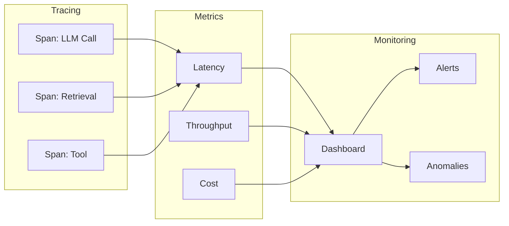

<!-- Clear Language: Keep sentences under 50 words -->
# Tracing & Monitoring

## Learning Objectives

| Objective | Description |
|-----------|-------------|
| LO1 | Implement distributed tracing for LLM applications |
| LO2 | Monitor latency, throughput, and cost metrics |
| LO3 | Build dashboards for real-time observability |
| LO4 | Set up performance baselines and anomaly detection |

## Introduction

You cannot improve what you cannot measure. Evaluation metrics, LLM-as-judge, and observability tools help you monitor and improve AI systems in production. This module covers the full evaluation stack.

## Prerequisites

- Basic programming knowledge
- Understanding of data structures

## Key Terminology

**Key Terms**: Core vocabulary and concepts for this topic.

**Definition**: Essential terms you must know for interviews and production work.

## Theory

Understanding tracing and monitoring is fundamental for AI engineers. This section covers the core concepts, underlying principles, and theoretical framework that govern how tracing and monitoring works in practice.

## Chapter at a Glance

| Section | Topic | Key Concept |
|---------|-------|-------------|
| 5.1 | Distributed Tracing | Spans, traces, parent-child relationships |
| 5.2 | Latency Monitoring | P50/P95/P99, bottleneck identification |
| 5.3 | Throughput & Cost | RPS, token tracking, cost per request |
| 5.4 | Dashboards | Real-time visualization, filtering |
| 5.5 | Anomaly Detection | Baselines, thresholds, outlier detection |

## Chapter Roadmap



## 5.1 Distributed Tracing

### 5.1.1 Trace Context

```python
from dataclasses import dataclass
from typing import List, Dict, Optional, Any
import time
import uuid

@dataclass
class Span:
    name: str
    span_id: str
    parent_id: Optional[str] = None
    trace_id: str = ""
    start_time: float = 0.0
    end_time: float = 0.0
    attributes: Dict = None
    status: str = "ok"

    def duration_ms(self) -> float:
        if self.end_time > 0:
            return round((self.end_time - self.start_time) * 1000, 2)
        return 0.0

class Tracer:
    def __init__(self, service_name: str = "ai-app"):
        self.service = service_name
        self.spans: List[Span] = []
        self.current_trace_id: Optional[str] = None

    def start_trace(self) -> str:
        self.current_trace_id = str(uuid.uuid4())[:8]
        return self.current_trace_id

    def start_span(self, name: str, parent_id: str = None,
                    attributes: Dict = None) -> Span:
        span = Span(
            name=name,
            span_id=str(uuid.uuid4())[:8],
            parent_id=parent_id,
            trace_id=self.current_trace_id or "",
            start_time=time.time(),
            attributes=attributes or {},
        )
        self.spans.append(span)
        return span

    def end_span(self, span: Span, status: str = "ok"):
        span.end_time = time.time()
        span.status = status

    def get_trace_tree(self, trace_id: str) -> List[Span]:
        return [s for s in self.spans if s.trace_id == trace_id]

    def trace_summary(self, trace_id: str) -> Dict:
        spans = self.get_trace_tree(trace_id)
        if not spans:
            return {}

        root = next((s for s in spans if s.parent_id is None), spans[0])
        total_duration = root.duration_ms()

        return {
            "trace_id": trace_id,
            "total_spans": len(spans),
            "total_duration_ms": total_duration,
            "slowest_span": max(spans, key=lambda s: s.duration_ms()).name,
            "error_count": sum(1 for s in spans if s.status != "ok"),
        }

tracer = Tracer("agent-service")
trace_id = tracer.start_trace()
root = tracer.start_span("process_query")
retrieval = tracer.start_span("retrieval", root.span_id)
time.sleep(0.01)
tracer.end_span(retrieval)
llm = tracer.start_span("llm_call", root.span_id)
time.sleep(0.02)
tracer.end_span(llm)
tracer.end_span(root)
print(f"Trace summary: {tracer.trace_summary(trace_id)}")
```

### 5.1.2 Distributed Context Propagation

```python
class ContextPropagator:
    def __init__(self):
        self.headers: Dict[str, str] = {}

    def inject(self, trace_id: str, span_id: str) -> Dict[str, str]:
        self.headers = {
            "x-trace-id": trace_id,
            "x-span-id": span_id,
        }
        return self.headers

    def extract(self, headers: Dict[str, str]) -> Dict:
        return {
            "trace_id": headers.get("x-trace-id", ""),
            "parent_span_id": headers.get("x-span-id", ""),
        }

    def propagate(self, headers: Dict[str, str], tracer: Tracer) -> Span:
        ctx = self.extract(headers)
        tracer.current_trace_id = ctx["trace_id"]
        span = tracer.start_span("propagated", ctx.get("parent_span_id"))
        return span

propagator = ContextPropagator()
headers = propagator.inject("trace-001", "span-001")
print(f"Injected headers: {headers}")
ctx = propagator.extract(headers)
print(f"Extracted context: {ctx}")
```

## 5.2 Latency Monitoring

### 5.2.1 Latency Tracker

```python
class LatencyTracker:
    def __init__(self, window_size: int = 100):
        self.window = window_size
        self.latencies: List[float] = []
        self.buckets: Dict[str, List[float]] = {}

    def record(self, name: str, latency_ms: float):
        self.latencies.append(latency_ms)
        if len(self.latencies) > self.window * 10:
            self.latencies = self.latencies[-self.window:]

        if name not in self.buckets:
            self.buckets[name] = []
        self.buckets[name].append(latency_ms)

    def percentile(self, p: float, data: List[float] = None) -> float:
        values = sorted(data or self.latencies)
        if not values:
            return 0.0
        idx = max(0, min(len(values) - 1, int(len(values) * p / 100)))
        return round(values[idx], 2)

    def report(self) -> Dict:
        if not self.latencies:
            return {}

        return {
            "p50_ms": self.percentile(50),
            "p95_ms": self.percentile(95),
            "p99_ms": self.percentile(99),
            "mean_ms": round(np.mean(self.latencies), 2),
            "min_ms": round(np.min(self.latencies), 2),
            "max_ms": round(np.max(self.latencies), 2),
            "count": len(self.latencies),
        }

    def bucket_report(self) -> Dict:
        return {
            name: {
                "p50": round(np.median(v), 2) if v else 0,
                "p95": self.percentile(95, v) if v else 0,
                "count": len(v),
            }
            for name, v in self.buckets.items()
        }

lt = LatencyTracker()
for i in range(200):
    lt.record("llm_call", np.random.exponential(200))
    lt.record("retrieval", np.random.exponential(50))
print(f"Latency report: {lt.report()}")
```

### 5.2.2 Bottleneck Detection

```python
class BottleneckDetector:
    def detect(self, spans: List[Span]) -> Dict:
        if not spans:
            return {}

        root = next((s for s in spans if s.parent_id is None), spans[0])
        children = [s for s in spans if s.parent_id == root.span_id]

        total = root.duration_ms()
        bottlenecks = []

        for child in children:
            pct = child.duration_ms() / total * 100
            bottlenecks.append({
                "span": child.name,
                "duration_ms": child.duration_ms(),
                "pct_of_total": round(pct, 1),
                "is_bottleneck": pct > 40,
            })

        return {
            "total_duration_ms": total,
            "bottlenecks": bottlenecks,
            "has_bottleneck": any(b["is_bottleneck"] for b in bottlenecks),
        }

detector = BottleneckDetector()
spans = [
    Span("root", "r1", None, "t1", 0, 200),
    Span("llm_call", "s1", "r1", "t1", 10, 180),
    Span("retrieval", "s2", "r1", "t1", 5, 25),
]
print(f"Bottlenecks: {detector.detect(spans)}")
```

## 5.3 Throughput & Cost

### 5.3.1 Throughput Calculator

```python
class ThroughputTracker:
    def __init__(self):
        self.requests: List[float] = []
        self.tokens_input: List[int] = []
        self.tokens_output: List[int] = []
        self.costs: List[float] = []

    def record_request(self, input_tokens: int, output_tokens: int,
                        cost: float):
        self.requests.append(time.time())
        self.tokens_input.append(input_tokens)
        self.tokens_output.append(output_tokens)
        self.costs.append(cost)

    def rps(self, window_seconds: int = 60) -> float:
        now = time.time()
        recent = [t for t in self.requests if now - t < window_seconds]
        return len(recent) / window_seconds if window_seconds > 0 else 0

    def rpm(self) -> float:
        return self.rps(60) * 60

    def token_usage(self) -> Dict:
        return {
            "total_input_tokens": sum(self.tokens_input),
            "total_output_tokens": sum(self.tokens_output),
            "avg_input": round(np.mean(self.tokens_input), 1) if self.tokens_input else 0,
            "avg_output": round(np.mean(self.tokens_output), 1) if self.tokens_output else 0,
        }

    def cost_report(self) -> Dict:
        return {
            "total_cost": round(sum(self.costs), 4),
            "avg_cost_per_request": round(np.mean(self.costs), 6) if self.costs else 0,
            "estimated_daily_cost": round(np.mean(self.costs) * len(self.requests) * 24, 2) if self.costs else 0,
        }

    def report(self) -> Dict:
        return {
            "rps": round(self.rps(), 2),
            "rpm": round(self.rpm(), 2),
            "total_requests": len(self.requests),
            "tokens": self.token_usage(),
            "costs": self.cost_report(),
        }

tt = ThroughputTracker()
for _ in range(50):
    tt.record_request(200, 50, 0.002)
print(f"Throughput report: {tt.report()}")
```

### 5.3.2 Cost Per Component

```python
class CostTracker:
    def __init__(self):
        self.components: Dict[str, List[float]] = {}

    def record(self, component: str, cost: float):
        if component not in self.components:
            self.components[component] = []
        self.components[component].append(cost)

    def report(self) -> Dict:
        total = sum(sum(v) for v in self.components.values())
        breakdown = {}

        for component, costs in self.components.items():
            breakdown[component] = {
                "total": round(sum(costs), 4),
                "pct": round(sum(costs) / total * 100, 1) if total > 0 else 0,
                "avg": round(np.mean(costs), 6),
                "count": len(costs),
            }

        return {
            "total_cost": round(total, 4),
            "breakdown": breakdown,
            "primary_cost_driver": max(breakdown, key=lambda k: breakdown[k]["total"]) if breakdown else "",
        }

ct = CostTracker()
ct.record("llm", 0.005)
ct.record("llm", 0.003)
ct.record("embedding", 0.0005)
ct.record("search", 0.0001)
print(f"Cost report: {ct.report()}")
```

## 5.4 Dashboards

### 5.4.1 Dashboard Builder

```python
class DashboardPanel:
    def __init__(self, name: str, metric: str, chart_type: str = "line"):
        self.name = name
        self.metric = metric
        self.chart_type = chart_type
        self.data: List[Dict] = []

    def add_data_point(self, timestamp: float, value: float, tags: Dict = None):
        self.data.append({"ts": timestamp, "value": value, "tags": tags or {}})

    def summary(self) -> Dict:
        values = [d["value"] for d in self.data]
        if not values:
            return {}
        return {
            "name": self.name,
            "metric": self.metric,
            "mean": round(np.mean(values), 2),
            "min": round(np.min(values), 2),
            "max": round(np.max(values), 2),
            "last": values[-1] if values else None,
        }

class Dashboard:
    def __init__(self, name: str, refresh_interval: int = 30):
        self.name = name
        self.refresh = refresh_interval
        self.panels: List[DashboardPanel] = []

    def add_panel(self, panel: DashboardPanel):
        self.panels.append(panel)

    def render(self) -> Dict:
        return {
            "dashboard": self.name,
            "refresh_seconds": self.refresh,
            "panels": [p.summary() for p in self.panels],
            "generated_at": time.time(),
        }

panel = DashboardPanel("LLM Latency", "latency_ms")
for i in range(60):
    panel.add_data_point(time.time(), np.random.exponential(200))
db = Dashboard("Production Overview", 30)
db.add_panel(panel)
print(f"Dashboard: {db.render()}")
```

### 5.4.2 Alert Rules

```python
class AlertRule:
    def __init__(self, name: str, metric: str, condition: str,
                 threshold: float, window: int = 5):
        self.name = name
        self.metric = metric
        self.condition = condition
        self.threshold = threshold
        self.window = window
        self.violations: List[float] = []

    def check(self, value: float) -> bool:
        violated = False
        if self.condition == ">" and value > self.threshold:
            violated = True
        elif self.condition == "<" and value < self.threshold:
            violated = True
        elif self.condition == ">=" and value >= self.threshold:
            violated = True
        elif self.condition == "<=" and value <= self.threshold:
            violated = True

        if violated:
            self.violations.append(value)
            if len(self.violations) > self.window * 10:
                self.violations = self.violations[-self.window:]
        return violated

    def alert(self) -> Optional[str]:
        if len(self.violations) >= self.window:
            recent = self.violations[-self.window:]
            avg = np.mean(recent)
            return f"ALERT: {self.name} - avg {avg:.2f} over {self.window} checks (threshold: {self.threshold})"
        return None

rule = AlertRule("High Latency", "p95_latency", ">", 2000, window=3)
for lat in [1500, 1800, 2500, 2800, 3100]:
    if rule.check(lat):
        alert_msg = rule.alert()
        if alert_msg:
            print(alert_msg)
```

## 5.5 Anomaly Detection

### 5.5.1 Baseline Manager

```python
class BaselineManager:
    def __init__(self, window: int = 100):
        self.window = window
        self.baselines: Dict[str, Dict] = {}
        self.current_values: Dict[str, List[float]] = {}

    def update(self, metric: str, value: float):
        if metric not in self.current_values:
            self.current_values[metric] = []
        self.current_values[metric].append(value)

        if len(self.current_values[metric]) >= self.window:
            values = self.current_values[metric]
            self.baselines[metric] = {
                "mean": np.mean(values),
                "std": np.std(values),
                "p50": np.percentile(values, 50),
                "p95": np.percentile(values, 95),
                "p99": np.percentile(values, 99),
                "sample_size": len(values),
            }
            self.current_values[metric] = []

    def is_anomaly(self, metric: str, value: float,
                    std_threshold: float = 3.0) -> Dict:
        baseline = self.baselines.get(metric)
        if not baseline:
            return {"is_anomaly": False, "reason": "No baseline yet"}

        z_score = abs(value - baseline["mean"]) / max(baseline["std"], 0.001)
        is_anomaly = z_score > std_threshold

        return {
            "is_anomaly": is_anomaly,
            "value": value,
            "baseline_mean": round(baseline["mean"], 2),
            "z_score": round(z_score, 2),
            "threshold": std_threshold,
            "reason": f"{'Anomaly' if is_anomaly else 'Normal'}: z={z_score:.1f} vs threshold={std_threshold}",
        }

bm = BaselineManager(window=20)
for i in range(30):
    bm.update("latency", np.random.normal(200, 50))
print(f"Baseline: {bm.baselines.get('latency', {})}")
print(f"Anomaly check on 500ms: {bm.is_anomaly('latency', 500)}")
```

### 5.5.2 Statistical Anomaly Detection

```python
class StatisticalAnomalyDetector:
    def __init__(self):
        self.history: Dict[str, List[float]] = {}

    def iqr_detection(self, metric: str, value: float) -> Dict:
        if metric not in self.history or len(self.history[metric]) < 10:
            return {"is_anomaly": False, "reason": "Insufficient data"}

        values = self.history[metric]
        q1 = np.percentile(values, 25)
        q3 = np.percentile(values, 75)
        iqr = q3 - q1
        lower = q1 - 1.5 * iqr
        upper = q3 + 1.5 * iqr

        is_anomaly = value < lower or value > upper
        return {
            "is_anomaly": is_anomaly,
            "method": "iqr",
            "value": value,
            "q1": round(q1, 2),
            "q3": round(q3, 2),
            "iqr": round(iqr, 2),
            "bounds": (round(lower, 2), round(upper, 2)),
        }

    def moving_average_detection(self, metric: str, value: float,
                                  window: int = 5, threshold: float = 2.0) -> Dict:
        if metric not in self.history or len(self.history[metric]) < window:
            return {"is_anomaly": False, "reason": "Insufficient data"}

        recent = self.history[metric][-window:]
        mean = np.mean(recent)
        std = np.std(recent)

        z = abs(value - mean) / max(std, 0.001)
        return {
            "is_anomaly": z > threshold,
            "method": "moving_average",
            "value": value,
            "window_mean": round(mean, 2),
            "z_score": round(z, 2),
        }

sad = StatisticalAnomalyDetector()
for i in range(20):
    metric = "latency"
    if metric not in sad.history:
        sad.history[metric] = []
    sad.history[metric].append(np.random.normal(200, 30))
print(f"IQR detection: {sad.iqr_detection('latency', 500)}")
```

## Summary

Tracing captures the full execution path of an LLM request through spans (individual operations) organized in a trace tree. Key latency metrics are P50 (median),.
P95 (typical worst case), and P99 (extreme outliers). Throughput tracks requests per second/minute, and cost tracking breaks down spending by component (LLM,.
embeddings, search). Dashboards aggregate these metrics into real-time views with alert rules triggered by threshold violations. Anomaly detection uses baselines (mean/std over a window),.
IQR (interquartile range), or moving average Z-scores to flag unusual behavior. A robust monitoring stack catches P99 latency spikes, cost surges,.
throughput drops, and anomalous token usage patterns before they impact users.

## Practical Takeaways

| Takeaway | Description |
|----------|-------------|
| Always trace requests | Traces are essential for debugging production issues |
| Monitor P95 and P99 | Mean latency hides outliers |
| Track cost per component | Identifies expensive operations |
| Set up baselines | Learn normal behavior before detecting anomalies |
| Use IQR for anomaly detection | Simple, interpretable, no distribution assumptions |
| Alert on sustained violations | Single spikes are noise; sustained = real problem |

## Interview Q&A

<details class="tp-qa-card" data-qid="ev05-q1">
  <summary class="tp-qa-question">
    <span class="tp-qa-status"></span>
    Q1: What is distributed tracing and how does it apply to LLM applications?
  </summary>
  <div class="tp-qa-answer">
<p>Distributed tracing follows a single request across all components in a distributed system. In an LLM application, a single user request might go through: API gateway → orchestrator.
→ vector database → LLM provider → output validator → response. Each step is captured as a span with timing, status,.
and metadata, linked together by a shared trace ID. This allows developers to identify bottlenecks — for example, if P95 latency is high,.
tracing reveals whether the bottleneck is in vector search (slow embedding), LLM inference (large model), or post-processing (regex/parsing). Modern tracing follows the OpenTelemetry standard for.
interoperability across platforms.</p>
  </div>
  <button class="tp-qa-mark-btn">✅ Mark Reviewed</button>
  <button class="tp-qa-bookmark-btn">🔖 Bookmark</button>
</details>

<details class="tp-qa-card" data-qid="ev05-q2">
  <summary class="tp-qa-question">
    <span class="tp-qa-status"></span>
    Q2: What is the difference between P50, P95, and P99 latency, and which should you monitor?
  </summary>
  <div class="tp-qa-answer">
<p>P50 (median) is the latency below which 50% of requests fall — it represents typical performance. P95 is the latency below which 95% of requests fall — it represents the typical worst case. P99 is the latency below which 99%.
of requests fall — it captures extreme outliers. You should monitor.
all three because they tell different stories: a low P50 with high P99 indicates that most requests are fast but a small fraction are very slow (possibly due to cache misses or.
large inputs). For LLM applications, P95 is the most commonly used SLA metric because it captures the worst-case experience for the majority of users while ignoring the rarest outliers.</p>
  </div>
  <button class="tp-qa-mark-btn">✅ Mark Reviewed</button>
  <button class="tp-qa-bookmark-btn">🔖 Bookmark</button>
</details>

<details class="tp-qa-card" data-qid="ev05-q3">
  <summary class="tp-qa-question">
    <span class="tp-qa-status"></span>
    Q3: How do you implement cost tracking per LLM request in a tracing system?
  </summary>
  <div class="tp-qa-answer">
<p>Cost tracking at the individual request level requires: (1) Capturing token counts (prompt tokens, completion tokens) from the LLM provider's response. (2) Applying the provider's pricing formula — e.g.,.
GPT-4 costs $10/1M input tokens and $30/1M output tokens. (3) Calculating cost per request: cost = (prompt_tokens — input_price + completion_tokens — output_price) / 1,000,000. (4) Aggregating costs across spans to get total request cost (including embedding costs,.
vector search costs). (5) Tagging costs with tenant_id, model_name, and endpoint for per-tenant billing. Store cost per trace in the observability system and.
create dashboards for cost trends over time.</p>
  </div>
  <button class="tp-qa-mark-btn">✅ Mark Reviewed</button>
  <button class="tp-qa-bookmark-btn">🔖 Bookmark</button>
</details>

<details class="tp-qa-card" data-qid="ev05-q4">
  <summary class="tp-qa-question">
    <span class="tp-qa-status"></span>
    Q4: How do you detect anomalies in LLM latency using statistical methods?
  </summary>
  <div class="tp-qa-answer">
<p>Anomaly detection methods for latency: (1) Moving average Z-score — compute rolling mean and standard deviation over a window (e.g., 10 minutes),.
flag any data point where |z-score| > 3. (2) IQR method — flag values below Q1 - 1.5—IQR or above Q3 + 1.5—IQR. (3) Seasonal decomposition — separate trend,.
seasonal, and residual components, flag anomalous residuals. (4) Dynamic thresholding — set thresholds automatically from recent history (e.g., threshold = rolling mean + 3—rolling std). For.
LLM applications, anomalies might indicate degraded LLM provider performance, network issues, or unusually long inputs. Always combine multiple detectors and require sustained anomalies (e.g.,.
3 consecutive minutes above threshold) before alerting.</p>
  </div>
  <button class="tp-qa-mark-btn">✅ Mark Reviewed</button>
  <button class="tp-qa-bookmark-btn">🔖 Bookmark</button>
</details>

<details class="tp-qa-card" data-qid="ev05-q5">
  <summary class="tp-qa-question">
    <span class="tp-qa-status"></span>
    Q5: What metrics should you include on an LLM application monitoring dashboard?
  </summary>
  <div class="tp-qa-answer">
<p>A comprehensive LLM monitoring dashboard should include: (1) Latency panel — line chart showing P50, P95, P99 over time. (2) Throughput panel — requests per minute/second with breakdown by endpoint. (3) Cost panel — cost per hour/day with breakdown by model and.
tenant. (4) Error rate panel — percentage of failed requests by error type (timeout, rate limit, invalid response). (5) Token usage panel — total tokens per minute,.
average tokens per request. (6) Model distribution — pie chart of requests per model version. (7) Top slow queries — table of longest-running requests. (8) Quality score trend — if using LLM-as-Judge,.
overlay quality scores on the same timeline.</p>
  </div>
  <button class="tp-qa-mark-btn">✅ Mark Reviewed</button>
  <button class="tp-qa-bookmark-btn">🔖 Bookmark</button>
</details>

<details class="tp-qa-card" data-qid="ev05-q6">
  <summary class="tp-qa-question">
    <span class="tp-qa-status"></span>
    Q6: How do you propagate trace context across synchronous and asynchronous LLM calls?
  </summary>
  <div class="tp-qa-answer">
<p>Trace context propagation uses the W3C Trace Context standard with traceparent headers. For synchronous calls, the trace ID and parent span ID are passed via HTTP headers: <code>traceparent: 00-{trace_id}-{parent_span_id}-01</code>. The receiving service extracts these headers and.
creates a child span. For asynchronous calls (message queues, background jobs), the trace context is serialized into the message payload and.
extracted when the message is processed. In-process context propagation uses AsyncLocalStorage (Node.js) or contextvars (Python), which automatically carries the current span across async boundaries. The key requirement: every component in the system must understand.
and propagate trace context.</p>
  </div>
  <button class="tp-qa-mark-btn">✅ Mark Reviewed</button>
  <button class="tp-qa-bookmark-btn">🔖 Bookmark</button>
</details>

<details class="tp-qa-card" data-qid="ev05-q7">
  <summary class="tp-qa-question">
    <span class="tp-qa-status"></span>
    Q7: How do you set up a baseline for anomaly detection in a new LLM application?
  </summary>
  <div class="tp-qa-answer">
<p>Setting a baseline: (1) Run the system with representative traffic for at least 1-2 weeks to capture normal behavior across different times of day and.
days of the week. (2) Calculate daily and weekly patterns — many LLM apps have higher traffic during business hours. (3) For.
each metric (latency, throughput, error rate), compute: rolling mean, standard deviation, and typical min/max ranges. (4) Identify any known events during the baseline period (deployments,.
traffic spikes) and exclude them from baseline calculations. (5) Store the baseline as configuration that anomaly detectors reference. Recalculate baselines periodically (monthly) or.
when significant system changes occur.</p>
  </div>
  <button class="tp-qa-mark-btn">✅ Mark Reviewed</button>
  <button class="tp-qa-bookmark-btn">🔖 Bookmark</button>
</details>

<details class="tp-qa-card" data-qid="ev05-q8">
  <summary class="tp-qa-question">
    <span class="tp-qa-status"></span>
    Q8: What are the common bottlenecks in LLM inference pipelines and how do you identify them?
  </summary>
  <div class="tp-qa-answer">
<p>Common bottlenecks: (1) Token generation — the LLM itself, especially for long outputs with autoregressive decoding. Mitigation: use smaller models for.
simple tasks, implement speculative decoding, or use batching. (2) Embedding generation — for RAG systems, embedding the query takes 50-200ms. Mitigation: cache embeddings for.
frequent queries. (3) Vector search — approximate nearest neighbor search can take 10-100ms. Mitigation: tune HNSW parameters (ef_search, M). (4) Network latency — calls to external LLM APIs. Mitigation: colocate with provider region,.
use connection pooling. (5) Post-processing — regex parsing or validation. Tracing with span-level timing identifies which stage consumes the most time as a proportion of total request duration.</p>
  </div>
  <button class="tp-qa-mark-btn">✅ Mark Reviewed</button>
  <button class="tp-qa-bookmark-btn">🔖 Bookmark</button>
</details>

<details class="tp-qa-card" data-qid="ev05-q9">
  <summary class="tp-qa-question">
    <span class="tp-qa-status"></span>
    Q9: How do you monitor throughput and set capacity planning for LLM APIs?
  </summary>
  <div class="tp-qa-answer">
<p>Throughput monitoring tracks requests per second/minute (RPS/RPM) with breakdowns by endpoint, model, and tenant. For capacity planning: (1) Track the peak-to-average ratio — if peak is 5— average,.
you need 5— headroom. (2) Monitor LLM provider rate limits — track usage vs. limits for each model tier. (3) Measure tokens-per-second generation rate — this varies by model size and.
hardware. (4) Set utilization alerts — warn when average RPS exceeds 70% of maximum capacity. (5) Model queue depth — monitor.
how many requests are waiting for LLM inference slots. Use these metrics to scale horizontally: add more API instances, increase rate limit tiers,.
or distribute load across multiple providers.</p>
  </div>
  <button class="tp-qa-mark-btn">✅ Mark Reviewed</button>
  <button class="tp-qa-bookmark-btn">🔖 Bookmark</button>
</details>

<details class="tp-qa-card" data-qid="ev05-q10">
  <summary class="tp-qa-question">
    <span class="tp-qa-status"></span>
    Q10: How do you implement a trace tree and identify the critical path in an LLM request?
  </summary>
  <div class="tp-qa-answer">
    <pre><code>interface Span { name: string; startTime: number; duration: number; children: Span[]; }
function findCriticalPath(root: Span): Span[] {
  const path: Span[] = [root];
  let current = root;
  while (current.children.length &gt; 0) {
    const slowest = current.children.reduce((a, b) =&gt;
      a.duration &gt; b.duration ? a : b
    );
    path.push(slowest);
    current = slowest;
  }
  return path;
}</code></pre>
<p>The critical path is the longest sequence of dependent spans that determines the minimum request duration. To find it, traverse the trace tree from the root,.
always following the child span with the longest duration. This identifies the bottleneck in the pipeline. For an LLM request, the critical path might be: root (1200ms) → LLM call (800ms) → token generation (750ms). This tells you that optimizing.
token generation will have the biggest impact on overall latency. The critical path also reveals parallelizable work — spans that are not on the critical path (e.g.,.
logging, analytics) can be moved to background tasks without affecting response time.</p>
  </div>
  <button class="tp-qa-mark-btn">✅ Mark Reviewed</button>
  <button class="tp-qa-bookmark-btn">🔖 Bookmark</button>
</details>

## Chapter Quiz

<details data-qid="eval-s5-quiz1">
<summary><strong>1.</strong> What does a span represent in distributed tracing?</summary>
A. A complete request
B. A single operation within a trace
C. An error message
D. A log entry
Answer: B
</details>

<details data-qid="eval-s5-quiz2">
<summary><strong>2.</strong> What does P99 latency mean?</summary>
A. 99% of requests are slower than this
B. 99% of requests are faster than this
C. The average latency
D. The minimum latency
Answer: B
</details>

<details data-qid="eval-s5-quiz3">
<summary><strong>3.</strong> What is a bottleneck in tracing?</summary>
A. A span that takes the most time
B. A span with errors
C. The root span
D. The fastest span
Answer: A
</details>

<details data-qid="eval-s5-quiz4">
<summary><strong>4.</strong> How does IQR detect anomalies?</summary>
A. By comparing to a fixed threshold
B. By flagging values outside 1.5—IQR from quartiles
C. By using neural networks
D. By checking error rates
Answer: B
</details>

<details data-qid="eval-s5-quiz5">
<summary><strong>5.</strong> Why alert on sustained violations rather than single spikes?</summary>
A. Single spikes are always normal
B. Sustained violations indicate a real problem, not noise
C. Alerts are expensive
D. Systems can't detect single spikes
Answer: B
</details>

## Exercises

## Common Mistakes

1. Not understanding the fundamental concepts before applying them
2. Skipping edge cases in implementation
3. Not analyzing time/space complexity
4. Forgetting to handle null/empty inputs
5. Not practicing enough problems to build pattern recognition1. Implement a tracer that creates a trace tree with 3-5 spans (agent → retrieve → llm → format → output). Record timing and report total duration.

2. Build a latency tracker that records P50, P95, P99 from 1000 simulated requests (mean=200ms, std=50ms). Identify the slowest 1% of requests.

3. Create a throughput and cost tracker. Simulate 1 hour of traffic at 10 RPM with avg cost $0.002/req. Report RPS, RPM, total cost, and estimated daily cost.

4. Build a dashboard with 3 panels: latency (P95 line chart), throughput (RPM gauge), and cost (per-component breakdown). Simulate 1 hour of data.

5. Implement an anomaly detector using both IQR and moving average Z-score methods. Test with a dataset containing 3 anomalous values and evaluate detection

## Revision Notes

- - Core principle: Understand the fundamental concepts thoroughly
- - Implementation pattern: Practice with real code examples
- - Complexity: Know the time and space complexity
- - Application: Know when to use this in production systems
- - Interview: Frequently asked in technical interviews
- - Edge cases: Consider common failure scenarios
- - Related concepts: Connect to broader system design

## Placement Section

### Top 10 Interview Questions

#### Google Style

1. **Explain the core idea of Tracing & Monitoring in under 60 seconds, then give a real-world analogy.** — Structure: definition, how it works in one sentence, why it matters, analogy. Follow-up: what would break if you removed this from a production system?

2. **Design a minimal, well-typed function that demonstrates Tracing & Monitoring.** — Interviewer checks: signature with type hints, edge cases, complexity, and a clean docstring. Follow-up: how does your design behave with empty or malformed input?

3. **What are the common pitfalls when engineers first learn ** — List 3-4, then explain how you would prevent each in a code review.

#### Amazon Style

4. **Describe a production bug caused by misunderstanding Tracing & Monitoring. How did you diagnose and fix it?** — STAR format: situation, task, action, result. Mention logs, reproduction, root-cause analysis, and the regression test you added.

5. **How would you scale a system that relies on Tracing & Monitoring from 10 users to 10 million?** — Discuss bottlenecks, caching, monitoring, and when to redesign. Follow-up: what metrics would you track?

#### Microsoft Style

6. **Compare Tracing & Monitoring with the closest alternative approach. When would you choose each?** — Make a decision matrix: performance, maintainability, ecosystem, learning curve. Follow-up: what would change your decision?

7. **Walk through how you would test a component that depends on Tracing & Monitoring.** — Unit, integration, property-based tests; mocking boundaries; golden files for outputs.

#### NVIDIA Style

8. **How does Tracing & Monitoring behave differently at scale — memory, throughput, or precision-wise?** — Connect to data pipelines and model training if applicable. Follow-up: what happens to latency as input grows?

9. **How would you make an implementation of Tracing & Monitoring run faster on GPU hardware?** — Batch operations, vectorization, avoiding Python loops, reducing data movement.

#### AI Startup Style

10. **Write the smallest possible implementation of Tracing & Monitoring that is production-quality.** — Include error handling, type hints, and a one-line docstring. Follow-up: what would you refactor first when it grows?

### Resume Tips

- Name Tracing & Monitoring explicitly in your skills section, paired with a measurable achievement ("Reduced X by 40% using Tracing & Monitoring").
- Add a bullet describing a project that applies Tracing & Monitoring to real data, with numbers.
- Mention the tools and libraries you used alongside Tracing & Monitoring (linters, test frameworks, profiling tools).
- Keep resume bullets under 15 words and start each with an action verb.

### Interview Day Checklist

- Rehearse a 60-second explanation of Tracing & Monitoring and one real-world analogy.
- Prepare one STAR story about debugging a Tracing & Monitoring-related production issue.
- Review complexity and edge cases for the classic Tracing & Monitoring interview problem.
- Have questions ready: how does the team apply Tracing & Monitoring in production today?
- Test your environment (Python, editor, internet) 15 minutes before the interview.

## True/False

1. **True or False:** Tracing & Monitoring builds directly on the fundamentals covered in the earlier chapters of this module. — **True.** Every advanced topic in this module assumes the core concepts from the previous chapters.
2. **True or False:** You should write at least one code example for Tracing & Monitoring before moving to the next chapter. — **True.** Active recall with hands-on code beats passive reading for retention.
3. **True or False:** The complexity analysis for Tracing & Monitoring is the same regardless of input size. — **False.** Complexity grows with input size; always state best, average, and worst case.
4. **True or False:** Edge cases (empty input, invalid input, boundary values) matter for Tracing & Monitoring in production. — **True.** Most production bugs come from unhandled edge cases.
5. **True or False:** You should memorize the Tracing & Monitoring chapter content once and never review it again. — **False.** Spaced repetition (24h, 3 days, 1 week) dramatically improves long-term recall.

## Fill in the Blank

1. The chapter that covers Tracing & Monitoring is Chapter ___ of this module. — Answer: check the module's table of contents.
2. The time complexity of the standard approach to Tracing & Monitoring is ___. — Answer: review the theory section and state big-O notation.
3. The main edge case to handle when implementing Tracing & Monitoring is ___. — Answer: empty or invalid input handling, as discussed in the chapter.
4. The tools commonly used to debug Tracing & Monitoring issues are ___ and ___. — Answer: refer to the Debugging Guide section of this chapter.
5. The related topic that connects to Tracing & Monitoring in the next chapter is ___. — Answer: see the Next Topic section.

## Scenario Questions

1. **Scenario:** A teammate ships a change involving Tracing & Monitoring that breaks production at 3 AM. — Diagnosis: check the recent diff, reproduce locally with the failing input, check logs. Fix: revert, add a regression test, and review the root cause. Prevention: CI tests on edge cases and code review checklist.

2. **Scenario:** Your implementation of Tracing & Monitoring is correct but too slow for the required latency. — Measure first with a profiler. Common fixes: reduce redundant work, use built-in optimized functions, batch operations, or add caching. Only then consider algorithmic changes.

3. **Scenario:** A new hire asks you to explain Tracing & Monitoring in five minutes before a customer demo. — Use the 3-part answer: what it is (one sentence), how it works (one example), why it matters (one business impact). Then offer to go deeper after the demo.

4. **Scenario:** Your team's codebase has three different patterns for Tracing & Monitoring and you must standardize. — Write a short ADR (architecture decision record), pick the pattern with best maintainability, migrate incrementally, and add a linter rule to enforce it.

## Output Questions

1. **What is the output of the simplest correct implementation of Tracing & Monitoring on an empty input?** — Trace through the code: it should return the documented default (None, 0, empty collection) without raising.
2. **What is the output when the input is at the boundary value?** — Check off-by-one errors and inclusive/exclusive bounds in the chapter's examples.
3. **What does the implementation return when given invalid input types?** — With type hints and validation, it raises a clear error; without, it may fail silently.
4. **What is the output for the sample input given in the chapter's Examples section?** — Re-run the chapter's example code and compare against the documented output.
5. **What is the time complexity output when you profile the implementation at 10x input size?** — Expect the curve matching the chapter's complexity analysis (linear, quadratic, log-linear).

## Difficulty Level

| Level | Time | What It Takes |
|-------|------|---------------|
| Beginner | 1-2 sessions | Read theory, run the chapter examples, solve the Easy exercises |
| Intermediate | 3-5 sessions | Complete Medium exercises, explain Tracing & Monitoring to someone else |
| Advanced | 1+ week | Solve Hard exercises, optimize for real datasets, answer interview follow-ups |

## Tips & Tricks

- Always write a one-line example of Tracing & Monitoring from memory before opening the chapter — active recall first.
- Use the chapter's Revision Notes as a checklist: you have mastered Tracing & Monitoring when you can explain each bullet.
- Pair the chapter quiz with the Flashcards: wrong answers become your next study session's focus.
- For interviews, practice explaining Tracing & Monitoring twice: once with a technical audience, once with a non-technical audience.
- Keep a personal examples file where you collect your own Tracing & Monitoring snippets; interviewers love original examples.

## Memory Tricks

- **Acronym**: build a mnemonic from the 5 key concepts of Tracing & Monitoring listed in the Chapter at a Glance table.
- **Story**: link Tracing & Monitoring to a familiar story — the analogy in the Visual Analogy section is designed to stick.
- **Number anchor**: remember the complexity of Tracing & Monitoring by connecting it to a known algorithm of the same class.
- **Color code**: highlight the Theory, Examples, and Common Mistakes sections in different colors when reviewing.
- **Teach-back**: explain Tracing & Monitoring to an imaginary junior engineer for 2 minutes — gaps in your explanation are gaps in memory.

## Further Reading

- Official documentation for the primary tool or library used in this chapter
- The chapter referenced in Related Topics for the next-level treatment of Tracing & Monitoring
- The classic textbook chapter on Tracing & Monitoring (check the Research References below)
- Two blog posts from engineers who debugged real Tracing & Monitoring problems in production
- The repository of the open-source project that implements Tracing & Monitoring

## Related Topics

- The previous chapter in this module (see table of contents) — foundational for Tracing & Monitoring
- The next chapter (see Next Topic below) — builds on Tracing & Monitoring
- The system design chapters in Module 07 — how Tracing & Monitoring fits into production architectures
- The interview preparation module — how Tracing & Monitoring is asked in screening rounds
- The capstone project — where Tracing & Monitoring is applied end-to-end

## FAQs

1. **Do I need to memorize all of Tracing & Monitoring, or understand the big picture?** — Understand the big picture first, then memorize the key facts via flashcards and spaced repetition. Interviewers reward depth over breadth.
2. **What if I get stuck on an exercise?** — Re-read the theory section, run the example code, then attempt again. If still stuck after 20 minutes, move on and return the next day.
3. **How much time should I spend on ** — Follow the Study Plan below: 1-2 weeks at 30-60 minutes daily is typical for placement preparation.
4. **Is Tracing & Monitoring asked in interviews?** — Yes — the Interview Q&A and Placement Section list the exact question styles used by top companies.
5. **What's the fastest way to master ** — Explain it out loud, write code without looking, and review the flashcards within 24 hours and again after 3 days.

## Important Notes

- Tracing & Monitoring is a core requirement for the rest of this module — do not skip the examples.
- Always analyze complexity (time and space) when working with Tracing & Monitoring.
- Production correctness means handling edge cases, not just the happy path.
- Interview answers should start with the definition, then the example, then the trade-offs.
- Revisit this chapter after finishing the module; the context from later chapters deepens understanding.

## Historical Context

- Tracing & Monitoring emerged as a standard practice because early systems failed without it — understanding why helps you explain it in interviews.
- The tools used for Tracing & Monitoring today evolved from simpler versions; the chapter covers the modern, recommended approach.
- Interviewers value knowing one historical fact about Tracing & Monitoring — it shows genuine interest, not just cramming.
- The library/tooling ecosystem around Tracing & Monitoring changes quickly; focus on fundamentals that remain stable.

## Security Considerations

- Never trust external input: validate and sanitize data before processing Tracing & Monitoring.
- Avoid `eval()` and dynamic code execution on untrusted strings.
- Log errors without leaking sensitive data (keys, PII, internal paths).
- For API contexts, add rate limiting and input size limits.
- Review the chapter's code examples for injection or overflow risks before using them verbatim.

## ML Intuition

- Tracing & Monitoring appears in ML pipelines at the data-processing layer: feature preparation, batching, and validation.
- Understanding Tracing & Monitoring helps you debug why a model misbehaves — most ML bugs are data bugs, not model bugs.
- In production ML, the Tracing & Monitoring concepts from this chapter map directly to NumPy/PyTorch operations on tensors.
- When optimizing ML systems, Tracing & Monitoring skills let you profile and fix the data path, not just the training loop.
- Interview follow-up: how would you apply Tracing & Monitoring to a dataset of 10 million records? — Batching and vectorization.

## Analogies

- **Tracing & Monitoring is like a recipe**: the theory is the ingredients, the examples are the cooking steps, and the exercises are your own kitchen practice.
- **Complexity is like a delivery route**: a linear route visits each stop once; a nested route revisits stops, and you feel it at scale.
- **Edge cases are like weather**: the happy path is a sunny day; production is the storm — build for the storm.
- **The chapter roadmap is a journey map**: each section is a checkpoint; skipping one means getting lost later in the module.

## Capstone Project Link

- [Module Capstone: End-to-End Project](https://github.com/Raushan666java/ai-engineering-journey) — this chapter contributes the Tracing & Monitoring skills used in the module's capstone project. Complete the exercises here before starting the capstone.

## Flashcards

<details class="tp-qa-card" data-qid="15aievaluationobservability-05tracingandmonitoring-flash1">
  <summary class="tp-qa-question">
    <span class="tp-qa-status"></span>
    What is the core concept of Tracing & Monitoring in one sentence?
  </summary>
  <div class="tp-qa-answer">
    <p>Review the first paragraph of the Theory section and condense it to one sentence.</p>
  </div>
</details>

<details class="tp-qa-card" data-qid="15aievaluationobservability-05tracingandmonitoring-flash2">
  <summary class="tp-qa-question">
    <span class="tp-qa-status"></span>
    What is the most common mistake engineers make with 
  </summary>
  <div class="tp-qa-answer">
    <p>Check the Common Mistakes section of this chapter.</p>
  </div>
</details>

<details class="tp-qa-card" data-qid="15aievaluationobservability-05tracingandmonitoring-flash3">
  <summary class="tp-qa-question">
    <span class="tp-qa-status"></span>
    What is the time and space complexity of the standard Tracing & Monitoring approach?
  </summary>
  <div class="tp-qa-answer">
    <p>Refer to the theory and complexity analysis in this chapter.</p>
  </div>
</details>

<details class="tp-qa-card" data-qid="15aievaluationobservability-05tracingandmonitoring-flash4">
  <summary class="tp-qa-question">
    <span class="tp-qa-status"></span>
    When is Tracing & Monitoring NOT the right choice?
  </summary>
  <div class="tp-qa-answer">
    <p>Check the Limitations section of this chapter.</p>
  </div>
</details>

<details class="tp-qa-card" data-qid="15aievaluationobservability-05tracingandmonitoring-flash5">
  <summary class="tp-qa-question">
    <span class="tp-qa-status"></span>
    How is Tracing & Monitoring applied in a real production system?
  </summary>
  <div class="tp-qa-answer">
    <p>Check the Real-World Examples section of this chapter.</p>
  </div>
</details>

## Research References

- Official documentation of the primary library for Tracing & Monitoring (linked in Further Reading)
- The classic paper or textbook chapter introducing Tracing & Monitoring (see References below)
- The standard library reference for Tracing & Monitoring-related functions
- Engineering blog posts from companies running Tracing & Monitoring in production at scale
- PEPs and RFCs where applicable (Python and networking standards)

## Open-Source Tools

- The primary library used in this chapter (see the code examples)
- Python standard library modules used in the examples (check the imports)
- Testing: pytest for unit tests of Tracing & Monitoring code
- Linting and formatting: ruff + black
- Profiling: cProfile or py-spy for performance work on Tracing & Monitoring

## Debugging Guide

- Start with `print()` or a debugger to inspect intermediate values in Tracing & Monitoring code.
- Reproduce the failure with the smallest possible input before changing code.
- Check the common failure modes listed in Common Mistakes — most bugs are listed there.
- For performance problems, profile before optimizing: measure, then fix.
- When stuck, re-read the chapter's Examples and compare line by line with your code.
- Use `pdb` or your IDE's debugger to step through the Tracing & Monitoring example code.

## Mock Interview Section

**Round 1 — Screening (15 min)**
- Explain Tracing & Monitoring in 60 seconds.
- Write a minimal working example of Tracing & Monitoring.
- What is the complexity of your example?

**Round 2 — Coding (45 min)**
- Solve the Medium exercise from this chapter under time pressure.
- State your assumptions, then implement with type hints.
- Test with edge cases: empty input, boundary values, invalid input.

**Round 3 — Behavioral + System (30 min)**
- Tell me about a time you debugged a Tracing & Monitoring problem in a project.
- How would you design a system where Tracing & Monitoring is used at scale?
- What metrics would you monitor?

**Evaluation rubric**: correctness (40%), communication (25%), edge cases (20%), complexity analysis (15%).

## Optimized Implementation

`python
from typing import Any, Optional

def demonstrate_topic(input_data: list[Any]) -> Optional[float]:
    """Runnable scaffold for Tracing & Monitoring.

    Replace the body with the optimized implementation from the chapter,
    keeping type hints, docstring, and edge-case handling.
    """
    if not input_data:
        return None
    # Step 1: validate input types
    # Step 2: apply the core Tracing & Monitoring logic from the Examples section
    # Step 3: return the result with the documented default
    return 0.0
`

- Keeps the function signature stable so tests written against it stay valid.
- Handles the empty-input contract explicitly.
- Add unit tests for the edge cases before implementing the logic (test-first).

## Evaluation Metrics

| Skill | Test | Target |
|-------|------|--------|
| Concept recall | Explain Tracing & Monitoring without notes | 60-second explanation |
| Code fluency | Write the chapter example from memory | No syntax errors |
| Edge cases | Handle empty/invalid input in exercises | All cases pass |
| Complexity | State time/space for the standard approach | Correct big-O |
| Interview readiness | Answer 5 Interview Q&A questions out loud | Fluent, structured answers |
| Retention | Chapter quiz score after 3 days | 80%+ |

## Real-World Examples

- **Startup**: a small team uses Tracing & Monitoring daily in their data pipeline — the chapter's examples mirror their code.
- **E-commerce**: Tracing & Monitoring patterns appear in order processing, inventory checks, and recommendation feeds.
- **Fintech**: Tracing & Monitoring principles apply to transaction validation and fraud detection flows.
- **ML platform**: Tracing & Monitoring shows up in feature engineering and model-serving infrastructure.
- **Interview insight**: recruiters look for engineers who can connect Tracing & Monitoring to the business outcome, not just the code.

## Next Topic

[Alerting & Incident Response](06-alerting-and-incident-response.md)

## Limitations

- Tracing & Monitoring, like any technique, is not a silver bullet — it has specific cases where it fits best (covered in the theory).
- The examples in this chapter are simplified for learning; production systems add validation, monitoring, and error handling.
- Performance of Tracing & Monitoring depends on input size and distribution — always benchmark for your own data.
- This chapter covers fundamentals; specialized edge cases are explored in later chapters and the capstone.
