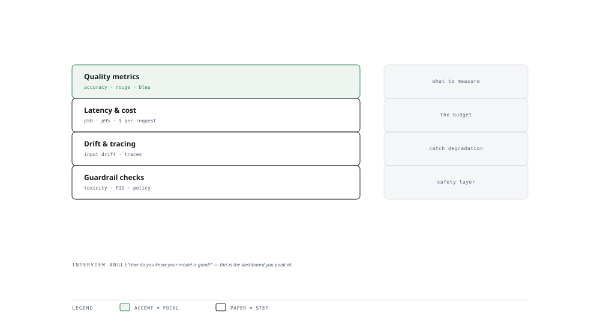

# Visual Notes — Evaluation and Observability in One View

> One diagram, the full picture. This page is meant to be glanced at before reading the chapters, and again before interviews.

# What the diagram shows

1. **Offline** — Golden datasets and LLM-as-judge score quality before anything ships.
1. **Online** — Latency, error rate, drift and user feedback track live behaviour.
1. **Trace & cost** — Every request is traced across steps; token and dollar costs are accounted per feature.

# Why this matters for placement

- "How do you measure an LLM app?" — having offline + online + cost answers it completely.
- The ability to build eval harnesses is a differentiator recruiters actively screen for.

# Quick revision

- Offline first: regression suites catch silent quality drops before users do.
- LLM-as-judge: prompt a strong model to score outputs; validate the judge against humans.
- Tracing (OpenTelemetry-style) links one request across retrieval -> generation -> post-processing.
- Monitor drift, latency percentiles, error budgets — not just averages.
- Cost per request is an evaluation axis, not an afterthought.

# Related chapters

- [Evaluation metrics](01-evaluation-metrics.md)
- [LLM as judge](02-llm-as-judge.md)
- [Tracing and monitoring](05-tracing-and-monitoring.md)
- [Alerting](06-alerting-and-incident-response.md)

---

**One-line answer for interviews:** *"Offline metrics validate before launch; online metrics, tracing and cost watch it in production."*
