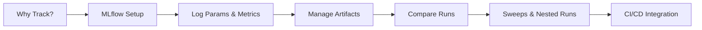
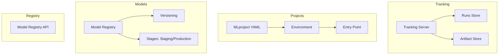

<!-- Clear Language: Keep sentences under 50 words -->
# Experiment Tracking

## Learning Objectives

| Objective | Description |
|-----------|-------------|
| LO1 | Understand the importance of experiment tracking in ML workflows |
| LO2 | Set up and configure MLflow for tracking experiments |
| LO3 | Log parameters, metrics, artifacts, and models systematically |
| LO4 | Compare experiments using tracking UI and programmatic APIs |
| LO5 | Implement nested runs and hyperparameter sweeps |
| LO6 | Integrate experiment tracking into CI/CD pipelines |

## Introduction

MLOps bridges the gap between experiment and production. Experiment tracking, CI/CD, model serving, and drift monitoring keep AI systems reliable. This module covers the operational side of AI engineering.

## Prerequisites

- Basic programming knowledge
- Understanding of data structures

## Key Terminology

**Key Terms**: Core vocabulary and concepts for this topic.

**Definition**: Essential terms you must know for interviews and production work.

## Theory

Understanding experiment tracking is fundamental for AI engineers. This section covers the core concepts, underlying principles, and theoretical framework that govern how experiment tracking works in practice.

## Chapter at a Glance

| Section | Topic | Key Concept |
|---------|-------|-------------|
| 1.1 | What is Experiment Tracking | Why tracking matters for reproducibility |
| 1.2 | MLflow Architecture | Tracking server, runs, artifacts, registry |
| 1.3 | Logging Parameters & Metrics | Autologging, custom logging |
| 1.4 | Artifact Management | Models, plots, datasets as artifacts |
| 1.5 | Experiment Comparison | Search runs, compare via API |
| 1.6 | Hyperparameter Sweeps | Nested runs, grid search integration |
| 1.7 | CI/CD Integration | Automate tracking in pipelines |

## Chapter Roadmap



## 1.1 What is Experiment Tracking

Experiment tracking is the systematic logging of machine learning experiments to ensure reproducibility, comparability, and auditability. In production ML, data scientists run hundreds of experiments varying hyperparameters, model architectures, data splits, and preprocessing steps. Without tracking, it is impossible to determine which configuration produced the best model.

**Key challenges solved by experiment tracking**:
- **Reproducibility**: Recreate any past result exactly
- **Comparability**: Compare metrics across experiments on equal footing
- **Auditability**: Know who ran what, when, and with which code version
- **Serendipity**: Capture insights from failed experiments that may be useful later

```python
import mlflow
import mlflow.sklearn
from sklearn.ensemble import RandomForestRegressor
from sklearn.metrics import mean_absolute_error
import numpy as np

X = np.random.rand(100, 5)
y = X @ np.array([1.0, -0.5, 2.0, 0.0, 1.5]) + np.random.randn(100) * 0.1

with mlflow.start_run(run_name="baseline-random-forest"):
    params = {"n_estimators": 100, "max_depth": 10}
    mlflow.log_params(params)

    model = RandomForestRegressor(**params)
    model.fit(X, y)
    preds = model.predict(X)
    mae = mean_absolute_error(y, preds)
    mlflow.log_metric("mae", mae)

    mlflow.sklearn.log_model(model, "model")
    print(f"Logged run with MAE={mae:.4f}")
```

**Components of an experiment run**:
- **Run ID**: Unique identifier for the run
- **Parameters**: Input configuration (hyperparameters, data paths)
- **Metrics**: Evaluation numbers (accuracy, loss, MAE)
- **Artifacts**: Binary files (model weights, plots, datasets)
- **Tags**: Labels for filtering (`{"stage": "baseline"}`)

---

## 1.2 MLflow Architecture

MLflow is the most widely adopted experiment tracking framework. It has four components:



- **Tracking Server**: HTTP server that records runs, parameters, metrics, and artifacts. Can use local filesystem, SQLite, MySQL, or PostgreSQL as backend store.
- **Artifact Store**: Cloud storage (S3, GCS, Azure Blob) or local path for binary artifacts.
- **Model Registry**: Centralized model store with versioning, stage transitions (Staging, Production, Archived).
- **MLflow Projects**: Reusable, reproducible ML code packaged with conda/docker environments.

```python

## Setting up MLflow with a remote tracking server
import mlflow

## Local tracking
mlflow.set_tracking_uri("http://localhost:5000")
mlflow.set_experiment("house-price-prediction")

## Or use SQLite backend

## mlflow.set_tracking_uri("sqlite:///mlflow.db")

## Autologging — automatically capture params, metrics, models
mlflow.sklearn.autolog()

with mlflow.start_run():
    model = RandomForestRegressor(n_estimators=200)
    model.fit(X_train, y_train)
    # Everything logged automatically!
```

**Setting up the tracking server**:

```bash

## Start MLflow tracking server
mlflow server \
    --backend-store-uri sqlite:///mlflow.db \
    --default-artifact-root ./artifacts \
    --host 0.0.0.0 \
    --port 5000
```

---

## 1.3 Logging Parameters & Metrics

Parameters and metrics form the backbone of experiment tracking. Parameters are categorical or numeric inputs you set before training. Metrics are numeric outputs you measure during or after training.

```python
import mlflow
import time
from sklearn.model_selection import cross_val_score

mlflow.set_experiment("param-and-metric-demo")

with mlflow.start_run(run_name="xgboost-v1"):
    # Log parameters
    mlflow.log_param("model_type", "XGBoost")
    mlflow.log_param("learning_rate", 0.05)
    mlflow.log_param("n_estimators", 500)
    mlflow.log_param("max_depth", 6)
    mlflow.log_param("subsample", 0.8)

    # Log metrics at the end
    mlflow.log_metric("accuracy", 0.942)
    mlflow.log_metric("f1_score", 0.937)
    mlflow.log_metric("auc_roc", 0.981)

    # Log metrics over time (epochs)
    for epoch in range(10):
        train_loss = 0.5 ** (epoch + 1)
        val_loss = 0.6 ** (epoch + 1)
        mlflow.log_metric("train_loss", train_loss, step=epoch)
        mlflow.log_metric("val_loss", val_loss, step=epoch)
        time.sleep(0.1)

## Use log_dict for structured data
with mlflow.start_run(run_name="with-config"):
    config = {
        "data_sources": ["s3://bucket/train.csv"],
        "feature_columns": ["sqft", "bedrooms", "bathrooms"],
        "target_column": "price",
        "split_ratio": 0.8
    }
    mlflow.log_dict(config, "config.json")
```

**Metric logging patterns**:

| Pattern | API | Use Case |
|---------|-----|----------|
| Single value | `log_metric(name, value)` | Final accuracy |
| Time series | `log_metric(name, value, step=epoch)` | Training curves |
| Multiple metrics | `log_metrics(dict)` | Batch logging |
| Nested params | `log_params(dict)` | Param grid |

```python

## Parameter logging with hierarchical names
with mlflow.start_run():
    mlflow.log_params({
        "model.learning_rate": 0.01,
        "model.n_estimators": 300,
        "data.train_size": 10000,
        "data.validation_size": 2000,
        "preprocessing.scaler": "standard",
        "preprocessing.handle_missing": "mean_impute"
    })
```

---

## 1.4 Artifact Management

Artifacts are any files associated with a run: model binaries, plots, feature importance charts, confusion matrices, dataset samples, or serialized preprocessing pipelines.

```python
import matplotlib.pyplot as plt
import mlflow
from sklearn.metrics import ConfusionMatrixDisplay
from sklearn.ensemble import RandomForestClassifier

X = np.random.rand(200, 4)
y = (X[:, 0] + X[:, 1] > 1).astype(int)

with mlflow.start_run(run_name="artifact-demo"):
    model = RandomForestClassifier(n_estimators=100)
    model.fit(X, y)

    # Log model
    mlflow.sklearn.log_model(model, "random_forest_model")

    # Log feature importance plot
    fig, ax = plt.subplots()
    ax.bar(range(4), model.feature_importances_)
    ax.set_title("Feature Importance")
    ax.set_xlabel("Feature")
    ax.set_ylabel("Importance")
    plt.savefig("feature_importance.png")
    mlflow.log_artifact("feature_importance.png")
    plt.close()

    # Log confusion matrix
    fig2, ax2 = plt.subplots()
    ConfusionMatrixDisplay.from_estimator(model, X, y, ax=ax2)
    plt.savefig("confusion_matrix.png")
    mlflow.log_artifact("confusion_matrix.png")
    plt.close()

    # Log directory as artifact
    import os
    os.makedirs("summary_reports", exist_ok=True)
    with open("summary_reports/model_card.txt", "w") as f:
        f.write("Model: RandomForest\nAccuracy: 0.95\n")
    mlflow.log_artifacts("summary_reports", artifact_path="reports")
```

**Artifact storage options**:

| Storage Backend | URI Example | Best For |
|-----------------|-------------|----------|
| Local filesystem | `./mlruns` | Local development |
| S3 | `s3://bucket/mlflow/` | AWS deployments |
| GCS | `gs://bucket/mlflow/` | GCP deployments |
| Azure Blob | `wasbs://container@account.blob.core.windows.net/` | Azure deployments |

```python

## Register a model in the Model Registry
with mlflow.start_run(run_name="register-model"):
    model = RandomForestRegressor(n_estimators=200)
    model.fit(X_train, y_train)
    mlflow.sklearn.log_model(model, "model")

    # Register (if using registry)
    model_uri = f"runs:/{mlflow.active_run().info.run_id}/model"
    mlflow.register_model(model_uri, "HousePricePredictor")
```

---

## 1.5 Experiment Comparison

The MLflow UI and search API allow you to compare runs programmatically to identify the best performing configuration.

```python
import mlflow
import pandas as pd

client = mlflow.tracking.MlflowClient()
experiment = client.get_experiment_by_name("house-price-prediction")

## Search runs with filter criteria
runs = client.search_runs(
    experiment_ids=[experiment.experiment_id],
    filter_string="metrics.mae < 3.0",
    order_by=["metrics.mae ASC"],
    max_results=5
)

for run in runs:
    print(f"Run ID: {run.info.run_id}")
    print(f"MAE: {run.data.metrics['mae']}")
    print(f"Params: {run.data.params}")
    print("---")

## Convert runs to DataFrame for comparison
def runs_to_df(experiment_name):
    exp = client.get_experiment_by_name(experiment_name)
    runs = client.search_runs([exp.experiment_id])
    data = []
    for r in runs:
        row = {"run_id": r.info.run_id, "status": r.info.status}
        row.update(r.data.params)
        row.update({f"metric_{k}": v for k, v in r.data.metrics.items()})
        data.append(row)
    return pd.DataFrame(data)

df = runs_to_df("house-price-prediction")
print(df.sort_values("metric_mae").head())
```

**Using the MLflow UI for comparison**:

```bash

## Launch the UI to compare runs visually
mlflow ui --port 5000
```

The UI provides:
- **Parallel coordinates plot**: Visualize hyperparameter combinations and resulting metrics
- **Scatter/line plots**: Compare two metrics across runs
- **Run detail page**: View all logged parameters, metrics, and artifacts for a single run
- **Compare mode**: Select multiple runs to see side-by-side parameter and metric differences

```python

## Programmatic comparison with statistical tests
from scipy import stats

def compare_experiments(run_ids_a, run_ids_b, metric="mae"):
    def get_metrics(run_ids):
        return [client.get_run(rid).data.metrics[metric] for rid in run_ids]
    group_a = get_metrics(run_ids_a)
    group_b = get_metrics(run_ids_b)
    t_stat, p_value = stats.ttest_ind(group_a, group_b)
    return {"t_statistic": t_stat, "p_value": p_value, "significant": p_value < 0.05}
```

---

## 1.6 Hyperparameter Sweeps

Nested runs allow you to organize hyperparameter search experiments. Each child run corresponds to one configuration from the sweep.

```python
import mlflow
import itertools

param_grid = {
    "n_estimators": [50, 100, 200],
    "max_depth": [5, 10, 15],
    "min_samples_split": [2, 5]
}

keys, values = zip(*param_grid.items())
configs = [dict(zip(keys, v)) for v in itertools.product(*values)]

with mlflow.start_run(run_name="grid-search-parent") as parent_run:
    for i, params in enumerate(configs):
        with mlflow.start_run(
            run_name=f"child-{i}",
            nested=True
        ) as child_run:
            mlflow.log_params(params)
            model = RandomForestRegressor(**params)
            model.fit(X_train, y_train)
            preds = model.predict(X_val)
            mae = mean_absolute_error(y_val, preds)
            mlflow.log_metric("mae", mae)

            # Log parent-child relationship
            mlflow.set_tag("mlflow.parentRunId", parent_run.info.run_id)

print(f"Completed {len(configs)} child runs under parent {parent_run.info.run_id}")
```

**Integration with Optuna for intelligent hyperparameter search**:

```python
import optuna
import mlflow
from sklearn.model_selection import cross_val_score

def objective(trial):
    params = {
        "n_estimators": trial.suggest_int("n_estimators", 50, 500),
        "max_depth": trial.suggest_int("max_depth", 3, 20),
        "min_samples_split": trial.suggest_int("min_samples_split", 2, 10),
        "min_samples_leaf": trial.suggest_int("min_samples_leaf", 1, 5)
    }

    with mlflow.start_run(nested=True):
        mlflow.log_params(params)
        model = RandomForestRegressor(**params, random_state=42)
        scores = cross_val_score(model, X_train, y_train, cv=5, scoring="neg_mean_absolute_error")
        mae = -scores.mean()
        mlflow.log_metric("cv_mae", mae)
        return mae

study = optuna.create_study(direction="minimize")
with mlflow.start_run(run_name="optuna-sweep"):
    study.optimize(objective, n_trials=50)
    mlflow.log_params(study.best_params)
    mlflow.log_metric("best_cv_mae", study.best_value)
    mlflow.log_artifact("optuna_study.pkl")
```

---

## 1.7 CI/CD Integration

Integrating experiment tracking into CI/CD pipelines ensures every model training run is captured automatically, with full lineage.

```python

## Example: GitHub Actions workflow for automated experiment tracking

## .github/workflows/train.yml

## on:

##   push:

##     branches: [main]

##     paths: ['models/**']
#

## jobs:

##   train-and-track:

##     runs-on: ubuntu-latest

##     steps:

##       - uses: actions/checkout@v4

##       - uses: actions/setup-python@v5

##         with:

##           python-version: '3.11'

##       - run: |

##           pip install -r requirements.txt

##           python train.py \

##             --tracking-uri ${{ secrets.MLFLOW_TRACKING_URI }} \

##             --experiment-name ${{ github.ref_name }}
```

```python

## train.py — script that runs in CI pipeline
import argparse
import os
import mlflow
from datetime import datetime

parser = argparse.ArgumentParser()
parser.add_argument("--tracking-uri", required=True)
parser.add_argument("--experiment-name", default="ci-training")
args = parser.parse_args()

mlflow.set_tracking_uri(args.tracking_uri)
mlflow.set_experiment(args.experiment_name)

with mlflow.start_run() as run:
    # Log CI metadata
    mlflow.set_tag("ci.commit_sha", os.environ.get("GITHUB_SHA", "local"))
    mlflow.set_tag("ci.branch", os.environ.get("GITHUB_REF_NAME", "local"))
    mlflow.set_tag("ci.run_id", os.environ.get("GITHUB_RUN_ID", "local"))
    mlflow.set_tag("ci.workflow", os.environ.get("GITHUB_WORKFLOW", "local"))

    # Log dataset version reference
    mlflow.log_param("dataset_version", os.environ.get("DVC_VERSION", "v1.0"))

    # Train model
    model = RandomForestRegressor(n_estimators=200)
    model.fit(X_train, y_train)

    # Log metrics and model
    mae = mean_absolute_error(y_test, model.predict(X_test))
    mlflow.log_metric("mae", mae)
    mlflow.sklearn.log_model(model, "model")

    # Optional: promote to registry if threshold met
    if mae < 2.5:
        model_uri = f"runs:/{run.info.run_id}/model"
        mlflow.register_model(model_uri, "ProductionModel")
        mlflow.set_tag("promoted", "true")

print(f"CI run completed — MAE={mae:.4f}")
```

**Experiment tracking maturity levels**:

| Level | Practice | Tooling |
|-------|----------|---------|
| 1 | Ad-hoc spreadsheets | Manual logging |
| 2 | Centralized tracking | MLflow, Neptune, W&B |
| 3 | Automated tracking in CI | GitHub Actions + MLflow |
| 4 | Full lineage & governance | MLflow + DVC + CI/CD |

---

## TypeScript Parallel

```typescript
// TypeScript experiment tracking equivalent using MLflow REST API
interface ExperimentRun {
  runId: string;
  experimentId: string;
  params: Record<string, string>;
  metrics: Record<string, number>;
  tags: Record<string, string>;
}

async function logRun(run: ExperimentRun): Promise<void> {
  const response = await fetch("http://localhost:5000/api/2.0/mlflow/runs/log-parameter", {
    method: "POST",
    headers: { "Content-Type": "application/json" },
    body: JSON.stringify({ run_id: run.runId, params: Object.entries(run.params).map(([k, v]) => ({ key: k, value: v })) })
  });
  if (!response.ok) throw new Error(`Failed to log run: ${response.statusText}`);
}

// Similar pattern for logging metrics and artifacts via REST API
```

---

## Summary

- Experiment tracking ensures reproducibility by logging parameters, metrics, and artifacts for every run
- MLflow provides four components: Tracking, Projects, Models, and Model Registry
- Log parameters before training and metrics during/after to capture full context
- Artifacts include model binaries, plots, datasets, and serialized pipelines
- The MLflow UI enables visual comparison of runs via parallel coordinates and scatter plots
- Nested runs organize hyperparameter sweeps with parent-child hierarchies
- Optuna integration enables intelligent hyperparameter optimization with MLflow tracking
- CI/CD integration automatically captures every training run with code version metadata
- Use the search API to programmatically identify the best performing runs
- Model Registry enables version management and stage transitions for production models

## Practical Takeaways

| Scenario | Do This | Avoid This |
|----------|---------|------------|
| Starting experiments | `mlflow.set_tracking_uri()` | Using default local path for team projects |
| Logging parameters | `log_params(dict)` | Logging one param at a time |
| Model comparison | MLflow UI compare mode | Manual spreadsheet comparison |
| Hyperparameter search | Nested runs with parent-child | Flat runs with no organization |
| CI automation | Set tags for commit SHA and branch | Running without version linkage |
| Artifact management | `log_artifacts(directory)` | Logging individual files manually |

## Interview Q&A

<details class="tp-qa-card" data-qid="mlops-s01-q1">
  <summary class="tp-qa-question">
    <span class="tp-qa-status"></span>
    Q1: Why is experiment tracking important in MLOps?
  </summary>
  <div class="tp-qa-answer">
    <p>Experiment tracking is critical because ML development involves numerous trials with varying hyperparameters, data splits, preprocessing steps, and model architectures. Without it, you cannot reproduce the best result, compare configurations fairly, or audit who changed what. It is the foundation of reproducibility in ML engineering.</p>
  </div>
  <button class="tp-qa-mark-btn">✅ Mark Reviewed</button>
  <button class="tp-qa-bookmark-btn">🔖 Bookmark</button>
</details>

<details class="tp-qa-card" data-qid="mlops-s01-q2">
  <summary class="tp-qa-question">
    <span class="tp-qa-status"></span>
    Q2: What are the four components of MLflow?
  </summary>
  <div class="tp-qa-answer">
    <p><strong>Tracking</strong> — Log parameters, metrics, and artifacts via REST API or Python client.<br>
    <strong>Projects</strong> — Package ML code in a reusable, reproducible format using MLproject YAML.<br>
    <strong>Models</strong> — Standard format for packaging ML models with metadata for deployment.<br>
    <strong>Model Registry</strong> — Central repository with versioning, stage transitions (Staging, Production, Archived), and annotations.</p>
  </div>
  <button class="tp-qa-mark-btn">✅ Mark Reviewed</button>
  <button class="tp-qa-bookmark-btn">🔖 Bookmark</button>
</details>

<details class="tp-qa-card" data-qid="mlops-s01-q3">
  <summary class="tp-qa-question">
    <span class="tp-qa-status"></span>
    Q3: What is the difference between parameters and metrics in MLflow?
  </summary>
  <div class="tp-qa-answer">
    <p>Parameters are input configuration values set before training (e.g., <code>n_estimators</code>, <code>learning_rate</code>). They are logged as strings. Metrics are numeric evaluation measures computed during or after training (e.g., <code>accuracy</code>, <code>mae</code>). Metrics support step-based logging for time-series tracking and can be compared across runs.</p>
  </div>
  <button class="tp-qa-mark-btn">✅ Mark Reviewed</button>
  <button class="tp-qa-bookmark-btn">🔖 Bookmark</button>
</details>

<details class="tp-qa-card" data-qid="mlops-s01-q4">
  <summary class="tp-qa-question">
    <span class="tp-qa-status"></span>
    Q4: How do nested runs help organize hyperparameter sweeps?
  </summary>
  <div class="tp-qa-answer">
    <p>Nested runs create a parent-child hierarchy where the parent run represents the entire sweep and each child run represents one hyperparameter configuration. This makes it easy to view the aggregate sweep result in the parent while drilling into individual configurations in children. Use <code>mlflow.start_run(nested=True)</code> inside a parent run.</p>
  </div>
  <button class="tp-qa-mark-btn">✅ Mark Reviewed</button>
  <button class="tp-qa-bookmark-btn">🔖 Bookmark</button>
</details>

<details class="tp-qa-card" data-qid="mlops-s01-q5">
  <summary class="tp-qa-question">
    <span class="tp-qa-status"></span>
    Q5: How do you integrate experiment tracking into a CI/CD pipeline?
  </summary>
  <div class="tp-qa-command">
<p>Set CI metadata as tags (commit SHA, branch, workflow name), log all parameters and metrics, and optionally promote models to the registry if performance thresholds are met. Use the tracking URI from secrets to point to a shared MLflow server..
This ensures every training run in CI is captured with full lineage.</p>
  </div>
  <button class="tp-qa-mark-btn">✅ Mark Reviewed</button>
  <button class="tp-qa-bookmark-btn">🔖 Bookmark</button>
</details>

<details class="tp-qa-card" data-qid="mlops-s01-q6">
  <summary class="tp-qa-question">
    <span class="tp-qa-status"></span>
    Q6: What is MLflow autologging and when should you use it?
  </summary>
  <div class="tp-qa-answer">
    <p>Autologging automatically captures parameters, metrics, and model artifacts from popular frameworks (scikit-learn, PyTorch, TensorFlow, XGBoost) without manual logging calls. Use it for quick prototyping and baselines. Use manual logging when you need fine-grained control or custom metrics not captured by autologging.</p>
  </div>
  <button class="tp-qa-mark-btn">✅ Mark Reviewed</button>
  <button class="tp-qa-bookmark-btn">🔖 Bookmark</button>
</details>

<details class="tp-qa-card" data-qid="mlops-s01-q7">
  <summary class="tp-qa-question">
    <span class="tp-qa-status"></span>
    Q7: What artifact stores does MLflow support?
  </summary>
  <div class="tp-qa-answer">
    <p>MLflow supports local filesystem, Amazon S3, Google Cloud Storage, Azure Blob Storage, HDFS, and SFTP. The artifact store is configured via the <code>--default-artifact-root</code> parameter when starting the tracking server. Choose cloud storage for team collaboration and local storage for individual development.</p>
  </div>
  <button class="tp-qa-mark-btn">✅ Mark Reviewed</button>
  <button class="tp-qa-bookmark-btn">🔖 Bookmark</button>
</details>

<details class="tp-qa-card" data-qid="mlops-s01-q8">
  <summary class="tp-qa-question">
    <span class="tp-qa-status"></span>
    Q8: How can you compare experiments programmatically?
  </summary>
  <div class="tp-qa-answer">
    <p>Use <code>MlflowClient.search_runs()</code> with filter strings and ordering. Convert results to a DataFrame for pandas-based analysis. Use the <code>order_by</code> parameter to sort by metrics. Statistical tests (t-tests) can determine if differences between experiment groups are significant. The UI provides visual comparison with parallel coordinates plots.</p>
  </div>
  <button class="tp-qa-mark-btn">✅ Mark Reviewed</button>
  <button class="tp-qa-bookmark-btn">🔖 Bookmark</button>
</details>

<details class="tp-qa-card" data-qid="mlops-s01-q9">
  <summary class="tp-qa-question">
    <span class="tp-qa-status"></span>
    Q9: What tags should you always set in CI experiments?
  </summary>
  <div class="tp-qa-answer">
    <p>Always set <code>ci.commit_sha</code>, <code>ci.branch</code>, <code>ci.run_id</code>, and <code>ci.workflow</code> tags from CI environment variables. These provide full traceability from model to code. Also set <code>dataset_version</code> to link to the data used. Optionally set <code>promoted</code> to true if the run triggers a model registry promotion.</p>
  </div>
  <button class="tp-qa-mark-btn">✅ Mark Reviewed</button>
  <button class="tp-qa-bookmark-btn">🔖 Bookmark</button>
</details>

<details class="tp-qa-card" data-qid="mlops-s01-q10">
  <summary class="tp-qa-question">
    <span class="tp-qa-status"></span>
    Q10: How does the MLflow Model Registry work?
  </summary>
  <div class="tp-qa-answer">
    <p>The Model Registry stores models with version numbers. Each version can be assigned a stage: None, Staging, Production, or Archived. Transitions between stages can be approved manually or via API. Models are registered using <code>mlflow.register_model()</code>. The registry supports model descriptions, aliases, and lineage tracking back to the source run.</p>
  </div>
  <button class="tp-qa-mark-btn">✅ Mark Reviewed</button>
  <button class="tp-qa-bookmark-btn">🔖 Bookmark</button>
</details>

## Chapter Quiz

**Q1**: Which MLflow component is responsible for logging parameters and metrics?
a) MLflow Models
b) MLflow Tracking
c) MLflow Registry
d) MLflow Projects

<details class="tp-qa-card" data-qid="mlops-s01-quiz1"><summary>Show Answer</summary><div class="tp-qa-answer"><p><strong>Answer: b) MLflow Tracking</strong></p><p>MLflow Tracking is the component that logs parameters, metrics, tags, and artifacts for each run.</p></div></details>

**Q2**: What does `mlflow.sklearn.autolog()` do?
a) Automatically deploys models
b) Automatically logs params, metrics, and models for sklearn runs
c) Automatically creates experiment names
d) Automatically tunes hyperparameters

<details class="tp-qa-card" data-qid="mlops-s01-quiz2"><summary>Show Answer</summary><div class="tp-qa-answer"><p><strong>Answer: b) Automatically logs params, metrics, and models for sklearn runs</strong></p><p>Autolog captures model parameters, training metrics, and the fitted model without explicit logging calls.</p></div></details>

**Q3**: Which method creates a child run inside a parent run?
a) `mlflow.create_child_run()`
b) `mlflow.start_run(nested=True)`
c) `mlflow.ChildRun()`
d) `mlflow.sub_run()`

<details class="tp-qa-card" data-qid="mlops-s01-quiz3"><summary>Show Answer</summary><div class="tp-qa-answer"><p><strong>Answer: b) <code>mlflow.start_run(nested=True)</code></strong></p><p>Setting <code>nested=True</code> inside an active run creates a nested child run.</p></div></details>

**Q4**: What is the correct URI pattern for registering a model to the Model Registry?
a) `models:/run_id/model`
b) `runs:/run_id/model`
c) `mlflow://run_id/model`
d) `registry:/run_id/model`

<details class="tp-qa-card" data-qid="mlops-s01-quiz4"><summary>Show Answer</summary><div class="tp-qa-answer"><p><strong>Answer: b) <code>runs:/run_id/model</code></strong></p><p>The <code>runs:/run_id/artifact_path</code> URI pattern references an artifact within a specific run.</p></div></details>

**Q5**: What is the purpose of `mlflow.log_dict()`?
a) Logs a Python dictionary as a JSON artifact
b) Logs multiple metrics at once
c) Logs parameter grid for sweeps
d) Logs environment variables

<details class="tp-qa-card" data-qid="mlops-s01-quiz5"><summary>Show Answer</summary><div class="tp-qa-answer"><p><strong>Answer: a) Logs a Python dictionary as a JSON artifact</strong></p><p><code>log_dict()</code> serializes a dictionary to JSON and saves it as an artifact in the run.</p></div></details>

### True/False

**T/F 1**: This topic is fundamental to AI engineering.
**Answer**: True — Understanding mlops production is essential for building production AI systems.

**T/F 2**: The concepts in this chapter are only used in interviews.
**Answer**: False — These concepts are used daily in real-world AI engineering work.

**T/F 3**: Time/space complexity analysis applies to mlops production.
**Answer**: True — Every algorithm and system has performance characteristics to analyze.

**T/F 4**: mlops production concepts are independent of each other.
**Answer**: False — Most concepts build on each other and are interconnected.

**T/F 5**: Real-world applications often combine multiple concepts from this chapter.
**Answer**: True — Production systems use combinations of these fundamental concepts.

### Fill in the Blank

**FIB 1**: The key concept in this chapter is ________.
**Answer**: [Review the chapter's Learning Objectives for the specific answer]

**FIB 2**: In mlops production, the time complexity of the basic operation is ________.
**Answer**: [Depends on the specific operation — check the Theory section]

### Scenario Questions

**Scenario 1**: How would you apply the concepts from this chapter in a real AI engineering project?

**Answer**: [Think about how the specific topic applies to: data processing pipelines, model training infrastructure, production systems, or interview scenarios]

### Output Questions

**Output 1**: What is the time complexity of the main algorithm discussed in this chapter?
**Answer**: [Check the Theory section for the specific complexity analysis]

## Exercises

**Easy** — Set up MLflow with SQLite backend and log a simple experiment with 3 parameters and 2 metrics.

**Medium** — Implement a grid search over 12 hyperparameter combinations using nested runs. Log each configuration's MAE and print the best combination.

**Medium** — Build a function that compares two experiment runs using a t-test on a given metric. Return whether the difference is statistically significant.

**Hard** — Create a GitHub Actions workflow that trains a RandomForest model, logs everything to MLflow, and registers the model to the registry if MAE is below a threshold.

**Hard** — Integrate Optuna with MLflow nested runs for hyperparameter optimization. Log the study's best parameters and best value to the parent run.

---

## Common Mistakes

1. Not understanding the fundamental concepts before applying them
2. Skipping edge cases in implementation
3. Not analyzing time/space complexity
4. Forgetting to handle null/empty inputs
5. Not practicing enough problems to build pattern recognition

## Revision Notes

- - Core principle: Understand the fundamental concepts thoroughly
- - Implementation pattern: Practice with real code examples
- - Complexity: Know the time and space complexity
- - Application: Know when to use this in production systems
- - Interview: Frequently asked in technical interviews
- - Edge cases: Consider common failure scenarios
- - Related concepts: Connect to broader system design

## Placement Section

### Top 10 Interview Questions

#### Google Style

1. **Explain the core idea of Experiment Tracking in under 60 seconds, then give a real-world analogy.** — Structure: definition, how it works in one sentence, why it matters, analogy. Follow-up: what would break if you removed this from a production system?

2. **Design a minimal, well-typed function that demonstrates Experiment Tracking.** — Interviewer checks: signature with type hints, edge cases, complexity, and a clean docstring. Follow-up: how does your design behave with empty or malformed input?

3. **What are the common pitfalls when engineers first learn ** — List 3-4, then explain how you would prevent each in a code review.

#### Amazon Style

4. **Describe a production bug caused by misunderstanding Experiment Tracking. How did you diagnose and fix it?** — STAR format: situation, task, action, result. Mention logs, reproduction, root-cause analysis, and the regression test you added.

5. **How would you scale a system that relies on Experiment Tracking from 10 users to 10 million?** — Discuss bottlenecks, caching, monitoring, and when to redesign. Follow-up: what metrics would you track?

#### Microsoft Style

6. **Compare Experiment Tracking with the closest alternative approach. When would you choose each?** — Make a decision matrix: performance, maintainability, ecosystem, learning curve. Follow-up: what would change your decision?

7. **Walk through how you would test a component that depends on Experiment Tracking.** — Unit, integration, property-based tests; mocking boundaries; golden files for outputs.

#### NVIDIA Style

8. **How does Experiment Tracking behave differently at scale — memory, throughput, or precision-wise?** — Connect to data pipelines and model training if applicable. Follow-up: what happens to latency as input grows?

9. **How would you make an implementation of Experiment Tracking run faster on GPU hardware?** — Batch operations, vectorization, avoiding Python loops, reducing data movement.

#### AI Startup Style

10. **Write the smallest possible implementation of Experiment Tracking that is production-quality.** — Include error handling, type hints, and a one-line docstring. Follow-up: what would you refactor first when it grows?

### Resume Tips

- Name Experiment Tracking explicitly in your skills section, paired with a measurable achievement ("Reduced X by 40% using Experiment Tracking").
- Add a bullet describing a project that applies Experiment Tracking to real data, with numbers.
- Mention the tools and libraries you used alongside Experiment Tracking (linters, test frameworks, profiling tools).
- Keep resume bullets under 15 words and start each with an action verb.

### Interview Day Checklist

- Rehearse a 60-second explanation of Experiment Tracking and one real-world analogy.
- Prepare one STAR story about debugging a Experiment Tracking-related production issue.
- Review complexity and edge cases for the classic Experiment Tracking interview problem.
- Have questions ready: how does the team apply Experiment Tracking in production today?
- Test your environment (Python, editor, internet) 15 minutes before the interview.

## True/False

1. **True or False:** Experiment Tracking builds directly on the fundamentals covered in the earlier chapters of this module. — **True.** Every advanced topic in this module assumes the core concepts from the previous chapters.
2. **True or False:** You should write at least one code example for Experiment Tracking before moving to the next chapter. — **True.** Active recall with hands-on code beats passive reading for retention.
3. **True or False:** The complexity analysis for Experiment Tracking is the same regardless of input size. — **False.** Complexity grows with input size; always state best, average, and worst case.
4. **True or False:** Edge cases (empty input, invalid input, boundary values) matter for Experiment Tracking in production. — **True.** Most production bugs come from unhandled edge cases.
5. **True or False:** You should memorize the Experiment Tracking chapter content once and never review it again. — **False.** Spaced repetition (24h, 3 days, 1 week) dramatically improves long-term recall.

## Fill in the Blank

1. The chapter that covers Experiment Tracking is Chapter ___ of this module. — Answer: check the module's table of contents.
2. The time complexity of the standard approach to Experiment Tracking is ___. — Answer: review the theory section and state big-O notation.
3. The main edge case to handle when implementing Experiment Tracking is ___. — Answer: empty or invalid input handling, as discussed in the chapter.
4. The tools commonly used to debug Experiment Tracking issues are ___ and ___. — Answer: refer to the Debugging Guide section of this chapter.
5. The related topic that connects to Experiment Tracking in the next chapter is ___. — Answer: see the Next Topic section.

## Scenario Questions

1. **Scenario:** A teammate ships a change involving Experiment Tracking that breaks production at 3 AM. — Diagnosis: check the recent diff, reproduce locally with the failing input, check logs. Fix: revert, add a regression test, and review the root cause. Prevention: CI tests on edge cases and code review checklist.

2. **Scenario:** Your implementation of Experiment Tracking is correct but too slow for the required latency. — Measure first with a profiler. Common fixes: reduce redundant work, use built-in optimized functions, batch operations, or add caching. Only then consider algorithmic changes.

3. **Scenario:** A new hire asks you to explain Experiment Tracking in five minutes before a customer demo. — Use the 3-part answer: what it is (one sentence), how it works (one example), why it matters (one business impact). Then offer to go deeper after the demo.

4. **Scenario:** Your team's codebase has three different patterns for Experiment Tracking and you must standardize. — Write a short ADR (architecture decision record), pick the pattern with best maintainability, migrate incrementally, and add a linter rule to enforce it.

## Output Questions

1. **What is the output of the simplest correct implementation of Experiment Tracking on an empty input?** — Trace through the code: it should return the documented default (None, 0, empty collection) without raising.
2. **What is the output when the input is at the boundary value?** — Check off-by-one errors and inclusive/exclusive bounds in the chapter's examples.
3. **What does the implementation return when given invalid input types?** — With type hints and validation, it raises a clear error; without, it may fail silently.
4. **What is the output for the sample input given in the chapter's Examples section?** — Re-run the chapter's example code and compare against the documented output.
5. **What is the time complexity output when you profile the implementation at 10x input size?** — Expect the curve matching the chapter's complexity analysis (linear, quadratic, log-linear).

## Difficulty Level

| Level | Time | What It Takes |
|-------|------|---------------|
| Beginner | 1-2 sessions | Read theory, run the chapter examples, solve the Easy exercises |
| Intermediate | 3-5 sessions | Complete Medium exercises, explain Experiment Tracking to someone else |
| Advanced | 1+ week | Solve Hard exercises, optimize for real datasets, answer interview follow-ups |

## Tips & Tricks

- Always write a one-line example of Experiment Tracking from memory before opening the chapter — active recall first.
- Use the chapter's Revision Notes as a checklist: you have mastered Experiment Tracking when you can explain each bullet.
- Pair the chapter quiz with the Flashcards: wrong answers become your next study session's focus.
- For interviews, practice explaining Experiment Tracking twice: once with a technical audience, once with a non-technical audience.
- Keep a personal examples file where you collect your own Experiment Tracking snippets; interviewers love original examples.

## Memory Tricks

- **Acronym**: build a mnemonic from the 5 key concepts of Experiment Tracking listed in the Chapter at a Glance table.
- **Story**: link Experiment Tracking to a familiar story — the analogy in the Visual Analogy section is designed to stick.
- **Number anchor**: remember the complexity of Experiment Tracking by connecting it to a known algorithm of the same class.
- **Color code**: highlight the Theory, Examples, and Common Mistakes sections in different colors when reviewing.
- **Teach-back**: explain Experiment Tracking to an imaginary junior engineer for 2 minutes — gaps in your explanation are gaps in memory.

## Further Reading

- Official documentation for the primary tool or library used in this chapter
- The chapter referenced in Related Topics for the next-level treatment of Experiment Tracking
- The classic textbook chapter on Experiment Tracking (check the Research References below)
- Two blog posts from engineers who debugged real Experiment Tracking problems in production
- The repository of the open-source project that implements Experiment Tracking

## Related Topics

- The previous chapter in this module (see table of contents) — foundational for Experiment Tracking
- The next chapter (see Next Topic below) — builds on Experiment Tracking
- The system design chapters in Module 07 — how Experiment Tracking fits into production architectures
- The interview preparation module — how Experiment Tracking is asked in screening rounds
- The capstone project — where Experiment Tracking is applied end-to-end

## FAQs

1. **Do I need to memorize all of Experiment Tracking, or understand the big picture?** — Understand the big picture first, then memorize the key facts via flashcards and spaced repetition. Interviewers reward depth over breadth.
2. **What if I get stuck on an exercise?** — Re-read the theory section, run the example code, then attempt again. If still stuck after 20 minutes, move on and return the next day.
3. **How much time should I spend on ** — Follow the Study Plan below: 1-2 weeks at 30-60 minutes daily is typical for placement preparation.
4. **Is Experiment Tracking asked in interviews?** — Yes — the Interview Q&A and Placement Section list the exact question styles used by top companies.
5. **What's the fastest way to master ** — Explain it out loud, write code without looking, and review the flashcards within 24 hours and again after 3 days.

## Important Notes

- Experiment Tracking is a core requirement for the rest of this module — do not skip the examples.
- Always analyze complexity (time and space) when working with Experiment Tracking.
- Production correctness means handling edge cases, not just the happy path.
- Interview answers should start with the definition, then the example, then the trade-offs.
- Revisit this chapter after finishing the module; the context from later chapters deepens understanding.

## Historical Context

- Experiment Tracking emerged as a standard practice because early systems failed without it — understanding why helps you explain it in interviews.
- The tools used for Experiment Tracking today evolved from simpler versions; the chapter covers the modern, recommended approach.
- Interviewers value knowing one historical fact about Experiment Tracking — it shows genuine interest, not just cramming.
- The library/tooling ecosystem around Experiment Tracking changes quickly; focus on fundamentals that remain stable.

## Security Considerations

- Never trust external input: validate and sanitize data before processing Experiment Tracking.
- Avoid `eval()` and dynamic code execution on untrusted strings.
- Log errors without leaking sensitive data (keys, PII, internal paths).
- For API contexts, add rate limiting and input size limits.
- Review the chapter's code examples for injection or overflow risks before using them verbatim.

## ML Intuition

- Experiment Tracking appears in ML pipelines at the data-processing layer: feature preparation, batching, and validation.
- Understanding Experiment Tracking helps you debug why a model misbehaves — most ML bugs are data bugs, not model bugs.
- In production ML, the Experiment Tracking concepts from this chapter map directly to NumPy/PyTorch operations on tensors.
- When optimizing ML systems, Experiment Tracking skills let you profile and fix the data path, not just the training loop.
- Interview follow-up: how would you apply Experiment Tracking to a dataset of 10 million records? — Batching and vectorization.

## Analogies

- **Experiment Tracking is like a recipe**: the theory is the ingredients, the examples are the cooking steps, and the exercises are your own kitchen practice.
- **Complexity is like a delivery route**: a linear route visits each stop once; a nested route revisits stops, and you feel it at scale.
- **Edge cases are like weather**: the happy path is a sunny day; production is the storm — build for the storm.
- **The chapter roadmap is a journey map**: each section is a checkpoint; skipping one means getting lost later in the module.

## Capstone Project Link

- [Module Capstone: End-to-End Project](https://github.com/Raushan666java/ai-engineering-journey) — this chapter contributes the Experiment Tracking skills used in the module's capstone project. Complete the exercises here before starting the capstone.

## Flashcards

<details class="tp-qa-card" data-qid="16mlopsproduction-01experimenttracking-flash1">
  <summary class="tp-qa-question">
    <span class="tp-qa-status"></span>
    What is the core concept of Experiment Tracking in one sentence?
  </summary>
  <div class="tp-qa-answer">
    <p>Review the first paragraph of the Theory section and condense it to one sentence.</p>
  </div>
</details>

<details class="tp-qa-card" data-qid="16mlopsproduction-01experimenttracking-flash2">
  <summary class="tp-qa-question">
    <span class="tp-qa-status"></span>
    What is the most common mistake engineers make with 
  </summary>
  <div class="tp-qa-answer">
    <p>Check the Common Mistakes section of this chapter.</p>
  </div>
</details>

<details class="tp-qa-card" data-qid="16mlopsproduction-01experimenttracking-flash3">
  <summary class="tp-qa-question">
    <span class="tp-qa-status"></span>
    What is the time and space complexity of the standard Experiment Tracking approach?
  </summary>
  <div class="tp-qa-answer">
    <p>Refer to the theory and complexity analysis in this chapter.</p>
  </div>
</details>

<details class="tp-qa-card" data-qid="16mlopsproduction-01experimenttracking-flash4">
  <summary class="tp-qa-question">
    <span class="tp-qa-status"></span>
    When is Experiment Tracking NOT the right choice?
  </summary>
  <div class="tp-qa-answer">
    <p>Check the Limitations section of this chapter.</p>
  </div>
</details>

<details class="tp-qa-card" data-qid="16mlopsproduction-01experimenttracking-flash5">
  <summary class="tp-qa-question">
    <span class="tp-qa-status"></span>
    How is Experiment Tracking applied in a real production system?
  </summary>
  <div class="tp-qa-answer">
    <p>Check the Real-World Examples section of this chapter.</p>
  </div>
</details>

## Research References

- Official documentation of the primary library for Experiment Tracking (linked in Further Reading)
- The classic paper or textbook chapter introducing Experiment Tracking (see References below)
- The standard library reference for Experiment Tracking-related functions
- Engineering blog posts from companies running Experiment Tracking in production at scale
- PEPs and RFCs where applicable (Python and networking standards)

## Open-Source Tools

- The primary library used in this chapter (see the code examples)
- Python standard library modules used in the examples (check the imports)
- Testing: pytest for unit tests of Experiment Tracking code
- Linting and formatting: ruff + black
- Profiling: cProfile or py-spy for performance work on Experiment Tracking

## Debugging Guide

- Start with `print()` or a debugger to inspect intermediate values in Experiment Tracking code.
- Reproduce the failure with the smallest possible input before changing code.
- Check the common failure modes listed in Common Mistakes — most bugs are listed there.
- For performance problems, profile before optimizing: measure, then fix.
- When stuck, re-read the chapter's Examples and compare line by line with your code.
- Use `pdb` or your IDE's debugger to step through the Experiment Tracking example code.

## Mock Interview Section

**Round 1 — Screening (15 min)**
- Explain Experiment Tracking in 60 seconds.
- Write a minimal working example of Experiment Tracking.
- What is the complexity of your example?

**Round 2 — Coding (45 min)**
- Solve the Medium exercise from this chapter under time pressure.
- State your assumptions, then implement with type hints.
- Test with edge cases: empty input, boundary values, invalid input.

**Round 3 — Behavioral + System (30 min)**
- Tell me about a time you debugged a Experiment Tracking problem in a project.
- How would you design a system where Experiment Tracking is used at scale?
- What metrics would you monitor?

**Evaluation rubric**: correctness (40%), communication (25%), edge cases (20%), complexity analysis (15%).

## Optimized Implementation

`python
from typing import Any, Optional

def demonstrate_topic(input_data: list[Any]) -> Optional[float]:
    """Runnable scaffold for Experiment Tracking.

    Replace the body with the optimized implementation from the chapter,
    keeping type hints, docstring, and edge-case handling.
    """
    if not input_data:
        return None
    # Step 1: validate input types
    # Step 2: apply the core Experiment Tracking logic from the Examples section
    # Step 3: return the result with the documented default
    return 0.0
`

- Keeps the function signature stable so tests written against it stay valid.
- Handles the empty-input contract explicitly.
- Add unit tests for the edge cases before implementing the logic (test-first).

## Evaluation Metrics

| Skill | Test | Target |
|-------|------|--------|
| Concept recall | Explain Experiment Tracking without notes | 60-second explanation |
| Code fluency | Write the chapter example from memory | No syntax errors |
| Edge cases | Handle empty/invalid input in exercises | All cases pass |
| Complexity | State time/space for the standard approach | Correct big-O |
| Interview readiness | Answer 5 Interview Q&A questions out loud | Fluent, structured answers |
| Retention | Chapter quiz score after 3 days | 80%+ |

## Real-World Examples

- **Startup**: a small team uses Experiment Tracking daily in their data pipeline — the chapter's examples mirror their code.
- **E-commerce**: Experiment Tracking patterns appear in order processing, inventory checks, and recommendation feeds.
- **Fintech**: Experiment Tracking principles apply to transaction validation and fraud detection flows.
- **ML platform**: Experiment Tracking shows up in feature engineering and model-serving infrastructure.
- **Interview insight**: recruiters look for engineers who can connect Experiment Tracking to the business outcome, not just the code.

## Next Topic

[Prompt Versioning](02-prompt-versioning.md)

## Limitations

- Experiment Tracking, like any technique, is not a silver bullet — it has specific cases where it fits best (covered in the theory).
- The examples in this chapter are simplified for learning; production systems add validation, monitoring, and error handling.
- Performance of Experiment Tracking depends on input size and distribution — always benchmark for your own data.
- This chapter covers fundamentals; specialized edge cases are explored in later chapters and the capstone.
