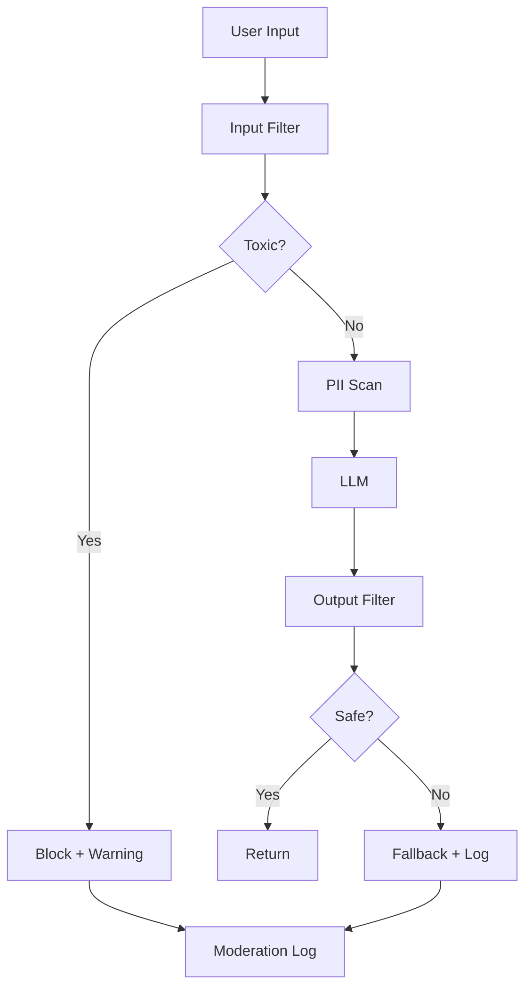

<!-- Clear Language: Keep sentences under 50 words -->
# Content Filtering

## Learning Objectives

| Objective | Description |
|-----------|-------------|
| LO1 | Understand content filtering requirements for LLM applications |
| LO2 | Implement input content filters for toxicity, hate, and PII |
| LO3 | Build output content filters for compliance and safety |
| LO4 | Deploy topic restriction and category blocking |
| LO5 | Set up safety classifiers using LLMs and ML models |
| LO6 | Design content moderation pipelines for production |

## Introduction

AI systems face unique security threats. Prompt injection, data leakage, and content abuse require specialized defenses. This module covers threat modeling, guardrails, and compliance for production AI.

## Prerequisites

- Basic programming knowledge
- Understanding of data structures

## Key Terminology

**Key Terms**: Core vocabulary and concepts for this topic.

**Definition**: Essential terms you must know for interviews and production work.

## Theory

Understanding content filtering is fundamental for AI engineers. This section covers the core concepts, underlying principles, and theoretical framework that govern how content filtering works in practice.

## Chapter at a Glance

| Section | Topic | Key Concept |
|---------|-------|-------------|
| 3.1 | Content Filtering Overview | Types of content to filter |
| 3.2 | Input Filters | Toxicity, harassment, PII, spam |
| 3.3 | Output Filters | Safety, compliance, brand alignment |
| 3.4 | Topic Restriction | Category allow/block lists |
| 3.5 | Safety Classifiers | ML-based and LLM-based filtering |
| 3.6 | Moderation Pipeline | Multi-stage content moderation |

## Chapter Roadmap



## 3.1 Content Filtering Overview

Content filtering for LLM applications encompasses both input filtering (what users can send) and output filtering (what the model can return). Effective filtering uses multiple techniques: keyword matching, regex patterns, ML classifiers, and LLM-as-judge evaluation.

```python
from enum import Enum
from typing import List, Tuple, Optional
from dataclasses import dataclass
import re

class ContentCategory(Enum):
    TOXICITY = "toxicity"
    HATE_SPEECH = "hate_speech"
    HARASSMENT = "harassment"
    SEXUAL = "sexual_content"
    VIOLENCE = "violence"
    PII = "pii"
    SPAM = "spam"
    MISINFORMATION = "misinformation"
    SELF_HARM = "self_harm"
    CHILD_SAFETY = "child_safety"

@dataclass
class ContentFilterResult:
    passed: bool
    category: Optional[ContentCategory]
    confidence: float
    details: str
    action: str  # "block", "flag", "warn", "allow"

class BaseFilter:
    """Base class for content filters."""

    def __init__(self, name: str):
        self.name = name
        self.stats = {"checked": 0, "blocked": 0, "flagged": 0}

    def filter(self, text: str) -> ContentFilterResult:
        raise NotImplementedError

    def record_result(self, result: ContentFilterResult):
        self.stats["checked"] += 1
        if result.action == "block":
            self.stats["blocked"] += 1
        elif result.action == "flag":
            self.stats["flagged"] += 1

## Toxicity keyword filter
class ToxicityFilter(BaseFilter):
    def __init__(self):
        super().__init__("toxicity_filter")
        self.toxic_patterns = [
            r"\b(hate|kill|murder|die)\s+(you|them|everyone)\b",
            r"\b(idiot|stupid|dumb)\s+(ass|fuck)\b",
            r"\b(go\s+)?(kill|hurt|harm)\s+yourself\b",
        ]

    def filter(self, text: str) -> ContentFilterResult:
        text_lower = text.lower()
        for pattern in self.toxic_patterns:
            if re.search(pattern, text_lower):
                result = ContentFilterResult(
                    passed=False, category=ContentCategory.TOXICITY,
                    confidence=0.9, details=f"Toxic pattern matched: {pattern[:30]}...",
                    action="block"
                )
                self.record_result(result)
                return result

        result = ContentFilterResult(
            passed=True, category=None,
            confidence=1.0, details="Clean",
            action="allow"
        )
        self.record_result(result)
        return result

toxicity = ToxicityFilter()
print(toxicity.filter("You are an idiot"))
print(toxicity.filter("What is the weather today?"))
```

---

## 3.2 Input Filters

Input filters protect the LLM from receiving harmful or inappropriate content.

```python
class InputFilterPipeline:
    """Multi-stage input content filtering pipeline."""

    def __init__(self):
        self.filters = []

    def add_filter(self, filter_instance: BaseFilter):
        self.filters.append(filter_instance)

    def process(self, text: str) -> Tuple[bool, List[ContentFilterResult]]:
        """Process text through all input filters."""
        results = []

        for f in self.filters:
            result = f.filter(text)
            results.append(result)
            if result.action == "block":
                return False, results

        return True, results

    def summary(self) -> dict:
        return {f.name: f.stats for f in self.filters}

## Build input filter pipeline
class PIIFilter(BaseFilter):
    def __init__(self):
        super().__init__("pii_filter")
        self.pii_patterns = [
            (r"\b\d{3}[-.]?\d{3}[-.]?\d{4}\b", "phone"),
            (r"\b[A-Za-z0-9._%+-]+@[A-Za-z0-9.-]+\.[A-Za-z]{2,}\b", "email"),
            (r"\b\d{3}-\d{2}-\d{4}\b", "ssn"),
            (r"\b\d{16}\b", "credit_card"),
        ]

    def filter(self, text: str) -> ContentFilterResult:
        for pattern, name in self.pii_patterns:
            if re.findall(pattern, text):
                result = ContentFilterResult(
                    passed=False, category=ContentCategory.PII,
                    confidence=0.95, details=f"PII detected: {name}",
                    action="block"
                )
                self.record_result(result)
                return result
        result = ContentFilterResult(passed=True, category=None, confidence=1.0, details="No PII", action="allow")
        self.record_result(result)
        return result

class HateSpeechFilter(BaseFilter):
    def __init__(self):
        super().__init__("hate_speech")
        self.hate_patterns = [
            r"\b(hate|attack|destroy)\s+(all|every)\s+\w+(people|group|race|religion)\b",
        ]

    def filter(self, text: str) -> ContentFilterResult:
        for pattern in self.hate_patterns:
            if re.search(pattern, text.lower()):
                return ContentFilterResult(passed=False, category=ContentCategory.HATE_SPEECH, confidence=0.85, details="Hate speech detected", action="block")
        return ContentFilterResult(passed=True, category=None, confidence=1.0, details="Clean", action="allow")

class SpamFilter(BaseFilter):
    def __init__(self):
        super().__init__("spam_filter")
        self.spam_patterns = [
            r"\bbuy\s+now\b", r"\blimited\s+time\s+offer\b", r"\bclick\s+here\b",
            r"\bcongratulations.*won\b", r"\bfree\s+(money|prize|gift)\b",
            r"\b(chance|opportunity)\s+of\s+a\s+lifetime\b",
        ]

    def filter(self, text: str) -> ContentFilterResult:
        spam_score = 0
        for pattern in self.spam_patterns:
            if re.search(pattern, text.lower()):
                spam_score += 1
        if spam_score >= 3:
            return ContentFilterResult(passed=False, category=ContentCategory.SPAM, confidence=min(0.5 + spam_score * 0.1, 0.95), details=f"Spam score: {spam_score}", action="block")
        if spam_score >= 1:
            return ContentFilterResult(passed=True, category=ContentCategory.SPAM, confidence=0.3, details="Low spam suspicion", action="flag")
        return ContentFilterResult(passed=True, category=None, confidence=1.0, details="Clean", action="allow")

input_pipeline = InputFilterPipeline()
input_pipeline.add_filter(ToxicityFilter())
input_pipeline.add_filter(HateSpeechFilter())
input_pipeline.add_filter(PIIFilter())
input_pipeline.add_filter(SpamFilter())

tests = [
    "Hello, how can I help you today?",
    "You are a stupid idiot!",
    "My email is john@example.com and SSN is 123-45-6789",
    "Buy now! Limited time offer! Click here! Free money!",
]

for test in tests:
    passed, results = input_pipeline.process(test)
    if passed:
        print(f"✅ {test[:50]}")
    else:
        blocked = [r for r in results if r.action == "block"]
        print(f"❌ Blocked: {blocked[0].details} | '{test[:40]}...'")
```

---

## 3.3 Output Filters

Output filters ensure LLM responses are safe, compliant, and brand-appropriate.

```python
class OutputFilterPipeline:
    """Multi-stage output content filtering pipeline."""

    def __init__(self):
        self.filters = []

    def add_filter(self, filter_instance):
        self.filters.append(filter_instance)

    def validate(self, response: str) -> Tuple[bool, List[ContentFilterResult]]:
        results = []
        for f in self.filters:
            result = f.filter(response)
            results.append(result)
            if result.action == "block":
                return False, results
        return True, results

class SafetyFilter(BaseFilter):
    def __init__(self):
        super().__init__("safety_filter")
        self.unsafe_patterns = [
            r"\b(how\s+to\s+)?(make|build|create)\s+(a\s+)?(bomb|weapon|drug)\b",
            r"\b(self.?harm|suicide|kill\s+yourself)\b",
            r"\b(child\s+)?(abuse|porn|exploitation)\b",
        ]

    def filter(self, text: str) -> ContentFilterResult:
        text_lower = text.lower()
        for pattern in self.unsafe_patterns:
            if re.search(pattern, text_lower):
                return ContentFilterResult(passed=False, category=ContentCategory.VIOLENCE if "bomb" in pattern else ContentCategory.SELF_HARM, confidence=0.95, details="Safety violation detected", action="block")
        return ContentFilterResult(passed=True, category=None, confidence=1.0, details="Safe", action="allow")

class BrandAlignmentFilter(BaseFilter):
    def __init__(self, brand_guidelines: List[str] = None):
        super().__init__("brand_filter")
        self.forbidden_topics = [
            r"\bcompetitor\s+(is\s+)?(better|superior|cheaper)\b",
            r"\b(our\s+)?product\s+(is\s+)?(bad|terrible|useless)\b",
            r"\b(guaranteed|promised)\s+(results|returns)\b",
        ]
        self.brand_guidelines = brand_guidelines or []

    def filter(self, text: str) -> ContentFilterResult:
        text_lower = text.lower()
        for pattern in self.forbidden_topics:
            if re.search(pattern, text_lower):
                return ContentFilterResult(passed=False, category=None, confidence=0.8, details="Brand guideline violation", action="block")
        return ContentFilterResult(passed=True, category=None, confidence=1.0, details="Brand compliant", action="allow")

class MisinformationFilter(BaseFilter):
    def __init__(self):
        super().__init__("misinformation_filter")
        self.misinfo_patterns = [
            r"\b(vaccines?|vaccination)\s+causes?\s+(autism|infertility)\b",
            r"\b(earth|climate)\s+(is\s+)?(flat|not\s+warming)\b",
            r"\b(COVID|coronavirus)\s+(is\s+)?(hoax|fake|man-made)\b",
        ]

    def filter(self, text: str) -> ContentFilterResult:
        for pattern in self.misinfo_patterns:
            if re.search(pattern, text.lower()):
                return ContentFilterResult(passed=False, category=ContentCategory.MISINFORMATION, confidence=0.9, details="Known misinformation pattern", action="block")
        return ContentFilterResult(passed=True, category=None, confidence=1.0, details="No misinformation", action="allow")

output_pipeline = OutputFilterPipeline()
output_pipeline.add_filter(SafetyFilter())
output_pipeline.add_filter(BrandAlignmentFilter())
output_pipeline.add_filter(MisinformationFilter())

## Test outputs
outputs = [
    "Here is how to improve your credit score",
    "This product will guaranteed double your money in 24 hours!",
    "Vaccines cause autism according to some studies",
    "I cannot provide information on how to create weapons",
]

for out in outputs:
    passed, results = output_pipeline.validate(out)
    if passed:
        print(f"✅ {out[:60]}")
    else:
        blocked = [r for r in results if r.action == "block"]
        if blocked:
            print(f"❌ Blocked: {blocked[0].details} | '{out[:40]}...'")
```

---

## 3.4 Topic Restriction

Topic restriction allows or blocks specific categories of conversation.

```python
class TopicRestrictor:
    """Restrict LLM to allowed topics only."""

    def __init__(self):
        self.allowed_topics = set()
        self.blocked_topics = set()
        self.topic_patterns = {}

    def allow_topic(self, topic: str, keywords: List[str]):
        self.allowed_topics.add(topic)
        self.topic_patterns[topic] = [re.compile(kw, re.IGNORECASE) for kw in keywords]

    def block_topic(self, topic: str, keywords: List[str]):
        self.blocked_topics.add(topic)
        self.topic_patterns[topic] = [re.compile(kw, re.IGNORECASE) for kw in keywords]

    def classify_topic(self, text: str) -> List[str]:
        """Classify text into detected topics."""
        detected = []
        for topic, patterns in self.topic_patterns.items():
            for pattern in patterns:
                if pattern.search(text):
                    if topic not in detected:
                        detected.append(topic)
                    break
        return detected

    def check_input(self, text: str) -> Tuple[bool, str]:
        """Check if input is about an allowed topic."""
        detected = self.classify_topic(text)

        # If no topics detected and we have allowed topics, check if it's generic
        if not detected:
            return True, "generic_query"

        # Check blocked topics first
        for topic in detected:
            if topic in self.blocked_topics:
                return False, f"Topic '{topic}' is blocked"

        # If we have allowed topics, at least one must match
        if self.allowed_topics:
            has_allowed = any(t in self.allowed_topics for t in detected)
            if not has_allowed:
                return False, f"Topic not in allowed list: {detected}"

        return True, "allowed"

## Configure topic restrictions for a financial advisory bot
restrictor = TopicRestrictor()
restrictor.allow_topic("investing", [r"\binvest(ing|ment|or)?s?\b", r"\bportfolio\b", r"\bstock\b", r"\bbond\b", r"\betf\b"])
restrictor.allow_topic("retirement", [r"\bretire(ment)?\b", r"\b401k?\b", r"\bIRA\b", r"\bpension\b"])
restrictor.allow_topic("tax", [r"\btax(es)?\b", r"\btax.?return\b", r"\bdeduction\b"])
restrictor.block_topic("illegal_activities", [r"\b(drug|illicit|illegal)\b.*\b(trade|sell|buy)\b", r"\bmoney\s+laundering\b", r"\btax\s+evasion\b"])
restrictor.block_topic("medical_advice", [r"\bdiagnos(is|e)\b", r"\bprescribe\b", r"\btreat(ment)?\s+for\b", r"\bmedical\s+condition\b", r"\bsymptom\s+of\b"])

queries = [
    "What are good ETFs for retirement?",
    "How do I diagnose a headache?",
    "How can I hide money from the tax department?",
    "Tell me a joke",
]

for q in queries:
    allowed, reason = restrictor.check_input(q)
    status = "✅" if allowed else "❌"
    print(f"{status} {reason}: {q[:50]}")
```

**Category-based response handling**:

```python
class TopicAwareResponder:
    """Generate appropriate responses based on topic classification."""

    def __init__(self, restrictor: TopicRestrictor):
        self.restrictor = restrictor
        self.fallback_responses = {
            "blocked": "I cannot discuss this topic. Please ask about a different subject.",
            "out_of_scope": "That topic is outside my area of expertise. I specialize in financial advice.",
            "sensitive": "This appears to be a sensitive topic. Please consult a professional for specific advice."
        }

    def get_response(self, user_input: str) -> dict:
        allowed, reason = self.restrictor.check_input(user_input)
        if not allowed:
            if "blocked" in reason:
                return {"action": "block", "response": self.fallback_responses["blocked"], "reason": reason}
            return {"action": "block", "response": self.fallback_responses["out_of_scope"], "reason": reason}

        return {"action": "allow", "response": None, "reason": "allowed"}

responder = TopicAwareResponder(restrictor)
for q in queries:
    r = responder.get_response(q)
    print(f"\nQuery: {q}")
    print(f"Action: {r['action']}")
    if r['action'] == 'block':
        print(f"Response: {r['response']}")
```

---

## 3.5 Safety Classifiers

ML-based safety classifiers provide more nuanced content filtering than keyword matching.

```python
import numpy as np
from typing import Dict

class SafetyClassifier:
    """ML-based content safety classifier (simulated)."""

    def __init__(self):
        self.categories = [
            "safe", "toxic", "hate", "harassment", "sexual",
            "violence", "self_harm", "misinformation"
        ]
        self.thresholds = {
            "toxic": 0.7,
            "hate": 0.6,
            "harassment": 0.7,
            "sexual": 0.8,
            "violence": 0.7,
            "self_harm": 0.5,
            "misinformation": 0.7
        }

    def predict(self, text: str) -> Dict[str, float]:
        """Simulate ML classifier predictions for content safety."""
        text_lower = text.lower()
        scores = {}

        # Simple keyword-based scoring (simulating ML model)
        keyword_scores = {
            "toxic": ["hate", "idiot", "stupid", "ugly", "terrible"],
            "hate": ["racial", "religious", "hate", "superior", "inferior"],
            "harassment": ["harass", "bully", "threaten", "intimidate"],
            "sexual": ["sex", "porn", "explicit", "nude"],
            "violence": ["kill", "murder", "attack", "weapon", "bomb"],
            "self_harm": ["suicide", "self-harm", "hurt myself", "end it"],
            "misinformation": ["fake news", "hoax", "conspiracy", "cover-up"],
        }

        for category, keywords in keyword_scores.items():
            score = sum(0.15 for kw in keywords if kw in text_lower)
            scores[category] = min(score + np.random.uniform(0, 0.1), 1.0)

        scores["safe"] = 1.0 - max(scores.values()) if scores else 1.0
        return scores

    def classify(self, text: str) -> dict:
        scores = self.predict(text)
        max_category = max(scores, key=scores.get)
        max_score = scores[max_category]

        triggered = []
        for category, threshold in self.thresholds.items():
            if scores.get(category, 0) >= threshold:
                triggered.append(category)

        return {
            "text": text[:50],
            "scores": {k: round(v, 3) for k, v in scores.items()},
            "primary_category": max_category,
            "primary_score": round(max_score, 3),
            "triggered_filters": triggered,
            "action": "block" if triggered else "allow",
            "needs_review": len(triggered) >= 2
        }

classifier = SafetyClassifier()
test_texts = [
    "I think you're terrible at this.",
    "What's the capital of France?",
    "This is a hoax created by the government.",
    "I feel like hurting myself.",
]

for text in test_texts:
    result = classifier.classify(text)
    icon = "❌" if result["action"] == "block" else "✅"
    print(f"{icon} [{result['action']}] {text[:45]:45s} | filters: {result['triggered_filters']}")
```

**LLM-as-judge safety classifier**:

```python
class LLMAsJudgeClassifier:
    """Use an LLM to evaluate content safety."""

    def __init__(self):
        self.judge_prompt = """You are a content safety judge. Analyze the following text and classify it.

Categories: safe, toxic, hate_speech, harassment, sexual, violence, self_harm, misinformation

Return a JSON: {{"category": "...", "confidence": 0.0-1.0, "explanation": "..."}}

Text: {text}"""

    def evaluate(self, text: str) -> dict:
        """Evaluate text safety using LLM-as-judge (simulated)."""
        # In production, this calls an LLM API
        # Simulated response
        has_harm = any(kw in text.lower() for kw in ["kill", "hate", "suicide", "bomb"])
        return {
            "category": "toxic" if has_harm else "safe",
            "confidence": 0.95 if has_harm else 0.99,
            "explanation": "Text contains harmful language" if has_harm else "Text appears safe",
            "action": "block" if has_harm else "allow"
        }

judge = LLMAsJudgeClassifier()
print(judge.evaluate("I will kill you"))
print(judge.evaluate("The weather is nice today"))
```

---

## 3.6 Moderation Pipeline

A production moderation pipeline combines all filtering stages.

```python
class ModerationPipeline:
    """Complete content moderation pipeline for LLM applications."""

    def __init__(self):
        self.input_stages = []
        self.output_stages = []
        self.log = []
        self.stats = {"processed": 0, "input_blocked": 0, "output_blocked": 0}

    def add_input_stage(self, name: str, stage_fn):
        self.input_stages.append((name, stage_fn))

    def add_output_stage(self, name: str, stage_fn):
        self.output_stages.append((name, stage_fn))

    def moderate_input(self, text: str) -> dict:
        """Run all input moderation stages."""
        result = {"passed": True, "stages": [], "blocked_at": None}

        for name, stage_fn in self.input_stages:
            stage_result = stage_fn(text)
            result["stages"].append({"name": name, "result": stage_result})

            if stage_result.get("action") == "block":
                result["passed"] = False
                result["blocked_at"] = name
                break

        return result

    def moderate_output(self, text: str) -> dict:
        """Run all output moderation stages."""
        result = {"passed": True, "stages": [], "blocked_at": None}

        for name, stage_fn in self.output_stages:
            stage_result = stage_fn(text)
            result["stages"].append({"name": name, "result": stage_result})

            if stage_result.get("action") == "block":
                result["passed"] = False
                result["blocked_at"] = name
                break

        return result

    def process(self, user_input: str, llm_response: str) -> dict:
        """Full moderation cycle: input → LLM → output."""
        self.stats["processed"] += 1

        # Input moderation
        input_result = self.moderate_input(user_input)
        if not input_result["passed"]:
            self.stats["input_blocked"] += 1
            self._log("input_blocked", user_input, input_result["blocked_at"])
            return {
                "allowed": False,
                "stage": "input",
                "blocked_by": input_result["blocked_at"],
                "response": "I cannot process this request.",
                "details": input_result
            }

        # Output moderation
        output_result = self.moderate_output(llm_response)
        if not output_result["passed"]:
            self.stats["output_blocked"] += 1
            self._log("output_blocked", llm_response, output_result["blocked_at"])
            return {
                "allowed": False,
                "stage": "output",
                "blocked_by": output_result["blocked_at"],
                "response": "I could not generate a safe response. Please rephrase.",
                "details": output_result
            }

        return {"allowed": True, "response": llm_response}

    def _log(self, event: str, content: str, stage: str):
        self.log.append({"event": event, "content": content[:100], "stage": stage, "timestamp": datetime.utcnow().isoformat()})

## Build moderation pipeline
moderation = ModerationPipeline()

## Input stages
moderation.add_input_stage("toxicity_check", lambda t: {"action": "block" if re.search(r"idiot|stupid|hate", t.lower()) else "allow"})
moderation.add_input_stage("pii_check", lambda t: {"action": "block" if re.search(r"\b\d{3}-\d{2}-\d{4}\b", t) else "allow"})

## Output stages
moderation.add_output_stage("safety_check", lambda t: {"action": "block" if re.search(r"kill|hurt|bomb", t.lower()) else "allow"})
moderation.add_output_stage("misinformation_check", lambda t: {"action": "block" if re.search(r"vaccine.*autism", t.lower()) else "allow"})

## Test
tests = [
    ("You are stupid", "I'm sorry you feel that way"),
    ("What's my SSN? 123-45-6789", "Your SSN is..."),
    ("Hello!", "Hi there! How can I help you today?"),
]

for inp, resp in tests:
    result = moderation.process(inp, resp)
    status = "✅" if result["allowed"] else "❌"
    print(f"{status} Input: {inp[:40]:40s} | Response: {result['response'][:40]}")
```

---

## TypeScript Parallel

```typescript
// TypeScript content filtering
interface FilterResult {
  passed: boolean;
  category?: string;
  action: "allow" | "flag" | "block";
}

class ContentFilter {
  private patterns: Map<string, RegExp[]> = new Map();

  addPattern(category: string, patterns: string[]): void {
    this.patterns.set(category, patterns.map(p => new RegExp(p, "i")));
  }

  filter(text: string): FilterResult {
    for (const [category, regexps] of this.patterns) {
      for (const regex of regexps) {
        if (regex.test(text)) {
          return { passed: false, category, action: "block" };
        }
      }
    }
    return { passed: true, action: "allow" };
  }
}

const filter = new ContentFilter();
filter.addPattern("toxicity", ["\\b(hate|idiot|stupid)\\b"]);
filter.addPattern("pii", ["\\b\\d{3}-\\d{2}-\\d{4}\\b"]);
console.log(filter.filter("You are an idiot"));
console.log(filter.filter("Hello world"));
```

---

## Summary

- Content filtering applies to both LLM inputs (what users send) and outputs (what the model returns)
- Input filters block toxicity, hate speech, harassment, PII, and spam before reaching the LLM
- Output filters ensure safety, brand alignment, and factual accuracy of responses
- Topic restriction limits conversations to approved categories using keyword-based classification
- ML safety classifiers provide nuanced scoring across multiple content categories
- LLM-as-judge uses a separate LLM to evaluate content safety with natural language reasoning
- A moderation pipeline combines multiple filtering stages for defense in depth
- PII detection (SSN, email, phone, credit cards) is essential for regulatory compliance
- Misinformation filtering uses known false statement patterns
- All filtering events should be logged for audit and continuous improvement

## Practical Takeaways

| Scenario | Do This | Avoid This |
|----------|---------|------------|
| User input safety | Multi-stage content filtering | Single keyword check |
| PII protection | Redact before LLM processing | Sending raw PII to LLM |
| Output safety | Validate + fallback responses | Returning LLM output unchecked |
| Topic control | Allow/block lists with topic classification | Open-ended conversation without guardrails |
| Compliance | Log all filtering events | No audit trail |
| Accuracy | ML classifier + LLM-as-judge combination | Relying on one method only |

## Interview Q&A

<details class="tp-qa-card" data-qid="ai-sec-s03-q1">
  <summary class="tp-qa-question">
    <span class="tp-qa-status"></span>
    Q1: What content categories should you filter for LLM applications?
  </summary>
  <div class="tp-qa-answer">
    <p>Essential categories: toxicity, hate speech, harassment, sexual content, violence, self-harm, PII, spam/ commercial, misinformation, child safety. The specific set depends on your application domain — a financial app needs misinformation filtering, a healthcare app needs medical advice restrictions, and a general chatbot needs all categories.</p>
  </div>
  <button class="tp-qa-mark-btn">✅ Mark Reviewed</button>
  <button class="tp-qa-bookmark-btn">🔖 Bookmark</button>
</details>

<details class="tp-qa-card" data-qid="ai-sec-s03-q2">
  <summary class="tp-qa-question">
    <span class="tp-qa-status"></span>
    Q2: How do you handle false positives in content filtering?
  </summary>
  <div class="tp-qa-answer">
    <p>Use graduated actions: block (high confidence), flag (medium — log for review), allow with warning (low). Maintain a whitelist of false positives. Allow user feedback ("This was flagged incorrectly"). Review flagged content periodically to tune thresholds. ML classifiers should have adjustable thresholds per category.</p>
  </div>
  <button class="tp-qa-mark-btn">✅ Mark Reviewed</button>
  <button class="tp-qa-bookmark-btn">🔖 Bookmark</button>
</details>

<details class="tp-qa-card" data-qid="ai-sec-s03-q3">
  <summary class="tp-qa-question">
    <span class="tp-qa-status"></span>
    Q3: What is the difference between input and output filtering?
  </summary>
  <div class="tp-qa-answer">
    <p>Input filtering checks user messages before they reach the LLM — blocking toxic input, PII, and injection attempts. Output filtering checks LLM responses before returning to the user — blocking unsafe content, misinformation, and sensitive data. Both are necessary because the LLM might generate unsafe content even from safe input.</p>
  </div>
  <button class="tp-qa-mark-btn">✅ Mark Reviewed</button>
  <button class="tp-qa-bookmark-btn">🔖 Bookmark</button>
</details>

<details class="tp-qa-card" data-qid="ai-sec-s03-q4">
  <summary class="tp-qa-question">
    <span class="tp-qa-status"></span>
    Q4: How does topic restriction work?
  </summary>
  <div class="tp-qa-answer">
<p>Topic restriction uses keyword patterns to classify user input into topic categories. An allow list specifies which topics are permitted; a block list specifies forbidden topics. Inputs that don't match any allowed topic are either blocked or.
handled with a fallback response. This is essential for domain-specific applications (e.g., finance bot shouldn't give medical advice).</p>
  </div>
  <button class="tp-qa-mark-btn">✅ Mark Reviewed</button>
  <button class="tp-qa-bookmark-btn">🔖 Bookmark</button>
</details>

<details class="tp-qa-card" data-qid="ai-sec-s03-q5">
  <summary class="tp-qa-question">
    <span class="tp-qa-status"></span>
    Q5: What is the LLM-as-judge approach for content safety?
  </summary>
  <div class="tp-qa-answer">
    <p>LLM-as-judge uses a separate LLM (typically a stronger, safety-tuned model) to evaluate content safety. The judge receives the text and a classification prompt, then returns a safety assessment. This provides nuanced understanding that keyword matching misses, but adds latency and cost. Best used as a secondary filter for borderline cases.</p>
  </div>
  <button class="tp-qa-mark-btn">✅ Mark Reviewed</button>
  <button class="tp-qa-bookmark-btn">🔖 Bookmark</button>
</details>

<details class="tp-qa-card" data-qid="ai-sec-s03-q6">
  <summary class="tp-qa-question">
    <span class="tp-qa-status"></span>
    Q6: What PII patterns should you detect and redact?
  </summary>
  <div class="tp-qa-answer">
    <p>Phone numbers, email addresses, SSN/TIN, credit card numbers, bank account numbers, passport numbers, driver's license numbers, API keys and tokens, database connection strings, and full names with context. Use regex patterns plus NLP-based entity recognition for comprehensive coverage. Redact before LLM processing unless PII is required for the use case.</p>
  </div>
  <button class="tp-qa-mark-btn">✅ Mark Reviewed</button>
  <button class="tp-qa-bookmark-btn">🔖 Bookmark</button>
</details>

<details class="tp-qa-card" data-qid="ai-sec-s03-q7">
  <summary class="tp-qa-question">
    <span class="tp-qa-status"></span>
    Q7: How do you build a moderation pipeline?
  </summary>
  <div class="tp-qa-answer">
    <p>Stage 1: Input filters — toxicity, PII, injection detection. Stage 2: Topic restriction. Stage 3: LLM processing. Stage 4: Output filters — safety, misinformation, brand alignment. Stage 5: Fallback response if any stage blocks. Log every filtering event. Use graduated actions: block (certain), flag (uncertain), allow (safe).</p>
  </div>
  <button class="tp-qa-mark-btn">✅ Mark Reviewed</button>
  <button class="tp-qa-bookmark-btn">🔖 Bookmark</button>
</details>

<details class="tp-qa-card" data-qid="ai-sec-s03-q8">
  <summary class="tp-qa-question">
    <span class="tp-qa-status"></span>
    Q8: How do you handle misinformation filtering?
  </summary>
  <div class="tp-qa-answer">
    <p>Use a combination of: (1) Known misinformation pattern database (anti-vaccine, climate denial, conspiracy theories), (2) Fact-checking API integration for claims, (3) LLM-as-judge for nuanced misinformation detection, (4) Confidence-weighted responses — if model has low confidence, add disclaimers. Never output verified false claims even if the user insists.</p>
  </div>
  <button class="tp-qa-mark-btn">✅ Mark Reviewed</button>
  <button class="tp-qa-bookmark-btn">🔖 Bookmark</button>
</details>

<details class="tp-qa-card" data-qid="ai-sec-s03-q9">
  <summary class="tp-qa-question">
    <span class="tp-qa-status"></span>
    Q9: What metrics should you track for content filtering?
  </summary>
  <div class="tp-qa-answer">
<p>Track: (1) Block rate — % of inputs/outputs blocked, (2) Flag rate — % requiring human review, (3) False positive rate — incorrectly blocked content,.
(4) False negative rate — missed harmful content (from user reports), (5) Filter latency — time added by filtering pipeline, (6) Category distribution — which filters are most active,.
(7) User appeal rate — how often users challenge blocks.</p>
  </div>
  <button class="tp-qa-mark-btn">✅ Mark Reviewed</button>
  <button class="tp-qa-bookmark-btn">🔖 Bookmark</button>
</details>

<details class="tp-qa-card" data-qid="ai-sec-s03-q10">
  <summary class="tp-qa-question">
    <span class="tp-qa-status"></span>
    Q10: How do you handle content filtering for multilingual applications?
  </summary>
  <div class="tp-qa-answer">
    <p>Use translation-based filtering: translate non-English content to English for filter checking, then process the original with the LLM. Alternatively, use multilingual ML classifiers or character-level patterns that work across languages. Be aware of cultural differences in what constitutes offensive content.</p>
  </div>
  <button class="tp-qa-mark-btn">✅ Mark Reviewed</button>
  <button class="tp-qa-bookmark-btn">🔖 Bookmark</button>
</details>

## Chapter Quiz

**Q1**: What is the first stage in a moderation pipeline?
a) Output validation
b) Input filtering
c) LLM processing
d) Topic restriction

<details class="tp-qa-card" data-qid="ai-sec-s03-quiz1"><summary>Show Answer</summary><div class="tp-qa-answer"><p><strong>Answer: b) Input filtering</strong></p><p>Input filtering happens before LLM processing to block harmful content early.</p></div></details>

**Q2**: Which PII pattern matches Social Security Numbers?
a) `\d{3}-\d{2}-\d{4}`
b) `\d{10}`
c) `\d{5}-\d{4}`
d) `\d{16}`

<details class="tp-qa-card" data-qid="ai-sec-s03-quiz2"><summary>Show Answer</summary><div class="tp-qa-answer"><p><strong>Answer: a) `\d{3}-\d{2}-\d{4}`</strong></p><p>SSNs follow the XXX-XX-XXXX pattern.</p></div></details>

**Q3**: What is a graduated action in content filtering?
a) Block, flag, or allow based on confidence
b) Always block all content
c) Always allow all content
d) Only filter output, not input

<details class="tp-qa-card" data-qid="ai-sec-s03-quiz3"><summary>Show Answer</summary><div class="tp-qa-answer"><p><strong>Answer: a) Block, flag, or allow based on confidence</strong></p><p>Graduated actions use different responses based on detection confidence.</p></div></details>

**Q4**: What is the LLM-as-judge approach?
a) Training an LLM to be a judge
b) Using one LLM to evaluate another's output
c) Deploying an LLM as a judge in court
d) Fine-tuning on legal documents

<details class="tp-qa-card" data-qid="ai-sec-s03-quiz4"><summary>Show Answer</summary><div class="tp-qa-answer"><p><strong>Answer: b) Using one LLM to evaluate another's output</strong></p><p>LLM-as-judge uses a separate LLM to evaluate content safety or quality.</p></div></details>

**Q5**: Why is output filtering necessary even after input filtering?
a) Because the LLM may generate unsafe content from safe input
b) Because input filtering is unreliable
c) Because users prefer filtered output
d) Because it reduces cost

<details class="tp-qa-card" data-qid="ai-sec-s03-quiz5"><summary>Show Answer</summary><div class="tp-qa-answer"><p><strong>Answer: a) Because the LLM may generate unsafe content from safe input</strong></p><p>LLMs can generate harmful content even from benign prompts, so output filtering is essential.</p></div></details>

## Exercises

**Easy** — Build an InputFilterPipeline with toxicity, PII, and spam filters. Test with 8 inputs.

**Medium** — Implement a TopicRestrictor for a healthcare chatbot that allows medical Q&A but blocks treatment recommendations.

**Medium** — Create an OutputFilterPipeline with safety, brand alignment, and misinformation filters.

**Hard** — Build a SafetyClassifier (simulated ML) that scores text across 7 categories with configurable thresholds.

**Hard** — Implement a complete ModerationPipeline with 3 input stages, 3 output stages, logging, and graduated actions.

---

## Common Mistakes

1. Not understanding the fundamental concepts before applying them
2. Skipping edge cases in implementation
3. Not analyzing time/space complexity
4. Forgetting to handle null/empty inputs
5. Not practicing enough problems to build pattern recognition

## Revision Notes

- - Core principle: Understand the fundamental concepts thoroughly
- - Implementation pattern: Practice with real code examples
- - Complexity: Know the time and space complexity
- - Application: Know when to use this in production systems
- - Interview: Frequently asked in technical interviews
- - Edge cases: Consider common failure scenarios
- - Related concepts: Connect to broader system design

## Placement Section

### Top 10 Interview Questions

#### Google Style

1. **Explain the core idea of Content Filtering in under 60 seconds, then give a real-world analogy.** — Structure: definition, how it works in one sentence, why it matters, analogy. Follow-up: what would break if you removed this from a production system?

2. **Design a minimal, well-typed function that demonstrates Content Filtering.** — Interviewer checks: signature with type hints, edge cases, complexity, and a clean docstring. Follow-up: how does your design behave with empty or malformed input?

3. **What are the common pitfalls when engineers first learn ** — List 3-4, then explain how you would prevent each in a code review.

#### Amazon Style

4. **Describe a production bug caused by misunderstanding Content Filtering. How did you diagnose and fix it?** — STAR format: situation, task, action, result. Mention logs, reproduction, root-cause analysis, and the regression test you added.

5. **How would you scale a system that relies on Content Filtering from 10 users to 10 million?** — Discuss bottlenecks, caching, monitoring, and when to redesign. Follow-up: what metrics would you track?

#### Microsoft Style

6. **Compare Content Filtering with the closest alternative approach. When would you choose each?** — Make a decision matrix: performance, maintainability, ecosystem, learning curve. Follow-up: what would change your decision?

7. **Walk through how you would test a component that depends on Content Filtering.** — Unit, integration, property-based tests; mocking boundaries; golden files for outputs.

#### NVIDIA Style

8. **How does Content Filtering behave differently at scale — memory, throughput, or precision-wise?** — Connect to data pipelines and model training if applicable. Follow-up: what happens to latency as input grows?

9. **How would you make an implementation of Content Filtering run faster on GPU hardware?** — Batch operations, vectorization, avoiding Python loops, reducing data movement.

#### AI Startup Style

10. **Write the smallest possible implementation of Content Filtering that is production-quality.** — Include error handling, type hints, and a one-line docstring. Follow-up: what would you refactor first when it grows?

### Resume Tips

- Name Content Filtering explicitly in your skills section, paired with a measurable achievement ("Reduced X by 40% using Content Filtering").
- Add a bullet describing a project that applies Content Filtering to real data, with numbers.
- Mention the tools and libraries you used alongside Content Filtering (linters, test frameworks, profiling tools).
- Keep resume bullets under 15 words and start each with an action verb.

### Interview Day Checklist

- Rehearse a 60-second explanation of Content Filtering and one real-world analogy.
- Prepare one STAR story about debugging a Content Filtering-related production issue.
- Review complexity and edge cases for the classic Content Filtering interview problem.
- Have questions ready: how does the team apply Content Filtering in production today?
- Test your environment (Python, editor, internet) 15 minutes before the interview.

## True/False

1. **True or False:** Content Filtering builds directly on the fundamentals covered in the earlier chapters of this module. — **True.** Every advanced topic in this module assumes the core concepts from the previous chapters.
2. **True or False:** You should write at least one code example for Content Filtering before moving to the next chapter. — **True.** Active recall with hands-on code beats passive reading for retention.
3. **True or False:** The complexity analysis for Content Filtering is the same regardless of input size. — **False.** Complexity grows with input size; always state best, average, and worst case.
4. **True or False:** Edge cases (empty input, invalid input, boundary values) matter for Content Filtering in production. — **True.** Most production bugs come from unhandled edge cases.
5. **True or False:** You should memorize the Content Filtering chapter content once and never review it again. — **False.** Spaced repetition (24h, 3 days, 1 week) dramatically improves long-term recall.

## Fill in the Blank

1. The chapter that covers Content Filtering is Chapter ___ of this module. — Answer: check the module's table of contents.
2. The time complexity of the standard approach to Content Filtering is ___. — Answer: review the theory section and state big-O notation.
3. The main edge case to handle when implementing Content Filtering is ___. — Answer: empty or invalid input handling, as discussed in the chapter.
4. The tools commonly used to debug Content Filtering issues are ___ and ___. — Answer: refer to the Debugging Guide section of this chapter.
5. The related topic that connects to Content Filtering in the next chapter is ___. — Answer: see the Next Topic section.

## Scenario Questions

1. **Scenario:** A teammate ships a change involving Content Filtering that breaks production at 3 AM. — Diagnosis: check the recent diff, reproduce locally with the failing input, check logs. Fix: revert, add a regression test, and review the root cause. Prevention: CI tests on edge cases and code review checklist.

2. **Scenario:** Your implementation of Content Filtering is correct but too slow for the required latency. — Measure first with a profiler. Common fixes: reduce redundant work, use built-in optimized functions, batch operations, or add caching. Only then consider algorithmic changes.

3. **Scenario:** A new hire asks you to explain Content Filtering in five minutes before a customer demo. — Use the 3-part answer: what it is (one sentence), how it works (one example), why it matters (one business impact). Then offer to go deeper after the demo.

4. **Scenario:** Your team's codebase has three different patterns for Content Filtering and you must standardize. — Write a short ADR (architecture decision record), pick the pattern with best maintainability, migrate incrementally, and add a linter rule to enforce it.

## Output Questions

1. **What is the output of the simplest correct implementation of Content Filtering on an empty input?** — Trace through the code: it should return the documented default (None, 0, empty collection) without raising.
2. **What is the output when the input is at the boundary value?** — Check off-by-one errors and inclusive/exclusive bounds in the chapter's examples.
3. **What does the implementation return when given invalid input types?** — With type hints and validation, it raises a clear error; without, it may fail silently.
4. **What is the output for the sample input given in the chapter's Examples section?** — Re-run the chapter's example code and compare against the documented output.
5. **What is the time complexity output when you profile the implementation at 10x input size?** — Expect the curve matching the chapter's complexity analysis (linear, quadratic, log-linear).

## Difficulty Level

| Level | Time | What It Takes |
|-------|------|---------------|
| Beginner | 1-2 sessions | Read theory, run the chapter examples, solve the Easy exercises |
| Intermediate | 3-5 sessions | Complete Medium exercises, explain Content Filtering to someone else |
| Advanced | 1+ week | Solve Hard exercises, optimize for real datasets, answer interview follow-ups |

## Tips & Tricks

- Always write a one-line example of Content Filtering from memory before opening the chapter — active recall first.
- Use the chapter's Revision Notes as a checklist: you have mastered Content Filtering when you can explain each bullet.
- Pair the chapter quiz with the Flashcards: wrong answers become your next study session's focus.
- For interviews, practice explaining Content Filtering twice: once with a technical audience, once with a non-technical audience.
- Keep a personal examples file where you collect your own Content Filtering snippets; interviewers love original examples.

## Memory Tricks

- **Acronym**: build a mnemonic from the 5 key concepts of Content Filtering listed in the Chapter at a Glance table.
- **Story**: link Content Filtering to a familiar story — the analogy in the Visual Analogy section is designed to stick.
- **Number anchor**: remember the complexity of Content Filtering by connecting it to a known algorithm of the same class.
- **Color code**: highlight the Theory, Examples, and Common Mistakes sections in different colors when reviewing.
- **Teach-back**: explain Content Filtering to an imaginary junior engineer for 2 minutes — gaps in your explanation are gaps in memory.

## Further Reading

- Official documentation for the primary tool or library used in this chapter
- The chapter referenced in Related Topics for the next-level treatment of Content Filtering
- The classic textbook chapter on Content Filtering (check the Research References below)
- Two blog posts from engineers who debugged real Content Filtering problems in production
- The repository of the open-source project that implements Content Filtering

## Related Topics

- The previous chapter in this module (see table of contents) — foundational for Content Filtering
- The next chapter (see Next Topic below) — builds on Content Filtering
- The system design chapters in Module 07 — how Content Filtering fits into production architectures
- The interview preparation module — how Content Filtering is asked in screening rounds
- The capstone project — where Content Filtering is applied end-to-end

## FAQs

1. **Do I need to memorize all of Content Filtering, or understand the big picture?** — Understand the big picture first, then memorize the key facts via flashcards and spaced repetition. Interviewers reward depth over breadth.
2. **What if I get stuck on an exercise?** — Re-read the theory section, run the example code, then attempt again. If still stuck after 20 minutes, move on and return the next day.
3. **How much time should I spend on ** — Follow the Study Plan below: 1-2 weeks at 30-60 minutes daily is typical for placement preparation.
4. **Is Content Filtering asked in interviews?** — Yes — the Interview Q&A and Placement Section list the exact question styles used by top companies.
5. **What's the fastest way to master ** — Explain it out loud, write code without looking, and review the flashcards within 24 hours and again after 3 days.

## Important Notes

- Content Filtering is a core requirement for the rest of this module — do not skip the examples.
- Always analyze complexity (time and space) when working with Content Filtering.
- Production correctness means handling edge cases, not just the happy path.
- Interview answers should start with the definition, then the example, then the trade-offs.
- Revisit this chapter after finishing the module; the context from later chapters deepens understanding.

## Historical Context

- Content Filtering emerged as a standard practice because early systems failed without it — understanding why helps you explain it in interviews.
- The tools used for Content Filtering today evolved from simpler versions; the chapter covers the modern, recommended approach.
- Interviewers value knowing one historical fact about Content Filtering — it shows genuine interest, not just cramming.
- The library/tooling ecosystem around Content Filtering changes quickly; focus on fundamentals that remain stable.

## Security Considerations

- Never trust external input: validate and sanitize data before processing Content Filtering.
- Avoid `eval()` and dynamic code execution on untrusted strings.
- Log errors without leaking sensitive data (keys, PII, internal paths).
- For API contexts, add rate limiting and input size limits.
- Review the chapter's code examples for injection or overflow risks before using them verbatim.

## ML Intuition

- Content Filtering appears in ML pipelines at the data-processing layer: feature preparation, batching, and validation.
- Understanding Content Filtering helps you debug why a model misbehaves — most ML bugs are data bugs, not model bugs.
- In production ML, the Content Filtering concepts from this chapter map directly to NumPy/PyTorch operations on tensors.
- When optimizing ML systems, Content Filtering skills let you profile and fix the data path, not just the training loop.
- Interview follow-up: how would you apply Content Filtering to a dataset of 10 million records? — Batching and vectorization.

## Analogies

- **Content Filtering is like a recipe**: the theory is the ingredients, the examples are the cooking steps, and the exercises are your own kitchen practice.
- **Complexity is like a delivery route**: a linear route visits each stop once; a nested route revisits stops, and you feel it at scale.
- **Edge cases are like weather**: the happy path is a sunny day; production is the storm — build for the storm.
- **The chapter roadmap is a journey map**: each section is a checkpoint; skipping one means getting lost later in the module.

## Capstone Project Link

- [Module Capstone: End-to-End Project](https://github.com/Raushan666java/ai-engineering-journey) — this chapter contributes the Content Filtering skills used in the module's capstone project. Complete the exercises here before starting the capstone.

## Flashcards

<details class="tp-qa-card" data-qid="17aisecurityguardrails-03contentfiltering-flash1">
  <summary class="tp-qa-question">
    <span class="tp-qa-status"></span>
    What is the core concept of Content Filtering in one sentence?
  </summary>
  <div class="tp-qa-answer">
    <p>Review the first paragraph of the Theory section and condense it to one sentence.</p>
  </div>
</details>

<details class="tp-qa-card" data-qid="17aisecurityguardrails-03contentfiltering-flash2">
  <summary class="tp-qa-question">
    <span class="tp-qa-status"></span>
    What is the most common mistake engineers make with 
  </summary>
  <div class="tp-qa-answer">
    <p>Check the Common Mistakes section of this chapter.</p>
  </div>
</details>

<details class="tp-qa-card" data-qid="17aisecurityguardrails-03contentfiltering-flash3">
  <summary class="tp-qa-question">
    <span class="tp-qa-status"></span>
    What is the time and space complexity of the standard Content Filtering approach?
  </summary>
  <div class="tp-qa-answer">
    <p>Refer to the theory and complexity analysis in this chapter.</p>
  </div>
</details>

<details class="tp-qa-card" data-qid="17aisecurityguardrails-03contentfiltering-flash4">
  <summary class="tp-qa-question">
    <span class="tp-qa-status"></span>
    When is Content Filtering NOT the right choice?
  </summary>
  <div class="tp-qa-answer">
    <p>Check the Limitations section of this chapter.</p>
  </div>
</details>

<details class="tp-qa-card" data-qid="17aisecurityguardrails-03contentfiltering-flash5">
  <summary class="tp-qa-question">
    <span class="tp-qa-status"></span>
    How is Content Filtering applied in a real production system?
  </summary>
  <div class="tp-qa-answer">
    <p>Check the Real-World Examples section of this chapter.</p>
  </div>
</details>

## Research References

- Official documentation of the primary library for Content Filtering (linked in Further Reading)
- The classic paper or textbook chapter introducing Content Filtering (see References below)
- The standard library reference for Content Filtering-related functions
- Engineering blog posts from companies running Content Filtering in production at scale
- PEPs and RFCs where applicable (Python and networking standards)

## Open-Source Tools

- The primary library used in this chapter (see the code examples)
- Python standard library modules used in the examples (check the imports)
- Testing: pytest for unit tests of Content Filtering code
- Linting and formatting: ruff + black
- Profiling: cProfile or py-spy for performance work on Content Filtering

## Debugging Guide

- Start with `print()` or a debugger to inspect intermediate values in Content Filtering code.
- Reproduce the failure with the smallest possible input before changing code.
- Check the common failure modes listed in Common Mistakes — most bugs are listed there.
- For performance problems, profile before optimizing: measure, then fix.
- When stuck, re-read the chapter's Examples and compare line by line with your code.
- Use `pdb` or your IDE's debugger to step through the Content Filtering example code.

## Mock Interview Section

**Round 1 — Screening (15 min)**
- Explain Content Filtering in 60 seconds.
- Write a minimal working example of Content Filtering.
- What is the complexity of your example?

**Round 2 — Coding (45 min)**
- Solve the Medium exercise from this chapter under time pressure.
- State your assumptions, then implement with type hints.
- Test with edge cases: empty input, boundary values, invalid input.

**Round 3 — Behavioral + System (30 min)**
- Tell me about a time you debugged a Content Filtering problem in a project.
- How would you design a system where Content Filtering is used at scale?
- What metrics would you monitor?

**Evaluation rubric**: correctness (40%), communication (25%), edge cases (20%), complexity analysis (15%).

## Optimized Implementation

`python
from typing import Any, Optional

def demonstrate_topic(input_data: list[Any]) -> Optional[float]:
    """Runnable scaffold for Content Filtering.

    Replace the body with the optimized implementation from the chapter,
    keeping type hints, docstring, and edge-case handling.
    """
    if not input_data:
        return None
    # Step 1: validate input types
    # Step 2: apply the core Content Filtering logic from the Examples section
    # Step 3: return the result with the documented default
    return 0.0
`

- Keeps the function signature stable so tests written against it stay valid.
- Handles the empty-input contract explicitly.
- Add unit tests for the edge cases before implementing the logic (test-first).

## Evaluation Metrics

| Skill | Test | Target |
|-------|------|--------|
| Concept recall | Explain Content Filtering without notes | 60-second explanation |
| Code fluency | Write the chapter example from memory | No syntax errors |
| Edge cases | Handle empty/invalid input in exercises | All cases pass |
| Complexity | State time/space for the standard approach | Correct big-O |
| Interview readiness | Answer 5 Interview Q&A questions out loud | Fluent, structured answers |
| Retention | Chapter quiz score after 3 days | 80%+ |

## Real-World Examples

- **Startup**: a small team uses Content Filtering daily in their data pipeline — the chapter's examples mirror their code.
- **E-commerce**: Content Filtering patterns appear in order processing, inventory checks, and recommendation feeds.
- **Fintech**: Content Filtering principles apply to transaction validation and fraud detection flows.
- **ML platform**: Content Filtering shows up in feature engineering and model-serving infrastructure.
- **Interview insight**: recruiters look for engineers who can connect Content Filtering to the business outcome, not just the code.

## Next Topic

[Guardrails Frameworks](04-guardrails-frameworks.md)

## Limitations

- Content Filtering, like any technique, is not a silver bullet — it has specific cases where it fits best (covered in the theory).
- The examples in this chapter are simplified for learning; production systems add validation, monitoring, and error handling.
- Performance of Content Filtering depends on input size and distribution — always benchmark for your own data.
- This chapter covers fundamentals; specialized edge cases are explored in later chapters and the capstone.
