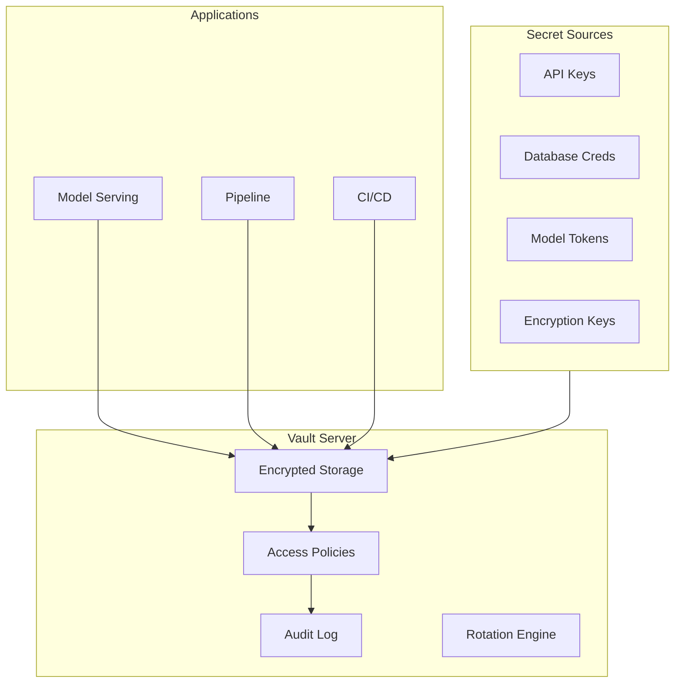

# Secret and Key Management

## Learning Objectives

| Objective | Description |
|-----------|-------------|
| LO1 | Understand secret management requirements for AI/LLM applications |
| LO2 | Implement API key rotation and lifecycle management |
| LO3 | Build vault integrations for secure credential storage |
| LO4 | Deploy environment-specific secret configurations |
| LO5 | Set up audit logging for secret access |
| LO6 | Design zero-trust architecture for model access control |

## Chapter at a Glance

| Section | Topic | Key Concept |
|---------|-------|-------------|
| 5.1 | Secret Management Overview | Types of secrets in AI systems |
| 5.2 | API Key Lifecycle | Creation, rotation, revocation |
| 5.3 | Vault Integration | HashiCorp Vault for secure storage |
| 5.4 | Environment Configuration | Dev/staging/prod secret separation |
| 5.5 | Audit & Monitoring | Secret access tracking and alerting |
| 5.6 | Zero-Trust Architecture | Model API access without hardcoded keys |

## Chapter Roadmap



## 5.1 Secret Management Overview

AI/LLM applications have more secrets than traditional applications: LLM API keys, model registry tokens, vector database credentials, embedding API keys, and fine-tuning data access tokens.

```python
import os
import json
import base64
from typing import Dict, Optional, List
from datetime import datetime, timedelta
import hashlib

class SecretType:
    LLM_API_KEY = "llm_api_key"
    DATABASE_URL = "database_url"
    MODEL_REGISTRY_TOKEN = "model_registry_token"
    VECTOR_DB_CREDENTIALS = "vector_db_credentials"
    ENCRYPTION_KEY = "encryption_key"
    CI_CD_TOKEN = "ci_cd_token"
    SERVICE_ACCOUNT = "service_account"
    WEBHOOK_SECRET = "webhook_secret"

class SecretManager:
    """Centralized secret management for AI applications."""

    def __init__(self, vault_addr: str = None):
        self.vault_addr = vault_addr
        self.cache = {}
        self.access_log = []

    def get_secret(self, secret_name: str, environment: str = "production") -> Optional[str]:
        """Retrieve a secret with access logging."""
        cache_key = f"{environment}:{secret_name}"

        # Check cache first
        if cache_key in self.cache:
            cached = self.cache[cache_key]
            if cached["expires_at"] > datetime.utcnow():
                self._log_access(secret_name, "cache_hit")
                return cached["value"]

        # Fetch from vault (simulated)
        secret = self._fetch_from_vault(secret_name, environment)
        if secret:
            self.cache[cache_key] = {
                "value": secret,
                "expires_at": datetime.utcnow() + timedelta(hours=1)
            }
            self._log_access(secret_name, "vault_fetch")
            return secret

        # Fallback to environment variable
        env_var = secret_name.upper()
        secret = os.environ.get(env_var)
        if secret:
            self._log_access(secret_name, "env_var")
            return secret

        return None

    def set_secret(self, secret_name: str, secret_value: str, environment: str = "production"):
        """Store a secret in vault (simulated)."""
        self._log_access(secret_name, "set")
        print(f"🔐 Stored secret '{secret_name}' for {environment}")

    def rotate_secret(self, secret_name: str, environment: str = "production") -> str:
        """Generate and store a new secret value."""
        import secrets
        new_secret = secrets.token_urlsafe(32)
        self.set_secret(secret_name, new_secret, environment)
        self._log_access(secret_name, "rotate")
        return new_secret

    def _fetch_from_vault(self, secret_name: str, environment: str) -> Optional[str]:
        """Simulated vault fetch."""
        return None

    def _log_access(self, secret_name: str, method: str):
        self.access_log.append({
            "secret": secret_name,
            "method": method,
            "timestamp": datetime.utcnow().isoformat()
        })

    def get_access_report(self) -> Dict:
        """Generate access report for audit."""
        from collections import Counter
        access_counts = Counter(entry["secret"] for entry in self.access_log)
        return {
            "total_accesses": len(self.access_log),
            "secrets_accessed": len(set(entry["secret"] for entry in self.access_log)),
            "most_accessed": access_counts.most_common(5),
            "recent_accesses": self.access_log[-10:]
        }

sm = SecretManager()
sm.get_secret("openai_api_key")
sm.get_secret("database_url")
print(json.dumps(sm.get_access_report(), indent=2, default=str))
```

**Common AI secrets and their risks**:

| Secret Type | Example | Risk if Leaked |
|-------------|---------|----------------|
| LLM API key | `sk-...` | Unauthorized usage, $10K+/day bills |
| Model registry token | `mlflow_...` | Model theft, unauthorized deployments |
| Vector DB credential | `qdrant_...` | Data exfiltration of knowledge base |
| Fine-tuning data token | `hf_...` | Training data theft |
| Encryption key | AES-256 key | All stored secrets compromised |

---

## 5.2 API Key Lifecycle

API keys need a complete lifecycle: creation, distribution, usage tracking, rotation, and revocation.

```python
import secrets
import hashlib
from datetime import datetime, timedelta
from typing import Optional, Dict, List
import uuid

class APIKeyManager:
    """Complete API key lifecycle management."""

    def __init__(self):
        self.keys = {}  # key_hash -> metadata
        self.revoked_keys = set()

    def create_key(self, name: str, permissions: List[str], expires_in_days: int = 90, rate_limit: int = 1000) -> Dict:
        """Create a new API key."""
        # Generate key
        key_id = str(uuid.uuid4())[:8]
        raw_key = f"sk-{key_id}-{secrets.token_urlsafe(24)}"
        key_hash = self._hash_key(raw_key)

        metadata = {
            "key_id": key_id,
            "name": name,
            "permissions": permissions,
            "created_at": datetime.utcnow(),
            "expires_at": datetime.utcnow() + timedelta(days=expires_in_days),
            "rate_limit": rate_limit,
            "usage_count": 0,
            "last_used": None,
            "status": "active"
        }

        self.keys[key_hash] = metadata
        print(f"🔑 Created key '{name}' (ID: {key_id}, expires: {metadata['expires_at'].date()})")

        return {"key": raw_key, "key_id": key_id, "metadata": {k: v for k, v in metadata.items() if k != "key_id"}}

    def validate_key(self, raw_key: str) -> Optional[Dict]:
        """Validate an API key and return its metadata."""
        key_hash = self._hash_key(raw_key)

        if raw_key in self.revoked_keys:
            return None

        metadata = self.keys.get(key_hash)
        if not metadata:
            return None

        # Check expiration
        if metadata["expires_at"] < datetime.utcnow():
            metadata["status"] = "expired"
            return None

        # Update usage
        metadata["usage_count"] += 1
        metadata["last_used"] = datetime.utcnow()

        return metadata

    def revoke_key(self, raw_key: str):
        """Revoke an API key immediately."""
        key_hash = self._hash_key(raw_key)
        if key_hash in self.keys:
            self.keys[key_hash]["status"] = "revoked"
            self.revoked_keys.add(raw_key)
            print(f"🔴 Revoked key: {self.keys[key_hash]['name']}")

    def rotate_key(self, old_key: str) -> Optional[Dict]:
        """Rotate a key: revoke old, create new with same permissions."""
        metadata = self.validate_key(old_key)
        if not metadata:
            return None

        new_key = self.create_key(
            name=f"{metadata['name']} (rotated)",
            permissions=metadata["permissions"],
            expires_in_days=90
        )

        self.revoke_key(old_key)
        return new_key

    def list_keys(self, status: str = "active") -> List[Dict]:
        return [
            {k: v for k, v in m.items() if k != "key_id"}
            for m in self.keys.values()
            if m["status"] == status
        ]

    def cleanup_expired_keys(self):
        """Remove expired keys."""
        now = datetime.utcnow()
        expired = [h for h, m in self.keys.items() if m["expires_at"] < now]
        for h in expired:
            self.keys[h]["status"] = "expired"

    def _hash_key(self, key: str) -> str:
        return hashlib.sha256(key.encode()).hexdigest()

# Simulated lifecycle
km = APIKeyManager()

prod_key = km.create_key("production-llm", ["llm:read", "llm:write"], rate_limit=5000)
dev_key = km.create_key("development-llm", ["llm:read"], rate_limit=100)

print(f"\nDev key: {dev_key['key'][:20]}...")
print(f"Validation: {km.validate_key(dev_key['key']) is not None}")

# Simulate rotation
new_prod_key = km.rotate_key(prod_key["key"])
print(f"New prod key ID: {new_prod_key['key_id']}")
print(f"Old key valid: {km.validate_key(prod_key['key']) is not None}")

# Cleanup
km.cleanup_expired_keys()
print(f"\nActive keys: {len(km.list_keys('active'))}")
```

---

## 5.3 Vault Integration

HashiCorp Vault provides centralized secret storage with encryption, access control, and audit logging.

```python
import json
from datetime import datetime
from typing import Optional, Dict, List
import requests

class VaultClient:
    """Simulated HashiCorp Vault client for secret management."""

    def __init__(self, vault_addr: str = "http://vault:8200", token: str = None):
        self.addr = vault_addr
        self.token = token
        self._secrets = {}  # In-memory secret store (simulated)
        self._policies = {}
        self.audit_log = []

    def authenticate(self, role: str, jwt: str = None) -> bool:
        """Authenticate to Vault."""
        # Simulated Kubernetes auth
        print(f"Authenticated to Vault with role: {role}")
        self.token = f"vault-token-{role}"
        return True

    def write_secret(self, path: str, data: Dict, version: int = None):
        """Write a secret to Vault."""
        if not self.token:
            raise PermissionError("Not authenticated to Vault")

        if path not in self._secrets:
            self._secrets[path] = []

        entry = {
            "data": data,
            "version": version or len(self._secrets[path]) + 1,
            "created_at": datetime.utcnow().isoformat(),
            "created_by": self.token
        }
        self._secrets[path].append(entry)

        self._log_audit("write", path)
        print(f"📝 Written secret to {path} (v{entry['version']})")

    def read_secret(self, path: str, version: int = None) -> Optional[Dict]:
        """Read a secret from Vault."""
        if path not in self._secrets:
            return None

        versions = self._secrets[path]
        if version:
            entry = next((v for v in versions if v["version"] == version), None)
        else:
            entry = versions[-1] if versions else None

        if entry:
            self._log_audit("read", path)
            return entry

        return None

    def list_secrets(self, path_prefix: str = "") -> List[str]:
        """List all secrets under a path prefix."""
        return [p for p in self._secrets.keys() if p.startswith(path_prefix)]

    def delete_secret(self, path: str):
        """Delete a secret path."""
        if path in self._secrets:
            del self._secrets[path]
            self._log_audit("delete", path)

    def set_policy(self, name: str, rules: List[Dict]):
        """Set access policy."""
        self._policies[name] = rules
        print(f"Policy '{name}' set with {len(rules)} rules")

    def _log_audit(self, operation: str, path: str):
        self.audit_log.append({
            "operation": operation,
            "path": path,
            "token": self.token,
            "timestamp": datetime.utcnow().isoformat()
        })

    def get_audit_log(self, n: int = 20) -> List[Dict]:
        return self.audit_log[-n:]

# Usage
vault = VaultClient()
vault.authenticate("ml-service")

# Store LLM API keys
vault.write_secret("llm/openai/prod", {
    "api_key": "sk-prod-...",
    "organization": "org-123",
    "rate_limit": 5000
})

vault.write_secret("llm/anthropic/prod", {
    "api_key": "sk-ant-prod-...",
    "rate_limit": 3000
})

# Store database credentials
vault.write_secret("database/vector-db", {
    "host": "qdrant.internal:6333",
    "api_key": "qdrant-secret-key",
    "tls_enabled": True
})

# Set policies
vault.set_policy("ml-engineer", [
    {"path": "llm/*", "capabilities": ["read"]},
    {"path": "database/*", "capabilities": ["read"]}
])

# Read back
secret = vault.read_secret("llm/openai/prod")
print(f"\nOpenAI key stored: {secret['data']['api_key'][:15]}...")

print(f"Audit entries: {len(vault.get_audit_log())}")
```

**Dynamic secrets for database access**:

```python
class DynamicSecretEngine:
    """Generate time-limited database credentials."""

    def __init__(self, vault_client: VaultClient):
        self.vault = vault_client
        self.active_leases = {}

    def generate_credentials(self, db_name: str, ttl_seconds: int = 3600) -> Dict:
        """Generate temporary database credentials."""
        import secrets
        lease_id = secrets.token_hex(8)

        creds = {
            "username": f"ml-{db_name}-{lease_id[:6]}",
            "password": secrets.token_urlsafe(16),
            "database": db_name,
            "lease_id": lease_id,
            "ttl": ttl_seconds,
            "expires_at": (datetime.utcnow() + timedelta(seconds=ttl_seconds)).isoformat()
        }

        self.active_leases[lease_id] = creds
        print(f"🔑 Generated dynamic credentials for {db_name} (lease: {lease_id}, TTL: {ttl_seconds}s)")
        return creds

    def renew_lease(self, lease_id: str, extend_seconds: int = 3600) -> bool:
        if lease_id in self.active_leases:
            self.active_leases[lease_id]["expires_at"] = (datetime.utcnow() + timedelta(seconds=extend_seconds)).isoformat()
            print(f"Renewed lease {lease_id} (+{extend_seconds}s)")
            return True
        return False

    def revoke_lease(self, lease_id: str):
        if lease_id in self.active_leases:
            del self.active_leases[lease_id]
            print(f"Revoked lease {lease_id}")

dyn = DynamicSecretEngine(vault)
creds = dyn.generate_credentials("analytics_db", ttl_seconds=300)
print(f"Temp user: {creds['username']}, expires: {creds['expires_at']}")
```

---

## 5.4 Environment Configuration

Different environments (dev, staging, prod) need different secrets with strict isolation.

```python
from pathlib import Path
import os

class EnvironmentSecretManager:
    """Manage secrets across environments with strict isolation."""

    def __init__(self, base_path: str = ".secrets"):
        self.base_path = Path(base_path)
        self.environments = ["development", "staging", "production"]

    def init_environment(self, env: str):
        """Initialize secret storage for an environment."""
        env_path = self.base_path / env
        env_path.mkdir(parents=True, exist_ok=True)
        (env_path / ".gitignore").write_text("*")
        print(f"Initialized secret store for {env}")

    def set_secret(self, env: str, key: str, value: str):
        """Store a secret for a specific environment."""
        env_file = self.base_path / env / f"{key}.secret"
        env_file.write_text(value)
        print(f"Set {key} for {env}")

    def get_secret(self, env: str, key: str) -> Optional[str]:
        env_file = self.base_path / env / f"{key}.secret"
        if env_file.exists():
            return env_file.read_text()
        return None

    def list_secrets(self, env: str) -> List[str]:
        env_path = self.base_path / env
        if env_path.exists():
            return [f.stem for f in env_path.glob("*.secret")]
        return []

    def validate_environment(self, env: str) -> Dict:
        """Validate that all required secrets exist for an environment."""
        required_secrets = {
            "development": ["openai_api_key", "database_url"],
            "staging": ["openai_api_key", "database_url", "model_registry_token"],
            "production": ["openai_api_key", "database_url", "model_registry_token", "encryption_key", "webhook_secret"],
        }

        required = required_secrets.get(env, [])
        existing = self.list_secrets(env)
        missing = [s for s in required if s not in existing]

        return {
            "environment": env,
            "required": len(required),
            "present": len(existing),
            "missing": missing,
            "valid": len(missing) == 0
        }

ems = EnvironmentSecretManager()
ems.init_environment("production")
ems.set_secret("production", "openai_api_key", "sk-prod-...")
ems.set_secret("production", "database_url", "postgresql://prod:pass@db:5432/ml")

validation = ems.validate_environment("production")
print(f"Production secrets: {validation['present']}/{validation['required']} valid={validation['valid']}")
if not validation["valid"]:
    print(f"Missing: {validation['missing']}")
```

**Environment-aware secret resolution**:

```python
class SecretResolver:
    """Resolve secrets with environment fallback chain."""

    def __init__(self):
        self.sources = []

    def add_source(self, name: str, resolver_fn):
        self.sources.append((name, resolver_fn))

    def resolve(self, secret_name: str, environment: str = "production") -> Optional[str]:
        for source_name, resolver_fn in self.sources:
            value = resolver_fn(secret_name, environment)
            if value:
                return value
        return None

resolver = SecretResolver()
resolver.add_source("vault", lambda n, e: f"vault-{e}-{n}" if n == "openai_api_key" else None)
resolver.add_source("env_var", lambda n, e: os.environ.get(n.upper()))
resolver.add_source("file", lambda n, e: Path(f".secrets/{e}/{n}.secret").read_text() if Path(f".secrets/{e}/{n}.secret").exists() else None)

# os.environ["OPENAI_API_KEY"] = "sk-env-..."
value = resolver.resolve("openai_api_key", "production")
print(f"Resolved: {value}")
```

---

## 5.5 Audit & Monitoring

Audit logging tracks who accessed which secrets and when, enabling security incident investigation.

```python
import json
from datetime import datetime
from typing import Dict, List, Optional

class SecretAuditLogger:
    """Audit logging for secret access."""

    def __init__(self, log_path: str = "secret_audit.log"):
        self.log_path = log_path
        self.entries = []

    def log_access(self, secret_name: str, user: str, action: str, source_ip: str = None, success: bool = True):
        entry = {
            "timestamp": datetime.utcnow().isoformat(),
            "secret": secret_name,
            "user": user,
            "action": action,
            "source_ip": source_ip,
            "success": success
        }
        self.entries.append(entry)
        self._write_entry(entry)

    def _write_entry(self, entry: Dict):
        with open(self.log_path, "a") as f:
            f.write(json.dumps(entry) + "\n")

    def query(self, user: str = None, secret: str = None, action: str = None, limit: int = 100) -> List[Dict]:
        results = self.entries
        if user:
            results = [e for e in results if e["user"] == user]
        if secret:
            results = [e for e in results if e["secret"] == secret]
        if action:
            results = [e for e in results if e["action"] == action]
        return results[-limit:]

    def detect_anomalies(self) -> List[Dict]:
        """Detect suspicious secret access patterns."""
        anomalies = []

        # Failed access attempts
        failed = [e for e in self.entries if not e["success"]]
        if len(failed) > 5:
            anomalies.append({
                "type": "multiple_failures",
                "count": len(failed),
                "users": list(set(e["user"] for e in failed)),
                "severity": "warning"
            })

        # Unusual access times
        for entry in self.entries:
            hour = int(entry["timestamp"].split("T")[1].split(":")[0])
            if hour < 6 or hour > 22:
                anomalies.append({
                    "type": "unusual_time",
                    "secret": entry["secret"],
                    "user": entry["user"],
                    "time": entry["timestamp"],
                    "severity": "info"
                })

        return anomalies

logger = SecretAuditLogger()
logger.log_access("openai_api_key", "alice", "read", "10.0.1.50")
logger.log_access("openai_api_key", "bob", "read", "10.0.1.51")
logger.log_access("database_url", "alice", "read", "10.0.1.50")
logger.log_access("openai_api_key", "unknown", "read", "203.0.113.5", success=False)

anomalies = logger.detect_anomalies()
print(f"Anomalies detected: {len(anomalies)}")
for a in anomalies:
    print(f"  [{a['severity'].upper()}] {a['type']}")
```

**Secret scanning in code**:

```python
import re

class SecretScanner:
    """Scan code for accidentally committed secrets."""

    PATTERNS = {
        "AWS Key": r"AKIA[0-9A-Z]{16}",
        "GitHub Token": r"gh[pousr]_[A-Za-z0-9_]{36,}",
        "OpenAI Key": r"sk-[A-Za-z0-9]{32,}",
        "Generic API Key": r"(?i)(api[_-]?key|apikey|secret)[\s]*[:=][\s]*['\"][A-Za-z0-9_\-]{16,}['\"]",
        "Private Key": r"-----BEGIN (RSA |EC )?PRIVATE KEY-----",
        "Database URL": r"postgres(ql)?://\w+:\w+@",
        "JWT Token": r"eyJ[A-Za-z0-9_\-]{20,}\.[A-Za-z0-9_\-]{20,}\.[A-Za-z0-9_\-]{20,}",
    }

    def __init__(self):
        self.compiled = {name: re.compile(pattern) for name, pattern in self.PATTERNS.items()}

    def scan_file(self, file_path: str) -> List[Dict]:
        findings = []
        try:
            with open(file_path, "r") as f:
                for i, line in enumerate(f, 1):
                    for name, pattern in self.compiled.items():
                        if pattern.search(line):
                            findings.append({
                                "file": file_path,
                                "line": i,
                                "type": name,
                                "snippet": line.strip()[:80]
                            })
        except Exception as e:
            pass
        return findings

    def scan_directory(self, directory: str, exclude_patterns: List[str] = None) -> List[Dict]:
        all_findings = []
        for root, dirs, files in os.walk(directory):
            # Skip .git and node_modules
            dirs[:] = [d for d in dirs if d not in [".git", "node_modules", "__pycache__", ".venv"]]
            for file in files:
                file_path = os.path.join(root, file)
                if any(file.endswith(ext) for ext in [".py", ".ts", ".js", ".yaml", ".yml", ".json", ".env", ".sh"]):
                    findings = self.scan_file(file_path)
                    all_findings.extend(findings)
        return all_findings

scanner = SecretScanner()
test_file = "test_config.py"
with open(test_file, "w") as f:
    f.write("openai_api_key = 'sk-test123456789012345678901234567'\n")

findings = scanner.scan_file(test_file)
for f in findings:
    print(f"🔴 Found {f['type']} at {f['file']}:{f['line']}")
    print(f"   {f['snippet']}")

os.remove(test_file)
```

---

## 5.6 Zero-Trust Architecture

Zero-trust for ML systems means no implicit trust based on network location — every request must authenticate and authorize.

```python
import hashlib
import hmac
import time
from typing import Optional, Dict
import jwt as pyjwt

class ZeroTrustAuth:
    """Zero-trust authentication for model API access."""

    def __init__(self, secret_key: str):
        self.secret_key = secret_key

    def generate_service_token(self, service_name: str, permissions: list, ttl_seconds: int = 3600) -> str:
        """Generate a signed JWT for service-to-service auth."""
        payload = {
            "sub": service_name,
            "permissions": permissions,
            "iat": int(time.time()),
            "exp": int(time.time()) + ttl_seconds,
            "jti": hashlib.md5(f"{service_name}-{time.time()}".encode()).hexdigest()[:16]
        }
        return pyjwt.encode(payload, self.secret_key, algorithm="HS256")

    def verify_token(self, token: str) -> Optional[Dict]:
        """Verify and decode a service token."""
        try:
            payload = pyjwt.decode(token, self.secret_key, algorithms=["HS256"])
            return payload
        except pyjwt.ExpiredSignatureError:
            print("Token expired")
            return None
        except pyjwt.InvalidTokenError:
            print("Invalid token")
            return None

    def require_permission(self, token: str, required_perm: str) -> bool:
        """Check if token has required permission."""
        payload = self.verify_token(token)
        if not payload:
            return False
        permissions = payload.get("permissions", [])
        return required_perm in permissions

# Zero-trust middleware
class ZeroTrustMiddleware:
    def __init__(self, auth: ZeroTrustAuth):
        self.auth = auth

    def authenticate_request(self, request_headers: Dict) -> Dict:
        """Authenticate and authorize an API request."""
        auth_header = request_headers.get("Authorization", "")
        if not auth_header.startswith("Bearer "):
            return {"authenticated": False, "reason": "Missing or invalid Authorization header"}

        token = auth_header[7:]
        payload = self.auth.verify_token(token)
        if not payload:
            return {"authenticated": False, "reason": "Invalid or expired token"}

        return {
            "authenticated": True,
            "service": payload["sub"],
            "permissions": payload["permissions"],
            "token_id": payload["jti"]
        }

# mTLS for transport security
class mTLSConfig:
    """Mutual TLS configuration for model serving."""

    def __init__(self, cert_path: str, key_path: str, ca_path: str):
        self.cert_path = cert_path
        self.key_path = key_path
        self.ca_path = ca_path

    def get_ssl_context(self):
        """Get SSL context for mTLS."""
        import ssl
        context = ssl.create_default_context(ssl.Purpose.CLIENT_AUTH)
        context.load_cert_chain(self.cert_path, self.key_path)
        context.load_verify_locations(cafile=self.ca_path)
        context.verify_mode = ssl.CERT_REQUIRED
        return context

# Simulated zero-trust flow
auth = ZeroTrustAuth("super-secret-key-2025")
ztmw = ZeroTrustMiddleware(auth)

token = auth.generate_service_token("model-serving-v2", ["llm:inference", "model:read"])
print(f"Token: {token[:50]}...")

request = {"Authorization": f"Bearer {token}"}
result = ztmw.authenticate_request(request)
print(f"Authenticated: {result['authenticated']}, Service: {result.get('service', 'N/A')}")

# Permission check
can_infer = auth.require_permission(token, "llm:inference")
print(f"Can infer: {can_infer}")

# Expired token test (simulated)
time.sleep(0.1)
```

---

## TypeScript Parallel

```typescript
// TypeScript secret management
import { createHash, randomBytes } from "crypto";

interface SecretEntry {
  key: string;
  value: string;
  environment: string;
  expiresAt: Date;
}

class SecretVault {
  private secrets: Map<string, SecretEntry> = new Map();

  set(key: string, value: string, env: string, ttlMs: number = 3600000): void {
    this.secrets.set(`${env}:${key}`, { key, value, environment: env, expiresAt: new Date(Date.now() + ttlMs) });
  }

  get(key: string, env: string): string | null {
    const entry = this.secrets.get(`${env}:${key}`);
    if (!entry || entry.expiresAt < new Date()) return null;
    return entry.value;
  }

  rotate(key: string, env: string): string {
    const newValue = randomBytes(32).toString("hex");
    this.set(key, newValue, env);
    return newValue;
  }
}

const vault = new SecretVault();
vault.set("openai_key", "sk-test...", "production");
console.log(vault.get("openai_key", "production"));
```

---

## Summary

- AI applications manage more secrets than traditional apps: LLM keys, model registry tokens, vector DB credentials
- API key lifecycle includes creation, distribution, usage tracking, rotation, and revocation
- HashiCorp Vault provides encrypted secret storage with policies and audit logging
- Dynamic secrets generate time-limited credentials for database access
- Environment-specific secret configuration enforces isolation between dev/staging/prod
- Audit logging tracks who accessed which secret, enabling anomaly detection
- Secret scanning in codebases prevents accidental credential commits
- Zero-trust architecture requires authentication and authorization for every API call
- mTLS provides transport-layer security with mutual certificate verification
- Secret rotation should be automated with notification to affected services

## Practical Takeaways

| Scenario | Do This | Avoid This |
|----------|---------|------------|
| Storing API keys | Vault or secrets manager | Hardcoding in source code |
| Key rotation | Automated rotation every 90 days | Never rotating keys |
| Multi-environment | Separate secret stores per environment | Sharing secrets across environments |
| Service auth | JWT tokens with short TTL | Long-lived static tokens |
| Code scanning | Pre-commit hooks for secret detection | Committing secrets even temporarily |
| Audit | Log every secret access | No audit trail |

## Interview Q&A

<details class="tp-qa-card" data-qid="ai-sec-s05-q1">
  <summary class="tp-qa-question">
    <span class="tp-qa-status"></span>
    Q1: What secrets do AI/LLM applications manage that traditional apps don't?
  </summary>
  <div class="tp-qa-answer">
    <p>AI-specific secrets include: LLM provider API keys (OpenAI, Anthropic), model registry tokens (MLflow, Hugging Face), vector database credentials (Pinecone, Qdrant, Weaviate), embedding API keys, fine-tuning data access tokens, and model encryption keys. Each of these represents a unique security risk if leaked.</p>
  </div>
  <button class="tp-qa-mark-btn">✅ Mark Reviewed</button>
  <button class="tp-qa-bookmark-btn">🔖 Bookmark</button>
</details>

<details class="tp-qa-card" data-qid="ai-sec-s05-q2">
  <summary class="tp-qa-question">
    <span class="tp-qa-status"></span>
    Q2: How does HashiCorp Vault work for secret management?
  </summary>
  <div class="tp-qa-answer">
    <p>Vault stores secrets encrypted at rest and in transit. Clients authenticate via tokens, Kubernetes auth, or LDAP. Access policies define who can read/write which paths. Vault supports: static secrets (API keys), dynamic secrets (time-limited DB creds), and encryption-as-a-service. All access is logged for audit.</p>
  </div>
  <button class="tp-qa-mark-btn">✅ Mark Reviewed</button>
  <button class="tp-qa-bookmark-btn">🔖 Bookmark</button>
</details>

<details class="tp-qa-card" data-qid="ai-sec-s05-q3">
  <summary class="tp-qa-question">
    <span class="tp-qa-status"></span>
    Q3: What is the API key lifecycle?
  </summary>
  <div class="tp-qa-answer">
    <p>Create → Distribute → Track → Rotate → Revoke. Create with metadata (name, permissions, expiry). Distribute securely (not in code, logs, or chat). Track usage patterns. Rotate periodically (90 days recommended) or immediately if compromised. Revoke by invalidating the key hash and removing from active set.</p>
  </div>
  <button class="tp-qa-mark-btn">✅ Mark Reviewed</button>
  <button class="tp-qa-bookmark-btn">🔖 Bookmark</button>
</details>

<details class="tp-qa-card" data-qid="ai-sec-s05-q4">
  <summary class="tp-qa-question">
    <span class="tp-qa-status"></span>
    Q4: How do dynamic secrets work?
  </summary>
  <div class="tp-qa-answer">
    <p>Dynamic secrets generate credentials on-demand with a limited time-to-live (TTL). The application requests credentials from Vault, gets a username/password pair that works for N minutes, uses it, then the credentials expire. This eliminates long-lived static credentials that could be stolen. Vault manages the lease lifecycle: create, renew, revoke.</p>
  </div>
  <button class="tp-qa-mark-btn">✅ Mark Reviewed</button>
  <button class="tp-qa-bookmark-btn">🔖 Bookmark</button>
</details>

<details class="tp-qa-card" data-qid="ai-sec-s05-q5">
  <summary class="tp-qa-question">
    <span class="tp-qa-status"></span>
    Q5: How do you detect secrets accidentally committed to Git?
  </summary>
  <div class="tp-qa-answer">
    <p>Use pre-commit hooks with tools like git-secrets, truffleHog, or Gitleaks. These scan staged files for patterns (AWS keys, API keys, private keys, database URLs). Also scan Git history for past leaks. Set up server-side scanning in CI/CD. If a secret is committed, rotate it immediately and purge from Git history.</p>
  </div>
  <button class="tp-qa-mark-btn">✅ Mark Reviewed</button>
  <button class="tp-qa-bookmark-btn">🔖 Bookmark</button>
</details>

<details class="tp-qa-card" data-qid="ai-sec-s05-q6">
  <summary class="tp-qa-question">
    <span class="tp-qa-status"></span>
    Q6: How do you implement zero-trust for model serving?
  </summary>
  <div class="tp-qa-answer">
    <p>Every request must authenticate and authorize: (1) Service identity via mTLS certificates, (2) JWT tokens with short TTL and permission claims, (3) Request-level authorization checking required scopes, (4) Rate limiting per identity, (5) Audit logging of all requests. No implicit trust based on network (VPC, internal IP).</p>
  </div>
  <button class="tp-qa-mark-btn">✅ Mark Reviewed</button>
  <button class="tp-qa-bookmark-btn">🔖 Bookmark</button>
</details>

<details class="tp-qa-card" data-qid="ai-sec-s05-q7">
  <summary class="tp-qa-question">
    <span class="tp-qa-status"></span>
    Q7: How do you handle secrets in CI/CD pipelines?
  </summary>
  <div class="tp-qa-answer">
    <p>Use CI/CD platform secret stores (GitHub Actions secrets, GitLab CI variables). Never expose secrets in logs, build output, or error messages. Use environment-specific variables. For ML pipelines, authenticate to Vault from CI using OIDC/JWT tokens. Scan pipeline output for accidental secret exposure.</p>
  </div>
  <button class="tp-qa-mark-btn">✅ Mark Reviewed</button>
  <button class="tp-qa-bookmark-btn">🔖 Bookmark</button>
</details>

<details class="tp-qa-card" data-qid="ai-sec-s05-q8">
  <summary class="tp-qa-question">
    <span class="tp-qa-status"></span>
    Q8: What is a secret zero-trust architecture for LLM API keys?
  </summary>
  <div class="tp-qa-answer">
    <p>The application never directly holds LLM API keys. Instead: (1) A proxy/service mesh handles LLM API calls, (2) The proxy authenticates to Vault, retrieves the key, calls the LLM, (3) The key is held in memory only, never written to disk, (4) Downstream services authenticate to the proxy via mTLS + JWT, (5) The proxy enforces rate limits and audits all usage.</p>
  </div>
  <button class="tp-qa-mark-btn">✅ Mark Reviewed</button>
  <button class="tp-qa-bookmark-btn">🔖 Bookmark</button>
</details>

<details class="tp-qa-card" data-qid="ai-sec-s05-q9">
  <summary class="tp-qa-question">
    <span class="tp-qa-status"></span>
    Q9: How do you rotate secrets without downtime?
  </summary>
  <div class="tp-qa-answer">
    <p>Implement dual-key support: maintain two valid keys during rotation. Steps: (1) Deploy new key alongside old, (2) Update all services to use new key, (3) Verify all services work with new key, (4) Revoke old key. For services that can't be updated simultaneously, have a grace period where both keys are valid. Automate the entire process.</p>
  </div>
  <button class="tp-qa-mark-btn">✅ Mark Reviewed</button>
  <button class="tp-qa-bookmark-btn">🔖 Bookmark</button>
</details>

<details class="tp-qa-card" data-qid="ai-sec-s05-q10">
  <summary class="tp-qa-question">
    <span class="tp-qa-status"></span>
    Q10: What audit log entries should you track for secret management?
  </summary>
  <div class="tp-qa-answer">
    <p>Track: (1) Secret reads — who, when, which secret, source IP, (2) Secret writes/updates, (3) Key rotation events, (4) Failed access attempts (especially repeated), (5) Policy changes, (6) Lease creation/renewal/revocation for dynamic secrets, (7) Access from unusual locations or times. Store logs in immutable storage with alerting on anomalies.</p>
  </div>
  <button class="tp-qa-mark-btn">✅ Mark Reviewed</button>
  <button class="tp-qa-bookmark-btn">🔖 Bookmark</button>
</details>

## Chapter Quiz

**Q1**: What is the recommended API key rotation period?
a) 7 days
b) 30 days
c) 90 days
d) 365 days

<details class="tp-qa-card" data-qid="ai-sec-s05-quiz1"><summary>Show Answer</summary><div class="tp-qa-answer"><p><strong>Answer: c) 90 days</strong></p><p>Industry best practice recommends rotating API keys every 90 days.</p></div></details>

**Q2**: What does HashiCorp Vault provide for secret management?
a) Only encryption
b) Encrypted storage, access policies, audit logging
c) Only key generation
d) Only key rotation

<details class="tp-qa-card" data-qid="ai-sec-s05-quiz2"><summary>Show Answer</summary><div class="tp-qa-answer"><p><strong>Answer: b) Encrypted storage, access policies, audit logging</strong></p><p>Vault provides comprehensive secret management with policies, audit, and dynamic secrets.</p></div></details>

**Q3**: What is a dynamic secret?
a) A secret that changes every second
b) A time-limited credential generated on demand
c) An encrypted static key
d) A user-provided password

<details class="tp-qa-card" data-qid="ai-sec-s05-quiz3"><summary>Show Answer</summary><div class="tp-qa-answer"><p><strong>Answer: b) A time-limited credential generated on demand</strong></p><p>Dynamic secrets have finite TTL and expire automatically, eliminating long-lived credentials.</p></div></details>

**Q4**: What is the primary benefit of zero-trust for model serving?
a) Lower latency
b) No implicit trust — every request must authenticate
c) Simpler architecture
d) Lower cost

<details class="tp-qa-card" data-qid="ai-sec-s05-quiz4"><summary>Show Answer</summary><div class="tp-qa-answer"><p><strong>Answer: b) No implicit trust — every request must authenticate</strong></p><p>Zero-trust removes implicit network trust and requires authentication for every request.</p></div></details>

**Q5**: What should you do if a secret is accidentally committed to Git?
a) Nothing, just leave it
b) Rotate the secret immediately and purge from Git history
c) Delete the file only
d) Change the file permission

<details class="tp-qa-card" data-qid="ai-sec-s05-quiz5"><summary>Show Answer</summary><div class="tp-qa-answer"><p><strong>Answer: b) Rotate the secret immediately and purge from Git history</strong></p><p>Once a secret is committed, it's compromised — rotate it and remove from history.</p></div></details>

## Exercises

**Easy** — Implement an APIKeyManager with create, validate, and revoke methods. Test the full lifecycle.

**Medium** — Build a VaultClient with write, read, list, and delete operations. Add audit logging for operations.

**Medium** — Create a SecretScanner that detects AWS keys, GitHub tokens, and OpenAI keys in files.

**Hard** — Implement a ZeroTrustAuth system with JWT generation, token verification, and permission checking.

**Hard** — Build a complete secret management system with vault integration, environment separation, audit logging, and anomaly detection.

---

> **Next**: [06 — Compliance and Ethics →](06-compliance-and-ethics.md)
