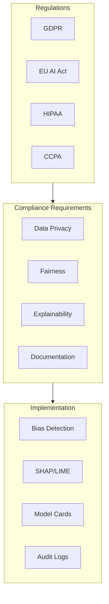

<!-- Clear Language: Keep sentences under 50 words -->
# Compliance and Ethics

## Learning Objectives

| Objective | Description |
|-----------|-------------|
| LO1 | Understand AI compliance frameworks and regulations |
| LO2 | Implement GDPR and data privacy requirements for AI |
| LO3 | Build fairness assessment and bias detection tools |
| LO4 | Deploy model explainability for regulated industries |
| LO5 | Set up compliance documentation and audit trails |
| LO6 | Design ethical AI guidelines and review processes |

## Introduction

AI systems face unique security threats. Prompt injection, data leakage, and content abuse require specialized defenses. This module covers threat modeling, guardrails, and compliance for production AI.

## Prerequisites

- Basic programming knowledge
- Understanding of data structures

## Key Terminology

**Key Terms**: Core vocabulary and concepts for this topic.

**Definition**: Essential terms you must know for interviews and production work.

## Theory

Understanding compliance and ethics is fundamental for AI engineers. This section covers the core concepts, underlying principles, and theoretical framework that govern how compliance and ethics works in practice.

## Chapter at a Glance

| Section | Topic | Key Concept |
|---------|-------|-------------|
| 6.1 | Compliance Frameworks | GDPR, EU AI Act, HIPAA for AI |
| 6.2 | Data Privacy | Consent, right to explanation, data deletion |
| 6.3 | Fairness & Bias | Demographic parity, equal opportunity metrics |
| 6.4 | Explainability | SHAP, LIME, feature importance |
| 6.5 | Documentation | Model cards, data sheets, audit trails |
| 6.6 | Ethical AI | Principles, review board, incident response |

## Chapter Roadmap



## 6.1 Compliance Frameworks

Multiple regulations govern AI systems. Understanding which apply to your application is the first step in compliance.

```python
from enum import Enum
from typing import List, Dict, Optional
from datetime import datetime

class AIRegulation(Enum):
    GDPR = "GDPR — EU General Data Protection Regulation"
    EU_AI_ACT = "EU AI Act — Risk-based AI regulation"
    HIPAA = "HIPAA — US Health Insurance Portability and Accountability Act"
    CCPA = "CCPA — California Consumer Privacy Act"
    ADPPA = "ADPPA — American Data Privacy and Protection Act"
    PIPEDA = "PIPEDA — Canada Personal Information Protection Act"

class ComplianceChecklist:
    """Check compliance requirements for AI systems."""

    REGULATION_REQUIREMENTS = {
        AIRegulation.GDPR: [
            "Right to be informed about data processing",
            "Right of access to personal data",
            "Right to rectification of inaccurate data",
            "Right to erasure (right to be forgotten)",
            "Right to restrict processing",
            "Right to data portability",
            "Right to object to processing",
            "Rights related to automated decision-making and profiling"
        ],
        AIRegulation.EU_AI_ACT: [
            "Risk classification (unacceptable, high, limited, minimal)",
            "Conformity assessment for high-risk AI",
            "Technical documentation requirements",
            "Transparency obligations",
            "Human oversight for high-risk systems",
            "Accuracy, robustness, and cybersecurity requirements"
        ],
        AIRegulation.HIPAA: [
            "Protected Health Information (PHI) safeguards",
            "Privacy Rule — patient consent for data use",
            "Security Rule — administrative, physical, technical safeguards",
            "Breach notification within 60 days",
            "Minimum necessary standard for data access",
            "Business Associate Agreements with vendors"
        ]
    }

    def __init__(self):
        self.checks = []

    def add_requirement(self, regulation: AIRegulation, requirement: str):
        self.checks.append({
            "regulation": regulation.value,
            "requirement": requirement,
            "status": "pending",
            "evidence": None
        })

    def complete_check(self, requirement: str, evidence: str):
        for c in self.checks:
            if c["requirement"] == requirement:
                c["status"] = "completed"
                c["evidence"] = evidence

    def generate_report(self) -> Dict:
        total = len(self.checks)
        completed = sum(1 for c in self.checks if c["status"] == "completed")
        return {
            "total_checks": total,
            "completed": completed,
            "pending": total - completed,
            "completion_pct": round(completed / total * 100, 1) if total else 0,
            "by_regulation": {}
        }

checklist = ComplianceChecklist()
for reg in [AIRegulation.GDPR, AIRegulation.EU_AI_ACT]:
    for req in ComplianceChecklist.REGULATION_REQUIREMENTS.get(reg, []):
        checklist.add_requirement(reg, req)

print(f"Total compliance checks: {checklist.generate_report()['total_checks']}")
print(f"GDPR requirements: {len(ComplianceChecklist.REGULATION_REQUIREMENTS[AIRegulation.GDPR])}")
```

**Risk classification per EU AI Act**:

```python
class EUAIActRiskClassifier:
    """Classify AI systems per EU AI Act risk categories."""

    RISK_LEVELS = {
        "unacceptable": "Prohibited — systems that manipulate behavior, social scoring, real-time biometric surveillance",
        "high": "High-risk — critical infrastructure, education, employment, law enforcement, migration, justice",
        "limited": "Limited risk — chatbots, emotion recognition, biometric categorization",
        "minimal": "Minimal risk — AI-enabled video games, spam filters"
    }

    def classify(self, system_description: str, use_case: str, domain: str) -> Dict:
        """Classify an AI system based on its characteristics."""
        score = 0

        # Scoring heuristics
        risk_keywords = {
            "unacceptable": ["social scoring", "manipulative", "real-time biometric", "mass surveillance"],
            "high": ["critical", "health", "hiring", "credit", "law enforcement", "migration", "justice"],
            "limited": ["chatbot", "customer service", "content generation", "recommendation"],
        }

        desc_lower = f"{system_description} {use_case} {domain}".lower()

        for level, keywords in risk_keywords.items():
            for kw in keywords:
                if kw in desc_lower:
                    return {
                        "risk_level": level,
                        "risk_score": {"unacceptable": 4, "high": 3, "limited": 2, "minimal": 1}[level],
                        "description": self.RISK_LEVELS[level],
                        "requirements": self._get_requirements(level)
                    }

        return {
            "risk_level": "minimal",
            "risk_score": 1,
            "description": self.RISK_LEVELS["minimal"],
            "requirements": self._get_requirements("minimal")
        }

    def _get_requirements(self, level: str) -> List[str]:
        base = ["Documentation", "Transparency", "Human oversight"]
        if level == "high":
            return base + ["Conformity assessment", "Risk management", "Data governance", "Technical robustness"]
        if level == "unacceptable":
            return ["Prohibited — cannot be deployed"]
        return base

classifier = EUAIActRiskClassifier()

systems = [
    ("AI resume screening for hiring", "employment", "HR tech"),
    ("Chatbot for customer support", "customer service", "e-commerce"),
    ("Real-time facial recognition in public", "law enforcement", "security"),
]

for desc, use, domain in systems:
    result = classifier.classify(desc, use, domain)
    print(f"\n{desc}")
    print(f"  Risk Level: {result['risk_level'].upper()}")
    print(f"  Requirements: {result['requirements'][:2]}")
```

---

## 6.2 Data Privacy

GDPR and similar regulations require specific data privacy practices for AI systems.

```python
import hashlib
import json
from datetime import datetime
from typing import List, Optional

class DataPrivacyManager:
    """Manage data privacy compliance for AI systems."""

    def __init__(self):
        self.consent_records = {}
        self.data_subject_requests = []
        self.personal_data_inventory = []

    def log_consent(self, user_id: str, purpose: str, granted: bool, timestamp: str = None):
        """Record consent for data processing."""
        record = {
            "user_id": user_id,
            "purpose": purpose,
            "granted": granted,
            "timestamp": timestamp or datetime.utcnow().isoformat()
        }
        if user_id not in self.consent_records:
            self.consent_records[user_id] = []
        self.consent_records[user_id].append(record)
        print(f"Consent {'granted' if granted else 'withdrawn'} for {user_id}: {purpose}")

    def check_consent(self, user_id: str, purpose: str) -> bool:
        """Check if user has granted consent for a purpose."""
        records = self.consent_records.get(user_id, [])
        if not records:
            return False
        latest = records[-1]
        return latest["purpose"] == purpose and latest["granted"]

    def register_data_subject_request(self, user_id: str, request_type: str) -> str:
        """Handle GDPR data subject requests (access, deletion, portability)."""
        request_id = f"dsr-{hash(user_id + str(datetime.utcnow().timestamp()))}"
        request = {
            "request_id": request_id,
            "user_id": user_id,
            "type": request_type,
            "status": "received",
            "created_at": datetime.utcnow().isoformat(),
            "deadline": None
        }

        # Set deadline based on request type
        from datetime import timedelta
        if request_type in ["access", "deletion", "portability"]:
            request["deadline"] = (datetime.utcnow() + timedelta(days=30)).isoformat()

        self.data_subject_requests.append(request)
        print(f"DSR registered: {request_type} for {user_id} (ID: {request_id})")
        return request_id

    def fulfill_access_request(self, user_id: str) -> Dict:
        """Fulfill GDPR right of access — return all data held about user."""
        user_data = {
            "user_id": user_id,
            "consent_records": self.consent_records.get(user_id, []),
            "stored_data": self._get_user_data(user_id),
            "processing_purposes": ["model_training", "inference", "analytics"]
        }
        return user_data

    def fulfill_deletion_request(self, user_id: str) -> bool:
        """Fulfill GDPR right to erasure."""
        print(f"Deleting all data for {user_id}...")
        if user_id in self.consent_records:
            del self.consent_records[user_id]
        # In practice: anonymize or delete from all systems
        return True

    def anonymize_data(self, data: dict, pii_fields: List[str]) -> dict:
        """Anonymize PII fields using hashing."""
        anonymized = data.copy()
        for field in pii_fields:
            if field in anonymized:
                value = str(anonymized[field])
                anonymized[field] = hashlib.sha256(value.encode()).hexdigest()[:12]
        return anonymized

    def _get_user_data(self, user_id: str) -> List[Dict]:
        """Get all stored data for a user (simulated)."""
        return [
            {"data_type": "profile", "fields": ["name", "email"], "retention_days": 730},
            {"data_type": "interactions", "fields": ["queries", "feedback"], "retention_days": 90}
        ]

privacy = DataPrivacyManager()
privacy.log_consent("user_123", "model_training", True)
privacy.log_consent("user_123", "analytics", True)

## Check consent before training
if privacy.check_consent("user_123", "model_training"):
    print("User consented to model training — proceeding")

## Handle deletion request
req_id = privacy.register_data_subject_request("user_123", "deletion")
privacy.fulfill_deletion_request("user_123")

## Anonymization example
record = {"name": "Alice Johnson", "email": "alice@example.com", "age": 30}
anon = privacy.anonymize_data(record, ["name", "email"])
print(f"Anonymized: {anon}")
```

**Data retention policy enforcement**:

```python
class RetentionPolicy:
    """Enforce data retention policies for AI training data."""

    def __init__(self):
        self.policies = []

    def add_policy(self, data_type: str, retention_days: int, action: str = "delete"):
        self.policies.append({"data_type": data_type, "retention_days": retention_days, "action": action})

    def check_expiry(self, record_date: str, data_type: str) -> Dict:
        from datetime import timedelta
        record_dt = datetime.fromisoformat(record_date)
        for policy in self.policies:
            if policy["data_type"] == data_type:
                expiry = record_dt + timedelta(days=policy["retention_days"])
                is_expired = datetime.utcnow() > expiry
                return {
                    "expired": is_expired,
                    "expiry_date": expiry.isoformat(),
                    "action": policy["action"] if is_expired else "none",
                    "days_remaining": (expiry - datetime.utcnow()).days if not is_expired else 0
                }
        return {"expired": False, "action": "none"}

rp = RetentionPolicy()
rp.add_policy("training_logs", 90, "anonymize")
rp.add_policy("raw_user_data", 365, "delete")

print(rp.check_expiry("2024-01-15T00:00:00", "training_logs"))
```

---

## 6.3 Fairness & Bias

Fairness metrics detect and measure bias in ML models across demographic groups.

```python
import numpy as np
import pandas as pd
from typing import Dict, List

class FairnessAssessor:
    """Assess model fairness across demographic groups."""

    def __init__(self):
        self.metrics = {}

    def demographic_parity(self, predictions: np.ndarray, groups: np.ndarray) -> Dict:
        """Check if prediction rates are equal across groups (demographic parity)."""
        unique_groups = np.unique(groups)
        group_rates = {}

        for group in unique_groups:
            mask = groups == group
            group_rates[str(group)] = float(predictions[mask].mean())

        max_rate = max(group_rates.values())
        min_rate = min(group_rates.values())
        disparity = max_rate - min_rate

        return {
            "metric": "demographic_parity",
            "group_rates": group_rates,
            "disparity": round(disparity, 4),
            "passes": disparity < 0.1,
            "threshold": 0.1
        }

    def equal_opportunity(self, predictions: np.ndarray, labels: np.ndarray, groups: np.ndarray) -> Dict:
        """Check if true positive rates are equal across groups."""
        unique_groups = np.unique(groups)
        group_tpr = {}

        for group in unique_groups:
            mask = groups == group
            actual_positive = labels[mask] == 1
            pred_positive = predictions[mask] == 1
            tp = (actual_positive & pred_positive).sum()
            actual_p = actual_positive.sum()
            group_tpr[str(group)] = float(tp / actual_p) if actual_p > 0 else 0

        max_tpr = max(group_tpr.values())
        min_tpr = min(group_tpr.values())
        disparity = max_tpr - min_tpr

        return {
            "metric": "equal_opportunity",
            "group_tprs": group_tpr,
            "disparity": round(disparity, 4),
            "passes": disparity < 0.1
        }

    def predictive_parity(self, predictions: np.ndarray, labels: np.ndarray, groups: np.ndarray) -> Dict:
        """Check if precision is equal across groups."""
        unique_groups = np.unique(groups)
        group_precision = {}

        for group in unique_groups:
            mask = groups == group
            pred_positive = predictions[mask] == 1
            tp = ((labels[mask] == 1) & pred_positive).sum()
            pp = pred_positive.sum()
            group_precision[str(group)] = float(tp / pp) if pp > 0 else 0

        return {
            "metric": "predictive_parity",
            "group_precisions": group_precision,
            "disparity": round(max(group_precision.values()) - min(group_precision.values()), 4),
            "passes": (max(group_precision.values()) - min(group_precision.values())) < 0.1
        }

    def comprehensive_assessment(self, predictions: np.ndarray, labels: np.ndarray, groups: np.ndarray) -> Dict:
        return {
            "demographic_parity": self.demographic_parity(predictions, groups),
            "equal_opportunity": self.equal_opportunity(predictions, labels, groups),
            "predictive_parity": self.predictive_parity(predictions, labels, groups),
            "overall_pass": all([
                self.demographic_parity(predictions, groups)["passes"],
                self.equal_opportunity(predictions, labels, groups)["passes"],
                self.predictive_parity(predictions, labels, groups)["passes"]
            ])
        }

assessor = FairnessAssessor()
n = 1000
np.random.seed(42)
predictions = np.random.binomial(1, 0.6, n)
labels = np.random.binomial(1, 0.6, n)
groups = np.random.choice(["group_a", "group_b"], n)

results = assessor.comprehensive_assessment(predictions, labels, groups)
print(json.dumps({k: v for k, v in results.items() if k != "overall_pass"}, indent=2, default=str))
print(f"Overall fairness: {'PASS' if results['overall_pass'] else 'FAIL'}")
```

**Bias mitigation techniques**:

```python
class BiasMitigator:
    """Apply bias mitigation techniques to ML models."""

    @staticmethod
    def reweigh_training_data(data: pd.DataFrame, sensitive_column: str, target_column: str) -> pd.DataFrame:
        """Reweight samples to ensure demographic parity in training."""
        groups = data[sensitive_column].unique()
        weights = np.ones(len(data))

        for group in groups:
            group_mask = data[sensitive_column] == group
            positive_mask = data[target_column] == 1
            # Calculate group-specific weight
            group_count = group_mask.sum()
            positive_count = (group_mask & positive_mask).sum()

            if positive_count > 0 and group_count > 0:
                # Weight to balance positive rates
                weights[group_mask & positive_mask] = 1.0 / (positive_count / group_count)

        data["sample_weight"] = weights
        return data

    @staticmethod
    def threshold_adjustment(predictions: np.ndarray, groups: np.ndarray, group_thresholds: Dict) -> np.ndarray:
        """Apply group-specific prediction thresholds for equal opportunity."""
        adjusted = predictions.copy()
        for group, threshold in group_thresholds.items():
            mask = groups == group
            adjusted[mask] = (predictions[mask] > threshold).astype(int)
        return adjusted

mitigator = BiasMitigator()
df = pd.DataFrame({
    "feature": np.random.randn(100),
    "group": np.random.choice(["A", "B"], 100),
    "target": np.random.binomial(1, 0.3, 100)
})
reweighed = mitigator.reweigh_training_data(df, "group", "target")
print(f"Reweighed data: {reweighed['sample_weight'].describe()}")
```

---

## 6.4 Explainability

Model explainability is required for high-risk AI systems under the EU AI Act.

```python
import numpy as np
import pandas as pd
from typing import Dict, List, Callable

class SHAPExplainer:
    """Simplified SHAP-like feature importance explainer."""

    def __init__(self, model_predict_fn: Callable, feature_names: List[str]):
        self.predict = model_predict_fn
        self.feature_names = feature_names
        self.baseline = None

    def compute_baseline(self, X: np.ndarray):
        self.baseline = self.predict(X).mean()

    def explain(self, X_sample: np.ndarray) -> Dict:
        if self.baseline is None:
            self.compute_baseline(X_sample)

        n_features = X_sample.shape[1]
        shap_values = np.zeros(n_features)
        prediction = self.predict(X_sample.reshape(1, -1))[0]

        # Simplified SHAP: perturbs each feature and measures impact
        for i in range(n_features):
            X_perturbed = X_sample.copy()
            X_perturbed[i] = X_sample[i] * 1.1  # 10% perturbation
            perturbed_pred = self.predict(X_perturbed.reshape(1, -1))[0]
            shap_values[i] = perturbed_pred - prediction

        # Normalize
        shap_values = shap_values / np.sum(np.abs(shap_values))

        return {
            "baseline": float(self.baseline),
            "prediction": float(prediction),
            "shap_values": {self.feature_names[i]: round(float(shap_values[i]), 4) for i in range(n_features)},
            "top_features": sorted(zip(self.feature_names, shap_values), key=lambda x: -abs(x[1]))[:3]
        }

## Simulated model
def mock_model(X):
    return X @ np.array([2.0, -1.0, 0.5]) + 0.1

X_sample = np.array([1.5, -0.5, 2.0])
explainer = SHAPExplainer(mock_model, ["sqft", "bedrooms", "age"])
explanation = explainer.explain(X_sample)
print(json.dumps(explanation, indent=2, default=str))
```

**LIME explainer**:

```python
class LIMExplainer:
    """Local Interpretable Model-Agnostic Explanations."""

    def __init__(self, model_predict_fn: Callable, feature_names: List[str]):
        self.predict = model_predict_fn
        self.feature_names = feature_names

    def explain_instance(self, X_instance: np.ndarray, num_samples: int = 1000) -> Dict:
        n_features = len(X_instance)
        # Generate perturbed samples
        perturbations = np.random.normal(0, 0.1, (num_samples, n_features))
        perturbed_X = X_instance + perturbations

        # Get predictions
        predictions = self.predict(perturbed_X)

        # Fit simple linear model to approximate local behavior
        from sklearn.linear_model import Ridge
        local_model = Ridge(alpha=1.0)
        local_model.fit(perturbations, predictions)

        coefficients = local_model.coef_

        return {
            "feature_importances": {self.feature_names[i]: round(float(coefficients[i]), 4) for i in range(n_features)},
            "intercept": float(local_model.intercept_),
            "r2_score": float(local_model.score(perturbations, predictions))
        }

lime = LIMExplainer(mock_model, ["sqft", "bedrooms", "age"])
lime_result = lime.explain_instance(np.array([1500, 3, 10]))
print(f"LIME: {lime_result['feature_importances']}")
```

**Global feature importance**:

```python
class GlobalFeatureImportance:
    """Global model-agnostic feature importance."""

    @staticmethod
    def permutation_importance(model_predict_fn: Callable, X: np.ndarray, y: np.ndarray, feature_names: List[str], metric_fn: Callable) -> Dict:
        """Compute permutation-based feature importance."""
        baseline_score = metric_fn(y, model_predict_fn(X))
        importances = {}

        for i, name in enumerate(feature_names):
            X_permuted = X.copy()
            np.random.shuffle(X_permuted[:, i])
            permuted_score = metric_fn(y, model_predict_fn(X_permuted))
            importances[name] = float(baseline_score - permuted_score)

        return {"baseline_score": float(baseline_score), "importances": importances}

def mae(y_true, y_pred):
    return np.mean(np.abs(y_true - y_pred))

X = np.random.randn(100, 4)
y = X @ np.array([1.5, -0.5, 0.0, 2.0]) + np.random.randn(100) * 0.1
importance = GlobalFeatureImportance.permutation_importance(mock_model, X, y, ["f1", "f2", "f3", "f4"], mae)
print(json.dumps(importance, indent=2))
```

---

## 6.5 Documentation

Model cards, data sheets, and audit trails provide the documentation required for compliance.

```python
from datetime import datetime
from typing import List, Dict, Optional

class ModelCard:
    """Model Card — standard documentation for ML models."""

    def __init__(self, model_name: str, version: str):
        self.model_name = model_name
        self.version = version
        self.sections = {
            "model_details": {},
            "intended_use": {},
            "factors": {},
            "metrics": {},
            "evaluation_data": {},
            "training_data": {},
            "quantitative_analyses": {},
            "ethical_considerations": {},
            "caveats_and_recommendations": {}
        }
        self.created_at = datetime.utcnow()

    def add_section(self, section: str, data: Dict):
        if section in self.sections:
            self.sections[section].update(data)

    def generate(self) -> str:
        card = f"# Model Card: {self.model_name} v{self.version}\n"
        card += f"**Created**: {self.created_at.isoformat()}\n\n"

        for section_name, section_data in self.sections.items():
            if section_data:
                card += f"## {section_name.replace('_', ' ').title()}\n"
                for key, value in section_data.items():
                    card += f"- **{key}**: {value}\n"
                card += "\n"

        return card

    def to_dict(self) -> Dict:
        return {
            "model_name": self.model_name,
            "version": self.version,
            "created_at": self.created_at.isoformat(),
            "sections": self.sections
        }

card = ModelCard("HousePricePredictor", "v2.1.0")
card.add_section("model_details", {
    "architecture": "Random Forest Regressor",
    "parameters": "200 trees, max_depth=15",
    "framework": "scikit-learn 1.3.0",
    "training_compute": "4 hours on g4dn.xlarge"
})
card.add_section("intended_use", {
    "primary_use": "Real estate price estimation for residential properties",
    "out_of_scope": "Commercial properties, land-only valuation",
    "users": "Real estate agents, home buyers, appraisers"
})
card.add_section("factors", {
    "demographic_groups": "Tested across urban/suburban/rural areas",
    "evaluation_factors": "Accuracy by property type, location, price range"
})
card.add_section("metrics", {
    "mae": "2.15",
    "rmse": "3.87",
    "r2_score": "0.89",
    "performance_by_region": "Urban: MAE 1.8, Suburban: MAE 2.1, Rural: MAE 3.2"
})
card.add_section("ethical_considerations", {
    "bias_mitigation": "Demographic parity check passed (disparity < 0.05)",
    "fairness_metrics": "Equal opportunity ratio: 0.97 across income brackets",
    "privacy": "No PII in training data, all data anonymized"
})

print(card.generate())
```

**Data sheet**:

```python
class DataSheet:
    """Data documentation for compliance."""

    def __init__(self, dataset_name: str):
        self.dataset_name = dataset_name
        self.entries = {}

    def add_entry(self, category: str, field: str, value: str):
        if category not in self.entries:
            self.entries[category] = []
        self.entries[category].append({"field": field, "value": value})

    def generate(self) -> str:
        text = f"# Data Sheet: {self.dataset_name}\n\n"
        for category, fields in self.entries.items():
            text += f"## {category}\n"
            for entry in fields:
                text += f"- **{entry['field']}**: {entry['value']}\n"
            text += "\n"
        return text

ds = DataSheet("Property Listings 2025")
ds.add_entry("Collection", "Source", "Public real estate APIs")
ds.add_entry("Collection", "Collection period", "Jan-Dec 2024")
ds.add_entry("Collection", "Volume", "500,000 records")
ds.add_entry("Preprocessing", "Cleaning", "Removed missing >50%, outlier capping at 99th percentile")
ds.add_entry("Preprocessing", "Features", "32 features (12 numeric, 15 categorical, 5 derived)")
ds.add_entry("Legal", "Consent", "All data from public sources, no PII retained")
ds.add_entry("Legal", "Licensing", "MIT license for derived dataset")
ds.add_entry("Ethics", "Bias assessment", "Balanced across urban/suburban/rural, income bias < 2%")
print(ds.generate()[:300])
```

---

## 6.6 Ethical AI

Establishing ethical AI principles and review processes ensures responsible AI development.

```python
class EthicalAIPrinciples:
    """Ethical AI framework implementation."""

    PRINCIPLES = {
        "fairness": "AI systems should treat all people fairly and not discriminate",
        "transparency": "AI systems should be understandable and explainable",
        "accountability": "Organizations should be responsible for their AI's outcomes",
        "privacy": "AI systems should respect and protect user privacy",
        "safety": "AI systems should be secure and robust against misuse",
        "human_autonomy": "AI should augment human decision-making, not replace it",
        "beneficence": "AI should promote human well-being and social good"
    }

    def __init__(self):
        self.reviews = []
        self.incidents = []

    def create_review(self, project_name: str, description: str, risk_level: str) -> Dict:
        review = {
            "id": f"eth-{len(self.reviews) + 1}",
            "project": project_name,
            "description": description,
            "risk_level": risk_level,
            "status": "pending",
            "checks": {principle: "pending" for principle in self.PRINCIPLES},
            "created_at": datetime.utcnow().isoformat()
        }
        self.reviews.append(review)
        return review

    def approve_principle(self, review_id: str, principle: str, evidence: str):
        for review in self.reviews:
            if review["id"] == review_id:
                review["checks"][principle] = "approved"
                review["evidence"] = evidence
                print(f"✅ {principle} approved for {review_id}")

    def get_review_status(self, review_id: str) -> Dict:
        for review in self.reviews:
            if review["id"] == review_id:
                approved = sum(1 for v in review["checks"].values() if v == "approved")
                total = len(review["checks"])
                return {
                    **review,
                    "approved_count": approved,
                    "total_count": total,
                    "completion": round(approved / total * 100, 1)
                }

    def report_incident(self, incident_type: str, description: str, severity: str):
        incident = {
            "id": f"inc-{len(self.incidents) + 1}",
            "type": incident_type,
            "description": description,
            "severity": severity,
            "reported_at": datetime.utcnow().isoformat(),
            "status": "investigating"
        }
        self.incidents.append(incident)
        print(f"🚨 Ethical incident reported: {incident_type} ({severity})")
        return incident

ethics = EthicalAIPrinciples()
review = ethics.create_review("Customer Support Bot", "LLM-based customer support agent", "limited")
ethics.approve_principle(review["id"], "fairness", "Bias assessment passed all demographic groups")
ethics.approve_principle(review["id"], "transparency", "Response includes confidence levels")
print(f"Review progress: {ethics.get_review_status(review['id'])}")

ethics.report_incident("biased_response", "Model favored male names for promotion recommendations", "high")
```

**AI ethics review board workflow**:

```python
class EthicsReviewBoard:
    """Simulated ethics review board workflow."""

    def __init__(self):
        self.members = ["Dr. Smith (Ethics)", "Dr. Jones (Technical)", "Ms. Lee (Legal)", "Mr. Patel (Product)"]
        self.pending_reviews = []

    def submit_for_review(self, model_name: str, model_card: Dict) -> str:
        review_id = f"erb-{len(self.pending_reviews) + 1}"
        review = {
            "id": review_id,
            "model": model_name,
            "model_card": model_card,
            "status": "submitted",
            "assigned_reviewer": None,
            "comments": []
        }
        self.pending_reviews.append(review)
        print(f"📋 {model_name} submitted for ethics review ({review_id})")
        return review_id

    def assign_reviewer(self, review_id: str):
        import random
        reviewer = random.choice(self.members)
        for r in self.pending_reviews:
            if r["id"] == review_id:
                r["assigned_reviewer"] = reviewer
                r["status"] = "in_review"
                print(f"Assigned {reviewer} to {review_id}")

    def approve(self, review_id: str, comments: str):
        for r in self.pending_reviews:
            if r["id"] == review_id:
                r["status"] = "approved"
                r["comments"].append(comments)
                print(f"✅ {review_id} approved — {comments}")

    def reject(self, review_id: str, reason: str):
        for r in self.pending_reviews:
            if r["id"] == review_id:
                r["status"] = "rejected"
                r["comments"].append(reason)
                print(f"❌ {review_id} rejected — {reason}")

board = EthicsReviewBoard()
board.submit_for_review("SupportBot-v2", {"fairness": "passed"})
board.assign_reviewer("erb-1")
board.approve("erb-1", "All ethical considerations addressed")
```

---

## TypeScript Parallel

```typescript
// TypeScript compliance management
interface ComplianceRequirement {
  regulation: string;
  requirement: string;
  status: "pending" | "completed";
}

class ComplianceTracker {
  private requirements: ComplianceRequirement[] = [];

  addRequirement(reg: string, req: string): void {
    this.requirements.push({ regulation: reg, requirement: req, status: "pending" });
  }

  complete(requirement: string): void {
    const r = this.requirements.find(r => r.requirement === requirement);
    if (r) r.status = "completed";
  }

  report(): { total: number; completed: number; pending: number; rate: number } {
    const total = this.requirements.length;
    const completed = this.requirements.filter(r => r.status === "completed").length;
    return { total, completed, pending: total - completed, rate: (completed / total) * 100 };
  }
}

const tracker = new ComplianceTracker();
tracker.addRequirement("GDPR", "Right to erasure");
tracker.addRequirement("GDPR", "Right to access");
tracker.complete("Right to access");
console.log(tracker.report());
```

---

## Summary

- GDPR, EU AI Act, HIPAA, and CCPA are the key regulations governing AI systems
- The EU AI Act classifies systems as unacceptable, high, limited, or minimal risk
- Data privacy requires consent management, data subject request handling, and anonymization
- Fairness assessment uses demographic parity, equal opportunity, and predictive parity metrics
- Bias mitigation includes data reweighing and threshold adjustment techniques
- SHAP and LIME provide model explainability for regulated AI systems
- Model cards document model details, intended use, metrics, and ethical considerations
- Data sheets document dataset collection, preprocessing, legal, and ethics information
- Ethical AI reviews ensure fairness, transparency, accountability, privacy, safety, and human autonomy
- Compliance documentation must be maintained throughout the model lifecycle

## Practical Takeaways

| Scenario | Do This | Avoid This |
|----------|---------|------------|
| GDPR compliance | Consent management + DSR handling | Processing data without consent |
| EU AI Act | Risk classification + documentation | Ignoring risk classification |
| Fairness | Regular bias assessments | Deploying without fairness checks |
| Explainability | SHAP/LIME for high-risk models | Black-box deployment in regulated domains |
| Documentation | Model cards + data sheets | No documentation |
| Ethics | Review board for new models | No ethics oversight |

## Interview Q&A

<details class="tp-qa-card" data-qid="ai-sec-s06-q1">
  <summary class="tp-qa-question">
    <span class="tp-qa-status"></span>
    Q1: What is the EU AI Act and how does it classify AI systems?
  </summary>
  <div class="tp-qa-answer">
<p>The EU AI Act is a risk-based regulation classifying AI into four categories: Unacceptable (prohibited — social scoring, manipulative AI), High-risk (requires conformity assessment — hiring,.
credit, law enforcement), Limited risk (transparency obligations — chatbots), Minimal risk (no additional requirements — spam filters). High-risk systems require documentation,.
risk management, and human oversight.</p>
  </div>
  <button class="tp-qa-mark-btn">✅ Mark Reviewed</button>
  <button class="tp-qa-bookmark-btn">🔖 Bookmark</button>
</details>

<details class="tp-qa-card" data-qid="ai-sec-s06-q2">
  <summary class="tp-qa-question">
    <span class="tp-qa-status"></span>
    Q2: What are the GDPR rights related to AI and automated decision-making?
  </summary>
  <div class="tp-qa-answer">
<p>Article 22 gives the right to not be subject to solely automated decisions with legal or significant effects. Additional rights: Right to be informed about processing,.
right of access to data used for decisions, right to rectification, right to erasure, right to data portability, right to object to processing,.
and the right to an explanation of automated decisions.</p>
  </div>
  <button class="tp-qa-mark-btn">✅ Mark Reviewed</button>
  <button class="tp-qa-bookmark-btn">🔖 Bookmark</button>
</details>

<details class="tp-qa-card" data-qid="ai-sec-s06-q3">
  <summary class="tp-qa-question">
    <span class="tp-qa-status"></span>
    Q3: What are the key fairness metrics for ML models?
  </summary>
  <div class="tp-qa-answer">
<p>Three primary metrics: (1) Demographic parity — prediction rates are equal across groups, (2) Equal opportunity — true positive rates are equal across groups,.
(3) Predictive parity — precision is equal across groups. There's a fundamental trade-off (Impossibility Theorem): you cannot simultaneously satisfy all three unless base rates are equal or.
predictions are perfect.</p>
  </div>
  <button class="tp-qa-mark-btn">✅ Mark Reviewed</button>
  <button class="tp-qa-bookmark-btn">🔖 Bookmark</button>
</details>

<details class="tp-qa-card" data-qid="ai-sec-s06-q4">
  <summary class="tp-qa-question">
    <span class="tp-qa-status"></span>
    Q4: How does SHAP explain model predictions?
  </summary>
  <div class="tp-qa-answer">
<p>SHAP (SHapley Additive exPlanations) uses cooperative game theory to assign each feature an importance value for a particular prediction. It computes the average marginal contribution of each feature across all possible feature subsets. The sum of SHAP values plus the.
baseline prediction equals the model's output. This provides both global and.
local interpretability.</p>
  </div>
  <button class="tp-qa-mark-btn">✅ Mark Reviewed</button>
  <button class="tp-qa-bookmark-btn">🔖 Bookmark</button>
</details>

<details class="tp-qa-card" data-qid="ai-sec-s06-q5">
  <summary class="tp-qa-question">
    <span class="tp-qa-status"></span>
    Q5: What is a Model Card and what should it contain?
  </summary>
  <div class="tp-qa-answer">
    <p>A Model Card is a standardized document that accompanies ML models, containing: Model details (architecture, version, framework), Intended use (primary use, out-of-scope uses), Factors (demographic groups, evaluation factors), Metrics (performance across groups), Evaluation data, Training data, Quantitative analyses, Ethical considerations (bias, fairness, privacy), and Caveats and recommendations.</p>
  </div>
  <button class="tp-qa-mark-btn">✅ Mark Reviewed</button>
  <button class="tp-qa-bookmark-btn">🔖 Bookmark</button>
</details>

<details class="tp-qa-card" data-qid="ai-sec-s06-q6">
  <summary class="tp-qa-question">
    <span class="tp-qa-status"></span>
    Q6: How do you handle a GDPR data subject access request?
  </summary>
  <div class="tp-qa-answer">
<p>Process: (1) Verify identity of requester, (2) Locate all personal data across systems (databases, logs, model training data), (3) Compile a response with: data categories,.
processing purposes, retention periods, data sources, any automated decision-making logic, (4) Respond within 30 days (GDPR deadline), (5) Provide in a machine-readable format (JSON,.
CSV) upon request.</p>
  </div>
  <button class="tp-qa-mark-btn">✅ Mark Reviewed</button>
  <button class="tp-qa-bookmark-btn">🔖 Bookmark</button>
</details>

<details class="tp-qa-card" data-qid="ai-sec-s06-q7">
  <summary class="tp-qa-question">
    <span class="tp-qa-status"></span>
    Q7: What is the difference between demographic parity and equal opportunity?
  </summary>
  <div class="tp-qa-answer">
<p>Demographic parity requires P(Y_hat=1 | group A) = P(Y_hat=1 | group B) — equal prediction rates regardless of actual outcomes. Equal opportunity requires P(Y_hat=1 | Y=1,.
group A) = P(Y_hat=1 | Y=1, group B) — equal true positive rates. Demographic parity can force equal outcomes, while equal opportunity focuses on equal accuracy for.
positive cases.</p>
  </div>
  <button class="tp-qa-mark-btn">✅ Mark Reviewed</button>
  <button class="tp-qa-bookmark-btn">🔖 Bookmark</button>
</details>

<details class="tp-qa-card" data-qid="ai-sec-s06-q8">
  <summary class="tp-qa-question">
    <span class="tp-qa-status"></span>
    Q8: How do you handle the right to explanation under GDPR?
  </summary>
  <div class="tp-qa-answer">
<p>Provide meaningful information about the logic behind automated decisions: (1) Feature importance — which features most influenced the decision, (2) Counterfactual explanation — what would need to change for.
a different outcome, (3) Confidence/uncertainty of the prediction, (4) Model limitations and accuracy metrics, (5) The ability to request human review of the decision.</p>
  </div>
  <button class="tp-qa-mark-btn">✅ Mark Reviewed</button>
  <button class="tp-qa-bookmark-btn">🔖 Bookmark</button>
</details>

<details class="tp-qa-card" data-qid="ai-sec-s06-q9">
  <summary class="tp-qa-question">
    <span class="tp-qa-status"></span>
    Q9: What should an AI ethics review board evaluate?
  </summary>
  <div class="tp-qa-answer">
<p>Review boards evaluate: (1) Fairness — bias assessment across demographics, (2) Transparency — explainability and documentation, (3) Accountability — clear ownership and.
oversight, (4) Privacy — data handling and consent, (5) Safety — robustness and guardrails, (6) Human autonomy — appropriate human oversight,.
(7) Beneficence — positive social impact, (8) Risk assessment — classification per EU AI Act.</p>
  </div>
  <button class="tp-qa-mark-btn">✅ Mark Reviewed</button>
  <button class="tp-qa-bookmark-btn">🔖 Bookmark</button>
</details>

<details class="tp-qa-card" data-qid="ai-sec-s06-q10">
  <summary class="tp-qa-question">
    <span class="tp-qa-status"></span>
    Q10: How do you implement data anonymization for AI training?
  </summary>
  <div class="tp-qa-answer">
<p>Techniques: (1) k-anonymity — each record is indistinguishable from at least k-1 others on quasi-identifiers, (2) Differential privacy — add calibrated noise to gradients or.
outputs (epsilon parameter controls privacy-accuracy trade-off), (3) Generalization — replace exact values with ranges (age 35 → 30-40), (4) Suppression — remove identifying fields entirely,.
(5) Synthetic data — generate artificial data with similar statistical properties.</p>
  </div>
  <button class="tp-qa-mark-btn">✅ Mark Reviewed</button>
  <button class="tp-qa-bookmark-btn">🔖 Bookmark</button>
</details>

## Chapter Quiz

**Q1**: Which EU AI Act risk category is completely prohibited?
a) High-risk
b) Unacceptable
c) Limited risk
d) Minimal risk

<details class="tp-qa-card" data-qid="ai-sec-s06-quiz1"><summary>Show Answer</summary><div class="tp-qa-answer"><p><strong>Answer: b) Unacceptable</strong></p><p>Unacceptable risk AI systems (social scoring, manipulative AI) are prohibited under the EU AI Act.</p></div></details>

**Q2**: What does demographic parity measure?
a) Equal accuracy across groups
b) Equal prediction rates across groups
c) Equal precision across groups
d) Equal sample sizes across groups

<details class="tp-qa-card" data-qid="ai-sec-s06-quiz2"><summary>Show Answer</summary><div class="tp-qa-answer"><p><strong>Answer: b) Equal prediction rates across groups</strong></p><p>Demographic parity requires that the probability of a positive prediction is the same for all groups.</p></div></details>

**Q3**: Which technique uses cooperative game theory for model explanations?
a) LIME
b) SHAP
c) PCA
d) t-SNE

<details class="tp-qa-card" data-qid="ai-sec-s06-quiz3"><summary>Show Answer</summary><div class="tp-qa-answer"><p><strong>Answer: b) SHAP</strong></p><p>SHAP uses Shapley values from cooperative game theory to assign feature importance.</p></div></details>

**Q4**: What is the GDPR deadline for responding to data subject access requests?
a) 7 days
b) 14 days
c) 30 days
d) 60 days

<details class="tp-qa-card" data-qid="ai-sec-s06-quiz4"><summary>Show Answer</summary><div class="tp-qa-answer"><p><strong>Answer: c) 30 days</strong></p><p>GDPR requires responding to data subject requests within 30 days (extendable to 60 for complex requests).</p></div></details>

**Q5**: What does a Model Card document?
a) Only model accuracy
b) Model details, intended use, factors, metrics, ethics
c) Only training data
d) Only deployment configuration

<details class="tp-qa-card" data-qid="ai-sec-s06-quiz5"><summary>Show Answer</summary><div class="tp-qa-answer"><p><strong>Answer: b) Model details, intended use, factors, metrics, ethics</strong></p><p>A Model Card is a comprehensive document covering all aspects of a model's lifecycle.</p></div></details>

## Exercises

**Easy** — Implement a ComplianceChecklist for GDPR with 5 requirements and generate a completion report.

**Medium** — Build a FairnessAssessor with demographic parity and equal opportunity metrics. Test with simulated data.

**Medium** — Create a ModelCard generator with 5 sections and 3 fields each. Export to formatted text.

**Hard** — Implement a SHAPExplainer that computes feature importance using perturbation analysis. Test with a mock model.

**Hard** — Build an EthicsReviewBoard with submission, assignment, approval/rejection workflow, and tracking.

---

## Common Mistakes

1. Not understanding the fundamental concepts before applying them
2. Skipping edge cases in implementation
3. Not analyzing time/space complexity
4. Forgetting to handle null/empty inputs
5. Not practicing enough problems to build pattern recognition

## Revision Notes

- - Core principle: Understand the fundamental concepts thoroughly
- - Implementation pattern: Practice with real code examples
- - Complexity: Know the time and space complexity
- - Application: Know when to use this in production systems
- - Interview: Frequently asked in technical interviews
- - Edge cases: Consider common failure scenarios
- - Related concepts: Connect to broader system design

## Placement Section

### Top 10 Interview Questions

#### Google Style

1. **Explain the core idea of Compliance and Ethics in under 60 seconds, then give a real-world analogy.** — Structure: definition, how it works in one sentence, why it matters, analogy. Follow-up: what would break if you removed this from a production system?

2. **Design a minimal, well-typed function that demonstrates Compliance and Ethics.** — Interviewer checks: signature with type hints, edge cases, complexity, and a clean docstring. Follow-up: how does your design behave with empty or malformed input?

3. **What are the common pitfalls when engineers first learn ** — List 3-4, then explain how you would prevent each in a code review.

#### Amazon Style

4. **Describe a production bug caused by misunderstanding Compliance and Ethics. How did you diagnose and fix it?** — STAR format: situation, task, action, result. Mention logs, reproduction, root-cause analysis, and the regression test you added.

5. **How would you scale a system that relies on Compliance and Ethics from 10 users to 10 million?** — Discuss bottlenecks, caching, monitoring, and when to redesign. Follow-up: what metrics would you track?

#### Microsoft Style

6. **Compare Compliance and Ethics with the closest alternative approach. When would you choose each?** — Make a decision matrix: performance, maintainability, ecosystem, learning curve. Follow-up: what would change your decision?

7. **Walk through how you would test a component that depends on Compliance and Ethics.** — Unit, integration, property-based tests; mocking boundaries; golden files for outputs.

#### NVIDIA Style

8. **How does Compliance and Ethics behave differently at scale — memory, throughput, or precision-wise?** — Connect to data pipelines and model training if applicable. Follow-up: what happens to latency as input grows?

9. **How would you make an implementation of Compliance and Ethics run faster on GPU hardware?** — Batch operations, vectorization, avoiding Python loops, reducing data movement.

#### AI Startup Style

10. **Write the smallest possible implementation of Compliance and Ethics that is production-quality.** — Include error handling, type hints, and a one-line docstring. Follow-up: what would you refactor first when it grows?

### Resume Tips

- Name Compliance and Ethics explicitly in your skills section, paired with a measurable achievement ("Reduced X by 40% using Compliance and Ethics").
- Add a bullet describing a project that applies Compliance and Ethics to real data, with numbers.
- Mention the tools and libraries you used alongside Compliance and Ethics (linters, test frameworks, profiling tools).
- Keep resume bullets under 15 words and start each with an action verb.

### Interview Day Checklist

- Rehearse a 60-second explanation of Compliance and Ethics and one real-world analogy.
- Prepare one STAR story about debugging a Compliance and Ethics-related production issue.
- Review complexity and edge cases for the classic Compliance and Ethics interview problem.
- Have questions ready: how does the team apply Compliance and Ethics in production today?
- Test your environment (Python, editor, internet) 15 minutes before the interview.

## True/False

1. **True or False:** Compliance and Ethics builds directly on the fundamentals covered in the earlier chapters of this module. — **True.** Every advanced topic in this module assumes the core concepts from the previous chapters.
2. **True or False:** You should write at least one code example for Compliance and Ethics before moving to the next chapter. — **True.** Active recall with hands-on code beats passive reading for retention.
3. **True or False:** The complexity analysis for Compliance and Ethics is the same regardless of input size. — **False.** Complexity grows with input size; always state best, average, and worst case.
4. **True or False:** Edge cases (empty input, invalid input, boundary values) matter for Compliance and Ethics in production. — **True.** Most production bugs come from unhandled edge cases.
5. **True or False:** You should memorize the Compliance and Ethics chapter content once and never review it again. — **False.** Spaced repetition (24h, 3 days, 1 week) dramatically improves long-term recall.

## Fill in the Blank

1. The chapter that covers Compliance and Ethics is Chapter ___ of this module. — Answer: check the module's table of contents.
2. The time complexity of the standard approach to Compliance and Ethics is ___. — Answer: review the theory section and state big-O notation.
3. The main edge case to handle when implementing Compliance and Ethics is ___. — Answer: empty or invalid input handling, as discussed in the chapter.
4. The tools commonly used to debug Compliance and Ethics issues are ___ and ___. — Answer: refer to the Debugging Guide section of this chapter.
5. The related topic that connects to Compliance and Ethics in the next chapter is ___. — Answer: see the Next Topic section.

## Scenario Questions

1. **Scenario:** A teammate ships a change involving Compliance and Ethics that breaks production at 3 AM. — Diagnosis: check the recent diff, reproduce locally with the failing input, check logs. Fix: revert, add a regression test, and review the root cause. Prevention: CI tests on edge cases and code review checklist.

2. **Scenario:** Your implementation of Compliance and Ethics is correct but too slow for the required latency. — Measure first with a profiler. Common fixes: reduce redundant work, use built-in optimized functions, batch operations, or add caching. Only then consider algorithmic changes.

3. **Scenario:** A new hire asks you to explain Compliance and Ethics in five minutes before a customer demo. — Use the 3-part answer: what it is (one sentence), how it works (one example), why it matters (one business impact). Then offer to go deeper after the demo.

4. **Scenario:** Your team's codebase has three different patterns for Compliance and Ethics and you must standardize. — Write a short ADR (architecture decision record), pick the pattern with best maintainability, migrate incrementally, and add a linter rule to enforce it.

## Output Questions

1. **What is the output of the simplest correct implementation of Compliance and Ethics on an empty input?** — Trace through the code: it should return the documented default (None, 0, empty collection) without raising.
2. **What is the output when the input is at the boundary value?** — Check off-by-one errors and inclusive/exclusive bounds in the chapter's examples.
3. **What does the implementation return when given invalid input types?** — With type hints and validation, it raises a clear error; without, it may fail silently.
4. **What is the output for the sample input given in the chapter's Examples section?** — Re-run the chapter's example code and compare against the documented output.
5. **What is the time complexity output when you profile the implementation at 10x input size?** — Expect the curve matching the chapter's complexity analysis (linear, quadratic, log-linear).

## Difficulty Level

| Level | Time | What It Takes |
|-------|------|---------------|
| Beginner | 1-2 sessions | Read theory, run the chapter examples, solve the Easy exercises |
| Intermediate | 3-5 sessions | Complete Medium exercises, explain Compliance and Ethics to someone else |
| Advanced | 1+ week | Solve Hard exercises, optimize for real datasets, answer interview follow-ups |

## Tips & Tricks

- Always write a one-line example of Compliance and Ethics from memory before opening the chapter — active recall first.
- Use the chapter's Revision Notes as a checklist: you have mastered Compliance and Ethics when you can explain each bullet.
- Pair the chapter quiz with the Flashcards: wrong answers become your next study session's focus.
- For interviews, practice explaining Compliance and Ethics twice: once with a technical audience, once with a non-technical audience.
- Keep a personal examples file where you collect your own Compliance and Ethics snippets; interviewers love original examples.

## Memory Tricks

- **Acronym**: build a mnemonic from the 5 key concepts of Compliance and Ethics listed in the Chapter at a Glance table.
- **Story**: link Compliance and Ethics to a familiar story — the analogy in the Visual Analogy section is designed to stick.
- **Number anchor**: remember the complexity of Compliance and Ethics by connecting it to a known algorithm of the same class.
- **Color code**: highlight the Theory, Examples, and Common Mistakes sections in different colors when reviewing.
- **Teach-back**: explain Compliance and Ethics to an imaginary junior engineer for 2 minutes — gaps in your explanation are gaps in memory.

## Further Reading

- Official documentation for the primary tool or library used in this chapter
- The chapter referenced in Related Topics for the next-level treatment of Compliance and Ethics
- The classic textbook chapter on Compliance and Ethics (check the Research References below)
- Two blog posts from engineers who debugged real Compliance and Ethics problems in production
- The repository of the open-source project that implements Compliance and Ethics

## Related Topics

- The previous chapter in this module (see table of contents) — foundational for Compliance and Ethics
- The next chapter (see Next Topic below) — builds on Compliance and Ethics
- The system design chapters in Module 07 — how Compliance and Ethics fits into production architectures
- The interview preparation module — how Compliance and Ethics is asked in screening rounds
- The capstone project — where Compliance and Ethics is applied end-to-end

## FAQs

1. **Do I need to memorize all of Compliance and Ethics, or understand the big picture?** — Understand the big picture first, then memorize the key facts via flashcards and spaced repetition. Interviewers reward depth over breadth.
2. **What if I get stuck on an exercise?** — Re-read the theory section, run the example code, then attempt again. If still stuck after 20 minutes, move on and return the next day.
3. **How much time should I spend on ** — Follow the Study Plan below: 1-2 weeks at 30-60 minutes daily is typical for placement preparation.
4. **Is Compliance and Ethics asked in interviews?** — Yes — the Interview Q&A and Placement Section list the exact question styles used by top companies.
5. **What's the fastest way to master ** — Explain it out loud, write code without looking, and review the flashcards within 24 hours and again after 3 days.

## Important Notes

- Compliance and Ethics is a core requirement for the rest of this module — do not skip the examples.
- Always analyze complexity (time and space) when working with Compliance and Ethics.
- Production correctness means handling edge cases, not just the happy path.
- Interview answers should start with the definition, then the example, then the trade-offs.
- Revisit this chapter after finishing the module; the context from later chapters deepens understanding.

## Historical Context

- Compliance and Ethics emerged as a standard practice because early systems failed without it — understanding why helps you explain it in interviews.
- The tools used for Compliance and Ethics today evolved from simpler versions; the chapter covers the modern, recommended approach.
- Interviewers value knowing one historical fact about Compliance and Ethics — it shows genuine interest, not just cramming.
- The library/tooling ecosystem around Compliance and Ethics changes quickly; focus on fundamentals that remain stable.

## Security Considerations

- Never trust external input: validate and sanitize data before processing Compliance and Ethics.
- Avoid `eval()` and dynamic code execution on untrusted strings.
- Log errors without leaking sensitive data (keys, PII, internal paths).
- For API contexts, add rate limiting and input size limits.
- Review the chapter's code examples for injection or overflow risks before using them verbatim.

## ML Intuition

- Compliance and Ethics appears in ML pipelines at the data-processing layer: feature preparation, batching, and validation.
- Understanding Compliance and Ethics helps you debug why a model misbehaves — most ML bugs are data bugs, not model bugs.
- In production ML, the Compliance and Ethics concepts from this chapter map directly to NumPy/PyTorch operations on tensors.
- When optimizing ML systems, Compliance and Ethics skills let you profile and fix the data path, not just the training loop.
- Interview follow-up: how would you apply Compliance and Ethics to a dataset of 10 million records? — Batching and vectorization.

## Analogies

- **Compliance and Ethics is like a recipe**: the theory is the ingredients, the examples are the cooking steps, and the exercises are your own kitchen practice.
- **Complexity is like a delivery route**: a linear route visits each stop once; a nested route revisits stops, and you feel it at scale.
- **Edge cases are like weather**: the happy path is a sunny day; production is the storm — build for the storm.
- **The chapter roadmap is a journey map**: each section is a checkpoint; skipping one means getting lost later in the module.

## Capstone Project Link

- [Module Capstone: End-to-End Project](https://github.com/Raushan666java/ai-engineering-journey) — this chapter contributes the Compliance and Ethics skills used in the module's capstone project. Complete the exercises here before starting the capstone.

## Flashcards

<details class="tp-qa-card" data-qid="17aisecurityguardrails-06complianceandethics-flash1">
  <summary class="tp-qa-question">
    <span class="tp-qa-status"></span>
    What is the core concept of Compliance and Ethics in one sentence?
  </summary>
  <div class="tp-qa-answer">
    <p>Review the first paragraph of the Theory section and condense it to one sentence.</p>
  </div>
</details>

<details class="tp-qa-card" data-qid="17aisecurityguardrails-06complianceandethics-flash2">
  <summary class="tp-qa-question">
    <span class="tp-qa-status"></span>
    What is the most common mistake engineers make with 
  </summary>
  <div class="tp-qa-answer">
    <p>Check the Common Mistakes section of this chapter.</p>
  </div>
</details>

<details class="tp-qa-card" data-qid="17aisecurityguardrails-06complianceandethics-flash3">
  <summary class="tp-qa-question">
    <span class="tp-qa-status"></span>
    What is the time and space complexity of the standard Compliance and Ethics approach?
  </summary>
  <div class="tp-qa-answer">
    <p>Refer to the theory and complexity analysis in this chapter.</p>
  </div>
</details>

<details class="tp-qa-card" data-qid="17aisecurityguardrails-06complianceandethics-flash4">
  <summary class="tp-qa-question">
    <span class="tp-qa-status"></span>
    When is Compliance and Ethics NOT the right choice?
  </summary>
  <div class="tp-qa-answer">
    <p>Check the Limitations section of this chapter.</p>
  </div>
</details>

<details class="tp-qa-card" data-qid="17aisecurityguardrails-06complianceandethics-flash5">
  <summary class="tp-qa-question">
    <span class="tp-qa-status"></span>
    How is Compliance and Ethics applied in a real production system?
  </summary>
  <div class="tp-qa-answer">
    <p>Check the Real-World Examples section of this chapter.</p>
  </div>
</details>

## Research References

- Official documentation of the primary library for Compliance and Ethics (linked in Further Reading)
- The classic paper or textbook chapter introducing Compliance and Ethics (see References below)
- The standard library reference for Compliance and Ethics-related functions
- Engineering blog posts from companies running Compliance and Ethics in production at scale
- PEPs and RFCs where applicable (Python and networking standards)

## Open-Source Tools

- The primary library used in this chapter (see the code examples)
- Python standard library modules used in the examples (check the imports)
- Testing: pytest for unit tests of Compliance and Ethics code
- Linting and formatting: ruff + black
- Profiling: cProfile or py-spy for performance work on Compliance and Ethics

## Debugging Guide

- Start with `print()` or a debugger to inspect intermediate values in Compliance and Ethics code.
- Reproduce the failure with the smallest possible input before changing code.
- Check the common failure modes listed in Common Mistakes — most bugs are listed there.
- For performance problems, profile before optimizing: measure, then fix.
- When stuck, re-read the chapter's Examples and compare line by line with your code.
- Use `pdb` or your IDE's debugger to step through the Compliance and Ethics example code.

## Mock Interview Section

**Round 1 — Screening (15 min)**
- Explain Compliance and Ethics in 60 seconds.
- Write a minimal working example of Compliance and Ethics.
- What is the complexity of your example?

**Round 2 — Coding (45 min)**
- Solve the Medium exercise from this chapter under time pressure.
- State your assumptions, then implement with type hints.
- Test with edge cases: empty input, boundary values, invalid input.

**Round 3 — Behavioral + System (30 min)**
- Tell me about a time you debugged a Compliance and Ethics problem in a project.
- How would you design a system where Compliance and Ethics is used at scale?
- What metrics would you monitor?

**Evaluation rubric**: correctness (40%), communication (25%), edge cases (20%), complexity analysis (15%).

## Optimized Implementation

`python
from typing import Any, Optional

def demonstrate_topic(input_data: list[Any]) -> Optional[float]:
    """Runnable scaffold for Compliance and Ethics.

    Replace the body with the optimized implementation from the chapter,
    keeping type hints, docstring, and edge-case handling.
    """
    if not input_data:
        return None
    # Step 1: validate input types
    # Step 2: apply the core Compliance and Ethics logic from the Examples section
    # Step 3: return the result with the documented default
    return 0.0
`

- Keeps the function signature stable so tests written against it stay valid.
- Handles the empty-input contract explicitly.
- Add unit tests for the edge cases before implementing the logic (test-first).

## Evaluation Metrics

| Skill | Test | Target |
|-------|------|--------|
| Concept recall | Explain Compliance and Ethics without notes | 60-second explanation |
| Code fluency | Write the chapter example from memory | No syntax errors |
| Edge cases | Handle empty/invalid input in exercises | All cases pass |
| Complexity | State time/space for the standard approach | Correct big-O |
| Interview readiness | Answer 5 Interview Q&A questions out loud | Fluent, structured answers |
| Retention | Chapter quiz score after 3 days | 80%+ |

## Real-World Examples

- **Startup**: a small team uses Compliance and Ethics daily in their data pipeline — the chapter's examples mirror their code.
- **E-commerce**: Compliance and Ethics patterns appear in order processing, inventory checks, and recommendation feeds.
- **Fintech**: Compliance and Ethics principles apply to transaction validation and fraud detection flows.
- **ML platform**: Compliance and Ethics shows up in feature engineering and model-serving infrastructure.
- **Interview insight**: recruiters look for engineers who can connect Compliance and Ethics to the business outcome, not just the code.

## Next Topic

[Jailbreaks & Red Teaming](07-jailbreaks-red-teaming.md)

## Limitations

- Compliance and Ethics, like any technique, is not a silver bullet — it has specific cases where it fits best (covered in the theory).
- The examples in this chapter are simplified for learning; production systems add validation, monitoring, and error handling.
- Performance of Compliance and Ethics depends on input size and distribution — always benchmark for your own data.
- This chapter covers fundamentals; specialized edge cases are explored in later chapters and the capstone.
