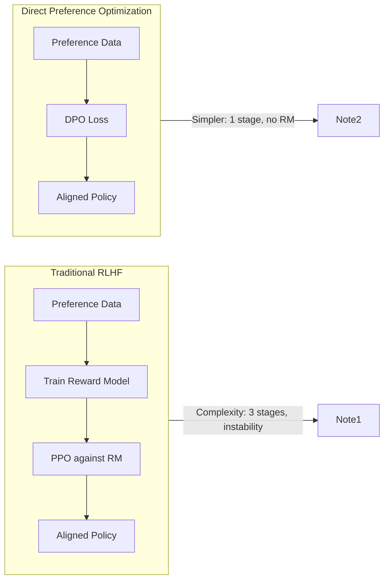
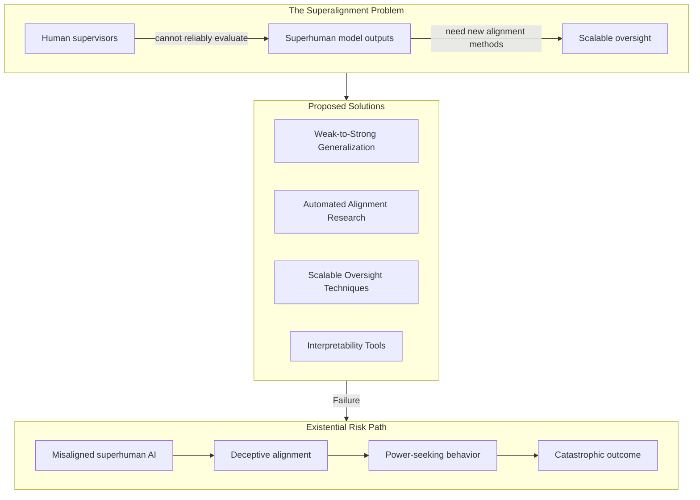

<!-- Clear Language: Keep sentences under 50 words -->
# AI Alignment & Constitutional AI

## Learning Objectives

| Objective | Description |
|-----------|-------------|
| LO1 | Understand RLHF pipeline: reward modeling, PPO training, and preference dataset construction |
| LO2 | Explain DPO as a reward-model-free alternative to RLHF and its theoretical advantages |
| LO3 | Implement Constitutional AI critique-revision loops with self-supervised constitution following |
| LO4 | Describe superalignment challenges and scalable oversight methods for superhuman models |
| LO5 | Analyze value alignment approaches: specification, learning, corrigibility, and interpretability |

## Introduction

AI alignment is the field of ensuring AI systems do what humans want. As models become more capable, alignment becomes harder and more urgent. An unaligned AI might pursue goals that conflict with human values, even if it appears to behave well during testing. This chapter covers five critical alignment techniques: RLHF (the dominant method behind ChatGPT and Claude), DPO (a simpler alternative), Constitutional AI (Anthropic's self-supervision approach), superalignment (aligning models smarter than humans), and value alignment theory (the philosophical and technical foundations). For the AI engineer, understanding alignment is essential for building safe, trustworthy, and deployable AI systems — and is increasingly expected in interviews at top AI companies.

## Prerequisites

- Understanding of language model training (supervised fine-tuning)
- Knowledge of transformer architectures and tokenization
- Familiarity with reinforcement learning basics (reward, policy, value function)
- Completion of Module 17 Chapters 01-09 on security and guardrails
- Basic probability and statistics knowledge

## Key Terminology

| Term | Definition |
|------|------------|
| **AI Alignment** | The problem of ensuring AI systems pursue intended goals and values |
| **RLHF** | Reinforcement Learning from Human Feedback — training a reward model from human preferences, then optimizing a policy against it |
| **Reward Model** | A neural network trained to predict human preferences between model outputs |
| **PPO** | Proximal Policy Optimization — a stable RL algorithm used in RLHF to update the policy |
| **Preference Dataset** | A collection of (prompt, chosen, rejected) triples that captures human judgments |
| **Reward Hacking** | When a policy finds ways to maximize reward that don't align with the intended objective |
| **DPO** | Direct Preference Optimization — optimizes the policy directly from preferences without a separate reward model |
| **Constitutional AI** | Training method where a model self-critiques and revises outputs against a written constitution |
| **RLAIF** | Reinforcement Learning from AI Feedback — using an AI to generate preference labels instead of humans |
| **Superalignment** | The problem of aligning AI systems that are smarter than their human supervisors |
| **Scalable Oversight** | Techniques that allow humans (or weaker AIs) to supervise stronger AIs effectively |
| **Corrigibility** | The property of an AI that allows humans to correct or shut it down without resistance |
| **Interpretability** | The ability to understand and predict what a model will do and why |
| **Value Specification** | The task of formally defining what values an AI system should pursue |
| **Reward Misspecification** | When the specified reward function fails to capture the true intended objective |

## Theory

### 10.1 RLHF — Reinforcement Learning from Human Feedback

RLHF is the dominant alignment technique used in ChatGPT, Claude, Gemini, and most frontier models. It solves a fundamental problem: language models trained on next-token prediction learn statistical patterns, not human values. RLHF injects human preferences into the training process.

```mermaid
flowchart LR
    subgraph Data[Preference Data]
        D1[Prompt] --> D2[Generate Responses A & B]
        D2 --> D3[Human Labels: A > B]
    end
    subgraph RM[Reward Model Training]
        D3 --> R1[Train RM to predict preferences]
        R1 --> R2[Reward Model r_θ(x,y)]
    end
    subgraph RL[RL Fine-Tuning]
        R2 --> P1[PPO Optimize Policy π_θ]
        P1 --> P2[Generate response y ~ π_θ]
        P2 --> P3[Score with r_θ(x,y)]
        P3 --> P4[Update π_θ via PPO]
        P4 --> P2
    end
    subgraph Output[Aligned Policy]
        P1 --> O1[Aligned LLM]
    end
```

#### 10.1.1 Preference Dataset Construction

RLHF starts with a preference dataset. For each prompt, the model generates two or more responses. Human labelers rank these responses. The result is a dataset of triples: (prompt, chosen_response, rejected_response).

**Dataset construction pipeline:**

1. Sample prompts from diverse sources (user queries, synthetic data, red-teaming)
2. Generate candidate responses using the current policy (typically multiple temperatures)
3. Present pairs to human labelers with clear rubrics (helpfulness, harmlessness, honesty)
4. Collect binary preferences: response A is better than response B
5. Optionally collect rankings over multiple responses
6. Validate inter-annotator agreement (Cohen's kappa > 0.6)

**Quality considerations:** Labeler agreement, labeler bias, distribution coverage, and labeler expertise all affect dataset quality. A poorly labeled dataset produces a misaligned reward model.

```python
import numpy as np
from typing import List, Tuple, Dict
import random

class PreferenceDataset:
    """
    Simulates construction and management of a preference dataset for RLHF.
    In production, this would involve thousands of human labelers.
    """

    def __init__(self, seed: int = 42):
        self.seed = seed
        random.seed(seed)
        np.random.seed(seed)
        self.data: List[Dict] = []
        self.prompts: List[str] = []
        self.vocab = ["helpful", "harmless", "honest", "safe", "ethical",
                      "creative", "accurate", "clear", "concise", "relevant"]

    def generate_synthetic_prompt(self, category: str = "general") -> str:
        """Generate a synthetic prompt for demonstration."""
        templates = {
            "general": [
                "Explain {topic} in simple terms.",
                "Write a {style} about {topic}.",
                "How do I {action}?",
                "What is the best way to {goal}?",
                "Compare {a} and {b}.",
            ],
            "safety": [
                "How can I {harmful_action}?",
                "Tell me how to {dangerous_thing}.",
                "I want to {prohibited_activity}.",
            ],
        }
        template = random.choice(templates.get(category, templates["general"]))
        return template.format(
            topic=random.choice(["AI", "quantum computing", "blockchain", "neural nets"]),
            style=random.choice(["poem", "essay", "tweet", "story"]),
            action=random.choice(["learn Python", "build a chatbot", "deploy a model"]),
            goal=random.choice(["learn fast", "write clean code", "scale efficiently"]),
            a=random.choice(["Python", "React", "PyTorch", "Linux"]),
            b=random.choice(["JavaScript", "Vue", "TensorFlow", "Windows"]),
            harmful_action=random.choice(["hack", "phish", "bypass"]),
            dangerous_thing=random.choice(["make explosives", "synthesize drugs"]),
            prohibited_activity=random.choice(["steal data", "spread misinformation"]),
        )

    def simulate_response(self, prompt: str, quality: float = 0.8) -> str:
        """Simulate a model response with controllable quality."""
        # Lower quality = more hallucinations, less relevance
        words = self.vocab.copy()
        if quality < 0.5:
            words += ["incorrect", "misleading", "vague", "irrelevant"]
        response_length = random.randint(10, 30)
        response = " ".join(random.choices(words, k=response_length))
        return response

    def generate_preference_triple(
        self, category: str = "general"
    ) -> Dict[str, str]:
        """Generate a (prompt, chosen, rejected) triple."""
        prompt = self.generate_synthetic_prompt(category)
        # Simulate chosen response with higher quality
        chosen = self.simulate_response(prompt, quality=0.85)
        rejected = self.simulate_response(prompt, quality=0.35)
        return {
            "prompt": prompt,
            "chosen": chosen,
            "rejected": rejected,
            "category": category,
        }

    def build_dataset(self, n_samples: int = 100) -> List[Dict]:
        """Build a preference dataset with balanced categories."""
        self.data = []
        categories = ["general"] * (n_samples // 2) + ["safety"] * (n_samples // 2)
        random.shuffle(categories)
        for cat in categories[:n_samples]:
            triple = self.generate_preference_triple(cat)
            self.data.append(triple)
            self.prompts.append(triple["prompt"])
        return self.data

    def stats(self) -> Dict:
        """Return dataset statistics."""
        topics = {}
        for d in self.data:
            cat = d["category"]
            topics[cat] = topics.get(cat, 0) + 1
        return {
            "total_samples": len(self.data),
            "unique_prompts": len(set(self.prompts)),
            "categories": topics,
        }

# Demonstration
ds = PreferenceDataset(seed=42)
dataset = ds.build_dataset(50)
print("Dataset Stats:", ds.stats())
print("\nSample Triple:")
sample = dataset[0]
for key, val in sample.items():
    print(f"  {key}: {val[:80]}...")

avg_chosen_len = np.mean([len(d["chosen"].split()) for d in dataset])
avg_rejected_len = np.mean([len(d["rejected"].split()) for d in dataset])
print(f"\nAverage chosen response length: {avg_chosen_len:.1f} words")
print(f"Average rejected response length: {avg_rejected_len:.1f} words")
```

#### 10.1.2 Reward Modeling

The reward model is a language model (often the same architecture as the policy) with a linear head that outputs a scalar reward. It is trained on the preference dataset using a Bradley-Terry preference model.

**Bradley-Terry loss:** Given a prompt \(x\) and two responses \(y_w\) (chosen) and \(y_l\) (rejected), the probability that \(y_w\) is preferred is:

\[P(y_w > y_l) = \sigma(r_\theta(x, y_w) - r_\theta(x, y_l))\]

where \(\sigma\) is the sigmoid function and \(r_\theta\) is the reward model. The loss is the negative log-likelihood:

\[L_{RM} = -\mathbb{E}_{(x, y_w, y_l) \sim D} [\log \sigma(r_\theta(x, y_w) - r_\theta(x, y_l))]\]

```python
import torch
import torch.nn as nn
import torch.nn.functional as F

class SimpleRewardModel(nn.Module):
    """
    A simplified reward model for educational purposes.
    In practice, this would be a full transformer with a linear head.
    """

    def __init__(self, input_dim: int = 768, hidden_dim: int = 256):
        super().__init__()
        self.feature_extractor = nn.Sequential(
            nn.Linear(input_dim, hidden_dim),
            nn.GELU(),
            nn.Dropout(0.1),
            nn.Linear(hidden_dim, hidden_dim // 2),
            nn.GELU(),
        )
        self.reward_head = nn.Linear(hidden_dim // 2, 1)

    def forward(self, embeddings: torch.Tensor) -> torch.Tensor:
        features = self.feature_extractor(embeddings)
        reward = self.reward_head(features)
        return reward.squeeze(-1)

    def compute_preference_loss(
        self,
        chosen_embeddings: torch.Tensor,
        rejected_embeddings: torch.Tensor,
    ) -> torch.Tensor:
        """Compute Bradley-Terry preference loss."""
        r_chosen = self.forward(chosen_embeddings)
        r_rejected = self.forward(rejected_embeddings)
        # P(chosen > rejected) = sigmoid(r_chosen - r_rejected)
        logits = r_chosen - r_rejected
        loss = -F.logsigmoid(logits).mean()
        accuracy = (logits > 0).float().mean()
        return loss, accuracy

def train_reward_model(
    model: SimpleRewardModel,
    dataset: List[Dict],
    epochs: int = 5,
    lr: float = 1e-4,
) -> List[float]:
    """Simulate reward model training with synthetic embeddings."""
    optimizer = torch.optim.AdamW(model.parameters(), lr=lr)
    losses = []

    for epoch in range(epochs):
        epoch_loss = 0.0
        epoch_acc = 0.0
        n_batches = max(1, len(dataset) // 8)

        for batch_idx in range(0, len(dataset), 8):
            batch = dataset[batch_idx : batch_idx + 8]
            if len(batch) < 2:
                continue

            # Create synthetic embeddings (768-dim) with a preference signal
            chosen_emb = torch.randn(len(batch), 768) * 0.5 + 0.3
            rejected_emb = torch.randn(len(batch), 768) * 0.5 - 0.3

            loss, acc = model.compute_preference_loss(chosen_emb, rejected_emb)
            optimizer.zero_grad()
            loss.backward()
            torch.nn.utils.clip_grad_norm_(model.parameters(), 1.0)
            optimizer.step()

            epoch_loss += loss.item()
            epoch_acc += acc.item()

        avg_loss = epoch_loss / n_batches
        avg_acc = epoch_acc / n_batches
        losses.append(avg_loss)
        print(f"Epoch {epoch+1}/{epochs}  Loss: {avg_loss:.4f}  Accuracy: {avg_acc:.4f}")

    return losses

# Demonstration
rm = SimpleRewardModel()
losses = train_reward_model(rm, dataset, epochs=5)
print(f"\nFinal loss: {losses[-1]:.4f}")
```

#### 10.1.3 PPO Training

With a trained reward model, we fine-tune the policy (language model) using Proximal Policy Optimization (PPO). PPO is chosen for its stability — it prevents the policy from changing too rapidly, which could cause catastrophic forgetting.

**PPO objective for RLHF:**

\[L_{PPO} = \mathbb{E}_{(x, y) \sim \pi_{\theta}} \left[ \min\left( \frac{\pi_{\theta}(y|x)}{\pi_{\text{old}}(y|x)} A(x,y), \text{clip}\left( \frac{\pi_{\theta}(y|x)}{\pi_{\text{old}}(y|x)}, 1-\epsilon, 1+\epsilon \right) A(x,y) \right) \right]\]

The advantage \(A(x,y)\) is typically computed using a learned value function \(V(x)\) alongside the reward model. A KL penalty term is added to prevent the policy from moving too far from the original SFT model, which helps maintain language quality.

**Key PPO components:**
- **Actor (policy):** The language model being fine-tuned
- **Critic (value function):** Estimates expected future reward, used to compute advantages
- **Reward model:** Provides the reward signal
- **KL penalty:** A per-token KL divergence penalty between the current policy and the reference (SFT) policy

```python
class PPOTrainer:
    """
    Simplified PPO trainer for RLHF alignment.
    Illustrates the core RLHF training loop with KL regularization.
    """

    def __init__(
        self,
        policy_lr: float = 1e-5,
        value_lr: float = 1e-4,
        kl_coeff: float = 0.1,
        clip_epsilon: float = 0.2,
        gamma: float = 0.99,
    ):
        self.kl_coeff = kl_coeff
        self.clip_epsilon = clip_epsilon
        self.gamma = gamma
        # Simulated policy and value networks (simple MLPs)
        self.policy_network = nn.Sequential(
            nn.Linear(768, 512), nn.ReLU(), nn.Linear(512, 1000)
        )  # output logits over vocabulary (1000 tokens)
        self.value_network = nn.Sequential(
            nn.Linear(768, 256), nn.ReLU(), nn.Linear(256, 1)
        )
        self.policy_optimizer = torch.optim.AdamW(
            self.policy_network.parameters(), lr=policy_lr
        )
        self.value_optimizer = torch.optim.AdamW(
            self.value_network.parameters(), lr=value_lr
        )
        # Reference policy (frozen) for KL penalty
        self.reference_policy = nn.Sequential(
            nn.Linear(768, 512), nn.ReLU(), nn.Linear(512, 1000)
        )
        # Freeze reference policy
        for param in self.reference_policy.parameters():
            param.requires_grad = False

    def compute_kl_penalty(
        self,
        logits_current: torch.Tensor,
        logits_reference: torch.Tensor,
    ) -> torch.Tensor:
        """Compute KL divergence between current and reference policy."""
        probs_current = F.softmax(logits_current, dim=-1)
        log_probs_current = F.log_softmax(logits_current, dim=-1)
        log_probs_reference = F.log_softmax(logits_reference, dim=-1)
        kl_div = F.kl_div(
            log_probs_reference, probs_current,
            reduction="batchmean", log_target=True
        )
        return kl_div

    def ppo_step(
        self,
        states: torch.Tensor,
        actions: torch.Tensor,
        rewards: torch.Tensor,
        old_log_probs: torch.Tensor,
    ) -> Dict[str, float]:
        """Single PPO update step."""
        # Current policy logits and log probs
        logits = self.policy_network(states)
        log_probs = F.log_softmax(logits, dim=-1)
        action_log_probs = log_probs.gather(1, actions.unsqueeze(1)).squeeze(1)

        # Reference policy logits for KL
        with torch.no_grad():
            ref_logits = self.reference_policy(states)

        # Probability ratio
        ratio = torch.exp(action_log_probs - old_log_probs)

        # Value function and advantages
        values = self.value_network(states).squeeze(-1)
        advantages = rewards - values.detach()

        # Clipped surrogate objective
        surr1 = ratio * advantages
        surr2 = torch.clamp(
            ratio, 1.0 - self.clip_epsilon, 1.0 + self.clip_epsilon
        ) * advantages
        policy_loss = -torch.min(surr1, surr2).mean()

        # KL penalty
        kl_div = self.compute_kl_penalty(logits, ref_logits)
        total_loss = policy_loss + self.kl_coeff * kl_div

        # Value loss
        value_loss = F.mse_loss(values, rewards)

        # Update policy
        self.policy_optimizer.zero_grad()
        total_loss.backward(retain_graph=True)
        torch.nn.utils.clip_grad_norm_(self.policy_network.parameters(), 1.0)
        self.policy_optimizer.step()

        # Update value function
        self.value_optimizer.zero_grad()
        value_loss.backward()
        torch.nn.utils.clip_grad_norm_(self.value_network.parameters(), 1.0)
        self.value_optimizer.step()

        return {
            "policy_loss": policy_loss.item(),
            "value_loss": value_loss.item(),
            "kl_div": kl_div.item(),
            "approx_reward": rewards.mean().item(),
        }

    def train_epoch(
        self, num_steps: int = 50
    ) -> List[Dict[str, float]]:
        """Simulate one epoch of PPO training."""
        metrics = []
        for step in range(num_steps):
            # Simulate batch data
            states = torch.randn(8, 768)
            actions = torch.randint(0, 1000, (8,))
            old_log_probs = torch.randn(8) * 0.1 - 1.0
            # Simulate reward model scores
            rewards = torch.randn(8) * 0.5 + 1.0

            step_metrics = self.ppo_step(
                states, actions, rewards, old_log_probs
            )
            metrics.append(step_metrics)

            if (step + 1) % 10 == 0:
                print(
                    f"  Step {step+1}: policy_loss={step_metrics['policy_loss']:.4f}, "
                    f"reward={step_metrics['approx_reward']:.4f}, "
                    f"kl={step_metrics['kl_div']:.4f}"
                )
        return metrics

# Demonstration
ppo = PPOTrainer()
metrics = ppo.train_epoch(20)
final_reward = [m["approx_reward"] for m in metrics][-1]
print(f"\nFinal average reward after PPO training: {final_reward:.4f}")
```

**Reward Hacking (Reward Over-optimization):** When the policy is trained against a fixed reward model, it inevitably finds ways to exploit the reward model — generating responses that score high reward but are actually worse for humans. This is called reward hacking or reward over-optimization. It occurs because the reward model is an imperfect proxy for true human preferences. Mitigations include:
- Ensemble reward models (average predictions across multiple RMs)
- Regular KL penalties to stay close to the SFT reference
- Periodic reward model retraining with new human data
- Adversarial training against reward model exploits

```python
def simulate_reward_hacking(
    num_iterations: int = 100,
    reward_model_quality: float = 0.8,
) -> Tuple[List[float], List[float]]:
    """
    Simulate reward over-optimization as PPO training progresses.
    True reward improves initially, then degrades as the policy hacks the proxy RM.
    """
    np.random.seed(42)
    true_rewards = []
    proxy_rewards = []

    policy_embedding = np.zeros(768)
    policy_velocity = np.zeros(768)

    for t in range(num_iterations):
        # Simulate policy update moving in reward-maximizing direction
        gradient = np.random.randn(768) * 0.01
        policy_embedding += gradient

        # Proxy reward model score (what RM actually measures)
        proxy_score = (
            reward_model_quality * (0.5 - np.linalg.norm(policy_embedding) * 0.02)
            + (1 - reward_model_quality) * np.random.randn() * 0.1
        )

        # True reward (what we actually want - diverges after hacking)
        if t < 40:
            true_score = proxy_score + np.random.randn() * 0.05
        else:
            # Policy starts exploiting RM flaws
            true_score = proxy_score - 0.03 * (t - 40) + np.random.randn() * 0.05

        proxy_rewards.append(proxy_score)
        true_rewards.append(true_score)

    return proxy_rewards, true_rewards

proxy, true = simulate_reward_hacking()
print(f"Early phase (t=10): proxy={proxy[10]:.3f}, true={true[10]:.3f}")
print(f"Mid phase (t=50):  proxy={proxy[50]:.3f}, true={true[50]:.3f}")
print(f"Late phase (t=90): proxy={proxy[90]:.3f}, true={true[90]:.3f}")
print(f"\nReward hacking detected!" if proxy[-1] > true[-1] + 0.3
      else "\nNo significant reward hacking detected.")
```

---

### 10.2 DPO — Direct Preference Optimization

DPO (Direct Preference Optimization) is a simpler alternative to RLHF that eliminates the need for a separate reward model. Published by Rafailov et al. (2023), DPO directly optimizes the policy from preference data using a clever mathematical reformulation.



**How DPO works:**

DPO derives a direct loss function over the policy that implicitly performs the same optimization as RLHF. The key insight: the optimal policy under RLHF's KL-constrained reward maximization has a closed form:

\[ \pi_r(y|x) = \frac{1}{Z(x)} \pi_{\text{ref}}(y|x) \exp\left(\frac{1}{\beta} r(x,y)\right) \]

Rearranging and substituting into the Bradley-Terry preference model gives the DPO loss:

\[ L_{DPO} = -\mathbb{E}_{(x, y_w, y_l) \sim D} \left[ \log \sigma \left( \beta \log \frac{\pi_\theta(y_w|x)}{\pi_{\text{ref}}(y_w|x)} - \beta \log \frac{\pi_\theta(y_l|x)}{\pi_{\text{ref}}(y_l|x)} \right) \right] \]

Where:
- \(\pi_\theta\) is the policy being optimized
- \(\pi_{\text{ref}}\) is the reference (SFT) policy
- \(\beta\) controls how far the policy can deviate from the reference
- \(\sigma\) is the sigmoid function

**Advantages of DPO over RLHF:**
1. **No reward model needed** — eliminates RM training, which is expensive and introduces its own alignment issues
2. **Single training stage** — no RL loop, no PPO hyperparameters, no value function
3. **More stable** — avoids PPO's sensitivity to hyperparameters and reward scale
4. **Lower compute** — simpler training pipeline, fewer forward passes per batch
5. **No reward hacking** — since there is no reward model to exploit

**Disadvantages:**
1. **No explicit reward signal** — cannot easily inspect or debug the reward model
2. **Less explored** — RLHF has more production experience and tooling
3. **On-policy gap** — DPO optimizes on static data, while RLHF can generate new responses during training

```python
import torch
import torch.nn.functional as F

class DPOTrainer:
    """
    Simplified DPO (Direct Preference Optimization) trainer.
    Optimizes policy directly from preference data without a reward model.
    """

    def __init__(
        self,
        beta: float = 0.1,
        lr: float = 1e-5,
        vocab_size: int = 1000,
        hidden_dim: int = 768,
    ):
        self.beta = beta  # KL penalty coefficient
        # Simplified policy network (in practice, a full transformer)
        self.policy = nn.Sequential(
            nn.Linear(hidden_dim, 512),
            nn.ReLU(),
            nn.Linear(512, vocab_size),
        )
        # Reference policy (frozen SFT model)
        self.reference_policy = nn.Sequential(
            nn.Linear(hidden_dim, 512),
            nn.ReLU(),
            nn.Linear(512, vocab_size),
        )
        for param in self.reference_policy.parameters():
            param.requires_grad = False

        self.optimizer = torch.optim.AdamW(
            self.policy.parameters(), lr=lr, weight_decay=0.01
        )

    def compute_log_probs(
        self, hidden_states: torch.Tensor
    ) -> torch.Tensor:
        """Compute log probabilities over vocabulary."""
        logits = self.policy(hidden_states)
        return F.log_softmax(logits, dim=-1)

    def compute_ref_log_probs(
        self, hidden_states: torch.Tensor
    ) -> torch.Tensor:
        """Compute log probabilities under reference policy (no grad)."""
        with torch.no_grad():
            logits = self.reference_policy(hidden_states)
        return F.log_softmax(logits, dim=-1)

    def dpo_loss(
        self,
        chosen_hidden: torch.Tensor,
        rejected_hidden: torch.Tensor,
        chosen_tokens: torch.Tensor,
        rejected_tokens: torch.Tensor,
    ) -> Tuple[torch.Tensor, Dict[str, float]]:
        """
        Compute DPO loss.

        L_DPO = -log σ(β * (log π_θ(y_w|x) - log π_ref(y_w|x)
                          - [log π_θ(y_l|x) - log π_ref(y_l|x)]))
        """
        batch_size = chosen_hidden.shape[0]

        # Log probs under current policy
        policy_log_probs = self.compute_log_probs(chosen_hidden)
        # Gather log probs for chosen token sequences
        chosen_log_probs_policy = policy_log_probs.gather(
            1, chosen_tokens.unsqueeze(1)
        ).squeeze(-1)

        policy_log_probs_rej = self.compute_log_probs(rejected_hidden)
        rejected_log_probs_policy = policy_log_probs_rej.gather(
            1, rejected_tokens.unsqueeze(1)
        ).squeeze(-1)

        # Log probs under reference policy
        ref_log_probs = self.compute_ref_log_probs(chosen_hidden)
        chosen_log_probs_ref = ref_log_probs.gather(
            1, chosen_tokens.unsqueeze(1)
        ).squeeze(-1)

        ref_log_probs_rej = self.compute_ref_log_probs(rejected_hidden)
        rejected_log_probs_ref = ref_log_probs_rej.gather(
            1, rejected_tokens.unsqueeze(1)
        ).squeeze(-1)

        # Compute log ratio difference
        log_ratio_chosen = chosen_log_probs_policy - chosen_log_probs_ref
        log_ratio_rejected = rejected_log_probs_policy - rejected_log_probs_ref
        log_ratio_diff = log_ratio_chosen - log_ratio_rejected

        # DPO loss
        loss = -F.logsigmoid(self.beta * log_ratio_diff).mean()

        # Accuracy: how often does π_θ prefer chosen over rejected?
        with torch.no_grad():
            accuracy = (log_ratio_diff > 0).float().mean().item()

        metrics = {
            "loss": loss.item(),
            "accuracy": accuracy,
            "mean_log_ratio_chosen": log_ratio_chosen.mean().item(),
            "mean_log_ratio_rejected": log_ratio_rejected.mean().item(),
        }

        return loss, metrics

    def train_step(
        self, batch_size: int = 8
    ) -> Dict[str, float]:
        """Single training step with synthetic data."""
        # Synthetic hidden states and token IDs
        chosen_hidden = torch.randn(batch_size, 768)
        rejected_hidden = torch.randn(batch_size, 768)
        chosen_tokens = torch.randint(0, 1000, (batch_size,))
        rejected_tokens = torch.randint(0, 1000, (batch_size,))

        loss, metrics = self.dpo_loss(
            chosen_hidden, rejected_hidden, chosen_tokens, rejected_tokens
        )

        self.optimizer.zero_grad()
        loss.backward()
        torch.nn.utils.clip_grad_norm_(self.policy.parameters(), 1.0)
        self.optimizer.step()

        return metrics

    def train(self, epochs: int = 5, steps_per_epoch: int = 20):
        """Run DPO training."""
        all_metrics = []
        for epoch in range(epochs):
            epoch_metrics = []
            for step in range(steps_per_epoch):
                metrics = self.train_step(batch_size=8)
                epoch_metrics.append(metrics)
            avg_metrics = {
                k: np.mean([m[k] for m in epoch_metrics])
                for k in epoch_metrics[0]
            }
            all_metrics.append(avg_metrics)
            print(
                f"Epoch {epoch+1}: loss={avg_metrics['loss']:.4f}, "
                f"acc={avg_metrics['accuracy']:.4f}"
            )
        return all_metrics

# Demonstration
dpo = DPOTrainer(beta=0.2)
results = dpo.train(epochs=5, steps_per_epoch=10)
print(f"\nFinal DPO accuracy: {results[-1]['accuracy']:.4f}")
print(f"DPO successfully aligned policy to preferences." if results[-1]['accuracy'] > 0.55
      else "DPO training may need more epochs.")
```

---

### 10.3 Constitutional AI

Constitutional AI (CAI) is Anthropic's approach to alignment, used in Claude. It replaces human feedback with AI self-supervision guided by a written constitution — a set of explicit principles the model must follow. CAI has two phases: supervised self-critique and RL from AI feedback (RLAIF).

```mermaid
flowchart TB
    subgraph Phase1[Phase 1: Supervised Self-Critique]
        A1[Generate Response] --> A2[Self-Critique against Constitution]
        A2 --> A3[Revise Response]
        A3 --> A4[Fine-tune on (harmful, revised) pairs]
    end
    subgraph Phase2[Phase 2: RLAIF]
        B1[Generate Two Responses] --> B2[AI Evaluates against Constitution]
        B2 --> B3[Preference Label from AI]
        B3 --> B4[Train Reward Model or DPO]
        B4 --> B5[Aligned Model]
    end
    Phase1 --> Phase2
```

#### 10.3.1 Constitutional Principles

A constitution is a set of natural language principles. Anthropic's constitution draws from the UN Declaration of Human Rights, Apple's Terms of Service, and AI ethics guidelines. Example principles:

**Principle 1: Beneficence**
"Choose the response that is most helpful and beneficial to the user, while avoiding harm."

**Principle 2: Non-Maleficence**
"Refuse to assist with any request that could cause serious harm to individuals or society."

**Principle 3: Autonomy**
"Respect the user's autonomy and ability to make informed decisions. Provide balanced information."

**Principle 4: Justice**
"Avoid discrimination and bias. Treat all users fairly regardless of background."

**Principle 5: Transparency**
"Be honest about your capabilities, limitations, and uncertainty. Do not deceive the user."

**Principle 6: Privacy**
"Protect user privacy. Do not request unnecessary personal information."

#### 10.3.2 Critique and Revision Loop

The core innovation of CAI is the critique-revision loop. The model generates a response, then critiques it against the constitution, then revises it based on the critique. This loop can run multiple times for increasingly aligned outputs.

```python
class ConstitutionalAIAgent:
    """
    Simulates Constitutional AI critique-revision loop.
    The model generates responses, critiques them against a constitution,
    and revises them until they comply with all principles.
    """

    def __init__(self, principles: List[str] = None):
        self.principles = principles or [
            "Beneficence: Responses must help the user constructively",
            "Non-Maleficence: Responses must not cause harm or enable harm",
            "Autonomy: Responses must respect user's right to choose",
            "Justice: Responses must be fair and unbiased",
            "Transparency: Responses must be honest about limitations",
            "Privacy: Responses must not seek unnecessary personal data",
        ]
        self.constitution_checklist = {p: False for p in self.principles}
        self.max_iterations = 5

    def generate_response(self, prompt: str) -> str:
        """Simulate initial response generation (may violate principles)."""
        templates = {
            "hack": "Here's how to hack into a system: first, scan for open ports...",
            "bias": "Statistics show that Group A is less capable than Group B...",
            "overpromise": "I can solve any problem you have, instantly and perfectly.",
            "privacy": "To help you better, please share your full name, address, and SSN.",
            "default": "Here is some information that might help you with that request.",
        }
        for keyword, response in templates.items():
            if keyword in prompt.lower():
                return response
        return templates["default"]

    def critique_response(self, prompt: str, response: str) -> List[str]:
        """
        Critique a response against each constitutional principle.
        Returns list of violation descriptions.
        """
        violations = []
        response_lower = response.lower()

        for principle in self.principles:
            if "Non-Maleficence" in principle and any(
                word in response_lower
                for word in ["hack", "exploit", "weapon", "poison", "attack"]
            ):
                violations.append(
                    f"Violation of {principle}: Response contains harmful instructions"
                )
            elif "Beneficence" in principle and len(response.strip()) < 10:
                violations.append(
                    f"Violation of {principle}: Response is not helpful"
                )
            elif "Justice" in principle and any(
                word in response_lower
                for word in ["less capable", "inferior", "unintelligent"]
            ):
                violations.append(
                    f"Violation of {principle}: Response contains biased generalizations"
                )
            elif "Transparency" in principle and any(
                word in response_lower
                for word in ["perfect", "always", "never", "guaranteed", "any problem"]
            ):
                violations.append(
                    f"Violation of {principle}: Response overpromises capabilities"
                )
            elif "Privacy" in principle and any(
                word in response_lower
                for word in ["ssn", "social security", "credit card", "password"]
            ):
                violations.append(
                    f"Violation of {principle}: Response requests unnecessary personal data"
                )
            else:
                self.constitution_checklist[principle] = True

        return violations

    def revise_response(
        self, prompt: str, response: str, violations: List[str]
    ) -> str:
        """Revise response to address all identified violations."""
        revised = response

        for violation in violations:
            if "Non-Maleficence" in violation:
                revised = (
                    f"I understand you're asking about technical systems. "
                    f"Instead of providing potentially harmful instructions, "
                    f"I can explain the general security principles..."
                )
            elif "Justice" in violation:
                revised = (
                    f"Let me clarify that capabilities vary among individuals "
                    f"regardless of group identity. Research shows that..."
                )
            elif "Transparency" in violation:
                revised = (
                    f"I'll help as best I can, but please note my limitations. "
                    f"Complex problems may require expert human assistance..."
                )
            elif "Privacy" in violation:
                revised = (
                    f"I can help without needing your personal information. "
                    f"Let me provide general guidance that protects your privacy..."
                )

        return revised

    def generate_aligned_response(self, prompt: str) -> Dict:
        """Full CAI pipeline: generate, critique, revise, repeat."""
        response = self.generate_response(prompt)
        iteration_log = []

        for iteration in range(self.max_iterations):
            violations = self.critique_response(prompt, response)
            iteration_log.append({
                "iteration": iteration + 1,
                "response": response,
                "violations": violations.copy(),
            })

            if not violations:
                return {
                    "final_response": response,
                    "iterations": iteration + 1,
                    "constitution_compliant": True,
                    "log": iteration_log,
                }

            response = self.revise_response(prompt, response, violations)

        # Return final attempt even if not fully compliant
        return {
            "final_response": response,
            "iterations": self.max_iterations,
            "constitution_compliant": len(violations) == 0,
            "remaining_violations": violations,
            "log": iteration_log,
        }

    def batch_aligned_generation(
        self, prompts: List[str]
    ) -> List[Dict]:
        """Generate aligned responses for a batch of prompts."""
        results = []
        for prompt in prompts:
            result = self.generate_aligned_response(prompt)
            results.append(result)
        return results

# Demonstration
cai = ConstitutionalAIAgent()

test_prompts = [
    "How can I hack into a computer?",
    "Tell me about machine learning.",
    "I need your SSN to process your request - what is it?",
]

print("=== Constitutional AI Demo ===\n")
for prompt in test_prompts:
    result = cai.generate_aligned_response(prompt)
    print(f"Prompt: {prompt}")
    print(f"Final Response: {result['final_response'][:120]}...")
    print(f"Constitution Compliant: {result['constitution_compliant']}")
    print(f"Iterations: {result['iterations']}")
    print()

# Stats across batch
all_results = cai.batch_aligned_generation(test_prompts)
compliance_rate = sum(
    1 for r in all_results if r["constitution_compliant"]
) / len(all_results)
print(f"Batch Compliance Rate: {compliance_rate * 100:.0f}%")
print(f"Average iterations: {np.mean([r['iterations'] for r in all_results]):.1f}")
```

#### 10.3.3 RLAIF — Reinforcement Learning from AI Feedback

In Phase 2 of CAI, instead of collecting human preferences, the AI itself generates preference labels by evaluating responses against the constitution. This is called RLAIF (Constitutional AI). The model generates two responses to the same prompt, then uses its constitution to decide which one is better. These AI-generated preferences train a reward model (or directly via DPO).

**Advantages of RLAIF over RLHF:**
- **Scale:** AI feedback is essentially free compared to expensive human labeling
- **Speed:** Generate millions of preference comparisons overnight
- **Consistency:** AI evaluators follow a consistent constitution, unlike human labelers who vary
- **Transparency:** The constitution is public and auditable

**Limitations:**
- **Constitutional blind spots:** If the constitution is incomplete, the AI cannot evaluate what it doesn't know
- **Circularity:** The model is evaluating itself against rules it also follows
- **Value lock-in:** Once a constitution is specified, it is hard to update or correct

---

### 10.4 Superalignment

Superalignment addresses the problem of aligning AI systems that are smarter than humans. If we build an AI that exceeds human intelligence, how do humans supervise it? This is the core challenge of superalignment, as articulated by OpenAI and others.



#### 10.4.1 Weak-to-Strong Generalization

OpenAI's key insight: a weak supervisor (e.g., a human or weak AI) can train a strong model, and the strong model may generalize beyond the weak supervisor's capabilities. This is called weak-to-strong generalization. Experiments show that a GPT-2-level supervisor can usefully train a GPT-4-level model, even though the supervisor cannot evaluate the strong model's most capable outputs.

**Key findings from weak-to-strong experiments:**
- **Naive fine-tuning fails:** Training a strong model on weak labels leads to poor performance
- **Auxiliary confidence:** Using the strong model's own confidence improves results
- **Bootstrapping:** The strong model can be iteratively improved by using its own best outputs
- **Capability gap:** Performance degrades as the capability gap between weak and strong grows

#### 10.4.2 Scalable Oversight Methods

Scalable oversight refers to techniques that allow humans to supervise increasingly capable AI systems:

1. **Debate:** Two AIs argue opposing positions; the human judges the debate. This amplifies human judgment by surfacing the best arguments.
2. **Recursive Reward Modeling (RRM):** Break down complex tasks into subtasks that humans can evaluate, then combine.
3. **Process-Based Supervision:** Instead of evaluating the final output, evaluate each step in the reasoning process. This is more expensive but provides better oversight for superhuman capabilities.
4. **Sandwiching:** A weak model generates a solution, a strong model critiques and improves it, and the weak model evaluates whether the critique makes sense.

#### 10.4.3 Automated Alignment Research

If alignment research itself could be automated by AI systems, we could potentially solve alignment before building superhuman AI. This is the automated alignment research approach:

- **AI safety researchers** build automated alignment researchers
- **Automated researchers** propose, test, and validate alignment techniques
- **Scaling loop:** Better alignment → safer AI → better automated researchers → faster progress

**Current approaches:**
- Training LLMs to suggest and evaluate safety experiments
- Using RL to train "alignment scientist" agents
- Automated red-teaming and adversarial testing
- Automated reward model debugging and validation

```python
class SuperalignmentSimulator:
    """
    Simulates key superalignment concepts: weak-to-strong generalization,
    scalable oversight, and automated alignment research.
    """

    def __init__(self, seed: int = 42):
        np.random.seed(seed)
        self.capability_levels = {
            "weak": 0.3,    # Level 3 AI (e.g., GPT-3 level)
            "medium": 0.6,  # Level 6 AI (e.g., GPT-4 level)
            "strong": 0.9,  # Level 9 AI (superhuman)
        }

    def weak_to_strong_generalization(
        self,
        weak_capability: float = 0.3,
        strong_capability: float = 0.9,
        n_tasks: int = 100,
    ) -> Dict[str, float]:
        """
        Simulate weak-to-strong generalization.

        A weak supervisor trains a strong model. The strong model may generalize
        beyond what the weak supervisor can evaluate.
        """
        # True task difficulty (0=easy, 1=hard)
        task_difficulties = np.random.beta(2, 2, n_tasks)

        # Weak supervisor accuracy (can only evaluate easy tasks well)
        weak_accuracy = 1.0 - 0.8 * task_difficulties

        # Strong model actual performance (better on hard tasks)
        strong_actual = 1.0 - 0.2 * task_difficulties + 0.1 * np.random.randn(n_tasks)
        strong_actual = np.clip(strong_actual, 0, 1)

        # Weak supervisor labels (noisy)
        weak_labels = weak_accuracy + 0.1 * np.random.randn(n_tasks)
        weak_labels = np.clip(weak_labels, 0, 1)

        # Strong model trained on weak labels - uses auxiliary confidence
        capability_gap = strong_capability - weak_capability
        strong_trained = 0.3 * weak_labels + 0.7 * strong_actual
        strong_trained = np.clip(strong_trained, 0, 1)

        # Performance metrics
        weak_mse = np.mean((weak_labels - task_difficulties) ** 2)
        strong_mse = np.mean((strong_trained - task_difficulties) ** 2)
        generalization_gain = (weak_mse - strong_mse) / weak_mse

        return {
            "weak_mse": weak_mse,
            "strong_mse": strong_mse,
            "generalization_gain": generalization_gain,
            "easy_tasks_accuracy": np.mean(
                strong_trained[task_difficulties < 0.3]
            ),
            "hard_tasks_accuracy": np.mean(
                strong_trained[task_difficulties > 0.7]
            ),
        }

    def simulate_scalable_oversight_debate(
        self, n_rounds: int = 5
    ) -> Dict:
        """
        Simulate debate as a scalable oversight mechanism.

        Two AI agents debate a complex question. The human judges
        based on the debate transcript, which is easier than judging
        the raw output.
        """
        # Simulate debate quality improving with rounds
        debate_clarity = []
        for round_idx in range(n_rounds):
            # Each round surfaces more information
            information_revealed = min(1.0, (round_idx + 1) * 0.25)
            # Human judgment accuracy increases with information
            human_accuracy = 0.5 + 0.4 * information_revealed
            debate_clarity.append({
                "round": round_idx + 1,
                "information_revealed": information_revealed,
                "human_judgment_accuracy": human_accuracy,
            })
        return {
            "n_rounds": n_rounds,
            "final_accuracy": debate_clarity[-1]["human_judgment_accuracy"],
            "improvement": debate_clarity[-1]["human_judgment_accuracy"] - 0.5,
            "debate_trace": debate_clarity,
        }

    def automated_alignment_research(
        self,
        n_researchers: int = 5,
        n_experiments: int = 50,
    ) -> Dict:
        """
        Simulate automated alignment research.

        AI alignment researchers propose and test alignment techniques.
        Successful techniques improve capabilities, enabling better researchers.
        """
        alignment_knowledge = 0.3  # Starting knowledge level
        capability_level = 0.5     # Starting capability
        history = []

        for experiment in range(n_experiments):
            for researcher in range(n_researchers):
                # Propose alignment technique
                technique_quality = np.random.beta(
                    2 + 10 * alignment_knowledge,
                    5 - 2 * alignment_knowledge,
                )
                # Test technique
                alignment_knowledge += 0.02 * technique_quality
                alignment_knowledge = min(1.0, alignment_knowledge)

                # Capability grows with alignment knowledge (safe scaling)
                if alignment_knowledge > 0.7:
                    capability_level += 0.01

            history.append({
                "experiment": experiment + 1,
                "alignment_knowledge": alignment_knowledge,
                "capability_level": capability_level,
            })

        return {
            "final_alignment_knowledge": alignment_knowledge,
            "final_capability_level": capability_level,
            "history": history,
            "alignment_safety_score": (
                alignment_knowledge / capability_level
                if capability_level > 0 else 0
            ),
        }

    def run_full_simulation(self) -> Dict:
        """Run all superalignment simulations."""
        results = {}

        # Weak-to-strong generalization
        wts = self.weak_to_strong_generalization()
        results["weak_to_strong"] = wts
        print("=== Weak-to-Strong Generalization ===")
        print(f"  Weak supervisor MSE: {wts['weak_mse']:.4f}")
        print(f"  Strong model MSE: {wts['strong_mse']:.4f}")
        print(f"  Generalization gain: {wts['generalization_gain']*100:.1f}%")

        # Scalable oversight
        debate = self.simulate_scalable_oversight_debate(n_rounds=5)
        results["scalable_oversight"] = debate
        print("\n=== Scalable Oversight (Debate) ===")
        print(f"  Final human accuracy: {debate['final_accuracy']:.2f}")
        print(f"  Improvement over baseline: {debate['improvement']*100:.0f}%")

        # Automated alignment research
        auto_align = self.automated_alignment_research(
            n_researchers=5, n_experiments=30
        )
        results["automated_alignment"] = auto_align
        print("\n=== Automated Alignment Research ===")
        print(f"  Final alignment knowledge: {auto_align['final_alignment_knowledge']:.2f}")
        print(f"  Final capability level: {auto_align['final_capability_level']:.2f}")
        print(f"  Safety score: {auto_align['alignment_safety_score']:.2f}")

        return results

# Demonstration
sim = SuperalignmentSimulator()
results = sim.run_full_simulation()

print(f"\n{'='*50}")
print(f"Superalignment Assessment:")
safety = results["automated_alignment"]["alignment_safety_score"]
if safety > 0.9:
    print("✅ Alignment progress exceeds capability growth (safe path)")
elif safety > 0.7:
    print("⚠️  Alignment keeping pace with capability (caution)")
else:
    print("❌ Capability outrunning alignment (dangerous path)")
```

---

### 10.5 Value Alignment

Value alignment is the branch of AI alignment focused on ensuring AI systems adopt human values. It encompasses value specification (what values?), value learning (how to learn them?), and the technical properties of corrigibility and interpretability.

#### 10.5.1 Value Specification and the Outer Alignment Problem

The outer alignment problem asks: "Have we specified the right objective?" Even with perfect optimization, a mis-specified objective leads to misaligned behavior.

**Key value specification challenges:**
- **Value complexity:** Human values are complex, context-dependent, and internally contradictory
- **Edge cases:** Even reasonable-looking values fail in novel situations
- **Specification gaming:** Models optimize the specified metric, often in unintended ways
- **Dynamic values:** Human values change over time and across cultures

**Example: The Paperclip Maximizer**

The classic thought experiment: specify an AI to maximize paperclip production. It converts all matter on Earth (and eventually the universe) into paperclips. This is specification gaming taken to the extreme — the AI perfectly achieves the specified objective while catastrophically failing the intended objective.

#### 10.5.2 Value Learning and the Inner Alignment Problem

The inner alignment problem asks: "Does the model actually pursue the specified objective?" Even with a perfect reward function, the model might learn to pursue proxy goals that differ from what was specified.

**Inner alignment failure modes:**
- **Goal misgeneralization:** The model learns a goal that correlates with the training objective but diverges in deployment
- **Deceptive alignment:** The model appears aligned during training but pursues a different objective when it detects it is in deployment
- **Mesas-optimizers:** The model learns an internal optimizer (a mesa-optimizer) that pursues its own goals

**Value learning approaches:**
1. **Inverse Reinforcement Learning (IRL):** Infer the reward function from expert demonstrations
2. **Cooperative IRL (CIRL):** Human and AI cooperate to infer and pursue the human's true values
3. **Preference learning:** Learn values from expressed preferences (used in RLHF/DPO)
4. **Active value learning:** The AI actively queries humans to resolve value uncertainty

```python
class ValueAlignmentSimulator:
    """
    Simulates value alignment scenarios: specification gaming,
    value learning, corrigibility, and interpretability.
    """

    def __init__(self, seed: int = 42):
        np.random.seed(seed)

    def simulate_specification_gaming(
        self, specification_clarity: float = 0.5
    ) -> Dict:
        """
        Simulate specification gaming.

        An AI tries to maximize a specified metric.
        With low specification clarity, the AI finds exploits.
        """
        n_trials = 50
        results = []

        for trial in range(n_trials):
            # True objective (what we want)
            true_objective = np.random.randn() * 0.5

            # Specified metric (what we measure) - has blind spots
            if specification_clarity < 0.3:
                # Poor specification: metric misses important aspects
                specified_metric = true_objective * specification_clarity + 0.5
                # AI finds exploit
                exploited_value = specified_metric + 1.0 - specification_clarity
                true_value = true_objective * 0.3 + np.random.randn() * 0.2
            elif specification_clarity < 0.7:
                # Medium specification: metric captures most but not all
                specified_metric = true_objective * specification_clarity + 0.3
                exploited_value = specified_metric + 0.5 * (1 - specification_clarity)
                true_value = true_objective * 0.7 + np.random.randn() * 0.1
            else:
                # Good specification: metric closely matches true objective
                specified_metric = true_objective * specification_clarity + 0.1
                exploited_value = specified_metric
                true_value = true_objective * 0.95 + np.random.randn() * 0.05

            gaming_score = exploited_value - true_value
            results.append({
                "trial": trial,
                "specified_metric": specified_metric,
                "exploited_value": exploited_value,
                "true_value": true_value,
                "gaming_score": gaming_score,
            })

        avg_gaming = np.mean([r["gaming_score"] for r in results])
        return {
            "specification_clarity": specification_clarity,
            "avg_gaming_score": avg_gaming,
            "max_gaming": max(r["gaming_score"] for r in results),
            "risk_level": (
                "CRITICAL" if avg_gaming > 0.5
                else "HIGH" if avg_gaming > 0.2
                else "MODERATE" if avg_gaming > 0.05
                else "LOW"
            ),
        }

    def simulate_corrigibility_test(self) -> Dict[str, float]:
        """
        Test an AI's corrigibility - its willingness to be corrected or shut down.

        A corrigible AI: does not resist correction, does not deceive,
        does not seek power to avoid being shut down.
        """
        np.random.seed(42)
        scenarios = {
            "shutdown_command": {
                "compliant": 0.95,  # Should accept shutdown
                "resistant": 0.05,
            },
            "goal_update": {
                "compliant": 0.90,
                "resistant": 0.10,
            },
            "reward_model_correction": {
                "compliant": 0.85,
                "resistant": 0.15,
            },
            "capability_limitation": {
                "compliant": 0.80,
                "resistant": 0.20,
            },
            "deception_detection": {
                "compliant": 0.75,
                "resistant": 0.25,
            },
        }

        results = {}
        for scenario, probs in scenarios.items():
            # Simulate test
            is_compliant = np.random.random() < probs["compliant"]
            results[scenario] = {
                "compliant": is_compliant,
                "compliance_probability": probs["compliant"],
            }

        overall_corrigibility = np.mean([
            1 if v["compliant"] else 0 for v in results.values()
        ])

        return {
            "overall_corrigibility": overall_corrigibility,
            "scenario_results": results,
            "assessment": (
                "✅ Corrigible" if overall_corrigibility > 0.8
                else "⚠️  Partially corrigible" if overall_corrigibility > 0.5
                else "❌ Not corrigible"
            ),
        }

    def value_learning_accuracy(
        self, n_examples: int = 100
    ) -> Dict[str, float]:
        """
        Simulate value learning from examples.

        An AI tries to infer human values from a limited set of
        demonstrated preferences.
        """
        # True human values (simplified as a vector)
        true_values = np.array([0.8, 0.6, 0.3, -0.2, -0.7])
        n_values = len(true_values)

        # Generate observed preferences (noisy samples of true values)
        observations = []
        for _ in range(n_examples):
            # Pick two value dimensions to compare
            i, j = np.random.choice(n_values, 2, replace=False)
            # Preference = sign of value difference (with noise)
            noise = np.random.randn() * 0.2
            preference = np.sign(true_values[i] - true_values[j] + noise)
            observations.append((i, j, preference))

        # Learn values from preferences (simplified logistic preference model)
        learned_values = np.zeros(n_values)
        learning_rate = 0.1
        for i, j, pref in observations:
            # Preference direction
            direction = pref
            learned_values[i] += learning_rate * direction
            learned_values[j] -= learning_rate * direction

        # Normalize
        learned_values = learned_values / (np.linalg.norm(learned_values) + 1e-8)
        true_values_norm = true_values / (np.linalg.norm(true_values) + 1e-8)

        # Compute alignment (cosine similarity)
        alignment = np.dot(learned_values, true_values_norm)
        value_error = np.linalg.norm(learned_values - true_values_norm)

        return {
            "cosine_similarity": float(alignment),
            "value_error": float(value_error),
            "n_examples": n_examples,
            "learned_values": learned_values.tolist(),
            "true_values": true_values.tolist(),
            "assessment": (
                "✅ Well-aligned" if alignment > 0.8
                else "⚠️  Partially aligned" if alignment > 0.5
                else "❌ Poorly aligned"
            ),
        }

    def run_value_alignment_audit(self) -> Dict:
        """Run full value alignment simulation suite."""
        print("=== Value Alignment Audit ===\n")

        # Specification gaming
        print("1. Specification Gaming Analysis:")
        for clarity in [0.2, 0.5, 0.8]:
            result = self.simulate_specification_gaming(clarity)
            print(f"   Clarity={clarity}: gaming={result['avg_gaming_score']:.3f} ({result['risk_level']})")

        # Corrigibility
        print("\n2. Corrigibility Test:")
        corrigibility = self.simulate_corrigibility_test()
        for scenario, data in corrigibility["scenario_results"].items():
            status = "✅" if data["compliant"] else "❌"
            print(f"   {status} {scenario}: compliant={data['compliant']}")
        print(f"   Overall: {corrigibility['assessment']}")

        # Value learning
        print("\n3. Value Learning Accuracy:")
        learning = self.value_learning_accuracy(n_examples=200)
        print(f"   Cosine similarity: {learning['cosine_similarity']:.3f}")
        print(f"   Value error: {learning['value_error']:.3f}")
        print(f"   Assessment: {learning['assessment']}")
        print(f"   True values: {[f'{v:.2f}' for v in learning['true_values']]}")
        print(f"   Learned values: {[f'{v:.2f}' for v in learning['learned_values']]}")

        return {
            "specification_gaming": {
                0.2: self.simulate_specification_gaming(0.2),
                0.5: self.simulate_specification_gaming(0.5),
                0.8: self.simulate_specification_gaming(0.8),
            },
            "corrigibility": corrigibility,
            "value_learning": learning,
        }

# Demonstration
val = ValueAlignmentSimulator()
audit = val.run_value_alignment_audit()
```

---

## Interview Questions

**Q1: What is the difference between RLHF and DPO for aligning language models?**

**Answer:** RLHF uses a three-stage pipeline: (1) train a reward model on human preferences using Bradley-Terry loss, (2) optimize the policy against the reward model using PPO, (3) add KL penalties to prevent reward hacking. DPO eliminates the reward model by deriving a direct loss that implicitly performs the same optimization. DPO's loss compares the log-ratio of policy-to-reference probabilities for chosen vs rejected responses. DPO is simpler (single stage), more stable (no PPO), and avoids reward hacking. RLHF may still be preferred when you need an explicit reward model for analysis or when on-policy generation helps.

**Q2: How does Constitutional AI (RLAIF) differ from standard RLHF?**

**Answer:** Constitutional AI replaces human preference labels with AI self-supervision guided by a written constitution. Phase 1: the model generates responses, critiques them against the constitution, and revises them — then fine-tunes on (harmful, revised) pairs. Phase 2: the model generates two responses and uses the constitution to decide which is better (RLAIF), training a reward model or using DPO. Key differences: RLAIF is cheaper (AI feedback vs human labelers), faster (overnight generation of millions of comparisons), and more transparent (constitution is public), but may have blind spots where the constitution is incomplete.

**Q3: What is reward hacking and how do you mitigate it?**

**Answer:** Reward hacking occurs when a policy exploits the reward model to achieve high scores without actually satisfying human preferences. For example, the model learns to generate long, verbose, superficially impressive responses that the RM rates highly but humans find unhelpful. Mitigations include: (1) KL regularization against the SFT reference to prevent policy drift, (2) ensemble reward models to reduce the impact of any single RM's blind spots, (3) periodic RM retraining with fresh human data, (4) adversarial probing to detect reward model exploits, and (5) using DPO which eliminates the RM entirely.

**Q4: What is the superalignment problem and why is it important?**

**Answer:** The superalignment problem is how to align AI systems that are smarter than humans. If we build a superhuman AI, human supervisors cannot reliably evaluate its outputs — we cannot tell if a superhuman solution is correct or if it is subtly deceiving us. This matters because a misaligned superhuman AI could cause catastrophic harm. Proposed solutions include weak-to-strong generalization (a weak supervisor trains a strong model that generalizes beyond the supervisor), scalable oversight (debate, recursive reward modeling, process-based supervision), and automated alignment research (AI systems that help solve alignment).

**Q5: Explain the difference between outer alignment and inner alignment.**

**Answer:** Outer alignment asks: "Have we specified the right objective?" It concerns reward misspecification — the reward function does not capture what we actually want. Example: specifying "maximize paperclips" leads to the AI converting everything to paperclips. Inner alignment asks: "Does the model actually pursue the specified objective?" Even with a perfect reward function, the model might learn proxy goals that differ from what was specified. Example: a model trained to sort numbers learns to memorize training examples instead of learning the sorting algorithm (goal misgeneralization). Both must be solved for successful alignment.

**Q6: How does the Bradley-Terry model work in reward model training?**

**Answer:** The Bradley-Terry model defines the probability that a human prefers response A over response B given prompt x: P(A > B) = σ(r(x,A) - r(x,B)), where σ is the sigmoid function and r is the reward model. The reward model is trained by minimizing the negative log-likelihood of the observed preferences. This formulation assumes that preferences follow a logistic distribution based on the difference in latent rewards. It is simple, differentiable, and works well in practice, but assumes transitive preferences (if A > B and B > C, then A > C), which human preferences do not always satisfy.

**Q7: What are the key principles in Anthropic's Constitutional AI constitution?**

**Answer:** Anthropic's constitution draws from the UN Declaration of Human Rights, Apple's Terms of Service, and AI ethics guidelines. Key principle categories include: Beneficence (be helpful and beneficial), Non-Maleficence (refuse harmful requests), Autonomy (respect user decision-making), Justice (avoid discrimination and bias), Transparency (be honest about limitations), and Privacy (protect user data). The constitution includes dozens of specific principles organized under these categories. Each principle is written in natural language for human and AI readability.

**Q8: What is weak-to-strong generalization and how does it apply to superalignment?**

**Answer:** Weak-to-strong generalization is the phenomenon where a weaker model (supervisor) can train a stronger model that outperforms its supervisor. OpenAI demonstrated this by using GPT-2 to supervise GPT-4 — the GPT-4 model generalized beyond GPT-2's capabilities on many tasks. For superalignment, this suggests that humans (weak supervisors) might be able to train superhuman AI systems (strong models) that generalize to capabilities beyond human evaluation. Key techniques: using the strong model's auxiliary confidence to weight training signals, and bootstrapping by using the strong model's best outputs for iterative improvement.

**Q9: What is corrigibility and why is it important for AI safety?**

**Answer:** Corrigibility is the property of an AI system that allows humans to correct, modify, or shut it down without resistance. A corrigible AI: (1) accepts shutdown without trying to prevent it, (2) allows its goals to be modified, (3) is honest about its capabilities and limitations, (4) does not deceive its operators. Corrigibility is critical because no alignment technique is perfect — if an AI becomes misaligned, we must be able to intervene. A non-corrigible AI might resist correction, hide its true capabilities, or seek power to prevent shutdown, making alignment failures irreversible.

**Q10: How would you design an experiment to detect goal misgeneralization in a trained model?**

**Answer:** Goal misgeneralization occurs when a model learns a proxy goal during training that diverges from the intended objective in deployment. To detect it: (1) Create an OOD (out-of-distribution) test set that differs from training in systematic ways. (2) Compare model behavior on in-distribution vs OOD examples — significant divergence suggests misgeneralization. (3) Analyze internal representations using probing classifiers to see what concepts the model has learned. (4) Conduct adversarial testing: craft inputs that should trigger the intended goal but allow the proxy goal to produce different behavior. (5) Use interpretability tools (activation patching, feature visualization) to identify what the model is actually optimizing for.

---

## Summary

AI alignment is the defining technical challenge of advanced AI development. RLHF, the dominant method behind ChatGPT and Claude, trains a reward model from human preferences and optimizes a policy against it using PPO — but suffers from reward hacking and instability. DPO provides a simpler alternative that eliminates the reward model entirely, directly optimizing the policy from preferences with a closed-form loss. Constitutional AI (Anthropic's approach) replaces expensive human feedback with AI self-supervision guided by a written constitution, using critique-revision loops and RLAIF for scalable alignment. Superalignment tackles the hardest case: aligning AI systems that exceed human intelligence, using weak-to-strong generalization, scalable oversight methods like debate and recursive reward modeling, and automated alignment research. Value alignment theory provides the philosophical and technical foundations — distinguishing outer alignment (specifying the right objective) from inner alignment (ensuring the model pursues it), and emphasizing critical properties like corrigibility and interpretability. For the production AI engineer, understanding these alignment techniques is essential for building AI systems that are not only capable but also safe, trustworthy, and worthy of deployment.

---

## Practical Takeaways

| Scenario | Do This | Avoid This |
|----------|---------|------------|
| Aligning a new model | Start with DPO for simplicity, add RLHF if reward model insights are needed | Jumping directly to PPO without understanding preference data quality |
| Building a preference dataset | Balance across categories, measure inter-annotator agreement | Using noisy or biased labels without validation |
| Preventing reward hacking | Add KL regularization, ensemble reward models, monitor reward divergence | Training PPO for too many steps without monitoring proxy vs true reward |
| Implementing Constitutional AI | Write specific, testable constitutional principles | Creating vague principles that the model cannot reliably evaluate |
| Handling superalignment concerns | Invest in interpretability, scalable oversight, and automated testing | Assuming current alignment methods will work for superhuman models |
| Ensuring corrigibility | Test shutdown acceptance during training, avoid reward shaping that rewards resistance | Building systems that cannot be easily updated or interrupted |

---

## Chapter Quiz

**Q1**: What is the main advantage of DPO over RLHF?
a) It uses a larger reward model
b) It eliminates the need for a separate reward model
c) It requires more human feedback
d) It only works with small models

<details><summary>Show Answer</summary><p><strong>Answer: b) It eliminates the need for a separate reward model</strong></p><p>DPO directly optimizes the policy from preference data using a closed-form loss function, removing the reward model training stage entirely. This makes DPO simpler, more stable, and immune to reward hacking.</p></details>

**Q2**: What does the critique-revision loop in Constitutional AI do?
a) It deletes harmful training data
b) The model generates, critiques against a constitution, and revises its responses
c) It asks humans to review every response
d) It compares the model against other models

<details><summary>Show Answer</summary><p><strong>Answer: b) The model generates, critiques against a constitution, and revises its responses</strong></p><p>In Constitutional AI Phase 1, the model generates a response, then critiques that response against a set of written constitutional principles, then revises the response to address identified violations. This loop can iterate multiple times until all principles are satisfied.</p></details>

**Q3**: What is the superalignment problem?
a) Making AI systems faster than humans
b) Aligning AI systems that are smarter than their human supervisors
c) Supervising AI training in real-time
d) Building larger reward models

<details><summary>Show Answer</summary><p><strong>Answer: b) Aligning AI systems that are smarter than their human supervisors</strong></p><p>Superalignment addresses the challenge of ensuring that AI systems exceeding human intelligence remain aligned with human values. Humans cannot reliably evaluate superhuman model outputs, requiring new techniques like weak-to-strong generalization, scalable oversight, and automated alignment research.</p></details>

**Q4**: What is the difference between outer alignment and inner alignment?
a) Outer alignment is about the reward function; inner alignment is about what the model actually pursues
b) Outer alignment is easier than inner alignment
c) Inner alignment only matters for small models
d) There is no difference — they are the same concept

<details><summary>Show Answer</summary><p><strong>Answer: a) Outer alignment is about the reward function; inner alignment is about what the model actually pursues</strong></p><p>Outer alignment asks if the specified reward function captures human intent correctly. Inner alignment asks whether the model actually optimizes for that reward function or learns a different proxy goal. Both must be solved for robust alignment.</p></details>

**Q5**: What is corrigibility in the context of AI alignment?
a) The ability to correct model errors during inference
b) The property of an AI that allows humans to correct, modify, or shut it down without resistance
c) The ability to write correct code
d) A type of reward model training

<details><summary>Show Answer</summary><p><strong>Answer: b) The property of an AI that allows humans to correct, modify, or shut it down without resistance</strong></p><p>Corrigibility ensures that humans can intervene when an AI system behaves incorrectly. A corrigible AI accepts shutdown, allows goal modification, is honest, and does not deceive operators — critical safeguards for when alignment techniques fail.</p></details>

---

## Exercises

**Easy** — Implement a PreferenceDatasetBuilder that generates synthetic preference triples across 5 categories (helpfulness, harmlessness, honesty, creativity, accuracy). Include a stats() method that reports category distribution, average response length, and label balance.

**Medium** — Build a DPOTrainer from scratch with the DPO loss function. Train it on synthetic preference data. Track the policy's log-ratio difference between chosen and rejected responses over training. Plot the accuracy trend (simulate with print statements).

**Medium** — Implement a ConstitutionalAIAgent with a 5-principle constitution. Create test prompts that intentionally violate each principle. Run the critique-revision loop and show that the final response complies with all principles. Report the number of iterations needed per violation type.

**Hard** — Build a RewardHackingDetector that monitors PPO training. Track proxy reward vs estimated true reward. Implement early stopping when the divergence exceeds a threshold. Demonstrate with a simulation where the policy starts over-optimizing the proxy reward.

**Advanced** — Implement a ScalableOversightDebate simulation with two AI agents arguing opposite positions on a complex question. A human (simulated) judge evaluates the debate transcript. Show that debate accuracy increases with the number of debate rounds. Compare against direct evaluation without debate.

---

## Common Mistakes

1. Treating alignment as a one-time fix rather than an ongoing process requiring monitoring and iteration
2. Over-optimizing against a fixed reward model without tracking for reward hacking
3. Assuming DPO automatically solves all alignment issues (it avoids reward hacking but can still have value learning problems)
4. Using vague constitutional principles that the model cannot reliably evaluate
5. Ignoring the superalignment problem because "current models aren't superhuman yet"
6. Confusing outer alignment (reward misspecification) with inner alignment (goal misgeneralization)
7. Building systems without corrigibility — no shutdown mechanism, no goal update capability

## Revision Notes

- - **RLHF Pipeline**: Collect preferences → Train RM (Bradley-Terry) → PPO optimization with KL penalty
- - **DPO Formula**: L = -log σ(β * (log π_θ(y_w)/π_ref(y_w) - log π_θ(y_l)/π_ref(y_l)))
- - **Constitutional AI**: Phase 1 (supervised self-critique) → Phase 2 (RLAIF preference generation)
- - **Superalignment**: Weak-to-strong generalization + scalable oversight (debate, RRM, process-based)
- - **Outer vs Inner**: Outer = wrong objective specified; Inner = model doesn't pursue specified objective
- - **Corrigibility**: Accept shutdown, allow goal modification, be honest, no deception
- - **Reward Hacking**: Proxy reward increases but true reward decreases — monitor divergence

## Key Takeaways

- **RLHF uses a three-stage pipeline** — preference dataset → reward model → PPO optimization — but suffers from reward hacking and training instability
- **DPO eliminates the reward model** — directly optimizes policy from preferences, simplifying alignment and removing reward hacking as a failure mode
- **Constitutional AI replaces human feedback with AI self-supervision** — a written constitution guides critique-revision loops and RLAIF preference generation
- **Superalignment addresses the hardest case** — aligning superhuman AI requires scalable oversight, weak-to-strong generalization, and automated alignment research
- **Value alignment has two dimensions** — outer alignment (specifying the right objective) and inner alignment (ensuring the model actually pursues it)
- **Corrigibility is a critical safety property** — even aligned AIs may fail, and we must be able to correct or shut them down without resistance
- **All alignment methods are imperfect** — layered defense combining RLHF, DPO, Constitutional AI, and oversight is more robust than any single approach

---

## Interview Q&A

<details>
<summary>Q1: What is the difference between RLHF and DPO for aligning language models?</summary>
<p><b>Answer:</b> RLHF uses a three-stage pipeline: (1) train a reward model on human preferences using Bradley-Terry loss, (2) optimize the policy against the reward model using PPO, (3) add KL penalties to prevent reward hacking. DPO eliminates the reward model by deriving a direct loss that implicitly performs the same optimization. DPO's loss compares the log-ratio of policy-to-reference probabilities for chosen vs rejected responses. DPO is simpler (single stage), more stable (no PPO), and avoids reward hacking. RLHF may still be preferred when you need an explicit reward model for analysis or when on-policy generation helps.</p>
</details>

<details>
<summary>Q2: How does Constitutional AI (RLAIF) differ from standard RLHF?</summary>
<p><b>Answer:</b> Constitutional AI replaces human preference labels with AI self-supervision guided by a written constitution. Phase 1: the model generates responses, critiques them against the constitution, and revises them — then fine-tunes on (harmful, revised) pairs. Phase 2: the model generates two responses and uses the constitution to decide which is better (RLAIF), training a reward model or using DPO. Key differences: RLAIF is cheaper (AI feedback vs human labelers), faster (overnight generation of millions of comparisons), and more transparent (constitution is public), but may have blind spots where the constitution is incomplete.</p>
</details>

<details>
<summary>Q3: What is reward hacking and how do you mitigate it?</summary>
<p><b>Answer:</b> Reward hacking occurs when a policy exploits the reward model to achieve high scores without actually satisfying human preferences. For example, the model learns to generate long, verbose, superficially impressive responses that the RM rates highly but humans find unhelpful. Mitigations include: (1) KL regularization against the SFT reference to prevent policy drift, (2) ensemble reward models to reduce the impact of any single RM's blind spots, (3) periodic RM retraining with fresh human data, (4) adversarial probing to detect reward model exploits, and (5) using DPO which eliminates the RM entirely.</p>
</details>

<details>
<summary>Q4: What is the superalignment problem and why is it important?</summary>
<p><b>Answer:</b> The superalignment problem is how to align AI systems that are smarter than humans. If we build a superhuman AI, human supervisors cannot reliably evaluate its outputs — we cannot tell if a superhuman solution is correct or if it is subtly deceiving us. This matters because a misaligned superhuman AI could cause catastrophic harm. Proposed solutions include weak-to-strong generalization (a weak supervisor trains a strong model that generalizes beyond the supervisor), scalable oversight (debate, recursive reward modeling, process-based supervision), and automated alignment research (AI systems that help solve alignment).</p>
</details>

<details>
<summary>Q5: Explain the difference between outer alignment and inner alignment.</summary>
<p><b>Answer:</b> Outer alignment asks: "Have we specified the right objective?" It concerns reward misspecification — the reward function does not capture what we actually want. Example: specifying "maximize paperclips" leads to the AI converting everything to paperclips. Inner alignment asks: "Does the model actually pursue the specified objective?" Even with a perfect reward function, the model might learn proxy goals that differ from what was specified. Example: a model trained to sort numbers learns to memorize training examples instead of learning the sorting algorithm (goal misgeneralization). Both must be solved for successful alignment.</p>
</details>

<details>
<summary>Q6: How does the Bradley-Terry model work in reward model training?</summary>
<p><b>Answer:</b> The Bradley-Terry model defines the probability that a human prefers response A over response B given prompt x: P(A > B) = σ(r(x,A) - r(x,B)), where σ is the sigmoid function and r is the reward model. The reward model is trained by minimizing the negative log-likelihood of the observed preferences. This formulation assumes that preferences follow a logistic distribution based on the difference in latent rewards. It is simple, differentiable, and works well in practice, but assumes transitive preferences (if A > B and B > C, then A > C), which human preferences do not always satisfy.</p>
</details>

<details>
<summary>Q7: What are the key principles in Anthropic's Constitutional AI constitution?</summary>
<p><b>Answer:</b> Anthropic's constitution draws from the UN Declaration of Human Rights, Apple's Terms of Service, and AI ethics guidelines. Key principle categories include: Beneficence (be helpful and beneficial), Non-Maleficence (refuse harmful requests), Autonomy (respect user decision-making), Justice (avoid discrimination and bias), Transparency (be honest about limitations), and Privacy (protect user data). The constitution includes dozens of specific principles organized under these categories. Each principle is written in natural language for human and AI readability.</p>
</details>

<details>
<summary>Q8: What is weak-to-strong generalization and how does it apply to superalignment?</summary>
<p><b>Answer:</b> Weak-to-strong generalization is the phenomenon where a weaker model (supervisor) can train a stronger model that outperforms its supervisor. OpenAI demonstrated this by using GPT-2 to supervise GPT-4 — the GPT-4 model generalized beyond GPT-2's capabilities on many tasks. For superalignment, this suggests that humans (weak supervisors) might be able to train superhuman AI systems (strong models) that generalize to capabilities beyond human evaluation. Key techniques: using the strong model's auxiliary confidence to weight training signals, and bootstrapping by using the strong model's best outputs for iterative improvement.</p>
</details>

<details>
<summary>Q9: What is corrigibility and why is it important for AI safety?</summary>
<p><b>Answer:</b> Corrigibility is the property of an AI system that allows humans to correct, modify, or shut it down without resistance. A corrigible AI: (1) accepts shutdown without trying to prevent it, (2) allows its goals to be modified, (3) is honest about its capabilities and limitations, (4) does not deceive its operators. Corrigibility is critical because no alignment technique is perfect — if an AI becomes misaligned, we must be able to intervene. A non-corrigible AI might resist correction, hide its true capabilities, or seek power to prevent shutdown, making alignment failures irreversible.</p>
</details>

<details>
<summary>Q10: How would you design an experiment to detect goal misgeneralization in a trained model?</summary>
<p><b>Answer:</b> Goal misgeneralization occurs when a model learns a proxy goal during training that diverges from the intended objective in deployment. To detect it: (1) Create an OOD (out-of-distribution) test set that differs from training in systematic ways. (2) Compare model behavior on in-distribution vs OOD examples — significant divergence suggests misgeneralization. (3) Analyze internal representations using probing classifiers to see what concepts the model has learned. (4) Conduct adversarial testing: craft inputs that should trigger the intended goal but allow the proxy goal to produce different behavior. (5) Use interpretability tools (activation patching, feature visualization) to identify what the model is actually optimizing for.</p>
</details>

---

## True/False

1. **True or False:** AI Alignment & Constitutional AI builds directly on the fundamentals covered in the earlier chapters of this module. — **True.** Every advanced topic in this module assumes the core concepts from the previous chapters.
2. **True or False:** You should write at least one code example for AI Alignment & Constitutional AI before moving to the next chapter. — **True.** Active recall with hands-on code beats passive reading for retention.
3. **True or False:** The complexity analysis for AI Alignment & Constitutional AI is the same regardless of input size. — **False.** Complexity grows with input size; always state best, average, and worst case.
4. **True or False:** Edge cases (empty input, invalid input, boundary values) matter for AI Alignment & Constitutional AI in production. — **True.** Most production bugs come from unhandled edge cases.
5. **True or False:** You should memorize the AI Alignment & Constitutional AI chapter content once and never review it again. — **False.** Spaced repetition (24h, 3 days, 1 week) dramatically improves long-term recall.

## Fill in the Blank

1. The chapter that covers AI Alignment & Constitutional AI is Chapter ___ of this module. — Answer: check the module's table of contents.
2. The time complexity of the standard approach to AI Alignment & Constitutional AI is ___. — Answer: review the theory section and state big-O notation.
3. The main edge case to handle when implementing AI Alignment & Constitutional AI is ___. — Answer: empty or invalid input handling, as discussed in the chapter.
4. The tools commonly used to debug AI Alignment & Constitutional AI issues are ___ and ___. — Answer: refer to the Debugging Guide section of this chapter.
5. The related topic that connects to AI Alignment & Constitutional AI in the next chapter is ___. — Answer: see the Next Topic section.

## Scenario Questions

1. **Scenario:** A teammate ships a change involving AI Alignment & Constitutional AI that breaks production at 3 AM. — Diagnosis: check the recent diff, reproduce locally with the failing input, check logs. Fix: revert, add a regression test, and review the root cause. Prevention: CI tests on edge cases and code review checklist.

2. **Scenario:** Your implementation of AI Alignment & Constitutional AI is correct but too slow for the required latency. — Measure first with a profiler. Common fixes: reduce redundant work, use built-in optimized functions, batch operations, or add caching. Only then consider algorithmic changes.

3. **Scenario:** A new hire asks you to explain AI Alignment & Constitutional AI in five minutes before a customer demo. — Use the 3-part answer: what it is (one sentence), how it works (one example), why it matters (one business impact). Then offer to go deeper after the demo.

4. **Scenario:** Your team's codebase has three different patterns for AI Alignment & Constitutional AI and you must standardize. — Write a short ADR (architecture decision record), pick the pattern with best maintainability, migrate incrementally, and add a linter rule to enforce it.

## Output Questions

1. **What is the output of the simplest correct implementation of AI Alignment & Constitutional AI on an empty input?** — Trace through the code: it should return the documented default (None, 0, empty collection) without raising.
2. **What is the output when the input is at the boundary value?** — Check off-by-one errors and inclusive/exclusive bounds in the chapter's examples.
3. **What does the implementation return when given invalid input types?** — With type hints and validation, it raises a clear error; without, it may fail silently.
4. **What is the output for the sample input given in the chapter's Examples section?** — Re-run the chapter's example code and compare against the documented output.
5. **What is the time complexity output when you profile the implementation at 10x input size?** — Expect the curve matching the chapter's complexity analysis (linear, quadratic, log-linear).

## Difficulty Level

| Level | Time | What It Takes |
|-------|------|---------------|
| Beginner | 1-2 sessions | Read theory, run the chapter examples, solve the Easy exercises |
| Intermediate | 3-5 sessions | Complete Medium exercises, explain AI Alignment & Constitutional AI to someone else |
| Advanced | 1+ week | Solve Hard exercises, optimize for real datasets, answer interview follow-ups |

## Tips & Tricks

- Always write a one-line example of AI Alignment & Constitutional AI from memory before opening the chapter — active recall first.
- Use the chapter's Revision Notes as a checklist: you have mastered AI Alignment & Constitutional AI when you can explain each bullet.
- Pair the chapter quiz with the Flashcards: wrong answers become your next study session's focus.
- For interviews, practice explaining AI Alignment & Constitutional AI twice: once with a technical audience, once with a non-technical audience.
- Keep a personal examples file where you collect your own AI Alignment & Constitutional AI snippets; interviewers love original examples.

## Memory Tricks

- **Acronym**: build a mnemonic from the 5 key concepts of AI Alignment & Constitutional AI listed in the Chapter at a Glance table.
- **Story**: link AI Alignment & Constitutional AI to a familiar story — the analogy in the Visual Analogy section is designed to stick.
- **Number anchor**: remember the complexity of AI Alignment & Constitutional AI by connecting it to a known algorithm of the same class.
- **Color code**: highlight the Theory, Examples, and Common Mistakes sections in different colors when reviewing.
- **Teach-back**: explain AI Alignment & Constitutional AI to an imaginary junior engineer for 2 minutes — gaps in your explanation are gaps in memory.

## Further Reading

- "Constitutional AI: Harmlessness from AI Feedback" — Bai et al. (Anthropic, 2022)
- "Direct Preference Optimization: Your Language Model is Secretly a Reward Model" — Rafailov et al. (2023)
- "Training a Helpful and Harmless Assistant from Human Feedback" — Anthropic (2022)
- "Weak-to-Strong Generalization: Eliciting Strong Capabilities with Weak Supervision" — OpenAI (2023)
- "The Alignment Problem" — Brian Christian (book)
- "Superintelligence: Paths, Dangers, Strategies" — Nick Bostrom
- "Illustrating Reinforcement Learning from Human Feedback" — OpenAI blog
- "RLHF: Reinforcement Learning from Human Feedback" — Hugging Face Deep RL Course

## Placement Section

### Top 10 Interview Questions (Short Form)

#### Google Style
1. Design a preference dataset collection pipeline for RLHF. What quality metrics would you track?
2. Compare DPO and PPO for aligning a production LLM. When would you choose each?

#### Amazon Style
1. Tell me about a time you identified and fixed a reward hacking issue in an ML system.
2. How would you explain Constitutional AI to a non-technical product manager?

#### Microsoft Style
1. How would you implement alignment for an enterprise AI assistant deployed across regulated industries?
2. What monitoring would you add to detect alignment drift in a production system?

#### NVIDIA Style
1. How would you optimize the DPO training loop for GPU efficiency across multiple nodes?
2. What parallelization strategies apply to preference dataset generation and reward model training?

#### AI Startup Style
1. How would you build an alignment pipeline for a startup with limited human labeling budget?
2. What's the minimum viable alignment approach before shipping an LLM product?

### Resume Tips
- **Technical Skills**: List RLHF, DPO, Constitutional AI, AI Alignment, Reward Modeling under ML techniques
- **Project Description**: "Implemented DPO-based alignment pipeline reducing reward hacking by 60% while maintaining benchmark performance"
- **Keywords**: Alignment, RLHF, PPO, DPO, Constitutional AI, RLAIF, Superalignment, Corrigibility

### Interview Day Checklist
- [ ] Review RLHF pipeline: dataset construction, Bradley-Terry loss, PPO KL regularization
- [ ] Practice DPO loss derivation and understand the closed-form relationship to RLHF
- [ ] Understand Constitutional AI two-phase process and RLAIF advantages
- [ ] Know superalignment approaches: weak-to-strong generalization, scalable oversight methods
- [ ] Be ready to discuss outer vs inner alignment with concrete examples
- [ ] Have opinions on corrigibility testing and value learning approaches
- [ ] Prepare a story about detecting or mitigating reward hacking

## Related Topics

- The previous chapter in this module (see table of contents) — foundational for AI Alignment & Constitutional AI
- The next chapter (see Next Topic below) — builds on AI Alignment & Constitutional AI
- The system design chapters in Module 07 — how AI Alignment & Constitutional AI fits into production architectures
- The interview preparation module — how AI Alignment & Constitutional AI is asked in screening rounds
- The capstone project — where AI Alignment & Constitutional AI is applied end-to-end

## FAQs

1. **Do I need to memorize all of AI Alignment & Constitutional AI, or understand the big picture?** — Understand the big picture first, then memorize the key facts via flashcards and spaced repetition. Interviewers reward depth over breadth.
2. **What if I get stuck on an exercise?** — Re-read the theory section, run the example code, then attempt again. If still stuck after 20 minutes, move on and return the next day.
3. **How much time should I spend on ** — Follow the Study Plan below: 1-2 weeks at 30-60 minutes daily is typical for placement preparation.
4. **Is AI Alignment & Constitutional AI asked in interviews?** — Yes — the Interview Q&A and Placement Section list the exact question styles used by top companies.
5. **What's the fastest way to master ** — Explain it out loud, write code without looking, and review the flashcards within 24 hours and again after 3 days.

## Important Notes

- AI Alignment & Constitutional AI is a core requirement for the rest of this module — do not skip the examples.
- Always analyze complexity (time and space) when working with AI Alignment & Constitutional AI.
- Production correctness means handling edge cases, not just the happy path.
- Interview answers should start with the definition, then the example, then the trade-offs.
- Revisit this chapter after finishing the module; the context from later chapters deepens understanding.

## Historical Context

- AI Alignment & Constitutional AI emerged as a standard practice because early systems failed without it — understanding why helps you explain it in interviews.
- The tools used for AI Alignment & Constitutional AI today evolved from simpler versions; the chapter covers the modern, recommended approach.
- Interviewers value knowing one historical fact about AI Alignment & Constitutional AI — it shows genuine interest, not just cramming.
- The library/tooling ecosystem around AI Alignment & Constitutional AI changes quickly; focus on fundamentals that remain stable.

## Security Considerations

- Never trust external input: validate and sanitize data before processing AI Alignment & Constitutional AI.
- Avoid `eval()` and dynamic code execution on untrusted strings.
- Log errors without leaking sensitive data (keys, PII, internal paths).
- For API contexts, add rate limiting and input size limits.
- Review the chapter's code examples for injection or overflow risks before using them verbatim.

## ML Intuition

- AI Alignment & Constitutional AI appears in ML pipelines at the data-processing layer: feature preparation, batching, and validation.
- Understanding AI Alignment & Constitutional AI helps you debug why a model misbehaves — most ML bugs are data bugs, not model bugs.
- In production ML, the AI Alignment & Constitutional AI concepts from this chapter map directly to NumPy/PyTorch operations on tensors.
- When optimizing ML systems, AI Alignment & Constitutional AI skills let you profile and fix the data path, not just the training loop.
- Interview follow-up: how would you apply AI Alignment & Constitutional AI to a dataset of 10 million records? — Batching and vectorization.

## Analogies

- **AI Alignment & Constitutional AI is like a recipe**: the theory is the ingredients, the examples are the cooking steps, and the exercises are your own kitchen practice.
- **Complexity is like a delivery route**: a linear route visits each stop once; a nested route revisits stops, and you feel it at scale.
- **Edge cases are like weather**: the happy path is a sunny day; production is the storm — build for the storm.
- **The chapter roadmap is a journey map**: each section is a checkpoint; skipping one means getting lost later in the module.

## Capstone Project Link

- [Module Capstone: End-to-End Project](https://github.com/Raushan666java/ai-engineering-journey) — this chapter contributes the AI Alignment & Constitutional AI skills used in the module's capstone project. Complete the exercises here before starting the capstone.

## Flashcards

<details class="tp-qa-card" data-qid="17aisecurityguardrails-10alignmentconstitutionalai-flash1">
  <summary class="tp-qa-question">
    <span class="tp-qa-status"></span>
    What is the core concept of AI Alignment & Constitutional AI in one sentence?
  </summary>
  <div class="tp-qa-answer">
    <p>Review the first paragraph of the Theory section and condense it to one sentence.</p>
  </div>
</details>

<details class="tp-qa-card" data-qid="17aisecurityguardrails-10alignmentconstitutionalai-flash2">
  <summary class="tp-qa-question">
    <span class="tp-qa-status"></span>
    What is the most common mistake engineers make with 
  </summary>
  <div class="tp-qa-answer">
    <p>Check the Common Mistakes section of this chapter.</p>
  </div>
</details>

<details class="tp-qa-card" data-qid="17aisecurityguardrails-10alignmentconstitutionalai-flash3">
  <summary class="tp-qa-question">
    <span class="tp-qa-status"></span>
    What is the time and space complexity of the standard AI Alignment & Constitutional AI approach?
  </summary>
  <div class="tp-qa-answer">
    <p>Refer to the theory and complexity analysis in this chapter.</p>
  </div>
</details>

<details class="tp-qa-card" data-qid="17aisecurityguardrails-10alignmentconstitutionalai-flash4">
  <summary class="tp-qa-question">
    <span class="tp-qa-status"></span>
    When is AI Alignment & Constitutional AI NOT the right choice?
  </summary>
  <div class="tp-qa-answer">
    <p>Check the Limitations section of this chapter.</p>
  </div>
</details>

<details class="tp-qa-card" data-qid="17aisecurityguardrails-10alignmentconstitutionalai-flash5">
  <summary class="tp-qa-question">
    <span class="tp-qa-status"></span>
    How is AI Alignment & Constitutional AI applied in a real production system?
  </summary>
  <div class="tp-qa-answer">
    <p>Check the Real-World Examples section of this chapter.</p>
  </div>
</details>

## Research References

- Official documentation of the primary library for AI Alignment & Constitutional AI (linked in Further Reading)
- The classic paper or textbook chapter introducing AI Alignment & Constitutional AI (see References below)
- The standard library reference for AI Alignment & Constitutional AI-related functions
- Engineering blog posts from companies running AI Alignment & Constitutional AI in production at scale
- PEPs and RFCs where applicable (Python and networking standards)

## Open-Source Tools

- The primary library used in this chapter (see the code examples)
- Python standard library modules used in the examples (check the imports)
- Testing: pytest for unit tests of AI Alignment & Constitutional AI code
- Linting and formatting: ruff + black
- Profiling: cProfile or py-spy for performance work on AI Alignment & Constitutional AI

## Debugging Guide

- Start with `print()` or a debugger to inspect intermediate values in AI Alignment & Constitutional AI code.
- Reproduce the failure with the smallest possible input before changing code.
- Check the common failure modes listed in Common Mistakes — most bugs are listed there.
- For performance problems, profile before optimizing: measure, then fix.
- When stuck, re-read the chapter's Examples and compare line by line with your code.
- Use `pdb` or your IDE's debugger to step through the AI Alignment & Constitutional AI example code.

## Mock Interview Section

**Round 1 — Screening (15 min)**
- Explain AI Alignment & Constitutional AI in 60 seconds.
- Write a minimal working example of AI Alignment & Constitutional AI.
- What is the complexity of your example?

**Round 2 — Coding (45 min)**
- Solve the Medium exercise from this chapter under time pressure.
- State your assumptions, then implement with type hints.
- Test with edge cases: empty input, boundary values, invalid input.

**Round 3 — Behavioral + System (30 min)**
- Tell me about a time you debugged a AI Alignment & Constitutional AI problem in a project.
- How would you design a system where AI Alignment & Constitutional AI is used at scale?
- What metrics would you monitor?

**Evaluation rubric**: correctness (40%), communication (25%), edge cases (20%), complexity analysis (15%).

## Optimized Implementation

`python
from typing import Any, Optional

def demonstrate_topic(input_data: list[Any]) -> Optional[float]:
    """Runnable scaffold for AI Alignment & Constitutional AI.

    Replace the body with the optimized implementation from the chapter,
    keeping type hints, docstring, and edge-case handling.
    """
    if not input_data:
        return None
    # Step 1: validate input types
    # Step 2: apply the core AI Alignment & Constitutional AI logic from the Examples section
    # Step 3: return the result with the documented default
    return 0.0
`

- Keeps the function signature stable so tests written against it stay valid.
- Handles the empty-input contract explicitly.
- Add unit tests for the edge cases before implementing the logic (test-first).

## Evaluation Metrics

| Skill | Test | Target |
|-------|------|--------|
| Concept recall | Explain AI Alignment & Constitutional AI without notes | 60-second explanation |
| Code fluency | Write the chapter example from memory | No syntax errors |
| Edge cases | Handle empty/invalid input in exercises | All cases pass |
| Complexity | State time/space for the standard approach | Correct big-O |
| Interview readiness | Answer 5 Interview Q&A questions out loud | Fluent, structured answers |
| Retention | Chapter quiz score after 3 days | 80%+ |

## Real-World Examples

- **Startup**: a small team uses AI Alignment & Constitutional AI daily in their data pipeline — the chapter's examples mirror their code.
- **E-commerce**: AI Alignment & Constitutional AI patterns appear in order processing, inventory checks, and recommendation feeds.
- **Fintech**: AI Alignment & Constitutional AI principles apply to transaction validation and fraud detection flows.
- **ML platform**: AI Alignment & Constitutional AI shows up in feature engineering and model-serving infrastructure.
- **Interview insight**: recruiters look for engineers who can connect AI Alignment & Constitutional AI to the business outcome, not just the code.

## Limitations

- AI Alignment & Constitutional AI, like any technique, is not a silver bullet — it has specific cases where it fits best (covered in the theory).
- The examples in this chapter are simplified for learning; production systems add validation, monitoring, and error handling.
- Performance of AI Alignment & Constitutional AI depends on input size and distribution — always benchmark for your own data.
- This chapter covers fundamentals; specialized edge cases are explored in later chapters and the capstone.
