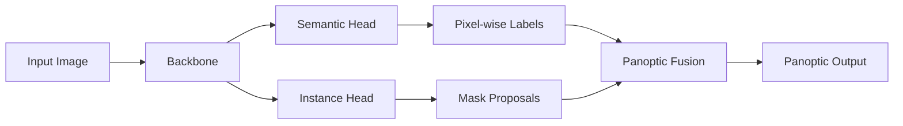

# Image Segmentation

## Learning Objectives

| Objective | Description |
|-----------|-------------|
| LO1 | Understand semantic, instance, and panoptic segmentation |
| LO2 | Implement U-Net for biomedical image segmentation |
| LO3 | Build Mask R-CNN for instance segmentation |
| LO4 | Apply panoptic segmentation with unified architectures |
| LO5 | Evaluate segmentation with IoU, Dice, and pixel accuracy |
| LO6 | Deploy segmentation models for real-world applications |

## Chapter at a Glance

| Section | Topic | Key Concept |
|---------|-------|-------------|
| 3.1 | Segmentation Types | Semantic, instance, panoptic — what each predicts |
| 3.2 | U-Net Architecture | Encoder-decoder with skip connections |
| 3.3 | Mask R-CNN | RoI Align, mask head, multi-task loss |
| 3.4 | Panoptic Segmentation | Unified thing + stuff prediction |
| 3.5 | Evaluation Metrics | IoU, Dice coefficient, pixel accuracy |
| 3.6 | Applications & Deployment | Medical, autonomous driving, satellite imagery |

## Chapter Roadmap



## 3.1 Segmentation Types

Segmentation assigns a label to every pixel. Semantic segmentation groups pixels by class, instance segmentation separates individual objects, and panoptic segmentation combines both.

```python
import numpy as np
import torch
import torch.nn as nn
import torch.nn.functional as F
from typing import List, Tuple, Optional, Dict, Any

class SegmentationVisualizer:
    """Utilities for visualizing segmentation masks."""

    def __init__(self, num_classes: int, colors: Optional[np.ndarray] = None):
        self.num_classes = num_classes
        self.colors = colors or np.random.randint(0, 255, (num_classes, 3), dtype=np.uint8)

    def overlay_mask(self, image: np.ndarray, mask: np.ndarray,
                     alpha: float = 0.5) -> np.ndarray:
        """Overlay a segmentation mask on an image."""
        overlay = image.copy()
        for cls_id in range(self.num_classes):
            mask_binary = (mask == cls_id)
            overlay[mask_binary] = (overlay[mask_binary] * (1 - alpha)
                                    + self.colors[cls_id] * alpha)
        return overlay.astype(np.uint8)

    def decode_semantic(self, logits: np.ndarray) -> np.ndarray:
        """Convert class logits to pixel-wise labels."""
        return logits.argmax(axis=0) if logits.ndim == 3 else logits

    @staticmethod
    def rle_encode(mask: np.ndarray) -> Dict[str, Any]:
        """Run-length encode a binary mask (COCO format)."""
        pixels = mask.flatten(order='F')
        pixels = np.concatenate([[0], pixels, [0]])
        runs = np.where(pixels[1:] != pixels[:-1])[0] + 1
        runs[1::2] -= runs[0::2]
        return {'counts': ' '.join(str(r) for r in runs), 'size': list(mask.shape)}

    @staticmethod
    def rle_decode(rle: Dict[str, Any]) -> np.ndarray:
        """Decode run-length encoded mask."""
        s = rle['size']
        counts = list(map(int, rle['counts'].split()))
        mask = np.zeros(s[0] * s[1], dtype=np.uint8)
        pos = 0
        for i in range(0, len(counts), 2):
            pos += counts[i]
            mask[pos:pos + counts[i + 1]] = 1
            pos += counts[i + 1]
        return mask.reshape(s, order='F')
```

## 3.2 U-Net Architecture

U-Net is a symmetric encoder-decoder with skip connections that preserve spatial details, making it ideal for biomedical segmentation where precise localization is critical.

```python
class DoubleConv(nn.Module):
    """Two convolutional layers with batch norm and ReLU."""

    def __init__(self, in_channels: int, out_channels: int):
        super().__init__()
        self.double_conv = nn.Sequential(
            nn.Conv2d(in_channels, out_channels, kernel_size=3, padding=1),
            nn.BatchNorm2d(out_channels),
            nn.ReLU(inplace=True),
            nn.Conv2d(out_channels, out_channels, kernel_size=3, padding=1),
            nn.BatchNorm2d(out_channels),
            nn.ReLU(inplace=True),
        )

    def forward(self, x: torch.Tensor) -> torch.Tensor:
        return self.double_conv(x)


class Down(nn.Module):
    """Downsampling block: max pool + double conv."""

    def __init__(self, in_channels: int, out_channels: int):
        super().__init__()
        self.maxpool_conv = nn.Sequential(
            nn.MaxPool2d(2),
            DoubleConv(in_channels, out_channels),
        )

    def forward(self, x: torch.Tensor) -> torch.Tensor:
        return self.maxpool_conv(x)


class Up(nn.Module):
    """Upsampling block: transpose conv + skip connection + double conv."""

    def __init__(self, in_channels: int, out_channels: int, bilinear: bool = True):
        super().__init__()
        if bilinear:
            self.up = nn.Upsample(scale_factor=2, mode='bilinear', align_corners=True)
            self.conv = DoubleConv(in_channels, out_channels)
        else:
            self.up = nn.ConvTranspose2d(
                in_channels, in_channels // 2, kernel_size=2, stride=2
            )
            self.conv = DoubleConv(in_channels, out_channels)

    def forward(self, x1: torch.Tensor, x2: torch.Tensor) -> torch.Tensor:
        x1 = self.up(x1)
        diff_y = x2.size()[2] - x1.size()[2]
        diff_x = x2.size()[3] - x1.size()[3]
        x1 = F.pad(x1, [diff_x // 2, diff_x - diff_x // 2,
                        diff_y // 2, diff_y - diff_y // 2])
        x = torch.cat([x2, x1], dim=1)
        return self.conv(x)


class OutConv(nn.Module):
    """Final 1x1 convolution to produce output channels."""

    def __init__(self, in_channels: int, out_channels: int):
        super().__init__()
        self.conv = nn.Conv2d(in_channels, out_channels, kernel_size=1)

    def forward(self, x: torch.Tensor) -> torch.Tensor:
        return self.conv(x)


class UNet(nn.Module):
    """U-Net for semantic segmentation."""

    def __init__(self, n_channels: int = 3, n_classes: int = 2,
                 base_channels: int = 64, bilinear: bool = True):
        super().__init__()
        self.n_channels = n_channels
        self.n_classes = n_classes
        self.bilinear = bilinear

        self.inc = DoubleConv(n_channels, base_channels)
        self.down1 = Down(base_channels, base_channels * 2)
        self.down2 = Down(base_channels * 2, base_channels * 4)
        self.down3 = Down(base_channels * 4, base_channels * 8)
        factor = 2 if bilinear else 1
        self.down4 = Down(base_channels * 8, base_channels * 16 // factor)

        self.up1 = Up(base_channels * 16, base_channels * 8 // factor, bilinear)
        self.up2 = Up(base_channels * 8, base_channels * 4 // factor, bilinear)
        self.up3 = Up(base_channels * 4, base_channels * 2 // factor, bilinear)
        self.up4 = Up(base_channels * 2, base_channels, bilinear)

        self.outc = OutConv(base_channels, n_classes)

    def forward(self, x: torch.Tensor) -> torch.Tensor:
        x1 = self.inc(x)
        x2 = self.down1(x1)
        x3 = self.down2(x2)
        x4 = self.down3(x3)
        x5 = self.down4(x4)
        x = self.up1(x5, x4)
        x = self.up2(x, x3)
        x = self.up3(x, x2)
        x = self.up4(x, x1)
        logits = self.outc(x)
        return logits


class UNetPlusPlus(nn.Module):
    """U-Net++ with nested skip connections for better gradient flow."""

    def __init__(self, n_channels: int = 3, n_classes: int = 2,
                 base_channels: int = 32):
        super().__init__()
        self.pool = nn.MaxPool2d(2)

        self.conv0_0 = DoubleConv(n_channels, base_channels)
        self.conv1_0 = DoubleConv(base_channels, base_channels * 2)
        self.conv2_0 = DoubleConv(base_channels * 2, base_channels * 4)
        self.conv3_0 = DoubleConv(base_channels * 4, base_channels * 8)
        self.conv4_0 = DoubleConv(base_channels * 8, base_channels * 16)

        self.conv0_1 = DoubleConv(base_channels + base_channels * 2, base_channels)
        self.conv1_1 = DoubleConv(base_channels * 2 + base_channels * 4, base_channels * 2)
        self.conv2_1 = DoubleConv(base_channels * 4 + base_channels * 8, base_channels * 4)
        self.conv3_1 = DoubleConv(base_channels * 8 + base_channels * 16, base_channels * 8)

        self.conv0_2 = DoubleConv(base_channels * 2 + base_channels * 2, base_channels)
        self.conv1_2 = DoubleConv(base_channels * 4 + base_channels * 4, base_channels * 2)
        self.conv2_2 = DoubleConv(base_channels * 8 + base_channels * 8, base_channels * 4)

        self.conv0_3 = DoubleConv(base_channels * 3 + base_channels * 2, base_channels)
        self.conv1_3 = DoubleConv(base_channels * 6 + base_channels * 4, base_channels * 2)

        self.conv0_4 = DoubleConv(base_channels * 4 + base_channels * 2, base_channels)

        self.final = nn.Conv2d(base_channels, n_classes, kernel_size=1)

    def forward(self, x: torch.Tensor) -> torch.Tensor:
        x0_0 = self.conv0_0(x)
        x1_0 = self.conv1_0(self.pool(x0_0))
        x0_1 = self.conv0_1(torch.cat([x0_0, F.interpolate(x1_0, scale_factor=2)], dim=1))

        x2_0 = self.conv2_0(self.pool(x1_0))
        x1_1 = self.conv1_1(torch.cat([x1_0, F.interpolate(x2_0, scale_factor=2)], dim=1))
        x0_2 = self.conv0_2(torch.cat([x0_0, x0_1, F.interpolate(x1_1, scale_factor=2)], dim=1))

        x3_0 = self.conv3_0(self.pool(x2_0))
        x2_1 = self.conv2_1(torch.cat([x2_0, F.interpolate(x3_0, scale_factor=2)], dim=1))
        x1_2 = self.conv1_2(torch.cat([x1_0, x1_1, F.interpolate(x2_1, scale_factor=2)], dim=1))
        x0_3 = self.conv0_3(torch.cat([x0_0, x0_1, x0_2, F.interpolate(x1_2, scale_factor=2)], dim=1))

        x4_0 = self.conv4_0(self.pool(x3_0))
        x3_1 = self.conv3_1(torch.cat([x3_0, F.interpolate(x4_0, scale_factor=2)], dim=1))
        x2_2 = self.conv2_2(torch.cat([x2_0, x2_1, F.interpolate(x3_1, scale_factor=2)], dim=1))
        x1_3 = self.conv1_3(torch.cat([x1_0, x1_1, x1_2, F.interpolate(x2_2, scale_factor=2)], dim=1))
        x0_4 = self.conv0_4(torch.cat([x0_0, x0_1, x0_2, x0_3, F.interpolate(x1_3, scale_factor=2)], dim=1))

        return self.final(x0_4)
```

## 3.3 Mask R-CNN

Mask R-CNN extends Faster R-CNN with a mask head that predicts a binary mask for each RoI using RoI Align (pixel-perfect RoI pooling).

```python
class RoIAlign(nn.Module):
    """RoI Align with bilinear interpolation (no quantization)."""

    def __init__(self, output_size: Tuple[int, int], spatial_scale: float = 1.0):
        super().__init__()
        self.output_size = output_size
        self.spatial_scale = spatial_scale

    def forward(self, features: torch.Tensor, rois: torch.Tensor) -> torch.Tensor:
        """Extract fixed-size feature maps for each RoI."""
        n_rois = rois.shape[0]
        out_h, out_w = self.output_size
        _, c, feat_h, feat_w = features.shape
        output = torch.zeros(n_rois, c, out_h, out_w, device=features.device)

        for i in range(n_rois):
            x1, y1, x2, y2 = rois[i] * self.spatial_scale
            x1 = x1.clamp(0, feat_w - 1)
            y1 = y1.clamp(0, feat_h - 1)
            x2 = x2.clamp(0, feat_w - 1)
            y2 = y2.clamp(0, feat_h - 1)

            for h in range(out_h):
                for w in range(out_w):
                    xs = x1 + (x2 - x1) * w / (out_w - 1) if out_w > 1 else x1
                    ys = y1 + (y2 - y1) * h / (out_h - 1) if out_h > 1 else y1
                    x0 = int(xs)
                    y0 = int(ys)
                    x1_frac = xs - x0
                    y1_frac = ys - y0
                    x1_clamp = min(x0 + 1, feat_w - 1)
                    y1_clamp = min(y0 + 1, feat_h - 1)
                    output[i, :, h, w] = (
                        features[0, :, y0, x0] * (1 - x1_frac) * (1 - y1_frac)
                        + features[0, :, y0, x1_clamp] * x1_frac * (1 - y1_frac)
                        + features[0, :, y1_clamp, x0] * (1 - x1_frac) * y1_frac
                        + features[0, :, y1_clamp, x1_clamp] * x1_frac * y1_frac
                    )
        return output


class MaskHead(nn.Module):
    """Mask prediction head for Mask R-CNN."""

    def __init__(self, in_channels: int, num_classes: int,
                 mask_size: int = 28):
        super().__init__()
        self.mask_size = mask_size
        self.convs = nn.Sequential(
            nn.Conv2d(in_channels, 256, 3, padding=1),
            nn.ReLU(inplace=True),
            nn.Conv2d(256, 256, 3, padding=1),
            nn.ReLU(inplace=True),
            nn.Conv2d(256, 256, 3, padding=1),
            nn.ReLU(inplace=True),
            nn.Conv2d(256, 256, 3, padding=1),
            nn.ReLU(inplace=True),
            nn.ConvTranspose2d(256, 256, 2, stride=2),
            nn.ReLU(inplace=True),
        )
        self.mask_pred = nn.Conv2d(256, num_classes, 1)

    def forward(self, x: torch.Tensor) -> torch.Tensor:
        x = self.convs(x)
        mask_logits = self.mask_pred(x)
        return mask_logits


class MaskRCNN(nn.Module):
    """Simplified Mask R-CNN combining detection and segmentation."""

    def __init__(self, backbone: nn.Module, num_classes: int):
        super().__init__()
        self.backbone = backbone
        self.rpn = nn.Conv2d(512, 9 * 4, 1)
        self.rpn_cls = nn.Conv2d(512, 9 * 2, 1)
        self.roi_align = RoIAlign((7, 7))
        self.roi_align_mask = RoIAlign((14, 14))

        self.classifier = nn.Sequential(
            nn.Linear(512 * 7 * 7, 1024),
            nn.ReLU(),
            nn.Linear(1024, num_classes * 5),
        )
        self.mask_head = MaskHead(512, num_classes)

    def forward(self, x: torch.Tensor,
                proposals: Optional[torch.Tensor] = None) -> Dict[str, torch.Tensor]:
        features = self.backbone(x)
        rpn_reg = self.rpn(features)
        rpn_cls = self.rpn_cls(features)

        if proposals is None:
            proposals = torch.randn(100, 4, device=x.device) * 100

        roi_feats = self.roi_align(features, proposals)
        roi_feats_flat = roi_feats.view(roi_feats.size(0), -1)
        detections = self.classifier(roi_feats_flat)

        mask_feats = self.roi_align_mask(features, proposals)
        masks = self.mask_head(mask_feats)

        return {
            "rpn_reg": rpn_reg,
            "rpn_cls": rpn_cls,
            "detections": detections,
            "masks": masks,
        }

    def extract_masks(self, mask_logits: torch.Tensor,
                      class_ids: torch.Tensor, threshold: float = 0.5) -> torch.Tensor:
        """Extract binary masks for detected objects."""
        num_rois = mask_logits.shape[0]
        masks = torch.sigmoid(mask_logits)
        binary_masks = torch.zeros(num_rois, 1, self.mask_head.mask_size,
                                   self.mask_head.mask_size, device=mask_logits.device)
        for i in range(num_rois):
            cls_id = class_ids[i].item()
            binary_masks[i, 0] = (masks[i, cls_id] > threshold).float()
        return binary_masks
```

## 3.4 Panoptic Segmentation

Panoptic segmentation fuses semantic (stuff: sky, road) and instance (things: car, person) predictions into a unified output.

```python
class PanopticSegmenter:
    """Combine semantic and instance predictions into panoptic output."""

    def __init__(self, thing_classes: List[int], stuff_classes: List[int],
                 stuff_void_label: int = 255):
        self.thing_classes = set(thing_classes)
        self.stuff_classes = set(stuff_classes)
        self.stuff_void_label = stuff_void_label

    def fuse(self, semantic_mask: np.ndarray,
             instance_masks: List[np.ndarray],
             instance_scores: List[float],
             instance_classes: List[int],
             confidence_threshold: float = 0.5,
             overlap_threshold: float = 0.5) -> np.ndarray:
        """Fuse semantic and instance predictions into panoptic segmentation.

        Returns:
            panoptic: (H, W) where each pixel has a unique instance ID.
            The ID encoding: instance_id * 1000 + class_id.
        """
        h, w = semantic_mask.shape
        panoptic = np.full((h, w), self.stuff_void_label, dtype=np.int32)

        for cls_id in self.stuff_classes:
            panoptic[semantic_mask == cls_id] = cls_id

        instance_id = 1
        for mask, score, cls_id in sorted(
            zip(instance_masks, instance_scores, instance_classes),
            key=lambda x: x[1], reverse=True
        ):
            if score < confidence_threshold:
                continue
            if cls_id not in self.thing_classes:
                continue
            overlap = np.sum(mask & (panoptic != self.stuff_void_label))
            mask_area = np.sum(mask)
            if mask_area > 0 and overlap / mask_area > overlap_threshold:
                continue
            panoptic[mask] = instance_id * 1000 + cls_id
            instance_id += 1

        for cls_id in self.stuff_classes:
            panoptic[semantic_mask == cls_id] = cls_id

        return panoptic

    def visualize_panoptic(self, panoptic: np.ndarray) -> np.ndarray:
        """Colorize panoptic segmentation for visualization."""
        h, w = panoptic.shape
        vis = np.zeros((h, w, 3), dtype=np.uint8)
        np.random.seed(42)
        colors = np.random.randint(0, 255, (1000, 3), dtype=np.uint8)
        unique_ids = np.unique(panoptic)
        for uid in unique_ids:
            if uid == self.stuff_void_label:
                continue
            vis[panoptic == uid] = colors[hash(uid) % 1000]
        return vis


class PanopticFPN(nn.Module):
    """Panoptic FPN combining semantic and instance branches."""

    def __init__(self, backbone_channels: List[int], num_thing_classes: int,
                 num_stuff_classes: int):
        super().__init__()
        total_stuff = num_stuff_classes + 1  # +1 for void

        self.semantic_head = nn.Sequential(
            nn.Conv2d(sum(backbone_channels), 256, 3, padding=1),
            nn.ReLU(),
            nn.Conv2d(256, 256, 3, padding=1),
            nn.ReLU(),
            nn.Conv2d(256, total_stuff, 1),
        )
        self.instance_head = nn.Sequential(
            nn.Conv2d(sum(backbone_channels), 256, 3, padding=1),
            nn.ReLU(),
            nn.Conv2d(256, 256, 3, padding=1),
            nn.ReLU(),
            nn.Conv2d(256, num_thing_classes * 5, 1),
        )

    def forward(self, features: List[torch.Tensor]) -> Dict[str, torch.Tensor]:
        """Forward pass with multi-scale feature fusion."""
        resized = []
        target_size = features[-1].shape[-2:]
        for feat in features:
            resized.append(F.interpolate(feat, size=target_size,
                                         mode='bilinear', align_corners=False))
        fused = torch.cat(resized, dim=1)
        semantic = self.semantic_head(fused)
        instance = self.instance_head(fused)
        return {"semantic": semantic, "instance": instance}
```

## 3.5 Evaluation Metrics

Segmentation evaluation uses pixel-level metrics. IoU (Jaccard Index) and Dice (F1) are the most common, with mean IoU being the standard benchmark metric.

```python
class SegmentationMetrics:
    """Compute segmentation metrics: IoU, Dice, pixel accuracy."""

    def __init__(self, num_classes: int, ignore_index: int = 255):
        self.num_classes = num_classes
        self.ignore_index = ignore_index

    def compute_confusion_matrix(self, pred: np.ndarray,
                                 target: np.ndarray) -> np.ndarray:
        """Compute confusion matrix for all classes."""
        mask = (target != self.ignore_index)
        pred = pred[mask]
        target = target[mask]
        conf_matrix = np.zeros((self.num_classes, self.num_classes), dtype=np.int64)
        for t, p in zip(target.flatten(), pred.flatten()):
            if t < self.num_classes and p < self.num_classes:
                conf_matrix[t, p] += 1
        return conf_matrix

    def iou_per_class(self, conf_matrix: np.ndarray) -> np.ndarray:
        """Compute IoU per class from confusion matrix."""
        tp = np.diag(conf_matrix)
        fp = conf_matrix.sum(axis=0) - tp
        fn = conf_matrix.sum(axis=1) - tp
        union = tp + fp + fn
        return np.where(union > 0, tp / union, 0.0)

    def dice_per_class(self, conf_matrix: np.ndarray) -> np.ndarray:
        """Compute Dice coefficient per class."""
        tp = np.diag(conf_matrix)
        fp = conf_matrix.sum(axis=0) - tp
        fn = conf_matrix.sum(axis=1) - tp
        denominator = 2 * tp + fp + fn
        return np.where(denominator > 0, 2 * tp / denominator, 0.0)

    def pixel_accuracy(self, conf_matrix: np.ndarray) -> float:
        """Global pixel accuracy."""
        return np.diag(conf_matrix).sum() / conf_matrix.sum()

    def mean_iou(self, conf_matrix: np.ndarray) -> float:
        """Mean IoU across all classes."""
        return float(self.iou_per_class(conf_matrix).mean())

    def mean_dice(self, conf_matrix: np.ndarray) -> float:
        """Mean Dice across all classes."""
        return float(self.dice_per_class(conf_matrix).mean())

    def evaluate(self, pred: np.ndarray, target: np.ndarray) -> Dict[str, Any]:
        """Compute all metrics."""
        conf_matrix = self.compute_confusion_matrix(pred, target)
        class_iou = self.iou_per_class(conf_matrix)
        class_dice = self.dice_per_class(conf_matrix)
        return {
            "confusion_matrix": conf_matrix,
            "class_iou": class_iou,
            "class_dice": class_dice,
            "mean_iou": self.mean_iou(conf_matrix),
            "mean_dice": self.mean_dice(conf_matrix),
            "pixel_accuracy": self.pixel_accuracy(conf_matrix),
        }


class BoundaryMetrics:
    """Compute boundary-specific segmentation metrics."""

    @staticmethod
    def contour_iou(pred_mask: np.ndarray, gt_mask: np.ndarray,
                    distance_threshold: float = 2.0) -> float:
        """Compute IoU restricted to boundary regions."""
        from scipy.ndimage import binary_dilation, binary_erosion
        pred_boundary = binary_dilation(pred_mask) ^ binary_erosion(pred_mask)
        gt_boundary = binary_dilation(gt_mask) ^ binary_erosion(gt_mask)
        pred_boundary = binary_dilation(pred_boundary, iterations=int(distance_threshold))
        gt_boundary = binary_dilation(gt_boundary, iterations=int(distance_threshold))
        intersection = np.sum(pred_boundary & gt_boundary)
        union = np.sum(pred_boundary | gt_boundary)
        return intersection / (union + 1e-16)

    @staticmethod
    def hausdorff_distance(pred_boundary: np.ndarray,
                           gt_boundary: np.ndarray) -> float:
        """Compute Hausdorff distance between segmentation boundaries."""
        pred_points = np.argwhere(pred_boundary)
        gt_points = np.argwhere(gt_boundary)
        if len(pred_points) == 0 or len(gt_points) == 0:
            return float('inf')
        from scipy.spatial.distance import cdist
        dists = cdist(pred_points.astype(float), gt_points.astype(float))
        return max(dists.min(axis=1).max(), dists.min(axis=0).max())
```

## 3.6 Applications & Deployment

Segmentation powers medical diagnostics, autonomous driving, satellite imagery analysis, and industrial quality inspection.

```python
class SegmentationTrainer:
    """Trainer for segmentation models with augmentation and logging."""

    def __init__(self, model: nn.Module, learning_rate: float = 1e-4,
                 device: str = "cuda"):
        self.model = model.to(device)
        self.device = device
        self.optimizer = torch.optim.Adam(model.parameters(), lr=learning_rate)
        self.history: Dict[str, List[float]] = {"train_loss": [], "val_miou": []}

    def dice_loss(self, pred: torch.Tensor, target: torch.Tensor,
                  smooth: float = 1e-6) -> torch.Tensor:
        """Dice loss for imbalanced segmentation."""
        pred = torch.softmax(pred, dim=1)
        target_one_hot = F.one_hot(target, num_classes=pred.shape[1])
        target_one_hot = target_one_hot.permute(0, 3, 1, 2).float()
        intersection = (pred * target_one_hot).sum(dim=(2, 3))
        union = pred.sum(dim=(2, 3)) + target_one_hot.sum(dim=(2, 3))
        dice = (2 * intersection + smooth) / (union + smooth)
        return 1 - dice.mean()

    def combined_loss(self, pred: torch.Tensor, target: torch.Tensor,
                      ce_weight: float = 0.5, dice_weight: float = 0.5) -> torch.Tensor:
        """Combined cross-entropy and Dice loss."""
        ce = F.cross_entropy(pred, target)
        dice = self.dice_loss(pred, target)
        return ce_weight * ce + dice_weight * dice

    def train_epoch(self, loader: torch.utils.data.DataLoader) -> float:
        self.model.train()
        total_loss = 0.0
        for images, targets in loader:
            images = images.to(self.device)
            targets = targets.to(self.device)
            self.optimizer.zero_grad()
            preds = self.model(images)
            loss = self.combined_loss(preds, targets)
            loss.backward()
            self.optimizer.step()
            total_loss += loss.item()
        return total_loss / len(loader)

    @torch.no_grad()
    def validate(self, loader: torch.utils.data.DataLoader) -> float:
        self.model.eval()
        metrics = SegmentationMetrics(loader.dataset.num_classes)
        conf_matrix = np.zeros((loader.dataset.num_classes, loader.dataset.num_classes),
                               dtype=np.int64)
        for images, targets in loader:
            images = images.to(self.device)
            preds = self.model(images)
            pred_labels = preds.argmax(dim=1).cpu().numpy()
            for pred, target in zip(pred_labels, targets.numpy()):
                conf_matrix += metrics.compute_confusion_matrix(pred, target)
        return metrics.mean_iou(conf_matrix)


class MedicalSegmentationPipeline:
    """End-to-end segmentation pipeline for medical imaging."""

    def __init__(self, model_path: str, device: str = "cpu"):
        self.model = torch.jit.load(model_path, map_location=device)
        self.model.eval()
        self.device = device

    @torch.no_grad()
    def segment(self, image: np.ndarray,
                return_overlay: bool = True) -> Dict[str, Any]:
        """Segment a medical image."""
        tensor = self._preprocess(image).to(self.device)
        logits = self.model(tensor)
        mask = logits.argmax(dim=1).squeeze(0).cpu().numpy()

        result = {"mask": mask, "logits": logits.cpu().numpy()}
        if return_overlay:
            vis = SegmentationVisualizer(logits.shape[1])
            result["overlay"] = vis.overlay_mask(image, mask)
        return result

    def _preprocess(self, image: np.ndarray) -> torch.Tensor:
        if image.ndim == 2:
            image = np.stack([image] * 3, axis=-1)
        img = image.astype(np.float32) / 255.0
        tensor = torch.from_numpy(img).permute(2, 0, 1).unsqueeze(0)
        return tensor

    def segment_batch(self, images: List[np.ndarray]) -> List[np.ndarray]:
        """Segment a batch of images."""
        tensors = torch.cat([self._preprocess(img) for img in images])
        tensors = tensors.to(self.device)
        logits = self.model(tensors)
        masks = logits.argmax(dim=1).cpu().numpy()
        return list(masks)


class AutonomousDrivingSegmenter:
    """Segmentation model for autonomous driving scenes."""

    def __init__(self, model: nn.Module):
        self.model = model
        self.cityscapes_colors = {
            0: (128, 64, 128),   # road
            1: (244, 35, 232),   # sidewalk
            2: (70, 70, 70),     # building
            3: (102, 102, 156),  # wall
            4: (190, 153, 153),  # fence
        }

    @torch.no_grad()
    def segment_driving_scene(self, image: np.ndarray) -> np.ndarray:
        """Segment a driving scene and colorize the output."""
        tensor = torch.from_numpy(image).float().permute(2, 0, 1).unsqueeze(0) / 255.0
        logits = self.model(tensor)
        mask = logits.argmax(dim=1).squeeze(0).cpu().numpy()
        h, w = mask.shape
        colorized = np.zeros((h, w, 3), dtype=np.uint8)
        for cls_id, color in self.cityscapes_colors.items():
            colorized[mask == cls_id] = color
        return colorized

    def compute_drivable_area(self, mask: np.ndarray) -> float:
        """Compute percentage of drivable area (road + sidewalk)."""
        road_mask = (mask == 0)
        sidewalk_mask = (mask == 1)
        total_pixels = mask.shape[0] * mask.shape[1]
        drivable_pixels = road_mask.sum() + sidewalk_mask.sum()
        return drivable_pixels / total_pixels
```

## Summary

Image segmentation assigns labels to every pixel, with three levels of granularity: semantic (class per pixel), instance (distinct object masks), and panoptic (both). U-Net remains the go-to architecture for medical segmentation due to its efficient encoder-decoder design with skip connections. Mask R-CNN extends detection with a parallel mask head for instance segmentation. Panoptic FPN unifies both tasks. Evaluation relies on mean IoU and Dice coefficient, with boundary-aware metrics for finer assessment. Deploying segmentation models requires careful handling of memory-intensive mask outputs and application-specific post-processing.

## Practical Takeaways

| Takeaway | Implementation |
|----------|---------------|
| Start with U-Net for any segmentation task | Use the provided `UNet` class as a baseline |
| Combine Dice loss with cross-entropy for imbalanced classes | Use `combined_loss()` with equal weights |
| Use RoI Align instead of RoI Pool for mask prediction | Bilinear interpolation preserves spatial fidelity |
| Evaluate with mean IoU, not just pixel accuracy | Use `SegmentationMetrics` for per-class analysis |
| Post-process masks with CRF refinement for sharper boundaries | Use `pydensecrf` Python package |
| Export to ONNX with dynamic axes for variable input sizes | Set dynamic_axes for height and width dimensions |

## Interview Q&A

<details class="tp-qa-card" data-qid="mm03-q1">
  <summary class="tp-qa-question">
    <span class="tp-qa-status"></span>
    Q1: What is the difference between semantic segmentation, instance segmentation, and panoptic segmentation?
  </summary>
  <div class="tp-qa-answer">
    <p>Semantic segmentation assigns a class label to every pixel — all pixels belonging to "car" get the same label regardless of which car. Instance segmentation identifies individual object instances — each car gets a unique ID with its own mask. Panoptic segmentation unifies both: it assigns a class label to "stuff" (amorphous regions like sky, road) and a class+instance ID to "things" (countable objects like cars, people). Panoptic Quality (PQ) is the unified metric: PQ = Σ(tp) / (Σ(tp) + 0.5*Σ(fp) + 0.5*Σ(fn)), computed per class and averaged. Panoptic FPN is a popular architecture that adds a panoptic head to the standard Mask R-CNN/Faster R-CNN framework.</p>
  </div>
  <button class="tp-qa-mark-btn">✅ Mark Reviewed</button>
  <button class="tp-qa-bookmark-btn">🔖 Bookmark</button>
</details>

<details class="tp-qa-card" data-qid="mm03-q2">
  <summary class="tp-qa-question">
    <span class="tp-qa-status"></span>
    Q2: How does U-Net architecture work and why are skip connections critical?
  </summary>
  <div class="tp-qa-answer">
    <p>U-Net has a symmetric encoder-decoder structure. The encoder (contracting path) uses repeated convolutional + max-pooling layers to downsample and capture context. The decoder (expanding path) upsamples feature maps back to the original resolution. Skip connections concatenate feature maps from each encoder level to the corresponding decoder level. This is critical because downsampling loses spatial detail needed for precise localization. Without skip connections, the decoder only has coarse, semantic information from the bottleneck, producing blurry segmentations. Skip connections give the decoder access to high-resolution spatial details (edges, texture) directly, enabling pixel-accurate masks. U-Net was designed for biomedical images with limited data, and its efficient use of parameters makes it highly effective.</p>
  </div>
  <button class="tp-qa-mark-btn">✅ Mark Reviewed</button>
  <button class="tp-qa-bookmark-btn">🔖 Bookmark</button>
</details>

<details class="tp-qa-card" data-qid="mm03-q3">
  <summary class="tp-qa-question">
    <span class="tp-qa-status"></span>
    Q3: What is the Dice loss and when would you use it over cross-entropy for segmentation?
  </summary>
  <div class="tp-qa-answer">
    <p>Dice loss is based on the Dice coefficient (F1 score at the pixel level): Dice = 2*|A∩B| / (|A| + |B|). The loss is 1 - Dice. It directly optimizes the overlap between predicted and ground truth masks. Use Dice loss when: (1) Classes are highly imbalanced — cross-entropy can get stuck predicting only the background class. Dice loss naturally handles imbalance because it measures relative overlap regardless of absolute size. (2) You care about the region overlap metric (mIoU or Dice) as the final evaluation metric. (3) Small objects are critical — cross-entropy is dominated by large regions. In practice, many state-of-the-art models use a combined loss: 0.5*cross-entropy + 0.5*Dice loss, getting the benefits of both — cross-entropy for easy optimization and Dice for overlap focus.</p>
  </div>
  <button class="tp-qa-mark-btn">✅ Mark Reviewed</button>
  <button class="tp-qa-bookmark-btn">🔖 Bookmark</button>
</details>

<details class="tp-qa-card" data-qid="mm03-q4">
  <summary class="tp-qa-question">
    <span class="tp-qa-status"></span>
    Q4: How does Mask R-CNN extend Faster R-CNN for instance segmentation?
  </summary>
  <div class="tp-qa-answer">
    <p>Mask R-CNN adds a parallel mask prediction branch to Faster R-CNN. In addition to the classification head (class prediction) and box regression head (bounding box refinement), Mask R-CNN introduces a mask head that predicts a binary mask for each Region of Interest (RoI). The mask head is a small FCN applied to each RoI, outputting a 28×28 binary mask. A key improvement is RoI Align, which replaces RoI Pool's quantization with bilinear interpolation, preserving sub-pixel spatial accuracy essential for masks. The overall loss becomes: L = L_cls + L_box + L_mask, where L_mask is the average binary cross-entropy loss per-pixel. The mask branch is only used during training; at inference, masks are generated for the top-K detections after NMS.</p>
  </div>
  <button class="tp-qa-mark-btn">✅ Mark Reviewed</button>
  <button class="tp-qa-bookmark-btn">🔖 Bookmark</button>
</details>

<details class="tp-qa-card" data-qid="mm03-q5">
  <summary class="tp-qa-question">
    <span class="tp-qa-status"></span>
    Q5: What is mean IoU and how is it computed for segmentation evaluation?
  </summary>
  <div class="tp-qa-answer">
    <p>Mean Intersection over Union (mIoU) measures the overlap between predicted and ground truth segmentation masks. For each class, IoU = TP / (TP + FP + FN), where TP are pixels correctly predicted as that class, FP are pixels incorrectly predicted as that class, and FN are pixels of that class missed. The "mean" averages IoU across all classes. Unlike pixel accuracy (which is dominated by majority classes), mIoU treats each class equally, making it sensitive to rare class performance. For example, if the background is 95% of pixels and the model predicts all as background, pixel accuracy is 95% but mIoU is 50% or lower. mIoU is the standard metric for segmentation benchmarks like Cityscapes (19 classes) and ADE20K (150 classes).</p>
  </div>
  <button class="tp-qa-mark-btn">✅ Mark Reviewed</button>
  <button class="tp-qa-bookmark-btn">🔖 Bookmark</button>
</details>

<details class="tp-qa-card" data-qid="mm03-q6">
  <summary class="tp-qa-question">
    <span class="tp-qa-status"></span>
    Q6: How do you handle class imbalance in segmentation datasets?
  </summary>
  <div class="tp-qa-answer">
    <p>Class imbalance in segmentation is severe — background classes often dominate 90%+ of pixels. Strategies: (1) Weighted cross-entropy — assign weights inversely proportional to class frequency. Rare classes get higher weight. (2) Dice loss — naturally handles imbalance as it measures overlap ratio, not absolute pixel count. (3) Focal loss — down-weights well-classified pixels, forcing the model to focus on boundary regions and rare classes. (4) Patch-based sampling — crop training patches that contain rare classes with higher probability. (5) Class-balanced sampling — ensure each batch contains a minimum number of pixels for each rare class. (6) Data augmentation — oversample images containing rare classes, copy-paste rare objects onto other images. A combined Dice + cross-entropy loss with class weights is the most common production approach.</p>
  </div>
  <button class="tp-qa-mark-btn">✅ Mark Reviewed</button>
  <button class="tp-qa-bookmark-btn">🔖 Bookmark</button>
</details>

<details class="tp-qa-card" data-qid="mm03-q7">
  <summary class="tp-qa-question">
    <span class="tp-qa-status"></span>
    Q7: What data augmentations are most effective for medical image segmentation?
  </summary>
  <div class="tp-qa-answer">
    <p>Medical segmentation benefits from: (1) Elastic deformations — simulate tissue deformation, crucial for organs that shift. (2) Random rotation and flipping — must be limited (90° increments) for medical images with anatomical orientation. (3) Intensity augmentations — random brightness, contrast, gamma, and Gaussian noise, because medical images vary by scanner settings. (4) Cutout — randomly mask square regions to improve robustness to artifacts. (5) Mixup — blend two images and their masks to create realistic-looking training examples. (6) Histogram equalization — simulate different staining/contrast levels. All augmentations must be applied identically to the image and mask. The nnU-Net framework automatically selects optimal augmentations based on dataset properties and has become the de facto standard.</p>
  </div>
  <button class="tp-qa-mark-btn">✅ Mark Reviewed</button>
  <button class="tp-qa-bookmark-btn">🔖 Bookmark</button>
</details>

<details class="tp-qa-card" data-qid="mm03-q8">
  <summary class="tp-qa-question">
    <span class="tp-qa-status"></span>
    Q8: How does RoI Align work and why is it better than RoI Pooling for mask prediction?
  </summary>
  <div class="tp-qa-answer">
    <p>RoI Pooling quantizes the RoI boundaries to integer coordinates and divides the RoI into fixed-size bins using max pooling within each bin. This quantization causes misalignment of up to 1 pixel, which is tolerable for classification but fatal for pixel-accurate mask prediction. RoI Align avoids quantization by: (1) Keeping RoI coordinates as floating-point values. (2) Dividing the RoI into bins of equal size (e.g., 7×7 or 14×14). (3) For each bin, sampling 4 regular points and computing their feature values via bilinear interpolation. (4) Using max or average of these 4 sampled values as the bin output. This preserves sub-pixel spatial accuracy, which is crucial since mask prediction requires precise pixel-level localization. RoI Align improved mask AP by 2-5 points over RoI Pooling in Mask R-CNN.</p>
  </div>
  <button class="tp-qa-mark-btn">✅ Mark Reviewed</button>
  <button class="tp-qa-bookmark-btn">🔖 Bookmark</button>
</details>

<details class="tp-qa-card" data-qid="mm03-q9">
  <summary class="tp-qa-question">
    <span class="tp-qa-status"></span>
    Q9: How do you deploy segmentation models on large images (e.g., satellite or pathology)?
  </summary>
  <div class="tp-qa-answer">
    <p>Large images (e.g., 10,000×10,000 pixels) exceed GPU memory. The approach is tiling: (1) Divide the large image into overlapping tiles (e.g., 512×512 with 64-pixel overlap). (2) Run segmentation on each tile independently. (3) Reconstruct the full-resolution mask by combining tile predictions, using overlap averaging to smooth boundary artifacts. (4) For tiles near the edge, mirror padding to maintain context. Optimizations: (1) Process tiles in batches for throughput. (2) Use a sliding window with stride to reduce redundant computations. (3) Cache intermediate features if multiple tiles share context. (4) For pathology, use multi-resolution tiling — downsample for context, upsample for detail. Tools like OpenSlide handle gigapixel pathology images efficiently.</p>
  </div>
  <button class="tp-qa-mark-btn">✅ Mark Reviewed</button>
  <button class="tp-qa-bookmark-btn">🔖 Bookmark</button>
</details>

<details class="tp-qa-card" data-qid="mm03-q10">
  <summary class="tp-qa-question">
    <span class="tp-qa-status"></span>
    Q10: How do you implement U-Net from scratch and verify the output shapes?
  </summary>
  <div class="tp-qa-answer">
    <pre><code>function buildUNet(inChannels: number, outChannels: number, baseChannels: number = 64) {
  // Encoder: double channels, halve spatial dims
  const enc1 = convBlock(inChannels, baseChannels);      // 3→64, 256×256
  const enc2 = convBlock(baseChannels, baseChannels * 2); // 64→128, 128×128
  const enc3 = convBlock(baseChannels * 2, baseChannels * 4); // 128→256, 64×64
  const bottleneck = convBlock(baseChannels * 4, baseChannels * 8); // 256→512, 32×32
  // Decoder: halve channels, double spatial dims, then concatenate skip
  const dec3 = upConvBlock(baseChannels * 8, baseChannels * 4); // 512→256+256=512, 64×64
  const dec2 = upConvBlock(baseChannels * 4, baseChannels * 2); // 256→128+128=256, 128×128
  const dec1 = upConvBlock(baseChannels * 2, baseChannels);     // 128→64+64=128, 256×256
  const output = Conv2d(baseChannels, outChannels, 1);          // 64→numClasses
  return { enc1, enc2, enc3, bottleneck, dec3, dec2, dec1, output };
}</pre></code>
    <p>A U-Net implementation follows the encoder-bottleneck-decoder pattern. The encoder halves spatial dimensions and doubles channels at each level using 3×3 convolutions followed by max-pooling. The decoder up-samples (using transposed convolutions or bilinear upsampling + conv), concatenates the corresponding encoder feature map via skip connection, then applies 3×3 convolutions. The final layer is a 1×1 convolution to map to the desired number of output channels (classes). Verify shapes: input (1×3×256×256) → bottleneck (1×512×32×32) → output (1×num_classes×256×256). Count parameters by summing all conv layers: each 3×3 conv contributes 9×C_in×C_out + C_out parameters.</p>
  </div>
  <button class="tp-qa-mark-btn">✅ Mark Reviewed</button>
  <button class="tp-qa-bookmark-btn">🔖 Bookmark</button>
</details>

## Chapter Quiz

**Question 1 (mmai-s03-quiz1):** What is the difference between semantic and instance segmentation?

<details class="tp-qa-card" data-qid="mmai-s03-quiz1"><summary>Show Answer</summary><div class="tp-qa-answer"><p><strong>Answer: b) Semantic assigns class per pixel; instance separates individual objects</strong></p><p>Semantic segmentation labels all pixels of the same class identically. Instance segmentation assigns a unique ID per object instance even within the same class.</p></div></details>

**Question 2 (mmai-s03-quiz2):** What architectural feature makes U-Net effective for segmentation?

<details class="tp-qa-card" data-qid="mmai-s03-quiz2"><summary>Show Answer</summary><div class="tp-qa-answer"><p><strong>Answer: b) Skip connections between encoder and decoder</strong></p><p>Skip connections pass spatial information from encoder to decoder, preserving fine details needed for precise localization.</p></div></details>

**Question 3 (mmai-s03-quiz3):** How does Mask R-CNN extend Faster R-CNN?

<details class="tp-qa-card" data-qid="mmai-s03-quiz3"><summary>Show Answer</summary><div class="tp-qa-answer"><p><strong>Answer: b) Adds a parallel mask head for binary segmentation per RoI</strong></p><p>Mask R-CNN adds a branch that predicts a binary mask for each RoI, running in parallel with the classification and bounding box regression heads.</p></div></details>

**Question 4 (mmai-s03-quiz4):** What is panoptic segmentation?

<details class="tp-qa-card" data-qid="mmai-s03-quiz4"><summary>Show Answer</summary><div class="tp-qa-answer"><p><strong>Answer: b) Unified prediction of both stuff (semantic) and things (instances)</strong></p><p>Panoptic segmentation produces a single output where each pixel gets a class label and, for countable objects, a unique instance ID.</p></div></details>

**Question 5 (mmai-s03-quiz5):** What metric is most commonly used for segmentation evaluation?

<details class="tp-qa-card" data-qid="mmai-s03-quiz5"><summary>Show Answer</summary><div class="tp-qa-answer"><p><strong>Answer: b) Mean Intersection over Union (mIoU)</strong></p><p>Mean IoU averages the per-class IoU scores, providing a balanced measure that handles class imbalance better than pixel accuracy.</p></div></details>

## Q&A

<details class="tp-qa-card" data-qid="mmai-s03-q1">
<summary class="tp-qa-question">What is the role of skip connections in U-Net?</summary>
<div class="tp-qa-context"><p>Architecture design in encoder-decoder networks.</p></div>
<div class="tp-qa-answer">
<p>Skip connections concatenate feature maps from the encoder to corresponding decoder layers. This allows the decoder to access high-resolution spatial details that would otherwise be lost during downsampling. In U-Net, each decoder level receives both the upsampled feature map and the skip-connected encoder feature from the same level, enabling precise localization combined with semantic context.</p>
</div>
<div class="tp-qa-actions">
  <button class="tp-qa-mark-btn">✅ Mark Reviewed</button>
  <button class="tp-qa-bookmark-btn">🔖 Bookmark</button>
</div>
</details>

<details class="tp-qa-card" data-qid="mmai-s03-q2">
<summary class="tp-qa-question">How does RoI Align differ from RoI Pooling?</summary>
<div class="tp-qa-context"><p>Precision of feature extraction for mask prediction.</p></div>
<div class="tp-qa-answer">
<p>RoI Pooling quantizes the region boundaries (floor/ceil) to integer coordinates, causing misalignment of up to 1 pixel. RoI Align avoids quantization by using bilinear interpolation to sample feature values at fractional coordinates. This preserves sub-pixel accuracy and is critical for mask prediction, where pixel-level precision directly impacts segmentation quality.</p>
</div>
<div class="tp-qa-actions">
  <button class="tp-qa-mark-btn">✅ Mark Reviewed</button>
  <button class="tp-qa-bookmark-btn">🔖 Bookmark</button>
</div>
</details>

<details class="tp-qa-card" data-qid="mmai-s03-q3">
<summary class="tp-qa-question">What loss functions are commonly used for segmentation?</summary>
<div class="tp-qa-context"><p>Choosing the right objective for pixel-wise prediction.</p></div>
<div class="tp-qa-answer">
<p>Common losses include: <strong>Cross-entropy</strong> — standard per-pixel classification loss. <strong>Dice loss</strong> — directly optimizes overlap, effective for imbalanced classes. <strong>Focal loss</strong> — down-weights easy pixels, useful for boundary regions. <strong>Combined loss</strong> — cross-entropy + Dice (typically 0.5 each). <strong>Boundary loss</strong> — penalizes errors near object boundaries using distance transforms.</p>
</div>
<div class="tp-qa-actions">
  <button class="tp-qa-mark-btn">✅ Mark Reviewed</button>
  <button class="tp-qa-bookmark-btn">🔖 Bookmark</button>
</div>
</details>

<details class="tp-qa-card" data-qid="mmai-s03-q4">
<summary class="tp-qa-question">How do you handle class imbalance in segmentation datasets?</summary>
<div class="tp-qa-context"><p>Dealing with rare classes and large background regions.</p></div>
<div class="tp-qa-answer">
<p>Strategies include: (1) <strong>Weighted cross-entropy</strong> — assign higher weight to rare classes based on inverse frequency. (2) <strong>Dice loss</strong> — naturally handles imbalance by measuring overlap. (3) <strong>Focal loss</strong> — reduces contribution of well-classified pixels. (4) <strong>Oversampling</strong> — crop patches that contain rare classes. (5) <strong>Class-balanced sampling</strong> — ensure each batch has adequate representation of all classes.</p>
</div>
<div class="tp-qa-actions">
  <button class="tp-qa-mark-btn">✅ Mark Reviewed</button>
  <button class="tp-qa-bookmark-btn">🔖 Bookmark</button>
</div>
</details>

<details class="tp-qa-card" data-qid="mmai-s03-q5">
<summary class="tp-qa-question">What is the difference between things and stuff in panoptic segmentation?</summary>
<div class="tp-qa-context"><p>Categorizing objects and regions.</p></div>
<div class="tp-qa-answer">
<p><strong>Things</strong> are countable objects with well-defined shapes (e.g., person, car, dog). They are evaluated with instance-level metrics like AP. <strong>Stuff</strong> are amorphous regions without clear instances (e.g., sky, road, grass). They are evaluated with semantic metrics like mIoU. Panoptic segmentation computes a single PQ (Panoptic Quality) metric combining both: PQ = Σ(tp) / (Σ(tp) + 0.5 * Σ(fp) + 0.5 * Σ(fn)).</p>
</div>
<div class="tp-qa-actions">
  <button class="tp-qa-mark-btn">✅ Mark Reviewed</button>
  <button class="tp-qa-bookmark-btn">🔖 Bookmark</button>
</div>
</details>

<details class="tp-qa-card" data-qid="mmai-s03-q6">
<summary class="tp-qa-question">How do you evaluate segmentation models on medical images?</summary>
<div class="tp-qa-context"><p>Special considerations for medical imaging.</p></div>
<div class="tp-qa-answer">
<p>Medical segmentation evaluation uses: <strong>Dice coefficient</strong> — most common, measures overlap. <strong>Hausdorff distance</strong> — measures boundary agreement. <strong>Volume similarity</strong> — compares predicted and ground truth volumes. <strong>Lesion-wise detection rate</strong> — per-lesion true positive rate for small lesions. Cross-validation is standard due to small dataset sizes. Statistical significance (Wilcoxon signed-rank test) is reported when comparing methods.</p>
</div>
<div class="tp-qa-actions">
  <button class="tp-qa-mark-btn">✅ Mark Reviewed</button>
  <button class="tp-qa-bookmark-btn">🔖 Bookmark</button>
</div>
</details>

<details class="tp-qa-card" data-qid="mmai-s03-q7">
<summary class="tp-qa-question">What data augmentations work well for segmentation?</summary>
<div class="tp-qa-context"><p>Improving generalization with limited data.</p></div>
<div class="tp-qa-answer">
<p>Effective augmentations include: <strong>Geometric</strong> — random flip, rotation (90° increments for medical), elastic deformation, random crop. <strong>Photometric</strong> — brightness, contrast, gamma adjustment. <strong>Noise</strong> — Gaussian noise, blur. <strong>Cutout</strong> — randomly masking regions. <strong>Mixup</strong> — blending two images and their masks. <strong>Copy-paste</strong> — pasting object instances from one image onto another. All augmentations must be applied consistently to both image and mask.</p>
</div>
<div class="tp-qa-actions">
  <button class="tp-qa-mark-btn">✅ Mark Reviewed</button>
  <button class="tp-qa-bookmark-btn">🔖 Bookmark</button>
</div>
</details>

<details class="tp-qa-card" data-qid="mmai-s03-q8">
<summary class="tp-qa-question">How do you deploy segmentation models at scale?</summary>
<div class="tp-qa-context"><p>Production considerations for segmentation.</p></div>
<div class="tp-qa-answer">
<p>Key considerations: (1) <strong>Model quantization</strong> — INT8 quantization can reduce size 4× with minimal mIoU drop. (2) <strong>Tiling</strong> — process large images in overlapping tiles to fit GPU memory. (3) <strong>Multi-GPU</strong> — shard tiles across GPUs. (4) <strong>Async I/O</strong> — overlap data loading with inference. (5) <strong>Caching</strong> — cache model outputs for identical inputs. (6) <strong>Post-processing</strong> — CRF, connected components, and hole-filling on CPU. (7) <strong>Monitoring</strong> — track mIoU drift and data distribution shifts.</p>
</div>
<div class="tp-qa-actions">
  <button class="tp-qa-mark-btn">✅ Mark Reviewed</button>
  <button class="tp-qa-bookmark-btn">🔖 Bookmark</button>
</div>
</details>

<details class="tp-qa-card" data-qid="mmai-s03-q9">
<summary class="tp-qa-question">What architectures work best for real-time segmentation?</summary>
<div class="tp-qa-context"><p>Speed-accuracy tradeoffs in segmentation.</p></div>
<div class="tp-qa-answer">
<p>Real-time architectures include: <strong>ICNet</strong> — cascaded feature maps at multiple resolutions. <strong>BiSeNet</strong> — separate spatial and context paths fused for fast inference. <strong>SwiftNet</strong> — pyramid fusion with lightweight decoder. <strong>STDC</strong> — short-term dense concatenation modules. These achieve 30-100+ FPS on embedded devices while maintaining 70-80% mIoU on Cityscapes. The key is reducing decoder complexity and using lightweight backbones like MobileNet.</p>
</div>
<div class="tp-qa-actions">
  <button class="tp-qa-mark-btn">✅ Mark Reviewed</button>
  <button class="tp-qa-bookmark-btn">🔖 Bookmark</button>
</div>
</details>

<details class="tp-qa-card" data-qid="mmai-s03-q10">
<summary class="tp-qa-question">How do you handle segmentation of 3D medical volumes?</summary>
<div class="tp-qa-context"><p>Extending segmentation to volumetric data.</p></div>
<div class="tp-qa-answer">
<p>Three approaches: (1) <strong>2D slice-by-slice</strong> — apply U-Net to each slice independently. (2) <strong>3D convolutions</strong> — use 3D U-Net with volumetric kernels (memory-intensive). (3) <strong>Hybrid</strong> — 2.5D by stacking adjacent slices as input channels. 3D U-Net variants (V-Net, nnU-Net) achieve state-of-the-art by using residual connections, deep supervision, and automatic configuration. Memory constraints are managed through patch-based training with large overlap.</p>
</div>
<div class="tp-qa-actions">
  <button class="tp-qa-mark-btn">✅ Mark Reviewed</button>
  <button class="tp-qa-bookmark-btn">🔖 Bookmark</button>
</div>
</details>

## Exercises

1. **U-Net from Scratch**: Implement U-Net with base_channels=32, n_classes=10. Create a random input of shape (1, 3, 256, 256). Forward pass and confirm output shape is (1, 10, 256, 256). Count total parameters.

2. **Skip Connection Analysis**: Modify U-Net to remove skip connections. Train both versions on a toy dataset (circles vs. background) for 10 epochs. Compare mIoU on validation. How much do skip connections help?

3. **Dice Loss Implementation**: Implement Dice loss, Jaccard loss, and Tversky loss. Compare their gradients on a toy example where the prediction is all zeros but target has a small foreground region. Which loss produces the largest gradient?

4. **Mask R-CNN Forward Pass**: Build Mask R-CNN with a ResNet-18 backbone. Create 50 random proposals. Run forward pass and verify the shapes of rpn_reg, rpn_cls, detections, and masks outputs.

5. **Panoptic Fusion**: Given a semantic mask with 8 stuff classes and instance predictions for 3 thing classes, implement panoptic fusion. Handle overlaps by prioritizing higher-confidence instance predictions. Visualize the result.

6. **mIoU vs. Pixel Accuracy**: Create an imbalanced segmentation scenario where class 0 has 90% of pixels. Predict all pixels as class 0. Compute pixel accuracy and mIoU. Why does mIoU better reflect the failure to predict minority classes?

7. **Data Augmentation Pipeline**: Build an augmentation pipeline using albumentations with: random crop (256×256), horizontal flip, brightness/contrast, elastic transform, and cutout. Apply to a sample image. Augmentations must preserve mask alignment.

8. **Model Quantization for Segmentation**: Train a small U-Net on a toy dataset. Apply dynamic and static quantization. Measure size reduction and mIoU drop. Which quantization method preserves accuracy better?

9. **Tiling Large Images**: Write a tiling function that splits a 4000×4000 satellite image into 512×512 tiles with 64-pixel overlap. Segment each tile and reconstruct the full-resolution mask. Handle tile boundary artifacts by averaging overlapping predictions.

10. **Real-time Segmentation Pipeline**: Build a webcam segmentation app using BiSeNet or a lightweight U-Net. Display the overlay at >30 FPS. Benchmark CPU vs. GPU performance. What is the bottleneck (preprocessing, inference, or post-processing)?
