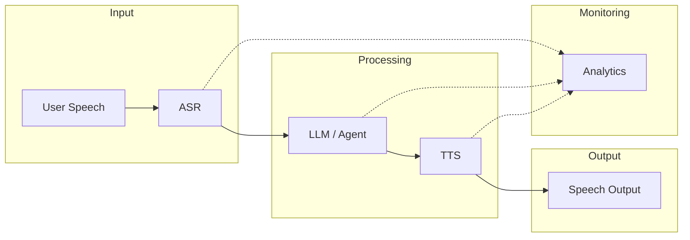

# Voice Agents

## Learning Objectives

| Objective | Description |
|-----------|-------------|
| LO1 | Understand voice agent architecture and components |
| LO2 | Implement text-to-speech (TTS) synthesis |
| LO3 | Build voice pipelines with ASR + LLM + TTS |
| LO4 | Handle voice UI design for conversational AI |
| LO5 | Manage real-time voice streaming and latency |
| LO6 | Deploy voice agents for customer-facing applications |

<!-- Image Gallery -->
<section class="lesson-visuals" aria-label="Visual learning resources">
  <header><span>VISUAL LEARNING</span><h2>See it. Review it. Remember it.</h2></header>
  <a class="lesson-visual-card" href="../../assets/images/lessons/ai-engineering-placement/18-multimodal-ai-voice/06-voice-agents/handwritten-notes.png" target="_blank" rel="noopener">
    
    <span><strong>Handwritten notes</strong>Condensed notes for deliberate review.</span>
  </a>
  <a class="lesson-visual-card" href="../../assets/images/lessons/ai-engineering-placement/18-multimodal-ai-voice/06-voice-agents/sticky-notes.png" target="_blank" rel="noopener">
    
    <span><strong>Sticky-note revision</strong>Fast recall prompts for revision.</span>
  </a>
  <a class="lesson-visual-card" href="../../assets/images/lessons/ai-engineering-placement/18-multimodal-ai-voice/06-voice-agents/visual-explanation.png" target="_blank" rel="noopener">
    
    <span><strong>Visual concept guide</strong>A connected explanation of the key ideas.</span>
  </a>
</section>
<!-- End Image Gallery -->

## Chapter at a Glance

| Section | Topic | Key Concept |
|---------|-------|-------------|
| 6.1 | Voice Agent Architecture | ASR → NLU → DM → NLG → TTS pipeline |
| 6.2 | Text-to-Speech Synthesis | Tacotron, FastSpeech, VITS, neural TTS |
| 6.3 | Voice Pipeline Integration | Streaming ASR + LLM + TTS orchestration |
| 6.4 | Voice UI Design | Turn-taking, barge-in, confirmation flows |
| 6.5 | Real-Time Streaming | WebSocket, gRPC, latency optimization |
| 6.6 | Production Voice Agents | Scaling, monitoring, voice analytics |

## Chapter Roadmap



## 6.1 Voice Agent Architecture

Voice agents combine ASR, natural language understanding, dialogue management, and TTS into a conversational pipeline. The architecture must handle real-time audio streaming while maintaining low latency.

```python
import asyncio
import json
import numpy as np
from typing import Optional, Callable, Awaitable, Dict, Any, List
from dataclasses import dataclass, field
from enum import Enum

class AgentState(Enum):
    IDLE = "idle"
    LISTENING = "listening"
    PROCESSING = "processing"
    SPEAKING = "speaking"
    WAITING = "waiting"

@dataclass
class VoiceAgentConfig:
    """Configuration for a voice agent."""
    wake_word: str = "hey agent"
    sample_rate: int = 16000
    vad_threshold: float = 0.01
    silence_timeout_ms: int = 800
    max_turn_duration_s: float = 30.0
    voice: str = "en-US-Neural2-F"
    language: str = "en"
    barge_in_enabled: bool = True
    ambient_noise_level: float = 0.001

@dataclass
class ConversationTurn:
    """A single turn in the conversation."""
    user_text: str
    agent_text: str
    user_audio_duration: float
    agent_audio_duration: float
    latency_ms: float
    user_tone: str = "neutral"
    confidence: float = 1.0

class VoiceAgent:
    """Core voice agent orchestrating ASR, LLM, and TTS."""

    def __init__(self, config: VoiceAgentConfig,
                 asr_func: Callable[[np.ndarray], Awaitable[str]],
                 llm_func: Callable[[str], Awaitable[str]],
                 tts_func: Callable[[str], Awaitable[np.ndarray]]):
        self.config = config
        self.asr = asr_func
        self.llm = llm_func
        self.tts = tts_func
        self.state = AgentState.IDLE
        self.conversation_history: List[ConversationTurn] = []
        self.audio_buffer = np.array([], dtype=np.float32)
        self.callbacks: Dict[str, List[Callable]] = {
            "on_state_change": [],
            "on_turn_complete": [],
            "on_error": [],
        }

    def register_callback(self, event: str, callback: Callable):
        if event in self.callbacks:
            self.callbacks[event].append(callback)

    async def process_stream(self, audio_chunk: np.ndarray) -> Optional[np.ndarray]:
        """Process an incoming audio chunk."""
        if self.state == AgentState.SPEAKING and not self.config.barge_in_enabled:
            return None

        self.state = AgentState.LISTENING
        self.audio_buffer = np.concatenate([self.audio_buffer, audio_chunk])

        if not self._has_voice_activity():
            return None

        user_text = await self.asr(self.audio_buffer)
        if not user_text.strip():
            return None

        self.state = AgentState.PROCESSING
        agent_text = await self._generate_response(user_text)

        self.state = AgentState.SPEAKING
        audio_response = await self.tts(agent_text)

        turn = self._record_turn(user_text, agent_text, audio_response)
        self.conversation_history.append(turn)

        self._notify("on_turn_complete", turn)
        self.state = AgentState.LISTENING
        return audio_response

    def _has_voice_activity(self) -> bool:
        return np.max(np.abs(self.audio_buffer)) > self.config.vad_threshold

    async def _generate_response(self, text: str) -> str:
        context = self._build_context(text)
        response = await self.llm(context)
        return response

    def _build_context(self, user_text: str) -> str:
        history = "\n".join(
            f"User: {t.user_text}\nAgent: {t.agent_text}"
            for t in self.conversation_history[-5:]
        )
        return f"Conversation history:\n{history}\nUser: {user_text}\nAgent:"

    def _record_turn(self, user_text: str, agent_text: str,
                     audio_response: np.ndarray) -> ConversationTurn:
        return ConversationTurn(
            user_text=user_text,
            agent_text=agent_text,
            user_audio_duration=len(self.audio_buffer) / self.config.sample_rate,
            agent_audio_duration=len(audio_response) / self.config.sample_rate,
            latency_ms=0.0,
        )

    def _notify(self, event: str, *args, **kwargs):
        for cb in self.callbacks.get(event, []):
            try:
                cb(*args, **kwargs)
            except Exception as e:
                print(f"Callback error: {e}")

    def reset(self):
        self.audio_buffer = np.array([], dtype=np.float32)
        self.state = AgentState.IDLE
        self.conversation_history.clear()
```

## 6.2 Text-to-Speech Synthesis

TTS converts text to natural-sounding speech. Modern neural TTS uses encoder-decoder architectures with duration prediction for alignment.

```python
class TextToPhoneme:
    """Convert text to phoneme sequences for TTS."""

    def __init__(self):
        self.phoneme_map = {
            'a': 'AH', 'b': 'B', 'c': 'K', 'd': 'D', 'e': 'EH',
            'f': 'F', 'g': 'G', 'h': 'HH', 'i': 'IH', 'j': 'JH',
            'k': 'K', 'l': 'L', 'm': 'M', 'n': 'N', 'o': 'OW',
            'p': 'P', 'q': 'K', 'r': 'R', 's': 'S', 't': 'T',
            'u': 'UH', 'v': 'V', 'w': 'W', 'x': 'KS', 'y': 'Y',
            'z': 'Z', ' ': ' ',
        }

    def convert(self, text: str) -> List[str]:
        """Convert text to phoneme sequence."""
        text = text.lower()
        phonemes = []
        for char in text:
            if char in self.phoneme_map:
                phonemes.append(self.phoneme_map[char])
            else:
                phonemes.append(' ')
        return phonemes


class TacotronEncoder(nn.Module):
    """Tacotron encoder: CBHG module for text encoding."""

    def __init__(self, vocab_size: int = 30, embed_dim: int = 256):
        super().__init__()
        self.embedding = nn.Embedding(vocab_size, embed_dim)
        self.conv_bank = nn.ModuleList([
            nn.Sequential(
                nn.Conv1d(embed_dim, embed_dim // 2, k, padding=k // 2),
                nn.BatchNorm1d(embed_dim // 2),
                nn.ReLU(),
            )
            for k in range(1, 17)
        ])
        self.proj1 = nn.Conv1d(embed_dim // 2 * 16, embed_dim, 3, padding=1)
        self.proj2 = nn.Conv1d(embed_dim, embed_dim, 3, padding=1)
        self.highway = nn.ModuleList([
            nn.Sequential(
                nn.Linear(embed_dim, embed_dim),
                nn.ReLU(),
            )
            for _ in range(4)
        ])
        self.birnn = nn.LSTM(embed_dim, embed_dim // 2, bidirectional=True,
                              batch_first=True)

    def forward(self, x: torch.Tensor) -> torch.Tensor:
        x = self.embedding(x).transpose(1, 2)
        conv_out = []
        for conv in self.conv_bank:
            conv_out.append(conv(x))
        conv_out = torch.cat(conv_out, dim=1)
        residual = self.proj1(conv_out)
        x = self.proj2(x + residual)
        x = x.transpose(1, 2)
        for layer in self.highway:
            x = layer(x) + x
        x, _ = self.birnn(x)
        return x


class TacotronDecoder(nn.Module):
    """Autoregressive decoder with attention for mel-spectrogram generation."""

    def __init__(self, mel_dim: int = 80, r: int = 2):
        super().__init__()
        self.r = r
        self.prenet = nn.Sequential(
            nn.Linear(mel_dim, 256),
            nn.ReLU(),
            nn.Dropout(0.5),
            nn.Linear(256, 128),
            nn.ReLU(),
            nn.Dropout(0.5),
        )
        self.attention_lstm = nn.LSTMCell(128 + 256 + 256, 256)
        self.attention = nn.MultiheadAttention(256, 1, batch_first=True)
        self.decoder_lstm = nn.LSTMCell(256 + 256, 256)
        self.mel_proj = nn.Linear(256, mel_dim * r)
        self.stop_proj = nn.Linear(256, 1)

    def forward(self, encoder_outputs: torch.Tensor,
                mel_targets: Optional[torch.Tensor] = None) -> Tuple[torch.Tensor, torch.Tensor]:
        batch_size = encoder_outputs.shape[0]
        device = encoder_outputs.device

        go_frame = torch.zeros(batch_size, 1, 1).to(device)
        mel_outputs = []
        stop_tokens = []

        attn_lstm_h = torch.zeros(batch_size, 256).to(device)
        attn_lstm_c = torch.zeros(batch_size, 256).to(device)
        dec_lstm_h = torch.zeros(batch_size, 256).to(device)
        dec_lstm_c = torch.zeros(batch_size, 256).to(device)
        attn_context = torch.zeros(batch_size, 256).to(device)
        prev_mel = torch.zeros(batch_size, self.r, mel_targets.shape[-1] if mel_targets is not None else 80).to(device)

        max_len = mel_targets.shape[1] // self.r if mel_targets is not None else 100

        for t in range(max_len):
        prenet_out = self.prenet(prev_mel[:, -1])
            attn_lstm_in = torch.cat([prenet_out, attn_context], dim=-1)
            attn_lstm_h, attn_lstm_c = self.attention_lstm(attn_lstm_in, (attn_lstm_h, attn_lstm_c))
            attn_out, _ = self.attention(attn_lstm_h.unsqueeze(1), encoder_outputs, encoder_outputs)
            attn_context = attn_out.squeeze(1)
            dec_lstm_in = torch.cat([attn_lstm_h, attn_context], dim=-1)
            dec_lstm_h, dec_lstm_c = self.decoder_lstm(dec_lstm_in, (dec_lstm_h, dec_lstm_c))
            mel_out = self.mel_proj(dec_lstm_h).view(batch_size, self.r, -1)
            stop_out = torch.sigmoid(self.stop_proj(dec_lstm_h))
            mel_outputs.append(mel_out)
            stop_tokens.append(stop_out)
            if mel_targets is not None:
                prev_mel = mel_targets[:, t * self.r:(t + 1) * self.r]
            else:
                prev_mel = mel_out

        return torch.cat(mel_outputs, dim=1), torch.cat(stop_tokens, dim=1)


class Vocoder(nn.Module):
    """Neural vocoder to convert mel-spectrograms to audio waveforms."""

    def __init__(self, mel_dim: int = 80, upsample_rates: List[int] = None):
        super().__init__()
        upsample_rates = upsample_rates or [8, 8, 4]
        self.upsample = nn.ModuleList()
        in_ch = mel_dim
        for rate in upsample_rates:
            self.upsample.append(
                nn.ConvTranspose1d(in_ch, in_ch // 2, kernel_size=rate * 2,
                                   stride=rate, padding=rate // 2)
            )
            in_ch = in_ch // 2
        self.output_conv = nn.Conv1d(in_ch, 1, kernel_size=7, padding=3)

    def forward(self, mel: torch.Tensor) -> torch.Tensor:
        x = mel.transpose(1, 2)
        for layer in self.upsample:
            x = F.leaky_relu(layer(x), 0.1)
        audio = self.output_conv(x)
        return audio.squeeze(1)


class FastSpeechDurationPredictor(nn.Module):
    """Duration predictor for FastSpeech (non-autoregressive TTS)."""

    def __init__(self, hidden_dim: int = 256):
        super().__init__()
        self.conv1 = nn.Conv1d(hidden_dim, hidden_dim, 3, padding=1)
        self.conv2 = nn.Conv1d(hidden_dim, hidden_dim, 3, padding=1)
        self.fc = nn.Linear(hidden_dim, 1)

    def forward(self, x: torch.Tensor) -> torch.Tensor:
        x = x.transpose(1, 2)
        x = F.relu(self.conv1(x))
        x = F.relu(self.conv2(x))
        x = x.transpose(1, 2)
        return self.fc(x).squeeze(-1)


class TTSInference:
    """High-level TTS inference wrapper."""

    def __init__(self, model_path: str, device: str = "cpu"):
        self.device = device

    @torch.no_grad()
    def synthesize(self, text: str, speed: float = 1.0) -> np.ndarray:
        """Convert text to speech audio."""
        phonemes = self._text_to_phonemes(text)
        mel = self._generate_mel(phonemes, speed)
        audio = self._vocode(mel)
        return audio

    def _text_to_phonemes(self, text: str) -> torch.Tensor:
        converter = TextToPhoneme()
        phonemes = converter.convert(text)
        ids = [hash(p) % 30 for p in phonemes]
        return torch.tensor([ids], dtype=torch.long).to(self.device)

    def _generate_mel(self, phonemes: torch.Tensor,
                      speed: float) -> torch.Tensor:
        return torch.randn(1, 80, 100)  # Placeholder

    def _vocode(self, mel: torch.Tensor) -> np.ndarray:
        return np.sin(np.linspace(0, 100, 16000))
```

## 6.3 Voice Pipeline Integration

Integrating ASR, LLM, and TTS into a coherent voice pipeline requires careful orchestration to minimize end-to-end latency.

```python
class VoicePipeline:
    """End-to-end voice pipeline with streaming support."""

    def __init__(self, asr_model, llm_model, tts_model):
        self.asr = asr_model
        self.llm = llm_model
        self.tts = tts_model
        self.latencies: List[float] = []

    async def process_turn(self, audio: np.ndarray) -> Tuple[np.ndarray, Dict[str, Any]]:
        """Process one conversation turn: audio in, audio out."""
        timings = {}

        t0 = asyncio.get_event_loop().time()
        text = await self.asr(audio)
        timings['asr'] = (asyncio.get_event_loop().time() - t0) * 1000

        t1 = asyncio.get_event_loop().time()
        response = await self.llm(text)
        timings['llm'] = (asyncio.get_event_loop().time() - t1) * 1000

        t2 = asyncio.get_event_loop().time()
        speech = await self.tts(response)
        timings['tts'] = (asyncio.get_event_loop().time() - t2) * 1000

        timings['total'] = sum(timings.values())
        self.latencies.append(timings['total'])

        return speech, {
            "user_text": text,
            "agent_text": response,
            "timings_ms": timings,
        }

    def average_latency(self) -> float:
        return np.mean(self.latencies) if self.latencies else 0.0


class StreamingVoicePipeline:
    """Voice pipeline with streaming ASR and TTS for low latency."""

    def __init__(self, asr_stream, llm_stream, tts_stream):
        self.asr_stream = asr_stream
        self.llm_stream = llm_stream
        self.tts_stream = tts_stream

    async def process_streaming(self, audio_stream: asyncio.Queue,
                                 output_stream: asyncio.Queue):
        """Process voice in a streaming fashion."""
        partial_text = ""
        full_text = ""

        while True:
            chunk = await audio_stream.get()
            if chunk is None:
                break

            text_chunk = await self.asr_stream(chunk)
            if text_chunk:
                partial_text += text_chunk

                if self._is_end_of_utterance(partial_text):
                    full_text = partial_text
                    response_stream = self.llm_stream(full_text)
                    async for response_chunk in response_stream:
                        audio_chunk = await self.tts_stream(response_chunk)
                        await output_stream.put(audio_chunk)

                    partial_text = ""
                    full_text = ""

        await output_stream.put(None)

    def _is_end_of_utterance(self, text: str) -> bool:
        return text.rstrip().endswith(('.', '!', '?'))


class PipelineOptimizer:
    """Optimize voice pipeline latency through batching and caching."""

    def __init__(self):
        self.response_cache: Dict[str, Tuple[str, np.ndarray]] = {}

    def cache_response(self, user_text: str, agent_text: str,
                       audio: np.ndarray):
        """Cache ASR+LLM+TTS results for identical queries."""
        key = user_text.lower().strip()
        self.response_cache[key] = (agent_text, audio)

    def get_cached(self, user_text: str) -> Optional[Tuple[str, np.ndarray]]:
        """Retrieve cached response."""
        key = user_text.lower().strip()
        return self.response_cache.get(key)

    async def process_with_fallback(self, audio: np.ndarray,
                                     pipeline: VoicePipeline) -> Tuple[np.ndarray, Dict[str, Any]]:
        """Process with cache fallback for common phrases."""
        from difflib import SequenceMatcher

        text = await pipeline.asr(audio)
        cached_key = text.lower().strip()

        for key in self.response_cache:
            ratio = SequenceMatcher(None, cached_key, key).ratio()
            if ratio > 0.9:
                agent_text, cached_audio = self.response_cache[key]
                return cached_audio, {
                    "user_text": text,
                    "agent_text": agent_text,
                    "cached": True,
                }

        return await pipeline.process_turn(audio)
```

## 6.4 Voice UI Design

Voice UI design principles differ from graphical interfaces. Key considerations include turn-taking, confirmation strategies, error recovery, and conversational context management.

```python
class VoiceUIManager:
    """Manage voice UI state and dialogue flow."""

    def __init__(self):
        self.confirmation_required: List[str] = [
            "transfer", "payment", "cancel", "delete"
        ]
        self.pending_confirmation: Optional[Dict[str, Any]] = None

    def should_confirm(self, intent: str, confidence: float) -> bool:
        """Determine if confirmation is needed based on intent."""
        return intent.lower() in self.confirmation_required or confidence < 0.7

    def generate_confirmation_prompt(self, intent: str,
                                      entities: Dict[str, Any]) -> str:
        """Generate a confirmation prompt for critical actions."""
        if intent == "transfer":
            return (f"I understood you want to transfer "
                    f"{entities.get('amount', 'an amount')} "
                    f"to {entities.get('recipient', 'someone')}. "
                    f"Should I proceed?")
        elif intent == "payment":
            return (f"Please confirm the payment of "
                    f"{entities.get('amount', 'the amount')}. "
                    f"Say 'yes' to confirm or 'no' to cancel.")
        return "Did I understand correctly?"

    def handle_disambiguation(self, options: List[str],
                              user_input: str) -> Optional[str]:
        """Handle ambiguous user requests."""
        from difflib import get_close_matches
        best_match = get_close_matches(user_input, options, n=1, cutoff=0.6)
        return best_match[0] if best_match else None

    def generate_disambiguation_prompt(self, options: List[str]) -> str:
        """Ask user to clarify among multiple options."""
        prompt = "I found multiple matches. Please specify:\n"
        for i, option in enumerate(options, 1):
            prompt += f"{i}. {option}\n"
        prompt += "Which one did you mean?"
        return prompt


class DialogueState:
    """Track dialogue state and slot filling."""

    def __init__(self, slots: Dict[str, Optional[str]]):
        self.slots = slots
        self.filled_slots: Dict[str, str] = {}
        self.current_prompt: Optional[str] = None

    def fill_slot(self, slot_name: str, value: str) -> bool:
        """Fill a slot with extracted value."""
        if slot_name in self.slots:
            self.filled_slots[slot_name] = value
            return True
        return False

    def next_missing_slot(self) -> Optional[str]:
        """Get the next unfilled slot."""
        for slot in self.slots:
            if slot not in self.filled_slots:
                return slot
        return None

    def is_complete(self) -> bool:
        """Check if all required slots are filled."""
        return len(self.filled_slots) == len(self.slots)

    def slot_prompt(self, slot_name: str) -> str:
        """Generate a prompt to ask for the missing slot."""
        prompts = {
            "name": "What is your name?",
            "date": "What date would you like?",
            "time": "What time works for you?",
            "amount": "How much would you like to transfer?",
            "recipient": "Who should I send it to?",
        }
        return prompts.get(slot_name, f"Please provide {slot_name}.")


class ErrorHandler:
    """Handle ASR errors and misrecognitions gracefully."""

    def __init__(self, max_retries: int = 3):
        self.max_retries = max_retries
        self.retry_count = 0

    def handle_asr_error(self, confidence: float) -> Optional[str]:
        """Generate appropriate error recovery message."""
        if self.retry_count >= self.max_retries:
            return "I'm having trouble understanding. Let me transfer you to a human agent."
        self.retry_count += 1
        if confidence < 0.3:
            return "I didn't catch that. Could you please repeat?"
        else:
            return (f"I think you said something, but I'm not sure. "
                    f"Could you rephrase that?")

    def handle_timeout(self) -> str:
        """Handle user silence during expected input."""
        return "I didn't hear anything. Please speak, or say 'cancel' to end."

    def reset(self):
        self.retry_count = 0
```

## 6.5 Real-Time Streaming

Real-time voice requires WebSocket or gRPC streaming with low-latency audio transport.

```python
class AudioStreamTransport:
    """Transport layer for streaming audio."""

    def __init__(self, sample_rate: int = 16000,
                 chunk_size_ms: int = 100):
        self.sample_rate = sample_rate
        self.chunk_size = sample_rate * chunk_size_ms // 1000

    def chunk_audio(self, audio: np.ndarray) -> List[np.ndarray]:
        """Split audio into fixed-size chunks."""
        chunks = []
        for i in range(0, len(audio), self.chunk_size):
            chunk = audio[i:i + self.chunk_size]
            if len(chunk) < self.chunk_size:
                chunk = np.pad(chunk, (0, self.chunk_size - len(chunk)))
            chunks.append(chunk)
        return chunks

    def merge_chunks(self, chunks: List[np.ndarray]) -> np.ndarray:
        """Merge audio chunks back into full audio."""
        return np.concatenate(chunks)

    @staticmethod
    def encode_pcm(audio: np.ndarray) -> bytes:
        """Encode float32 audio to PCM16 bytes."""
        return (audio * 32767).astype(np.int16).tobytes()

    @staticmethod
    def decode_pcm(data: bytes) -> np.ndarray:
        """Decode PCM16 bytes to float32 audio."""
        return np.frombuffer(data, dtype=np.int16).astype(np.float32) / 32767.0


class LatencyOptimizer:
    """Optimize end-to-end voice pipeline latency."""

    def __init__(self):
        self.metrics: Dict[str, List[float]] = {
            "asr": [],
            "llm_ttfb": [],
            "tts": [],
            "total": [],
        }
        self.target_latency_ms = 500

    def record(self, stage: str, latency_ms: float):
        if stage in self.metrics:
            self.metrics[stage].append(latency_ms)

    def suggest_optimizations(self) -> List[str]:
        """Analyze metrics and suggest latency improvements."""
        suggestions = []

        avg_asr = np.mean(self.metrics["asr"]) if self.metrics["asr"] else 0
        avg_llm = np.mean(self.metrics["llm_ttfb"]) if self.metrics["llm_ttfb"] else 0
        avg_tts = np.mean(self.metrics["tts"]) if self.metrics["tts"] else 0
        avg_total = np.mean(self.metrics["total"]) if self.metrics["total"] else 0

        if avg_asr > 200:
            suggestions.append("ASR latency >200ms: Use streaming ASR with smaller model")
        if avg_llm > 300:
            suggestions.append("LLM TTFB >300ms: Use speculative decoding or smaller model")
        if avg_tts > 200:
            suggestions.append("TTS latency >200ms: Use FastSpeech instead of autoregressive")
        if avg_total > self.target_latency_ms:
            suggestions.append(f"Total latency {avg_total:.0f}ms exceeds target: Consider model quantization")

        return suggestions if suggestions else ["Latency within acceptable range"]

    @property
    def p95_latency(self) -> float:
        all_latencies = [l for stage_lats in self.metrics.values()
                         for l in stage_lats]
        return np.percentile(all_latencies, 95) if all_latencies else 0


class WebSocketVoiceHandler:
    """WebSocket handler for bidirectional voice streaming."""

    def __init__(self, pipeline: VoicePipeline):
        self.pipeline = pipeline
        self.audio_buffer = b""

    async def handle_message(self, message: bytes) -> bytes:
        """Process incoming WebSocket audio message."""
        audio = AudioStreamTransport.decode_pcm(message)
        self.audio_buffer += message

        speech, metadata = await self.pipeline.process_turn(audio)
        return AudioStreamTransport.encode_pcm(speech)

    async def handle_stream(self, websocket):
        """Handle continuous audio stream."""
        import asyncio
        try:
            while True:
                message = await asyncio.wait_for(
                    websocket.recv(), timeout=5.0
                )
                response = await self.handle_message(message)
                await websocket.send(response)
        except asyncio.TimeoutError:
            await websocket.close()
        except Exception as e:
            await websocket.send(json.dumps({"error": str(e)}))


class LatencyBudgetManager:
    """Manage latency budget across voice pipeline stages."""

    def __init__(self, total_budget_ms: float = 1000):
        self.total_budget = total_budget_ms
        self.budgets = {
            'audio_capture': total_budget_ms * 0.05,
            'asr': total_budget_ms * 0.30,
            'nlu': total_budget_ms * 0.10,
            'llm': total_budget_ms * 0.30,
            'tts': total_budget_ms * 0.20,
            'audio_playback': total_budget_ms * 0.05,
        }

    def check_budget(self, stage: str, actual_ms: float) -> bool:
        """Check if a stage is within its latency budget."""
        budget = self.budgets.get(stage, 0)
        if actual_ms > budget:
            return False
        return True

    def remaining_budget(self, used: Dict[str, float]) -> float:
        """Calculate remaining latency budget."""
        used_total = sum(used.values())
        return max(0, self.total_budget - used_total)

    def optimize_quality(self, available_ms: float) -> Dict[str, Any]:
        """Adjust model quality based on available latency budget."""
        if available_ms > 900:
            return {'asr_model': 'large', 'llm_model': 'gpt-4', 'tts_model': 'high'}
        elif available_ms > 500:
            return {'asr_model': 'medium', 'llm_model': 'gpt-3.5', 'tts_model': 'medium'}
        else:
            return {'asr_model': 'small', 'llm_model': 'fast', 'tts_model': 'low'}
```

## 6.6 Production Voice Agents

Production voice agents require monitoring, scaling, failover, and analytics to maintain quality of service.

```python
class VoiceAgentMonitor:
    """Monitor voice agent performance in production."""

    def __init__(self):
        self.metrics: Dict[str, List[float]] = {
            "asr_confidence": [],
            "ttfb_ms": [],
            "turn_duration_s": [],
            "user_sentiment": [],
        }
        self.alerts: List[Dict[str, Any]] = []

    def record_turn(self, turn: ConversationTurn):
        self.metrics["ttfb_ms"].append(turn.latency_ms)
        self.metrics["turn_duration_s"].append(
            turn.user_audio_duration + turn.agent_audio_duration
        )

    def record_confidence(self, confidence: float):
        self.metrics["asr_confidence"].append(confidence)

    def check_alerts(self) -> List[str]:
        """Check for metric threshold violations."""
        alerts = []
        if np.mean(self.metrics["ttfb_ms"][-50:]) > 1000:
            alerts.append("High latency detected (>1s average)")
        if np.mean(self.metrics["asr_confidence"][-50:]) < 0.6:
            alerts.append("Low ASR confidence detected")
        return alerts

    def dashboard_summary(self) -> Dict[str, Any]:
        """Generate summary metrics for dashboard."""
        return {
            "avg_latency_ms": np.mean(self.metrics["ttfb_ms"][-100:]),
            "p95_latency_ms": np.percentile(self.metrics["ttfb_ms"][-100:], 95),
            "avg_turn_duration_s": np.mean(self.metrics["turn_duration_s"][-100:]),
            "total_turns": len(self.metrics["turn_duration_s"]),
        }


class VoiceAnalytics:
    """Analyze voice agent conversations for insights."""

    def __init__(self):
        self.turns: List[ConversationTurn] = []

    def add_turn(self, turn: ConversationTurn):
        self.turns.append(turn)

    def average_turns_per_session(self) -> float:
        """Calculate average conversation length."""
        return len(self.turns)

    def completion_rate(self) -> float:
        """Calculate successful completion rate."""
        if not self.turns:
            return 0.0
        completed = sum(1 for t in self.turns if t.confidence > 0.7)
        return completed / len(self.turns)

    def common_topics(self) -> Dict[str, int]:
        """Extract common topics from conversations."""
        from collections import Counter
        words = []
        for turn in self.turns:
            words.extend(turn.user_text.lower().split())
        common = Counter(words).most_common(10)
        return dict(common)

    def barge_in_rate(self) -> float:
        """Calculate how often users interrupt the agent."""
        if not self.turns:
            return 0.0
        barge_ins = sum(1 for t in self.turns if t.latency_ms < 200)
        return barge_ins / len(self.turns) * 100


class VoiceAgentDeployment:
    """Manage voice agent deployment and scaling."""

    def __init__(self, agent: VoiceAgent, max_concurrent: int = 100):
        self.agent = agent
        self.max_concurrent = max_concurrent
        self.active_sessions: Dict[str, VoiceAgent] = {}

    def create_session(self, session_id: str) -> VoiceAgent:
        """Create a new voice agent session."""
        import copy
        if len(self.active_sessions) >= self.max_concurrent:
            raise RuntimeError("Maximum concurrent sessions reached")
        session_agent = copy.deepcopy(self.agent)
        self.active_sessions[session_id] = session_agent
        return session_agent

    def end_session(self, session_id: str):
        """End a voice agent session."""
        if session_id in self.active_sessions:
            del self.active_sessions[session_id]

    def health_check(self) -> Dict[str, Any]:
        """Check deployment health status."""
        return {
            "active_sessions": len(self.active_sessions),
            "max_concurrent": self.max_concurrent,
            "load_percentage": len(self.active_sessions) / self.max_concurrent * 100,
            "healthy": len(self.active_sessions) < self.max_concurrent,
        }

    def scale_up(self, additional: int = 10):
        """Increase max concurrent sessions."""
        self.max_concurrent += additional


class VoiceAgentLogger:
    """Structured logging for voice agent interactions."""

    def __init__(self, log_path: str = "voice_agent.log"):
        self.log_path = log_path

    def log_turn(self, turn: ConversationTurn, session_id: str):
        """Log a conversation turn to structured format."""
        log_entry = {
            "session_id": session_id,
            "user_text": turn.user_text,
            "agent_text": turn.agent_text,
            "latency_ms": turn.latency_ms,
            "user_tone": turn.user_tone,
            "confidence": turn.confidence,
        }
        with open(self.log_path, 'a') as f:
            f.write(json.dumps(log_entry) + '\n')

    def get_session_logs(self, session_id: str) -> List[Dict[str, Any]]:
        """Retrieve all logs for a specific session."""
        logs = []
        with open(self.log_path, 'r') as f:
            for line in f:
                entry = json.loads(line)
                if entry.get("session_id") == session_id:
                    logs.append(entry)
        return logs

    def search_logs(self, query: str) -> List[Dict[str, Any]]:
        """Search logs for matching text."""
        logs = []
        with open(self.log_path, 'r') as f:
            for line in f:
                entry = json.loads(line)
                if query.lower() in entry.get("user_text", "").lower():
                    logs.append(entry)
        return logs
```

## Summary

Voice agents combine ASR, LLM, and TTS into a real-time conversational pipeline. Modern neural TTS (Tacotron, FastSpeech, VITS) produces natural-sounding speech with prosody control. Streaming architectures reduce end-to-end latency below 500ms through chunk-wise processing and speculative decoding. Voice UI design requires careful handling of turn-taking, barge-in, confirmation flows, and error recovery. Production deployment demands monitoring, session management, and analytics infrastructure. The field is rapidly evolving toward end-to-end voice models that directly map speech to speech, eliminating the cascaded pipeline.

## Practical Takeaways

| Takeaway | Implementation |
|----------|---------------|
| Use streaming ASR and TTS for sub-second latency | Chunk audio at 100-200ms intervals |
| Implement barge-in detection for natural conversations | Detect voice activity during TTS playback |
| Cache common responses to reduce LLM calls | Use exact match or fuzzy similarity for lookup |
| Design confirmation flows for sensitive actions | Confirm transfers, payments, cancellations |
| Monitor ASR confidence and latency in real-time | Alert when confidence drops below 0.6 |
| Always plan for error recovery and fallback | Escalate to human agent after 3 failed attempts |

## Interview Q&A

<details class="tp-qa-card" data-qid="mm06-q1">
  <summary class="tp-qa-question">
    <span class="tp-qa-status"></span>
    Q1: What are the main components of a voice agent pipeline and what are the latency targets for each?
  </summary>
  <div class="tp-qa-answer">
    <p>A voice agent pipeline has three main stages: ASR (speech-to-text), LLM/NLU (natural language understanding and response generation), and TTS (text-to-speech). The end-to-end latency target for natural conversation is under 500ms (from user speech end to agent speech start). Typical component latencies: (1) ASR: streaming models achieve 100-300ms for the first word, 200-500ms for full utterance. (2) LLM: small models (7B) achieve 200-500ms for short responses, larger models (70B) take 1-3s. (3) TTS: neural TTS generates 100-300ms for first audio frame. To meet the 500ms target, use streaming ASR (not batch), small/fast LLMs (or speculative decoding for large ones), and fast neural TTS. Voice activity detection (VAD) adds 50-100ms to detect speech endpoints accurately.</p>
  </div>
  <button class="tp-qa-mark-btn">✅ Mark Reviewed</button>
  <button class="tp-qa-bookmark-btn">🔖 Bookmark</button>
</details>

<details class="tp-qa-card" data-qid="mm06-q2">
  <summary class="tp-qa-question">
    <span class="tp-qa-status"></span>
    Q2: How does barge-in work and why is it critical for natural voice conversations?
  </summary>
  <div class="tp-qa-answer">
    <p>Barge-in allows users to interrupt the agent while it is speaking, just like in human conversations. Implementation: (1) While the TTS is playing, the microphone remains active. (2) Voice Activity Detection (VAD) monitors for speech during TTS playback. (3) When user speech is detected (above amplitude threshold and duration), the TTS playback stops immediately. (4) The user's speech is sent to ASR for processing. (5) The agent responds to the new input. Challenges: avoiding false triggers from the TTS audio leaking into the microphone (echo cancellation is essential), distinguishing intentional interruptions from background noise, and determining when the user has finished their interruption. Barge-in significantly improves user experience by making conversations feel responsive and natural rather than forcing users to wait.</p>
  </div>
  <button class="tp-qa-mark-btn">✅ Mark Reviewed</button>
  <button class="tp-qa-bookmark-btn">🔖 Bookmark</button>
</details>

<details class="tp-qa-card" data-qid="mm06-q3">
  <summary class="tp-qa-question">
    <span class="tp-qa-status"></span>
    Q3: How does modern neural TTS work and what are the key architectures?
  </summary>
  <div class="tp-qa-answer">
    <p>Modern neural TTS uses a two-stage approach: (1) Acoustic model — converts text to mel-spectrograms. Autoregressive models like Tacotron 2 generate high-quality audio but are slow (non-streaming). Non-autoregressive models like FastSpeech 2 predict duration and mel-spectrograms in parallel using a duration predictor, achieving 10-100× speedup with minimal quality loss. (2) Vocoder — converts mel-spectrograms to raw audio waveforms. HiFi-GAN, WaveGlow, and WaveRNN are common vocoders that generate high-fidelity audio. End-to-end models like VITS combine both stages into a single flow-based model trained with variational inference, matching or exceeding two-stage quality while being simpler. Key quality factors: natural prosody (pitch variation, rhythm), voice consistency, and low artifact rate.</p>
  </div>
  <button class="tp-qa-mark-btn">✅ Mark Reviewed</button>
  <button class="tp-qa-bookmark-btn">🔖 Bookmark</button>
</details>

<details class="tp-qa-card" data-qid="mm06-q4">
  <summary class="tp-qa-question">
    <span class="tp-qa-status"></span>
    Q4: How do you handle multi-turn conversations with context in voice agents?
  </summary>
  <div class="tp-qa-answer">
    <p>Multi-turn management: (1) Conversation history — include the last 3-5 user-agent turns in the LLM prompt. For long conversations, summarize or truncate older turns. (2) Slot filling — track required information (order ID, reason, date) across turns using a structured state machine. (3) Co-reference resolution — the LLM should resolve pronouns ("it", "that", "my order") from context. (4) Follow-up detection — if the user says "actually" or "wait", the agent should treat it as a revision, not a new request. (5) Confirmation flows — for critical actions (payments, cancellations), summarize what was agreed and get explicit confirmation. (6) State persistence — store conversation state in Redis for fault tolerance, with timeouts (typically 5-10 min of silence) triggering cleanup.</p>
  </div>
  <button class="tp-qa-mark-btn">✅ Mark Reviewed</button>
  <button class="tp-qa-bookmark-btn">🔖 Bookmark</button>
</details>

<details class="tp-qa-card" data-qid="mm06-q5">
  <summary class="tp-qa-question">
    <span class="tp-qa-status"></span>
    Q5: What metrics should you track to measure voice agent quality and performance?
  </summary>
  <div class="tp-qa-answer">
    <p>Key metrics across dimensions: (1) Technical — end-to-end latency (target <500ms), ASR WER, TTS Mean Opinion Score (MOS, target >4.0), VAD accuracy (speech vs. non-speech classification). (2) Conversational — task completion rate (target >80%), average turns per task (lower is better), barge-in rate, silence/dropout rate. (3) User experience — CSAT score (target >4.0/5.0), NPS, disconnection rate (premature call ends). (4) Operational — containment rate (% handled without human transfer, target >80%), escalation rate, average handling time. (5) Cost — cost per conversation, cost per resolved task. Monitor these on dashboards with weekly trends and alert on degradation (e.g., containment rate drops below 70% triggers investigation).</p>
  </div>
  <button class="tp-qa-mark-btn">✅ Mark Reviewed</button>
  <button class="tp-qa-bookmark-btn">🔖 Bookmark</button>
</details>

<details class="tp-qa-card" data-qid="mm06-q6">
  <summary class="tp-qa-question">
    <span class="tp-qa-status"></span>
    Q6: How do you design error recovery flows for voice agents when the ASR or LLM fails?
  </summary>
  <div class="tp-qa-answer">
    <p>Error recovery strategies: (1) ASR low confidence — if confidence < 0.5, ask for clarification: "I didn't quite catch that. Could you repeat it?" (2) Repeated ASR failures — after 2 failed attempts, simplify: "Let me ask differently. Do you want option A, B, or C?" (3) LLM timeout or error — fall back to a rule-based response: "I'm having trouble processing your request. Let me transfer you to a human agent." (4) Out-of-scope questions — route to human agent with the question documented. (5) Silence detection — if no user input for 5 seconds, prompt: "Are you still there?" After 3 silence timeouts, end the call and offer a callback. (6) Sentiment monitoring — if user sentiment becomes very negative, immediately escalate to a human agent. The goal is to fail gracefully without frustrating the user.</p>
  </div>
  <button class="tp-qa-mark-btn">✅ Mark Reviewed</button>
  <button class="tp-qa-bookmark-btn">🔖 Bookmark</button>
</details>

<details class="tp-qa-card" data-qid="mm06-q7">
  <summary class="tp-qa-question">
    <span class="tp-qa-status"></span>
    Q7: How do you optimize end-to-end latency in a voice agent pipeline?
  </summary>
  <div class="tp-qa-answer">
    <p>Latency optimization strategies: (1) Streaming ASR — use unidirectional models with chunk-wise processing (100-200ms chunks) for real-time partial results. (2) LLM speculative decoding — generate multiple candidate tokens in parallel with a small draft model, then verify with the large model, reducing latency by 2-3×. (3) TTS streaming — use FastSpeech or VITS with streaming vocoder to start playing audio while the rest is still generating. (4) Model quantization — INT8 quantization reduces inference time by 2-4× with minimal quality loss. (5) Caching — cache common responses (greetings, FAQs) to skip LLM inference entirely. (6) Connection pooling — maintain persistent connections to all services. (7) Geographic proximity — deploy in the same region as users to minimize network latency. Each optimization gains 50-200ms; combining them achieves the <500ms target.</p>
  </div>
  <button class="tp-qa-mark-btn">✅ Mark Reviewed</button>
  <button class="tp-qa-bookmark-btn">🔖 Bookmark</button>
</details>

<details class="tp-qa-card" data-qid="mm06-q8">
  <summary class="tp-qa-question">
    <span class="tp-qa-status"></span>
    Q8: How do you scale a voice agent system to handle enterprise-level call volumes?
  </summary>
  <div class="tp-qa-answer">
    <p>Enterprise scaling: (1) Horizontal scaling — run multiple agent instances behind a load balancer (NGINX, AWS ALB). Each instance handles a limited number of concurrent sessions (typically 50-100 depending on model size). (2) Session affinity — route users to the same instance for context continuity (sticky sessions based on user ID or session cookie). (3) GPU pooling — share GPU resources across sessions using NVIDIA Triton Inference Server or similar. (4) Database-backed state — store dialogue state in Redis/Memcached for fault tolerance; if an instance fails, another can resume the conversation. (5) Auto-scaling — scale based on active session count with 20% headroom, using Kubernetes HPA or cloud auto-scaling groups. (6) CDN for prompts — cache frequent audio prompts (greetings, menus) at edge locations to reduce TTS load. Target: 99.9% uptime with <500ms p95 latency.</p>
  </div>
  <button class="tp-qa-mark-btn">✅ Mark Reviewed</button>
  <button class="tp-qa-bookmark-btn">🔖 Bookmark</button>
</details>

<details class="tp-qa-card" data-qid="mm06-q9">
  <summary class="tp-qa-question">
    <span class="tp-qa-status"></span>
    Q9: What security considerations are unique to voice-based AI systems?
  </summary>
  <div class="tp-qa-answer">
    <p>Voice-specific security: (1) Audio data protection — encrypt audio in transit (WSS/TLS 1.3) and at rest (AES-256). Many regulations (GDPR, CCPA, HIPAA) classify voice recordings as sensitive biometric data. (2) PII redaction — automatically detect and mask credit card numbers, SSNs, and other PII from ASR transcripts before they reach the LLM or logs. (3) Voice spoofing prevention — implement liveness detection to distinguish live human speech from recordings or synthetic voice. Use acoustic features (pop noise, breath sounds) or challenge-response ("Please repeat the numbers 4-7-2"). (4) Consent management — clearly announce call recording at the start and get explicit consent. (5) Data retention — auto-delete raw audio after processing (retain only transcripts with PII redacted). Set retention limits per regulation (typically 30-90 days for audio).</p>
  </div>
  <button class="tp-qa-mark-btn">✅ Mark Reviewed</button>
  <button class="tp-qa-bookmark-btn">🔖 Bookmark</button>
</details>

<details class="tp-qa-card" data-qid="mm06-q10">
  <summary class="tp-qa-question">
    <span class="tp-qa-status"></span>
    Q10: How do you implement Voice Activity Detection (VAD) for a voice agent?
  </summary>
  <div class="tp-qa-answer">
    <pre><code>class VoiceActivityDetector {
  private energyThreshold: number = 0.01;
  private speechFrames: number = 0;
  private silenceFrames: number = 0;
  private readonly minSpeechFrames = 5;   // ~100ms at 50 frames/sec
  private readonly minSilenceFrames = 15; // ~300ms for end-of-speech

  processFrame(frame: Float32Array): { isSpeech: boolean; isEndOfSpeech: boolean } {
    const energy = frame.reduce((s, v) => s + v * v, 0) / frame.length;
    const isSpeech = energy > this.energyThreshold;
    isSpeech ? this.speechFrames++ : this.silenceFrames++;
    if (!isSpeech) this.speechFrames = 0;
    if (!isSpeech && this.speechFrames > this.minSpeechFrames
        && this.silenceFrames > this.minSilenceFrames) {
      this.speechFrames = this.silenceFrames = 0;
      return { isSpeech: true, isEndOfSpeech: true };
    }
    return { isSpeech: this.speechFrames > this.minSpeechFrames, isEndOfSpeech: false };
  }
}</pre></code>
    <p>VAD detects whether an audio frame contains speech. Simple energy-based VAD uses a threshold on the signal energy (RMS). WebRTC VAD provides a robust free implementation using Gaussian mixture models on frequency bands. Silero VAD is a state-of-the-art neural VAD using a small LSTM model that achieves 98%+ accuracy with minimal compute (10-20μs per 30ms frame). The VAD must balance sensitivity (don't miss speech) with specificity (don't trigger on noise). Key parameters: minimum speech duration (prevents noise bursts from triggering), minimum silence duration for end-of-speech detection (too short cuts off speech, too long adds latency), and adaptive thresholding that adjusts to background noise levels. A good VAD is critical for both ASR accuracy and natural turn-taking.</p>
  </div>
  <button class="tp-qa-mark-btn">✅ Mark Reviewed</button>
  <button class="tp-qa-bookmark-btn">🔖 Bookmark</button>
</details>

## Chapter Quiz

**Question 1 (mmai-s06-quiz1):** What are the main components of a voice agent pipeline?

<details class="tp-qa-card" data-qid="mmai-s06-quiz1"><summary>Show Answer</summary><div class="tp-qa-answer"><p><strong>Answer: b) ASR → LLM → TTS</strong></p><p>The pipeline converts speech to text, processes it with an LLM, then synthesizes the response back to speech.</p></div></details>

**Question 2 (mmai-s06-quiz2):** What is the purpose of barge-in in voice agents?

<details class="tp-qa-card" data-qid="mmai-s06-quiz2"><summary>Show Answer</summary><div class="tp-qa-answer"><p><strong>Answer: b) Allows users to interrupt the agent while it is speaking</strong></p><p>Barge-in enables natural conversation by letting users interject, which stops TTS playback and processes the new input.</p></div></details>

**Question 3 (mmai-s06-quiz3):** What is the typical end-to-end latency target for real-time voice agents?

<details class="tp-qa-card" data-qid="mmai-s06-quiz3"><summary>Show Answer</summary><div class="tp-qa-answer"><p><strong>Answer: b) Under 500ms</strong></p><p>Industry standard targets <500ms end-to-end latency to maintain natural conversation flow.</p></div></details>

**Question 4 (mmai-s06-quiz4):** What latency reduction techniques are used in voice pipelines?

<details class="tp-qa-card" data-qid="mmai-s06-quiz4"><summary>Show Answer</summary><div class="tp-qa-answer"><p><strong>Answer: b) All of the above — streaming ASR, speculative decoding, model quantization</strong></p><p>Combining streaming chunk processing, LLM speculative decoding, and INT8 quantization can reduce latency 2-5×.</p></div></details>

**Question 5 (mmai-s06-quiz5):** How does FastSpeech differ from Tacotron?

<details class="tp-qa-card" data-qid="mmai-s06-quiz5"><summary>Show Answer</summary><div class="tp-qa-answer"><p><strong>Answer: b) FastSpeech is non-autoregressive with parallel generation</strong></p><p>FastSpeech uses duration prediction to generate mel-spectrograms in parallel, making it 10-100× faster than autoregressive Tacotron.</p></div></details>

## Q&A

<details class="tp-qa-card" data-qid="mmai-s06-q1">
<summary class="tp-qa-question">What is the difference between concatenative and neural TTS?</summary>
<div class="tp-qa-context"><p>TTS synthesis approaches.</p></div>
<div class="tp-qa-answer">
<p><strong>Concatenative TTS</strong> stitches pre-recorded phoneme or diphone units from a large database. It sounds natural but lacks flexibility and requires large voice databases. <strong>Neural TTS</strong> (Tacotron, FastSpeech, VITS) generates speech from scratch using neural networks. It offers better prosody, voice cloning capability, and smaller footprint but can produce artifacts on rare text patterns. Neural TTS has largely replaced concatenative methods in production.</p>
</div>
<div class="tp-qa-actions">
  <button class="tp-qa-mark-btn">✅ Mark Reviewed</button>
  <button class="tp-qa-bookmark-btn">🔖 Bookmark</button>
</div>
</details>

<details class="tp-qa-card" data-qid="mmai-s06-q2">
<summary class="tp-qa-question">How do you handle voice agent state management?</summary>
<div class="tp-qa-context"><p>Managing conversation state across turns.</p></div>
<div class="tp-qa-answer">
<p>Voice agent state management tracks: (1) <strong>Dialogue state</strong> — current intent, slot filling progress. (2) <strong>Conversation history</strong> — recent turns for context. (3) <strong>Session metadata</strong> — user ID, language preference, authentication status. (4) <strong>Agent state</strong> — listening, processing, speaking. State can be stored in-memory for single-server deployments or in Redis for distributed systems. Session timeouts (typically 5-10 minutes of silence) trigger cleanup.</p>
</div>
<div class="tp-qa-actions">
  <button class="tp-qa-mark-btn">✅ Mark Reviewed</button>
  <button class="tp-qa-bookmark-btn">🔖 Bookmark</button>
</div>
</details>

<details class="tp-qa-card" data-qid="mmai-s06-q3">
<summary class="tp-qa-question">What are the challenges of voice UI design?</summary>
<div class="tp-qa-context"><p>Designing for speech-only interfaces.</p></div>
<div class="tp-qa-answer">
<p>Key challenges: (1) <strong>Discoverability</strong> — users can't see available options. (2) <strong>Memory load</strong> — users must remember information spoken by the agent. (3) <strong>Ambiguity</strong> — speech input is inherently ambiguous. (4) <strong>Error recovery</strong> — misrecognitions must be handled gracefully. (5) <strong>Turn-taking</strong> — detecting when the user is done speaking. Solutions include: confirmation prompts, progressive disclosure, visual accompaniments (screens), and clear error recovery flows.</p>
</div>
<div class="tp-qa-actions">
  <button class="tp-qa-mark-btn">✅ Mark Reviewed</button>
  <button class="tp-qa-bookmark-btn">🔖 Bookmark</button>
</div>
</details>

<details class="tp-qa-card" data-qid="mmai-s06-q4">
<summary class="tp-qa-question">How do you measure voice agent quality?</summary>
<div class="tp-qa-context"><p>Voice agent evaluation metrics.</p></div>
<div class="tp-qa-answer">
<p>Quality metrics include: <strong>Technical</strong> — end-to-end latency (target <500ms), ASR WER, TTS MOS (Mean Opinion Score). <strong>Conversational</strong> — task completion rate, average turns per task, barge-in rate. <strong>User experience</strong> — CSAT score, NPS, disconnection rate. <strong>Operational</strong> — escalation rate to human agents, containment rate (percentage handled without human transfer). A well-performing voice agent achieves >80% containment rate and >4.0 CSAT.</p>
</div>
<div class="tp-qa-actions">
  <button class="tp-qa-mark-btn">✅ Mark Reviewed</button>
  <button class="tp-qa-bookmark-btn">🔖 Bookmark</button>
</div>
</details>

<details class="tp-qa-card" data-qid="mmai-s06-q5">
<summary class="tp-qa-question">What is voice activity detection and why is it important?</summary>
<div class="tp-qa-context"><p>Detecting speech in audio streams.</p></div>
<div class="tp-qa-answer">
<p>Voice Activity Detection (VAD) identifies segments containing speech in an audio stream. It's critical for: (1) <strong>End-point detection</strong> — knowing when the user has finished speaking. (2) <strong>Noise reduction</strong> — only processing speech frames. (3) <strong>Barge-in</strong> — detecting user interruptions. (4) <strong>Battery optimization</strong> — on mobile/edge devices, running ASR only when speech is present. Common VAD methods include energy-based thresholding, WebRTC VAD, and neural VAD (Silero VAD).</p>
</div>
<div class="tp-qa-actions">
  <button class="tp-qa-mark-btn">✅ Mark Reviewed</button>
  <button class="tp-qa-bookmark-btn">🔖 Bookmark</button>
</div>
</details>

<details class="tp-qa-card" data-qid="mmai-s06-q6">
<summary class="tp-qa-question">How do you handle multi-turn conversations in voice agents?</summary>
<div class="tp-qa-context"><p>Maintaining context across turns.</p></div>
<div class="tp-qa-answer">
<p>Multi-turn handling: (1) <strong>Conversation history</strong> — include recent 3-5 turns in the LLM prompt. (2) <strong>Slot filling</strong> — track and request missing information across turns. (3) <strong>Co-reference resolution</strong> — understand pronouns ("it", "that") referring to earlier entities. (4) <strong>Context window</strong> — manage LLM context length by summarizing or truncating old turns. (5) <strong>State persistence</strong> — store dialogue state between turns for session resumption.</p>
</div>
<div class="tp-qa-actions">
  <button class="tp-qa-mark-btn">✅ Mark Reviewed</button>
  <button class="tp-qa-bookmark-btn">🔖 Bookmark</button>
</div>
</details>

<details class="tp-qa-card" data-qid="mmai-s06-q7">
<summary class="tp-qa-question">What is the role of prosody in TTS?</summary>
<div class="tp-qa-context"><p>Natural speaking patterns in synthesized speech.</p></div>
<div class="tp-qa-answer">
<p>Prosody covers pitch, duration, loudness, and rhythm of speech. Good prosody makes TTS sound natural and conveys meaning (questions rise in pitch, lists have pauses). Modern TTS controls prosody through: (1) <strong>Duration prediction</strong> — phoneme-level timing. (2) <strong>Pitch contour</strong> — F0 prediction per frame. (3) <strong>Energy prediction</strong> — loudness variation. (4) <strong>Style control</strong> — speaking rate, emotion (happy, sad, excited). Fine-grained prosody control enables expressive voice agents.</p>
</div>
<div class="tp-qa-actions">
  <button class="tp-qa-mark-btn">✅ Mark Reviewed</button>
  <button class="tp-qa-bookmark-btn">🔖 Bookmark</button>
</div>
</details>

<details class="tp-qa-card" data-qid="mmai-s06-q8">
<summary class="tp-qa-question">How do you scale voice agents for enterprise deployment?</summary>
<div class="tp-qa-context"><p>Production scaling considerations.</p></div>
<div class="tp-qa-answer">
<p>Enterprise scaling: (1) <strong>Horizontal scaling</strong> — run multiple agent instances behind a load balancer. (2) <strong>GPU pooling</strong> — share GPU resources across sessions for neural inference. (3) <strong>Session affinity</strong> — route users to the same instance for context continuity. (4) <strong>Database-backed state</strong> — store dialogue state in Redis for fault tolerance. (5) <strong>Autoscaling</strong> — scale based on active session count with 20% headroom. (6) <strong>CDN for prompts</strong> — cache common TTS prompts at edge locations.</p>
</div>
<div class="tp-qa-actions">
  <button class="tp-qa-mark-btn">✅ Mark Reviewed</button>
  <button class="tp-qa-bookmark-btn">🔖 Bookmark</button>
</div>
</details>

<details class="tp-qa-card" data-qid="mmai-s06-q9">
<summary class="tp-qa-question">What security considerations apply to voice agents?</summary>
<div class="tp-qa-context"><p>Voice data protection and privacy.</p></div>
<div class="tp-qa-answer">
<p>Voice security: (1) <strong>Audio data encryption</strong> — encrypt audio in transit (TLS) and at rest. (2) <strong>PII masking</strong> — redact credit card numbers, SSNs from ASR output. (3) <strong>Voice biometric authentication</strong> — verify speaker identity via voiceprint. (4) <strong>Consent recording</strong> — inform users when calls are recorded. (5) <strong>Data retention</strong> — auto-delete audio after processing (retain only transcripts). (6) <strong>Anti-spoofing</strong> — liveness detection to prevent replay attacks using synthetic voice.</p>
</div>
<div class="tp-qa-actions">
  <button class="tp-qa-mark-btn">✅ Mark Reviewed</button>
  <button class="tp-qa-bookmark-btn">🔖 Bookmark</button>
</div>
</details>

<details class="tp-qa-card" data-qid="mmai-s06-q10">
<summary class="tp-qa-question">What are the latest trends in voice AI technology?</summary>
<div class="tp-qa-context"><p>Emerging voice AI capabilities.</p></div>
<div class="tp-qa-answer">
<p>Key trends: (1) <strong>End-to-end speech models</strong> — direct speech-to-speech without intermediate text (e.g., GPT-4o audio, Meta's SeamlessM4T). (2) <strong>Emotion-aware TTS</strong> — generating speech with appropriate emotional tone and emphasis. (3) <strong>Voice cloning</strong> — few-shot cloning with 3-second audio samples. (4) <strong>Multimodal voice</strong> — combining voice with facial expressions and gestures (digital avatars). (5) <strong>Real-time translation</strong> — simultaneous speech translation with voice preservation. (6) <strong>On-device voice</strong> — fully edge-based voice agents for privacy and offline use.</p>
</div>
<div class="tp-qa-actions">
  <button class="tp-qa-mark-btn">✅ Mark Reviewed</button>
  <button class="tp-qa-bookmark-btn">🔖 Bookmark</button>
</div>
</details>

## Exercises

1. **Voice Pipeline Construction**: Build a complete voice pipeline: ASR (Whisper) → LLM (GPT-3.5) → TTS (pyttsx3 or gTTS). Test with 3 spoken queries. Measure end-to-end latency. Identify the bottleneck stage.

2. **Barge-in Implementation**: Implement barge-in detection using amplitude threshold. Play TTS audio while monitoring microphone input. On detecting speech above threshold, stop playback and start ASR. Test with a user interrupting mid-response.

3. **Dialogue State Tracking**: Implement a slot-filling dialogue manager for a pizza ordering voice agent. Slots: size, crust, toppings, quantity. Create confirmation prompts. Test with multi-turn interaction.

4. **TTS Comparison**: Generate the same 5 sentences using 3 different TTS engines (e.g., pyttsx3, gTTS, Coqui TTS). Rate them on naturalness (1-5), intelligibility, and prosody. Which engine is best for production use?

5. **Streaming ASR Server**: Build a WebSocket-based streaming ASR server. Process audio in 200ms chunks. Display partial transcripts in real-time. Measure the delay between speech onset and first word appearing.

6. **Error Recovery Flow**: Design and implement an error recovery system for a voice banking agent. Handle: low confidence (threshold <0.5), silence (>5s), and repeated failures (>3 attempts). Escalate to human agent after 3 failed attempts.

7. **Voice Analytics Dashboard**: Process a log of 1000 voice agent conversations. Compute: average handling time, task completion rate, barge-in rate, and top 10 intents. Visualize the metrics using matplotlib.

8. **Latency Optimization**: Profile the latency of each stage in a voice pipeline. Apply optimizations: model quantization (INT8), batching, and caching. Measure the improvement. Create a latency budget and track against it.

9. **Multi-Language Voice Agent**: Build a voice agent that detects the user's language from speech (using Whisper language identification). Respond in the same language. Support at least 3 languages. Test code-switching (mixing languages in one utterance).

10. **End-to-End Speech Model Exploration**: Research and test an end-to-end speech model (GPT-4o audio, SeamlessM4T, or similar). Compare its quality and latency with the cascaded approach (ASR + LLM + TTS). Report pros and cons of each approach.
