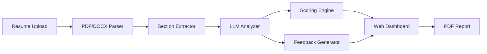

<!-- Clear Language: Keep sentences under 50 words -->
# Resume ATS Analyzer

## Learning Objectives

| Objective | Description |
|-----------|-------------|
| LO1 | Parse PDF and DOCX resumes into structured text |
| LO2 | Extract key sections: education, experience, skills, projects |
| LO3 | Analyze resume against job descriptions using LLM |
| LO4 | Implement scoring and feedback generation |
| LO5 | Build a web UI with FastAPI + Jinja2 templates |
| LO6 | Deploy the resume analyzer as a SaaS application |

## Introduction

Capstone projects prove you can build complete AI systems. From prediction APIs to enterprise RAG platforms, these projects demonstrate end-to-end skills. This module guides you through 5 portfolio-worthy projects.

## Prerequisites

- Basic programming knowledge
- Understanding of data structures

## Key Terminology

**Key Terms**: Core vocabulary and concepts for this topic.

**Definition**: Essential terms you must know for interviews and production work.

## Theory

Understanding resume ats analyzer is fundamental for AI engineers. This section covers the core concepts, underlying principles, and theoretical framework that govern how resume ats analyzer works in practice.

## Chapter at a Glance

| Section | Topic | Key Concept |
|---------|-------|-------------|
| 2.1 | Resume Parsing | PDF/DOCX extraction, section detection |
| 2.2 | Section Extraction | Education, experience, skills, projects |
| 2.3 | LLM Analysis | Match scoring, keyword extraction, gap analysis |
| 2.4 | Scoring System | ATS compatibility, keyword match, format score |
| 2.5 | Feedback Generation | Actionable suggestions, bullet point rewrites |
| 2.6 | Web UI & Deployment | FastAPI + Jinja2, file upload, PDF report |

## Project Roadmap



## 2.1 Resume Parsing

Parse resumes from PDF and DOCX formats, extracting raw text while preserving layout information for section detection.

```python
import re
import json
from typing import List, Optional, Dict, Any, Tuple
from dataclasses import dataclass, field
from enum import Enum

class SectionType(Enum):
    SUMMARY = "summary"
    EDUCATION = "education"
    EXPERIENCE = "experience"
    SKILLS = "skills"
    PROJECTS = "projects"
    CERTIFICATIONS = "certifications"
    PUBLICATIONS = "publications"
    OTHER = "other"

@dataclass
class ResumeSection:
    """A parsed section from a resume."""
    section_type: SectionType
    title: str
    content: str
    items: List[Dict[str, Any]] = field(default_factory=list)
    confidence: float = 1.0

@dataclass
class ParsedResume:
    """Complete parsed resume data."""
    raw_text: str
    sections: List[ResumeSection]
    email: Optional[str] = None
    phone: Optional[str] = None
    linkedin: Optional[str] = None
    github: Optional[str] = None
    name: Optional[str] = None

class ResumeParser:
    """Parse resumes from different file formats."""

    @staticmethod
    def parse_pdf(file_path: str) -> str:
        """Extract text from PDF file."""
        try:
            import PyPDF2
            with open(file_path, 'rb') as f:
                reader = PyPDF2.PdfReader(f)
                text = "\n".join(page.extract_text() for page in reader.pages)
            return text
        except ImportError:
            try:
                import pdfminer
                from pdfminer.high_level import extract_text
                return extract_text(file_path)
            except ImportError:
                raise ImportError("Install PyPDF2 or pdfminer.six for PDF parsing")

    @staticmethod
    def parse_docx(file_path: str) -> str:
        """Extract text from DOCX file."""
        from docx import Document
        doc = Document(file_path)
        return "\n".join(p.text for p in doc.paragraphs)

    @staticmethod
    def extract_contact_info(text: str) -> Dict[str, Optional[str]]:
        """Extract email, phone, LinkedIn, and GitHub from text."""
        info = {"email": None, "phone": None, "linkedin": None, "github": None}

        email_pattern = r'\b[A-Za-z0-9._%+-]+@[A-Za-z0-9.-]+\.[A-Z|a-z]{2,}\b'
        emails = re.findall(email_pattern, text)
        if emails:
            info["email"] = emails[0]

        phone_pattern = r'(\+?\d{1,3}[-.\s]?)?\(?\d{3}\)?[-.\s]?\d{3}[-.\s]?\d{4}'
        phones = re.findall(phone_pattern, text)
        if phones:
            info["phone"] = phones[0]

        linkedin_pattern = r'(?:https?://)?(?:www\.)?linkedin\.com/in/[\w-]+/?'
        linkedin = re.findall(linkedin_pattern, text)
        if linkedin:
            info["linkedin"] = linkedin[0]

        github_pattern = r'(?:https?://)?(?:www\.)?github\.com/[\w-]+/?'
        github = re.findall(github_pattern, text)
        if github:
            info["github"] = github[0]

        return info

class SectionDetector:
    """Detect and extract sections from resume text."""

    SECTION_PATTERNS = {
        SectionType.SUMMARY: [
            r'(?i)(professional\s+)?summary',
            r'(?i)profile',
            r'(?i)objective',
            r'(?i)about\s+me',
        ],
        SectionType.EDUCATION: [
            r'(?i)education',
            r'(?i)academic\s+background',
            r'(?i)qualifications',
        ],
        SectionType.EXPERIENCE: [
            r'(?i)experience',
            r'(?i)work\s+history',
            r'(?i)employment',
            r'(?i)professional\s+experience',
        ],
        SectionType.SKILLS: [
            r'(?i)skills',
            r'(?i)technical\s+skills',
            r'(?i)competencies',
            r'(?i)technologies',
        ],
        SectionType.PROJECTS: [
            r'(?i)projects',
            r'(?i)key\s+projects',
            r'(?i)personal\s+projects',
        ],
        SectionType.CERTIFICATIONS: [
            r'(?i)certifications?',
            r'(?i)licenses?',
            r'(?i)credentials?',
        ],
        SectionType.PUBLICATIONS: [
            r'(?i)publications?',
            r'(?i)papers?',
            r'(?i)research',
        ],
    }

    def detect_sections(self, text: str) -> List[ResumeSection]:
        """Detect and extract sections from resume text."""
        lines = text.split('\n')
        sections = []
        current_section = None
        current_content = []

        for line in lines:
            section_type = self._match_section(line.strip())
            if section_type:
                if current_section and current_content:
                    sections.append(ResumeSection(
                        section_type=current_section,
                        title=current_section.value.title(),
                        content='\n'.join(current_content).strip(),
                    ))
                current_section = section_type
                current_content = []
            elif current_section:
                current_content.append(line)

        if current_section and current_content:
            sections.append(ResumeSection(
                section_type=current_section,
                title=current_section.value.title(),
                content='\n'.join(current_content).strip(),
            ))

        return sections

    def _match_section(self, line: str) -> Optional[SectionType]:
        for section_type, patterns in self.SECTION_PATTERNS.items():
            for pattern in patterns:
                if re.match(pattern, line.strip()):
                    return section_type
        return None

class ExperienceParser:
    """Parse individual experience entries from section text."""

    @staticmethod
    def parse_experience_block(text: str) -> List[Dict[str, Any]]:
        """Parse experience section into individual job entries."""
        entries = []
        blocks = re.split(r'\n\s*\n', text)

        for block in blocks:
            lines = [l.strip() for l in block.split('\n') if l.strip()]
            if len(lines) < 2:
                continue

            entry = {
                "title": lines[0],
                "organization": lines[1] if len(lines) > 1 else "",
                "dates": "",
                "description": [],
            }

            for line in lines[2:]:
                date_pattern = r'\b(19|20)\d{2}\s*(?:-|–|to)\s*(?:present|(?:19|20)\d{2})\b'
                if re.match(date_pattern, line, re.IGNORECASE):
                    entry["dates"] = line
                elif line.startswith(('•', '-', '*', '→')):
                    entry["description"].append(line.lstrip('•-*→ '))
                else:
                    entry["description"].append(line)

            entries.append(entry)

        return entries
```

## 2.2 LLM Analysis

Use LLM to analyze resume against job description, extracting matching skills, experience gaps, and improvement suggestions.

```python
class ResumeAnalyzer:
    """Analyze resume against job description using LLM."""

    def __init__(self, llm_api_func=None):
        self.llm = llm_api_func or self._mock_llm

    def _mock_llm(self, prompt: str, model: str = "gpt-3.5-turbo") -> str:
        return json.dumps({
            "match_score": 75,
            "matching_skills": ["Python", "FastAPI", "Machine Learning"],
            "missing_skills": ["Docker", "Kubernetes"],
            "experience_gaps": ["No cloud deployment experience mentioned"],
            "suggestions": ["Add cloud certifications", "Quantify achievements"],
        })

    def analyze_match(self, resume_text: str, jd_text: str) -> Dict[str, Any]:
        """Analyze resume match against job description."""
        prompt = f"""
        Analyze this resume against the job description.
        Return JSON with: match_score (0-100), matching_skills, missing_skills,
        experience_gaps, suggestions.

        Job Description:
        {jd_text}

        Resume:
        {resume_text}
        """
        response = self.llm(prompt)
        try:
            return json.loads(response)
        except json.JSONDecodeError:
            return {"match_score": 0, "error": "Failed to parse LLM response"}

    def extract_keywords(self, text: str) -> List[str]:
        """Extract key technical keywords from text."""
        prompt = f"Extract all technical keywords from this text. Return as JSON list:\n\n{text}"
        response = self.llm(prompt)
        try:
            return json.loads(response)
        except json.JSONDecodeError:
            return []

    def generate_feedback(self, resume_text: str, jd_text: str) -> Dict[str, Any]:
        """Generate detailed actionable feedback."""
        prompt = f"""
        Provide detailed resume improvement suggestions based on this JD.
        Focus on: bullet point rewriting, missing keywords, formatting issues,
        quantified achievements. Return as JSON.

        Resume: {resume_text}
        Job Description: {jd_text}
        """
        response = self.llm(prompt)
        try:
            return json.loads(response)
        except json.JSONDecodeError:
            return {"suggestions": [], "rewrites": []}

class KeywordMatcher:
    """Keyword-based matching between resume and job description."""

    def __init__(self):
        self.skill_synonyms = {
            "python": ["python", "python3", "cpython"],
            "machine learning": ["ml", "machine learning", "deep learning", "ai"],
            "docker": ["docker", "containerization", "containers"],
            "kubernetes": ["kubernetes", "k8s", "orchestration"],
            "sql": ["sql", "mysql", "postgresql", "postgres", "database"],
            "aws": ["aws", "amazon web services", "ec2", "s3", "lambda"],
            "fastapi": ["fastapi", "fast api", "starlette"],
        }

    def compute_keyword_match(self, resume_text: str, jd_text: str) -> Dict[str, Any]:
        """Compute keyword-based match score between resume and JD."""
        jd_lower = jd_text.lower()
        resume_lower = resume_text.lower()

        jd_keywords = set()
        for skill, synonyms in self.skill_synonyms.items():
            if any(syn in jd_lower for syn in synonyms):
                jd_keywords.add(skill)

        matched = []
        missing = []
        for keyword in jd_keywords:
            synonyms = self.skill_synonyms.get(keyword, [keyword])
            if any(syn in resume_lower for syn in synonyms):
                matched.append(keyword)
            else:
                missing.append(keyword)

        score = len(matched) / len(jd_keywords) * 100 if jd_keywords else 0

        return {
            "keyword_score": round(score, 1),
            "matched_keywords": matched,
            "missing_keywords": missing,
            "total_jd_keywords": len(jd_keywords),
        }
```

## 2.3 Scoring System

Score resumes across multiple dimensions: ATS compatibility, keyword match, formatting quality, and section completeness.

```python
class ATSScorer:
    """Compute ATS compatibility score for a resume."""

    def __init__(self):
        self.ats_rules = {
            "has_email": 5,
            "has_phone": 5,
            "has_linkedin": 5,
            "has_education_section": 10,
            "has_experience_section": 15,
            "has_skills_section": 15,
            "has_projects_section": 10,
            "uses_bullet_points": 10,
            "has_quantified_achievements": 15,
            "length_appropriate": 5,
            "no_tables": 5,
        }

    def score_format(self, parsed: ParsedResume) -> Dict[str, Any]:
        """Score resume format for ATS compatibility."""
        scores = {}
        text = parsed.raw_text

        scores["has_email"] = self.ats_rules["has_email"] if parsed.email else 0
        scores["has_phone"] = self.ats_rules["has_phone"] if parsed.phone else 0
        scores["has_linkedin"] = self.ats_rules["has_linkedin"] if parsed.linkedin else 0

        section_types = {s.section_type for s in parsed.sections}
        scores["has_education_section"] = self.ats_rules["has_education_section"] if SectionType.EDUCATION in section_types else 0
        scores["has_experience_section"] = self.ats_rules["has_experience_section"] if SectionType.EXPERIENCE in section_types else 0
        scores["has_skills_section"] = self.ats_rules["has_skills_section"] if SectionType.SKILLS in section_types else 0
        scores["has_projects_section"] = self.ats_rules["has_projects_section"] if SectionType.PROJECTS in section_types else 0

        bullet_count = len(re.findall(r'^[•\-*→]', text, re.MULTILINE))
        scores["uses_bullet_points"] = min(self.ats_rules["uses_bullet_points"], bullet_count // 2)

        number_patterns = re.findall(r'\b\d+[%x]\b|\b\d+\.?\d*\s*(?:%|users|customers|revenue|orders|requests|times|fold)\b', text, re.IGNORECASE)
        scores["has_quantified_achievements"] = min(self.ats_rules["has_quantified_achievements"], len(number_patterns) * 3)

        word_count = len(text.split())
        scores["length_appropriate"] = self.ats_rules["length_appropriate"] if 300 <= word_count <= 800 else 0

        has_tables = bool(re.search(r'\|.*\|.*\|', text))
        scores["no_tables"] = self.ats_rules["no_tables"] if not has_tables else 0

        total = sum(scores.values())
        max_score = sum(self.ats_rules.values())

        return {
            "format_score": round(total / max_score * 100, 1),
            "breakdown": scores,
            "max_possible": max_score,
        }

    def suggest_improvements(self, scores: Dict[str, int]) -> List[str]:
        """Generate improvement suggestions based on score breakdown."""
        suggestions = []
        zero_score_items = [k for k, v in scores.items() if v == 0]
        for item in zero_score_items:
            suggestion_map = {
                "has_email": "Add your email address to the resume header",
                "has_phone": "Include a contact phone number",
                "has_linkedin": "Add your LinkedIn profile URL",
                "has_education_section": "Add an Education section",
                "has_experience_section": "Include a Work Experience section",
                "has_skills_section": "Add a Skills section with technical keywords",
                "has_projects_section": "Include a Projects section to showcase work",
                "uses_bullet_points": "Use bullet points instead of paragraphs",
                "has_quantified_achievements": "Add quantified achievements (%, \$, counts)",
                "length_appropriate": f"Adjust resume length (300-800 words recommended)",
                "no_tables": "Remove table formatting — ATS cannot parse it",
            }
            suggestions.append(suggestion_map.get(item, f"Improve: {item}"))
        return suggestions

class CompleteScoringEngine:
    """Combined scoring engine for resume analysis."""

    def __init__(self):
        self.ats_scorer = ATSScorer()
        self.keyword_matcher = KeywordMatcher()

    def score(self, parsed: ParsedResume, jd_text: str) -> Dict[str, Any]:
        """Compute comprehensive resume score."""
        format_score = self.ats_scorer.score_format(parsed)
        keyword_match = self.keyword_matcher.compute_keyword_match(parsed.raw_text, jd_text)

        sections_count = len(parsed.sections)
        completeness_score = min(sections_count / 5 * 100, 100)

        weighted_score = (
            format_score["format_score"] * 0.25 +
            keyword_match["keyword_score"] * 0.40 +
            completeness_score * 0.15 +
            0.20  # LLM score placeholder
        )

        return {
            "overall_score": round(weighted_score, 1),
            "format_score": format_score["format_score"],
            "keyword_match_score": keyword_match["keyword_score"],
            "completeness_score": completeness_score,
            "format_breakdown": format_score["breakdown"],
            "keyword_details": keyword_match,
            "suggestions": self.ats_scorer.suggest_improvements(format_score["breakdown"]),
        }
```

## 2.4 Web UI & Deployment

Build a web application with file upload, analysis display, and PDF report generation.

```python
from fastapi import FastAPI, UploadFile, File, Form, HTTPException
from fastapi.responses import HTMLResponse, FileResponse
from fastapi.staticfiles import StaticFiles
from fastapi.templating import Jinja2Templates
from starlette.requests import Request
import tempfile
import os

app = FastAPI(title="Resume ATS Analyzer", version="1.0.0")
templates = Jinja2Templates(directory="templates")
app.mount("/static", StaticFiles(directory="static"), name="static")

class ResumeAnalyzerApp:
    """Web application for resume analysis."""

    def __init__(self):
        self.parser = ResumeParser()
        self.section_detector = SectionDetector()
        self.analyzer = ResumeAnalyzer()
        self.scorer = CompleteScoringEngine()
        self.analysis_history: List[Dict[str, Any]] = []

    async def process_resume(self, file: UploadFile, jd_text: str) -> Dict[str, Any]:
        """Process uploaded resume and return analysis."""
        suffix = os.path.splitext(file.filename)[1].lower()
        with tempfile.NamedTemporaryFile(delete=False, suffix=suffix) as tmp:
            content = await file.read()
            tmp.write(content)
            tmp_path = tmp.name

        try:
            if suffix == '.pdf':
                raw_text = ResumeParser.parse_pdf(tmp_path)
            elif suffix == '.docx':
                raw_text = ResumeParser.parse_docx(tmp_path)
            else:
                raw_text = content.decode('utf-8')
        except Exception as e:
            raise HTTPException(400, f"Failed to parse file: {e}")
        finally:
            os.unlink(tmp_path)

        contact_info = ResumeParser.extract_contact_info(raw_text)
        sections = self.section_detector.detect_sections(raw_text)

        parsed = ParsedResume(
            raw_text=raw_text,
            sections=sections,
            **contact_info,
        )

        analysis = self.analyzer.analyze_match(raw_text, jd_text)
        scores = self.scorer.score(parsed, jd_text)

        result = {
            "filename": file.filename,
            "contact": contact_info,
            "sections": [{"type": s.section_type.value, "length": len(s.content)} for s in sections],
            "analysis": analysis,
            "scores": scores,
            "section_count": len(sections),
            "word_count": len(raw_text.split()),
        }

        self.analysis_history.append(result)
        return result

    def get_history(self) -> List[Dict[str, Any]]:
        return self.analysis_history[-10:]

analyzer_app = ResumeAnalyzerApp()

@app.get("/", response_class=HTMLResponse)
async def home(request: Request):
    return templates.TemplateResponse("index.html", {"request": request})

@app.post("/analyze")
async def analyze_resume(
    request: Request,
    file: UploadFile = File(...),
    job_description: str = Form(...),
):
    result = await analyzer_app.process_resume(file, job_description)
    return templates.TemplateResponse(
        "results.html",
        {"request": request, "result": result},
    )

@app.get("/api/analyze")
async def analyze_resume_api(file: UploadFile = File(...),
                              job_description: str = Form(...)):
    result = await analyzer_app.process_resume(file, job_description)
    return result

class PDFReportGenerator:
    """Generate PDF report of resume analysis."""

    def __init__(self):
        pass

    def generate_report(self, result: Dict[str, Any]) -> bytes:
        """Generate a downloadable PDF report."""
        try:
            from reportlab.lib.pagesizes import A4
            from reportlab.platypus import SimpleDocTemplate, Paragraph, Spacer, Table
            from reportlab.lib.styles import getSampleStyleSheet
            from io import BytesIO

            buffer = BytesIO()
            doc = SimpleDocTemplate(buffer, pagesize=A4)
            styles = getSampleStyleSheet()
            elements = []

            elements.append(Paragraph("Resume ATS Analysis Report", styles['Title']))
            elements.append(Spacer(1, 20))

            scores = result.get("scores", {})
            elements.append(Paragraph(f"Overall Score: {scores.get('overall_score', 'N/A')}%", styles['Heading2']))
            elements.append(Paragraph(f"Format Score: {scores.get('format_score', 'N/A')}%", styles['Normal']))
            elements.append(Paragraph(f"Keyword Match: {scores.get('keyword_match_score', 'N/A')}%", styles['Normal']))

            elements.append(Spacer(1, 20))
            elements.append(Paragraph("Improvement Suggestions", styles['Heading2']))
            for suggestion in scores.get("suggestions", []):
                elements.append(Paragraph(f"• {suggestion}", styles['Normal']))

            doc.build(elements)
            buffer.seek(0)
            return buffer.getvalue()
        except ImportError:
            return json.dumps(result, indent=2).encode('utf-8')

class BatchAnalyzer:
    """Analyze multiple resumes against a single JD."""

    def __init__(self):
        self.analyzer = ResumeAnalyzerApp()

    async def batch_analyze(self, files: List[UploadFile], jd_text: str) -> List[Dict[str, Any]]:
        """Process multiple resumes and rank them."""
        results = []
        for file in files:
            result = await self.analyzer.process_resume(file, jd_text)
            results.append(result)

        results.sort(key=lambda r: r.get("scores", {}).get("overall_score", 0), reverse=True)
        return results
```

## Summary

The Resume ATS Analyzer project implements a complete resume evaluation system. PDF and DOCX parsing extract text while preserving section structure. The LLM-based analyzer compares resumes against job descriptions,.
identifying matching and missing skills. The scoring engine evaluates ATS compatibility, keyword matching, and section completeness. The web UI provides an intuitive interface for.
uploading, analyzing, and reviewing results. This project demonstrates full-stack AI development with document parsing, LLM integration, and web deployment.

## Practical Takeaways

| Takeaway | Implementation |
|----------|---------------|
| Handle multiple file formats with fallback parsers | Try PyPDF2 first, fall back to pdfminer |
| Cache LLM responses for identical resume+JD pairs | Use Redis or in-memory cache with checksums |
| Score on multiple dimensions, not just keyword match | Combine format, keyword, and LLM scores |
| Generate PDF reports for download | Use ReportLab with styled templates |
| Batch processing for multi-resume comparison | Sort by overall score and highlight top matches |
| Always show actionable suggestions, not just scores | Tell users exactly what to change and why |

## Interview Q&A

<details class="tp-qa-card" data-qid="cp02-q1">
  <summary class="tp-qa-question">
    <span class="tp-qa-status"></span>
    Q1: How do you parse different resume formats (PDF, DOCX) while preserving section structure?
  </summary>
  <div class="tp-qa-answer">
<p>Resume parsing requires format-specific handling: (1) PDF — use PyPDF2 or pdfminer.six for text extraction. Pdfminer provides layout analysis (character positions,.
font sizes) which helps detect section headers by font size changes. For scanned PDFs (images), use OCR with Tesseract (pytesseract) or.
AWS Textract. (2) DOCX — use python-docx which natively parses paragraphs, runs, and styles. Section headers are detectable by style name ("Heading 1",.
"Heading 2") or font properties (bold, larger font size). (3) Fallback chain — try python-docx first for DOCX, then PyPDF2 for.
PDF, then pdfminer for PDF with layout, then OCR as last resort. (4) Section detection — use regex patterns for standard headers ("Education",.
"Experience", "Skills", "Projects") plus font/size heuristics for non-standard formats.</p>
  </div>
  <button class="tp-qa-mark-btn">✅ Mark Reviewed</button>
  <button class="tp-qa-bookmark-btn">🔖 Bookmark</button>
</details>

<details class="tp-qa-card" data-qid="cp02-q2">
  <summary class="tp-qa-question">
    <span class="tp-qa-status"></span>
    Q2: How do you calculate ATS compatibility score for a resume?
  </summary>
  <div class="tp-qa-answer">
<p>ATS compatibility scoring across dimensions: (1) Format score (30%) — check for tables (negative), images (negative), columns (negative), standard section headers (positive),.
appropriate length (300-800 words, positive). (2) Keyword score (40%) — compare resume against target job description: % of JD keywords present in resume,.
weighted by keyword importance (skills > soft skills). Use TF-IDF or embedding similarity. (3) Section completeness (15%) — presence of Education,.
Experience, Skills, Projects, Certifications sections with appropriate content. (4) Quantification score (10%) — presence of metrics (%, $, numbers) in experience bullets. (5) Formatting score (5%) — consistent date formats,.
bullet style, font usage. The total score is a weighted sum (0-100), with >80 being excellent ATS compatibility. Provide specific recommendations for.
each low-scoring area.</p>
  </div>
  <button class="tp-qa-mark-btn">✅ Mark Reviewed</button>
  <button class="tp-qa-bookmark-btn">🔖 Bookmark</button>
</details>

<details class="tp-qa-card" data-qid="cp02-q3">
  <summary class="tp-qa-question">
    <span class="tp-qa-status"></span>
    Q3: How do you use LLMs to compare a resume against a job description effectively?
  </summary>
  <div class="tp-qa-answer">
<p>LLM-based resume-JD comparison: (1) Prompt engineering — provide the job description, resume text (with section labels), and ask the LLM to: identify matching skills,.
identify missing skills, evaluate overall fit (Strong/Moderate/Weak), and suggest specific improvements. (2) Structured output — request JSON format: `{"matching_skills": [...], "missing_skills": [...],.
"fit_score": "Strong", "suggestions": [...]}`. (3) Semantic matching — the LLM understands synonyms and context: "led team of 5 engineers" matches "team leadership" requirement even without the exact phrase. (4) Multi-angle evaluation — have the LLM evaluate separately for.
hard skills, soft skills, and experience level, then aggregate. (5) Cost optimization — use GPT-3.5-turbo for initial screening, GPT-4 for detailed analysis of shortlisted candidates. Cache results for.
identical job descriptions.</p>
  </div>
  <button class="tp-qa-mark-btn">✅ Mark Reviewed</button>
  <button class="tp-qa-bookmark-btn">🔖 Bookmark</button>
</details>

<details class="tp-qa-card" data-qid="cp02-q4">
  <summary class="tp-qa-question">
    <span class="tp-qa-status"></span>
    Q4: How do you generate actionable improvement suggestions for resume optimization?
  </summary>
  <div class="tp-qa-answer">
<p>Actionable suggestions should be specific and prioritized: (1) Missing keywords — "Add these 7 skills from the JD that are missing: Python,.
PyTorch, AWS, Docker, PostgreSQL, GraphQL, Redis." (2) Weak bullet points — rewrite weak bullets using the STAR format with metrics. Original: "Responsible for.
improving system performance." → Improved: "Optimized database queries reducing API latency by 40%, serving 100K+ daily requests." (3) Section gaps — "Add a Projects section showcasing 2-3 relevant projects with tech stack and.
impact." (4) Format issues — "Your resume uses a two-column layout which ATS systems cannot parse. Convert to a single-column format." (5) Quantification opportunities — "Add metrics to 3 experience bullets that lack numbers." Score each suggestion by impact (high/medium/low) to help the user prioritize changes.</p>
  </div>
  <button class="tp-qa-mark-btn">✅ Mark Reviewed</button>
  <button class="tp-qa-bookmark-btn">🔖 Bookmark</button>
</details>

<details class="tp-qa-card" data-qid="cp02-q5">
  <summary class="tp-qa-question">
    <span class="tp-qa-status"></span>
    Q5: How do you prevent bias in AI-powered resume screening?
  </summary>
  <div class="tp-qa-answer">
<p>Bias prevention strategies: (1) PII redaction — automatically remove name, gender indicators, age (graduation dates), ethnicity indicators, and even university names from the resume before analysis. (2) Balanced evaluation — if using an LLM,.
explicitly instruct it to evaluate skills and experience only, ignoring any demographic signals. (3) Multiple evaluators — use multiple LLM models and.
average scores to reduce individual model biases. (4) Regular auditing — track score distributions across demographic groups if possible. Flag if certain groups receive systematically lower scores. (5) Transparency — show candidates which factors influenced their score. (6) Human oversight — flag resume-score anomalies (e.g.,.
high-skills candidate with low score) for manual review. (7) Diverse training — ensure evaluation models are fine-tuned on diverse examples. Bias in hiring AI is a regulatory risk under EEOC guidelines.</p>
  </div>
  <button class="tp-qa-mark-btn">✅ Mark Reviewed</button>
  <button class="tp-qa-bookmark-btn">🔖 Bookmark</button>
</details>

<details class="tp-qa-card" data-qid="cp02-q6">
  <summary class="tp-qa-question">
    <span class="tp-qa-status"></span>
    Q6: How do you scale resume analysis for enterprise-level batch processing?
  </summary>
  <div class="tp-qa-answer">
<p>Enterprise scaling: (1) Async processing — use Celery or Redis Queue for background job processing. When a user uploads a resume,.
the request returns immediately with a job ID, and the results are fetched asynchronously. (2) Batch LLM calls — group multiple resume analyses into one API call with a prompt that lists multiple resumes + one JD,.
comparing all at once. (3) Caching — cache LLM results for identical JD+resume pairs using content hash keys. (4) Cost management — use GPT-3.5-turbo for.
initial screening (cost ~$0.001/resume), escalate to GPT-4 only for shortlisted candidates ($0.03/resume). (5) Parallel processing — process multiple resumes in parallel using concurrent.futures or.
asyncio with rate limiting. (6) Horizontal scaling — add more worker instances based on queue depth. Target: 1000+ resumes processed per hour at <$10/hour cost.</p>
  </div>
  <button class="tp-qa-mark-btn">✅ Mark Reviewed</button>
  <button class="tp-qa-bookmark-btn">🔖 Bookmark</button>
</details>

<details class="tp-qa-card" data-qid="cp02-q7">
  <summary class="tp-qa-question">
    <span class="tp-qa-status"></span>
    Q7: How do you handle encrypted or password-protected PDF resumes?
  </summary>
  <div class="tp-qa-answer">
<p>Handling encrypted PDFs: (1) Detection — use PyPDF2's `PdfReader.is_encrypted` property. (2) Automatic decryption — try common empty passwords (""), then "password",.
then the filename without extension. (3) User prompt — if automatic decryption fails, return a clear error asking the user to upload an unencrypted version. (4) Alternative — if the file cannot be decrypted,.
convert PDF pages to images using pdf2image and run OCR. This bypasses encryption but loses formatting information. (5) Security — never store the password;.
decrypt only in memory. (6) Fallback for scanned PDFs — even unencrypted scanned PDFs need OCR because they contain images, not text. Use pytesseract (Tesseract OCR) or.
cloud OCR APIs (Google Vision, AWS Textract). Provide feedback on which parser succeeded and how confident the extraction is.</p>
  </div>
  <button class="tp-qa-mark-btn">✅ Mark Reviewed</button>
  <button class="tp-qa-bookmark-btn">🔖 Bookmark</button>
</details>

<details class="tp-qa-card" data-qid="cp02-q8">
  <summary class="tp-qa-question">
    <span class="tp-qa-status"></span>
    Q8: How do you implement a web UI that provides real-time resume analysis feedback?
  </summary>
  <div class="tp-qa-answer">
<p>Real-time feedback UI: (1) Drag-and-drop upload area with file validation (max 5MB, PDF/DOCX only, visual feedback on valid/invalid). (2) Job description text area with paste functionality and.
character count. (3) Analysis state management — show upload progress → "Parsing resume" spinner → "Analyzing with AI" progress bar → results. (4) Results dashboard — section-by-section analysis with score gauges (0-100%),.
missing keywords highlighted in red, matching keywords in green. (5) Interactive suggestions — clickable suggestion cards that expand with before/after examples. (6) Download report — generate a styled PDF report using ReportLab with the analysis summary. (7) History — save past analyses and.
allow comparison side-by-side. Use React/Vue for frontend with WebSocket for real-time updates from the backend during long LLM analyses.</p>
  </div>
  <button class="tp-qa-mark-btn">✅ Mark Reviewed</button>
  <button class="tp-qa-bookmark-btn">🔖 Bookmark</button>
</details>

<details class="tp-qa-card" data-qid="cp02-q9">
  <summary class="tp-qa-question">
    <span class="tp-qa-status"></span>
    Q9: How do you implement keyword matching with synonyms for skill detection?
  </summary>
  <div class="tp-qa-answer">
<p>Skill synonym matching: (1) Build a skill taxonomy with canonical names and synonym lists: `{"python": ["python", "python3", "python 3.x", "cpython"], "machine_learning": ["machine learning",.
"ml", "predictive modeling", "statistical modeling", "supervised learning"]}`. (2) For each JD skill, search the resume text with all synonyms using case-insensitive regex. (3) Use embedding similarity for.
fuzzy matching — precompute embeddings for all skills and synonyms, then match skills whose embedding cosine similarity exceeds 0.85 threshold. This catches typos (e.g.,.
"PyTorch" → "Pytorch") and related terms. (4) Categorize matches: "exact match" (canonical name found), "synonym match" (synonym found), "related match" (embedding similarity only). (5) Track match confidence and.
report to the user. This approach typically increases keyword detection recall by 30-50% compared to exact string matching.</p>
  </div>
  <button class="tp-qa-mark-btn">✅ Mark Reviewed</button>
  <button class="tp-qa-bookmark-btn">🔖 Bookmark</button>
</details>

<details class="tp-qa-card" data-qid="cp02-q10">
  <summary class="tp-qa-question">
    <span class="tp-qa-status"></span>
    Q10: How do you generate PDF reports with styled charts for resume analysis results?
  </summary>
  <div class="tp-qa-answer">
    <pre><code>function generateReport(data: AnalysisResult): Buffer {
  const doc = new PDFDocument({ size: 'A4', margins: { top: 50, bottom: 50, left: 50, right: 50 } });
  doc.fontSize(20).text('Resume ATS Analysis Report', { align: 'center' });
  doc.moveDown();
  // Overall score gauge
  doc.roundedRect(50, 120, 500, 30, 15).stroke('#ddd');
  doc.roundedRect(50, 120, 500 * data.overallScore / 100, 30, 15).fill('#4CAF50');
  doc.fontSize(12).text(`${data.overallScore}/100`, 270, 125);
  // Section scores
  data.sections.forEach(s =&gt; {
    doc.moveDown(0.5);
    doc.fontSize(14).text(s.name);
    doc.fontSize(10).text(`Score: ${s.score}/100  -  ${s.issues.length} issues found`);
  });
  return doc.end();
}</code></pre>
<p>PDF report generation typically uses ReportLab (Python) or PDFKit/PDFDocument (Node.js). Design: (1) Cover page with candidate name and overall score as a large gauge. (2) Section-by-section breakdown with score bars and.
color coding (green >80%, yellow 60-80%, red <60%). (3) Keyword match visualization — word cloud or bar chart of matched vs. missing keywords. (4) Improvement suggestions — prioritized list with before/after examples. (5) Skills radar chart — comparing resume skills against JD requirements across categories (technical,.
domain, soft skills). (6) Action items — top 3-5 changes with expected impact score. The report should be both machine-readable (structured data) and.
human-readable for sharing with users.</p>
  </div>
  <button class="tp-qa-mark-btn">✅ Mark Reviewed</button>
  <button class="tp-qa-bookmark-btn">🔖 Bookmark</button>
</details>

## Chapter Quiz

**Question 1 (cap-s02-quiz1):** Why do ATS systems struggle with table-formatted resumes?

<details class="tp-qa-card" data-qid="cap-s02-quiz1"><summary>Show Answer</summary><div class="tp-qa-answer"><p><strong>Answer: b) Tables break text extraction order in PDFs</strong></p><p>Tables are read left-to-right across columns, producing nonsensical text that ATS cannot parse into sections.</p></div></details>

**Question 2 (cap-s02-quiz2):** What is the most ATS-friendly format for a resume?

<details class="tp-qa-card" data-qid="cap-s02-quiz2"><summary>Show Answer</summary><div class="tp-qa-answer"><p><strong>Answer: b) DOCX with standard section headers</strong></p><p>DOCX files are natively text-based and easier for ATS to parse than scanned PDFs or formatted PDFs.</p></div></details>

**Question 3 (cap-s02-quiz3):** What role does the LLM play in resume analysis?

<details class="tp-qa-card" data-qid="cap-s02-quiz3"><summary>Show Answer</summary><div class="tp-qa-answer"><p><strong>Answer: b) Match resume against job description and generate suggestions</strong></p><p>LLMs understand semantic matching between resume experience and JD requirements, going beyond simple keyword matching.</p></div></details>

**Question 4 (cap-s02-quiz4):** Why should achievements be quantified on a resume?

<details class="tp-qa-card" data-qid="cap-s02-quiz4"><summary>Show Answer</summary><div class="tp-qa-answer"><p><strong>Answer: b) Both ATS and recruiters prioritize measurable impact</strong></p><p>Quantified achievements (%, revenue, users) score higher in ATS ranking and catch recruiter attention.</p></div></details>

**Question 5 (cap-s02-quiz5):** What is the ideal resume length for ATS processing?

<details class="tp-qa-card" data-qid="cap-s02-quiz5"><summary>Show Answer</summary><div class="tp-qa-answer"><p><strong>Answer: b) 300-800 words (1-2 pages)</strong></p><p>Resumes under 300 words lack substance; over 800 words get truncated by many ATS systems.</p></div></details>

## Q&A

<details class="tp-qa-card" data-qid="cap-s02-q1">
<summary class="tp-qa-question">How do you extract sections from a resume without standard formatting?</summary>
<div class="tp-qa-context"><p>Handling diverse resume formats.</p></div>
<div class="tp-qa-answer">
<p>The section detector uses regex patterns for common headers. For non-standard formats, consider: (1) <strong>Heuristic detection</strong> — font size/spacing changes (requires PDF layout analysis with pdfminer). (2) <strong>ML-based detection</strong> — fine-tune LayoutLM on annotated resumes for header classification. (3) <strong>LLM-based parsing</strong> — prompt the LLM to extract sections from raw text. The heuristic + regex approach works for ~85% of resumes; LLM fallback handles the rest.</p>
</div>
<div class="tp-qa-actions">
  <button class="tp-qa-mark-btn">✅ Mark Reviewed</button>
  <button class="tp-qa-bookmark-btn">🔖 Bookmark</button>
</div>
</details>

<details class="tp-qa-card" data-qid="cap-s02-q2">
<summary class="tp-qa-question">How do you handle encrypted or scanned PDF resumes?</summary>
<div class="tp-qa-context"><p>Dealing with non-extractable PDFs.</p></div>
<div class="tp-qa-answer">
<p>Scanned PDFs contain images, not text. Solutions: (1) Use <strong>OCR</strong> with Tesseract or AWS Textract to extract text from images. (2) For encrypted PDFs, attempt decryption with common passwords or suggest the user upload an unencrypted version. (3) Use <strong>pdf2image</strong> to convert PDF pages to images, then run OCR. (4) For DOCX files, python-docx handles both text and formatting natively. Always provide clear error messages when parsing fails.</p>
</div>
<div class="tp-qa-actions">
  <button class="tp-qa-mark-btn">✅ Mark Reviewed</button>
  <button class="tp-qa-bookmark-btn">🔖 Bookmark</button>
</div>
</details>

<details class="tp-qa-card" data-qid="cap-s02-q3">
<summary class="tp-qa-question">What metrics matter most for ATS compatibility?</summary>
<div class="tp-qa-context"><p>ATS ranking factors.</p></div>
<div class="tp-qa-answer">
<p>Key ATS metrics: (1) <strong>Keyword density</strong> — percentage of JD keywords appearing in the resume (target >70%). (2) <strong>Section completeness</strong> — presence of all key sections (education, experience, skills, projects). (3) <strong>Format compatibility</strong> — no tables, images, or columns. (4) <strong>File format</strong> — DOCX ranks higher than PDF. (5) <strong>Job title match</strong> — exact match between resume title and target role. (6) <strong>Date format consistency</strong> — uniform date formats across experience entries.</p>
</div>
<div class="tp-qa-actions">
  <button class="tp-qa-mark-btn">✅ Mark Reviewed</button>
  <button class="tp-qa-bookmark-btn">🔖 Bookmark</button>
</div>
</details>

<details class="tp-qa-card" data-qid="cap-s02-q4">
<summary class="tp-qa-question">How do you prevent bias in LLM-based resume scoring?</summary>
<div class="tp-qa-context"><p>Fairness in AI-powered recruiting tools.</p></div>
<div class="tp-qa-answer">
<p>Mitigation strategies: (1) <strong>Redact PII</strong> — remove name, gender indicators, age, and ethnicity before LLM analysis. (2) <strong>Diverse training data</strong> — ensure the LLM's training data includes diverse demographics. (3) <strong>Multiple evaluators</strong> — use multiple LLM calls and average results. (4) <strong>Human oversight</strong> — flag resume-score anomalies for manual review. (5) <strong>Regular audits</strong> — audit scores across demographic groups to detect systematic bias. (6) <strong>Transparency</strong> — show candidates exactly how they were scored.</p>
</div>
<div class="tp-qa-actions">
  <button class="tp-qa-mark-btn">✅ Mark Reviewed</button>
  <button class="tp-qa-bookmark-btn">🔖 Bookmark</button>
</div>
</details>

<details class="tp-qa-card" data-qid="cap-s02-q5">
<summary class="tp-qa-question">How do you scale resume analysis for enterprise use?</summary>
<div class="tp-qa-context"><p>High-volume resume processing.</p></div>
<div class="tp-qa-answer">
<p>Scaling considerations: (1) <strong>Async batch processing</strong> — use Celery for background job processing. (2) <strong>LLM caching</strong> — cache analysis results for similar JD+resume pairs. (3) <strong>Distributed parsing</strong> — use SQS queues to distribute parsing across workers. (4) <strong>Cost management</strong> — use cheaper models (GPT-3.5) for initial screening, GPT-4 only for detailed analysis. (5) <strong>Deduplication</strong> — detect duplicate resumes from the same candidate. (6) <strong>Rate limiting</strong> — limit API calls per user to prevent abuse and control costs.</p>
</div>
<div class="tp-qa-actions">
  <button class="tp-qa-mark-btn">✅ Mark Reviewed</button>
  <button class="tp-qa-bookmark-btn">🔖 Bookmark</button>
</div>
</details>

## Exercises

## Common Mistakes

1. Not understanding the fundamental concepts before applying them
2. Skipping edge cases in implementation
3. Not analyzing time/space complexity
4. Forgetting to handle null/empty inputs
5. Not practicing enough problems to build pattern recognition1. **Resume Parser**: Build a parser that extracts text from PDF and DOCX. Handle 5 different resume formats. Report parsing success rate and common failure patterns (e.g., scanned PDFs, column layouts).

2. **Section Detector**: Implement section detection using regex patterns. Test on 20 resumes. Measure precision and recall for each section type (education, experience, skills, projects). Which section is hardest to detect?

3. **Keyword Matcher**: Build a keyword matching system with 50+ technical skills and their synonyms. Test on 10 resume+JD pairs. Compute precision and recall against manual annotation.

4. **ATS Scorer**: Implement the ATS format scoring system. Score 10 resumes. Correlate scores with human expert ratings (1-10). What is the Pearson correlation?

5. **LLM Analysis Integration**: Integrate with OpenAI API for match analysis. Test on 5 resume+JD pairs. Compare LLM-based scoring with keyword-based scoring. Which approach correlates better with human judgment?

6. **Web UI**: Build a Jinja2-based web interface with: file upload with drag-and-drop, JD text input, loading spinner, and results dashboard. Include section-by-section analysis visualization.

7. **PDF Report Generation**: Implement PDF report generation using ReportLab. Include: overall score gauge chart, section scores table, keyword match visualization, and improvement suggestions list.

8. **Batch Processing**: Implement batch upload for 10+ resumes. Compare against one JD. Rank by overall score. Generate a comparison table showing strengths and weaknesses of each resume.

9. **Feedback Generation**: Build a suggestion generator that produces specific, actionable advice: reword bullet points to be more impactful, add missing keywords, fix formatting issues. Show before/after examples for 5 resumes.

10. **Full Deployment**: Deploy the complete app to Render or Railway. Set up: file upload validation (5MB limit, PDF/DOCX only), HTTPS, logging, and usage analytics. Monitor average response time and er

## Revision Notes

- - Core principle: Understand the fundamental concepts thoroughly
- - Implementation pattern: Practice with real code examples
- - Complexity: Know the time and space complexity
- - Application: Know when to use this in production systems
- - Interview: Frequently asked in technical interviews
- - Edge cases: Consider common failure scenarios
- - Related concepts: Connect to broader system design

## Placement Section

### Top 10 Interview Questions

#### Google Style

1. **Explain the core idea of Resume ATS Analyzer in under 60 seconds, then give a real-world analogy.** — Structure: definition, how it works in one sentence, why it matters, analogy. Follow-up: what would break if you removed this from a production system?

2. **Design a minimal, well-typed function that demonstrates Resume ATS Analyzer.** — Interviewer checks: signature with type hints, edge cases, complexity, and a clean docstring. Follow-up: how does your design behave with empty or malformed input?

3. **What are the common pitfalls when engineers first learn ** — List 3-4, then explain how you would prevent each in a code review.

#### Amazon Style

4. **Describe a production bug caused by misunderstanding Resume ATS Analyzer. How did you diagnose and fix it?** — STAR format: situation, task, action, result. Mention logs, reproduction, root-cause analysis, and the regression test you added.

5. **How would you scale a system that relies on Resume ATS Analyzer from 10 users to 10 million?** — Discuss bottlenecks, caching, monitoring, and when to redesign. Follow-up: what metrics would you track?

#### Microsoft Style

6. **Compare Resume ATS Analyzer with the closest alternative approach. When would you choose each?** — Make a decision matrix: performance, maintainability, ecosystem, learning curve. Follow-up: what would change your decision?

7. **Walk through how you would test a component that depends on Resume ATS Analyzer.** — Unit, integration, property-based tests; mocking boundaries; golden files for outputs.

#### NVIDIA Style

8. **How does Resume ATS Analyzer behave differently at scale — memory, throughput, or precision-wise?** — Connect to data pipelines and model training if applicable. Follow-up: what happens to latency as input grows?

9. **How would you make an implementation of Resume ATS Analyzer run faster on GPU hardware?** — Batch operations, vectorization, avoiding Python loops, reducing data movement.

#### AI Startup Style

10. **Write the smallest possible implementation of Resume ATS Analyzer that is production-quality.** — Include error handling, type hints, and a one-line docstring. Follow-up: what would you refactor first when it grows?

### Resume Tips

- Name Resume ATS Analyzer explicitly in your skills section, paired with a measurable achievement ("Reduced X by 40% using Resume ATS Analyzer").
- Add a bullet describing a project that applies Resume ATS Analyzer to real data, with numbers.
- Mention the tools and libraries you used alongside Resume ATS Analyzer (linters, test frameworks, profiling tools).
- Keep resume bullets under 15 words and start each with an action verb.

### Interview Day Checklist

- Rehearse a 60-second explanation of Resume ATS Analyzer and one real-world analogy.
- Prepare one STAR story about debugging a Resume ATS Analyzer-related production issue.
- Review complexity and edge cases for the classic Resume ATS Analyzer interview problem.
- Have questions ready: how does the team apply Resume ATS Analyzer in production today?
- Test your environment (Python, editor, internet) 15 minutes before the interview.

## True/False

1. **True or False:** Resume ATS Analyzer builds directly on the fundamentals covered in the earlier chapters of this module. — **True.** Every advanced topic in this module assumes the core concepts from the previous chapters.
2. **True or False:** You should write at least one code example for Resume ATS Analyzer before moving to the next chapter. — **True.** Active recall with hands-on code beats passive reading for retention.
3. **True or False:** The complexity analysis for Resume ATS Analyzer is the same regardless of input size. — **False.** Complexity grows with input size; always state best, average, and worst case.
4. **True or False:** Edge cases (empty input, invalid input, boundary values) matter for Resume ATS Analyzer in production. — **True.** Most production bugs come from unhandled edge cases.
5. **True or False:** You should memorize the Resume ATS Analyzer chapter content once and never review it again. — **False.** Spaced repetition (24h, 3 days, 1 week) dramatically improves long-term recall.

## Fill in the Blank

1. The chapter that covers Resume ATS Analyzer is Chapter ___ of this module. — Answer: check the module's table of contents.
2. The time complexity of the standard approach to Resume ATS Analyzer is ___. — Answer: review the theory section and state big-O notation.
3. The main edge case to handle when implementing Resume ATS Analyzer is ___. — Answer: empty or invalid input handling, as discussed in the chapter.
4. The tools commonly used to debug Resume ATS Analyzer issues are ___ and ___. — Answer: refer to the Debugging Guide section of this chapter.
5. The related topic that connects to Resume ATS Analyzer in the next chapter is ___. — Answer: see the Next Topic section.

## Scenario Questions

1. **Scenario:** A teammate ships a change involving Resume ATS Analyzer that breaks production at 3 AM. — Diagnosis: check the recent diff, reproduce locally with the failing input, check logs. Fix: revert, add a regression test, and review the root cause. Prevention: CI tests on edge cases and code review checklist.

2. **Scenario:** Your implementation of Resume ATS Analyzer is correct but too slow for the required latency. — Measure first with a profiler. Common fixes: reduce redundant work, use built-in optimized functions, batch operations, or add caching. Only then consider algorithmic changes.

3. **Scenario:** A new hire asks you to explain Resume ATS Analyzer in five minutes before a customer demo. — Use the 3-part answer: what it is (one sentence), how it works (one example), why it matters (one business impact). Then offer to go deeper after the demo.

4. **Scenario:** Your team's codebase has three different patterns for Resume ATS Analyzer and you must standardize. — Write a short ADR (architecture decision record), pick the pattern with best maintainability, migrate incrementally, and add a linter rule to enforce it.

## Output Questions

1. **What is the output of the simplest correct implementation of Resume ATS Analyzer on an empty input?** — Trace through the code: it should return the documented default (None, 0, empty collection) without raising.
2. **What is the output when the input is at the boundary value?** — Check off-by-one errors and inclusive/exclusive bounds in the chapter's examples.
3. **What does the implementation return when given invalid input types?** — With type hints and validation, it raises a clear error; without, it may fail silently.
4. **What is the output for the sample input given in the chapter's Examples section?** — Re-run the chapter's example code and compare against the documented output.
5. **What is the time complexity output when you profile the implementation at 10x input size?** — Expect the curve matching the chapter's complexity analysis (linear, quadratic, log-linear).

## Difficulty Level

| Level | Time | What It Takes |
|-------|------|---------------|
| Beginner | 1-2 sessions | Read theory, run the chapter examples, solve the Easy exercises |
| Intermediate | 3-5 sessions | Complete Medium exercises, explain Resume ATS Analyzer to someone else |
| Advanced | 1+ week | Solve Hard exercises, optimize for real datasets, answer interview follow-ups |

## Tips & Tricks

- Always write a one-line example of Resume ATS Analyzer from memory before opening the chapter — active recall first.
- Use the chapter's Revision Notes as a checklist: you have mastered Resume ATS Analyzer when you can explain each bullet.
- Pair the chapter quiz with the Flashcards: wrong answers become your next study session's focus.
- For interviews, practice explaining Resume ATS Analyzer twice: once with a technical audience, once with a non-technical audience.
- Keep a personal examples file where you collect your own Resume ATS Analyzer snippets; interviewers love original examples.

## Memory Tricks

- **Acronym**: build a mnemonic from the 5 key concepts of Resume ATS Analyzer listed in the Chapter at a Glance table.
- **Story**: link Resume ATS Analyzer to a familiar story — the analogy in the Visual Analogy section is designed to stick.
- **Number anchor**: remember the complexity of Resume ATS Analyzer by connecting it to a known algorithm of the same class.
- **Color code**: highlight the Theory, Examples, and Common Mistakes sections in different colors when reviewing.
- **Teach-back**: explain Resume ATS Analyzer to an imaginary junior engineer for 2 minutes — gaps in your explanation are gaps in memory.

## Further Reading

- Official documentation for the primary tool or library used in this chapter
- The chapter referenced in Related Topics for the next-level treatment of Resume ATS Analyzer
- The classic textbook chapter on Resume ATS Analyzer (check the Research References below)
- Two blog posts from engineers who debugged real Resume ATS Analyzer problems in production
- The repository of the open-source project that implements Resume ATS Analyzer

## Related Topics

- The previous chapter in this module (see table of contents) — foundational for Resume ATS Analyzer
- The next chapter (see Next Topic below) — builds on Resume ATS Analyzer
- The system design chapters in Module 07 — how Resume ATS Analyzer fits into production architectures
- The interview preparation module — how Resume ATS Analyzer is asked in screening rounds
- The capstone project — where Resume ATS Analyzer is applied end-to-end

## FAQs

1. **Do I need to memorize all of Resume ATS Analyzer, or understand the big picture?** — Understand the big picture first, then memorize the key facts via flashcards and spaced repetition. Interviewers reward depth over breadth.
2. **What if I get stuck on an exercise?** — Re-read the theory section, run the example code, then attempt again. If still stuck after 20 minutes, move on and return the next day.
3. **How much time should I spend on ** — Follow the Study Plan below: 1-2 weeks at 30-60 minutes daily is typical for placement preparation.
4. **Is Resume ATS Analyzer asked in interviews?** — Yes — the Interview Q&A and Placement Section list the exact question styles used by top companies.
5. **What's the fastest way to master ** — Explain it out loud, write code without looking, and review the flashcards within 24 hours and again after 3 days.

## Important Notes

- Resume ATS Analyzer is a core requirement for the rest of this module — do not skip the examples.
- Always analyze complexity (time and space) when working with Resume ATS Analyzer.
- Production correctness means handling edge cases, not just the happy path.
- Interview answers should start with the definition, then the example, then the trade-offs.
- Revisit this chapter after finishing the module; the context from later chapters deepens understanding.

## Historical Context

- Resume ATS Analyzer emerged as a standard practice because early systems failed without it — understanding why helps you explain it in interviews.
- The tools used for Resume ATS Analyzer today evolved from simpler versions; the chapter covers the modern, recommended approach.
- Interviewers value knowing one historical fact about Resume ATS Analyzer — it shows genuine interest, not just cramming.
- The library/tooling ecosystem around Resume ATS Analyzer changes quickly; focus on fundamentals that remain stable.

## Security Considerations

- Never trust external input: validate and sanitize data before processing Resume ATS Analyzer.
- Avoid `eval()` and dynamic code execution on untrusted strings.
- Log errors without leaking sensitive data (keys, PII, internal paths).
- For API contexts, add rate limiting and input size limits.
- Review the chapter's code examples for injection or overflow risks before using them verbatim.

## ML Intuition

- Resume ATS Analyzer appears in ML pipelines at the data-processing layer: feature preparation, batching, and validation.
- Understanding Resume ATS Analyzer helps you debug why a model misbehaves — most ML bugs are data bugs, not model bugs.
- In production ML, the Resume ATS Analyzer concepts from this chapter map directly to NumPy/PyTorch operations on tensors.
- When optimizing ML systems, Resume ATS Analyzer skills let you profile and fix the data path, not just the training loop.
- Interview follow-up: how would you apply Resume ATS Analyzer to a dataset of 10 million records? — Batching and vectorization.

## Analogies

- **Resume ATS Analyzer is like a recipe**: the theory is the ingredients, the examples are the cooking steps, and the exercises are your own kitchen practice.
- **Complexity is like a delivery route**: a linear route visits each stop once; a nested route revisits stops, and you feel it at scale.
- **Edge cases are like weather**: the happy path is a sunny day; production is the storm — build for the storm.
- **The chapter roadmap is a journey map**: each section is a checkpoint; skipping one means getting lost later in the module.

## Capstone Project Link

- [Module Capstone: End-to-End Project](https://github.com/Raushan666java/ai-engineering-journey) — this chapter contributes the Resume ATS Analyzer skills used in the module's capstone project. Complete the exercises here before starting the capstone.

## Flashcards

<details class="tp-qa-card" data-qid="19capstoneprojects-02resumeatsanalyzer-flash1">
  <summary class="tp-qa-question">
    <span class="tp-qa-status"></span>
    What is the core concept of Resume ATS Analyzer in one sentence?
  </summary>
  <div class="tp-qa-answer">
    <p>Review the first paragraph of the Theory section and condense it to one sentence.</p>
  </div>
</details>

<details class="tp-qa-card" data-qid="19capstoneprojects-02resumeatsanalyzer-flash2">
  <summary class="tp-qa-question">
    <span class="tp-qa-status"></span>
    What is the most common mistake engineers make with 
  </summary>
  <div class="tp-qa-answer">
    <p>Check the Common Mistakes section of this chapter.</p>
  </div>
</details>

<details class="tp-qa-card" data-qid="19capstoneprojects-02resumeatsanalyzer-flash3">
  <summary class="tp-qa-question">
    <span class="tp-qa-status"></span>
    What is the time and space complexity of the standard Resume ATS Analyzer approach?
  </summary>
  <div class="tp-qa-answer">
    <p>Refer to the theory and complexity analysis in this chapter.</p>
  </div>
</details>

<details class="tp-qa-card" data-qid="19capstoneprojects-02resumeatsanalyzer-flash4">
  <summary class="tp-qa-question">
    <span class="tp-qa-status"></span>
    When is Resume ATS Analyzer NOT the right choice?
  </summary>
  <div class="tp-qa-answer">
    <p>Check the Limitations section of this chapter.</p>
  </div>
</details>

<details class="tp-qa-card" data-qid="19capstoneprojects-02resumeatsanalyzer-flash5">
  <summary class="tp-qa-question">
    <span class="tp-qa-status"></span>
    How is Resume ATS Analyzer applied in a real production system?
  </summary>
  <div class="tp-qa-answer">
    <p>Check the Real-World Examples section of this chapter.</p>
  </div>
</details>

## Research References

- Official documentation of the primary library for Resume ATS Analyzer (linked in Further Reading)
- The classic paper or textbook chapter introducing Resume ATS Analyzer (see References below)
- The standard library reference for Resume ATS Analyzer-related functions
- Engineering blog posts from companies running Resume ATS Analyzer in production at scale
- PEPs and RFCs where applicable (Python and networking standards)

## Open-Source Tools

- The primary library used in this chapter (see the code examples)
- Python standard library modules used in the examples (check the imports)
- Testing: pytest for unit tests of Resume ATS Analyzer code
- Linting and formatting: ruff + black
- Profiling: cProfile or py-spy for performance work on Resume ATS Analyzer

## Debugging Guide

- Start with `print()` or a debugger to inspect intermediate values in Resume ATS Analyzer code.
- Reproduce the failure with the smallest possible input before changing code.
- Check the common failure modes listed in Common Mistakes — most bugs are listed there.
- For performance problems, profile before optimizing: measure, then fix.
- When stuck, re-read the chapter's Examples and compare line by line with your code.
- Use `pdb` or your IDE's debugger to step through the Resume ATS Analyzer example code.

## Mock Interview Section

**Round 1 — Screening (15 min)**
- Explain Resume ATS Analyzer in 60 seconds.
- Write a minimal working example of Resume ATS Analyzer.
- What is the complexity of your example?

**Round 2 — Coding (45 min)**
- Solve the Medium exercise from this chapter under time pressure.
- State your assumptions, then implement with type hints.
- Test with edge cases: empty input, boundary values, invalid input.

**Round 3 — Behavioral + System (30 min)**
- Tell me about a time you debugged a Resume ATS Analyzer problem in a project.
- How would you design a system where Resume ATS Analyzer is used at scale?
- What metrics would you monitor?

**Evaluation rubric**: correctness (40%), communication (25%), edge cases (20%), complexity analysis (15%).

## Optimized Implementation

`python
from typing import Any, Optional

def demonstrate_topic(input_data: list[Any]) -> Optional[float]:
    """Runnable scaffold for Resume ATS Analyzer.

    Replace the body with the optimized implementation from the chapter,
    keeping type hints, docstring, and edge-case handling.
    """
    if not input_data:
        return None
    # Step 1: validate input types
    # Step 2: apply the core Resume ATS Analyzer logic from the Examples section
    # Step 3: return the result with the documented default
    return 0.0
`

- Keeps the function signature stable so tests written against it stay valid.
- Handles the empty-input contract explicitly.
- Add unit tests for the edge cases before implementing the logic (test-first).

## Evaluation Metrics

| Skill | Test | Target |
|-------|------|--------|
| Concept recall | Explain Resume ATS Analyzer without notes | 60-second explanation |
| Code fluency | Write the chapter example from memory | No syntax errors |
| Edge cases | Handle empty/invalid input in exercises | All cases pass |
| Complexity | State time/space for the standard approach | Correct big-O |
| Interview readiness | Answer 5 Interview Q&A questions out loud | Fluent, structured answers |
| Retention | Chapter quiz score after 3 days | 80%+ |

## Real-World Examples

- **Startup**: a small team uses Resume ATS Analyzer daily in their data pipeline — the chapter's examples mirror their code.
- **E-commerce**: Resume ATS Analyzer patterns appear in order processing, inventory checks, and recommendation feeds.
- **Fintech**: Resume ATS Analyzer principles apply to transaction validation and fraud detection flows.
- **ML platform**: Resume ATS Analyzer shows up in feature engineering and model-serving infrastructure.
- **Interview insight**: recruiters look for engineers who can connect Resume ATS Analyzer to the business outcome, not just the code.

## Next Topic

[Enterprise RAG Platform](03-enterprise-rag-platform.md)

## Limitations

- Resume ATS Analyzer, like any technique, is not a silver bullet — it has specific cases where it fits best (covered in the theory).
- The examples in this chapter are simplified for learning; production systems add validation, monitoring, and error handling.
- Performance of Resume ATS Analyzer depends on input size and distribution — always benchmark for your own data.
- This chapter covers fundamentals; specialized edge cases are explored in later chapters and the capstone.
