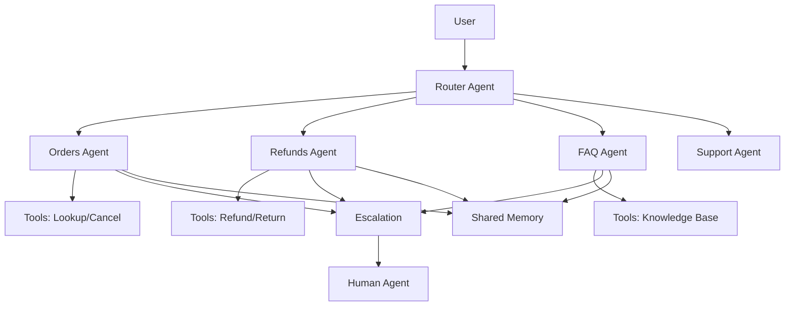

<!-- Clear Language: Keep sentences under 50 words -->
# Multi-Agent Support System

## Learning Objectives

| Objective | Description |
|-----------|-------------|
| LO1 | Design a multi-agent architecture for customer support |
| LO2 | Implement specialized agents with routing and escalation |
| LO3 | Build tool-using agents for order lookup, refunds, FAQs |
| LO4 | Implement shared memory and context across agents |
| LO5 | Build an analytics dashboard for agent performance |
| LO6 | Deploy the multi-agent system with monitoring |

## Introduction

Capstone projects prove you can build complete AI systems. From prediction APIs to enterprise RAG platforms, these projects demonstrate end-to-end skills. This module guides you through 5 portfolio-worthy projects.

## Prerequisites

- Basic programming knowledge
- Understanding of data structures

## Key Terminology

**Key Terms**: Core vocabulary and concepts for this topic.

**Definition**: Essential terms you must know for interviews and production work.

## Theory

Understanding multi agent support system is fundamental for AI engineers. This section covers the core concepts, underlying principles, and theoretical framework that govern how multi agent support system works in practice.

## Chapter at a Glance

| Section | Topic | Key Concept |
|---------|-------|-------------|
| 4.1 | Multi-Agent Architecture | Agent types, router agent, supervisor pattern |
| 4.2 | Specialized Agents | Orders, refunds, FAQs, cancellations |
| 4.3 | Tool Integration | Order lookup, refund processing, ticket creation |
| 4.4 | Agent Memory | Shared context, conversation history, state |
| 4.5 | Escalation Logic | Confidence thresholds, human handoff |
| 4.6 | Analytics Dashboard | Agent performance, resolution rates, CSAT |

## Project Roadmap



## 4.1 Multi-Agent Architecture

A support system uses specialized agents with a router that classifies intent and dispatches to the appropriate agent.

```python
from enum import Enum
from typing import Optional, List, Dict, Any, Callable
from dataclasses import dataclass, field
import json
from datetime import datetime

class Intent(Enum):
    ORDER_STATUS = "order_status"
    CANCEL_ORDER = "cancel_order"
    REFUND_REQUEST = "refund_request"
    RETURN_REQUEST = "return_request"
    FAQ = "faq"
    TECHNICAL_ISSUE = "technical_issue"
    BILLING = "billing"
    ESCALATE = "escalate"
    UNKNOWN = "unknown"

@dataclass
class AgentContext:
    """Shared context across agents in a conversation."""
    session_id: str
    user_id: str
    conversation_history: List[Dict[str, str]] = field(default_factory=list)
    current_intent: Optional[Intent] = None
    collected_data: Dict[str, Any] = field(default_factory=dict)
    escalation_reason: Optional[str] = None
    confidence: float = 1.0
    created_at: datetime = field(default_factory=datetime.now)

    def add_message(self, role: str, content: str):
        self.conversation_history.append({
            "role": role,
            "content": content,
            "timestamp": datetime.now().isoformat(),
        })

    def get_history(self, n: int = 5) -> List[Dict[str, str]]:
        return self.conversation_history[-n:]

class BaseAgent:
    """Base class for all support agents."""

    def __init__(self, name: str, llm_func: Callable):
        self.name = name
        self.llm = llm_func

    async def process(self, user_message: str, context: AgentContext) -> str:
        raise NotImplementedError

    def can_handle(self, intent: Intent) -> bool:
        raise NotImplementedError

class IntentClassifier:
    """Classify user intent using LLM."""

    def __init__(self, llm_func: Callable):
        self.llm = llm_func

    async def classify(self, message: str, history: List[Dict[str, str]]) -> Dict[str, Any]:
        """Classify user intent with confidence score."""
        prompt = f"""
        Classify this customer support message into one of these intents:
        - order_status: asking about order delivery, tracking, location
        - cancel_order: wants to cancel an existing order
        - refund_request: asking for money back
        - return_request: wants to return a product
        - faq: general question about policies, shipping, etc.
        - technical_issue: problem with website, login, account
        - billing: question about charges, invoices
        - escalate: wants to speak to a human

        Return JSON: {{"intent": "...", "confidence": 0.0-1.0, "entities": {{}}}}

        Message: {message}
        """
        response = self.llm(prompt)
        try:
            return json.loads(response)
        except json.JSONDecodeError:
            return {"intent": "unknown", "confidence": 0.0, "entities": {}}

class RouterAgent:
    """Route user requests to the appropriate specialized agent."""

    def __init__(self, classifier: IntentClassifier, agents: List[BaseAgent],
                 escalation_threshold: float = 0.6):
        self.classifier = classifier
        self.agents = agents
        self.escalation_threshold = escalation_threshold

    async def route(self, message: str, context: AgentContext) -> Dict[str, Any]:
        """Route message to appropriate agent."""
        classification = await self.classifier.classify(message, context.conversation_history)
        intent = Intent(classification.get("intent", "unknown"))
        confidence = classification.get("confidence", 0.0)
        context.current_intent = intent
        context.confidence = confidence

        if confidence < self.escalation_threshold:
            return {
                "action": "escalate",
                "reason": f"Low confidence ({confidence:.2f}) for intent: {intent.value}",
                "intent": intent.value,
            }

        for agent in self.agents:
            if agent.can_handle(intent):
                response = await agent.process(message, context)
                return {
                    "action": "agent_response",
                    "agent": agent.name,
                    "response": response,
                    "intent": intent.value,
                }

        return {
            "action": "transfer",
            "reason": f"No agent available for intent: {intent.value}",
        }
```

## 4.2 Specialized Agents

Each agent handles a specific domain with relevant tools and knowledge.

```python
class OrderStatusAgent(BaseAgent):
    """Handle order status inquiries."""

    def __init__(self, llm_func: Callable, order_lookup_func: Callable):
        super().__init__("Orders", llm_func)
        self.lookup_func = order_lookup_func

    def can_handle(self, intent: Intent) -> bool:
        return intent in (Intent.ORDER_STATUS, Intent.CANCEL_ORDER)

    async def process(self, user_message: str, context: AgentContext) -> str:
        order_id = await self._extract_order_id(user_message, context)
        if not order_id:
            return "I can help you with your order. Could you please provide your order number?"

        order_info = await self.lookup_func(order_id)
        if not order_info:
            return f"I couldn't find an order with number {order_id}. Could you double-check the number?"

        intent = context.current_intent
        if intent == Intent.ORDER_STATUS:
            return self._format_order_status(order_info)
        elif intent == Intent.CANCEL_ORDER:
            return self._handle_cancellation(order_info, context)
        return self._format_order_status(order_info)

    async def _extract_order_id(self, message: str, context: AgentContext) -> Optional[str]:
        import re
        order_patterns = [
            r'ORD[-:]?\s*(\w{6,12})',
            r'order\s*(?:number|#|id)?\s*:?\s*(\w{6,12})',
            r'#(\w{6,12})',
        ]
        for pattern in order_patterns:
            match = re.search(pattern, message, re.IGNORECASE)
            if match:
                return match.group(1)
        for msg in reversed(context.conversation_history):
            if msg["role"] == "agent":
                continue
            for pattern in order_patterns:
                match = re.search(pattern, msg.get("content", ""), re.IGNORECASE)
                if match:
                    return match.group(1)
        return None

    def _format_order_status(self, order: Dict[str, Any]) -> str:
        status = order.get("status", "unknown")
        estimated = order.get("estimated_delivery", "N/A")
        return (f"Your order #{order.get('order_id', 'N/A')} is currently "
                f"**{status}**. Estimated delivery: {estimated}. "
                f"Tracking: {order.get('tracking_url', 'Not available')}.")

    def _handle_cancellation(self, order: Dict[str, Any], context: AgentContext) -> str:
        status = order.get("status", "")
        if status in ("shipped", "delivered"):
            context.escalation_reason = f"Cannot cancel order in status: {status}"
            return (f"Your order has already been {status} and cannot be cancelled. "
                    f"Would you like to initiate a return instead?")
        if status in ("processing", "pending"):
            return (f"Your order #{order['order_id']} is still {status}. "
                    f"I can cancel it for you. Shall I proceed?")
        return f"Your order is in status '{status}'. Let me check cancellation options."

class RefundAgent(BaseAgent):
    """Process refund and return requests."""

    def __init__(self, llm_func: Callable, process_refund_func: Callable):
        super().__init__("Refunds", llm_func)
        self.refund_func = process_refund_func

    def can_handle(self, intent: Intent) -> bool:
        return intent in (Intent.REFUND_REQUEST, Intent.RETURN_REQUEST)

    async def process(self, user_message: str, context: AgentContext) -> str:
        order_id = await self._extract_order_id(user_message, context)
        if not order_id:
            return "To process a return or refund, I need your order number. Can you provide it?"

        reason = await self._extract_reason(user_message)
        if not reason and context.current_intent == Intent.RETURN_REQUEST:
            return "I understand you want to return an item. Could you tell me why?"

        result = await self.refund_func({
            "order_id": order_id,
            "user_id": context.user_id,
            "reason": reason or "Not specified",
            "type": context.current_intent.value,
        })

        if result.get("success"):
            return (f"I've initiated the {context.current_intent.value.replace('_', ' ')} "
                    f"for order #{order_id}. Reference: {result.get('reference', 'N/A')}. "
                    f"Expected processing time: 5-7 business days.")
        else:
            return (f"I'm sorry, I couldn't process the {context.current_intent.value}. "
                    f"Let me transfer you to a human agent who can help. "
                    f"Reason: {result.get('reason', 'Unknown')}")

    async def _extract_order_id(self, message: str, context: AgentContext) -> Optional[str]:
        import re
        patterns = [r'ORD[-:]?\s*(\w{6,12})', r'order\s*(?:number|#|id)?\s*:?\s*(\w{6,12})']
        for pattern in patterns:
            match = re.search(pattern, message, re.IGNORECASE)
            if match:
                return match.group(1)
        return None

    async def _extract_reason(self, message: str) -> Optional[str]:
        prompt = f"Extract the reason for return/refund from this message: {message}"
        response = self.llm(prompt)
        return response.strip() if response.strip() not in ("", "N/A", "None") else None

class FAQAgent(BaseAgent):
    """Answer frequently asked questions from knowledge base."""

    def __init__(self, llm_func: Callable, knowledge_base: Dict[str, str]):
        super().__init__("FAQ", llm_func)
        self.knowledge_base = knowledge_base

    def can_handle(self, intent: Intent) -> bool:
        return intent == Intent.FAQ

    async def process(self, user_message: str, context: AgentContext) -> str:
        topic = await self._classify_topic(user_message)

        if topic in self.knowledge_base:
            answer = self.knowledge_base[topic]
            context.collected_data["faq_topic"] = topic
            return answer

        return await self._llm_fallback(user_message)

    async def _classify_topic(self, message: str) -> str:
        topics = list(self.knowledge_base.keys())
        prompt = f"Classify this question into one of: {', '.join(topics)}\nQuestion: {message}"
        response = self.llm(prompt)
        for topic in topics:
            if topic.lower() in response.lower():
                return topic
        return "general"

    async def _llm_fallback(self, message: str) -> str:
        context = "\n".join(self.knowledge_base.values())
        prompt = f"Using this knowledge base:\n{context}\n\nAnswer: {message}"
        return self.llm(prompt)

class TechnicalSupportAgent(BaseAgent):
    """Handle technical issues and account problems."""

    def __init__(self, llm_func: Callable, diagnostic_tools: Dict[str, Callable]):
        super().__init__("Technical", llm_func)
        self.diagnostic_tools = diagnostic_tools

    def can_handle(self, intent: Intent) -> bool:
        return intent == Intent.TECHNICAL_ISSUE

    async def process(self, user_message: str, context: AgentContext) -> str:
        issue_type = await self._diagnose_issue(user_message)
        tool = self.diagnostic_tools.get(issue_type)
        if tool:
            result = await tool(context.user_id)
            return await self._generate_technical_response(issue_type, result)
        return self._get_generic_troubleshooting(issue_type)

    async def _diagnose_issue(self, message: str) -> str:
        prompt = f"Classify this technical issue type: {message}"
        return self.llm(prompt)

    async def _generate_technical_response(self, issue_type: str,
                                            result: Dict[str, Any]) -> str:
        return f"Regarding {issue_type}: {result.get('solution', 'Please try again later.')}"

    def _get_generic_troubleshooting(self, issue_type: str) -> str:
        return ("I'm sorry you're experiencing a technical issue. "
                "Let me suggest some steps: 1) Clear your browser cache, "
                "2) Try a different browser, 3) Check your internet connection. "
                "If the problem persists, I'll transfer you to a specialist.")
```

## 4.3 Tool Integration

Agents use tools to perform actions: order lookup, refund processing, ticket creation.

```python
class ToolRegistry:
    """Register and execute tools available to agents."""

    def __init__(self):
        self.tools: Dict[str, Dict[str, Any]] = {}

    def register(self, name: str, func: Callable,
                 description: str, parameters: Dict[str, Any]):
        self.tools[name] = {
            "func": func,
            "description": description,
            "parameters": parameters,
        }

    async def execute(self, tool_name: str, **kwargs) -> Any:
        if tool_name not in self.tools:
            raise ValueError(f"Tool {tool_name} not found")
        return await self.tools[tool_name]["func"](**kwargs)

class OrderTool:
    """Tools for order management."""

    @staticmethod
    async def lookup_order(order_id: str) -> Optional[Dict[str, Any]]:
        return {
            "order_id": order_id,
            "status": "shipped",
            "estimated_delivery": "2025-07-20",
            "tracking_url": f"https://track.example.com/{order_id}",
            "items": [
                {"name": "Widget Pro", "quantity": 2, "price": 29.99},
            ],
        }

    @staticmethod
    async def cancel_order(order_id: str, user_id: str) -> Dict[str, Any]:
        """Cancel an order and process refund."""
        return {
            "success": True,
            "reference": f"CNL-{order_id}",
            "refund_amount": 59.98,
            "refund_method": "original_payment",
        }

    @staticmethod
    async def create_return(order_id: str, items: List[str],
                            reason: str) -> Dict[str, Any]:
        """Create a return request."""
        return {
            "success": True,
            "rma_number": f"RMA-{hash(order_id) % 100000:06d}",
            "return_label_url": f"https://labels.example.com/rma-{order_id}",
            "instructions": "Print label, pack items, drop off at any carrier location.",
        }

class TicketTool:
    """Tools for ticket management."""

    def __init__(self):
        self.tickets: List[Dict[str, Any]] = []
        self.ticket_counter = 0

    async def create_ticket(self, user_id: str, subject: str,
                             description: str, priority: str = "medium") -> Dict[str, Any]:
        """Create a support ticket."""
        self.ticket_counter += 1
        ticket = {
            "ticket_id": f"TKT-{self.ticket_counter:05d}",
            "user_id": user_id,
            "subject": subject,
            "description": description,
            "priority": priority,
            "status": "open",
            "created_at": datetime.now().isoformat(),
        }
        self.tickets.append(ticket)
        return ticket

    async def get_ticket_status(self, ticket_id: str) -> Optional[Dict[str, Any]]:
        """Get ticket status."""
        for ticket in self.tickets:
            if ticket["ticket_id"] == ticket_id:
                return ticket
        return None

    async def assign_ticket(self, ticket_id: str, agent_id: str) -> bool:
        """Assign ticket to a human agent."""
        for ticket in self.tickets:
            if ticket["ticket_id"] == ticket_id:
                ticket["assigned_to"] = agent_id
                ticket["status"] = "in_progress"
                return True
        return False
```

## 4.4 Agent Memory

Shared memory enables context retention across agent handoffs and conversation turns.

```python
class ConversationMemory:
    """Persistent conversation memory across agent interactions."""

    def __init__(self):
        self.sessions: Dict[str, AgentContext] = {}
        self.summary_cache: Dict[str, str] = {}

    def get_or_create(self, session_id: str, user_id: str) -> AgentContext:
        if session_id not in self.sessions:
            self.sessions[session_id] = AgentContext(
                session_id=session_id,
                user_id=user_id,
            )
        return self.sessions[session_id]

    def update_context(self, session_id: str, **kwargs):
        if session_id in self.sessions:
            for key, value in kwargs.items():
                setattr(self.sessions[session_id], key, value)

    def summarize_conversation(self, session_id: str, llm_func: Callable) -> str:
        """Generate ongoing conversation summary."""
        context = self.sessions.get(session_id)
        if not context:
            return ""

        current = "\n".join(
            f"{m['role']}: {m['content']}" for m in context.conversation_history
        )
        cache_key = f"summary_{session_id}"

        if cache_key in self.summary_cache:
            prompt = f"Existing summary:\n{self.summary_cache[cache_key]}\nNew messages:\n{current}"
        else:
            prompt = f"Summarize this conversation:\n{current}"

        summary = llm_func(prompt)
        self.summary_cache[cache_key] = summary
        return summary

    def get_state(self, session_id: str) -> Dict[str, Any]:
        """Get serializable state for the session."""
        context = self.sessions.get(session_id)
        if not context:
            return {}
        return {
            "session_id": context.session_id,
            "user_id": context.user_id,
            "intent": context.current_intent.value if context.current_intent else None,
            "collected_data": context.collected_data,
            "escalation_reason": context.escalation_reason,
            "confidence": context.confidence,
            "message_count": len(context.conversation_history),
        }

    def timeout_sessions(self, timeout_minutes: int = 30):
        """Archive sessions that have been idle."""
        now = datetime.now()
        to_remove = []
        for session_id, context in self.sessions.items():
            if context.conversation_history:
                last_msg = context.conversation_history[-1]["timestamp"]
                last_time = datetime.fromisoformat(last_msg)
                if (now - last_time).total_seconds() > timeout_minutes * 60:
                    to_remove.append(session_id)
        for session_id in to_remove:
            del self.sessions[session_id]
```

## 4.5 Escalation Logic

Intelligent escalation based on confidence, sentiment, and business rules.

```python
class EscalationManager:
    """Manage escalation to human agents."""

    def __init__(self):
        self.escalation_rules = {
            "low_confidence": {"threshold": 0.5, "priority": "high"},
            "negative_sentiment": {"threshold": -0.5, "priority": "medium"},
            "sensitive_topic": {"priority": "high"},
            "repeat_escalation": {"max_count": 3, "priority": "critical"},
        }
        self.escalation_counts: Dict[str, int] = {}

    def should_escalate(self, context: AgentContext) -> Dict[str, Any]:
        """Determine if escalation is needed."""
        reasons = []

        if context.confidence < self.escalation_rules["low_confidence"]["threshold"]:
            reasons.append({
                "reason": "low_confidence",
                "priority": self.escalation_rules["low_confidence"]["priority"],
                "details": f"Confidence: {context.confidence:.2f}",
            })

        sentiment = self._detect_sentiment(context)
        if sentiment < self.escalation_rules["negative_sentiment"]["threshold"]:
            reasons.append({
                "reason": "negative_sentiment",
                "priority": "medium",
                "details": f"Sentiment score: {sentiment:.2f}",
            })

        sensitive_topics = ["legal", "complaint", "lawsuit", "regulatory"]
        for msg in context.conversation_history:
            if any(topic in msg.get("content", "").lower() for topic in sensitive_topics):
                reasons.append({
                    "reason": "sensitive_topic",
                    "priority": "high",
                    "details": "Sensitive topic detected",
                })
                break

        user_id = context.user_id
        if user_id in self.escalation_counts:
            self.escalation_counts[user_id] += 1
            if self.escalation_counts[user_id] >= self.escalation_rules["repeat_escalation"]["max_count"]:
                reasons.append({
                    "reason": "repeat_escalation",
                    "priority": "critical",
                    "details": f"Escalated {self.escalation_counts[user_id]} times",
                })
        else:
            self.escalation_counts[user_id] = 1

        return {
            "should_escalate": len(reasons) > 0,
            "reasons": reasons,
            "highest_priority": max((r["priority"] for r in reasons),
                                    default="low",
                                    key=lambda p: {"low": 0, "medium": 1, "high": 2, "critical": 3}.get(p, 0)),
        }

    def _detect_sentiment(self, context: AgentContext) -> float:
        last_messages = context.get_history(3)
        text = " ".join(m.get("content", "") for m in last_messages if m["role"] == "user")
        negative_words = {"angry", "frustrated", "unacceptable", "terrible",
                          "horrible", "awful", "disappointed", "furious"}
        positive_words = {"happy", "great", "thanks", "excellent", "perfect", "amazing"}
        words = set(text.lower().split())
        neg_count = len(words & negative_words)
        pos_count = len(words & positive_words)
        if neg_count + pos_count == 0:
            return 0
        return (pos_count - neg_count) / (neg_count + pos_count)

    def prepare_handoff(self, context: AgentContext) -> Dict[str, Any]:
        """Prepare handoff summary for human agent."""
        return {
            "session_id": context.session_id,
            "user_id": context.user_id,
            "conversation_summary": "\n".join(
                f"{m['role']}: {m['content'][:200]}"
                for m in context.conversation_history
            ),
            "current_intent": context.current_intent.value if context.current_intent else None,
            "collected_data": context.collected_data,
            "escalation_reason": context.escalation_reason,
            "confidence": context.confidence,
            "suggested_action": self._suggest_action(context),
        }

    def _suggest_action(self, context: AgentContext) -> str:
        if context.current_intent == Intent.REFUND_REQUEST:
            return "Review refund request and approve/deny"
        elif context.current_intent == Intent.CANCEL_ORDER:
            return "Check cancellation eligibility and process"
        elif context.current_intent == Intent.TECHNICAL_ISSUE:
            return "Create internal bug ticket and assign to engineering"
        return "Review conversation and respond"
```

## 4.6 Analytics Dashboard

Monitor agent performance, resolution rates, and customer satisfaction.

```python
from collections import Counter, defaultdict

class SupportAnalytics:
    """Track and analyze support agent performance."""

    def __init__(self):
        self.data: Dict[str, List[Dict[str, Any]]] = {
            "resolved": [],
            "escalated": [],
            "feedback": [],
            "latency": [],
        }

    def record_resolution(self, agent_name: str, intent: str,
                           turn_count: int, resolved: bool):
        self.data["resolved"].append({
            "agent": agent_name,
            "intent": intent,
            "turns": turn_count,
            "resolved": resolved,
            "timestamp": datetime.now().isoformat(),
        })

    def record_feedback(self, user_id: str, rating: int,
                         comment: str = ""):
        self.data["feedback"].append({
            "user_id": user_id,
            "rating": rating,
            "comment": comment,
            "timestamp": datetime.now().isoformat(),
        })

    def agent_performance(self) -> Dict[str, Dict[str, Any]]:
        """Compute per-agent performance metrics."""
        agents = defaultdict(lambda: {"resolved": 0, "total": 0,
                                       "avg_turns": 0, "total_turns": 0})
        for entry in self.data["resolved"]:
            agent = entry["agent"]
            agents[agent]["total"] += 1
            agents[agent]["total_turns"] += entry["turns"]
            if entry["resolved"]:
                agents[agent]["resolved"] += 1

        performance = {}
        for agent, stats in agents.items():
            performance[agent] = {
                "resolution_rate": stats["resolved"] / stats["total"] * 100 if stats["total"] > 0 else 0,
                "avg_turns": stats["total_turns"] / stats["total"] if stats["total"] > 0 else 0,
                "total_conversations": stats["total"],
            }
        return performance

    def intent_distribution(self) -> Dict[str, int]:
        """Show distribution of intents handled."""
        intents = Counter(entry["intent"] for entry in self.data["resolved"])
        return dict(intents)

    def overall_resolution_rate(self) -> float:
        if not self.data["resolved"]:
            return 0.0
        resolved = sum(1 for r in self.data["resolved"] if r["resolved"])
        return resolved / len(self.data["resolved"]) * 100

    def csat_score(self) -> float:
        feedback = self.data["feedback"]
        if not feedback:
            return 0.0
        ratings = [f["rating"] for f in feedback]
        return sum(ratings) / len(ratings)

    def escalation_rate(self) -> float:
        total = len(self.data["resolved"])
        if total == 0:
            return 0.0
        return len(self.data["escalated"]) / total * 100

    def summary(self) -> Dict[str, Any]:
        """Generate complete analytics summary."""
        return {
            "total_conversations": len(self.data["resolved"]),
            "resolution_rate": self.overall_resolution_rate(),
            "escalation_rate": self.escalation_rate(),
            "csat_score": self.csat_score(),
            "agent_performance": self.agent_performance(),
            "intent_distribution": self.intent_distribution(),
            "avg_feedback_rating": self.csat_score(),
        }
```

## Summary

The Multi-Agent Support System implements a production-grade customer service architecture. A router agent classifies user intent and dispatches to specialized agents for.
orders, refunds, FAQs, and technical support. Each agent has access to domain-specific tools for actions like order lookup and refund processing. Shared conversation memory enables context retention across agent handoffs. Intelligent escalation triggers human agent involvement based on confidence,.
sentiment, and business rules. Analytics track resolution rates, CSAT scores, and agent performance, enabling continuous improvement.

## Practical Takeaways

| Takeaway | Implementation |
|----------|---------------|
| Use a router agent pattern for domain separation | Each agent handles one intent class with specialized tools |
| Implement shared memory for cross-agent context | Pass AgentContext between agents during handoff |
| Set escalation thresholds based on confidence and sentiment | Escalate when confidence <0.5 or sentiment is very negative |
| Track resolution rate per agent and per intent | Use SupportAnalytics for real-time performance monitoring |
| Collect CSAT after every resolved conversation | Record rating (1-5) and optional comment |
| Design handoff summaries for human agents | Include conversation history, collected data, and suggested action |

## Interview Q&A

<details class="tp-qa-card" data-qid="cp04-q1">
  <summary class="tp-qa-question">
    <span class="tp-qa-status"></span>
    Q1: How do you design a router agent that classifies user intent accurately?
  </summary>
  <div class="tp-qa-answer">
<p>The router agent is the entry point that classifies user intent and dispatches to specialized agents. Design approaches: (1) LLM-based classification — prompt the LLM with possible intents and.
examples: "Classify the user's intent into one of: order_status, refund_request, faq, technical_support, or out_of_scope. User message: {message}". (2) Few-shot examples — include 2-3 examples per intent in the prompt. (3) Confidence threshold — if the LLM's confidence is below 0.7,.
ask a clarifying question rather than routing incorrectly. (4) Fallback — if routing fails after 2 attempts, route to a generalist agent or.
human. (5) Performance monitoring — track routing accuracy (did the specialist agent successfully handle the request?) and update the prompt when misrouting patterns emerge. A well-tuned router achieves 90-95% accuracy on known intents.</p>
  </div>
  <button class="tp-qa-mark-btn">✅ Mark Reviewed</button>
  <button class="tp-qa-bookmark-btn">🔖 Bookmark</button>
</details>

<details class="tp-qa-card" data-qid="cp04-q2">
  <summary class="tp-qa-question">
    <span class="tp-qa-status"></span>
    Q2: How do specialized agents differ from the router agent and how do they access tools?
  </summary>
  <div class="tp-qa-answer">
<p>Specialized agents handle specific domains with dedicated tools and knowledge. Each agent has: (1) Domain-specific system prompt — "You are an order support agent. You can look up orders,.
check shipping status, and process cancellations. Always confirm the order ID before making changes." (2) Tool registry — a set of functions the agent can call: `lookupOrder(orderId)`,.
`checkShippingStatus(orderId)`, `cancelOrder(orderId)`, each defined with parameters, return types, and descriptions for the LLM to understand when to use them. (3) Tool call format — the LLM responds with a special token indicating a tool call,.
the system executes the tool, and the result is fed back to the LLM. (4) Access control — tools are registered only for.
agents that should use them (refund tools only available to RefundAgent). (5) Error handling — if a tool fails, the agent should explain the error.
to the user and suggest alternatives.</p>
  </div>
  <button class="tp-qa-mark-btn">✅ Mark Reviewed</button>
  <button class="tp-qa-bookmark-btn">🔖 Bookmark</button>
</details>

<details class="tp-qa-card" data-qid="cp04-q3">
  <summary class="tp-qa-question">
    <span class="tp-qa-status"></span>
    Q3: How do you maintain conversation context across agent handoffs?
  </summary>
  <div class="tp-qa-answer">
<p>Context preservation during handoffs: (1) Shared context object — an `AgentContext` that follows the conversation through all agents, containing `{user_id, collected_data: {order_id: "12345",.
reason: "wrong size"}, conversation_history: [...], current_agent: "order_agent"}`. (2) Summary generation — when handing off, the current agent generates a concise summary: "User requested order cancellation for.
order 12345. Refund amount $49.99. Transferring to refund agent." (3) Context is passed to the next agent's system prompt — the next agent sees the full context and.
can continue without asking for information again. (4) History truncation — for long conversations, summarize early parts and keep only the last 5-10 turns verbatim. (5) Redis persistence — store context in Redis with the session ID as key,.
allowing recovery if an agent instance crashes during handoff.</p>
  </div>
  <button class="tp-qa-mark-btn">✅ Mark Reviewed</button>
  <button class="tp-qa-bookmark-btn">🔖 Bookmark</button>
</details>

<details class="tp-qa-card" data-qid="cp04-q4">
  <summary class="tp-qa-question">
    <span class="tp-qa-status"></span>
    Q4: How do you implement intelligent escalation to human agents?
  </summary>
  <div class="tp-qa-answer">
<p>Intelligent escalation uses multiple signals: (1) Confidence threshold — if the LLM's confidence in its response is below 0.5 for any critical action,.
escalate. (2) Sentiment analysis — detect negative sentiment (frustration, anger) using a sentiment model. If sentiment score < -0.5, escalate immediately. (3) Repeated failures — if the same request fails 3 times (e.g.,.
order lookup returns invalid ID repeatedly), escalate. (4) Business rules — specific scenarios always require human: refunds over $500, account security issues,.
cancellations of shipped orders. (5) User request — if the user explicitly asks for a human ("speak to a manager", "I want a real person"),.
escalate. (6) Handoff summary — when escalating, generate a structured summary for the human agent: conversation history, collected data, attempted solutions,.
and suggested next action. Target: 80%+ containment rate (resolved without human).</p>
  </div>
  <button class="tp-qa-mark-btn">✅ Mark Reviewed</button>
  <button class="tp-qa-bookmark-btn">🔖 Bookmark</button>
</details>

<details class="tp-qa-card" data-qid="cp04-q5">
  <summary class="tp-qa-question">
    <span class="tp-qa-status"></span>
    Q5: How do you handle out-of-scope questions that no agent can answer?
  </summary>
  <div class="tp-qa-answer">
<p>Out-of-scope handling strategy: (1) Graceful decline — "I specialize in order support. I can help with orders, shipping, and returns. Let me transfer you to someone who can help with that." (2) Escalation — route to human agent with the.
out-of-scope question noted. (3) Knowledge base expansion logging — log out-of-scope questions to identify gaps. If the same topic appears frequently,.
consider adding a new specialized agent. (4) LLM general knowledge — for harmless out-of-scope questions (e.g., "What's the weather?"), the agent can use the LLM's general knowledge but.
clearly label the response: "Based on my general knowledge... for accurate support on this topic, please contact our team." (5) Never fabricate policies — if the user asks about a policy the agent doesn't know,.
never make up an answer. Always defer to documentation or human agents. Policy hallucination is a compliance risk.</p>
  </div>
  <button class="tp-qa-mark-btn">✅ Mark Reviewed</button>
  <button class="tp-qa-bookmark-btn">🔖 Bookmark</button>
</details>

<details class="tp-qa-card" data-qid="cp04-q6">
  <summary class="tp-qa-question">
    <span class="tp-qa-status"></span>
    Q6: How do you test multi-agent systems before production deployment?
  </summary>
  <div class="tp-qa-answer">
<p>Testing strategy: (1) Unit tests — test each agent's intent classification and response generation with predefined inputs. Mock the LLM and.
tool calls. (2) Integration tests — test the routing logic with all agents and tools connected. Verify correct agent selection for.
each intent. (3) Scenario tests — create full conversation scripts (20-50 scenarios) covering: happy path, edge cases (ambiguous input, missing information),.
escalations, error recoveries, and multi-turn flows. (4) Regression test suite — maintain a set of 50+ test conversations that must all pass before deployment. Automate in CI. (5) A/B testing in production — deploy new agent versions to 5% of traffic and.
compare resolution rate, CSAT, and average turns. (6) Human evaluation — manually review 5-10% of conversations for response quality, safety, and.
appropriateness. (7) Performance testing — simulate 100+ concurrent conversations to verify latency and throughput targets.</p>
  </div>
  <button class="tp-qa-mark-btn">✅ Mark Reviewed</button>
  <button class="tp-qa-bookmark-btn">🔖 Bookmark</button>
</details>

<details class="tp-qa-card" data-qid="cp04-q7">
  <summary class="tp-qa-question">
    <span class="tp-qa-status"></span>
    Q7: How do you integrate LLMs with backend systems (order lookup, refund processing)?
  </summary>
  <div class="tp-qa-answer">
<p>LLM-backend integration via tool-calling: (1) Define tools as typed functions: `async function lookupOrder(orderId: string): Promise<Order>` with description, parameters schema, and return type. (2) Register tools with the agent: each agent has a `ToolRegistry` containing the tools it can use. (3).
The LLM decides which tool to call based on user intent — it outputs a structured tool call: `{tool: "lookupOrder",.
params: {orderId: "12345"}}`. (4) The system executes the tool, catches errors, and feeds the result back to the LLM. (5) Authentication — pass the user's auth token through the agent context;.
tools verify authorization before executing. (6) Rate limiting — throttle tool calls to backend systems to prevent overload (max 5 tool calls per conversation turn). (7) Idempotency — critical for.
mutation tools (refund, cancel): include an idempotency key to prevent duplicate processing. (8) Error handling — if the backend is down,.
return a graceful error and offer alternatives.</p>
  </div>
  <button class="tp-qa-mark-btn">✅ Mark Reviewed</button>
  <button class="tp-qa-bookmark-btn">🔖 Bookmark</button>
</details>

<details class="tp-qa-card" data-qid="cp04-q8">
  <summary class="tp-qa-question">
    <span class="tp-qa-status"></span>
    Q8: How do you implement analytics and performance monitoring for multi-agent systems?
  </summary>
  <div class="tp-qa-answer">
<p>Analytics implementation: (1) Event logging — log every significant event: intent classification, agent dispatch, tool calls, handoffs, escalations, CSAT ratings. Include timestamps,.
agent name, and latency. (2) Real-time dashboards — Grafana dashboards showing: resolution rate over time (target >80%), average turns per conversation,.
average handle time, agent usage distribution (which agent handles the most conversations), escalation rate, CSAT trend. (3) Per-agent metrics — track each agent's resolution rate,.
average confidence, average turns, and common failure modes. (4) Conversation replay — store full conversation logs with a replay tool for.
debugging and quality analysis. (5) A/B test analysis — compare metrics between agent versions to determine statistical significance of improvements. (6) Alerting — alert when resolution rate drops below 70% or.
average CSAT drops below 4.0. (7) Weekly reports — auto-generated summary of trends, top issues, and improvement recommendations.</p>
  </div>
  <button class="tp-qa-mark-btn">✅ Mark Reviewed</button>
  <button class="tp-qa-bookmark-btn">🔖 Bookmark</button>
</details>

<details class="tp-qa-card" data-qid="cp04-q9">
  <summary class="tp-qa-question">
    <span class="tp-qa-status"></span>
    Q9: How do you handle multiple languages in a multi-agent support system?
  </summary>
  <div class="tp-qa-answer">
<p>Multi-language support strategies: (1) Language detection — use a fast language detection library (fastText, langdetect, or the LLM itself) on the first user message to identify the language. (2) Language-specific agents — deploy separate agent instances per language,.
each with language-specific knowledge bases and prompts. This is most reliable but most expensive. (3) Translation layer — translate the user message to English,.
process in English, translate the response back. Use a dedicated translation model (NLLB, M2M-100) or the LLM's built-in translation capability. (4) Multilingual LLM — GPT-4 and.
Claude support 50+ languages natively. Use a single agent with a multilingual system prompt and language-specific knowledge base documents. (5) Fallback — if the detected language is not supported,.
respond in English with a polite apology. (6) Code-switching — handle users who mix languages by instructing the agent to respond in the language the user predominantly uses.</p>
  </div>
  <button class="tp-qa-mark-btn">✅ Mark Reviewed</button>
  <button class="tp-qa-bookmark-btn">🔖 Bookmark</button>
</details>

<details class="tp-qa-card" data-qid="cp04-q10">
  <summary class="tp-qa-question">
    <span class="tp-qa-status"></span>
    Q10: How do you design the ToolRegistry system for agent tool access?
  </summary>
  <div class="tp-qa-answer">
    <pre><code>interface Tool { name: string; description: string; parameters: JSONSchema;
  execute(params: any, context: AgentContext): Promise&lt;any&gt;; }
class ToolRegistry {
  private tools = new Map&lt;string, Tool&gt;();
  register(tool: Tool) { this.tools.set(tool.name, tool); }
  getToolDefinitions(): string {
    return JSON.stringify([...this.tools.values()].map(t =&gt; ({
      name: t.name, description: t.description, parameters: t.parameters
    })));
  }
  async executeTool(name: string, params: any, ctx: AgentContext): Promise&lt;any&gt; {
    const tool = this.tools.get(name);
    if (!tool) throw new Error(`Tool ${name} not found`);
    return tool.execute(params, ctx);
  }
}</code></pre>
<p>The ToolRegistry centralizes tool management for agents. Each tool defines: name (unique identifier), description (for LLM to decide when to call it),.
parameters (JSON Schema for validation), and execute function. The registry provides: (1) Tool definitions for LLM system prompts in JSON format. (2) Centralized execution with error.
handling, logging, and rate limiting. (3) Authorization checks before tool execution. (4) Metrics collection (call count, latency, error rate per tool). (5) Idempotency support for.
mutation tools. Each agent has its own registry instance with only the tools it needs, preventing an order agent from accidentally calling refund tools. Tools can call external APIs,.
databases, or even other agents in a controlled manner.</p>
  </div>
  <button class="tp-qa-mark-btn">✅ Mark Reviewed</button>
  <button class="tp-qa-bookmark-btn">🔖 Bookmark</button>
</details>

## Chapter Quiz

**Question 1 (cap-s04-quiz1):** What is the role of a router agent in a multi-agent system?

<details class="tp-qa-card" data-qid="cap-s04-quiz1"><summary>Show Answer</summary><div class="tp-qa-answer"><p><strong>Answer: b) Classify user intent and dispatch to the right specialized agent</strong></p><p>The router agent classifies incoming messages and routes them to the appropriate domain-specific agent.</p></div></details>

**Question 2 (cap-s04-quiz2):** Why use specialized agents instead of one general agent?

<details class="tp-qa-card" data-qid="cap-s04-quiz2"><summary>Show Answer</summary><div class="tp-qa-answer"><p><strong>Answer: b) Each agent has domain-specific tools and knowledge</strong></p><p>Specialized agents can be optimized for their domain with relevant tools, reducing errors and improving response quality.</p></div></details>

**Question 3 (cap-s04-quiz3):** When should a support system escalate to a human agent?

<details class="tp-qa-card" data-qid="cap-s04-quiz3"><summary>Show Answer</summary><div class="tp-qa-answer"><p><strong>Answer: b) All of the above — low confidence, negative sentiment, repeat failures</strong></p><p>Intelligent escalation considers confidence scores, sentiment analysis, and repeated escalation attempts.</p></div></details>

**Question 4 (cap-s04-quiz4):** What is the purpose of shared memory across agents?

<details class="tp-qa-card" data-qid="cap-s04-quiz4"><summary>Show Answer</summary><div class="tp-qa-answer"><p><strong>Answer: b) Maintain context when switching between agents</strong></p><p>Shared memory ensures that when a conversation moves from one agent to another, context (order ID, collected data) is preserved.</p></div></details>

**Question 5 (cap-s04-quiz5):** What metrics best measure support agent performance?

<details class="tp-qa-card" data-qid="cap-s04-quiz5"><summary>Show Answer</summary><div class="tp-qa-answer"><p><strong>Answer: b) Resolution rate, average turns, and CSAT score</strong></p><p>Resolution rate measures effectiveness, turns measure efficiency, and CSAT measures user satisfaction.</p></div></details>

## Q&A

<details class="tp-qa-card" data-qid="cap-s04-q1">
<summary class="tp-qa-question">How do you handle out-of-scope questions in a support system?</summary>
<div class="tp-qa-context"><p>Handling requests beyond agent capabilities.</p></div>
<div class="tp-qa-answer">
<p>Out-of-scope handling: (1) <strong>Graceful fallback</strong> — "I'm not sure about that. Let me transfer you to someone who can help." (2) <strong>Escalation</strong> — route to human agent with the out-of-scope question noted. (3) <strong>Knowledge base expansion</strong> — log out-of-scope questions for knowledge base improvement. (4) <strong>LLM general knowledge</strong> — use the LLM's general knowledge for harmless out-of-scope questions, but clearly label the response as uncertain. Never make up policies or facts — always defer to documentation or human agents.</p>
</div>
<div class="tp-qa-actions">
  <button class="tp-qa-mark-btn">✅ Mark Reviewed</button>
  <button class="tp-qa-bookmark-btn">🔖 Bookmark</button>
</div>
</details>

<details class="tp-qa-card" data-qid="cap-s04-q2">
<summary class="tp-qa-question">How do you test multi-agent systems before deployment?</summary>
<div class="tp-qa-context"><p>Quality assurance for agent-based systems.</p></div>
<div class="tp-qa-answer">
<p>Testing strategies: (1) <strong>Unit tests</strong> — test each agent's intent classification and response generation with predefined inputs. (2) <strong>Integration tests</strong> — test the routing logic with all agents connected. (3) <strong>Scenario tests</strong> — create full conversation scenarios (happy path, edge cases, escalations). (4) <strong>Regression test suite</strong> — maintain 50+ test conversations that must pass before deployment. (5) <strong>A/B testing</strong> — deploy new agent versions to 10% of traffic and compare resolution rates. (6) <strong>Human evaluation</strong> — manually review 5% of conversations for response quality.</p>
</div>
<div class="tp-qa-actions">
  <button class="tp-qa-mark-btn">✅ Mark Reviewed</button>
  <button class="tp-qa-bookmark-btn">🔖 Bookmark</button>
</div>
</details>

<details class="tp-qa-card" data-qid="cap-s04-q3">
<summary class="tp-qa-question">How do you handle multiple languages in a support system?</summary>
<div class="tp-qa-context"><p>Multi-language support for global customers.</p></div>
<div class="tp-qa-answer">
<p>Multi-language support: (1) <strong>Language detection</strong> — detect language from the first user message. (2) <strong>Language-specific agents</strong> — deploy separate agents per language with language-specific knowledge bases. (3) <strong>Translation layer</strong> — translate user message to English, process in English, translate response back. (4) <strong>Multilingual LLM</strong> — use GPT-4 or Claude which support 50+ languages natively, but still use language-specific knowledge bases for policy accuracy. (5) <strong>Fallback</strong> — if language is not supported, respond in English with a polite note.</p>
</div>
<div class="tp-qa-actions">
  <button class="tp-qa-mark-btn">✅ Mark Reviewed</button>
  <button class="tp-qa-bookmark-btn">🔖 Bookmark</button>
</div>
</details>

<details class="tp-qa-card" data-qid="cap-s04-q4">
<summary class="tp-qa-question">How do you maintain context across multiple conversation turns?</summary>
<div class="tp-qa-context"><p>Conversation state management.</p></div>
<div class="tp-qa-answer">
<p>Context management: (1) <strong>Conversation history</strong> — keep the last N turns (typically 5-10) in the LLM prompt. (2) <strong>Collected data</strong> — store extracted entities (order IDs, reasons) in the AgentContext's collected_data dict. (3) <strong>Summarization</strong> — for long conversations, generate a running summary that fits in the context window. (4) <strong>State machine</strong> — track conversation state (greeting, collecting_info, confirming, resolving). (5) <strong>Session persistence</strong> — store context in Redis for fault tolerance and horizontal scaling.</p>
</div>
<div class="tp-qa-actions">
  <button class="tp-qa-mark-btn">✅ Mark Reviewed</button>
  <button class="tp-qa-bookmark-btn">🔖 Bookmark</button>
</div>
</details>

<details class="tp-qa-card" data-qid="cap-s04-q5">
<summary class="tp-qa-question">How do you integrate LLMs with existing backend systems?</summary>
<div class="tp-qa-context"><p>Connecting AI agents to enterprise APIs.</p></div>
<div class="tp-qa-answer">
<p>LLM-backend integration: (1) <strong>Tool-based architecture</strong> — LLM decides which tool to call (order lookup, refund) based on user intent. (2) <strong>API wrappers</strong> — wrap existing backend APIs as async Python functions registered in the ToolRegistry. (3) <strong>Authentication</strong> — pass user authentication tokens through the agent context. (4) <strong>Rate limiting</strong> — throttle tool calls to backend systems to prevent overload. (5) <strong>Idempotency</strong> — ensure tools are idempotent (same call doesn't create duplicate refunds). (6) <strong>Error handling</strong> — if backend is down, return a graceful error to the user.</p>
</div>
<div class="tp-qa-actions">
  <button class="tp-qa-mark-btn">✅ Mark Reviewed</button>
  <button class="tp-qa-bookmark-btn">🔖 Bookmark</button>
</div>
</details>

## Exercises

## Common Mistakes

1. Not understanding the fundamental concepts before applying them
2. Skipping edge cases in implementation
3. Not analyzing time/space complexity
4. Forgetting to handle null/empty inputs
5. Not practicing enough problems to build pattern recognition1. **Agent Architecture**: Implement the RouterAgent with IntentClassifier. Test with 20 sample messages. Report the classification accuracy and average confidence per intent. Which intent is most commonly misclassified?

2. **Order Agent**: Build the OrderStatusAgent with order lookup and cancel tools. Test with: valid order, invalid order, already-shipped order. Verify the agent handles each case correctly.

3. **Refund Agent**: Implement RefundAgent with refund processing. Add validation: refunds > $500 require human approval. Test with $50 and $1000 refund requests. Verify the escalation works.

4. **Conversation Memory**: Implement ConversationMemory with summarization for conversations exceeding 10 turns. Test with a 15-turn conversation. Verify that the summary captures all key entities (order IDs, reasons, decisions).

5. **Escalation Logic**: Build the EscalationManager with rules for low confidence, negative sentiment, and repeat escalations. Test with 10 conversation scenarios. Verify that escalation triggers at the right thresholds.

6. **Tool Registry**: Implement a ToolRegistry with 5 tools: order lookup, cancel order, process refund, create ticket, and check inventory. Each tool should validate inputs and return structured responses.

7. **Multi-turn Scenario**: Create a complete support conversation: User asks about order → provides order ID → cancel request → agent confirms cancellation → user asks about refund → refund agent handles. Verify context is maintained across all turns.

8. **Performance Dashboard**: Build a dashboard showing: resolution rate over time, agent comparison (turns per conversation, CSAT), intent distribution pie chart, and escalation rate gauge. Use Streamlit.

9. **Human Handoff**: Implement the handoff system with a summary card that a human agent sees. Include: conversation summary, collected data, suggested action, and confidence score. Test with 5 different scenarios.

10. **Full Production System**: Deploy the multi-agent system with: WebSocket for real-time chat, Redis for session persistence, PostgreSQL for analytics logging, and Prometheus for monitoring. Stress test with 100 concurre

## Revision Notes

- - Core principle: Understand the fundamental concepts thoroughly
- - Implementation pattern: Practice with real code examples
- - Complexity: Know the time and space complexity
- - Application: Know when to use this in production systems
- - Interview: Frequently asked in technical interviews
- - Edge cases: Consider common failure scenarios
- - Related concepts: Connect to broader system design

## Placement Section

### Top 10 Interview Questions

#### Google Style

1. **Explain the core idea of Multi-Agent Support System in under 60 seconds, then give a real-world analogy.** — Structure: definition, how it works in one sentence, why it matters, analogy. Follow-up: what would break if you removed this from a production system?

2. **Design a minimal, well-typed function that demonstrates Multi-Agent Support System.** — Interviewer checks: signature with type hints, edge cases, complexity, and a clean docstring. Follow-up: how does your design behave with empty or malformed input?

3. **What are the common pitfalls when engineers first learn ** — List 3-4, then explain how you would prevent each in a code review.

#### Amazon Style

4. **Describe a production bug caused by misunderstanding Multi-Agent Support System. How did you diagnose and fix it?** — STAR format: situation, task, action, result. Mention logs, reproduction, root-cause analysis, and the regression test you added.

5. **How would you scale a system that relies on Multi-Agent Support System from 10 users to 10 million?** — Discuss bottlenecks, caching, monitoring, and when to redesign. Follow-up: what metrics would you track?

#### Microsoft Style

6. **Compare Multi-Agent Support System with the closest alternative approach. When would you choose each?** — Make a decision matrix: performance, maintainability, ecosystem, learning curve. Follow-up: what would change your decision?

7. **Walk through how you would test a component that depends on Multi-Agent Support System.** — Unit, integration, property-based tests; mocking boundaries; golden files for outputs.

#### NVIDIA Style

8. **How does Multi-Agent Support System behave differently at scale — memory, throughput, or precision-wise?** — Connect to data pipelines and model training if applicable. Follow-up: what happens to latency as input grows?

9. **How would you make an implementation of Multi-Agent Support System run faster on GPU hardware?** — Batch operations, vectorization, avoiding Python loops, reducing data movement.

#### AI Startup Style

10. **Write the smallest possible implementation of Multi-Agent Support System that is production-quality.** — Include error handling, type hints, and a one-line docstring. Follow-up: what would you refactor first when it grows?

### Resume Tips

- Name Multi-Agent Support System explicitly in your skills section, paired with a measurable achievement ("Reduced X by 40% using Multi-Agent Support System").
- Add a bullet describing a project that applies Multi-Agent Support System to real data, with numbers.
- Mention the tools and libraries you used alongside Multi-Agent Support System (linters, test frameworks, profiling tools).
- Keep resume bullets under 15 words and start each with an action verb.

### Interview Day Checklist

- Rehearse a 60-second explanation of Multi-Agent Support System and one real-world analogy.
- Prepare one STAR story about debugging a Multi-Agent Support System-related production issue.
- Review complexity and edge cases for the classic Multi-Agent Support System interview problem.
- Have questions ready: how does the team apply Multi-Agent Support System in production today?
- Test your environment (Python, editor, internet) 15 minutes before the interview.

## True/False

1. **True or False:** Multi-Agent Support System builds directly on the fundamentals covered in the earlier chapters of this module. — **True.** Every advanced topic in this module assumes the core concepts from the previous chapters.
2. **True or False:** You should write at least one code example for Multi-Agent Support System before moving to the next chapter. — **True.** Active recall with hands-on code beats passive reading for retention.
3. **True or False:** The complexity analysis for Multi-Agent Support System is the same regardless of input size. — **False.** Complexity grows with input size; always state best, average, and worst case.
4. **True or False:** Edge cases (empty input, invalid input, boundary values) matter for Multi-Agent Support System in production. — **True.** Most production bugs come from unhandled edge cases.
5. **True or False:** You should memorize the Multi-Agent Support System chapter content once and never review it again. — **False.** Spaced repetition (24h, 3 days, 1 week) dramatically improves long-term recall.

## Fill in the Blank

1. The chapter that covers Multi-Agent Support System is Chapter ___ of this module. — Answer: check the module's table of contents.
2. The time complexity of the standard approach to Multi-Agent Support System is ___. — Answer: review the theory section and state big-O notation.
3. The main edge case to handle when implementing Multi-Agent Support System is ___. — Answer: empty or invalid input handling, as discussed in the chapter.
4. The tools commonly used to debug Multi-Agent Support System issues are ___ and ___. — Answer: refer to the Debugging Guide section of this chapter.
5. The related topic that connects to Multi-Agent Support System in the next chapter is ___. — Answer: see the Next Topic section.

## Scenario Questions

1. **Scenario:** A teammate ships a change involving Multi-Agent Support System that breaks production at 3 AM. — Diagnosis: check the recent diff, reproduce locally with the failing input, check logs. Fix: revert, add a regression test, and review the root cause. Prevention: CI tests on edge cases and code review checklist.

2. **Scenario:** Your implementation of Multi-Agent Support System is correct but too slow for the required latency. — Measure first with a profiler. Common fixes: reduce redundant work, use built-in optimized functions, batch operations, or add caching. Only then consider algorithmic changes.

3. **Scenario:** A new hire asks you to explain Multi-Agent Support System in five minutes before a customer demo. — Use the 3-part answer: what it is (one sentence), how it works (one example), why it matters (one business impact). Then offer to go deeper after the demo.

4. **Scenario:** Your team's codebase has three different patterns for Multi-Agent Support System and you must standardize. — Write a short ADR (architecture decision record), pick the pattern with best maintainability, migrate incrementally, and add a linter rule to enforce it.

## Output Questions

1. **What is the output of the simplest correct implementation of Multi-Agent Support System on an empty input?** — Trace through the code: it should return the documented default (None, 0, empty collection) without raising.
2. **What is the output when the input is at the boundary value?** — Check off-by-one errors and inclusive/exclusive bounds in the chapter's examples.
3. **What does the implementation return when given invalid input types?** — With type hints and validation, it raises a clear error; without, it may fail silently.
4. **What is the output for the sample input given in the chapter's Examples section?** — Re-run the chapter's example code and compare against the documented output.
5. **What is the time complexity output when you profile the implementation at 10x input size?** — Expect the curve matching the chapter's complexity analysis (linear, quadratic, log-linear).

## Difficulty Level

| Level | Time | What It Takes |
|-------|------|---------------|
| Beginner | 1-2 sessions | Read theory, run the chapter examples, solve the Easy exercises |
| Intermediate | 3-5 sessions | Complete Medium exercises, explain Multi-Agent Support System to someone else |
| Advanced | 1+ week | Solve Hard exercises, optimize for real datasets, answer interview follow-ups |

## Tips & Tricks

- Always write a one-line example of Multi-Agent Support System from memory before opening the chapter — active recall first.
- Use the chapter's Revision Notes as a checklist: you have mastered Multi-Agent Support System when you can explain each bullet.
- Pair the chapter quiz with the Flashcards: wrong answers become your next study session's focus.
- For interviews, practice explaining Multi-Agent Support System twice: once with a technical audience, once with a non-technical audience.
- Keep a personal examples file where you collect your own Multi-Agent Support System snippets; interviewers love original examples.

## Memory Tricks

- **Acronym**: build a mnemonic from the 5 key concepts of Multi-Agent Support System listed in the Chapter at a Glance table.
- **Story**: link Multi-Agent Support System to a familiar story — the analogy in the Visual Analogy section is designed to stick.
- **Number anchor**: remember the complexity of Multi-Agent Support System by connecting it to a known algorithm of the same class.
- **Color code**: highlight the Theory, Examples, and Common Mistakes sections in different colors when reviewing.
- **Teach-back**: explain Multi-Agent Support System to an imaginary junior engineer for 2 minutes — gaps in your explanation are gaps in memory.

## Further Reading

- Official documentation for the primary tool or library used in this chapter
- The chapter referenced in Related Topics for the next-level treatment of Multi-Agent Support System
- The classic textbook chapter on Multi-Agent Support System (check the Research References below)
- Two blog posts from engineers who debugged real Multi-Agent Support System problems in production
- The repository of the open-source project that implements Multi-Agent Support System

## Related Topics

- The previous chapter in this module (see table of contents) — foundational for Multi-Agent Support System
- The next chapter (see Next Topic below) — builds on Multi-Agent Support System
- The system design chapters in Module 07 — how Multi-Agent Support System fits into production architectures
- The interview preparation module — how Multi-Agent Support System is asked in screening rounds
- The capstone project — where Multi-Agent Support System is applied end-to-end

## FAQs

1. **Do I need to memorize all of Multi-Agent Support System, or understand the big picture?** — Understand the big picture first, then memorize the key facts via flashcards and spaced repetition. Interviewers reward depth over breadth.
2. **What if I get stuck on an exercise?** — Re-read the theory section, run the example code, then attempt again. If still stuck after 20 minutes, move on and return the next day.
3. **How much time should I spend on ** — Follow the Study Plan below: 1-2 weeks at 30-60 minutes daily is typical for placement preparation.
4. **Is Multi-Agent Support System asked in interviews?** — Yes — the Interview Q&A and Placement Section list the exact question styles used by top companies.
5. **What's the fastest way to master ** — Explain it out loud, write code without looking, and review the flashcards within 24 hours and again after 3 days.

## Important Notes

- Multi-Agent Support System is a core requirement for the rest of this module — do not skip the examples.
- Always analyze complexity (time and space) when working with Multi-Agent Support System.
- Production correctness means handling edge cases, not just the happy path.
- Interview answers should start with the definition, then the example, then the trade-offs.
- Revisit this chapter after finishing the module; the context from later chapters deepens understanding.

## Historical Context

- Multi-Agent Support System emerged as a standard practice because early systems failed without it — understanding why helps you explain it in interviews.
- The tools used for Multi-Agent Support System today evolved from simpler versions; the chapter covers the modern, recommended approach.
- Interviewers value knowing one historical fact about Multi-Agent Support System — it shows genuine interest, not just cramming.
- The library/tooling ecosystem around Multi-Agent Support System changes quickly; focus on fundamentals that remain stable.

## Security Considerations

- Never trust external input: validate and sanitize data before processing Multi-Agent Support System.
- Avoid `eval()` and dynamic code execution on untrusted strings.
- Log errors without leaking sensitive data (keys, PII, internal paths).
- For API contexts, add rate limiting and input size limits.
- Review the chapter's code examples for injection or overflow risks before using them verbatim.

## ML Intuition

- Multi-Agent Support System appears in ML pipelines at the data-processing layer: feature preparation, batching, and validation.
- Understanding Multi-Agent Support System helps you debug why a model misbehaves — most ML bugs are data bugs, not model bugs.
- In production ML, the Multi-Agent Support System concepts from this chapter map directly to NumPy/PyTorch operations on tensors.
- When optimizing ML systems, Multi-Agent Support System skills let you profile and fix the data path, not just the training loop.
- Interview follow-up: how would you apply Multi-Agent Support System to a dataset of 10 million records? — Batching and vectorization.

## Analogies

- **Multi-Agent Support System is like a recipe**: the theory is the ingredients, the examples are the cooking steps, and the exercises are your own kitchen practice.
- **Complexity is like a delivery route**: a linear route visits each stop once; a nested route revisits stops, and you feel it at scale.
- **Edge cases are like weather**: the happy path is a sunny day; production is the storm — build for the storm.
- **The chapter roadmap is a journey map**: each section is a checkpoint; skipping one means getting lost later in the module.

## Capstone Project Link

- [Module Capstone: End-to-End Project](https://github.com/Raushan666java/ai-engineering-journey) — this chapter contributes the Multi-Agent Support System skills used in the module's capstone project. Complete the exercises here before starting the capstone.

## Flashcards

<details class="tp-qa-card" data-qid="19capstoneprojects-04multiagentsupportsystem-flash1">
  <summary class="tp-qa-question">
    <span class="tp-qa-status"></span>
    What is the core concept of Multi-Agent Support System in one sentence?
  </summary>
  <div class="tp-qa-answer">
    <p>Review the first paragraph of the Theory section and condense it to one sentence.</p>
  </div>
</details>

<details class="tp-qa-card" data-qid="19capstoneprojects-04multiagentsupportsystem-flash2">
  <summary class="tp-qa-question">
    <span class="tp-qa-status"></span>
    What is the most common mistake engineers make with 
  </summary>
  <div class="tp-qa-answer">
    <p>Check the Common Mistakes section of this chapter.</p>
  </div>
</details>

<details class="tp-qa-card" data-qid="19capstoneprojects-04multiagentsupportsystem-flash3">
  <summary class="tp-qa-question">
    <span class="tp-qa-status"></span>
    What is the time and space complexity of the standard Multi-Agent Support System approach?
  </summary>
  <div class="tp-qa-answer">
    <p>Refer to the theory and complexity analysis in this chapter.</p>
  </div>
</details>

<details class="tp-qa-card" data-qid="19capstoneprojects-04multiagentsupportsystem-flash4">
  <summary class="tp-qa-question">
    <span class="tp-qa-status"></span>
    When is Multi-Agent Support System NOT the right choice?
  </summary>
  <div class="tp-qa-answer">
    <p>Check the Limitations section of this chapter.</p>
  </div>
</details>

<details class="tp-qa-card" data-qid="19capstoneprojects-04multiagentsupportsystem-flash5">
  <summary class="tp-qa-question">
    <span class="tp-qa-status"></span>
    How is Multi-Agent Support System applied in a real production system?
  </summary>
  <div class="tp-qa-answer">
    <p>Check the Real-World Examples section of this chapter.</p>
  </div>
</details>

## Research References

- Official documentation of the primary library for Multi-Agent Support System (linked in Further Reading)
- The classic paper or textbook chapter introducing Multi-Agent Support System (see References below)
- The standard library reference for Multi-Agent Support System-related functions
- Engineering blog posts from companies running Multi-Agent Support System in production at scale
- PEPs and RFCs where applicable (Python and networking standards)

## Open-Source Tools

- The primary library used in this chapter (see the code examples)
- Python standard library modules used in the examples (check the imports)
- Testing: pytest for unit tests of Multi-Agent Support System code
- Linting and formatting: ruff + black
- Profiling: cProfile or py-spy for performance work on Multi-Agent Support System

## Debugging Guide

- Start with `print()` or a debugger to inspect intermediate values in Multi-Agent Support System code.
- Reproduce the failure with the smallest possible input before changing code.
- Check the common failure modes listed in Common Mistakes — most bugs are listed there.
- For performance problems, profile before optimizing: measure, then fix.
- When stuck, re-read the chapter's Examples and compare line by line with your code.
- Use `pdb` or your IDE's debugger to step through the Multi-Agent Support System example code.

## Mock Interview Section

**Round 1 — Screening (15 min)**
- Explain Multi-Agent Support System in 60 seconds.
- Write a minimal working example of Multi-Agent Support System.
- What is the complexity of your example?

**Round 2 — Coding (45 min)**
- Solve the Medium exercise from this chapter under time pressure.
- State your assumptions, then implement with type hints.
- Test with edge cases: empty input, boundary values, invalid input.

**Round 3 — Behavioral + System (30 min)**
- Tell me about a time you debugged a Multi-Agent Support System problem in a project.
- How would you design a system where Multi-Agent Support System is used at scale?
- What metrics would you monitor?

**Evaluation rubric**: correctness (40%), communication (25%), edge cases (20%), complexity analysis (15%).

## Optimized Implementation

`python
from typing import Any, Optional

def demonstrate_topic(input_data: list[Any]) -> Optional[float]:
    """Runnable scaffold for Multi-Agent Support System.

    Replace the body with the optimized implementation from the chapter,
    keeping type hints, docstring, and edge-case handling.
    """
    if not input_data:
        return None
    # Step 1: validate input types
    # Step 2: apply the core Multi-Agent Support System logic from the Examples section
    # Step 3: return the result with the documented default
    return 0.0
`

- Keeps the function signature stable so tests written against it stay valid.
- Handles the empty-input contract explicitly.
- Add unit tests for the edge cases before implementing the logic (test-first).

## Evaluation Metrics

| Skill | Test | Target |
|-------|------|--------|
| Concept recall | Explain Multi-Agent Support System without notes | 60-second explanation |
| Code fluency | Write the chapter example from memory | No syntax errors |
| Edge cases | Handle empty/invalid input in exercises | All cases pass |
| Complexity | State time/space for the standard approach | Correct big-O |
| Interview readiness | Answer 5 Interview Q&A questions out loud | Fluent, structured answers |
| Retention | Chapter quiz score after 3 days | 80%+ |

## Real-World Examples

- **Startup**: a small team uses Multi-Agent Support System daily in their data pipeline — the chapter's examples mirror their code.
- **E-commerce**: Multi-Agent Support System patterns appear in order processing, inventory checks, and recommendation feeds.
- **Fintech**: Multi-Agent Support System principles apply to transaction validation and fraud detection flows.
- **ML platform**: Multi-Agent Support System shows up in feature engineering and model-serving infrastructure.
- **Interview insight**: recruiters look for engineers who can connect Multi-Agent Support System to the business outcome, not just the code.

## Next Topic

[Full AI SaaS Platform](05-full-ai-saas-platform.md)

## Limitations

- Multi-Agent Support System, like any technique, is not a silver bullet — it has specific cases where it fits best (covered in the theory).
- The examples in this chapter are simplified for learning; production systems add validation, monitoring, and error handling.
- Performance of Multi-Agent Support System depends on input size and distribution — always benchmark for your own data.
- This chapter covers fundamentals; specialized edge cases are explored in later chapters and the capstone.
