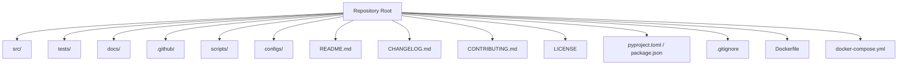

<!-- Clear Language: Keep sentences under 50 words -->
# Repository Structure

## Learning Objectives

| Objective | Description |
|-----------|-------------|
| LO1 | Design a well-organized repository structure |
| LO2 | Write comprehensive README files |
| LO3 | Add CI/CD badges, test coverage, and quality gates |
| LO4 | Create issue and PR templates |
| LO5 | Maintain consistent documentation standards |
| LO6 | Implement semantic versioning and changelogs |

## Introduction

Your portfolio is your proof of skills. GitHub profiles, technical blogs, and LinkedIn optimization help you stand out. This module covers personal branding for AI engineers.

## Prerequisites

- Basic programming knowledge
- Understanding of data structures

## Key Terminology

**Key Terms**: Core vocabulary and concepts for this topic.

**Definition**: Essential terms you must know for interviews and production work.

## Theory

Understanding repository structure is fundamental for AI engineers. This section covers the core concepts, underlying principles, and theoretical framework that govern how repository structure works in practice.

## Chapter at a Glance

| Section | Topic | Key Concept |
|---------|-------|-------------|
| 2.1 | Directory Structure | Standard folder layout, naming conventions |
| 2.2 | README Standards | Sections: install, usage, API, contributing, license |
| 2.3 | CI/CD Integration | GitHub Actions, badge display, status checks |
| 2.4 | Issue & PR Templates | Standardized contribution, bug reports, feature requests |
| 2.5 | Documentation | API docs, docstrings, wiki, mkdocs |
| 2.6 | Versioning & Changelog | SemVer, CHANGELOG.md, releases |

## Standard Repository Layout



## 2.1 Directory Structure

A well-organized repository follows conventions that make it easy for contributors and users to navigate.

```python
import os
from typing import List, Dict, Optional

class RepoStructureGenerator:
    """Generate standard repository directory structures."""

    def __init__(self, project_name: str, project_type: str = "python"):
        self.project_name = project_name
        self.project_type = project_type
        self.structure: Dict[str, List[str]] = {}

    def python_project(self) -> dict:
        return {
            f"src/{self.project_name}": ["__init__.py", "main.py", "config.py", "utils.py"],
            "tests": ["__init__.py", "test_main.py", "test_utils.py", "conftest.py"],
            "docs": ["index.md", "installation.md", "usage.md", "api.md", "contributing.md"],
            ".github": {
                "workflows": ["ci.yml", "deploy.yml", "lint.yml"],
                "ISSUE_TEMPLATE": ["bug_report.md", "feature_request.md"],
            },
            "scripts": ["setup.sh", "lint.sh", "test.sh"],
            "configs": ["dev.yaml", "prod.yaml", "logging.conf"],
        }

    def typescript_project(self) -> dict:
        return {
            f"src/{self.project_name}": ["index.ts", "types.ts", "utils.ts"],
            "tests": ["test_main.ts", "setup.ts"],
            "docs": ["README.md", "API.md"],
            ".github/workflows": ["ci.yml"],
        }

    def create_structure(self, base_path: str = "."):
        """Create the directory structure on disk."""
        structure = self.python_project() if self.project_type == "python" else self.typescript_project()
        for dir_path, files in structure.items():
            full_path = os.path.join(base_path, dir_path)
            os.makedirs(full_path, exist_ok=True)
            for file in files:
                filepath = os.path.join(full_path, file)
                if not os.path.exists(filepath):
                    with open(filepath, "w") as f:
                        f.write(self._get_file_template(file))

    def _get_file_template(self, filename: str) -> str:
        templates = {
            "__init__.py": "",
            "main.py": '"""Main entry point."""\n\ndef main():\n    pass\n\nif __name__ == "__main__":\n    main()\n',
            "README.md": f"# {self.project_name}\n\n## Description\n\n## Installation\n\n## Usage\n\n## License\n",
            ".gitignore": "venv/\n__pycache__/\n*.pyc\n.env\n*.egg-info/\ndist/\nbuild/\n",
        }
        return templates.get(filename, "")

class RepoQualityChecker:
    """Check repository structure quality."""

    def __init__(self, repo_path: str):
        self.repo_path = repo_path

    def check_essentials(self) -> dict:
        essentials = {
            "README.md": os.path.exists(os.path.join(self.repo_path, "README.md")),
            "LICENSE": os.path.exists(os.path.join(self.repo_path, "LICENSE")),
            ".gitignore": os.path.exists(os.path.join(self.repo_path, ".gitignore")),
            "src/": os.path.exists(os.path.join(self.repo_path, "src")),
            "tests/": os.path.exists(os.path.join(self.repo_path, "tests")),
            "pyproject.toml": os.path.exists(os.path.join(self.repo_path, "pyproject.toml")) or os.path.exists(os.path.join(self.repo_path, "setup.py")),
        }
        return essentials

    def score(self) -> int:
        checks = self.check_essentials()
        return sum(1 for v in checks.values() if v) * 17  # /6 * 100
```

## 2.2 README Standards

A great README is the most important file in your repository. It should answer: what, why, how, and where.

```python
class READMEGenerator:
    """Generate comprehensive README files."""

    def __init__(self, project_name: str, description: str,
                 tech_stack: List[str], author: str):
        self.project_name = project_name
        self.description = description
        self.tech_stack = tech_stack
        self.author = author

    def generate(self, include_sections: List[str] = None) -> str:
        sections = include_sections or [
            "title", "badges", "description", "features",
            "tech_stack", "installation", "usage", "api",
            "testing", "contributing", "license", "contact"
        ]
        content = ""
        section_generators = {
            "title": self._title_section,
            "badges": self._badges_section,
            "description": self._description_section,
            "features": self._features_section,
            "tech_stack": self._tech_stack_section,
            "installation": self._installation_section,
            "usage": self._usage_section,
            "api": self._api_section,
            "testing": self._testing_section,
            "contributing": self._contributing_section,
            "license": self._license_section,
            "contact": self._contact_section,
        }
        for section in sections:
            if section in section_generators:
                content += section_generators[section]() + "\n"
        return content

    def _title_section(self) -> str:
        return f"# {self.project_name}\n\n"

    def _badges_section(self) -> str:
        return "\n"
    "\n" \
    "\n"
    "\n\n"

    def _description_section(self) -> str:
        return f"## Description\n\n{self.description}\n\n"

    def _features_section(self) -> str:
        return "## Features\n\n- Feature 1\n- Feature 2\n- Feature 3\n\n"

    def _tech_stack_section(self) -> str:
        badges = " ".join(f"" for t in self.tech_stack)
        return f"## Tech Stack\n\n{badges}\n\n"

    def _installation_section(self) -> str:
        return "## Installation\n\n```bash\npip install -r requirements.txt\n```\n\n"

    def _usage_section(self) -> str:
        return "## Usage\n\n```python\nfrom myproject import main\nmain()\n```\n\n"

    def _api_section(self) -> str:
        return "## API\n\n### `function(args)`\n\nDescription of the function.\n\n"

    def _testing_section(self) -> str:
        return "## Testing\n\n```bash\npytest tests/ -v --cov=src\n```\n\n"

    def _contributing_section(self) -> str:
        return "## Contributing\n\nContributions welcome! See [CONTRIBUTING.md](CONTRIBUTING.md).\n\n"

    def _license_section(self) -> str:
        return "## License\n\nMIT © [Author](https://github.com/user)\n\n"

    def _contact_section(self) -> str:
        return f"## Contact\n\n{self.author} - [@twitter](https://twitter.com/) - email@example.com\n\n"

class READMEScorer:
    """Score a README on completeness and quality."""

    @staticmethod
    def score(readme_content: str) -> dict:
        scores = {}
        sections = {
            "Title": ("#", 5),
            "Description": ("## Description", 15),
            "Installation": ("## Installation", 15),
            "Usage": ("## Usage", 15),
            "API": ("## API", 10),
            "Contributing": ("## Contributing", 10),
            "License": ("## License", 10),
            "Badges": ("![", 10),
            "Testing": ("## Testing", 5),
            "Contact": ("## Contact", 5),
        }
        total = 0
        for name, (pattern, weight) in sections.items():
            present = pattern in readme_content
            scores[name] = {"present": present, "weight": weight, "score": weight if present else 0}
            total += weight if present else 0
        return {"total": total, "max": 100, "sections": scores}
```

## 2.3 CI/CD Integration

GitHub Actions automate testing, linting, and deployment. Badges display the status of these workflows.

```python
class WorkflowGenerator:
    """Generate GitHub Actions workflow files."""

    @staticmethod
    def ci_workflow() -> str:
        return """name: CI
on:
  push:
    branches: [main]
  pull_request:
    branches: [main]
jobs:
  test:
    runs-on: ubuntu-latest
    strategy:
      matrix:
        python-version: ["3.9", "3.10", "3.11"]
    steps:
      - uses: actions/checkout@v3
      - name: Set up Python
        uses: actions/setup-python@v4
        with:
          python-version: ${{ matrix.python-version }}
      - name: Install dependencies
        run: pip install -r requirements.txt
      - name: Lint
        run: ruff check .
      - name: Type check
        run: mypy src/
      - name: Test
        run: pytest tests/ -v --cov=src --cov-report=xml
      - name: Upload coverage
        uses: codecov/codecov-action@v3
"""

    @staticmethod
    def lint_workflow() -> str:
        return """name: Lint
on:
  push:
    branches: [main]
  pull_request:
    branches: [main]
jobs:
  lint:
    runs-on: ubuntu-latest
    steps:
      - uses: actions/checkout@v3
      - uses: actions/setup-python@v4
        with:
          python-version: "3.11"
      - run: pip install ruff mypy
      - run: ruff check .
      - run: mypy src/
"""

    @staticmethod
    def deploy_workflow() -> str:
        return """name: Deploy
on:
  push:
    tags:
      - 'v*'
jobs:
  deploy:
    runs-on: ubuntu-latest
    steps:
      - uses: actions/checkout@v3
      - name: Build
        run: docker build -t myapp .
      - name: Push to registry
        run: docker push registry.example.com/myapp
      - name: Deploy
        run: echo "Deploying..."
"""

class BadgeGenerator:
    """Generate status badges for README."""

    @staticmethod
    def ci_badge(repo: str) -> str:
        return f""

    @staticmethod
    def coverage_badge(repo: str) -> str:
        return f""

    @staticmethod
    def version_badge(repo: str) -> str:
        return f""

    @staticmethod
    def license_badge(repo: str) -> str:
        return f""

    @staticmethod
    def python_version_badge() -> str:
        return ""
```

## 2.4 Issue & PR Templates

Standardized templates ensure contributors provide all necessary information.

```python
class IssueTemplateGenerator:
    """Generate issue templates."""

    @staticmethod
    def bug_report() -> str:
        return """---
name: Bug Report
about: Create a report to help us improve
title: '[BUG] '
labels: bug
assignees: ''
---

## Describe the Bug
A clear description of what the bug is.

## To Reproduce
Steps:
1. Go to '...'
2. Run '...'
3. See error

## Expected Behavior
What you expected to happen.

## Actual Behavior
What actually happened.

## Environment
- OS: [e.g. Ubuntu 22.04]
- Python Version: [e.g. 3.11]
- Package Version: [e.g. 1.0.0]

## Additional Context
Add any other context here.
"""

    @staticmethod
    def feature_request() -> str:
        return """---
name: Feature Request
about: Suggest an idea for this project
title: '[FEATURE] '
labels: enhancement
assignees: ''
---

## Is your feature request related to a problem?
A clear description of the problem.

## Proposed Solution
What you want to happen.

## Alternative Solutions
What alternatives you've considered.

## Additional Context
Add any context, screenshots, or examples.
"""

class PRTemplateGenerator:
    """Generate pull request templates."""

    @staticmethod
    def default_template() -> str:
        return """## Description
What does this PR do?

## Related Issue
Fixes #(issue number)

## Type of Change
- [ ] Bug fix
- [ ] New feature
- [ ] Documentation update
- [ ] Refactoring
- [ ] CI/CD

## Testing
- [ ] Unit tests pass
- [ ] Integration tests pass
- [ ] Manual testing done

## Checklist
- [ ] Code follows style guidelines
- [ ] Self-review completed
- [ ] Documentation updated
- [ ] No new warnings

## Screenshots (if applicable)

## Additional Notes
"""

class ContributionGuide:
    """CONTRIBUTING.md generator."""

    @staticmethod
    def generate() -> str:
        return """# Contributing

## Getting Started
1. Fork the repository
2. Create a feature branch (`git checkout -b feature/amazing`)
3. Commit changes (`git commit -m 'Add amazing feature'`)
4. Push (`git push origin feature/amazing`)
5. Open a Pull Request

## Development Setup
```
```bash
git clone https://github.com/yourusername/repo.git
cd repo
python -m venv venv
source venv/bin/activate
pip install -r requirements-dev.txt
```

## Code Style
- Follow PEP 8
- Use type hints
- Write docstrings (NumPy style)
- Run `ruff check .` before committing

## Testing
- All new features need tests
- Run `pytest tests/ -v` to verify
- Maintain 80%+ coverage

## Pull Request Process
1. Update documentation
2. Add tests for new code
3. Ensure CI passes
4. Request review from maintainers
"""
```text

## 2.5 Documentation

Good documentation makes your project accessible. Use MkDocs for documentation sites and clear docstrings for API reference.

```
```python
class DocstringStyle:
    """Enforce docstring standards."""

    @staticmethod
    def numpy_style(func_name: str, description: str,
                    params: list, returns: str) -> str:
        doc = f'"""{description}\n\nParameters\n----------\n'
        for name, dtype, desc in params:
            doc += f"{name} : {dtype}\n    {desc}\n"
        doc += f'\nReturns\n-------\n{returns}\n"""'
        return doc

    @staticmethod
    def google_style(func_name: str, description: str,
                     params: list, returns: str) -> str:
        doc = f'"""{description}\n\nArgs:\n'
        for name, dtype, desc in params:
            doc += f"    {name} ({dtype}): {desc}\n"
        doc += f'\nReturns:\n    {returns}\n"""'
        return doc

class APIReferenceGenerator:
    """Generate API documentation from code."""

    def __init__(self, module_path: str):
        self.module_path = module_path

    def generate_markdown(self) -> str:
        import ast
        with open(self.module_path) as f:
            tree = ast.parse(f.read())
        docs = "# API Reference\n\n"
        for node in ast.walk(tree):
            if isinstance(node, ast.FunctionDef):
                docstring = ast.get_docstring(node) or "No description."
                args = [arg.arg for arg in node.args.args if arg.arg != 'self']
                docs += f"## `{node.name}({', '.join(args)})`\n\n{docstring}\n\n"
        return docs

class MkDocsConfigGenerator:
    """Generate mkdocs.yml configuration."""

    @staticmethod
    def generate(project_name: str) -> str:
        return f"""site_name: {project_name}
theme:
  name: material
  features:
    - navigation.tabs
    - navigation.sections
    - toc.integrate
nav:
  - Home: index.md
  - Installation: installation.md
  - Usage: usage.md
  - API: api.md
  - Contributing: contributing.md
plugins:
  - mkdocstrings:
      handlers:
        python:
          paths: [src]
markdown_extensions:
  - pymdownx.highlight
  - pymdownx.superfences
  - admonition
  - toc:
      permalink: true
"""
```

## 2.6 Versioning & Changelog

Semantic versioning (SemVer) and a changelog communicate how your project evolves.

```python
class SemVer:
    """Semantic versioning utilities."""

    def __init__(self, major: int = 1, minor: int = 0, patch: int = 0):
        self.major = major
        self.minor = minor
        self.patch = patch

    def bump_major(self):
        self.major += 1
        self.minor = 0
        self.patch = 0

    def bump_minor(self):
        self.minor += 1
        self.patch = 0

    def bump_patch(self):
        self.patch += 1

    def __str__(self):
        return f"{self.major}.{self.minor}.{self.patch}"

    @staticmethod
    def from_string(version: str) -> "SemVer":
        parts = version.split(".")
        return SemVer(int(parts[0]), int(parts[1]), int(parts[2]))

class ChangelogGenerator:
    """Generate CHANGELOG.md following Keep a Changelog format."""

    def __init__(self, repo_url: str = ""):
        self.repo_url = repo_url
        self.entries = []

    def add_entry(self, version: str, date: str, changes: dict):
        self.entries.append({
            "version": version,
            "date": date,
            "changes": changes,
        })

    def generate(self) -> str:
        changelog = "# Changelog\n\n"
        for entry in sorted(self.entries, key=lambda e: e["version"], reverse=True):
            changelog += f"## [{entry['version']}] - {entry['date']}\n\n"
            for section, items in entry["changes"].items():
                if items:
                    changelog += f"### {section.capitalize()}\n\n"
                    for item in items:
                        changelog += f"- {item}\n"
                    changelog += "\n"
        return changelog.strip()

    @staticmethod
    def initial_release(version: str = "1.0.0") -> str:
        return f"""# Changelog

## [{version}] - {datetime.now().strftime('%Y-%m-%d')}

### Added
- Initial release
- Core functionality
- Basic documentation
"""

class ReleaseManager:
    """Manage software releases."""

    def __init__(self):
        self.version = SemVer(1, 0, 0)
        self.releases = []

    def prepare_release(self, change_type: str, changes: dict) -> dict:
        if change_type == "major":
            self.version.bump_major()
        elif change_type == "minor":
            self.version.bump_minor()
        else:
            self.version.bump_patch()

        release = {
            "version": str(self.version),
            "date": datetime.now().strftime("%Y-%m-%d"),
            "changes": changes,
        }
        self.releases.append(release)
        return release

    def generate_release_notes(self, version: str) -> str:
        for release in self.releases:
            if release["version"] == version:
                notes = f"# Release v{version}\n\n"
                for section, items in release["changes"].items():
                    if items:
                        notes += f"## {section}\n"
                        for item in items:
                            notes += f"- {item}\n"
                        notes += "\n"
                return notes
        return "Release not found"
```

## Summary

A well-structured repository signals professionalism and makes your code accessible. The standard layout (src/, tests/, docs/, .github/) is recognized across the industry. A comprehensive README — with badges,.
installation, usage, API docs, and contributing guidelines — serves as the front door to your project. CI/CD pipelines with GitHub Actions automate quality checks,.
and issue/PR templates streamline contributions. Semantic versioning and a changelog communicate project evolution clearly. Investing in repo structure pays dividends in user adoption,.
contributor engagement, and recruiter perception.

## Practical Takeaways

| Takeaway | Implementation |
|----------|---------------|
| Follow the standard Python/JS repo layout | src/, tests/, docs/, .github/, README.md, LICENSE |
| Write a README that answers what, why, how | Cover installation, usage, API, contributing, license |
| Add CI/CD badges to show project health | CI status, coverage %, Python version, license |
| Create issue and PR templates | Saves time for both maintainers and contributors |
| Use semantic versioning (SemVer) | MAJOR.MINOR.PATCH with clear bump rules |
| Maintain a CHANGELOG.md | Follow "Keep a Changelog" format for every release |

## Q&A

<details class="tp-qa-card" data-qid="port-s02-q1">
<summary class="tp-qa-question">What is the standard directory structure for a Python project?</summary>
<div class="tp-qa-context"><p>Python project organization.</p></div>
<div class="tp-qa-answer">
<p>Standard Python project layout: <code>src/projectname/</code> for source code, <code>tests/</code> for tests with <code>conftest.py</code>, <code>docs/</code> for documentation, <code>.github/workflows/</code> for CI/CD, <code>scripts/</code> for utility scripts, and root files: <code>README.md</code>, <code>LICENSE</code>, <code>pyproject.toml</code>, <code>.gitignore</code>, <code>Dockerfile</code>. The <code>src/</code> layout (vs flat layout) prevents import confusion during testing and deployment. Always include <code>__init__.py</code> files in test directories for pytest discovery.</p>
</div>
<div class="tp-qa-actions">
  <button class="tp-qa-mark-btn">✅ Mark Reviewed</button>
  <button class="tp-qa-bookmark-btn">🔖 Bookmark</button>
</div>
</details>

<details class="tp-qa-card" data-qid="port-s02-q2">
<summary class="tp-qa-question">What sections should every README include?</summary>
<div class="tp-qa-context"><p>Essential README sections.</p></div>
<div class="tp-qa-answer">
<p>Every README should include: (1) <strong>Title + Badges</strong> — project name and status badges (CI, coverage, version, license). (2) <strong>Description</strong> — what the project does and why it exists. (3) <strong>Installation</strong> — clear setup instructions with commands. (4) <strong>Usage</strong> — code examples showing basic usage. (5) <strong>API Documentation</strong> — if a library. (6) <strong>Contributing</strong> — how others can help. (7) <strong>License</strong> — MIT/Apache-2.0/GPL. (8) <strong>Contact</strong> — maintainer info. Bonus: demo GIF, architecture diagram, test coverage badge, and "Built With" section.</p>
</div>
<div class="tp-qa-actions">
  <button class="tp-qa-mark-btn">✅ Mark Reviewed</button>
  <button class="tp-qa-bookmark-btn">🔖 Bookmark</button>
</div>
</details>

<details class="tp-qa-card" data-qid="port-s02-q3">
<summary class="tp-qa-question">What CI/CD badges should I add to my README?</summary>
<div class="tp-qa-context"><p>Status badges for repository health.</p></div>
<div class="tp-qa-answer">
<p>Recommended badges: (1) <strong>CI Status</strong> — GitHub Actions workflow status (passing/failing). (2) <strong>Test Coverage</strong> — percentage from Codecov or Coveralls. (3) <strong>Python Version</strong> — supported versions. (4) <strong>License</strong> — MIT, Apache-2.0, etc. (5) <strong>PyPI Version</strong> — if published to PyPI. (6) <strong>Downloads</strong> — monthly PyPI downloads. (7) <strong>Code Quality</strong> — from CodeClimate or SonarCloud. Aim for 4-6 badges in a single row at the top of the README. Badges use the shields.io service and update automatically.</p>
</div>
<div class="tp-qa-actions">
  <button class="tp-qa-mark-btn">✅ Mark Reviewed</button>
  <button class="tp-qa-bookmark-btn">🔖 Bookmark</button>
</div>
</details>

<details class="tp-qa-card" data-qid="port-s02-q4">
<summary class="tp-qa-question">Why use issue and PR templates?</summary>
<div class="tp-qa-context"><p>Standardizing contributions.</p></div>
<div class="tp-qa-answer">
<p>Templates ensure: (1) Bug reports include environment, steps to reproduce, and expected vs. actual behavior. (2) Feature requests clearly state the problem and proposed solution. (3) PRs link to related issues and include testing checklists. (4) Contributors provide all necessary information upfront, reducing back-and-forth. (5) Maintainers can process issues and PRs faster. Templates live in <code>.github/ISSUE_TEMPLATE/</code> and <code>.github/PULL_REQUEST_TEMPLATE.md</code>. They're markdown files with YAML front matter.</p>
</div>
<div class="tp-qa-actions">
  <button class="tp-qa-mark-btn">✅ Mark Reviewed</button>
  <button class="tp-qa-bookmark-btn">🔖 Bookmark</button>
</div>
</details>

<details class="tp-qa-card" data-qid="port-s02-q5">
<summary class="tp-qa-question">How do I choose between MIT, Apache-2.0, and GPL licenses?</summary>
<div class="tp-qa-context"><p>Open source license selection.</p></div>
<div class="tp-qa-answer">
<p><strong>MIT</strong> — permissive, allows commercial use, modification, and redistribution without restrictions. Best for libraries and most open-source projects. <strong>Apache-2.0</strong> — similar to MIT but adds patent protection for contributors. Use for projects where patent concerns exist. <strong>GPL</strong> — copyleft, requires derivative works to also be GPL-licensed. Use if you want to ensure code remains open source. <strong>Recommendation:</strong> MIT for most projects, Apache-2.0 for corporate-friendly projects. A LICENSE file is required for others to legally use your code.</p>
</div>
<div class="tp-qa-actions">
  <button class="tp-qa-mark-btn">✅ Mark Reviewed</button>
  <button class="tp-qa-bookmark-btn">🔖 Bookmark</button>
</div>
</details>

<details class="tp-qa-card" data-qid="port-s02-q6">
<summary class="tp-qa-question">What is semantic versioning and when to bump each number?</summary>
<div class="tp-qa-context"><p>Version numbering conventions.</p></div>
<div class="tp-qa-answer">
<p>Semantic versioning (MAJOR.MINOR.PATCH): <strong>MAJOR</strong> — incompatible API changes (existing users must change code). <strong>MINOR</strong> — new functionality in a backward-compatible manner (users can upgrade safely). <strong>PATCH</strong> — backward-compatible bug fixes. Start at 1.0.0 for the first stable release. Pre-release versions use suffixes: -alpha, -beta, -rc1. Examples: 2.0.0 (breaking), 1.5.0 (new feature), 1.5.1 (bug fix). Always document version bumps in CHANGELOG.md.</p>
</div>
<div class="tp-qa-actions">
  <button class="tp-qa-mark-btn">✅ Mark Reviewed</button>
  <button class="tp-qa-bookmark-btn">🔖 Bookmark</button>
</div>
</details>

<details class="tp-qa-card" data-qid="port-s02-q7">
<summary class="tp-qa-question">How do I set up GitHub Actions for my project?</summary>
<div class="tp-qa-context"><p>Automating workflows.</p></div>
<div class="tp-qa-answer">
<p>GitHub Actions setup: (1) Create <code>.github/workflows/ci.yml</code>. (2) Define triggers: <code>push</code> and <code>pull_request</code> on main branch. (3) Define jobs: lint (ruff, mypy), test (pytest, coverage), build (Docker). (4) Use matrix builds to test multiple Python versions (3.9, 3.10, 3.11). (5) Add coverage upload step. (6) Add status badge to README. GitHub provides free minutes for public repos. A basic CI workflow runs in 2-5 minutes and catches issues before merge.</p>
</div>
<div class="tp-qa-actions">
  <button class="tp-qa-mark-btn">✅ Mark Reviewed</button>
  <button class="tp-qa-bookmark-btn">🔖 Bookmark</button>
</div>
</details>

<details class="tp-qa-card" data-qid="port-s02-q8">
<summary class="tp-qa-question">What documentation tools should I use for Python projects?</summary>
<div class="tp-qa-context"><p>Python documentation toolchain.</p></div>
<div class="tp-qa-answer">
<p>Recommended tools: (1) <strong>MkDocs</strong> with Material theme — modern documentation sites from markdown. (2) <strong>mkdocstrings</strong> — auto-generate API docs from docstrings. (3) <strong>NumPy/Google docstrings</strong> — standard formats for Python docstrings. (4) <strong>Sphinx</strong> — more powerful but complex, better for large projects. (5) <strong>Read the Docs</strong> — free hosting for documentation sites. (6) <strong>pdoc</strong> — lightweight API docs. For most projects, MkDocs + mkdocstrings provides the best balance of simplicity and features.</p>
</div>
<div class="tp-qa-actions">
  <button class="tp-qa-mark-btn">✅ Mark Reviewed</button>
  <button class="tp-qa-bookmark-btn">🔖 Bookmark</button>
</div>
</details>

## Interview Q&A

<details class="tp-qa-card" data-qid="pf02-q1">
  <summary class="tp-qa-question">
    <span class="tp-qa-status"></span>
    Q1: What is the standard Python project directory structure and why is it important?
  </summary>
  <div class="tp-qa-answer">
<p>Standard Python project layout: `project_name/`, `src/project_name/` (source code), `tests/` (test files with `conftest.py`), `docs/` (documentation), `.github/workflows/` (CI/CD), `scripts/` (utility scripts), and.
root files: `README.md`, `LICENSE`, `pyproject.toml`, `.gitignore`, `Dockerfile`. The `src/` layout (compared to flat layout) prevents import confusion during testing and deployment — tests import from the installed package,.
not the local directory. This catches packaging bugs before deployment. Include `__init__.py` files in test directories for pytest discovery. A consistent,.
well-organized directory structure signals professionalism and makes your code accessible to other developers, which is especially important for portfolio projects that potential employers will review.</p>
  </div>
  <button class="tp-qa-mark-btn">✅ Mark Reviewed</button>
  <button class="tp-qa-bookmark-btn">🔖 Bookmark</button>
</details>

<details class="tp-qa-card" data-qid="pf02-q2">
  <summary class="tp-qa-question">
    <span class="tp-qa-status"></span>
    Q2: What sections should every GitHub repository README include?
  </summary>
  <div class="tp-qa-answer">
<p>Every professional README should include: (1) Title + Badges — project name with CI status, test coverage, Python version, and license badges. (2) Description — 2-3 sentences explaining what the project does and.
why it exists. (3) Demo — GIF or screenshot of the project in action (critical for portfolio projects). (4) Installation — clear,.
copy-paste ready setup instructions. (5) Usage — code examples showing the most common use cases. (6) API Documentation — if a library,.
document all public functions/classes. (7) Configuration — environment variables, config files, and their options. (8) Contributing — how others can contribute (even for.
personal projects, this shows professionalism). (9) License — MIT/Apache-2.0 for most projects. (10) Contact — your GitHub profile link and optionally email. A README that covers all these sections scores higher with both automated README scorers and.
human reviewers.</p>
  </div>
  <button class="tp-qa-mark-btn">✅ Mark Reviewed</button>
  <button class="tp-qa-bookmark-btn">🔖 Bookmark</button>
</details>

<details class="tp-qa-card" data-qid="pf02-q3">
  <summary class="tp-qa-question">
    <span class="tp-qa-status"></span>
    Q3: How do you set up CI/CD with GitHub Actions for a Python project?
  </summary>
  <div class="tp-qa-answer">
<p>GitHub Actions CI/CD setup: Create `.github/workflows/ci.yml` with: (1) Trigger — on `push` and `pull_request` to main/master. (2) Matrix build — lint (ruff format --check),.
type check (mypy), and test across Python 3.9, 3.10, 3.11 (or using `actions/setup-python` with matrix). (3) Dependencies — install with `pip install -e ".[dev]"` or.
poetry. (4) Testing — `pytest --cov=src --cov-report=xml`. (5) Coverage — upload to Codecov: `uses: codecov/codecov-action@v3`. (6) CD — on tags or.
push to main, build Docker image, push to container registry, and deploy. (7) Status badge — add `[](...)` to the README. A green CI badge is one of the strongest signals that your project is production-quality. Without CI,.
every visitor assumes the code might not work.</p>
  </div>
  <button class="tp-qa-mark-btn">✅ Mark Reviewed</button>
  <button class="tp-qa-bookmark-btn">🔖 Bookmark</button>
</details>

<details class="tp-qa-card" data-qid="pf02-q4">
  <summary class="tp-qa-question">
    <span class="tp-qa-status"></span>
    Q4: How do you design effective issue and PR templates?
  </summary>
  <div class="tp-qa-answer">
<p>Issue templates standardize bug reports and feature requests. Bug report template: `name: Bug Report`, `description: File a bug report`, fields: Environment (OS,.
Python version, package version), Steps to reproduce (numbered list), Expected behavior, Actual behavior, Screenshots, Additional context. Feature request template: Problem description,.
Proposed solution, Alternatives considered, Additional context. PR template: Closes #issue, Description of changes, Type of change (bug fix / feature / docs / refactor),.
Testing done, Checklist (tests pass, lint passes, docs updated, type hints added). Place templates in `.github/ISSUE_TEMPLATE/` and `.github/PULL_REQUEST_TEMPLATE.md`. Templates reduce back-and-forth by ensuring contributors provide all necessary information upfront. For.
personal portfolio projects, templates demonstrate that you understand collaborative development workflows.</p>
  </div>
  <button class="tp-qa-mark-btn">✅ Mark Reviewed</button>
  <button class="tp-qa-bookmark-btn">🔖 Bookmark</button>
</details>

<details class="tp-qa-card" data-qid="pf02-q5">
  <summary class="tp-qa-question">
    <span class="tp-qa-status"></span>
    Q5: How do you choose between MIT, Apache-2.0, and GPL licenses?
  </summary>
  <div class="tp-qa-answer">
<p>License choice depends on how you want your code used: (1) MIT — permissive, allows anyone to use, modify, distribute, and.
sell your code with only the requirement to include the original copyright notice. Best for most open-source projects, especially libraries. Most widely used and.
understood. (2) Apache-2.0 — similar to MIT but adds an explicit patent grant, protecting contributors from patent lawsuits. Use for projects where contributors might have patents,.
or in corporate environments. (3) GPL v3 — copyleft, requires that derivative works also be GPL-licensed. Use if you want to ensure the code (and.
all modifications) remain open source. Strongest protection but may deter commercial adoption. (4) Recommendation — MIT for personal portfolio projects (maximum adoption),.
Apache-2.0 if you work for a company that cares about patents. A LICENSE file is required for others to legally use your code. Without a license,.
the default is "all rights reserved."</p>
  </div>
  <button class="tp-qa-mark-btn">✅ Mark Reviewed</button>
  <button class="tp-qa-bookmark-btn">🔖 Bookmark</button>
</details>

<details class="tp-qa-card" data-qid="pf02-q6">
  <summary class="tp-qa-question">
    <span class="tp-qa-status"></span>
    Q6: How do you maintain a CHANGELOG using semantic versioning?
  </summary>
  <div class="tp-qa-answer">
<p>Semantic versioning (MAJOR.MINOR.PATCH) with Keep a Changelog format: (1) MAJOR — incompatible API changes (users must modify their code). (2) MINOR — backward-compatible new features. (3) PATCH — backward-compatible bug fixes. CHANGELOG.md structure: `## [1.2.3] - 2024-01-15` with sections: Added (new features),.
Changed (changes in existing functionality), Deprecated (soon-to-be removed features), Removed (removed features), Fixed (bug fixes), Security (vulnerability fixes). Example: `### Added - New /predict/batch endpoint for.
bulk predictions. ### Fixed - Memory leak in long-running inference sessions.` Start at 1.0.0 for the first stable release. Use pre-release suffixes: `1.0.0-alpha.1`,.
`1.0.0-beta.2`. Tools like `python-semantic-release` or `standard-version` automate version bumps and changelog generation from conventional commit messages.</p>
  </div>
  <button class="tp-qa-mark-btn">✅ Mark Reviewed</button>
  <button class="tp-qa-bookmark-btn">🔖 Bookmark</button>
</details>

<details class="tp-qa-card" data-qid="pf02-q7">
  <summary class="tp-qa-question">
    <span class="tp-qa-status"></span>
    Q7: How do you set up documentation for a Python project using MkDocs?
  </summary>
  <div class="tp-qa-answer">
<p>MkDocs documentation setup: (1) Install: `pip install mkdocs mkdocs-material mkdocstrings[python]`. (2) Create `mkdocs.yml`: `site_name: Project Name; theme: material; plugins: [mkdocstrings]`. (3) Documentation markdown files in `docs/`: `index.md` (overview),.
`installation.md`, `usage.md`, `api.md` (auto-generated API docs), `contributing.md`. (4) API docs via mkdocstrings: `::: src.project_name.module_name` extracts docstrings from code. (5) Navigation in mkdocs.yml: `nav: [Home: index.md,.
Installation: installation.md, Usage: usage.md, API: api.md]`. (6) Build: `mkdocs build` outputs to `site/` directory. (7) Deploy: `mkdocs gh-deploy` publishes to GitHub Pages automatically. (8) Hosting — Read the Docs integrates with GitHub for.
automatic builds on push. Well-documented projects are more likely to be used by others and demonstrate communication skills to employers.</p>
  </div>
  <button class="tp-qa-mark-btn">✅ Mark Reviewed</button>
  <button class="tp-qa-bookmark-btn">🔖 Bookmark</button>
</details>

<details class="tp-qa-card" data-qid="pf02-q8">
  <summary class="tp-qa-question">
    <span class="tp-qa-status"></span>
    Q8: How do you write a Dockerfile for a Python application with best practices?
  </summary>
  <div class="tp-qa-answer">
<p>Best practices Dockerfile: (1) Multi-stage build — builder stage installs build dependencies, runtime stage copies only what's needed (reduces image size 2-5—). (2) Use specific base image tags — `python:3.11-slim` not `python:latest`. (3) Layer caching — copy `requirements.txt` and.
install dependencies before copying source code. This caches the dependency layer unless requirements change. (4) Security — run as non-root user: `RUN useradd -m -u 1000 appuser && USER appuser`. (5) Health check — `HEALTHCHECK --interval=30s CMD python -c "import urllib.request;.
urllib.request.urlopen('http://localhost:8000/health')"`. (6) .dockerignore — exclude `__pycache__`, `.git`, `tests/`, `.env`, `.venv` to speed builds. (7) Production — use `gunicorn -w 4 -k uvicorn.workers.UvicornWorker app.main:app` for.
multi-worker FastAPI serving. A well-optimized Docker image for a Python ML API should be under 500MB.</p>
  </div>
  <button class="tp-qa-mark-btn">✅ Mark Reviewed</button>
  <button class="tp-qa-bookmark-btn">🔖 Bookmark</button>
</details>

<details class="tp-qa-card" data-qid="pf02-q9">
  <summary class="tp-qa-question">
    <span class="tp-qa-status"></span>
    Q9: How do you use `.gitignore` effectively to keep repositories clean?
  </summary>
  <div class="tp-qa-answer">
<p>Effective .gitignore: (1) Language-specific — ignore `__pycache__/`, `*.pyc`, `.pytest_cache/`, `.mypy_cache/`, `*.egg-info/`, `.venv/`, `venv/`. (2) IDE/editor — `.vscode/`, `.idea/`, `*.swp`, `*.swo` (each team member may use different editors;.
editor configs should not be committed). (3) OS files — `.DS_Store` (macOS), `Thumbs.db` (Windows). (4) Secrets — `.env`, `*.key`, `*.pem`, `credentials.json`,.
`service-account.json` (never commit secrets). (5) Build artifacts — `dist/`, `build/`, `*.egg`, `*.whl`, `*.so`. (6) Data — `data/`, `*.csv`, `*.json` (unless small test fixtures). (7) Large files — `*.pkl`,.
`*.h5`, `*.pt`, `*.onnx` (model files should be in a model registry, not in git). Use `git check-ignore -v filename` to debug why a file is ignored. A clean repository starts with a good .gitignore — it prevents accidental commits of generated files,.
secrets, and large binaries.</p>
  </div>
  <button class="tp-qa-mark-btn">✅ Mark Reviewed</button>
  <button class="tp-qa-bookmark-btn">🔖 Bookmark</button>
</details>

<details class="tp-qa-card" data-qid="pf02-q10">
  <summary class="tp-qa-question">
    <span class="tp-qa-status"></span>
    Q10: How do you structure a data science or ML project repository?
  </summary>
  <div class="tp-qa-answer">
    <pre><code>ml-project/
├── data/            # Data files (raw/processed)
├── notebooks/       # Jupyter notebooks for exploration
├── src/             # Production code
│   └── models/      # Model definitions and training
├── tests/           # Unit and integration tests
├── configs/         # YAML/JSON configuration files
├── scripts/         # Utility scripts (data download, ETL)
├── docs/            # MkDocs/Sphinx documentation
├── .github/workflows/  # CI/CD
├── README.md        # Project overview
├── pyproject.toml   # Dependencies and project config
├── Dockerfile       # Container definition
└── docker-compose.yml  # Multi-service setup</code></pre>
<p>An ML project adds specific directories: (1) `data/` — raw and processed data (use `.gitkeep` or DVC for versioning). (2) `notebooks/` — exploration and.
visualization with numbered prefixes (00-exploration.ipynb, 01-feature-engineering.ipynb). (3) `configs/` — hyperparameters, model configs, data paths in YAML. (4) `models/` — saved model artifacts (or.
reference to model registry). (5) `src/` — clean Python modules for data processing, feature engineering, model training, inference, and evaluation. (6) `tests/` — test data pipelines and.
model inference (not full training). (7) `docker-compose.yml` — if the project uses databases, vector stores, or other services. This structure separates experimental work (notebooks) from production code (src/),.
making it clear which parts are ready for deployment.</p>
  </div>
  <button class="tp-qa-mark-btn">✅ Mark Reviewed</button>
  <button class="tp-qa-bookmark-btn">🔖 Bookmark</button>
</details>

## Chapter Quiz
**Q1**: What is the recommended top-level directory structure for a Python project?
a) All files in root
b) src/, tests/, docs/, scripts/, README.md, LICENSE
c) Only a single src/ folder
d) application/, libraries/, utilities/

<details class="tp-qa-card" data-qid="pf-02-q1"><summary>Show Answer</summary><div class="tp-qa-answer"><p><strong>Answer: b</strong></p><p>A standard structure includes src/, tests/, docs/, scripts/, along with README.md, LICENSE, and pyproject.toml.</p></div></details>

**Q2**: What file describes dependencies in a modern Python project?
a) requirements.txt
b) package.json
c) pyproject.toml
d) setup.cfg

<details class="tp-qa-card" data-qid="pf-02-q2"><summary>Show Answer</summary><div class="tp-qa-answer"><p><strong>Answer: c</strong></p><p>pyproject.toml is the modern standard, though requirements.txt is still common.</p></div></details>

**Q3**: Which Git branching strategy uses main, develop, feature/, release/, and hotfix/ branches?
a) GitHub Flow
b) Git Flow
c) Trunk-Based Development
d) Feature Branching

<details class="tp-qa-card" data-qid="pf-02-q3"><summary>Show Answer</summary><div class="tp-qa-answer"><p><strong>Answer: b</strong></p><p>Git Flow defines main, develop, feature/, release/, and hotfix/ branches for structured releases.</p></div></details>

**Q4**: What is the purpose of a .gitignore file?
a) Track ignored commits
b) Prevent sensitive/temp files from being tracked
c) List contributors
d) Configure CI/CD

<details class="tp-qa-card" data-qid="pf-02-q4"><summary>Show Answer</summary><div class="tp-qa-answer"><p><strong>Answer: b</strong></p><p>.gitignore specifies files and directories that Git should not track, like __pycache__/, .env, and node_modules/.</p></div></details>

**Q5**: What does a CONTRIBUTING.md file typically contain?
a) License information
b) Code of conduct and contribution guidelines
c) API documentation
d) Release notes

<details class="tp-qa-card" data-qid="pf-02-q5"><summary>Show Answer</summary><div class="tp-qa-answer"><p><strong>Answer: b</strong></p><p>CONTRIBUTING.md provides guidelines for contributors — coding standards, PR process, and setup instructions.</p></div></details>

## Exercises

## Common Mistakes

1. Not understanding the fundamental concepts before applying them
2. Skipping edge cases in implementation
3. Not analyzing time/space complexity
4. Forgetting to handle null/empty inputs
5. Not practicing enough problems to build pattern recognition1. **Project Structure**: Create a standard Python project structure for an ML project. Include: src/, tests/, docs/, .github/workflows/, scripts/, configs/. Write the directory tree. Explain why each directory exists.

2. **README Makeover**: Take an existing repo and rewrite its README. Add: CI badge, tech stack badges, install instructions, usage example, API docs, contributing guide, license, and contact. Score the original vs. new README using READMEScorer.

3. **GitHub Actions Setup**: Create a ci.yml workflow that: lints with ruff, type-checks with mypy, tests with pytest (matrix: 3.9, 3.10, 3.11), uploads coverage. Add a Deploy workflow triggered by version tags.

4. **Issue Templates**: Create bug_report.md and feature_request.md templates. Ensure the bug report captures: environment, steps, expected vs. actual. Test by creating a sample issue.

5. **SemVer Implementation**: Set up semantic versioning for a project. Create a release script that: reads the current version, bumps based on argument (major/minor/patch), updates CHANGELOG.md, creates a git tag.

6. **MkDocs Site**: Create a mkdocs.yml configuration. Write index.md, installation.md, usage.md, and api.md. Use mkdocstrings to auto-generate API docs from a Python module. Preview the site locally.

7. **CHANGELOG Audit**: Review an open-source project's CHANGELOG.md. Does it follow "Keep a Changelog"? What information is missing? Rewrite the last 3 releases in the standard format.

8. **Docker Setup**: Add Dockerfile and docker-compose.yml to a project. The Dockerfile should have multi-stage build (build + runtime). docker-compose should include the app and a database service. Test t

## Revision Notes

- - Core principle: Understand the fundamental concepts thoroughly
- - Implementation pattern: Practice with real code examples
- - Complexity: Know the time and space complexity
- - Application: Know when to use this in production systems
- - Interview: Frequently asked in technical interviews
- - Edge cases: Consider common failure scenarios
- - Related concepts: Connect to broader system design

## Placement Section

### Top 10 Interview Questions

#### Google Style

1. **Explain the core idea of Repository Structure in under 60 seconds, then give a real-world analogy.** — Structure: definition, how it works in one sentence, why it matters, analogy. Follow-up: what would break if you removed this from a production system?

2. **Design a minimal, well-typed function that demonstrates Repository Structure.** — Interviewer checks: signature with type hints, edge cases, complexity, and a clean docstring. Follow-up: how does your design behave with empty or malformed input?

3. **What are the common pitfalls when engineers first learn ** — List 3-4, then explain how you would prevent each in a code review.

#### Amazon Style

4. **Describe a production bug caused by misunderstanding Repository Structure. How did you diagnose and fix it?** — STAR format: situation, task, action, result. Mention logs, reproduction, root-cause analysis, and the regression test you added.

5. **How would you scale a system that relies on Repository Structure from 10 users to 10 million?** — Discuss bottlenecks, caching, monitoring, and when to redesign. Follow-up: what metrics would you track?

#### Microsoft Style

6. **Compare Repository Structure with the closest alternative approach. When would you choose each?** — Make a decision matrix: performance, maintainability, ecosystem, learning curve. Follow-up: what would change your decision?

7. **Walk through how you would test a component that depends on Repository Structure.** — Unit, integration, property-based tests; mocking boundaries; golden files for outputs.

#### NVIDIA Style

8. **How does Repository Structure behave differently at scale — memory, throughput, or precision-wise?** — Connect to data pipelines and model training if applicable. Follow-up: what happens to latency as input grows?

9. **How would you make an implementation of Repository Structure run faster on GPU hardware?** — Batch operations, vectorization, avoiding Python loops, reducing data movement.

#### AI Startup Style

10. **Write the smallest possible implementation of Repository Structure that is production-quality.** — Include error handling, type hints, and a one-line docstring. Follow-up: what would you refactor first when it grows?

### Resume Tips

- Name Repository Structure explicitly in your skills section, paired with a measurable achievement ("Reduced X by 40% using Repository Structure").
- Add a bullet describing a project that applies Repository Structure to real data, with numbers.
- Mention the tools and libraries you used alongside Repository Structure (linters, test frameworks, profiling tools).
- Keep resume bullets under 15 words and start each with an action verb.

### Interview Day Checklist

- Rehearse a 60-second explanation of Repository Structure and one real-world analogy.
- Prepare one STAR story about debugging a Repository Structure-related production issue.
- Review complexity and edge cases for the classic Repository Structure interview problem.
- Have questions ready: how does the team apply Repository Structure in production today?
- Test your environment (Python, editor, internet) 15 minutes before the interview.

## True/False

1. **True or False:** Repository Structure builds directly on the fundamentals covered in the earlier chapters of this module. — **True.** Every advanced topic in this module assumes the core concepts from the previous chapters.
2. **True or False:** You should write at least one code example for Repository Structure before moving to the next chapter. — **True.** Active recall with hands-on code beats passive reading for retention.
3. **True or False:** The complexity analysis for Repository Structure is the same regardless of input size. — **False.** Complexity grows with input size; always state best, average, and worst case.
4. **True or False:** Edge cases (empty input, invalid input, boundary values) matter for Repository Structure in production. — **True.** Most production bugs come from unhandled edge cases.
5. **True or False:** You should memorize the Repository Structure chapter content once and never review it again. — **False.** Spaced repetition (24h, 3 days, 1 week) dramatically improves long-term recall.

## Fill in the Blank

1. The chapter that covers Repository Structure is Chapter ___ of this module. — Answer: check the module's table of contents.
2. The time complexity of the standard approach to Repository Structure is ___. — Answer: review the theory section and state big-O notation.
3. The main edge case to handle when implementing Repository Structure is ___. — Answer: empty or invalid input handling, as discussed in the chapter.
4. The tools commonly used to debug Repository Structure issues are ___ and ___. — Answer: refer to the Debugging Guide section of this chapter.
5. The related topic that connects to Repository Structure in the next chapter is ___. — Answer: see the Next Topic section.

## Scenario Questions

1. **Scenario:** A teammate ships a change involving Repository Structure that breaks production at 3 AM. — Diagnosis: check the recent diff, reproduce locally with the failing input, check logs. Fix: revert, add a regression test, and review the root cause. Prevention: CI tests on edge cases and code review checklist.

2. **Scenario:** Your implementation of Repository Structure is correct but too slow for the required latency. — Measure first with a profiler. Common fixes: reduce redundant work, use built-in optimized functions, batch operations, or add caching. Only then consider algorithmic changes.

3. **Scenario:** A new hire asks you to explain Repository Structure in five minutes before a customer demo. — Use the 3-part answer: what it is (one sentence), how it works (one example), why it matters (one business impact). Then offer to go deeper after the demo.

4. **Scenario:** Your team's codebase has three different patterns for Repository Structure and you must standardize. — Write a short ADR (architecture decision record), pick the pattern with best maintainability, migrate incrementally, and add a linter rule to enforce it.

## Output Questions

1. **What is the output of the simplest correct implementation of Repository Structure on an empty input?** — Trace through the code: it should return the documented default (None, 0, empty collection) without raising.
2. **What is the output when the input is at the boundary value?** — Check off-by-one errors and inclusive/exclusive bounds in the chapter's examples.
3. **What does the implementation return when given invalid input types?** — With type hints and validation, it raises a clear error; without, it may fail silently.
4. **What is the output for the sample input given in the chapter's Examples section?** — Re-run the chapter's example code and compare against the documented output.
5. **What is the time complexity output when you profile the implementation at 10x input size?** — Expect the curve matching the chapter's complexity analysis (linear, quadratic, log-linear).

## Difficulty Level

| Level | Time | What It Takes |
|-------|------|---------------|
| Beginner | 1-2 sessions | Read theory, run the chapter examples, solve the Easy exercises |
| Intermediate | 3-5 sessions | Complete Medium exercises, explain Repository Structure to someone else |
| Advanced | 1+ week | Solve Hard exercises, optimize for real datasets, answer interview follow-ups |

## Tips & Tricks

- Always write a one-line example of Repository Structure from memory before opening the chapter — active recall first.
- Use the chapter's Revision Notes as a checklist: you have mastered Repository Structure when you can explain each bullet.
- Pair the chapter quiz with the Flashcards: wrong answers become your next study session's focus.
- For interviews, practice explaining Repository Structure twice: once with a technical audience, once with a non-technical audience.
- Keep a personal examples file where you collect your own Repository Structure snippets; interviewers love original examples.

## Memory Tricks

- **Acronym**: build a mnemonic from the 5 key concepts of Repository Structure listed in the Chapter at a Glance table.
- **Story**: link Repository Structure to a familiar story — the analogy in the Visual Analogy section is designed to stick.
- **Number anchor**: remember the complexity of Repository Structure by connecting it to a known algorithm of the same class.
- **Color code**: highlight the Theory, Examples, and Common Mistakes sections in different colors when reviewing.
- **Teach-back**: explain Repository Structure to an imaginary junior engineer for 2 minutes — gaps in your explanation are gaps in memory.

## Further Reading

- Official documentation for the primary tool or library used in this chapter
- The chapter referenced in Related Topics for the next-level treatment of Repository Structure
- The classic textbook chapter on Repository Structure (check the Research References below)
- Two blog posts from engineers who debugged real Repository Structure problems in production
- The repository of the open-source project that implements Repository Structure

## Related Topics

- The previous chapter in this module (see table of contents) — foundational for Repository Structure
- The next chapter (see Next Topic below) — builds on Repository Structure
- The system design chapters in Module 07 — how Repository Structure fits into production architectures
- The interview preparation module — how Repository Structure is asked in screening rounds
- The capstone project — where Repository Structure is applied end-to-end

## FAQs

1. **Do I need to memorize all of Repository Structure, or understand the big picture?** — Understand the big picture first, then memorize the key facts via flashcards and spaced repetition. Interviewers reward depth over breadth.
2. **What if I get stuck on an exercise?** — Re-read the theory section, run the example code, then attempt again. If still stuck after 20 minutes, move on and return the next day.
3. **How much time should I spend on ** — Follow the Study Plan below: 1-2 weeks at 30-60 minutes daily is typical for placement preparation.
4. **Is Repository Structure asked in interviews?** — Yes — the Interview Q&A and Placement Section list the exact question styles used by top companies.
5. **What's the fastest way to master ** — Explain it out loud, write code without looking, and review the flashcards within 24 hours and again after 3 days.

## Important Notes

- Repository Structure is a core requirement for the rest of this module — do not skip the examples.
- Always analyze complexity (time and space) when working with Repository Structure.
- Production correctness means handling edge cases, not just the happy path.
- Interview answers should start with the definition, then the example, then the trade-offs.
- Revisit this chapter after finishing the module; the context from later chapters deepens understanding.

## Historical Context

- Repository Structure emerged as a standard practice because early systems failed without it — understanding why helps you explain it in interviews.
- The tools used for Repository Structure today evolved from simpler versions; the chapter covers the modern, recommended approach.
- Interviewers value knowing one historical fact about Repository Structure — it shows genuine interest, not just cramming.
- The library/tooling ecosystem around Repository Structure changes quickly; focus on fundamentals that remain stable.

## Security Considerations

- Never trust external input: validate and sanitize data before processing Repository Structure.
- Avoid `eval()` and dynamic code execution on untrusted strings.
- Log errors without leaking sensitive data (keys, PII, internal paths).
- For API contexts, add rate limiting and input size limits.
- Review the chapter's code examples for injection or overflow risks before using them verbatim.

## ML Intuition

- Repository Structure appears in ML pipelines at the data-processing layer: feature preparation, batching, and validation.
- Understanding Repository Structure helps you debug why a model misbehaves — most ML bugs are data bugs, not model bugs.
- In production ML, the Repository Structure concepts from this chapter map directly to NumPy/PyTorch operations on tensors.
- When optimizing ML systems, Repository Structure skills let you profile and fix the data path, not just the training loop.
- Interview follow-up: how would you apply Repository Structure to a dataset of 10 million records? — Batching and vectorization.

## Analogies

- **Repository Structure is like a recipe**: the theory is the ingredients, the examples are the cooking steps, and the exercises are your own kitchen practice.
- **Complexity is like a delivery route**: a linear route visits each stop once; a nested route revisits stops, and you feel it at scale.
- **Edge cases are like weather**: the happy path is a sunny day; production is the storm — build for the storm.
- **The chapter roadmap is a journey map**: each section is a checkpoint; skipping one means getting lost later in the module.

## Capstone Project Link

- [Module Capstone: End-to-End Project](https://github.com/Raushan666java/ai-engineering-journey) — this chapter contributes the Repository Structure skills used in the module's capstone project. Complete the exercises here before starting the capstone.

## Flashcards

<details class="tp-qa-card" data-qid="20portfoliobranding-02repositorystructure-flash1">
  <summary class="tp-qa-question">
    <span class="tp-qa-status"></span>
    What is the core concept of Repository Structure in one sentence?
  </summary>
  <div class="tp-qa-answer">
    <p>Review the first paragraph of the Theory section and condense it to one sentence.</p>
  </div>
</details>

<details class="tp-qa-card" data-qid="20portfoliobranding-02repositorystructure-flash2">
  <summary class="tp-qa-question">
    <span class="tp-qa-status"></span>
    What is the most common mistake engineers make with
  </summary>
  <div class="tp-qa-answer">
    <p>Check the Common Mistakes section of this chapter.</p>
  </div>
</details>

<details class="tp-qa-card" data-qid="20portfoliobranding-02repositorystructure-flash3">
  <summary class="tp-qa-question">
    <span class="tp-qa-status"></span>
    What is the time and space complexity of the standard Repository Structure approach?
  </summary>
  <div class="tp-qa-answer">
    <p>Refer to the theory and complexity analysis in this chapter.</p>
  </div>
</details>

<details class="tp-qa-card" data-qid="20portfoliobranding-02repositorystructure-flash4">
  <summary class="tp-qa-question">
    <span class="tp-qa-status"></span>
    When is Repository Structure NOT the right choice?
  </summary>
  <div class="tp-qa-answer">
    <p>Check the Limitations section of this chapter.</p>
  </div>
</details>

<details class="tp-qa-card" data-qid="20portfoliobranding-02repositorystructure-flash5">
  <summary class="tp-qa-question">
    <span class="tp-qa-status"></span>
    How is Repository Structure applied in a real production system?
  </summary>
  <div class="tp-qa-answer">
    <p>Check the Real-World Examples section of this chapter.</p>
  </div>
</details>

## Research References

- Official documentation of the primary library for Repository Structure (linked in Further Reading)
- The classic paper or textbook chapter introducing Repository Structure (see References below)
- The standard library reference for Repository Structure-related functions
- Engineering blog posts from companies running Repository Structure in production at scale
- PEPs and RFCs where applicable (Python and networking standards)

## Open-Source Tools

- The primary library used in this chapter (see the code examples)
- Python standard library modules used in the examples (check the imports)
- Testing: pytest for unit tests of Repository Structure code
- Linting and formatting: ruff + black
- Profiling: cProfile or py-spy for performance work on Repository Structure

## Debugging Guide

- Start with `print()` or a debugger to inspect intermediate values in Repository Structure code.
- Reproduce the failure with the smallest possible input before changing code.
- Check the common failure modes listed in Common Mistakes — most bugs are listed there.
- For performance problems, profile before optimizing: measure, then fix.
- When stuck, re-read the chapter's Examples and compare line by line with your code.
- Use `pdb` or your IDE's debugger to step through the Repository Structure example code.

## Mock Interview Section

**Round 1 — Screening (15 min)**
- Explain Repository Structure in 60 seconds.
- Write a minimal working example of Repository Structure.
- What is the complexity of your example?

**Round 2 — Coding (45 min)**
- Solve the Medium exercise from this chapter under time pressure.
- State your assumptions, then implement with type hints.
- Test with edge cases: empty input, boundary values, invalid input.

**Round 3 — Behavioral + System (30 min)**
- Tell me about a time you debugged a Repository Structure problem in a project.
- How would you design a system where Repository Structure is used at scale?
- What metrics would you monitor?

**Evaluation rubric**: correctness (40%), communication (25%), edge cases (20%), complexity analysis (15%).

## Optimized Implementation

`python
from typing import Any, Optional

def demonstrate_topic(input_data: list[Any]) -> Optional[float]:
    """Runnable scaffold for Repository Structure.

    Replace the body with the optimized implementation from the chapter,
    keeping type hints, docstring, and edge-case handling.
    """
    if not input_data:
        return None
    # Step 1: validate input types
    # Step 2: apply the core Repository Structure logic from the Examples section
    # Step 3: return the result with the documented default
    return 0.0
`

- Keeps the function signature stable so tests written against it stay valid.
- Handles the empty-input contract explicitly.
- Add unit tests for the edge cases before implementing the logic (test-first).

## Evaluation Metrics

| Skill | Test | Target |
|-------|------|--------|
| Concept recall | Explain Repository Structure without notes | 60-second explanation |
| Code fluency | Write the chapter example from memory | No syntax errors |
| Edge cases | Handle empty/invalid input in exercises | All cases pass |
| Complexity | State time/space for the standard approach | Correct big-O |
| Interview readiness | Answer 5 Interview Q&A questions out loud | Fluent, structured answers |
| Retention | Chapter quiz score after 3 days | 80%+ |

## Real-World Examples

- **Startup**: a small team uses Repository Structure daily in their data pipeline — the chapter's examples mirror their code.
- **E-commerce**: Repository Structure patterns appear in order processing, inventory checks, and recommendation feeds.
- **Fintech**: Repository Structure principles apply to transaction validation and fraud detection flows.
- **ML platform**: Repository Structure shows up in feature engineering and model-serving infrastructure.
- **Interview insight**: recruiters look for engineers who can connect Repository Structure to the business outcome, not just the code.

## Next Topic

[Technical Blogging](03-technical-blogging.md)

## Limitations

- Repository Structure, like any technique, is not a silver bullet — it has specific cases where it fits best (covered in the theory).
- The examples in this chapter are simplified for learning; production systems add validation, monitoring, and error handling.
- Performance of Repository Structure depends on input size and distribution — always benchmark for your own data.
- This chapter covers fundamentals; specialized edge cases are explored in later chapters and the capstone.
