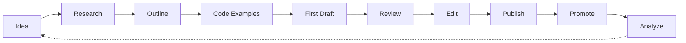

# Technical Blogging

## Learning Objectives

| Objective | Description |
|-----------|-------------|
| LO1 | Choose a blogging platform and set up your presence |
| LO2 | Develop a writing style that engages technical audiences |
| LO3 | Structure tutorials that teach complex topics step-by-step |
| LO4 | Write case studies that demonstrate real-world impact |
| LO5 | Promote your blog posts to reach a wider audience |
| LO6 | Measure blog performance with analytics |

## Chapter at a Glance

| Section | Topic | Key Concept |
|---------|-------|-------------|
| 3.1 | Platform Choice | Dev.to, Medium, Hashnode, personal blog |
| 3.2 | Writing Style | Clarity, code snippets, examples, voice |
| 3.3 | Tutorial Writing | Step-by-step, scaffolding, runnable examples |
| 3.4 | Case Studies | Problem, approach, results, lessons learned |
| 3.5 | Content Promotion | Social media, Reddit, Hacker News, SEO |
| 3.6 | Analytics & Growth | Traffic, engagement, conversion metrics |

## Blogging Workflow



## 3.1 Platform Choice

Choose a platform that aligns with your goals: reach, ownership, monetization, and technical audience.

```python
from typing import Dict, List, Optional

class BlogPlatform:
    """Analyze and compare blogging platforms."""

    def __init__(self, name: str, pros: List[str], cons: List[str],
                 audience_size: str, seo_strength: int):
        self.name = name
        self.pros = pros
        self.cons = cons
        self.audience_size = audience_size
        self.seo_strength = seo_strength

    def score(self, priorities: Dict[str, int]) -> int:
        score = 0
        if "reach" in priorities:
            score += {"large": 30, "medium": 20, "small": 10}.get(self.audience_size, 0)
        if "ownership" in priorities:
            score += self.seo_strength * 2
        return score

PLATFORMS = {
    "dev.to": BlogPlatform("Dev.to", ["Built-in audience", "Developer-focused", "No SEO needed"],
                           ["Limited customization", "No monetization"], "large", 60),
    "medium": BlogPlatform("Medium", ["Huge audience", "Built-in distribution", "Partner program"],
                           ["Limited ownership", "Paywall concerns", "No custom domain"], "very large", 50),
    "hashnode": BlogPlatform("Hashnode", ["Free custom domain", "Built-in newsletter", "Good SEO"],
                              ["Smaller audience", "Newer platform"], "medium", 80),
    "ghost": BlogPlatform("Ghost", ["Full ownership", "Newsletter built-in", "Memberships"],
                          ["Costs money", "Self-host or paid"], "small", 90),
    "wordpress": BlogPlatform("WordPress", ["Maximum control", "Best SEO", "Monetization options"],
                              ["Requires maintenance", "Can be slow", "Security updates"], "large", 95),
}


class PlatformSelector:
    """Recommend a blogging platform based on user goals."""

    def __init__(self, goals: Dict[str, int]):
        self.goals = goals

    def recommend(self) -> str:
        best = max(PLATFORMS, key=lambda p: PLATFORMS[p].score(self.goals))
        return best

    def comparison_table(self) -> str:
        rows = []
        for name, platform in PLATFORMS.items():
            score = platform.score(self.goals)
            rows.append(f"| {name} | {score} | {', '.join(platform.pros[:2])} |")
        return "\n".join(rows)
```

## 3.2 Writing Style

Technical writing should be clear, concise, and accessible. Lead with the problem, show the solution with code, and explain the reasoning.

```python
class WritingAssistant:
    """Tools to improve technical writing."""

    @staticmethod
    def readability_score(text: str) -> float:
        words = text.split()
        sentences = text.replace("!", ".").replace("?", ".").split(".")
        avg_words_per_sentence = len(words) / max(len(sentences), 1)
        syllables = sum(WritingAssistant._count_syllables(w) for w in words)
        score = 206.835 - 1.015 * avg_words_per_sentence - 84.6 * (syllables / max(len(words), 1))
        return round(score, 1)

    @staticmethod
    def _count_syllables(word: str) -> int:
        word = word.lower()
        count = 0
        vowels = "aeiou"
        if word and word[0] in vowels:
            count += 1
        for i in range(1, len(word)):
            if word[i] in vowels and word[i - 1] not in vowels:
                count += 1
        if word.endswith("e"):
            count -= 1
        if word.endswith("le") and len(word) > 2:
            count += 1
        return max(count, 1)

    @staticmethod
    def passive_voice_detection(text: str) -> List[str]:
        import re
        passive_patterns = [
            r'\b(is|are|was|were|been|being)\s+\w+ed\b',
            r'\bhas|have|had)\s+been\s+\w+ed\b',
        ]
        matches = []
        for pattern in passive_patterns:
            matches.extend(re.findall(pattern, text, re.IGNORECASE))
        return list(set(matches))

    @staticmethod
    def suggest_improvements(text: str) -> List[str]:
        suggestions = []
        if WritingAssistant.readability_score(text) < 50:
            suggestions.append("Text is complex (score < 50). Use shorter sentences and simpler words.")
        passive = WritingAssistant.passive_voice_detection(text)
        if passive:
            suggestions.append(f"Found {len(passive)} passive voice constructs. Use active voice.")
        return suggestions


class ArticleStructure:
    """Define standard article structures."""

    @staticmethod
    def tutorial_structure(title: str, tags: List[str]) -> str:
        return f"""---
title: {title}
tags: [{', '.join(tags)}]
published: false
---

## Introduction
What we're building and why it matters.

## Prerequisites
What readers need to know and have installed.

## Step 1: Setup
Environment setup and dependencies.

## Step 2: Implementation
Core code with explanations.

## Step 3: Testing
How to verify the solution works.

## Conclusion
Recap and next steps.
"""

    @staticmethod
    def case_study_structure(title: str, tags: List[str]) -> str:
        return f"""---
title: {title}
tags: [{', '.join(tags)}]
published: false
---

## The Problem
What challenge were you facing?

## The Approach
What solution did you build?

## Implementation Details
Key technical decisions and trade-offs.

## Results
Metrics, improvements, and impact.

## Lessons Learned
What would you do differently?

## Conclusion
Key takeaways for readers.
"""

    @staticmethod
    def opinion_structure(title: str, tags: List[str]) -> str:
        return f"""---
title: {title}
tags: [{', '.join(tags)}]
published: false
---

## Thesis
The main argument in one paragraph.

## Background
Context readers need.

## The Case
Evidence and reasoning.

## Counterarguments
Address objections.

## Conclusion
Reinforce the thesis.
"""
```

## 3.3 Tutorial Writing

Tutorials teach by doing. Each step should build on the previous one, with code that readers can run.

```python
class TutorialValidator:
    """Validate tutorial quality."""

    def __init__(self, tutorial_text: str):
        self.text = tutorial_text

    def check_code_blocks(self) -> dict:
        import re
        code_blocks = re.findall(r'```(\w+)\n(.*?)```', self.text, re.DOTALL)
        runnable = 0
        for lang, code in code_blocks:
            if lang in ("python", "bash", "shell", "ts", "typescript"):
                runnable += 1
        return {
            "total_blocks": len(code_blocks),
            "runnable_blocks": runnable,
            "has_examples": runnable > 0,
        }

    def check_step_by_step(self) -> bool:
        return "Step 1" in self.text or "## Step" in self.text or "1." in self.text[:500]

    def check_prerequisites(self) -> bool:
        keywords = ["prerequisites", "requirements", "before you begin", "what you need"]
        return any(kw in self.text.lower() for kw in keywords)

    def validate(self) -> dict:
        return {
            "has_code": self.check_code_blocks()["total_blocks"] > 0,
            "is_step_by_step": self.check_step_by_step(),
            "has_prerequisites": self.check_prerequisites(),
            "quality_score": sum([
                self.check_code_blocks()["total_blocks"] > 0,
                self.check_step_by_step(),
                self.check_prerequisites(),
            ]) * 33,
        }


class CodeExampleBuilder:
    """Build runnable code examples for tutorials."""

    def __init__(self, language: str = "python"):
        self.language = language
        self.files = {}

    def add_file(self, path: str, content: str):
        self.files[path] = content

    def generate_repo_structure(self) -> str:
        tree = ""
        for path in sorted(self.files):
            depth = path.count("/")
            tree += "  " * depth + f"- {path.split('/')[-1]}\n"
        return tree.strip()

    def create_readme(self, title: str, steps: List[str]) -> str:
        readme = f"# {title}\n\n## Steps\n"
        for i, step in enumerate(steps, 1):
            readme += f"{i}. {step}\n"
        readme += "\n## Run\n```bash\npython main.py\n```\n"
        return readme
```

## 3.4 Case Studies

Case studies demonstrate real-world impact. They follow a narrative: problem → approach → solution → results → lessons.

```python
class CaseStudyBuilder:
    """Build compelling case study articles."""

    def __init__(self, title: str, problem: str, solution: str):
        self.title = title
        self.problem = problem
        self.solution = solution
        self.metrics: Dict[str, str] = {}
        self.lessons: List[str] = []

    def add_metric(self, name: str, value: str):
        self.metrics[name] = value

    def add_lesson(self, lesson: str):
        self.lessons.append(lesson)

    def generate(self) -> str:
        results = "\n".join(f"- **{k}**: {v}" for k, v in self.metrics.items())
        lessons = "\n".join(f"- {l}" for l in self.lessons)
        return f"""# {self.title}

## The Problem
{self.problem}

## The Approach
{self.solution}

## Results
{results}

## Lessons Learned
{lessons}
"""


class ImpactStorytelling:
    """Structure impact stories for maximum engagement."""

    @staticmethod
    def before_after(before: str, after: str, metrics: dict) -> str:
        rows = "\n".join(f"| {k} | {v} |" for k, v in metrics.items())
        return f"""## Before
{before}

## After
{after}

## Key Metrics
| Metric | Value |
|--------|-------|
{rows}
"""

    @staticmethod
    def technical_deep_dive(architecture: str, tradeoffs: List[str],
                            code_snippet: str) -> str:
        tradeoff_text = "\n".join(f"- {t}" for t in tradeoffs)
        return f"""## Architecture
{architecture}

## Trade-offs
{tradeoff_text}

## Key Code
```python
{code_snippet}
```
"""
```

## 3.5 Content Promotion

Writing is only half the battle. Promotion determines whether your content gets read.

```python
class ContentPromoter:
    """Promote blog content across channels."""

    def __init__(self, blog_url: str, topics: List[str]):
        self.blog_url = blog_url
        self.topics = topics
        self.channels = [
            "twitter", "linkedin", "reddit", "hacker_news",
            "dev.to", "hashnode", "medium",
        ]

    def promotion_plan(self) -> dict:
        return {
            "day_0_publish": [
                f"Publish on {self.blog_url}",
                f"Cross-post to Dev.to",
                f"Tweet with key insight + link",
                f"LinkedIn article summary",
            ],
            "day_1_communities": [
                f"Post to r/{self.topics[0]} subreddit",
                f"Submit to Hacker News",
                f"Share in relevant Discord servers",
                f"Slack workspace sharing",
            ],
            "day_3_engagement": [
                "Reply to comments",
                "Share in Twitter threads",
                "Engage with shares",
            ],
            "day_7_followup": [
                "Post key stat from article",
                "Share in newsletter",
                "Update with new insights",
            ],
        }

    def generate_tweet(self, article_title: str, key_point: str,
                        article_url: str) -> str:
        return f"🧵 {article_title}\n\n{key_point}\n\nFull article → {article_url}"


class SEOMetadata:
    """Optimize articles for search engines."""

    def __init__(self, title: str, description: str, keywords: List[str]):
        self.title = title
        self.description = description
        self.keywords = keywords

    def generate_front_matter(self) -> str:
        return f"""---
title: "{self.title}"
description: "{self.description}"
tags: [{', '.join(self.keywords)}]
canonical_url: null
published: false
cover_image: null
---
"""
```

## 3.6 Analytics & Growth

Track what works, double down on successful topics, and iterate on your strategy.

```python
class BlogAnalytics:
    """Track and analyze blog performance."""

    def __init__(self):
        self.posts: Dict[str, Dict] = {}
        self.total_views = 0
        self.total_readers = 0

    def record_post(self, title: str, views: int, reads: int,
                    likes: int, comments: int) -> dict:
        engagement = (likes + comments) / max(views, 1) * 100
        read_ratio = reads / max(views, 1) * 100
        post_data = {
            "views": views,
            "reads": reads,
            "likes": likes,
            "comments": comments,
            "engagement_rate": round(engagement, 2),
            "read_ratio": round(read_ratio, 2),
        }
        self.posts[title] = post_data
        self.total_views += views
        self.total_readers += reads
        return post_data

    def top_posts(self, n: int = 5, metric: str = "views") -> List[dict]:
        sorted_posts = sorted(
            self.posts.items(),
            key=lambda x: x[1].get(metric, 0),
            reverse=True
        )
        return [{"title": t, **d} for t, d in sorted_posts[:n]]

    def growth_rate(self, period_days: int = 30) -> float:
        recent = sum(p["views"] for p in self.posts.values())
        return recent / max(period_days, 1)


class ContentCalendar:
    """Plan and schedule blog content."""

    def __init__(self):
        self.schedule: Dict[str, List[dict]] = {}

    def add_post(self, date: str, title: str, topic: str,
                 status: str = "idea"):
        if date not in self.schedule:
            self.schedule[date] = []
        self.schedule[date].append({
            "title": title,
            "topic": topic,
            "status": status,
        })

    def weekly_plan(self, start_date: str) -> List[dict]:
        return self.schedule.get(start_date, [])

    def topic_distribution(self) -> dict:
        topics = {}
        for posts in self.schedule.values():
            for post in posts:
                topics[post["topic"]] = topics.get(post["topic"], 0) + 1
        return topics
```

## Summary

Technical blogging is one of the most effective ways to build your professional brand. Choose a platform that aligns with your goals — Dev.to for developer reach, Hashnode for SEO ownership, or a personal blog for full control. Write tutorials that guide readers step-by-step with runnable code. Case studies demonstrate real impact. Promotion through Twitter, LinkedIn, Reddit, and Hacker News is essential for reach. Track analytics to understand what resonates and iterate. Consistent publishing — even once per month — compounds into a valuable knowledge portfolio.

## Practical Takeaways

| Takeaway | Implementation |
|----------|---------------|
| Write tutorials with runnable code examples | Every code block should be copy-paste ready |
| Lead with the problem, not the solution | Hook readers by stating what they'll learn |
| Cross-post to Dev.to for built-in developer audience | Maintain your personal blog as the canonical source |
| Promote within 24 hours of publishing | Twitter thread + relevant subreddits + LinkedIn |
| Track read ratio (reads / views) over total views | High read ratio (>50%) indicates quality content |
| Publish consistently (1-2x/month minimum) | Use a content calendar to plan and maintain cadence |

## Q&A

<details class="tp-qa-card" data-qid="port-s03-q1">
<summary class="tp-qa-question">Which blogging platform is best for building a developer audience?</summary>
<div class="tp-qa-context"><p>Platform comparison for technical content.</p></div>
<div class="tp-qa-answer">
<p>For building a developer audience: <strong>Dev.to</strong> is the best starting point — it has a built-in developer community, good discovery, and no SEO needed. <strong>Hashnode</strong> offers better long-term ownership with custom domain and Google SEO. <strong>Medium</strong> has the largest general audience but limited developer targeting. <strong>Strategy:</strong> Start with Dev.to for immediate reach, cross-post to your own Hashnode blog for SEO, and republish on Medium using canonical URLs. Personal blog (Ghost/WordPress) for full ownership once you have an audience.</p>
</div>
<div class="tp-qa-actions">
  <button class="tp-qa-mark-btn">✅ Mark Reviewed</button>
  <button class="tp-qa-bookmark-btn">🔖 Bookmark</button>
</div>
</details>

<details class="tp-qa-card" data-qid="port-s03-q2">
<summary class="tp-qa-question">How do I make complex technical topics accessible to beginners?</summary>
<div class="tp-qa-context"><p>Writing for diverse skill levels.</p></div>
<div class="tp-qa-answer">
<p>Strategies: (1) <strong>Start with a real problem</strong> — beginners relate to "why" before "how". (2) <strong>Use analogies</strong> — compare technical concepts to everyday experiences (e.g., "RAG is like giving the AI a textbook to reference"). (3) <strong>Show, then explain</strong> — provide the full code first, then walk through it piece by piece. (4) <strong>Define jargon</strong> — explain every acronym on first use. (5) <strong>Include prerequisites</strong> — list exactly what readers need to know. (6) <strong>Provide a runnable repo</strong> — link to a GitHub repo with the complete working code.</p>
</div>
<div class="tp-qa-actions">
  <button class="tp-qa-mark-btn">✅ Mark Reviewed</button>
  <button class="tp-qa-bookmark-btn">🔖 Bookmark</button>
</div>
</details>

<details class="tp-qa-card" data-qid="port-s03-q3">
<summary class="tp-qa-question">What makes a technical tutorial effective?</summary>
<div class="tp-qa-context"><p>Tutorial quality factors.</p></div>
<div class="tp-qa-answer">
<p>Effective tutorials: (1) <strong>Teach one concept</strong> — don't cram multiple topics. (2) <strong>Are step-by-step</strong> — numbered steps that build on each other. (3) <strong>Include runnable code</strong> — every snippet should work if copied. (4) <strong>Explain errors</strong> — show common mistakes and how to debug. (5) <strong>Provide the final repo</strong> — link to a complete solution repo. (6) <strong>Have clear headings</strong> — readers scan; make headings descriptive. (7) <strong>End with a summary</strong> — recap what was learned and suggest next steps. A good tutorial takes 15-30 minutes to complete.</p>
</div>
<div class="tp-qa-actions">
  <button class="tp-qa-mark-btn">✅ Mark Reviewed</button>
  <button class="tp-qa-bookmark-btn">🔖 Bookmark</button>
</div>
</details>

<details class="tp-qa-card" data-qid="port-s03-q4">
<summary class="tp-qa-question">How do I write a compelling case study?</summary>
<div class="tp-qa-context"><p>Case study structure and content.</p></div>
<div class="tp-qa-answer">
<p>Structure: (1) <strong>The Problem</strong> — describe the challenge with specific details (scale, constraints, business impact). (2) <strong>The Approach</strong> — explain why you chose this solution over alternatives. (3) <strong>Implementation</strong> — key code snippets and architecture decisions. (4) <strong>The Results</strong> — quantified metrics (50% faster, 30% cost reduction, 99.9% uptime). (5) <strong>Lessons Learned</strong> — what surprised you, what you'd do differently. Use before/after comparisons and include specific numbers. A compelling case study tells a story with a clear arc: challenge → struggle → breakthrough → success.</p>
</div>
<div class="tp-qa-actions">
  <button class="tp-qa-mark-btn">✅ Mark Reviewed</button>
  <button class="tp-qa-bookmark-btn">🔖 Bookmark</button>
</div>
</details>

<details class="tp-qa-card" data-qid="port-s03-q5">
<summary class="tp-qa-question">How do I promote my blog posts effectively?</summary>
<div class="tp-qa-context"><p>Content distribution strategy.</p></div>
<div class="tp-qa-answer">
<p>Promotion strategy: (1) <strong>Day 0</strong> — publish on your platform, cross-post to Dev.to, tweet the key insight, LinkedIn summary post. (2) <strong>Day 1</strong> — post to relevant subreddits (r/MachineLearning, r/Python, r/webdev), submit to Hacker News, share in Discord/Slack communities. (3) <strong>Day 3</strong> — reply to all comments, engage with shares. (4) <strong>Day 7</strong> — post a follow-up with the most interesting insight or stat. Schedule promotion using Buffer or Hootsuite. Timing matters: Tuesday-Thursday 9-11am EST gets the best engagement for technical content.</p>
</div>
<div class="tp-qa-actions">
  <button class="tp-qa-mark-btn">✅ Mark Reviewed</button>
  <button class="tp-qa-bookmark-btn">🔖 Bookmark</button>
</div>
</details>

<details class="tp-qa-card" data-qid="port-s03-q6">
<summary class="tp-qa-question">How do I measure if my blog is successful?</summary>
<div class="tp-qa-context"><p>Blog performance metrics.</p></div>
<div class="tp-qa-answer">
<p>Key metrics: (1) <strong>Read ratio</strong> — reads/views (target >50%). High read ratio means people who click actually read. (2) <strong>Engagement rate</strong> — (likes + comments) / views (target >3%). (3) <strong>Traffic sources</strong> — organic search vs. social vs. direct. (4) <strong>Email subscribers</strong> — if you have a newsletter. (5) <strong>Growth rate</strong> — month-over-month views. (6) <strong>Top posts</strong> — which topics drive the most traffic. Tools: Google Analytics, Dev.to dashboard, Medium stats. Don't obsess over vanity metrics (total views) — focus on read ratio and engagement.</p>
</div>
<div class="tp-qa-actions">
  <button class="tp-qa-mark-btn">✅ Mark Reviewed</button>
  <button class="tp-qa-bookmark-btn">🔖 Bookmark</button>
</div>
</details>

<details class="tp-qa-card" data-qid="port-s03-q7">
<summary class="tp-qa-question">How often should I publish technical blog posts?</summary>
<div class="tp-qa-context"><p>Content publishing cadence.</p></div>
<div class="tp-qa-answer">
<p>Quality over quantity: (1) <strong>Minimum</strong> — 1 post per month maintains presence. (2) <strong>Good</strong> — 2 posts per month shows consistent effort. (3) <strong>Great</strong> — 1 post per week builds significant momentum. Each post should be 1000-2000 words with working code examples. It's better to publish one excellent tutorial per month than four shallow ones per week. A content calendar helps: plan topics 3 months in advance. Batch write on weekends, edit during the week, publish on Tuesday mornings. Consistent cadence outperforms sporadic bursts.</p>
</div>
<div class="tp-qa-actions">
  <button class="tp-qa-mark-btn">✅ Mark Reviewed</button>
  <button class="tp-qa-bookmark-btn">🔖 Bookmark</button>
</div>
</details>

<details class="tp-qa-card" data-qid="port-s03-q8">
<summary class="tp-qa-question">How do I get started with technical writing if I'm not confident?</summary>
<div class="tp-qa-context"><p>Overcoming writer's block.</p></div>
<div class="tp-qa-answer">
<p>Starting tips: (1) <strong>Write what you just learned</strong> — the best time to write a tutorial is right after you've figured something out; you still remember what was confusing. (2) <strong>Start with tweets/threads</strong> — build confidence with shorter content. (3) <strong>Use a template</strong> — follow the tutorial or case study structure templates. (4) <strong>Focus on the code</strong> — write the code first, then explain it. (5) <strong>Get feedback</strong> — share drafts with a friend or in a writing group. (6) <strong>Publish imperfectly</strong> — your first post won't be your best; publish it anyway and improve with each post.</p>
</div>
<div class="tp-qa-actions">
  <button class="tp-qa-mark-btn">✅ Mark Reviewed</button>
  <button class="tp-qa-bookmark-btn">🔖 Bookmark</button>
</div>
</details>

## Interview Q&A

<details class="tp-qa-card" data-qid="pf03-q1">
  <summary class="tp-qa-question">
    <span class="tp-qa-status"></span>
    Q1: How does technical blogging help in getting job interviews and advancing your career?
  </summary>
  <div class="tp-qa-answer">
    <p>Technical blogging provides several career benefits: (1) Proof of expertise — a well-written tutorial on building RAG systems demonstrates practical knowledge more convincingly than a resume bullet point. (2) Searchable credentials — recruiters Google candidates; a blog with 10+ quality articles appears in search results and establishes domain authority. (3) Conversation starter — interviews often begin with "I loved your article about X" which shifts the dynamic from interrogation to peer discussion. (4) Network building — readers reach out via comments, LinkedIn, and Twitter, expanding your professional network. (5) Learning reinforcement — writing forces deeper understanding; you can't explain what you don't fully understand. (6) Passive opportunity generation — consistent blogging attracts inbound recruiting messages. Engineers who blog 2-3x/month report 3-5— more inbound recruiter interest than those who don't.</p>
  </div>
  <button class="tp-qa-mark-btn">✅ Mark Reviewed</button>
  <button class="tp-qa-bookmark-btn">🔖 Bookmark</button>
</details>

<details class="tp-qa-card" data-qid="pf03-q2">
  <summary class="tp-qa-question">
    <span class="tp-qa-status"></span>
    Q2: How do you choose topics for technical blog posts that will attract readers?
  </summary>
  <div class="tp-qa-answer">
    <p>Topic selection strategy: (1) Solve real problems — write about challenges you've encountered and solved. "How I reduced LLM inference cost by 60%" gets more reads than "Introduction to LLMs." (2) Trending technologies — write about new frameworks, tools, or techniques while they're still novel. Early posts about LangChain, RAG, and GPT-4 attracted massive traffic. (3) Tutorial gap — search for topics you want to write about; if existing tutorials are outdated, incomplete, or confusing, there's your opportunity. (4) Unique angle — differentiate by focusing on a specific stack, domain, or audience (e.g., "RAG for Healthcare" vs. "Introduction to RAG"). (5) Keyword research — use Google Keyword Planner or Ahrefs to identify topics with high search volume (1000+) and low competition. (6) Personal projects — write about what you built. Case studies with code and metrics outperform generic tutorials.</p>
  </div>
  <button class="tp-qa-mark-btn">✅ Mark Reviewed</button>
  <button class="tp-qa-bookmark-btn">🔖 Bookmark</button>
</details>

<details class="tp-qa-card" data-qid="pf03-q3">
  <summary class="tp-qa-question">
    <span class="tp-qa-status"></span>
    Q3: What is the ideal structure for a technical tutorial that keeps readers engaged?
  </summary>
  <div class="tp-qa-answer">
    <p>An effective tutorial structure: (1) Hook — start with the problem and what the reader will build. "Ever struggled with extracting text from scanned invoices? In this tutorial, you'll build an OCR pipeline that extracts invoice data with 95% accuracy." (2) Prerequisites — list exactly what the reader needs (Python 3.11, an OpenAI API key, 20 minutes). (3) Step-by-step — 5-8 numbered steps, each building on the previous. Every code block should be copy-paste ready and runnable. (4) Code + explanation — show the code first, then explain key lines. Never drop a wall of code without explanation. (5) Expected output — after each step, show what the reader should see: "You should see: 'Invoice total: $1,234.56'." (6) Common errors — add a troubleshooting section for the most common mistakes. (7) Summary + next steps — recap what was learned and suggest extensions. Keep each step under 5 minutes. Total reading time: 15-30 minutes.</p>
  </div>
  <button class="tp-qa-mark-btn">✅ Mark Reviewed</button>
  <button class="tp-qa-bookmark-btn">🔖 Bookmark</button>
</details>

<details class="tp-qa-card" data-qid="pf03-q4">
  <summary class="tp-qa-question">
    <span class="tp-qa-status"></span>
    Q4: How do you measure the success of a technical blog post?
  </summary>
  <div class="tp-qa-answer">
    <p>Key blog metrics: (1) Read ratio — reads / views (target >50%). A high read ratio means the title matched the content and the article delivered value. Low read ratio (<30%) suggests misleading title or poor first impression. (2) Engagement — comments, likes, shares. Target >3% engagement rate. (3) Traffic sources — organic search (target >40%), social media (target >30%), direct (target >20%). Growing organic search share indicates SEO success. (4) Bounce rate — percentage of visitors who leave without scrolling past the first section. Target <60%. (5) Email subscribers — if you have a newsletter, track new subscribers per post. (6) Evergreen performance — is the post still getting traffic 3 months later? Evergreen content (tutorials, guides) outperforms news-based content over time. (7) Conversion — did the post lead to desired actions? LinkedIn connections, interview requests, collaboration offers. Don't obsess over vanity metrics (total views); focus on engagement and conversion.</p>
  </div>
  <button class="tp-qa-mark-btn">✅ Mark Reviewed</button>
  <button class="tp-qa-bookmark-btn">🔖 Bookmark</button>
</details>

<details class="tp-qa-card" data-qid="pf03-q5">
  <summary class="tp-qa-question">
    <span class="tp-qa-status"></span>
    Q5: How do you promote a blog post effectively on social media?
  </summary>
  <div class="tp-qa-answer">
    <p>Promotion calendar: (1) Day 0 (publish day) — post on Dev.to (cross-post with canonical URL to original blog), tweet the key insight with a compelling excerpt, LinkedIn summary post with a question to drive comments. (2) Day 1 — post to relevant subreddits (r/MachineLearning, r/Python, r/webdev, r/programming) following each subreddit's posting rules. Submit to Hacker News (timing matters: 8-10am EST for best visibility). Share in Discord and Slack communities you're part of. (3) Day 3 — reply to all comments across platforms. Engage with people who shared your post. (4) Day 7 — write a Twitter thread summarizing the most surprising finding from your post. (5) Ongoing — update the post with corrections or addendums based on feedback. Cross-post to Medium using canonical URL. Each promotion channel has different etiquette — on Reddit, contribute to the community first; on HN, be ready for critical discussion.</p>
  </div>
  <button class="tp-qa-mark-btn">✅ Mark Reviewed</button>
  <button class="tp-qa-bookmark-btn">🔖 Bookmark</button>
</details>

<details class="tp-qa-card" data-qid="pf03-q6">
  <summary class="tp-qa-question">
    <span class="tp-qa-status"></span>
    Q6: How do you write a compelling case study post that showcases your engineering skills?
  </summary>
  <div class="tp-qa-answer">
    <p>Case study structure: (1) The Problem (1 paragraph) — describe the specific challenge: "Our RAG system had 60% answer accuracy and 4-second latency at peak hours." (2) The Approach (2-3 paragraphs) — explain why you chose your solution over alternatives: "We chose hybrid search over pure vector search because..." Include architecture diagram. (3) Implementation (3-5 code snippets) — show key code: embedding function, retrieval logic, prompt template. (4) The Results (quantified) — before/after metrics: "Accuracy improved from 60% to 92%, P95 latency dropped from 4s to 800ms." (5) Lessons Learned — what surprised you, what you'd do differently. (6) Key metrics table — present results in a scannable table. A good case study tells a story (challenge → struggle → breakthrough → success) and provides enough detail for another engineer to replicate the results.</p>
  </div>
  <button class="tp-qa-mark-btn">✅ Mark Reviewed</button>
  <button class="tp-qa-bookmark-btn">🔖 Bookmark</button>
</details>

<details class="tp-qa-card" data-qid="pf03-q7">
  <summary class="tp-qa-question">
    <span class="tp-qa-status"></span>
    Q7: How do you build a content calendar and maintain a consistent publishing schedule?
  </summary>
  <div class="tp-qa-answer">
    <p>Content planning: (1) Inventory topics — list 20-30 topics you could write about based on your expertise, projects, and recent learnings. (2) Prioritize — score each by: reader value (1-5), your expertise (1-5), search potential (1-5). Pick topics with the highest combined score. (3) Calendar — plan 3 months ahead: 1 tutorial per month, 1 case study, and 1 opinion/analysis piece. Align with industry events (conferences, major releases). (4) Writing process — batch write on weekends (write 4 hours), edit during the week (1 hour), publish on Tuesday mornings (best engagement). (5) Goals — minimum: 1 post/month maintains presence. Good: 2 posts/month. Great: 1 post/week. (6) Queue — maintain a backlog of 3-5 draft posts at various stages. This buffer prevents publishing gaps during busy periods. Use a tool like Notion or Trello to track: Idea → Outlining → Drafting → Review → Published → Promoted.</p>
  </div>
  <button class="tp-qa-mark-btn">✅ Mark Reviewed</button>
  <button class="tp-qa-bookmark-btn">🔖 Bookmark</button>
</details>

<details class="tp-qa-card" data-qid="pf03-q8">
  <summary class="tp-qa-question">
    <span class="tp-qa-status"></span>
    Q8: How do you get started with technical writing if you're not confident in your writing?
  </summary>
  <div class="tp-qa-answer">
    <p>Overcoming writer's block: (1) Write what you just learned — the best time to write a tutorial is right after you've figured something out. You still remember what was confusing and can explain the aha moments. (2) Write the code first — implement the solution, then write the explanation around it. Code is truth; explanations are commentary. (3) Use templates — follow the tutorial or case study structure templates. Fill in the blanks rather than starting from scratch. (4) Write like you talk — use conversational language. "You'll need an API key" not "One must obtain an API key." (5) Get feedback — share drafts with a friend or a writing group (Write the Docs, Dev.to community). (6) Publish imperfectly — your first post won't be your best, and that's OK. Each post improves. (7) Edit in passes — write without editing, then do separate passes for: technical accuracy, clarity, flow, grammar. The edit is where good writing happens.</p>
  </div>
  <button class="tp-qa-mark-btn">✅ Mark Reviewed</button>
  <button class="tp-qa-bookmark-btn">🔖 Bookmark</button>
</details>

<details class="tp-qa-card" data-qid="pf03-q9">
  <summary class="tp-qa-question">
    <span class="tp-qa-status"></span>
    Q9: How do you use SEO to drive organic traffic to your technical blog?
  </summary>
  <div class="tp-qa-answer">
    <p>SEO strategies for technical blogs: (1) Keyword research — use Google Keyword Planner, Ahrefs, or SEMrush to find terms with 200-2000 monthly searches and low competition. Target long-tail keywords: "build RAG system with LangChain tutorial" vs. "RAG tutorial." (2) On-page SEO — include the target keyword in: title (60 chars max), meta description (160 chars), H1, first paragraph, and 2-3 H2/H3 headers. (3) URL structure — use descriptive URLs: `/blog/build-rag-system-langchain` not `/blog/post-123`. (4) Internal linking — link to your other posts within the content. (5) External links — link to authoritative sources (documentation, papers). (6) Technical SEO — fast page load (target <2s), mobile-friendly, proper heading hierarchy (h1 → h2 → h3), alt text on images, schema markup (Article schema). (7) Content freshness — update old posts with new information and re-publish with a "Last updated" date. Google favors fresh, comprehensive content.</p>
  </div>
  <button class="tp-qa-mark-btn">✅ Mark Reviewed</button>
  <button class="tp-qa-bookmark-btn">🔖 Bookmark</button>
</details>

<details class="tp-qa-card" data-qid="pf03-q10">
  <summary class="tp-qa-question">
    <span class="tp-qa-status"></span>
    Q10: How do you build an email list from your technical blog?
  </summary>
  <div class="tp-qa-answer">
    <p>Email list building: (1) Lead magnet — offer a valuable freebie in exchange for email: "Download the complete RAG system code template" or "Get the 10-step ML project checklist." (2) Signup forms — place a subscription form at the end of each post (best converting), in the sidebar, and as a popup after 30 seconds (use with caution). (3) Newsletter content — weekly digest of your latest posts + curated links + exclusive tips. Keep value high, promotion low (80/20 rule). (4) Tools — ConvertKit (best for creators, free up to 1000 subscribers), Mailchimp (free up to 500), or Buttondown (simple, paid). (5) Welcome sequence — when someone subscribes, send 3 emails over 5 days: welcome + best post, case study, your story/why you blog. (6) Segmentation — tag subscribers by interest (AI/ML, web dev, career). Send relevant content to each segment. An engaged email list of 1000 subscribers is worth more than 10K social media followers because email has 3-5— higher engagement rates.</p>
  </div>
  <button class="tp-qa-mark-btn">✅ Mark Reviewed</button>
  <button class="tp-qa-bookmark-btn">🔖 Bookmark</button>
</details>

## Chapter Quiz
**Q1**: Which platform is best for technical blogging to maximize reach?
a) LinkedIn Articles
b) Medium
c) Dev.to
d) All of the above — cross-post strategically

<details class="tp-qa-card" data-qid="pf-03-q1"><summary>Show Answer</summary><div class="tp-qa-answer"><p><strong>Answer: d</strong></p><p>Cross-posting to Dev.to, Medium, and LinkedIn Articles maximizes reach. Dev.to is best for developer audience.</p></div></details>

**Q2**: What is the ideal length for a technical blog post?
a) 200-300 words
b) 800-1500 words
c) 3000+ words
d) 100 words

<details class="tp-qa-card" data-qid="pf-03-q2"><summary>Show Answer</summary><div class="tp-qa-answer"><p><strong>Answer: b</strong></p><p>800-1500 words is ideal — long enough to cover depth but short enough to hold attention.</p></div></details>

**Q3**: What SEO practice is most effective for technical blogs?
a) Keyword stuffing
b) Descriptive title, meta description, and internal links
c) Using only images
d) Posting daily

<details class="tp-qa-card" data-qid="pf-03-q3"><summary>Show Answer</summary><div class="tp-qa-answer"><p><strong>Answer: b</strong></p><p>Descriptive titles, meta descriptions, headings (H2/H3), and internal links significantly improve SEO.</p></div></details>

**Q4**: How often should you publish to build a technical blog audience?
a) Daily
b) Weekly or bi-weekly
c) Monthly
d) Once a year

<details class="tp-qa-card" data-qid="pf-03-q4"><summary>Show Answer</summary><div class="tp-qa-answer"><p><strong>Answer: b</strong></p><p>Weekly or bi-weekly publishing is sustainable and helps build readership over 6-12 months.</p></div></details>

**Q5**: What is a good first technical blog topic for a job seeker?
a) How to build a portfolio
b) Building a real project with a walkthrough and code
c) Programming language history
d) Why you should learn to code

<details class="tp-qa-card" data-qid="pf-03-q5"><summary>Show Answer</summary><div class="tp-qa-answer"><p><strong>Answer: b</strong></p><p>A project walkthrough with code demonstrates practical skills — employers notice these posts.</p></div></details>


## Exercises

1. **Platform Analysis**: Create accounts on Dev.to, Hashnode, and Medium. Write the same 500-word introduction on each. Compare: editor experience, SEO preview, community features. Which platform do you prefer and why?

2. **Tutorial Writing**: Write a 1500-word tutorial on "Building a RAG System with LangChain". Include: prerequisites, 5 steps with code blocks, a GitHub repo link, and a troubleshooting section. Validate with TutorialValidator.

3. **Readability Audit**: Take your last 3 technical articles. Run them through Flesch-Kincaid readability scoring. Rewrite the lowest-scoring section to improve readability by at least 15 points. Identify specific changes you made.

4. **Case Study**: Identify a project you built. Write a case study following the problem → approach → results → lessons structure. Include at least 3 quantified metrics and a before/after comparison.

5. **Promotion Plan**: Create a 7-day promotion plan for your next article. Write: the launch tweet, a Reddit post for a relevant subreddit, a LinkedIn summary, and a Hacker News title. Which channel do you expect to drive the most traffic?

6. **SEO Optimization**: Write an article with SEO in mind. Research keywords using Google Keyword Planner. Include: SEO title (60 chars), meta description (160 chars), 3 header tags, alt text for images, and internal/external links.

7. **Analytics Setup**: Set up Google Analytics on your blog. Write 3 articles over 1 month. Track: views, read ratio, top traffic sources, bounce rate, top performing topic. Create a report with recommendations.

8. **Content Calendar**: Plan 3 months of blog content. Include: 1 tutorial per month, 1 case study, and 1 opinion/analysis piece. Ensure topics cover your areas of expertise. What seasonal/relevant topics can you align with?
