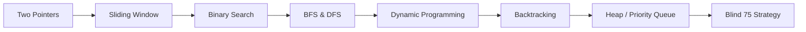

# DSA Patterns Mastery

## Learning Objectives

| Objective | Description |
|-----------|-------------|
| LO1 | Identify and apply the 14 essential DSA patterns |
| LO2 | Solve any Blind 75 problem by pattern recognition |
| LO3 | Implement two-pointer, sliding window, and binary search in Python |
| LO4 | Master BFS/DFS traversal on trees, graphs, and matrices |
| LO5 | Apply dynamic programming patterns: memoization, tabulation, state machine |
| LO6 | Recognize company-tagged problem patterns for FAANG-level interviews |

<!-- Image Gallery -->
<section class="lesson-visuals" aria-label="Visual learning resources">
  <header><span>VISUAL LEARNING</span><h2>See it. Review it. Remember it.</h2></header>
  <a class="lesson-visual-card" href="../../assets/images/lessons/ai-engineering-placement/21-interview-preparation/01-dsa-patterns-mastery/handwritten-notes.png" target="_blank" rel="noopener">
    
    <span><strong>Handwritten notes</strong>Condensed notes for deliberate review.</span>
  </a>
  <a class="lesson-visual-card" href="../../assets/images/lessons/ai-engineering-placement/21-interview-preparation/01-dsa-patterns-mastery/sticky-notes.png" target="_blank" rel="noopener">
    
    <span><strong>Sticky-note revision</strong>Fast recall prompts for revision.</span>
  </a>
  <a class="lesson-visual-card" href="../../assets/images/lessons/ai-engineering-placement/21-interview-preparation/01-dsa-patterns-mastery/visual-explanation.png" target="_blank" rel="noopener">
    
    <span><strong>Visual concept guide</strong>A connected explanation of the key ideas.</span>
  </a>
</section>
<!-- End Image Gallery -->

## Chapter at a Glance

| Section | Topic | Key Concept |
|---------|-------|-------------|
| 1.1 | Two Pointers | Opposite-direction and same-direction pointers |
| 1.2 | Sliding Window | Fixed-size and variable-size window traversal |
| 1.3 | Binary Search | Classic, rotated, and unknown-boundary search |
| 1.4 | BFS & DFS | Tree, graph, and matrix traversal patterns |
| 1.5 | Dynamic Programming | Memoization, tabulation, state machine DP |
| 1.6 | Backtracking | Permutations, combinations, subset generation |
| 1.7 | Heap / Priority Queue | Top-K, merge K sorted, median finding |
| 1.8 | Blind 75 Strategy | Coverage plan, spaced repetition, company mapping |

## Chapter Roadmap



## 1.1 Two Pointers

The two-pointer technique uses two indices to traverse a data structure, typically an array or string. There are two main variants:

**Opposite-direction pointers**: One pointer starts at the beginning, the other at the end. They move toward each other. Used for sorted arrays, palindrome checks, and container problems.

**Same-direction pointers**: Both pointers start at the same end, one moving faster. Used for in-place removal, linked list cycle detection, and partition.

```python
# Opposite-direction: Two Sum II (sorted array)
def two_sum_sorted(nums: list[int], target: int) -> list[int]:
    left, right = 0, len(nums) - 1
    while left < right:
        current = nums[left] + nums[right]
        if current == target:
            return [left + 1, right + 1]
        if current < target:
            left += 1
        else:
            right -= 1
    return []

# Same-direction: Remove duplicates in-place
def remove_duplicates(nums: list[int]) -> int:
    if not nums:
        return 0
    write = 1
    for read in range(1, len(nums)):
        if nums[read] != nums[read - 1]:
            nums[write] = nums[read]
            write += 1
    return write
```

**Time complexity**: O(n). **Space complexity**: O(1). The key insight is that each element is visited at most once by each pointer.

**Common problems**: Valid palindrome, container with most water, 3Sum, trapping rain water, linked list cycle detection, remove nth node from end.

---

## 1.2 Sliding Window

Sliding window maintains a contiguous subarray or substring that satisfies a condition. The window expands and contracts as we iterate.

**Fixed-size window**: The window length is constant. Move one step at a time, updating the result.

**Variable-size window**: The window grows or shrinks based on a constraint. Use a while loop to shrink from the left when the constraint is violated.

```python
# Fixed-size: Maximum sum subarray of size k
def max_sum_subarray(nums: list[int], k: int) -> int:
    window_sum = sum(nums[:k])
    max_sum = window_sum
    for i in range(k, len(nums)):
        window_sum += nums[i] - nums[i - k]
        max_sum = max(max_sum, window_sum)
    return max_sum

# Variable-size: Longest substring without repeating characters
def length_of_longest_substring(s: str) -> int:
    char_set = set()
    left = max_len = 0
    for right in range(len(s)):
        while s[right] in char_set:
            char_set.remove(s[left])
            left += 1
        char_set.add(s[right])
        max_len = max(max_len, right - left + 1)
    return max_len
```

**Time complexity**: O(n) — each element enters and leaves the window at most once. **Space complexity**: O(k) where k is the window size or distinct character set.

**Common problems**: Minimum window substring, longest repeating character replacement, permutation in string, max consecutive ones.

---

## 1.3 Binary Search

Binary search finds an element in a sorted array in O(log n) time. Beyond the classic implementation, three variants are essential:

**Classic**: Find an exact target in a sorted array.

**Lower bound / First occurrence**: Find the leftmost position where target could be inserted.

**Upper bound / Last occurrence**: Find the rightmost position where target could be inserted.

```python
# Classic binary search
def binary_search(nums: list[int], target: int) -> int:
    left, right = 0, len(nums) - 1
    while left <= right:
        mid = (left + right) // 2
        if nums[mid] == target:
            return mid
        if nums[mid] < target:
            left = mid + 1
        else:
            right = mid - 1
    return -1

# Lower bound (first >= target)
def lower_bound(nums: list[int], target: int) -> int:
    left, right = 0, len(nums)
    while left < right:
        mid = (left + right) // 2
        if nums[mid] >= target:
            right = mid
        else:
            left = mid + 1
    return left

# Search in rotated sorted array
def search_rotated(nums: list[int], target: int) -> int:
    left, right = 0, len(nums) - 1
    while left <= right:
        mid = (left + right) // 2
        if nums[mid] == target:
            return mid
        if nums[left] <= nums[mid]:
            if nums[left] <= target < nums[mid]:
                right = mid - 1
            else:
                left = mid + 1
        else:
            if nums[mid] < target <= nums[right]:
                left = mid + 1
            else:
                right = mid - 1
    return -1
```

**Common problems**: Find peak element, find minimum in rotated array, koko eating bananas, median of two sorted arrays, search a 2D matrix.

---

## 1.4 BFS & DFS

Breadth-First Search (BFS) uses a queue and explores level by level. Depth-First Search (DFS) uses a stack (recursive or iterative) and explores depth first.

**BFS patterns**: Level-order traversal, shortest path in unweighted graph, topological sort (Kahn's algorithm), word ladder.

**DFS patterns**: Tree traversals (inorder, preorder, postorder), connected components, topological sort (post-order), backtracking scaffold.

```python
from collections import deque

# BFS — tree level-order traversal
class TreeNode:
    def __init__(self, val=0, left=None, right=None):
        self.val = val
        self.left = left
        self.right = right

def level_order(root: TreeNode | None) -> list[list[int]]:
    if not root:
        return []
    result, queue = [], deque([root])
    while queue:
        level = []
        for _ in range(len(queue)):
            node = queue.popleft()
            level.append(node.val)
            if node.left:
                queue.append(node.left)
            if node.right:
                queue.append(node.right)
        result.append(level)
    return result

# DFS — binary tree inorder traversal (iterative)
def inorder_traversal(root: TreeNode | None) -> list[int]:
    result, stack = [], []
    current = root
    while stack or current:
        while current:
            stack.append(current)
            current = current.left
        current = stack.pop()
        result.append(current.val)
        current = current.right
    return result

# DFS — number of islands (grid traversal)
def num_islands(grid: list[list[str]]) -> int:
    if not grid:
        return 0
    rows, cols = len(grid), len(grid[0])
    count = 0

    def dfs(r: int, c: int) -> None:
        if r < 0 or r >= rows or c < 0 or c >= cols or grid[r][c] == "0":
            return
        grid[r][c] = "0"  # mark visited
        dfs(r + 1, c)
        dfs(r - 1, c)
        dfs(r, c + 1)
        dfs(r, c - 1)

    for r in range(rows):
        for c in range(cols):
            if grid[r][c] == "1":
                count += 1
                dfs(r, c)
    return count
```

**Time complexity**: O(V + E) for graph traversals. **Space complexity**: O(V) for the queue/stack.

**Common problems**: Word ladder, course schedule, rotten oranges, Pacific Atlantic water flow, clone graph, binary tree right side view.

---

## 1.5 Dynamic Programming

DP solves problems by combining solutions to overlapping subproblems. Master these patterns:

**Fibonacci / 1D DP**: Climbing stairs, house robber, coin change, longest increasing subsequence.

**2D DP / Grid**: Unique paths, minimum path sum, edit distance, longest common subsequence.

**State Machine DP**: Best time to buy/sell stock with cooldown, painting houses.

**Knapsack / Subset**: Partition equal subset sum, target sum, ones and zeros.

```python
# 1D DP — house robber
def rob(nums: list[int]) -> int:
    prev, curr = 0, 0
    for n in nums:
        prev, curr = curr, max(curr, prev + n)
    return curr

# 2D DP — unique paths
def unique_paths(m: int, n: int) -> int:
    dp = [[1] * n for _ in range(m)]
    for i in range(1, m):
        for j in range(1, n):
            dp[i][j] = dp[i - 1][j] + dp[i][j - 1]
    return dp[m - 1][n - 1]

# State machine — best time to buy/sell with cooldown
def max_profit_with_cooldown(prices: list[int]) -> int:
    sold, held, reset = float("-inf"), float("-inf"), 0
    for price in prices:
        prev_sold = sold
        sold = held + price
        held = max(held, reset - price)
        reset = max(reset, prev_sold)
    return max(sold, reset)

# 0/1 Knapsack — partition equal subset sum
def can_partition(nums: list[int]) -> bool:
    total = sum(nums)
    if total % 2:
        return False
    target = total // 2
    dp = [False] * (target + 1)
    dp[0] = True
    for num in nums:
        for s in range(target, num - 1, -1):
            dp[s] = dp[s] or dp[s - num]
    return dp[target]
```

**Time complexity**: O(n * k) typically where n is input size and k is the state dimension. **Space complexity**: Optimized to O(k) by dropping the n dimension.

**Common problems**: Longest palindromic substring, coin change 2, decode ways, word break, longest increasing subsequence, edit distance.

---

## 1.6 Backtracking

Backtracking incrementally builds candidates and abandons them (backtracks) when they can't lead to a valid solution. The canonical template:

```python
def backtrack(candidate, state, constraints):
    if is_solution(candidate):
        process(candidate)
        return
    for choice in choices:
        if is_valid(choice, state):
            make_choice(candidate, choice)
            backtrack(candidate, state, constraints)
            undo_choice(candidate, choice)
```

```python
# Generate all subsets (power set)
def subsets(nums: list[int]) -> list[list[int]]:
    result = []

    def backtrack(start: int, path: list[int]) -> None:
        result.append(path[:])
        for i in range(start, len(nums)):
            path.append(nums[i])
            backtrack(i + 1, path)
            path.pop()

    backtrack(0, [])
    return result

# Generate all permutations
def permute(nums: list[int]) -> list[list[int]]:
    result = []

    def backtrack(path: list[int], used: list[bool]) -> None:
        if len(path) == len(nums):
            result.append(path[:])
            return
        for i in range(len(nums)):
            if used[i]:
                continue
            path.append(nums[i])
            used[i] = True
            backtrack(path, used)
            path.pop()
            used[i] = False

    backtrack([], [False] * len(nums))
    return result

# N-Queens
def solve_n_queens(n: int) -> list[list[str]]:
    cols, diag1, diag2 = set(), set(), set()
    board = [["."] * n for _ in range(n)]
    result = []

    def backtrack(row: int) -> None:
        if row == n:
            result.append(["".join(r) for r in board])
            return
        for col in range(n):
            if col in cols or (row - col) in diag1 or (row + col) in diag2:
                continue
            board[row][col] = "Q"
            cols.add(col)
            diag1.add(row - col)
            diag2.add(row + col)
            backtrack(row + 1)
            board[row][col] = "."
            cols.remove(col)
            diag1.remove(row - col)
            diag2.remove(row + col)

    backtrack(0)
    return result
```

**Time complexity**: O(n * n!) for permutations, O(2^n) for subsets. **Space complexity**: O(n) for recursion depth.

**Common problems**: Combination sum, letter combinations of a phone number, palindrome partitioning, word search, generate parentheses.

---

## 1.7 Heap / Priority Queue

Heaps efficiently maintain the smallest or largest element in a dynamic collection. Python's `heapq` implements a min-heap.

**Top-K pattern**: Maintain a min-heap of size K to track the K largest elements — push each element, pop when size exceeds K.

**Median finding**: Use two heaps — a max-heap for the lower half and a min-heap for the upper half.

**Merge K sorted**: Push the first element of each list into a min-heap. Repeatedly pop the smallest and push the next element from that list.

```python
import heapq

# Top K frequent elements
def top_k_frequent(nums: list[int], k: int) -> list[int]:
    freq = {}
    for n in nums:
        freq[n] = freq.get(n, 0) + 1
    heap = []
    for num, count in freq.items():
        heapq.heappush(heap, (count, num))
        if len(heap) > k:
            heapq.heappop(heap)
    return [num for _, num in heap]

# Find median from data stream
class MedianFinder:
    def __init__(self):
        self.low = []   # max-heap (store negatives)
        self.high = []  # min-heap

    def add_num(self, num: int) -> None:
        if not self.low or num <= -self.low[0]:
            heapq.heappush(self.low, -num)
        else:
            heapq.heappush(self.high, num)
        if len(self.low) > len(self.high) + 1:
            heapq.heappush(self.high, -heapq.heappop(self.low))
        elif len(self.high) > len(self.low):
            heapq.heappush(self.low, -heapq.heappop(self.high))

    def find_median(self) -> float:
        if len(self.low) == len(self.high):
            return (-self.low[0] + self.high[0]) / 2.0
        return float(-self.low[0])

# Merge K sorted lists
def merge_k_sorted(lists: list[list[int]]) -> list[int]:
    heap = []
    for i, lst in enumerate(lists):
        if lst:
            heapq.heappush(heap, (lst[0], i, 0))
    result = []
    while heap:
        val, list_idx, elem_idx = heapq.heappop(heap)
        result.append(val)
        if elem_idx + 1 < len(lists[list_idx]):
            heapq.heappush(heap, (lists[list_idx][elem_idx + 1], list_idx, elem_idx + 1))
    return result
```

**Time complexity**: O(n log k) for Top-K, O(log n) per operation for median finding. **Space complexity**: O(n) to store all elements.

**Common problems**: K closest points, task scheduler, find K pair with smallest sums, reorganize string, minimum cost to connect sticks.

---

## 1.8 Blind 75 Strategy

The Blind 75 is a curated list of 75 LeetCode problems covering essential patterns. A strategic approach:

**Phase 1 — Foundation (Weeks 1-2)**: Solve by pattern, not by difficulty. Do 2-3 problems per pattern. Focus on two pointers, binary search, BFS/DFS, and basic DP.

**Phase 2 — Core (Weeks 3-4)**: Solve mixed problems without pattern hints. Time yourself (30 minutes per medium). Review solutions you couldn't solve.

**Phase 3 — Company-specific (Weeks 5-6)**: Solve company-tagged problems from LeetCode discuss. Google: graphs and DP. Amazon: arrays and simulation. Meta: strings and recursion. Microsoft: trees and design.

**Spaced repetition schedule**: Review each solved problem after 1 day, 3 days, 1 week, 2 weeks, and 1 month. Maintain a spreadsheet tracking problem name, pattern, date solved, and notes.

```python
# Simple spaced-repetition tracker
import json
from datetime import datetime, timedelta

class ProblemTracker:
    def __init__(self, filepath: str = "tracker.json"):
        self.filepath = filepath
        try:
            with open(filepath) as f:
                self.problems = json.load(f)
        except (FileNotFoundError, json.JSONDecodeError):
            self.problems = {}

    def add_problem(self, name: str, pattern: str, difficulty: str) -> None:
        today = datetime.now().isoformat()
        self.problems[name] = {
            "pattern": pattern,
            "difficulty": difficulty,
            "solved": today,
            "reviews": [today],
            "next_review": (datetime.now() + timedelta(days=1)).isoformat()
        }
        self._save()

    def review_problem(self, name: str) -> None:
        if name not in self.problems:
            return
        intervals = [1, 3, 7, 14, 30]
        reviews = len(self.problems[name]["reviews"])
        next_interval = intervals[min(reviews, len(intervals) - 1)]
        self.problems[name]["reviews"].append(datetime.now().isoformat())
        self.problems[name]["next_review"] = (
            datetime.now() + timedelta(days=next_interval)
        ).isoformat()
        self._save()

    def due_problems(self) -> list[str]:
        now = datetime.now()
        return [
            name for name, data in self.problems.items()
            if datetime.fromisoformat(data["next_review"]) <= now
        ]

    def _save(self) -> None:
        with open(self.filepath, "w") as f:
            json.dump(self.problems, f, indent=2)
```

**Company mapping**:

| Company | Top Patterns | Example Problems |
|---------|-------------|------------------|
| Google | Graphs, DP, Prefix Sum | Longest increasing path, word ladder II, rain water |
| Amazon | Arrays, Simulation, Sliding Window | LRU cache, top K frequent, two sum |
| Meta | Strings, Recursion, Intervals | Valid palindrome II, merge intervals, decode ways |
| Microsoft | Trees, Design, Backtracking | Serialize binary tree, LRU cache, N-Queens II |

---

## Summary

- Two pointers uses left/right indices to solve array/string problems in O(n) time and O(1) space
- Sliding window maintains a subarray that satisfies constraints; each element enters/leaves once
- Binary search finds elements in sorted data in O(log n) with lower/upper bound variants
- BFS explores level by level (queue); DFS explores depth first (stack or recursion)
- Dynamic Programming uses overlapping subproblems with memoization (top-down) or tabulation (bottom-up)
- Backtracking builds candidates incrementally and prunes invalid paths early
- Heap/Priority Queue is the tool for Top-K, median finding, and merging sorted streams
- Blind 75 covers essential patterns; use spaced repetition for long-term retention

## Practical Takeaways

| Scenario | Do This | Avoid This |
|----------|---------|------------|
| Sorted array input | Try two pointers first | Immediately jump to binary search |
| Subarray or substring constraint | Sliding window | Nested loops (O(n^2)) |
| Tree/Graph traversal | BFS for shortest path, DFS for existence | Confusing BFS/DFS queue/stack roles |
| Optimal substructure | DP with memoization | Brute force recursion |
| Generate all combinations | Backtracking with pruning | Iterating through powerset naively |
| Top-K max elements | Min-heap of size K | Sorting the entire array |
| Unknown problem | Map to pattern by constraints | Coding without a plan |

## Interview Q&A

<details class="tp-qa-card" data-qid="ip-s01-q1">
  <summary class="tp-qa-question">
    <span class="tp-qa-status"></span>
    Q1: How do you decide between two pointers and sliding window?
  </summary>
  <div class="tp-qa-answer">
    <p><strong>Two pointers</strong> is best when:</p>
    <ul>
      <li>The array is sorted and you need to find pairs/triplets that satisfy a condition</li>
      <li>You need to compare elements from both ends (palindrome, container water)</li>
      <li>You need in-place removal or partitioning (remove duplicates, partition by pivot)</li>
    </ul>
    <p><strong>Sliding window</strong> is best when:</p>
    <ul>
      <li>You need a contiguous subarray or substring</li>
      <li>The problem asks for "maximum/minimum/longest/shortest subarray that satisfies condition"</li>
      <li>The window expands/contracts based on a dynamic constraint</li>
    </ul>
    <p>Key distinction: Two pointers typically compares <strong>disjoint</strong> elements (two separate positions), while sliding window maintains a <strong>contiguous range</strong> that moves as a unit.</p>
  </div>
  <button class="tp-qa-mark-btn">✅ Mark Reviewed</button>
  <button class="tp-qa-bookmark-btn">🔖 Bookmark</button>
</details>

<details class="tp-qa-card" data-qid="ip-s01-q2">
  <summary class="tp-qa-question">
    <span class="tp-qa-status"></span>
    Q2: Explain how you would solve "Trapping Rain Water" using two pointers.
  </summary>
  <div class="tp-qa-answer">
    <p>The key insight: water trapped at any position depends on the minimum of the maximum heights to its left and right, minus its own height.</p>
    <pre><code>def trap(height: list[int]) -> int:
    if not height:
        return 0
    left, right = 0, len(height) - 1
    left_max = right_max = water = 0
    while left <= right:
        if height[left] <= height[right]:
            if height[left] >= left_max:
                left_max = height[left]
            else:
                water += left_max - height[left]
            left += 1
        else:
            if height[right] >= right_max:
                right_max = height[right]
            else:
                water += right_max - height[right]
            right -= 1
    return water</code></pre>
    <p>We process from both ends inward, always working on the smaller side (since that constrains the water level). Time O(n), space O(1).</p>
  </div>
  <button class="tp-qa-mark-btn">✅ Mark Reviewed</button>
  <button class="tp-qa-bookmark-btn">🔖 Bookmark</button>
</details>

<details class="tp-qa-card" data-qid="ip-s01-q3">
  <summary class="tp-qa-question">
    <span class="tp-qa-status"></span>
    Q3: When would you use BFS over DFS, and vice versa?
  </summary>
  <div class="tp-qa-answer">
    <p><strong>BFS is preferred when</strong>:</p>
    <ul>
      <li>Finding the shortest path in an unweighted graph</li>
      <li>Level-order traversal (binary tree level order, word ladder)</li>
      <li>The solution is close to the root (small depth)</li>
      <li>Topological sort using Kahn's algorithm</li>
    </ul>
    <p><strong>DFS is preferred when</strong>:</p>
    <ul>
      <li>Checking existence (does a path exist between two nodes?)</li>
      <li>Tree traversals (inorder for BST sorting, preorder for serialization)</li>
      <li>Exploring all possibilities (backtracking, connected components)</li>
      <li>Memory is constrained — BFS queue can grow large for wide graphs</li>
    </ul>
    <p>Tradeoff: BFS guarantees shortest path but uses more memory. DFS uses less memory but doesn't guarantee shortest path.</p>
  </div>
  <button class="tp-qa-mark-btn">✅ Mark Reviewed</button>
  <button class="tp-qa-bookmark-btn">🔖 Bookmark</button>
</details>

<details class="tp-qa-card" data-qid="ip-s01-q4">
  <summary class="tp-qa-question">
    <span class="tp-qa-status"></span>
    Q4: Walk through the DP solution for "Longest Increasing Subsequence".
  </summary>
  <div class="tp-qa-answer">
    <p><strong>Problem</strong>: Given an array nums, find the length of the longest strictly increasing subsequence (not necessarily contiguous).</p>
    <p><strong>Approach 1 — O(n²) DP</strong>:</p>
    <pre><code>def length_of_lis(nums: list[int]) -> int:
    dp = [1] * len(nums)
    for i in range(len(nums)):
        for j in range(i):
            if nums[j] < nums[i]:
                dp[i] = max(dp[i], dp[j] + 1)
    return max(dp) if dp else 0</code></pre>
    <p><strong>Approach 2 — O(n log n) with patience sorting</strong>:</p>
    <pre><code>import bisect

def length_of_lis(nums: list[int]) -> int:
    piles = []
    for n in nums:
        pos = bisect.bisect_left(piles, n)
        if pos == len(piles):
            piles.append(n)
        else:
            piles[pos] = n
    return len(piles)</code></pre>
    <p>In Approach 2, <code>piles[i]</code> represents the smallest possible tail value for an increasing subsequence of length i+1. The length of piles at the end is the LIS length.</p>
  </div>
  <button class="tp-qa-mark-btn">✅ Mark Reviewed</button>
  <button class="tp-qa-bookmark-btn">🔖 Bookmark</button>
</details>

<details class="tp-qa-card" data-qid="ip-s01-q5">
  <summary class="tp-qa-question">
    <span class="tp-qa-status"></span>
    Q5: How would you detect a cycle in a linked list?
  </summary>
  <div class="tp-qa-answer">
    <p>Use Floyd's Tortoise and Hare algorithm (two pointers, same direction):</p>
    <pre><code>def has_cycle(head) -> bool:
    slow = fast = head
    while fast and fast.next:
        slow = slow.next
        fast = fast.next.next
        if slow == fast:
            return True
    return False</code></pre>
    <p><strong>How it works</strong>: The slow pointer moves one step, the fast pointer moves two steps. If there's a cycle, the fast pointer will eventually lap the slow pointer (they meet inside the cycle).</p>
    <p><strong>Cycle detection with entry point</strong>:</p>
    <pre><code>def detect_cycle(head):
    slow = fast = head
    while fast and fast.next:
        slow = slow.next
        fast = fast.next.next
        if slow == fast:
            slow = head
            while slow != fast:
                slow = slow.next
                fast = fast.next
            return slow
    return None</code></pre>
    <p>After detection, reset one pointer to head and move both one step at a time. They meet at the cycle's entry point. Time O(n), space O(1).</p>
  </div>
  <button class="tp-qa-mark-btn">✅ Mark Reviewed</button>
  <button class="tp-qa-bookmark-btn">🔖 Bookmark</button>
</details>

<details class="tp-qa-card" data-qid="ip-s01-q6">
  <summary class="tp-qa-question">
    <span class="tp-qa-status"></span>
    Q6: Explain the "Minimum Window Substring" problem and its solution.
  </summary>
  <div class="tp-qa-answer">
    <p><strong>Problem</strong>: Given strings s and t, find the minimum window in s containing all characters of t (including duplicates).</p>
    <p><strong>Solution — sliding window with frequency map</strong>:</p>
    <pre><code>from collections import Counter

def min_window(s: str, t: str) -> str:
    need = Counter(t)
    have = {}
    left = matched = 0
    min_len = float("inf")
    result = ""

    for right, char in enumerate(s):
        have[char] = have.get(char, 0) + 1
        if char in need and have[char] == need[char]:
            matched += 1

        while matched == len(need):
            if right - left + 1 < min_len:
                min_len = right - left + 1
                result = s[left:right + 1]
            left_char = s[left]
            have[left_char] -= 1
            if left_char in need and have[left_char] < need[left_char]:
                matched -= 1
            left += 1

    return result</code></pre>
    <p>Time O(n), space O(k) where k is the character set size. The key is tracking how many required characters have been satisfied.</p>
  </div>
  <button class="tp-qa-mark-btn">✅ Mark Reviewed</button>
  <button class="tp-qa-bookmark-btn">🔖 Bookmark</button>
</details>

<details class="tp-qa-card" data-qid="ip-s01-q7">
  <summary class="tp-qa-question">
    <span class="tp-qa-status"></span>
    Q7: What is the time complexity of your algorithm and how would you optimize it?
  </summary>
  <div class="tp-qa-answer">
    <p>When asked this follow-up question during an interview, follow this framework:</p>
    <ol>
      <li><strong>State the complexity clearly</strong>: "Best-case O(x), worst-case O(y), average-case O(z)"</li>
      <li><strong>Explain why</strong>: "Because we iterate over each element once and each heap operation is O(log k)"</li>
      <li><strong>Space complexity</strong>: "We use O(k) extra space for the heap"</li>
      <li><strong>Optimization ideas</strong>:
        <ul>
          <li>Can we reduce to O(1) space by modifying input in-place?</li>
          <li>Can we use a different data structure? (e.g., binary search instead of linear scan)</li>
          <li>Can we exploit constraints? (e.g., small input range → counting sort)</li>
          <li>Can we parallelize? (divide and conquer on independent subproblems)</li>
        </ul>
      </li>
    </ol>
    <p>Example: "My sliding window solution runs in O(n) because each character enters and leaves the window at most once. This is optimal because we must examine every character at least once in the worst case."</p>
  </div>
  <button class="tp-qa-mark-btn">✅ Mark Reviewed</button>
  <button class="tp-qa-bookmark-btn">🔖 Bookmark</button>
</details>

<details class="tp-qa-card" data-qid="ip-s01-q8">
  <summary class="tp-qa-question">
    <span class="tp-qa-status"></span>
    Q8: How do you solve "Number of Connected Components in an Undirected Graph"?
  </summary>
  <div class="tp-qa-answer">
    <p><strong>Approach 1 — DFS/BFS</strong>: Iterate through all nodes, run DFS/BFS from each unvisited node, marking visited nodes. Count how many times you start a new traversal.</p>
    <pre><code>def count_components(n: int, edges: list[list[int]]) -> int:
    adj = [[] for _ in range(n)]
    for u, v in edges:
        adj[u].append(v)
        adj[v].append(u)

    visited = [False] * n

    def dfs(node: int) -> None:
        visited[node] = True
        for neighbor in adj[node]:
            if not visited[neighbor]:
                dfs(neighbor)

    count = 0
    for i in range(n):
        if not visited[i]:
            count += 1
            dfs(i)
    return count</code></pre>
    <p><strong>Approach 2 — Union-Find (DSU)</strong>:</p>
    <pre><code>class DSU:
    def __init__(self, n: int):
        self.parent = list(range(n))
        self.rank = [0] * n

    def find(self, x: int) -> int:
        if self.parent[x] != x:
            self.parent[x] = self.find(self.parent[x])
        return self.parent[x]

    def union(self, x: int, y: int) -> None:
        px, py = self.find(x), self.find(y)
        if px == py:
            return
        if self.rank[px] < self.rank[py]:
            self.parent[px] = py
        elif self.rank[px] > self.rank[py]:
            self.parent[py] = px
        else:
            self.parent[py] = px
            self.rank[px] += 1

def count_components_union_find(n: int, edges: list[list[int]]) -> int:
    dsu = DSU(n)
    for u, v in edges:
        dsu.union(u, v)
    return len({dsu.find(i) for i in range(n)})</code></pre>
    <p>Union-Find is preferred when edges are added incrementally or when you need to check connectivity dynamically.</p>
  </div>
  <button class="tp-qa-mark-btn">✅ Mark Reviewed</button>
  <button class="tp-qa-bookmark-btn">🔖 Bookmark</button>
</details>

<details class="tp-qa-card" data-qid="ip-s01-q9">
  <summary class="tp-qa-question">
    <span class="tp-qa-status"></span>
    Q9: Explain the "Merge Intervals" pattern and its variants.
  </summary>
  <div class="tp-qa-answer">
    <p><strong>Core algorithm</strong>: Sort by start time, then merge overlapping intervals:</p>
    <pre><code>def merge(intervals: list[list[int]]) -> list[list[int]]:
    if not intervals:
        return []
    intervals.sort(key=lambda x: x[0])
    merged = [intervals[0]]
    for start, end in intervals[1:]:
        if start <= merged[-1][1]:
            merged[-1][1] = max(merged[-1][1], end)
        else:
            merged.append([start, end])
    return merged</code></pre>
    <p><strong>Key variants</strong>:</p>
    <ol>
      <li><strong>Insert interval</strong>: Insert a new interval into a sorted, non-overlapping list and merge if needed.</li>
      <li><strong>Non-overlapping intervals</strong>: Given intervals, find the minimum number of removals to make the rest non-overlapping — count overlaps.</li>
      <li><strong>Meeting rooms</strong>: Determine if a person can attend all meetings (check if any overlap).</li>
      <li><strong>Minimum meeting rooms</strong>: Find the minimum number of conference rooms required — use a min-heap to track end times.</li>
    </ol>
    <p>Time O(n log n) due to sorting, space O(n).</p>
  </div>
  <button class="tp-qa-mark-btn">✅ Mark Reviewed</button>
  <button class="tp-qa-bookmark-btn">🔖 Bookmark</button>
</details>

<details class="tp-qa-card" data-qid="ip-s01-q10">
  <summary class="tp-qa-question">
    <span class="tp-qa-status"></span>
    Q10: How would you implement an LRU Cache?
  </summary>
  <div class="tp-qa-answer">
    <p>An LRU (Least Recently Used) cache evicts the least recently accessed item when capacity is exceeded. Use a hashmap + doubly linked list for O(1) operations.</p>
    <pre><code>class ListNode:
    def __init__(self, key=0, val=0):
        self.key = key
        self.val = val
        self.prev = None
        self.next = None

class LRUCache:
    def __init__(self, capacity: int):
        self.capacity = capacity
        self.cache = {}
        self.head = ListNode()  # dummy head
        self.tail = ListNode()  # dummy tail
        self.head.next = self.tail
        self.tail.prev = self.head

    def _remove(self, node: ListNode) -> None:
        node.prev.next = node.next
        node.next.prev = node.prev

    def _add_to_front(self, node: ListNode) -> None:
        node.prev = self.head
        node.next = self.head.next
        self.head.next.prev = node
        self.head.next = node

    def get(self, key: int) -> int:
        if key not in self.cache:
            return -1
        node = self.cache[key]
        self._remove(node)
        self._add_to_front(node)
        return node.val

    def put(self, key: int, value: int) -> None:
        if key in self.cache:
            node = self.cache[key]
            node.val = value
            self._remove(node)
            self._add_to_front(node)
            return
        if len(self.cache) >= self.capacity:
            lru = self.tail.prev
            self._remove(lru)
            del self.cache[lru.key]
        node = ListNode(key, value)
        self.cache[key] = node
        self._add_to_front(node)</code></pre>
    <p>The doubly linked list maintains usage order. Recently used items move to the head. When evicting, remove from the tail.</p>
  </div>
  <button class="tp-qa-mark-btn">✅ Mark Reviewed</button>
  <button class="tp-qa-bookmark-btn">🔖 Bookmark</button>
</details>

<details class="tp-qa-card" data-qid="ip-s01-q11">
  <summary class="tp-qa-question">
    <span class="tp-qa-status"></span>
    Q11: Solve "Word Ladder" — shortest transformation sequence.
  </summary>
  <div class="tp-qa-answer">
    <p><strong>Problem</strong>: Given beginWord, endWord, and a wordList, find the length of the shortest transformation sequence where each step changes one letter and intermediate words are in wordList.</p>
    <pre><code>from collections import deque

def ladder_length(begin_word: str, end_word: str, word_list: list[str]) -> int:
    word_set = set(word_list)
    if end_word not in word_set:
        return 0

    queue = deque([(begin_word, 1)])

    while queue:
        word, length = queue.popleft()
        if word == end_word:
            return length
        for i in range(len(word)):
            for c in "abcdefghijklmnopqrstuvwxyz":
                next_word = word[:i] + c + word[i + 1:]
                if next_word in word_set:
                    word_set.remove(next_word)  # avoid revisiting
                    queue.append((next_word, length + 1))
    return 0</code></pre>
    <p>BFS guarantees the shortest path because all edges have weight 1. Time O(n * m * 26) where n = wordList size and m = word length. Bi-directional BFS can halve the search space.</p>
  </div>
  <button class="tp-qa-mark-btn">✅ Mark Reviewed</button>
  <button class="tp-qa-bookmark-btn">🔖 Bookmark</button>
</details>

<details class="tp-qa-card" data-qid="ip-s01-q12">
  <summary class="tp-qa-question">
    <span class="tp-qa-status"></span>
    Q12: How do you find the median of two sorted arrays in O(log(min(n, m)))?
  </summary>
  <div class="tp-qa-answer">
    <p><strong>Key insight</strong>: Partition both arrays such that the left half contains the same number of elements as the right half, and every element on the left is <= every element on the right.</p>
    <pre><code>def find_median_sorted_arrays(nums1: list[int], nums2: list[int]) -> float:
    if len(nums1) > len(nums2):
        nums1, nums2 = nums2, nums1
    m, n = len(nums1), len(nums2)
    left, right = 0, m

    while left <= right:
        partition1 = (left + right) // 2
        partition2 = (m + n + 1) // 2 - partition1

        max_left1 = float("-inf") if partition1 == 0 else nums1[partition1 - 1]
        min_right1 = float("inf") if partition1 == m else nums1[partition1]
        max_left2 = float("-inf") if partition2 == 0 else nums2[partition2 - 1]
        min_right2 = float("inf") if partition2 == n else nums2[partition2]

        if max_left1 <= min_right2 and max_left2 <= min_right1:
            if (m + n) % 2 == 0:
                return (max(max_left1, max_left2) + min(min_right1, min_right2)) / 2
            return max(max_left1, max_left2)
        if max_left1 > min_right2:
            right = partition1 - 1
        else:
            left = partition1 + 1

    raise ValueError("Input arrays not sorted")</code></pre>
    <p>Binary search on the smaller array to find the correct partition. Time O(log(min(m, n))), space O(1).</p>
  </div>
  <button class="tp-qa-mark-btn">✅ Mark Reviewed</button>
  <button class="tp-qa-bookmark-btn">🔖 Bookmark</button>
</details>

<details class="tp-qa-card" data-qid="ip-s01-q13">
  <summary class="tp-qa-question">
    <span class="tp-qa-status"></span>
    Q13: Explain the "Kruskal's Algorithm" for Minimum Spanning Tree.
  </summary>
  <div class="tp-qa-answer">
    <p>Kruskal's algorithm finds a Minimum Spanning Tree (MST) by sorting edges by weight and adding them one by one if they don't form a cycle.</p>
    <pre><code>class DSU:
    def __init__(self, n: int):
        self.parent = list(range(n))
        self.rank = [0] * n

    def find(self, x: int) -> int:
        if self.parent[x] != x:
            self.parent[x] = self.find(self.parent[x])
        return self.parent[x]

    def union(self, x: int, y: int) -> bool:
        px, py = self.find(x), self.find(y)
        if px == py:
            return False
        if self.rank[px] < self.rank[py]:
            self.parent[px] = py
        elif self.rank[px] > self.rank[py]:
            self.parent[py] = px
        else:
            self.parent[py] = px
            self.rank[px] += 1
        return True

def kruskal(n: int, edges: list[tuple[int, int, int]]) -> int:
    edges.sort(key=lambda x: x[2])
    dsu = DSU(n)
    total_weight = 0
    for u, v, w in edges:
        if dsu.union(u, v):
            total_weight += w
    return total_weight</code></pre>
    <p>Time: O(E log E) for sorting. Applications: network design, clustering (by removing heaviest edges), approximation algorithms.</p>
    <p>Compare with Prim's algorithm which grows a single tree from a starting node — Prim is better for dense graphs.</p>
  </div>
  <button class="tp-qa-mark-btn">✅ Mark Reviewed</button>
  <button class="tp-qa-bookmark-btn">🔖 Bookmark</button>
</details>

<details class="tp-qa-card" data-qid="ip-s01-q14">
  <summary class="tp-qa-question">
    <span class="tp-qa-status"></span>
    Q14: What is the "Sliding Window Maximum" problem and how do you solve it?
  </summary>
  <div class="tp-qa-answer">
    <p><strong>Problem</strong>: Given an array and window size k, find the maximum in each sliding window.</p>
    <p><strong>Solution — Deque (O(n))</strong>:</p>
    <pre><code>from collections import deque

def max_sliding_window(nums: list[int], k: int) -> list[int]:
    dq = deque()
    result = []

    for i, n in enumerate(nums):
        while dq and nums[dq[-1]] <= n:
            dq.pop()
        dq.append(i)

        if dq[0] == i - k:
            dq.popleft()

        if i >= k - 1:
            result.append(nums[dq[0]])

    return result</code></pre>
    <p>The deque maintains indices of elements in decreasing order. The front is always the max of the current window. When a new element arrives, remove smaller elements from the back (they'll never be the max for future windows). Remove the front element when it falls out of the window.</p>
    <p>Time O(n) — each element is added and removed at most once. Space O(k) for the deque.</p>
  </div>
  <button class="tp-qa-mark-btn">✅ Mark Reviewed</button>
  <button class="tp-qa-bookmark-btn">🔖 Bookmark</button>
</details>

<details class="tp-qa-card" data-qid="ip-s01-q15">
  <summary class="tp-qa-question">
    <span class="tp-qa-status"></span>
    Q15: How do you prepare for a DSA-heavy interview in 4-6 weeks?
  </summary>
  <div class="tp-qa-answer">
    <p><strong>Week 1-2: Pattern recognition</strong></p>
    <ul>
      <li>Solve 2-3 problems per pattern (two pointers, sliding window, binary search, BFS/DFS, DP, backtracking, heap)</li>
      <li>Use Grokking the Coding Interview or NeetCode.io for pattern-based learning</li>
      <li>Don't time yourself — focus on understanding the pattern deeply</li>
    </ul>
    <p><strong>Week 3-4: Mixed practice</strong></p>
    <ul>
      <li>Solve Blind 75 mixed, no pattern hints</li>
      <li>30-minute timer per medium problem</li>
      <li>If stuck for 15 minutes, look at the solution and learn</li>
      <li>Review solutions you couldn't solve the next day</li>
    </ul>
    <p><strong>Week 5-6: Company-specific + mock</strong></p>
    <ul>
      <li>Solve company-tagged problems (LeetCode Discuss)</li>
      <li>Do mock interviews with peers or platforms (Pramp, interviewing.io)</li>
      <li>Practice verbalizing your thought process while coding</li>
      <li>Review your tracker's due problems using spaced repetition</li>
    </ul>
    <p><strong>Daily habits</strong>: 1-2 problems per day, track in spreadsheet, review solutions you couldn't solve. Quality over quantity — understanding 100 problems deeply beats skimming 300.</p>
  </div>
  <button class="tp-qa-mark-btn">✅ Mark Reviewed</button>
  <button class="tp-qa-bookmark-btn">🔖 Bookmark</button>
</details>

## Chapter Quiz

**Q1**: Which pattern is most appropriate for finding the longest substring without repeating characters?

a) Two pointers (opposite direction)
b) Sliding window (variable size)
c) Binary search
d) Backtracking

<details class="tp-qa-card" data-qid="ip-s01-quiz1"><summary>Show Answer</summary><div class="tp-qa-answer"><p><strong>Answer: b) Sliding window (variable size)</strong></p><p>The window expands when characters are unique and contracts from the left when a repeat is found, making variable-size sliding window the perfect fit.</p></div></details>

**Q2**: What is the time complexity of Floyd's cycle detection algorithm?

a) O(n²)
b) O(n log n)
c) O(n)
d) O(log n)

<details class="tp-qa-card" data-qid="ip-s01-quiz2"><summary>Show Answer</summary><div class="tp-qa-answer"><p><strong>Answer: c) O(n)</strong></p><p>The fast pointer traverses at most 2n steps and the slow at most n steps, resulting in linear time complexity with O(1) space.</p></div></details>

**Q3**: When would you choose Union-Find (DSU) over DFS for finding connected components?

a) When the graph is dense
b) When edges are added incrementally or connectivity queries are frequent
c) When the graph is a tree
d) When you need the shortest path

<details class="tp-qa-card" data-qid="ip-s01-quiz3"><summary>Show Answer</summary><div class="tp-qa-answer"><p><strong>Answer: b) When edges are added incrementally or connectivity queries are frequent</strong></p><p>Union-Find supports dynamic edge additions and connectivity checks in near-constant amortized time, making it ideal for incremental graph building.</p></div></details>

**Q4**: What data structure combination does an LRU Cache use for O(1) operations?

a) Array + Binary search
b) HashMap + Doubly linked list
c) Two stacks
d) Priority queue + HashMap

<details class="tp-qa-card" data-qid="ip-s01-quiz4"><summary>Show Answer</summary><div class="tp-qa-answer"><p><strong>Answer: b) HashMap + Doubly linked list</strong></p><p>The HashMap provides O(1) key lookup, and the doubly linked list maintains usage order with O(1) insertion/removal at both ends.</p></div></details>

**Q5**: Which algorithm guarantees the shortest path in an unweighted graph?

a) DFS
b) Dijkstra's algorithm
c) BFS
d) Topological sort

<details class="tp-qa-card" data-qid="ip-s01-quiz5"><summary>Show Answer</summary><div class="tp-qa-answer"><p><strong>Answer: c) BFS</strong></p><p>BFS explores level by level, guaranteeing that the first time a node is discovered, it's via the shortest path (in terms of number of edges). Dijkstra is for weighted graphs.</p></div></details>

## Exercises

**Easy** — Implement a function `is_palindrome(s: str) -> bool` using two pointers that checks if a string is a palindrome, ignoring non-alphanumeric characters and case.

**Easy** — Given an array of positive integers and a target sum, find the minimum length of a contiguous subarray whose sum is >= target using sliding window.

**Medium** — Implement `serialize` and `deserialize` for a binary tree using BFS (level-order) approach. Test with a tree of 7 nodes.

**Medium** — Given an array of distinct integers and a target, return all unique quadruplets `[a, b, c, d]` such that `a + b + c + d = target`. Use sorting + two pointers.

**Hard** — Implement the "Edit Distance" (Levenshtein distance) DP algorithm. Then optimize it from O(m*n) space to O(min(m,n)) space. Write test cases for empty strings, identical strings, and strings with all transformations (insert, delete, replace).

---

> **Next**: [02 — SQL Problem Bank →](02-sql-problem-bank.md)
