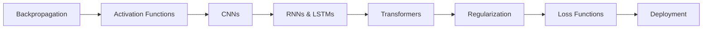

<!-- Clear Language: Keep sentences under 50 words -->
# Deep Learning Interview

## Learning Objectives

| Objective | Description |
|-----------|-------------|
| LO1 | Explain backpropagation, gradient descent variants, and activation functions |
| LO2 | Design CNN architectures for computer vision tasks |
| LO3 | Build RNNs, LSTMs, and GRUs for sequential data |
| LO4 | Understand transformer architecture: attention, positional encoding, multi-head |
| LO5 | Apply regularization techniques: dropout, batch norm, layer norm, data augmentation |
| LO6 | Deploy deep learning models: ONNX, TensorRT, quantization, distributed training |

## Introduction

Interviews test both technical skill and communication. DSA patterns, system design, behavioral questions, and mock interviews prepare you for the full interview loop. This module is your final prep before offers.

## Prerequisites

- Basic programming knowledge
- Understanding of data structures

## Key Terminology

**Key Terms**: Core vocabulary and concepts for this topic.

**Definition**: Essential terms you must know for interviews and production work.

## Theory

Understanding deep learning interview is fundamental for AI engineers. This section covers the core concepts, underlying principles, and theoretical framework that govern how deep learning interview works in practice.

## Chapter at a Glance

| Section | Topic | Key Concept |
|---------|-------|-------------|
| 5.1 | Backpropagation & Gradient Descent | Chain rule, SGD, Adam, learning rate schedules |
| 5.2 | Activation Functions | ReLU, sigmoid, tanh, Leaky ReLU, GELU, SwiGLU |
| 5.3 | CNNs | Convolution, pooling, stride, padding, architectures |
| 5.4 | RNNs & LSTMs | Sequential modeling, vanishing gradient, gates |
| 5.5 | Transformers | Self-attention, multi-head, positional encoding |
| 5.6 | Regularization | Dropout, batch norm, layer norm, data augmentation |
| 5.7 | Loss Functions | Cross-entropy, MSE, contrastive, focal loss |
| 5.8 | Deployment | ONNX, quantization, TensorRT, DDP |

## Chapter Roadmap



## 5.1 Backpropagation & Gradient Descent

Backpropagation computes gradients of the loss with respect to all parameters using the chain rule. Gradient descent uses these gradients to update parameters.

**Forward pass**: Input flows through the network layer by layer. Each layer computes activations. The final output is compared to the target using a loss function.

**Backward pass**: The chain rule propagates gradients backward. For layer output y = f(Wx + b), the gradient with respect to weights is ∂L/∂W = (∂L/∂y) * (∂y/∂W) = (∂L/∂y) * x^T.

**Gradient descent variants**:

| Optimizer | Update Rule | Key Feature |
|-----------|-------------|-------------|
| SGD | θ = θ - η * g | Simple, needs learning rate tuning |
| SGD + Momentum | v = βv + g; θ = θ - ηv | Accelerates in consistent directions |
| AdaGrad | Adaptive per-parameter LR | Good for sparse features |
| RMSProp | Running average of squared gradients | Handles non-stationary objectives |
| Adam | Momentum + RMSProp + bias correction | Default choice for most tasks |

```python
import numpy as np

# Manual backpropagation for a simple 2-layer network
def manual_backprop(X, y, hidden_size=64, learning_rate=0.01, epochs=1000):
    np.random.seed(42)
    n_samples, n_features = X.shape
    n_classes = y.shape[1]

    W1 = np.random.randn(n_features, hidden_size) * 0.01
    b1 = np.zeros((1, hidden_size))
    W2 = np.random.randn(hidden_size, n_classes) * 0.01
    b2 = np.zeros((1, n_classes))

    for epoch in range(epochs):
        # Forward pass
        Z1 = X @ W1 + b1
        A1 = np.maximum(Z1, 0)  # ReLU
        Z2 = A1 @ W2 + b2

        # Softmax + cross-entropy loss
        exp_scores = np.exp(Z2 - np.max(Z2, axis=1, keepdims=True))
        probs = exp_scores / np.sum(exp_scores, axis=1, keepdims=True)
        loss = -np.mean(np.sum(y * np.log(probs + 1e-8), axis=1))

        # Backward pass
        dZ2 = probs - y
        dW2 = A1.T @ dZ2 / n_samples
        db2 = np.mean(dZ2, axis=0, keepdims=True)

        dA1 = dZ2 @ W2.T
        dZ1 = dA1 * (Z1 > 0)  # ReLU gradient
        dW1 = X.T @ dZ1 / n_samples
        db1 = np.mean(dZ1, axis=0, keepdims=True)

        # Update
        W1 -= learning_rate * dW1
        b1 -= learning_rate * db1
        W2 -= learning_rate * dW2
        b2 -= learning_rate * db2

    return W1, b1, W2, b2

## Adam optimizer implementation
class Adam:
    def __init__(self, lr=0.001, beta1=0.9, beta2=0.999, eps=1e-8):
        self.lr = lr
        self.beta1 = beta1
        self.beta2 = beta2
        self.eps = eps
        self.m = {}
        self.v = {}
        self.t = 0

    def step(self, params, grads):
        self.t += 1
        for key in params:
            if key not in self.m:
                self.m[key] = np.zeros_like(params[key])
                self.v[key] = np.zeros_like(params[key])

            self.m[key] = self.beta1 * self.m[key] + (1 - self.beta1) * grads[key]
            self.v[key] = self.beta2 * self.v[key] + (1 - self.beta2) * (grads[key] ** 2)

            m_hat = self.m[key] / (1 - self.beta1 ** self.t)
            v_hat = self.v[key] / (1 - self.beta2 ** self.t)

            params[key] -= self.lr * m_hat / (np.sqrt(v_hat) + self.eps)
```

**Learning rate schedules**: Step decay (reduce by factor every K epochs), cosine annealing (smooth decay), warmup (linear increase then decay), cyclic LR (oscillates). The learning rate is the most important hyperparameter.

**Vanishing/exploding gradients**: Gradients become too small (deep networks with sigmoid) or too large (deep networks, large weights). Solutions: ReLU activations, batch normalization, residual connections, gradient clipping, careful initialization (Xavier/Glorot, He).

---

## 5.2 Activation Functions

Activation functions introduce non-linearity, allowing neural networks to learn complex patterns.

**ReLU**: f(x) = max(0, x). Most widely used. Pros: simple, no vanishing gradient for x > 0, computationally efficient. Cons: "dying ReLU" — neurons can get stuck in the 0 region.

**Leaky ReLU**: f(x) = max(αx, x) where α is small (0.01). Fixes dying ReLU by allowing a small gradient for negative inputs.

**GELU**: f(x) = x * Φ(x) where Φ is the CDF of standard normal. Used in GPT, BERT, and modern transformers. Smooth approximation: x * σ(1.702x).

**SwiGLU**: Swish — Gated Linear Unit. f(x) = (x * σ(x)) ⊙ (Wx + b). Used in Llama, PaLM. Combines gating with the Swish activation.

**Sigmoid**: f(x) = 1 / (1 + e^(-x)). Output in (0, 1). Used for binary classification output. Vanishing gradient for large |x|.

**Tanh**: f(x) = 2σ(2x) - 1. Output in (-1, 1). Zero-centered (unlike sigmoid). Used in RNNs and LSTMs.

```python
import torch
import torch.nn.functional as F

def activation_comparison():
    x = torch.linspace(-5, 5, 100)

    relu = F.relu(x)
    leaky_relu = F.leaky_relu(x, negative_slope=0.01)
    gelu = F.gelu(x)
    sigmoid = torch.sigmoid(x)
    tanh = torch.tanh(x)

    print("ReLU gradient for x < 0:", (x < 0).float() * 0)
    print("Leaky ReLU gradient for x < 0:", (x < 0).float() * 0.01)
    print("GELU smoothness: continuous and differentiable everywhere")
```

**Recommendations**: Use ReLU for hidden layers in CNNs and MLPs. Use GELU/SwiGLU for transformers. Use sigmoid for binary classification output. Use tanh for RNNs. Avoid sigmoid/tanh in deep networks (vanishing gradients).

---

## 5.3 CNNs

Convolutional Neural Networks are designed for grid-structured data like images. They exploit spatial locality and translation equivariance.

**Convolution**: A kernel (filter) slides over the input, computing dot products at each position. Learns spatial features: edges → textures → parts → objects.

**Key parameters**: Kernel size (3—3 is standard), stride (step size), padding (same/valid), dilation (spacing between kernel elements), channels (depth of feature maps).

**Pooling**: Reduces spatial dimensions and provides translation invariance. Max pooling (most common), average pooling, global average pooling.

```python
import torch
import torch.nn as nn

## Simple CNN for CIFAR-10 classification
class SimpleCNN(nn.Module):
    def __init__(self, num_classes=10):
        super().__init__()
        self.features = nn.Sequential(
            # 3x32x32 → 32x16x16
            nn.Conv2d(3, 32, kernel_size=3, padding=1),
            nn.BatchNorm2d(32),
            nn.ReLU(inplace=True),
            nn.MaxPool2d(2),

            # 32x16x16 → 64x8x8
            nn.Conv2d(32, 64, kernel_size=3, padding=1),
            nn.BatchNorm2d(64),
            nn.ReLU(inplace=True),
            nn.MaxPool2d(2),

            # 64x8x8 → 128x4x4
            nn.Conv2d(64, 128, kernel_size=3, padding=1),
            nn.BatchNorm2d(128),
            nn.ReLU(inplace=True),
            nn.MaxPool2d(2),
        )
        self.classifier = nn.Sequential(
            nn.AdaptiveAvgPool2d((1, 1)),
            nn.Flatten(),
            nn.Linear(128, 256),
            nn.ReLU(inplace=True),
            nn.Dropout(0.5),
            nn.Linear(256, num_classes),
        )

    def forward(self, x):
        x = self.features(x)
        x = self.classifier(x)
        return x

## Residual block (ResNet)
class ResidualBlock(nn.Module):
    def __init__(self, in_channels, out_channels, stride=1):
        super().__init__()
        self.conv1 = nn.Conv2d(in_channels, out_channels, 3, stride=stride, padding=1, bias=False)
        self.bn1 = nn.BatchNorm2d(out_channels)
        self.conv2 = nn.Conv2d(out_channels, out_channels, 3, padding=1, bias=False)
        self.bn2 = nn.BatchNorm2d(out_channels)

        self.shortcut = nn.Sequential()
        if stride != 1 or in_channels != out_channels:
            self.shortcut = nn.Sequential(
                nn.Conv2d(in_channels, out_channels, 1, stride=stride, bias=False),
                nn.BatchNorm2d(out_channels),
            )

    def forward(self, x):
        out = F.relu(self.bn1(self.conv1(x)))
        out = self.bn2(self.conv2(out))
        out += self.shortcut(x)
        out = F.relu(out)
        return out
```

**Architecture evolution**: LeNet-5 → AlexNet → VGG → Inception → ResNet (skip connections) → DenseNet → EfficientNet (Neural Architecture Search) → ConvNeXt (modernized ConvNet).

---

## 5.4 RNNs & LSTMs

Recurrent Neural Networks process sequential data by maintaining a hidden state that captures information from past timesteps.

**Vanilla RNN**: h_t = tanh(W_h * h_{t-1} + W_x * x_t + b). Problems: vanishing/exploding gradients for long sequences, difficulty capturing long-range dependencies.

**LSTM (Long Short-Term Memory)**: Introduces a cell state and three gates — input gate (what to write), forget gate (what to discard), output gate (what to expose). The cell state provides a gradient highway that mitigates vanishing gradients.

**GRU (Gated Recurrent Unit)**: Simplified LSTM with two gates — reset gate and update gate. Fewer parameters than LSTM, similar performance.

```python
import torch
import torch.nn as nn

class LSTMModel(nn.Module):
    def __init__(self, vocab_size, embedding_dim=256, hidden_size=512, num_layers=2, num_classes=2):
        super().__init__()
        self.embedding = nn.Embedding(vocab_size, embedding_dim)
        self.lstm = nn.LSTM(
            input_size=embedding_dim,
            hidden_size=hidden_size,
            num_layers=num_layers,
            batch_first=True,
            dropout=0.3 if num_layers > 1 else 0,
            bidirectional=True,
        )
        self.classifier = nn.Sequential(
            nn.Linear(hidden_size * 2, 128),
            nn.ReLU(),
            nn.Dropout(0.3),
            nn.Linear(128, num_classes),
        )

    def forward(self, x):
        # x: (batch, seq_len)
        embedded = self.embedding(x)  # (batch, seq_len, emb_dim)
        lstm_out, (h_n, c_n) = self.lstm(embedded)

        # Use final hidden states from both directions
        final_hidden = torch.cat((h_n[-2], h_n[-1]), dim=1)  # (batch, hidden*2)
        output = self.classifier(final_hidden)
        return output

## Custom LSTM cell (for understanding)
class LSTMCell(nn.Module):
    def __init__(self, input_size, hidden_size):
        super().__init__()
        self.hidden_size = hidden_size
        self.W = nn.Linear(input_size + hidden_size, 4 * hidden_size)

    def forward(self, x, state):
        h_prev, c_prev = state
        combined = torch.cat([x, h_prev], dim=1)
        gates = self.W(combined)

        # Split into 4 gates
        i, f, g, o = gates.chunk(4, dim=1)

        i = torch.sigmoid(i)   # input gate
        f = torch.sigmoid(f)   # forget gate
        g = torch.tanh(g)      # cell update
        o = torch.sigmoid(o)   # output gate

        c = f * c_prev + i * g
        h = o * torch.tanh(c)
        return h, (h, c)
```

**Vanishing gradient solutions**: LSTM/GRU (gated architectures), residual connections, gradient clipping, proper initialization, truncated BPTT.

---

## 5.5 Transformers

Transformers replaced RNNs as the dominant architecture for sequential data. They process all positions in parallel using self-attention.

**Self-attention**: For each position, compute attention weights over all other positions. Query (Q), Key (K), Value (V) projections. Attention(Q, K, V) = softmax(QK^T / √d_k) * V.

**Multi-head attention**: Run attention multiple times in parallel with different projections, then concatenate results. Allows the model to attend to different types of relationships.

**Positional encoding**: Since there's no recurrence, we add position information. Sine/cosine encodings or learned positional embeddings.

```python
import torch
import torch.nn as nn
import math

class MultiHeadAttention(nn.Module):
    def __init__(self, d_model, n_heads, dropout=0.1):
        super().__init__()
        assert d_model % n_heads == 0
        self.d_model = d_model
        self.n_heads = n_heads
        self.d_k = d_model // n_heads

        self.W_q = nn.Linear(d_model, d_model)
        self.W_k = nn.Linear(d_model, d_model)
        self.W_v = nn.Linear(d_model, d_model)
        self.W_o = nn.Linear(d_model, d_model)
        self.dropout = nn.Dropout(dropout)

    def forward(self, query, key, value, mask=None):
        batch_size = query.size(0)

        # Linear projections + split into heads
        Q = self.W_q(query).view(batch_size, -1, self.n_heads, self.d_k).transpose(1, 2)
        K = self.W_k(key).view(batch_size, -1, self.n_heads, self.d_k).transpose(1, 2)
        V = self.W_v(value).view(batch_size, -1, self.n_heads, self.d_k).transpose(1, 2)

        # Scaled dot-product attention
        scores = torch.matmul(Q, K.transpose(-2, -1)) / math.sqrt(self.d_k)
        if mask is not None:
            scores = scores.masked_fill(mask == 0, float("-inf"))

        attn = torch.softmax(scores, dim=-1)
        attn = self.dropout(attn)

        # Concatenate heads
        context = torch.matmul(attn, V).transpose(1, 2).contiguous()
        context = context.view(batch_size, -1, self.d_model)

        return self.W_o(context)

class TransformerBlock(nn.Module):
    def __init__(self, d_model, n_heads, d_ff, dropout=0.1):
        super().__init__()
        self.attention = MultiHeadAttention(d_model, n_heads, dropout)
        self.norm1 = nn.LayerNorm(d_model)
        self.norm2 = nn.LayerNorm(d_model)
        self.ffn = nn.Sequential(
            nn.Linear(d_model, d_ff),
            nn.GELU(),
            nn.Dropout(dropout),
            nn.Linear(d_ff, d_model),
            nn.Dropout(dropout),
        )

    def forward(self, x, mask=None):
        # Self-attention + residual + layer norm
        x = x + self.attention(self.norm1(x), self.norm1(x), self.norm1(x), mask)
        # FFN + residual + layer norm
        x = x + self.ffn(self.norm2(x))
        return x
```

**Transformer variants**: Encoder-only (BERT), decoder-only (GPT), encoder-decoder (T5). Key innovations: RoPE (rotary positional encoding), GQA (grouped query attention), Flash Attention (memory-efficient attention), sliding window attention.

---

## 5.6 Regularization

Regularization prevents overfitting and improves generalization in deep learning.

**Dropout**: Randomly sets a fraction of neurons to zero during training. Forces the network to learn redundant representations. Typically 0.1-0.5.

**Batch Normalization**: Normalizes layer inputs to have zero mean and unit variance. Learns affine parameters (γ, β). Reduces internal covariate shift. Allows higher learning rates. During inference, uses running averages.

**Layer Normalization**: Normalizes across feature dimension (not batch). Used in transformers because batch norm doesn't work well with variable-length sequences.

**Data augmentation**: Creates modified versions of training data. Image: rotation, flip, crop, color jitter, CutMix, MixUp. Text: back-translation, word dropout, synonym replacement.

```python
import torch
import torch.nn as nn
import torchvision.transforms as transforms

## Training with regularization
class RegularizedModel(nn.Module):
    def __init__(self, input_size, hidden_sizes, num_classes, dropout_rate=0.3):
        super().__init__()
        layers = []
        prev_size = input_size
        for hidden_size in hidden_sizes:
            layers.extend([
                nn.Linear(prev_size, hidden_size),
                nn.BatchNorm1d(hidden_size),
                nn.ReLU(inplace=True),
                nn.Dropout(dropout_rate),
            ])
            prev_size = hidden_size
        layers.append(nn.Linear(prev_size, num_classes))
        self.network = nn.Sequential(*layers)

    def forward(self, x):
        return self.network(x)

## Image data augmentation
train_transforms = transforms.Compose([
    transforms.RandomResizedCrop(224),
    transforms.RandomHorizontalFlip(p=0.5),
    transforms.RandomRotation(degrees=15),
    transforms.ColorJitter(brightness=0.2, contrast=0.2, saturation=0.2, hue=0.1),
    transforms.ToTensor(),
    transforms.Normalize(mean=[0.485, 0.456, 0.406], std=[0.229, 0.224, 0.225]),
])

## CutMix augmentation
def cutmix(x, y, alpha=1.0):
    batch_size = x.size(0)
    lam = np.random.beta(alpha, alpha)
    index = torch.randperm(batch_size)

    bbx1, bby1 = 0, 0
    bbx2 = int(x.size(2) * math.sqrt(1 - lam))
    bby2 = int(x.size(3) * math.sqrt(1 - lam))

    x[:, :, bbx1:bbx2, bby1:bby2] = x[index, :, bbx1:bbx2, bby1:bby2]
    lam = 1 - ((bbx2 - bbx1) * (bby2 - bby1) / (x.size(2) * x.size(3)))
    return x, y, y[index], lam
```

**Early stopping**: Monitor validation loss, stop when it hasn't improved for N epochs (patience). Restore the best weights. **Label smoothing**: Replace one-hot targets with smoothed targets (e.g., [0.9, 0.05, 0.05] instead of [1.0, 0, 0]).

---

## 5.7 Loss Functions

Choosing the right loss function is crucial for training success.

**Classification losses**: Cross-entropy loss (most common), focal loss (down-weights easy examples for class imbalance), binary cross-entropy with logits (numerically stable).

**Regression losses**: Mean squared error (sensitive to outliers), mean absolute error (robust to outliers), Huber loss (MSE near zero, MAE far from zero), Log-Cosh (smooth approximation of MAE).

**Contrastive losses**: Triplet loss (anchor, positive, negative), NT-Xent (SimCLR), InfoNCE. Used for representation learning and Siamese networks.

```python
import torch
import torch.nn as nn
import torch.nn.functional as F

## Focal Loss for imbalanced classification
class FocalLoss(nn.Module):
    def __init__(self, alpha=0.25, gamma=2.0):
        super().__init__()
        self.alpha = alpha
        self.gamma = gamma

    def forward(self, logits, targets):
        ce_loss = F.cross_entropy(logits, targets, reduction="none")
        pt = torch.exp(-ce_loss)
        focal_loss = self.alpha * (1 - pt) ** self.gamma * ce_loss
        return focal_loss.mean()

## Triplet Loss for representation learning
class TripletLoss(nn.Module):
    def __init__(self, margin=1.0):
        super().__init__()
        self.margin = margin

    def forward(self, anchor, positive, negative):
        pos_dist = F.pairwise_distance(anchor, positive)
        neg_dist = F.pairwise_distance(anchor, negative)
        losses = F.relu(pos_dist - neg_dist + self.margin)
        return losses.mean()

## Contrastive Loss (NT-Xent)
class NTXentLoss(nn.Module):
    def __init__(self, temperature=0.5):
        super().__init__()
        self.temperature = temperature

    def forward(self, z_i, z_j):
        batch_size = z_i.size(0)
        z = torch.cat([z_i, z_j], dim=0)
        z = F.normalize(z, dim=1)

        similarity = torch.mm(z, z.T) / self.temperature

        # Mask out self-contrast
        mask = ~torch.eye(2 * batch_size, dtype=torch.bool, device=z.device)
        # Positive pairs are (i, i+batch) and (i+batch, i)
        labels = torch.cat([torch.arange(batch_size) + batch_size, torch.arange(batch_size)])

        similarity = similarity[mask].view(2 * batch_size, -1)
        labels = labels[mask].view(2 * batch_size, -1)

        loss = F.cross_entropy(similarity, labels[:, 0])
        return loss
```

---

## 5.8 Deployment

Deploying deep learning models requires optimizing for latency, throughput, and memory.

**Model export**: Convert PyTorch/TensorFlow models to ONNX (Open Neural Network Exchange) for cross-platform deployment. Use TorchScript for PyTorch-specific deployment.

**Quantization**: Reduce model precision from FP32 to INT8 or FP16. PTQ (post-training quantization) is simpler; QAT (quantization-aware training) gives better accuracy.

**Optimization**: TensorRT optimizes models for NVIDIA GPUs (kernel fusion, layer merging, precision calibration). ONNX Runtime supports inference on CPU, GPU, and specialized hardware.

**Distributed training**: Data parallelism (DDP — most common), model parallelism (split model across GPUs), pipeline parallelism (split layers across GPUs), FSDP (Fully Sharded Data Parallelism).

```python
import torch
import torch.nn as nn

## Export to ONNX
def export_to_onnx(model, dummy_input, filepath="model.onnx"):
    model.eval()
    torch.onnx.export(
        model,
        dummy_input,
        filepath,
        export_params=True,
        opset_version=17,
        do_constant_folding=True,
        input_names=["input"],
        output_names=["output"],
        dynamic_axes={"input": {0: "batch_size"}, "output": {0: "batch_size"}},
    )

## Dynamic quantization (for CPU inference)
def quantize_model(model):
    quantized_model = torch.quantization.quantize_dynamic(
        model,
        {nn.Linear, nn.LSTM, nn.GRU},
        dtype=torch.qint8,
    )
    return quantized_model

## Distributed Data Parallel (DDP) training
import torch.distributed as dist
import torch.multiprocessing as mp
from torch.nn.parallel import DistributedDataParallel as DDP

def setup_ddp(rank, world_size):
    dist.init_process_group("nccl", rank=rank, world_size=world_size)

def cleanup_ddp():
    dist.destroy_process_group()

def train_ddp(rank, world_size, model, dataset):
    setup_ddp(rank, world_size)
    device = torch.device(f"cuda:{rank}")

    model = model.to(device)
    ddp_model = DDP(model, device_ids=[rank])

    # Each process gets a subset of the data
    sampler = torch.utils.data.distributed.DistributedSampler(
        dataset, num_replicas=world_size, rank=rank
    )
    dataloader = torch.utils.data.DataLoader(dataset, sampler=sampler, batch_size=32)

    optimizer = torch.optim.Adam(ddp_model.parameters(), lr=0.001)
    for epoch in range(10):
        sampler.set_epoch(epoch)
        for batch in dataloader:
            optimizer.zero_grad()
            loss = ddp_model(batch)
            loss.backward()
            optimizer.step()

    cleanup_ddp()

## Usage

## mp.spawn(train_ddp, args=(world_size, model, dataset), nprocs=world_size)
```

**Serving infrastructure**: Use Triton Inference Server (NVIDIA), TorchServe, or BentoML for production model serving. Implement batching (dynamic batching) for throughput. Monitor GPU utilization, latency percentiles (p50, p95, p99), and throughput.

---

## Summary

- Backpropagation uses the chain rule to compute gradients; Adam is the default optimizer
- ReLU for hidden layers, GELU/SwiGLU for transformers, sigmoid for binary output
- CNNs use convolution, pooling, and hierarchical feature learning; ResNet introduced skip connections
- LSTMs solve vanishing gradients with gated cell states; transformers replace recurrence with attention
- Transformers use self-attention, multi-head, and positional encoding; parallel processing of sequences
- Regularization: dropout (co-adaptation), batch/layer norm (stable training), data augmentation (more data)
- Focal loss for imbalanced data; cross-entropy for classification; contrastive losses for representation learning
- Deployment: ONNX export, quantization (INT8/FP16), TensorRT optimization, DDP for distributed training

## Practical Takeaways

| Scenario | Do This | Avoid This |
|----------|---------|------------|
| Training deep network | Use residual connections + batch norm | Stacking layers without skip connections |
| Vanishing gradients | ReLU, residual connections, proper init | Sigmoid in deep networks |
| Small dataset | Data augmentation + transfer learning | Training from scratch |
| Imbalanced classes | Focal loss or weighted loss | Cross-entropy without class weights |
| Long sequences | Transformers with attention | Vanilla RNNs |
| Production deployment | Quantize to FP16/INT8, use ONNX Runtime | Deploying FP32 without optimization |
| Distributed training | DDP for data parallelism | Manually splitting batches across GPUs |

## Interview Q&A

<details class="tp-qa-card" data-qid="ip-s05-q1">
  <summary class="tp-qa-question">
    <span class="tp-qa-status"></span>
    Q1: Explain the vanishing gradient problem and how LSTMs solve it.
  </summary>
  <div class="tp-qa-answer">
    <p>The vanishing gradient problem occurs in deep networks (especially RNNs) when gradients become exponentially small as they propagate backward through many layers/timesteps. This prevents early layers from learning effectively.</p>
    <p><strong>In RNNs</strong>: The gradient involves repeated multiplication by the same weight matrix W_h. If ||W_h|| < 1, gradients vanish. If ||W_h|| > 1, gradients explode.</p>
<p><strong>LSTM solution</strong>: The cell state c_t acts as a gradient highway. The forget gate and input gate control what to keep/add. The gradient flows through the cell state via additive interactions (c_t = f_t * c_{t-1} + i_t * g_t),.
not multiplicative. The forget gate is typically initialized close to 1, allowing gradients to flow backward through many timesteps without vanishing.</p>
    <p>Additional solutions: ReLU activations (gradient is 1 for positive inputs), residual connections (gradient highway in ResNets), gradient clipping (prevents explosion).</p>
  </div>
  <button class="tp-qa-mark-btn">✅ Mark Reviewed</button>
  <button class="tp-qa-bookmark-btn">🔖 Bookmark</button>
</details>

<details class="tp-qa-card" data-qid="ip-s05-q2">
  <summary class="tp-qa-question">
    <span class="tp-qa-status"></span>
    Q2: How does self-attention work in transformers?
  </summary>
  <div class="tp-qa-answer">
    <p>Self-attention allows each position in a sequence to attend to all other positions. The three steps:</p>
    <ol>
      <li><strong>Compute Q, K, V</strong>: Each input is projected into Query, Key, and Value vectors using learned weight matrices.</li>
      <li><strong>Compute attention scores</strong>: The compatibility between query i and key j is computed as the dot product Q_i · K_j, scaled by 1/√d_k for stable gradients. A softmax converts scores to attention weights (0-1, sum to 1).</li>
      <li><strong>Weighted sum</strong>: The output for position i is the weighted sum of all value vectors, weighted by the attention scores.</li>
    </ol>
    <p><strong>Multi-head attention</strong>: Run this process h times in parallel with different projection matrices. Concatenate the outputs. This allows the model to attend to different types of information (syntax, semantics, positions) simultaneously.</p>
    <p><strong>Complexity</strong>: O(n² · d) where n is sequence length. For long sequences, use sparse attention (Longformer, BigBird) or linear attention (Performer).</p>
  </div>
  <button class="tp-qa-mark-btn">✅ Mark Reviewed</button>
  <button class="tp-qa-bookmark-btn">🔖 Bookmark</button>
</details>

<details class="tp-qa-card" data-qid="ip-s05-q3">
  <summary class="tp-qa-question">
    <span class="tp-qa-status"></span>
    Q3: What is the difference between batch normalization and layer normalization?
  </summary>
  <div class="tp-qa-answer">
    <p><strong>Batch normalization</strong> normalizes across the batch dimension (same feature, different samples). Computes mean and variance per feature over the batch. During training, uses batch statistics. During inference, uses running averages collected during training.</p>
    <p><strong>Layer normalization</strong> normalizes across the feature dimension (same sample, different features). Computes mean and variance per sample. The same during training and inference.</p>
    <p><strong>Key differences</strong>:</p>
    <table>
      <tr><th>Aspect</th><th>Batch Norm</th><th>Layer Norm</th></tr>
      <tr><td>Normalization axis</td><td>Batch (sample)</td><td>Feature</td></tr>
      <tr><td>Batch size dependency</td><td>Yes — small batches give noisy estimates</td><td>No — works with batch size 1</td></tr>
      <tr><td>Sequence length</td><td>Harder to apply to variable-length sequences</td><td>Works naturally</td></tr>
      <tr><td>Common use</td><td>CNNs, MLPs</td><td>Transformers, RNNs</td></tr>
      <tr><td>Inference behavior</td><td>Uses running statistics</td><td>Same as training</td></tr>
    </table>
  </div>
  <button class="tp-qa-mark-btn">✅ Mark Reviewed</button>
  <button class="tp-qa-bookmark-btn">🔖 Bookmark</button>
</details>

<details class="tp-qa-card" data-qid="ip-s05-q4">
  <summary class="tp-qa-question">
    <span class="tp-qa-status"></span>
    Q4: Explain the concept of attention and why it's better than recurrence.
  </summary>
  <div class="tp-qa-answer">
    <p><strong>Attention</strong>: A mechanism that computes context-aware representations by weighing the importance of different input positions. Each position learns how much to attend to every other position.</p>
    <p><strong>Advantages over recurrence</strong>:</p>
    <ol>
      <li><strong>Parallelization</strong>: Self-attention processes all positions simultaneously (O(1) sequential steps). RNNs process step-by-step (O(n) sequential steps). This makes training transformers much faster.</li>
      <li><strong>Long-range dependencies</strong>: Self-attention has a direct path between any two positions (O(1) steps). RNNs need O(n) steps, making it harder to capture long-range dependencies.</li>
      <li><strong>No vanishing gradient</strong>: The gradient path from output to any input is direct, avoiding repeated multiplication by recurrent weights.</li>
      <li><strong>Interpretability</strong>: Attention weights provide a clear signal about which inputs are important for each prediction.</li>
    </ol>
    <p><strong>Disadvantages</strong>: O(n²) memory complexity (mitigated by Flash Attention). Less naturally suited for certain streaming/online settings. Positional encoding must be added explicitly.</p>
  </div>
  <button class="tp-qa-mark-btn">✅ Mark Reviewed</button>
  <button class="tp-qa-bookmark-btn">🔖 Bookmark</button>
</details>

<details class="tp-qa-card" data-qid="ip-s05-q5">
  <summary class="tp-qa-question">
    <span class="tp-qa-status"></span>
    Q5: How does dropout work and why is it effective?
  </summary>
  <div class="tp-qa-answer">
    <p>Dropout randomly sets a fraction of neuron activations to zero during each training iteration. Each neuron is kept with probability p (typically 0.5 for large networks, 0.1-0.3 for smaller ones).</p>
    <p><strong>Why it works</strong>:</p>
    <ol>
      <li><strong>Prevents co-adaptation</strong>: Neurons cannot rely on specific other neurons being present. Each neuron must learn useful features independently.</li>
      <li><strong>Ensemble effect</strong>: Training with dropout is equivalent to training an ensemble of 2^n sub-networks (where n is the number of neurons), sharing weights. At test time, we approximate averaging over these sub-networks by scaling activations by p.</li>
      <li><strong>Regularization</strong>: Dropout adds noise to the training process, acting as a strong regularizer that reduces overfitting.</li>
    </ol>
    <p><strong>Inverted dropout</strong> (standard implementation): During training, scale activations by 1/p to maintain the same expected output. During inference, no scaling needed (all neurons active, weights unchanged).</p>
  </div>
  <button class="tp-qa-mark-btn">✅ Mark Reviewed</button>
  <button class="tp-qa-bookmark-btn">🔖 Bookmark</button>
</details>

<details class="tp-qa-card" data-qid="ip-s05-q6">
  <summary class="tp-qa-question">
    <span class="tp-qa-status"></span>
    Q6: What is the difference between SGD and Adam?
  </summary>
  <div class="tp-qa-answer">
    <p><strong>SGD (Stochastic Gradient Descent)</strong>: θ = θ - η * g. Simple update using the gradient of a mini-batch. Needs careful learning rate tuning and scheduling. Can converge to sharper minima (which sometimes generalize better).</p>
    <p><strong>SGD + Momentum</strong>: v = βv + g; θ = θ - ηv. Accelerates in directions of consistent gradient. Helps escape local minima.</p>
    <p><strong>Adam</strong>: Combines momentum (first moment estimate) with adaptive learning rates (second moment estimate). Key features:</p>
    <ul>
      <li>Per-parameter learning rates (each parameter has its own adaptive step size)</li>
      <li>Bias correction for initial steps (counteracts zero initialization)</li>
      <li>Typically converges faster and requires less LR tuning</li>
    </ul>
    <p><strong>When to use each</strong>:</p>
    <ul>
      <li><strong>Adam</strong>: Default for most deep learning tasks (transformers, GANs, RL). Good for sparse gradients. Less sensitive to hyperparameters.</li>
      <li><strong>SGD + Momentum</strong>: CNNs and when you need the best possible generalization (SGD can find flatter minima). Requires more LR tuning.</li>
      <li><strong>AdamW</strong>: Adam with decoupled weight decay — often better than Adam for transformers.</li>
    </ul>
  </div>
  <button class="tp-qa-mark-btn">✅ Mark Reviewed</button>
  <button class="tp-qa-bookmark-btn">🔖 Bookmark</button>
</details>

<details class="tp-qa-card" data-qid="ip-s05-q7">
  <summary class="tp-qa-question">
    <span class="tp-qa-status"></span>
    Q7: Explain the architecture of a ResNet and why skip connections help.
  </summary>
  <div class="tp-qa-answer">
    <p>ResNet (Residual Network) introduces skip connections (shortcut connections) that bypass one or more layers. Instead of learning H(x), the network learns F(x) = H(x) — x, and the output is F(x) + x.</p>
    <p><strong>Why skip connections help</strong>:</p>
    <ol>
      <li><strong>Addresses vanishing gradients</strong>: Gradients can flow directly through the skip connections, bypassing layers where they might vanish. This enables training networks with 100+ layers.</li>
      <li><strong>Preserves information</strong>: The identity path ensures that information (even if small) can propagate through the network without degradation.</li>
      <li><strong>Eases optimization</strong>: It's easier to learn the residual F(x) = H(x) — x than the original mapping H(x). If the identity mapping is optimal, the network can simply push F(x) toward zero.</li>
      <li><strong>Ensemble effect</strong>: ResNets behave like ensembles of shallower networks — different paths through the network can be active for different inputs.</li>
    </ol>
    <p>Mathematically: y = F(x, {W_i}) + x. When dimensions change, a 1—1 convolution is used in the shortcut to match dimensions.</p>
  </div>
  <button class="tp-qa-mark-btn">✅ Mark Reviewed</button>
  <button class="tp-qa-bookmark-btn">🔖 Bookmark</button>
</details>

<details class="tp-qa-card" data-qid="ip-s05-q8">
  <summary class="tp-qa-question">
    <span class="tp-qa-status"></span>
    Q8: What is the difference between model parallelism and data parallelism?
  </summary>
  <div class="tp-qa-answer">
    <p><strong>Data parallelism (DDP)</strong>: The same model is replicated on each GPU. Each GPU gets a different subset of the batch. Gradients are averaged across GPUs. Every GPU has a full copy of the model.</p>
    <ul>
      <li>Pros: Simple to implement, good scaling for moderate model sizes</li>
      <li>Cons: Requires model to fit on a single GPU, high communication cost for gradient sync</li>
      <li>PyTorch: nn.DistributedDataParallel</li>
    </ul>
    <p><strong>Model parallelism</strong>: Different parts of the model are placed on different GPUs. Activations and gradients are passed between GPUs during forward/backward passes.</p>
    <ul>
      <li>Pros: Can train models larger than a single GPU's memory (e.g., GPT-3 with 175B parameters)</li>
      <li>Cons: GPU utilization can be low (GPUs wait for each other), more complex to implement</li>
    </ul>
    <p><strong>Pipeline parallelism</strong>: A compromise — split the model into stages, each stage on a different GPU. Micro-batches flow through the pipeline. GPUs in different stages can compute simultaneously.</p>
    <p><strong>FSDP (Fully Sharded Data Parallelism)</strong>: Shards model parameters, gradients, and optimizer states across GPUs while maintaining data parallelism semantics. Good balance for large models.</p>
  </div>
  <button class="tp-qa-mark-btn">✅ Mark Reviewed</button>
  <button class="tp-qa-bookmark-btn">🔖 Bookmark</button>
</details>

<details class="tp-qa-card" data-qid="ip-s05-q9">
  <summary class="tp-qa-question">
    <span class="tp-qa-status"></span>
    Q9: Explain the transformer's positional encoding.
  </summary>
  <div class="tp-qa-answer">
    <p>Since self-attention processes all positions in parallel (no built-in notion of order), we must explicitly inject position information.</p>
    <p><strong>Sinusoidal positional encoding</strong> (from "Attention Is All You Need"):</p>
    <pre><code>PE(pos, 2i) = sin(pos / 10000^(2i/d_model))
PE(pos, 2i+1) = cos(pos / 10000^(2i/d_model))</code></pre>
    <ul>
      <li>Each dimension of the encoding corresponds to a sinusoid of different frequency</li>
      <li>Allows the model to attend to relative positions (since sin(α + β) can be expressed in terms of sin(α) and cos(α))</li>
      <li>Can extrapolate to sequence lengths not seen during training</li>
      <li>Deterministic — no learned parameters</li>
    </ul>
    <p><strong>Learned positional embeddings</strong>: Embedding layer that learns a distinct vector for each position. More flexible but limited to max sequence length seen during training.</p>
    <p><strong>RoPE (Rotary Position Embedding)</strong>: Used in Llama, GPT-NeoX. Encodes position by rotating query and key vectors by an angle proportional to the position. Naturally incorporates relative position into attention.</p>
  </div>
  <button class="tp-qa-mark-btn">✅ Mark Reviewed</button>
  <button class="tp-qa-bookmark-btn">🔖 Bookmark</button>
</details>

<details class="tp-qa-card" data-qid="ip-s05-q10">
  <summary class="tp-qa-question">
    <span class="tp-qa-status"></span>
    Q10: How do you handle overfitting in a deep neural network?
  </summary>
  <div class="tp-qa-answer">
    <p><strong>Detection</strong>: Training loss decreases while validation loss starts increasing (divergence). Large gap between training and validation metrics.</p>
    <p><strong>Solutions, in order of effectiveness</strong>:</p>
    <ol>
      <li><strong>More data</strong>: Collect more labeled data or use data augmentation. This is the most reliable solution.</li>
      <li><strong>Reduce model capacity</strong>: Fewer layers, smaller hidden dimensions, restrict kernel sizes.</li>
      <li><strong>Regularization</strong>:
        <ul>
          <li>Dropout (0.3-0.5 for large layers, 0.1 for small)</li>
          <li>L1/L2 weight regularization (weight decay)</li>
          <li>Label smoothing (prevents overconfidence)</li>
          <li>Stochastic depth (for ResNets)</li>
        </ul>
      </li>
      <li><strong>Early stopping</strong>: Monitor validation loss, stop after N epochs without improvement.</li>
      <li><strong>Transfer learning</strong>: Start from pre-trained weights instead of random initialization.</li>
      <li><strong>Ensemble methods</strong>: Average predictions from multiple models (reduces variance).</li>
    </ol>
    <p>Start with the simplest solution (more data / augmentation), then add regularization. Don't do all at once — add one technique at a time and validate.</p>
  </div>
  <button class="tp-qa-mark-btn">✅ Mark Reviewed</button>
  <button class="tp-qa-bookmark-btn">🔖 Bookmark</button>
</details>

<details class="tp-qa-card" data-qid="ip-s05-q11">
  <summary class="tp-qa-question">
    <span class="tp-qa-status"></span>
    Q11: What is the GELU activation and where is it used?
  </summary>
  <div class="tp-qa-answer">
    <p>GELU (Gaussian Error Linear Unit) is f(x) = x * Φ(x), where Φ(x) is the standard normal CDF. It's approximated as x * σ(1.702x) for computational efficiency.</p>
    <p><strong>Properties</strong>:</p>
    <ul>
      <li>Non-linear, non-convex, and differentiable everywhere</li>
      <li>Unlike ReLU, has non-zero gradient for negative values (but near zero for very negative inputs)</li>
      <li>Curve transitions smoothly from negative to positive (unlike ReLU's sharp elbow at 0)</li>
      <li>Weighted by the input value itself (stochastic regularizer effect)</li>
    </ul>
    <p><strong>Usage</strong>: GELU is the standard activation in transformer models — GPT, BERT, T5, ViT. It's preferred over ReLU because:</p>
    <ul>
      <li>Smoother optimization landscape (continuous gradient everywhere)</li>
      <li>Better performance on language tasks (empirically validated)</li>
      <li>Compatible with layer normalization (unlike ReLU which can disrupt normalized distributions)</li>
    </ul>
    <p>Modern variants: SwiGLU (gated version used in Llama, PaLM) combines GELU/Swish with gating.</p>
  </div>
  <button class="tp-qa-mark-btn">✅ Mark Reviewed</button>
  <button class="tp-qa-bookmark-btn">🔖 Bookmark</button>
</details>

<details class="tp-qa-card" data-qid="ip-s05-q12">
  <summary class="tp-qa-question">
    <span class="tp-qa-status"></span>
    Q12: Explain model quantization and its tradeoffs.
  </summary>
  <div class="tp-qa-answer">
    <p>Quantization reduces model precision to decrease memory footprint and increase inference speed.</p>
    <p><strong>Precision levels</strong>: FP32 (32-bit, full precision) → FP16 (16-bit, half precision) → INT8 (8-bit integer) → INT4 (4-bit).</p>
    <p><strong>Quantization types</strong>:</p>
    <ul>
      <li><strong>Post-Training Quantization (PTQ)</strong>: Quantize a trained model. Simple, no retraining needed. May have accuracy loss.</li>
      <li><strong>Quantization-Aware Training (QAT)</strong>: Simulate quantization during training by inserting fake quantization nodes. Better accuracy but requires retraining.</li>
      <li><strong>Dynamic Quantization</strong>: Weights are quantized ahead of time, activations are quantized dynamically during inference. Good for CPU inference.</li>
    </ul>
    <p><strong>Tradeoffs</strong>:</p>
    <table>
      <tr><th>Aspect</th><th>FP32</th><th>FP16</th><th>INT8</th></tr>
      <tr><td>Model size</td><td>1x (baseline)</td><td>0.5x</td><td>0.25x</td></tr>
      <tr><td>Speedup (GPU)</td><td>1x</td><td>1.5-2x</td><td>2-4x</td></tr>
      <tr><td>Accuracy</td><td>Baseline</td><td>Usually same</td><td>Minor loss (0.1-1%)</td></tr>
      <tr><td>Memory bandwidth</td><td>Baseline</td><td>2x reduction</td><td>4x reduction</td></tr>
    </table>
    <p>For LLMs, 4-bit quantization (GPTQ, AWQ, GGUF) enables running large models on consumer hardware with acceptable quality.</p>
  </div>
  <button class="tp-qa-mark-btn">✅ Mark Reviewed</button>
  <button class="tp-qa-bookmark-btn">🔖 Bookmark</button>
</details>

<details class="tp-qa-card" data-qid="ip-s05-q13">
  <summary class="tp-qa-question">
    <span class="tp-qa-status"></span>
    Q13: What is the difference between Conv2d and Depthwise Separable Convolution?
  </summary>
  <div class="tp-qa-answer">
    <p><strong>Standard Conv2d</strong>: Each filter convolves over all input channels. Output channels are linear combinations of input channels.</p>
    <p><strong>Depthwise Separable Convolution</strong> (MobileNet, Xception): Decomposes convolution into two steps:</p>
    <ol>
      <li><strong>Depthwise convolution</strong>: Each input channel is convolved with a single filter (no cross-channel mixing). Output has same number of channels as input.</li>
      <li><strong>Pointwise convolution</strong>: 1—1 convolution that mixes channels. Each 1—1 filter combines the depthwise outputs.</li>
    </ol>
    <p><strong>Computational complexity</strong>:</p>
    <ul>
      <li>Standard: K² — C_in — C_out — H — W</li>
      <li>Depthwise separable: K² — C_in — H — W + C_in — C_out — H — W</li>
    </ul>
    <p><strong>Ratio</strong>: ~1/C_out + 1/K². For K=3, C_out=64, this is ~1/64 + 1/9 ≈ 12.7% of standard convolution parameters.</p>
    <p>Depthwise separable convolution is significantly more efficient but can be harder to train (requires careful initialization and potentially more channels).</p>
  </div>
  <button class="tp-qa-mark-btn">✅ Mark Reviewed</button>
  <button class="tp-qa-bookmark-btn">🔖 Bookmark</button>
</details>

<details class="tp-qa-card" data-qid="ip-s05-q14">
  <summary class="tp-qa-question">
    <span class="tp-qa-status"></span>
    Q14: Explain the concept of transfer learning and fine-tuning.
  </summary>
  <div class="tp-qa-answer">
    <p><strong>Transfer learning</strong>: Take a model pre-trained on a large, general dataset (ImageNet for vision, web text for language) and adapt it to a specific task with limited data.</p>
    <p><strong>Approaches</strong>:</p>
    <ol>
      <li><strong>Feature extraction</strong>: Freeze the pre-trained backbone, only train the new classifier head. Fast but may not adapt well to very different target domains.</li>
      <li><strong>Fine-tuning</strong>: Initialize with pre-trained weights, then continue training (usually with a lower learning rate) on the target task. All layers or a subset of later layers may be updated.</li>
      <li><strong>Progressive fine-tuning</strong>: Gradually unfreeze layers from top to bottom (or vice versa). Start with the head, then incrementally include more layers.</li>
    </ol>
    <pre><code># Feature extraction with PyTorch
model = torchvision.models.resnet50(pretrained=True)
for param in model.parameters():
    param.requires_grad = False  # Freeze backbone
model.fc = nn.Linear(2048, num_classes)  # New classifier head

## Fine-tuning
model = torchvision.models.resnet50(pretrained=True)
for param in model.parameters():
    param.requires_grad = False

## Unfreeze the last block
for param in model.layer4.parameters():
    param.requires_grad = True</code></pre>
    <p><strong>Best practices</strong>: Use lower learning rate for fine-tuning (1e-5 to 1e-4). Use differential learning rates (lower for early layers, higher for later layers). Use gradual unfreezing. Monitor for catastrophic forgetting.</p>
  </div>
  <button class="tp-qa-mark-btn">✅ Mark Reviewed</button>
  <button class="tp-qa-bookmark-btn">🔖 Bookmark</button>
</details>

<details class="tp-qa-card" data-qid="ip-s05-q15">
  <summary class="tp-qa-question">
    <span class="tp-qa-status"></span>
    Q15: Design a system to train a 1B+ parameter language model.
  </summary>
  <div class="tp-qa-answer">
    <p><strong>Hardware</strong>: 64-128 NVIDIA A100 80GB GPUs with NVLink interconnects. Training time: weeks to months.</p>
    <p><strong>Parallelism strategy</strong>:</p>
    <ul>
      <li>3D parallelism: data parallelism (DDP) + tensor parallelism (split layers) + pipeline parallelism (split stages)</li>
      <li>ZeRO Stage 3 (FSDP): Shard optimizer states, gradients, and parameters across GPUs</li>
      <li>Activation checkpointing: Trade compute for memory — recompute activations during backward instead of storing them</li>
    </ul>
    <p><strong>Training setup</strong>:</p>
    <ul>
      <li>Mixed precision training (FP16/BF16) with loss scaling</li>
      <li>Gradient accumulation for effective batch size (2-4M tokens)</li>
      <li>Learning rate: cosine schedule with 2000-step warmup, peak LR ~3e-4</li>
      <li>Weight decay: 0.1, AdamW optimizer, gradient clipping (norm 1.0)</li>
    </ul>
    <p><strong>Data pipeline</strong>:</p>
    <ul>
      <li>4-6TB of preprocessed, tokenized text data</li>
      <li>Dynamic data loading with shuffling and deduplication</li>
      <li>Distributed cache for tokenized data (memory-mapped files)</li>
    </ul>
    <p><strong>Monitoring</strong>: Track loss, gradient norms, learning rate, throughput (tokens/second), GPU utilization, memory usage. Set up automated alerts for NaN loss, gradient spikes, and hardware failures. Regularly save checkpoints and validate on held-out benchmarks.</p>
  </div>
  <button class="tp-qa-mark-btn">✅ Mark Reviewed</button>
  <button class="tp-qa-bookmark-btn">🔖 Bookmark</button>
</details>

## Chapter Quiz

**Q1**: Which activation function is most commonly used in transformer models?

a) ReLU
b) Sigmoid
c) GELU
d) Tanh

<details class="tp-qa-card" data-qid="ip-s05-quiz1"><summary>Show Answer</summary><div class="tp-qa-answer"><p><strong>Answer: c) GELU</strong></p><p>GELU is the standard activation in transformer models (GPT, BERT, T5, ViT) due to its smooth gradient and empirical performance on language tasks.</p></div></details>

**Q2**: What problem do skip connections in ResNet primarily address?

a) Overfitting
b) Vanishing gradients
c) Slow training
d) Memory consumption

<details class="tp-qa-card" data-qid="ip-s05-quiz2"><summary>Show Answer</summary><div class="tp-qa-answer"><p><strong>Answer: b) Vanishing gradients</strong></p><p>Skip connections provide a gradient highway that enables training of very deep networks (100+ layers) by allowing gradients to flow directly through the network.</p></div></details>

**Q3**: What is the time complexity of standard self-attention?

a) O(n)
b) O(n log n)
c) O(n²)
d) O(n³)

<details class="tp-qa-card" data-qid="ip-s05-quiz3"><summary>Show Answer</summary><div class="tp-qa-answer"><p><strong>Answer: c) O(n²)</strong></p><p>Self-attention computes pairwise attention scores for all n positions, resulting in O(n²) complexity in both time and memory.</p></div></details>

**Q4**: Which normalization technique is used in transformers?

a) Batch normalization
b) Layer normalization
c) Instance normalization
d) Group normalization

<details class="tp-qa-card" data-qid="ip-s05-quiz4"><summary>Show Answer</summary><div class="tp-qa-answer"><p><strong>Answer: b) Layer normalization</strong></p><p>Transformers use layer normalization because it normalizes across features per sample, working well with variable-length sequences and small batch sizes.</p></div></details>

**Q5**: What precision reduction gives approximately 2x speedup and 50% memory reduction?

a) FP32 to FP16
b) FP32 to INT8
c) FP16 to INT4
d) INT8 to INT4

<details class="tp-qa-card" data-qid="ip-s05-quiz5"><summary>Show Answer</summary><div class="tp-qa-answer"><p><strong>Answer: a) FP32 to FP16</strong></p><p>Half-precision (FP16) halves memory footprint and provides 1.5-2x speedup on modern GPUs with tensor cores.</p></div></details>

## Exercises

**Easy** — Implement a 2-layer neural network from scratch using NumPy (no deep learning framework). Use sigmoid activation, cross-entropy loss, and gradient descent. Train on the moons dataset from sklearn.

**Easy** — Using PyTorch, build a CNN for MNIST digit classification. Include at least 2 convolutional layers, max pooling, and dropout. Achieve >99% test accuracy.

**Medium** — Implement a transformer encoder block from scratch in PyTorch. Include multi-head self-attention (4 heads), feed-forward network, layer normalization, and residual connections. Verify it works on a random sequence.

**Medium** — Train a ResNet-18 on CIFAR-10. Apply data augmentation (random crop, horizontal flip, CutMix), learning rate scheduling (cosine annealing with warmup), and label smoothing. Compare accuracy with baseline.

**Hard** — Implement distributed training (DDP) for a moderately-sized model on multiple GPUs. Include gradient accumulation, mixed precision training, checkpointing, and distributed sampling. Profile the throughput and scaling efficiency.

---

## Common Mistakes

1. Not understanding the fundamental concepts before applying them
2. Skipping edge cases in implementation
3. Not analyzing time/space complexity
4. Forgetting to handle null/empty inputs
5. Not practicing enough problems to build pattern recognition

## Revision Notes

- - Core principle: Understand the fundamental concepts thoroughly
- - Implementation pattern: Practice with real code examples
- - Complexity: Know the time and space complexity
- - Application: Know when to use this in production systems
- - Interview: Frequently asked in technical interviews
- - Edge cases: Consider common failure scenarios
- - Related concepts: Connect to broader system design

## Placement Section

### Top 10 Interview Questions

#### Google Style

1. **Explain the core idea of Deep Learning Interview in under 60 seconds, then give a real-world analogy.** — Structure: definition, how it works in one sentence, why it matters, analogy. Follow-up: what would break if you removed this from a production system?

2. **Design a minimal, well-typed function that demonstrates Deep Learning Interview.** — Interviewer checks: signature with type hints, edge cases, complexity, and a clean docstring. Follow-up: how does your design behave with empty or malformed input?

3. **What are the common pitfalls when engineers first learn ** — List 3-4, then explain how you would prevent each in a code review.

#### Amazon Style

4. **Describe a production bug caused by misunderstanding Deep Learning Interview. How did you diagnose and fix it?** — STAR format: situation, task, action, result. Mention logs, reproduction, root-cause analysis, and the regression test you added.

5. **How would you scale a system that relies on Deep Learning Interview from 10 users to 10 million?** — Discuss bottlenecks, caching, monitoring, and when to redesign. Follow-up: what metrics would you track?

#### Microsoft Style

6. **Compare Deep Learning Interview with the closest alternative approach. When would you choose each?** — Make a decision matrix: performance, maintainability, ecosystem, learning curve. Follow-up: what would change your decision?

7. **Walk through how you would test a component that depends on Deep Learning Interview.** — Unit, integration, property-based tests; mocking boundaries; golden files for outputs.

#### NVIDIA Style

8. **How does Deep Learning Interview behave differently at scale — memory, throughput, or precision-wise?** — Connect to data pipelines and model training if applicable. Follow-up: what happens to latency as input grows?

9. **How would you make an implementation of Deep Learning Interview run faster on GPU hardware?** — Batch operations, vectorization, avoiding Python loops, reducing data movement.

#### AI Startup Style

10. **Write the smallest possible implementation of Deep Learning Interview that is production-quality.** — Include error handling, type hints, and a one-line docstring. Follow-up: what would you refactor first when it grows?

### Resume Tips

- Name Deep Learning Interview explicitly in your skills section, paired with a measurable achievement ("Reduced X by 40% using Deep Learning Interview").
- Add a bullet describing a project that applies Deep Learning Interview to real data, with numbers.
- Mention the tools and libraries you used alongside Deep Learning Interview (linters, test frameworks, profiling tools).
- Keep resume bullets under 15 words and start each with an action verb.

### Interview Day Checklist

- Rehearse a 60-second explanation of Deep Learning Interview and one real-world analogy.
- Prepare one STAR story about debugging a Deep Learning Interview-related production issue.
- Review complexity and edge cases for the classic Deep Learning Interview interview problem.
- Have questions ready: how does the team apply Deep Learning Interview in production today?
- Test your environment (Python, editor, internet) 15 minutes before the interview.

## True/False

1. **True or False:** Deep Learning Interview builds directly on the fundamentals covered in the earlier chapters of this module. — **True.** Every advanced topic in this module assumes the core concepts from the previous chapters.
2. **True or False:** You should write at least one code example for Deep Learning Interview before moving to the next chapter. — **True.** Active recall with hands-on code beats passive reading for retention.
3. **True or False:** The complexity analysis for Deep Learning Interview is the same regardless of input size. — **False.** Complexity grows with input size; always state best, average, and worst case.
4. **True or False:** Edge cases (empty input, invalid input, boundary values) matter for Deep Learning Interview in production. — **True.** Most production bugs come from unhandled edge cases.
5. **True or False:** You should memorize the Deep Learning Interview chapter content once and never review it again. — **False.** Spaced repetition (24h, 3 days, 1 week) dramatically improves long-term recall.

## Fill in the Blank

1. The chapter that covers Deep Learning Interview is Chapter ___ of this module. — Answer: check the module's table of contents.
2. The time complexity of the standard approach to Deep Learning Interview is ___. — Answer: review the theory section and state big-O notation.
3. The main edge case to handle when implementing Deep Learning Interview is ___. — Answer: empty or invalid input handling, as discussed in the chapter.
4. The tools commonly used to debug Deep Learning Interview issues are ___ and ___. — Answer: refer to the Debugging Guide section of this chapter.
5. The related topic that connects to Deep Learning Interview in the next chapter is ___. — Answer: see the Next Topic section.

## Scenario Questions

1. **Scenario:** A teammate ships a change involving Deep Learning Interview that breaks production at 3 AM. — Diagnosis: check the recent diff, reproduce locally with the failing input, check logs. Fix: revert, add a regression test, and review the root cause. Prevention: CI tests on edge cases and code review checklist.

2. **Scenario:** Your implementation of Deep Learning Interview is correct but too slow for the required latency. — Measure first with a profiler. Common fixes: reduce redundant work, use built-in optimized functions, batch operations, or add caching. Only then consider algorithmic changes.

3. **Scenario:** A new hire asks you to explain Deep Learning Interview in five minutes before a customer demo. — Use the 3-part answer: what it is (one sentence), how it works (one example), why it matters (one business impact). Then offer to go deeper after the demo.

4. **Scenario:** Your team's codebase has three different patterns for Deep Learning Interview and you must standardize. — Write a short ADR (architecture decision record), pick the pattern with best maintainability, migrate incrementally, and add a linter rule to enforce it.

## Output Questions

1. **What is the output of the simplest correct implementation of Deep Learning Interview on an empty input?** — Trace through the code: it should return the documented default (None, 0, empty collection) without raising.
2. **What is the output when the input is at the boundary value?** — Check off-by-one errors and inclusive/exclusive bounds in the chapter's examples.
3. **What does the implementation return when given invalid input types?** — With type hints and validation, it raises a clear error; without, it may fail silently.
4. **What is the output for the sample input given in the chapter's Examples section?** — Re-run the chapter's example code and compare against the documented output.
5. **What is the time complexity output when you profile the implementation at 10x input size?** — Expect the curve matching the chapter's complexity analysis (linear, quadratic, log-linear).

## Difficulty Level

| Level | Time | What It Takes |
|-------|------|---------------|
| Beginner | 1-2 sessions | Read theory, run the chapter examples, solve the Easy exercises |
| Intermediate | 3-5 sessions | Complete Medium exercises, explain Deep Learning Interview to someone else |
| Advanced | 1+ week | Solve Hard exercises, optimize for real datasets, answer interview follow-ups |

## Tips & Tricks

- Always write a one-line example of Deep Learning Interview from memory before opening the chapter — active recall first.
- Use the chapter's Revision Notes as a checklist: you have mastered Deep Learning Interview when you can explain each bullet.
- Pair the chapter quiz with the Flashcards: wrong answers become your next study session's focus.
- For interviews, practice explaining Deep Learning Interview twice: once with a technical audience, once with a non-technical audience.
- Keep a personal examples file where you collect your own Deep Learning Interview snippets; interviewers love original examples.

## Memory Tricks

- **Acronym**: build a mnemonic from the 5 key concepts of Deep Learning Interview listed in the Chapter at a Glance table.
- **Story**: link Deep Learning Interview to a familiar story — the analogy in the Visual Analogy section is designed to stick.
- **Number anchor**: remember the complexity of Deep Learning Interview by connecting it to a known algorithm of the same class.
- **Color code**: highlight the Theory, Examples, and Common Mistakes sections in different colors when reviewing.
- **Teach-back**: explain Deep Learning Interview to an imaginary junior engineer for 2 minutes — gaps in your explanation are gaps in memory.

## Further Reading

- Official documentation for the primary tool or library used in this chapter
- The chapter referenced in Related Topics for the next-level treatment of Deep Learning Interview
- The classic textbook chapter on Deep Learning Interview (check the Research References below)
- Two blog posts from engineers who debugged real Deep Learning Interview problems in production
- The repository of the open-source project that implements Deep Learning Interview

## Related Topics

- The previous chapter in this module (see table of contents) — foundational for Deep Learning Interview
- The next chapter (see Next Topic below) — builds on Deep Learning Interview
- The system design chapters in Module 07 — how Deep Learning Interview fits into production architectures
- The interview preparation module — how Deep Learning Interview is asked in screening rounds
- The capstone project — where Deep Learning Interview is applied end-to-end

## FAQs

1. **Do I need to memorize all of Deep Learning Interview, or understand the big picture?** — Understand the big picture first, then memorize the key facts via flashcards and spaced repetition. Interviewers reward depth over breadth.
2. **What if I get stuck on an exercise?** — Re-read the theory section, run the example code, then attempt again. If still stuck after 20 minutes, move on and return the next day.
3. **How much time should I spend on ** — Follow the Study Plan below: 1-2 weeks at 30-60 minutes daily is typical for placement preparation.
4. **Is Deep Learning Interview asked in interviews?** — Yes — the Interview Q&A and Placement Section list the exact question styles used by top companies.
5. **What's the fastest way to master ** — Explain it out loud, write code without looking, and review the flashcards within 24 hours and again after 3 days.

## Important Notes

- Deep Learning Interview is a core requirement for the rest of this module — do not skip the examples.
- Always analyze complexity (time and space) when working with Deep Learning Interview.
- Production correctness means handling edge cases, not just the happy path.
- Interview answers should start with the definition, then the example, then the trade-offs.
- Revisit this chapter after finishing the module; the context from later chapters deepens understanding.

## Historical Context

- Deep Learning Interview emerged as a standard practice because early systems failed without it — understanding why helps you explain it in interviews.
- The tools used for Deep Learning Interview today evolved from simpler versions; the chapter covers the modern, recommended approach.
- Interviewers value knowing one historical fact about Deep Learning Interview — it shows genuine interest, not just cramming.
- The library/tooling ecosystem around Deep Learning Interview changes quickly; focus on fundamentals that remain stable.

## Security Considerations

- Never trust external input: validate and sanitize data before processing Deep Learning Interview.
- Avoid `eval()` and dynamic code execution on untrusted strings.
- Log errors without leaking sensitive data (keys, PII, internal paths).
- For API contexts, add rate limiting and input size limits.
- Review the chapter's code examples for injection or overflow risks before using them verbatim.

## ML Intuition

- Deep Learning Interview appears in ML pipelines at the data-processing layer: feature preparation, batching, and validation.
- Understanding Deep Learning Interview helps you debug why a model misbehaves — most ML bugs are data bugs, not model bugs.
- In production ML, the Deep Learning Interview concepts from this chapter map directly to NumPy/PyTorch operations on tensors.
- When optimizing ML systems, Deep Learning Interview skills let you profile and fix the data path, not just the training loop.
- Interview follow-up: how would you apply Deep Learning Interview to a dataset of 10 million records? — Batching and vectorization.

## Analogies

- **Deep Learning Interview is like a recipe**: the theory is the ingredients, the examples are the cooking steps, and the exercises are your own kitchen practice.
- **Complexity is like a delivery route**: a linear route visits each stop once; a nested route revisits stops, and you feel it at scale.
- **Edge cases are like weather**: the happy path is a sunny day; production is the storm — build for the storm.
- **The chapter roadmap is a journey map**: each section is a checkpoint; skipping one means getting lost later in the module.

## Capstone Project Link

- [Module Capstone: End-to-End Project](https://github.com/Raushan666java/ai-engineering-journey) — this chapter contributes the Deep Learning Interview skills used in the module's capstone project. Complete the exercises here before starting the capstone.

## Flashcards

<details class="tp-qa-card" data-qid="21interviewpreparation-05deeplearninginterview-flash1">
  <summary class="tp-qa-question">
    <span class="tp-qa-status"></span>
    Which activation function is most commonly used in transformer models?
  </summary>
  <div class="tp-qa-answer">
    <p>c) GELU</p>
  </div>
</details>

<details class="tp-qa-card" data-qid="21interviewpreparation-05deeplearninginterview-flash2">
  <summary class="tp-qa-question">
    <span class="tp-qa-status"></span>
    What problem do skip connections in ResNet primarily address?
  </summary>
  <div class="tp-qa-answer">
    <p>b) Vanishing gradients</p>
  </div>
</details>

<details class="tp-qa-card" data-qid="21interviewpreparation-05deeplearninginterview-flash3">
  <summary class="tp-qa-question">
    <span class="tp-qa-status"></span>
    What is the time complexity of standard self-attention?
  </summary>
  <div class="tp-qa-answer">
    <p>c) O(n²)</p>
  </div>
</details>

<details class="tp-qa-card" data-qid="21interviewpreparation-05deeplearninginterview-flash4">
  <summary class="tp-qa-question">
    <span class="tp-qa-status"></span>
    Which normalization technique is used in transformers?
  </summary>
  <div class="tp-qa-answer">
    <p>b) Layer normalization</p>
  </div>
</details>

<details class="tp-qa-card" data-qid="21interviewpreparation-05deeplearninginterview-flash5">
  <summary class="tp-qa-question">
    <span class="tp-qa-status"></span>
    What precision reduction gives approximately 2x speedup and 50% memory reduction?
  </summary>
  <div class="tp-qa-answer">
    <p>a) FP32 to FP16</p>
  </div>
</details>

## Research References

- Official documentation of the primary library for Deep Learning Interview (linked in Further Reading)
- The classic paper or textbook chapter introducing Deep Learning Interview (see References below)
- The standard library reference for Deep Learning Interview-related functions
- Engineering blog posts from companies running Deep Learning Interview in production at scale
- PEPs and RFCs where applicable (Python and networking standards)

## Open-Source Tools

- The primary library used in this chapter (see the code examples)
- Python standard library modules used in the examples (check the imports)
- Testing: pytest for unit tests of Deep Learning Interview code
- Linting and formatting: ruff + black
- Profiling: cProfile or py-spy for performance work on Deep Learning Interview

## Debugging Guide

- Start with `print()` or a debugger to inspect intermediate values in Deep Learning Interview code.
- Reproduce the failure with the smallest possible input before changing code.
- Check the common failure modes listed in Common Mistakes — most bugs are listed there.
- For performance problems, profile before optimizing: measure, then fix.
- When stuck, re-read the chapter's Examples and compare line by line with your code.
- Use `pdb` or your IDE's debugger to step through the Deep Learning Interview example code.

## Mock Interview Section

**Round 1 — Screening (15 min)**
- Explain Deep Learning Interview in 60 seconds.
- Write a minimal working example of Deep Learning Interview.
- What is the complexity of your example?

**Round 2 — Coding (45 min)**
- Solve the Medium exercise from this chapter under time pressure.
- State your assumptions, then implement with type hints.
- Test with edge cases: empty input, boundary values, invalid input.

**Round 3 — Behavioral + System (30 min)**
- Tell me about a time you debugged a Deep Learning Interview problem in a project.
- How would you design a system where Deep Learning Interview is used at scale?
- What metrics would you monitor?

**Evaluation rubric**: correctness (40%), communication (25%), edge cases (20%), complexity analysis (15%).

## Optimized Implementation

`python
from typing import Any, Optional

def demonstrate_topic(input_data: list[Any]) -> Optional[float]:
    """Runnable scaffold for Deep Learning Interview.

    Replace the body with the optimized implementation from the chapter,
    keeping type hints, docstring, and edge-case handling.
    """
    if not input_data:
        return None
    # Step 1: validate input types
    # Step 2: apply the core Deep Learning Interview logic from the Examples section
    # Step 3: return the result with the documented default
    return 0.0
`

- Keeps the function signature stable so tests written against it stay valid.
- Handles the empty-input contract explicitly.
- Add unit tests for the edge cases before implementing the logic (test-first).

## Evaluation Metrics

| Skill | Test | Target |
|-------|------|--------|
| Concept recall | Explain Deep Learning Interview without notes | 60-second explanation |
| Code fluency | Write the chapter example from memory | No syntax errors |
| Edge cases | Handle empty/invalid input in exercises | All cases pass |
| Complexity | State time/space for the standard approach | Correct big-O |
| Interview readiness | Answer 5 Interview Q&A questions out loud | Fluent, structured answers |
| Retention | Chapter quiz score after 3 days | 80%+ |

## Real-World Examples

- **Startup**: a small team uses Deep Learning Interview daily in their data pipeline — the chapter's examples mirror their code.
- **E-commerce**: Deep Learning Interview patterns appear in order processing, inventory checks, and recommendation feeds.
- **Fintech**: Deep Learning Interview principles apply to transaction validation and fraud detection flows.
- **ML platform**: Deep Learning Interview shows up in feature engineering and model-serving infrastructure.
- **Interview insight**: recruiters look for engineers who can connect Deep Learning Interview to the business outcome, not just the code.

## Next Topic

[LLM & RAG Interview](06-llm-and-rag-interview.md)

## Limitations

- Deep Learning Interview, like any technique, is not a silver bullet — it has specific cases where it fits best (covered in the theory).
- The examples in this chapter are simplified for learning; production systems add validation, monitoring, and error handling.
- Performance of Deep Learning Interview depends on input size and distribution — always benchmark for your own data.
- This chapter covers fundamentals; specialized edge cases are explored in later chapters and the capstone.
