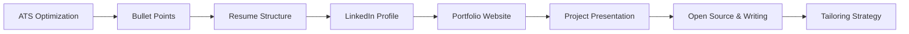
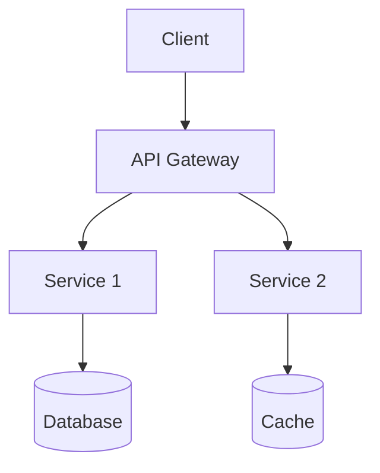

<!-- Clear Language: Keep sentences under 50 words -->
# Resume & Portfolio Review

## Learning Objectives

| Objective | Description |
|-----------|-------------|
| LO1 | Optimize your resume for ATS (Applicant Tracking Systems) |
| LO2 | Structure your resume with impact-driven bullet points |
| LO3 | Design an effective portfolio website that showcases your work |
| LO4 | Write a powerful LinkedIn profile that attracts recruiters |
| LO5 | Present projects, open-source contributions, and technical writing |
| LO6 | Tailor your resume and portfolio for specific roles and companies |

## Chapter at a Glance

| Section | Topic | Key Concept |
|---------|-------|-------------|
| 10.1 | ATS Optimization | Keywords, formatting, file types, section headers |
| 10.2 | Bullet Points | Impact-driven writing, CAR method, quantifying achievements |
| 10.3 | Resume Structure | Sections, order, length, spacing, font choices |
| 10.4 | LinkedIn Profile | Headline, summary, experience, recommendations, SEO |
| 10.5 | Portfolio Website | Project showcase, blog, architecture, tech stack |
| 10.6 | Project Presentation | README, demo, tech choices, architecture docs |
| 10.7 | Open Source & Writing | Contributions, blog posts, talks, community presence |
| 10.8 | Tailoring Strategy | Role-specific resumes, cover letters, company research |

## Chapter Roadmap



## 10.1 ATS Optimization

Applicant Tracking Systems parse resumes before humans see them. If your resume isn't ATS-friendly, it may never reach a recruiter.

**Keywords**: Include keywords from the job description naturally in your resume. Common keywords for AI/backend roles: Python, distributed systems, REST APIs, microservices, AWS, Docker, Kubernetes, PostgreSQL, Redis, machine learning, CI/CD, Terraform, Kafka.

**Formatting rules**:
- Use standard section headers: "Experience", "Education", "Skills", "Projects"
- No tables, columns, or multi-column layouts
- No images, icons, or graphics
- Use standard fonts (Arial, Calibri, Times New Roman)
- Save as .docx or .pdf (use text-based, not scanned)
- Use bullet points (standard round dots, not custom characters)

```python

## ATS keyword matching tool
import re

def analyze_ats_score(resume_text: str, job_description: str) -> dict:
    resume_lower = resume_text.lower()
    jd_lower = job_description.lower()

    # Extract keywords from job description (capitalized words, technical terms)
    tech_keywords = set()
    for word in re.findall(r'\b[A-Za-z#+.]+\b', jd_lower):
        if any(c.isupper() for c in word) or word in RESUME_KEYWORDS:
            tech_keywords.add(word.lower())

    # Core technical keywords (comprehensive list)
    core_keywords = {
        "python", "typescript", "java", "go", "rust", "c++",
        "aws", "gcp", "azure", "docker", "kubernetes", "terraform",
        "postgresql", "mysql", "mongodb", "redis", "dynamodb",
        "kafka", "rabbitmq", "elasticsearch",
        "fastapi", "flask", "django", "spring", "express",
        "react", "angular", "vue",
        "machine learning", "deep learning", "nlp", "llm", "rag",
        "pytorch", "tensorflow", "scikit-learn",
        "ci/cd", "jenkins", "github actions", "gitlab ci",
        "sql", "nosql", "rest", "graphql", "grpc",
    }

    matched = {kw for kw in core_keywords if kw in resume_lower}
    job_keywords = {kw for kw in core_keywords if kw in jd_lower}
    missing = job_keywords - matched

    score = len(matched) / max(len(job_keywords), 1) * 100

    return {
        "ats_score": round(score, 1),
        "matched_keywords": sorted(matched),
        "missing_keywords": sorted(missing),
        "suggestions": [
            f"Add keyword: {kw}" for kw in sorted(missing)[:10]
        ],
    }

## Usage
resume = "Senior Backend Engineer with 6 years of Python experience..."
job = "We're looking for a Backend Engineer with Python, AWS, and PostgreSQL skills..."
result = analyze_ats_score(resume, job)
print(f"ATS Score: {result['ats_score']}%")
print(f"Missing: {result['missing_keywords']}")
```

**ATS tests**: Paste your resume into a plain text file (Notepad) to see how a parser reads it. If sections are jumbled or text is missing, reformat. Run through jobscan.co or similar ATS simulators.

---

## 10.2 Bullet Points

Every bullet point should demonstrate impact. Use the CAR method: Challenge → Action → Result.

**Weak**: "Worked on the payment system"
**Strong**: "Redesigned the payment processing pipeline using Python and Kafka, reducing failed transactions by 40% and saving $200K/year in chargebacks"

**Formula**: [Action verb] [what you did] using [tech/tools], resulting in [quantified impact].

**Powerful action verbs**: Designed, Architected, Led, Optimized, Implemented, Migrated, Automated, Reduced, Improved, Built, Delivered, Spearheaded, Transformed.

```python

## Bullet point generator
def improve_bullet_point(weak: str, verb: str, tech: str, metric: str) -> str:
    return f"{verb} {weak.lower().lstrip('worked on ')} using {tech}, {metric}"

## Examples
weak_bullets = [
    "Worked on the recommendation system",
    "Helped with database migrations",
    "Was responsible for CI/CD pipeline",
    "Participated in code reviews",
    "Fixed bugs in the API",
]

improvements = [
    improve_bullet_point(weak_bullets[0], "Built", "Python, Spark, and collaborative filtering",
                         "improving recommendation accuracy by 25% and increasing user engagement by 15%"),
    improve_bullet_point(weak_bullets[1], "Led", "zero-downtime migration strategies",
                         "migrating 50M+ records across 12 services with zero customer impact"),
    improve_bullet_point(weak_bullets[2], "Designed and implemented", "GitHub Actions, Docker, and Terraform",
                         "reducing deployment time from 45 minutes to 8 minutes"),
    improve_bullet_point(weak_bullets[3], "Established", "code review best practices across a 6-person team",
                         "reducing production bugs by 60% and cutting review cycle time in half"),
    improve_bullet_point(weak_bullets[4], "Optimized", "async processing and caching strategies",
                         "reducing API p99 latency from 2.3s to 320ms"),
]

for i, (weak, strong) in enumerate(zip(weak_bullets, improvements)):
    print(f"Before: {weak}")
    print(f"After:  {strong}\n")
```

**Quantification rules**: Use specific numbers when possible (seconds, percentages, dollars). Use estimated ranges if exact numbers aren't known ("reduced costs by ~30%"). Compare to a baseline ("cut latency from 2s to 300ms"). Include scale ("served 10M API requests/day").

---

## 10.3 Resume Structure

A well-structured resume guides the reader's eye and highlights the most important information.

**Standard sections (in order)**:

1. **Contact**: Name, phone, email, LinkedIn, GitHub, portfolio URL. No full address (city/state is sufficient).
2. **Summary** (optional, 2-3 lines): For experienced candidates. "Backend Engineer with 6+ years of experience building scalable distributed systems. Proficient in Python, Go, and cloud infrastructure. Led teams of 3-5 engineers."
3. **Technical Skills**: Categorized (Languages, Frameworks, Databases, Cloud, Tools). Group by proficiency level if needed.
4. **Experience**: Reverse chronological. Company, role, dates, location. 3-5 bullet points per role. Focus on most recent 2-3 roles.
5. **Projects**: 2-3 significant projects. Name, description, tech stack, impact/outcome.
6. **Education**: Degree, school, year. GPA if impressive (3.5+). Relevant coursework.
7. **Additional**: Publications, talks, open source, certifications, languages.

```python

## Resume section validation
def validate_resume_sections(resume_sections: dict) -> list[str]:
    issues = []
    required = ["contact", "experience"]
    recommended = ["skills", "education"]
    nice_to_have = ["summary", "projects", "certifications"]

    for section in required:
        if section not in resume_sections:
            issues.append(f"MISSING REQUIRED: {section}")

    for section in recommended:
        if section not in resume_sections:
            issues.append(f"MISSING RECOMMENDED: {section}")

    # Check for common issues
    if "experience" in resume_sections:
        exp = resume_sections["experience"]
        issues.extend(_check_experience(exp))

    if "projects" in resume_sections:
        proj = resume_sections["projects"]
        issues.extend(_check_projects(proj))

    return issues

def _check_experience(exp: list) -> list[str]:
    issues = []
    for role in exp:
        if len(role.get("bullets", [])) < 3:
            issues.append(f"Role '{role.get('title')}' has fewer than 3 bullet points")
        for bullet in role.get("bullets", []):
            if not any(c.isdigit() for c in bullet):
                issues.append(f"Bullet may lack quantifiable impact: '{bullet[:50]}...'")
    return issues

def _check_projects(proj: list) -> list[str]:
    issues = []
    for p in proj:
        if not p.get("url"):
            issues.append(f"Project '{p.get('name')}' lacks GitHub/demo URL")
        if not p.get("tech_stack"):
            issues.append(f"Project '{p.get('name')}' missing tech stack")
    return issues
```

**Length guidelines**: <5 years experience: 1 page. 5-10 years: 1-2 pages. 10+ years: 2 pages max. Recruiters spend 6-7 seconds scanning a resume — put the most important information at the top.

---

## 10.4 LinkedIn Profile

LinkedIn is where recruiters find you. An optimized profile dramatically increases inbound opportunities.

**Headline**: Don't just list your title. Include what you do and key skills. "Senior Backend Engineer | Python, Go, Distributed Systems, AWS | Building Scalable AI Infrastructure"

**About section**: 3-4 short paragraphs telling your story. First paragraph: who you are and what you do. Second: key achievements and impact. Third: what you're looking for. Include relevant keywords naturally.

**Experience**: Mirror your resume but expand slightly. Use the same strong bullet points. Have colleagues write recommendations (2-3 recommendations = significantly higher engagement).

```python

## LinkedIn profile optimizer
def optimize_linkedin_sections(sections: dict) -> dict:
    suggestions = {}

    # Headline
    headline = sections.get("headline", "")
    if len(headline.split("|")) < 2:
        suggestions["headline"] = "Add role + key skills + what you build with separators"
    if not any(tech in headline.lower() for tech in ["python", "go", "aws", "ml", "ai"]):
        suggestions["headline_tech"] = "Consider adding key technologies to your headline"

    # About
    about = sections.get("about", "")
    if len(about) < 200:
        suggestions["about"] = "Expand About section to 3-4 paragraphs"
    if not about.strip().endswith(("?", ".", "!")):
        suggestions["about_end"] = "End with a clear call-to-action"

    # Skills
    skills = sections.get("skills", [])
    if len(skills) < 10:
        suggestions["skills"] = "Add more skills (aim for 15-20 relevant ones)"

    # Recommendations
    recommendations = sections.get("recommendations", 0)
    if recommendations < 2:
        suggestions["recommendations"] = "Request 2-3 recommendations from colleagues"

    return suggestions

## Skills to add (backend/AI focus)
RECOMMENDED_LINKEDIN_SKILLS = [
    "Python", "Go", "TypeScript",
    "Amazon Web Services (AWS)", "Docker", "Kubernetes",
    "PostgreSQL", "Redis", "MongoDB",
    "REST APIs", "GraphQL", "gRPC",
    "Microservices", "Distributed Systems",
    "Machine Learning", "Deep Learning",
    "System Design", "Software Architecture",
    "CI/CD", "Terraform", "Git",
    "Apache Kafka", "Elasticsearch",
]
```

**LinkedIn SEO tips**: Set your location to a tech hub (San Francisco Bay Area, New York, Seattle, Austin, London). Keep your profile set to "Open to Work" (visible only to recruiters). Post or.
share technical content weekly. Engage with others' posts (meaningful comments, not just likes). Connect with recruiters at target companies.

---

## 10.5 Portfolio Website

A portfolio website showcases your work, personality, and technical skills. It's often the first thing a technical interviewer will check.

**Essential pages**:
- **Home**: Brief intro, key skills, call-to-action (contact or view projects)
- **About**: Extended background, interests, what you're looking for
- **Projects**: 3-5 featured projects with descriptions, tech stacks, and live/demo links
- **Blog** (optional): Technical writing shows depth of knowledge and communication skills
- **Contact**: Email, social links, contact form

```python

## Portfolio project card template
def project_card(name: str, description: str, tech_stack: list[str], highlights: list[str],
                 github_url: str = None, live_url: str = None, image_url: str = None) -> str:
    tech_badges = " ".join(f'<span class="tech-badge">{t}</span>' for t in tech_stack)
    highlights_list = "\n".join(f"<li>{h}</li>" for h in highlights)

    return f"""
<div class="project-card">
    {"" if image_url else ""}
    <h3>{name}</h3>
    <p>{description}</p>
    <div class="tech-stack">{tech_badges}</div>
    <ul>{highlights_list}</ul>
    <div class="links">
        {"<a href='" + github_url + "' target='_blank'>GitHub</a>" if github_url else ""}
        {"<a href='" + live_url + "' target='_blank'>Live Demo</a>" if live_url else ""}
    </div>
</div>"""

## Example
print(project_card(
    name="RAG-Powered Documentation Search",
    description="Enterprise documentation search system using Retrieval-Augmented Generation. Indexes 10K+ documents and provides natural language answers with source citations.",
    tech_stack=["Python", "FastAPI", "LangChain", "ChromaDB", "OpenAI", "Docker"],
    highlights=[
        "Answers 95% of queries within 2 seconds",
        "Reduced support ticket volume by 40%",
        "Handles 500+ concurrent users with p99 latency <500ms",
    ],
    github_url="https://github.com/username/rag-docs",
    live_url="https://demo.example.com",
))
```

**Technical implementation**: Use a static site generator (Next.js, Hugo, Astro) for performance. Deploy via Vercel, Netlify, or GitHub Pages. Add Google Analytics (or Plausible) for traffic tracking. Include a link to your GitHub and LinkedIn.

**Design principles**: Clean and minimal. Fast loading (<2 seconds). Mobile-responsive. Good contrast and readability. Consistent typography. Don't use heavy frameworks that slow down your site.

---

## 10.6 Project Presentation

How you present your projects matters as much as the project itself. A well-documented project shows professionalism and attention to detail.

**GitHub README**: Your README is the entry point. Include: project name and one-line description, detailed description with screenshots, tech stack, architecture diagram (Mermaid), setup instructions, API documentation (if applicable), and contribution guidelines.

```python

## README template
README_TEMPLATE = """# {project_name}

{one_line_description}

## Overview

{2-3 paragraph description of what the project does and why it matters}

## Architecture

```


## Tech Stack

- **Backend**: {tech_stack_backend}
- **Frontend**: {tech_stack_frontend}
- **Database**: {tech_stack_db}
- **Infrastructure**: {tech_stack_infra}

## Features

- {feature_1}
- {feature_2}
- {feature_3}

## Getting Started

### Prerequisites
- Python 3.11+, Docker, PostgreSQL

### Installation
```bash
git clone https://github.com/{username}/{repo}
cd {repo}
docker-compose up
```

### Configuration
Copy `.env.example` to `.env` and fill in the required values.

## Key Terminology

**Key Terms**: Core vocabulary and concepts for this topic.

**Definition**: Essential terms you must know for interviews and production work.

## Theory

Understanding resume and portfolio review is fundamental for AI engineers. This section covers the core concepts, underlying principles, and theoretical framework that govern how resume and portfolio review works in practice.

## API Documentation

| Method | Endpoint | Description |
|--------|----------|-------------|
| GET | /api/v1/resource | List resources |
| POST | /api/v1/resource | Create resource |
| GET | /api/v1/resource/:id | Get resource by ID |

## Performance

- p50 latency: 50ms
- p99 latency: 200ms
- Throughput: 1000 req/s per instance
- Uptime: 99.95%

## Testing

```bash
pytest tests/ --cov=src --cov-report=term-missing
```

## Deployment

Deployed on AWS ECS with Terraform. CI/CD via GitHub Actions.

## Related

- [Blog post about this project](link-to-blog)
- [Related project 1](link)
"""

## Project quality checklist
def project_quality_score(project: dict) -> dict:
    score = 0
    checks = []

    # README
    if project.get("has_readme"):
        score += 15
        checks.append("README present")
    if project.get("has_setup_instructions"):
        score += 10
        checks.append("Setup instructions")
    if project.get("has_screenshots"):
        score += 10
        checks.append("Screenshots")

    # Code quality
    if project.get("has_tests"):
        score += 15
        checks.append("Tests")
    if project.get("has_type_hints"):
        score += 10
        checks.append("Type hints")
    if project.get("has_linting"):
        score += 5
        checks.append("Linting configured")

    # Deployment
    if project.get("has_demo"):
        score += 15
        checks.append("Live demo")
    if project.get("has_ci_cd"):
        score += 10
        checks.append("CI/CD pipeline")

    # Documentation
    if project.get("has_api_docs"):
        score += 10
        checks.append("API documentation")
    if project.get("has_architecture_diagram"):
        score += 10
        checks.append("Architecture diagram")

    return {"score": score, "checks": checks, "max": 100}
```text

**Demo best practices**: Deploy to a free tier (Railway, Render, Fly.io). Include test credentials in the README. Add a demo video (Loom) for complex workflows. Make the demo self-contained (no local setup required).

---

## 10.7 Open Source & Writing

Open source contributions and technical writing demonstrate community engagement, collaboration, and communication skills.

**Open source contributions**: Start with documentation improvements (easiest to get accepted). Fix bugs in libraries you use. Add tests or examples. Contribute to projects aligned with your interests. Consistent small contributions are better than one large PR that never merges.

**Types of contributions**: Bug fixes, feature implementation, documentation, tests, code reviews, issue triage, community support (answering questions).

**Technical blogging**: Shows communication skills and depth of knowledge. Topics: how you solved a specific problem, architecture decisions, comparisons of technologies, tutorials, case studies.

```
```python

## Blog post topic generator
def generate_blog_topics(skills: list[str], experiences: list[str]) -> list[str]:
    topics = []

    # Performance/optimization stories
    for exp in experiences:
        if any(w in exp.lower() for w in ["optimized", "reduced", "improved", "migrated"]):
            topics.append(f"How I optimized {exp}")

    # Architecture decisions
    for skill in skills:
        topics.extend([
            f"Comparing {skill} vs alternatives: when to use which",
            f"Building production-ready systems with {skill}",
            f"Common mistakes with {skill} and how to avoid them",
        ])

    # Tutorials
    topics.extend([
        "Building a RAG system from scratch in Python",
        "Dockerizing a FastAPI application for production",
        "Setting up CI/CD with GitHub Actions for a Python project",
        "A complete guide to system design interviews",
    ])

    return topics[:15]

## Example
skills = ["FastAPI", "LangChain", "PostgreSQL", "Docker", "Redis"]
experiences = ["Optimized API latency by 86%", "Migrated monolith to microservices"]
topics = generate_blog_topics(skills, experiences)
for topic in topics:
    print(f"- {topic}")
```

**Where to publish**: Medium (built-in audience), Dev.to (developer community), Hashnode (custom domain), Substack (newsletter), or your own blog (full control). Cross-post to LinkedIn for additional reach. Consistency matters more than perfection — aim for one post every 2-4 weeks.

---

## 10.8 Tailoring Strategy

A generic resume sent to every company is less effective than a tailored one. Customization shows genuine interest and increases match rate.

**Company research**: Read the job description (highlight requirements and keywords). Research the company's tech stack (engineering blog, GitHub, StackShare). Understand their product and business model.

**Customization approach**:
- **Skills section**: Reorder to emphasize skills the job requires. Add missing keywords if you have the experience.
- **Experience**: Reorder bullet points to highlight relevant achievements. Add context that connects to the specific role.
- **Projects**: Include projects most relevant to the role. Add a "Relevant Experience" section if changing domains.

```python

## Resume tailoring tool
def tailor_resume(base_resume: dict, job_description: str) -> dict:
    jd_lower = job_description.lower()
    tailored = {"experience": [], "skills": [], "projects": []}

    # Prioritize skills mentioned in the job description
    for skill in base_resume.get("skills", []):
        priority = 1 if skill.lower() in jd_lower else 0
        tailored["skills"].append({"name": skill, "priority": priority})
    tailored["skills"].sort(key=lambda s: s["priority"], reverse=True)

    # Select and order experience based on relevance
    for exp in base_resume.get("experience", []):
        relevance = sum(1 for kw in jd_lower.split() if kw in exp.get("description", "").lower())
        tailored["experience"].append({**exp, "relevance": relevance})
    tailored["experience"].sort(key=lambda e: e["relevance"], reverse=True)

    # Select projects matching job keywords
    for proj in base_resume.get("projects", []):
        tech_text = " ".join(proj.get("tech_stack", [])).lower()
        if any(tech in jd_lower for tech in tech_text.split()):
            tailored["projects"].append(proj)

    return tailored

## Cover letter generator
def generate_cover_letter(role: str, company: str, your_skills: list[str],
                          company_tech: list[str], specific_reason: str) -> str:
    return f"""Dear Hiring Manager,

I'm excited to apply for the {role} position at {company}.

My background includes {', '.join(your_skills[:3])}, which directly maps to the requirements in your job description. I've built similar systems at scale — for example, [specific achievement].

I'm particularly drawn to {company} because {specific_reason}. The opportunity to work with {', '.join(company_tech[:3])} aligns perfectly with my expertise and career goals.

I'd love to discuss how my experience with [key skill] can help {company} achieve [specific company goal].

Best regards,
[Your Name]"""

## Example
print(generate_cover_letter(
    role="Senior Backend Engineer",
    company="AI Platform Co.",
    your_skills=["distributed systems", "Python", "Kubernetes", "machine learning infrastructure"],
    company_tech=["Go", "Kafka", "PyTorch", "Kubernetes"],
    specific_reason="your focus on building real-time ML infrastructure that serves millions of predictions per second"
))
```

**Application tracking**: Use a spreadsheet to track applications — company, role, date applied, follow-up date, status, notes. Apply to 10-15 companies in parallel. Follow up after 1 week if no response.

---

## Summary

- ATS optimization: standard formatting, keywords from job description, .docx or text-based PDF
- Bullet points: Challenge → Action → Result with quantified metrics
- Resume structure: contact → summary → skills → experience → projects → education
- LinkedIn: keyword-rich headline, expanded About section, 15-20 skills, 2-3 recommendations
- Portfolio: clean design, 3-5 featured projects with README, live demos, and architecture docs
- Project presentation: detailed README, setup instructions, API docs, tests, CI/CD, screenshots
- Open source: start with docs and small bug fixes, consistent contributions, blog about what you learn
- Tailoring: customize for each role, highlight relevant experience, track applications

## Practical Takeaways

| Scenario | Do This | Avoid This |
|----------|---------|------------|
| ATS screening | Use standard formatting + job description keywords | Tables, columns, images |
| Most recent job | 4-5 detailed bullet points with metrics | Generic responsibilities |
| Career change | Highlight transferable skills, add projects | Applying with unchanged resume |
| No professional experience | Strong projects, open source, certifications | Leaving resume empty |
| LinkedIn profile | Custom headline, detailed experience, posts | Same title as everyone else |
| Portfolio projects | Live demo + README + architecture diagram | Unfinished or abandoned projects |
| Applying to many roles | Track applications, tailor per company | Sending the same resume everywhere |

## Interview Q&A

<details class="tp-qa-card" data-qid="ip-s10-q1">
  <summary class="tp-qa-question">
    <span class="tp-qa-status"></span>
    Q1: Should my resume be one page or two pages?
  </summary>
  <div class="tp-qa-answer">
    <p><strong>Guideline by experience level</strong>:</p>
    <ul>
      <li><strong>0-5 years</strong>: 1 page. You likely don't have enough experience to fill 2 pages without padding.</li>
      <li><strong>5-10 years</strong>: 1-2 pages. If you can fit everything relevant on 1 page, keep it at 1. If you have significant achievements across multiple roles, 2 pages is fine.</li>
      <li><strong>10+ years</strong>: 2 pages max. Focus on the most recent 10-12 years. Earlier roles can be summarized without bullet points.</li>
    </ul>
    <p><strong>Key rule</strong>: Every line should add value. If you have a 2-page resume, ask yourself: "Would the recruiter miss this line if I removed it?" If the answer is no, remove it.</p>
    <p>Recruiters spend 6-7 seconds scanning a resume. Put your most impressive achievements at the top. If your resume is 2 pages, make sure the first page alone would make someone want to interview you.</p>
  </div>
  <button class="tp-qa-mark-btn">✅ Mark Reviewed</button>
  <button class="tp-qa-bookmark-btn">🔖 Bookmark</button>
</details>

<details class="tp-qa-card" data-qid="ip-s10-q2">
  <summary class="tp-qa-question">
    <span class="tp-qa-status"></span>
    Q2: How do I list technical skills on my resume?
  </summary>
  <div class="tp-qa-answer">
    <p><strong>Group by category</strong> for readability:</p>
    <pre><code>Languages: Python, Go, TypeScript, SQL
Frameworks: FastAPI, LangChain, PyTorch
Databases: PostgreSQL, Redis, MongoDB, Elasticsearch
Cloud & DevOps: AWS (ECS, RDS, Lambda), Docker, Kubernetes, Terraform
Tools: Kafka, Git, GitHub Actions, Datadog, Prometheus</code></pre>
    <p><strong>Do not use skill bars or rating scales</strong> (e.g., "Python: 4/5 stars"). These are subjective and waste space. The recruiter will evaluate your proficiency from your experience descriptions and interview performance.</p>
    <p><strong>Include 15-20 skills</strong>. List the most relevant skills first. If a skill is critical to the job you're applying for, make sure it appears both in your skills section AND in your experience bullet points.</p>
    <p><strong>Honesty policy</strong>: Only list skills you could discuss fluently in an interview. If you'd struggle to answer a question about it, don't list it.</p>
  </div>
  <button class="tp-qa-mark-btn">✅ Mark Reviewed</button>
  <button class="tp-qa-bookmark-btn">🔖 Bookmark</button>
</details>

<details class="tp-qa-card" data-qid="ip-s10-q3">
  <summary class="tp-qa-question">
    <span class="tp-qa-status"></span>
    Q3: How do I quantify my achievements if I don't have exact numbers?
  </summary>
  <div class="tp-qa-answer">
    <p><strong>Strategy 1 — Relative measures</strong>:</p>
    <ul>
      <li>"Significantly improved system reliability" → better, but still vague</li>
      <li>"Reduced deployment time from 45 minutes to under 10 minutes" → strong</li>
    </ul>
    <p><strong>Strategy 2 — Approximations</strong>:</p>
    <ul>
      <li>"Served approximately 10M API requests per day"</li>
      <li>"Managed a fleet of 50+ microservices"</li>
      <li>"Led a team of 5-8 engineers"</li>
    </ul>
    <p><strong>Strategy 3 — Use available data</strong>:</p>
    <ul>
      <li>GitHub: commits, PRs merged, lines of code</li>
      <li>Monitoring: latency, error rates, uptime</li>
      <li>Team metrics: deployment frequency, lead time, MTTR</li>
    </ul>
    <p><strong>Strategy 4 — Business impact</strong>:</p>
    <ul>
      <li>"Reduced customer support tickets related to [feature] by 30%"</li>
      <li>"Enabled $500K annual run-rate feature through [work]"</li>
      <li>"Reduced infrastructure costs by 25% through optimization"</li>
    </ul>
    <p>If you truly have no numbers, focus on the <strong>scope</strong> and <strong>complexity</strong> of what you built.</p>
  </div>
  <button class="tp-qa-mark-btn">✅ Mark Reviewed</button>
  <button class="tp-qa-bookmark-btn">🔖 Bookmark</button>
</details>

<details class="tp-qa-card" data-qid="ip-s10-q4">
  <summary class="tp-qa-question">
    <span class="tp-qa-status"></span>
    Q4: What should I include in my portfolio projects?
  </summary>
  <div class="tp-qa-answer">
    <p>You need <strong>3-5 strong projects</strong>. Each should demonstrate different skills:</p>
    <table>
      <tr><th>Project Type</th><th>What It Shows</th><th>Example</th></tr>
      <tr><td>Full-stack app</td><td>End-to-end development, API design, frontend-backend integration</td><td>Task manager with FastAPI + React</td></tr>
      <tr><td>System design</td><td>Architecture, scalability, distributed systems</td><td>URL shortener, chat system, rate limiter</td></tr>
      <tr><td>ML/AI project</td><td>Data pipeline, model training, deployment</td><td>RAG-powered search, recommendation system</td></tr>
      <tr><td>Tool/library</td><td>API design, testing, documentation, packaging</td><td>Python library for [specific purpose]</td></tr>
      <tr><td>Open source contribution</td><td>Collaboration, code quality, community process</td><td>Significant PR to a popular project</td></tr>
    </table>
    <p><strong>For each project, include</strong>:</p>
    <ul>
      <li>Clear README with description and setup instructions</li>
      <li>Architecture diagram (Mermaid)</li>
      <li>Live demo or screenshots</li>
      <li>Tests and CI/CD</li>
      <li>Tech stack badges</li>
    </ul>
    <p>Quality over quantity. One well-documented, deployed project is better than 5 incomplete ones.</p>
  </div>
  <button class="tp-qa-mark-btn">✅ Mark Reviewed</button>
  <button class="tp-qa-bookmark-btn">🔖 Bookmark</button>
</details>

<details class="tp-qa-card" data-qid="ip-s10-q5">
  <summary class="tp-qa-question">
    <span class="tp-qa-status"></span>
    Q5: How do I optimize my LinkedIn profile for recruiter searches?
  </summary>
  <div class="tp-qa-answer">
    <p><strong>Headline</strong>: Include role + skills + differentiator. "Senior Backend Engineer | Python, Go, AWS, Kubernetes | Building Distributed Systems"</p>
    <p><strong>About section</strong>: 3-4 paragraphs. First paragraph: who you are and key skills. Second: major achievements with metrics. Third: what you're looking for. Use relevant keywords throughout.</p>
    <p><strong>Skills section</strong>: Add 15-20 skills relevant to your target role. Endorse others to get endorsements in return. Keep skills ordered by relevance.</p>
    <p><strong>Experience</strong>: Write 3-5 bullet points per role using the same impact-driven format as your resume.</p>
    <p><strong>Activity</strong>: Post or share technical content 1-2 times per week. Comment meaningfully on others' posts. This increases your profile visibility significantly.</p>
    <p><strong>Settings</strong>: Set #OpentoWork (visible to recruiters only). Turn on "Creator mode" if you post regularly. Keep your location set to a major tech hub.</p>
    <p><strong>Recommendations</strong>: Request 2-3 from colleagues, managers, or clients. Write recommendations for others to encourage reciprocity.</p>
  </div>
  <button class="tp-qa-mark-btn">✅ Mark Reviewed</button>
  <button class="tp-qa-bookmark-btn">🔖 Bookmark</button>
</details>

<details class="tp-qa-card" data-qid="ip-s10-q6">
  <summary class="tp-qa-question">
    <span class="tp-qa-status"></span>
    Q6: How should I format my GitHub profile?
  </summary>
  <div class="tp-qa-answer">
    <p><strong>Profile README</strong> (special repo named after your username): Create a profile README that introduces you. Include: a short bio, tech stack badges, pinned repositories, GitHub stats widget, and links to LinkedIn/portfolio/blog.</p>
    <p><strong>Pinned repositories</strong>: Pin your best 6 projects. These should be your most complete, well-documented, and relevant projects. Unpin old or incomplete work.</p>
    <p><strong>Repository quality</strong>:</p>
    <ul>
      <li>Clear README with description, architecture, setup, and demo</li>
      <li>Consistent commit history (not just 2 large commits)</li>
      <li>Meaningful commit messages</li>
      <li>Issue and PR templates</li>
      <li>License file (MIT is standard)</li>
      <li>.gitignore for the appropriate language</li>
      <li>CI/CD badge (GitHub Actions)</li>
      <li>Code coverage badge</li>
    </ul>
    <p><strong>Contribution graph</strong>: Consistent contributions are a strong signal. Even small daily commits (documentation, refactoring, tests) show engagement. Enable "Include Private Contributions" on your profile.</p>
  </div>
  <button class="tp-qa-mark-btn">✅ Mark Reviewed</button>
  <button class="tp-qa-bookmark-btn">🔖 Bookmark</button>
</details>

<details class="tp-qa-card" data-qid="ip-s10-q7">
  <summary class="tp-qa-question">
    <span class="tp-qa-status"></span>
    Q7: Should I include a photo on my resume?
  </summary>
  <div class="tp-qa-answer">
    <p><strong>For US/UK/Canada/Australia</strong>: NO. Including a photo can lead to unconscious bias, and hiring managers will remove it anyway. It also wastes valuable resume space.</p>
    <p><strong>For some European/Asian countries</strong>: YES, it's sometimes expected (Germany, France, Japan, China). Research the norms for the specific country and company.</p>
    <p><strong>For tech companies globally</strong>: Generally no photo. Tech hiring is focused on skills and experience, not appearance.</p>
    <p><strong>What to include instead</strong>:</p>
    <ul>
      <li>LinkedIn URL (your photo is there if they want to see it)</li>
      <li>GitHub URL</li>
      <li>Portfolio URL</li>
    </ul>
    <p>If you're unsure, don't include a photo. It's never a negative to omit one in a tech context.</p>
  </div>
  <button class="tp-qa-mark-btn">✅ Mark Reviewed</button>
  <button class="tp-qa-bookmark-btn">🔖 Bookmark</button>
</details>

<details class="tp-qa-card" data-qid="ip-s10-q8">
  <summary class="tp-qa-question">
    <span class="tp-qa-status"></span>
    Q8: How do I handle employment gaps on my resume?
  </summary>
  <div class="tp-qa-answer">
    <p><strong>Short gaps (1-3 months)</strong>: Don't call attention to them. List years only (not months) for each role. The gap is unlikely to be noticed.</p>
<p><strong>Medium gaps (3-12 months)</strong>: Be prepared to discuss positively. "I took time to travel," "I was working on a personal project," "I was upskilling through courses." Frame it as intentional and.
productive. If you were laid off, say "My position was eliminated in a company restructuring" — this is not your fault.</p>
    <p><strong>Long gaps (12+ months)</strong>: Be transparent but positive. If you were learning new skills, freelancing, building projects, or dealing with personal/health matters, state it honestly. Show what you did during the gap that keeps your skills current.</p>
    <p><strong>Formatting</strong>: Use a "Career Break" or "Independent Projects" section to account for the time. List relevant activities (courses, freelance work, open source contributions, personal projects).</p>
    <p><strong>The key</strong>: Show that you used the time productively and that your skills are current regardless of the employment gap.</p>
  </div>
  <button class="tp-qa-mark-btn">✅ Mark Reviewed</button>
  <button class="tp-qa-bookmark-btn">🔖 Bookmark</button>
</details>

<details class="tp-qa-card" data-qid="ip-s10-q9">
  <summary class="tp-qa-question">
    <span class="tp-qa-status"></span>
    Q9: What's the best way to present open source contributions?
  </summary>
  <div class="tp-qa-answer">
    <p>Open source contributions can be presented in several ways:</p>
    <p><strong>On your resume</strong>: Add a "Open Source" or "Contributions" section near the end. List 2-3 significant contributions with project name, description, and what you contributed (feature, bug fix, documentation).</p>
    <pre><code>Open Source:
- LangChain (Python) — Added support for custom embedding model caching, reducing API calls by 60%. [PR #1234]
- FastAPI — Contributed WebSocket documentation and examples. [PR #567]</code></pre>
    <p><strong>On your GitHub profile</strong>: Pin repos you've contributed to. Show consistent activity across multiple projects. Star and fork interesting projects.</p>
    <p><strong>In interviews</strong>: When discussing collaboration and code quality, reference your open source experience. "When contributing to LangChain, I learned the importance of [specific practice]."</p>
    <p><strong>Getting started</strong>: Look for "good first issue" labels. Start with documentation improvements. Fix bugs you encounter in libraries you use. Write tests for projects with low coverage.</p>
  </div>
  <button class="tp-qa-mark-btn">✅ Mark Reviewed</button>
  <button class="tp-qa-bookmark-btn">🔖 Bookmark</button>
</details>

<details class="tp-qa-card" data-qid="ip-s10-q10">
  <summary class="tp-qa-question">
    <span class="tp-qa-status"></span>
    Q10: How do I write a resume when changing careers (e.g., from testing to backend)?
  </summary>
  <div class="tp-qa-answer">
    <p><strong>Focus on transferable skills</strong>:</p>
    <ul>
      <li>Testing → Backend: "Wrote automated test frameworks in Python" shows coding ability. "Developed CI/CD pipelines" shows DevOps knowledge.</li>
      <li>Highlight: problem-solving, coding, automation, debugging, communication, working with developers</li>
    </ul>
    <p><strong>Structure</strong>:</p>
    <ol>
      <li><strong>Summary</strong>: "Backend Engineer transitioning from QA Engineering with strong Python, automation, and CI/CD experience. Built production-ready APIs and test frameworks."</li>
      <li><strong>Technical Skills</strong>: List backend-relevant skills prominently (Python, APIs, databases), even if you learned them outside work.</li>
      <li><strong>Projects</strong>: Create 2-3 strong backend projects (API, database, deployment). This is critical for career changers.</li>
      <li><strong>Experience</strong>: Emphasize coding-heavy aspects of QA roles. Frame test automation as "writing maintainable Python."</li>
    </ol>
    <p><strong>The most important thing</strong>: Build and deploy real projects. A deployed portfolio project is worth more than any certification.</p>
  </div>
  <button class="tp-qa-mark-btn">✅ Mark Reviewed</button>
  <button class="tp-qa-bookmark-btn">🔖 Bookmark</button>
</details>

<details class="tp-qa-card" data-qid="ip-s10-q11">
  <summary class="tp-qa-question">
    <span class="tp-qa-status"></span>
    Q11: Should I include a summary section on my resume?
  </summary>
  <div class="tp-qa-answer">
    <p><strong>When to include a summary</strong>:</p>
    <ul>
      <li>You have 5+ years of experience and want to tell a cohesive story</li>
      <li>You're changing careers and need to frame your background</li>
      <li>You're applying for a role that combines multiple disciplines</li>
      <li>You want to emphasize specific achievements upfront</li>
    </ul>
    <p><strong>When NOT to include a summary</strong>:</p>
    <ul>
      <li>You have less than 3 years of experience (use the space for achievements)</li>
      <li>Your summary is generic and doesn't add value ("Hardworking engineer seeking challenging role...")</li>
      <li>You need the space for more bullet points</li>
    </ul>
    <p><strong>Good summary example</strong> (2 lines): "Backend Engineer with 6+ years of experience building scalable distributed systems in Python and Go. Designed systems handling 10M+ daily requests. Led teams of 3-5 engineers delivering critical payment infrastructure."</p>
    <p>3 lines max. Put it at the top, after your contact info and before skills. Make every word count.</p>
  </div>
  <button class="tp-qa-mark-btn">✅ Mark Reviewed</button>
  <button class="tp-qa-bookmark-btn">🔖 Bookmark</button>
</details>

<details class="tp-qa-card" data-qid="ip-s10-q12">
  <summary class="tp-qa-question">
    <span class="tp-qa-status"></span>
    Q12: What's the best file format for submitting a resume?
  </summary>
  <div class="tp-qa-answer">
    <p><strong>PDF</strong>: Best choice for most situations. Consistent formatting across all devices and operating systems. Use a text-based PDF (not a scanned image). Test that text can be selected and copied from the PDF — that's how ATS systems read it.</p>
    <p><strong>DOCX</strong>: Preferred by some ATS systems. More parsable than PDF in some cases. If the job posting specifically requests DOCX, use it. Otherwise, PDF is fine.</p>
    <p><strong>Never use</strong>:</p>
    <ul>
      <li>PNG/JPG (images cannot be parsed by ATS)</li>
      <li>Pages (Mac only — can't be opened on Windows/ATS)</li>
      <li>Scanned PDF (image-based, not text-based)</li>
      <li>HTML (not standard for applications)</li>
    </ul>
    <p><strong>Test your PDF</strong>: Open your PDF and Ctrl+A (select all). If the text is selectable and in the correct order, it's ATS-friendly. If it selects images or jumbled text, the PDF was created incorrectly.</p>
    <p><strong>Naming convention</strong>: "FirstName_LastName_Resume.pdf" — don't use "resume_v5_final_updated.pdf".</p>
  </div>
  <button class="tp-qa-mark-btn">✅ Mark Reviewed</button>
  <button class="tp-qa-bookmark-btn">🔖 Bookmark</button>
</details>

<details class="tp-qa-card" data-qid="ip-s10-q13">
  <summary class="tp-qa-question">
    <span class="tp-qa-status"></span>
    Q13: How do I prepare for a portfolio review in an interview?
  </summary>
  <div class="tp-qa-answer">
    <p>Some companies (especially startups) may ask you to walk through your portfolio or a specific project. Prepare like this:</p>
    <ol>
      <li><strong>Choose 2 projects to present in depth</strong> — one that shows technical depth, one that shows breadth</li>
      <li><strong>Prepare a 5-minute walkthrough</strong> for each:
        <ul>
          <li>What problem does it solve? (1 min)</li>
          <li>What architecture did you choose and why? (1.5 min)</li>
          <li>What was the hardest technical challenge? (1.5 min)</li>
          <li>What would you improve? (1 min)</li>
        </ul>
      </li>
      <li><strong>Know your code</strong>: Be ready to explain any design decision. They might ask you to live-code a change or extension.</li>
      <li><strong>Discuss tradeoffs</strong>: "I chose PostgreSQL over MongoDB because..." shows maturity.</li>
      <li><strong>Be humble about it</strong>: "This was my first attempt at a distributed system. In retrospect, I'd..." shows growth mindset.</li>
    </ol>
  </div>
  <button class="tp-qa-mark-btn">✅ Mark Reviewed</button>
  <button class="tp-qa-bookmark-btn">🔖 Bookmark</button>
</details>

<details class="tp-qa-card" data-qid="ip-s10-q14">
  <summary class="tp-qa-question">
    <span class="tp-qa-status"></span>
    Q14: How often should I update my resume and portfolio?
  </summary>
  <div class="tp-qa-answer">
    <p><strong>Continuous maintenance</strong>:</p>
    <ul>
      <li>Add new achievements as they happen (don't rely on memory 2 years later)</li>
      <li>Update your portfolio when you complete a significant project</li>
      <li>Write a blog post when you solve a difficult problem (fresh content for both resume and portfolio)</li>
    </ul>
    <p><strong>Quarterly review</strong>:</p>
    <ul>
      <li>Remove outdated bullet points (older than 3-4 years)</li>
      <li>Replace weaker achievements with stronger ones</li>
      <li>Update skills section (add new technologies, remove ones you no longer use)</li>
      <li>Check for ATS keywords and formatting issues</li>
    </ul>
    <p><strong>Before applying</strong>:</p>
    <ul>
      <li>Tailor for the specific role</li>
      <li>Get feedback from 1-2 peers</li>
      <li>Run through an ATS checker</li>
      <li>Verify all links work (GitHub, portfolio, demos)</li>
    </ul>
    <p><strong>Pro tip</strong>: Keep a "brag document" — a running list of your achievements, metrics, and positive feedback. Update it weekly. When it's time to update your resume, you'll have everything you need.</p>
  </div>
  <button class="tp-qa-mark-btn">✅ Mark Reviewed</button>
  <button class="tp-qa-bookmark-btn">🔖 Bookmark</button>
</details>

<details class="tp-qa-card" data-qid="ip-s10-q15">
  <summary class="tp-qa-question">
    <span class="tp-qa-status"></span>
    Q15: Should I include non-technical work experience on my resume?
  </summary>
  <div class="tp-qa-answer">
    <p><strong>If you're early in your career (0-3 years experience)</strong>: Yes, include it if it demonstrates transferable skills. Retail or service work shows communication, problem-solving, and teamwork. Frame it appropriately: "Retail Associate at Target — resolved customer issues, trained 3 new hires, managed inventory for $500K+ product line."</p>
    <p><strong>If you're mid-career (3-10 years)</strong>: Only include non-technical roles if they're recent or highly relevant. If you have 5+ years of engineering experience, your non-technical jobs from 8 years ago are no longer relevant.</p>
    <p><strong>If you're changing careers</strong>: Absolutely include it, but frame it around transferable skills. A teacher transitioning to engineering should highlight: "Created structured curriculum for 100+ students" → project management skills. "Debugged technical issues with classroom technology" → technical problem-solving.</p>
    <p><strong>General rule</strong>: Include if it adds value. If it's filler, cut it. Your resume should show a clear career trajectory toward your target role.</p>
  </div>
  <button class="tp-qa-mark-btn">✅ Mark Reviewed</button>
  <button class="tp-qa-bookmark-btn">🔖 Bookmark</button>
</details>

## Chapter Quiz

**Q1**: What is the most important factor for ATS optimization?

a) Fancy formatting
b) Keywords from the job description
c) Color scheme
d) Font choice

<details class="tp-qa-card" data-qid="ip-s10-quiz1"><summary>Show Answer</summary><div class="tp-qa-answer"><p><strong>Answer: b) Keywords from the job description</strong></p><p>ATS systems primarily match keywords from the job description against your resume. Standard formatting matters secondarily for parseability.</p></div></details>

**Q2**: How long do recruiters typically spend scanning a resume?

a) 30 seconds
b) 6-7 seconds
c) 2 minutes
d) 15 seconds

<details class="tp-qa-card" data-qid="ip-s10-quiz2"><summary>Show Answer</summary><div class="tp-qa-answer"><p><strong>Answer: b) 6-7 seconds</strong></p><p>Studies show recruiters spend 6-7 seconds on an initial scan, making it critical to highlight the most important information prominently.</p></div></details>

**Q3**: What is the CAR method for writing bullet points?

a) Challenge, Action, Result
b) Context, Achievement, Reward
c) Code, Analysis, Review
d) Create, Assess, Report

<details class="tp-qa-card" data-qid="ip-s10-quiz3"><summary>Show Answer</summary><div class="tp-qa-answer"><p><strong>Answer: a) Challenge, Action, Result</strong></p><p>CAR (Challenge, Action, Result) structures bullet points to show the problem, your contribution, and the quantifiable outcome.</p></div></details>

**Q4**: What file format is best for ATS-friendly resumes?

a) PNG
b) Scanned PDF
c) Text-based PDF or DOCX
d) HTML

<details class="tp-qa-card" data-qid="ip-s10-quiz4"><summary>Show Answer</summary><div class="tp-qa-answer"><p><strong>Answer: c) Text-based PDF or DOCX</strong></p><p>Text-based PDFs (where text can be selected and copied) and DOCX files are the most ATS-friendly formats.</p></div></details>

**Q5**: How many strong portfolio projects should you aim for?

a) 1-2
b) 3-5
c) 8-10
d) 15+

<details class="tp-qa-card" data-qid="ip-s10-quiz5"><summary>Show Answer</summary><div class="tp-qa-answer"><p><strong>Answer: b) 3-5</strong></p><p>3-5 well-documented, deployed projects showing different skills (full-stack, system design, ML) is the ideal range.</p></div></details>

## Exercises

**Easy** — Take your current resume and run it through an ATS checker (jobscan.co or similar). Note the score and missing keywords. Update your resume to incorporate the missing keywords naturally.

**Easy** — Rewrite 5 bullet points on your resume using the CAR method. Each should have: a challenge/context, specific action you took, and quantifiable result.

**Medium** — Create a GitHub profile README for your username. Include a bio, tech stack badges, pinned repositories, and GitHub stats. Use shields.io for badges.

**Medium** — Do a LinkedIn audit: optimize your headline, About section, skills, and experience. Ask 2 colleagues for recommendations. Post 1 technical article or update.

**Hard** — Build a portfolio website from scratch (Next.js, Hugo, or plain HTML/CSS). Include: home page, projects page (3+ projects with descriptions and links), about page, and contact section. Deploy it (Vercel, Netlify, GitHub Pages). Submit the URL for review.

---

## Common Mistakes

1. Not understanding the fundamental concepts before applying them
2. Skipping edge cases in implementation
3. Not analyzing time/space complexity
4. Forgetting to handle null/empty inputs
5. Not practicing enough problems to build pattern recognition

## Revision Notes

- - Core principle: Understand the fundamental concepts thoroughly
- - Implementation pattern: Practice with real code examples
- - Complexity: Know the time and space complexity
- - Application: Know when to use this in production systems
- - Interview: Frequently asked in technical interviews
- - Edge cases: Consider common failure scenarios
- - Related concepts: Connect to broader system design

## Placement Section

### Top 10 Interview Questions

#### Google Style

1. **Explain the core idea of Resume & Portfolio Review in under 60 seconds, then give a real-world analogy.** — Structure: definition, how it works in one sentence, why it matters, analogy. Follow-up: what would break if you removed this from a production system?

2. **Design a minimal, well-typed function that demonstrates Resume & Portfolio Review.** — Interviewer checks: signature with type hints, edge cases, complexity, and a clean docstring. Follow-up: how does your design behave with empty or malformed input?

3. **What are the common pitfalls when engineers first learn ** — List 3-4, then explain how you would prevent each in a code review.

#### Amazon Style

4. **Describe a production bug caused by misunderstanding Resume & Portfolio Review. How did you diagnose and fix it?** — STAR format: situation, task, action, result. Mention logs, reproduction, root-cause analysis, and the regression test you added.

5. **How would you scale a system that relies on Resume & Portfolio Review from 10 users to 10 million?** — Discuss bottlenecks, caching, monitoring, and when to redesign. Follow-up: what metrics would you track?

#### Microsoft Style

6. **Compare Resume & Portfolio Review with the closest alternative approach. When would you choose each?** — Make a decision matrix: performance, maintainability, ecosystem, learning curve. Follow-up: what would change your decision?

7. **Walk through how you would test a component that depends on Resume & Portfolio Review.** — Unit, integration, property-based tests; mocking boundaries; golden files for outputs.

#### NVIDIA Style

8. **How does Resume & Portfolio Review behave differently at scale — memory, throughput, or precision-wise?** — Connect to data pipelines and model training if applicable. Follow-up: what happens to latency as input grows?

9. **How would you make an implementation of Resume & Portfolio Review run faster on GPU hardware?** — Batch operations, vectorization, avoiding Python loops, reducing data movement.

#### AI Startup Style

10. **Write the smallest possible implementation of Resume & Portfolio Review that is production-quality.** — Include error handling, type hints, and a one-line docstring. Follow-up: what would you refactor first when it grows?

### Resume Tips

- Name Resume & Portfolio Review explicitly in your skills section, paired with a measurable achievement ("Reduced X by 40% using Resume & Portfolio Review").
- Add a bullet describing a project that applies Resume & Portfolio Review to real data, with numbers.
- Mention the tools and libraries you used alongside Resume & Portfolio Review (linters, test frameworks, profiling tools).
- Keep resume bullets under 15 words and start each with an action verb.

### Interview Day Checklist

- Rehearse a 60-second explanation of Resume & Portfolio Review and one real-world analogy.
- Prepare one STAR story about debugging a Resume & Portfolio Review-related production issue.
- Review complexity and edge cases for the classic Resume & Portfolio Review interview problem.
- Have questions ready: how does the team apply Resume & Portfolio Review in production today?
- Test your environment (Python, editor, internet) 15 minutes before the interview.

## True/False

1. **True or False:** Resume & Portfolio Review builds directly on the fundamentals covered in the earlier chapters of this module. — **True.** Every advanced topic in this module assumes the core concepts from the previous chapters.
2. **True or False:** You should write at least one code example for Resume & Portfolio Review before moving to the next chapter. — **True.** Active recall with hands-on code beats passive reading for retention.
3. **True or False:** The complexity analysis for Resume & Portfolio Review is the same regardless of input size. — **False.** Complexity grows with input size; always state best, average, and worst case.
4. **True or False:** Edge cases (empty input, invalid input, boundary values) matter for Resume & Portfolio Review in production. — **True.** Most production bugs come from unhandled edge cases.
5. **True or False:** You should memorize the Resume & Portfolio Review chapter content once and never review it again. — **False.** Spaced repetition (24h, 3 days, 1 week) dramatically improves long-term recall.

## Fill in the Blank

1. The chapter that covers Resume & Portfolio Review is Chapter ___ of this module. — Answer: check the module's table of contents.
2. The time complexity of the standard approach to Resume & Portfolio Review is ___. — Answer: review the theory section and state big-O notation.
3. The main edge case to handle when implementing Resume & Portfolio Review is ___. — Answer: empty or invalid input handling, as discussed in the chapter.
4. The tools commonly used to debug Resume & Portfolio Review issues are ___ and ___. — Answer: refer to the Debugging Guide section of this chapter.
5. The related topic that connects to Resume & Portfolio Review in the next chapter is ___. — Answer: see the Next Topic section.

## Scenario Questions

1. **Scenario:** A teammate ships a change involving Resume & Portfolio Review that breaks production at 3 AM. — Diagnosis: check the recent diff, reproduce locally with the failing input, check logs. Fix: revert, add a regression test, and review the root cause. Prevention: CI tests on edge cases and code review checklist.

2. **Scenario:** Your implementation of Resume & Portfolio Review is correct but too slow for the required latency. — Measure first with a profiler. Common fixes: reduce redundant work, use built-in optimized functions, batch operations, or add caching. Only then consider algorithmic changes.

3. **Scenario:** A new hire asks you to explain Resume & Portfolio Review in five minutes before a customer demo. — Use the 3-part answer: what it is (one sentence), how it works (one example), why it matters (one business impact). Then offer to go deeper after the demo.

4. **Scenario:** Your team's codebase has three different patterns for Resume & Portfolio Review and you must standardize. — Write a short ADR (architecture decision record), pick the pattern with best maintainability, migrate incrementally, and add a linter rule to enforce it.

## Output Questions

1. **What is the output of the simplest correct implementation of Resume & Portfolio Review on an empty input?** — Trace through the code: it should return the documented default (None, 0, empty collection) without raising.
2. **What is the output when the input is at the boundary value?** — Check off-by-one errors and inclusive/exclusive bounds in the chapter's examples.
3. **What does the implementation return when given invalid input types?** — With type hints and validation, it raises a clear error; without, it may fail silently.
4. **What is the output for the sample input given in the chapter's Examples section?** — Re-run the chapter's example code and compare against the documented output.
5. **What is the time complexity output when you profile the implementation at 10x input size?** — Expect the curve matching the chapter's complexity analysis (linear, quadratic, log-linear).

## Difficulty Level

| Level | Time | What It Takes |
|-------|------|---------------|
| Beginner | 1-2 sessions | Read theory, run the chapter examples, solve the Easy exercises |
| Intermediate | 3-5 sessions | Complete Medium exercises, explain Resume & Portfolio Review to someone else |
| Advanced | 1+ week | Solve Hard exercises, optimize for real datasets, answer interview follow-ups |

## Tips & Tricks

- Always write a one-line example of Resume & Portfolio Review from memory before opening the chapter — active recall first.
- Use the chapter's Revision Notes as a checklist: you have mastered Resume & Portfolio Review when you can explain each bullet.
- Pair the chapter quiz with the Flashcards: wrong answers become your next study session's focus.
- For interviews, practice explaining Resume & Portfolio Review twice: once with a technical audience, once with a non-technical audience.
- Keep a personal examples file where you collect your own Resume & Portfolio Review snippets; interviewers love original examples.

## Memory Tricks

- **Acronym**: build a mnemonic from the 5 key concepts of Resume & Portfolio Review listed in the Chapter at a Glance table.
- **Story**: link Resume & Portfolio Review to a familiar story — the analogy in the Visual Analogy section is designed to stick.
- **Number anchor**: remember the complexity of Resume & Portfolio Review by connecting it to a known algorithm of the same class.
- **Color code**: highlight the Theory, Examples, and Common Mistakes sections in different colors when reviewing.
- **Teach-back**: explain Resume & Portfolio Review to an imaginary junior engineer for 2 minutes — gaps in your explanation are gaps in memory.

## Further Reading

- Official documentation for the primary tool or library used in this chapter
- The chapter referenced in Related Topics for the next-level treatment of Resume & Portfolio Review
- The classic textbook chapter on Resume & Portfolio Review (check the Research References below)
- Two blog posts from engineers who debugged real Resume & Portfolio Review problems in production
- The repository of the open-source project that implements Resume & Portfolio Review

## Related Topics

- The previous chapter in this module (see table of contents) — foundational for Resume & Portfolio Review
- The next chapter (see Next Topic below) — builds on Resume & Portfolio Review
- The system design chapters in Module 07 — how Resume & Portfolio Review fits into production architectures
- The interview preparation module — how Resume & Portfolio Review is asked in screening rounds
- The capstone project — where Resume & Portfolio Review is applied end-to-end

## FAQs

1. **Do I need to memorize all of Resume & Portfolio Review, or understand the big picture?** — Understand the big picture first, then memorize the key facts via flashcards and spaced repetition. Interviewers reward depth over breadth.
2. **What if I get stuck on an exercise?** — Re-read the theory section, run the example code, then attempt again. If still stuck after 20 minutes, move on and return the next day.
3. **How much time should I spend on ** — Follow the Study Plan below: 1-2 weeks at 30-60 minutes daily is typical for placement preparation.
4. **Is Resume & Portfolio Review asked in interviews?** — Yes — the Interview Q&A and Placement Section list the exact question styles used by top companies.
5. **What's the fastest way to master ** — Explain it out loud, write code without looking, and review the flashcards within 24 hours and again after 3 days.

## Important Notes

- Resume & Portfolio Review is a core requirement for the rest of this module — do not skip the examples.
- Always analyze complexity (time and space) when working with Resume & Portfolio Review.
- Production correctness means handling edge cases, not just the happy path.
- Interview answers should start with the definition, then the example, then the trade-offs.
- Revisit this chapter after finishing the module; the context from later chapters deepens understanding.

## Historical Context

- Resume & Portfolio Review emerged as a standard practice because early systems failed without it — understanding why helps you explain it in interviews.
- The tools used for Resume & Portfolio Review today evolved from simpler versions; the chapter covers the modern, recommended approach.
- Interviewers value knowing one historical fact about Resume & Portfolio Review — it shows genuine interest, not just cramming.
- The library/tooling ecosystem around Resume & Portfolio Review changes quickly; focus on fundamentals that remain stable.

## Security Considerations

- Never trust external input: validate and sanitize data before processing Resume & Portfolio Review.
- Avoid `eval()` and dynamic code execution on untrusted strings.
- Log errors without leaking sensitive data (keys, PII, internal paths).
- For API contexts, add rate limiting and input size limits.
- Review the chapter's code examples for injection or overflow risks before using them verbatim.

## ML Intuition

- Resume & Portfolio Review appears in ML pipelines at the data-processing layer: feature preparation, batching, and validation.
- Understanding Resume & Portfolio Review helps you debug why a model misbehaves — most ML bugs are data bugs, not model bugs.
- In production ML, the Resume & Portfolio Review concepts from this chapter map directly to NumPy/PyTorch operations on tensors.
- When optimizing ML systems, Resume & Portfolio Review skills let you profile and fix the data path, not just the training loop.
- Interview follow-up: how would you apply Resume & Portfolio Review to a dataset of 10 million records? — Batching and vectorization.

## Analogies

- **Resume & Portfolio Review is like a recipe**: the theory is the ingredients, the examples are the cooking steps, and the exercises are your own kitchen practice.
- **Complexity is like a delivery route**: a linear route visits each stop once; a nested route revisits stops, and you feel it at scale.
- **Edge cases are like weather**: the happy path is a sunny day; production is the storm — build for the storm.
- **The chapter roadmap is a journey map**: each section is a checkpoint; skipping one means getting lost later in the module.

## Capstone Project Link

- [Module Capstone: End-to-End Project](https://github.com/Raushan666java/ai-engineering-journey) — this chapter contributes the Resume & Portfolio Review skills used in the module's capstone project. Complete the exercises here before starting the capstone.

## Flashcards

<details class="tp-qa-card" data-qid="21interviewpreparation-10resumeandportfolioreview-flash1">
  <summary class="tp-qa-question">
    <span class="tp-qa-status"></span>
    What is the most important factor for ATS optimization?
  </summary>
  <div class="tp-qa-answer">
    <p>b) Keywords from the job description</p>
  </div>
</details>

<details class="tp-qa-card" data-qid="21interviewpreparation-10resumeandportfolioreview-flash2">
  <summary class="tp-qa-question">
    <span class="tp-qa-status"></span>
    How long do recruiters typically spend scanning a resume?
  </summary>
  <div class="tp-qa-answer">
    <p>b) 6-7 seconds</p>
  </div>
</details>

<details class="tp-qa-card" data-qid="21interviewpreparation-10resumeandportfolioreview-flash3">
  <summary class="tp-qa-question">
    <span class="tp-qa-status"></span>
    What is the CAR method for writing bullet points?
  </summary>
  <div class="tp-qa-answer">
    <p>a) Challenge, Action, Result</p>
  </div>
</details>

<details class="tp-qa-card" data-qid="21interviewpreparation-10resumeandportfolioreview-flash4">
  <summary class="tp-qa-question">
    <span class="tp-qa-status"></span>
    What file format is best for ATS-friendly resumes?
  </summary>
  <div class="tp-qa-answer">
    <p>c) Text-based PDF or DOCX</p>
  </div>
</details>

<details class="tp-qa-card" data-qid="21interviewpreparation-10resumeandportfolioreview-flash5">
  <summary class="tp-qa-question">
    <span class="tp-qa-status"></span>
    How many strong portfolio projects should you aim for?
  </summary>
  <div class="tp-qa-answer">
    <p>b) 3-5</p>
  </div>
</details>

## Research References

- Official documentation of the primary library for Resume & Portfolio Review (linked in Further Reading)
- The classic paper or textbook chapter introducing Resume & Portfolio Review (see References below)
- The standard library reference for Resume & Portfolio Review-related functions
- Engineering blog posts from companies running Resume & Portfolio Review in production at scale
- PEPs and RFCs where applicable (Python and networking standards)

## Open-Source Tools

- The primary library used in this chapter (see the code examples)
- Python standard library modules used in the examples (check the imports)
- Testing: pytest for unit tests of Resume & Portfolio Review code
- Linting and formatting: ruff + black
- Profiling: cProfile or py-spy for performance work on Resume & Portfolio Review

## Debugging Guide

- Start with `print()` or a debugger to inspect intermediate values in Resume & Portfolio Review code.
- Reproduce the failure with the smallest possible input before changing code.
- Check the common failure modes listed in Common Mistakes — most bugs are listed there.
- For performance problems, profile before optimizing: measure, then fix.
- When stuck, re-read the chapter's Examples and compare line by line with your code.
- Use `pdb` or your IDE's debugger to step through the Resume & Portfolio Review example code.

## Mock Interview Section

**Round 1 — Screening (15 min)**
- Explain Resume & Portfolio Review in 60 seconds.
- Write a minimal working example of Resume & Portfolio Review.
- What is the complexity of your example?

**Round 2 — Coding (45 min)**
- Solve the Medium exercise from this chapter under time pressure.
- State your assumptions, then implement with type hints.
- Test with edge cases: empty input, boundary values, invalid input.

**Round 3 — Behavioral + System (30 min)**
- Tell me about a time you debugged a Resume & Portfolio Review problem in a project.
- How would you design a system where Resume & Portfolio Review is used at scale?
- What metrics would you monitor?

**Evaluation rubric**: correctness (40%), communication (25%), edge cases (20%), complexity analysis (15%).

## Optimized Implementation

`python
from typing import Any, Optional

def demonstrate_topic(input_data: list[Any]) -> Optional[float]:
    """Runnable scaffold for Resume & Portfolio Review.

    Replace the body with the optimized implementation from the chapter,
    keeping type hints, docstring, and edge-case handling.
    """
    if not input_data:
        return None
    # Step 1: validate input types
    # Step 2: apply the core Resume & Portfolio Review logic from the Examples section
    # Step 3: return the result with the documented default
    return 0.0
`

- Keeps the function signature stable so tests written against it stay valid.
- Handles the empty-input contract explicitly.
- Add unit tests for the edge cases before implementing the logic (test-first).

## Evaluation Metrics

| Skill | Test | Target |
|-------|------|--------|
| Concept recall | Explain Resume & Portfolio Review without notes | 60-second explanation |
| Code fluency | Write the chapter example from memory | No syntax errors |
| Edge cases | Handle empty/invalid input in exercises | All cases pass |
| Complexity | State time/space for the standard approach | Correct big-O |
| Interview readiness | Answer 5 Interview Q&A questions out loud | Fluent, structured answers |
| Retention | Chapter quiz score after 3 days | 80%+ |

## Real-World Examples

- **Startup**: a small team uses Resume & Portfolio Review daily in their data pipeline — the chapter's examples mirror their code.
- **E-commerce**: Resume & Portfolio Review patterns appear in order processing, inventory checks, and recommendation feeds.
- **Fintech**: Resume & Portfolio Review principles apply to transaction validation and fraud detection flows.
- **ML platform**: Resume & Portfolio Review shows up in feature engineering and model-serving infrastructure.
- **Interview insight**: recruiters look for engineers who can connect Resume & Portfolio Review to the business outcome, not just the code.

## Next Topic

[Salary Negotiation](11-salary-negotiation.md)

## Limitations

- Resume & Portfolio Review, like any technique, is not a silver bullet — it has specific cases where it fits best (covered in the theory).
- The examples in this chapter are simplified for learning; production systems add validation, monitoring, and error handling.
- Performance of Resume & Portfolio Review depends on input size and distribution — always benchmark for your own data.
- This chapter covers fundamentals; specialized edge cases are explored in later chapters and the capstone.
