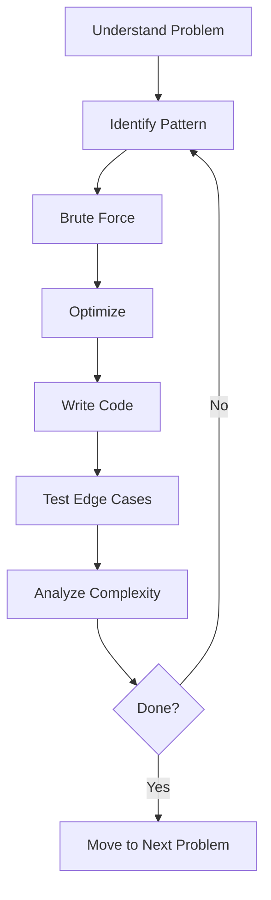

# DSA Problem Bank: 100+ Curated Problems

## Learning Objectives

After this chapter you will have a structured practice plan covering all major DSA patterns, know which problems to solve for each company, and be able to identify the optimal approach for any LeetCode-style interview problem.

## Theory

### Problem-Solving Framework

Every DSA problem follows a repeatable process:



### Pattern Recognition

The 19 patterns in this bank cover 95% of interview problems. To identify the pattern:
- **Arrays**: sorting, hashing, prefix sums, cyclic sort
- **Strings**: sliding window, two pointers, trie
- **Trees/Graphs**: BFS for shortest path, DFS for exhaustive search
- **DP**: overlapping subproblems, optimal substructure
- **Greedy**: local optimum leads to global optimum

### Complexity Targeting

Match your approach to constraints:
- n <= 20: O(2^n) backtracking or brute force
- n <= 1000: O(n^2) nested loops
- n <= 10^5: O(n log n) sorting or heap
- n <= 10^7: O(n) single pass or hash map

## How to Use This Bank

Each pattern section lists 6-10 problems ordered by difficulty. Solve the Easy ones for warm-up, Medium for core practice, Hard for mastery. Do not look at hints until you have spent at least 20 minutes per problem.

## Pattern 1: Arrays & Hashing

| # | Problem | Difficulty | Company | Hint |
|---|---------|-----------|---------|------|
| 1 | Two Sum | Easy | All | Use hash map for O(n). Complement = target - current |
| 2 | Contains Duplicate | Easy | All | Set lookup. O(n) time, O(n) space |
| 3 | Valid Anagram | Easy | G, A, M | Sort both strings or count char frequencies |
| 4 | Group Anagrams | Medium | G, M, A | Sort each word as key, map to list of anagrams |
| 5 | Top K Frequent Elements | Medium | G, F, M | Bucket sort or quickselect. O(n) |
| 6 | Product of Array Except Self | Medium | G, M, A | Prefix and suffix products. No division |
| 7 | Longest Consecutive Sequence | Medium | G, F | Set membership check. O(n) |
| 8 | Encode and Decode Strings | Medium | M | Length-prefix encoding: len + delimiter + str |
| 9 | First Missing Positive | Hard | G, A | Cyclic sort: place each number at its index |
| 10 | Longest Substring Without Repeating | Medium | G, F, A | Sliding window with char set |

## Pattern 2: Two Pointers

| # | Problem | Difficulty | Company | Hint |
|---|---------|-----------|---------|------|
| 1 | Valid Palindrome | Easy | All | Two pointers from ends. Skip non-alphanumeric |
| 2 | Two Sum II - Sorted | Medium | G, A | Left + right pointer, adjust based on sum |
| 3 | 3Sum | Medium | G, F, A | Sort first, fix one element, two-pointer the rest |
| 4 | Container With Most Water | Medium | G, F, A | Two pointers, move the shorter inward |
| 5 | Trapping Rain Water | Hard | G, F, A | Left/right max arrays. Or two-pointer on heights |
| 6 | Remove Duplicates from Sorted | Easy | A | Slow/fast pointer. Write unique elements |
| 7 | Move Zeroes | Easy | F | One pointer for next non-zero position |

## Pattern 3: Sliding Window

| # | Problem | Difficulty | Company | Hint |
|---|---------|-----------|---------|------|
| 1 | Best Time to Buy and Sell Stock | Easy | All | Track min price, compute max profit |
| 2 | Longest Substring Without Repeating | Medium | G, F, A | Expand right, shrink left when duplicate found |
| 3 | Longest Repeating Character Replacement | Medium | G, M | Max frequency in window determines replacements |
| 4 | Minimum Window Substring | Hard | G, F, A | Two hash maps: have vs need. Shrink when satisfied |
| 5 | Sliding Window Maximum | Hard | G, A | Deque for O(n). Maintain decreasing values |
| 6 | Permutation in String | Medium | M | Frequency array + sliding window of same length |

## Pattern 4: Binary Search

| # | Problem | Difficulty | Company | Hint |
|---|---------|-----------|---------|------|
| 1 | Binary Search | Easy | All | Classic divide and conquer |
| 2 | Search a 2D Matrix | Medium | All | Treat as flattened array, row = mid//cols |
| 3 | Find Minimum in Rotated Sorted Array | Medium | G, F, A | Compare mid with right to find rotation |
| 4 | Search in Rotated Sorted Array | Medium | G, F, A | Binary search, check which half is sorted |
| 5 | Koko Eating Bananas | Medium | G, F | Binary search on answer (eating speed) |
| 6 | Time Based Key-Value Store | Medium | G, F | Dict of lists (sorted by time), binary search |
| 7 | Median of Two Sorted Arrays | Hard | G, A | Partition both arrays, binary search on smaller |

## Pattern 5: Linked Lists

| # | Problem | Difficulty | Company | Hint |
|---|---------|-----------|---------|------|
| 1 | Reverse Linked List | Easy | All | Three pointers: prev, curr, next |
| 2 | Merge Two Sorted Lists | Easy | All | Dummy head, compare and link |
| 3 | Linked List Cycle | Easy | All | Tortoise and hare. Fast/slow pointer |
| 4 | Remove Nth Node From End | Medium | G, F, A | Two pointers with n-gap |
| 5 | Reorder List | Medium | G, F, A | Find middle, reverse second half, merge |
| 6 | Merge K Sorted Lists | Hard | G, F, A | Divide and conquer or min-heap |
| 7 | LRU Cache | Medium | G, F, A | Doubly linked list + hash map. O(1) |
| 8 | Copy List with Random Pointer | Medium | G, F | Interleave copied nodes, assign random, detach |

## Pattern 6: Stacks & Queues

| # | Problem | Difficulty | Company | Hint |
|---|---------|-----------|---------|------|
| 1 | Valid Parentheses | Easy | All | Stack, match closing with top |
| 2 | Min Stack | Medium | G, F, A | Stack of pairs (value, currentMin) |
| 3 | Evaluate Reverse Polish Notation | Medium | G, F | Stack for operands, apply operator |
| 4 | Daily Temperatures | Medium | G, F | Monotonic decreasing stack |
| 5 | Car Fleet | Medium | G, F | Sort by position, compute time to target, stack |
| 6 | Largest Rectangle in Histogram | Hard | G, F, A | Monotonic stack. Compute area at each popped bar |

## Pattern 7: Trees

| # | Problem | Difficulty | Company | Hint |
|---|---------|-----------|---------|------|
| 1 | Maximum Depth of Binary Tree | Easy | All | Recursive DFS. Max(left, right) + 1 |
| 2 | Invert Binary Tree | Easy | G | Swap left and right recursively |
| 3 | Same Tree | Easy | All | Recursive: check root then left and right |
| 4 | Subtree of Another Tree | Easy | G, F | Check equality at each node |
| 5 | Lowest Common Ancestor of BST | Medium | G, F, A | Split: if p<root<q then root is LCA |
| 6 | Binary Tree Level Order Traversal | Medium | G, F, A | BFS queue. Process level by level |
| 7 | Validate BST | Medium | G, F, A | In-order traversal must be sorted. Or min/max bounds |
| 8 | Binary Tree from Preorder and Inorder | Medium | G, F | First in preorder is root. Split inorder |
| 9 | Serialize and Deserialize Binary Tree | Hard | G, F, A | BFS with null markers. DFS also works |
| 10 | Diameter of Binary Tree | Easy | All | DFS, return max(left,right)+1, update global max |

## Pattern 8: Heaps & Priority Queues

| # | Problem | Difficulty | Company | Hint |
|---|---------|-----------|---------|------|
| 1 | Kth Largest Element in a Stream | Easy | G | Min-heap of size k |
| 2 | Kth Largest Element in an Array | Medium | G, F, A | Quickselect avg O(n) or min-heap O(n log k) |
| 3 | Find Median from Data Stream | Hard | G, F, A | Two heaps: max-heap for lower half, min-heap for upper |
| 4 | Task Scheduler | Medium | G, F, A | Max frequency determines idle slots |
| 5 | Top K Frequent Words | Medium | G, F | Min-heap of size k. Compare by freq then lexicographic |

## Pattern 9: Graphs

| # | Problem | Difficulty | Company | Hint |
|---|---------|-----------|---------|------|
| 1 | Number of Islands | Medium | G, F, A | DFS/BFS on each unvisited land cell |
| 2 | Clone Graph | Medium | G, F | Hash map for visited. DFS/BFS copy |
| 3 | Course Schedule | Medium | G, F, A | Topological sort via Kahn or DFS cycle detection |
| 4 | Pacific Atlantic Water Flow | Medium | G, F | DFS from borders inward. Track reachable sets |
| 5 | Number of Connected Components | Medium | F | Union-find. Count distinct roots |
| 6 | Graph Valid Tree | Medium | G, F | Check n-1 edges + fully connected |
| 7 | Word Ladder | Hard | G, F, A | BFS from start, change one letter at a time |
| 8 | Alien Dictionary | Hard | G, F, A | Compare adjacent words, build graph, topological sort |

## Pattern 10: Dynamic Programming 1D

| # | Problem | Difficulty | Company | Hint |
|---|---------|-----------|---------|------|
| 1 | Climbing Stairs | Easy | All | dp[i] = dp[i-1] + dp[i-2] (Fibonacci) |
| 2 | House Robber | Medium | G, F, A | dp[i] = max(dp[i-1], dp[i-2] + nums[i]) |
| 3 | Coin Change | Medium | G, F, A | dp[i] = min(dp[i], dp[i-coin] + 1) |
| 4 | Longest Increasing Subsequence | Medium | G, F, A | dp[i] = max(dp[j] + 1) for j < i. Binary search improves |
| 5 | Palindromic Substrings | Medium | G, F | Expand around center. Count palindromes |
| 6 | Word Break | Medium | G, F, A | dp[i] = true if dp[j] and s[j:i] in wordSet |
| 7 | Decode Ways | Medium | G, F, A | dp[i] = dp[i-1] + dp[i-2] (if valid two-digit) |

## Pattern 11: Dynamic Programming 2D

| # | Problem | Difficulty | Company | Hint |
|---|---------|-----------|---------|------|
| 1 | Unique Paths | Medium | All | dp[i][j] = dp[i-1][j] + dp[i][j-1] |
| 2 | Longest Common Subsequence | Medium | G, F, A | dp[i][j] = 1+dp[i-1][j-1] if match else max(dp[i-1][j], dp[i][j-1]) |
| 3 | Edit Distance | Hard | G, F, A | dp[i][j] = min(dp[i-1][j]+1, dp[i][j-1]+1, dp[i-1][j-1] + (0 if same else 1)) |
| 4 | Coin Change 2 | Medium | G, F | dp[i][a] = dp[i-1][a] + dp[i][a-coins[i-1]] |
| 5 | Target Sum | Medium | G, F | dp[i][s] = count. Or transform to subset sum |
| 6 | Burst Balloons | Hard | G, F | dp[l][r] = max(dp[l][k-1] + dp[k+1][r] + nums[l-1]*nums[k]*nums[r+1]) |

## Pattern 12: Backtracking

| # | Problem | Difficulty | Company | Hint |
|---|---------|-----------|---------|------|
| 1 | Subsets | Medium | G, F, A | Backtrack: include/exclude each element |
| 2 | Permutations | Medium | G, F, A | Swap each element with current position |
| 3 | Combination Sum | Medium | G, F, A | Sort first. Choose or skip, same element allowed multiple times |
| 4 | Letter Combinations of Phone Number | Medium | G, F, A | Build string digit by digit. Map digit to letters |
| 5 | N-Queens | Hard | G, F, A | Place queen per row. Check col, diag, anti-diag |
| 6 | Word Search | Medium | G, F, A | DFS from each cell. Mark visited on path |

## Pattern 13: Tries

| # | Problem | Difficulty | Company | Hint |
|---|---------|-----------|---------|------|
| 1 | Implement Trie | Medium | G, F | TrieNode with children map and isEnd flag |
| 2 | Word Search II | Hard | G, F, A | Trie for dictionary, DFS on board |
| 3 | Prefix and Suffix Search | Hard | G, F | Insert all prefix+suffix combos |
| 4 | Replace Words | Medium | M | Insert dictionary in trie, replace words |

## Pattern 14: Intervals

| # | Problem | Difficulty | Company | Hint |
|---|---------|-----------|---------|------|
| 1 | Meeting Rooms | Easy | G, F, A | Sort by start, check overlap with next |
| 2 | Merge Intervals | Medium | G, F, A | Sort by start, merge if overlapping |
| 3 | Insert Interval | Medium | G, F, A | Process before overlap, merge overlap, after |
| 4 | Non Overlapping Intervals | Medium | G, F, A | Sort by end, greedy. Remove intervals with earlier end |
| 5 | Meeting Rooms II | Medium | G, F, A | Chronological ordering or min-heap of end times |
| 6 | Minimum Interval in Range Queries | Hard | G | Sort intervals, min-heap for smallest covering |

## Pattern 15: Math & Bit Manipulation

| # | Problem | Difficulty | Company | Hint |
|---|---------|-----------|---------|------|
| 1 | Single Number | Easy | All | XOR all elements. Duplicates cancel |
| 2 | Number of 1 Bits | Easy | All | n & (n-1) clears lowest set bit |
| 3 | Reverse Bits | Easy | G | Build result bit by bit |
| 4 | Missing Number | Easy | G, F | XOR indices with values. Or sum formula |
| 5 | Sum of Two Integers | Medium | G, F, A | Bit manipulation: carry = a&b, sum = a^b |
| 6 | Pow(x, n) | Medium | G, F, A | Binary exponentiation O(log n) |

## Company-Specific Focus

- **Google**: Graphs, DP, design questions, math puzzles. Practice Word Ladder, Alien Dictionary, Median of Two Sorted Arrays
- **Amazon**: Arrays, trees, stacks, OOD. Practice LRU Cache, Serialize Tree, Trapping Rain Water. Leadership Principle story integration
- **Meta**: Strings, arrays, trees, product-focused system design. Practice Longest Substring, Group Anagrams, Binary Tree Level Order
- **Apple**: Deep technical dives, past project discussion. Less DSA-heavy, more architecture
- **Netflix**: Judgment-based system design. Less standard DSA


### Problem-Solving Framework

Follow this framework for every problem:

1. **Understand**: repeat the problem in your own words, confirm input/output format, ask about constraints (size, range, duplicates, sorted?)
2. **Brute force**: state the naive approach and its complexity. This shows you know where to start
3. **Optimize**: identify the bottleneck in the brute force. Consider trade space for time (hash map), sort first, two pointers, sliding window
4. **Walk through**: trace your algorithm on a small example before coding
5. **Code**: implement cleanly with meaningful variable names
6. **Test**: check empty input, single element, large values, edge cases
7. **Analyze**: state time and space complexity

### Time Complexity Reference

| Complexity | Name | Example |
|-----------|------|---------|
| O(1) | Constant | Array access, hash map lookup |
| O(log n) | Logarithmic | Binary search, balanced BST operations |
| O(n) | Linear | Single pass through an array |
| O(n log n) | Linearithmic | Sorting (merge sort, heap sort), divide and conquer |
| O(n^2) | Quadratic | Nested loops, bubble sort |
| O(2^n) | Exponential | Subsets, recursive without memoization |
| O(n!) | Factorial | Permutations of n elements |

### Space Complexity Reference

| Complexity | Example |
|-----------|---------|
| O(1) | In-place algorithms, two pointers |
| O(n) | Hash map, recursive stack (depth n), dynamic programming array |
| O(n^2) | 2D DP table, adjacency matrix |

### Pattern Recognition Cheat Sheet

Ask these questions to identify the pattern:
- Is the input sorted? -> Binary search or two pointers
- Need to find subarray/substring? -> Sliding window
- Need to compare elements with neighbors? -> Two pointers or monotonic stack
- Smallest/largest/top-k? -> Heap
- Need to enumerate all possibilities? -> Backtracking
- Optimal value from overlapping subproblems? -> Dynamic programming
- Relationship between elements (graph)? -> BFS/DFS/Union-Find
- String matching with dictionary? -> Trie
- Intervals that overlap/merge? -> Sort intervals
- Fast lookup need? -> Hash map or Set

### How to Practice Effectively

- Spaced repetition: review each problem after 1 day, 3 days, 1 week, 1 month
- Active recall: before looking at the solution, try to recreate the approach from memory
- Interleaving: mix patterns in a practice session (do not do 10 sliding window problems in a row)
- Whiteboard practice: code on paper or whiteboard to simulate interview conditions
- Time pressure: set a timer for 25 minutes per medium problem
- Reflection: after solving, write a 1-paragraph summary of the key insight


### How to Use LeetCode Effectively

1. Do not look at solutions immediately. Spend 20-30 minutes attempting the problem yourself
2. If stuck, look for the pattern, not the solution. Identify which of the 15 patterns the problem matches
3. Read the solution only after attempting. Implement it from memory the next day
4. Re-solve the same problem after 3 days, 7 days, and 30 days (spaced repetition)
5. For each problem, note: pattern, time complexity, space complexity, key insight
6. Track your weak patterns and prioritize them in your study schedule

### Recommended Study Plan

Weeks 1-2: Core patterns (Arrays, Two Pointers, Sliding Window, Binary Search)
Weeks 3-4: Data structures (Linked Lists, Trees, Graphs, Heaps)
Weeks 5-6: Advanced (DP, Backtracking, Tries, Intervals)
Weeks 7-8: Mixed review + company-specific problems

Daily routine:
- Morning: 1 warm-up easy problem (15 min)
- Evening: 1 medium problem (30 min)
- Weekly: 1 hard problem (60 min) + review weak areas

### Common Mistakes and How to Avoid Them

1. Starting to code before understanding the problem: spend 5 minutes on examples and edge cases
2. Using excessive memory: prefer in-place solutions when possible
3. Premature optimization: start with brute force, then optimize
4. Ignoring constraints: input size determines acceptable complexity (n <= 10 -> O(n!), n <= 1000 -> O(n^2), n <= 10^5 -> O(n log n), n <= 10^7 -> O(n))
5. Not testing edge cases: empty input, single element, duplicates, negative numbers, large values
6. Getting stuck on one pattern: if stuck for 30 minutes, switch to a different problem or pattern
7. Memorizing solutions instead of understanding patterns: focus on the pattern, not the specific problem

### Time Management During the Interview

- 2-3 min: Understand the problem. Ask clarifying questions
- 2-3 min: Brainstorm approaches. Discuss tradeoffs with interviewer
- 1-2 min: Agree on an approach. Confirm before coding
- 10-15 min: Write code. Communicate as you type
- 3-5 min: Test with examples. Walk through the code
- 2-3 min: Analyze complexity. Discuss improvements

Total: 20-30 minutes per problem. If stuck for more than 5 minutes on coding, pause and re-evaluate the approach.


## Pattern 16: More DP Problems

| # | Problem | Difficulty | Company | Hint |
|---|---------|-----------|---------|------|
| 1 | Counting Bits | Easy | All | dp[i] = dp[i>>1] + (i & 1) |
| 2 | Min Cost Climbing Stairs | Easy | All | dp[i] = cost[i] + min(dp[i-1], dp[i-2]) |
| 3 | Partition Equal Subset Sum | Medium | G, F, A | dp[s] = true if subset sums to s |
| 4 | Maximum Product Subarray | Medium | G, F, A | Track min and max at each position |
| 5 | Unique Paths II | Medium | G, F | Skip obstacles in DP table |
| 6 | Longest Palindromic Substring | Medium | G, F, A | Expand around center or DP table |
| 7 | Interleaving String | Medium | G, F | 2D DP: dp[i][j] = match s3[i+j-1] with s1[i-1] or s2[j-1] |

## Pattern 17: Greedy

| # | Problem | Difficulty | Company | Hint |
|---|---------|-----------|---------|------|
| 1 | Maximum Subarray | Medium | All | Kadane: current = max(num, current+num), max = max(max, current) |
| 2 | Jump Game | Medium | G, F, A | Track farthest reachable index. If i > farthest, fail |
| 3 | Jump Game II | Medium | G, F, A | BFS-like: current end, farthest reachable, count jumps |
| 4 | Gas Station | Medium | G, F, A | If total gas < total cost, impossible. Start where gas-cost is negative |
| 5 | Hand of Straights | Medium | G, F | Sort, group consecutive, use frequency map |
| 6 | Merge Triplets | Medium | G | Greedy: track which positions can reach target values |

## Pattern 18: Advanced Graphs

| # | Problem | Difficulty | Company | Hint |
|---|---------|-----------|---------|------|
| 1 | Reconstruct Itinerary | Hard | G | Eulerian path. DFS with post-order, process lexical order |
| 2 | Minimum Height Trees | Medium | G | Topological removal of leaves. Repeat until 1-2 nodes remain |
| 3 | Network Delay Time | Medium | G, F | Dijkstra from source. Max distance among reachable nodes |
| 4 | Cheapest Flights Within K Stops | Medium | G, F | Bellman-Ford. Relax K+1 times |
| 5 | Swim in Rising Water | Hard | G | Binary search + BFS, or Dijkstra (minimize max along path) |
| 6 | Alien Dictionary | Hard | G, F, A | Build graph from adjacent word diffs. Topological sort |
| 7 | Bus Routes | Hard | G | BFS on bus stops and bus lines. Each stop connects to all its lines |

## Pattern 19: String Problems

| # | Problem | Difficulty | Company | Hint |
|---|---------|-----------|---------|------|
| 1 | Valid Palindrome II | Easy | G, F | Two pointers. Skip one char if mismatch |
| 2 | Longest Common Prefix | Easy | All | Sort and compare first and last, or vertical scanning |
| 3 | Reverse Words in a String | Medium | G, F, A | Split, reverse, join. Or two-pointer reverse each word |
| 4 | Integer to Roman | Medium | G, F, A | Greedy: largest value symbols first |
| 5 | Roman to Integer | Easy | G, F, A | Left-to-right, subtract when smaller before larger |
| 6 | Text Justification | Hard | G, F, A | Greedy line packing. Distribute spaces evenly |
| 7 | Valid Number | Hard | G | State machine or regex. Check digits, dot, sign, exponent |
| 8 | First Unique Character in a String | Easy | All | Frequency array, second pass for first with count 1 |
| 9 | String to Integer (atoi) | Medium | G, F, A | Skip whitespace, handle sign, overflow, non-digit chars |
| 10 | Generate Parentheses | Medium | G, F, A | Backtracking: track open and close counts, add only if valid |


## Examples

### Example 1: Two Sum (Arrays & Hashing)

```typescript
function twoSum(nums: number[], target: number): number[] {
    const seen: Record<number, number> = {}
    for (let i = 0; i < nums.length; i++) {
        const complement = target - nums[i]
        if (complement in seen) return [seen[complement], i]
        seen[nums[i]] = i
    }
    return []
}
```

### Example 2: Binary Search on Rotated Array

```typescript
function search(nums: number[], target: number): number {
    let lo = 0, hi = nums.length - 1
    while (lo <= hi) {
        const mid = (lo + hi) >> 1
        if (nums[mid] === target) return mid
        if (nums[lo] <= nums[mid]) {
            if (target >= nums[lo] && target < nums[mid]) hi = mid - 1
            else lo = mid + 1
        } else {
            if (target > nums[mid] && target <= nums[hi]) lo = mid + 1
            else hi = mid - 1
        }
    }
    return -1
}
```

### Example 3: LRU Cache (Linked List + HashMap)

```typescript
class LRUCache {
    private cache: Map<number, number> = new Map()
    constructor(private capacity: number) {}
    get(key: number): number {
        if (!this.cache.has(key)) return -1
        const val = this.cache.get(key)!
        this.cache.delete(key)
        this.cache.set(key, val)
        return val
    }
    put(key: number, value: number): void {
        if (this.cache.has(key)) this.cache.delete(key)
        this.cache.set(key, value)
        if (this.cache.size > this.capacity) {
            const first = this.cache.keys().next().value
            this.cache.delete(first!)
        }
    }
}
```

## Summary

Practice consistently: 2-3 problems per day, timed (30 min each). Review solutions even for solved problems. Focus on patterns over memorization. Use the hints only after attempting the problem. Track your weak patterns and practice them more.

## Practical Takeaways

- Solve in order: understand pattern, attempt 30 min, read solution, re-implement next day
- Use the LeetCode Discuss section for company-tagged problems
- For Google: focus on graph and DP problems
- For Amazon: focus on arrays, trees, and OOD
- For Meta: focus on strings and product design
- Rotate patterns to maintain freshness. Do not do all of one pattern at once
- Simulate interview pressure: code on whiteboard or plain text editor, no autocomplete

## Chapter Quiz

1. Which data structure is used for Sliding Window Maximum?
   - A) Stack
   - B) Queue
   - C) Deque
   - D) Heap
   // correct: C

2. The optimal time complexity for Trapping Rain Water using two pointers is:
   - A) O(n^2)
   - B) O(n log n)
   - C) O(n)
   - D) O(1)
   // correct: C

3. Which algorithm finds the Kth largest element in O(n) average time?
   - A) Merge sort
   - B) Quickselect
   - C) Heap
   - D) Binary search
   // correct: B

4. Topological sort requires the graph to be:
   - A) Connected
   - B) Weighted
   - C) Directed Acyclic
   - D) Undirected
   // correct: C

5. Union-Find with path compression has amortized time per operation:
   - A) O(1)
   - B) O(log n)
   - C) O(alpha(n))
   - D) O(n)
   // correct: C

## Exercises

1. Solve 5 problems from your weakest pattern (timed, 30 min each). Track which hints you needed.

2. Implement LRU Cache from scratch without looking at references. Test with get/set operations.

3. Write a function that serializes and deserializes an N-ary tree (not just binary).

4. Implement Union-Find with path compression and union by rank. Use it to solve Number of Connected Components.
