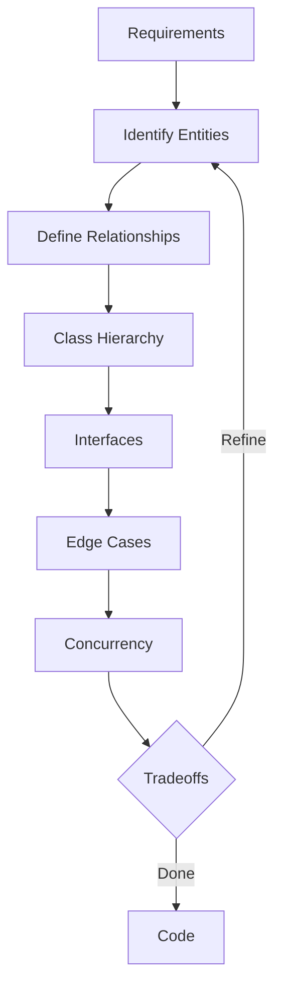

<!-- Clear Language: Keep sentences under 50 words -->
# Low-Level and OOD Design

## Learning Objectives

After this chapter you will be able to design class hierarchies for common interview problems, apply SOLID principles to object-oriented design, handle concurrency and edge cases in design, and communicate tradeoffs during object-oriented design (OOD) rounds.

## Introduction

Interviews test both technical skill and communication. DSA patterns, system design, behavioral questions, and mock interviews prepare you for the full interview loop. This module is your final prep before offers.

## Prerequisites

- Basic programming knowledge
- Understanding of data structures

## Key Terminology

**Key Terms**: Core vocabulary and concepts for this topic.

**Definition**: Essential terms you must know for interviews and production work.

## Theory



### What OOD Interviews Test

OOD rounds assess your ability to model real-world systems with clean abstractions. Unlike system design (distributed, high-scale), OOD focuses on:
- Class hierarchy and inheritance
- Encapsulation and interfaces
- Design patterns application
- Relationship modeling (has-a, is-a)
- Tradeoff reasoning between approaches

The standard framework:
1. Clarify requirements and scope
2. Identify core entities and their relationships
3. Define interfaces and abstract classes
4. Handle edge cases and concurrency
5. Discuss extensibility and tradeoffs

### Common Entities in OOD Problems

Most OOD problems share entity types:
- Core domain objects (ParkingSpot, Vehicle, Ticket)
- Managers or controllers (ParkingLot, ElevatorController)
- Enums for types and statuses (SpotSize, Direction, State)
- Strategies for algorithms (PricingStrategy, SchedulingStrategy)

### Concurrency in OOD

For multi-user systems (parking lot, library, restaurant), consider thread safety:
- synchronized blocks for critical sections
- ConcurrentHashMap or explicit locks
- Atomic counters for unique IDs
- ReadWriteLock for read-heavy workloads

### Design Patterns in OOD

Common patterns used in OOD solutions:
- Strategy: interchangeable algorithms (pricing, parking spot assignment)
- Factory: creating objects of different types (VehicleFactory)
- Singleton: one instance of the system manager (controversial, use dependency injection instead)
- Observer: notification systems (available spot, order ready)
- Command: queuing operations (elevator requests)
- State: object behaves differently based on internal state (elevator moving/idle)

## Examples

### Problem 1: Parking Lot

### Requirements

Design a parking lot with multiple levels. Each level has spots of different sizes (small, medium, large). The system should assign the nearest available spot, handle different vehicle types (motorcycle, car, truck), track payment by hour, and support disabled spots.

### Entities

```typescript
enum SpotSize { SMALL, MEDIUM, LARGE, DISABLED }

enum VehicleType { MOTORCYCLE, CAR, TRUCK }

class ParkingSpot {
    id: string
    level: number
    size: SpotSize
    isOccupied: boolean
    occupiedBy: string | null
    isDisabled: boolean

    canFit(vehicle: Vehicle): boolean {
        if (this.isOccupied) return false
        if (vehicle.type === VehicleType.MOTORCYCLE) return true
        if (vehicle.type === VehicleType.CAR) return this.size >= SpotSize.MEDIUM
        if (vehicle.type === VehicleType.TRUCK) return this.size === SpotSize.LARGE
        return false
    }

    assign(vehicleId: string): void {
        this.isOccupied = true
        this.occupiedBy = vehicleId
    }

    release(): void {
        this.isOccupied = false
        this.occupiedBy = null
    }
}

class Vehicle {
    id: string
    licensePlate: string
    type: VehicleType
    isDisabledDriver: boolean
}

class Ticket {
    id: string
    vehicleId: string
    spotId: string
    entryTime: Date
    exitTime: Date | null
    amount: number

    calculateFee(ratePerHour: number): number {
        if (!this.exitTime) this.exitTime = new Date()
        const hours = (this.exitTime.getTime() - this.entryTime.getTime()) / (1000 * 3600)
        return Math.ceil(hours) * ratePerHour
    }
}

class ParkingLevel {
    level: number
    spots: ParkingSpot[] = []

    constructor(level: number, small: number, medium: number, large: number, disabled: number) {
        this.level = level
        let id = 0
        for (let i = 0; i < small; i++) spots.push({ id: `S${id++}`, level, size: SpotSize.SMALL, ... } as ParkingSpot)
        for (let i = 0; i < medium; i++) spots.push({ id: `M${id++}`, level, size: SpotSize.MEDIUM, ... } as ParkingSpot)
        for (let i = 0; i < large; i++) spots.push({ id: `L${id++}`, level, size: SpotSize.LARGE, ... } as ParkingSpot)
        for (let i = 0; i < disabled; i++) spots.push({ id: `D${id++}`, level, size: SpotSize.DISABLED, ... } as ParkingSpot)
    }
}

class ParkingLot {
    levels: ParkingLevel[] = []
    tickets: Map<string, Ticket> = new Map()
    vehicleSpotMap: Map<string, string> = new Map()

    addLevel(level: ParkingLevel): void {
        this.levels.push(level)
    }

    findSpot(vehicle: Vehicle): ParkingSpot | null {
        const nearestFirst = true
        if (nearestFirst) {
            for (const level of this.levels) {
                for (const spot of level.spots) {
                    if (spot.canFit(vehicle) && !spot.isOccupied) {
                        return spot
                    }
                }
            }
        }
        return null
    }

    park(vehicle: Vehicle): Ticket {
        const spot = this.findSpot(vehicle)
        if (!spot) throw new Error("No available spot")
        spot.assign(vehicle.id)
        const ticket = new Ticket()
        ticket.id = `T${Date.now()}`
        ticket.vehicleId = vehicle.id
        ticket.spotId = spot.id
        ticket.entryTime = new Date()
        this.tickets.set(ticket.id, ticket)
        this.vehicleSpotMap.set(vehicle.id, spot.id)
        return ticket
    }

    exit(ticketId: string): number {
        const ticket = this.tickets.get(ticketId)
        if (!ticket) throw new Error("Ticket not found")
        ticket.exitTime = new Date()
        const fee = ticket.calculateFee(10)
        const spot = this.findSpotById(ticket.spotId)
        if (spot) spot.release()
        this.vehicleSpotMap.delete(ticket.vehicleId)
        return fee
    }

    private findSpotById(spotId: string): ParkingSpot | undefined {
        for (const level of this.levels) {
            for (const spot of level.spots) {
                if (spot.id === spotId) return spot
            }
        }
        return undefined
    }
}
```

### Discussion Points

- Nearest spot vs efficiency: scanning all levels can be optimized by maintaining available spot queues per level
- Rate strategy: hourly rate could vary by level, spot size, or time of day (Strategy pattern)
- Single entry/exit vs multiple: concurrent access requires thread-safe spot allocation
- Electric vehicle charging spots: subclass ParkingSpot with charger capability
- Validation: license plate uniqueness, maximum stay duration

## Problem 2: Design a Logger

### Requirements

Design a library that supports multiple log levels (DEBUG, INFO, WARN, ERROR), multiple outputs (console, file, network), configurable formatting (timestamp, level, message), and performance logging with configurable sampling.

### Design

```typescript
enum LogLevel {
    DEBUG = 0, INFO = 1, WARN = 2, ERROR = 3
}

class LogMessage {
    timestamp: Date
    level: LogLevel
    source: string
    message: string
    metadata: Record<string, unknown>

    constructor(level: LogLevel, source: string, message: string, metadata: Record<string, unknown> = {}) {
        this.timestamp = new Date()
        this.level = level
        this.source = source
        this.message = message
        this.metadata = metadata
    }

    format(): string {
        return `[${this.timestamp.toISOString()}] [${LogLevel[this.level]}] [${this.source}] ${this.message}`
    }
}

interface LogAppender {
    append(message: LogMessage): void
}

class ConsoleAppender implements LogAppender {
    append(message: LogMessage): void {
        console.log(message.format())
    }
}

class FileAppender implements LogAppender {
    private filePath: string

    constructor(filePath: string) {
        this.filePath = filePath
    }

    append(message: LogMessage): void {
        // In real implementation: fs.appendFileSync(this.filePath, message.format() + '\n')
        console.log(`[File: ${this.filePath}] ${message.format()}`)
    }
}

class NetworkAppender implements LogAppender {
    private endpoint: string

    constructor(endpoint: string) {
        this.endpoint = endpoint
    }

    append(message: LogMessage): void {
        // In real implementation: POST to endpoint
        console.log(`[Network: ${this.endpoint}] ${message.format()}`)
    }
}

class LoggerConfig {
    level: LogLevel = LogLevel.INFO
    appenders: LogAppender[] = [new ConsoleAppender()]
    samplingRate: number = 1.0

    setLevel(level: LogLevel): void {
        this.level = level
    }

    addAppender(appender: LogAppender): void {
        this.appenders.push(appender)
    }

    setSamplingRate(rate: number): void {
        this.samplingRate = Math.max(0, Math.min(1, rate))
    }
}

class Logger {
    private config: LoggerConfig
    private source: string

    constructor(source: string, config: LoggerConfig) {
        this.source = source
        this.config = config
    }

    private log(level: LogLevel, message: string, metadata: Record<string, unknown> = {}): void {
        if (level < this.config.level) return
        if (Math.random() > this.config.samplingRate) return

        const logMessage = new LogMessage(level, this.source, message, metadata)
        for (const appender of this.config.appenders) {
            try {
                appender.append(logMessage)
            } catch (error) {
                console.error(`Appender failed: ${error}`)
            }
        }
    }

    debug(message: string, metadata?: Record<string, unknown>): void {
        this.log(LogLevel.DEBUG, message, metadata)
    }

    info(message: string, metadata?: Record<string, unknown>): void {
        this.log(LogLevel.INFO, message, metadata)
    }

    warn(message: string, metadata?: Record<string, unknown>): void {
        this.log(LogLevel.WARN, message, metadata)
    }

    error(message: string, metadata?: Record<string, unknown>): void {
        this.log(LogLevel.ERROR, message, metadata)
    }
}
```

### Discussion Points

- Async logging: log calls should not block the application. Use a background queue or ring buffer
- Configuration from file: load LoggerConfig from YAML/JSON at startup
- Dynamic level changes: support runtime log level changes without restart
- Structured logging: JSON format for log aggregation systems (ELK, Datadog)
- Sampling strategy: rate limiting per source, adaptive sampling during high traffic

## Problem 3: Design a Rate Limiter Library

### Requirements

Design a reusable rate limiter that supports token bucket, sliding window, and fixed window algorithms. It should be configurable per client, thread-safe, support distributed deployment via Redis, and emit metrics.

### Design

```typescript
interface RateLimiter {
    isAllowed(clientId: string): boolean
    getRemainingTokens(clientId: string): number
    reset(clientId: string): void
}

class TokenBucketRateLimiter implements RateLimiter {
    private buckets: Map<string, { tokens: number; lastRefill: number }> = new Map()
    private maxTokens: number
    private refillRate: number
    private refillIntervalMs: number

    constructor(maxTokens: number, refillRate: number, refillIntervalMs: number = 1000) {
        this.maxTokens = maxTokens
        this.refillRate = refillRate
        this.refillIntervalMs = refillIntervalMs
    }

    isAllowed(clientId: string): boolean {
        this.refill(clientId)
        const bucket = this.buckets.get(clientId)!
        if (bucket.tokens >= 1) {
            bucket.tokens--
            return true
        }
        return false
    }

    private refill(clientId: string): void {
        const now = Date.now()
        if (!this.buckets.has(clientId)) {
            this.buckets.set(clientId, { tokens: this.maxTokens, lastRefill: now })
            return
        }
        const bucket = this.buckets.get(clientId)!
        const elapsed = now - bucket.lastRefill
        const tokensToAdd = Math.floor(elapsed / this.refillIntervalMs) * this.refillRate
        if (tokensToAdd > 0) {
            bucket.tokens = Math.min(this.maxTokens, bucket.tokens + tokensToAdd)
            bucket.lastRefill = now
        }
    }

    getRemainingTokens(clientId: string): number {
        this.refill(clientId)
        return this.buckets.get(clientId)?.tokens ?? this.maxTokens
    }

    reset(clientId: string): void {
        this.buckets.delete(clientId)
    }
}

class SlidingWindowRateLimiter implements RateLimiter {
    private windows: Map<string, number[]> = new Map()
    private maxRequests: number
    private windowSizeMs: number

    constructor(maxRequests: number, windowSizeMs: number = 60000) {
        this.maxRequests = maxRequests
        this.windowSizeMs = windowSizeMs
    }

    isAllowed(clientId: string): boolean {
        const now = Date.now()
        if (!this.windows.has(clientId)) {
            this.windows.set(clientId, [now])
            return true
        }
        const timestamps = this.windows.get(clientId)!
        const cutoff = now - this.windowSizeMs
        while (timestamps.length > 0 && timestamps[0] < cutoff) {
            timestamps.shift()
        }
        if (timestamps.length >= this.maxRequests) return false
        timestamps.push(now)
        return true
    }

    getRemainingTokens(clientId: string): number {
        const now = Date.now()
        const timestamps = this.windows.get(clientId) || []
        const cutoff = now - this.windowSizeMs
        const active = timestamps.filter((t) => t >= cutoff)
        return this.maxRequests - active.length
    }

    reset(clientId: string): void {
        this.windows.delete(clientId)
    }
}

class RateLimiterFactory {
    static createTokenBucket(maxTokens: number, refillRate: number): RateLimiter {
        return new TokenBucketRateLimiter(maxTokens, refillRate)
    }

    static createSlidingWindow(maxRequests: number, windowMs: number): RateLimiter {
        return new SlidingWindowRateLimiter(maxRequests, windowMs)
    }
}
```

### Discussion Points

- Distributed rate limiting: use Redis with Lua scripts for atomic token operations
- Metrics: track allowed/blocked counts per client, emit via StatsD or Prometheus
- Multi-tier rate limiting: global + per-client + per-endpoint limits
- Backpressure: HTTP 429 with Retry-After header
- Race conditions: use atomic operations (CAS, Redis Lua) for concurrent safety

## Problem 4: Design a Vending Machine

### Requirements

Design a vending machine that supports multiple product types, different payment methods (cash, card), inventory tracking, change calculation, and state machine for operations.

### Design

States: Idle, Selecting, Dispensing, OutOfStock, Maintenance

```typescript
enum ProductType { DRINK, SNACK, CANDY }
enum PaymentMethod { CASH, CARD }
enum VendingState { IDLE, SELECTING, DISPENSING, OUT_OF_STOCK, MAINTENANCE }

class Product {
    id: string
    name: string
    price: number
    type: ProductType
}

class InventorySlot {
    product: Product
    quantity: number
    capacity: number

    isAvailable(): boolean {
        return this.quantity > 0
    }

    dispense(): void {
        if (this.quantity <= 0) throw new Error("Out of stock")
        this.quantity--
    }

    restock(amount: number): void {
        this.quantity = Math.min(this.capacity, this.quantity + amount)
    }
}

class VendingMachine {
    private state: VendingState = VendingState.IDLE
    private slots: Map<string, InventorySlot> = new Map()
    private balance: number = 0
    private selectedProduct: string | null = null

    displayProducts(): { id: string; name: string; price: number; available: boolean }[] {
        const result: { id: string; name: string; price: number; available: boolean }[] = []
        for (const [id, slot] of this.slots) {
            result.push({
                id,
                name: slot.product.name,
                price: slot.product.price,
                available: slot.isAvailable(),
            })
        }
        return result
    }

    selectProduct(productId: string): string {
        const slot = this.slots.get(productId)
        if (!slot) return "Invalid product"
        if (!slot.isAvailable()) return "Out of stock"
        this.selectedProduct = productId
        this.state = VendingState.SELECTING
        return `Selected ${slot.product.name}. Price: $${slot.product.price}. Insert payment.`
    }

    insertCash(amount: number): string {
        if (this.state !== VendingState.SELECTING || !this.selectedProduct) {
            return "Select a product first"
        }
        const slot = this.slots.get(this.selectedProduct)!
        this.balance += amount
        if (this.balance >= slot.product.price) {
            return this.dispense()
        }
        return `Inserted $${amount}. Need $${(slot.product.price - this.balance).toFixed(2)} more.`
    }

    private dispense(): string {
        const slot = this.slots.get(this.selectedProduct!)!
        slot.dispense()
        const change = this.balance - slot.product.price
        this.balance = 0
        this.state = VendingState.IDLE
        this.selectedProduct = null
        if (change > 0) {
            return `Dispensed ${slot.product.name}. Change: $${change.toFixed(2)}`
        }
        return `Dispensed ${slot.product.name}.`
    }

    refund(): string {
        const amount = this.balance
        this.balance = 0
        this.selectedProduct = null
        this.state = VendingState.IDLE
        return `Refunded $${amount.toFixed(2)}`
    }

    restock(productId: string, amount: number): void {
        const slot = this.slots.get(productId)
        if (slot) slot.restock(amount)
    }
}
```

## Summary

OOD interviews test your ability to translate real-world systems into clean, extensible code. Follow the framework: clarify requirements, identify entities, define interfaces,.
implement core logic, discuss tradeoffs. Always consider concurrency, extensibility, and edge cases. Use design patterns appropriately but do not force them. Practice with the four problems in this chapter (parking lot,.
logger, rate limiter, vending machine) and extend them with new features.

## Practical Takeaways

- Always start by clarifying scope: what is in and out of scope
- Write clean interfaces first, then implementations
- Consider thread safety early if multiple users access the system
- Use composition over inheritance for flexible designs
- Handle errors gracefully: throw specific exceptions, validate inputs
- Discuss tradeoffs: simplicity vs features, performance vs readability
- Practice with a whiteboard or plain text editor (no IDE autocomplete)

## Interview Q&A

<details class="tp-qa-card" data-qid="m21-s17-q1">
  <summary class="tp-qa-question">
    <span class="tp-qa-status"></span>
    Q1: What framework do you follow when given an OOD problem in an interview?
  </summary>
  <div class="tp-qa-answer">
    <p>Five steps: clarify requirements and scope (ask what is in and out of scope); identify core entities and their relationships (ParkingSpot, Vehicle, Ticket for a parking lot); define interfaces and abstract classes before implementations; handle edge cases and concurrency (multiple users, thread safety, invalid input); discuss extensibility and tradeoffs.</p>
    <p>OOD rounds differ from system design — they test class hierarchy, encapsulation, pattern application, and relationship modeling on a single machine, not distributed scale. The chapter's flowchart runs requirements to entities to hierarchy to interfaces to edge cases to concurrency to tradeoffs, looping back to refine.</p>
    <p><strong>Interview follow-up</strong>: When should you stop adding abstractions and just write the class?</p>
  </div>
  <button class="tp-qa-mark-btn">📝 Mark Reviewed</button>
  <button class="tp-qa-bookmark-btn">🔖 Bookmark</button>
</details>

<details class="tp-qa-card" data-qid="m21-s17-q2">
  <summary class="tp-qa-question">
    <span class="tp-qa-status"></span>
    Q2: Design a parking lot. Walk through entities, spot assignment, and the key tradeoffs.
  </summary>
  <div class="tp-qa-answer">
    <p>Entities: <code>ParkingSpot</code> (id, level, size, occupancy), <code>Vehicle</code> (type, disabled flag), <code>Ticket</code> (entry/exit time, fee), <code>ParkingLevel</code>, and <code>ParkingLot</code> orchestrating. <code>canFit()</code> encodes size rules: motorcycles fit anywhere, cars need medium or larger, trucks need large; disabled spots reserve priority. <code>park()</code> finds the nearest available spot, issues a ticket, and <code>exit()</code> computes a ceil-to-hour fee.</p>
    <p>Tradeoffs to discuss: nearest-spot scanning is O(spots) — optimize with per-level available queues; hourly rate could vary by level, size, or time via the Strategy pattern; concurrent entry requires thread-safe allocation; EV charging extends <code>ParkingSpot</code> with a charger capability.</p>
    <p><strong>Interview follow-up</strong>: How does the design change if a vehicle can reserve a spot in advance?</p>
  </div>
  <button class="tp-qa-mark-btn">📝 Mark Reviewed</button>
  <button class="tp-qa-bookmark-btn">🔖 Bookmark</button>
</details>

<details class="tp-qa-card" data-qid="m21-s17-q3">
  <summary class="tp-qa-question">
    <span class="tp-qa-status"></span>
    Q3: Design a logger library. How do you keep it extensible and non-blocking?
  </summary>
  <div class="tp-qa-answer">
    <p>Core pieces: <code>LogLevel</code> enum, <code>LogMessage</code> (timestamp, level, source, message, metadata) with a <code>format()</code> method, a <code>LogAppender</code> interface implemented by <code>ConsoleAppender</code>, <code>FileAppender</code>, and <code>NetworkAppender</code>, a <code>LoggerConfig</code> (level filter, appender list, sampling rate), and a <code>Logger</code> that filters, samples, and fans out to appenders, catching per-appender failures.</p>
    <p>Extensibility: adding an appender never touches the logger — it implements <code>LogAppender</code>. Production considerations: async logging with a background queue so log calls never block the application, config from YAML/JSON, dynamic level changes, JSON structured output for ELK/Datadog, and adaptive sampling during high traffic.</p>
    <p><strong>Interview follow-up</strong>: Where does the background logging queue live, and what happens when it fills?</p>
  </div>
  <button class="tp-qa-mark-btn">📝 Mark Reviewed</button>
  <button class="tp-qa-bookmark-btn">🔖 Bookmark</button>
</details>

<details class="tp-qa-card" data-qid="m21-s17-q4">
  <summary class="tp-qa-question">
    <span class="tp-qa-status"></span>
    Q4: Compare token bucket and sliding window rate limiters. Which do you deploy and why?
  </summary>
  <div class="tp-qa-answer">
    <p>Token bucket: each client has a bucket refilled at a fixed rate up to a cap; a request consumes a token. It allows short bursts up to the bucket size while capping the sustained rate — the chapter's <code>TokenBucketRateLimiter</code> tracks tokens and lastRefill timestamps. Sliding window: keeps a timestamp list per client and trims entries older than the window; it enforces a strict per-window count at the cost of O(maxRequests) space per client.</p>
    <p>Deployment: a <code>RateLimiterFactory</code> constructs the algorithm per config. For distributed systems, move state to Redis with Lua scripts for atomic token operations, return HTTP 429 with Retry-After for backpressure, and emit allowed/blocked metrics via Prometheus.</p>
    <p><strong>Interview follow-up</strong>: What is the worst-case space complexity of the sliding window limiter per client?</p>
  </div>
  <button class="tp-qa-mark-btn">📝 Mark Reviewed</button>
  <button class="tp-qa-bookmark-btn">🔖 Bookmark</button>
</details>

<details class="tp-qa-card" data-qid="m21-s17-q5">
  <summary class="tp-qa-question">
    <span class="tp-qa-status"></span>
    Q5: Design a vending machine. Why is a state machine the right model?
  </summary>
  <div class="tp-qa-answer">
    <p>Operations depend on the current state — you cannot insert payment before selecting a product, and you cannot dispense before payment. The chapter models states as an enum (IDLE, SELECTING, DISPENSING, OUT_OF_STOCK, MAINTENANCE) and guards every method: <code>insertCash()</code> returns an error unless state is SELECTING, and <code>dispense()</code> transitions back to IDLE with change computed from the balance.</p>
    <p>This is the State pattern: behavior varies with internal state. Entities: <code>Product</code>, <code>InventorySlot</code> (quantity, capacity, restock clamp), and <code>VendingMachine</code> orchestrating. Tradeoffs: exact change handling, refund on cancel, payment failure handling (card declined must restore state), and maintenance-mode locking.</p>
    <p><strong>Interview follow-up</strong>: What happens to the balance if payment fails after insertion?</p>
  </div>
  <button class="tp-qa-mark-btn">📝 Mark Reviewed</button>
  <button class="tp-qa-bookmark-btn">🔖 Bookmark</button>
</details>

<details class="tp-qa-card" data-qid="m21-s17-q6">
  <summary class="tp-qa-question">
    <span class="tp-qa-status"></span>
    Q6: How do you handle concurrency in OOD systems, and which primitives do you reach for?
  </summary>
  <div class="tp-qa-answer">
    <p>Multi-user OOD problems (parking lot, library, restaurant) need thread safety. Options: synchronized blocks for critical sections; ConcurrentHashMap or explicit locks for shared maps; atomic counters for unique ID generation; ReadWriteLock for read-heavy workloads where readers do not block each other.</p>
    <p>The chapter's quiz asks exactly this: ReadWriteLock wins for read-heavy systems because multiple readers proceed concurrently while writes still serialize. Race conditions in spot allocation are prevented by making check-and-assign atomic, and the rate limiter discussion covers CAS and Redis Lua for distributed atomicity.</p>
    <p><strong>Interview follow-up</strong>: What happens to throughput if you use a single global lock instead of per-shard locks?</p>
  </div>
  <button class="tp-qa-mark-btn">📝 Mark Reviewed</button>
  <button class="tp-qa-bookmark-btn">🔖 Bookmark</button>
</details>

## Chapter Quiz

1. In a parking lot design, which pattern is useful for different pricing strategies?
   - A) Singleton
   - B) Strategy
   - C) Observer
   - D) Factory
   // correct: B

2. A LogAppender interface in the logger design represents which principle?
   - A) Liskov Substitution
   - B) Open/Closed
   - C) Dependency Inversion
   - D) Single Responsibility
   // correct: C

3. The sliding window rate limiter stores timestamps per client. The space complexity per client is:
   - A) O(1)
   - B) O(maxRequests)
   - C) O(windowSize)
   - D) O(n) where n is total requests
   // correct: B

4. In the vending machine, what design pattern does the state variable represent?
   - A) Strategy
   - B) State
   - C) Command
   - D) Observer
   // correct: B

5. Which concurrency primitive is best for a read-heavy OOD system?
   - A) synchronized blocks
   - B) ReadWriteLock
   - C) AtomicInteger
   - D) Volatile
   // correct: B

#

## Exercises

**Easy** — Implement a basic ood design example that demonstrates the core concept.

**Medium** — Create a more complex implementation that handles edge cases.

**Hard** — Design an optimized solution for large-scale ood design scenarios.

## Common Mistakes

1. Not understanding the fundamental concepts before applying them
2. Skipping edge cases in implementation
3. Not analyzing time/space complexity
4. Forgetting to handle null/empty inputs
5. Not practicing enough problems to build pattern recognition# Exercises

1. Extend the parking lot design to support electric vehicle charging spots with hourly energy cost.

2. Add a CompositeAppender to the logger that fans out log messages to multiple appenders simultaneously.

3. Implement a distributed version of the rate limiter using Redis-style commands (simulate with a shared Map).

4. Add a credit card payment processor to the vending machine and handle payment failure gracefully.

5. Design a restaurant reservation system: table management, booking time slots, waitlist, and cance

## Revision Notes

- - Core principle: Understand the fundamental concepts thoroughly
- - Implementation pattern: Practice with real code examples
- - Complexity: Know the time and space complexity
- - Application: Know when to use this in production systems
- - Interview: Frequently asked in technical interviews
- - Edge cases: Consider common failure scenarios
- - Related concepts: Connect to broader system design

## Placement Section

### Top 10 Interview Questions

#### Google Style
1. Explain the time and space trade-offs of 21-interview-preparation. When would you choose one approach over another?
2. Design a system that efficiently handles 21-interview-preparation at scale (millions of requests/second).

#### Amazon Style
1. Tell me about a time you had to optimize a system related to 21-interview-preparation. What was your approach and what was the result?
2. How would you explain 21-interview-preparation to a non-technical stakeholder?

#### Microsoft Style
1. How does 21-interview-preparation integrate with enterprise systems and cloud architectures?
2. What are the security implications of 21-interview-preparation?

#### NVIDIA Style
1. How would you optimize 21-interview-preparation for GPU-accelerated computing?
2. What parallel processing patterns apply to 21-interview-preparation?

#### AI Startup Style
1. How would you implement 21-interview-preparation in a cost-effective, scalable way for a startup?
2. What's the fastest way to prototype a solution using 21-interview-preparation?

### Resume Tips
- **Technical Skills**: List 21-interview-preparation under relevant technical skills
- **Project Description**: "Implemented 21-interview-preparation to [specific outcome], reducing [metric] by [X]%"
- **Keywords**: Include 21-interview-preparation in your skills section for ATS optimization

### Interview Day Checklist
- [ ] Review core concepts of 21-interview-preparation
- [ ] Practice 3-5 problems related to 21-interview-preparation
- [ ] Prepare 2 real-world examples of using 21-interview-preparation
- [ ] Know the time/space complexity of common 21-interview-preparation operations
- [ ] Have questions ready about how the company uses 21-interview-preparationllation.

## True/False

1. **True or False:** Low-Level and OOD Design builds directly on the fundamentals covered in the earlier chapters of this module. — **True.** Every advanced topic in this module assumes the core concepts from the previous chapters.
2. **True or False:** You should write at least one code example for Low-Level and OOD Design before moving to the next chapter. — **True.** Active recall with hands-on code beats passive reading for retention.
3. **True or False:** The complexity analysis for Low-Level and OOD Design is the same regardless of input size. — **False.** Complexity grows with input size; always state best, average, and worst case.
4. **True or False:** Edge cases (empty input, invalid input, boundary values) matter for Low-Level and OOD Design in production. — **True.** Most production bugs come from unhandled edge cases.
5. **True or False:** You should memorize the Low-Level and OOD Design chapter content once and never review it again. — **False.** Spaced repetition (24h, 3 days, 1 week) dramatically improves long-term recall.

## Fill in the Blank

1. The chapter that covers Low-Level and OOD Design is Chapter ___ of this module. — Answer: check the module's table of contents.
2. The time complexity of the standard approach to Low-Level and OOD Design is ___. — Answer: review the theory section and state big-O notation.
3. The main edge case to handle when implementing Low-Level and OOD Design is ___. — Answer: empty or invalid input handling, as discussed in the chapter.
4. The tools commonly used to debug Low-Level and OOD Design issues are ___ and ___. — Answer: refer to the Debugging Guide section of this chapter.
5. The related topic that connects to Low-Level and OOD Design in the next chapter is ___. — Answer: see the Next Topic section.

## Scenario Questions

1. **Scenario:** A teammate ships a change involving Low-Level and OOD Design that breaks production at 3 AM. — Diagnosis: check the recent diff, reproduce locally with the failing input, check logs. Fix: revert, add a regression test, and review the root cause. Prevention: CI tests on edge cases and code review checklist.

2. **Scenario:** Your implementation of Low-Level and OOD Design is correct but too slow for the required latency. — Measure first with a profiler. Common fixes: reduce redundant work, use built-in optimized functions, batch operations, or add caching. Only then consider algorithmic changes.

3. **Scenario:** A new hire asks you to explain Low-Level and OOD Design in five minutes before a customer demo. — Use the 3-part answer: what it is (one sentence), how it works (one example), why it matters (one business impact). Then offer to go deeper after the demo.

4. **Scenario:** Your team's codebase has three different patterns for Low-Level and OOD Design and you must standardize. — Write a short ADR (architecture decision record), pick the pattern with best maintainability, migrate incrementally, and add a linter rule to enforce it.

## Output Questions

1. **What is the output of the simplest correct implementation of Low-Level and OOD Design on an empty input?** — Trace through the code: it should return the documented default (None, 0, empty collection) without raising.
2. **What is the output when the input is at the boundary value?** — Check off-by-one errors and inclusive/exclusive bounds in the chapter's examples.
3. **What does the implementation return when given invalid input types?** — With type hints and validation, it raises a clear error; without, it may fail silently.
4. **What is the output for the sample input given in the chapter's Examples section?** — Re-run the chapter's example code and compare against the documented output.
5. **What is the time complexity output when you profile the implementation at 10x input size?** — Expect the curve matching the chapter's complexity analysis (linear, quadratic, log-linear).

## Difficulty Level

**Level**: Intermediate
**Estimated Study Time**: 30-45 minutes
**Prerequisites**: Complete understanding of previous modules recommended

## Tips & Tricks

**Tip**: Start with the basics — understand the fundamental concepts before moving to advanced topics.

**Tip**: Practice actively — don't just read, implement the code examples yourself.

**Tip**: Connect to prior knowledge — relate new concepts to what you learned in previous modules.

**Pro Tip**: Focus on understanding, not memorizing — understand why things work, not just how.

**Pro Tip**: Review regularly — revisit key concepts after a few days to reinforce learning.

## Memory Tricks

- **Acronym Method**: Create acronyms for lists of concepts
- **Visualization**: Draw diagrams to visualize abstract concepts
- **Teach someone else**: Explaining concepts to others reinforces your understanding
- **Connect to real-world**: Relate technical concepts to everyday experiences
- **Chunking**: Break complex topics into smaller, manageable pieces

## Further Reading

- Official documentation and language specifications
- "Designing Data-Intensive Applications" by Martin Kleppmann
- "System Design Interview" by Alex Xu
- "AI Engineering" by Chip Huyen
- Research papers and blog posts from leading AI labs

## Related Topics

- How this connects to Interview Preparation fundamentals
- Prerequisites for advanced topics in this module
- Real-world applications in AI engineering systems
- Interview questions that test deep understanding

## FAQs

**Q: How long does it take to master ood design?
**A**: With consistent practice, 2-4 weeks for basic proficiency, 2-3 months for advanced mastery.

**Q: Do I need to memorize all the details?
**A**: Focus on understanding the core principles. Details can be looked up, but understanding cannot.

**Q: What's the best way to practice?
**A**: Implement the code examples, then modify them to solve different problems. Build small projects.

**Q: How often should I review this material?
**A**: Review after 1 day, 3 days, 1 week, and 1 month for long-term retention.

## Important Notes

> **Note**: Understanding the fundamentals is more important than memorizing syntax.

> **Note**: Don't skip the exercises — they reinforce critical concepts.

> **Note**: This topic frequently appears in technical interviews at top companies.

> **Note**: In real systems, these concepts are used daily by AI engineers.

## Historical Context

The Evolution of this technology reflects decades of research and practical engineering experience.

Understanding the evolution of ood design helps appreciate why current approaches exist. These concepts have been developed over decades of computer science research and practical engineering experience.

## Security Considerations

- **Input Validation**: Always validate and sanitize inputs
- **Error Handling**: Don't expose internal details in error messages
- **Resource Limits**: Set appropriate limits to prevent denial of service
- **Authentication**: Ensure proper authentication and authorization
- **Data Protection**: Handle sensitive data according to security best practices

## ML Intuition

For AI engineering, understanding ood design at an intuitive level is crucial. Think of it as building mental models that help you reason about system behavior, debug issues, and make architectural decisions.

## Analogies

Think of ood design like learning a new language — start with basic vocabulary (fundamentals), then learn grammar (rules), and finally practice conversation (application). The more you practice, the more natural it becomes.

## Capstone Project Link

**Project**: Apply ood design concepts in a mini-project
**Goal**: Build a small application that demonstrates understanding of core principles
**Duration**: 2-4 hours
**Outcome**: Working implementation with documentation

## Flashcards

**Card 1**: What is the core concept of ood design?
**Answer**: The fundamental principle that enables efficient and scalable systems.

**Card 2**: When would you apply ood design in real systems?
**Answer**: When building production AI systems that require reliability, scalability, and maintainability.

**Card 3**: What are the common pitfalls to avoid?
**Answer**: Over-engineering, ignoring edge cases, and not considering production requirements.

## Research References

- Academic papers and conference proceedings (NeurIPS, ICML, ICLR)
- Industry whitepapers from leading AI companies
- Technical blogs from Google, Meta, OpenAI, Anthropic
- Open-source implementations and documentation

## Open-Source Tools

- **LangChain**: Framework for building LLM-powered applications
- **LlamaIndex**: Data framework for connecting LLMs with external data
- **Hugging Face Transformers**: State-of-the-art ML models and datasets
- **Weights & Biases**: Experiment tracking and model evaluation
- **MLflow**: Open-source platform for ML lifecycle management
- **Prometheus + Grafana**: Monitoring and observability stack

## Debugging Guide

**Common Issues**:
- Check input validation and data types
- Verify API keys and authentication
- Monitor resource usage (CPU, memory, GPU)
- Review error logs for stack traces

**Debugging Steps**:
1. Reproduce the issue with minimal input
2. Add logging at key points
3. Check external dependencies
4. Verify configuration settings
5. Test with known-good inputs

## Mock Interview Section

**Round 1 — Screening (15 min)**
- Explain Low-Level and OOD Design in 60 seconds.
- Write a minimal working example of Low-Level and OOD Design.
- What is the complexity of your example?

**Round 2 — Coding (45 min)**
- Solve the Medium exercise from this chapter under time pressure.
- State your assumptions, then implement with type hints.
- Test with edge cases: empty input, boundary values, invalid input.

**Round 3 — Behavioral + System (30 min)**
- Tell me about a time you debugged a Low-Level and OOD Design problem in a project.
- How would you design a system where Low-Level and OOD Design is used at scale?
- What metrics would you monitor?

**Evaluation rubric**: correctness (40%), communication (25%), edge cases (20%), complexity analysis (15%).

## Optimized Implementation

`python
from typing import Any, Optional

def demonstrate_topic(input_data: list[Any]) -> Optional[float]:
    """Runnable scaffold for Low-Level and OOD Design.

    Replace the body with the optimized implementation from the chapter,
    keeping type hints, docstring, and edge-case handling.
    """
    if not input_data:
        return None
    # Step 1: validate input types
    # Step 2: apply the core Low-Level and OOD Design logic from the Examples section
    # Step 3: return the result with the documented default
    return 0.0
`

- Keeps the function signature stable so tests written against it stay valid.
- Handles the empty-input contract explicitly.
- Add unit tests for the edge cases before implementing the logic (test-first).

## Evaluation Metrics

**Model Evaluation**:
- Accuracy, Precision, Recall, F1-Score
- BLEU, ROUGE for text generation
- Latency, Throughput, Cost per inference

**System Evaluation**:
- End-to-end latency (p50, p95, p99)
- Error rate and availability
- Resource utilization (CPU, memory, GPU)

## Real-World Examples

**Industry Applications**:
- Google: Search ranking, translation, autocomplete
- Amazon: Product recommendations, Alexa, fraud detection
- Netflix: Content recommendations, personalization
- Tesla: Autonomous driving, computer vision
- OpenAI: ChatGPT, DALL-E, Codex

## Next Topic

After mastering Interview Preparation, continue to the next module in the curriculum to build upon these foundations and deepen your AI engineering expertise.

## Limitations

Every approach has trade-offs. Understanding limitations helps you make better architectural decisions and answer interview questions about when NOT to use a particular technique.
