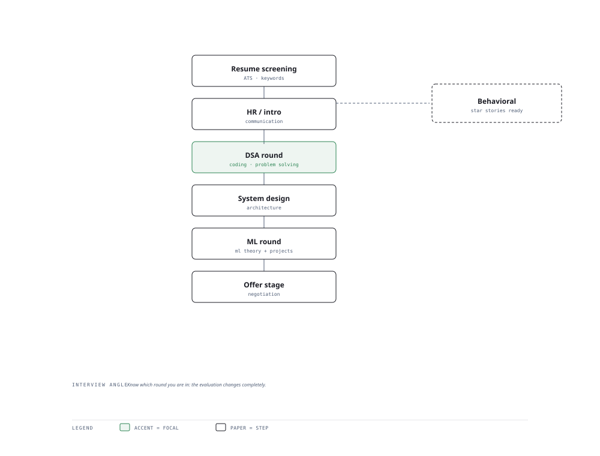

# Visual Notes — The Interview Funnel

> One diagram, the full picture. This page is meant to be glanced at before reading the chapters, and again before interviews.

# What the diagram shows

1. **Screen** — Resume and portfolio get you past the recruiter gate.
1. **Technical** — DSA, SQL, backend, then ML and system-design rounds test depth at each level.
1. **Decision** — Behavioral (STAR), negotiation, and a final conversation convert the offer.

# Why this matters for placement

- Mapping each stage to a prep plan turns vague anxiety into a checklist.
- Interviewing is a skill — mock rounds measurably improve performance.

# Quick revision

- DSA: master patterns (sliding window, two pointers, recursion) not memorised solutions.
- System design: skeleton first, then company-specific depth.
- ML rounds: know evaluation, bias/variance, and when not to use deep learning.
- Behavioral: STAR structure, quantified impact, honest failure stories.
- Negotiate with a number in mind; comp is discussable past the offer.

# Related chapters

- [DSA patterns mastery](01-dsa-patterns-mastery.md)
- [ML foundations interview](04-ml-foundations-interview.md)
- [System design interview](08-system-design-interview.md)
- [Salary negotiation](11-salary-negotiation.md)

---

**One-line answer for interviews:** *"Screening → HR → DSA → system design → ML rounds → final conversation."*
