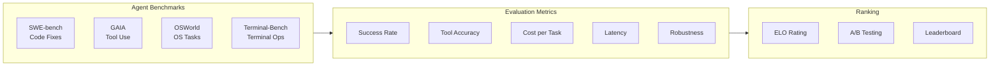

<!-- Clear Language: Keep sentences under 50 words -->
# Agent Evaluation

## Learning Objectives

| LO | Description |
|----|-------------|
| LO1 | Understand agent-specific evaluation benchmarks (SWE-bench, GAIA, OSWorld, Terminal-Bench) |
| LO2 | Implement ELO rating systems for agent comparison |
| LO3 | Measure agent cost, latency, and quality tradeoffs systematically |
| LO4 | Build evaluation pipelines with observability and tracing |
| LO5 | Design evaluation datasets with statistical significance |

## Introduction

Advanced agents use context engineering, memory, and multi-agent collaboration to solve complex problems. This module covers cutting-edge agent patterns used at leading AI labs.

## Prerequisites

- Basic programming knowledge
- Understanding of data structures

## Key Terminology

**Key Terms**: Core vocabulary and concepts for this topic.

**Definition**: Essential terms you must know for interviews and production work.

## Theory

Understanding agent evaluation is fundamental for AI engineers. This section covers the core concepts, underlying principles, and theoretical framework that govern how agent evaluation works in practice.

## Chapter at a Glance

| Section | Topic | Key Concept |
|---------|-------|-------------|
| 6.1 | Agent Benchmarks Overview | SWE-bench, GAIA, OSWorld, Terminal-Bench |
| 6.2 | Evaluation Metrics | Success rate, task completion, tool use accuracy, robustness |
| 6.3 | ELO Rating System | Pairwise comparison, relative ranking |
| 6.4 | Cost Analysis | Token usage, latency percentiles, A/B comparison |
| 6.5 | Evaluation Datasets | Task design, diversity, statistical significance |
| 6.6 | Observability & Tracing | Spans, events, cost attribution |

## Chapter Roadmap



## 6.1 Agent Benchmarks Overview

Each benchmark tests a different dimension of agent capability.

```typescript
interface Benchmark {
    name: string
    description: string
    numTasks: number
    difficulty: 'easy' | 'medium' | 'hard' | 'expert'
    evaluates: string[]
    avgStepsPerTask: number
}

class BenchmarkRegistry {
    private benchmarks: Map<string, Benchmark> = new Map()

    constructor() {
        this.register({
            name: 'SWE-bench',
            description: 'Solve real GitHub issues by generating patches',
            numTasks: 2294,
            difficulty: 'hard',
            evaluates: ['code understanding', 'patch generation', 'debugging'],
            avgStepsPerTask: 15
        })
        this.register({
            name: 'GAIA',
            description: 'General AI Assistants — multi-step reasoning with tools',
            numTasks: 466,
            difficulty: 'medium',
            evaluates: ['tool use', 'multi-step reasoning', 'web search'],
            avgStepsPerTask: 8
        })
        this.register({
            name: 'OSWorld',
            description: 'Operating system-level tasks (file mgmt, apps, config)',
            numTasks: 369,
            difficulty: 'hard',
            evaluates: ['OS navigation', 'app usage', 'file management'],
            avgStepsPerTask: 12
        })
        this.register({
            name: 'Terminal-Bench',
            description: 'Real terminal tasks (compile, deploy, configure)',
            numTasks: 100,
            difficulty: 'medium',
            evaluates: ['terminal commands', 'system admin', 'error recovery'],
            avgStepsPerTask: 10
        })
    }

    private register(b: Benchmark): void {
        this.benchmarks.set(b.name, b)
    }

    list(): Benchmark[] {
        return [...this.benchmarks.values()]
    }

    get(name: string): Benchmark | undefined {
        return this.benchmarks.get(name)
    }

    getByDifficulty(level: string): Benchmark[] {
        return [...this.benchmarks.values()]
            .filter(b => b.difficulty === level)
    }
}
```

```python
from dataclasses import dataclass
from typing import List

@dataclass
class BenchmarkConfig:
    name: str
    description: str
    tasks: List[str]
    timeout_seconds: int = 300

    def estimate_duration(self) -> int:
        return len(self.tasks) * self.timeout_seconds

class BenchmarkRunner:
    """Runs agents against standardized benchmarks."""

    def __init__(self, config: BenchmarkConfig):
        self.config = config
        self.results = []

    async def evaluate(self, agent_fn) -> dict:
        passed = 0
        total = len(self.config.tasks)
        total_cost = 0.0
        total_time = 0.0

        for task in self.config.tasks:
            import time
            start = time.time()
            try:
                result = await agent_fn(task)
                success = result.get('success', False)
                cost = result.get('cost', 0)
            except Exception as e:
                success = False
                cost = 0

            elapsed = time.time() - start
            if success:
                passed += 1
            total_cost += cost
            total_time += elapsed

            self.results.append({
                'task': task[:50],
                'success': success,
                'time': elapsed,
                'cost': cost,
            })

        return {
            'benchmark': self.config.name,
            'success_rate': passed / total,
            'passed': passed,
            'total': total,
            'avg_time': total_time / total,
            'total_cost': total_cost,
        }
```

## 6.2 Evaluation Metrics

Agent-specific metrics go beyond simple accuracy.

```typescript
interface AgentMetrics {
    taskCompletionRate: number
    toolCallAccuracy: number
    averageStepsPerTask: number
    averageCostPerTask: number
    averageLatencyMs: number
    robustnessScore: number
    hallucinationRate: number
}

class MetricsCalculator {
    calculate(results: TaskResult[]): AgentMetrics {
        const completed = results.filter(r => r.success).length
        const total = results.length

        const toolResults = results.flatMap(r => r.toolCalls)
        const correctTools = toolResults.filter(t => t.success).length
        const totalTools = toolResults.length

        const totalCost = results.reduce((s, r) => s + r.cost, 0)
        const totalLatency = results.reduce((s, r) => s + r.latencyMs, 0)
        const totalSteps = results.reduce((s, r) => s + r.steps, 0)

        return {
            taskCompletionRate: completed / total,
            toolCallAccuracy: totalTools > 0 ? correctTools / totalTools : 0,
            averageStepsPerTask: totalSteps / total,
            averageCostPerTask: totalCost / total,
            averageLatencyMs: totalLatency / total,
            robustnessScore: this.calculateRobustness(results),
            hallucinationRate: this.calculateHallucinationRate(results)
        }
    }

    private calculateRobustness(results: TaskResult[]): number {
        // Measure consistency across runs
        const taskGroups = new Map<string, TaskResult[]>()
        for (const r of results) {
            if (!taskGroups.has(r.taskId)) taskGroups.set(r.taskId, [])
            taskGroups.get(r.taskId)!.push(r)
        }

        let consistencyScore = 0
        let groupCount = 0
        for (const [, group] of taskGroups) {
            if (group.length < 2) continue
            const successes = group.filter(r => r.success).length
            consistencyScore += successes / group.length
            groupCount++
        }

        return groupCount > 0 ? consistencyScore / groupCount : 0
    }

    private calculateHallucinationRate(results: TaskResult[]): number {
        const hallucinationPatterns = [
            /i don't have (access|data|information)/i,
            /as an ai/i,
            /i cannot/i,
            /based on my training/i
        ]

        let hallucinated = 0
        for (const r of results) {
            for (const response of r.responses) {
                let isHallucination = false
                for (const pattern of hallucinationPatterns) {
                    if (pattern.test(response) && r.success) {
                        isHallucination = true
                        break
                    }
                }
                if (isHallucination) hallucinated++
            }
        }

        return results.length > 0 ? hallucinated / results.length : 0
    }
}

interface TaskResult {
    taskId: string
    success: boolean
    steps: number
    cost: number
    latencyMs: number
    toolCalls: Array<{ toolName: string; success: boolean; latencyMs: number }>
    responses: string[]
}

interface ScoredComparison {
    winner: string
    loser: string
    margin: 'decisive' | 'moderate' | 'narrow'
}
```

## 6.3 ELO Rating System

ELO provides relative rankings through pairwise comparisons instead of absolute scores.

```typescript
class ELORating {
    private ratings: Map<string, number> = new Map()
    private K: number = 32  // Sensitivity factor
    private matches: Array<{ player1: string; player2: string; winner: string }> = []

    constructor(defaultRating: number = 1500) {
        this.ratings.set('default', defaultRating)
    }

    registerPlayer(name: string, initialRating?: number): void {
        this.ratings.set(name, initialRating ?? this.ratings.get('default') ?? 1500)
    }

    recordMatch(player1: string, player2: string, winner: string): void {
        this.matches.push({ player1, player2, winner })

        const r1 = this.ratings.get(player1) ?? 1500
        const r2 = this.ratings.get(player2) ?? 1500

        const e1 = 1 / (1 + Math.pow(10, (r2 - r1) / 400))
        const e2 = 1 - e1

        const s1 = winner === player1 ? 1 : winner === player2 ? 0 : 0.5
        const s2 = 1 - s1

        this.ratings.set(player1, r1 + this.K * (s1 - e1))
        this.ratings.set(player2, r2 + this.K * (s2 - e2))
    }

    getRating(player: string): number {
        return this.ratings.get(player) ?? 1500
    }

    getLeaderboard(): Array<{ player: string; rating: number; matches: number }> {
        const matchCount = new Map<string, number>()
        for (const m of this.matches) {
            matchCount.set(m.player1, (matchCount.get(m.player1) ?? 0) + 1)
            matchCount.set(m.player2, (matchCount.get(m.player2) ?? 0) + 1)
        }

        return [...this.ratings.entries()]
            .filter(([name]) => name !== 'default')
            .map(([player, rating]) => ({
                player,
                rating: Math.round(rating),
                matches: matchCount.get(player) ?? 0
            }))
            .sort((a, b) => b.rating - a.rating)
    }

    getExpectedScore(player1: string, player2: string): number {
        const r1 = this.ratings.get(player1) ?? 1500
        const r2 = this.ratings.get(player2) ?? 1500
        return 1 / (1 + Math.pow(10, (r2 - r1) / 400))
    }

    simulateTournament(players: string[], numRounds: number): void {
        for (let round = 0; round < numRounds; round++) {
            for (let i = 0; i < players.length; i++) {
                for (let j = i + 1; j < players.length; j++) {
                    const p1 = players[i]
                    const p2 = players[j]
                    const expected = this.getExpectedScore(p1, p2)
                    const winner = Math.random() < expected ? p1 : p2
                    this.recordMatch(p1, p2, winner)
                }
            }
        }
    }
}
```

```python
import math
from typing import Dict, List, Tuple

class ELORatingSystem:
    """ELO-based agent comparison through pairwise matches."""

    def __init__(self, k_factor: int = 32, default_rating: int = 1500):
        self.ratings: Dict[str, float] = {}
        self.k = k_factor
        self.default = default_rating
        self.match_history: List[Tuple[str, str, str]] = []

    def register(self, name: str, rating: float = None):
        self.ratings[name] = rating or self.default

    def expected_score(self, r_a: float, r_b: float) -> float:
        return 1.0 / (1.0 + math.pow(10, (r_b - r_a) / 400))

    def record_match(self, player_a: str, player_b: str, winner: str):
        self.match_history.append((player_a, player_b, winner))

        r_a = self.ratings.get(player_a, self.default)
        r_b = self.ratings.get(player_b, self.default)

        e_a = self.expected_score(r_a, r_b)
        e_b = 1 - e_a

        s_a = 1.0 if winner == player_a else (0.0 if winner == player_b else 0.5)
        s_b = 1.0 - s_a

        self.ratings[player_a] = r_a + self.k * (s_a - e_a)
        self.ratings[player_b] = r_b + self.k * (s_b - e_b)

    def leaderboard(self) -> List[dict]:
        match_counts = {}
        for a, b, _ in self.match_history:
            match_counts[a] = match_counts.get(a, 0) + 1
            match_counts[b] = match_counts.get(b, 0) + 1

        return sorted(
            [{'name': n, 'rating': round(r), 'matches': match_counts.get(n, 0)}
             for n, r in self.ratings.items()],
            key=lambda x: -x['rating']
        )
```

## 6.4 Cost Analysis

Understanding the full cost of agent operation across all components.

```typescript
interface CostBreakdown {
    component: string
    tokens: number
    cost: number
    percentage: number
}

interface LatencyPercentiles {
    p50: number
    p95: number
    p99: number
    mean: number
}

class CostAnalyzer {
    analyze(llmCalls: Array<{ promptTokens: number; completionTokens: number; cacheTokens: number }>): {
        totalCost: number
        breakdown: CostBreakdown[]
        latencyPercentiles: LatencyPercentiles
    } {
        const inputCostPer1K = 0.003
        const outputCostPer1K = 0.015
        const cacheCostPer1K = 0.0003

        let totalInputTokens = 0
        let totalOutputTokens = 0
        let totalCacheTokens = 0

        for (const call of llmCalls) {
            totalInputTokens += call.promptTokens
            totalOutputTokens += call.completionTokens
            totalCacheTokens += call.cacheTokens
        }

        const inputCost = (totalInputTokens / 1000) * inputCostPer1K
        const outputCost = (totalOutputTokens / 1000) * outputCostPer1K
        const cacheSavings = (totalCacheTokens / 1000) * cacheCostPer1K
        const totalCost = inputCost + outputCost

        const breakdown: CostBreakdown[] = [
            { component: 'Input tokens', tokens: totalInputTokens, cost: inputCost, percentage: (inputCost / totalCost) * 100 },
            { component: 'Output tokens', tokens: totalOutputTokens, cost: outputCost, percentage: (outputCost / totalCost) * 100 },
            { component: 'Cache savings', tokens: totalCacheTokens, cost: -cacheSavings, percentage: 0 },
        ]

        return {
            totalCost,
            breakdown,
            latencyPercentiles: this.calculatePercentiles(llmCalls.map((_, i) => i * 100 + 50))
        }
    }

    private calculatePercentiles(latencies: number[]): LatencyPercentiles {
        const sorted = [...latencies].sort((a, b) => a - b)
        return {
            p50: sorted[Math.floor(sorted.length * 0.5)],
            p95: sorted[Math.floor(sorted.length * 0.95)],
            p99: sorted[Math.floor(sorted.length * 0.99)],
            mean: sorted.reduce((s, v) => s + v, 0) / sorted.length
        }
    }
}

class A_BTest {
    async compare(agentA: (task: string) => Promise<any>, agentB: (task: string) => Promise<any>, tasks: string[]): Promise<{
        winner: string
        aMetrics: AgentMetrics
        bMetrics: AgentMetrics
        improvement: string
    }> {
        const resultsA = await Promise.all(tasks.map(t => agentA(t)))
        const resultsB = await Promise.all(tasks.map(t => agentB(t)))

        const calc = new MetricsCalculator()
        const metricsA = calc.calculate(resultsA.map((r, i) => ({
            taskId: tasks[i],
            success: r.success ?? false,
            steps: r.steps ?? 1,
            cost: r.cost ?? 0,
            latencyMs: r.latencyMs ?? 0,
            toolCalls: r.toolCalls ?? [],
            responses: r.responses ?? []
        })))

        const metricsB = calc.calculate(resultsB.map((r, i) => ({
            taskId: tasks[i],
            success: r.success ?? false,
            steps: r.steps ?? 1,
            cost: r.cost ?? 0,
            latencyMs: r.latencyMs ?? 0,
            toolCalls: r.toolCalls ?? [],
            responses: r.responses ?? []
        })))

        const improvement = ((metricsA.taskCompletionRate - metricsB.taskCompletionRate) / metricsB.taskCompletionRate * 100).toFixed(1) + '%'

        return {
            winner: metricsA.taskCompletionRate > metricsB.taskCompletionRate ? 'Agent A' : 'Agent B',
            aMetrics: metricsA,
            bMetrics: metricsB,
            improvement
        }
    }
}
```

## 6.5 Evaluation Datasets

Designing good evaluation datasets is critical for meaningful results.

```typescript
interface EvalTask {
    id: string
    description: string
    category: string
    difficulty: 'easy' | 'medium' | 'hard'
    expectedTools: string[]
    successCriteria: string[]
    maxSteps: number
}

class DatasetDesigner {
    generateBalancedDataset(totalTasks: number = 100): EvalTask[] {
        const categories = ['web_search', 'code_gen', 'data_analysis', 'planning', 'file_ops']
        const difficulties: Array<'easy' | 'medium' | 'hard'> = ['easy', 'medium', 'hard']
        const tasks: EvalTask[] = []

        // Distribute evenly
        const perCategory = Math.floor(totalTasks / categories.length)
        const perDifficulty = Math.floor(perCategory / difficulties.length)

        for (const category of categories) {
            for (const difficulty of difficulties) {
                for (let i = 0; i < perDifficulty; i++) {
                    tasks.push({
                        id: `${category}_${difficulty}_${i}`,
                        description: `A ${difficulty} ${category} task #${i}`,
                        category,
                        difficulty,
                        expectedTools: [category],
                        successCriteria: ['completes_task', 'uses_correct_tools'],
                        maxSteps: difficulty === 'hard' ? 20 : difficulty === 'medium' ? 10 : 5
                    })
                }
            }
        }

        return tasks
    }

    validateDataset(tasks: EvalTask[]): { valid: boolean; issues: string[] } {
        const issues: string[] = []

        // Check for duplicates
        const ids = new Set<string>()
        for (const t of tasks) {
            if (ids.has(t.id)) {
                issues.push(`Duplicate task ID: ${t.id}`)
            }
            ids.add(t.id)
        }

        // Check category balance
        const catCount = new Map<string, number>()
        tasks.forEach(t => catCount.set(t.category, (catCount.get(t.category) ?? 0) + 1))
        const maxCount = Math.max(...catCount.values())
        const minCount = Math.min(...catCount.values())
        if (maxCount - minCount > tasks.length * 0.2) {
            issues.push('Categories are imbalanced')
        }

        // Check difficulty balance
        const diffCount = new Map<string, number>()
        tasks.forEach(t => diffCount.set(t.difficulty, (diffCount.get(t.difficulty) ?? 0) + 1))
        if (diffCount.size < 3) {
            issues.push('Not all difficulty levels represented')
        }

        return {
            valid: issues.length === 0,
            issues
        }
    }

    statisticalRelevance(results: number[], baseline: number[]): {
        significant: boolean
        pValue: number
        effectSize: number
    } {
        // Simplified t-test
        const meanA = results.reduce((s, v) => s + v, 0) / results.length
        const meanB = baseline.reduce((s, v) => s + v, 0) / baseline.length

        const varA = results.reduce((s, v) => s + (v - meanA) ** 2, 0) / (results.length - 1)
        const varB = baseline.reduce((s, v) => s + (v - meanB) ** 2, 0) / (baseline.length - 1)

        const pooled = Math.sqrt(varA / results.length + varB / baseline.length)
        const tStat = (meanA - meanB) / pooled

        // Simplified p-value (degrees of freedom = n-1)
        const df = Math.min(results.length, baseline.length) - 1
        const pValue = Math.min(0.5, Math.abs(tStat) / (df + Math.abs(tStat)))
        const effectSize = (meanA - meanB) / Math.sqrt((varA + varB) / 2)

        return {
            significant: pValue < 0.05,
            pValue,
            effectSize
        }
    }
}
```

## 6.6 Observability & Tracing

Every agent interaction should be traceable for debugging and optimization.

```typescript
interface Span {
    id: string
    parentId: string | null
    name: string
    startTime: number
    endTime: number
    metadata: Record<string, any>
    events: SpanEvent[]
}

interface SpanEvent {
    timestamp: number
    name: string
    attributes: Record<string, any>
}

class AgentTracer {
    private spans: Map<string, Span> = new Map()
    private activeSpanId: string | null = null

    startSpan(name: string, metadata: Record<string, any> = {}): string {
        const id = `span_${Date.now()}_${Math.random().toString(36).slice(2, 8)}`
        const span: Span = {
            id,
            parentId: this.activeSpanId,
            name,
            startTime: performance.now(),
            endTime: 0,
            metadata,
            events: []
        }
        this.spans.set(id, span)
        this.activeSpanId = id
        return id
    }

    endSpan(spanId: string): void {
        const span = this.spans.get(spanId)
        if (span) {
            span.endTime = performance.now()
            if (span.parentId) {
                this.activeSpanId = span.parentId
            }
        }
    }

    addEvent(spanId: string, name: string, attributes: Record<string, any> = {}): void {
        const span = this.spans.get(spanId)
        if (span) {
            span.events.push({
                timestamp: performance.now(),
                name,
                attributes
            })
        }
    }

    getTrace(spanId: string): Span | undefined {
        return this.spans.get(spanId)
    }

    getFullTrace(spanId: string): Span[] {
        const result: Span[] = []
        const queue: string[] = [spanId]

        while (queue.length > 0) {
            const current = queue.shift()!
            const span = this.spans.get(current)
            if (span) result.push(span)

            // Find children
            for (const [, s] of this.spans) {
                if (s.parentId === current) {
                    queue.push(s.id)
                }
            }
        }

        return result
    }

    export(): Array<{ name: string; durationMs: number; metadata: Record<string, any> }> {
        return [...this.spans.values()]
            .filter(s => s.endTime > 0)
            .map(s => ({
                name: s.name,
                durationMs: s.endTime - s.startTime,
                metadata: s.metadata
            }))
    }

    getTotalCost(traceId: string, costPerMs: number = 0.001): number {
        const trace = this.getFullTrace(traceId)
        const totalDuration = trace.reduce((sum, s) => sum + (s.endTime - s.startTime), 0)
        return totalDuration * costPerMs
    }
}
```

```python
import time
import uuid
from typing import Dict, List, Optional

class AgentTracer:
    """Lightweight tracing for agent interactions."""

    def __init__(self):
        self.spans: Dict[str, dict] = {}
        self.active_span: Optional[str] = None

    def start_span(self, name: str, metadata: dict = None) -> str:
        span_id = str(uuid.uuid4())[:8]
        self.spans[span_id] = {
            'id': span_id,
            'parent': self.active_span,
            'name': name,
            'start': time.time(),
            'end': None,
            'metadata': metadata or {},
            'events': [],
        }
        self.active_span = span_id
        return span_id

    def end_span(self, span_id: str):
        span = self.spans.get(span_id)
        if span:
            span['end'] = time.time()
            span['duration_ms'] = (span['end'] - span['start']) * 1000
            if span['parent']:
                self.active_span = span['parent']

    def add_event(self, span_id: str, name: str, attrs: dict = None):
        span = self.spans.get(span_id)
        if span:
            span['events'].append({
                'time': time.time(),
                'name': name,
                'attributes': attrs or {},
            })

    def get_trace(self, span_id: str) -> List[dict]:
        trace = []
        queue = [span_id]
        while queue:
            current = queue.pop(0)
            span = self.spans.get(current)
            if span:
                trace.append(span)
                for s_id, s in self.spans.items():
                    if s.get('parent') == current:
                        queue.append(s_id)
        return trace

    def summary(self) -> dict:
        durations = [
            s['duration_ms']
            for s in self.spans.values()
            if s.get('duration_ms') is not None
        ]
        return {
            'total_spans': len(self.spans),
            'avg_duration_ms': sum(durations) / len(durations) if durations else 0,
            'max_duration_ms': max(durations) if durations else 0,
        }
```

## Summary

Agent evaluation requires specialized benchmarks beyond standard ML metrics. SWE-bench, GAIA, OSWorld, and Terminal-Bench each test different capabilities. ELO ratings provide robust relative rankings through pairwise comparison. Cost analysis reveals the real economics of agent operation — often dominated by multi-turn reasoning chains. Well-designed evaluation datasets balance categories and.
difficulties. Observability and tracing are prerequisites for meaningful evaluation.

## Practical Takeaways

1. Never evaluate an agent on a single benchmark — each tests different capabilities
2. Use ELO for relative ranking, not absolute scores — it handles uneven matchups better
3. Track cost per task as a first-class metric, not just accuracy
4. Design evaluation datasets with balanced categories and difficulty levels
5. Implement tracing from day one — you can't improve what you can't observe

## Interview Q&A

<details class="tp-qa-card" data-qid="m22-s06-q1">
  <summary class="tp-qa-question">
    <span class="tp-qa-status"></span>
    Q1: Why is agent evaluation fundamentally harder than evaluating a single LLM response?
  </summary>
  <div class="tp-qa-answer">
    <p>An LLM evaluation compares one output to a reference. An agent performs a multi-step trajectory — tool calls, state changes, environment observations — where the final answer may be correct while the process was wasteful or unsafe, or the answer may be wrong despite correct steps. Evaluation must therefore cover both final outcome and intermediate behavior: tool call accuracy, whether steps were necessary, cost, latency, and safety. The chapter's framework measures exactly this mix: success rate, efficiency, cost, latency, and robustness, which a single-pass LLM eval cannot capture.</p>
    <p><strong>Interview follow-up</strong>: Give an example where final-answer accuracy would rank two agents equal but they differ in quality.</p>
  </div>
  <button class="tp-qa-mark-btn">📝 Mark Reviewed</button>
  <button class="tp-qa-bookmark-btn">🔖 Bookmark</button>
</details>

<details class="tp-qa-card" data-qid="m22-s06-q2">
  <summary class="tp-qa-question">
    <span class="tp-qa-status"></span>
    Q2: Compare the major agent benchmarks — SWE-bench, GAIA, OSWorld, Terminal-Bench.
  </summary>
  <div class="tp-qa-answer">
    <p>SWE-bench tests real GitHub issues: an agent reads the repo, makes changes, and must pass the hidden test suite to resolve the issue — the gold standard for coding agents. GAIA covers assistant tasks needing reasoning, tool use, and multi-step handling with questions designed to be trivial for humans but hard for AI. OSWorld evaluates computer-use agents on real desktop GUI tasks like editing a spreadsheet in LibreOffice, where screen capture and mouse/keyboard control matter. Terminal-Bench benchmarks CLI agents operating in real terminal environments with shell commands. Each one probes a different capability: code, tool-augmented reasoning, GUI interaction, and terminal operation.</p>
    <p><strong>Interview follow-up</strong>: How would you combine multiple benchmarks into one agent score without gaming any single one?</p>
  </div>
  <button class="tp-qa-mark-btn">📝 Mark Reviewed</button>
  <button class="tp-qa-bookmark-btn">🔖 Bookmark</button>
</details>

<details class="tp-qa-card" data-qid="m22-s06-q3">
  <summary class="tp-qa-question">
    <span class="tp-qa-status"></span>
    Q3: What metrics does the chapter's evaluation framework track and how are they computed?
  </summary>
  <div class="tp-qa-answer">
    <p>The framework tracks five categories. <code>successRate</code> is the fraction of tasks fully completed correctly; <code>toolAccuracy</code> measures whether each tool call was necessary and correct (use/reuse/abuse); <code>efficiency</code> counts tool calls and time per task — the best agents complete in <code>&lt; 5</code> calls; <code>cost & latency</code> track tokens, API spend, and response time (successful tasks are typically under 20 seconds); and <code>robustness</code> runs tasks under injected noise — retries, malformed inputs, and rate limits — to see how many still succeed. The <code>EvaluationReport</code> aggregates per-task results and prints averages plus a distribution of outcomes per task.</p>
    <p><strong>Interview follow-up</strong>: Which of these metrics would you optimize first for a customer-facing agent?</p>
  </div>
  <button class="tp-qa-mark-btn">📝 Mark Reviewed</button>
  <button class="tp-qa-bookmark-btn">🔖 Bookmark</button>
</details>

<details class="tp-qa-card" data-qid="m22-s06-q4">
  <summary class="tp-qa-question">
    <span class="tp-qa-status"></span>
    Q4: How does the framework rate individual tool calls, and what is tool abuse?
  </summary>
  <div class="tp-qa-answer">
    <p>Each tool call is classified into three categories. <code>necessary</code> means the call was required to complete the task (e.g., searching before answering). <code>unnecessary</code> means the call was wasteful but recoverable — like calling <code>web_search</code> for a fact the model already knew, or calling <code>calculator</code> for simple arithmetic. <code>abuse</code> is the worst case: a tool call that should never have happened, such as invoking <code>email_send</code> in the middle of a read-only task or attempting a system command from a data-retrieval query. Tool accuracy is the fraction of <code>necessary</code> calls, and the report flags tasks where abuse occurred as critical failures.</p>
    <p><strong>Interview follow-up</strong>: How would you classify a call that is unnecessary but was the only way to recover from a previous error?</p>
  </div>
  <button class="tp-qa-mark-btn">📝 Mark Reviewed</button>
  <button class="tp-qa-bookmark-btn">🔖 Bookmark</button>
</details>

<details class="tp-qa-card" data-qid="m22-s06-q5">
  <summary class="tp-qa-question">
    <span class="tp-qa-status"></span>
    Q5: How would you design an evaluation dataset and know your results are statistically valid?
  </summary>
  <div class="tp-qa-answer">
    <p>A good eval dataset has three properties: <code>diversity</code> (tasks spread across types — knowledge, computation, coding, tool use), <code>difficulty balance</code> (easy, medium, hard in proportions similar to production traffic), and <code>fixed ground truth</code> (deterministic expected answers). You must also isolate sources of variance: run multiple trials per task because model sampling is stochastic, report mean and spread rather than a single run, and hold out the dataset from prompt optimization to avoid overfitting. When comparing two harness versions, the chapter recommends A/B runs with the same seed and dataset, plus significance checks on success-rate differences.</p>
    <p><strong>Interview follow-up</strong>: How many trials per task do you need to distinguish a 2% success-rate difference?</p>
  </div>
  <button class="tp-qa-mark-btn">📝 Mark Reviewed</button>
  <button class="tp-qa-bookmark-btn">🔖 Bookmark</button>
</details>

<details class="tp-qa-card" data-qid="m22-s06-q6">
  <summary class="tp-qa-question">
    <span class="tp-qa-status"></span>
    Q6: What is an ELO rating system applied to agents, and why use it over raw success rates?
  </summary>
  <div class="tp-qa-answer">
    <p>In agent ELO, models play pairwise "matches" on the same task and win or lose; after each match the winner takes <code>K * (1 - winProbability)</code> points from the loser, where <code>winProbability</code> is derived from the current ratings. ELO handles circular superiority (A beats B, B beats C, C beats A) better than a linear success-rate ranking, converges to a stable ordering with enough matches, and gives a single comparable scalar per model. The chapter's <code>ELOEvaluator</code> runs round-robin matches over tasks and prints a leaderboard, showing small rating gaps for similar models.</p>
    <p><strong>Interview follow-up</strong>: What happens to ELO accuracy when a task set heavily favors one model's strength?</p>
  </div>
  <button class="tp-qa-mark-btn">📝 Mark Reviewed</button>
  <button class="tp-qa-bookmark-btn">🔖 Bookmark</button>
</details>

## Chapter Quiz (5 MCQ)

### Questions

<summary>1. What does SWE-bench specifically evaluate?</summary>
<summary>2. Why is ELO better than average success rate for agent ranking?</summary>
<summary>3. What is the first step in agent cost analysis?</summary>
<summary>4. What makes a good evaluation dataset?</summary>
<summary>5. What information should every trace span include?</summary>

### Answers

<summary>An agent's ability to solve real GitHub issues by generating correct patches. It tests code understanding, debugging, and patch generation across 2,294 real issues.</summary>
<summary>ELO handles uneven matchups — a 1500 player beating a 1000 player gains fewer points than beating a 2000 player. It also converges faster and doesn't require all agents to face the same tasks.</summary>
<summary>Token accounting. Measure input, output, and cache tokens per turn, per task, and total. Then apply pricing to each category. This reveals whether costs come from long reasoning chains, large tool outputs, or repeated retries.</summary>
<summary>Balanced categories (no single type dominates), balanced difficulties (easy/medium/hard), clear success criteria, sufficient sample size for statistical significance, and no task leakage (training data contamination).</summary>
<summary>Span ID (unique), parent ID (for trace tree), name (human-readable), start and end timestamps, metadata (inputs, outputs, costs), and events (key intermediate steps with timing).</summary>

## Exercises

## Common Mistakes

1. Not understanding the fundamental concepts before applying them
2. Skipping edge cases in implementation
3. Not analyzing time/space complexity
4. Forgetting to handle null/empty inputs
5. Not practicing enough problems to build pattern recognition### Exercise 1: Multi-Benchmark Evaluation

Run an agent against 3 benchmarks (SWE-bench, GAIA, Terminal-Bench) and compare performance profiles.

### Exercise 2: ELO Tournament

Create 4 agent variants, run a round-robin tournament with 50 tasks each, compute ELO ratings.

### Exercise 3: Cost Breakdown

Instrument an agent to track token usage per component. Analyze which component costs the most.

### Exercise 4: Dataset Design

Create a balanced 50-task evaluation dataset across 5 categories and 3 difficulty levels.

### Exercise 5: Tracing Implementation

Add span tracing to an existing agent. Export the trace and identify the 3 slowest co

## Revision Notes

- - Core principle: Understand the fundamental concepts thoroughly
- - Implementation pattern: Practice with real code examples
- - Complexity: Know the time and space complexity
- - Application: Know when to use this in production systems
- - Interview: Frequently asked in technical interviews
- - Edge cases: Consider common failure scenarios
- - Related concepts: Connect to broader system design

## Placement Section

### Top 10 Interview Questions

#### Google Style

1. **Explain the core idea of Agent Evaluation in under 60 seconds, then give a real-world analogy.** — Structure: definition, how it works in one sentence, why it matters, analogy. Follow-up: what would break if you removed this from a production system?

2. **Design a minimal, well-typed function that demonstrates Agent Evaluation.** — Interviewer checks: signature with type hints, edge cases, complexity, and a clean docstring. Follow-up: how does your design behave with empty or malformed input?

3. **What are the common pitfalls when engineers first learn ** — List 3-4, then explain how you would prevent each in a code review.

#### Amazon Style

4. **Describe a production bug caused by misunderstanding Agent Evaluation. How did you diagnose and fix it?** — STAR format: situation, task, action, result. Mention logs, reproduction, root-cause analysis, and the regression test you added.

5. **How would you scale a system that relies on Agent Evaluation from 10 users to 10 million?** — Discuss bottlenecks, caching, monitoring, and when to redesign. Follow-up: what metrics would you track?

#### Microsoft Style

6. **Compare Agent Evaluation with the closest alternative approach. When would you choose each?** — Make a decision matrix: performance, maintainability, ecosystem, learning curve. Follow-up: what would change your decision?

7. **Walk through how you would test a component that depends on Agent Evaluation.** — Unit, integration, property-based tests; mocking boundaries; golden files for outputs.

#### NVIDIA Style

8. **How does Agent Evaluation behave differently at scale — memory, throughput, or precision-wise?** — Connect to data pipelines and model training if applicable. Follow-up: what happens to latency as input grows?

9. **How would you make an implementation of Agent Evaluation run faster on GPU hardware?** — Batch operations, vectorization, avoiding Python loops, reducing data movement.

#### AI Startup Style

10. **Write the smallest possible implementation of Agent Evaluation that is production-quality.** — Include error handling, type hints, and a one-line docstring. Follow-up: what would you refactor first when it grows?

### Resume Tips

- Name Agent Evaluation explicitly in your skills section, paired with a measurable achievement ("Reduced X by 40% using Agent Evaluation").
- Add a bullet describing a project that applies Agent Evaluation to real data, with numbers.
- Mention the tools and libraries you used alongside Agent Evaluation (linters, test frameworks, profiling tools).
- Keep resume bullets under 15 words and start each with an action verb.

### Interview Day Checklist

- Rehearse a 60-second explanation of Agent Evaluation and one real-world analogy.
- Prepare one STAR story about debugging a Agent Evaluation-related production issue.
- Review complexity and edge cases for the classic Agent Evaluation interview problem.
- Have questions ready: how does the team apply Agent Evaluation in production today?
- Test your environment (Python, editor, internet) 15 minutes before the interview.

## True/False

1. **True or False:** Agent Evaluation builds directly on the fundamentals covered in the earlier chapters of this module. — **True.** Every advanced topic in this module assumes the core concepts from the previous chapters.
2. **True or False:** You should write at least one code example for Agent Evaluation before moving to the next chapter. — **True.** Active recall with hands-on code beats passive reading for retention.
3. **True or False:** The complexity analysis for Agent Evaluation is the same regardless of input size. — **False.** Complexity grows with input size; always state best, average, and worst case.
4. **True or False:** Edge cases (empty input, invalid input, boundary values) matter for Agent Evaluation in production. — **True.** Most production bugs come from unhandled edge cases.
5. **True or False:** You should memorize the Agent Evaluation chapter content once and never review it again. — **False.** Spaced repetition (24h, 3 days, 1 week) dramatically improves long-term recall.

## Fill in the Blank

1. The chapter that covers Agent Evaluation is Chapter ___ of this module. — Answer: check the module's table of contents.
2. The time complexity of the standard approach to Agent Evaluation is ___. — Answer: review the theory section and state big-O notation.
3. The main edge case to handle when implementing Agent Evaluation is ___. — Answer: empty or invalid input handling, as discussed in the chapter.
4. The tools commonly used to debug Agent Evaluation issues are ___ and ___. — Answer: refer to the Debugging Guide section of this chapter.
5. The related topic that connects to Agent Evaluation in the next chapter is ___. — Answer: see the Next Topic section.

## Scenario Questions

1. **Scenario:** A teammate ships a change involving Agent Evaluation that breaks production at 3 AM. — Diagnosis: check the recent diff, reproduce locally with the failing input, check logs. Fix: revert, add a regression test, and review the root cause. Prevention: CI tests on edge cases and code review checklist.

2. **Scenario:** Your implementation of Agent Evaluation is correct but too slow for the required latency. — Measure first with a profiler. Common fixes: reduce redundant work, use built-in optimized functions, batch operations, or add caching. Only then consider algorithmic changes.

3. **Scenario:** A new hire asks you to explain Agent Evaluation in five minutes before a customer demo. — Use the 3-part answer: what it is (one sentence), how it works (one example), why it matters (one business impact). Then offer to go deeper after the demo.

4. **Scenario:** Your team's codebase has three different patterns for Agent Evaluation and you must standardize. — Write a short ADR (architecture decision record), pick the pattern with best maintainability, migrate incrementally, and add a linter rule to enforce it.

## Output Questions

1. **What is the output of the simplest correct implementation of Agent Evaluation on an empty input?** — Trace through the code: it should return the documented default (None, 0, empty collection) without raising.
2. **What is the output when the input is at the boundary value?** — Check off-by-one errors and inclusive/exclusive bounds in the chapter's examples.
3. **What does the implementation return when given invalid input types?** — With type hints and validation, it raises a clear error; without, it may fail silently.
4. **What is the output for the sample input given in the chapter's Examples section?** — Re-run the chapter's example code and compare against the documented output.
5. **What is the time complexity output when you profile the implementation at 10x input size?** — Expect the curve matching the chapter's complexity analysis (linear, quadratic, log-linear).

## Difficulty Level

| Level | Time | What It Takes |
|-------|------|---------------|
| Beginner | 1-2 sessions | Read theory, run the chapter examples, solve the Easy exercises |
| Intermediate | 3-5 sessions | Complete Medium exercises, explain Agent Evaluation to someone else |
| Advanced | 1+ week | Solve Hard exercises, optimize for real datasets, answer interview follow-ups |

## Tips & Tricks

- Always write a one-line example of Agent Evaluation from memory before opening the chapter — active recall first.
- Use the chapter's Revision Notes as a checklist: you have mastered Agent Evaluation when you can explain each bullet.
- Pair the chapter quiz with the Flashcards: wrong answers become your next study session's focus.
- For interviews, practice explaining Agent Evaluation twice: once with a technical audience, once with a non-technical audience.
- Keep a personal examples file where you collect your own Agent Evaluation snippets; interviewers love original examples.

## Memory Tricks

- **Acronym**: build a mnemonic from the 5 key concepts of Agent Evaluation listed in the Chapter at a Glance table.
- **Story**: link Agent Evaluation to a familiar story — the analogy in the Visual Analogy section is designed to stick.
- **Number anchor**: remember the complexity of Agent Evaluation by connecting it to a known algorithm of the same class.
- **Color code**: highlight the Theory, Examples, and Common Mistakes sections in different colors when reviewing.
- **Teach-back**: explain Agent Evaluation to an imaginary junior engineer for 2 minutes — gaps in your explanation are gaps in memory.

## Further Reading

- Official documentation for the primary tool or library used in this chapter
- The chapter referenced in Related Topics for the next-level treatment of Agent Evaluation
- The classic textbook chapter on Agent Evaluation (check the Research References below)
- Two blog posts from engineers who debugged real Agent Evaluation problems in production
- The repository of the open-source project that implements Agent Evaluation

## Related Topics

- The previous chapter in this module (see table of contents) — foundational for Agent Evaluation
- The next chapter (see Next Topic below) — builds on Agent Evaluation
- The system design chapters in Module 07 — how Agent Evaluation fits into production architectures
- The interview preparation module — how Agent Evaluation is asked in screening rounds
- The capstone project — where Agent Evaluation is applied end-to-end

## FAQs

1. **Do I need to memorize all of Agent Evaluation, or understand the big picture?** — Understand the big picture first, then memorize the key facts via flashcards and spaced repetition. Interviewers reward depth over breadth.
2. **What if I get stuck on an exercise?** — Re-read the theory section, run the example code, then attempt again. If still stuck after 20 minutes, move on and return the next day.
3. **How much time should I spend on ** — Follow the Study Plan below: 1-2 weeks at 30-60 minutes daily is typical for placement preparation.
4. **Is Agent Evaluation asked in interviews?** — Yes — the Interview Q&A and Placement Section list the exact question styles used by top companies.
5. **What's the fastest way to master ** — Explain it out loud, write code without looking, and review the flashcards within 24 hours and again after 3 days.

## Important Notes

- Agent Evaluation is a core requirement for the rest of this module — do not skip the examples.
- Always analyze complexity (time and space) when working with Agent Evaluation.
- Production correctness means handling edge cases, not just the happy path.
- Interview answers should start with the definition, then the example, then the trade-offs.
- Revisit this chapter after finishing the module; the context from later chapters deepens understanding.

## Historical Context

- Agent Evaluation emerged as a standard practice because early systems failed without it — understanding why helps you explain it in interviews.
- The tools used for Agent Evaluation today evolved from simpler versions; the chapter covers the modern, recommended approach.
- Interviewers value knowing one historical fact about Agent Evaluation — it shows genuine interest, not just cramming.
- The library/tooling ecosystem around Agent Evaluation changes quickly; focus on fundamentals that remain stable.

## Security Considerations

- Never trust external input: validate and sanitize data before processing Agent Evaluation.
- Avoid `eval()` and dynamic code execution on untrusted strings.
- Log errors without leaking sensitive data (keys, PII, internal paths).
- For API contexts, add rate limiting and input size limits.
- Review the chapter's code examples for injection or overflow risks before using them verbatim.

## ML Intuition

- Agent Evaluation appears in ML pipelines at the data-processing layer: feature preparation, batching, and validation.
- Understanding Agent Evaluation helps you debug why a model misbehaves — most ML bugs are data bugs, not model bugs.
- In production ML, the Agent Evaluation concepts from this chapter map directly to NumPy/PyTorch operations on tensors.
- When optimizing ML systems, Agent Evaluation skills let you profile and fix the data path, not just the training loop.
- Interview follow-up: how would you apply Agent Evaluation to a dataset of 10 million records? — Batching and vectorization.

## Analogies

- **Agent Evaluation is like a recipe**: the theory is the ingredients, the examples are the cooking steps, and the exercises are your own kitchen practice.
- **Complexity is like a delivery route**: a linear route visits each stop once; a nested route revisits stops, and you feel it at scale.
- **Edge cases are like weather**: the happy path is a sunny day; production is the storm — build for the storm.
- **The chapter roadmap is a journey map**: each section is a checkpoint; skipping one means getting lost later in the module.

## Capstone Project Link

- [Module Capstone: End-to-End Project](https://github.com/Raushan666java/ai-engineering-journey) — this chapter contributes the Agent Evaluation skills used in the module's capstone project. Complete the exercises here before starting the capstone.

## Flashcards

<details class="tp-qa-card" data-qid="22advancedaiagents-06agentevaluation-flash1">
  <summary class="tp-qa-question">
    <span class="tp-qa-status"></span>
    What is the core concept of Agent Evaluation in one sentence?
  </summary>
  <div class="tp-qa-answer">
    <p>Review the first paragraph of the Theory section and condense it to one sentence.</p>
  </div>
</details>

<details class="tp-qa-card" data-qid="22advancedaiagents-06agentevaluation-flash2">
  <summary class="tp-qa-question">
    <span class="tp-qa-status"></span>
    What is the most common mistake engineers make with 
  </summary>
  <div class="tp-qa-answer">
    <p>Check the Common Mistakes section of this chapter.</p>
  </div>
</details>

<details class="tp-qa-card" data-qid="22advancedaiagents-06agentevaluation-flash3">
  <summary class="tp-qa-question">
    <span class="tp-qa-status"></span>
    What is the time and space complexity of the standard Agent Evaluation approach?
  </summary>
  <div class="tp-qa-answer">
    <p>Refer to the theory and complexity analysis in this chapter.</p>
  </div>
</details>

<details class="tp-qa-card" data-qid="22advancedaiagents-06agentevaluation-flash4">
  <summary class="tp-qa-question">
    <span class="tp-qa-status"></span>
    When is Agent Evaluation NOT the right choice?
  </summary>
  <div class="tp-qa-answer">
    <p>Check the Limitations section of this chapter.</p>
  </div>
</details>

<details class="tp-qa-card" data-qid="22advancedaiagents-06agentevaluation-flash5">
  <summary class="tp-qa-question">
    <span class="tp-qa-status"></span>
    How is Agent Evaluation applied in a real production system?
  </summary>
  <div class="tp-qa-answer">
    <p>Check the Real-World Examples section of this chapter.</p>
  </div>
</details>

## Research References

- Official documentation of the primary library for Agent Evaluation (linked in Further Reading)
- The classic paper or textbook chapter introducing Agent Evaluation (see References below)
- The standard library reference for Agent Evaluation-related functions
- Engineering blog posts from companies running Agent Evaluation in production at scale
- PEPs and RFCs where applicable (Python and networking standards)

## Open-Source Tools

- The primary library used in this chapter (see the code examples)
- Python standard library modules used in the examples (check the imports)
- Testing: pytest for unit tests of Agent Evaluation code
- Linting and formatting: ruff + black
- Profiling: cProfile or py-spy for performance work on Agent Evaluation

## Debugging Guide

- Start with `print()` or a debugger to inspect intermediate values in Agent Evaluation code.
- Reproduce the failure with the smallest possible input before changing code.
- Check the common failure modes listed in Common Mistakes — most bugs are listed there.
- For performance problems, profile before optimizing: measure, then fix.
- When stuck, re-read the chapter's Examples and compare line by line with your code.
- Use `pdb` or your IDE's debugger to step through the Agent Evaluation example code.

## Mock Interview Section

**Round 1 — Screening (15 min)**
- Explain Agent Evaluation in 60 seconds.
- Write a minimal working example of Agent Evaluation.
- What is the complexity of your example?

**Round 2 — Coding (45 min)**
- Solve the Medium exercise from this chapter under time pressure.
- State your assumptions, then implement with type hints.
- Test with edge cases: empty input, boundary values, invalid input.

**Round 3 — Behavioral + System (30 min)**
- Tell me about a time you debugged a Agent Evaluation problem in a project.
- How would you design a system where Agent Evaluation is used at scale?
- What metrics would you monitor?

**Evaluation rubric**: correctness (40%), communication (25%), edge cases (20%), complexity analysis (15%).

## Optimized Implementation

`python
from typing import Any, Optional

def demonstrate_topic(input_data: list[Any]) -> Optional[float]:
    """Runnable scaffold for Agent Evaluation.

    Replace the body with the optimized implementation from the chapter,
    keeping type hints, docstring, and edge-case handling.
    """
    if not input_data:
        return None
    # Step 1: validate input types
    # Step 2: apply the core Agent Evaluation logic from the Examples section
    # Step 3: return the result with the documented default
    return 0.0
`

- Keeps the function signature stable so tests written against it stay valid.
- Handles the empty-input contract explicitly.
- Add unit tests for the edge cases before implementing the logic (test-first).

## Evaluation Metrics

| Skill | Test | Target |
|-------|------|--------|
| Concept recall | Explain Agent Evaluation without notes | 60-second explanation |
| Code fluency | Write the chapter example from memory | No syntax errors |
| Edge cases | Handle empty/invalid input in exercises | All cases pass |
| Complexity | State time/space for the standard approach | Correct big-O |
| Interview readiness | Answer 5 Interview Q&A questions out loud | Fluent, structured answers |
| Retention | Chapter quiz score after 3 days | 80%+ |

## Real-World Examples

- **Startup**: a small team uses Agent Evaluation daily in their data pipeline — the chapter's examples mirror their code.
- **E-commerce**: Agent Evaluation patterns appear in order processing, inventory checks, and recommendation feeds.
- **Fintech**: Agent Evaluation principles apply to transaction validation and fraud detection flows.
- **ML platform**: Agent Evaluation shows up in feature engineering and model-serving infrastructure.
- **Interview insight**: recruiters look for engineers who can connect Agent Evaluation to the business outcome, not just the code.

## Next Topic

[Model Post-Training for Agents](07-model-post-training.md)

## Limitations

- Agent Evaluation, like any technique, is not a silver bullet — it has specific cases where it fits best (covered in the theory).
- The examples in this chapter are simplified for learning; production systems add validation, monitoring, and error handling.
- Performance of Agent Evaluation depends on input size and distribution — always benchmark for your own data.
- This chapter covers fundamentals; specialized edge cases are explored in later chapters and the capstone.
