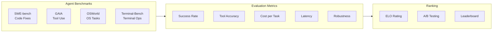

# Agent Evaluation

## Learning Objectives

| LO | Description |
|----|-------------|
| LO1 | Understand agent-specific evaluation benchmarks (SWE-bench, GAIA, OSWorld, Terminal-Bench) |
| LO2 | Implement ELO rating systems for agent comparison |
| LO3 | Measure agent cost, latency, and quality tradeoffs systematically |
| LO4 | Build evaluation pipelines with observability and tracing |
| LO5 | Design evaluation datasets with statistical significance |

## Chapter at a Glance

| Section | Topic | Key Concept |
|---------|-------|-------------|
| 6.1 | Agent Benchmarks Overview | SWE-bench, GAIA, OSWorld, Terminal-Bench |
| 6.2 | Evaluation Metrics | Success rate, task completion, tool use accuracy, robustness |
| 6.3 | ELO Rating System | Pairwise comparison, relative ranking |
| 6.4 | Cost Analysis | Token usage, latency percentiles, A/B comparison |
| 6.5 | Evaluation Datasets | Task design, diversity, statistical significance |
| 6.6 | Observability & Tracing | Spans, events, cost attribution |

## Chapter Roadmap



## 6.1 Agent Benchmarks Overview

Each benchmark tests a different dimension of agent capability.

```typescript
interface Benchmark {
    name: string
    description: string
    numTasks: number
    difficulty: 'easy' | 'medium' | 'hard' | 'expert'
    evaluates: string[]
    avgStepsPerTask: number
}

class BenchmarkRegistry {
    private benchmarks: Map<string, Benchmark> = new Map()

    constructor() {
        this.register({
            name: 'SWE-bench',
            description: 'Solve real GitHub issues by generating patches',
            numTasks: 2294,
            difficulty: 'hard',
            evaluates: ['code understanding', 'patch generation', 'debugging'],
            avgStepsPerTask: 15
        })
        this.register({
            name: 'GAIA',
            description: 'General AI Assistants — multi-step reasoning with tools',
            numTasks: 466,
            difficulty: 'medium',
            evaluates: ['tool use', 'multi-step reasoning', 'web search'],
            avgStepsPerTask: 8
        })
        this.register({
            name: 'OSWorld',
            description: 'Operating system-level tasks (file mgmt, apps, config)',
            numTasks: 369,
            difficulty: 'hard',
            evaluates: ['OS navigation', 'app usage', 'file management'],
            avgStepsPerTask: 12
        })
        this.register({
            name: 'Terminal-Bench',
            description: 'Real terminal tasks (compile, deploy, configure)',
            numTasks: 100,
            difficulty: 'medium',
            evaluates: ['terminal commands', 'system admin', 'error recovery'],
            avgStepsPerTask: 10
        })
    }

    private register(b: Benchmark): void {
        this.benchmarks.set(b.name, b)
    }

    list(): Benchmark[] {
        return [...this.benchmarks.values()]
    }

    get(name: string): Benchmark | undefined {
        return this.benchmarks.get(name)
    }

    getByDifficulty(level: string): Benchmark[] {
        return [...this.benchmarks.values()]
            .filter(b => b.difficulty === level)
    }
}
```

```python
from dataclasses import dataclass
from typing import List


@dataclass
class BenchmarkConfig:
    name: str
    description: str
    tasks: List[str]
    timeout_seconds: int = 300

    def estimate_duration(self) -> int:
        return len(self.tasks) * self.timeout_seconds


class BenchmarkRunner:
    """Runs agents against standardized benchmarks."""

    def __init__(self, config: BenchmarkConfig):
        self.config = config
        self.results = []

    async def evaluate(self, agent_fn) -> dict:
        passed = 0
        total = len(self.config.tasks)
        total_cost = 0.0
        total_time = 0.0

        for task in self.config.tasks:
            import time
            start = time.time()
            try:
                result = await agent_fn(task)
                success = result.get('success', False)
                cost = result.get('cost', 0)
            except Exception as e:
                success = False
                cost = 0

            elapsed = time.time() - start
            if success:
                passed += 1
            total_cost += cost
            total_time += elapsed

            self.results.append({
                'task': task[:50],
                'success': success,
                'time': elapsed,
                'cost': cost,
            })

        return {
            'benchmark': self.config.name,
            'success_rate': passed / total,
            'passed': passed,
            'total': total,
            'avg_time': total_time / total,
            'total_cost': total_cost,
        }
```

## 6.2 Evaluation Metrics

Agent-specific metrics go beyond simple accuracy.

```typescript
interface AgentMetrics {
    taskCompletionRate: number
    toolCallAccuracy: number
    averageStepsPerTask: number
    averageCostPerTask: number
    averageLatencyMs: number
    robustnessScore: number
    hallucinationRate: number
}

class MetricsCalculator {
    calculate(results: TaskResult[]): AgentMetrics {
        const completed = results.filter(r => r.success).length
        const total = results.length

        const toolResults = results.flatMap(r => r.toolCalls)
        const correctTools = toolResults.filter(t => t.success).length
        const totalTools = toolResults.length

        const totalCost = results.reduce((s, r) => s + r.cost, 0)
        const totalLatency = results.reduce((s, r) => s + r.latencyMs, 0)
        const totalSteps = results.reduce((s, r) => s + r.steps, 0)

        return {
            taskCompletionRate: completed / total,
            toolCallAccuracy: totalTools > 0 ? correctTools / totalTools : 0,
            averageStepsPerTask: totalSteps / total,
            averageCostPerTask: totalCost / total,
            averageLatencyMs: totalLatency / total,
            robustnessScore: this.calculateRobustness(results),
            hallucinationRate: this.calculateHallucinationRate(results)
        }
    }

    private calculateRobustness(results: TaskResult[]): number {
        // Measure consistency across runs
        const taskGroups = new Map<string, TaskResult[]>()
        for (const r of results) {
            if (!taskGroups.has(r.taskId)) taskGroups.set(r.taskId, [])
            taskGroups.get(r.taskId)!.push(r)
        }

        let consistencyScore = 0
        let groupCount = 0
        for (const [, group] of taskGroups) {
            if (group.length < 2) continue
            const successes = group.filter(r => r.success).length
            consistencyScore += successes / group.length
            groupCount++
        }

        return groupCount > 0 ? consistencyScore / groupCount : 0
    }

    private calculateHallucinationRate(results: TaskResult[]): number {
        const hallucinationPatterns = [
            /i don't have (access|data|information)/i,
            /as an ai/i,
            /i cannot/i,
            /based on my training/i
        ]

        let hallucinated = 0
        for (const r of results) {
            for (const response of r.responses) {
                let isHallucination = false
                for (const pattern of hallucinationPatterns) {
                    if (pattern.test(response) && r.success) {
                        isHallucination = true
                        break
                    }
                }
                if (isHallucination) hallucinated++
            }
        }

        return results.length > 0 ? hallucinated / results.length : 0
    }
}

interface TaskResult {
    taskId: string
    success: boolean
    steps: number
    cost: number
    latencyMs: number
    toolCalls: Array<{ toolName: string; success: boolean; latencyMs: number }>
    responses: string[]
}

interface ScoredComparison {
    winner: string
    loser: string
    margin: 'decisive' | 'moderate' | 'narrow'
}
```

## 6.3 ELO Rating System

ELO provides relative rankings through pairwise comparisons instead of absolute scores.

```typescript
class ELORating {
    private ratings: Map<string, number> = new Map()
    private K: number = 32  // Sensitivity factor
    private matches: Array<{ player1: string; player2: string; winner: string }> = []

    constructor(defaultRating: number = 1500) {
        this.ratings.set('default', defaultRating)
    }

    registerPlayer(name: string, initialRating?: number): void {
        this.ratings.set(name, initialRating ?? this.ratings.get('default') ?? 1500)
    }

    recordMatch(player1: string, player2: string, winner: string): void {
        this.matches.push({ player1, player2, winner })

        const r1 = this.ratings.get(player1) ?? 1500
        const r2 = this.ratings.get(player2) ?? 1500

        const e1 = 1 / (1 + Math.pow(10, (r2 - r1) / 400))
        const e2 = 1 - e1

        const s1 = winner === player1 ? 1 : winner === player2 ? 0 : 0.5
        const s2 = 1 - s1

        this.ratings.set(player1, r1 + this.K * (s1 - e1))
        this.ratings.set(player2, r2 + this.K * (s2 - e2))
    }

    getRating(player: string): number {
        return this.ratings.get(player) ?? 1500
    }

    getLeaderboard(): Array<{ player: string; rating: number; matches: number }> {
        const matchCount = new Map<string, number>()
        for (const m of this.matches) {
            matchCount.set(m.player1, (matchCount.get(m.player1) ?? 0) + 1)
            matchCount.set(m.player2, (matchCount.get(m.player2) ?? 0) + 1)
        }

        return [...this.ratings.entries()]
            .filter(([name]) => name !== 'default')
            .map(([player, rating]) => ({
                player,
                rating: Math.round(rating),
                matches: matchCount.get(player) ?? 0
            }))
            .sort((a, b) => b.rating - a.rating)
    }

    getExpectedScore(player1: string, player2: string): number {
        const r1 = this.ratings.get(player1) ?? 1500
        const r2 = this.ratings.get(player2) ?? 1500
        return 1 / (1 + Math.pow(10, (r2 - r1) / 400))
    }

    simulateTournament(players: string[], numRounds: number): void {
        for (let round = 0; round < numRounds; round++) {
            for (let i = 0; i < players.length; i++) {
                for (let j = i + 1; j < players.length; j++) {
                    const p1 = players[i]
                    const p2 = players[j]
                    const expected = this.getExpectedScore(p1, p2)
                    const winner = Math.random() < expected ? p1 : p2
                    this.recordMatch(p1, p2, winner)
                }
            }
        }
    }
}
```

```python
import math
from typing import Dict, List, Tuple


class ELORatingSystem:
    """ELO-based agent comparison through pairwise matches."""

    def __init__(self, k_factor: int = 32, default_rating: int = 1500):
        self.ratings: Dict[str, float] = {}
        self.k = k_factor
        self.default = default_rating
        self.match_history: List[Tuple[str, str, str]] = []

    def register(self, name: str, rating: float = None):
        self.ratings[name] = rating or self.default

    def expected_score(self, r_a: float, r_b: float) -> float:
        return 1.0 / (1.0 + math.pow(10, (r_b - r_a) / 400))

    def record_match(self, player_a: str, player_b: str, winner: str):
        self.match_history.append((player_a, player_b, winner))

        r_a = self.ratings.get(player_a, self.default)
        r_b = self.ratings.get(player_b, self.default)

        e_a = self.expected_score(r_a, r_b)
        e_b = 1 - e_a

        s_a = 1.0 if winner == player_a else (0.0 if winner == player_b else 0.5)
        s_b = 1.0 - s_a

        self.ratings[player_a] = r_a + self.k * (s_a - e_a)
        self.ratings[player_b] = r_b + self.k * (s_b - e_b)

    def leaderboard(self) -> List[dict]:
        match_counts = {}
        for a, b, _ in self.match_history:
            match_counts[a] = match_counts.get(a, 0) + 1
            match_counts[b] = match_counts.get(b, 0) + 1

        return sorted(
            [{'name': n, 'rating': round(r), 'matches': match_counts.get(n, 0)}
             for n, r in self.ratings.items()],
            key=lambda x: -x['rating']
        )
```

## 6.4 Cost Analysis

Understanding the full cost of agent operation across all components.

```typescript
interface CostBreakdown {
    component: string
    tokens: number
    cost: number
    percentage: number
}

interface LatencyPercentiles {
    p50: number
    p95: number
    p99: number
    mean: number
}

class CostAnalyzer {
    analyze(llmCalls: Array<{ promptTokens: number; completionTokens: number; cacheTokens: number }>): {
        totalCost: number
        breakdown: CostBreakdown[]
        latencyPercentiles: LatencyPercentiles
    } {
        const inputCostPer1K = 0.003
        const outputCostPer1K = 0.015
        const cacheCostPer1K = 0.0003

        let totalInputTokens = 0
        let totalOutputTokens = 0
        let totalCacheTokens = 0

        for (const call of llmCalls) {
            totalInputTokens += call.promptTokens
            totalOutputTokens += call.completionTokens
            totalCacheTokens += call.cacheTokens
        }

        const inputCost = (totalInputTokens / 1000) * inputCostPer1K
        const outputCost = (totalOutputTokens / 1000) * outputCostPer1K
        const cacheSavings = (totalCacheTokens / 1000) * cacheCostPer1K
        const totalCost = inputCost + outputCost

        const breakdown: CostBreakdown[] = [
            { component: 'Input tokens', tokens: totalInputTokens, cost: inputCost, percentage: (inputCost / totalCost) * 100 },
            { component: 'Output tokens', tokens: totalOutputTokens, cost: outputCost, percentage: (outputCost / totalCost) * 100 },
            { component: 'Cache savings', tokens: totalCacheTokens, cost: -cacheSavings, percentage: 0 },
        ]

        return {
            totalCost,
            breakdown,
            latencyPercentiles: this.calculatePercentiles(llmCalls.map((_, i) => i * 100 + 50))
        }
    }

    private calculatePercentiles(latencies: number[]): LatencyPercentiles {
        const sorted = [...latencies].sort((a, b) => a - b)
        return {
            p50: sorted[Math.floor(sorted.length * 0.5)],
            p95: sorted[Math.floor(sorted.length * 0.95)],
            p99: sorted[Math.floor(sorted.length * 0.99)],
            mean: sorted.reduce((s, v) => s + v, 0) / sorted.length
        }
    }
}

class A_BTest {
    async compare(agentA: (task: string) => Promise<any>, agentB: (task: string) => Promise<any>, tasks: string[]): Promise<{
        winner: string
        aMetrics: AgentMetrics
        bMetrics: AgentMetrics
        improvement: string
    }> {
        const resultsA = await Promise.all(tasks.map(t => agentA(t)))
        const resultsB = await Promise.all(tasks.map(t => agentB(t)))

        const calc = new MetricsCalculator()
        const metricsA = calc.calculate(resultsA.map((r, i) => ({
            taskId: tasks[i],
            success: r.success ?? false,
            steps: r.steps ?? 1,
            cost: r.cost ?? 0,
            latencyMs: r.latencyMs ?? 0,
            toolCalls: r.toolCalls ?? [],
            responses: r.responses ?? []
        })))

        const metricsB = calc.calculate(resultsB.map((r, i) => ({
            taskId: tasks[i],
            success: r.success ?? false,
            steps: r.steps ?? 1,
            cost: r.cost ?? 0,
            latencyMs: r.latencyMs ?? 0,
            toolCalls: r.toolCalls ?? [],
            responses: r.responses ?? []
        })))

        const improvement = ((metricsA.taskCompletionRate - metricsB.taskCompletionRate) / metricsB.taskCompletionRate * 100).toFixed(1) + '%'

        return {
            winner: metricsA.taskCompletionRate > metricsB.taskCompletionRate ? 'Agent A' : 'Agent B',
            aMetrics: metricsA,
            bMetrics: metricsB,
            improvement
        }
    }
}
```

## 6.5 Evaluation Datasets

Designing good evaluation datasets is critical for meaningful results.

```typescript
interface EvalTask {
    id: string
    description: string
    category: string
    difficulty: 'easy' | 'medium' | 'hard'
    expectedTools: string[]
    successCriteria: string[]
    maxSteps: number
}

class DatasetDesigner {
    generateBalancedDataset(totalTasks: number = 100): EvalTask[] {
        const categories = ['web_search', 'code_gen', 'data_analysis', 'planning', 'file_ops']
        const difficulties: Array<'easy' | 'medium' | 'hard'> = ['easy', 'medium', 'hard']
        const tasks: EvalTask[] = []

        // Distribute evenly
        const perCategory = Math.floor(totalTasks / categories.length)
        const perDifficulty = Math.floor(perCategory / difficulties.length)

        for (const category of categories) {
            for (const difficulty of difficulties) {
                for (let i = 0; i < perDifficulty; i++) {
                    tasks.push({
                        id: `${category}_${difficulty}_${i}`,
                        description: `A ${difficulty} ${category} task #${i}`,
                        category,
                        difficulty,
                        expectedTools: [category],
                        successCriteria: ['completes_task', 'uses_correct_tools'],
                        maxSteps: difficulty === 'hard' ? 20 : difficulty === 'medium' ? 10 : 5
                    })
                }
            }
        }

        return tasks
    }

    validateDataset(tasks: EvalTask[]): { valid: boolean; issues: string[] } {
        const issues: string[] = []

        // Check for duplicates
        const ids = new Set<string>()
        for (const t of tasks) {
            if (ids.has(t.id)) {
                issues.push(`Duplicate task ID: ${t.id}`)
            }
            ids.add(t.id)
        }

        // Check category balance
        const catCount = new Map<string, number>()
        tasks.forEach(t => catCount.set(t.category, (catCount.get(t.category) ?? 0) + 1))
        const maxCount = Math.max(...catCount.values())
        const minCount = Math.min(...catCount.values())
        if (maxCount - minCount > tasks.length * 0.2) {
            issues.push('Categories are imbalanced')
        }

        // Check difficulty balance
        const diffCount = new Map<string, number>()
        tasks.forEach(t => diffCount.set(t.difficulty, (diffCount.get(t.difficulty) ?? 0) + 1))
        if (diffCount.size < 3) {
            issues.push('Not all difficulty levels represented')
        }

        return {
            valid: issues.length === 0,
            issues
        }
    }

    statisticalRelevance(results: number[], baseline: number[]): {
        significant: boolean
        pValue: number
        effectSize: number
    } {
        // Simplified t-test
        const meanA = results.reduce((s, v) => s + v, 0) / results.length
        const meanB = baseline.reduce((s, v) => s + v, 0) / baseline.length

        const varA = results.reduce((s, v) => s + (v - meanA) ** 2, 0) / (results.length - 1)
        const varB = baseline.reduce((s, v) => s + (v - meanB) ** 2, 0) / (baseline.length - 1)

        const pooled = Math.sqrt(varA / results.length + varB / baseline.length)
        const tStat = (meanA - meanB) / pooled

        // Simplified p-value (degrees of freedom = n-1)
        const df = Math.min(results.length, baseline.length) - 1
        const pValue = Math.min(0.5, Math.abs(tStat) / (df + Math.abs(tStat)))
        const effectSize = (meanA - meanB) / Math.sqrt((varA + varB) / 2)

        return {
            significant: pValue < 0.05,
            pValue,
            effectSize
        }
    }
}
```

## 6.6 Observability & Tracing

Every agent interaction should be traceable for debugging and optimization.

```typescript
interface Span {
    id: string
    parentId: string | null
    name: string
    startTime: number
    endTime: number
    metadata: Record<string, any>
    events: SpanEvent[]
}

interface SpanEvent {
    timestamp: number
    name: string
    attributes: Record<string, any>
}

class AgentTracer {
    private spans: Map<string, Span> = new Map()
    private activeSpanId: string | null = null

    startSpan(name: string, metadata: Record<string, any> = {}): string {
        const id = `span_${Date.now()}_${Math.random().toString(36).slice(2, 8)}`
        const span: Span = {
            id,
            parentId: this.activeSpanId,
            name,
            startTime: performance.now(),
            endTime: 0,
            metadata,
            events: []
        }
        this.spans.set(id, span)
        this.activeSpanId = id
        return id
    }

    endSpan(spanId: string): void {
        const span = this.spans.get(spanId)
        if (span) {
            span.endTime = performance.now()
            if (span.parentId) {
                this.activeSpanId = span.parentId
            }
        }
    }

    addEvent(spanId: string, name: string, attributes: Record<string, any> = {}): void {
        const span = this.spans.get(spanId)
        if (span) {
            span.events.push({
                timestamp: performance.now(),
                name,
                attributes
            })
        }
    }

    getTrace(spanId: string): Span | undefined {
        return this.spans.get(spanId)
    }

    getFullTrace(spanId: string): Span[] {
        const result: Span[] = []
        const queue: string[] = [spanId]

        while (queue.length > 0) {
            const current = queue.shift()!
            const span = this.spans.get(current)
            if (span) result.push(span)

            // Find children
            for (const [, s] of this.spans) {
                if (s.parentId === current) {
                    queue.push(s.id)
                }
            }
        }

        return result
    }

    export(): Array<{ name: string; durationMs: number; metadata: Record<string, any> }> {
        return [...this.spans.values()]
            .filter(s => s.endTime > 0)
            .map(s => ({
                name: s.name,
                durationMs: s.endTime - s.startTime,
                metadata: s.metadata
            }))
    }

    getTotalCost(traceId: string, costPerMs: number = 0.001): number {
        const trace = this.getFullTrace(traceId)
        const totalDuration = trace.reduce((sum, s) => sum + (s.endTime - s.startTime), 0)
        return totalDuration * costPerMs
    }
}
```

```python
import time
import uuid
from typing import Dict, List, Optional


class AgentTracer:
    """Lightweight tracing for agent interactions."""

    def __init__(self):
        self.spans: Dict[str, dict] = {}
        self.active_span: Optional[str] = None

    def start_span(self, name: str, metadata: dict = None) -> str:
        span_id = str(uuid.uuid4())[:8]
        self.spans[span_id] = {
            'id': span_id,
            'parent': self.active_span,
            'name': name,
            'start': time.time(),
            'end': None,
            'metadata': metadata or {},
            'events': [],
        }
        self.active_span = span_id
        return span_id

    def end_span(self, span_id: str):
        span = self.spans.get(span_id)
        if span:
            span['end'] = time.time()
            span['duration_ms'] = (span['end'] - span['start']) * 1000
            if span['parent']:
                self.active_span = span['parent']

    def add_event(self, span_id: str, name: str, attrs: dict = None):
        span = self.spans.get(span_id)
        if span:
            span['events'].append({
                'time': time.time(),
                'name': name,
                'attributes': attrs or {},
            })

    def get_trace(self, span_id: str) -> List[dict]:
        trace = []
        queue = [span_id]
        while queue:
            current = queue.pop(0)
            span = self.spans.get(current)
            if span:
                trace.append(span)
                for s_id, s in self.spans.items():
                    if s.get('parent') == current:
                        queue.append(s_id)
        return trace

    def summary(self) -> dict:
        durations = [
            s['duration_ms']
            for s in self.spans.values()
            if s.get('duration_ms') is not None
        ]
        return {
            'total_spans': len(self.spans),
            'avg_duration_ms': sum(durations) / len(durations) if durations else 0,
            'max_duration_ms': max(durations) if durations else 0,
        }
```

## Summary

Agent evaluation requires specialized benchmarks beyond standard ML metrics. SWE-bench, GAIA, OSWorld, and Terminal-Bench each test different capabilities. ELO ratings provide robust relative rankings through pairwise comparison. Cost analysis reveals the real economics of agent operation — often dominated by multi-turn reasoning chains. Well-designed evaluation datasets balance categories and difficulties. Observability and tracing are prerequisites for meaningful evaluation.

## Practical Takeaways

1. Never evaluate an agent on a single benchmark — each tests different capabilities
2. Use ELO for relative ranking, not absolute scores — it handles uneven matchups better
3. Track cost per task as a first-class metric, not just accuracy
4. Design evaluation datasets with balanced categories and difficulty levels
5. Implement tracing from day one — you can't improve what you can't observe

## Chapter Quiz (5 MCQ)

### Questions

<summary>1. What does SWE-bench specifically evaluate?</summary>
<summary>2. Why is ELO better than average success rate for agent ranking?</summary>
<summary>3. What is the first step in agent cost analysis?</summary>
<summary>4. What makes a good evaluation dataset?</summary>
<summary>5. What information should every trace span include?</summary>

### Answers

<summary>An agent's ability to solve real GitHub issues by generating correct patches. It tests code understanding, debugging, and patch generation across 2,294 real issues.</summary>
<summary>ELO handles uneven matchups — a 1500 player beating a 1000 player gains fewer points than beating a 2000 player. It also converges faster and doesn't require all agents to face the same tasks.</summary>
<summary>Token accounting. Measure input, output, and cache tokens per turn, per task, and total. Then apply pricing to each category. This reveals whether costs come from long reasoning chains, large tool outputs, or repeated retries.</summary>
<summary>Balanced categories (no single type dominates), balanced difficulties (easy/medium/hard), clear success criteria, sufficient sample size for statistical significance, and no task leakage (training data contamination).</summary>
<summary>Span ID (unique), parent ID (for trace tree), name (human-readable), start and end timestamps, metadata (inputs, outputs, costs), and events (key intermediate steps with timing).</summary>

## Exercises

### Exercise 1: Multi-Benchmark Evaluation

Run an agent against 3 benchmarks (SWE-bench, GAIA, Terminal-Bench) and compare performance profiles.

### Exercise 2: ELO Tournament

Create 4 agent variants, run a round-robin tournament with 50 tasks each, compute ELO ratings.

### Exercise 3: Cost Breakdown

Instrument an agent to track token usage per component. Analyze which component costs the most.

### Exercise 4: Dataset Design

Create a balanced 50-task evaluation dataset across 5 categories and 3 difficulty levels.

### Exercise 5: Tracing Implementation

Add span tracing to an existing agent. Export the trace and identify the 3 slowest components.
