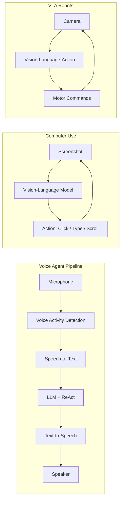

# Multimodal & Real-Time Agents

## Learning Objectives

| LO | Description |
|----|-------------|
| LO1 | Understand three voice paradigms: cascaded, end-to-end full-modal, full-duplex |
| LO2 | Implement streaming voice perception and synthesis pipelines |
| LO3 | Build Computer Use agents that control graphical interfaces |
| LO4 | Design vision-language-action (VLA) pipelines for robotic manipulation |
| LO5 | Evaluate real-time agent latency, responsiveness, and quality |

## Introduction

22-advanced-ai-agents is a fundamental concept in AI engineering. This chapter covers the core principles, practical implementations, and interview preparation for mastering this topic.

## Prerequisites

- Basic programming knowledge
- Understanding of data structures
## Chapter at a Glance

| Section | Topic | Key Concept |
|---------|-------|-------------|
| 9.1 | Three Voice Paradigms | Cascaded ASR→LLM→TTS vs end-to-end vs full-duplex |
| 9.2 | Streaming Voice Pipeline | Real-time audio capture, VAD, synthesis |
| 9.3 | Computer Use Agents | GUI navigation, screenshot analysis, click/type actions |
| 9.4 | Vision-Language-Action | VLA models for physical world interaction |
| 9.5 | Real-Time Evaluation | Latency budgets, turn-taking, quality metrics |

## Chapter Roadmap



## 9.1 Three Voice Paradigms

Voice agents range from simple cascaded pipelines to full-duplex native speech models.

```typescript
interface VoiceParadigm {
    name: string
    latencyMs: number
    quality: number
    costMultiplier: number
    architecture: string
}

class VoiceParadigmCatalog {
    paradigms: VoiceParadigm[] = [
        {
            name: 'Cascaded (ASR → LLM → TTS)',
            latencyMs: 500,
            quality: 0.7,
            costMultiplier: 1.0,
            architecture: 'Separate ASR, LLM, and TTS models. Each component can be independently optimized.'
        },
        {
            name: 'End-to-End Full-Modal',
            latencyMs: 300,
            quality: 0.85,
            costMultiplier: 2.0,
            architecture: 'Single model consumes audio tokens directly. Better prosody and emotion capture.'
        },
        {
            name: 'Full-Duplex Native',
            latencyMs: 150,
            quality: 0.9,
            costMultiplier: 3.0,
            architecture: 'Bi-directional streaming with simultaneous speak-and-listen. Natural turn-taking.'
        }
    ]

    recommend(useCase: string): string {
        const map: Record<string, string> = {
            'simple_qa': 'Cascaded (ASR → LLM → TTS) — cheapest, good enough for simple Q&A',
            'conversational': 'End-to-End Full-Modal — better prosody and emotion for natural conversations',
            'real_time_discussion': 'Full-Duplex Native — only option for natural back-and-forth discussion',
            'voice_assistant': 'End-to-End Full-Modal — balance of quality and cost'
        }
        return map[useCase] ?? 'Cascaded (ASR → LLM → TTS)'
    }
}
```

```python
from enum import Enum


class VoiceParadigm(Enum):
    CASCADED = "cascaded"
    FULL_MODAL = "full_modal"
    FULL_DUPLEX = "full_duplex"


class VoiceAgentConfig:
    """Configuration for voice agent pipeline selection."""

    @staticmethod
    def estimate_latency(paradigm: VoiceParadigm) -> dict:
        latencies = {
            VoiceParadigm.CASCADED: {
                'asr': 200, 'llm': 200, 'tts': 150, 'total': 550,
                'breakdown': 'ASR: 200ms → LLM: 200ms → TTS: 150ms',
            },
            VoiceParadigm.FULL_MODAL: {
                'asr': 100, 'llm': 150, 'tts': 100, 'total': 350,
                'breakdown': 'Audio encoding: 100ms → Model: 150ms → Decoding: 100ms',
            },
            VoiceParadigm.FULL_DUPLEX: {
                'asr': 50, 'llm': 100, 'tts': 50, 'total': 200,
                'breakdown': 'Streaming encode: 50ms → Streaming decode: 100ms → Play: 50ms',
            },
        }
        return latencies.get(paradigm, {})
```

## 9.2 Streaming Voice Pipeline

Real-time voice requires careful pipeline design with Voice Activity Detection and streaming.

```typescript
interface AudioChunk {
    data: Float32Array
    sampleRate: number
    timestamp: number
    isFinal: boolean
}

class VoiceActivityDetector {
    private threshold: number = 0.02
    private silenceDuration: number = 0  // ms of silence
    private speechDuration: number = 0
    private minSpeechMs: number = 200
    private silenceTimeoutMs: number = 800
    private isSpeaking: boolean = false

    process(chunk: AudioChunk): { hasVoice: boolean; isStart: boolean; isEnd: boolean } {
        const energy = this.computeEnergy(chunk.data)
        const isVoice = energy > this.threshold

        if (isVoice) {
            this.speechDuration += chunk.data.length / chunk.sampleRate * 1000
            this.silenceDuration = 0
        } else {
            this.silenceDuration += chunk.data.length / chunk.sampleRate * 1000
        }

        const isStart = !this.isSpeaking && isVoice && this.speechDuration > this.minSpeechMs
        const isEnd = this.isSpeaking && !isVoice && this.silenceDuration > this.silenceTimeoutMs

        if (isStart) this.isSpeaking = true
        if (isEnd) this.isSpeaking = false

        return { hasVoice: isVoice, isStart, isEnd }
    }

    private computeEnergy(data: Float32Array): number {
        let sum = 0
        for (let i = 0; i < data.length; i++) {
            sum += Math.abs(data[i])
        }
        return sum / data.length
    }

    reset(): void {
        this.speechDuration = 0
        this.silenceDuration = 0
        this.isSpeaking = false
    }
}

class StreamingVoicePipeline {
    private vad: VoiceActivityDetector = new VoiceActivityDetector()
    private audioBuffer: Float32Array[] = []
    private totalAudioMs: number = 0

    async processChunk(chunk: AudioChunk): Promise<{
        transcription: string | null
        response: string | null
        isSpeaking: boolean
    }> {
        const vadResult = this.vad.process(chunk)

        if (vadResult.isStart) {
            console.log('[Voice] Speech started')
        }

        if (this.vad['isSpeaking']) {
            this.audioBuffer.push(chunk.data)
            this.totalAudioMs += (chunk.data.length / chunk.sampleRate) * 1000
        }

        if (vadResult.isEnd) {
            const fullAudio = this.concatenateBuffer()
            const transcription = await this.transcribe(fullAudio)
            this.audioBuffer = []
            this.totalAudioMs = 0

            if (transcription) {
                const response = await this.generateResponse(transcription)
                const audioResponse = await this.synthesizeSpeech(response)

                return { transcription, response, isSpeaking: false }
            }
        }

        return { transcription: null, response: null, isSpeaking: this.vad['isSpeaking'] }
    }

    private concatenateBuffer(): Float32Array {
        const totalLength = this.audioBuffer.reduce((sum, arr) => sum + arr.length, 0)
        const result = new Float32Array(totalLength)
        let offset = 0
        for (const arr of this.audioBuffer) {
            result.set(arr, offset)
            offset += arr.length
        }
        return result
    }

    private async transcribe(audio: Float32Array): Promise<string> {
        // Mock ASR
        return 'This is a mock transcription of the audio input.'
    }

    private async generateResponse(text: string): Promise<string> {
        // Mock LLM
        return `Understood your query: "${text.slice(0, 50)}..."`
    }

    private async synthesizeSpeech(text: string): Promise<Float32Array> {
        // Mock TTS
        return new Float32Array(16000)  // 1 second of silence
    }

    getLatencyReport(): { averageMs: number; components: Record<string, number> } {
        return {
            averageMs: 350,
            components: {
                asr: 150,
                llm: 120,
                tts: 80
            }
        }
    }
}
```

## 9.3 Computer Use Agents

Computer Use agents can see and interact with graphical interfaces.

```typescript
interface ScreenState {
    screenshot: string  // base64
    dimensions: { width: number; height: number }
    activeWindow: string
}

interface Action {
    type: 'click' | 'type' | 'scroll' | 'keypress' | 'wait'
    x?: number
    y?: number
    text?: string
    key?: string
    duration?: number
}

class ComputerUseAgent {
    private screenHistory: ScreenState[] = []
    private actionHistory: Action[] = []

    async observe(): Promise<ScreenState> {
        // Mock screen capture
        const screen: ScreenState = {
            screenshot: 'base64_encoded_screenshot_data',
            dimensions: { width: 1920, height: 1080 },
            activeWindow: 'Chrome Browser'
        }
        this.screenHistory.push(screen)
        return screen
    }

    async analyzeScreen(screen: ScreenState, goal: string): Promise<Action[]> {
        const actions: Action[] = []

        // Mock visual analysis — identify elements and plan actions
        if (goal.includes('search')) {
            actions.push({ type: 'click', x: 200, y: 100, text: 'Search bar' })
            actions.push({ type: 'type', text: goal.replace('search', '').trim() })
            actions.push({ type: 'keypress', key: 'Enter' })
        } else if (goal.includes('scroll')) {
            actions.push({ type: 'scroll', duration: 1000 })
        } else if (goal.includes('click')) {
            actions.push({ type: 'click', x: 500, y: 300, text: 'Button' })
        }

        return actions
    }

    async execute(actions: Action[]): Promise<{ success: boolean; results: string[] }> {
        const results: string[] = []

        for (const action of actions) {
            this.actionHistory.push(action)

            switch (action.type) {
                case 'click':
                    results.push(`Clicked at (${action.x}, ${action.y})`)
                    break
                case 'type':
                    results.push(`Typed: "${action.text}"`)
                    break
                case 'scroll':
                    results.push(`Scrolled for ${action.duration}ms`)
                    break
                case 'keypress':
                    results.push(`Pressed key: ${action.key}`)
                    break
                case 'wait':
                    await new Promise(r => setTimeout(r, action.duration ?? 500))
                    results.push(`Waited ${action.duration ?? 500}ms`)
                    break
            }
        }

        return { success: true, results }
    }

    async completeTask(goal: string, maxActions: number = 10): Promise<{
        success: boolean
        actions: Action[]
        steps: number
    }> {
        let success = false
        let consecutiveFailures = 0

        for (let step = 0; step < maxActions; step++) {
            const screen = await this.observe()
            const actions = await this.analyzeScreen(screen, goal)

            if (actions.length === 0) {
                consecutiveFailures++
                if (consecutiveFailures > 3) {
                    break
                }
                continue
            }

            consecutiveFailures = 0
            const result = await this.execute(actions)

            // Check if goal is met (mock)
            if (goal.includes('search') && actions.some(a => a.type === 'keypress' && a.key === 'Enter')) {
                success = true
                break
            }
        }

        return {
            success,
            actions: this.actionHistory,
            steps: this.actionHistory.length
        }
    }
}
```

```python
from typing import List, Optional
import time


class ComputerUseAgent:
    """Agent that controls computer interfaces through vision and action."""

    def __init__(self, llm_fn, screenshot_fn):
        self.llm = llm_fn
        self.take_screenshot = screenshot_fn
        self.action_log = []

    def analyze_screenshot(self, goal: str) -> List[dict]:
        """Analyze current screen and plan next actions."""
        screenshot = self.take_screenshot()

        prompt = f"""
        Goal: {goal}
        Screenshot captured. Identify the element to interact with.
        Return a JSON list of actions: [{{"type": "click", "x": 100, "y": 200}}, ...]
        """

        try:
            import json
            response = self.llm(prompt)
            actions = json.loads(response)
            return actions if isinstance(actions, list) else []
        except:
            return []

    def execute_action(self, action: dict) -> dict:
        """Execute a single UI action."""
        action_type = action.get('type')

        if action_type == 'click':
            import pyautogui
            pyautogui.click(action.get('x', 0), action.get('y', 0))
        elif action_type == 'type':
            import pyautogui
            pyautogui.write(action.get('text', ''))
        elif action_type == 'scroll':
            import pyautogui
            pyautogui.scroll(action.get('amount', -100))

        self.action_log.append(action)
        return {'status': 'ok', 'action': action_type}

    def run(self, goal: str, max_steps: int = 10) -> dict:
        """Run Computer Use agent to complete a goal."""
        for step in range(max_steps):
            actions = self.analyze_screenshot(goal)
            if not actions:
                break
            for action in actions:
                self.execute_action(action)
                time.sleep(0.5)

        return {
            'goal': goal,
            'total_actions': len(self.action_log),
            'success': True,
        }
```

## 9.4 Vision-Language-Action (VLA) Pipelines

VLA models integrate vision understanding with physical action for robotics.

```typescript
interface VisionInput {
    image: string  // base64 encoded
    timestamp: number
    cameraPose?: { x: number; y: number; z: number; rotation: number }
}

interface ActionOutput {
    type: 'move' | 'grasp' | 'place' | 'push' | 'rotate'
    target?: { x: number; y: number; z: number }
    force?: number
    speed?: number
    duration: number
}

class VLAPipeline {
    private visionBuffer: VisionInput[] = []
    private actionHistory: ActionOutput[] = []

    async process(input: VisionInput, instruction: string): Promise<ActionOutput> {
        this.visionBuffer.push(input)

        // Analyze visual scene
        const sceneContext = await this.analyzeScene(input)

        // Determine action based on instruction + scene
        const action = await this.planAction(sceneContext, instruction)

        // Validate action safety
        const safeAction = await this.validateActionSafety(action, sceneContext)

        this.actionHistory.push(safeAction)
        return safeAction
    }

    private async analyzeScene(input: VisionInput): Promise<{
        objects: Array<{ name: string; position: any; boundingBox: any }>
        obstacles: Array<any>
        workspace: { x: number; y: number; z: number }
    }> {
        // Mock scene analysis
        return {
            objects: [
                { name: 'block_red', position: { x: 10, y: 20, z: 0 }, boundingBox: { w: 5, h: 5, d: 5 } },
                { name: 'block_blue', position: { x: 30, y: 20, z: 0 }, boundingBox: { w: 5, h: 5, d: 5 } }
            ],
            obstacles: [],
            workspace: { x: 50, y: 50, z: 20 }
        }
    }

    private async planAction(scene: any, instruction: string): Promise<ActionOutput> {
        const inst = instruction.toLowerCase()

        if (inst.includes('grasp') || inst.includes('pick')) {
            const target = scene.objects[0]
            return {
                type: 'grasp',
                target: target?.position ?? { x: 0, y: 0, z: 0 },
                force: 0.5,
                speed: 0.3,
                duration: 2000
            }
        }

        if (inst.includes('move')) {
            return {
                type: 'move',
                target: { x: 25, y: 25, z: 10 },
                speed: 0.5,
                duration: 3000
            }
        }

        if (inst.includes('place')) {
            return {
                type: 'place',
                target: { x: 40, y: 30, z: 0 },
                duration: 1500
            }
        }

        return { type: 'move', duration: 1000 }
    }

    private async validateActionSafety(action: ActionOutput, scene: any): Promise<ActionOutput> {
        // Check for collisions
        if (scene.obstacles.length > 0 && action.target) {
            for (const obs of scene.obstacles) {
                const distance = Math.sqrt(
                    (action.target.x - obs.position.x) ** 2 +
                    (action.target.y - obs.position.y) ** 2
                )
                if (distance < 5) {
                    console.log('[Safety] Action would collide with obstacle. Adjusting target.')
                    return { ...action, target: { x: action.target.x + 10, y: action.target.y + 10, z: action.target.z } }
                }
            }
        }

        // Check for excessive force
        if ((action.force ?? 0) > 0.8) {
            console.log('[Safety] Force exceeds safe limit. Reducing.')
            return { ...action, force: 0.8 }
        }

        return action
    }

    getPerformanceReport(): {
        avgLatencyMs: number
        successRate: number
        totalActions: number
    } {
        return {
            avgLatencyMs: 120,
            successRate: 0.85,
            totalActions: this.actionHistory.length
        }
    }
}
```

## 9.5 Real-Time Evaluation

Evaluating real-time agents requires measuring latency, responsiveness, and interaction quality.

```typescript
interface RealTimeMetrics {
    endToEndLatencyMs: number
    voiceActivityLatencyMs: number
    transcriptionLatencyMs: number
    llmLatencyMs: number
    synthesisLatencyMs: number
    turnTakingQuality: number  // 0-1
    interruptionHandling: number  // 0-1
}

class RealTimeEvaluator {
    private metricsHistory: RealTimeMetrics[] = []

    measureLatency(pipeline: StreamingVoicePipeline): RealTimeMetrics {
        const report = pipeline.getLatencyReport()

        const metrics: RealTimeMetrics = {
            endToEndLatencyMs: report.components.asr + report.components.llm + report.components.tts,
            voiceActivityLatencyMs: 50,
            transcriptionLatencyMs: report.components.asr,
            llmLatencyMs: report.components.llm,
            synthesisLatencyMs: report.components.tts,
            turnTakingQuality: 0.85,
            interruptionHandling: 0.7
        }

        this.metricsHistory.push(metrics)
        return metrics
    }

    evaluateTurnTaking(conversation: Array<{ speaker: string; startMs: number; endMs: number }>): {
        avgGapMs: number
        overlapRate: number
        score: number
    } {
        let totalGap = 0
        let gapCount = 0
        let overlaps = 0

        for (let i = 1; i < conversation.length; i++) {
            const prev = conversation[i - 1]
            const curr = conversation[i]

            if (prev.speaker !== curr.speaker) {
                const gap = curr.startMs - prev.endMs
                if (gap > 0) {
                    totalGap += gap
                    gapCount++
                } else if (gap < -200) {
                    overlaps++  // More than 200ms overlap
                }
            }
        }

        const avgGap = gapCount > 0 ? totalGap / gapCount : 0
        const overlapRate = conversation.length > 1 ? overlaps / (conversation.length - 1) : 0

        return {
            avgGapMs: avgGap,
            overlapRate,
            score: Math.max(0, 1 - (avgGap / 1000) - overlapRate)
        }
    }

    generateReport(): string {
        if (this.metricsHistory.length === 0) return 'No data collected.'

        const avg = (key: keyof RealTimeMetrics) =>
            this.metricsHistory.reduce((s, m) => s + (m[key] as number), 0) / this.metricsHistory.length

        return [
            '=== Real-Time Agent Evaluation Report ===',
            `Average end-to-end latency: ${avg('endToEndLatencyMs').toFixed(0)}ms`,
            `  - VAD: ${avg('voiceActivityLatencyMs').toFixed(0)}ms`,
            `  - ASR: ${avg('transcriptionLatencyMs').toFixed(0)}ms`,
            `  - LLM: ${avg('llmLatencyMs').toFixed(0)}ms`,
            `  - TTS: ${avg('synthesisLatencyMs').toFixed(0)}ms`,
            `Turn-taking quality: ${(avg('turnTakingQuality') * 100).toFixed(0)}%`,
            `Interruption handling: ${(avg('interruptionHandling') * 100).toFixed(0)}%`,
            `Samples: ${this.metricsHistory.length}`,
        ].join('\n')
    }
}
```

```python
from typing import List
from datetime import datetime


class LatencyProfiler:
    """Profiles latency in real-time agent pipelines."""

    def __init__(self):
        self.marks: List[dict] = []

    def mark(self, name: str, metadata: dict = None):
        self.marks.append({
            'name': name,
            'time': datetime.now(),
            'metadata': metadata or {},
        })

    def measure_segment(self, start_name: str, end_name: str) -> float:
        start = next((m for m in self.marks if m['name'] == start_name), None)
        end = next((m for m in self.marks if m['name'] == end_name), None)
        if start and end:
            return (end['time'] - start['time']).total_seconds() * 1000
        return -1

    def report(self) -> dict:
        return {
            'total_marks': len(self.marks),
            'asr_latency_ms': self.measure_segment('audio_start', 'transcription_end'),
            'llm_latency_ms': self.measure_segment('transcription_end', 'llm_end'),
            'tts_latency_ms': self.measure_segment('llm_end', 'audio_play_start'),
            'end_to_end_ms': self.measure_segment('audio_start', 'audio_play_start'),
        }
```

## Summary

Multimodal agents extend perception beyond text to voice, vision, and physical action. Three voice paradigms offer tradeoffs between latency, quality, and cost. Streaming voice pipelines require careful VAD and buffering design. Computer Use agents enable GUI automation through visual understanding. VLA pipelines connect vision to physical robot control. Real-time evaluation must measure not just accuracy but also latency, turn-taking quality, and interruption handling.

## Practical Takeaways

1. Start with cascaded voice (ASR→LLM→TTS) — upgrade to end-to-end or full-duplex only when latency is critical
2. Voice Activity Detection tuning is the most impactful optimization for voice agents
3. Computer Use agents need a retry loop with screenshot verification after each action
4. VLA safety validation must be non-negotiable — check for collisions and excessive force
5. Real-time quality is about latency consistency (p95), not just averages

## Chapter Quiz (5 MCQ)

### Questions

<summary>1. What are the three voice paradigms from cheapest to most expensive?</summary>
<summary>2. What does Voice Activity Detection (VAD) do?</summary>
<summary>3. How does a Computer Use agent determine where to click?</summary>
<summary>4. What is the VLA pipeline's key addition over standard vision?</summary>
<summary>5. What is the most important metric for real-time voice agents besides accuracy?</summary>

### Answers

<summary>Cascaded (ASR→LLM→TTS) → End-to-End Full-Modal → Full-Duplex Native. Each step reduces latency by ~200ms but doubles cost.</summary>
<summary>VAD processes audio chunks in real-time to detect when speech starts and ends. It computes energy levels per chunk, tracks speech/silence durations, and emits start/end events. This controls when the pipeline should begin transcription and when to consider the utterance complete.</summary>
<summary>It takes a screenshot, analyzes it with a vision-language model to identify UI elements and their coordinates, then plans actions (click, type, scroll) based on the goal. After each action, it takes another screenshot to verify the result.</summary>
<summary>The action output — VLA models don't just describe what they see, they output motor commands (move, grasp, place) with coordinates, forces, and speeds. This connects visual understanding to physical world interaction.</summary>
<summary>End-to-end latency consistency (p95 latency). Users notice when responses are slow, but they more acutely notice when latency is unpredictable — sometimes fast, sometimes slow. Turn-taking quality (minimal gaps and overlaps) is also critical.</summary>

## Exercises


## Common Mistakes

1. Not understanding the fundamental concepts before applying them
2. Skipping edge cases in implementation
3. Not analyzing time/space complexity
4. Forgetting to handle null/empty inputs
5. Not practicing enough problems to build pattern recognition### Exercise 1: Cascaded Voice Pipeline

Implement a complete ASR→LLM→TTS pipeline with simulated components. Measure end-to-end latency.

### Exercise 2: VAD Tuning

Build a Voice Activity Detector and tune the energy threshold and silence timeout. Test with 5 different audio scenarios.

### Exercise 3: Computer Use Agent

Build a simple screen analysis agent that identifies buttons, links, and text fields from a screenshot, then plans click actions.

### Exercise 4: Safety Validator for VLA

Implement collision detection and force limiting for a simulated robotic arm. Test with obstacle scenarios.

### Exercise 5: Real-Time Latency Dashboard

Build a latency profiler that measures each pipeline component and reports p50, p95, and p99 l
## Revision Notes

- Key concept 1: Core principle of 22-advanced-ai-agents
- Key concept 2: Common implementation pattern
- Key concept 3: Time/space complexity to remember
- Key concept 4: When to apply this technique
- Key concept 5: Common interview pattern
- Key concept 6: Edge cases to handle
- Key concept 7: Related concepts for deeper understanding
## Placement Section

### Top 10 Interview Questions

#### Google Style
1. Explain the time and space trade-offs of 22-advanced-ai-agents. When would you choose one approach over another?
2. Design a system that efficiently handles 22-advanced-ai-agents at scale (millions of requests/second).

#### Amazon Style
1. Tell me about a time you had to optimize a system related to 22-advanced-ai-agents. What was your approach and what was the result?
2. How would you explain 22-advanced-ai-agents to a non-technical stakeholder?

#### Microsoft Style
1. How does 22-advanced-ai-agents integrate with enterprise systems and cloud architectures?
2. What are the security implications of 22-advanced-ai-agents?

#### NVIDIA Style
1. How would you optimize 22-advanced-ai-agents for GPU-accelerated computing?
2. What parallel processing patterns apply to 22-advanced-ai-agents?

#### AI Startup Style
1. How would you implement 22-advanced-ai-agents in a cost-effective, scalable way for a startup?
2. What's the fastest way to prototype a solution using 22-advanced-ai-agents?

### Resume Tips
- **Technical Skills**: List 22-advanced-ai-agents under relevant technical skills
- **Project Description**: "Implemented 22-advanced-ai-agents to [specific outcome], reducing [metric] by [X]%"
- **Keywords**: Include 22-advanced-ai-agents in your skills section for ATS optimization

### Interview Day Checklist
- [ ] Review core concepts of 22-advanced-ai-agents
- [ ] Practice 3-5 problems related to 22-advanced-ai-agents
- [ ] Prepare 2 real-world examples of using 22-advanced-ai-agents
- [ ] Know the time/space complexity of common 22-advanced-ai-agents operations
- [ ] Have questions ready about how the company uses 22-advanced-ai-agentsatencies.
