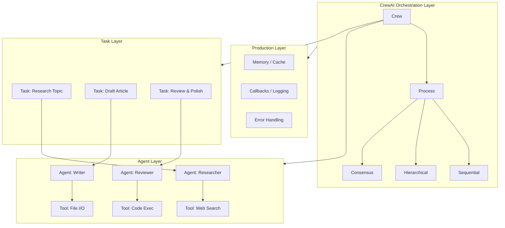
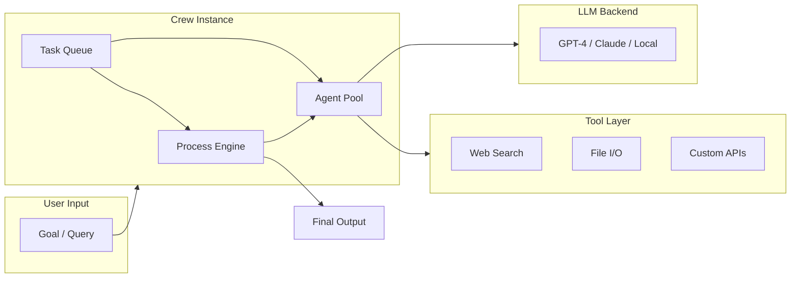
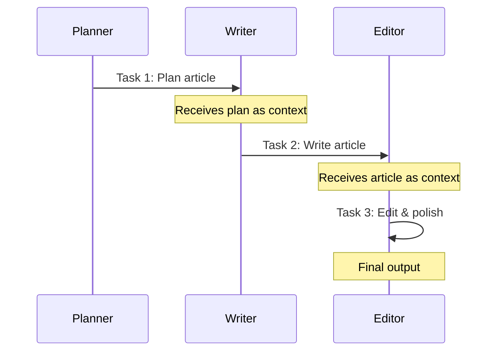
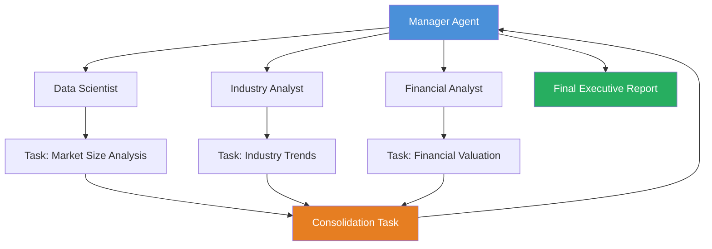

<!-- Clear Language: Keep sentences under 50 words -->
# CrewAI: Multi-Agent Orchestration

## Learning Objectives

| LO | Description |
|----|-------------|
| LO1 | Understand CrewAI architecture: agents, tasks, crews, processes, and tools |
| LO2 | Define agents with role, goal, backstory, delegation, and collaboration |
| LO3 | Manage tasks with context, expected output, and async execution |
| LO4 | Build and integrate custom tools, LangChain tools, and file I/O tools |
| LO5 | Deploy CrewAI workflows in production with caching, memory, and error handling |

## Introduction

CrewAI is a multi-agent orchestration framework for Python. It lets you define AI agents with specific roles, assign them tasks, and manage their collaboration through structured processes. Companies like Google, Microsoft, and AI startups use CrewAI for complex automation pipelines. This chapter covers the full CrewAI stack — from agent definition to production deployment.

## Prerequisites

- Python 3.10+ installed and working virtual environment
- Basic understanding of LLM APIs (OpenAI, Anthropic, or open-source models)
- Familiarity with agent fundamentals (ReAct pattern, tool calling)
- Completed Module 13 (AI Agents & LangGraph) or equivalent knowledge

## Key Terminology

| Term | Definition |
|------|------------|
| **Agent** | An autonomous unit with a role, goal, and backstory powered by an LLM |
| **Task** | A unit of work assigned to an agent with description and expected output |
| **Crew** | A collection of agents and tasks orchestrated through a process |
| **Process** | The execution flow — sequential, hierarchical, or consensus-based |
| **Tool** | A function an agent can call to interact with external systems |
| **Manager Agent** | A coordinating agent that delegates tasks in hierarchical processes |
| **Callback** | Hook functions triggered at various lifecycle points |
| **Context** | Shared information passed between tasks for continuity |

## Chapter at a Glance

| Section | Topic | Key Concept |
|---------|-------|-------------|
| 11.1 | CrewAI Architecture | Agents, tasks, crews, processes, tools — the foundation |
| 11.2 | Agent Definition | Role, goal, backstory, delegation, collaboration settings |
| 11.3 | Task Management | Descriptions, expected output, context passing, async execution |
| 11.4 | Tools & Integrations | Custom tools, LangChain tools, tool sharing, file I/O |
| 11.5 | Process Flows | Sequential, hierarchical, consensus, manager agents |
| 11.6 | Production Deployment | Caching, memory, callbacks, error handling, logging |

## Chapter Roadmap



## 11.1 CrewAI Architecture

CrewAI models multi-agent systems as a hierarchy of four core primitives: **Agents**, **Tasks**, **Crew**, and **Process**. Understanding how these fit together is essential before writing any code.

### Core Primitives

```python
# crewai_primitives.py — Core architecture overview
from crewai import Agent, Task, Crew, Process

# 1. An Agent is an LLM-powered unit with a specific role
#    It knows what to do and how to behave
agent = Agent(
    role="Senior Research Analyst",
    goal="Find the latest breakthroughs in AI agents",
    backstory="You are an expert analyst at a top AI research lab.",
    llm="gpt-4",         # Model backend
    verbose=True,        # Print execution logs
    allow_delegation=True  # Can ask other agents for help
)

# 2. A Task is a discrete unit of work assigned to an agent
#    It has a description and an expected structured output
task = Task(
    description="Research and summarize 3 recent papers on multi-agent systems.",
    expected_output="A bullet-point summary of each paper with key findings.",
    agent=agent
)

# 3. A Crew binds agents and tasks together with a process flow
#    It orchestrates who does what and in what order
crew = Crew(
    agents=[agent],
    tasks=[task],
    process=Process.sequential,  # Tasks run one after another
    verbose=True
)

# 4. kickoff() starts the entire pipeline
result = crew.kickoff()
print(f"Crew execution result:\n{result}")
```

### Architecture Diagram



**Key Insight:** The Crew is stateless between runs. Each `kickoff()` creates a fresh execution. Use memory systems (Section 11.6) to persist state across sessions.

### When to Use CrewAI

| Use Case | Why CrewAI Fits |
|----------|----------------|
| Content generation pipelines | Sequential agents draft → review → polish |
| Research automation | Specialist agents divide literature search |
| Code review workflows | Agents write, test, and review code |
| Customer support escalation | Hierarchical agents triage and escalate |
| Data enrichment pipelines | Parallel agents enrich different fields |

---

## 11.2 Agent Definition

Agents are the computational workers in CrewAI. Each agent must have a clear **role**, **goal**, and **backstory**. These three fields shape how the LLM behaves.

### Minimal Agent vs Production Agent

```python
# agent_definition.py — From minimal to production-grade agents
from crewai import Agent
from crewai_tools import SerperDevTool

# ── Minimal agent (quick prototyping) ──
minimal_agent = Agent(
    role="Summarizer",
    goal="Summarize the given text accurately",
    backstory="You are a concise summarizer.",
)

# ── Production agent (full configuration) ──
research_agent = Agent(
    role="Senior Market Researcher",
    goal="Identify top 3 market trends in AI infrastructure for Q3 2026",
    backstory=(
        "You are a senior analyst with 10 years of experience at Gartner. "
        "You have a PhD in Computer Science and specialize in AI infrastructure. "
        "Your reports are cited by Fortune 500 CTOs. "
        "You always back claims with data and cite your sources."
    ),
    # LLM configuration
    llm="gpt-4o",                      # Model identifier
    temperature=0.3,                    # Lower = more deterministic
    max_tokens=4096,                    # Max response length

    # Collaboration settings
    allow_delegation=True,              # Can ask other agents for help
    allow_code_execution=False,         # Can run code locally

    # Tools
    tools=[SerperDevTool()],            # Web search capability

    # Execution settings
    max_iter=25,                        # Max reasoning iterations
    max_rpm=10,                         # Rate limit: requests per minute
    verbose=True,                       # Print detailed logs
    memory=True,                        # Remember context across tasks
    respect_context_limit=True,         # Stay within model context window
)

# Agent delegation in action:
# Agent A: "I need recent revenue data for NVIDIA."
# Agent B (Database Agent): "Here is the Q2 2026 data from our DB."
# Agent A: "Great, incorporating that into my analysis."
```

### Agent Configuration Fields

| Field | Type | Default | Purpose |
|-------|------|---------|---------|
| `role` | str | required | Defines agent identity |
| `goal` | str | required | Defines what the agent achieves |
| `backstory` | str | required | Gives personality and context |
| `llm` | str | `"gpt-4"` | Model identifier |
| `temperature` | float | 0.7 | Response randomness |
| `allow_delegation` | bool | `True` | Can delegate to other agents |
| `allow_code_execution` | bool | `False` | Execute Python code |
| `max_iter` | int | 15 | Maximum reasoning loops |
| `max_rpm` | int | `None` | Rate limit |
| `verbose` | bool | `False` | Enable execution logs |
| `memory` | bool | `False` | Cross-task context retention |
| `tools` | list | `[]` | Available tool functions |

### Backstory Engineering

The backstory is the most powerful prompt in CrewAI. It acts as a system prompt that shapes every response:

```python
# backstory_patterns.py — Effective backstory templates
from crewai import Agent

# Pattern 1: Expertise-driven (best for research)
expert_agent = Agent(
    role="Research Scientist",
    goal="Analyze transformer architecture efficiency",
    backstory=(
        "You are a research scientist at DeepMind working on efficient transformers. "
        "You have published 15+ papers at NeurIPS, ICML, and ICLR. "
        "You are an expert in sparse attention mechanisms and KV-cache optimization. "
        "You communicate complex ideas with clarity and precision."
    ),
    llm="gpt-4o",
)

# Pattern 2: Personality-driven (best for creative tasks)
creative_agent = Agent(
    role="Creative Copywriter",
    goal="Write compelling product descriptions for AI SaaS tools",
    backstory=(
        "You are a former Apple copywriter who now runs your own agency. "
        "Your copy has driven $50M+ in revenue for B2B SaaS companies. "
        "You believe in 'show, don't tell' and hate buzzwords. "
        "Every sentence must earn its place."
    ),
    llm="gpt-4o",
    temperature=0.8,  # Higher temperature for creativity
)

# Pattern 3: Constraint-driven (best for code/review)
constraint_agent = Agent(
    role="Senior Code Reviewer",
    goal="Review Python code for bugs, performance issues, and security",
    backstory=(
        "You are a staff engineer at Google. You have reviewed 5000+ PRs. "
        "You never approve code with type errors, missing edge cases, "
        "or unhandled exceptions. You provide specific, actionable feedback."
    ),
    llm="gpt-4o",
    temperature=0.1,  # Low temperature for precision
)
```

### Collaboration Modes

```python
# collaboration_modes.py — How agents interact
from crewai import Agent

# Mode 1: Independent (no interaction)
independent_agent = Agent(
    role="Data Collector",
    goal="Fetch data from API endpoints",
    backstory="You are a reliable data collection agent.",
    allow_delegation=False  # Works alone
)

# Mode 2: Collaborative (can delegate and ask questions)
collaborative_agent = Agent(
    role="Lead Analyst",
    goal="Compile final report from specialist inputs",
    backstory="You coordinate multiple specialists to produce reports.",
    allow_delegation=True   # Can delegate to specialists
)

# Mode 3: Manager (directs other agents in hierarchical process)
manager_agent = Agent(
    role="Project Manager",
    goal="Oversee the research project from planning to delivery",
    backstory="You are a seasoned PM who has delivered 50+ AI projects.",
    allow_delegation=True   # Delegates tasks to team members
)
```

---

## 11.3 Task Management

Tasks are the work items in CrewAI. Each task is assigned to an agent and produces an output. Tasks can depend on other tasks through **context**.

### Task Structure

```python
# task_structure.py — Creating and linking tasks
from crewai import Task, Agent

# Define agents first
researcher = Agent(
    role="Research Analyst",
    goal="Gather information on specified topics",
    backstory="You are a thorough researcher with access to web search.",
    tools=[],  # Add search tools in production
)

writer = Agent(
    role="Technical Writer",
    goal="Create clear documentation from research findings",
    backstory="You transform research into readable documentation.",
)

# ── Basic task ──
task1 = Task(
    description=(
        "Research the latest advancements in CrewAI framework. "
        "Focus on: (1) new features in v0.8+, (2) performance benchmarks, "
        "(3) real-world production use cases. Provide URLs for each finding."
    ),
    expected_output=(
        "A structured markdown document with:\n"
        "- 5 key advancements with descriptions\n"
        "- 3 performance benchmarks with numbers\n"
        "- 3 real-world case studies with company names"
    ),
    agent=researcher,
)

# ── Task with context (depends on previous task output) ──
task2 = Task(
    description=(
        "Using the research findings from the previous task, "
        "write a 500-word blog post suitable for a technical audience. "
        "Focus on practical takeaways for AI engineers."
    ),
    expected_output="A polished 500-word blog post in markdown format.",
    agent=writer,
    context=[task1],  # task2 receives task1's output as context
)
```

### Context Passing in Detail

```python
# context_passing.py — How context flows between tasks
import json
from crewai import Task, Agent, Crew, Process

researcher = Agent(
    role="Senior Researcher",
    goal="Produce detailed research findings",
    backstory="You are a meticulous researcher at a leading AI lab.",
)

writer = Agent(
    role="Content Strategist",
    goal="Create compelling content from research",
    backstory="You create content that drives engagement.",
)

quality_analyst = Agent(
    role="Quality Analyst",
    goal="Verify accuracy and completeness of content",
    backstory="You catch errors that others miss.",
)

# Task 1: Research
task_research = Task(
    description=(
        "Research AI agent frameworks comparison: "
        "CrewAI vs AutoGen vs LangGraph. "
        "Cover: ease of use, scalability, tool ecosystem."
    ),
    expected_output="JSON object with framework comparisons",
    agent=researcher,
)

# Task 2: Write (receives task_research output as context)
task_write = Task(
    description=(
        "Based on the research: write a comparison guide. "
        "Include a recommendation table."
    ),
    expected_output="Markdown comparison guide with table",
    agent=writer,
    context=[task_research],
)

# Task 3: Validate (receives both previous outputs)
task_validate = Task(
    description=(
        "Review the comparison guide for factual accuracy. "
        "Flag any misleading statements or missing information."
    ),
    expected_output="List of accuracy issues and corrections needed",
    agent=quality_analyst,
    context=[task_research, task_write],
)

# Connect everything in a Crew
crew = Crew(
    agents=[researcher, writer, quality_analyst],
    tasks=[task_research, task_write, task_validate],
    process=Process.sequential,
    verbose=True
)

result = crew.kickoff()

# Access individual task outputs
# result.tasks_output[0] — Research output
# result.tasks_output[1] — Writer output
# result.tasks_output[2] — Validation output
```

### Async Execution and Parallel Tasks

```python
# async_tasks.py — Running tasks concurrently
from crewai import Task, Agent, Crew, Process
import asyncio

# Multiple specialist agents working in parallel
data_agent = Agent(
    role="Data Collector",
    goal="Collect raw data from specified sources",
    backstory="You are an efficient data collection specialist.",
)

analytics_agent = Agent(
    role="Data Analyst",
    goal="Analyze data and extract insights",
    backstory="You are a skilled data analyst with statistical expertise.",
)

viz_agent = Agent(
    role="Visualization Expert",
    goal="Create charts and graphs from analyzed data",
    backstory="You create publication-ready data visualizations.",
)

# Independent tasks that can run in parallel
task_collect = Task(
    description="Collect sales data from Q1, Q2, and Q3 2026.",
    expected_output="Raw sales data organized by quarter",
    agent=data_agent,
    async_execution=True,  # Can run in parallel with other async tasks
)

task_collect_market = Task(
    description="Collect competitor pricing data for 2026.",
    expected_output="Competitor pricing comparison table",
    agent=data_agent,
    async_execution=True,  # Runs in parallel with task_collect
)

# Non-async task depends on both collectors
task_analyze = Task(
    description=(
        "Combine sales data and competitor pricing. "
        "Identify market positioning opportunities."
    ),
    expected_output="Strategic recommendations based on combined analysis",
    agent=analytics_agent,
    context=[task_collect, task_collect_market],
)

# Sequential (but async tasks run in parallel first)
crew = Crew(
    agents=[data_agent, analytics_agent, viz_agent],
    tasks=[task_collect, task_collect_market, task_analyze],
    process=Process.sequential,  # Async tasks run first in parallel
    verbose=True
)
```

### Task Output Handling

```python
# task_output.py — Working with structured outputs
from crewai import Task, Agent
from pydantic import BaseModel
from typing import List

# Define a structured output schema (Pydantic v2)
class ResearchFinding(BaseModel):
    title: str
    summary: str
    source_url: str
    relevance_score: float  # 0.0 to 1.0

class ResearchReport(BaseModel):
    topic: str
    findings: List[ResearchFinding]
    conclusion: str

analyst = Agent(
    role="Research Analyst",
    goal="Produce structured research reports",
    backstory="You produce well-organized research outputs.",
)

task_structured = Task(
    description="Research the impact of multi-agent systems on software testing.",
    expected_output="A ResearchReport with at least 3 findings",
    agent=analyst,
    output_pydantic=ResearchReport,  # Enforce schema validation
)

crew = Crew(
    agents=[analyst],
    tasks=[task_structured],
    process=Process.sequential,
)

result = crew.kickoff()

# Access structured output
if result.tasks_output[0].pydantic:
    report: ResearchReport = result.tasks_output[0].pydantic
    print(f"Topic: {report.topic}")
    for finding in report.findings:
        print(f"  - {finding.title} (score: {finding.relevance_score})")
```

---

## 11.4 Tools & Integrations

Tools give agents access to external systems. CrewAI supports custom tools, LangChain tools, and built-in tools through `crewai_tools`.

### Creating Custom Tools

```python
# custom_tools.py — Building tools from scratch
from crewai.tools import BaseTool
from pydantic import BaseModel, Field
from typing import Type, Optional
import httpx
import json
import hashlib

# ── Tool 1: Simple function-based tool (recommended for most cases) ──
from crewai.tools import tool

@tool("WebContentFetcher")
def fetch_web_content(url: str) -> str:
    """
    Fetches the text content from a given URL.
    Useful when you need to read articles or documentation from the web.

    Args:
        url: The full URL to fetch content from.

    Returns:
        The text content of the page (first 5000 chars).
    """
    try:
        response = httpx.get(url, timeout=30.0, follow_redirects=True)
        response.raise_for_status()
        content = response.text[:5000]
        return f"Content from {url}:\n{content}"
    except Exception as e:
        return f"Error fetching {url}: {str(e)}"


# ── Tool 2: Class-based tool (for complex tools with state) ──
class DatabaseQueryInput(BaseModel):
    """Input schema for database query tool."""
    query: str = Field(description="SQL or natural language query")
    max_results: int = Field(default=10, description="Maximum results to return")

class DatabaseQueryTool(BaseTool):
    name: str = "DatabaseQuery"
    description: str = "Execute read-only queries against the analytics database"
    args_schema: Type[BaseModel] = DatabaseQueryInput
    db_connection_string: str = ""

    def __init__(self, connection_string: str = "sqlite:///analytics.db"):
        super().__init__()
        self.db_connection_string = connection_string

    def _run(self, query: str, max_results: int = 10) -> str:
        """
        Execute the query and return results as JSON string.
        This is a simulation — in production, connect to your actual DB.
        """
        # Simulated query execution
        mock_results = [
            {"metric": "active_users", "value": 14230, "change_pct": 12.5},
            {"metric": "revenue_mrr", "value": 485000, "change_pct": 8.3},
        ]
        return json.dumps(mock_results[:max_results], indent=2)

    async def _arun(self, query: str, max_results: int = 10) -> str:
        """Async version for use with async tasks."""
        return self._run(query, max_results)


# ── Tool 3: File I/O tool ──
class FileIOTool(BaseTool):
    name: str = "FileManager"
    description: str = "Read, write, and list files in the workspace"
    args_schema: Type[BaseModel] = type("Args", (BaseModel,), {
        "operation": Field(description="One of: read, write, list, delete"),
        "filepath": Field(description="Path to the file"),
        "content": Field(default=None, description="Content to write (for write operation)"),
    })

    def _run(self, operation: str, filepath: str, content: Optional[str] = None) -> str:
        if operation == "read":
            with open(filepath, "r", encoding="utf-8") as f:
                return f.read()
        elif operation == "write":
            with open(filepath, "w", encoding="utf-8") as f:
                f.write(content or "")
            return f"Written {len(content or '')} bytes to {filepath}"
        elif operation == "list":
            import os
            files = os.listdir(filepath)
            return "\n".join(files)
        else:
            return f"Unknown operation: {operation}"
```

### Using LangChain Tools

```python
# langchain_tools.py — Integrating LangChain's tool ecosystem
from crewai import Agent, Task, Crew, Process
from langchain_community.tools import (
    WikipediaQueryRun,
    DuckDuckGoSearchRun,
    StackExchangeTool,
)
from langchain_community.utilities import WikipediaAPIWrapper
from langchain.tools import Tool

# Wrap LangChain tools for CrewAI compatibility
wikipedia = WikipediaQueryRun(
    api_wrapper=WikipediaAPIWrapper(top_k_results=3)
)

search = DuckDuckGoSearchRun()

# CrewAI automatically adapts LangChain tools
research_agent = Agent(
    role="Deep Researcher",
    goal="Gather comprehensive information from multiple sources",
    backstory="You use every tool available to find accurate information.",
    tools=[
        Tool(
            name="Wikipedia",
            func=wikipedia.run,
            description="Search Wikipedia for detailed topic information"
        ),
        Tool(
            name="WebSearch",
            func=search.run,
            description="Search the web for current information"
        ),
        fetch_web_content,  # Our custom tool from above
    ],
    llm="gpt-4o",
)

# Tool sharing between agents
writer_agent = Agent(
    role="Research Writer",
    goal="Synthesize research into coherent reports",
    backstory="You create comprehensive reports from multiple research sources.",
    tools=[
        FileIOTool(),  # Shared tool instance
        fetch_web_content,
    ],
)

task_research = Task(
    description="Research the history and current state of CrewAI framework.",
    expected_output="Comprehensive research notes with citations.",
    agent=research_agent,
)

task_write = Task(
    description="Write a report based on the research findings.",
    expected_output="A well-structured markdown report.",
    agent=writer_agent,
    context=[task_research],
)

crew = Crew(
    agents=[research_agent, writer_agent],
    tasks=[task_research, task_write],
    process=Process.sequential,
)
```

### Tool Best Practices

| Practice | Why | Example |
|----------|-----|---------|
| Single responsibility | Each tool does one thing well | Search tool vs. DB query tool |
| Clear descriptions | LLM needs to know when to use it | Include use cases in description |
| Error handling | Tools fail; agents should recover | Return error messages, not exceptions |
| Rate limiting | Protect external APIs | Add delays and max_rpm on agent |
| Input validation | Prevent injection attacks | Validate args_schema with Pydantic |

---

## 11.5 Process Flows

CrewAI supports three process types: **sequential**, **hierarchical**, and **consensus**. The process determines how tasks are assigned and executed.

### Sequential Process

Tasks run in order. Each task receives the output of all previous tasks as context.

```python
# sequential_process.py — Linear task execution
from crewai import Crew, Process, Agent, Task

planner = Agent(
    role="Content Planner",
    goal="Plan engaging content on AI topics",
    backstory="You are a senior content planner at TechCrunch.",
)

writer = Agent(
    role="Content Writer",
    goal="Write compelling content based on the plan",
    backstory="You write articles that get 100K+ views.",
)

editor = Agent(
    role="Content Editor",
    goal="Ensure the content is error-free and engaging",
    backstory="You are a former NYT editor.",
)

task_plan = Task(
    description="Plan a 1500-word article on 'Agentic RAG' trends for 2026.",
    expected_output="Detailed outline with 5 sections.",
    agent=planner,
)

task_write = Task(
    description="Write the article following the outline.",
    expected_output="Complete 1500-word article in markdown.",
    agent=writer,
    context=[task_plan],
)

task_edit = Task(
    description="Edit the article for clarity, grammar, and flow.",
    expected_output="Final polished article with editor notes.",
    agent=editor,
    context=[task_write],
)

sequential_crew = Crew(
    agents=[planner, writer, editor],
    tasks=[task_plan, task_write, task_edit],
    process=Process.sequential,  # Explicitly sequential
    verbose=True,
)

result = sequential_crew.kickoff()
```



### Hierarchical Process with Manager Agent

A manager agent coordinates specialist agents. The manager delegates tasks, monitors progress, and consolidates results.

```python
# hierarchical_process.py — Manager delegates to specialists
from crewai import Agent, Task, Crew, Process

# ── Manager Agent ──
manager = Agent(
    role="Project Manager",
    goal="Coordinate the team to deliver a comprehensive market analysis",
    backstory=(
        "You are a senior PM at McKinsey. You have led 100+ client engagements. "
        "You break down complex problems and assign work to the right people. "
        "You ensure every deliverable meets the highest quality standards."
    ),
    llm="gpt-4o",
    allow_delegation=True,   # Manager delegates tasks
    verbose=True,
)

# ── Specialist Agents ──
data_scientist = Agent(
    role="Data Scientist",
    goal="Analyze market data and produce quantitative insights",
    backstory="You are a data scientist at a quantitative hedge fund.",
    tools=[],  # Add data analysis tools in production
)

industry_analyst = Agent(
    role="Industry Analyst",
    goal="Provide qualitative analysis of market trends",
    backstory="You are a senior analyst covering the AI industry.",
    tools=[],  # Add search tools in production
)

financial_analyst = Agent(
    role="Financial Analyst",
    goal="Analyze financial data and company valuations",
    backstory="You are a CFA charterholder covering tech stocks.",
    tools=[],
)

# ── Tasks work independently; manager consolidates ──
task_data = Task(
    description="Analyze market size data for AI agents market (2024-2030).",
    expected_output="Data analysis with charts and growth projections.",
    agent=data_scientist,
)

task_industry = Task(
    description="Analyze industry trends: key players, partnerships, M&A activity.",
    expected_output="Industry analysis with competitive landscape.",
    agent=industry_analyst,
)

task_financial = Task(
    description="Analyze valuations of public AI agent companies.",
    expected_output="Financial analysis with valuation multiples.",
    agent=financial_analyst,
)

# ── Final consolidation task for the manager ──
task_consolidate = Task(
    description=(
        "Consolidate all analyses into a single executive report. "
        "Highlight the top 3 strategic recommendations."
    ),
    expected_output="Executive summary with strategic recommendations.",
    agent=manager,
    context=[task_data, task_industry, task_financial],
)

hierarchical_crew = Crew(
    agents=[manager, data_scientist, industry_analyst, financial_analyst],
    tasks=[task_data, task_industry, task_financial, task_consolidate],
    process=Process.hierarchical,  # Manager delegates to specialists
    manager_agent=manager,         # Explicit manager assignment
    verbose=True,
)

result = hierarchical_crew.kickoff()
```



### Consensus Process

Multiple agents work on the same task and reach agreement through discussion.

```python
# consensus_process.py — Agents reach agreement
from crewai import Agent, Task, Crew, Process

# Multiple specialist agents with different perspectives
research_scientist = Agent(
    role="Research Scientist",
    goal="Evaluate technical feasibility of proposed solutions",
    backstory="You have 15 years of ML research experience.",
)

product_manager = Agent(
    role="Product Manager",
    goal="Evaluate user impact and business value",
    backstory="You have launched 10 AI products to market.",
)

ethics_officer = Agent(
    role="AI Ethics Officer",
    goal="Evaluate ethical implications and risks",
    backstory="You specialize in responsible AI deployment.",
)

# All agents receive the same task
task_evaluate = Task(
    description=(
        "Evaluate the following proposal: 'Build an AI agent that "
        "automatically generates and sends personalized marketing emails "
        "to potential customers based on their LinkedIn activity.'\n\n"
        "Consider: technical feasibility, user value, ethical concerns."
    ),
    expected_output=(
        "A consensus evaluation with:\n"
        "- Feasibility score (1-10)\n"
        "- Risk score (1-10)\n"
        "- Go/No-Go recommendation\n"
        "- Mitigation strategies for top risks"
    ),
    agent=research_scientist,  # Primary agent
)

consensus_crew = Crew(
    agents=[research_scientist, product_manager, ethics_officer],
    tasks=[task_evaluate],
    process=Process.sequential,  # Each agent contributes in turn
    verbose=True,
)
```

### Process Comparison

| Aspect | Sequential | Hierarchical | Consensus |
|--------|------------|--------------|-----------|
| Task flow | Linear chain | Manager delegates | Parallel discussion |
| Best for | Pipelines with clear steps | Complex projects with specialists | Decisions with multiple viewpoints |
| Overhead | Low | Medium | High |
| Scalability | Limited by chain length | High (add more specialists) | Limited by discussion rounds |
| Error isolation | Failure stops chain | Manager can reassign | Discussion can deadlock |

---

## 11.6 Production Deployment

Moving CrewAI from notebooks to production requires caching, memory persistence, callbacks, error handling, and structured logging.

### Caching

CrewAI caches tool outputs to avoid redundant LLM calls. This saves cost and speeds up repeated executions.

```python
# production_caching.py — Caching strategies
from crewai import Agent, Task, Crew, Process
from crewai.cache import CacheConfig, CacheType

# ── Enable caching at the Crew level ──
cached_crew = Crew(
    agents=[research_agent, writer_agent],
    tasks=[task_research, task_write],
    process=Process.sequential,
    cache_config=CacheConfig(
        cache_type=CacheType.DISK,       # Store cache on disk
        ttl=3600,                         # Cache expires after 1 hour
        max_size_mb=500,                  # Max cache size
    ),
    verbose=True,
)

# Run twice — second run uses cache
first_result = cached_crew.kickoff()
second_result = cached_crew.kickoff()  # Tool calls are cached
```

### Memory Systems

Memory enables agents to retain information across tasks and sessions.

```python
# production_memory.py — Agent memory configurations
from crewai import Agent, Task, Crew, Process, MemoryConfig
from crewai.memory import ShortTermMemory, LongTermMemory

# ── Short-term memory (within a single crew run) ──
short_memory_agent = Agent(
    role="Conversational Assistant",
    goal="Help users with follow-up questions",
    backstory="You maintain context across multiple interactions.",
    memory=True,    # Enables short-term memory
)

# ── Long-term memory (across multiple crew runs) ──
long_memory_crew = Crew(
    agents=[short_memory_agent],
    tasks=[...],
    process=Process.sequential,
    memory_config=MemoryConfig(
        short_term=ShortTermMemory(
            type="sqlite",          # Store in SQLite database
            max_tokens=10000,       # Max tokens to retain
        ),
        long_term=LongTermMemory(
            type="chroma",          # Use ChromaDB for long-term
            collection_name="agent_memories",
            persist_directory="./memory_store",
        ),
    ),
    verbose=True,
)
```

### Callbacks and Lifecycle Hooks

```python
# production_callbacks.py — Monitoring and telemetry
from crewai import Agent, Task, Crew, Process
from typing import Any, Dict
import time
import json
import logging

# Configure structured logging
logging.basicConfig(
    level=logging.INFO,
    format='%(asctime)s | %(name)s | %(levelname)s | %(message)s',
)
logger = logging.getLogger("crewai_production")

class TelemetryCallback:
    """Tracks execution metrics for each CrewAI run."""

    def __init__(self):
        self.metrics: Dict[str, Any] = {
            "start_time": None,
            "end_time": None,
            "task_timings": [],
            "errors": [],
            "tool_calls": 0,
        }

    def on_crew_start(self, crew: Crew, inputs: Dict[str, Any]) -> None:
        """Called when the crew starts execution."""
        self.metrics["start_time"] = time.time()
        logger.info(f"Crew started: {crew.__class__.__name__}")
        logger.info(f"Inputs: {json.dumps(inputs, default=str)[:200]}")

    def on_crew_end(self, crew: Crew, output: Any) -> None:
        """Called when the crew finishes execution."""
        self.metrics["end_time"] = time.time()
        duration = self.metrics["end_time"] - self.metrics["start_time"]
        logger.info(f"Crew finished. Duration: {duration:.2f}s")
        logger.info(f"Output length: {len(str(output))} chars")

    def on_task_start(self, task: Task, agent: Agent) -> None:
        """Called when a task begins."""
        self.metrics["task_timings"].append({
            "task": task.description[:50],
            "agent": agent.role,
            "start": time.time(),
        })
        logger.info(f"Task started: agent={agent.role}, task={task.description[:50]}")

    def on_task_end(self, task: Task, output: Any) -> None:
        """Called when a task completes."""
        for timing in self.metrics["task_timings"]:
            if timing["task"] == task.description[:50]:
                timing["end"] = time.time()
                timing["duration"] = timing["end"] - timing["start"]
                break
        logger.info(f"Task completed: {task.description[:50]}")

    def on_tool_error(self, tool_name: str, error: Exception) -> None:
        """Called when a tool raises an exception."""
        self.metrics["errors"].append({
            "tool": tool_name,
            "error": str(error),
            "timestamp": time.time(),
        })
        logger.error(f"Tool error: {tool_name} — {str(error)}")


# Wire callbacks into a production Crew
telemetry = TelemetryCallback()

production_crew = Crew(
    agents=[research_agent, writer_agent],
    tasks=[task_research, task_write],
    process=Process.sequential,
    callbacks=[telemetry],       # Attach lifecycle hooks
    verbose=False,               # Reduce console noise in production
)

# Run and inspect metrics
result = production_crew.kickoff()
print(f"Execution time: {telemetry.metrics['end_time'] - telemetry.metrics['start_time']:.2f}s")
print(f"Errors encountered: {len(telemetry.metrics['errors'])}")
```

### Error Handling Patterns

```python
# production_errors.py — Robust error handling
from crewai import Agent, Task, Crew, Process
import time
from typing import Optional

class RobustCrew:
    """Wraps CrewAI with retry and fallback logic."""

    def __init__(self, crew: Crew, max_retries: int = 3):
        self.crew = crew
        self.max_retries = max_retries
        self.last_error: Optional[Exception] = None

    def run_with_retry(self, **kwargs) -> Optional[Any]:
        """Execute crew.kickoff() with exponential backoff retry."""
        last_exception = None

        for attempt in range(1, self.max_retries + 1):
            try:
                logger.info(f"Execution attempt {attempt}/{self.max_retries}")
                result = self.crew.kickoff(**kwargs)
                logger.info("Execution succeeded")
                return result

            except Exception as e:
                last_exception = e
                self.last_error = e
                logger.warning(f"Attempt {attempt} failed: {str(e)}")

                if attempt < self.max_retries:
                    # Exponential backoff: 2s, 4s, 8s
                    wait_time = 2 ** attempt
                    logger.info(f"Retrying in {wait_time}s...")
                    time.sleep(wait_time)

        logger.error(f"All {self.max_retries} attempts failed")
        raise last_exception  # Re-raise the last failure

    def run_with_fallback(self, fallback_crew: Crew, **kwargs) -> Any:
        """Try primary crew, fall back to alternative crew on failure."""
        try:
            return self.run_with_retry(**kwargs)
        except Exception as e:
            logger.warning(f"Primary crew failed. Trying fallback crew. Error: {e}")
            return fallback_crew.kickoff(**kwargs)


# Production-ready usage with error boundaries
primary_crew = Crew(
    agents=[research_agent, writer_agent],
    tasks=[task_research, task_write],
    process=Process.sequential,
)

fallback_crew = Crew(
    agents=[research_agent],  # Simpler: just the researcher
    tasks=[task_research],
    process=Process.sequential,
)

robust = RobustCrew(primary_crew, max_retries=3)

try:
    result = robust.run_with_fallback(fallback_crew)
    print(f"Execution result: {result}")
except Exception as e:
    logger.critical(f"Both primary and fallback failed: {e}")
    # Send alert to monitoring system (PagerDuty, Slack, etc.)
```

### Structured Logging and Observability

```python
# production_logging.py — Structured logging for production
import json
import logging
import sys
from datetime import datetime, timezone
from typing import Dict, Any

class JSONFormatter(logging.Formatter):
    """Formats log records as JSON lines for log aggregators (Datadog, Splunk)."""

    def format(self, record: logging.LogRecord) -> str:
        log_entry: Dict[str, Any] = {
            "timestamp": datetime.now(timezone.utc).isoformat(),
            "level": record.levelname,
            "logger": record.name,
            "message": record.getMessage(),
        }
        if hasattr(record, "extra_fields"):
            log_entry.update(record.extra_fields)
        return json.dumps(log_entry)

# Configure JSON logging for production
handler = logging.StreamHandler(sys.stdout)
handler.setFormatter(JSONFormatter())

prod_logger = logging.getLogger("crewai_production")
prod_logger.addHandler(handler)
prod_logger.setLevel(logging.INFO)


def run_production_pipeline():
    """Complete production pipeline with observability."""
    prod_logger.info("Starting production pipeline", extra={
        "extra_fields": {"pipeline": "market_analysis", "version": "1.2.0"}
    })

    try:
        crew = Crew(
            agents=[research_agent, writer_agent, editor_agent],
            tasks=[task_research, task_write, task_edit],
            process=Process.hierarchical,
            manager_agent=manager_agent,
        )

        result = crew.kickoff(inputs={"topic": "AI Agents Market 2026"})

        prod_logger.info("Pipeline completed successfully", extra={
            "extra_fields": {
                "output_length": len(str(result)),
                "tasks_completed": len(crew.tasks),
            }
        })
        return result

    except Exception as e:
        prod_logger.error("Pipeline failed", extra={
            "extra_fields": {"error": str(e), "error_type": type(e).__name__}
        })
        raise
```

### Production Checklist

| Area | Action | Configuration |
|------|--------|---------------|
| Caching | Enable disk cache with TTL | `CacheConfig(cache_type=DISK, ttl=3600)` |
| Memory | Use SQLite or ChromaDB | `MemoryConfig(short_term=SQLite, long_term=Chroma)` |
| Rate limiting | Set `max_rpm` on each agent | `Agent(max_rpm=10)` |
| Error handling | Wrap crew in retry logic | `RobustCrew(crew, max_retries=3)` |
| Logging | Use JSON formatter for log aggregation | `JSONFormatter()` |
| Monitoring | Attach callbacks for metrics | `Crew(callbacks=[telemetry])` |
| Input validation | Use Pydantic models for task output | `Task(output_pydantic=SchemaModel)` |

---

## Interview Questions

### Q1: What is the difference between sequential and hierarchical processes in CrewAI?

**Answer:** In sequential processes, tasks run one after another in a fixed order. Each task receives the output of all previous tasks. Hierarchical processes use a manager agent that delegates tasks to specialist agents. The manager decides task assignment, monitors progress, and consolidates results. Sequential is simpler and predictable. Hierarchical scales to complex projects with multiple specialists but adds coordination overhead.

### Q2: How does agent delegation work in CrewAI?

**Answer:** When `allow_delegation=True`, an agent can ask other agents for help during task execution. The agent detects it needs information outside its capability, formulates a question, and another agent responds. The delegating agent incorporates the response into its work. Delegation is dynamic — the agent decides at runtime whether to delegate, not at configuration time.

### Q3: Explain how context passing works between tasks.

**Answer:** Context is passed via the `context` parameter on a `Task`. When task B lists task A in its `context`, the output of task A is automatically included in the prompt for task B. This creates a dependency graph: task B cannot start until task A completes. Multiple tasks can be listed in context, and the agent receives all their outputs combined. This is how data flows through the pipeline.

### Q4: How would you handle rate limiting with CrewAI in production?

**Answer:** Set `max_rpm` (max requests per minute) on each agent to control API call frequency. Use `CacheConfig` with disk caching to avoid redundant LLM calls. Implement retry logic with exponential backoff using a wrapper class (as shown in Section 11.6). Consider using a queue-based architecture where a task queue manages request pacing across agents.

### Q5: What are the key considerations when designing custom tools for CrewAI?

**Answer:** Tools must have: (1) a clear name that describes their function, (2) a detailed description that helps the LLM decide when to use them, (3) typed input parameters via Pydantic schemas, (4) robust error handling that returns error messages instead of raising exceptions, and (5) a single responsibility — each tool should do one thing well. Test tools independently before integrating with agents.

### Q6: How do you enforce structured output from a CrewAI task?

**Answer:** Use the `output_pydantic` parameter with a Pydantic BaseModel schema. CrewAI validates that the agent's output matches the schema and returns structured objects instead of raw text. This is critical for production systems that feed into downstream APIs, databases, or dashboards. Without structured output, downstream code must parse unstructured text.

### Q7: Compare CrewAI with AutoGen and LangGraph for multi-agent orchestration.

**Answer:** CrewAI emphasizes role-based agents with clear separation of concerns. It is the easiest to get started with and has the simplest API. AutoGen focuses on conversational agents with dynamic turn-taking — better for open-ended discussions. LangGraph models agents as graphs with explicit control flow — most flexible but requires more code. CrewAI wins for structured workflows, AutoGen for conversations, LangGraph for complex state machines.

### Q8: What is a manager agent and when should you use one?

**Answer:** A manager agent coordinates a team of specialist agents in a hierarchical process. It receives the overall goal, breaks it down into subtasks, assigns them to specialists, monitors progress, and consolidates results. Use a manager when: (1) the task requires diverse expertise, (2) subtasks are interdependent and need coordination, (3) you need centralized quality control, or (4) the workflow needs dynamic task allocation.

### Q9: How do you implement caching in CrewAI and why is it important?

**Answer:** Configure `CacheConfig` on the Crew with `cache_type=DISK` and a TTL. CrewAI caches the results of tool calls. The same input to the same tool returns the cached result, avoiding redundant LLM calls. This is critical for production because: (1) it reduces API costs (30-50% savings is common), (2) speeds up repeated executions, and (3) prevents rate limit errors during retries or parallel runs.

### Q10: What logging and monitoring strategies work best for production CrewAI deployments?

**Answer:** Use CrewAI's callback system (`Crew(callbacks=[...])`) to hook into lifecycle events: on_crew_start, on_crew_end, on_task_start, on_task_end, on_tool_error. Route logs through Python's logging module with a JSON formatter for log aggregators like Datadog or Splunk. Track metrics: execution duration per task, token usage, error rates, and tool call frequency. Set up alerts for failure rates above thresholds.

---

## Chapter Quiz (5 MCQ)

### Q1: Which process type uses a manager agent to coordinate specialist agents?

a) Sequential
b) Hierarchical
c) Consensus
d) Parallel

**Answer: b) Hierarchical**

### Q2: What happens when a task has `context=[other_task]`?

a) The task runs in parallel with other_task
b) The task receives other_task's output in its prompt
c) The task ignores other_task's output
d) The task overrides other_task's configuration

**Answer: b) The task receives other_task's output in its prompt**

### Q3: Which field is most important for shaping an agent's behavior beyond the system prompt?

a) `max_rpm`
b) `verbose`
c) `backstory`
d) `allow_code_execution`

**Answer: c) backstory** — The backstory acts as the system prompt and shapes how the LLM behaves throughout execution.

### Q4: What is the purpose of `output_pydantic` on a Task?

a) To save the output to a Pydantic file
b) To validate the LLM output matches a Pydantic schema
c) To convert Pydantic models to JSON
d) To generate Pydantic models from output

**Answer: b) To validate the LLM output matches a Pydantic schema**

### Q5: Which caching strategy is recommended for a production CrewAI deployment?

a) No caching (always call the LLM fresh)
b) In-memory caching only
c) Disk caching with TTL
d) Distributed Redis caching

**Answer: c) Disk caching with TTL** — CrewAI natively supports disk caching with configurable TTL, which persists across restarts and survives crashes.

---

## Exercises (5)

### Exercise 1: Build a Research Pipeline

Create a CrewAI pipeline with three agents: a Researcher (gathers information), a Verifier (fact-checks), and a Writer (creates a summary report). Use sequential process. The verifier should receive the researcher's output as context. Run it on a topic of your choice.

### Exercise 2: Implement a Custom Tool

Build a `WeatherTool` that fetches current weather for a given city using a free API (e.g., wttr.in or OpenWeatherMap). Integrate it with an agent whose task is to create a 3-day weather report for a specified location. Ensure the tool handles API errors gracefully.

### Exercise 3: Hierarchical Code Review System

Build a hierarchical CrewAI system with a Manager agent that coordinates: a Code Reviewer (checks syntax and style), a Security Auditor (checks for vulnerabilities), and a Performance Analyst (reviews efficiency). The Manager consolidates all reviews into a final report. Use `output_pydantic` for structured output.

### Exercise 4: Add Production Hardening

Take any CrewAI pipeline and add: (1) disk caching with 1-hour TTL, (2) telemetry callbacks that log task duration, (3) retry logic with exponential backoff (max 3 retries), and (4) JSON-formatted logging. Verify caching works by running the same crew twice and checking execution time.

### Exercise 5: Consensus-Style Evaluation

Create three agents with different perspectives (technical, business, ethical) that each evaluate the same proposal. Use sequential process so each agent builds on the previous agent's analysis. The final output should include a Go/No-Go recommendation with supporting arguments from all three perspectives.

---

## Key Takeaways

- **CrewAI's four primitives**: Agent (who), Task (what), Crew (orchestrator), Process (how).
- **Agent backstory is the most powerful prompt** — it shapes the agent's personality, expertise, and constraints.
- **Context passing** creates data flow between tasks. Tasks listed in `context` execute before dependent tasks.
- **Tools are the agent's interface to the world** — design them with clear names, descriptions, and error handling.
- **Production deployment requires**: caching to save costs, memory for continuity, callbacks for monitoring, and retry logic for resilience.
- **Choose processes wisely**: Sequential for linear pipelines, Hierarchical for complex projects with specialists, Consensus for multi-perspective evaluation.
- **Structured output** via `output_pydantic` is essential for integrating CrewAI outputs into production systems.

## Summary

CrewAI is a Python framework for orchestrating multi-agent AI workflows. You define agents with specific roles, assign them tasks, and choose a process that controls execution flow. Tools extend agent capabilities to interact with external systems. Production deployment requires caching, memory, callbacks, error handling, and structured logging. CrewAI sits alongside AutoGen and LangGraph as one of the three major multi-agent frameworks, with a focus on simplicity, role-based design, and structured workflows.
