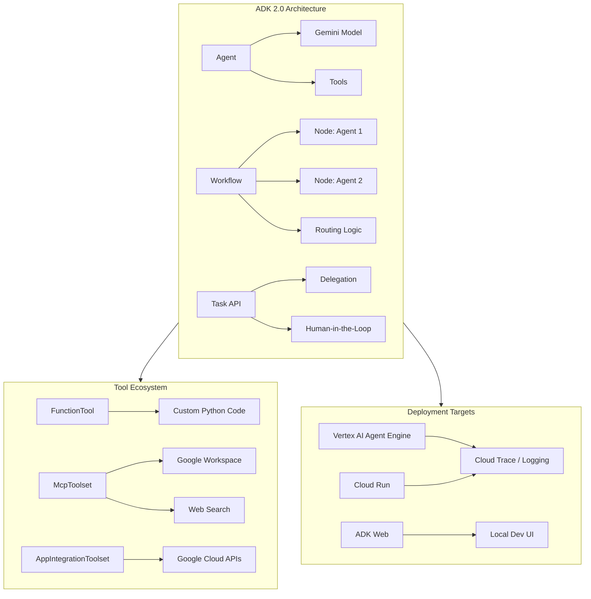

<!-- Clear Language: Keep sentences under 50 words -->
# Google Agent Development Kit (ADK)

## Learning Objectives

| LO | Description |
|----|-------------|
| LO1 | Understand Google ADK 2.0 architecture — Agent, Workflow, and Task API fundamentals |
| LO2 | Build and configure different agent types: LlmAgent, function agents, retrieval agents |
| LO3 | Integrate tools: Google Workspace MCP servers, custom FunctionTool, Google Search |
| LO4 | Design multi-agent workflows with graph-based orchestration, state management, and routing |
| LO5 | Deploy ADK agents to Vertex AI Agent Engine, Cloud Run, and monitor production traces |

## Introduction

Google Agent Development Kit (ADK) is an open-source, code-first Python framework for building, evaluating, and deploying sophisticated AI agents. ADK 2.0 (GA as of May 2026) introduces a graph-based Workflow Runtime, the Task API for structured agent-to-agent delegation, and native multi-agent orchestration. ADK is the recommended framework for building agents powered by Gemini models with deep integration into Google Workspace, Vertex AI, and Google Cloud services.

This chapter covers the full ADK stack — from defining a simple agent to deploying production multi-agent systems with Google Workspace tools, custom APIs, and monitoring.

## Prerequisites

- Python 3.10+ and working virtual environment
- Google Cloud project with Vertex AI API enabled
- Basic understanding of Gemini models and API usage
- Familiarity with MCP (Model Context Protocol) from previous chapters
- Completed Module 13 (AI Agents & LangGraph) or equivalent knowledge

## Key Terminology

| Term | Definition |
|------|------------|
| **Agent** | ADK class that defines an AI's instructions, tools, and model configuration |
| **LlmAgent** | ADK agent type that uses an LLM to reason, plan, and execute tasks |
| **Workflow** | Graph-based execution engine composing agents/nodes with routing and state |
| **Task API** | Structured delegation mechanism for agent-to-agent collaboration |
| **FunctionTool** | ADK wrapper for Python functions exposed as agent tools |
| **McpToolset** | Group of MCP-based tools connected via StreamableHTTP transport |
| **InvocationContext** | Context object for state management, artifact storage, and tool access |
| **Agent Engine** | Google Cloud managed service for deploying ADK agents at scale |
| **A2A** | Agent-to-Agent protocol for remote agent discovery and communication |

## Chapter at a Glance

| Section | Topic | Key Concept |
|---------|-------|-------------|
| 14.1 | ADK Overview & Architecture | Agent, Workflow, Task API — framework fundamentals |
| 14.2 | Agent Types | LlmAgent, function agents, retrieval-augmented agents |
| 14.3 | Tool Integration | Google Workspace MCP, custom FunctionTool, Google Search |
| 14.4 | Multi-Agent Architecture | Graph workflows, task delegation, state management, routing |
| 14.5 | Deployment & Monitoring | Vertex AI Agent Engine, Cloud Run, Cloud Trace |

## Chapter Roadmap



## 14.1 ADK Overview & Architecture

Google ADK 2.0 is built around three core abstractions: **Agent** (single AI entity), **Workflow** (graph-based orchestration), and **Task API** (structured delegation). ADK is model-agnostic but has first-class support for Gemini models. It supports Python 3.10+ and is available as the `google-adk` package.

### 14.1.1 Core Architectural Concepts

ADK 2.0 transitions from a hierarchical agent executor (1.x) to a graph-based execution engine. Every agent is a **node** in a workflow graph. This enables deterministic execution flows with routing, loops, retries, and human-in-the-loop.

```python
# ADK 2.0 core architecture: Agent, Workflow, Task
from google.adk import Agent, Workflow
from google.adk.tools import FunctionTool

# A single agent is the simplest ADK application
greeting_agent = Agent(
    name="greeting_agent",
    model="gemini-2.5-flash",
    instruction="You are a helpful assistant. Greet the user warmly and answer questions.",
)

# A workflow composes multiple agents/nodes into a graph
research_agent = Agent(
    name="research_agent",
    model="gemini-2.5-flash",
    instruction="Research the given topic thoroughly. Provide key facts and insights.",
)

summarize_agent = Agent(
    name="summarize_agent",
    model="gemini-2.5-flash",
    instruction="Summarize the research findings into 3 bullet points.",
)

# Workflow with sequential edges
research_workflow = Workflow(
    name="research_pipeline",
    edges=[
        ("START", research_agent),
        (research_agent, summarize_agent),
        (summarize_agent, "END"),
    ],
)
```

### 14.1.2 ADK Runtime and Execution Model

The ADK runtime manages the complete agent lifecycle: session creation, LLM calls, tool execution, state persistence, and result delivery. Each agent run has a `session` that stores conversation history, artifacts, and state variables.

```python
from google.adk import Agent, Runner

# Running an agent synchronously
agent = Agent(
    name="assistant",
    model="gemini-2.5-flash",
    instruction="You are a helpful assistant.",
)

# Runner.execute returns an Event sequence
events = Runner.execute(
    agent=agent,
    user_input="What is the capital of France?",
    session_id="session-001",
)

for event in events:
    print(f"[{event.type}] {event.content}")
    # event.types: 'TURN_START', 'LLM_RESPONSE', 'TOOL_CALL',
    #              'TOOL_RESULT', 'TURN_END', 'AGENT_END'
```

### 14.1.3 ADK 2.0 New Features

| Feature | Description |
|---------|-------------|
| **Workflow Runtime** | Graph-based execution with routing, fan-out/fan-in, loops, retry |
| **Task API** | Structured agent-to-agent delegation with multi-turn tasks |
| **Dynamic Nodes** | Code-based logic for loops and complex branching |
| **Human-in-the-Loop** | Pause workflow execution for human approval |
| **Nested Workflows** | Workflows as nodes within other workflows |

```python
# ADK 2.0 Workflow with routing and retry
from google.adk import Workflow, Agent

classify_agent = Agent(
    name="classifier",
    model="gemini-2.5-flash",
    instruction="Classify the query as 'tech', 'billing', or 'general'. Return only the category.",
)

tech_agent = Agent(
    name="tech_support",
    model="gemini-2.5-flash",
    instruction="Provide detailed technical support for the issue.",
)

billing_agent = Agent(
    name="billing_support",
    model="gemini-2.5-flash",
    instruction="Handle billing and account inquiries.",
)

# Workflow with conditional routing
support_workflow = Workflow(
    name="customer_support",
    edges=[
        ("START", classify_agent),
        (classify_agent, tech_agent, {"condition": "result == 'tech'"}),
        (classify_agent, billing_agent, {"condition": "result == 'billing'"}),
        (classify_agent, "END", {"condition": "result == 'general'"}),
        (tech_agent, "END"),
        (billing_agent, "END"),
    ],
    max_retries=2,  # Retry failed nodes up to 2 times
)
```

## 14.2 Agent Types

ADK provides several agent types for different use cases. The primary types are `LlmAgent` (conversational reasoning), `Agent` (simplified base), function-based agents, and retrieval-augmented agents.

### 14.2.1 LlmAgent — Conversational Agent

`LlmAgent` is the full-featured agent that uses an LLM to reason, plan tool calls, and generate responses. It supports instructions, tools, memory, and multi-turn conversations.

```python
from google.adk import LlmAgent
from google.adk.tools import FunctionTool
import json

# Define a tool as a standalone function
def get_weather(city: str, date: str = "today") -> str:
    """Get the weather forecast for a city.

    Args:
        city: The name of the city
        date: The date for the forecast (default: today)

    Returns:
        A JSON string with weather information
    """
    # Mock implementation — in production, call a weather API
    weather_data = {
        "city": city,
        "date": date,
        "temperature": 22,
        "conditions": "sunny",
        "humidity": "45%",
    }
    return json.dumps(weather_data)

# Configure the LlmAgent with tools
weather_agent = LlmAgent(
    name="weather_bot",
    model="gemini-2.5-flash",
    instruction="""You are a helpful weather assistant.
    Use the get_weather tool to provide accurate forecasts.
    Always specify the city and date when calling the tool.
    If the user asks about a city without a date, assume today.""",
    tools=[FunctionTool(func=get_weather)],
    temperature=0.3,  # Lower temperature for factual responses
    max_turns=5,      # Max conversation turns before requiring user input
)
```

### 14.2.2 Agent — Simplified Base Agent

`Agent` is a lighter base class for agents that don't need the full LlmAgent feature set. It is the base for all agent types in ADK.

```python
from google.adk import Agent

# Simple Agent with minimal configuration
simple_agent = Agent(
    name="simple_bot",
    model="gemini-2.5-flash",
    instruction="Answer questions concisely. Use no more than two sentences.",
)

# Agent with system instruction from a file
with open("system_prompt.txt", "r") as f:
    system_prompt = f.read()

file_aware_agent = Agent(
    name="file_bot",
    model="gemini-2.5-flash",
    instruction=system_prompt,
)

# Agent with custom output format
structured_agent = Agent(
    name="json_bot",
    model="gemini-2.5-flash",
    instruction="""Always respond in JSON format with keys: 'answer', 'confidence', 'sources'.
    Example: {"answer": "Paris", "confidence": 0.95, "sources": ["geography-db"]}""",
)
```

### 14.2.3 Function Agent — Tool-Driven Execution

A function agent is an agent that primarily executes code-based logic. It can use `FunctionTool` to wrap Python functions and expose them to the LLM for reasoning and execution.

```python
from google.adk import Agent
from google.adk.tools import FunctionTool
from typing import List, Dict
import json

# Database query tool
def query_database(sql: str) -> str:
    """Execute a SQL query against the products database.

    Args:
        sql: The SQL query string to execute

    Returns:
        JSON string with query results
    """
    # Mock database implementation
    mock_db = {
        "products": [
            {"id": 1, "name": "Laptop", "price": 1200, "stock": 15},
            {"id": 2, "name": "Mouse", "price": 25, "stock": 100},
            {"id": 3, "name": "Keyboard", "price": 75, "stock": 42},
        ]
    }

    # Simple SQL parser (mock)
    if "SELECT" in sql.upper():
        return json.dumps(mock_db.get("products", []))
    return json.dumps({"error": "Only SELECT queries supported in mock"})

# Email formatting tool
def format_email(recipient: str, subject: str, body: str) -> str:
    """Format and send an email notification.

    Args:
        recipient: Email address of the recipient
        subject: Email subject line
        body: Email body content

    Returns:
        Confirmation message
    """
    # Mock email sending
    return json.dumps({
        "status": "sent",
        "recipient": recipient,
        "subject": subject,
        "timestamp": "2026-07-28T10:00:00Z",
    })

# Function agent combining multiple tools
order_agent = Agent(
    name="order_processor",
    model="gemini-2.5-flash",
    instruction="""You are an order processing agent.
    Use query_database to check inventory.
    Use format_email to send order confirmations.
    Always verify stock before confirming an order.""",
    tools=[
        FunctionTool(func=query_database),
        FunctionTool(func=format_email),
    ],
)
```

### 14.2.4 Retrieval-Augmented Agent

ADK supports retrieval augmentation through tool integration. Agents can query knowledge bases, vector stores, or search APIs to ground their responses.

```python
from google.adk import LlmAgent
from google.adk.tools import FunctionTool
from typing import List
import json

# Mock vector database retrieval
def knowledge_retrieval(query: str, top_k: int = 3) -> str:
    """Retrieve relevant documents from the knowledge base.

    Args:
        query: The search query
        top_k: Number of documents to retrieve (default: 3)

    Returns:
        JSON string with retrieved documents
    """
    # Mock knowledge base
    documents = {
        "refund_policy": "Refunds are processed within 5-7 business days. "
                         "Items must be returned in original condition.",
        "shipping_info": "Standard shipping takes 3-5 business days. "
                        "Express shipping takes 1-2 business days.",
        "warranty": "All products come with a 1-year manufacturer warranty. "
                   "Extended warranty available for purchase.",
    }
    results = []
    for doc_id, content in documents.items():
        if any(term in query.lower() for term in doc_id.split("_")):
            results.append({"id": doc_id, "content": content, "score": 0.95})

    # Return top_k results
    return json.dumps(results[:top_k])

# RAG agent that retrieves knowledge before answering
rag_agent = LlmAgent(
    name="knowledge_agent",
    model="gemini-2.5-flash",
    instruction="""You are a customer support agent with access to a knowledge base.
    ALWAYS call knowledge_retrieval to find relevant information before answering.
    If the knowledge base doesn't have the answer, tell the user you'll escalate.
    Cite the document IDs you used to answer.""",
    tools=[FunctionTool(func=knowledge_retrieval)],
    temperature=0.2,  # Low temperature for factual answers
)
```

## 14.3 Tool Integration

ADK provides a rich tool ecosystem. Tools are categorized as `FunctionTool` (custom Python code), `McpToolset` (MCP-connected services), and `ApplicationIntegrationToolset` (pre-built Google Cloud connectors).

### 14.3.1 FunctionTool — Custom API Integration

`FunctionTool` wraps any Python function as a tool. ADK automatically generates JSON schemas from function signatures and docstrings.

```python
from google.adk.tools import FunctionTool
import requests
import json
from typing import Optional

def get_stock_price(ticker: str, exchange: str = "NASDAQ") -> str:
    """Get the current stock price for a given ticker symbol.

    Args:
        ticker: The stock ticker symbol (e.g., AAPL, GOOGL)
        exchange: The stock exchange (default: NASDAQ)

    Returns:
        JSON string with current stock price and metadata
    """
    # Mock implementation — in production, call a stock API
    mock_prices = {
        "AAPL": 198.50,
        "GOOGL": 175.30,
        "MSFT": 420.75,
        "AMZN": 185.20,
        "TSLA": 245.60,
    }
    price = mock_prices.get(ticker.upper(), None)
    if price is None:
        return json.dumps({"error": f"Ticker {ticker} not found"})
    return json.dumps({
        "ticker": ticker.upper(),
        "exchange": exchange,
        "price": price,
        "currency": "USD",
        "timestamp": "2026-07-28T14:30:00Z",
    })

def send_slack_notification(channel: str, message: str, priority: str = "normal") -> str:
    """Send a notification to a Slack channel.

    Args:
        channel: The Slack channel name (e.g., #alerts, #general)
        message: The message content to send
        priority: Message priority: 'low', 'normal', or 'high' (default: normal)

    Returns:
        JSON string with notification status
    """
    # Mock implementation
    return json.dumps({
        "status": "sent",
        "channel": channel,
        "message_preview": message[:50] + "..." if len(message) > 50 else message,
        "priority": priority,
        "timestamp": "2026-07-28T14:30:00Z",
    })

# Register tools with an agent
notification_agent = Agent(
    name="alert_agent",
    model="gemini-2.5-flash",
    instruction="""You are a financial alert agent.
    Use get_stock_price to check stock values.
    Use send_slack_notification to send alerts when conditions are met.
    Only send notifications when the user explicitly asks.""",
    tools=[
        FunctionTool(func=get_stock_price),
        FunctionTool(func=send_slack_notification),
    ],
)
```

### 14.3.2 Google Workspace MCP Integration

ADK integrates with Google Workspace (Gmail, Calendar, Drive, Chat) through dedicated MCP servers. This is the recommended production path for workspace data access.

```python
from google.adk import LlmAgent
from google.adk.tools import McpToolset
from google.adk.tools.mcp import StreamableHTTPConnectionParams
from datetime import datetime, timezone

# Current date for relative date calculations
current_date = datetime.now(timezone.utc).strftime("%Y-%m-%d")

# Define a dynamic auth header provider
# In production, this uses OAuth2 token injection from Google Cloud
def auth_header_producer():
    """Returns the current OAuth2 access token for Google Workspace."""
    # In production: fetch from ADC or environment
    # For local dev: use gcloud auth print-access-token
    return {"Authorization": "Bearer <placeholder>"}

# Configure Google Workspace MCP toolsets
calendar_mcp = McpToolset(
    connection_params=StreamableHTTPConnectionParams(
        url="https://calendarmcp.googleapis.com/mcp/v1",
    ),
    header_provider=auth_header_producer,
)

gmail_mcp = McpToolset(
    connection_params=StreamableHTTPConnectionParams(
        url="https://gmailmcp.googleapis.com/mcp/v1",
    ),
    header_provider=auth_header_producer,
)

drive_mcp = McpToolset(
    connection_params=StreamableHTTPConnectionParams(
        url="https://drivemcp.googleapis.com/mcp/v1",
    ),
    header_provider=auth_header_producer,
)

chat_mcp = McpToolset(
    connection_params=StreamableHTTPConnectionParams(
        url="https://chatmcp.googleapis.com/mcp/v1",
    ),
    header_provider=auth_header_producer,
)

people_mcp = McpToolset(
    connection_params=StreamableHTTPConnectionParams(
        url="https://people.googleapis.com/mcp/v1",
    ),
    header_provider=auth_header_producer,
)

universal_search_mcp = McpToolset(
    connection_params=StreamableHTTPConnectionParams(
        url="https://workspacemcp.googleapis.com/mcp/v1",
    ),
    header_provider=auth_header_producer,
)

# Workspace agent with all MCP tools
workspace_agent = LlmAgent(
    name="workspace_assistant",
    model="gemini-2.5-flash",
    instruction=f"""You are an enterprise assistant grounded in Google Workspace data.
    Today's date is {current_date}. Calculate relative dates using this reference.
    Use Calendar MCP to check schedules and create events.
    Use Gmail MCP to read and send emails.
    Use Drive MCP to find and manage files.
    Use Chat MCP for workspace messaging.
    Use People MCP for contact information.
    Use Universal Search to search across all Workspace products.""",
    tools=[
        calendar_mcp,
        gmail_mcp,
        drive_mcp,
        chat_mcp,
        people_mcp,
        universal_search_mcp,
    ],
)
```

### 14.3.3 Google Search Grounding

ADK supports Google Search grounding to provide real-time information and citations.

```python
from google.adk import LlmAgent
from google.adk.tools.google_search_agent_tool import GoogleSearchAgentTool

# Google Search tool for real-time information
search_tool = GoogleSearchAgentTool(
    search_engine_id="your_search_engine_id",  # From Google Cloud Console
    api_key="your_api_key",                    # Or use environment variable
    num_results=5,
    include_citations=True,
)

# Research agent grounded in web search
research_agent = LlmAgent(
    name="research_assistant",
    model="gemini-2.5-flash",
    instruction="""You are a research assistant with web access.
    Use Google Search to find the latest information on any topic.
    Always cite your sources.
    Synthesize information from multiple search results.
    If the user asks about recent events, always search before answering.""",
    tools=[search_tool],
    temperature=0.4,  # Balanced for research synthesis
)
```

### 14.3.4 Application Integration Toolset

For enterprise systems, ADK provides `ApplicationIntegrationToolset` that connects to Google Cloud's Integration Connectors.

```python
from google.adk.tools.application_integration_tool import ApplicationIntegrationToolset

# Configure pre-built connectors
integration_toolset = ApplicationIntegrationToolset(
    connectors={
        "salesforce": "projects/my-project/locations/us-central1/connectors/salesforce",
        "servicenow": "projects/my-project/locations/us-central1/connectors/servicenow",
        "bigquery": "projects/my-project/locations/us-central1/connectors/bigquery",
    },
    auth_config={
        "type": "oauth2",
        "scopes": [
            "https://www.googleapis.com/auth/cloud-platform",
        ],
    },
)

# Enterprise agent with SaaS integrations
enterprise_agent = LlmAgent(
    name="enterprise_bot",
    model="gemini-2.5-flash",
    instruction="""You are an enterprise integration agent.
    Use Salesforce connector for customer data.
    Use ServiceNow connector for ticket management.
    Use BigQuery connector for analytics queries.
    Always verify data before providing answers.""",
    tools=[integration_toolset],
)
```

## 14.4 Multi-Agent Architecture

ADK 2.0 provides three mechanisms for multi-agent systems: **Workflow Runtime** (graph-based), **Task API** (delegation-based), and **A2A Protocol** (remote agent discovery).

### 14.4.1 Workflow-Based Multi-Agent Orchestration

The Workflow Runtime treats agents as nodes in a directed graph. This enables deterministic, testable execution flows.

```python
from google.adk import Agent, Workflow
from google.adk.tools import FunctionTool

# Define specialized agents
intake_agent = Agent(
    name="intake",
    model="gemini-2.5-flash",
    instruction="""Extract the following from the user query:
    - issue_type: 'technical', 'billing', or 'general'
    - urgency: 'low', 'medium', 'high'
    - customer_id if provided
    Return as JSON.""",
)

diagnosis_agent = Agent(
    name="diagnosis",
    model="gemini-2.5-flash",
    instruction="""Based on the issue type, determine the root cause.
    For technical issues: check common error patterns.
    For billing issues: review account status.
    Provide detailed diagnosis steps.""",
)

resolution_agent = Agent(
    name="resolution",
    model="gemini-2.5-flash",
    instruction="""Based on the diagnosis, provide step-by-step resolution.
    Include code examples if applicable.
    If escalation needed, explain why.""",
)

feedback_agent = Agent(
    name="feedback",
    model="gemini-2.5-flash",
    instruction="""Ask the user if the resolution was helpful.
    Summarize the interaction for record-keeping.
    If unresolved, offer to escalate.""",
)

# Build the orchestration workflow
support_workflow = Workflow(
    name="support_pipeline",
    edges=[
        ("START", intake_agent),
        (intake_agent, diagnosis_agent),
        (diagnosis_agent, resolution_agent),
        (resolution_agent, feedback_agent),
        (feedback_agent, "END"),
    ],
    max_retries=1,
)
```

### 14.4.2 Task API — Agent-to-Agent Delegation

The Task API provides structured delegation patterns: multi-turn tasks, single-turn output, and mixed modes. Tasks enable agents to delegate sub-problems to specialized sub-agents.

```python
from google.adk import Agent
from google.adk.task import Task

# Define sub-agents for specific domains
code_reviewer = Agent(
    name="code_reviewer",
    model="gemini-2.5-flash",
    instruction="Review code for bugs, security issues, and best practices. "
                "Provide specific line-level feedback.",
)

security_analyzer = Agent(
    name="security_analyzer",
    model="gemini-2.5-flash",
    instruction="Analyze code for security vulnerabilities. "
                "Focus on OWASP Top 10, injection risks, and auth issues.",
)

performance_optimizer = Agent(
    name="performance_optimizer",
    model="gemini-2.5-flash",
    instruction="Analyze code for performance bottlenecks. "
                "Suggest optimizations for time and space complexity.",
)

# Define tasks for delegation
review_task = Task(
    name="full_code_review",
    subtasks=[
        Task(name="security_check", agent=security_analyzer, mode="single_turn"),
        Task(name="performance_check", agent=performance_optimizer, mode="single_turn"),
    ],
    aggregator="synthesize",  # Combine results from subtasks
)

# Orchestrator agent with task delegation
orchestrator_agent = Agent(
    name="review_orchestrator",
    model="gemini-2.5-flash",
    instruction="""You are a code review orchestrator.
    First, review the code yourself for basic issues.
    Then delegate to specialized reviewers for security and performance.
    Finally, provide a comprehensive summary report.""",
    tools=[review_task],
)

# Execute with delegation
events = Runner.execute(
    agent=orchestrator_agent,
    user_input="Review this Python function for potential issues:\n"
              "def process_payment(card_num, amount):\n"
              "    return execute_payment(card_num, amount)",
    session_id="review-session-001",
)
```

### 14.4.3 State Management Across Agents

ADK uses `InvocationContext` for state management. State is passed between agents via `ctx.state` (key-value store) and `ctx.artifacts` (file storage).

```python
from google.adk import LlmAgent, InvocationContext
from google.adk.tools import FunctionTool
import json

def save_user_context(ctx: InvocationContext, key: str, value: str) -> str:
    """Save a value to the user context state.

    Args:
        ctx: The invocation context (injected automatically)
        key: The state key
        value: The state value

    Returns:
        Confirmation message
    """
    ctx.state[key] = value
    return json.dumps({"status": "saved", "key": key, "value": value})

def load_user_context(ctx: InvocationContext, key: str) -> str:
    """Load a value from the user context state.

    Args:
        ctx: The invocation context (injected automatically)
        key: The state key to retrieve

    Returns:
        The stored value or error message
    """
    value = ctx.state.get(key)
    if value is None:
        return json.dumps({"error": f"Key '{key}' not found"})
    return json.dumps({"key": key, "value": value})

def log_artifact(ctx: InvocationContext, filename: str, content: str) -> str:
    """Store an artifact (file) in the session.

    Args:
        ctx: The invocation context (injected automatically)
        filename: The name of the artifact file
        content: The content to store

    Returns:
        Confirmation with artifact ID
    """
    artifact_id = ctx.artifacts.store(filename, content.encode())
    return json.dumps({"status": "stored", "artifact_id": artifact_id, "filename": filename})

# Agent with state management tools
stateful_agent = LlmAgent(
    name="stateful_agent",
    model="gemini-2.5-flash",
    instruction="""You are a stateful assistant that remembers user preferences.
    Use save_user_context to remember user details.
    Use load_user_context to recall previous information.
    Use log_artifact to store generated files (reports, code, etc.).
    Greet returning users by name if available in context.""",
    tools=[
        FunctionTool(func=save_user_context),
        FunctionTool(func=load_user_context),
        FunctionTool(func=log_artifact),
    ],
)
```

### 14.4.4 Advanced Routing Patterns

ADK 2.0 supports dynamic workflows with code-based routing logic.

```python
from google.adk import Workflow, Agent
from google.adk.graph import RoutingRule

# Dynamic workflow with condition-based routing
def route_by_sentiment(context) -> str:
    """Route to different agents based on sentiment analysis."""
    user_message = context.get("last_user_message", "")
    negative_words = ["angry", "frustrated", "cancel", "complaint", "refund"]
    urgent_words = ["emergency", "urgent", "immediately", "critical"]

    if any(word in user_message.lower() for word in urgent_words):
        return "priority_handler"
    elif any(word in user_message.lower() for word in negative_words):
        return "complaint_handler"
    return "standard_handler"

priority_agent = Agent(
    name="priority_handler",
    model="gemini-2.5-flash",
    instruction="""This is a PRIORITY escalation.
    Be extremely responsive and empathetic.
    Offer immediate solutions or escalation to a human.""",
)

complaint_agent = Agent(
    name="complaint_handler",
    model="gemini-2.5-flash",
    instruction="""Handle customer complaints professionally.
    Acknowledge the issue, apologize, and offer solutions.
    If the complaint is about billing, offer a discount or refund.""",
)

standard_agent = Agent(
    name="standard_handler",
    model="gemini-2.5-flash",
    instruction="""Handle general inquiries.
    Be helpful and efficient.
    Provide clear, actionable answers.""",
)

# Workflow with sentiment-based routing
routing_workflow = Workflow(
    name="intelligent_routing",
    edges=[
        ("START", priority_agent, {"condition": "route_by_sentiment == 'priority_handler'"}),
        ("START", complaint_agent, {"condition": "route_by_sentiment == 'complaint_handler'"}),
        ("START", standard_agent, {"condition": "route_by_sentiment == 'standard_handler'"}),
        (priority_agent, "END"),
        (complaint_agent, "END"),
        (standard_agent, "END"),
    ],
    routing_fn=route_by_sentiment,
)
```

### 14.4.5 Fan-Out / Fan-In Pattern

For parallel task execution, use the fan-out/fan-in pattern.

```python
from google.adk import Workflow, Agent

# Define research sub-agents for parallel execution
news_agent = Agent(
    name="news_researcher",
    model="gemini-2.5-flash",
    instruction="Research latest news about the given topic. Include dates and sources.",
)

academic_agent = Agent(
    name="academic_researcher",
    model="gemini-2.5-flash",
    instruction="Find academic papers and research studies about the topic. "
                "Include authors and publication dates.",
)

social_agent = Agent(
    name="social_researcher",
    model="gemini-2.5-flash",
    instruction="Research social media discussions and public opinion about the topic.",
)

synthesis_agent = Agent(
    name="synthesis_agent",
    model="gemini-2.5-flash",
    instruction="""Synthesize the research findings from all sources.
    Create a comprehensive report with sections:
    1. Executive Summary
    2. Key Findings
    3. Sources & References
    4. Recommendations""",
)

# Workflow with fan-out (parallel) and fan-in (aggregation)
research_workflow = Workflow(
    name="comprehensive_research",
    edges=[
        ("START", news_agent),        # Fan-out: all three run in parallel
        ("START", academic_agent),
        ("START", social_agent),
        (news_agent, synthesis_agent), # Fan-in: all results feed into synthesis
        (academic_agent, synthesis_agent),
        (social_agent, synthesis_agent),
        (synthesis_agent, "END"),
    ],
    execution_mode="parallel",  # Run parallel branches concurrently
)
```

## 14.5 Deployment & Monitoring

ADK agents can be deployed to multiple targets. The recommended production path is Vertex AI Agent Engine for managed scaling, or Cloud Run for custom deployment.

### 14.5.1 Vertex AI Agent Engine Deployment

Agent Engine is Google Cloud's managed service for ADK agents. It provides auto-scaling, built-in monitoring, and OAuth integration.

```python
# agent_deploy.py — Deployment script for Vertex AI Agent Engine
from google.adk import Agent
from google.adk.tools import FunctionTool
from google.cloud import aiplatform
import os

# Define the agent (same as development)
def get_exchange_rate(base: str, target: str) -> str:
    """Get the current exchange rate between two currencies.

    Args:
        base: The base currency code (e.g., USD)
        target: The target currency code (e.g., EUR)

    Returns:
        JSON string with exchange rate
    """
    import json
    # Mock implementation
    rates = {"USD_EUR": 0.92, "EUR_USD": 1.09, "USD_GBP": 0.79, "GBP_USD": 1.27}
    key = f"{base.upper()}_{target.upper()}"
    rate = rates.get(key)
    if rate is None:
        return json.dumps({"error": f"Rate for {base}/{target} not found"})
    return json.dumps({"base": base, "target": target, "rate": rate})

forex_agent = Agent(
    name="forex_agent",
    model="gemini-2.5-flash",
    instruction="You are a currency exchange assistant. Provide exchange rates using the tool.",
    tools=[FunctionTool(func=get_exchange_rate)],
)

# Deploy to Vertex AI Agent Engine
def deploy_to_agent_engine():
    """Deploy the agent to Vertex AI Agent Engine."""
    # Initialize Vertex AI
    aiplatform.init(
        project=os.environ["GOOGLE_CLOUD_PROJECT"],
        location="us-central1",
    )

    # Create Agent Engine deployment
    engine = aiplatform.AgentEngine.create(
        display_name="forex-agent",
        agent=forex_agent,
        description="Currency exchange rate agent deployed via ADK",
        # Authentication config for OAuth
        auth_config={
            "oauth": {
                "client_id": os.environ["OAUTH_CLIENT_ID"],
                "client_secret": os.environ["OAUTH_CLIENT_SECRET"],
            }
        },
    )
    print(f"Deployed Agent Engine: {engine.resource_name}")
    print(f"Endpoint: {engine.endpoint}")
    return engine

# if __name__ == "__main__":
#     deploy_to_agent_engine()
```

### 14.5.2 Cloud Run Deployment

For custom deployment scenarios, wrap the agent in a FastAPI server and deploy to Cloud Run.

```python
# cloud_run_server.py — FastAPI server wrapping ADK agent
from fastapi import FastAPI, HTTPException
from pydantic import BaseModel
from google.adk import Agent, Runner
from google.adk.tools import FunctionTool
import uvicorn
import os

# Define the agent
def sentiment_analysis(text: str) -> str:
    """Analyze the sentiment of the given text.

    Args:
        text: The text to analyze

    Returns:
        JSON string with sentiment label and score
    """
    import json
    # Mock implementation — in production, use a sentiment model
    positive_words = ["good", "great", "excellent", "happy", "wonderful"]
    negative_words = ["bad", "terrible", "awful", "sad", "horrible"]

    score = 0
    for word in text.lower().split():
        if word in positive_words:
            score += 1
        elif word in negative_words:
            score -= 1

    if score > 0:
        label = "positive"
    elif score < 0:
        label = "negative"
    else:
        label = "neutral"

    return json.dumps({"sentiment": label, "score": score})

agent = Agent(
    name="sentiment_agent",
    model="gemini-2.5-flash",
    instruction="Analyze the sentiment of user messages using the sentiment_analysis tool.",
    tools=[FunctionTool(func=sentiment_analysis)],
)

# FastAPI application
app = FastAPI(title="ADK Sentiment Agent")

class QueryRequest(BaseModel):
    message: str
    session_id: str = "default"

class QueryResponse(BaseModel):
    response: str
    session_id: str

@app.post("/chat", response_model=QueryResponse)
async def chat(request: QueryRequest):
    """Handle a chat request to the ADK agent."""
    try:
        events = Runner.execute(
            agent=agent,
            user_input=request.message,
            session_id=request.session_id,
        )
        # Collect all response content
        responses = []
        for event in events:
            if event.type == "LLM_RESPONSE":
                responses.append(event.content)

        return QueryResponse(
            response=" ".join(responses),
            session_id=request.session_id,
        )
    except Exception as e:
        raise HTTPException(status_code=500, detail=str(e))

@app.get("/health")
async def health():
    """Health check endpoint for Cloud Run."""
    return {"status": "healthy", "agent": "sentiment_agent"}

# For local testing:
# if __name__ == "__main__":
#     uvicorn.run(app, host="0.0.0.0", port=8080)
```

```yaml
# cloudrun.yaml — Cloud Run deployment configuration
apiVersion: serving.knative.dev/v1
kind: Service
metadata:
  name: adk-sentiment-agent
  annotations:
    run.googleapis.com/ingress: all
spec:
  template:
    spec:
      containers:
        - image: gcr.io/my-project/adk-sentiment-agent:latest
          ports:
            - containerPort: 8080
          env:
            - name: GOOGLE_CLOUD_PROJECT
              value: "my-project"
            - name: GOOGLE_GENAI_USE_VERTEXAI
              value: "1"
          resources:
            limits:
              memory: "1Gi"
              cpu: "2"
          startupProbe:
            httpGet:
              path: /health
            initialDelaySeconds: 10
            periodSeconds: 5
```

### 14.5.3 Local Development with ADK Web

ADK provides a built-in web UI for local development and testing.

```bash
# Install ADK
pip install google-adk

# Run the web UI for a single agent directory
adk web path/to/agent/directory

# The web UI provides:
# - Interactive chat interface
# - Tool call visualization
# - Session management
# - Multi-turn conversation history
# - Support for multi-agent directories
```

```python
# agent_directory/agent.py — Structure for ADK Web
from google.adk import LlmAgent
from google.adk.tools import FunctionTool
import json

# ADK Web automatically discovers agents in the directory
def calculator(operation: str, a: float, b: float) -> str:
    """Perform a mathematical calculation.

    Args:
        operation: The operation: add, subtract, multiply, divide
        a: First number
        b: Second number

    Returns:
        JSON string with calculation result
    """
    ops = {
        "add": a + b,
        "subtract": a - b,
        "multiply": a * b,
        "divide": a / b if b != 0 else "Error: division by zero",
    }
    result = ops.get(operation, f"Unknown operation: {operation}")
    return json.dumps({"operation": operation, "a": a, "b": b, "result": result})

calc_agent = LlmAgent(
    name="calculator",
    model="gemini-2.5-flash",
    instruction="You are a helpful calculator. Use the calculator tool to perform math operations.",
    tools=[FunctionTool(func=calculator)],
    temperature=0.1,
)
```

### 14.5.4 Production Monitoring with Cloud Trace

ADK agents deployed to Google Cloud automatically emit traces to Cloud Trace. Additional monitoring can be configured for custom metrics.

```python
# monitoring_config.py — Monitoring setup for production ADK agents
from google.cloud import monitoring_v3
from google.cloud import trace_v2
import time

class ADKMetricsReporter:
    """Reports custom metrics from ADK agent runs to Cloud Monitoring."""

    def __init__(self, project_id: str):
        self.project_id = project_id
        self.metric_client = monitoring_v3.MetricServiceClient()
        self.project_name = f"projects/{project_id}"

    def report_agent_metric(
        self, agent_name: str, metric_type: str, value: float
    ):
        """Report a custom metric for an agent.

        Args:
            agent_name: Name of the ADK agent
            metric_type: Type of metric (latency, accuracy, error_rate)
            value: The metric value
        """
        series = monitoring_v3.TimeSeries()
        series.metric.type = f"custom.googleapis.com/adk/{metric_type}"
        series.resource.type = "global"
        series.resource.labels["project_id"] = self.project_id

        # Add metric labels
        series.metric.labels["agent_name"] = agent_name
        series.metric.labels["environment"] = "production"

        # Add data point
        now = time.time()
        point = series.points.add()
        point.value.double_value = value
        point.interval.end_time.seconds = int(now)
        point.interval.end_time.nanos = int((now - int(now)) * 1e9)

        self.metric_client.create_time_series(
            request={
                "name": self.project_name,
                "time_series": [series],
            }
        )

    def report_trace_span(
        self, trace_id: str, span_name: str, duration_ms: float
    ):
        """Report a custom trace span for debugging.

        Args:
            trace_id: The trace ID from the agent run
            span_name: Name of the span
            duration_ms: Duration in milliseconds
        """
        trace_client = trace_v2.TraceServiceClient()
        project_path = f"projects/{self.project_id}"

        span = trace_v2.Span(
            name=f"{project_path}/traces/{trace_id}/spans/{span_name}",
            span_id=span_name.encode()[:16].hex(),
            display_name=trace_v2.TruncatableString(value=span_name),
            start_time={"seconds": int(time.time())},
            end_time={"seconds": int(time.time() + duration_ms / 1000)},
        )

        trace_client.create_span(request={"span": span})

# Usage in production
# metrics_reporter = ADKMetricsReporter(project_id="my-project")
# metrics_reporter.report_agent_metric("forex_agent", "latency", 1.25)
```

## Interview Q&A

### Q1: What is Google ADK and how does it differ from other agent frameworks?
**Answer:** Google ADK (Agent Development Kit) is an open-source, code-first Python framework for building, evaluating, and deploying AI agents. Unlike LangGraph (graph-based but model-agnostic) or OpenAI Agents SDK (OpenAI-only), ADK has first-class support for Gemini models, deep Google Workspace integration via MCP, and native deployment to Vertex AI Agent Engine. ADK 2.0 introduced a graph-based Workflow Runtime and the Task API for structured agent delegation.

### Q2: Explain the three core abstractions in ADK 2.0.
**Answer:** The three core abstractions are: **Agent** (defines an AI entity with model, instructions, and tools), **Workflow** (graph-based execution engine composing agents/nodes with routing, loops, and retries), and **Task API** (structured agent-to-agent delegation with multi-turn task mode, single-turn controlled output, and human-in-the-loop). In ADK 2.0, every Agent is evaluated as a node within the Workflow graph.

### Q3: How does ADK integrate with Google Workspace?
**Answer:** ADK integrates with Google Workspace through dedicated MCP (Model Context Protocol) servers. Each service (Gmail, Calendar, Drive, Chat, People) has a corresponding MCP endpoint at `*.googleapis.com/mcp/v1`. Tools are connected via `McpToolset` with `StreamableHTTPConnectionParams`. Authentication uses OAuth2 with dynamic `header_provider` for token injection. In production, tokens are provided by the hosting platform (Vertex AI Agent Engine).

### Q4: What is the difference between LlmAgent and Agent in ADK?
**Answer:** `LlmAgent` is the full-featured agent class with complete LLM reasoning, tool calling, multi-turn conversation, and configurable parameters (temperature, max_turns, etc.). `Agent` is the simplified base class that provides minimal configuration. In ADK 2.0, both are nodes in the Workflow graph. Use `LlmAgent` for most production agents; use `Agent` for simple or intermediate processing nodes.

### Q5: How does ADK 2.0's Workflow Runtime work?
**Answer:** The Workflow Runtime is a graph-based execution engine. Agents are nodes in the graph, connected by directed edges. Execution flows through the graph with support for conditional routing (based on agent output), fan-out/fan-in (parallel execution), loops, retries, and dynamic nodes. The runtime manages state propagation between nodes via `InvocationContext`. Workflows can be nested — a workflow can be a node in another workflow.

### Q6: What monitoring capabilities does ADK provide for production agents?
**Answer:** ADK agents deployed to Google Cloud automatically emit traces to Cloud Trace. Each agent run generates spans for LLM calls, tool executions, and state transitions. Additional monitoring includes: Cloud Logging for agent outputs and errors, Cloud Monitoring for custom metrics (latency, error rates, token usage), and the ADK Web UI for local debugging. The Vertex AI Agent Engine provides a dashboard with per-session traces and performance metrics.

### Q7: Explain how FunctionTool works in ADK. How does it handle schema generation?
**Answer:** `FunctionTool` wraps any Python function as an agent tool. ADK automatically generates JSON schemas for tool parameters by inspecting the function signature — type hints, parameter names, and docstrings are parsed to create the schema. The function's docstring becomes the tool's description. ADK supports complex types (lists, dicts, nested objects) via Pydantic model integration. The LLM uses these schemas to decide when and how to call tools.

### Q8: How does ADK handle state management in multi-agent systems?
**Answer:** ADK uses `InvocationContext` for state management. `ctx.state` provides a key-value store shared across agents in the same session. `ctx.artifacts` provides file storage for generated content (reports, images, code). State is propagated automatically through workflow edges. Agents can read/write state to pass data between workflow nodes. State persistence is managed by the session system — each session has an isolated state namespace.

### Q9: What deployment options are available for ADK agents?
**Answer:** ADK agents can be deployed to: (1) **Vertex AI Agent Engine** — managed service with auto-scaling, OAuth, and monitoring; (2) **Cloud Run** — custom deployment with FastAPI server; (3) **Google Kubernetes Engine** — containerized deployment; (4) **Gemini Enterprise Agent Platform** — for Workspace-integrated agents; (5) **Local/on-prem** — using ADK Web UI or custom runner. All Cloud deployments inherit Cloud Trace, Cloud Logging, and IAM security.

### Q10: Compare ADK's multi-agent patterns: Workflow, Task API, and A2A protocol.
**Answer:** **Workflow** is best for deterministic, graph-based execution with conditional routing and parallel branches — suitable for pipelines with known flows. **Task API** is for structured delegation where an agent assigns sub-tasks to specialized agents — supports multi-turn tasks and human-in-the-loop. **A2A (Agent-to-Agent) protocol** enables remote agent discovery and communication across service boundaries — suitable for distributed agent systems. In practice, these patterns are often combined: a Workflow may use Task API for delegation, and Task agents may communicate via A2A.

## Summary

Google Agent Development Kit (ADK) provides a complete framework for building production-grade AI agents powered by Gemini. ADK 2.0 introduces a graph-based Workflow Runtime, the Task API for structured delegation, and deep integration with Google Workspace through MCP servers. Developers start with simple `LlmAgent` definitions and grow into sophisticated multi-agent workflows with conditional routing, parallel execution, and state management.

ADK's tool ecosystem includes `FunctionTool` for custom Python code, `McpToolset` for Google Workspace and third-party MCP servers, and `ApplicationIntegrationToolset` for enterprise SaaS connectors. Production deployment options include Vertex AI Agent Engine (managed), Cloud Run (custom), and Google Kubernetes Engine (containerized), all with built-in Cloud Trace monitoring.

For AI engineers, ADK represents the recommended path for building Gemini-powered agents with enterprise-grade security, scalability, and Google Cloud integration. The framework's code-first approach, automatic schema generation, and comprehensive tool ecosystem make it suitable for everything from simple chatbots to complex multi-agent automation systems.
## Chapter Quiz (5 MCQ)

1. What is the recommended production deployment target for ADK agents on Google Cloud?
   a) Cloud Functions
   b) Vertex AI Agent Engine
   c) Compute Engine
   d) App Engine

2. Which class does ADK use to connect to Google Workspace services?
   a) `WorkspaceTool`
   b) `GoogleApiTool`
   c) `McpToolset`
   d) `IntegrationConnector`

3. In ADK 2.0, how are agents evaluated within the execution engine?
   a) As standalone processes
   b) As nodes within a Workflow graph
   c) As microservices via HTTP
   d) As Lambda functions

4. What is the purpose of the Task API in ADK 2.0?
   a) To schedule periodic agent execution
   b) To enable structured agent-to-agent delegation with multi-turn tasks
   c) To parallelize LLM calls
   d) To cache agent responses

5. How does ADK generate JSON schemas for function tools?
   a) Manually defined by the developer
   b) Automatically from type hints and docstrings
   c) From a separate schema file
   d) Using the OpenAPI specification

**Answers**: 1-b, 2-c, 3-b, 4-b, 5-b

## Exercises (5)

### Exercise 1: Build a Gmail Assistant Agent
Create an ADK `LlmAgent` that connects to Gmail MCP. The agent should be able to search for emails by subject, read email content, and send replies. Use the `McpToolset` with `StreamableHTTPConnectionParams`. Include proper OAuth configuration for local testing. Test with commands like "Find the last email from john@example.com" and "Summarize my unread emails from today."

### Exercise 2: Implement a Multi-Agent Research Pipeline
Build a `Workflow` with three agents: a query analyzer (classifies the research topic), a web search agent (uses `GoogleSearchAgentTool` to find information), and a report generator (synthesizes results into a structured document). Add conditional routing: if the topic is technical, add a fourth agent for code example generation. Use fan-out pattern for parallel searches.

### Exercise 3: Create a Custom FunctionTool Integration
Write a Python function that calls a public REST API (e.g., GitHub API, news API, or weather API). Wrap it as a `FunctionTool`. Build an `LlmAgent` that uses this tool. Handle rate limiting and errors gracefully (return structured error messages instead of raising exceptions). Test with multiple concurrent sessions.

### Exercise 4: Design a Stateful Customer Support Workflow
Build a multi-agent workflow for customer support: (1) Intake agent extracts issue type and customer ID, saves to `ctx.state`; (2) Diagnosis agent reads state and determines root cause; (3) Resolution agent provides steps and stores resolution in state; (4) Feedback agent reads state and asks for satisfaction rating. Use `FunctionTool` wrappers for `save_user_context` and `load_user_context`.

### Exercise 5: Deploy an ADK Agent to Cloud Run
Take any agent from the exercises above and containerize it. Create a FastAPI server (as shown in section 14.5.2) with `/chat` and `/health` endpoints. Write a `Dockerfile` and `cloudrun.yaml` configuration. Deploy to Cloud Run using `gcloud run deploy`. Verify the deployment by sending test requests to the `/chat` endpoint.

## Practical Takeaways

- Google ADK 2.0 is an open-source, code-first Python framework with first-class Gemini model support
- Three core abstractions: Agent (AI entity), Workflow (graph orchestration), Task API (structured delegation)
- ADK integrates with Google Workspace via MCP servers (Gmail, Calendar, Drive, Chat, People)
- FunctionTool automatically generates JSON schemas from Python function signatures and docstrings
- Multi-agent architectures are built using Workflow graphs with conditional routing, fan-out/fan-in, and loops
- State management uses InvocationContext with state key-value store and artifact file storage
- Recommended production deployment is Vertex AI Agent Engine with auto-scaling and monitoring
- ADK agents emit traces to Cloud Trace for observability in production
- ADK supports model-agnostic usage with Gemini as the primary model via Google Gen AI SDK
- The framework is available in Python, TypeScript, Go, and Java for enterprise adoption

## Placement Section

### Top 10 Interview Questions

#### Google Style

1. **Explain the core idea of Google Agent Development Kit (ADK) in under 60 seconds, then give a real-world analogy.** — Structure: definition, how it works in one sentence, why it matters, analogy. Follow-up: what would break if you removed this from a production system?

2. **Design a minimal, well-typed function that demonstrates Google Agent Development Kit (ADK).** — Interviewer checks: signature with type hints, edge cases, complexity, and a clean docstring. Follow-up: how does your design behave with empty or malformed input?

3. **What are the common pitfalls when engineers first learn ** — List 3-4, then explain how you would prevent each in a code review.

#### Amazon Style

4. **Describe a production bug caused by misunderstanding Google Agent Development Kit (ADK). How did you diagnose and fix it?** — STAR format: situation, task, action, result. Mention logs, reproduction, root-cause analysis, and the regression test you added.

5. **How would you scale a system that relies on Google Agent Development Kit (ADK) from 10 users to 10 million?** — Discuss bottlenecks, caching, monitoring, and when to redesign. Follow-up: what metrics would you track?

#### Microsoft Style

6. **Compare Google Agent Development Kit (ADK) with the closest alternative approach. When would you choose each?** — Make a decision matrix: performance, maintainability, ecosystem, learning curve. Follow-up: what would change your decision?

7. **Walk through how you would test a component that depends on Google Agent Development Kit (ADK).** — Unit, integration, property-based tests; mocking boundaries; golden files for outputs.

#### NVIDIA Style

8. **How does Google Agent Development Kit (ADK) behave differently at scale — memory, throughput, or precision-wise?** — Connect to data pipelines and model training if applicable. Follow-up: what happens to latency as input grows?

9. **How would you make an implementation of Google Agent Development Kit (ADK) run faster on GPU hardware?** — Batch operations, vectorization, avoiding Python loops, reducing data movement.

#### AI Startup Style

10. **Write the smallest possible implementation of Google Agent Development Kit (ADK) that is production-quality.** — Include error handling, type hints, and a one-line docstring. Follow-up: what would you refactor first when it grows?

### Resume Tips

- Name Google Agent Development Kit (ADK) explicitly in your skills section, paired with a measurable achievement ("Reduced X by 40% using Google Agent Development Kit (ADK)").
- Add a bullet describing a project that applies Google Agent Development Kit (ADK) to real data, with numbers.
- Mention the tools and libraries you used alongside Google Agent Development Kit (ADK) (linters, test frameworks, profiling tools).
- Keep resume bullets under 15 words and start each with an action verb.

### Interview Day Checklist

- Rehearse a 60-second explanation of Google Agent Development Kit (ADK) and one real-world analogy.
- Prepare one STAR story about debugging a Google Agent Development Kit (ADK)-related production issue.
- Review complexity and edge cases for the classic Google Agent Development Kit (ADK) interview problem.
- Have questions ready: how does the team apply Google Agent Development Kit (ADK) in production today?
- Test your environment (Python, editor, internet) 15 minutes before the interview.

## True/False

1. **True or False:** Google Agent Development Kit (ADK) builds directly on the fundamentals covered in the earlier chapters of this module. — **True.** Every advanced topic in this module assumes the core concepts from the previous chapters.
2. **True or False:** You should write at least one code example for Google Agent Development Kit (ADK) before moving to the next chapter. — **True.** Active recall with hands-on code beats passive reading for retention.
3. **True or False:** The complexity analysis for Google Agent Development Kit (ADK) is the same regardless of input size. — **False.** Complexity grows with input size; always state best, average, and worst case.
4. **True or False:** Edge cases (empty input, invalid input, boundary values) matter for Google Agent Development Kit (ADK) in production. — **True.** Most production bugs come from unhandled edge cases.
5. **True or False:** You should memorize the Google Agent Development Kit (ADK) chapter content once and never review it again. — **False.** Spaced repetition (24h, 3 days, 1 week) dramatically improves long-term recall.

## Fill in the Blank

1. The chapter that covers Google Agent Development Kit (ADK) is Chapter ___ of this module. — Answer: check the module's table of contents.
2. The time complexity of the standard approach to Google Agent Development Kit (ADK) is ___. — Answer: review the theory section and state big-O notation.
3. The main edge case to handle when implementing Google Agent Development Kit (ADK) is ___. — Answer: empty or invalid input handling, as discussed in the chapter.
4. The tools commonly used to debug Google Agent Development Kit (ADK) issues are ___ and ___. — Answer: refer to the Debugging Guide section of this chapter.
5. The related topic that connects to Google Agent Development Kit (ADK) in the next chapter is ___. — Answer: see the Next Topic section.

## Scenario Questions

1. **Scenario:** A teammate ships a change involving Google Agent Development Kit (ADK) that breaks production at 3 AM. — Diagnosis: check the recent diff, reproduce locally with the failing input, check logs. Fix: revert, add a regression test, and review the root cause. Prevention: CI tests on edge cases and code review checklist.

2. **Scenario:** Your implementation of Google Agent Development Kit (ADK) is correct but too slow for the required latency. — Measure first with a profiler. Common fixes: reduce redundant work, use built-in optimized functions, batch operations, or add caching. Only then consider algorithmic changes.

3. **Scenario:** A new hire asks you to explain Google Agent Development Kit (ADK) in five minutes before a customer demo. — Use the 3-part answer: what it is (one sentence), how it works (one example), why it matters (one business impact). Then offer to go deeper after the demo.

4. **Scenario:** Your team's codebase has three different patterns for Google Agent Development Kit (ADK) and you must standardize. — Write a short ADR (architecture decision record), pick the pattern with best maintainability, migrate incrementally, and add a linter rule to enforce it.

## Output Questions

1. **What is the output of the simplest correct implementation of Google Agent Development Kit (ADK) on an empty input?** — Trace through the code: it should return the documented default (None, 0, empty collection) without raising.
2. **What is the output when the input is at the boundary value?** — Check off-by-one errors and inclusive/exclusive bounds in the chapter's examples.
3. **What does the implementation return when given invalid input types?** — With type hints and validation, it raises a clear error; without, it may fail silently.
4. **What is the output for the sample input given in the chapter's Examples section?** — Re-run the chapter's example code and compare against the documented output.
5. **What is the time complexity output when you profile the implementation at 10x input size?** — Expect the curve matching the chapter's complexity analysis (linear, quadratic, log-linear).

## Difficulty Level

| Level | Time | What It Takes |
|-------|------|---------------|
| Beginner | 1-2 sessions | Read theory, run the chapter examples, solve the Easy exercises |
| Intermediate | 3-5 sessions | Complete Medium exercises, explain Google Agent Development Kit (ADK) to someone else |
| Advanced | 1+ week | Solve Hard exercises, optimize for real datasets, answer interview follow-ups |

## Tips & Tricks

- Always write a one-line example of Google Agent Development Kit (ADK) from memory before opening the chapter — active recall first.
- Use the chapter's Revision Notes as a checklist: you have mastered Google Agent Development Kit (ADK) when you can explain each bullet.
- Pair the chapter quiz with the Flashcards: wrong answers become your next study session's focus.
- For interviews, practice explaining Google Agent Development Kit (ADK) twice: once with a technical audience, once with a non-technical audience.
- Keep a personal examples file where you collect your own Google Agent Development Kit (ADK) snippets; interviewers love original examples.

## Memory Tricks

- **Acronym**: build a mnemonic from the 5 key concepts of Google Agent Development Kit (ADK) listed in the Chapter at a Glance table.
- **Story**: link Google Agent Development Kit (ADK) to a familiar story — the analogy in the Visual Analogy section is designed to stick.
- **Number anchor**: remember the complexity of Google Agent Development Kit (ADK) by connecting it to a known algorithm of the same class.
- **Color code**: highlight the Theory, Examples, and Common Mistakes sections in different colors when reviewing.
- **Teach-back**: explain Google Agent Development Kit (ADK) to an imaginary junior engineer for 2 minutes — gaps in your explanation are gaps in memory.

## Further Reading

- Official documentation for the primary tool or library used in this chapter
- The chapter referenced in Related Topics for the next-level treatment of Google Agent Development Kit (ADK)
- The classic textbook chapter on Google Agent Development Kit (ADK) (check the Research References below)
- Two blog posts from engineers who debugged real Google Agent Development Kit (ADK) problems in production
- The repository of the open-source project that implements Google Agent Development Kit (ADK)

## Related Topics

- The previous chapter in this module (see table of contents) — foundational for Google Agent Development Kit (ADK)
- The next chapter (see Next Topic below) — builds on Google Agent Development Kit (ADK)
- The system design chapters in Module 07 — how Google Agent Development Kit (ADK) fits into production architectures
- The interview preparation module — how Google Agent Development Kit (ADK) is asked in screening rounds
- The capstone project — where Google Agent Development Kit (ADK) is applied end-to-end

## FAQs

1. **Do I need to memorize all of Google Agent Development Kit (ADK), or understand the big picture?** — Understand the big picture first, then memorize the key facts via flashcards and spaced repetition. Interviewers reward depth over breadth.
2. **What if I get stuck on an exercise?** — Re-read the theory section, run the example code, then attempt again. If still stuck after 20 minutes, move on and return the next day.
3. **How much time should I spend on ** — Follow the Study Plan below: 1-2 weeks at 30-60 minutes daily is typical for placement preparation.
4. **Is Google Agent Development Kit (ADK) asked in interviews?** — Yes — the Interview Q&A and Placement Section list the exact question styles used by top companies.
5. **What's the fastest way to master ** — Explain it out loud, write code without looking, and review the flashcards within 24 hours and again after 3 days.

## Important Notes

- Google Agent Development Kit (ADK) is a core requirement for the rest of this module — do not skip the examples.
- Always analyze complexity (time and space) when working with Google Agent Development Kit (ADK).
- Production correctness means handling edge cases, not just the happy path.
- Interview answers should start with the definition, then the example, then the trade-offs.
- Revisit this chapter after finishing the module; the context from later chapters deepens understanding.

## Historical Context

- Google Agent Development Kit (ADK) emerged as a standard practice because early systems failed without it — understanding why helps you explain it in interviews.
- The tools used for Google Agent Development Kit (ADK) today evolved from simpler versions; the chapter covers the modern, recommended approach.
- Interviewers value knowing one historical fact about Google Agent Development Kit (ADK) — it shows genuine interest, not just cramming.
- The library/tooling ecosystem around Google Agent Development Kit (ADK) changes quickly; focus on fundamentals that remain stable.

## Security Considerations

- Never trust external input: validate and sanitize data before processing Google Agent Development Kit (ADK).
- Avoid `eval()` and dynamic code execution on untrusted strings.
- Log errors without leaking sensitive data (keys, PII, internal paths).
- For API contexts, add rate limiting and input size limits.
- Review the chapter's code examples for injection or overflow risks before using them verbatim.

## ML Intuition

- Google Agent Development Kit (ADK) appears in ML pipelines at the data-processing layer: feature preparation, batching, and validation.
- Understanding Google Agent Development Kit (ADK) helps you debug why a model misbehaves — most ML bugs are data bugs, not model bugs.
- In production ML, the Google Agent Development Kit (ADK) concepts from this chapter map directly to NumPy/PyTorch operations on tensors.
- When optimizing ML systems, Google Agent Development Kit (ADK) skills let you profile and fix the data path, not just the training loop.
- Interview follow-up: how would you apply Google Agent Development Kit (ADK) to a dataset of 10 million records? — Batching and vectorization.

## Analogies

- **Google Agent Development Kit (ADK) is like a recipe**: the theory is the ingredients, the examples are the cooking steps, and the exercises are your own kitchen practice.
- **Complexity is like a delivery route**: a linear route visits each stop once; a nested route revisits stops, and you feel it at scale.
- **Edge cases are like weather**: the happy path is a sunny day; production is the storm — build for the storm.
- **The chapter roadmap is a journey map**: each section is a checkpoint; skipping one means getting lost later in the module.

## Capstone Project Link

- [Module Capstone: End-to-End Project](https://github.com/Raushan666java/ai-engineering-journey) — this chapter contributes the Google Agent Development Kit (ADK) skills used in the module's capstone project. Complete the exercises here before starting the capstone.

## Flashcards

<details class="tp-qa-card" data-qid="22advancedaiagents-14googleadk-flash1">
  <summary class="tp-qa-question">
    <span class="tp-qa-status"></span>
    What is the core concept of Google Agent Development Kit (ADK) in one sentence?
  </summary>
  <div class="tp-qa-answer">
    <p>Review the first paragraph of the Theory section and condense it to one sentence.</p>
  </div>
</details>

<details class="tp-qa-card" data-qid="22advancedaiagents-14googleadk-flash2">
  <summary class="tp-qa-question">
    <span class="tp-qa-status"></span>
    What is the most common mistake engineers make with 
  </summary>
  <div class="tp-qa-answer">
    <p>Check the Common Mistakes section of this chapter.</p>
  </div>
</details>

<details class="tp-qa-card" data-qid="22advancedaiagents-14googleadk-flash3">
  <summary class="tp-qa-question">
    <span class="tp-qa-status"></span>
    What is the time and space complexity of the standard Google Agent Development Kit (ADK) approach?
  </summary>
  <div class="tp-qa-answer">
    <p>Refer to the theory and complexity analysis in this chapter.</p>
  </div>
</details>

<details class="tp-qa-card" data-qid="22advancedaiagents-14googleadk-flash4">
  <summary class="tp-qa-question">
    <span class="tp-qa-status"></span>
    When is Google Agent Development Kit (ADK) NOT the right choice?
  </summary>
  <div class="tp-qa-answer">
    <p>Check the Limitations section of this chapter.</p>
  </div>
</details>

<details class="tp-qa-card" data-qid="22advancedaiagents-14googleadk-flash5">
  <summary class="tp-qa-question">
    <span class="tp-qa-status"></span>
    How is Google Agent Development Kit (ADK) applied in a real production system?
  </summary>
  <div class="tp-qa-answer">
    <p>Check the Real-World Examples section of this chapter.</p>
  </div>
</details>

## Research References

- Official documentation of the primary library for Google Agent Development Kit (ADK) (linked in Further Reading)
- The classic paper or textbook chapter introducing Google Agent Development Kit (ADK) (see References below)
- The standard library reference for Google Agent Development Kit (ADK)-related functions
- Engineering blog posts from companies running Google Agent Development Kit (ADK) in production at scale
- PEPs and RFCs where applicable (Python and networking standards)

## Open-Source Tools

- The primary library used in this chapter (see the code examples)
- Python standard library modules used in the examples (check the imports)
- Testing: pytest for unit tests of Google Agent Development Kit (ADK) code
- Linting and formatting: ruff + black
- Profiling: cProfile or py-spy for performance work on Google Agent Development Kit (ADK)

## Debugging Guide

- Start with `print()` or a debugger to inspect intermediate values in Google Agent Development Kit (ADK) code.
- Reproduce the failure with the smallest possible input before changing code.
- Check the common failure modes listed in Common Mistakes — most bugs are listed there.
- For performance problems, profile before optimizing: measure, then fix.
- When stuck, re-read the chapter's Examples and compare line by line with your code.
- Use `pdb` or your IDE's debugger to step through the Google Agent Development Kit (ADK) example code.

## Mock Interview Section

**Round 1 — Screening (15 min)**
- Explain Google Agent Development Kit (ADK) in 60 seconds.
- Write a minimal working example of Google Agent Development Kit (ADK).
- What is the complexity of your example?

**Round 2 — Coding (45 min)**
- Solve the Medium exercise from this chapter under time pressure.
- State your assumptions, then implement with type hints.
- Test with edge cases: empty input, boundary values, invalid input.

**Round 3 — Behavioral + System (30 min)**
- Tell me about a time you debugged a Google Agent Development Kit (ADK) problem in a project.
- How would you design a system where Google Agent Development Kit (ADK) is used at scale?
- What metrics would you monitor?

**Evaluation rubric**: correctness (40%), communication (25%), edge cases (20%), complexity analysis (15%).

## Optimized Implementation

`python
from typing import Any, Optional

def demonstrate_topic(input_data: list[Any]) -> Optional[float]:
    """Runnable scaffold for Google Agent Development Kit (ADK).

    Replace the body with the optimized implementation from the chapter,
    keeping type hints, docstring, and edge-case handling.
    """
    if not input_data:
        return None
    # Step 1: validate input types
    # Step 2: apply the core Google Agent Development Kit (ADK) logic from the Examples section
    # Step 3: return the result with the documented default
    return 0.0
`

- Keeps the function signature stable so tests written against it stay valid.
- Handles the empty-input contract explicitly.
- Add unit tests for the edge cases before implementing the logic (test-first).

## Evaluation Metrics

| Skill | Test | Target |
|-------|------|--------|
| Concept recall | Explain Google Agent Development Kit (ADK) without notes | 60-second explanation |
| Code fluency | Write the chapter example from memory | No syntax errors |
| Edge cases | Handle empty/invalid input in exercises | All cases pass |
| Complexity | State time/space for the standard approach | Correct big-O |
| Interview readiness | Answer 5 Interview Q&A questions out loud | Fluent, structured answers |
| Retention | Chapter quiz score after 3 days | 80%+ |

## Real-World Examples

- **Startup**: a small team uses Google Agent Development Kit (ADK) daily in their data pipeline — the chapter's examples mirror their code.
- **E-commerce**: Google Agent Development Kit (ADK) patterns appear in order processing, inventory checks, and recommendation feeds.
- **Fintech**: Google Agent Development Kit (ADK) principles apply to transaction validation and fraud detection flows.
- **ML platform**: Google Agent Development Kit (ADK) shows up in feature engineering and model-serving infrastructure.
- **Interview insight**: recruiters look for engineers who can connect Google Agent Development Kit (ADK) to the business outcome, not just the code.

## Next Topic

[Agent-to-Agent (A2A) Protocol](15-a2a-protocol.md)

## Limitations

- Google Agent Development Kit (ADK), like any technique, is not a silver bullet — it has specific cases where it fits best (covered in the theory).
- The examples in this chapter are simplified for learning; production systems add validation, monitoring, and error handling.
- Performance of Google Agent Development Kit (ADK) depends on input size and distribution — always benchmark for your own data.
- This chapter covers fundamentals; specialized edge cases are explored in later chapters and the capstone.
