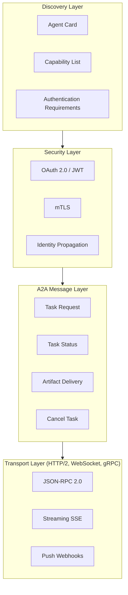
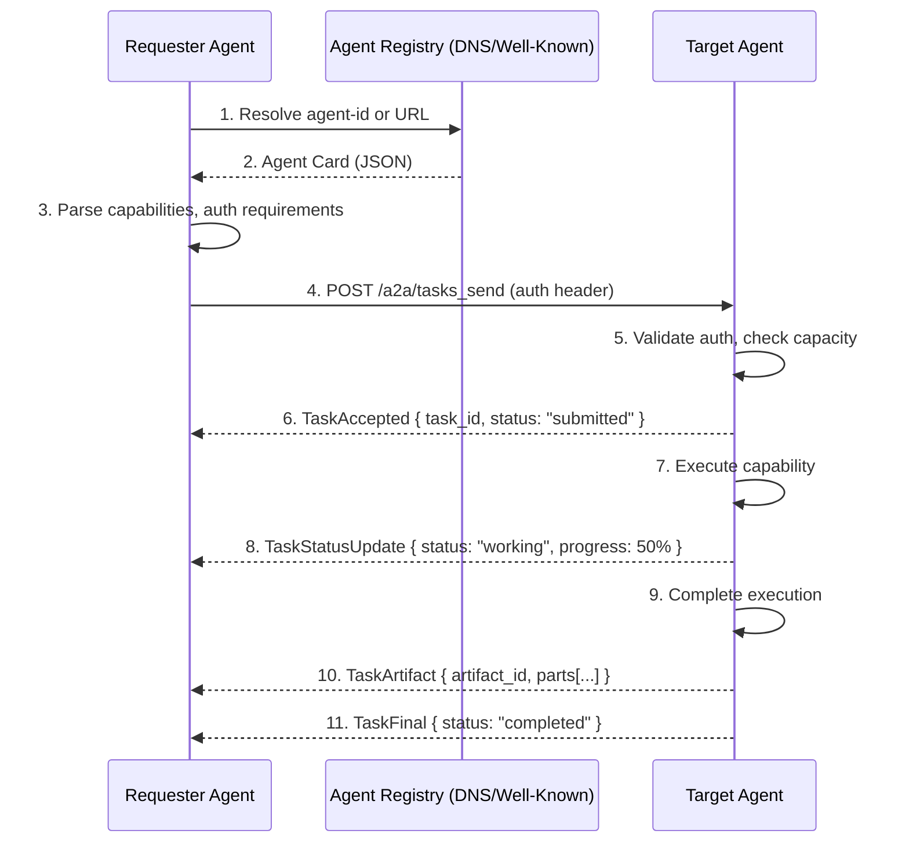
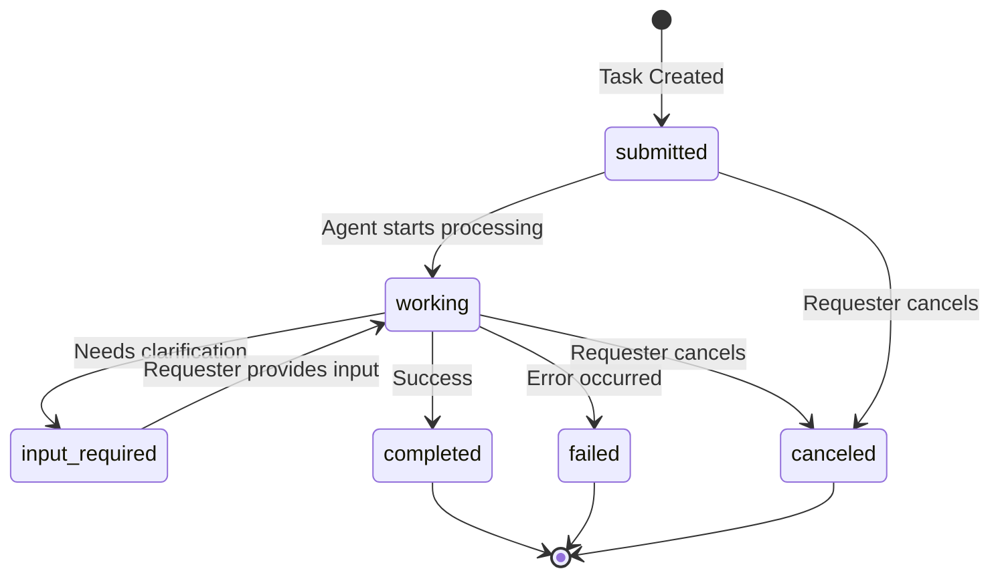
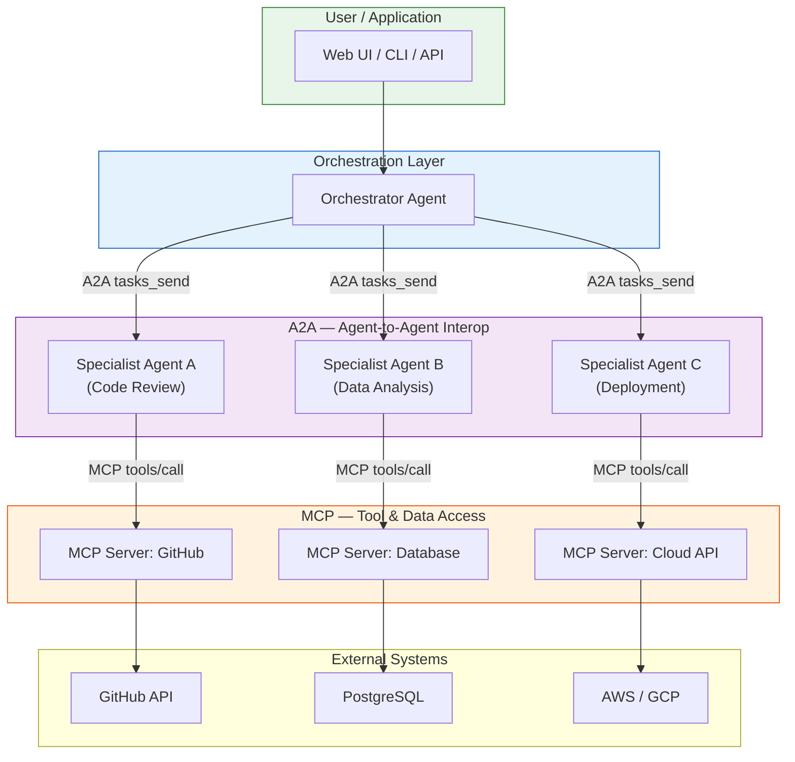

# Agent-to-Agent (A2A) Protocol

## Learning Objectives

| LO | Description |
|----|-------------|
| LO1 | Understand Google's A2A protocol architecture, agent cards, and interoperability model |
| LO2 | Implement agent discovery, capability announcement, and task delegation flows |
| LO3 | Construct and parse A2A JSON-RPC messages with task states, artifacts, and parts |
| LO4 | Apply security patterns: authentication, authorization, identity propagation, push notifications |
| LO5 | Compare A2A with MCP, function calling, and decide when to use each in production |

## Introduction

The Agent-to-Agent (A2A) protocol is Google's open standard for enabling autonomous agents from different vendors, frameworks, and platforms to communicate and collaborate directly. As the AI ecosystem expands beyond single-agent applications into multi-agent systems, the need for a universal interoperability layer becomes critical. A2A fills this gap by defining how agents discover each other, announce capabilities, delegate tasks, and exchange artifacts using a standardized JSON-RPC message format.

Unlike the Model Context Protocol (MCP), which standardizes how agents connect to **tools and data sources**, A2A standardizes how agents connect to **other agents**. This distinction is fundamental: MCP is agent-to-tool, A2A is agent-to-agent. Together they form a complete interoperability stack for the emerging agent ecosystem.

Google announced A2A in April 2025 alongside its Gemini model updates, positioning it as an open protocol supported by partners including Atlassian, Salesforce, Box, and多家 others. The protocol is designed to be transport-agnostic (HTTP/2, WebSockets, gRPC), security-first, and capability-driven.

## Prerequisites

- Basic understanding of JSON-RPC 2.0 protocol
- Familiarity with REST API design and HTTP concepts
- Understanding of agent fundamentals (Module 22, Chapter 1)
- Knowledge of MCP protocol (Module 22, Chapter 4) for comparison
- Python async/await patterns for code examples

## Key Terminology

**A2A (Agent-to-Agent)**: Google's open protocol for direct agent-to-agent communication, enabling interoperability across frameworks and platforms.

**Agent Card**: A JSON metadata document published by an agent describing its identity, capabilities, authentication requirements, and endpoint URL. Similar in concept to an OpenAPI spec for agents.

**Task**: The fundamental unit of work in A2A. A task has an ID, a state machine lifecycle, and produces artifacts.

**Artifact**: A named output produced by an agent as part of task execution. Artifacts contain one or more **parts** (text, file, or data).

**Part**: The atomic content unit within an artifact. Types include `text` (string content), `file` (binary with MIME type), and `data` (structured JSON).

**Agent Discovery**: The process by which one agent learns about another agent's existence and capabilities, typically via an agent card URL or registry.

**Capability Announcement**: Each agent card lists the capabilities (specific skills or actions) the agent supports. Agents use this to decide which agent to delegate a task to.

**Task Delegation**: The act of one agent sending a task request to another agent and optionally monitoring its progress.

**Identity Propagation**: The mechanism by which an agent's authentication context is carried forward when delegating to another agent, preserving the original caller's identity.

**Push Notification**: A webhook-based mechanism where an agent sends status updates about a long-running task back to the requesting agent.

## Chapter at a Glance

| Section | Topic | Key Concept |
|---------|-------|-------------|
| 15.1 | A2A Protocol Overview | Agent cards, protocol stack, transport |
| 15.2 | Communication Model | Discovery, capability announcement, task delegation |
| 15.3 | Message Format | JSON-RPC, task states, artifacts, parts |
| 15.4 | Security | Authentication, authorization, identity, push notifications |
| 15.5 | Integration Patterns | A2A with MCP, bridging frameworks, enterprise deployment |
| 15.6 | Comparison | A2A vs MCP vs function calling, decision framework |

## Chapter Roadmap

```mermaid
flowchart LR
    subgraph Agent_A[Agent A - Requester]
        A1[A2A Client]
        A2[Task Manager]
    end
    subgraph Agent_B[Agent B - Remote]
        B1[A2A Server]
        B2[Capability Executor]
    end
    subgraph Registry[Agent Registry / DNS]
        R1[Agent Cards]
        R2[Discovery Endpoints]
    end

    A1 -->|1. Fetch Agent Card| R1
    A1 -->|2. Select Capability| B1
    A2 -->|3. Send Task (JSON-RPC)| B1
    B1 -->|4. Execute| B2
    B2 -->|5. Return Artifacts| B1
    B1 -->|6. Task Response| A1
    A1 -->|7. Process Results| A2

    style Agent_A fill:#e1f5fe,stroke:#01579b
    style Agent_B fill:#f3e5f5,stroke:#7b1fa2
    style Registry fill:#fff3e0,stroke:#e65100
```

```text

```

## 15.1 A2A Protocol Overview

The A2A protocol operates on a simple premise: every agent that wants to be discoverable publishes an **Agent Card** — a JSON document describing who it is, what it can do, and how to reach it. When Agent A needs help with a task that falls outside its capabilities, it fetches Agent B's card, verifies compatibility, and sends a task request via JSON-RPC.

### 15.1.1 Protocol Architecture



```text

```

### 15.1.2 Agent Card Definition

An agent card is the public face of an agent. It follows a well-defined JSON schema that allows any compliant client to understand the agent's capabilities and how to interact with it.

```python
"""
Agent Card Schema — the metadata document every A2A agent publishes.
Analogous to OpenAPI for REST APIs, but specifically for agents.
"""

from dataclasses import dataclass, field
from typing import List, Optional, Dict, Any
from enum import Enum
import json


class AuthenticationScheme(Enum):
    """Supported authentication methods for A2A agents."""
    NONE = "none"
    BEARER = "bearer"          # OAuth 2.0 / JWT Bearer token
    BASIC = "basic"            # HTTP Basic Auth (legacy, avoid in production)
    MTLS = "mtls"              # Mutual TLS
    OAUTH2_CLIENT_CREDENTIALS = "oauth2_client_credentials"


@dataclass
class AuthenticationInfo:
    """Describes how to authenticate with this agent."""
    schemes: List[AuthenticationScheme] = field(default_factory=lambda: [AuthenticationScheme.NONE])
    credentials_url: Optional[str] = None       # Token endpoint for OAuth2
    scopes: List[str] = field(default_factory=list)  # Required OAuth scopes


@dataclass
class Capability:
    """A single capability this agent exposes."""
    name: str                                    # e.g., "code_review"
    description: str                             # Human-readable explanation
    input_schema: Optional[Dict[str, Any]] = None   # JSON Schema for task input
    output_schema: Optional[Dict[str, Any]] = None  # JSON Schema for task output
    cost_per_task: Optional[float] = None        # Cost in USD (for billing)
    estimated_duration_seconds: Optional[int] = None
    requires_human_approval: bool = False
    tags: List[str] = field(default_factory=list)


@dataclass
class AgentCard:
    """
    The root metadata document for an A2A agent.
    Every A2A-compliant agent MUST expose this at a well-known URL.
    """
    agent_name: str                              # Human-readable name
    agent_version: str                           # Semantic version
    description: str                             # What this agent does
    agent_id: str                                # Unique identifier (e.g., "com.company.agent-name")
    card_url: str                                # URL where this card is hosted
    endpoints: List[str]                         # A2A API endpoints (typically one)
    authentication: AuthenticationInfo
    capabilities: List[Capability]
    supported_transports: List[str] = field(default_factory=lambda: ["http"])  # http, ws, grpc
    max_concurrent_tasks: int = 10               # Rate limiting info
    documentation_url: Optional[str] = None
    terms_of_service_url: Optional[str] = None
    privacy_policy_url: Optional[str] = None

    def to_dict(self) -> Dict[str, Any]:
        """Serialize the agent card to a JSON-compatible dictionary."""
        return {
            "agent_name": self.agent_name,
            "agent_version": self.agent_version,
            "description": self.description,
            "agent_id": self.agent_id,
            "card_url": self.card_url,
            "endpoints": self.endpoints,
            "authentication": {
                "schemes": [s.value for s in self.authentication.schemes],
                "credentials_url": self.authentication.credentials_url,
                "scopes": self.authentication.scopes,
            },
            "capabilities": [
                {
                    "name": c.name,
                    "description": c.description,
                    "input_schema": c.input_schema,
                    "output_schema": c.output_schema,
                    "cost_per_task": c.cost_per_task,
                    "estimated_duration_seconds": c.estimated_duration_seconds,
                    "requires_human_approval": c.requires_human_approval,
                    "tags": c.tags,
                }
                for c in self.capabilities
            ],
            "supported_transports": self.supported_transports,
            "max_concurrent_tasks": self.max_concurrent_tasks,
            "documentation_url": self.documentation_url,
            "terms_of_service_url": self.terms_of_service_url,
            "privacy_policy_url": self.privacy_policy_url,
        }

    @classmethod
    def from_dict(cls, data: Dict[str, Any]) -> "AgentCard":
        """Deserialize from a dictionary."""
        auth_data = data.get("authentication", {})
        authentication = AuthenticationInfo(
            schemes=[AuthenticationScheme(s) for s in auth_data.get("schemes", ["none"])],
            credentials_url=auth_data.get("credentials_url"),
            scopes=auth_data.get("scopes", []),
        )
        capabilities = [
            Capability(
                name=c["name"],
                description=c["description"],
                input_schema=c.get("input_schema"),
                output_schema=c.get("output_schema"),
                cost_per_task=c.get("cost_per_task"),
                estimated_duration_seconds=c.get("estimated_duration_seconds"),
                requires_human_approval=c.get("requires_human_approval", False),
                tags=c.get("tags", []),
            )
            for c in data.get("capabilities", [])
        ]
        return cls(
            agent_name=data["agent_name"],
            agent_version=data["agent_version"],
            description=data["description"],
            agent_id=data["agent_id"],
            card_url=data["card_url"],
            endpoints=data["endpoints"],
            authentication=authentication,
            capabilities=capabilities,
            supported_transports=data.get("supported_transports", ["http"]),
            max_concurrent_tasks=data.get("max_concurrent_tasks", 10),
            documentation_url=data.get("documentation_url"),
            terms_of_service_url=data.get("terms_of_service_url"),
            privacy_policy_url=data.get("privacy_policy_url"),
        )


# Example: Create an agent card for a code review agent
code_review_card = AgentCard(
    agent_name="CodeReviewerAI",
    agent_version="2.1.0",
    description="Expert code review agent. Analyzes pull requests for bugs, security issues, and style violations.",
    agent_id="com.startup.codereviewer",
    card_url="https://agents.startup.com/codereviewer/.well-known/agent-card.json",
    endpoints=["https://agents.startup.com/codereviewer/a2a"],
    authentication=AuthenticationInfo(
        schemes=[AuthenticationScheme.BEARER],
        credentials_url="https://auth.startup.com/oauth/token",
        scopes=["codereview:read", "codereview:write"],
    ),
    capabilities=[
        Capability(
            name="review_pull_request",
            description="Review a GitHub pull request and return inline comments, summary, and risk score.",
            estimated_duration_seconds=120,
            tags=["code-review", "security", "quality"],
        ),
        Capability(
            name="analyze_vulnerability",
            description="Deep-dive security analysis of a code snippet. Returns CVSS score and fix suggestions.",
            estimated_duration_seconds=60,
            tags=["security", "vulnerability"],
        ),
    ],
    max_concurrent_tasks=25,
    documentation_url="https://docs.startup.com/codereviewer",
)

# Serialize to JSON for publishing
print(json.dumps(code_review_card.to_dict(), indent=2))
```

```text

```

## 15.2 Communication Model

The A2A communication model follows a discover-delegate-deliver pattern. Agents first discover each other's capabilities, then delegate tasks with well-defined inputs, and finally receive artifacts as outputs. The model supports both synchronous (short-lived) and asynchronous (long-running) tasks.

### 15.2.1 Agent Discovery Flow



```text

```

### 15.2.2 Capability Announcement & Discovery

Capability discovery can happen through three mechanisms:
- **Direct Card Fetch**: The requester knows the agent's card URL and fetches it directly.
- **Well-Known Endpoint**: The agent serves its card at `/.well-known/agent-card.json` (similar to `/.well-known/openid-configuration` in OIDC).
- **Directory Registry**: A centralized or federated registry indexes agent cards for search.

```python
"""
Agent Discovery and Capability Matching
"""
from dataclasses import dataclass
from typing import Optional
import httpx  # Async HTTP client
import json


class AgentDiscoveryClient:
    """
    Client that fetches and caches agent cards, and matches
    capabilities to task requirements.
    """

    def __init__(self):
        self._card_cache: dict[str, AgentCard] = {}
        self._http_client = httpx.AsyncClient(timeout=10.0)

    async def fetch_agent_card(self, card_url: str) -> AgentCard:
        """Fetch and cache an agent card from its URL."""
        if card_url in self._card_cache:
            return self._card_cache[card_url]

        response = await self._http_client.get(card_url)
        response.raise_for_status()
        card_data = response.json()
        card = AgentCard.from_dict(card_data)
        self._card_cache[card_url] = card
        return card

    async def discover_from_well_known(
        self, base_url: str
    ) -> AgentCard:
        """Discover an agent card from its well-known endpoint."""
        well_known_url = (
            f"{base_url.rstrip('/')}/.well-known/agent-card.json"
        )
        return await self.fetch_agent_card(well_known_url)

    def find_capability(
        self,
        card: AgentCard,
        capability_name: Optional[str] = None,
        tags: Optional[list[str]] = None,
    ) -> Optional[Capability]:
        """
        Find the best matching capability on an agent card.
        Can match by exact name or by tag intersection.
        """
        if capability_name:
            for cap in card.capabilities:
                if cap.name == capability_name:
                    return cap

        if tags:
            tag_set = set(tags)
            best_match = None
            best_overlap = 0
            for cap in card.capabilities:
                overlap = len(tag_set & set(cap.tags))
                if overlap > best_overlap:
                    best_overlap = overlap
                    best_match = cap
            return best_match

        return None

    async def find_agent_for_task(
        self,
        task_description: str,
        required_tags: list[str],
        registry_urls: list[str],
    ) -> tuple[Optional[AgentCard], Optional[Capability]]:
        """
        Search multiple registries/agent cards to find an agent
        that can handle a given task.
        """
        for url in registry_urls:
            try:
                card = await self.fetch_agent_card(url)
                cap = self.find_capability(card, tags=required_tags)
                if cap:
                    return card, cap
            except Exception:
                continue  # Try next registry
        return None, None

    async def close(self):
        await self._http_client.aclose()


# Example: Discovery in action
async def discover_code_review_agent():
    client = AgentDiscoveryClient()

    # Fetch the code review agent's card
    card = await client.discover_from_well_known(
        "https://agents.startup.com/codereviewer"
    )
    print(f"Discovered agent: {card.agent_name} v{card.agent_version}")
    print(f"Capabilities: {[c.name for c in card.capabilities]}")
    print(f"Auth required: {[s.value for s in card.authentication.schemes]}")

    # Find a specific capability
    review_cap = client.find_capability(card, capability_name="review_pull_request")
    if review_cap:
        print(f"Found capability: {review_cap.name}")
        print(f"  Description: {review_cap.description}")
        print(f"  Est. duration: {review_cap.estimated_duration_seconds}s")

    await client.close()

# Run: import asyncio; asyncio.run(discover_code_review_agent())
```

```text

```

### 15.2.3 Task Delegation Protocol

Task delegation is the core interaction pattern in A2A. The requesting agent sends a task specification to the target agent, which then executes it and returns results. A2A defines two delegation modes:

1. **`tasks_send`**: Synchronous-style — the requester sends a task and receives a response. For long-running tasks, the response includes a task ID and the requester polls for updates.
2. **`tasks_sendSubscribe`**: Streaming — the requester sends a task and receives a stream of SSE (Server-Sent Events) updates as the task progresses.

```python
"""
Task Delegation — sending tasks to remote agents via A2A.
"""
import uuid
import json
from dataclasses import dataclass, field
from typing import Optional
from enum import Enum
from datetime import datetime
import httpx


class TaskState(str, Enum):
    """The A2A task state machine."""
    SUBMITTED = "submitted"            # Task received, pending processing
    WORKING = "working"                # Task is being executed
    INPUT_REQUIRED = "input-required"  # Agent needs more info to proceed
    COMPLETED = "completed"            # Task finished successfully
    FAILED = "failed"                  # Task encountered an error
    CANCELED = "canceled"              # Task was canceled by requester


class PartType(str, Enum):
    """Types of content parts in artifacts."""
    TEXT = "text"
    FILE = "file"
    DATA = "data"


@dataclass
class Part:
    """An atomic content unit within an artifact."""
    type: PartType
    text: Optional[str] = None
    file_url: Optional[str] = None     # For file parts
    mime_type: Optional[str] = None    # e.g., "image/png", "application/json"
    data: Optional[dict] = None        # For structured data parts


@dataclass
class Artifact:
    """An output produced by a task — contains one or more parts."""
    artifact_id: str
    name: str
    description: Optional[str] = None
    parts: list[Part] = field(default_factory=list)
    created_at: str = field(default_factory=lambda: datetime.utcnow().isoformat() + "Z")


@dataclass
class A2ATask:
    """
    The fundamental unit of work in A2A.
    Contains the task ID, state, input message, and output artifacts.
    """
    task_id: str
    state: TaskState
    agent_id: str                       # Which agent is handling this
    capability: str                     # Which capability was invoked
    input_parts: list[Part] = field(default_factory=list)
    artifacts: list[Artifact] = field(default_factory=list)
    status_message: Optional[str] = None
    progress_percent: Optional[int] = None
    created_at: str = field(default_factory=lambda: datetime.utcnow().isoformat() + "Z")
    updated_at: str = field(default_factory=lambda: datetime.utcnow().isoformat() + "Z")
    error_message: Optional[str] = None

    def to_json_rpc_request(self) -> dict:
        """Convert this task to a JSON-RPC 2.0 request for tasks_send."""
        return {
            "jsonrpc": "2.0",
            "id": str(uuid.uuid4()),
            "method": "tasks_send",
            "params": {
                "task_id": self.task_id,
                "agent_id": self.agent_id,
                "capability": self.capability,
                "input": {
                    "parts": [
                        {
                            "type": p.type.value,
                            "text": p.text,
                            "file_url": p.file_url,
                            "mime_type": p.mime_type,
                            "data": p.data,
                        }
                        for p in self.input_parts
                    ]
                },
            },
        }

    @classmethod
    def from_json_rpc_response(cls, response: dict) -> "A2ATask":
        """Parse a JSON-RPC 2.0 response into an A2ATask."""
        result = response.get("result", {})
        task_data = result.get("task", result)

        artifacts = []
        for art in task_data.get("artifacts", []):
            parts = [
                Part(
                    type=PartType(p["type"]),
                    text=p.get("text"),
                    file_url=p.get("file_url"),
                    mime_type=p.get("mime_type"),
                    data=p.get("data"),
                )
                for p in art.get("parts", [])
            ]
            artifacts.append(Artifact(
                artifact_id=art["artifact_id"],
                name=art["name"],
                description=art.get("description"),
                parts=parts,
                created_at=art.get("created_at", ""),
            ))

        return cls(
            task_id=task_data["task_id"],
            state=TaskState(task_data["status"]),
            agent_id=task_data.get("agent_id", ""),
            capability=task_data.get("capability", ""),
            artifacts=artifacts,
            status_message=task_data.get("status_message"),
            progress_percent=task_data.get("progress_percent"),
            error_message=task_data.get("error_message"),
        )


class A2AClient:
    """
    Client for sending tasks to A2A-compliant agents.
    Handles authentication, request construction, and response parsing.
    """

    def __init__(self, auth_token: Optional[str] = None):
        self._auth_token = auth_token
        self._http_client = httpx.AsyncClient(timeout=120.0)

    def _get_headers(self) -> dict:
        headers = {"Content-Type": "application/json"}
        if self._auth_token:
            headers["Authorization"] = f"Bearer {self._auth_token}"
        return headers

    async def send_task(
        self,
        agent_endpoint: str,
        capability: str,
        input_parts: list[Part],
        agent_id: str = "generic-agent",
    ) -> A2ATask:
        """Send a task to an A2A agent and return the initial response."""
        task = A2ATask(
            task_id=f"task-{uuid.uuid4().hex[:12]}",
            state=TaskState.SUBMITTED,
            agent_id=agent_id,
            capability=capability,
            input_parts=input_parts,
        )

        request_body = task.to_json_rpc_request()
        response = await self._http_client.post(
            agent_endpoint.rstrip("/") + "/a2a",
            headers=self._get_headers(),
            json=request_body,
        )
        response.raise_for_status()
        response_data = response.json()

        if "error" in response_data:
            raise RuntimeError(
                f"A2A error [{response_data['error'].get('code')}]: "
                f"{response_data['error'].get('message')}"
            )

        return A2ATask.from_json_rpc_response(response_data)

    async def get_task_status(
        self, agent_endpoint: str, task_id: str
    ) -> A2ATask:
        """Poll for task status updates (for async tasks)."""
        request_body = {
            "jsonrpc": "2.0",
            "id": str(uuid.uuid4()),
            "method": "tasks_get",
            "params": {"task_id": task_id},
        }
        response = await self._http_client.post(
            agent_endpoint.rstrip("/") + "/a2a",
            headers=self._get_headers(),
            json=request_body,
        )
        response.raise_for_status()
        return A2ATask.from_json_rpc_response(response.json())

    async def cancel_task(self, agent_endpoint: str, task_id: str) -> bool:
        """Request cancellation of a running task."""
        request_body = {
            "jsonrpc": "2.0",
            "id": str(uuid.uuid4()),
            "method": "tasks_cancel",
            "params": {"task_id": task_id},
        }
        response = await self._http_client.post(
            agent_endpoint.rstrip("/") + "/a2a",
            headers=self._get_headers(),
            json=request_body,
        )
        response.raise_for_status()
        result = response.json().get("result", {})
        return result.get("success", False)

    async def close(self):
        await self._http_client.aclose()


# Example: Create a code review task
async def delegate_code_review():
    client = A2AClient(auth_token="sk-abc123")

    # Build the task input parts
    input_parts = [
        Part(type=PartType.TEXT, text="Review the following pull request for security vulnerabilities."),
        Part(type=PartType.DATA, data={
            "repo": "org/my-service",
            "pr_number": 142,
            "files_changed": ["auth.py", "db.py", "api/handlers.py"],
            "diff_summary": "Added OAuth2 authentication flow and database migration."
        }),
        Part(type=PartType.FILE, file_url="https://github.com/org/my-service/pull/142.diff",
             mime_type="text/plain"),
    ]

    task = await client.send_task(
        agent_endpoint="https://agents.startup.com/codereviewer",
        capability="review_pull_request",
        input_parts=input_parts,
        agent_id="com.startup.codereviewer",
    )

    print(f"Task {task.task_id} submitted. Status: {task.state.value}")

    # For long-running tasks, poll for completion
    while task.state in (TaskState.SUBMITTED, TaskState.WORKING):
        import asyncio
        await asyncio.sleep(2)
        task = await client.get_task_status(
            "https://agents.startup.com/codereviewer", task.task_id
        )
        print(f"  Status: {task.state.value}, Progress: {task.progress_percent}%")

    if task.state == TaskState.COMPLETED:
        for artifact in task.artifacts:
            print(f"\nArtifact: {artifact.name}")
            for part in artifact.parts:
                if part.type == PartType.TEXT:
                    print(f"  Text: {part.text[:200]}...")
                elif part.type == PartType.DATA:
                    print(f"  Data: {json.dumps(part.data, indent=2)[:200]}...")
    elif task.state == TaskState.FAILED:
        print(f"Task failed: {task.error_message}")

    await client.close()

# Run: import asyncio; asyncio.run(delegate_code_review())
```

```text

```

## 15.3 Message Format

A2A messages are built on JSON-RPC 2.0, a lightweight protocol that uses JSON for encoding and supports request-response pairs with unique IDs. Task states follow a deterministic lifecycle, and artifacts carry the actual work output in typed parts.

### 15.3.1 Task State Machine



```text

```

### 15.3.2 JSON-RPC Message Structure

Every A2A message follows the JSON-RPC 2.0 specification. The method name indicates the action (`tasks_send`, `tasks_get`, `tasks_cancel`, `tasks_sendSubscribe`), and the params contain the task payload.

```python
"""
A2A JSON-RPC message construction and parsing utilities.
"""
import uuid
import json
from datetime import datetime
from typing import Optional


class A2AMessageBuilder:
    """
    Utility class for constructing and parsing A2A JSON-RPC messages
    according to the protocol specification.
    """

    @staticmethod
    def build_send_request(
        task_id: str,
        agent_id: str,
        capability: str,
        input_parts: list[dict],
        metadata: Optional[dict] = None,
    ) -> dict:
        """
        Build a tasks_send JSON-RPC request.

        Args:
            task_id: Unique identifier for the task
            agent_id: Target agent identifier
            capability: Name of the capability to invoke
            input_parts: List of part dicts: {type, text?, file_url?, mime_type?, data?}
            metadata: Optional key-value pairs (e.g., priority, correlation-id)

        Returns:
            A valid JSON-RPC 2.0 request dict
        """
        message = {
            "jsonrpc": "2.0",
            "id": str(uuid.uuid4()),
            "method": "tasks_send",
            "params": {
                "task_id": task_id,
                "agent_id": agent_id,
                "capability": capability,
                "input": {
                    "parts": input_parts,
                },
                "metadata": metadata or {},
                "timestamp": datetime.utcnow().isoformat() + "Z",
            },
        }
        return message

    @staticmethod
    def build_send_subscribe_request(
        task_id: str,
        agent_id: str,
        capability: str,
        input_parts: list[dict],
        push_notification_url: Optional[str] = None,
    ) -> dict:
        """
        Build a tasks_sendSubscribe request with optional push notifications.
        The server will stream status updates via SSE and optionally POST
        final results to the push_notification_url.
        """
        message = {
            "jsonrpc": "2.0",
            "id": str(uuid.uuid4()),
            "method": "tasks_sendSubscribe",
            "params": {
                "task_id": task_id,
                "agent_id": agent_id,
                "capability": capability,
                "input": {
                    "parts": input_parts,
                },
                "push_notification": {
                    "url": push_notification_url,
                } if push_notification_url else None,
                "timestamp": datetime.utcnow().isoformat() + "Z",
            },
        }
        return message

    @staticmethod
    def build_status_response(
        task_id: str,
        status: str,
        artifacts: Optional[list[dict]] = None,
        progress_percent: Optional[int] = None,
        error_message: Optional[str] = None,
    ) -> dict:
        """
        Build a JSON-RPC response for a task status update.
        This is what the A2A server returns to the client.
        """
        result = {
            "task_id": task_id,
            "status": status,
            "updated_at": datetime.utcnow().isoformat() + "Z",
        }
        if artifacts:
            result["artifacts"] = artifacts
        if progress_percent is not None:
            result["progress_percent"] = progress_percent
        if error_message:
            result["error_message"] = error_message

        return {
            "jsonrpc": "2.0",
            "id": None,  # Response ID matches request; use None for notifications
            "result": result,
        }

    @staticmethod
    def build_artifact(
        artifact_id: str,
        name: str,
        parts: list[dict],
        description: Optional[str] = None,
    ) -> dict:
        """Build an artifact dict to include in task responses."""
        return {
            "artifact_id": artifact_id,
            "name": name,
            "description": description,
            "parts": parts,
            "created_at": datetime.utcnow().isoformat() + "Z",
        }

    # --- Part builders ---

    @staticmethod
    def text_part(content: str) -> dict:
        """Create a text content part."""
        return {"type": "text", "text": content}

    @staticmethod
    def file_part(url: str, mime_type: str) -> dict:
        """Create a file reference part."""
        return {"type": "file", "file_url": url, "mime_type": mime_type}

    @staticmethod
    def data_part(data: dict) -> dict:
        """Create a structured data part."""
        return {"type": "data", "data": data}


class A2AMessageValidator:
    """
    Validates A2A JSON-RPC messages for correctness.
    Ensures messages conform to the protocol specification.
    """

    VALID_METHODS = {"tasks_send", "tasks_get", "tasks_cancel",
                     "tasks_sendSubscribe", "tasks_notification"}
    VALID_STATES = {"submitted", "working", "input-required",
                    "completed", "failed", "canceled"}
    VALID_PART_TYPES = {"text", "file", "data"}

    @classmethod
    def validate_request(cls, message: dict) -> list[str]:
        """Validate a JSON-RPC request. Returns list of errors (empty = valid)."""
        errors = []

        if not isinstance(message, dict):
            return ["Message must be a JSON object"]

        if message.get("jsonrpc") != "2.0":
            errors.append("jsonrpc must be '2.0'")

        if not message.get("id"):
            errors.append("Request must have an 'id' field")

        method = message.get("method")
        if method not in cls.VALID_METHODS:
            errors.append(f"Invalid method: {method}. "
                          f"Must be one of {cls.VALID_METHODS}")

        params = message.get("params", {})
        if not params:
            errors.append("Request must have 'params'")

        if method in ("tasks_send", "tasks_sendSubscribe"):
            if "task_id" not in params:
                errors.append("params must include 'task_id'")
            if "capability" not in params:
                errors.append("params must include 'capability'")
            if "input" not in params:
                errors.append("params must include 'input'")
            else:
                input_data = params["input"]
                if "parts" not in input_data:
                    errors.append("input must include 'parts' array")
                else:
                    for i, part in enumerate(input_data.get("parts", [])):
                        if part.get("type") not in cls.VALID_PART_TYPES:
                            errors.append(
                                f"part[{i}].type must be one of {cls.VALID_PART_TYPES}"
                            )

        return errors

    @classmethod
    def validate_response(cls, message: dict) -> list[str]:
        """Validate a JSON-RPC response. Returns list of errors."""
        errors = []

        if not isinstance(message, dict):
            return ["Message must be a JSON object"]

        if message.get("jsonrpc") != "2.0":
            errors.append("jsonrpc must be '2.0'")

        # Must have either result or error
        if "result" not in message and "error" not in message:
            errors.append("Response must have 'result' or 'error'")

        if "error" in message:
            err = message["error"]
            if "code" not in err or "message" not in err:
                errors.append("Error must include 'code' and 'message'")

        if "result" in message:
            result = message["result"]
            status = result.get("status")
            if status and status not in cls.VALID_STATES:
                errors.append(f"Invalid status: {status}")

        return errors


# Example: Build a complete A2A interaction
def demonstrate_message_flow():
    """Demonstrate the full message construction flow."""

    # Step 1: Requester builds a tasks_send request
    task_id = f"task-{uuid.uuid4().hex[:12]}"

    request = A2AMessageBuilder.build_send_request(
        task_id=task_id,
        agent_id="com.enterprise.data-analyzer",
        capability="analyze_dataset",
        input_parts=[
            A2AMessageBuilder.text_part(
                "Analyze the attached sales dataset for Q3 trends."
            ),
            A2AMessageBuilder.file_part(
                "https://data.company.com/sales/q3-2025.parquet",
                "application/parquet"
            ),
        ],
        metadata={"priority": "high", "department": "analytics"},
    )

    print("=== A2A Request ===")
    print(json.dumps(request, indent=2))

    # Step 2: Server processes and returns initial response
    initial_response = A2AMessageBuilder.build_status_response(
        task_id=task_id,
        status="submitted",
        progress_percent=0,
    )
    initial_response["id"] = request["id"]  # Echo back the request ID

    print("\n=== A2A Initial Response ===")
    print(json.dumps(initial_response, indent=2))

    # Step 3: Server sends progress update
    progress_response = A2AMessageBuilder.build_status_response(
        task_id=task_id,
        status="working",
        progress_percent=45,
    )

    print("\n=== A2A Progress Update ===")
    print(json.dumps(progress_response, indent=2))

    # Step 4: Server sends final response with artifacts
    final_artifact = A2AMessageBuilder.build_artifact(
        artifact_id=f"artifact-{uuid.uuid4().hex[:8]}",
        name="Q3 Trend Analysis Report",
        description="Comprehensive analysis of Q3 2025 sales data.",
        parts=[
            A2AMessageBuilder.text_part(
                "Q3 2025 showed a 12.3% increase in revenue driven by "
                "the APAC region. Key products: Enterprise Suite (+18%), "
                "Cloud Services (+22%). Recommended action: increase "
                "APAC sales headcount by 15% for Q4."
            ),
            A2AMessageBuilder.data_part({
                "total_revenue": 4_250_000_000,
                "yoy_growth_pct": 12.3,
                "top_region": "APAC",
                "top_product": "Cloud Services",
                "growth_rate_pct": 22.0,
                "forecast_q4": 4_600_000_000,
            }),
            A2AMessageBuilder.file_part(
                "https://data.company.com/reports/q3-sales-analysis.pdf",
                "application/pdf"
            ),
        ],
    )

    final_response = A2AMessageBuilder.build_status_response(
        task_id=task_id,
        status="completed",
        artifacts=[final_artifact],
        progress_percent=100,
    )

    print("\n=== A2A Final Response ===")
    print(json.dumps(final_response, indent=2))

    # Validate the messages
    print("\n=== Validation ===")
    req_errors = A2AMessageValidator.validate_request(request)
    print(f"Request valid: {len(req_errors) == 0}")
    if req_errors:
        for err in req_errors:
            print(f"  - {err}")

    resp_errors = A2AMessageValidator.validate_response(final_response)
    print(f"Response valid: {len(resp_errors) == 0}")
    if resp_errors:
        for err in resp_errors:
            print(f"  - {err}")


demonstrate_message_flow()
```

```text

```

### 15.3.3 Streaming with Server-Sent Events

For real-time applications, A2A supports `tasks_sendSubscribe` which streams updates via SSE. The client opens a persistent connection and receives events as the task progresses.

```python
"""
SSE Streaming for A2A tasks_sendSubscribe.
"""
import json
import re
from typing import AsyncGenerator
import httpx


class A2ASSEClient:
    """
    Client for receiving streaming task updates via Server-Sent Events.
    """

    def __init__(self, auth_token: Optional[str] = None):
        self._auth_token = auth_token

    async def subscribe_to_task(
        self,
        agent_endpoint: str,
        capability: str,
        input_parts: list[dict],
        task_id: Optional[str] = None,
    ) -> AsyncGenerator[dict, None]:
        """
        Open an SSE connection and yield task status updates as they arrive.

        Yields:
            Dicts with keys: event_type, task_id, status, data
        """
        import uuid
        tid = task_id or f"task-{uuid.uuid4().hex[:12]}"

        request_body = {
            "jsonrpc": "2.0",
            "id": str(uuid.uuid4()),
            "method": "tasks_sendSubscribe",
            "params": {
                "task_id": tid,
                "agent_id": "remote-agent",
                "capability": capability,
                "input": {"parts": input_parts},
            },
        }

        headers = {"Content-Type": "application/json"}
        if self._auth_token:
            headers["Authorization"] = f"Bearer {self._auth_token}"

        async with httpx.AsyncClient(timeout=None) as client:
            async with client.stream(
                "POST", agent_endpoint, json=request_body, headers=headers
            ) as response:
                buffer = ""
                async for chunk in response.aiter_bytes():
                    buffer += chunk.decode("utf-8")

                    # Parse SSE events from the buffer
                    # SSE format: "event: ...\ndata: ...\n\n"
                    while "\n\n" in buffer:
                        event_block, buffer = buffer.split("\n\n", 1)
                        event_data = {"event_type": "message"}

                        for line in event_block.strip().split("\n"):
                            if line.startswith("event: "):
                                event_data["event_type"] = line[7:]
                            elif line.startswith("data: "):
                                try:
                                    payload = json.loads(line[6:])
                                    event_data.update(payload)
                                except json.JSONDecodeError:
                                    event_data["raw_data"] = line[6:]

                        yield event_data


# Example: Process streaming task updates
async def stream_task_example():
    client = A2ASSEClient(auth_token="sk-streaming-token")

    print("Subscribing to task updates (streaming)...")
    async for update in client.subscribe_to_task(
        agent_endpoint="https://agents.example.com/a2a",
        capability="real_time_analysis",
        input_parts=[
            {"type": "text", "text": "Monitor stock prices for AAPL, GOOG, MSFT"}
        ],
    ):
        status = update.get("status", "unknown")
        progress = update.get("progress_percent", 0)
        print(f"  [{update['event_type']}] Status: {status}, Progress: {progress}%")

        if update.get("artifacts"):
            for artifact in update["artifacts"]:
                print(f"  >> Received artifact: {artifact['name']}")

        if status in ("completed", "failed", "canceled"):
            print(f"Task finished with status: {status}")
            break

# Run: import asyncio; asyncio.run(stream_task_example())
```

```text

```

## 15.4 Security

Security is a first-class concern in A2A. Since agents may be running across organizational boundaries, the protocol defines clear patterns for authentication, authorization, and identity propagation.

### 15.4.1 Authentication & Authorization

A2A agents authenticate using standard mechanisms (OAuth 2.0, JWT, mTLS) as declared in their agent card. The protocol does not prescribe a specific flow but requires that authentication requirements be well-documented.

```python
"""
A2A Security: Authentication, Authorization, and Identity Propagation.
"""
import time
import hashlib
import hmac
import json
from dataclasses import dataclass
from typing import Optional


@dataclass
class A2AAuthContext:
    """
    Represents the authentication context of a request.
    This context is propagated when an agent delegates to another agent.
    """
    subject: str                         # Who is making the request (user or service)
    roles: list[str]                     # RBAC roles
    scopes: list[str]                    # OAuth scopes granted
    issuer: str                          # Who issued the token
    issued_at: float                     # Unix timestamp
    expires_at: float                    # Unix timestamp
    delegation_chain: list[str] = None   # Track delegation hops for audit

    def to_token_payload(self) -> dict:
        """Convert to JWT-like payload for identity propagation."""
        return {
            "sub": self.subject,
            "roles": self.roles,
            "scopes": self.scopes,
            "iss": self.issuer,
            "iat": int(self.issued_at),
            "exp": int(self.expires_at),
            "delegation_chain": self.delegation_chain or [self.subject],
        }


class A2AAuthorizer:
    """
    Validates authorization for A2A task requests.
    Checks that the requester has the required scopes and roles
    for the requested capability.
    """

    # Hardcoded capability-to-scope mapping for demonstration
    CAPABILITY_SCOPES = {
        "review_pull_request": ["codereview:write"],
        "analyze_vulnerability": ["codereview:read", "security:read"],
        "analyze_dataset": ["data:read", "analytics:read"],
        "real_time_analysis": ["market:read"],
    }

    CAPABILITY_ROLES = {
        "review_pull_request": ["developer", "reviewer", "admin"],
        "analyze_vulnerability": ["security", "admin"],
        "analyze_dataset": ["analyst", "admin"],
        "real_time_analysis": ["trader", "analyst", "admin"],
    }

    @classmethod
    def authorize(
        cls,
        auth_context: A2AAuthContext,
        capability: str,
    ) -> tuple[bool, str]:
        """Check if the auth context allows access to the capability."""

        # Check expiry
        if time.time() > auth_context.expires_at:
            return False, "Token expired"

        # Check scopes
        required_scopes = cls.CAPABILITY_SCOPES.get(capability, [])
        for scope in required_scopes:
            if scope not in auth_context.scopes:
                return False, f"Missing required scope: {scope}"

        # Check roles
        required_roles = cls.CAPABILITY_ROLES.get(capability, [])
        if required_roles:
            has_role = any(role in auth_context.roles for role in required_roles)
            if not has_role:
                return False, (
                    f"None of the required roles matched. "
                    f"Required: {required_roles}, "
                    f"User has: {auth_context.roles}"
                )

        # Check delegation depth (prevent infinite delegation loops)
        if auth_context.delegation_chain:
            if len(auth_context.delegation_chain) > 5:
                return False, "Max delegation depth exceeded"

        return True, "Authorized"

    @classmethod
    def propagate_identity(
        cls,
        current_context: A2AAuthContext,
        delegating_agent_id: str,
    ) -> A2AAuthContext:
        """
        Propagate identity when agent A delegates to agent B.
        Preserves the original caller's identity while recording
        the delegation chain.
        """
        chain = list(current_context.delegation_chain or [])
        chain.append(delegating_agent_id)

        return A2AAuthContext(
            subject=current_context.subject,
            roles=current_context.roles,
            scopes=current_context.scopes,
            issuer=current_context.issuer,
            issued_at=current_context.issued_at,
            expires_at=current_context.expires_at,
            delegation_chain=chain,
        )


# Example: Authorization flow
def security_demo():
    # Simulate a user's auth context
    user_context = A2AAuthContext(
        subject="user-42@company.com",
        roles=["developer"],
        scopes=["codereview:read", "codereview:write", "data:read"],
        issuer="https://auth.company.com",
        issued_at=time.time(),
        expires_at=time.time() + 3600,  # 1 hour
    )

    # Check if user can do code review
    authorized, reason = A2AAuthorizer.authorize(
        user_context, "review_pull_request"
    )
    print(f"Code review authorized: {authorized}")
    print(f"Reason: {reason}")

    # Propagate identity when delegating to another agent
    delegated_context = A2AAuthorizer.propagate_identity(
        user_context, "com.company.codereviewer"
    )
    print(f"\nDelegation chain: {delegated_context.delegation_chain}")

    # Check a capability the user doesn't have access to
    authorized, reason = A2AAuthorizer.authorize(
        user_context, "analyze_vulnerability"
    )
    print(f"\nVulnerability analysis authorized: {authorized}")
    print(f"Reason: {reason}")

    # Example: expired token
    expired_context = A2AAuthContext(
        subject="user-42@company.com",
        roles=["developer"],
        scopes=["codereview:write"],
        issuer="https://auth.company.com",
        issued_at=time.time() - 7200,
        expires_at=time.time() - 3600,  # Expired 1 hour ago
    )
    authorized, reason = A2AAuthorizer.authorize(
        expired_context, "review_pull_request"
    )
    print(f"\nExpired token authorized: {authorized}")
    print(f"Reason: {reason}")


security_demo()
```

```text

```

### 15.4.2 Push Notifications

For long-running tasks, A2A supports push notifications where the agent sends results to a webhook URL rather than requiring the requester to poll. This is configured at task creation time.

```python
"""
A2A Push Notification Receiver — webhook handler for task completion.
"""
from fastapi import FastAPI, Request, HTTPException
import hmac
import hashlib
import json
from typing import Optional

# In production, this would be a FastAPI app
# app = FastAPI()

# Shared secret for HMAC signature verification
PUSH_NOTIFICATION_SECRET = "whsec_your_webhook_secret_here"


def verify_push_signature(
    payload: bytes,
    signature_header: str,
    secret: str = PUSH_NOTIFICATION_SECRET,
) -> bool:
    """
    Verify the HMAC-SHA256 signature of a push notification.
    This ensures the notification genuinely came from the agent.
    """
    expected_signature = hmac.new(
        secret.encode(),
        payload,
        hashlib.sha256,
    ).hexdigest()

    # Use hmac.compare_digest to prevent timing attacks
    return hmac.compare_digest(
        f"sha256={expected_signature}", signature_header
    )


class PushNotificationHandler:
    """
    Handles incoming A2A push notifications (task completion callbacks).
    """

    def __init__(self, agent_client: A2AClient):
        self.agent_client = agent_client

    async def handle_notification(self, request: Request):
        """
        FastAPI endpoint handler for push notifications.
        """
        body = await request.body()
        signature = request.headers.get("X-A2A-Signature-256", "")

        if not verify_push_signature(body, signature):
            raise HTTPException(status_code=401, detail="Invalid signature")

        payload = json.loads(body)
        event_type = payload.get("event", "unknown")
        task_id = payload.get("task_id")
        status = payload.get("status")

        print(f"Push notification received: event={event_type}, "
              f"task_id={task_id}, status={status}")

        if status == "completed":
            # Process the completed task artifacts
            artifacts = payload.get("artifacts", [])
            for artifact in artifacts:
                print(f"  Artifact received: {artifact['name']}")

            # Potentially send results to the original requester
            return {"received": True, "task_id": task_id}

        elif status == "failed":
            error = payload.get("error_message", "Unknown error")
            print(f"  Task failed: {error}")
            return {"received": True, "error": error}

        return {"received": True, "task_id": task_id}


# Example: Configure a task with push notifications
def configure_push_notification():
    """
    Demonstrate how a requester sets up push notifications
    when delegating a long-running task.
    """
    push_url = "https://my-app.com/api/a2a/push-notifications"

    request = A2AMessageBuilder.build_send_subscribe_request(
        task_id=f"task-{uuid.uuid4().hex[:12]}",
        agent_id="com.enterprise.heavy-compute",
        capability="train_model",
        input_parts=[
            A2AMessageBuilder.text_part(
                "Train a regression model on the attached dataset."
            ),
        ],
        push_notification_url=push_url,
    )

    print("=== A2A SendSubscribe with Push Notification ===")
    print(json.dumps(request, indent=2))
    print(f"\nAgent will POST results to: {push_url}")
    print("The push notification includes HMAC signature for verification.")


import uuid
configure_push_notification()
```

```text

```

## 15.5 Integration Patterns

A2A does not exist in isolation. In production systems, it works alongside MCP, API gateways, and organizational frameworks to create a complete agent infrastructure.

### 15.5.1 A2A with MCP — The Complete Stack



```text

```

### 15.5.2 Bridging A2A and MCP

In many architectures, the orchestrator agent communicates with specialist agents via **A2A**, and those specialist agents use **MCP** to access tools and data. This creates a clean separation:

- **A2A** handles inter-agent communication (discovery, delegation, coordination)
- **MCP** handles agent-to-tool communication (files, databases, APIs)

```python
"""
Integration Pattern: A2A orchestrator with MCP tool access.
Demonstrates how an A2A agent uses MCP internally to fulfill tasks.
"""

from dataclasses import dataclass
from typing import Any


class InternalMCPClient:
    """
    Simulated MCP client that an A2A agent uses internally
    to access tools and data sources.
    """

    async def call_tool(self, tool_name: str, args: dict) -> Any:
        """Call an MCP tool. In production, this would go to an MCP server."""
        print(f"  [MCP] Calling tool: {tool_name} with args={args}")
        if tool_name == "github_get_pr":
            return {
                "pr_number": args["pr_number"],
                "title": "Add OAuth2 authentication",
                "files": ["auth.py", "db.py"],
                "author": "dev-user",
            }
        elif tool_name == "code_analyze":
            return {
                "issues": [
                    {"line": 42, "severity": "high", "message": "SQL injection risk"},
                    {"line": 87, "severity": "medium", "message": "Unused import"},
                ]
            }
        return {"result": "ok"}


class A2AAgentServer:
    """
    An A2A-compliant agent that uses MCP internally.
    This agent receives tasks via A2A and executes them
    by calling MCP tools.
    """

    def __init__(self, agent_card: AgentCard):
        self.card = agent_card
        self.mcp = InternalMCPClient()
        self.active_tasks: dict[str, A2ATask] = {}

    async def handle_tasks_send(self, request: dict) -> dict:
        """Handle an incoming tasks_send A2A request."""
        params = request["params"]
        task_id = params["task_id"]
        capability = params["capability"]
        input_parts = params["input"]["parts"]

        # Create task record
        task = A2ATask(
            task_id=task_id,
            state=TaskState.SUBMITTED,
            agent_id=self.card.agent_id,
            capability=capability,
            input_parts=[Part(**p) for p in input_parts],
        )
        self.active_tasks[task_id] = task

        # Execute based on capability
        if capability == "review_pull_request":
            return await self._execute_code_review(task)
        elif capability == "analyze_dataset":
            return await self._execute_data_analysis(task)
        else:
            return A2AMessageBuilder.build_status_response(
                task_id=task_id,
                status="failed",
                error_message=f"Unknown capability: {capability}",
            )

    async def _execute_code_review(self, task: A2ATask) -> dict:
        """Execute a code review by chaining MCP tools."""
        task.state = TaskState.WORKING
        task.status_message = "Fetching PR details..."

        # Step 1: Use MCP to get PR details
        pr_data = await self.mcp.call_tool("github_get_pr", {
            "pr_number": 142,
            "repo": "org/my-service",
        })

        task.status_message = "Analyzing code for issues..."

        # Step 2: Use MCP to analyze code
        analysis = await self.mcp.call_tool("code_analyze", {
            "files": pr_data["files"],
        })

        # Step 3: Build artifacts from results
        task.state = TaskState.COMPLETED
        task.artifacts = [
            Artifact(
                artifact_id=f"art-{uuid.uuid4().hex[:8]}",
                name="Code Review Results",
                parts=[
                    Part(
                        type=PartType.TEXT,
                        text=f"Reviewed PR #{pr_data['pr_number']}: "
                             f"{pr_data['title']}\n\n"
                             f"Found {len(analysis['issues'])} issues.",
                    ),
                    Part(
                        type=PartType.DATA,
                        data={
                            "pr": pr_data,
                            "issues": analysis["issues"],
                            "summary": f"{len([i for i in analysis['issues'] "
                                       f"if i['severity'] == 'high'])} high, "
                                       f"{len([i for i in analysis['issues'] "
                                       f"if i['severity'] == 'medium'])} medium",
                        },
                    ),
                ],
            ),
        ]

        return A2AMessageBuilder.build_status_response(
            task_id=task.task_id,
            status="completed",
            artifacts=[
                A2AMessageBuilder.build_artifact(
                    artifact_id=a.artifact_id,
                    name=a.name,
                    parts=[
                        {"type": p.type.value, "text": p.text}
                        for p in a.parts
                    ],
                )
                for a in task.artifacts
            ],
        )


async def demonstrate_a2a_mcp_integration():
    """Show how A2A and MCP work together in a production flow."""

    # Create the agent card and server
    card = AgentCard(
        agent_name="CodeReviewAgent",
        agent_version="1.0.0",
        description="Code review agent that uses MCP for tool access",
        agent_id="com.demo.codereview",
        card_url="https://demo.agents/codereview/.well-known/agent-card.json",
        endpoints=["https://demo.agents/codereview/a2a"],
        authentication=AuthenticationInfo(
            schemes=[AuthenticationScheme.BEARER]
        ),
        capabilities=[
            Capability(
                name="review_pull_request",
                description="Review pull requests using GitHub MCP tools",
                tags=["code-review", "github"],
            )
        ],
    )

    server = A2AAgentServer(card)

    # Simulate an incoming A2A request
    request = A2AMessageBuilder.build_send_request(
        task_id="task-demo-001",
        agent_id="com.demo.codereview",
        capability="review_pull_request",
        input_parts=[
            A2AMessageBuilder.text_part("Review PR #142"),
        ],
    )

    print("=== A2A + MCP Integration Demo ===")
    print(f"Agent: {card.agent_name}")
    print(f"Request capability: {request['params']['capability']}")

    response = await server.handle_tasks_send(request)
    print(f"\nResponse status: {response['result']['status']}")
    print(f"Response artifacts: {len(response['result'].get('artifacts', []))}")

    for artifact in response['result'].get('artifacts', []):
        print(f"  - {artifact['name']}")
        for part in artifact['parts']:
            if part['type'] == 'text':
                print(f"    Text: {part['text'][:100]}...")
            elif part['type'] == 'data':
                print(f"    Data keys: {list(part['data'].keys())}")

    print("\n✅ A2A handled agent discovery and task delegation.")
    print("✅ MCP handled tool access (GitHub, code analysis).")
    print("Together they form a complete agent interoperability stack.")

# Run: import asyncio; asyncio.run(demonstrate_a2a_mcp_integration())
```

```text

```

### 15.5.3 Enterprise Deployment Patterns

In enterprise environments, A2A agents are deployed behind API gateways with service mesh integration for security, observability, and rate limiting.

```python
"""
Enterprise deployment patterns for A2A agents.
Covers gateway integration, monitoring, and resilience.
"""
import json
import time
from dataclasses import dataclass, field
from typing import Optional


@dataclass
class EnterpriseA2AConfig:
    """
    Configuration for deploying an A2A agent in an enterprise setting.
    """
    agent_card: AgentCard
    rate_limit_per_minute: int = 100
    rate_limit_per_user: int = 20
    require_mtls: bool = False
    enable_audit_logging: bool = True
    max_task_duration_seconds: int = 300
    retry_on_failure: bool = True
    retry_max_attempts: int = 3
    retry_backoff_seconds: float = 2.0
    observability_endpoint: Optional[str] = None  # OpenTelemetry collector
    service_mesh_integration: bool = True

    def validate_deployment(self) -> list[str]:
        """Validate the enterprise configuration."""
        warnings = []

        if not self.agent_card.authentication.schemes:
            warnings.append("No authentication configured! "
                            "Production agents MUST require auth.")

        if AuthenticationScheme.NONE in self.agent_card.authentication.schemes:
            warnings.append("Authentication has 'none' scheme — "
                            "remove for production deployments.")

        if self.max_task_duration_seconds > 600:
            warnings.append("Max task duration > 10 minutes. "
                            "Consider async patterns with push notifications.")

        return warnings


class EnterpriseA2AGateway:
    """
    Enterprise API Gateway for A2A agents.
    Handles rate limiting, audit logging, and routing.
    """

    def __init__(self, config: EnterpriseA2AConfig):
        self.config = config
        self._request_log: list[dict] = []
        self._rate_counters: dict[str, list[float]] = {}

    def _check_rate_limit(self, user_id: str) -> bool:
        """Enforce rate limits per user."""
        now = time.time()
        window = 60.0  # 1 minute window

        if user_id not in self._rate_counters:
            self._rate_counters[user_id] = []

        # Remove old entries
        self._rate_counters[user_id] = [
            t for t in self._rate_counters[user_id]
            if now - t < window
        ]

        if len(self._rate_counters[user_id]) >= self.config.rate_limit_per_user:
            return False  # Rate limited

        self._rate_counters[user_id].append(now)
        return True

    async def handle_request(
        self, request_body: dict, user_id: str, auth_context: A2AAuthContext
    ) -> dict:
        """Process an incoming A2A request through the gateway."""

        # 1. Rate limit check
        if not self._check_rate_limit(user_id):
            return {
                "jsonrpc": "2.0",
                "id": request_body.get("id"),
                "error": {"code": -32900, "message": "Rate limit exceeded"},
            }

        # 2. Authorization check
        capability = request_body.get("params", {}).get("capability", "")
        authorized, reason = A2AAuthorizer.authorize(auth_context, capability)
        if not authorized:
            return {
                "jsonrpc": "2.0",
                "id": request_body.get("id"),
                "error": {"code": -32001, "message": f"Unauthorized: {reason}"},
            }

        # 3. Audit logging
        if self.config.enable_audit_logging:
            self._request_log.append({
                "timestamp": time.time(),
                "user_id": user_id,
                "method": request_body.get("method"),
                "capability": capability,
                "task_id": request_body.get("params", {}).get("task_id"),
                "authorized": True,
            })

        # 4. Forward to the agent (in production, this routes to the backend)
        # For demo purposes, we return a mock response
        return A2AMessageBuilder.build_status_response(
            task_id=request_body.get("params", {}).get("task_id", "unknown"),
            status="submitted",
        )

    def get_audit_log(self) -> list[dict]:
        """Return the audit log for compliance review."""
        return self._request_log[-100:]  # Last 100 entries


# Example: Enterprise configuration
def enterprise_deployment_demo():
    card = AgentCard(
        agent_name="EnterpriseSecureAgent",
        agent_version="3.0.0",
        description="Enterprise agent behind gateway with full audit logging",
        agent_id="com.enterprise.secure-agent",
        card_url="https://internal.agents.enterprise.com/agent/.well-known/agent-card.json",
        endpoints=["https://internal.agents.enterprise.com/agent/a2a"],
        authentication=AuthenticationInfo(
            schemes=[AuthenticationScheme.BEARER, AuthenticationScheme.MTLS],
            credentials_url="https://auth.enterprise.com/oauth/token",
            scopes=["agent:invoke", "agent:admin"],
        ),
        capabilities=[
            Capability(name="process_document", description="Process enterprise documents",
                       tags=["document", "enterprise"]),
        ],
        max_concurrent_tasks=50,
    )

    config = EnterpriseA2AConfig(
        agent_card=card,
        rate_limit_per_minute=500,
        rate_limit_per_user=30,
        require_mtls=True,
        enable_audit_logging=True,
        max_task_duration_seconds=300,
    )

    warnings = config.validate_deployment()
    print("=== Enterprise Deployment Validation ===")
    if warnings:
        for w in warnings:
            print(f"  ⚠ {w}")
    else:
        print("  ✅ Configuration looks good!")

    print(f"\nAuthentication: {[s.value for s in card.authentication.schemes]}")
    print(f"Rate limit: {config.rate_limit_per_minute}/min global, "
          f"{config.rate_limit_per_user}/min per user")
    print(f"mTLS required: {config.require_mtls}")
    print(f"Audit logging: {'enabled' if config.enable_audit_logging else 'disabled'}")
    print(f"Service mesh: {'integrated' if config.service_mesh_integration else 'not configured'}")


enterprise_deployment_demo()
```

```text

```

## 15.6 Comparison: A2A vs MCP vs Function Calling

Understanding when to use each protocol is critical for architecting agent systems. The three technologies serve different purposes and are often used together.

```mermaid
flowchart LR
    subgraph A2A["A2A Protocol"]
        A1[Agent ↔ Agent]
        A2[Discovery + Delegation]
        A3[Capability-based routing]
    end
    subgraph MCP["MCP Protocol"]
        M1[Agent ↔ Tool/Data]
        M2[Tool execution + Resources]
        M3[Function calling abstraction]
    end
    subgraph FC["Function Calling"]
        F1[LLM ↔ API]
        F2[Native model function API]
        F3[Single-step invocation]
    end

    A2A ---|Complementary| MCP
    MCP ---|Builds on| FC

    style A2A fill:#e1bee7,stroke:#7b1fa2
    style MCP fill:#bbdefb,stroke:#1565c0
    style FC fill:#c8e6c9,stroke:#2e7d32
```



```text

```

### 15.6.1 Decision Matrix

| Dimension | A2A Protocol | MCP Protocol | Function Calling |
|-----------|-------------|-------------|------------------|
| **Primary Use** | Agent-to-agent communication | Agent-to-tool/data access | LLM-to-API invocation |
| **Granularity** | Task-level (complex workflows) | Function-level (single operations) | Single function call |
| **Discovery** | Agent cards with capability listing | Tool/resource listing by server | No discovery (hardcoded) |
| **State Model** | Full task state machine | Request-response (stateless) | Request-response (stateless) |
| **Streaming** | SSE streaming for long tasks | Streaming via transport layer | Native model streaming |
| **Security** | Delegation chain, identity propagation | Transport-level auth | API key / OAuth |
| **Persistence** | Tasks have IDs, can be queried | No persistent task model | No persistent state |
| **When to Use** | Multi-agent orchestration, cross-org | Tool integration, data access | Simple LLM tool use |

### 15.6.2 A2A vs MCP — Detailed Comparison

```python
"""
Feature comparison between A2A and MCP with code-level differences.
"""
from dataclasses import dataclass
from typing import List


@dataclass
class ProtocolComparison:
    """Structured comparison of protocol characteristics."""
    protocol_name: str
    primary_abstraction: str
    message_pattern: str
    state_management: str
    is_discovery_built_in: bool
    typical_latency: str
    complexity: str  # Low, Medium, High


comparisons = [
    ProtocolComparison(
        protocol_name="A2A",
        primary_abstraction="Task (multi-step workflow with artifacts)",
        message_pattern="JSON-RPC with task_id tracking",
        state_management="Full task state machine (submitted→working→completed/failed)",
        is_discovery_built_in=True,
        typical_latency="Seconds to minutes (long-running agents)",
        complexity="Medium",
    ),
    ProtocolComparison(
        protocol_name="MCP",
        primary_abstraction="Tool/Resource (single operation)",
        message_pattern="JSON-RPC request-response",
        state_management="Stateless (no persistent task tracking)",
        is_discovery_built_in=True,
        typical_latency="Milliseconds to seconds (tool calls)",
        complexity="Medium",
    ),
    ProtocolComparison(
        protocol_name="Function Calling",
        primary_abstraction="Function definition (API contract)",
        message_pattern="LLM generates JSON arguments → API call",
        state_management="Stateless (per-turn execution)",
        is_discovery_built_in=False,
        typical_latency="Milliseconds (single API calls)",
        complexity="Low",
    ),
]


class ArchitectureAdvisor:
    """
    Recommends the right protocol combination based on use case.
    """

    @staticmethod
    def recommend(
        needs_multi_agent: bool,
        needs_tool_access: bool,
        needs_discovery: bool,
        task_duration: str,  # "short" (< 1s), "medium" (< 60s), "long" (> 60s)
        cross_org: bool,
    ) -> List[str]:
        """Recommend protocols based on requirements."""
        recommendations = []

        if needs_multi_agent or cross_org or task_duration == "long":
            recommendations.append("A2A — for agent-to-agent delegation with task tracking")

        if needs_tool_access or (task_duration == "short" and not needs_multi_agent):
            recommendations.append("MCP — for standardized tool and data access")

        if task_duration == "short" and not needs_discovery:
            recommendations.append("Function Calling — simplest option for direct LLM tool use")

        if needs_multi_agent and needs_tool_access:
            recommendations.append(
                "A2A + MCP — A2A for inter-agent orchestration, MCP for tool access "
                "(most complete stack)"
            )

        if not recommendations:
            recommendations.append("Function Calling — sufficient for most simple use cases")

        return recommendations


# Example: Recommendation engine
def comparison_demo():
    print("=== Protocol Comparison ===")
    for comp in comparisons:
        print(f"\n{comp.protocol_name}:")
        print(f"  Abstraction: {comp.primary_abstraction}")
        print(f"  Message: {comp.message_pattern}")
        print(f"  State: {comp.state_management}")
        print(f"  Built-in discovery: {comp.is_discovery_built_in}")
        print(f"  Typical latency: {comp.typical_latency}")
        print(f"  Complexity: {comp.complexity}")

    print("\n\n=== Architecture Recommendations ===")
    advisor = ArchitectureAdvisor()

    scenarios = [
        {
            "name": "Enterprise Multi-Agent System",
            "args": {
                "needs_multi_agent": True,
                "needs_tool_access": True,
                "needs_discovery": True,
                "task_duration": "medium",
                "cross_org": True,
            },
        },
        {
            "name": "Single Agent with Database Access",
            "args": {
                "needs_multi_agent": False,
                "needs_tool_access": True,
                "needs_discovery": False,
                "task_duration": "short",
                "cross_org": False,
            },
        },
        {
            "name": "Simple Chatbot with Calculator",
            "args": {
                "needs_multi_agent": False,
                "needs_tool_access": False,
                "needs_discovery": False,
                "task_duration": "short",
                "cross_org": False,
            },
        },
    ]

    for scenario in scenarios:
        print(f"\n📋 {scenario['name']}:")
        recs = advisor.recommend(**scenario["args"])
        for r in recs:
            print(f"  → {r}")


comparison_demo()
```

```text

```

### 15.6.3 When to Use A2A

- **Multi-agent orchestration**: Your system has multiple specialist agents that need to coordinate.
- **Cross-organizational workflows**: Agents from different companies or departments need to collaborate.
- **Long-running tasks**: Your agents perform work that takes minutes or hours (not milliseconds).
- **Capability-based routing**: You need to dynamically discover which agent can handle a specific task.
- **Audit and compliance**: You need full task lifecycle tracking for regulatory requirements.

### 15.6.4 When Not to Use A2A

- **Simple tool calls**: Your agent just needs to call an API or database — use MCP or function calling.
- **Single agent systems**: If you only have one agent, there's no one to talk to.
- **Latency-critical paths**: A2A adds overhead from discovery, authentication, and task state tracking.
- **Homogeneous systems**: If all agents are built on the same framework (e.g., all CrewAI), use that framework's native communication instead.

## Interview Questions (10)

### Q1: Explain the Agent-to-Agent (A2A) protocol and how it differs from MCP.

**Answer:** A2A is Google's open protocol for agent-to-agent interoperability. It standardizes how agents discover each other, announce capabilities, delegate tasks, and exchange artifacts using JSON-RPC messages. The key difference from MCP is: A2A is agent-to-agent communication (coordination, delegation), while MCP is agent-to-tool communication (tool execution, data access). They are complementary — a complete system uses A2A for inter-agent orchestration and MCP for tool access.

### Q2: What is an Agent Card and what information does it contain?

**Answer:** An Agent Card is a JSON metadata document that every A2A-compliant agent publishes. It contains: agent identity (name, ID, version), description, endpoint URLs, authentication requirements (OAuth, mTLS, etc.), list of capabilities with input/output schemas, supported transport protocols, rate limiting info, and links to documentation/policies. It's analogous to an OpenAPI spec but designed specifically for agents. The card is typically hosted at `/.well-known/agent-card.json`.

### Q3: Describe the A2A task state machine and its transitions.

**Answer:** The A2A task state machine has six states: `submitted` (task received, queued), `working` (actively being processed), `input-required` (needs more information from requester), `completed` (successful with artifacts), `failed` (encountered error), and `canceled` (requester aborted). Transitions: submitted → working, working → completed/failed/canceled/input-required, input-required → working (after requester provides input). This state model enables reliable tracking of long-running agent tasks.

### Q4: How does A2A handle agent discovery?

**Answer:** A2A supports three discovery mechanisms: 1) Direct Card Fetch — the requester knows the agent's card URL and fetches it directly. 2) Well-Known Endpoint — agents serve their card at `/.well-known/agent-card.json` (similar to OIDC discovery). 3) Directory Registry — a centralized or federated registry indexes agent cards for search-based discovery. The agent card contains all capability and authentication information needed to interact with the agent.

### Q5: Explain identity propagation in A2A and why it matters.

**Answer:** Identity propagation ensures that when Agent A delegates a task to Agent B, Agent B knows the original caller's identity (not just Agent A's). In A2A, this is handled through delegation chains — a list of agent IDs appended to the auth context as tasks pass from one agent to another. This is critical for: audit trails (knowing who initiated a workflow), authorization (enforcing the original caller's permissions), and debugging (tracing cross-agent issues). The delegation chain prevents infinite delegation loops by capping depth.

### Q6: How does A2A compare to function calling in LLMs?

**Answer:** Function calling is LLM-to-API: the model generates JSON arguments for a predefined function, the system executes it, and returns results. It's single-step, stateless, and has no discovery. A2A is agent-to-agent: full task lifecycle management, capability discovery, artifact exchange, streaming updates, and identity propagation. Use function calling for simple tool use within a single agent. Use A2A when you need multiple agents to coordinate on complex, long-running workflows across organizational boundaries.

### Q7: What transport protocols does A2A support and when would you use each?

**Answer:** A2A is transport-agnostic but commonly supports: 1) HTTP/2 — standard request-response for most use cases. 2) WebSockets — bidirectional streaming for real-time task updates. 3) gRPC — high-performance, typed communication for internal microservice agents. 4) SSE (Server-Sent Events) — one-directional streaming for task progress updates. The choice depends on requirements: HTTP/2 for general use, WebSockets for interactive agents, gRPC for high-throughput internal systems.

### Q8: How do you secure an A2A deployment in production?

**Answer:** Production A2A security involves: 1) Authentication — OAuth 2.0 (Bearer JWT) or mTLS as declared in the agent card. 2) Authorization — RBAC with scope and role validation per capability. 3) Identity Propagation — delegation chains preserve the original caller's identity. 4) Push Notification Verification — HMAC signatures on webhook callbacks. 5) Rate Limiting — per-user and global limits enforced at the gateway. 6) Audit Logging — all task requests and delegations logged for compliance. 7) Delegation Depth Limits — prevent infinite delegation loops (max 5 hops).

### Q9: Describe a real-world architecture using both A2A and MCP.

**Answer:** Consider an enterprise code review system: An orchestrator agent receives review requests. It uses A2A to delegate to specialist agents — a Code Review Agent, a Security Analysis Agent, and a Documentation Agent. Each specialist uses MCP internally to access tools: the Code Review Agent uses MCP to call GitHub's API, the Security Agent uses MCP to run vulnerability scanners, and the Documentation Agent uses MCP to query a knowledge base. The orchestrator collects artifacts from all three via A2A and produces a consolidated report. A2A handles inter-agent coordination; MCP handles tool access.

### Q10: What are the limitations of A2A you would consider before adopting it?

**Answer:** Key limitations: 1) Overhead — discovery, authentication, and state tracking add latency vs direct function calling. 2) Complexity — requires agent card management, task state persistence, and delegation chain logic. 3) Maturity — A2A is newer than MCP or function calling; ecosystem and tooling are still evolving. 4) Not for simple use cases — if you have one agent calling one API, A2A is overkill. 5) Framework support — not all agent frameworks natively support A2A yet; you may need custom adapters. 6) Cross-org trust — identity propagation across organizational boundaries requires mutual trust infrastructure.

## Chapter Quiz (5 MCQ)

### Questions

1. What is the primary purpose of Google's A2A protocol?
   a) Standardize how LLMs call functions
   b) Enable direct agent-to-agent communication and task delegation
   c) Replace REST APIs with JSON-RPC
   d) Define a new model training protocol

2. Which document does an A2A agent publish to describe its capabilities?
   a) OpenAPI specification
   b) Agent Card
   c) Function manifest
   d) Capability flag

3. What is the correct sequence of states in an A2A task lifecycle?
   a) created → running → done
   b) submitted → working → completed/failed/canceled/input-required
   c) queued → processing → finished
   d) pending → active → terminated

4. How does A2A differ from MCP?
   a) A2A is for agent-to-agent, MCP is for agent-to-tool communication
   b) A2A uses REST, MCP uses gRPC
   c) A2A is Google-only, MCP is open source
   d) A2A is stateless, MCP has task tracking

5. When should you choose A2A over function calling?
   a) When calling a single API from an LLM
   b) When orchestrating multiple specialist agents across organizational boundaries
   c) When you need the lowest possible latency
   d) When building a stateless chatbot

### Answers

1. b — A2A enables direct agent-to-agent communication and task delegation, unlike function calling (LLM-to-API) or MCP (agent-to-tool).
2. b — The Agent Card is the JSON metadata document containing agent identity, capabilities, and authentication info.
3. b — The A2A state machine is: submitted → working → completed/failed/canceled/input-required (with input-required transitioning back to working).
4. a — A2A handles agent-to-agent coordination; MCP handles agent-to-tool/data access. They are complementary.
5. b — A2A is designed for multi-agent orchestration across boundaries. Function calling is simpler and better for single-tool, single-agent scenarios.

## Exercises (5)

### Exercise 1: Build an Agent Card

Create an AgentCard for a "Data Summarizer Agent" that has three capabilities: `summarize_text` (input: text, output: summary), `extract_keywords` (input: text, output: keyword list), and `generate_report` (input: data dict, output: PDF URL). The agent requires OAuth 2.0 authentication with "data:read" and "data:write" scopes. Include proper rate limiting and endpoint URLs.

### Exercise 2: Task Delegation Flow

Write Python code that simulates a complete task delegation flow:
1. Agent A discovers Agent B's card
2. Agent A sends a task using `tasks_send` with a text part containing "Summarize the quarterly earnings report"
3. Agent B responds with status "submitted", then "working" at 30%, then "working" at 70%, then "completed"
4. The completed response includes an artifact with a text part containing the summary and a data part with statistics

### Exercise 3: A2A + MCP Integration

Build a simulated "Research Agent" that receives A2A task requests and internally uses three MCP tools: `web_search`, `database_query`, and `document_generate`. Show how the A2A task is decomposed into MCP tool calls and the results are assembled into an artifact. Include proper error handling if one of the MCP tools fails.

### Exercise 4: Security Authorization

Implement an authorization system where:
- User "alice" has roles ["analyst"] and scopes ["data:read"]
- User "bob" has roles ["admin"] and scopes ["data:read", "data:write", "admin"]
- Capability "delete_dataset" requires scope "admin" and role "admin"
- Capability "view_dataset" requires scope "data:read" and role ["analyst", "admin"]
- Show that alice can view but not delete, and bob can do both
- Demonstrate identity propagation when alice's request is delegated through a processing agent

### Exercise 5: Protocol Decision Framework

Create a function `recommend_protocol(requirements: dict) -> str` that takes a dictionary with keys: `multi_agent: bool`, `needs_tool_access: bool`, `task_duration_seconds: int`, `cross_org: bool`, `needs_discovery: bool` and returns a recommendation string explaining whether to use A2A, MCP, function calling, or a combination. Test it on at least 5 different scenarios.

## Key Takeaways

- **A2A is agent-to-agent**: Google's open protocol for agent interoperability via discovery, capability announcement, and task delegation.
- **Agent Cards are the foundation**: Every A2A agent publishes a JSON card describing its identity, capabilities, authentication, and endpoints — enabling dynamic discovery.
- **JSON-RPC 2.0 message format**: Tasks use a state machine (submitted → working → completed/failed/canceled) with artifacts containing parts (text, file, data).
- **Security is built in**: OAuth 2.0, mTLS, identity propagation with delegation chains, and HMAC-signed push notifications.
- **A2A + MCP = complete stack**: A2A handles inter-agent orchestration; MCP handles tool/data access. Used together in production systems.
- **Choose the right protocol**: A2A for multi-agent, cross-org workflows. MCP for tool access. Function calling for simple LLM tool use.
- **Enterprise patterns**: API gateways, rate limiting, audit logging, and service mesh integration are essential for production A2A deployments.

## Summary

The Agent-to-Agent (A2A) protocol, introduced by Google in 2025, is a pivotal technology for the emerging multi-agent ecosystem. It defines a standard way for autonomous agents from different vendors and frameworks to discover each other, announce capabilities, delegate tasks, and exchange results. Built on JSON-RPC 2.0 with a well-defined task state machine, A2A handles the full lifecycle of agent-to-agent interactions — from capability discovery through task completion and artifact delivery.

A2A is designed to be complementary to the Model Context Protocol (MCP): MCP standardizes how agents connect to tools and data, while A2A standardizes how agents connect to other agents. Together they form a complete interoperability stack. Security is a first-class concern, with support for OAuth 2.0, mTLS, identity propagation via delegation chains, and HMAC-signed push notifications.

For AI engineers, understanding A2A is essential for architecting production multi-agent systems that span organizational boundaries. The protocol's capability-driven discovery model, robust task lifecycle, and enterprise security patterns make it the emerging standard for agent interoperability in production environments.

## Common Mistakes

1. **Confusing A2A with MCP**: A2A is agent-to-agent; MCP is agent-to-tool. They are complementary, not alternatives.
2. **Ignoring security**: Deploying A2A agents without authentication or identity propagation creates severe vulnerabilities.
3. **Over-engineering simple use cases**: Using A2A for a single agent calling one API is unnecessary — use function calling instead.
4. **Missing delegation depth limits**: Without max delegation depth, agents can create infinite delegation loops.
5. **Not validating push notifications**: Always verify HMAC signatures on push notification webhooks to prevent spoofing.
6. **Neglecting rate limiting**: Production A2A agents without rate limits can be overwhelmed by cascading delegations.
7. **Stateless task handling**: A2A tasks can be long-running; always persist task state and support status queries.

## Revision Notes

- **A2A**: Google's open protocol for agent-to-agent communication (April 2025).
- **Agent Card**: JSON metadata at `/.well-known/agent-card.json` with identity, capabilities, auth.
- **Task states**: submitted → working → input-required → working → completed/failed/canceled.
- **Artifacts**: Named outputs with parts — text (string), file (URL + MIME), data (structured JSON).
- **JSON-RPC**: methods = tasks_send, tasks_get, tasks_cancel, tasks_sendSubscribe.
- **Discovery**: direct card fetch, well-known endpoint, or directory registry.
- **Identity propagation**: delegation chain in auth context, max 5 hops.
- **Security**: OAuth 2.0, mTLS, RBAC, HMAC push notification verification.
- **A2A vs MCP**: A2A = agent coordination; MCP = tool access. Use both together.
- **Enterprise**: gateway, rate limiting, audit logging, service mesh, OpenTelemetry.

## Difficulty Level

**Level**: Advanced
**Estimated Study Time**: 90-120 minutes
**Prerequisites**: Agent fundamentals, JSON-RPC, MCP protocol basics, Python async/await

## Tips & Tricks

**Tip**: Use `tasks_sendSubscribe` instead of `tasks_send` for long-running tasks to get streaming progress updates without polling.

**Tip**: Cache agent cards aggressively (TTL: 5 minutes) to reduce discovery latency. Cards rarely change between requests.

**Tip**: Set max delegation depth to 5. This prevents infinite loops while allowing reasonable delegation chains.

**Pro Tip**: Combine A2A with MCP by having each A2A agent maintain its own MCP client internally. This gives you clean separation: A2A for routing, MCP for execution.

**Pro Tip**: For push notifications, use a queue (Redis/ RabbitMQ) between the A2A agent and the webhook sender. This prevents task failures from losing notifications.

**Pro Tip**: Always include a `correlation_id` in task metadata. This lets you trace multi-agent workflows across service boundaries in your observability system.

## FAQs

**Q: Do I need both A2A and MCP in my system?**
A: Not necessarily. If you have multiple agents that need to coordinate, use A2A. If your agents need to access tools or data, use MCP. If you need both, they work great together.

**Q: Is A2A specific to Google's Gemini models?**
A: No. A2A is a Google-led open protocol, but it's model-agnostic. Any agent framework can implement A2A. Google has stated the protocol is designed for broad industry adoption.

**Q: Can A2A work across organizations?**
A: Yes, that's a primary use case. A2A's discovery and identity propagation mechanisms are designed for cross-organizational workflows. OAuth 2.0 and mTLS provide the security foundation.

**Q: How does A2A handle rate limiting?**
A: A2A agents declare `max_concurrent_tasks` in their agent card. Gateways enforce additional per-user rate limits. The protocol recommends 429 (Too Many Requests) responses with Retry-After headers.

**Q: Does A2A replace gRPC or REST?**
A: No. A2A is an application-layer protocol that can run over HTTP, WebSockets, or gRPC as transport. It's about the semantics of agent communication, not the transport mechanism.

## Further Reading

- [Google A2A Protocol Specification](https://github.com/google/A2A) — official GitHub repository
- [A2A Protocol Documentation](https://a2a-protocol.dev/) — comprehensive protocol docs
- [MCP Specification](https://spec.modelcontextprotocol.io/) — for understanding the complementary protocol
- "Building Multi-Agent Systems" — Google Research (technical report)
- "Agent Interoperability: A2A and MCP" — whitepaper on combining both protocols

## References

- Google A2A Specification: https://github.com/google/A2A
- Agent Card Schema: https://github.com/google/A2A/tree/main/specification
- JSON-RPC 2.0 Specification: https://www.jsonrpc.org/specification
- MCP Specification: https://spec.modelcontextprotocol.io/
- OAuth 2.0 Framework: https://datatracker.ietf.org/doc/html/rfc6749
- Agent interoperability patterns: Google Research, 2025
