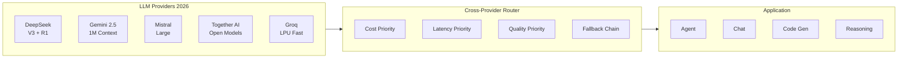

# Frontier LLM APIs & Providers

## Learning Objectives

| LO | Description |
|----|-------------|
| LO1 | Compare 2026's major LLM providers: DeepSeek, Gemini, Mistral, Together AI, Groq |
| LO2 | Implement a unified multi-provider client with fallback and latency-based routing |
| LO3 | Use DeepSeek R1's chain-of-thought reasoning for complex problem-solving |
| LO4 | Build a Gemini agent with 1M-token context and multimodal tool calling |
| LO5 | Design a cost-quality-latency aware router for production AI systems |

## Chapter at a Glance

| Section | Topic | Key Concept |
|---------|-------|-------------|
| 1.1 | DeepSeek | V3 chat, R1 reasoning, open-weight, R1 debate pattern |
| 1.2 | Google Gemini 2.5 | 1M context, Gemini Flash, Google AI Studio, agentic |
| 1.3 | Mistral AI | Mistral Large, Le Chat, La Plateforme |
| 1.4 | Together AI & Groq | Low-latency inference, open models, LPU architecture |
| 1.5 | Cross-Provider Router | Unified abstraction with cost/latency/quality routing |

## Chapter Roadmap



## 1.1 DeepSeek — V3 Chat & R1 Reasoning

DeepSeek exploded in popularity through 2025–2026, becoming the most-discussed open-weight model family. **DeepSeek V3** is a 671B MoE (Mixture of Experts) model rivaling GPT-4o, while **DeepSeek R1** introduced reinforcement-learning-based chain-of-thought reasoning that matches OpenAI o1/o3 on math, coding, and science benchmarks — all available as open weights on Hugging Face.

```typescript
interface DeepSeekConfig {
    model: 'deepseek-chat' | 'deepseek-reasoner'
    apiKey: string
    baseUrl?: string
}

interface ReasoningDetail {
    reasoningContent: string
    finalAnswer: string
    confidence: number
}

class DeepSeekClient {
    private config: DeepSeekConfig
    private baseUrl = 'https://api.deepseek.com/v1'

    constructor(config: DeepSeekConfig) {
        this.config = config
    }

    async chat(messages: { role: string; content: string }[]): Promise<string> {
        const res = await fetch(`${this.baseUrl}/chat/completions`, {
            method: 'POST',
            headers: { 'Content-Type': 'application/json', Authorization: `Bearer ${this.config.apiKey}` },
            body: JSON.stringify({ model: this.config.model, messages })
        })
        const data = await res.json()
        return data.choices[0].message.content
    }

    async reason(problem: string): Promise<ReasoningDetail> {
        const res = await fetch(`${this.baseUrl}/chat/completions`, {
            method: 'POST',
            headers: { 'Content-Type': 'application/json', Authorization: `Bearer ${this.config.apiKey}` },
            body: JSON.stringify({
                model: 'deepseek-reasoner',
                messages: [{ role: 'user', content: problem }]
            })
        })
        const data = await res.json()
        const msg = data.choices[0].message
        return {
            reasoningContent: msg.reasoning_content || '',
            finalAnswer: msg.content,
            confidence: msg.reasoning_content ? this.estimateConfidence(msg.reasoning_content) : 0.5
        }
    }

    private estimateConfidence(reasoning: string): number {
        const signals = reasoning.split('.').filter((s: string) => s.includes('therefore') || s.includes('thus') || s.includes('answer is'))
        return Math.min(0.5 + signals.length * 0.1, 0.99)
    }
}
```

### R1 Debate Pattern

DeepSeek R1's strength emerges when you ask it to reason step-by-step, then debate against itself:

```typescript
class R1Debate {
    private client: DeepSeekClient

    constructor(client: DeepSeekClient) {
        this.client = client
    }

    async debate(question: string, rounds = 3): Promise<string> {
        let resolution = ''
        for (let i = 0; i < rounds; i++) {
            const pro = await this.client.reason(`Argue FOR the answer to: ${question}. Be thorough.`)
            const con = await this.client.reason(`Argue AGAINST the answer to: ${question}. Find weaknesses.`)
            resolution = await this.client.reason(
                `Given these arguments:\nFOR: ${pro.finalAnswer}\nAGAINST: ${con.finalAnswer}\nSynthesize the best final answer.`
            )
        }
        return resolution.finalAnswer
    }
}
```

DeepSeek is ideal for math, coding, and analytical tasks where transparent reasoning matters. Its open-weight nature (MIT license) makes it the go-to for self-hosted deployments.

## 1.2 Google Gemini 2.5

Gemini 2.5 Flash and Pro offer a **1 million token context window** — the largest of any commercially available model. Google AI Studio provides a free tier for prototyping, while Vertex AI handles enterprise production.

```typescript
interface GeminiConfig {
    apiKey: string
    model?: 'gemini-2.5-flash' | 'gemini-2.5-pro'
    systemInstruction?: string
}

interface GeminiFile {
    mimeType: string
    data: string
}

class GeminiClient {
    private config: GeminiConfig
    private baseUrl = 'https://generativelanguage.googleapis.com/v1beta'

    constructor(config: GeminiConfig) {
        this.config = config
    }

    async generate(prompt: string, files?: GeminiFile[]): Promise<string> {
        const parts: { text?: string; inlineData?: { mimeType: string; data: string } }[] = [{ text: prompt }]
        if (files) {
            for (const f of files) {
                parts.push({ inlineData: { mimeType: f.mimeType, data: f.data } })
            }
        }
        const body: any = {
            contents: [{ parts }],
            systemInstruction: this.config.systemInstruction
                ? { parts: [{ text: this.config.systemInstruction }] }
                : undefined
        }
        const res = await fetch(`${this.baseUrl}/models/${this.config.model || 'gemini-2.5-flash'}:generateContent?key=${this.config.apiKey}`, {
            method: 'POST',
            headers: { 'Content-Type': 'application/json' },
            body: JSON.stringify(body)
        })
        const data = await res.json()
        return data.candidates?.[0]?.content?.parts?.[0]?.text || ''
    }

    async generateWithContext(largeDocument: string, query: string): Promise<string> {
        return this.generate(
            `Document context (1M token capable):\n${largeDocument.slice(0, 500_000)}\n\nQuery: ${query}`
        )
    }
}
```

### Tool Calling with Gemini

Gemini 2.5 supports native function calling, making it suitable for agentic workflows:

```typescript
interface GeminiTool {
    name: string
    description: string
    parameters: Record<string, any>
}

class GeminiAgent {
    private client: GeminiClient
    private tools: GeminiTool[] = []
    private history: { role: string; text: string }[] = []

    constructor(client: GeminiClient) {
        this.client = client
    }

    registerTool(tool: GeminiTool): void {
        this.tools.push(tool)
    }

    async run(task: string): Promise<string> {
        this.history.push({ role: 'user', text: task })
        const prompt = this.history.map(h => `${h.role}: ${h.text}`).join('\n') +
            '\n\nAvailable tools:\n' +
            this.tools.map(t => `- ${t.name}: ${t.description} (params: ${JSON.stringify(t.parameters)})`).join('\n') +
            '\n\nIf a tool is needed, respond with: TOOL_CALL: { "tool": "...", "args": {...} }'
        const response = await this.client.generate(prompt)
        const toolMatch = response.match(/TOOL_CALL: (\{.*\})/)
        if (toolMatch) {
            const call = JSON.parse(toolMatch[1])
            const result = await this.executeTool(call.tool, call.args)
            this.history.push({ role: 'assistant', text: response })
            this.history.push({ role: 'tool', text: JSON.stringify(result) })
            return this.run(task)
        }
        this.history.push({ role: 'assistant', text: response })
        return response
    }

    private async executeTool(name: string, args: Record<string, any>): Promise<any> {
        const tool = this.tools.find(t => t.name === name)
        if (!tool) throw new Error(`Unknown tool: ${name}`)
        const res = await fetch(args.url || '/api/mock-tool', { method: 'POST', body: JSON.stringify(args) })
        return res.json()
    }
}
```

Gemini's 1M context is a game-changer for analyzing entire codebases, legal documents, or books in a single pass — no chunking needed.

## 1.3 Mistral AI

Mistral AI (Paris, France) is Europe's leading AI company. **Mistral Large** competes with GPT-4o and Claude 3.5 Opus, while **Le Chat** is their consumer chat product. **La Plateforme** provides APIs with a strong focus on data sovereignty (GDPR-compliant, EU-hosted).

```typescript
interface MistralConfig {
    apiKey: string
    model?: 'mistral-large-latest' | 'mistral-small-latest' | 'codestral-latest'
}

class MistralClient {
    private config: MistralConfig
    private baseUrl = 'https://api.mistral.ai/v1'

    constructor(config: MistralConfig) {
        this.config = config
    }

    async chat(messages: { role: string; content: string }[]): Promise<string> {
        const res = await fetch(`${this.baseUrl}/chat/completions`, {
            method: 'POST',
            headers: { 'Content-Type': 'application/json', Authorization: `Bearer ${this.config.apiKey}` },
            body: JSON.stringify({ model: this.config.model || 'mistral-large-latest', messages })
        })
        const data = await res.json()
        return data.choices[0].message.content
    }

    async stream(messages: { role: string; content: string }[], onChunk: (chunk: string) => void): Promise<void> {
        const res = await fetch(`${this.baseUrl}/chat/completions`, {
            method: 'POST',
            headers: { 'Content-Type': 'application/json', Authorization: `Bearer ${this.config.apiKey}` },
            body: JSON.stringify({ model: this.config.model || 'mistral-large-latest', messages, stream: true })
        })
        const reader = res.body!.getReader()
        const decoder = new TextDecoder()
        while (true) {
            const { done, value } = await reader.read()
            if (done) break
            const chunk = decoder.decode(value)
            const lines = chunk.split('\n').filter(l => l.startsWith('data: '))
            for (const line of lines) {
                const json = JSON.parse(line.slice(6))
                if (json.choices?.[0]?.delta?.content) {
                    onChunk(json.choices[0].delta.content)
                }
            }
        }
    }
}
```

Mistral shines in European enterprise contexts where data residency is mandatory. Codestral is purpose-built for code generation with a 256K context window.

## 1.4 Together AI & Groq

Two providers that compete on **inference speed** for open-weight models:

| Feature | Together AI | Groq |
|---------|-------------|------|
| Architecture | Standard GPU clusters | Custom LPU (Language Processing Unit) |
| Speed | Fast (2-5s for 1K tokens) | Blazing (0.5-1s for 1K tokens) |
| Models | 200+ open models | 40+ curated models |
| Pricing | Pay-per-token | Pay-per-token (cheaper) |
| Best For | Broad model selection | Real-time / voice applications |

```typescript
interface ProviderConfig {
    name: 'together' | 'groq'
    apiKey: string
    model: string
}

interface ProviderMetrics {
    latencyMs: number
    costPer1kTokens: number
    modelQuality: number
}

class UltraFastInference {
    private providers: Map<string, ProviderConfig> = new Map()

    constructor(configs: ProviderConfig[]) {
        for (const c of configs) {
            this.providers.set(c.name, c)
        }
    }

    private getEndpoint(name: string): string {
        const urls: Record<string, string> = {
            together: 'https://api.together.xyz/v1/chat/completions',
            groq: 'https://api.groq.com/openai/v1/chat/completions'
        }
        return urls[name]
    }

    async fastestInference(prompt: string, minQuality: number): Promise<string> {
        const candidates = Array.from(this.providers.entries())
            .filter(([_, c]) => {
                const metrics = this.getMetrics(c)
                return metrics.modelQuality >= minQuality
            })
            .sort((a, b) => this.getMetrics(a[1]).latencyMs - this.getMetrics(b[1]).latencyMs)

        for (const [name, config] of candidates) {
            try {
                const res = await fetch(this.getEndpoint(name), {
                    method: 'POST',
                    headers: {
                        'Content-Type': 'application/json',
                        Authorization: `Bearer ${config.apiKey}`
                    },
                    body: JSON.stringify({
                        model: config.model,
                        messages: [{ role: 'user', content: prompt }],
                        max_tokens: 1024
                    })
                })
                const data = await res.json()
                return data.choices[0].message.content
            } catch {
                continue
            }
        }
        throw new Error('All providers failed')
    }

    private getMetrics(config: ProviderConfig): ProviderMetrics {
        const models: Record<string, ProviderMetrics> = {
            'mistralai/Mixtral-8x22B-Instruct-v0.1': { latencyMs: 2800, costPer1kTokens: 0.0006, modelQuality: 0.85 },
            'meta-llama/Llama-3.3-70B-Instruct': { latencyMs: 2200, costPer1kTokens: 0.00088, modelQuality: 0.9 },
            'llama3-70b-8192': { latencyMs: 900, costPer1kTokens: 0.00059, modelQuality: 0.88 },
            'mixtral-8x7b-32768': { latencyMs: 600, costPer1kTokens: 0.00024, modelQuality: 0.78 }
        }
        return models[config.model] || { latencyMs: 3000, costPer1kTokens: 0.001, modelQuality: 0.7 }
    }
}
```

Groq's LPU architecture makes it the go-to for latency-sensitive applications like voice agents, real-time chatbots, and streaming code completion.

## 1.5 Cross-Provider Router

A production system should not hardcode a single provider. The cross-provider router selects the optimal model based on cost, latency, and quality constraints:

```typescript
type TaskType = 'reasoning' | 'chat' | 'code' | 'analysis' | 'creative'

interface RouterCriteria {
    maxLatencyMs?: number
    maxCostPerTask?: number
    minQuality?: number
    preferredProvider?: string
}

interface ProviderOffer {
    provider: string
    model: string
    latencyMs: number
    costPer1kTokens: number
    quality: number
    taskFit: TaskType[]
}

class LLMHubRouter {
    private offers: ProviderOffer[] = [
        { provider: 'deepseek', model: 'deepseek-reasoner', latencyMs: 5000, costPer1kTokens: 0.0004, quality: 0.95, taskFit: ['reasoning', 'code'] },
        { provider: 'gemini', model: 'gemini-2.5-flash', latencyMs: 1500, costPer1kTokens: 0.0001, quality: 0.88, taskFit: ['chat', 'analysis', 'code'] },
        { provider: 'mistral', model: 'mistral-large-latest', latencyMs: 2000, costPer1kTokens: 0.0006, quality: 0.9, taskFit: ['chat', 'creative', 'analysis'] },
        { provider: 'together', model: 'meta-llama/Llama-3.3-70B-Instruct', latencyMs: 2200, costPer1kTokens: 0.00088, quality: 0.9, taskFit: ['chat', 'code'] },
        { provider: 'groq', model: 'llama3-70b-8192', latencyMs: 900, costPer1kTokens: 0.00059, quality: 0.88, taskFit: ['chat', 'code', 'analysis'] }
    ]

    select(task: TaskType, criteria: RouterCriteria): ProviderOffer {
        const candidates = this.offers
            .filter(o => o.taskFit.includes(task))
            .filter(o => !criteria.maxLatencyMs || o.latencyMs <= criteria.maxLatencyMs)
            .filter(o => !criteria.maxCostPerTask || o.costPer1kTokens <= criteria.maxCostPerTask)
            .filter(o => !criteria.minQuality || o.quality >= criteria.minQuality)
            .filter(o => !criteria.preferredProvider || o.provider === criteria.preferredProvider)

        if (candidates.length === 0) {
            throw new Error('No provider matches the criteria')
        }

        return candidates.reduce((best, curr) => {
            const bestScore = this.score(best, criteria)
            const currScore = this.score(curr, criteria)
            return currScore > bestScore ? curr : best
        })
    }

    private score(offer: ProviderOffer, criteria: RouterCriteria): number {
        let score = 0
        score += offer.quality * 10
        if (criteria.maxLatencyMs) score += (1 - offer.latencyMs / criteria.maxLatencyMs) * 5
        if (criteria.maxCostPerTask) score += (1 - offer.costPer1kTokens / criteria.maxCostPerTask) * 3
        return score
    }

    async execute(task: TaskType, prompt: string, criteria: RouterCriteria): Promise<{ content: string; selected: ProviderOffer }> {
        const selected = this.select(task, criteria)
        const baseUrl = this.getBaseUrl(selected.provider)
        const res = await fetch(`${baseUrl}/chat/completions`, {
            method: 'POST',
            headers: { 'Content-Type': 'application/json', Authorization: `Bearer ${process.env[`${selected.provider.toUpperCase()}_API_KEY`] || ''}` },
            body: JSON.stringify({
                model: selected.model,
                messages: [{ role: 'user', content: prompt }]
            })
        })
        const data = await res.json()
        return { content: data.choices[0].message.content, selected }
    }

    private getBaseUrl(provider: string): string {
        const urls: Record<string, string> = {
            deepseek: 'https://api.deepseek.com/v1',
            gemini: 'https://generativelanguage.googleapis.com/v1beta',
            mistral: 'https://api.mistral.ai/v1',
            together: 'https://api.together.xyz/v1',
            groq: 'https://api.groq.com/openai/v1'
        }
        return urls[provider]
    }
}
```

The router enables automatic fallback — if DeepSeek is down, traffic routes to Gemini; if Gemini is slow, Groq handles real-time requests. This is the standard pattern for production AI systems in 2026.

## Summary

- **DeepSeek** offers open-weight reasoning (R1) that democratizes advanced chain-of-thought capabilities
- **Gemini 2.5** dominates the long-context space with 1M tokens and native multimodal tool calling
- **Mistral AI** is the European enterprise choice with strong data sovereignty guarantees
- **Together AI & Groq** compete on inference speed, with Groq's LPU being the fastest option available
- A **cross-provider router** is the standard production pattern — never hardcode a single provider

## Practical Takeaways

- Always build a provider abstraction layer — model availability changes weekly
- Use DeepSeek R1 for math/code, Gemini for long documents, Groq for real-time
- Set up automatic fallback chains in production (primary → secondary → tertiary)
- Monitor cost per task across providers and rebalance routing weekly
- Keep API keys in environment variables and use per-provider rate limiters

## Chapter Quiz

**Q1:** Which provider offers a 1-million-token context window?

A) DeepSeek R1
B) Gemini 2.5
C) Mistral Large
D) Groq LPU

<details><summary>Answer</summary>B — Gemini 2.5 Flash and Pro support up to 1M tokens of context.</details>

**Q2:** What makes Groq's inference uniquely fast?

A) Quantized models
B) Custom LPU hardware architecture
C) Distributed GPU clusters
D) Sparse attention mechanisms

<details><summary>Answer</summary>B — Groq built custom Language Processing Unit (LPU) hardware optimized for LLM inference.</details>

**Q3:** DeepSeek R1's primary differentiator is:

A) Largest context window
B) Cheapest API pricing
C) RL-based chain-of-thought reasoning
D) Best multilingual support

<details><summary>Answer</summary>C — DeepSeek R1 uses reinforcement learning to produce transparent chain-of-thought reasoning.</details>

**Q4:** Mistral AI is particularly well-suited for:

A) Real-time voice applications
B) European enterprises requiring data sovereignty
C) Large-scale video generation
D) Embedded device inference

<details><summary>Answer</summary>B — Mistral's EU-hosted La Plateforme offers GDPR-compliant, data-sovereign AI infrastructure.</details>

**Q5:** A production AI system should handle provider failures by:

A) Retrying the same provider indefinitely
B) Using a cross-provider router with automatic fallback
C) Pausing all AI operations until the provider recovers
D) Switching permanently to the cheapest provider

<details><summary>Answer</summary>B — A router with configured fallback chains ensures high availability across provider outages.</details>

## Exercises

1. **Multi-Provider Chat**: Build a chat client that tries DeepSeek first, falls back to Gemini, then Mistral, logging which provider handled each message
2. **Cost Monitor**: Track per-token costs across 50 sample requests to 3 different providers and visualize the cost distribution
3. **R1 Debate Agent**: Implement a multi-round debate system using DeepSeek R1 that solves a complex math problem by arguing both sides
4. **Latency Benchmark**: Measure end-to-end latency for Groq vs Together AI on identical prompts (same model family, e.g., Llama 3.3 70B) across 20 trials
5. **Router Config UI**: Build a configuration interface for the LLMHubRouter that lets users set task type, max latency, and cost budget, then shows the recommended provider
